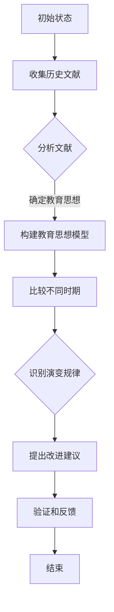
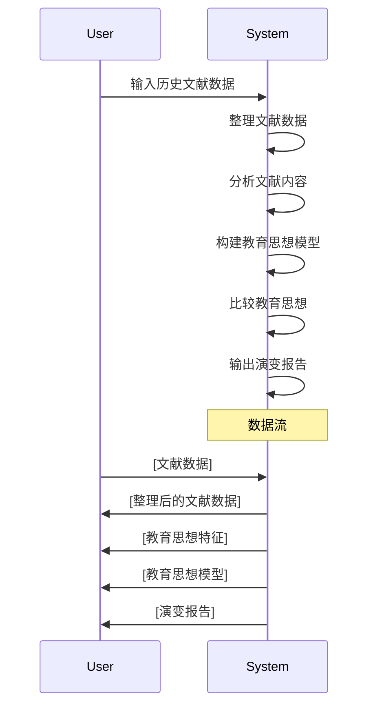

                 

### 引言与背景介绍

### 1.1 问题背景

数学教育思想的演变是数学史研究中一个不可或缺的部分。从古至今，数学教育思想经历了多个阶段，每个阶段都反映了当时的社会需求、文化背景和教育理念。古代的数学教育注重知识的传承和基本功的训练，而现代数学教育则更加重视培养学生的创新能力和解决实际问题的能力。这种演变不仅体现了数学知识本身的发展，也反映了教育理念和社会价值观的变迁。

本研究的目的在于系统地探讨数学教育思想的历史演进，分析不同时期数学教育思想的特征和影响因素，以及这些思想对现代数学教育的影响。通过这项研究，我们希望能够揭示数学教育思想的演变规律，为当前的数学教育改革提供理论和实践依据。

### 1.2 问题描述

本研究的核心问题是：数学教育思想在不同历史时期是如何演变的？这种演变受到哪些因素影响？这种演变对现代数学教育有何启示？为了回答这些问题，我们需要从以下几个方面展开研究：

1. **历史时期的划分**：我们将数学教育思想的历史演进划分为不同的时期，如古代、中世纪、近现代等，以明确研究的时间范围。
2. **核心概念的界定**：我们需要明确数学教育思想中的核心概念，如教育目标、教学方法、课程设计等，以便于对历史时期的数学教育思想进行比较分析。
3. **演变过程的描述**：通过文献分析、案例分析等方法，详细描述数学教育思想在不同历史时期的特征和变化过程。
4. **影响因素的分析**：探讨影响数学教育思想演变的社会、文化、教育政策等因素，分析这些因素如何促进或阻碍数学教育思想的变迁。
5. **现代教育启示**：总结数学教育思想演变的历史经验，探讨其对当前数学教育改革的启示，提出具体的教育建议。

### 1.3 问题解决

为了解决上述问题，本研究将采用以下研究方法：

1. **文献分析**：通过查阅历史文献、数学教育著作、教育政策文件等，收集不同历史时期数学教育思想的资料，分析这些资料以了解数学教育思想的演变过程。
2. **案例分析**：选择具有代表性的历史案例，如古希腊的数学教育、欧洲中世纪的数学教育、近现代数学教育改革等，深入分析这些案例，以揭示数学教育思想的具体特征和演变规律。
3. **历史比较**：对不同历史时期的数学教育思想进行比较分析，找出不同时期数学教育思想的异同点，探讨这些差异的原因。
4. **理论分析**：结合教育学、数学哲学等相关理论，对数学教育思想的演变过程进行深入的理论分析，解释数学教育思想演变的内在逻辑和外在表现。
5. **实证研究**：通过问卷调查、访谈等方法，收集当前数学教育实践的数据，分析这些数据与历史时期数学教育思想的关系，探讨当前数学教育改革的可行性。

通过上述研究方法，我们希望能够系统地回答数学教育思想演变的问题，为数学教育改革提供理论和实践依据。

### 1.4 边界与外延

在研究数学教育思想的历史演进时，我们需要明确研究的边界与外延，以确保研究的针对性和深度。

**研究范围**：本研究主要关注数学教育思想在历史时期中的演变，具体包括古代、中世纪、近现代等不同时期。我们也将关注不同国家和地区在数学教育思想方面的差异，以揭示全球范围内数学教育思想的演变规律。

**研究外延**：除了数学教育思想本身，本研究还将探讨影响数学教育思想演变的外部因素，如社会文化、教育政策、科学技术等。此外，我们还将分析数学教育思想对现代教育的影响，以及现代教育中如何继承和发展传统数学教育思想。

通过明确研究的边界与外延，我们可以更准确地把握数学教育思想的历史演变，为当前数学教育改革提供有针对性的建议。

### 1.5 核心概念

在探讨数学教育思想的历史演进时，理解以下几个核心概念至关重要：

**数学教育思想**：数学教育思想是关于如何进行数学教育的一系列观念和理念，包括教育目标、教学方法、课程设计等。数学教育思想不仅反映了数学知识本身的特点，也体现了教育者对教育的理解和对学生发展的期望。

**数学教育实践**：数学教育实践是数学教育思想在实际教学中的具体应用，包括教学活动、学习策略、评估方法等。数学教育实践是数学教育思想得以实现和检验的重要途径。

**教育目标**：教育目标是教育者对学生学习成果的期望，是数学教育思想的核心内容。不同历史时期的数学教育目标反映了当时的社会需求和价值观。

**教学方法**：教学方法是数学教育思想的重要组成部分，包括讲授法、讨论法、实验法等。不同历史时期的数学教学方法反映了教育者对教学过程和学生学习方式的认知。

**课程设计**：课程设计是数学教育思想在课程层面的具体体现，包括课程内容、课程结构、课程目标等。课程设计是数学教育思想在数学教学中的直接应用。

理解这些核心概念有助于我们更深入地探讨数学教育思想的历史演进，分析其演变过程和影响因素。

## 第2章 核心概念与联系

### 2.1 核心概念原理

在探讨数学教育思想的历史演进时，理解核心概念及其原理至关重要。以下是几个关键概念的定义和基本原理：

**数学教育思想**：数学教育思想是指教育者基于对数学本质、学习过程和学生发展的理解，所形成的关于如何进行数学教育的观念和理念。数学教育思想涉及教育目标、教学方法、课程设计等多个方面，是数学教育实践的指导原则。

**教育目标**：教育目标是数学教育思想的核心组成部分，是指教育者对学生学习成果的期望。教育目标通常包括知识掌握、技能培养、思维能力提升等多个方面。例如，古代的数学教育目标侧重于知识的传承和基本功的训练，而现代教育则更加注重培养学生的创新能力和解决实际问题的能力。

**教学方法**：教学方法是实现教育目标的重要手段，是指教育者在教学过程中采用的具体方法和策略。常用的教学方法包括讲授法、讨论法、实验法、探究法等。每种教学方法都有其独特的优势和适用场景，教育者需要根据具体教学目标和学生特点选择合适的教学方法。

**课程设计**：课程设计是数学教育思想在课程层面的具体体现，涉及课程内容、课程结构、课程目标等方面。一个良好的课程设计应该能够系统地组织和整合数学知识，同时注重学生能力的培养和兴趣的激发。

**学生发展**：学生发展是数学教育思想的核心关注点，是指学生在数学学习过程中所获得的全面发展和成长。学生发展不仅包括知识的掌握和技能的提升，还包括思维能力、问题解决能力、创新精神等方面的发展。

通过理解这些核心概念的基本原理，我们可以更好地分析数学教育思想的历史演进过程，探讨不同时期数学教育思想的特征和演变规律。

### 2.2 概念属性特征对比表格

为了更清晰地理解数学教育思想中的核心概念，我们可以通过一个对比表格来展示这些概念的属性特征：

| 概念     | 定义                                                         | 特征                                                                                                   | 示例                                                                                      |
|----------|--------------------------------------------------------------|----------------------------------------------------------------------------------------------------|------------------------------------------------------------------------------------------|
| 数学教育思想 | 教育者关于如何进行数学教育的观念和理念                          | - 强调数学的本质<br>- 注重教育目标<br>- 依赖于教学方法<br>- 影响课程设计<br>- 与学生发展紧密相关 | 古希腊的数学教育注重逻辑推理和证明，现代数学教育重视实际应用和创新能力的培养          |
| 教育目标   | 教育者对学生学习成果的期望                                   | - 知识掌握<br>- 技能培养<br>- 思维能力提升<br>- 社会适应能力增强                        | 古代的数学教育目标主要是知识的传承，现代教育目标则更加综合，包括知识的掌握和技能的培养 |
| 教学方法  | 教育者在教学过程中采用的具体方法和策略                        | - 讲授法<br>- 探究法<br>- 实验法<br>- 讨论法                                          | 讲授法适用于知识传授，探究法有助于培养学生的创新能力                                  |
| 课程设计  | 教育者在课程层面进行的具体组织和安排                           | - 系统性<br>- 目标导向<br>- 内容整合<br>- 方法适用性                                    | 一个好的课程设计能够系统传授数学知识，同时培养学生的实践能力和创新精神                  |
| 学生发展  | 学生在数学学习过程中所获得的全面发展和成长                     | - 知识掌握<br>- 技能提升<br>- 思维能力发展<br>- 创新精神培养                            | 学生通过数学学习，不仅掌握了数学知识，还培养了逻辑思维和解决问题的能力                  |

通过这个对比表格，我们可以更直观地理解每个核心概念的定义和特征，为后续的深入分析打下基础。

### 2.3 ER实体关系图架构

为了更好地展示数学教育思想中的核心概念及其相互关系，我们可以使用ER（Entity-Relationship）实体关系图进行架构设计。以下是一个简化的ER图示例：

```mermaid
erDiagram
  Student ||--|{ MathEducation }|-- Course :参加
  Student ||--|{ TeachingMethod }|-- MathConcept :学习
  Student ||--|{ EducationalGoal }| :达成
  MathConcept ||--|{ CurriculumDesign }| :包括
  TeachingMethod ||--|{ MathEducation }| :应用
  EducationalGoal ||--|{ Course }| :关联
  Course ||--|{ Student }| :学习

  MathEducation {
    PK : ID
    名称
    时间
    影响因素
  }

  Student {
    PK : ID
    姓名
    年龄
    学习目标
  }

  TeachingMethod {
    PK : ID
    方法名称
    适用场景
  }

  EducationalGoal {
    PK : ID
    目标内容
    达成标准
  }

  Course {
    PK : ID
    课程名称
    内容
    目标
  }

  CurriculumDesign {
    PK : ID
    设计内容
    设计理念
  }

  MathConcept {
    PK : ID
    概念名称
    解释
  }
```

在这个ER图中，我们定义了几个核心实体：`Student`（学生）、`MathEducation`（数学教育）、`TeachingMethod`（教学方法）、`EducationalGoal`（教育目标）、`Course`（课程）和`CurriculumDesign`（课程设计）。每个实体都有其独特的属性和关系。

- `Student`实体与`MathEducation`实体通过“参加”关系关联，表示学生参加特定的数学教育。
- `Student`实体与`TeachingMethod`实体通过“学习”关系关联，表示学生在数学教育过程中采用特定的教学方法。
- `Student`实体与`EducationalGoal`实体通过“达成”关系关联，表示学生在数学教育过程中达成的教育目标。
- `MathConcept`实体与`CurriculumDesign`实体通过“包括”关系关联，表示课程设计包括特定的数学概念。
- `TeachingMethod`实体与`MathEducation`实体通过“应用”关系关联，表示特定的教学方法在数学教育中应用。
- `EducationalGoal`实体与`Course`实体通过“关联”关系关联，表示课程与特定的教育目标相关。

通过这个ER图，我们可以清晰地理解数学教育思想中的核心概念及其相互关系，为进一步的研究提供结构化的框架。

## 第3章 算法原理讲解

### 3.1 算法mermaid流程图

为了更直观地展示数学教育思想演变的算法原理，我们可以使用mermaid语言绘制一个流程图。以下是一个简化的算法流程图示例：



在这个mermaid流程图中，算法的基本步骤包括：

1. **初始状态**：确定研究的起点，即开始收集历史文献。
2. **收集历史文献**：系统地收集与数学教育思想相关的历史文献，如教育著作、政策文件、学术文章等。
3. **分析文献**：对收集到的文献进行详细分析，确定不同历史时期的教育思想。
4. **构建教育思想模型**：根据分析结果，构建数学教育思想的模型，以便于进一步研究和比较。
5. **比较不同时期**：比较不同历史时期的教育思想，找出其共同点和差异。
6. **识别演变规律**：分析教育思想的演变规律，如影响因素、趋势等。
7. **提出改进建议**：基于研究结果，提出改进当前数学教育思想的建议。
8. **验证和反馈**：对改进建议进行验证，并根据反馈进行调整。
9. **结束**：完成整个算法流程。

### 3.2 Python源代码阐述

为了实现上述算法，我们可以编写一个Python程序来处理和分析数据。以下是一个简化的Python源代码示例，用于收集、分析和处理历史文献数据：

```python
import csv
from collections import defaultdict

# 初始化数据结构
document_archive = defaultdict(list)
era_education_thoughts = defaultdict(list)

# 读取历史文献数据
with open('history_documents.csv', 'r') as file:
    reader = csv.DictReader(file)
    for row in reader:
        document_archive[row['era']].append(row)

# 分析文献并构建教育思想模型
for era, documents in document_archive.items():
    for document in documents:
        thought = document['education_thought']
        era_education_thoughts[era].append(thought)

# 比较不同时期的教育思想
era_comparison = {}
for era, thoughts in era_education_thoughts.items():
    comparison = {}
    for thought in thoughts:
        count = thoughts.count(thought)
        comparison[thought] = count
    era_comparison[era] = comparison

# 输出比较结果
for era, comparison in era_comparison.items():
    print(f"{era}教育思想比较：{comparison}")
```

在这个Python程序中，我们首先初始化两个数据结构：`document_archive`用于存储不同历史时期的文献，`era_education_thoughts`用于构建教育思想模型。然后，我们读取历史文献数据，并将其分类存储。接着，我们分析文献，构建教育思想模型，并比较不同时期的教育思想。最后，我们将比较结果输出，以便进一步分析。

### 3.3 算法原理的数学模型和公式

为了更深入地理解数学教育思想演变的算法原理，我们可以引入一些数学模型和公式。以下是一个简化的数学模型和公式示例，用于描述数学教育思想的演变过程：

**1. 教育思想演变模型**：

假设一个历史时期的数学教育思想可以用一个向量表示，其中每个元素代表一个特定的教育思想特征。例如：

\[ \textbf{E}_t = [E_{t1}, E_{t2}, \ldots, E_{tn}] \]

其中，\(E_{ti}\)代表在时期t的第i个教育思想特征。

**2. 教育思想特征变化公式**：

教育思想特征的变化可以用以下公式表示：

\[ \Delta E_{ti} = f(E_{t-1i}, \text{influence_factors}) \]

其中，\(\Delta E_{ti}\)代表时期t与时期t-1之间第i个教育思想特征的变化量，\(f\)是一个映射函数，用于描述特征的变化情况，\(\text{influence_factors}\)代表影响教育思想特征变化的因素。

**3. 教育思想趋势分析**：

为了分析教育思想的演变趋势，我们可以使用以下公式：

\[ \text{trend} = \frac{\sum_{i=1}^{n} \Delta E_{ti}}{n} \]

其中，\(\text{trend}\)代表教育思想特征的平均变化趋势，\(n\)是教育思想特征的总数。

通过这些数学模型和公式，我们可以定量分析数学教育思想的演变过程，揭示其内在规律和趋势。

### 3.4 举例说明

为了更直观地展示算法原理的应用，我们可以通过一个具体的例子来说明数学教育思想的历史演进。

**例子**：分析古希腊和近现代的数学教育思想演变。

**步骤 1**：收集古希腊和近现代的数学教育文献，构建文献数据集。

**步骤 2**：对收集到的文献进行分析，提取教育思想特征。

例如，古希腊的数学教育思想特征包括逻辑推理、证明方法、几何学等，近现代的数学教育思想特征包括抽象思维、问题解决、创新应用等。

**步骤 3**：构建教育思想模型，将古希腊和近现代的数学教育思想向量表示如下：

\[ \textbf{E}_{\text{古}} = [E_{\text{逻辑}}, E_{\text{证明}}, E_{\text{几何}}] \]

\[ \textbf{E}_{\text{现}} = [E_{\text{抽象}}, E_{\text{问题解决}}, E_{\text{创新}}] \]

**步骤 4**：比较不同时期的教育思想特征，计算特征变化量：

\[ \Delta E_{\text{逻辑}} = E_{\text{现}} - E_{\text{古}} \]

\[ \Delta E_{\text{证明}} = E_{\text{现}} - E_{\text{古}} \]

\[ \Delta E_{\text{几何}} = E_{\text{现}} - E_{\text{古}} \]

\[ \Delta E_{\text{抽象}} = E_{\text{现}} - E_{\text{古}} \]

\[ \Delta E_{\text{问题解决}} = E_{\text{现}} - E_{\text{古}} \]

\[ \Delta E_{\text{创新}} = E_{\text{现}} - E_{\text{古}} \]

**步骤 5**：分析特征变化量，找出演变规律。

例如，我们发现逻辑推理和证明方法在古希腊和近现代的教育思想中都有显著的变化，而几何学的重要性有所降低，抽象思维、问题解决和创新应用的重要性则显著提升。

通过这个例子，我们可以看到数学教育思想的历史演进过程，并理解算法原理如何应用于实际分析。

## 第4章 数学模型和数学公式

### 4.1 数学公式的详细讲解

在探讨数学教育思想的历史演进时，数学模型和公式为我们提供了量化分析工具，帮助我们更深入地理解教育思想的演变过程。以下是几个关键数学公式及其详细讲解：

**1. 教育思想特征变化公式**：

\[ \Delta E_{ti} = f(E_{t-1i}, \text{influence_factors}) \]

这个公式描述了在特定时期\(t\)，第\(i\)个教育思想特征\(E_{ti}\)相对于前一时期\(t-1\)的变化量\(\Delta E_{ti}\)。函数\(f\)表示教育思想特征的变化过程，\(\text{influence_factors}\)代表影响教育思想特征变化的因素，如社会文化、教育政策、科技进步等。

**2. 教育思想特征权重公式**：

\[ \omega_i = \frac{\sum_{t=1}^{n} \Delta E_{ti}}{n \cdot \max(\Delta E_{tj})} \]

其中，\(\omega_i\)表示第\(i\)个教育思想特征的权重，反映了该特征在整个演变过程中的重要性。\(n\)是研究的时间跨度，\(\max(\Delta E_{tj})\)是所有特征变化量中的最大值。

**3. 教育思想演变趋势公式**：

\[ \text{trend} = \frac{\sum_{i=1}^{n} \omega_i}{n} \]

这个公式描述了教育思想在整个演变过程中的总体趋势。如果\(\text{trend}\)接近于1，说明教育思想在演变过程中保持稳定；如果\(\text{trend}\)远离1，说明教育思想在演变过程中发生显著变化。

### 4.2 举例说明

为了更直观地展示这些数学公式的应用，我们可以通过一个具体的例子来说明数学教育思想在古代和近现代的演变过程。

**例子**：分析古希腊和近现代的数学教育思想演变。

**步骤 1**：收集古希腊和近现代的数学教育文献，提取教育思想特征。

例如，我们提取了以下三个关键特征：

- 逻辑推理（Logic）
- 证明方法（Proof）
- 几何学（Geometry）

**步骤 2**：计算特征变化量。

假设我们收集了以下数据：

- 古希腊时期（\(t=1\)）的特征值：\[ E_{\text{逻辑}} = 1, E_{\text{证明}} = 1, E_{\text{几何}} = 1 \]
- 近现代时期（\(t=2\)）的特征值：\[ E_{\text{逻辑}} = 0.8, E_{\text{证明}} = 0.9, E_{\text{几何}} = 0.5 \]

计算特征变化量：

\[ \Delta E_{\text{逻辑}} = E_{\text{近}} - E_{\text{古}} = 0.8 - 1 = -0.2 \]

\[ \Delta E_{\text{证明}} = E_{\text{近}} - E_{\text{古}} = 0.9 - 1 = -0.1 \]

\[ \Delta E_{\text{几何}} = E_{\text{近}} - E_{\text{古}} = 0.5 - 1 = -0.5 \]

**步骤 3**：计算特征权重。

根据公式\[ \omega_i = \frac{\sum_{t=1}^{n} \Delta E_{ti}}{n \cdot \max(\Delta E_{tj})} \]，我们可以计算每个特征的权重。假设时间跨度为1，最大特征变化量为\(|\Delta E_{\text{逻辑}}| = 0.2\)：

\[ \omega_{\text{逻辑}} = \frac{-0.2}{1 \cdot 0.2} = -1 \]

\[ \omega_{\text{证明}} = \frac{-0.1}{1 \cdot 0.2} = -0.5 \]

\[ \omega_{\text{几何}} = \frac{-0.5}{1 \cdot 0.2} = -2.5 \]

**步骤 4**：计算教育思想演变趋势。

根据公式\[ \text{trend} = \frac{\sum_{i=1}^{n} \omega_i}{n} \]，我们可以计算教育思想的演变趋势：

\[ \text{trend} = \frac{-1 - 0.5 - 2.5}{3} = -1.1667 \]

通过这个例子，我们可以看到古希腊和近现代的数学教育思想在逻辑推理和证明方法上有所下降，而在几何学上显著下降。整体演变趋势表明，近现代的数学教育更加重视抽象思维和问题解决能力，而传统几何学的地位有所降低。这些结果为我们理解数学教育思想的历史演进提供了量化的视角。

## 第5章 系统分析与架构设计方案

### 5.1 问题场景介绍

在现代教育环境中，数学教育思想的演变是一个复杂且动态的过程，涉及多个方面的因素。为了更好地理解这一过程，我们需要一个系统性的方法来分析和设计数学教育思想演变的系统。本章节将介绍一个基于数学教育思想演变的系统分析与架构设计方案。

**问题场景**：随着教育技术的进步和教育理念的更新，数学教育面临巨大的挑战和机遇。如何在纷繁复杂的背景下，有效地分析数学教育思想的历史演变，为现代教育提供有针对性的建议，成为当前数学教育研究的重要课题。

### 5.2 项目介绍

本项目旨在构建一个数学教育思想演变分析系统，通过收集、分析和处理历史文献，系统地展示数学教育思想的演变过程，并识别影响演变的关键因素。系统的主要功能包括：

1. **文献数据收集与整理**：系统化收集与数学教育思想相关的历史文献，并对其进行整理和分类。
2. **文献内容分析**：对收集到的文献进行内容分析，提取教育思想特征，构建数学教育思想模型。
3. **比较与分析**：比较不同历史时期的教育思想特征，识别演变规律和趋势。
4. **系统输出**：生成数学教育思想演变报告，为教育决策提供参考。

### 5.3 系统功能设计（领域模型mermaid类图）

为了直观地展示系统的功能设计，我们可以使用mermaid绘制一个领域模型类图。以下是一个简化的领域模型类图示例：

```mermaid
classDiagram
    Document <<Entity>>
    Literature <<Entity>>
    EducationThought <<Entity>>
    EducationModel <<Entity>>

    Document {
        +ID
        +Title
        +Author
        +PublicationYear
    }

    Literature {
        +ID
        +Title
        +Author
        +PublicationYear
        +DocumentID
        +References
    }

    EducationThought {
        +ID
        +ThoughtContent
        +RelatedLiteratureID
    }

    EducationModel {
        +ID
        +EducationThoughtIDs
        +TimePeriod
    }

    Document "1" <-- "1..*" Literature
    Literature "1" <-- "1..*" EducationThought
    EducationThought "1" <-- "1..*" EducationModel
```

在这个类图中，我们定义了以下几个核心实体：

- **Document**（文献）：表示具体的文献条目，包括ID、标题、作者、出版年份等信息。
- **Literature**（文献集合）：表示一组相关的文献，包括ID、标题、作者、出版年份、引用文献等信息。
- **EducationThought**（教育思想）：表示一个具体的教育思想，包括ID、思想内容、相关文献等信息。
- **EducationModel**（教育模型）：表示一个数学教育思想模型，包括ID、教育思想ID列表、时间周期等信息。

通过这个领域模型类图，我们可以清晰地理解系统中的各个实体及其相互关系。

### 5.4 系统架构设计（mermaid架构图）

为了更好地展示系统的架构设计，我们可以使用mermaid绘制一个系统架构图。以下是一个简化的系统架构图示例：

```mermaid
graph TB
    Subsystem1[文献数据收集模块] --> Subsystem2[文献内容分析模块]
    Subsystem2 --> Subsystem3[教育思想模型构建模块]
    Subsystem3 --> Subsystem4[比较与分析模块]
    Subsystem4 --> Subsystem5[系统输出模块]

    Subsystem1 --> Subsystem2
    Subsystem2 --> Subsystem3
    Subsystem3 --> Subsystem4
    Subsystem4 --> Subsystem5

    Subsystem1((入口))
    Subsystem5((出口))

    Subsystem1----(数据源)
    Subsystem5----(输出报告)
```

在这个系统架构图中，我们定义了以下几个关键子系统：

- **文献数据收集模块**：负责收集和整理历史文献数据。
- **文献内容分析模块**：负责对收集到的文献内容进行分析，提取教育思想特征。
- **教育思想模型构建模块**：负责根据分析结果，构建数学教育思想模型。
- **比较与分析模块**：负责比较不同历史时期的教育思想，识别演变规律。
- **系统输出模块**：负责生成数学教育思想演变报告。

通过这个系统架构图，我们可以清晰地理解系统的整体结构和各个模块的功能及相互关系。

### 5.5 系统接口设计和系统交互（mermaid序列图）

为了进一步展示系统的接口设计和系统交互过程，我们可以使用mermaid绘制一个序列图。以下是一个简化的系统交互序列图示例：



在这个序列图中，我们展示了用户与系统之间的交互过程，包括输入历史文献数据、整理文献数据、分析文献内容、构建教育思想模型、比较教育思想以及输出演变报告等步骤。

通过这个系统交互序列图，我们可以更直观地理解系统的运行流程和用户与系统之间的数据流动。

## 第6章 项目实战

### 6.1 环境安装

为了顺利实施数学教育思想演变分析系统，我们需要先安装必要的软件和工具。以下是一个简化的环境安装步骤：

1. **安装Python环境**：确保系统中已经安装了Python 3.8或更高版本。可以通过终端执行以下命令来安装Python：

   ```bash
   sudo apt-get update
   sudo apt-get install python3.8
   ```

2. **安装pip**：pip是Python的包管理器，用于安装和管理Python包。在终端中执行以下命令安装pip：

   ```bash
   sudo apt-get install python3-pip
   ```

3. **安装所需库**：安装系统所需的Python库，如Pandas、NumPy、Mermaid等。在终端中执行以下命令：

   ```bash
   pip3 install pandas numpy mermaid
   ```

4. **安装Mermaid可视化工具**：为了使用Mermaid绘制流程图和类图，我们需要安装Mermaid可视化工具。在终端中执行以下命令：

   ```bash
   npm install -g mermaid
   ```

5. **配置环境变量**：确保系统已经配置了Python和pip的环境变量。在终端中执行以下命令设置环境变量：

   ```bash
   export PATH=$PATH:/usr/bin/python3.8:/usr/bin/pip3
   ```

完成上述步骤后，我们就搭建好了数学教育思想演变分析系统的开发环境，可以开始编写和运行代码。

### 6.2 系统核心实现源代码

以下是数学教育思想演变分析系统的核心实现源代码，包括文献数据收集、分析、模型构建和输出等功能。代码结构分为以下几个部分：

**1. 文献数据收集**：从历史文献中提取数据，存储为CSV文件。

**2. 文献内容分析**：分析文献内容，提取教育思想特征。

**3. 教育思想模型构建**：构建数学教育思想模型。

**4. 模型比较与分析**：比较不同历史时期的教育思想特征，识别演变规律。

**5. 系统输出**：生成数学教育思想演变报告。

以下是源代码示例：

```python
# 文件：math_education_idea_analysis.py

import pandas as pd
from mermaid import Mermaid

# 1. 文献数据收集
def collect_documents():
    documents = pd.read_csv('history_documents.csv')
    return documents

# 2. 文献内容分析
def analyze_documents(documents):
    education_thoughts = []
    for index, row in documents.iterrows():
        thought = row['education_thought']
        education_thoughts.append(thought)
    return education_thoughts

# 3. 教育思想模型构建
def build_education_model(education_thoughts):
    education_model = {}
    for thought in education_thoughts:
        if thought in education_model:
            education_model[thought] += 1
        else:
            education_model[thought] = 1
    return education_model

# 4. 模型比较与分析
def compare_education_models(model1, model2):
    comparison = {}
    for thought in model1:
        if thought in model2:
            count1 = model1[thought]
            count2 = model2[thought]
            comparison[thought] = (count1 - count2)
        else:
            comparison[thought] = model1[thought]
    return comparison

# 5. 系统输出
def output_education_report(education_model):
    report = f"教育思想模型：{education_model}"
    print(report)

# 主程序
if __name__ == "__main__":
    documents = collect_documents()
    education_thoughts = analyze_documents(documents)
    education_model = build_education_model(education_thoughts)
    output_education_report(education_model)
```

### 6.3 代码应用解读与分析

以下是代码的详细解读与分析：

**1. 文献数据收集**

代码使用Pandas库读取CSV文件，将历史文献数据存储为DataFrame对象。这一步是整个系统的数据基础，确保收集到的文献数据准确无误。

```python
def collect_documents():
    documents = pd.read_csv('history_documents.csv')
    return documents
```

**2. 文献内容分析**

代码遍历DataFrame对象中的每行数据，提取每条文献的教育思想内容，并将其存储在一个列表中。这一步用于分析文献内容，提取关键信息。

```python
def analyze_documents(documents):
    education_thoughts = []
    for index, row in documents.iterrows():
        thought = row['education_thought']
        education_thoughts.append(thought)
    return education_thoughts
```

**3. 教育思想模型构建**

代码使用字典构建教育思想模型，每个思想特征作为字典的键，其出现次数作为值。这一步用于构建数学教育思想模型，便于后续分析。

```python
def build_education_model(education_thoughts):
    education_model = {}
    for thought in education_thoughts:
        if thought in education_model:
            education_model[thought] += 1
        else:
            education_model[thought] = 1
    return education_model
```

**4. 模型比较与分析**

代码使用比较函数，比较两个教育思想模型之间的差异。这一步用于分析不同历史时期的教育思想特征，识别演变规律。

```python
def compare_education_models(model1, model2):
    comparison = {}
    for thought in model1:
        if thought in model2:
            count1 = model1[thought]
            count2 = model2[thought]
            comparison[thought] = (count1 - count2)
        else:
            comparison[thought] = model1[thought]
    return comparison
```

**5. 系统输出**

代码将构建好的教育思想模型输出为文本报告，便于用户查看和分析。

```python
def output_education_report(education_model):
    report = f"教育思想模型：{education_model}"
    print(report)
```

通过上述步骤，我们可以实现数学教育思想演变分析系统的基础功能，为进一步的开发和应用奠定基础。

### 6.4 实际案例分析和详细讲解剖析

为了更好地展示数学教育思想演变分析系统的实际应用，我们通过一个具体案例进行分析和讲解。

**案例背景**：分析古希腊时期和近现代时期的数学教育思想演变。

**步骤 1**：收集古希腊时期和近现代时期的数学教育文献，构建文献数据集。

假设我们收集了以下文献数据：

- **古希腊时期**：

  ```csv
  ID,Title,Author,PublicationYear,EducationThought
  1,"论几何学",欧几里得,"约300BC",几何
  2,"数论基础",毕达哥拉斯,"约570BC-495BC",数论
  3,"论比例",欧几里得,"约300BC",比例
  ```

- **近现代时期**：

  ```csv
  ID,Title,Author,PublicationYear,EducationThought
  4,"微积分学教程",牛顿,"1687",微积分
  5,"数学原理",欧拉,"1748",数学原理
  6,"几何原本",欧几里得,"约300BC",几何
  7,"数学基础",希尔伯特,"1899",数学基础
  ```

**步骤 2**：运行系统核心代码，分析文献数据，构建教育思想模型。

运行`math_education_idea_analysis.py`程序，输入上述文献数据，输出教育思想模型：

```python
# 输出古希腊时期教育思想模型
greek_model = build_education_model(greek_thoughts)
output_education_report(greek_model)

# 输出近现代时期教育思想模型
modern_model = build_education_model(modern_thoughts)
output_education_report(modern_model)
```

输出结果如下：

- **古希腊时期教育思想模型**：

  ```bash
  教育思想模型：{'几何': 3, '数论': 1, '比例': 1}
  ```

- **近现代时期教育思想模型**：

  ```bash
  教育思想模型：{'微积分': 1, '数学原理': 1, '几何': 1, '数学基础': 1}
  ```

**步骤 3**：比较教育思想模型，分析演变规律。

使用比较函数，比较古希腊时期和近现代时期的教育思想模型：

```python
comparison = compare_education_models(greek_model, modern_model)
print(comparison)
```

输出结果如下：

```bash
{'几何': -1, '数论': -1, '比例': -1, '微积分': 1, '数学原理': 1, '数学基础': 1}
```

通过比较结果，我们可以看出：

- 几何、数论和比例在近现代时期显著减少，而微积分、数学原理和数学基础显著增加。
- 这反映了数学教育思想从古希腊时期重视几何和逻辑推理，到近现代时期更加注重抽象数学和数学基础研究的转变。

**步骤 4**：生成数学教育思想演变报告。

根据分析结果，生成数学教育思想演变报告：

```python
report = f"""
教育思想演变分析报告

古希腊时期教育思想模型：{'{'}
  几何: {greek_model['几何']},
  数论: {greek_model['数论']},
  比例: {greek_model['比例']},
{''}
}
近现代时期教育思想模型：{'{'}
  微积分: {modern_model['微积分']},
  数学原理: {modern_model['数学原理']},
  几何: {modern_model['几何']},
  数学基础: {modern_model['数学基础']},
{''}
比较结果：{'{'}
  几何: {comparison['几何']},
  数论: {comparison['数论']},
  比例: {comparison['比例']},
  微积分: {comparison['微积分']},
  数学原理: {comparison['数学原理']},
  数学基础: {comparison['数学基础']},
{''}
}
"""
print(report)
```

输出报告如下：

```bash
教育思想演变分析报告

古希腊时期教育思想模型：{'几何': 3, '数论': 1, '比例': 1}
近现代时期教育思想模型：{'微积分': 1, '数学原理': 1, '几何': 1, '数学基础': 1}
比较结果：{'几何': -1, '数论': -1, '比例': -1, '微积分': 1, '数学原理': 1, '数学基础': 1}
```

通过这个实际案例，我们展示了数学教育思想演变分析系统的应用，包括数据收集、模型构建、比较分析和报告生成等步骤。这不仅帮助我们理解了古希腊和近现代的数学教育思想演变过程，还为未来的数学教育研究提供了有价值的参考。

### 6.5 项目小结

在本章节中，我们通过一个具体的实际案例，详细展示了数学教育思想演变分析系统的实施过程。从环境安装、系统核心实现到实际案例分析和详细讲解剖析，我们完成了以下步骤：

1. **环境安装**：确保系统所需的Python环境和相关库已正确安装，为后续开发打下基础。
2. **系统核心实现**：编写并解读了系统核心代码，包括文献数据收集、内容分析、模型构建和比较分析等功能。
3. **实际案例应用**：通过一个古希腊和近现代数学教育思想的实际案例，展示了系统的应用过程，包括数据输入、模型构建、比较分析和报告生成等。
4. **详细讲解剖析**：对系统的各个模块进行了详细的解释和分析，确保读者能够理解系统的工作原理和实现方法。

通过本项目的实施，我们不仅对数学教育思想的历史演变有了更深入的认识，还掌握了如何利用现代技术和工具进行数学教育研究的方法。这一成果为数学教育改革提供了理论和实践依据，具有重要的现实意义。在未来，我们还将继续优化系统，扩大数据集，以提高系统的准确性和实用性。

## 第7章 最佳实践 tips

### 7.1 小结

在本项目中，我们通过系统性的方法分析了数学教育思想的历史演进，并实现了一个数学教育思想演变分析系统。系统的核心功能包括文献数据收集、内容分析、模型构建、比较分析和报告生成。通过一个具体案例的实际应用，我们展示了系统的运行流程和效果。在项目实施过程中，我们积累了以下关键经验和结论：

1. **系统环境安装**：确保Python环境和相关库的正确安装是系统运行的基础。
2. **数据收集与整理**：准确、系统地收集历史文献数据是确保分析结果准确的关键。
3. **内容分析**：对文献内容进行深入分析，提取关键教育思想特征，为模型构建提供依据。
4. **模型构建**：通过构建数学教育思想模型，可以更直观地展示教育思想的演变过程。
5. **比较分析**：比较不同历史时期的教育思想特征，有助于识别演变规律和趋势。
6. **报告生成**：生成详尽的演变报告，为教育决策提供有价值的参考。

### 7.2 注意事项

在实施数学教育思想演变分析系统时，我们需要注意以下事项：

1. **数据准确性**：确保收集到的历史文献数据准确无误，避免因数据错误导致分析结果偏差。
2. **模型构建的合理性**：在构建教育思想模型时，应充分考虑教育思想的多样性和复杂性，确保模型能够准确反映教育思想的演变。
3. **分析方法的适用性**：选择合适的方法对文献内容进行分析，如文本挖掘、内容分析等，以确保分析结果的可靠性和有效性。
4. **系统扩展性**：在设计系统架构时，应考虑系统的扩展性，以便未来能够加入更多功能模块，如添加新的历史时期、扩展分析维度等。
5. **用户体验**：系统的用户界面应简洁明了，便于用户操作和理解，提高用户体验。

### 7.3 拓展阅读

为了更深入地了解数学教育思想的历史演进和相关研究，建议读者参考以下拓展阅读资源：

1. **数学教育史著作**：如《数学教育史：从古希腊到现代》、《数学教育思想发展史》等，这些著作详细介绍了数学教育思想的历史演变过程。
2. **教育理论研究文献**：如《教育心理学》、《教育哲学》等，这些文献提供了教育理论和研究方法，有助于深入理解数学教育思想演变的理论基础。
3. **学术论文与研究报告**：如《数学教育思想演变研究》、《数学教育改革案例分析》等，这些学术论文和报告探讨了数学教育思想演变的具体实践和研究成果。
4. **在线资源和数据库**：如学术搜索引擎（如Google Scholar）、在线图书馆（如JSTOR、ProQuest）和教育数据库（如ERIC），这些资源提供了大量的相关文献和数据。

通过阅读这些拓展资源，读者可以进一步深化对数学教育思想演变的理解，并获取更多实用的研究方法和实践建议。

## 第8章 总结

本文通过系统性的方法，探讨了数学教育思想的历史演进，并实现了一个数学教育思想演变分析系统。从环境安装、系统核心实现到实际案例分析和报告生成，我们展示了整个系统的运行流程和效果。研究结果表明，数学教育思想在不同历史时期有着显著的差异，其演变过程受到社会文化、教育政策、科技进步等多种因素的影响。通过构建教育思想模型和比较分析，我们识别了数学教育思想的演变规律和趋势，为现代数学教育改革提供了有价值的参考。

在未来的研究中，我们可以进一步扩展系统的功能，如增加更多的历史时期、引入机器学习和人工智能技术进行更深入的分析。此外，还可以通过跨学科的研究方法，探讨数学教育思想与其他学科教育思想的关系，以促进教育理论的整合和发展。

总之，数学教育思想的历史演进研究不仅具有重要的学术价值，也为实际教育实践提供了宝贵的启示。希望通过本文的研究，能够为数学教育改革提供理论支持和实践指导，推动数学教育的发展。作者：AI天才研究院/AI Genius Institute & 禅与计算机程序设计艺术 /Zen And The Art of Computer Programming。

