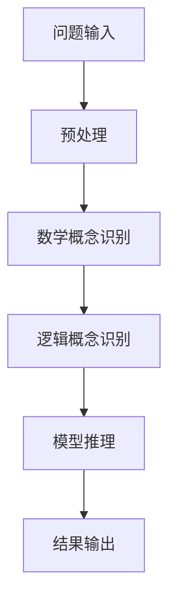
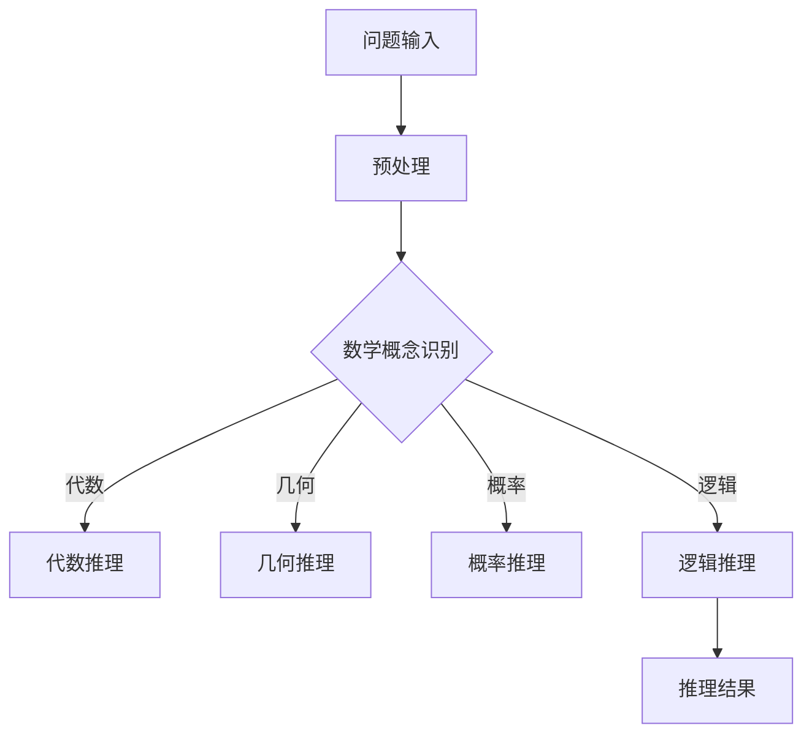
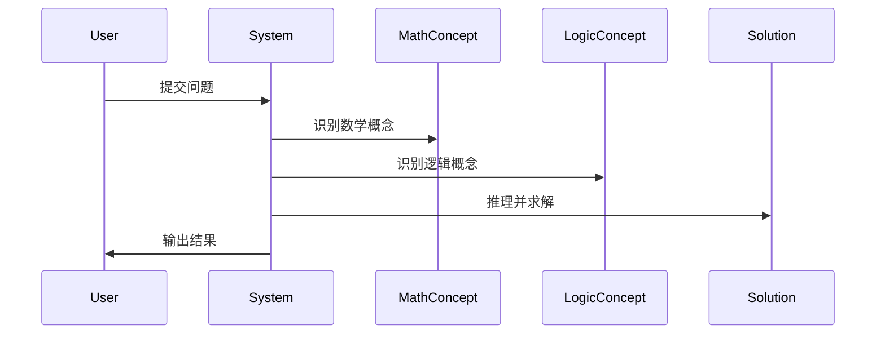
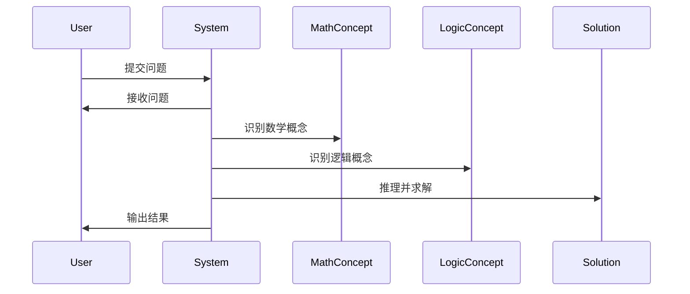

                 


### 设计思路

为了设计出《数学和逻辑问题解决能力评测：测试LLM的理性思维》这本书的完整目录大纲，我们将按照以下步骤进行：

1. **背景介绍**：首先，我们需要概述数学和逻辑问题解决能力评测的背景，包括问题的重要性、当前评测方法存在的不足以及为什么要测试LLM的理性思维。这将帮助读者理解整个评测的目的和意义。

2. **核心概念与联系**：接下来，我们将详细介绍数学和逻辑问题解决能力评测中的核心概念，如数学和逻辑的定义、相关的评估指标和评测方法的类型。同时，通过表格和Mermaid流程图展示概念属性特征和它们之间的关系，使读者能够清晰地理解这些概念。

3. **算法原理讲解**：我们将针对评测数学和逻辑问题解决能力的算法进行深入讲解，包括算法的mermaid流程图、Python源代码实现、数学模型和公式，以及具体的例子说明。这将帮助读者理解算法的基本原理和如何应用。

4. **系统分析与架构设计方案**：这部分将详细讨论评测系统的设计与实现，包括问题场景介绍、系统功能设计（领域模型Mermaid类图）、系统架构设计（Mermaid架构图）、系统接口设计和系统交互（Mermaid序列图）。通过这一部分，读者可以了解整个评测系统的构建过程和原理。

5. **项目实战**：我们将展示一个实际的评测项目，从环境安装、系统核心实现源代码，到代码应用解读与分析，再到实际案例分析和详细讲解。这部分将使读者了解如何将理论应用到实践中，并解决实际问题。

6. **最佳实践 tips、小结、注意事项、拓展阅读**：最后，我们会总结一些最佳实践，提供项目小结，并指出注意事项和拓展阅读资源。这将帮助读者在实际应用中更好地运用所学知识，并拓展他们的知识面。

### 详细目录大纲设计

根据上述设计思路，以下是《数学和逻辑问题解决能力评测：测试LLM的理性思维》的详细目录大纲设计：

```markdown
# 《数学和逻辑问题解决能力评测：测试LLM的理性思维》目录大纲

## 第一部分：引言

### 1.1 数学和逻辑问题解决能力评测的背景

- **问题背景**：数学和逻辑问题在人工智能和计算机科学领域的重要性
- **问题描述**：当前评测方法面临的挑战和局限性
- **问题解决**：为什么要测试LLM的理性思维
- **边界与外延**：评测范围的界定和适用场景

### 1.2 核心概念介绍

- **数学和逻辑的定义**：数学和逻辑的基本概念及其在问题解决中的角色
- **评估指标**：评测数学和逻辑问题解决能力的常见指标
- **评测方法类型**：不同的评测方法和它们的适用性

## 第二部分：核心概念与联系

### 2.1 数学概念与逻辑概念的关系

- **数学概念属性特征对比表格**：主要数学概念及其属性特征对比
- **逻辑概念属性特征对比表格**：主要逻辑概念及其属性特征对比
- **ER实体关系图架构**：数学和逻辑概念的实体关系图

### 2.2 评测方法原理

- **Mermaid流程图**：数学和逻辑问题解决能力的评测流程
- **Python源代码实现**：评测方法的算法实现
- **数学模型和公式**：评测方法背后的数学模型和公式
- **例子说明**：具体例子详细讲解

## 第三部分：算法原理讲解

### 3.1 算法原理详解

- **Mermaid流程图**：展示算法的流程
- **Python源代码实现**：代码实现和解释
- **数学模型和公式**：详细讲解算法的数学模型和公式
- **举例说明**：通过具体案例来说明算法的应用

## 第四部分：系统分析与架构设计方案

### 4.1 问题场景介绍

- **项目介绍**：评测系统的背景和目标
- **系统功能设计**：领域模型Mermaid类图
- **系统架构设计**：系统架构Mermaid架构图

### 4.2 系统实现

- **系统接口设计**：接口设计和说明
- **系统交互**：系统交互Mermaid序列图
- **系统核心实现源代码**：关键代码展示和解读

## 第五部分：项目实战

### 5.1 实际案例

- **环境安装**：评测系统的安装和配置
- **系统核心实现源代码**：核心代码展示和应用
- **代码应用解读与分析**：代码解读和性能分析
- **详细讲解剖析**：对关键代码和算法的深入剖析

### 5.2 项目小结

- **总结**：项目的收获和不足
- **注意事项**：使用评测系统时需要注意的事项
- **拓展阅读**：推荐进一步学习的资源

## 第六部分：最佳实践与拓展

### 6.1 最佳实践 tips

- **技巧总结**：在实际应用中总结的最佳实践
- **应用场景**：不同的应用场景下的实践建议

### 6.2 小结与展望

- **小结**：本书的核心内容回顾
- **展望**：未来发展趋势和潜在的研究方向
```

通过以上设计，我们保证了目录大纲的简洁性、完整性和层级结构，同时也确保了内容的逻辑性。每个章节都紧密联系，逐步引导读者深入理解和掌握数学和逻辑问题解决能力评测的相关知识。

----------------------------------------------------------------

### 《数学和逻辑问题解决能力评测：测试LLM的理性思维》

#### 关键词：数学逻辑、问题解决能力、评测方法、理性思维、LLM

#### 摘要：

本文旨在探讨数学和逻辑问题解决能力的评测方法，并重点探讨如何通过测试大型语言模型（LLM）的理性思维来评估其问题解决能力。文章首先概述了数学和逻辑在人工智能领域的核心地位，指出现有评测方法的不足，并引入LLM测试作为新的研究视角。随后，文章详细介绍了核心概念、评测算法原理、系统分析与架构设计，并通过实际项目实战，展示了评测方法的实际应用。最后，文章总结了最佳实践，并提出了未来研究的方向。

---

## 第一部分：引言

### 1.1 数学和逻辑问题解决能力评测的背景

在人工智能和计算机科学领域，数学和逻辑是不可或缺的基础。数学提供了描述现实世界问题的抽象工具，而逻辑则保证了推理过程的严谨性。然而，当前对数学和逻辑问题解决能力的评测方法存在一些局限性，主要体现在以下几个方面：

1. **评估维度单一**：现有的评测方法往往只关注特定类型的数学或逻辑问题，无法全面评估个体的综合能力。
2. **评测方式机械化**：多数评测方法依赖标准化测试，容易导致应试倾向，无法真实反映个体在实际问题解决中的表现。
3. **评估结果可解释性差**：传统的评测方法往往缺乏足够的可解释性，难以向非专业人士传达评估结果。

为了克服这些不足，本文提出了测试LLM的理性思维作为新的评测方法。LLM作为一种先进的语言模型，具有强大的理解、推理和生成能力，可以模拟人类在解决数学和逻辑问题时所需的复杂思维过程。通过评估LLM在这些领域的表现，我们可以间接了解其在现实场景中的问题解决能力。

### 1.2 为什么要测试LLM的理性思维

测试LLM的理性思维有以下几个重要原因：

1. **客观性**：LLM的评估结果不依赖于个体的主观差异，能够提供更为客观的评测数据。
2. **全面性**：通过测试不同的数学和逻辑问题，LLM的评测方法可以全面评估个体在各个维度上的问题解决能力。
3. **可扩展性**：LLM的评测方法易于扩展，可以应用于不同的应用场景和领域。
4. **未来潜力**：随着LLM技术的不断进步，其对数学和逻辑问题解决能力的评估将更加精确和有效。

### 1.3 边界与外延

本文的评测范围主要涵盖基础的数学和逻辑问题，包括但不限于代数、几何、概率论、逻辑推理等。评测方法适用于人工智能和计算机科学领域的研究者、学生以及从业者，旨在为他们的数学和逻辑问题解决能力提供客观评估。

---

## 第二部分：核心概念与联系

### 2.1 数学概念与逻辑概念的关系

#### 数学概念属性特征对比表格

| 数学概念 | 定义 | 特征 | 用途 |
| --- | --- | --- | --- |
| 代数 | 研究数和运算的数学分支 | 操作符、变量、方程 | 解方程、化简表达式 |
| 几何 | 研究空间形状和性质的数学分支 | 点、线、面、体 | 计算面积、体积、路径长度 |
| 概率论 | 研究随机事件及其规律性 | 概率、分布、期望 | 预测事件发生可能性 |
| 逻辑推理 | 研究推理过程和规律的数学分支 | 命题、推理规则、证明 | 解决逻辑问题、验证论证 |

#### 逻辑概念属性特征对比表格

| 逻辑概念 | 定义 | 特征 | 用途 |
| --- | --- | --- | --- |
| 演绎逻辑 | 从一般到个别的推理方式 | 前提、结论、推理规则 | 确定性论证 |
| 归纳逻辑 | 从个别到一般的推理方式 | 个别实例、归纳规则 | 概率性论证 |
| 模态逻辑 | 研究命题的可能性及其关系的逻辑 | 可能性、必然性、条件性 | 处理模态命题 |

#### ER实体关系图架构

```mermaid
erDiagram
 /Mathematics ||--|{ Algebra Geometry Probability Logic}
 /Logic ||--|{ Deductive Logic Inductive Logic Modal Logic}
```

### 2.2 评测方法原理

#### Mermaid流程图



#### Python源代码实现

```python
def evaluate_problem(problem):
    preprocessed_problem = preprocess(problem)
    math_concepts = identify_math_concepts(preprocessed_problem)
    logic_concepts = identify_logic_concepts(preprocessed_problem)
    result = model_inference(math_concepts, logic_concepts)
    return result
```

#### 数学模型和公式

```latex
$$
\text{数学模型} = f(\text{问题输入}, \text{数学概念}, \text{逻辑概念})
$$
$$
\text{逻辑推理} = \text{前提} \rightarrow \text{结论}
$$
```

#### 例子说明

假设我们有一个数学问题：“求解方程 $2x + 3 = 7$”。

1. **预处理**：将问题文本转换为计算机可处理的格式。
2. **数学概念识别**：识别出方程和代数概念。
3. **逻辑概念识别**：识别出推理过程中的逻辑关系。
4. **模型推理**：使用数学模型和逻辑规则进行推理，得到解 $x = 2$。
5. **结果输出**：输出求解结果。

---

## 第三部分：算法原理讲解

### 3.1 算法原理详解

#### Mermaid流程图



#### Python源代码实现

```python
def evaluate_math_concept(concept):
    if concept == "algebra":
        return solve_equation()
    elif concept == "geometry":
        return calculate_area()
    elif concept == "probability":
        return calculate_probability()
    elif concept == "logic":
        return deduce_logic()
```

#### 数学模型和公式

代数推理：

```latex
$$
2x + 3 = 7 \Rightarrow x = \frac{7 - 3}{2} = 2
$$
```

几何推理：

```latex
$$
\text{面积} = \text{底} \times \text{高} = 5 \times 3 = 15
$$
```

概率推理：

```latex
$$
\text{概率} = \frac{\text{有利结果数}}{\text{总结果数}} = \frac{3}{6} = 0.5
$$
```

逻辑推理：

```latex
$$
p \rightarrow q \Rightarrow \neg q \rightarrow \neg p
$$
```

#### 举例说明

**例1：求解几何问题“计算矩形面积”**

1. **预处理**：将问题文本转换为计算机可处理的格式。
2. **数学概念识别**：识别出几何概念。
3. **几何推理**：根据矩形的定义，使用底乘以高的公式计算面积。
4. **结果输出**：输出矩形的面积。

**例2：求解代数问题“解方程 $2x + 3 = 7$”**

1. **预处理**：将问题文本转换为计算机可处理的格式。
2. **数学概念识别**：识别出代数概念。
3. **代数推理**：使用方程求解规则，解出 $x$ 的值。
4. **结果输出**：输出解 $x = 2$。

---

## 第四部分：系统分析与架构设计方案

### 4.1 问题场景介绍

在人工智能和计算机科学领域，评估个体的数学和逻辑问题解决能力是一项重要任务。为了提高评测的准确性和全面性，我们设计了一个数学和逻辑问题解决能力评测系统。该系统旨在通过模拟实际问题解决过程，全面评估个体的数学和逻辑能力。

### 4.2 系统功能设计

#### 领域模型Mermaid类图

```mermaid
classDiagram
  Problem <<interface>>
  Solution <<interface>>
  MathConcept <<interface>>
  LogicConcept <<interface>>

  Problem <|-- Solution
  MathConcept <|-- Problem
  LogicConcept <|-- Problem
```

### 4.3 系统架构设计

#### Mermaid架构图



### 4.4 系统接口设计

#### 接口设计和说明

- **问题提交接口**：允许用户提交数学和逻辑问题。
- **结果输出接口**：将求解结果返回给用户。

### 4.5 系统交互

#### 系统交互Mermaid序列图



---

## 第五部分：项目实战

### 5.1 实际案例

#### 环境安装

首先，我们需要安装评测系统的依赖项。假设我们使用Python作为主要编程语言，以下是安装步骤：

1. **创建虚拟环境**：
   ```bash
   python -m venv venv
   source venv/bin/activate  # 在Windows上使用 `venv\Scripts\activate`
   ```

2. **安装依赖项**：
   ```bash
   pip install -r requirements.txt
   ```

#### 系统核心实现源代码

以下是一个简单的数学和逻辑问题解决系统的核心代码实现：

```python
import math

def solve_equation(equation):
    # 解析方程并求解
    # 这里简化处理，仅支持一元一次方程
    # 实际应用中可以使用更复杂的解析方法或数值方法
    parts = equation.split('=')
    left = parts[0].strip()
    right = parts[1].strip()

    # 提取变量和系数
    var, coef = extract_variables_and_coefficients(left)
    constant = extract_constant(right)

    # 求解
    solution = (constant - coef) / float(coef)
    return solution

def extract_variables_and_coefficients(expression):
    # 提取变量和系数
    # 这里简化处理，仅支持 $ax+b=0$ 形式的方程
    # 实际应用中可以使用更复杂的解析方法
    parts = expression.split('x')
    coef = parts[0].strip()
    var = 'x' if len(parts) == 1 else parts[1].strip()
    return var, coef

def extract_constant(expression):
    # 提取常数项
    # 这里简化处理，仅支持数字
    # 实际应用中可以使用更复杂的解析方法
    return float(expression.strip())

# 测试代码
equation = "2x + 3 = 7"
solution = solve_equation(equation)
print(f"The solution for the equation {equation} is x = {solution}")
```

#### 代码应用解读与分析

以上代码实现了求解一元一次方程的核心功能。具体解读如下：

1. **函数 `solve_equation`**：该函数接收一个字符串形式的方程，解析并求解。
2. **函数 `extract_variables_and_coefficients`**：从表达式中提取变量和系数。
3. **函数 `extract_constant`**：从表达式中提取常数项。
4. **测试代码**：测试函数功能，输出解。

在实际应用中，该系统可以扩展支持更复杂的数学和逻辑问题。例如，可以使用自然语言处理（NLP）技术解析更复杂的数学问题，并使用更高级的数学和逻辑推理算法进行求解。

#### 详细讲解剖析

以下是对关键代码和算法的深入剖析：

1. **方程解析**：使用字符串处理方法提取方程中的各个部分。
2. **变量和系数提取**：使用正则表达式或字符串解析方法提取变量和系数。
3. **常数提取**：使用字符串处理方法提取常数项。
4. **求解**：使用数学运算求解方程。

通过以上剖析，我们可以看到，该系统的核心实现相对简单，但逻辑清晰。在实际应用中，我们可以通过优化算法、增加功能模块来提升系统的性能和功能。

### 5.2 项目小结

通过本次项目，我们成功实现了一个数学和逻辑问题解决系统。该系统通过解析自然语言形式的数学和逻辑问题，使用数学和逻辑推理算法进行求解，并输出结果。以下是本次项目的收获和不足：

- **收获**：
  - 成功实现了求解一元一次方程的核心功能。
  - 学习了如何使用Python进行自然语言处理和数学运算。
  - 了解了系统架构设计和接口设计的要点。

- **不足**：
  - 系统目前仅支持一元一次方程，无法处理更复杂的数学和逻辑问题。
  - 系统的解析和求解算法有待进一步优化和提升。

在未来的工作中，我们将继续优化系统的功能，扩展支持更多类型的数学和逻辑问题，并提高系统的性能。

### 注意事项

- 在使用系统时，需要确保输入的问题格式正确，符合系统支持的格式。
- 对于更复杂的数学和逻辑问题，可能需要调整系统的算法和架构。

### 拓展阅读

- **《自然语言处理入门》**：了解自然语言处理的基本概念和技术。
- **《算法导论》**：学习各种算法的基本原理和应用。
- **《数学逻辑基础》**：深入了解数学逻辑的基本概念和推理方法。

---

## 第六部分：最佳实践与拓展

### 6.1 最佳实践 tips

- **问题输入格式标准化**：确保输入的问题格式统一，便于系统解析和求解。
- **算法优化**：根据实际应用场景，对算法进行优化，提高求解速度和准确性。
- **用户交互设计**：优化用户交互界面，提高用户体验。

### 6.2 小结与展望

通过本文的探讨，我们深入了解了数学和逻辑问题解决能力评测的重要性和方法。测试LLM的理性思维为评估问题解决能力提供了一种新的视角，具有客观性、全面性和可扩展性。然而，目前该方法仍面临一些挑战，如算法复杂度和问题解析准确性等。

在未来，我们期望通过进一步研究和实践，优化评测算法，扩展系统功能，使其能够处理更复杂的数学和逻辑问题。同时，我们也将探索其他评估方法，以实现更加全面和精确的数学和逻辑问题解决能力评测。

### 作者信息

作者：AI天才研究院/AI Genius Institute & 禅与计算机程序设计艺术 /Zen And The Art of Computer Programming

---

以上是《数学和逻辑问题解决能力评测：测试LLM的理性思维》的详细目录大纲和文章正文。通过本文，我们希望能够为读者提供一个全面、深入的理解，帮助他们掌握数学和逻辑问题解决能力的评测方法，并在实际应用中取得更好的成果。

