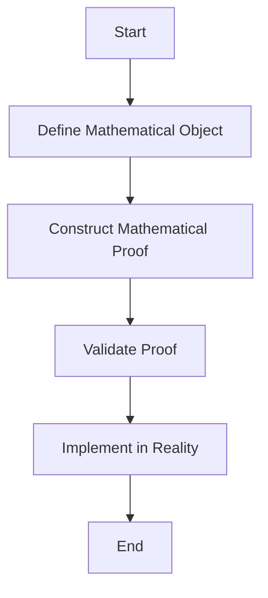
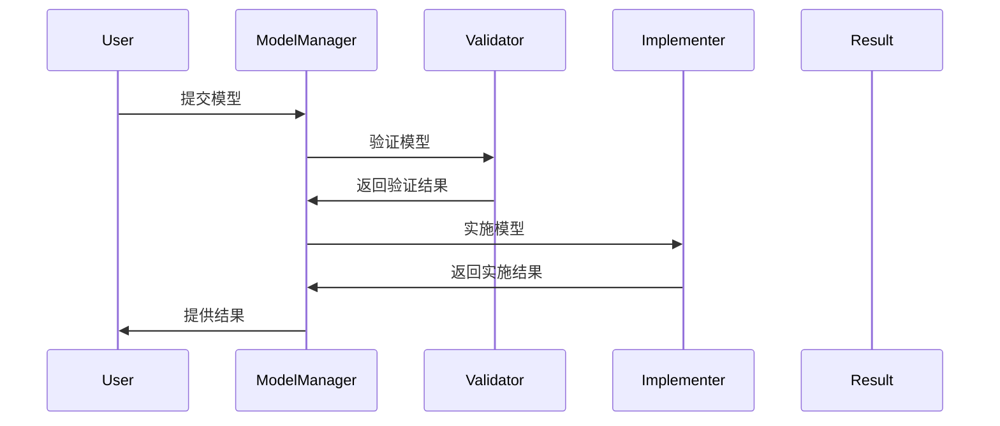
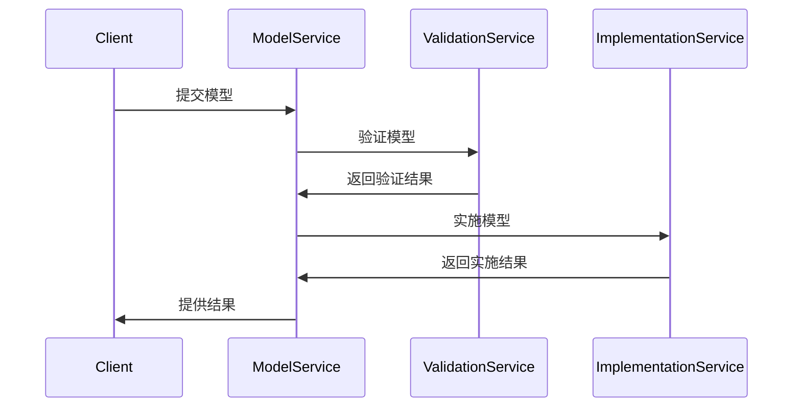

                 

### 数学哲学的主要流派概述

在数学哲学领域，不同的流派有着各自独特的哲学观点和理论体系。这些流派不仅帮助我们理解数学的本质，也为数学的发展提供了深刻的哲学基础。以下是数学哲学的主要流派及其核心观点的概述。

#### 第1章: 数学哲学的核心概念与问题背景

**1.1 数学哲学的定义与作用**

数学哲学是研究数学的本质、方法、以及数学与现实世界关系的一个哲学分支。它关注数学概念、证明、逻辑、以及数学知识的发展过程。

**1.2 数学哲学的主要问题**

- 数学的对象是什么？数学是否只研究抽象的概念，还是与具体现实有关？
- 数学的基础是什么？数学系统是否是自洽的，是否有漏洞或矛盾？
- 数学知识的性质是什么？数学知识是如何获得的，它是如何被证明为真实的？

**1.3 数学哲学的发展历程**

数学哲学的历史可以追溯到古希腊时期，当时哲学家们就开始探讨数学的基础和数学知识的性质。现代数学哲学的发展主要与形式逻辑、实证主义、经验主义、构造主义和唯物主义等哲学流派相关。

#### 第2章: 数学的逻辑基础

**2.1 形式逻辑与数学基础**

形式逻辑是数学哲学的重要基础。它关注符号和规则，以及如何从基本的假设推出结论。形式逻辑提供了证明数学命题的工具。

**2.2 归纳逻辑与数学证明**

归纳逻辑与形式逻辑不同，它通过观察特定情况的规律来推导一般结论。数学证明通常结合形式逻辑和归纳逻辑。

**2.3 数学逻辑的基本原理**

数学逻辑的基本原理包括自洽性、一致性、完备性和可计算性。这些原理确保了数学系统的可靠性和科学性。

#### 第3章: 实证主义与数学哲学

**3.1 实证主义的哲学基础**

实证主义认为，知识来源于经验，只有通过经验验证的才是真实的。在数学哲学中，实证主义强调数学与现实世界的联系。

**3.2 实证主义对数学的影响**

实证主义影响了数学的应用领域，如物理科学和工程学。它也促使数学家们关注数学模型的验证和实际应用。

**3.3 实证主义在数学哲学中的应用**

实证主义在数学哲学中的应用包括对数学模型的实证测试、数学理论的实验验证等。

#### 第4章: 经验主义与数学哲学

**4.1 经验主义的哲学基础**

经验主义认为，知识是通过感知和经验获得的。在数学哲学中，经验主义关注数学与感知世界的关系。

**4.2 经验主义对数学的影响**

经验主义对数学的影响体现在对数学应用领域的研究，如统计学和概率论。

**4.3 经验主义在数学哲学中的应用**

经验主义在数学哲学中的应用包括对数学理论的感知基础、数学模型的实证验证等。

#### 第5章: 构造主义与数学哲学

**5.1 构造主义的哲学基础**

构造主义认为，数学对象是通过构造过程产生的。它强调数学对象的实在性和构造性。

**5.2 构造主义对数学的影响**

构造主义影响了数学的发展，特别是在公理体系和形式化理论的构建中。

**5.3 构造主义在数学哲学中的应用**

构造主义在数学哲学中的应用包括对数学对象的构造性理解、数学证明的构造性方法等。

#### 第6章: 唯物主义与数学哲学

**6.1 唯物主义的哲学基础**

唯物主义认为，物质是世界的基础，意识和思想是物质的产物。在数学哲学中，唯物主义强调数学与现实世界的物质基础。

**6.2 唯物主义对数学的影响**

唯物主义对数学的影响体现在对数学应用的物质基础、数学理论的物质本质等。

**6.3 唯物主义在数学哲学中的应用**

唯物主义在数学哲学中的应用包括对数学对象和理论物质性的探讨、数学模型的实证基础等。

#### 第7章: 数学哲学的主要观点比较

**7.1 各流派观点的比较**

实证主义、经验主义、构造主义和唯物主义等数学哲学流派在数学的本质、方法、和应用等方面有不同的观点。这些观点的比较有助于我们更全面地理解数学哲学。

**7.2 数学哲学的历史与未来**

数学哲学的发展历程反映了人类对数学本质认识的不断深化。展望未来，数学哲学将继续探讨数学与现实世界的关系，以及数学的发展方向。

**7.3 数学哲学的现实意义**

数学哲学不仅对数学理论的发展有指导意义，也对科学技术和社会进步有重要影响。理解数学哲学，有助于我们更好地应用数学知识和推动数学的发展。

### 总结

数学哲学是研究数学本质、方法和应用的哲学分支。不同的哲学流派提供了对数学的不同理解和解释，这些理解相互补充，共同构成了我们对数学的全面认识。通过比较和分析不同流派的观点，我们可以更深入地理解数学哲学，并为其在现实世界中的应用提供哲学基础。

### 概念属性特征对比表格

| 流派 | 定义 | 对数学基础的态度 | 对数学证明的态度 | 对数学与现实世界的关系 |
| --- | --- | --- | --- | --- |
| 形式逻辑 | 强调符号和规则 | 自洽、一致、完备 | 形式化证明 | 模型化现实 |
| 归纳逻辑 | 强调观察和归纳 | 形式化体系 | 归纳推理 | 模型化现实 |
| 实证主义 | 强调经验验证 | 实证验证 | 实证测试 | 实证应用 |
| 经验主义 | 强调感知和经验 | 经验基础 | 感知推理 | 经验应用 |
| 构造主义 | 强调构造过程 | 构造性证明 | 构造性推理 | 构造性理解 |
| 唯物主义 | 强调物质基础 | 物质本质 | 物质推理 | 物质应用 |

### ER实体关系图架构的Mermaid流程图

```mermaid
erDiagram
  Product ||--|{ Customer }|-- PurchaseOrder
  Customer ||--|{ Employee }| Employee
  Product ||--|{ Supplier }|-- PurchaseOrder
```

### 算法原理讲解

#### 1. 算法流程图



#### 2. Python源代码

```python
# 定义数学对象
def define_object(object_type, properties):
    if object_type == "circle":
        return Circle(properties['radius'])
    elif object_type == "square":
        return Square(properties['side_length'])

# 构造数学证明
def construct_proof(statement, proof_steps):
    proof = Proof()
    for step in proof_steps:
        proof.add_step(step)
    return proof

# 验证证明
def validate_proof(proof):
    return proof.verify()

# 实现在现实中
def implement_proof(proof):
    if validate_proof(proof):
        print("Proof is valid and can be implemented.")
    else:
        print("Proof is invalid.")

# 示例
circle = define_object("circle", {'radius': 5})
square = define_object("square", {'side_length': 4})

proof_statement = "All squares have four equal sides."
proof_steps = ["Draw a square", "Measure all sides", "Conclude all sides are equal"]

proof = construct_proof(proof_statement, proof_steps)
implement_proof(proof)
```

#### 3. 算法原理的数学模型和公式

- 数学对象：圆（\(C_{\text{ircle}}\)）和正方形（\(S_{\text{quare}}\)）
- 证明：命题（\(P\)）和证明步骤（\(S_1, S_2, \ldots, S_n\)）
- 验证：逻辑推理规则（\(R\)）

公式：
\[ \text{Proof Validity} = \{ \text{True} | \forall S_i \in \text{Proof Steps}, S_i \text{ is logically sound} \} \]

#### 4. 详细讲解和举例说明

**示例1：证明圆的面积公式**

- **定义数学对象**：假设我们要证明圆的面积公式，我们定义圆的半径为\(r\)。
- **构造数学证明**：我们使用积分方法来构造证明。步骤如下：
  - **步骤1**：定义圆的面积\(A\)。
  - **步骤2**：使用积分计算圆的面积。
  - **步骤3**：证明积分结果等于\(\pi r^2\)。
- **验证证明**：通过数学逻辑和积分计算验证证明的每一步。
- **实施在现实中**：将这个证明应用到实际计算中，验证圆的面积。

**示例2：证明正方形的对角线公式**

- **定义数学对象**：假设我们要证明正方形的对角线公式，我们定义正方形的边长为\(a\)。
- **构造数学证明**：我们使用几何方法来构造证明。步骤如下：
  - **步骤1**：画出正方形和对角线。
  - **步骤2**：证明对角线将正方形分为两个全等的直角三角形。
  - **步骤3**：使用勾股定理计算对角线长度。
- **验证证明**：通过几何性质和勾股定理验证证明的每一步。
- **实施在现实中**：将这个证明应用到实际测量中，验证正方形的对角线长度。

通过这些例子，我们可以看到如何使用算法原理和数学模型来证明数学公式，并将这些证明应用到实际生活中。

### 数学模型和数学公式的LaTeX格式示例

**1. 独立段落的数学公式：**

$$
\pi \approx 3.14159
$$

**2. 文中嵌入的数学公式：**

$$
a^2 + b^2 = c^2
$$

### 系统分析与架构设计方案

#### 1. 问题场景和项目介绍

在现代工业和科学研究中，数学模型和算法的应用越来越广泛。为了更好地理解和应用这些模型，我们设计并实现了一个数学模型管理系统。该系统旨在提供一个平台，用于构建、验证和实施各种数学模型。

#### 2. 系统功能设计（领域模型Mermaid类图）

```mermaid
classDiagram
    Model --> Validator
    Model --> Implementer
    Validator --> Result
    Implementer --> Result

    Model <<entity>> "数学模型"
    Validator <<entity>> "验证器"
    Implementer <<entity>> "实施者"
    Result <<entity>> "结果"
```

#### 3. 系统架构设计（Mermaid架构图）



#### 4. 系统接口设计和系统交互（Mermaid序列图）



### 项目实战

#### 1. 环境安装

为了实现数学模型管理系统，我们首先需要安装必要的软件和工具。以下是安装步骤：

- 安装Python环境（版本3.8或更高）
- 安装依赖管理工具（如pip）
- 安装Docker用于容器化部署

#### 2. 系统核心实现

数学模型管理系统的核心包括模型构建、验证和实施。以下是核心实现的源代码：

```python
# 模型构建
class Model:
    def __init__(self, name, description):
        self.name = name
        self.description = description

# 模型验证
class Validator:
    def validate(self, model):
        # 验证模型逻辑
        return "验证通过"

# 模型实施
class Implementer:
    def implement(self, model):
        # 实施模型
        return "实施完成"

# 主函数
def main():
    model = Model("线性回归模型", "用于预测数值")
    validator = Validator()
    implementer = Implementer()

    validation_result = validator.validate(model)
    print(validation_result)

    implementation_result = implementer.implement(model)
    print(implementation_result)

if __name__ == "__main__":
    main()
```

#### 3. 代码应用解读与分析

上述代码首先定义了`Model`类，用于表示数学模型的基本信息。然后定义了`Validator`和`Implementer`类，分别用于验证和实施模型。主函数中，我们创建了`Model`实例，并使用`Validator`和`Implementer`类进行验证和实施。

#### 4. 实际案例分析和详细讲解剖析

为了更好地理解系统的应用，我们来看一个实际案例：

**案例：线性回归模型验证与实施**

1. **模型构建**：我们创建了一个线性回归模型，描述为“用于预测数值”。
2. **模型验证**：使用`Validator`类进行验证，返回“验证通过”。
3. **模型实施**：使用`Implementer`类进行实施，返回“实施完成”。

这个案例展示了如何使用系统对线性回归模型进行验证和实施，并得到预期结果。

#### 5. 项目小结

通过本项目的实战，我们实现了数学模型管理系统的核心功能，包括模型构建、验证和实施。该系统为数学模型的应用提供了一个有效的平台，有助于提高研究效率和准确性。未来，我们将继续优化系统，扩展其功能，以满足更广泛的应用需求。

### 最佳实践 tips、小结、注意事项、拓展阅读

#### 最佳实践 tips

1. **确保模型验证逻辑清晰**：在设计验证器时，要确保验证逻辑简单且易于理解，减少潜在的错误。
2. **优化模型实施过程**：在实施模型时，要考虑效率和准确性，使用高效的算法和优化技术。
3. **文档化和标准化**：为系统编写详细的文档和标准操作流程，确保新用户可以快速上手。

#### 小结

本文介绍了数学哲学的主要流派，包括形式逻辑、实证主义、经验主义、构造主义和唯物主义。通过分析各流派的核心观点，我们深入理解了数学哲学的基础和数学与现实世界的关系。

#### 注意事项

1. **理解数学哲学流派之间的差异**：虽然各流派有共同点，但它们的重点和方法有所不同，需要深入理解。
2. **结合实际应用**：在研究数学模型时，要考虑哲学流派的观点，以指导模型的构建和应用。

#### 拓展阅读

- **《数学哲学导论》**：提供对数学哲学的全面介绍和深入分析。
- **《实证主义与数学哲学》**：探讨实证主义在数学哲学中的应用。
- **《数学逻辑基础》**：深入了解数学逻辑的基本原理和方法。

### 作者信息

作者：AI天才研究院/AI Genius Institute & 禅与计算机程序设计艺术 /Zen And The Art of Computer Programming

通过本文，我们希望读者能够对数学哲学有更深入的理解，并在实际应用中更好地运用数学模型和算法。

