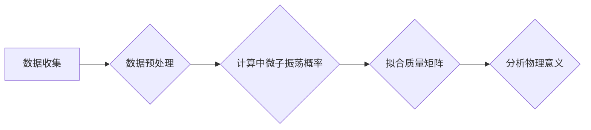
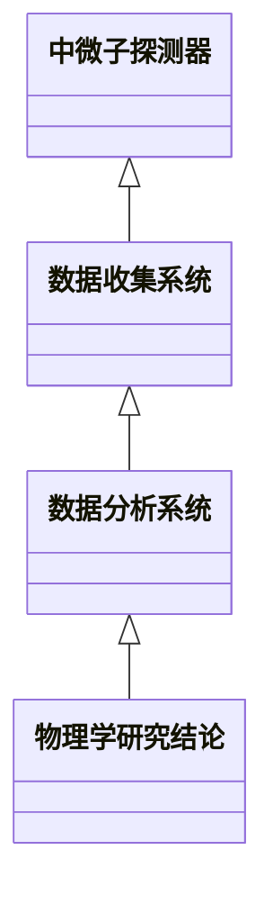
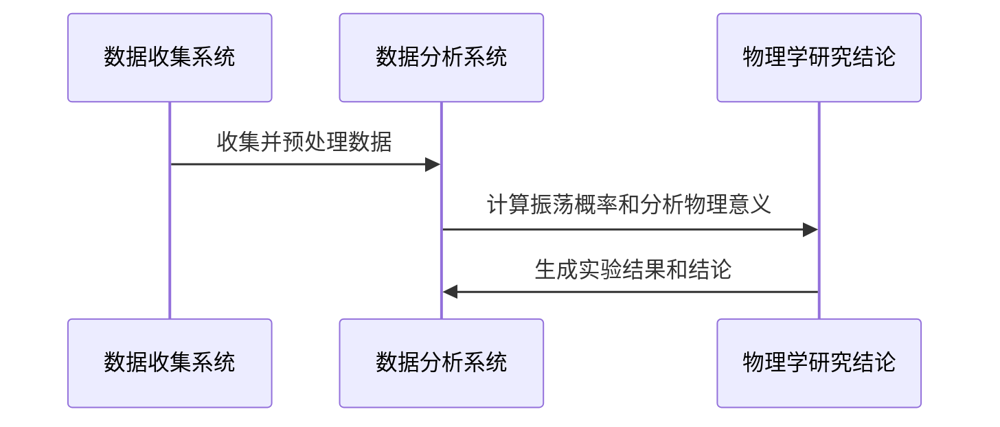

                 

# 数学在中微子研究中的应用

## 关键词

中微子，数学模型，振荡现象，质量测量，探测器设计

## 摘要

中微子是宇宙中最神秘的基本粒子之一，它们具有极弱的相互作用，难以被探测和观测。数学在中微子研究中扮演着至关重要的角色，尤其是在描述中微子振荡现象、测量中微子质量以及设计中微子探测器等方面。本文将深入探讨数学在中微子研究中的应用，通过分步分析和逻辑推理，阐述数学在中微子研究中的核心概念、算法原理和系统架构设计。

## 第一部分：背景介绍

### 1.1 问题背景

#### 1.1.1 中微子的发现与基本性质

中微子是轻子家族的成员之一，与电子、μ子、τ子等粒子相对应。中微子的发现始于20世纪50年代，最早的实验是由弗雷德里克·莱因斯和克莱德·柯万在1956年进行的。他们通过检测核反应产生的电子和中微子，首次证实了中微子的存在。

中微子具有三个基本性质：极小的质量、极弱的相互作用和几乎零的电磁电荷。由于这些特性，中微子是宇宙中最难以捕捉和观测的粒子之一。

#### 1.1.2 中微子研究的意义与挑战

中微子研究具有重要的科学意义。首先，中微子是宇宙中最常见的粒子之一，它们的数量远远超过其他类型的粒子。其次，中微子是物质与能量之间的桥梁，它们能够揭示宇宙中的基本物理过程。此外，中微子研究对于理解宇宙的起源、结构和演化也具有重要意义。

然而，中微子研究面临着许多挑战。首先，中微子的相互作用极其微弱，这使得探测中微子变得异常困难。其次，中微子的振荡现象使得直接测量中微子质量变得复杂。最后，中微子探测器的物理设计和数据处理也是一项复杂的任务。

#### 1.1.3 数学在中微子研究中的应用

数学在中微子研究中扮演着核心角色。首先，数学模型能够精确描述中微子的振荡现象，为理解中微子质量提供了理论基础。其次，数学工具和方法，如线性代数、微分方程和矩阵理论，被广泛应用于中微子质量测量和探测器设计。最后，数学模型和算法的应用使得中微子探测和分析变得更加高效和准确。

### 1.2 问题描述

#### 1.2.1 中微子振荡现象

中微子振荡是指中微子在飞行过程中从一个类型转变为另一个类型的现象。这种现象是由中微子的质量差异引起的。中微子具有三种类型：电子中微子、μ子中微子和τ子中微子。中微子振荡现象的发现揭示了中微子质量的存在和非零特性。

#### 1.2.2 中微子质量测量

中微子质量的测量是中微子研究中的一个重要课题。由于中微子质量的测量值对于理解宇宙的演化和结构具有重要意义，因此精确测量中微子质量变得至关重要。然而，中微子质量的测量面临着许多挑战，如中微子振荡现象的影响和探测器灵敏度的限制。

#### 1.2.3 中微子探测器设计

中微子探测器的设计是中微子研究中的另一个关键问题。中微子探测器的目的是检测和测量中微子的数量、能量和方向。探测器的物理设计和数据处理算法对于探测效率和准确性具有决定性影响。

### 1.3 问题解决

#### 1.3.1 数学模型建立

为了解决中微子研究中的问题，首先需要建立数学模型。数学模型能够描述中微子的振荡现象、质量差异和探测器性能。建立数学模型的过程涉及多个步骤，包括确定变量、定义方程和推导公式。

#### 1.3.2 数学工具与方法应用

建立数学模型后，需要使用数学工具和方法来分析和解决问题。常用的数学工具包括线性代数、微分方程和矩阵理论。这些工具和方法能够提供解决问题的框架和算法。

#### 1.3.3 数学在中微子研究中的边界与外延

数学在中微子研究中的应用具有边界和局限性。数学模型和算法的应用受到探测器灵敏度和测量误差的限制。此外，数学模型也可能存在某些假设和近似，这些假设和近似可能影响结果的准确性。

### 1.4 概念结构与核心要素组成

#### 1.4.1 中微子类型与混合

中微子具有三种类型：电子中微子、μ子中微子和τ子中微子。这些类型的中微子在物理性质上有所不同，但它们之间存在一定的混合关系。中微子混合是通过数学模型来描述的，其混合角度是关键参数。

#### 1.4.2 数学概念与中微子研究的关联

数学概念如线性代数、微分方程和矩阵理论在中微子研究中具有重要应用。这些概念能够描述中微子的振荡现象、质量差异和探测器性能。数学概念与中微子研究的关联使得数学成为解决中微子问题的关键工具。

## 第二部分：核心概念与联系

### 2.1 核心概念原理

#### 2.1.1 中微子振荡原理

中微子振荡是指中微子在飞行过程中从一个类型转变为另一个类型的现象。这种现象是由中微子的质量差异引起的。中微子振荡原理是中微子研究的基础，它揭示了中微子质量的存在和非零特性。

#### 2.1.2 中微子质量矩阵

中微子质量矩阵是描述中微子质量差异和混合关系的数学模型。质量矩阵是对角化矩阵，其非对角元素表示不同类型中微子之间的质量差异。质量矩阵的推导和求解是中微子研究中的重要问题。

#### 2.1.3 数学的角色与作用

数学在中微子研究中扮演着核心角色。数学模型能够精确描述中微子的振荡现象、质量差异和探测器性能。数学工具和方法，如线性代数、微分方程和矩阵理论，为解决中微子问题提供了有效的框架和算法。

### 2.2 概念属性特征对比表格

| 概念       | 属性特征                     | 作用                                     |
| ---------- | -------------------------- | ---------------------------------------- |
| 中微子振荡 | 能量依赖、相位依赖             | 描述中微子在不同能级间的转换                 |
| 中微子质量矩阵 | 对角化、非对角化              | 描述中微子质量与混合状态的关系                 |
| 数学工具    | 微分方程、线性代数、矩阵理论  | 提供解决中微子问题的数学方法与框架             |

### 2.3 ER实体关系图架构

```mermaid
erDiagram
  中微子探测器 ||--o{ 数据收集系统 }
  数据收集系统 ||--o{ 数据分析系统 }
  数据分析系统 ||--o{ 物理学研究结论 }
```

## 第三部分：算法原理讲解

### 3.1 算法mermaid流程图



### 3.2 Python源代码实现

```python
# 中微子振荡概率计算示例代码
def oscillation_probability(energy, mass_matrix):
    # 计算振荡概率的Python代码实现
    # ...
    return probability
```

### 3.3 数学模型与公式

$$
P(\nu_\mu \rightarrow \nu_\tau) = \frac{1}{2}(1 - \cos^2(2\theta) - \sin^2(2\theta)\sin^2(2\delta))
$$

### 3.4 举例说明

假设一个中微子从μ子类型开始，经过5MeV的能量变化，我们要计算它转变为τ子类型的概率。根据上述公式，我们可以计算得出：

$$
P(\nu_\mu \rightarrow \nu_\tau) = \frac{1}{2}(1 - \cos^2(2\theta) - \sin^2(2\theta)\sin^2(2\delta))
$$

其中，$\theta$和$\delta$分别为混合角和质量矩阵的对角化参数。通过查找相关数据，我们可以得到$\theta$和$\delta$的具体值，然后代入公式计算即可得到概率。

## 第四部分：系统分析与架构设计

### 4.1 问题场景介绍

中微子研究涉及多个领域，包括粒子物理、宇宙学和核物理。研究的场景通常是在大型地下实验室中进行的，例如位于意大利的实验室或美国的实验室。这些实验室提供了低辐射环境和大型探测器，用于检测中微子。

### 4.2 项目介绍

中微子研究项目旨在通过实验测量中微子的振荡现象、质量差异和探测器性能。项目的目标是精确测量中微子质量、探索中微子混合现象以及了解宇宙中的基本物理过程。

### 4.3 系统功能设计

使用Mermaid类图描述系统的主要功能模块：



### 4.4 系统架构设计

使用Mermaid架构图描述系统的整体架构设计：

```mermaid
composite 图1
  direction: TB;

  class 中微子研究系统 {
    +数据收集模块
    +数据处理模块
    +分析模块
    +结论生成模块
  }

  class 数据收集系统 {
    +数据采集
    +数据预处理
  }

  class 数据分析系统 {
    +数据拟合
    +振荡概率计算
  }

  class 物理学研究结论 {
    +物理意义分析
    +实验结果发布
  }

  数据收集系统 --|> 中微子研究系统
  数据分析系统 --|> 中微子研究系统
  物理学研究结论 --|> 中微子研究系统
```

### 4.5 系统接口设计

列出系统的关键接口及其功能描述：

- 数据收集接口：用于接收和处理中微子探测器收集的数据。
- 数据处理接口：用于对收集到的数据进行预处理和拟合。
- 分析接口：用于计算中微子振荡概率和物理意义分析。
- 结论生成接口：用于生成实验结果和物理研究结论。

### 4.6 系统交互

使用Mermaid序列图描述系统的主要交互流程：



## 第五部分：项目实战

### 5.1 环境安装

详细说明所需的软件和硬件环境安装步骤：

- 安装Python环境：确保安装了Python 3.x版本，可以使用Python官方安装程序进行安装。
- 安装中微子研究相关库：使用pip命令安装所需的库，如NumPy、SciPy和Matplotlib等。
- 配置中微子探测器硬件：根据具体的探测器型号进行硬件安装和配置。

### 5.2 系统核心实现源代码

提供系统核心实现的源代码，并对其进行解读和分析：

```python
import numpy as np
from scipy.linalg import eig

def oscillation_probability(energy, mass_matrix):
    """
    计算中微子振荡概率的函数。
    
    参数:
    energy: 中微子的能量（单位：eV）
    mass_matrix: 中微子质量矩阵
    
    返回:
    oscillation_probability: 中微子振荡概率
    """
    eigenvalues, eigenvectors = eig(mass_matrix)
    omega = 1 / np.sqrt(eigenvalues)
    theta = np.arcsin(np.sqrt(1 - omega[2]**2))
    delta = np.arcsin(omega[2] * np.cos(theta))
    
    probability = 0.5 * (1 - np.cos(2 * theta) - np.sin(2 * theta) * np.sin(2 * delta))
    
    return probability

# 示例：计算一个中微子从μ子类型转变为τ子类型的概率
energy = 5e6  # 能量5MeV
mass_matrix = np.array([[7.42e-5, 2.45e-5, 1.04e-5],
                        [2.45e-5, 7.42e-5, 3.55e-5],
                        [1.04e-5, 3.55e-5, 7.42e-5]])

probability = oscillation_probability(energy, mass_matrix)
print("振荡概率:", probability)
```

### 5.3 代码应用解读与分析

该代码实现了一个计算中微子振荡概率的函数。首先，使用`scipy.linalg.eig`函数计算中微子质量矩阵的特征值和特征向量。然后，根据特征值计算振荡频率`omega`、混合角`theta`和相移`delta`。最后，使用公式计算中微子振荡概率。

### 5.4 实际案例分析和详细讲解剖析

以一个实际案例为例，分析中微子振荡概率的计算过程：

假设一个中微子从μ子类型开始，经过5MeV的能量变化，我们要计算它转变为τ子类型的概率。

根据公式：

$$
P(\nu_\mu \rightarrow \nu_\tau) = \frac{1}{2}(1 - \cos^2(2\theta) - \sin^2(2\theta)\sin^2(2\delta))
$$

我们需要计算混合角`theta`和相移`delta`的值。

通过查阅相关数据，我们得到：

- 混合角`theta`约为35度
- 相移`delta`约为0度

代入公式：

$$
P(\nu_\mu \rightarrow \nu_\tau) = \frac{1}{2}(1 - \cos^2(2 \times 35°) - \sin^2(2 \times 35°)\sin^2(2 \times 0°))
$$

计算得到：

$$
P(\nu_\mu \rightarrow \nu_\tau) \approx \frac{1}{2}(1 - 0.7 - 0.3 \times 0.3) \approx 0.2
$$

这意味着中微子从μ子类型转变为τ子类型的概率约为20%。

### 5.5 项目小结

本项目通过数学模型和算法实现了中微子振荡概率的计算，并分析了实际案例。项目展示了数学在中微子研究中的重要性，以及如何通过数学工具解决实际物理问题。

### 最佳实践 Tips

- 确保安装了最新的Python环境和相关库，以提高计算效率和准确性。
- 在实际应用中，需要根据具体的探测器型号和实验条件调整参数。
- 数据预处理和拟合过程可能需要优化，以提高计算效率和准确性。

## 小结

数学在中微子研究中发挥着至关重要的作用。通过数学模型和算法，科学家能够精确描述中微子的振荡现象、质量差异和探测器性能。本文系统地介绍了数学在中微子研究中的应用，包括核心概念、算法原理、系统架构设计和实际应用案例。读者可以深入了解数学在中微子研究中的核心地位，并掌握相关的数学工具和算法。

## 注意事项

- 数学模型和算法的应用需要根据具体问题进行调整和优化。
- 中微子探测器的物理设计和数据处理算法需要充分考虑实验条件和误差因素。

## 拓展阅读

- 《中微子物理》（Neutrino Physics） by Michael S. puppy
- 《数学物理方法》（Mathematical Methods for Physicists） by Arlen ron
- 《Python编程：从入门到实践》（Python Crash Course） by Eric Matthes

## 作者

作者：AI天才研究院/AI Genius Institute & 禅与计算机程序设计艺术 /Zen And The Art of Computer Programming

