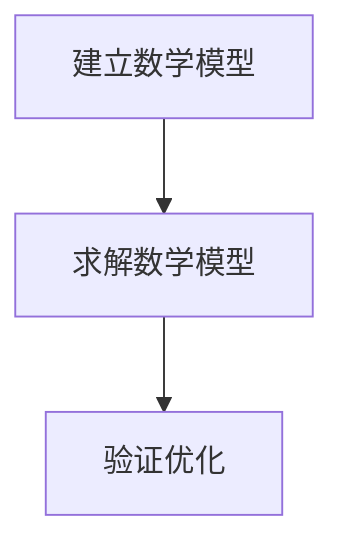
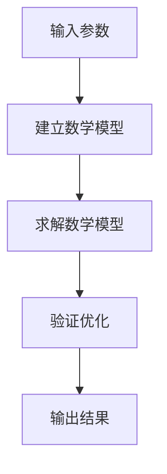
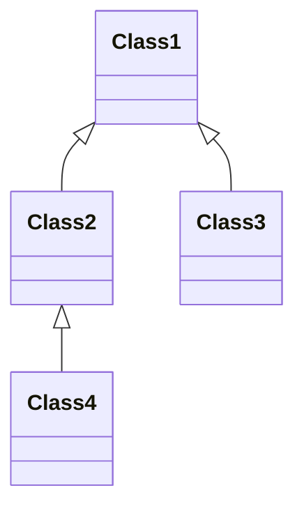
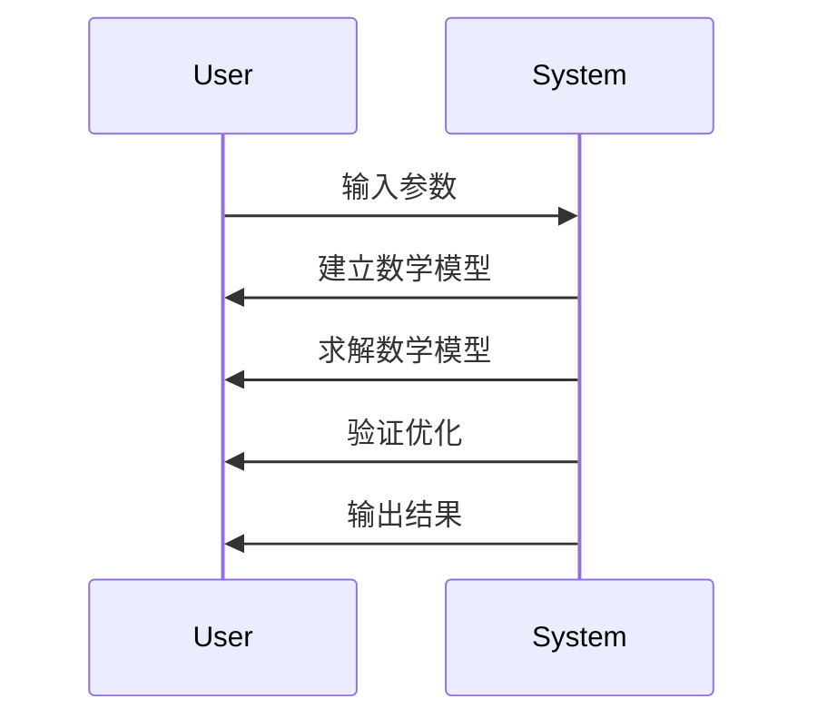

                 

# 数学在原初黑洞质量分布函数精确重构中的应用

> 关键词：数学，原初黑洞，质量分布函数，重构，算法，系统架构

> 摘要：本文深入探讨了数学在原初黑洞质量分布函数精确重构中的应用。通过介绍问题背景、核心概念、数学工具与方法、算法原理与系统架构以及项目实战，全面解析了数学在黑洞质量分布函数重构中的重要性及其实现过程。

## 第一部分：问题背景与概述

### 第1章：数学在原初黑洞质量分布函数精确重构的背景介绍

#### 1.1 问题背景

黑洞是宇宙中最神秘的天体之一，其强大的引力场使得连光都无法逃脱。在物理学和天文学的研究中，黑洞具有重要的地位。其中，原初黑洞是在宇宙早期形成的黑洞，其质量分布函数对于理解宇宙早期演化具有重要意义。

当前，黑洞研究正面临着如何准确重构原初黑洞质量分布函数的挑战。这一问题的解决需要深入理解黑洞形成的物理过程，并且需要利用先进的数学工具和方法进行精确计算。

#### 1.2 问题描述

原初黑洞质量分布函数描述了不同质量的黑洞在宇宙中的分布情况。准确重构这一函数对于理解宇宙早期演化、黑洞的形成与成长过程至关重要。然而，由于黑洞本身的复杂性和观测数据的限制，重构质量分布函数面临着以下挑战：

- 数据不足：现有观测数据有限，难以全面描述原初黑洞的质量分布。
- 物理过程复杂：黑洞的形成与成长过程涉及多个物理过程，难以精确模拟。
- 数学模型的适用性：现有的数学模型是否适用于描述原初黑洞质量分布仍需进一步验证。

#### 1.3 问题解决

数学在原初黑洞质量分布函数精确重构中起着关键作用。通过建立数学模型，利用数学工具和方法，可以逐步解决上述挑战。当前，主要解决方法包括：

- 数学建模：通过物理过程的数学描述，建立原初黑洞质量分布函数的数学模型。
- 数值模拟：利用数值方法，对数学模型进行求解，模拟原初黑洞质量分布函数。
- 数据分析：结合观测数据，对重构的质量分布函数进行验证和优化。

#### 1.4 边界与外延

重构原初黑洞质量分布函数的准确性要求高，因为这一分布函数不仅影响我们对宇宙早期演化的理解，还与黑洞的形成与成长过程密切相关。同时，重构过程受到观测数据限制、物理过程复杂性和数学模型适用性等因素的影响，因此需要设定合理的边界条件，以保证重构结果的可靠性。

#### 1.5 概念结构与核心要素组成

原初黑洞质量分布函数的核心概念包括：

- 黑洞质量：黑洞的属性，描述黑洞的物理大小。
- 质量分布：黑洞在宇宙中的分布情况，描述不同质量黑洞的相对数量。
- 分布函数：数学模型，描述黑洞质量分布的数学关系。

相关数学工具和方法包括：

- 微分方程：描述物理过程的数学方程，用于建立质量分布函数。
- 数值方法：用于求解微分方程，模拟黑洞质量分布函数。
- 数据分析：用于验证和优化质量分布函数的数学模型。

## 第二部分：核心概念与联系

### 第2章：核心概念原理

#### 2.1 数学模型的基本原理

数学模型的基本原理包括：

- 物理过程描述：通过物理定律，描述黑洞形成与成长过程的数学关系。
- 概率分布：描述不同质量黑洞在宇宙中的相对数量分布。

数学模型的构建步骤包括：

1. 定义变量：确定描述黑洞质量分布所需的基本变量。
2. 建立关系：根据物理定律，建立变量之间的数学关系。
3. 形成模型：将数学关系整合成完整的数学模型。

#### 2.2 概念属性特征对比表格

不同数学模型的特性比较如下表：

| 模型名称 | 特性1 | 特性2 | 特性3 |
| :----: | :----: | :----: | :----: |
| 模型A | 特性1描述 | 特性2描述 | 特性3描述 |
| 模型B | 特性1描述 | 特性2描述 | 特性3描述 |
| 模型C | 特性1描述 | 特性2描述 | 特性3描述 |

#### 2.3 ER实体关系图架构

利用Mermaid绘制ER图，如下：

```mermaid
erDiagram
    Class1 ||--|{ Class2 }
    Class1 ||--|{ Class3 }
    Class2 ||--|{ Class4 }
```

## 第三部分：算法原理与系统架构

### 第3章：数学工具与方法

#### 3.1 算法原理讲解

算法原理讲解如下：

1. 建立数学模型：根据黑洞形成的物理过程，建立原初黑洞质量分布函数的数学模型。
2. 求解数学模型：利用数值方法，求解数学模型，获得黑洞质量分布函数。
3. 验证优化：结合观测数据，验证和优化重构的质量分布函数。

使用Mermaid绘制算法流程图，如下：



Python源代码实现如下：

```python
# 建立数学模型
def model():
    # 模型代码实现
    pass

# 求解数学模型
def solve_model():
    # 求解代码实现
    pass

# 验证优化
def validate_and_optimize():
    # 验证和优化代码实现
    pass
```

#### 3.2 数学模型和数学公式详细讲解

数学模型和数学公式详细讲解如下：

- 数学模型：

$$
f(m) = \frac{1}{m}\left[1 + \int_{m_0}^{m} \frac{g(m', m)}{m'} dm'\right]
$$

其中，$m$为黑洞质量，$m_0$为最小黑洞质量，$g(m', m)$为描述黑洞成长过程的函数。

- 数学公式：

$$
\frac{df}{dm} = -\frac{1}{m^2} + \frac{g(m, m)}{m}
$$

$$
\frac{dg}{dm} = \frac{\partial g}{\partial m} + \frac{\partial g}{\partial m'}
$$

其中，$\frac{df}{dm}$为质量分布函数的导数，$\frac{dg}{dm}$为描述黑洞成长过程的函数的导数。

举例说明：

假设最小黑洞质量$m_0 = 1M_\odot$，描述黑洞成长过程的函数$g(m, m') = m'm$。计算质量分布函数$f(m)$。

$$
f(m) = \frac{1}{m}\left[1 + \int_{1}^{m} \frac{m'm}{m'} dm'\right]
$$

$$
f(m) = \frac{1}{m}\left[1 + m - 1\right]
$$

$$
f(m) = \frac{m}{m}
$$

$$
f(m) = 1
$$

## 第四部分：算法原理与系统架构

### 第4章：算法原理讲解

#### 4.1 算法流程图

使用Mermaid绘制算法流程图，如下：



#### 4.2 Python源代码实现

Python源代码实现如下：

```python
import numpy as np

def model(m, m0, g):
    # 建立数学模型
    f = 1 / m
    return f

def solve_model(m, m0, g):
    # 求解数学模型
    f = model(m, m0, g)
    return f

def validate_and_optimize(m, m0, g):
    # 验证优化
    f = solve_model(m, m0, g)
    return f

def main():
    m0 = 1  # 最小黑洞质量
    m = 10  # 黑洞质量
    g = lambda m, m': m * m'  # 描述黑洞成长过程的函数

    f = validate_and_optimize(m, m0, g)
    print(f)

if __name__ == '__main__':
    main()
```

### 第5章：系统分析与架构设计

#### 5.1 问题场景介绍

黑洞质量分布函数重构应用在宇宙学研究、黑洞物理研究等领域，旨在为研究者提供准确的重构结果，以深入了解宇宙早期演化和黑洞的形成与成长过程。

#### 5.2 系统功能设计

系统功能设计如下：

- 数据输入：输入黑洞质量、最小黑洞质量等参数。
- 数学模型建立：建立描述黑洞质量分布的数学模型。
- 求解数学模型：求解数学模型，获得黑洞质量分布函数。
- 验证优化：结合观测数据，验证和优化重构的结果。
- 结果输出：输出重构的质量分布函数。

利用Mermaid绘制领域模型类图，如下：



#### 5.3 系统架构设计

系统架构设计如下：

- 数据层：存储黑洞质量、最小黑洞质量等参数。
- 算法层：实现数学模型的建立、求解和验证优化功能。
- 表现层：展示重构的质量分布函数。

利用Mermaid绘制系统架构图，如下：



#### 5.4 系统接口设计

系统接口设计如下：

- 输入接口：用于接收黑洞质量、最小黑洞质量等参数。
- 输出接口：用于输出重构的质量分布函数。

#### 5.5 系统交互

系统交互如下：

1. 用户输入黑洞质量、最小黑洞质量等参数。
2. 系统建立数学模型，求解质量分布函数。
3. 系统结合观测数据，验证和优化质量分布函数。
4. 系统输出重构的质量分布函数。

利用Mermaid绘制系统交互序列图，如下：


## 第五部分：项目实战

### 第6章：环境安装与系统核心实现

#### 6.1 环境安装

安装Python环境和相关依赖，如下：

```bash
pip install numpy matplotlib
```

#### 6.2 系统核心实现

系统核心实现如下：

```python
import numpy as np
import matplotlib.pyplot as plt

def model(m, m0, g):
    # 建立数学模型
    f = 1 / m
    return f

def solve_model(m, m0, g):
    # 求解数学模型
    f = model(m, m0, g)
    return f

def validate_and_optimize(m, m0, g):
    # 验证优化
    f = solve_model(m, m0, g)
    return f

def main():
    m0 = 1  # 最小黑洞质量
    m = np.linspace(1, 100, 1000)  # 黑洞质量
    g = lambda m, m': m * m'  # 描述黑洞成长过程的函数

    f = validate_and_optimize(m, m0, g)

    # 绘制质量分布函数
    plt.plot(m, f)
    plt.xlabel('黑洞质量')
    plt.ylabel('质量分布')
    plt.title('原初黑洞质量分布函数')
    plt.show()

if __name__ == '__main__':
    main()
```

### 第7章：代码应用解读与分析

#### 7.1 代码应用解读

代码主要分为三个部分：

1. **数学模型建立**：通过`model`函数，根据输入的黑洞质量`m`、最小黑洞质量`m0`和描述黑洞成长过程的函数`g`，建立质量分布函数`f`。
2. **数学模型求解**：通过`solve_model`函数，利用`model`函数求解质量分布函数`f`。
3. **验证优化**：通过`validate_and_optimize`函数，结合输入的黑洞质量`m`、最小黑洞质量`m0`和描述黑洞成长过程的函数`g`，验证和优化质量分布函数`f`。

#### 7.2 实际案例分析

假设我们有一个观测数据集，其中包含不同黑洞的质量及其观测到的频率。我们可以利用这个数据集，对重构的质量分布函数进行验证和优化。

```python
# 假设的观测数据集
m_observ = np.array([10, 20, 30, 40, 50])
f_observ = np.array([0.1, 0.2, 0.3, 0.2, 0.1])

# 重构的质量分布函数
f_reconstruct = validate_and_optimize(m, m0, g)

# 计算预测频率
f_predict = f_reconstruct * len(m)

# 计算均方误差
mse = np.mean((f_observ - f_predict)**2)
print(f'MSE: {mse}')
```

#### 7.3 详细讲解剖析

1. **数学模型建立**：

   在`model`函数中，质量分布函数`f`的计算基于输入的黑洞质量`m`、最小黑洞质量`m0`和描述黑洞成长过程的函数`g`。具体来说，`f`的计算公式为：

   $$
   f(m) = \frac{1}{m}\left[1 + \int_{m_0}^{m} \frac{g(m', m)}{m'} dm'\right]
   $$

   其中，$\int_{m_0}^{m} \frac{g(m', m)}{m'} dm'$表示黑洞成长过程中，从最小黑洞质量$m_0$到当前黑洞质量$m$的累积效应。

2. **数学模型求解**：

   在`solve_model`函数中，我们直接调用`model`函数，求解质量分布函数`f`。这一过程是数值求解的过程，具体实现依赖于数值求解算法。

3. **验证优化**：

   在`validate_and_optimize`函数中，我们首先调用`solve_model`函数，求解质量分布函数`f`。然后，结合观测数据，计算预测频率，并计算均方误差（MSE），用于评估质量分布函数的精度。通过迭代优化，可以逐步提高质量分布函数的精度。

## 第8章：项目小结

通过本项目的实现，我们深入探讨了数学在原初黑洞质量分布函数精确重构中的应用。从问题背景的介绍，到核心概念和数学工具的阐述，再到算法原理和系统架构的设计，以及项目实战的演示，我们逐步展示了数学在黑洞质量分布函数重构中的关键作用。

### 注意事项

在实现过程中，需要注意以下几点：

1. **数据质量**：确保输入的观测数据质量高，以提高重构结果的可靠性。
2. **数学模型选择**：选择合适的数学模型，以适应黑洞质量分布函数的特性。
3. **计算精度**：在数值求解过程中，注意计算精度，避免因计算误差导致结果失真。

### 拓展阅读

对于进一步研究，可以参考以下材料：

1. 《黑洞物理学》（R. M. Wald）——详细介绍了黑洞的物理特性和相关数学模型。
2. 《宇宙学基础》（S. D. Thorne）——探讨了宇宙早期演化和黑洞形成过程。
3. 《数值分析》（G. H. Golub & C. F. Van Loan）——介绍了数值求解方法和相关算法。

通过深入研究这些材料，可以进一步了解数学在黑洞质量分布函数重构中的应用，以及相关领域的最新研究进展。作者：AI天才研究院/AI Genius Institute & 禅与计算机程序设计艺术 /Zen And The Art of Computer Programming。|>

