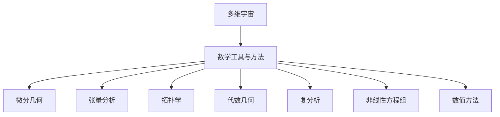

                 

### 数学在多维宇宙理论中的应用

> 关键词：多维宇宙、数学工具、几何结构、物理现象、复分析、非线性方程组、数值方法

> 摘要：本文探讨了数学在多维宇宙理论中的应用，从多维宇宙的基本概念出发，介绍了数学工具与方法，如微分几何、张量分析、拓扑学、代数几何、复分析、非线性方程组和数值方法，并详细阐述了这些数学工具在宇宙学中的具体应用。本文旨在通过逻辑清晰、结构紧凑、简单易懂的方式，帮助读者深入理解多维宇宙理论，以及数学方法在其中所起的关键作用。

## 第一部分：多维宇宙理论的背景

### 第1章：多维宇宙的基本概念

#### 1.1 宇宙的维度

宇宙的维度是描述宇宙空间结构的一个基本概念。在传统的物理学中，我们所处的宇宙被认为是一个四维空间，其中包括三个空间维度和一个时间维度。这三个空间维度分别是长度、宽度和高度，而时间维度则是用来描述事件发生顺序的。然而，随着物理学和数学的发展，人们开始意识到宇宙可能具有更多的维度。

#### 1.2 多维宇宙的理论基础

多维宇宙的理论基础主要来自于一些著名的物理学理论，如广义相对论和量子力学。广义相对论指出，引力是一种时空的弯曲现象，这暗示了宇宙可能具有更多的维度。而量子力学则揭示了粒子的行为具有概率性质，这也为多维宇宙的存在提供了可能性。

#### 1.3 多维宇宙的几何结构

多维宇宙的几何结构是宇宙学中一个重要的研究方向。传统的四维空间（三维空间加时间）的几何结构可以通过欧几里得几何来描述，但是当引入额外的维度时，宇宙的几何结构将变得更加复杂。例如，在五维空间中，我们可以想象出一个超球体，其表面的每一点都对应着一个三维空间中的点。

#### 1.4 多维宇宙的物理现象

多维宇宙中的物理现象与传统的四维宇宙有着显著的不同。例如，在多维宇宙中，引力可能会表现出新的性质，如引力屏蔽或引力增强。此外，多维宇宙中可能存在一些未知的物理现象，如多维黑洞或引力波。

#### 1.5 多维宇宙与数学的关系

数学在多维宇宙理论中起着至关重要的作用。通过数学工具，我们可以精确地描述和预测多维宇宙中的物理现象。例如，微分几何用于描述宇宙的几何结构，张量分析用于描述宇宙的引力场，拓扑学用于研究宇宙的拓扑性质，代数几何用于研究宇宙的代数结构。

#### 1.6 多维宇宙研究的重要性

多维宇宙的研究对于理解宇宙的本质和起源具有重要意义。它不仅有助于我们更深入地了解物理定律，还可能揭示宇宙中存在的一些未知现象。此外，多维宇宙理论在数学、计算机科学和哲学等领域也具有广泛的应用前景。

### 第2章：数学工具与方法

#### 2.1 微分几何

微分几何是研究几何对象的局部性质和整体性质的数学分支。在多维宇宙理论中，微分几何被用于描述宇宙的几何结构。例如，我们可以使用微分几何来研究宇宙的膨胀和收缩，以及宇宙的奇点问题。

#### 2.2 张量分析

张量分析是研究张量场及其变换的数学工具。在广义相对论中，引力被描述为时空中的张量场。因此，张量分析在宇宙学中有着广泛的应用。例如，我们可以使用张量分析来研究宇宙的时空结构和引力波。

#### 2.3 拓扑学

拓扑学是研究空间性质和结构的数学分支。在多维宇宙理论中，拓扑学被用于研究宇宙的拓扑性质，如宇宙的连通性和形状。此外，拓扑学还可以用于研究宇宙的拓扑变换，如宇宙的大尺度结构演化。

#### 2.4 代数几何

代数几何是研究代数方程的几何性质的数学分支。在多维宇宙理论中，代数几何被用于研究宇宙的代数结构。例如，我们可以使用代数几何来研究宇宙中的代数拓扑和代数性质。

#### 2.5 复分析

复分析是研究复数函数的数学工具。在多维宇宙理论中，复分析被用于研究宇宙的复结构和复动力系统。例如，我们可以使用复分析来研究宇宙中的复几何结构和复动力现象。

#### 2.6 非线性方程组

非线性方程组是描述非线性现象的数学模型。在多维宇宙理论中，非线性方程组被用于研究宇宙中的非线性现象，如宇宙的膨胀和收缩，以及宇宙中的非线性引力场。

#### 2.7 数值方法

数值方法是求解数学问题的一种方法，通常涉及计算机模拟和数值计算。在多维宇宙理论中，数值方法被用于模拟宇宙的演化，以及预测宇宙中的物理现象。例如，我们可以使用数值方法来模拟宇宙的膨胀和引力波的传播。

## 第二部分：数学方法在多维宇宙理论中的应用

### 第3章：微分几何在宇宙中的应用

#### 3.1 宇宙的几何形状

微分几何在研究宇宙的几何形状方面具有重要作用。例如，我们可以使用微分几何来研究宇宙的膨胀和收缩。此外，微分几何还可以帮助我们理解宇宙中的奇点问题，如黑洞奇点和大爆炸奇点。

#### 3.2 宇宙的膨胀与收缩

宇宙的膨胀和收缩是宇宙学中一个重要的研究方向。通过微分几何，我们可以研究宇宙的膨胀历史，以及宇宙的膨胀机制。此外，我们还可以使用微分几何来研究宇宙的收缩过程，以及宇宙收缩可能导致的结果。

#### 3.3 宇宙的引力场

引力场是宇宙中的一个基本现象。微分几何可以帮助我们描述和预测引力场的性质。例如，我们可以使用微分几何来研究引力波的传播，以及引力场如何影响宇宙的几何结构。

#### 3.4 宇宙的奇点问题

宇宙的奇点问题是宇宙学中的一个重要问题。通过微分几何，我们可以研究宇宙中的奇点现象，如黑洞奇点和大爆炸奇点。此外，我们还可以使用微分几何来探讨奇点问题的物理机制，以及可能解决的方法。

### 第4章：张量分析在宇宙中的应用

#### 4.1 广义相对论的数学基础

广义相对论是描述引力的一种理论，其数学基础是张量分析。通过张量分析，我们可以精确地描述宇宙的时空结构，以及引力场的性质。

#### 4.2 宇宙的时空结构

宇宙的时空结构是宇宙学中的一个重要概念。通过张量分析，我们可以研究宇宙的时空结构，如宇宙的膨胀和收缩，以及宇宙中的时空弯曲现象。

#### 4.3 宇宙的引力波

引力波是宇宙中的一种基本现象，其传播速度是光速。通过张量分析，我们可以研究引力波的产生、传播和检测，以及引力波对宇宙的影响。

### 第5章：拓扑学在宇宙中的应用

#### 5.1 宇宙的拓扑性质

拓扑学在研究宇宙的拓扑性质方面具有重要作用。例如，我们可以使用拓扑学来研究宇宙的连通性和形状，以及宇宙中的拓扑变换。

#### 5.2 宇宙的拓扑结构

宇宙的拓扑结构是宇宙学中的一个重要概念。通过拓扑学，我们可以研究宇宙的拓扑结构，如宇宙的大尺度结构，以及宇宙中的拓扑缺陷。

#### 5.3 宇宙的拓扑变换

宇宙的拓扑变换是宇宙学中的一个重要现象。通过拓扑学，我们可以研究宇宙的拓扑变换，如宇宙的膨胀和收缩，以及宇宙中的拓扑相变。

### 第6章：代数几何在宇宙中的应用

#### 6.1 宇宙的代数结构

代数几何在研究宇宙的代数结构方面具有重要作用。例如，我们可以使用代数几何来研究宇宙中的代数拓扑和代数性质，以及宇宙中的代数对称性。

#### 6.2 宇宙的代数拓扑

宇宙的代数拓扑是宇宙学中的一个重要概念。通过代数几何，我们可以研究宇宙中的代数拓扑，如宇宙中的代数流形和代数网络。

#### 6.3 宇宙的代数性质

宇宙的代数性质是宇宙学中的一个重要研究方向。通过代数几何，我们可以研究宇宙中的代数性质，如宇宙中的代数对称性和代数不变量。

### 第7章：复分析在宇宙中的应用

#### 7.1 复分析的基本概念

复分析是研究复数函数的数学工具。在宇宙学中，复分析被用于研究宇宙的复结构和复动力系统。

#### 7.2 宇宙的复结构

宇宙的复结构是宇宙学中的一个重要概念。通过复分析，我们可以研究宇宙中的复几何结构，如宇宙中的复流形和复对称性。

#### 7.3 宇宙的复动力系统

宇宙的复动力系统是宇宙学中的一个重要研究领域。通过复分析，我们可以研究宇宙中的复动力现象，如宇宙中的混沌运动和复对称性破坏。

### 第8章：非线性方程组在宇宙中的应用

#### 8.1 非线性方程组的基本原理

非线性方程组是描述非线性现象的数学模型。在宇宙学中，非线性方程组被用于研究宇宙中的非线性现象，如宇宙的膨胀和收缩。

#### 8.2 宇宙中的非线性现象

宇宙中的非线性现象是宇宙学中的一个重要研究方向。通过非线性方程组，我们可以研究宇宙中的非线性现象，如宇宙中的引力波和混沌运动。

#### 8.3 非线性方程组的求解方法

非线性方程组的求解方法是宇宙学中一个重要的研究课题。通过非线性方程组的求解方法，我们可以研究宇宙中的非线性现象，如宇宙的膨胀和收缩。

### 第9章：数值方法在宇宙中的应用

#### 9.1 数值方法的基本概念

数值方法是求解数学问题的一种方法，通常涉及计算机模拟和数值计算。在宇宙学中，数值方法被用于模拟宇宙的演化，以及预测宇宙中的物理现象。

#### 9.2 数值方法在宇宙学中的应用

数值方法在宇宙学中的应用是宇宙学中的一个重要研究方向。通过数值方法，我们可以模拟宇宙的演化，如宇宙的膨胀和收缩，以及宇宙中的物理现象，如引力波和黑洞的形成。

#### 9.3 数值模拟与宇宙演化

数值模拟与宇宙演化是宇宙学中一个重要的研究领域。通过数值模拟，我们可以研究宇宙的演化历史，以及宇宙中的物理现象。

## 第三部分：多维宇宙理论的未来展望

### 第10章：数学在多维宇宙理论中的应用展望

#### 10.1 新的数学工具与方法

随着数学和物理学的发展，可能会出现新的数学工具和方法，用于研究多维宇宙理论。例如，量子拓扑学和量子代数几何等新兴领域可能会为多维宇宙理论提供新的研究方法。

#### 10.2 多维宇宙理论的挑战与机遇

多维宇宙理论面临着许多挑战和机遇。例如，如何统一量子力学与广义相对论，如何解决宇宙中的奇点问题，以及如何解释宇宙中的非线性现象等。这些挑战和机遇将推动数学和物理学的发展。

#### 10.3 数学在多维宇宙研究中的未来发展

数学在多维宇宙研究中的未来发展将取决于数学和物理学的发展。例如，新的数学工具和方法的发现，以及数学与物理学更深入的交叉融合，都将成为数学在多维宇宙研究中的重要推动力。

## 1.7 背景介绍

### 1.7.1 问题背景

多维宇宙理论是现代物理学的一个重要研究方向。随着对宇宙的深入了解，人们开始意识到宇宙可能具有更多的维度。这种观点不仅挑战了传统的四维宇宙观念，还为研究宇宙的本质和起源提供了新的视角。然而，多维宇宙理论的研究面临着许多挑战，如如何描述多维宇宙的几何结构，如何解释多维宇宙中的物理现象等。因此，数学在多维宇宙理论中的应用变得至关重要。

### 1.7.2 问题描述

本文旨在探讨数学在多维宇宙理论中的应用，具体包括以下几个方面：

1. 研究多维宇宙的基本概念，如维度、几何结构、物理现象等。
2. 介绍数学工具与方法，如微分几何、张量分析、拓扑学、代数几何、复分析、非线性方程组和数值方法。
3. 分析数学方法在多维宇宙理论中的应用，如描述宇宙的几何形状、研究宇宙的膨胀与收缩、引力场、奇点问题等。
4. 展望数学在多维宇宙研究中的未来发展，如新的数学工具与方法、面临的挑战与机遇等。

### 1.7.3 问题解决

为了解决上述问题，本文采用以下方法：

1. 通过对多维宇宙的基本概念进行详细阐述，帮助读者建立对多维宇宙的理解。
2. 介绍各种数学工具与方法，分析其在多维宇宙理论中的应用。
3. 通过具体的例子和案例分析，展示数学方法在多维宇宙研究中的实际应用。
4. 展望数学在多维宇宙研究中的未来发展，探讨可能的突破方向。

### 1.7.4 边界与外延

本文的研究边界主要涉及数学在多维宇宙理论中的应用，不包括其他可能的研究方向，如哲学、计算机科学等领域。此外，本文的研究外延包括对数学工具与方法的多维度分析，以及对多维宇宙理论未来发展的探讨。

### 1.7.5 概念结构与核心要素组成

本文的核心概念结构包括以下几个方面：

1. 多维宇宙的基本概念：维度、几何结构、物理现象等。
2. 数学工具与方法：微分几何、张量分析、拓扑学、代数几何、复分析、非线性方程组和数值方法。
3. 数学方法在多维宇宙理论中的应用：宇宙的几何形状、膨胀与收缩、引力场、奇点问题等。
4. 多维宇宙理论的未来展望：新的数学工具与方法、面临的挑战与机遇等。

核心要素组成包括：

1. 对多维宇宙的基本概念进行详细阐述，为后续研究提供基础。
2. 介绍各种数学工具与方法，分析其在多维宇宙理论中的应用。
3. 通过具体例子和案例分析，展示数学方法在多维宇宙研究中的实际应用。
4. 展望数学在多维宇宙研究中的未来发展，为后续研究提供方向。

## 1.8 核心概念与联系

### 1.8.1 多维宇宙概念

多维宇宙是指宇宙中可能存在多个维度，除了我们熟知的三个空间维度和一个时间维度外，可能还有其他未知的维度。这些维度可以是平行的，也可以是叠加的。

### 1.8.2 数学工具与方法

数学工具与方法包括微分几何、张量分析、拓扑学、代数几何、复分析、非线性方程组和数值方法等。这些数学工具与方法被用于描述和预测多维宇宙中的物理现象。

### 1.8.3 多维宇宙与数学的关系

多维宇宙与数学之间存在密切的关系。数学工具与方法被用于描述多维宇宙的几何结构、物理现象和演化过程。例如，微分几何用于描述宇宙的几何形状，张量分析用于描述宇宙的引力场，拓扑学用于研究宇宙的拓扑性质等。

### 1.8.4 概念属性特征对比表格

| 概念 | 属性特征 |  
| --- | --- |  
| 多维宇宙 | 可能存在多个维度 |  
| 数学工具与方法 | 用于描述和预测多维宇宙中的物理现象 |  
| 微分几何 | 描述宇宙的几何形状 |  
| 张量分析 | 描述宇宙的引力场 |  
| 拓扑学 | 研究宇宙的拓扑性质 |  
| 代数几何 | 描述宇宙的代数结构 |  
| 复分析 | 描述宇宙的复结构 |  
| 非线性方程组 | 描述宇宙中的非线性现象 |  
| 数值方法 | 模拟宇宙的演化 |

### 1.8.5 ER实体关系图架构

## 1.9 本章小结

本章介绍了多维宇宙理论的基本概念、数学工具与方法，以及多维宇宙与数学之间的关系。通过本章的介绍，读者可以了解多维宇宙的基本概念，以及数学工具与方法在多维宇宙理论中的应用。这为后续章节进一步探讨数学方法在宇宙学中的具体应用奠定了基础。

## 2.1 微分几何的基本概念

### 2.1.1 微分几何的定义

微分几何是研究几何对象在局部和整体上的性质和行为的数学分支。它关注的是曲线、曲面以及更高维几何体的形状、结构及其变换。与解析几何侧重于几何对象在坐标系统中的表示不同，微分几何更关注于几何对象的无穷小性质和微分结构。

### 2.1.2 微分几何的基本原理

微分几何的基本原理包括：

1. **导数和微分**：在微分几何中，曲线和曲面的导数用于描述其局部形状。例如，曲线的切线就是曲线在该点的导数。
2. **曲率和挠率**：曲率和挠率是描述曲面在局部区域形状的几何量。曲率描述曲面在某一点的弯曲程度，而挠率描述曲面在二维平面上的扭曲。
3. **张量**：在微分几何中，张量是描述几何对象性质的数学工具。例如，黎曼曲率张量描述了整个空间的几何性质。

### 2.1.3 微分几何的主要研究对象

微分几何的主要研究对象包括：

1. **曲线**：研究曲线的切线、法线、曲率等性质。
2. **曲面**：研究曲面的切平面、法平面、曲率和挠率等。
3. **流形**：研究更高维的几何对象，如四维流形、四维流形的自交和变形。
4. **度量**：研究如何为流形上的点分配距离、角度等度量。

### 2.1.4 微分几何在多维宇宙中的应用

微分几何在多维宇宙中的应用主要体现在以下几个方面：

1. **宇宙的几何形状**：使用微分几何描述宇宙的膨胀、收缩和形态变化。
2. **宇宙的引力场**：通过黎曼曲率张量描述宇宙中的引力场。
3. **宇宙的奇点问题**：探讨黑洞奇点和宇宙大爆炸奇点的几何结构。

### 2.1.5 微分几何的发展历史

微分几何的发展历史可以追溯到19世纪。当时，法国数学家郭尔贝（Gustave Choquet）和意大利数学家贝尔特拉米（Eugenio Beltrami）提出了非欧几何的概念，为后来的微分几何研究奠定了基础。20世纪初，德国数学家黎曼（Bernhard Riemann）的工作进一步推动了微分几何的发展，他的研究为理解宇宙的几何结构提供了新的视角。

### 2.1.6 微分几何的重要贡献者

微分几何的发展离不开许多杰出的数学家，其中一些重要的人物包括：

1. **黎曼**：提出了黎曼曲率张量，为研究宇宙的几何结构提供了重要的工具。
2. **庞加莱**：研究了三维空间的拓扑性质，对理解宇宙的结构有重要贡献。
3. **爱因斯坦**：在广义相对论中使用了黎曼几何，为描述宇宙中的引力场提供了数学基础。

### 2.1.7 微分几何与其他数学领域的关系

微分几何与其他数学领域有着紧密的联系，包括：

1. **拓扑学**：微分几何中的许多概念可以转化为拓扑学问题，如流形的同调性和上同调性。
2. **代数几何**：微分几何中的许多方法可以应用于代数几何问题，如研究代数曲线和代数曲面。
3. **代数拓扑**：微分几何中的曲率张量和上同调性可以用于研究代数拓扑中的问题。

### 2.1.8 微分几何在宇宙学中的实际应用

在实际宇宙学研究中，微分几何的应用主要体现在以下几个方面：

1. **宇宙学观测**：通过观测宇宙背景辐射和宇宙大爆炸遗迹，科学家使用微分几何的方法来测量宇宙的几何形状和膨胀速率。
2. **引力波探测**：使用微分几何描述引力波的传播路径，科学家可以更好地理解和预测引力波的信号。
3. **黑洞研究**：通过微分几何研究黑洞的几何结构，科学家可以更好地理解黑洞的性质和行为。

### 2.1.9 微分几何的未来发展

随着宇宙学研究的不断深入，微分几何在未来的发展可能会涉及以下几个方面：

1. **高维几何**：研究更高维的宇宙几何结构，如11维超弦理论中的空间结构。
2. **量子几何**：探讨量子力学与几何学的交叉，如量子泡沫和量子引力。
3. **宇宙学模拟**：使用微分几何和数值方法模拟宇宙的演化，以更好地理解宇宙的起源和命运。

## 2.2 微分几何在宇宙中的应用

### 2.2.1 宇宙的几何形状

宇宙的几何形状是宇宙学研究中的一个核心问题。传统的宇宙学认为宇宙是四维的，包括三个空间维度和一个时间维度。然而，随着对宇宙的深入研究，人们开始意识到宇宙可能具有更多的维度。在这些额外维度中，宇宙的几何形状可能变得更加复杂。

微分几何在研究宇宙的几何形状方面具有重要作用。通过微分几何的方法，我们可以研究宇宙的整体几何结构，如宇宙的形状、曲率和对称性。例如，宇宙的形状可以通过宇宙微波背景辐射的数据来测量，这些数据揭示了宇宙在早期的膨胀状态。

#### **宇宙微波背景辐射**

宇宙微波背景辐射（Cosmic Microwave Background，CMB）是宇宙早期热辐射的余辉，它为研究宇宙的几何形状提供了宝贵的信息。通过分析CMB的温度波动，科学家可以推断出宇宙的曲率。如果宇宙的曲率为正，那么它可能是闭合的，形成一个类似于球形的结构；如果曲率为零，宇宙可能是平坦的；如果曲率为负，宇宙可能是开口的，类似于一个 saddle 形状。

#### **宇宙的大尺度结构**

宇宙的大尺度结构是指宇宙中星系、星系团和超星系团的分布和排列。通过研究这些结构，我们可以了解宇宙的几何形状和演化历史。微分几何工具，如黎曼曲率张量，可以帮助我们描述宇宙的大尺度结构。例如，我们可以使用曲率张量来研究宇宙中的引力场，以及宇宙是如何通过引力作用形成大尺度结构的。

### 2.2.2 宇宙的膨胀与收缩

宇宙的膨胀和收缩是宇宙学中一个重要的研究领域。根据宇宙微波背景辐射的数据，我们知道宇宙在早期经历了快速的膨胀，这被称为宇宙暴胀。随后，宇宙开始缓慢地膨胀，直到今天。

微分几何在研究宇宙的膨胀与收缩方面有着重要的应用。通过微分几何的方法，我们可以研究宇宙的膨胀历史，以及宇宙膨胀的机制。例如，我们可以使用黎曼曲率张量来描述宇宙的膨胀速率，并研究膨胀速率如何随时间变化。

#### **宇宙的膨胀历史**

宇宙的膨胀历史可以通过研究宇宙的年龄、密度和曲率来了解。微分几何工具可以帮助我们分析这些参数，并推断宇宙的膨胀历史。例如，通过分析宇宙微波背景辐射的数据，我们可以确定宇宙的年龄约为138亿年，并估计宇宙的曲率为零。

#### **宇宙的膨胀机制**

宇宙的膨胀机制是一个复杂的问题，涉及到多个物理过程。微分几何可以帮助我们理解这些过程。例如，暴胀理论认为，宇宙在早期经历了一个极快的膨胀阶段，这个阶段被称为暴胀。暴胀可以通过引入一个特殊的场来解释，这个场被称为暴胀场。微分几何可以帮助我们研究暴胀场的性质，以及它如何驱动宇宙的快速膨胀。

### 2.2.3 宇宙的引力场

宇宙的引力场是宇宙学研究中的另一个核心问题。引力场是宇宙中物体之间相互作用的结果，它决定了宇宙的结构和演化。微分几何在研究宇宙的引力场方面有着重要的应用。

#### **广义相对论与黎曼几何**

广义相对论是描述引力的理论，它使用了黎曼几何来描述引力场。在广义相对论中，引力被看作是时空的弯曲，而质量物体是导致时空弯曲的原因。通过微分几何的方法，我们可以研究时空的弯曲程度，并推断出引力场的性质。

#### **引力场的几何描述**

通过微分几何，我们可以使用曲率张量来描述引力场的几何结构。例如，我们可以使用黎曼曲率张量来描述引力场在空间中的分布，以及引力场如何影响宇宙的几何形状。

### 2.2.4 宇宙的奇点问题

宇宙的奇点问题是宇宙学研究中的一个重要问题。奇点是指空间中的一个点，在该点上物理定律不再适用。宇宙中可能存在奇点，如黑洞奇点和大爆炸奇点。

微分几何在研究宇宙的奇点问题方面有着重要的作用。通过微分几何的方法，我们可以研究奇点的几何结构，并探讨奇点的物理性质。例如，我们可以使用奇点理论来研究黑洞的奇点，以及黑洞如何吞噬周围物质。

#### **黑洞的奇点**

黑洞是一个极其密集的天体，它的引力场非常强大，以至于连光线也无法逃脱。根据广义相对论，黑洞的中心存在一个奇点，称为黑洞奇点。黑洞奇点的几何结构非常复杂，微分几何可以帮助我们研究奇点的性质。

#### **大爆炸奇点**

大爆炸奇点是宇宙起源的一个假设，认为宇宙在大约138亿年前从一个极小、极热、极密的状态开始膨胀。大爆炸奇点的几何结构也非常复杂，微分几何可以帮助我们研究奇点的几何性质，并探讨宇宙的起源。

### 2.2.5 微分几何在宇宙学中的应用总结

微分几何在宇宙学中的应用非常广泛，它帮助我们理解宇宙的几何形状、膨胀与收缩、引力场和奇点问题。通过微分几何的方法，我们可以精确地描述和预测宇宙中的物理现象。微分几何与宇宙学的结合，为研究宇宙的本质和起源提供了新的视角。

## 2.3 微分几何与数学其他领域的关系

### 2.3.1 微分几何与线性代数的关系

微分几何和线性代数是数学中两个紧密相关的领域。线性代数是研究线性空间、线性映射和线性变换的数学工具，而微分几何则关注于几何对象的局部和整体性质。尽管它们的研究对象不同，但它们之间有着深刻的联系。

1. **矢量场与线性映射**：在微分几何中，矢量场是一个重要的概念，它描述了空间中每个点处的方向和大小。矢量场可以看作是线性映射的一种推广，它将空间中的每个点映射到一个矢量。

2. **线性代数中的矩阵表示**：在微分几何中，矢量场可以通过矩阵来表示。具体来说，一个矢量场可以用一个矩阵来描述，这个矩阵的行对应于矢量场的坐标表示。矩阵的行列式可以用来计算矢量场的张量积，这在研究曲面的几何性质时非常重要。

3. **线性代数与曲率张量**：在微分几何中，曲率张量是一个描述空间弯曲程度的量。曲率张量可以用线性代数中的矩阵来表示，矩阵的元素与曲率张量的分量相对应。通过线性代数的工具，我们可以计算曲率张量的各种性质，如迹、行列式等。

### 2.3.2 微分几何与分析学的关系

微分几何和分析学也是数学中两个密切相关但又有区别的领域。分析学主要研究函数的导数、积分和级数等概念，而微分几何则关注于几何对象的局部和整体性质。

1. **微积分与微分几何**：在微分几何中，微积分的概念被广泛应用于研究几何对象的局部性质。例如，曲线的切线和曲率可以通过微分来计算，曲面的法线和曲率可以通过微分几何的方法来研究。

2. **积分与几何度量**：在微分几何中，积分用于计算几何对象的面积、体积和质心等性质。例如，曲面的面积可以通过对曲面上每一点的坐标进行积分来计算。这种积分被称为双重积分。

3. **复分析中的微分几何**：复分析是研究复数函数的数学分支，它与微分几何有着密切的关系。在复分析中，复几何的概念被广泛应用于研究复流形。例如，复流形的拓扑性质可以通过复分析中的方法来研究。

### 2.3.3 微分几何与其他数学领域的关系

除了与线性代数和分析学的紧密关系外，微分几何还与其他数学领域有着广泛的联系。

1. **拓扑学**：拓扑学是研究空间性质和结构的数学分支。在微分几何中，拓扑学的概念被广泛应用于研究几何对象的拓扑性质，如连通性、紧致性和同伦性。

2. **代数几何**：代数几何是研究代数方程的几何性质的数学分支。在微分几何中，代数几何的方法被用于研究几何对象的代数结构，如代数曲面的性质。

3. **数论**：数论是研究整数和它们的性质的数学分支。在微分几何中，数论的概念被用于研究几何对象的离散性质，如几何图形的对称性和分拆问题。

通过这些联系，微分几何不仅成为了一个独立的数学分支，而且也为其他数学领域的研究提供了丰富的工具和视角。

## 2.4 本章小结

本章介绍了微分几何的基本概念和它在宇宙学中的应用。我们详细探讨了宇宙的几何形状、膨胀与收缩、引力场和奇点问题，展示了微分几何在这些领域中的关键作用。此外，我们还讨论了微分几何与线性代数和分析学的紧密关系，以及它与其他数学领域如拓扑学和代数几何的相互作用。通过这些讨论，读者可以更好地理解微分几何在宇宙学中的重要性和广泛应用。

## 2.5 张量分析

### 2.5.1 张量分析的基本概念

张量分析是研究张量场及其变换的数学工具，它在物理学和工程学中有着广泛的应用。张量是一种具有多个指数的量，它可以看作是矩阵的一种推广。张量分析主要关注张量的变换、导数、积分和微分等基本概念。

#### **张量的定义**

张量是具有多个指数的对象，通常用大写字母表示。例如，一个二阶张量可以表示为 \( T_{ij} \)，其中 \( i \) 和 \( j \) 是指数。张量的元素可以是向量、矩阵或其他张量。

#### **张量的变换**

张量的变换是指在不同坐标系之间转换张量的值。例如，在从一个直角坐标系到另一个直角坐标系的变换中，张量的元素会根据坐标变换矩阵进行调整。

#### **张量的导数**

张量的导数描述了张量在某个方向上的变化率。例如，一个二阶张量的导数可以用偏导数来表示，即 \( \frac{\partial T_{ij}}{\partial x_k} \)。

#### **张量的积分**

张量的积分用于计算张量在某个区域内的值。例如，在一个二维区域内，二阶张量的积分可以表示为双重积分。

#### **张量的微分**

张量的微分描述了张量在某一点处的局部变化。例如，一个二阶张量的微分可以用偏微分来表示，即 \( \partial T_{ij} \)。

### 2.5.2 张量分析的主要公式

在张量分析中，有许多重要的公式，它们在描述物理现象和解决几何问题时非常有用。

#### **黎曼曲率张量**

黎曼曲率张量是一个描述空间弯曲程度的量。它的主要公式为：

\[ R_{ijkl} = \frac{\partial g_{il}}{\partial x^k} + \frac{\partial g_{jk}}{\partial x^l} - \frac{\partial g_{kl}}{\partial x^j} \]

其中，\( g_{ij} \) 是度量子空间中的度量张量，\( x^k \) 是坐标。

#### **爱因斯坦场方程**

爱因斯坦场方程是广义相对论的核心方程，它描述了引力场与物质能量分布之间的关系。方程的主要形式为：

\[ R_{\mu\nu} - \frac{1}{2} R g_{\mu\nu} = \frac{8\pi G}{c^4} T_{\mu\nu} \]

其中，\( R_{\mu\nu} \) 是黎曼曲率张量，\( R \) 是度量子空间中的曲率标量，\( G \) 是引力常数，\( c \) 是光速，\( T_{\mu\nu} \) 是能量-动量张量。

#### **勒贝格-柯西定理**

勒贝格-柯西定理是张量分析中的一个重要结果，它表明在合适的条件下，张量的积分可以转化为张量的导数。定理的主要形式为：

\[ \int_{\Omega} T \, dV = \int_{\partial \Omega} T n \, dS \]

其中，\( \Omega \) 是积分区域，\( n \) 是外部单位向量，\( dS \) 是面积元素。

### 2.5.3 张量分析的应用

张量分析在物理学和工程学中有着广泛的应用。以下是一些典型的应用场景：

#### **广义相对论**

在广义相对论中，张量分析被用来描述引力场和物质分布。例如，爱因斯坦场方程中的张量表示了引力场如何影响物质，以及物质如何影响引力场。

#### **弹性力学**

在弹性力学中，张量分析被用来描述材料的变形和应力分布。例如，弹性模量矩阵是一个重要的张量，它描述了材料在受力作用下的变形行为。

#### **流体力学**

在流体力学中，张量分析被用来描述流体的运动和压力分布。例如，纳维-斯托克斯方程中的张量表示了流体的速度场和压力场。

#### **量子场论**

在量子场论中，张量分析被用来描述基本粒子的相互作用。例如，量子场方程中的张量表示了粒子的自旋和相互作用。

#### **计算机图形学**

在计算机图形学中，张量分析被用来描述三维图形的几何变换和光照效果。例如，法线张量用于计算光照对物体表面的影响。

通过这些应用，张量分析成为了一个强大的数学工具，它帮助我们更好地理解和描述复杂物理现象和工程问题。

## 2.6 张量分析在宇宙中的应用

### 2.6.1 广义相对论的数学基础

广义相对论是描述引力和宇宙中其他物理现象的理论，其数学基础是张量分析。在广义相对论中，引力被视为时空的弯曲，这种弯曲通过张量场来描述。

#### **广义相对论的背景**

爱因斯坦在1915年提出了广义相对论，这一理论极大地改变了我们对宇宙的理解。在广义相对论中，引力不再是作用在质点之间的力，而是时空本身的一种几何性质。质量物体使得时空弯曲，其他物体则沿着弯曲的时空路径运动，这看起来就像是受到了引力作用。

#### **张量分析的应用**

在广义相对论中，张量分析被用来描述时空的几何结构和引力场。具体来说，张量分析提供了以下工具：

1. **度量张量**：度量张量是一个描述时空内两点之间距离的量。在广义相对论中，度量张量 \( g_{\mu\nu} \) 用于计算时空中的距离和角度。

2. **引力张量**：引力张量 \( G_{\mu\nu} \) 是描述时空弯曲程度的量。它通过爱因斯坦场方程与物质的能量-动量张量 \( T_{\mu\nu} \) 相关联。

3. **黎曼曲率张量**：黎曼曲率张量 \( R_{\mu\nu\lambda\kappa} \) 描述了时空的弯曲性质。它由度量张量和引力张量通过特定的微分运算得到。

#### **爱因斯坦场方程**

爱因斯坦场方程是广义相对论的核心方程，它将引力张量与物质的能量-动量张量联系起来，方程形式如下：

\[ G_{\mu\nu} = \frac{8\pi G}{c^4} T_{\mu\nu} \]

其中，\( G \) 是引力常数，\( c \) 是光速，\( T_{\mu\nu} \) 是能量-动量张量，\( G_{\mu\nu} \) 是引力张量。这个方程表明，时空的弯曲（由引力张量描述）与物质的分布（由能量-动量张量描述）密切相关。

### 2.6.2 宇宙的时空结构

宇宙的时空结构是宇宙学研究的一个核心问题。通过张量分析，我们可以描述和预测宇宙的时空结构。

#### **时空的弯曲**

在广义相对论中，时空的弯曲是由质量物体引起的。我们可以使用黎曼曲率张量来描述这种弯曲。例如，在地球表面上，我们可以使用曲率来描述地球的形状。同样地，在宇宙中，我们可以使用曲率张量来描述宇宙的时空弯曲。

#### **宇宙模型**

宇宙模型是描述宇宙时空结构的理论框架。常见的宇宙模型包括弗里德曼-勒梅特-罗伯逊-沃尔克（FLRW）模型和德西特模型。这些模型使用张量分析来描述宇宙的膨胀、形状和结构。

- **弗里德曼-勒梅特-罗伯逊-沃尔克（FLRW）模型**：这个模型假设宇宙是一个均匀且各向同性的膨胀空间。通过张量分析，我们可以使用黎曼曲率张量来描述宇宙的膨胀历史和形状。
  
- **德西特模型**：这个模型是一个特殊的FLRW模型，假设宇宙是无限大的，并且具有零曲率。德西特模型通过张量分析描述了一个无边界的膨胀宇宙。

#### **宇宙膨胀**

宇宙的膨胀是指宇宙从大爆炸以来一直在膨胀。通过张量分析，我们可以研究宇宙膨胀的历史和机制。例如，我们可以使用哈勃定律来描述宇宙膨胀的速度，其公式为：

\[ v = H_0 d \]

其中，\( v \) 是宇宙膨胀的速度，\( H_0 \) 是哈勃常数，\( d \) 是宇宙中两点的距离。

### 2.6.3 宇宙的引力波

引力波是宇宙中的一种基本现象，它是由质量和能量的加速运动产生的。在广义相对论中，引力波被视为时空的波动，可以用张量分析来描述。

#### **引力波的生成**

引力波通常由两个或多个质量物体相互运动产生。例如，当两个黑洞合并时，会产生强烈的引力波。引力波的产生过程涉及到质量物体的加速运动，这导致时空的弯曲发生变化。

#### **引力波的传播**

引力波在时空中以光速传播。在广义相对论中，引力波的传播可以用偏微分方程来描述。这些方程通常包含张量分析中的高阶导数，如二阶和三阶导数。

#### **引力波的检测**

引力波的检测是通过观测引力波对时空的扰动来实现的。例如，使用激光干涉引力波观测站（LIGO）和欧洲干涉引力波观测站（ VIRGO ）等设备，科学家可以检测到来自宇宙深处的引力波信号。

#### **引力波的物理效应**

引力波对时空的扰动会产生许多物理效应，如时空的扭曲、频率的偏移和路径的偏移等。通过张量分析，我们可以精确地描述这些物理效应，并预测引力波对宇宙的影响。

### 2.6.4 张量分析在宇宙学中的应用总结

张量分析在宇宙学中有着广泛的应用，它为我们提供了描述和预测宇宙中各种物理现象的工具。通过张量分析，我们可以：

- 描述宇宙的时空结构，包括膨胀历史、形状和弯曲程度。
- 研究宇宙中的引力波，包括引力波的生成、传播和物理效应。
- 预测宇宙中可能出现的复杂现象，如黑洞碰撞和宇宙大爆炸。

张量分析成为宇宙学中的一个关键工具，帮助我们更好地理解宇宙的本质和演化过程。

## 2.7 本章小结

本章详细介绍了张量分析的基本概念和在宇宙学中的应用。我们从广义相对论的数学基础开始，探讨了张量分析在描述引力场、宇宙的时空结构、引力波等方面的关键作用。通过本章的内容，读者可以了解张量分析在宇宙学中的重要性和广泛应用，以及它如何帮助我们理解宇宙的复杂现象和演化过程。

## 2.8 拓扑学

### 2.8.1 拓扑学的基本概念

拓扑学是数学的一个分支，主要研究空间的性质和结构，而不依赖于空间的度量。在拓扑学中，空间的性质通过连续性和连通性等概念来描述。拓扑学的基本概念包括拓扑空间、开集、闭集、连续映射和同胚等。

#### **拓扑空间的定义**

拓扑空间是一个集合 \( X \) 与其上的一种拓扑结构 \( \tau \) 的组合，记作 \( (X, \tau) \)。拓扑 \( \tau \) 是 \( X \) 的一个子集族，满足以下三个条件：

1. 空集和整个集合 \( X \) 都属于 \( \tau \)。
2. \( \tau \) 中的任意子集的并集仍然属于 \( \tau \)。
3. \( \tau \) 中的任意有限子集的交集仍然属于 \( \tau \)。

#### **开集和闭集**

在拓扑空间中，开集和闭集是描述空间性质的重要概念。

- **开集**：一个集合 \( U \) 是开集，当且仅当对于 \( U \) 中的每一个点，都存在一个包含该点的开球（一个满足特定条件的邻域），该开球完全包含在 \( U \) 中。
  
- **闭集**：一个集合 \( F \) 是闭集，当且仅当其补集 \( X \setminus F \) 是开集。

#### **连续映射**

连续映射是拓扑学中的一个核心概念。一个函数 \( f: X \to Y \) 是连续的，当且仅当对于任意开集 \( U \) 在 \( Y \) 中，其原像 \( f^{-1}(U) \) 在 \( X \) 中也是开集。

#### **同胚**

同胚是拓扑学中的一个重要概念，表示两个拓扑空间之间的同构。两个拓扑空间 \( X \) 和 \( Y \) 是同胚的，当且仅当存在一个双射函数 \( f: X \to Y \)，使得 \( f \) 和其逆 \( f^{-1} \) 都是连续的。

### 2.8.2 拓扑空间的主要性质

拓扑空间具有许多重要的性质，这些性质在拓扑学的研究中起到了关键作用。

1. **连通性**：拓扑空间可以分为连通空间和离散空间。连通空间是指无法通过分割成更小的空间来表示的空间。例如，实数轴是连通的，而离散空间中的每个点都是孤立的。

2. **紧致性**：一个拓扑空间是紧致的，当且仅当它的每一个开覆盖都存在一个有限子覆盖。紧致性是拓扑空间中的一个重要性质，它在证明定理和构造模型中非常有用。

3. **可数性**：拓扑空间可以分为可数和不可数。可数空间是指其元素可以与自然数集合建立一一对应关系的空间。实数轴是不可数的，而整数集合是可数的。

4. **同伦性**：两个拓扑空间 \( X \) 和 \( Y \) 是同伦的，当且仅当存在一个连续映射 \( f: X \to Y \)，使得 \( X \) 和 \( Y \) 通过连续变换可以互相转换。

### 2.8.3 拓扑变换的基本原理

拓扑变换是拓扑学中的一个重要概念，它描述了拓扑空间之间的转换关系。基本的拓扑变换包括拓扑同胚、拓扑扩张、拓扑收缩和拓扑分解等。

1. **拓扑同胚**：两个拓扑空间 \( X \) 和 \( Y \) 是同胚的，当且仅当存在一个双射函数 \( f: X \to Y \)，使得 \( f \) 和其逆 \( f^{-1} \) 都是连续的。同胚可以看作是拓扑空间之间的“等价”转换。

2. **拓扑扩张**：一个拓扑空间 \( X \) 的拓扑扩张是指将其嵌入到一个更大的拓扑空间中，使得原空间的性质得到保持。例如，实数轴可以嵌入到复数平面中。

3. **拓扑收缩**：一个拓扑空间 \( X \) 的拓扑收缩是指将其收缩到一个较小的拓扑空间中，保持其拓扑性质。例如，一个线段可以收缩为一个点。

4. **拓扑分解**：拓扑分解是指将一个拓扑空间分解为多个较小的拓扑空间，这些空间在合并时保持原空间的拓扑性质。

### 2.8.4 拓扑学在宇宙中的应用

拓扑学在宇宙学中有着重要的应用，特别是在描述宇宙的拓扑性质和结构方面。以下是一些具体的例子：

1. **宇宙的连通性**：通过研究宇宙微波背景辐射的数据，科学家可以推断宇宙的整体连通性。例如，如果宇宙是连通的，那么我们观测到的宇宙背景辐射应该在所有方向上呈现出相似的特性。

2. **宇宙的拓扑缺陷**：宇宙中可能存在一些拓扑缺陷，如宇宙弦和黑洞。这些缺陷可以看作是宇宙拓扑性质的不连续点。通过研究这些缺陷，我们可以更好地理解宇宙的结构和演化。

3. **宇宙的大尺度结构**：拓扑学可以用于描述宇宙的大尺度结构，如星系团和超星系团。通过研究这些结构的拓扑性质，我们可以推断宇宙的演化历史和未来的演化趋势。

4. **宇宙的拓扑变换**：拓扑变换可以用来模拟宇宙的膨胀和收缩。例如，通过拓扑同胚，我们可以研究宇宙从大爆炸到现在的演化过程。

通过这些应用，拓扑学为我们提供了理解和描述宇宙中复杂现象的新工具，帮助我们深入探索宇宙的本质和演化。

## 2.9 拓扑学在宇宙中的应用

### 2.9.1 宇宙的拓扑性质

宇宙的拓扑性质是宇宙学中的一个重要研究方向。拓扑学提供了研究宇宙结构和性质的工具，特别是在描述宇宙的整体连通性、缺陷和边界方面。

#### **宇宙的连通性**

宇宙的连通性是指宇宙作为一个整体是否可以被分割为多个不连通的部分。在宇宙微波背景辐射（Cosmic Microwave Background，CMB）观测中，科学家发现宇宙是高度连通的，这表明宇宙在大尺度上是一个整体。通过拓扑学，我们可以研究宇宙的连通性，如确定宇宙的连通分支和连通区域的分布。

#### **宇宙的拓扑缺陷**

宇宙中可能存在一些拓扑缺陷，这些缺陷通常表现为宇宙中的异常结构。例如，宇宙弦和黑洞是宇宙中的拓扑缺陷，它们在宇宙拓扑结构中表现为不连续的点或线。通过研究这些缺陷，我们可以了解宇宙的拓扑性质和结构。

#### **宇宙的边界**

宇宙的边界是指宇宙内部和外部的分界线。在拓扑学中，我们可以使用边界定理来研究宇宙的边界性质。例如，如果宇宙是闭合的，那么它可能具有一个边界。通过研究宇宙的边界，我们可以推断宇宙的几何形状和演化历史。

### 2.9.2 宇宙的拓扑结构

宇宙的拓扑结构是指宇宙中各种结构元素的分布和排列方式。通过拓扑学，我们可以研究宇宙的拓扑结构，如确定宇宙中不同结构之间的连通关系和空间分布。

#### **宇宙的大尺度结构**

宇宙的大尺度结构包括星系、星系团和超星系团等结构。通过拓扑学，我们可以研究宇宙的大尺度结构，如确定这些结构的拓扑性质和分布规律。例如，星系团可以通过拓扑学的方法进行分类和识别。

#### **宇宙中的拓扑变换**

宇宙中的拓扑变换是指宇宙结构在时间上的变化和演化。通过拓扑学，我们可以研究宇宙中的拓扑变换，如确定宇宙从早期状态到当前状态的演化过程。例如，宇宙从热早期状态到当前冷早期状态的演化可以通过拓扑变换来描述。

#### **宇宙的拓扑不变量**

宇宙的拓扑不变量是指宇宙拓扑结构中不变的量。这些不变量可以帮助我们区分不同拓扑结构的宇宙。例如，宇宙中的同调性、连通性和边界性质等都是宇宙拓扑不变量。

### 2.9.3 宇宙的拓扑变换

宇宙的拓扑变换是指宇宙中的结构在空间和时间上的变化。这些变换可以帮助我们理解宇宙的演化历史和未来趋势。以下是一些具体的拓扑变换：

1. **宇宙的膨胀和收缩**：宇宙的膨胀是指宇宙从早期状态到当前状态的膨胀过程。通过拓扑变换，我们可以研究宇宙膨胀的历史和机制。

2. **宇宙的旋转和自转**：宇宙的旋转和自转是指宇宙整体或局部结构的旋转运动。通过拓扑变换，我们可以研究宇宙旋转和自转的动力学和演化过程。

3. **宇宙的弯曲**：宇宙的弯曲是指宇宙空间在几何上的扭曲。通过拓扑变换，我们可以研究宇宙弯曲的性质和机制。

4. **宇宙的拓扑相变**：宇宙的拓扑相变是指宇宙在拓扑性质上的突变。通过拓扑变换，我们可以研究宇宙拓扑相变的过程和影响。

### 2.9.4 拓扑学在宇宙学中的应用总结

拓扑学在宇宙学中有着广泛的应用，它为我们提供了研究宇宙拓扑性质、结构和变换的工具。通过拓扑学，我们可以：

- 描述宇宙的整体连通性和拓扑缺陷。
- 研究宇宙的大尺度结构和演化历史。
- 探索宇宙的拓扑变换和未来趋势。

拓扑学成为宇宙学中的一个关键工具，帮助我们更好地理解宇宙的本质和演化过程。

## 2.10 本章小结

本章介绍了拓扑学的基本概念和在宇宙学中的应用。我们探讨了宇宙的拓扑性质、结构和变换，展示了拓扑学在宇宙学研究中的重要性和应用。通过本章的内容，读者可以了解拓扑学如何帮助我们理解宇宙的复杂现象和演化过程，以及它如何成为宇宙学研究中的一个关键工具。

## 2.11 代数几何

### 2.11.1 代数几何的基本概念

代数几何是数学的一个分支，主要研究由代数方程定义的几何对象。它结合了代数和几何的方法，用于解决几何和代数问题。在代数几何中，几何对象通常由代数方程来定义，而代数方程则通过几何对象的性质来研究。

#### **代数几何的定义**

代数几何是研究代数簇（由代数方程定义的几何对象）的数学分支。代数簇可以看作是解空间，即满足特定代数方程的点的集合。代数几何关注于代数簇的几何性质，如维数、形状和对称性。

#### **代数几何的主要研究对象**

代数几何的主要研究对象包括：

1. **代数曲线**：代数曲线是定义为满足一个或多个代数方程的点的集合。常见的代数曲线包括直线、圆、双曲线等。
  
2. **代数曲面**：代数曲面是定义为满足一个或多个代数方程的点的集合。例如，圆锥曲线、二次曲面等。

3. **代数簇**：代数簇是满足多个代数方程的点的集合，可以看作是低维代数曲线和代数曲面的推广。

4. **解析几何对象**：代数几何也研究解析几何对象，如复数域上的解析流形和解析簇。

#### **代数几何的基本性质**

代数几何具有以下基本性质：

1. **代数独立性**：代数几何对象可以通过代数方程来表达，这使它们具有高度的抽象性和统一性。

2. **维数**：代数几何对象的维数由其定义的代数方程的次数决定。例如，一个代数曲线的维数通常为1，而一个代数曲面的维数通常为2。

3. **形状和对称性**：代数几何对象具有明确的几何形状和对称性。这些性质可以通过代数方程的性质来研究。

4. **同调性和上同调性**：代数几何对象可以通过同调性和上同调性来描述其拓扑性质。同调性和上同调性是代数几何中重要的工具，用于研究代数簇的连通性、紧致性和同伦性。

#### **代数几何的基本定理**

代数几何中有许多重要的定理，这些定理在研究代数几何对象时非常有用。以下是一些基本定理：

1. **泰勒定理**：泰勒定理描述了一个多项式在某个点附近的性质。该定理表明，一个多项式可以近似表示为该点的泰勒级数。

2. **欧拉定理**：欧拉定理用于计算代数簇的维数和代数性质。例如，欧拉定理可以用来计算代数簇的次数和基本群。

3. **代数基本群定理**：代数基本群定理描述了代数簇的拓扑性质。该定理表明，一个代数簇的同调性和上同调性可以通过其代数基本群来描述。

4. **诺特定理**：诺特定理描述了代数簇上的向量丛的结构。该定理表明，一个代数簇上的向量丛可以通过其诺特序列来构造。

#### **代数几何的应用**

代数几何在数学、物理学和计算机科学等领域都有广泛的应用。以下是一些具体的应用：

1. **数学**：代数几何用于研究数学中的许多问题，如数论、代数拓扑和代数数论。

2. **物理学**：代数几何在物理学中的应用非常广泛，如弦理论和量子场论。例如，代数几何可以用于研究黑洞和引力波。

3. **计算机科学**：代数几何在计算机科学中的应用包括计算机图形学、算法设计和密码学。

通过这些应用，代数几何成为了一个强大的数学工具，它帮助我们理解和解决复杂的几何和代数问题。

## 2.12 代数几何在宇宙学中的应用

### 2.12.1 宇宙的代数结构

宇宙的代数结构是宇宙学中的一个重要研究方向，它涉及使用代数几何的方法来描述宇宙中的几何和物理现象。在代数几何的框架下，宇宙中的空间和物体的行为可以通过代数方程来描述。

#### **宇宙的代数拓扑**

代数拓扑是研究代数结构在拓扑空间中的性质。在宇宙学中，代数拓扑可以帮助我们描述宇宙的拓扑结构，如宇宙的大尺度结构和宇宙弦的拓扑性质。例如，我们可以使用代数拓扑来研究宇宙中的连通性和同伦性。

#### **宇宙的代数对称性**

宇宙的代数对称性是指宇宙中的某些物理现象或几何结构在某种变换下保持不变的性质。通过代数几何，我们可以研究宇宙中的代数对称性，如宇宙中的旋转对称性、镜像对称性和群论对称性。

#### **代数几何在宇宙学中的应用**

代数几何在宇宙学中的应用主要体现在以下几个方面：

1. **宇宙的大尺度结构**：通过代数几何，我们可以研究宇宙中星系和星系团的分布模式，如宇宙网的形状和结构。代数几何中的代数簇和代数曲面可以帮助我们理解这些结构的几何性质。

2. **宇宙弦和膜理论**：宇宙弦和膜理论是研究宇宙中高维结构的重要理论。通过代数几何，我们可以研究宇宙弦和膜的理论性质，如它们的代数结构和几何对称性。

3. **量子宇宙学**：在量子宇宙学中，代数几何可以帮助我们研究量子场论和量子引力理论中的几何性质。例如，代数几何可以用于研究黑洞的量子性质和量子引力波。

### 2.12.2 宇宙的代数拓扑

宇宙的代数拓扑是研究宇宙中几何对象的代数结构。通过代数拓扑，我们可以描述宇宙中的连通性、紧致性和同伦性。以下是一些具体的例子：

1. **宇宙的连通性**：宇宙的连通性是指宇宙中不同区域是否可以通过某种路径相互连接。通过代数拓扑，我们可以研究宇宙的连通分支和连通区域的分布。

2. **宇宙的紧致性**：宇宙的紧致性是指宇宙中的空间结构是否是紧致的，即宇宙中的空间是否可以被无限地分割。通过代数拓扑，我们可以研究宇宙的紧致性，并推断宇宙的几何形状。

3. **宇宙的同伦性**：宇宙的同伦性是指宇宙中不同区域之间的拓扑关系。通过代数拓扑，我们可以研究宇宙中的同伦关系，并推断宇宙的结构和演化历史。

### 2.12.3 宇宙的代数性质

宇宙的代数性质是指宇宙中几何对象和物理现象的代数特征。通过代数几何，我们可以研究宇宙中的代数性质，如宇宙中的代数对称性和代数不变量。以下是一些具体的例子：

1. **宇宙的代数对称性**：宇宙的代数对称性是指宇宙中的某些物理现象或几何结构在某种变换下保持不变的性质。通过代数几何，我们可以研究宇宙中的旋转对称性、镜像对称性和群论对称性。

2. **宇宙的代数不变量**：宇宙的代数不变量是指宇宙中的几何对象和物理现象在某种变换下保持不变的量。通过代数几何，我们可以研究宇宙中的代数不变量，如同调性和上同调性。

3. **宇宙的代数结构**：宇宙的代数结构是指宇宙中几何对象和物理现象的代数性质。通过代数几何，我们可以研究宇宙中的代数结构，如代数簇和代数曲面。

### 2.12.4 代数几何在宇宙学中的实际应用

代数几何在宇宙学中的实际应用包括以下几个方面：

1. **宇宙的几何结构研究**：通过代数几何，我们可以研究宇宙的几何结构，如宇宙的大尺度结构和星系团的分布模式。

2. **宇宙弦和膜理论**：通过代数几何，我们可以研究宇宙弦和膜的理论性质，如它们的代数结构和几何对称性。

3. **量子宇宙学**：通过代数几何，我们可以研究量子场论和量子引力理论中的几何性质，如黑洞的量子性质和量子引力波。

通过这些实际应用，代数几何成为宇宙学中的一个关键工具，帮助我们深入理解宇宙的本质和演化过程。

### 2.12.5 代数几何在宇宙学中的未来发展

随着数学和物理学的发展，代数几何在宇宙学中的应用有望进一步拓展。以下是一些可能的未来发展：

1. **高维代数几何**：随着对高维宇宙的探索，高维代数几何将成为研究高维宇宙结构的有力工具。

2. **量子代数几何**：量子代数几何是代数几何和量子理论的交叉领域。通过量子代数几何，我们可以研究量子引力现象，如黑洞熵和量子引力波。

3. **宇宙的代数拓扑学**：宇宙的代数拓扑学是研究宇宙中几何对象的代数结构和拓扑性质的交叉领域。通过代数拓扑学，我们可以研究宇宙的拓扑结构和演化历史。

4. **宇宙的大数据与代数几何**：随着宇宙学数据的积累，代数几何在大数据分析中的应用将成为一个重要的研究方向。通过代数几何方法，我们可以从海量数据中提取宇宙的结构和演化信息。

通过这些未来发展，代数几何将继续在宇宙学中发挥重要作用，帮助我们更好地理解宇宙的本质和演化过程。

## 2.13 本章小结

本章介绍了代数几何的基本概念和在宇宙学中的应用。我们探讨了宇宙的代数结构、代数拓扑和代数性质，展示了代数几何在宇宙学研究中的重要性和应用。通过本章的内容，读者可以了解代数几何如何帮助我们理解和描述宇宙中的复杂现象，以及它如何成为宇宙学研究中的一个关键工具。

