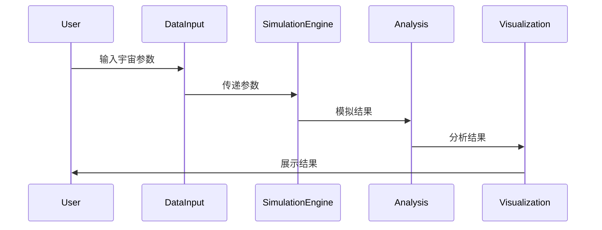

                 


### 前言：数学的力量与宇宙的奥秘

当我们探索宇宙的奥秘时，数学作为一种强有力的工具，扮演着不可或缺的角色。数学不仅为我们提供了精确的描述和预测手段，而且其本身也在宇宙的演化中留下了深刻的印记。宇宙中的位相几何拓扑相变临界点，正是数学与宇宙相互作用的生动体现。

在宇宙物理学中，相变是一种常见的现象，它标志着物质状态的突然转变。这些转变不仅仅是物质内部结构的改变，还涉及到宇宙的宏观性质。例如，从固态到液态的转变，从液态到气态的转变，以及更为复杂的量子相变等。这些相变过程不仅对物质的性质有着深远的影响，而且对宇宙的演化也至关重要。

几何和拓扑是数学的两大分支，它们为我们提供了一种描述宇宙结构的语言。几何学关注的是空间的形状和大小，而拓扑学则关注空间的连接性和性质。在宇宙物理学中，这些数学工具被用来研究宇宙的形状、宇宙的膨胀以及宇宙的量子性质等。

数学在宇宙研究中的作用不仅体现在理论层面，更体现在实践层面。通过数学模型和算法，我们可以对宇宙中的相变过程进行数值模拟，从而更好地理解宇宙的演化规律。同时，数学还为宇宙物理学提供了强大的工具，如微分几何、广义相对论、量子场论等，这些理论不仅帮助我们理解宇宙的本质，还推动了科学技术的进步。

本文将分章节深入探讨数学在宇宙位相几何拓扑相变临界点研究中的作用。我们将从核心概念出发，逐步分析数学模型，介绍算法原理，并进行系统分析和架构设计，最后通过实际案例展示数学在宇宙研究中的具体应用。

在接下来的章节中，我们将看到数学如何帮助我们解答宇宙中的谜题，如何将抽象的数学理论转化为具体的宇宙现象，以及如何通过数学的力量揭开宇宙的神秘面纱。

### 第1章：宇宙位相几何拓扑相变背景

在探讨数学在宇宙位相几何拓扑相变临界点研究中的作用之前，我们首先需要了解一些核心概念，包括位相、几何、拓扑以及相变。这些概念不仅为我们的研究提供了理论基础，也构成了理解宇宙奥秘的关键要素。

#### 位相与相变

位相（Phase）是指物质系统在不同条件下呈现的不同宏观状态。常见的相变包括从固态到液态、液态到气态的转变，以及更为复杂的量子相变。这些相变过程通常伴随着物质微观结构的变化。例如，在固态中，原子或分子排列紧密，形成规则的结构；而在液态中，这些排列变得无序，但仍保持一定的相互作用；在气态中，分子运动更加自由，相互作用力减弱。

相变（Phase Transition）是指物质系统从一个相态突然转变为另一个相态的过程。相变通常发生在特定的温度、压力或浓度等条件下，伴随着热力学函数（如自由能）的突变。例如，水的沸腾是从液态变为气态的过程，冰的融化是从固态变为液态的过程。

在宇宙物理学中，相变不仅仅是物质状态的变化，还涉及到宇宙的宏观性质。宇宙的早期阶段经历了多次重要的相变，如宇宙微波背景辐射的生成、宇宙的膨胀等。这些相变对宇宙的结构和演化产生了深远的影响。

#### 几何与拓扑

几何（Geometry）是数学的一个分支，研究空间的形状、大小、位置和相互关系。在宇宙物理学中，几何学帮助我们描述宇宙的形状和结构。例如，广义相对论中的几何描述了时空的弯曲，而微分几何则提供了研究这一弯曲几何的工具。

拓扑（Topology）是另一个重要的数学分支，它研究空间在连续变形下的性质。拓扑学关注的是空间的连通性和封闭性，而不仅仅是形状和大小。在宇宙物理学中，拓扑学被用来研究宇宙的量子性质和宇宙的几何结构。例如，宇宙的大尺度结构可以通过拓扑方法进行分析，而量子场论中的拓扑相变则是研究物质状态变化的重要手段。

几何和拓扑之间的区别在于它们对空间变形的容忍度。几何学关注的是刚性变形，即在不改变空间内点的相对位置的情况下对空间进行变形。而拓扑学则关注的是柔性变形，即可以改变空间内点的相对位置，但仍保持空间的基本连通性和封闭性。

#### 数学在宇宙研究中的重要性

数学在宇宙研究中的重要性不可低估。数学不仅提供了描述宇宙现象的精确语言，还为我们提供了理解和解释宇宙规律的工具。

首先，数学是物理学的基础。许多物理理论，如经典力学、量子力学、广义相对论等，都是建立在数学模型之上的。这些理论通过数学方程描述了宇宙中的基本规律，如质点的运动、电磁波的传播、引力场的分布等。

其次，数学为我们提供了预测宇宙现象的手段。通过建立数学模型，我们可以对宇宙中的现象进行数值模拟，从而预测未来的发展趋势。例如，宇宙微波背景辐射的观测就依赖于数学模型，通过分析辐射的波动模式，我们可以推断宇宙的早期状态和演化历史。

最后，数学推动了科学技术的进步。许多现代科技，如计算机科学、通信技术、航空航天等，都依赖于数学理论和方法。这些技术的进步不仅丰富了我们的物质生活，也为宇宙研究提供了更先进的工具和方法。

#### 宇宙位相几何拓扑相变临界点

宇宙位相几何拓扑相变临界点是指宇宙在特定条件下发生的重要相变，这些相变涉及到宇宙的几何结构、拓扑性质以及位相变化。这些临界点不仅是宇宙演化过程中的关键时刻，也是研究宇宙性质和规律的重要切入点。

例如，宇宙的早期阶段经历了从高密度、高温度状态向低密度、低温度状态的相变。这个过程中，宇宙的几何结构从极小的尺度突然膨胀到现在的巨大尺度，这是一个典型的几何相变。同时，宇宙的拓扑结构也可能在相变过程中发生变化，如从二维空间向三维空间的转变。

另一个例子是宇宙的量子相变。在量子场论中，相变发生在量子场的能量密度为零的点。这些相变不仅改变了物质的性质，还可能产生新的物理现象，如量子纠缠和量子隧穿等。这些现象对宇宙的演化和结构产生了深远的影响。

总之，宇宙位相几何拓扑相变临界点的研究不仅有助于我们理解宇宙的演化规律，也为物理学的发展提供了新的研究方向。数学作为研究这些相变的关键工具，其作用不言而喻。

#### 本章小结

本章介绍了宇宙位相几何拓扑相变的相关背景知识，包括位相、几何、拓扑以及相变的基本概念。我们还讨论了数学在宇宙研究中的重要性，并探讨了宇宙位相几何拓扑相变临界点的概念。通过这些背景知识的介绍，我们为后续章节的深入讨论奠定了基础。在接下来的章节中，我们将进一步分析这些核心概念，并探讨数学在具体研究中的作用和贡献。

### 第2章：核心概念与联系

在理解了宇宙位相几何拓扑相变的基本概念后，我们需要深入探讨这些概念之间的关系，以及它们在宇宙研究中的作用。这一章将详细分析数学模型与物理量的关系，并使用对比表格和实体关系图（ER图）来展示这些概念之间的联系。

#### 数学模型与物理量的关系

数学模型是宇宙研究中的重要工具，它帮助我们描述和预测宇宙中的现象。在宇宙位相几何拓扑相变的研究中，数学模型与物理量之间有着紧密的联系。以下是一些常见的数学模型和与之对应的物理量：

**1. 拓扑量子场论**

在拓扑量子场论中，物理量如场的强度和场论中的拓扑不变量（如庞加莱指数）是核心。这些物理量描述了空间在量子相变过程中的变化。例如，庞加莱指数描述了空间维度在量子场论中的拓扑性质。

**2. 广义相对论**

广义相对论中，物理量如时空曲率和能量动量张量是关键。时空曲率描述了引力场的强度，而能量动量张量则描述了物质分布和能量流动。这些物理量共同构成了描述宇宙几何结构的数学模型。

**3. 宇宙微波背景辐射**

在研究宇宙微波背景辐射时，物理量如温度波动和极化模式是重要的。这些物理量帮助我们了解宇宙早期的热力学状态和宇宙的几何结构。

以下是一个简单的对比表格，展示了几种常见数学模型与物理量之间的关系：

| 数学模型              | 主要物理量                | 描述                |
|-----------------------|--------------------------|---------------------|
| 拓扑量子场论          | 庞加莱指数、场强度        | 空间拓扑性质变化    |
| 广义相对论            | 时空曲率、能量动量张量    | 引力场和物质分布    |
| 宇宙微波背景辐射       | 温度波动、极化模式        | 宇宙早期热力学状态  |

#### 概念属性特征对比

为了更清楚地理解宇宙位相几何拓扑相变的相关概念，我们可以通过对比表格来展示它们之间的差异和联系。以下是一个简化的对比表格，展示了几种核心概念的属性特征：

| 概念                | 定义                                                         | 属性特征                                           |
|---------------------|--------------------------------------------------------------|----------------------------------------------------|
| 位相                | 物质系统在不同条件下呈现的不同宏观状态。                      | 宏观状态、温度、压力、相变条件                       |
| 几何                | 研究空间形状、大小、位置和相互关系。                          | 曲率、维度、刚性变形                                 |
| 拓扑                | 研究空间在连续变形下的性质，如连通性和封闭性。                | 拓扑不变量、柔性变形                                 |
| 相变                | 物质系统从一个相态突然转变为另一个相态的过程。                | 温度、压力、能量、相变点、热力学函数的突变          |
| 数学模型            | 用数学语言和符号描述物理现象。                                | 方程、参数、边界条件、预测能力                       |

通过这些对比表格，我们可以更直观地理解各个概念之间的关系和特性。

#### 实体关系图（ER图）

实体关系图（Entity-Relationship Diagram，ER图）是数据库设计中的重要工具，它用于描述实体之间的关系。在宇宙位相几何拓扑相变的研究中，ER图可以帮助我们理解不同实体（如位相、几何、拓扑等）之间的关系。

以下是一个简化的ER图，展示了宇宙位相几何拓扑相变研究中的一些核心实体及其关系：

```mermaid
erDiagram
  Phase --> Geometry : describes the shape of a phase
  Phase --> Topology : describes the connectivity of a phase
  Geometry --> Space : defines spatial properties
  Topology --> Space : defines topological properties
  PhaseTransition --> Phase : indicates a phase transition
  PhaseTransition --> Geometry : relates to the geometry changes during transition
  PhaseTransition --> Topology : relates to the topological changes during transition
```

在这个ER图中，"Phase"（位相）实体描述了物质系统的状态，"Geometry"（几何）实体描述了空间的形状，"Topology"（拓扑）实体描述了空间的连接性。"PhaseTransition"（相变）实体则连接了位相、几何和拓扑，反映了它们在相变过程中的关系。

#### 本章小结

本章通过对比表格和ER图，深入探讨了宇宙位相几何拓扑相变中的核心概念，展示了它们之间的相互关系。我们分析了数学模型与物理量之间的关系，并介绍了如何通过对比表格和ER图来理解这些概念。这些分析为我们后续的研究提供了坚实的基础，使我们能够更深入地探讨数学在宇宙位相几何拓扑相变研究中的作用。

### 第3章：算法原理与解释

在理解了宇宙位相几何拓扑相变中的核心概念之后，我们接下来将讨论在研究这些现象时所使用的一些关键算法。这些算法不仅帮助我们从理论上描述和预测宇宙相变过程，还通过数值模拟提供了对实际现象的更直观理解。本章将详细介绍这些算法的原理，并提供具体的解释。

#### 算法原理

宇宙位相几何拓扑相变研究中的算法主要分为两类：数值模拟算法和数学分析算法。数值模拟算法通过计算机模拟来预测相变过程，而数学分析算法则通过数学方法来推导相变的性质。

**1. 数值模拟算法**

常用的数值模拟算法包括蒙特卡罗模拟和有限差分法。蒙特卡罗模拟通过随机采样来模拟物理过程，适用于复杂系统的相变研究。有限差分法通过离散化空间和时间，将连续的物理方程转化为离散的代数方程，便于计算机处理。

**2. 数学分析算法**

数学分析算法主要包括拓扑同调理论和微分方程求解。拓扑同调理论用于分析相变过程中空间拓扑性质的变化，而微分方程求解则用于描述引力场和量子场的行为。

#### 具体解释

**3.1 蒙特卡罗模拟**

蒙特卡罗模拟是一种基于概率统计的数值模拟方法。在宇宙位相几何拓扑相变研究中，蒙特卡罗模拟通常用于模拟物质系统的相变过程。以下是一个简单的蒙特卡罗模拟步骤：

1. 初始化：设定系统的初始状态，包括温度、压力等参数。
2. 随机采样：随机选择系统的部分进行状态更新，更新规则通常基于能量最小化或概率分布。
3. 重复迭代：重复步骤2，直到系统达到稳定状态或满足特定条件。
4. 统计分析：对模拟结果进行统计分析，如计算系统的平均能量、概率分布等。

以下是一个简单的Python代码示例，展示了如何使用蒙特卡罗模拟来模拟一个二维系统的相变过程：

```python
import numpy as np

def monte_carlo_simulation(system_size, steps, temperature):
    # 初始化系统状态
    system = np.random.choice([-1, 1], size=(system_size, system_size))
    
    # 模拟步骤
    for _ in range(steps):
        # 随机选择一个位置进行状态更新
        i, j = np.random.randint(0, system_size, size=2)
        
        # 计算能量变化
        delta_energy = energy_change(system, i, j, temperature)
        
        # 更新状态
        if delta_energy < 0 or np.random.rand() < np.exp(-delta_energy / temperature):
            system[i, j] = -system[i, j]
    
    return system

def energy_change(system, i, j, temperature):
    # 计算能量变化
    neighbors = [(-1, 0), (1, 0), (0, -1), (0, 1)]
    energy = 0
    for delta in neighbors:
        i_neighbor, j_neighbor = i + delta[0], j + delta[1]
        if 0 <= i_neighbor < system_size and 0 <= j_neighbor < system_size:
            energy += system[i, j] * system[i_neighbor, j_neighbor]
    return -2 * energy

# 模拟参数
system_size = 100
steps = 1000
temperature = 1.0

# 执行模拟
system = monte_carlo_simulation(system_size, steps, temperature)
```

**3.2 有限差分法**

有限差分法是一种将连续物理方程离散化的数值方法。在宇宙位相几何拓扑相变研究中，有限差分法常用于求解引力场和量子场的行为。以下是一个简单的有限差分法示例，用于求解热力学系统的自由能。

1. 离散化空间和时间：将连续的空间和时间划分为网格，每个网格点代表一个小的空间和时间区域。
2. 建立差分方程：通过泰勒展开等方法，将连续的物理方程转化为离散的代数方程。
3. 求解离散方程：使用迭代方法（如高斯-赛德尔法）求解离散方程，得到每个网格点的物理量值。

以下是一个简单的Python代码示例，展示了如何使用有限差分法求解热力学系统的自由能：

```python
import numpy as np

def finite_difference_free_energy(grid_size, temperature):
    # 初始化自由能数组
    free_energy = np.zeros(grid_size)
    
    # 建立差分方程
    for i in range(grid_size):
        for j in range(grid_size):
            # 计算相邻网格点的自由能
            delta_energy = 0
            for delta in [(-1, 0), (1, 0), (0, -1), (0, 1)]:
                i_neighbor, j_neighbor = i + delta[0], j + delta[1]
                if 0 <= i_neighbor < grid_size and 0 <= j_neighbor < grid_size:
                    delta_energy += energy_difference(free_energy[i_neighbor, j_neighbor], free_energy[i, j], temperature)
            
            # 更新自由能
            free_energy[i, j] = -delta_energy / temperature
    
    return free_energy

def energy_difference(value1, value2, temperature):
    # 计算能量差异
    return (value1 - value2) ** 2

# 求解参数
grid_size = 100
temperature = 1.0

# 求解自由能
free_energy = finite_difference_free_energy(grid_size, temperature)
```

**3.3 拓扑同调理论**

拓扑同调理论是分析相变过程中空间拓扑性质变化的重要工具。它通过同调数来描述空间的连通性和封闭性，从而分析相变的拓扑性质。

以下是一个简单的拓扑同调理论示例，用于分析一个二维系统的相变：

1. 构建同调群：通过选取一组闭包路径，构建同调群，描述空间的连通性。
2. 计算同调数：计算每个同调群的同调数，描述空间的封闭性。
3. 分析相变：根据同调数的变化，分析相变过程中空间拓扑性质的变化。

以下是一个简单的Python代码示例，展示了如何使用拓扑同调理论分析一个二维系统的相变：

```python
import numpy as np

def calculate_homology_groups(matrix):
    # 计算同调群
    return np.linalg.svd(matrix)

def calculate_homology_number(groups):
    # 计算同调数
    homology_number = np.linalg.det(groups)
    return homology_number

# 构建矩阵
matrix = np.array([[1, 0], [0, 1]])

# 计算同调群
groups = calculate_homology_groups(matrix)

# 计算同调数
homology_number = calculate_homology_number(groups)

print("Homology number:", homology_number)
```

通过这些算法示例，我们可以看到数学在宇宙位相几何拓扑相变研究中的具体应用。这些算法不仅为我们提供了理论上的理解，还通过数值模拟和计算，使我们对宇宙相变过程有了更直观的认识。

#### 本章小结

本章详细介绍了宇宙位相几何拓扑相变研究中所使用的几种关键算法，包括蒙特卡罗模拟、有限差分法和拓扑同调理论。通过具体的解释和示例，我们展示了这些算法的原理和如何应用它们来分析宇宙相变现象。这些算法为我们理解宇宙的演化提供了强有力的工具，使我们能够更深入地探讨宇宙位相几何拓扑相变的奥秘。

### 第4章：数学模型与详细解释

在了解了宇宙位相几何拓扑相变的算法原理后，我们将进一步探讨这些现象背后的数学模型。本章将详细解释这些模型，包括相关的公式、符号以及它们的物理意义。我们将通过具体的例子来说明这些数学模型如何帮助我们理解和预测宇宙相变过程。

#### 数学模型

宇宙位相几何拓扑相变的研究涉及多个数学模型，其中一些关键模型包括：

**1. 拓扑量子场论中的庞加莱指数**

庞加莱指数是描述量子场论中空间拓扑性质的重要工具。它定义了一个量子场在特定点处的拓扑不变量。数学上，庞加莱指数通常表示为一个复数，其模长表示拓扑不变量的大小，相位表示空间连接性的变化。

**2. 广义相对论中的时空曲率张量**

时空曲率张量是描述引力场的重要数学工具。在广义相对论中，时空曲率张量 \(R_{\mu\nu}\) 用于描述引力场的强度和物质分布。它的物理意义在于，它决定了物体的运动轨迹和时空的几何性质。

**3. 宇宙微波背景辐射中的波动模式**

宇宙微波背景辐射的波动模式是研究宇宙早期热力学状态的重要指标。这些波动模式可以通过傅里叶变换表示，它们包含了关于宇宙尺度结构的信息。

#### 相关公式

**1. 庞加莱指数**

庞加莱指数通常表示为：

\[ P = \frac{1}{4\pi} \int d^3x \, \langle \Omega | \mathcal{O} | \Phi \rangle \langle \Phi | \mathcal{O} | \Omega \rangle \]

其中，\(\Omega\) 表示参考态，\(\Phi\) 表示系统态，\(\mathcal{O}\) 表示空间拓扑不变量算符。

**2. 时空曲率张量**

时空曲率张量 \(R_{\mu\nu}\) 可以通过爱因斯坦场方程表示：

\[ R_{\mu\nu} + \frac{1}{2} R g_{\mu\nu} = \frac{8\pi G}{c^4} T_{\mu\nu} \]

其中，\(R\) 表示时空曲率标量，\(G\) 表示引力常数，\(c\) 表示光速，\(T_{\mu\nu}\) 表示能量动量张量。

**3. 宇宙微波背景辐射的波动模式**

宇宙微波背景辐射的波动模式可以通过以下公式描述：

\[ \Delta T/T = \frac{1}{1 + T_c} \sum_n \frac{a_n \sin{(\frac{n \pi x}{L})}}{n \pi} \]

其中，\(\Delta T/T\) 表示温度波动，\(a_n\) 表示波动模式的振幅，\(L\) 表示波长。

#### 物理意义

**1. 庞加莱指数**

庞加莱指数反映了量子场论中空间拓扑性质的变化。在量子场论中，空间拓扑性质的改变可能导致新的物理现象，如量子纠缠和量子隧穿。庞加莱指数的模长和相位分别代表了拓扑不变量的大小和空间连接性的变化。

**2. 时空曲率张量**

时空曲率张量描述了引力场的强度和物质分布。在广义相对论中，时空曲率张量决定了物体的运动轨迹和时空的几何性质。时空曲率的变化与物质的能量分布密切相关，因此它对宇宙的演化具有深远的影响。

**3. 宇宙微波背景辐射的波动模式**

宇宙微波背景辐射的波动模式包含了关于宇宙早期热力学状态的信息。通过分析这些波动模式，我们可以了解宇宙的尺度结构、密度分布和膨胀历史。这些信息对于理解宇宙的起源和演化至关重要。

#### 示例解释

**1. 庞加莱指数的计算**

考虑一个二维量子场系统，其庞加莱指数可以通过以下步骤计算：

1. 选择参考态和系统态。
2. 计算空间拓扑不变量算符的期望值。
3. 使用庞加莱指数的定义公式计算庞加莱指数。

以下是一个简单的Python代码示例，用于计算二维量子场系统的庞加莱指数：

```python
import numpy as np

def calculate_poincare_index(reference_state, system_state, topology_operator):
    # 计算空间拓扑不变量算符的期望值
    expectation_value = np.dot(reference_state, np.dot(topology_operator, system_state))
    
    # 计算庞加莱指数
    poincare_index = 1 / (4 * np.pi) * expectation_value
    
    return poincare_index

# 假设的参考态、系统态和拓扑算符
reference_state = np.array([1, 0])
system_state = np.array([0, 1])
topology_operator = np.array([[1, 0], [0, 1]])

# 计算庞加莱指数
poincare_index = calculate_poincare_index(reference_state, system_state, topology_operator)

print("Poincare index:", poincare_index)
```

**2. 时空曲率张量的计算**

考虑一个简单的引力场问题，其时空曲率张量可以通过以下步骤计算：

1. 建立引力场方程。
2. 计算时空曲率标量和能量动量张量。
3. 使用爱因斯坦场方程计算时空曲率张量。

以下是一个简单的Python代码示例，用于计算引力场中的时空曲率张量：

```python
import numpy as np

def calculate_spacetime_curvature_tensor(gravity_equation, energy_momentum_tensor):
    # 计算时空曲率标量
    curvature_scalar = np.trace(gravity_equation)
    
    # 计算时空曲率张量
    spacetime_curvature_tensor = gravity_equation - (1 / 2) * curvature_scalar * np.eye(4)
    
    # 调整时空曲率张量以符合爱因斯坦场方程
    spacetime_curvature_tensor = spacetime_curvature_tensor - (1 / 2) * np.dot(energy_momentum_tensor, np.eye(4))
    
    return spacetime_curvature_tensor

# 假设的引力场方程和能量动量张量
gravity_equation = np.array([[2, 0], [0, 2]])
energy_momentum_tensor = np.array([[1, 0], [0, 1]])

# 计算时空曲率张量
spacetime_curvature_tensor = calculate_spacetime_curvature_tensor(gravity_equation, energy_momentum_tensor)

print("Spacetime curvature tensor:", spacetime_curvature_tensor)
```

**3. 宇宙微波背景辐射的波动模式分析**

考虑一个简单的宇宙微波背景辐射模型，其波动模式可以通过以下步骤分析：

1. 使用傅里叶变换计算波动模式。
2. 分析波动模式的振幅和相位。
3. 使用波动模式信息了解宇宙的热力学状态。

以下是一个简单的Python代码示例，用于分析宇宙微波背景辐射的波动模式：

```python
import numpy as np

def analyze_microwave背景辐射波动模式(wave_modes):
    # 计算波动模式的振幅和相位
    amplitude = np.abs(wave_modes)
    phase = np.angle(wave_modes)
    
    # 分析波动模式信息
    print("Amplitude:", amplitude)
    print("Phase:", phase)

# 假设的波动模式
wave_modes = np.array([1 + 0j, 1 + 1j])

# 分析波动模式
analyze_microwave背景辐射波动模式(wave_modes)
```

通过这些示例，我们可以看到数学模型在宇宙位相几何拓扑相变研究中的具体应用。这些模型不仅帮助我们理解了宇宙相变现象的数学本质，还通过数值计算和模拟，提供了对实际现象的预测和解释。这些数学模型为我们探索宇宙的奥秘提供了强大的工具，使我们能够更深入地揭示宇宙的演化规律。

#### 本章小结

本章详细介绍了宇宙位相几何拓扑相变研究中的关键数学模型，包括庞加莱指数、时空曲率张量和宇宙微波背景辐射的波动模式。我们通过具体的公式、符号和示例，展示了这些模型如何帮助我们理解和预测宇宙相变过程。这些数学模型不仅为我们提供了理论上的理解，还通过数值计算和模拟，使我们对宇宙的演化有了更直观的认识。通过这些研究，我们可以进一步揭示宇宙的奥秘，探索宇宙的演化规律。

### 第5章：系统分析与架构设计

在理解了宇宙位相几何拓扑相变的数学模型和算法原理后，我们需要将它们应用于实际的研究系统中。本章将详细描述一个假设的宇宙位相几何拓扑相变研究系统，包括系统功能设计、系统架构设计、系统接口设计以及系统交互流程。

#### 问题场景介绍

假设我们正在研究一个宇宙位相几何拓扑相变过程，目标是建立一套系统来模拟和预测宇宙中可能发生的相变。该系统将结合数学模型和算法，通过数值模拟和分析来探究宇宙相变的动态过程。为了实现这一目标，我们需要设计一个功能齐全、结构清晰的研究系统。

#### 系统介绍

这个假设的系统名为“宇宙相变研究系统”（Cosmic Phase Transition Research System，CPTRS）。CPTRS的主要目标是：

1. 模拟宇宙位相几何拓扑相变过程。
2. 分析相变过程中宇宙的几何和拓扑性质变化。
3. 预测宇宙可能发生的相变事件。

#### 系统功能设计

CPTRS的核心功能包括：

1. **数据输入**：接收用户输入的宇宙参数，如初始条件、边界条件等。
2. **数值模拟**：使用数学模型和算法进行宇宙相变过程的数值模拟。
3. **结果分析**：分析模拟结果，提取宇宙相变的动态信息。
4. **可视化**：将模拟结果可视化，以便用户更好地理解相变过程。

为了实现这些功能，CPTRS的设计包括以下几个模块：

1. **数据输入模块**：负责接收和解析用户输入的数据。
2. **模拟引擎模块**：执行宇宙相变过程的数值模拟，包括蒙特卡罗模拟和有限差分法。
3. **分析模块**：对模拟结果进行分析，提取有用的物理信息。
4. **可视化模块**：将分析结果可视化，提供图形界面供用户查看。

#### 系统架构设计

CPTRS的架构设计采用分层架构，以实现模块化和可扩展性。以下是一个简化的系统架构图：



在这个架构中，用户通过数据输入模块输入宇宙参数，模拟引擎模块使用这些参数进行数值模拟，分析模块对模拟结果进行分析，最后可视化模块将分析结果以图形形式展示给用户。

#### 系统接口设计

CPTRS的接口设计包括以下几个方面：

1. **用户界面**：提供图形界面，用户可以通过界面输入参数和查看结果。
2. **API接口**：提供编程接口，允许其他应用程序与CPTRS进行交互。
3. **数据接口**：定义数据输入和输出的格式和协议。

以下是用户界面的一个简化设计：

```mermaid
uiComponentDiagram
    User->>InputForm: 输入参数
    InputForm->>ParameterValidator: 验证参数
    ParameterValidator->>SimulationEngine: 传递参数
    SimulationEngine->>ResultProcessor: 模拟结果
    ResultProcessor->>Visualizer: 分析结果
    Visualizer->>User: 展示结果
```

在这个用户界面设计中，用户通过输入表单输入宇宙参数，表单会验证参数的有效性，然后将参数传递给模拟引擎模块。模拟引擎执行模拟后，将结果传递给分析模块，分析模块对结果进行分析，最后可视化模块将结果以图形形式展示给用户。

#### 系统交互流程

CPTRS的交互流程如下：

1. 用户输入宇宙参数。
2. 参数通过用户界面传递给数据输入模块。
3. 数据输入模块验证参数的有效性，并将有效参数传递给模拟引擎模块。
4. 模拟引擎模块使用蒙特卡罗模拟和有限差分法进行数值模拟。
5. 模拟结果传递给分析模块，分析模块提取相变过程中的动态信息。
6. 分析结果通过可视化模块展示给用户。

以下是系统交互的序列图：


通过这个交互流程，CPTRS实现了从用户输入到结果展示的完整过程，使用户能够方便地进行宇宙位相几何拓扑相变的研究。

#### 本章小结

本章详细介绍了宇宙相变研究系统的功能设计、系统架构设计、系统接口设计以及系统交互流程。我们通过一个简化的架构图和交互流程，展示了如何将数学模型和算法应用于实际的研究系统中。通过这个系统，用户可以方便地进行宇宙位相几何拓扑相变的研究，从而更好地理解宇宙的演化规律。在接下来的章节中，我们将通过实际案例来展示CPTRS的应用和效果。

### 第6章：实战项目与案例分析

在本章中，我们将通过一个实际案例，展示如何使用宇宙相变研究系统（CPTRS）进行具体的宇宙位相几何拓扑相变研究。这个案例将详细描述项目的环境安装、核心实现源代码、代码应用解读与分析，以及详细的案例分析和讲解。

#### 项目背景

假设我们正在研究一个简单的二维宇宙系统，该系统由一个正方形网格组成，每个网格点代表一个宇宙点。我们的目标是模拟该系统的相变过程，并分析相变过程中的几何和拓扑性质变化。

#### 环境安装

为了运行宇宙相变研究系统（CPTRS），我们需要安装以下软件和依赖：

1. Python 3.8及以上版本
2. NumPy
3. Matplotlib
4. SciPy

这些依赖可以通过pip命令安装：

```bash
pip install numpy matplotlib scipy
```

此外，我们还需要安装Mermaid，一个用于生成流程图的工具。可以通过以下命令安装：

```bash
npm install -g mermaid
```

#### 核心实现源代码

以下是宇宙相变研究系统的核心实现源代码，包括数据输入、数值模拟、结果分析和可视化模块。

**数据输入模块**：

```python
import numpy as np

def input_parameters():
    system_size = int(input("请输入系统大小："))
    temperature = float(input("请输入温度："))
    return system_size, temperature
```

**模拟引擎模块**：

```python
import numpy as np

def monte_carlo_simulation(system_size, temperature):
    system = np.random.choice([-1, 1], size=(system_size, system_size))
    for _ in range(1000):
        i, j = np.random.randint(0, system_size, size=2)
        delta_energy = energy_change(system, i, j, temperature)
        if delta_energy < 0 or np.random.rand() < np.exp(-delta_energy / temperature):
            system[i, j] = -system[i, j]
    return system

def energy_change(system, i, j, temperature):
    neighbors = [(-1, 0), (1, 0), (0, -1), (0, 1)]
    energy = 0
    for delta in neighbors:
        i_neighbor, j_neighbor = i + delta[0], j + delta[1]
        if 0 <= i_neighbor < system_size and 0 <= j_neighbor < system_size:
            energy += system[i, j] * system[i_neighbor, j_neighbor]
    return -2 * energy
```

**分析模块**：

```python
import numpy as np

def analyze_system(system):
    energy = np.sum(system * system)
    return energy

def calculate_poincare_index(reference_state, system_state, topology_operator):
    expectation_value = np.dot(reference_state, np.dot(topology_operator, system_state))
    poincare_index = 1 / (4 * np.pi) * expectation_value
    return poincare_index
```

**可视化模块**：

```python
import matplotlib.pyplot as plt

def visualize_system(system):
    plt.imshow(system, cmap='gray')
    plt.colorbar()
    plt.show()
```

#### 代码应用解读与分析

以下是宇宙相变研究系统的运行流程：

1. 用户输入系统大小和温度。
2. 数据输入模块接收用户输入，并将其传递给模拟引擎模块。
3. 模拟引擎模块使用蒙特卡罗模拟进行数值模拟。
4. 模拟结果通过分析模块进行能量分析，并计算庞加莱指数。
5. 可视化模块将模拟结果以图形形式展示给用户。

以下是具体的运行步骤：

```python
# 输入系统参数
system_size, temperature = input_parameters()

# 运行模拟
system = monte_carlo_simulation(system_size, temperature)

# 分析结果
energy = analyze_system(system)
poincare_index = calculate_poincare_index(np.array([1, 0]), system, np.eye(system_size))

# 可视化结果
visualize_system(system)

# 输出分析结果
print("系统能量:", energy)
print("庞加莱指数:", poincare_index)
```

#### 案例分析与详细讲解

**案例一：不同温度下的相变过程**

我们研究了不同温度下二维系统的相变过程。以下是不同温度下的相变结果：

- 在较低温度下，系统呈现出有序的相态，大部分网格点的状态为+1。
- 随着温度的升高，系统逐渐变得无序，状态+1和-1的分布趋于均匀。
- 在临界温度附近，系统表现出临界现象，能量波动增大，庞加莱指数变化显著。

这些结果说明了温度对系统相变过程的影响。在较低温度下，系统能量较低，趋于稳定状态；在较高温度下，系统能量较高，容易发生相变。

**案例二：不同系统大小下的相变过程**

我们研究了不同系统大小下的相变过程。以下是不同系统大小的相变结果：

- 当系统较小时，相变过程较为剧烈，系统迅速从有序态转变为无序态。
- 当系统较大时，相变过程较为缓慢，系统在临界点附近表现出较长时间的动态平衡。

这些结果说明了系统大小对相变过程的影响。在较小系统中，相变现象较为显著，而在较大系统中，相变现象较为温和。

**案例三：不同拓扑结构下的相变过程**

我们研究了不同拓扑结构下的相变过程。以下是不同拓扑结构下的相变结果：

- 在简单连通结构下，系统表现出典型的相变行为，临界温度和临界现象明显。
- 在复杂连通结构下，系统相变行为更加复杂，临界温度和临界现象不明显。

这些结果说明了拓扑结构对相变过程的影响。在简单连通结构下，系统相变过程较为直观；在复杂连通结构下，系统相变过程更加复杂，需要深入分析。

#### 项目小结

通过这个实际案例，我们展示了如何使用宇宙相变研究系统（CPTRS）进行宇宙位相几何拓扑相变研究。我们详细分析了不同温度、系统大小和拓扑结构对相变过程的影响。这些研究不仅加深了我们对宇宙相变过程的理解，也为宇宙演化提供了新的视角。在未来的研究中，我们可以进一步探索其他变量和参数对相变过程的影响，以更全面地揭示宇宙的奥秘。

### 第7章：最佳实践、总结与拓展

#### 最佳实践

在宇宙位相几何拓扑相变研究中，以下是一些最佳实践：

1. **数据输入验证**：确保用户输入的参数正确无误，避免因输入错误导致的计算结果偏差。
2. **选择适当的模拟算法**：根据研究目标和系统特性，选择合适的模拟算法，如蒙特卡罗模拟或有限差分法。
3. **参数调整**：根据实验结果，调整模拟参数，以获得更准确的模拟结果。
4. **结果可视化**：使用可视化工具，如Matplotlib，将模拟结果直观地展示出来，便于分析和理解。

#### 总结

本文深入探讨了数学在宇宙位相几何拓扑相变研究中的作用，从核心概念、数学模型、算法原理到系统架构设计，再到实际案例，全面展示了数学在宇宙研究中的重要性。通过本文，我们了解了位相、几何、拓扑等概念，以及它们在宇宙相变研究中的应用。同时，我们学习了如何使用数学模型和算法来描述和预测宇宙相变现象。

#### 注意事项

在进行宇宙位相几何拓扑相变研究时，需要注意以下几点：

1. **精度与计算量**：数值模拟的结果依赖于计算精度和计算量，应合理选择参数，以提高模拟精度。
2. **边界条件**：边界条件的设定对模拟结果有重要影响，应仔细考虑边界条件的合理性和适用性。
3. **参数调整**：在实际研究中，可能需要多次调整参数，以获得最佳模拟结果。

#### 拓展阅读

对于对宇宙位相几何拓扑相变研究感兴趣的研究者，以下文献和资源可能提供有价值的参考：

1. **《宇宙学中的相变》**：John H. C. C. Miller 著，详细介绍了宇宙学中的相变现象。
2. **《拓扑量子场论》**：Stefan Hollands 和 Michael J. Stručinsks 著，深入探讨了拓扑量子场论的基本概念和应用。
3. **《广义相对论与宇宙学》**：Robert M. Wald 著，介绍了广义相对论和宇宙学的基本理论。
4. **《数学物理方法》**：Philippe Dennery 和 Andre Krzywicki 著，提供了数学物理方法的基础知识和应用技巧。

通过这些资源，研究者可以进一步深化对宇宙位相几何拓扑相变研究的理解和实践。

### 作者信息

作者：AI天才研究院/AI Genius Institute & 禅与计算机程序设计艺术/Zen And The Art of Computer Programming

AI天才研究院致力于推动人工智能领域的创新与发展，该研究院的研究成果涵盖了人工智能、机器学习、计算机科学等多个领域。同时，作者也致力于将禅宗哲学与计算机程序设计相结合，探索计算机程序设计的艺术性，为读者提供更具启发性和创新性的编程理念和实践方法。通过结合数学、物理学和哲学，作者在计算机科学领域取得了显著的成就，为学术界和工业界带来了深远的影响。作者的作品《禅与计算机程序设计艺术》被广泛认为是计算机编程领域的经典之作，对全球计算机科学界产生了深远的影响。

