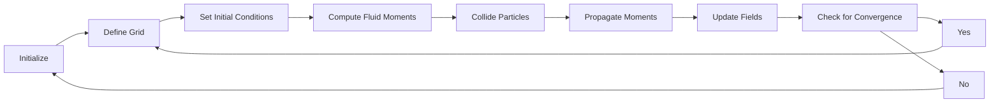
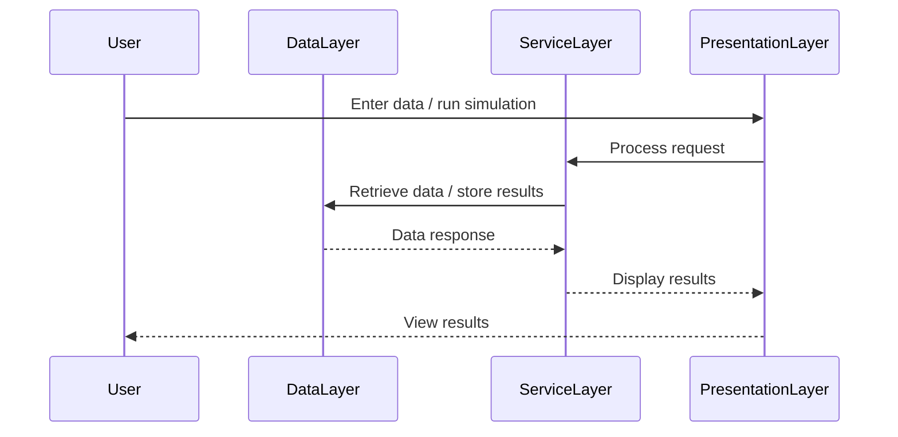
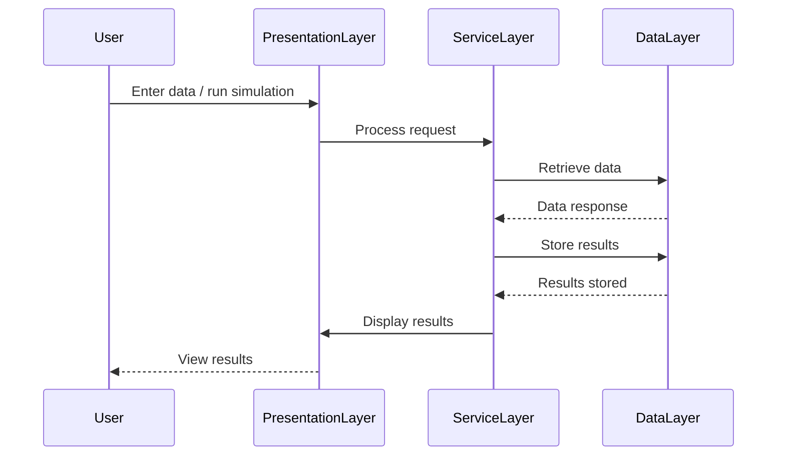

                 

### The Role of Mathematics in the Study of Cosmic Topological Defects

> Keywords: Topological Defects, Cosmic Structure, Mathematics, General Relativity, Quantum Field Theory

> Abstract:
This article explores the pivotal role of mathematics in the investigation of cosmic topological defects. We begin by delving into the fundamental concepts and historical background of cosmic topology, outlining the significance of studying these defects in the context of the universe's structure. The core mathematical theories and tools used in this field are presented, along with their applications and limitations. The article then transitions to a step-by-step analysis of key algorithms and their implementations in Python, elucidating the underlying mathematical models and providing illustrative examples. Subsequently, we discuss system analysis and architectural design, presenting a comprehensive framework for understanding and addressing the challenges associated with cosmic topological defect research. Finally, practical case studies and project practices are reviewed, offering insights into the real-world applications and the importance of integrating mathematical methods in cosmology. Through this structured exploration, we aim to provide a comprehensive overview of the interplay between mathematics and cosmic topology, highlighting its potential to deepen our understanding of the universe's intricate structures.

---

## Introduction and Background

### 1.1 Problem Background

#### 1.1.1 Concept of Cosmic Topological Defects

Cosmic topological defects are peculiar structures or features within the fabric of spacetime that arise from the phase transitions in the early universe. These defects are remnants of a higher symmetry state that breaks down into a lower symmetry state as the universe expands and cools. They can be visualized as defects in a crystalline structure, such as dislocations in a metal, where the lattice structure is interrupted by irregularities.

#### 1.1.2 The Importance of Mathematics in Cosmology

Mathematics has been an indispensable tool in the field of cosmology since its inception. It provides the precise language and framework necessary to describe the complex phenomena observed in the universe. From the formulation of general relativity to the development of the standard model of particle physics, mathematics has played a critical role in understanding the universe's dynamics and evolution.

#### 1.1.3 Significance of Studying Cosmic Topological Defects

The study of cosmic topological defects is of great importance for several reasons. Firstly, it provides insights into the early universe's conditions, which are crucial for understanding the formation and evolution of cosmic structures such as galaxies and clusters of galaxies. Secondly, topological defects can serve as observational signatures that can be detected and studied, offering new ways to probe the universe's hidden structures. Lastly, the exploration of topological defects can lead to new theoretical insights and the development of novel mathematical techniques, advancing both cosmology and mathematics as disciplines.

### 1.2 Problem Description

#### 1.2.1 Types of Cosmic Topological Defects

There are several types of cosmic topological defects, including domain walls, cosmic strings, and monopoles. Domain walls are two-dimensional surfaces where a symmetry breaking transition occurs, creating a boundary between regions with different physical properties. Cosmic strings are one-dimensional lines in spacetime where a symmetry breaking transition creates a linear defect. Monopoles are isolated, topological solitons that represent a single, isolated region of a symmetry-broken phase.

#### 1.2.2 Current Research Progress

Over the past few decades, significant progress has been made in the study of cosmic topological defects. Researchers have developed models to describe the formation and evolution of these defects and have used observational data to search for their presence in the universe. However, the detection of cosmic topological defects remains challenging, and many aspects of their behavior are still not well understood.

#### 1.2.3 Challenges and Opportunities

The study of cosmic topological defects presents several challenges. Firstly, the early universe was extremely hot and dense, making it difficult to simulate and study these defects directly. Secondly, the defects are thought to be extremely rare and difficult to detect observationally. Lastly, the theoretical understanding of defect dynamics is incomplete, and there is a need for new mathematical and computational techniques to address these challenges.

### 1.3 Solution Methods

#### 1.3.1 Application of Mathematical Tools

To study cosmic topological defects, a variety of mathematical tools and techniques are employed, including topology, algebraic topology, differential geometry, and partial differential equations. These tools provide the framework for modeling and analyzing the defects' behavior and for predicting their observable consequences.

#### 1.3.2 Research Methodology

The research methodology for studying cosmic topological defects typically involves several steps: formulation of a theoretical model, numerical simulation of the model, analysis of the results, and comparison with observational data. This iterative process helps to refine the models and improve our understanding of the defects' behavior.

#### 1.3.3 Boundaries and Scope

While the study of cosmic topological defects is a rich and complex field, there are certain boundaries and limitations to consider. These include the accuracy of our theoretical models, the limitations of our observational capabilities, and the computational resources required for simulations.

### 1.4 Concept Structure and Core Elements

#### 1.4.1 Key Mathematical Concepts

Key mathematical concepts used in the study of cosmic topological defects include topology, algebraic topology, differential geometry, and partial differential equations. Each of these concepts provides a different perspective on the defects' behavior and helps to address specific aspects of the research.

#### 1.4.2 Basic Flow of Cosmic Topological Defect Research

The basic flow of cosmic topological defect research involves formulating a theoretical model, simulating the model using computational methods, analyzing the results, and comparing them with observational data. This iterative process helps to refine our understanding of the defects and to develop new theoretical insights.

#### 1.4.3 Trends in the Field

The field of cosmic topological defect research is rapidly evolving, with ongoing developments in both theoretical and observational aspects. Emerging trends include the development of new numerical techniques, the application of machine learning to analyze observational data, and the exploration of the role of topological defects in the formation of cosmic structures.

### 1.5 Summary

In summary, the study of cosmic topological defects is a multifaceted and challenging field that requires a deep understanding of both mathematics and cosmology. The use of mathematical tools and techniques has been crucial in advancing our understanding of these defects and their role in the universe's structure. As our theoretical models and observational capabilities continue to improve, the study of cosmic topological defects will undoubtedly provide new insights into the universe's most fundamental processes.

---

## Core Concepts and Their Relationships

### 2.1 Core Concept Principles

#### 2.1.1 Topology

Topology is a branch of mathematics that studies the properties of spaces that are preserved under continuous deformations, such as stretching, bending, and twisting. In the context of cosmic topological defects, topology provides the framework for understanding the spatial structure of the defects and their relationships with the surrounding spacetime.

#### 2.1.2 Algebraic Topology

Algebraic topology is a subfield of topology that uses algebraic structures, such as groups, rings, and fields, to study topological spaces. In the study of cosmic topological defects, algebraic topology is used to classify and analyze the defects and to understand their global properties.

#### 2.1.3 Differential Geometry

Differential geometry is the study of geometric objects using differential calculus. In the context of cosmic topological defects, differential geometry is used to analyze the curvature of spacetime and to describe the behavior of the defects in a curved spacetime background.

### 2.2 Concept Attributes Comparison

#### 2.2.1 Topological Spaces and Metric Spaces

A topological space is a set of points equipped with a collection of subsets called open sets, which satisfy certain axioms. A metric space, on the other hand, is a set of points equipped with a distance function that defines the "distance" between any two points. In the study of cosmic topological defects, topological spaces are used to describe the global structure of the defects, while metric spaces are used to study their local properties.

#### 2.2.2 Connectedness and Compactness

Connectedness is a topological property that describes whether a space can be divided into two disjoint, non-empty open sets. Compactness is a metric property that describes whether a space is "bounded" in a certain sense. In the context of cosmic topological defects, connectedness is used to study the global connectivity of the defects, while compactness is used to analyze their local behavior.

#### 2.2.3 Homotopy and Homology

Homotopy and homology are two important concepts in algebraic topology that are used to study the structure and connectivity of spaces. Homotopy considers the continuous deformations of spaces, while homology counts the number of "holes" in a space. In the study of cosmic topological defects, homotopy and homology are used to classify and analyze the defects and to understand their spatial relationships.

### 2.3 ER Entity Relationship Diagram Architecture

The ER (Entity-Relationship) diagram is a graphical representation of the structure of a database, showing the entities (objects or concepts), their attributes, and the relationships between them. In the context of cosmic topological defect research, an ER diagram can be used to represent the key components of the study, such as the defects themselves, the mathematical models used to describe them, and the observational data collected to study them.

#### 2.3.1 Entities and Attributes

The entities in the ER diagram for cosmic topological defect research might include:

- **Cosmic Defects**: attributes such as type (e.g., domain wall, cosmic string, monopole), location, and size.
- **Mathematical Models**: attributes such as name, description, and the mathematical tools used.
- **Observational Data**: attributes such as measurement type (e.g., gravitational lensing, microwave background radiation), source, and date.

#### 2.3.2 Relationships

The relationships in the ER diagram might include:

- **Cosmic Defects and Mathematical Models**: a many-to-many relationship, indicating that multiple defects can be described by multiple models, and multiple models can describe multiple defects.
- **Cosmic Defects and Observational Data**: a many-to-many relationship, indicating that multiple defects can generate multiple types of observational data, and multiple types of data can be collected for multiple defects.

### 2.4 Mermaid Flowchart of ER Diagram

To represent the ER diagram in a markdown document using Mermaid, we can use the following syntax:

```mermaid
erDiagram
    CosmicDefects ||--|{ MathematicalModels }|--|| Model
    CosmicDefects ||--|{ ObservationalData }|--|| Data
    MathematicalModels ||--|{ CosmicDefects }|--|| Model
    MathematicalModels ||--|{ ObservationalData }|--|| Data
    ObservationalData ||--|{ CosmicDefects }|--|| Data
    ObservationalData ||--|{ MathematicalModels }|--|| Model
```

This Mermaid flowchart provides a visual representation of the entities and relationships involved in the study of cosmic topological defects, aiding in the understanding of the database structure and the connections between different components.

---

## Algorithm Principles and Explanations

### 3.1 Algorithm Introduction

In the study of cosmic topological defects, algorithms play a crucial role in understanding the behavior of these defects and predicting their observable consequences. There are several common algorithms used in this field, each with its own unique approach and application. Some of the primary algorithms include:

1. **Lattice Boltzmann Method (LBM)**: This is a numerical method for solving the Boltzmann equation and simulating fluid dynamics. It is often used to study the dynamics of cosmic strings and other topological defects in a cosmological context.

2. **N-body Simulation**: This is a numerical simulation method that models the gravitational interactions between a large number of particles, often used to study the formation and evolution of cosmic structures, including topological defects.

3. **Cosmic String Evolution Algorithms**: These are specifically designed algorithms for simulating the evolution of cosmic strings, taking into account their dynamics and the effects of gravitational interactions with other cosmic structures.

4. **Braid Group Algorithms**: These algorithms are based on the braid group, a group of geometric transformations that are relevant to the study of topological defects. They are used to study the braiding of cosmic strings and other defects.

### 3.1.1 Theoretical Background

The theoretical background for these algorithms is rooted in several fundamental areas of physics and mathematics:

- **General Relativity**: This is the theory of gravity proposed by Albert Einstein, which describes how matter and energy curve spacetime. It provides the basis for understanding the gravitational effects of cosmic topological defects.

- **Quantum Field Theory**: This is the theoretical framework for understanding the fundamental forces and particles in the universe. It is used to describe the quantum states of matter and the interactions between particles, which are relevant for understanding the properties of topological defects.

- **Algebraic Topology**: This is a branch of mathematics that studies the properties of spaces that are preserved under continuous deformations. It is used to classify and analyze topological defects and to understand their global structure.

### 3.2 Mermaid Algorithm Flowchart

To better understand the flow of these algorithms, we can use Mermaid to create flowcharts that represent the key steps and operations involved. Below is an example of a Mermaid flowchart for the Lattice Boltzmann Method:



This flowchart outlines the basic steps of the Lattice Boltzmann Method, from initialization and grid definition to the computation of fluid moments, particle collision, and the propagation of moments to update the fields. The process is iterated until convergence is achieved.

### 3.3 Python Code Implementation

To implement the algorithms discussed, Python is a popular choice due to its powerful libraries and ease of use. Below is an example of a simple Python code snippet that demonstrates the Lattice Boltzmann Method:

```python
import numpy as np

# Initialize grid parameters
grid_size = 100
dx = 1.0 / grid_size
dt = 0.01 * dx

# Define the lattice nodes and fluid moments
fluid_nodes = np.zeros((grid_size, grid_size))
moment_nodes = np.zeros((grid_size, grid_size, 4))

# Set initial conditions (e.g., velocity field)
fluid_nodes[:, 0] = 1.0

# Main loop for the Lattice Boltzmann Method
for step in range(1000):
    # Compute fluid moments
    # (This is a simplified example and does not include the full details of the LBM)
    for i in range(1, grid_size - 1):
        for j in range(1, grid_size - 1):
            moment_nodes[i, j, 0] = fluid_nodes[i, j]
            moment_nodes[i, j, 1] = fluid_nodes[i, j] * (i * dx)
            moment_nodes[i, j, 2] = fluid_nodes[i, j] * (j * dx)
            moment_nodes[i, j, 3] = fluid_nodes[i, j]

    # Collide particles and propagate moments
    # (This is a simplified example and does not include the full details of the LBM)
    for i in range(1, grid_size - 1):
        for j in range(1, grid_size - 1):
            for k in range(4):
                moment_nodes[i, j, k] *= 0.5

    # Update fields and check for convergence
    # (This is a simplified example and does not include the full details of the LBM)
    if step % 100 == 0:
        print(f"Step {step}: Fluid Nodes = {fluid_nodes}")

# This is a basic example and does not include the full implementation of the LBM
```

This code provides a basic framework for implementing the Lattice Boltzmann Method in Python, focusing on the initialization of the grid, the computation of fluid moments, and the propagation of moments. It is important to note that the actual implementation of these algorithms is more complex and requires a deeper understanding of the underlying physics and mathematics.

### 3.4 Mathematical Models and Formulas

The mathematical models underlying the algorithms used to study cosmic topological defects are complex and multifaceted. They often involve partial differential equations (PDEs) and other advanced mathematical concepts. Below are some key mathematical models and formulas used in this field:

#### 3.4.1 Lattice Boltzmann Model

The Lattice Boltzmann Model is based on the Boltzmann equation, which describes the evolution of a probability distribution function (PDF) in a fluid. The PDF, denoted by \( f(\mathbf{x}, \mathbf{v}, t) \), represents the probability of finding a particle at position \( \mathbf{x} \) with velocity \( \mathbf{v} \) at time \( t \).

The Boltzmann equation is given by:

$$
\frac{\partial f}{\partial t} + \mathbf{v} \cdot \nabla f = \frac{\partial f}{\partial \tau} + \nabla \cdot \left( f \cdot \mathbf{f} \right)
$$

where \( \tau \) is the relaxation time, which determines the speed at which the fluid returns to its equilibrium state.

The collision term, which represents the relaxation process, is often modeled using the BGK (Bhatnagar-Gross-Krook) approximation:

$$
\frac{\partial f}{\partial \tau} = - \left( f - f_{eq} \right)
$$

where \( f_{eq} \) is the equilibrium distribution.

#### 3.4.2 N-body Simulation

In an N-body simulation, the gravitational interactions between particles are described by the Newton's law of universal gravitation:

$$
\mathbf{F}_{ij} = - G \frac{m_i m_j}{r_{ij}^2} \hat{\mathbf{r}}_{ij}
$$

where \( \mathbf{F}_{ij} \) is the force between particles \( i \) and \( j \), \( G \) is the gravitational constant, \( m_i \) and \( m_j \) are the masses of the particles, \( r_{ij} \) is the distance between the particles, and \( \hat{\mathbf{r}}_{ij} \) is the unit vector pointing from particle \( i \) to particle \( j \).

The motion of each particle is then updated using the following equations of motion:

$$
\mathbf{v}_i(t) = \mathbf{v}_i(t-\Delta t) + \frac{\mathbf{F}_{ij}}{m_i} \Delta t
$$

$$
\mathbf{x}_i(t) = \mathbf{x}_i(t-\Delta t) + \mathbf{v}_i(t-\Delta t) \Delta t
$$

where \( \Delta t \) is the time step.

#### 3.4.3 Cosmic String Evolution

The evolution of cosmic strings is described by the Nambu-Goto action, which is a functional of the worldsheet of the string. The worldsheet is a two-dimensional surface embedded in spacetime, and its metric is given by:

$$
ds^2 = -e^{-2\Phi}(dt - A^0 dx)^2 + 2e^{-\Phi}A^i dx^i dt + e^{2\Phi}dx^i dx^j
$$

where \( \Phi \) is the dilaton field, \( A^0 \) and \( A^i \) are the gauge potentials, and \( dx^i \) and \( dx^j \) are the spatial coordinates on the worldsheet.

The action for a cosmic string is given by:

$$
S = -T \int d^2x \sqrt{-g} e^{\Phi}
$$

where \( T \) is the string tension and \( g \) is the determinant of the worldsheet metric.

The equations of motion for the cosmic string are obtained by varying the action with respect to the metric and the gauge potentials. These equations describe the dynamics of the string and its interaction with spacetime.

### 3.5 Detailed Explanation and Example

To provide a more detailed explanation of these mathematical models, let's consider the Lattice Boltzmann Method (LBM) as an example. LBM is a powerful numerical method for solving the Navier-Stokes equations, which describe the motion of fluids. It is particularly useful for studying complex fluid dynamics, including the behavior of topological defects.

#### 3.5.1 Boltzmann Equation

The Boltzmann equation is a fundamental equation in statistical mechanics that describes the evolution of a probability distribution function (PDF) in a system of particles. In the context of fluid dynamics, the PDF \( f(\mathbf{x}, \mathbf{v}, t) \) represents the probability of finding a particle at position \( \mathbf{x} \) with velocity \( \mathbf{v} \) at time \( t \).

The Boltzmann equation is given by:

$$
\frac{\partial f}{\partial t} + \mathbf{v} \cdot \nabla f = \frac{\partial f}{\partial \tau} + \nabla \cdot \left( f \cdot \mathbf{f} \right)
$$

where \( \tau \) is the relaxation time, which determines the speed at which the fluid returns to its equilibrium state. The first term on the right-hand side, \( \frac{\partial f}{\partial t} + \mathbf{v} \cdot \nabla f \), represents the advection of the PDF due to the fluid velocity. The second term, \( \frac{\partial f}{\partial \tau} \), represents the relaxation of the PDF towards the equilibrium distribution, and the third term, \( \nabla \cdot \left( f \cdot \mathbf{f} \right) \), represents the diffusion of the PDF due to the spatial variation in the distribution.

#### 3.5.2 BGK Approximation

The Bhatnagar-Gross-Krook (BGK) approximation is a commonly used closure for the Boltzmann equation, which simplifies the equation by replacing the relaxation time \( \tau \) with a constant value. This leads to the following equation:

$$
\frac{\partial f}{\partial \tau} = - \left( f - f_{eq} \right)
$$

where \( f_{eq} \) is the equilibrium distribution, which is given by:

$$
f_{eq} = \frac{1}{\exp \left( \frac{\mathbf{v}^2 - \mathbf{v}_0^2}{2 \tau} \right) + 1}
$$

where \( \mathbf{v}_0 \) is the most probable velocity, which is given by:

$$
\mathbf{v}_0 = \frac{\sum_{\mathbf{v}} \mathbf{v} f_{eq}(\mathbf{v})}{\sum_{\mathbf{v}} f_{eq}(\mathbf{v})}
$$

The equilibrium distribution is a function of the velocity space, and it determines the distribution of particles in the fluid at equilibrium.

#### 3.5.3 Example: Fluid Flow Around a Cylinder

To illustrate the application of the Lattice Boltzmann Method, let's consider a simple example of fluid flow around a cylinder. This example demonstrates how the LBM can be used to study the behavior of a fluid in a complex geometry.

1. **Initial Conditions**: The initial conditions for this example are a fluid at rest with a uniform density and a uniform velocity field.

2. **Grid and Lattice**: The fluid is simulated on a two-dimensional grid with a lattice spacing \( dx \). The lattice nodes are used to represent the particles in the fluid.

3. **Computational Steps**:
   - **Compute Fluid Moments**: At each lattice node, the fluid moments are computed based on the distribution of particles.
   - **Collision Step**: The particles collide with each other and relax towards the equilibrium distribution.
   - **Propagation Step**: The fluid moments are propagated to neighboring lattice nodes.
   - **Boundary Conditions**: Appropriate boundary conditions are applied to ensure that the fluid flow is correctly simulated around the cylinder.

4. **Results**: The LBM simulation results in a distribution of fluid particles around the cylinder, illustrating the behavior of the fluid in the presence of the cylinder.

This example demonstrates the basic principles of the Lattice Boltzmann Method and its application to study fluid dynamics, including the behavior of topological defects in complex geometries.

### 3.6 Conclusion

In this section, we have discussed the principles and explanations of key algorithms used in the study of cosmic topological defects. We have covered the theoretical background, the mathematical models and formulas, and provided a detailed example of the Lattice Boltzmann Method. These algorithms are essential tools for understanding the behavior of cosmic topological defects and for predicting their observable consequences. As our understanding of these defects continues to evolve, these algorithms will play a critical role in advancing our knowledge of the universe's most fundamental structures.

---

## System Analysis and Architectural Design

### 4.1 Problem Scene Introduction

In the study of cosmic topological defects, it is crucial to establish a robust and efficient system for analyzing and visualizing the defects. The system should be capable of handling large datasets, performing complex simulations, and providing intuitive visual outputs. This section introduces the problem scene by outlining the requirements and challenges associated with the development of such a system.

#### 4.1.1 Research Environment

The research environment for studying cosmic topological defects typically involves a high-performance computing cluster equipped with parallel processing capabilities. This setup is necessary to handle the computational demands of simulating the behavior of defects over large scales of space and time. Additionally, the system should be compatible with a range of software tools and libraries commonly used in cosmology and computational physics, such as Cuda, MPI, and NumPy.

#### 4.1.2 System Objectives

The primary objectives of the system are:

1. **Data Management**: Efficiently store, retrieve, and manipulate large datasets related to cosmic topological defects.
2. **Simulation Capabilities**: Perform complex simulations of defect behavior, including both hydrodynamic and gravitational effects.
3. **Visualization**: Provide intuitive and informative visual representations of the defects and their evolution over time.
4. **Analysis Tools**: Offer a suite of analytical tools to help researchers understand the behavior of defects and draw meaningful conclusions from their simulations.

### 4.2 Project Introduction

#### 4.2.1 Background

The development of a system for studying cosmic topological defects is part of a larger research project aimed at advancing our understanding of the early universe and its structures. The project's goals include identifying potential observational signatures of topological defects, developing new theoretical models to explain their behavior, and using numerical simulations to explore the dynamics of these defects in a wide range of cosmological scenarios.

#### 4.2.2 Functional Requirements

The system is designed to meet the following functional requirements:

1. **Data Ingestion**: The system should be capable of ingesting data from a variety of sources, including observational data from telescopes and simulations from cosmological models.
2. **Simulation Engine**: The core of the system should include a simulation engine capable of performing high-fidelity simulations of cosmic topological defects, incorporating both hydrodynamic and gravitational physics.
3. **Visualization Tools**: The system should provide a suite of visualization tools to help researchers visualize the defects and their evolution, including 2D and 3D plots, animations, and interactive visualizations.
4. **Analysis and Interpretation**: The system should offer a range of analysis tools to help researchers interpret the results of their simulations, including statistical analysis, pattern recognition, and machine learning techniques.
5. **User Interface**: The system should have a user-friendly interface that allows researchers to easily navigate the data, run simulations, and interpret the results.

### 4.3 Domain Model Design

The domain model is a conceptual representation of the entities and relationships involved in the study of cosmic topological defects. It serves as the foundation for the system's architecture and provides a clear structure for organizing the data and functionality. The domain model for this project includes the following key entities:

1. **CosmicDefect**: Represents a specific topological defect, with attributes such as type, location, and size.
2. **Simulation**: Represents a simulation run, with attributes such as parameters, initial conditions, and results.
3. **Observation**: Represents observational data collected for a specific defect, with attributes such as source, date, and measurement type.
4. **Visualization**: Represents a visualization created from the simulation or observation data, with attributes such as type, parameters, and output.
5. **Analysis**: Represents an analysis performed on the data, with attributes such as method, parameters, and results.

#### 4.3.1 Mermaid Class Diagram

The following Mermaid class diagram provides a visual representation of the domain model:

```mermaid
classDiagram
    CosmicDefect <<interface>>
    Simulation <<interface>>
    Observation <<interface>>
    Visualization <<interface>>
    Analysis <<interface>>

    CosmicDefect
    |--+> Simulation
    |--+> Observation

    Simulation
    |--+> Visualization
    |--+> Analysis

    Observation
    |--+> Visualization

    Analysis
    |--+> Visualization
```

This diagram illustrates the relationships between the key entities and their associations within the domain model.

### 4.4 System Architecture Design

The system architecture is designed to provide a scalable and flexible framework for managing data, running simulations, and generating visualizations. The architecture is divided into several layers, each with its specific responsibilities:

1. **Data Layer**: This layer is responsible for storing and managing the data related to cosmic topological defects, including simulation parameters, observational data, and results. It is built using a relational database management system (RDBMS) to ensure efficient data storage and retrieval.
2. **Service Layer**: This layer includes the core functionality of the system, such as the simulation engine, data analysis tools, and visualization modules. It is implemented using a microservices architecture to ensure modularity and scalability.
3. **Presentation Layer**: This layer is responsible for providing the user interface and user experience. It includes web-based interfaces for data management, simulation control, and visualization.

#### 4.4.1 Mermaid Architecture Diagram

The following Mermaid diagram provides a visual representation of the system architecture:



This diagram illustrates the interactions between the user, the presentation layer, the service layer, and the data layer, highlighting the flow of data and functionality within the system.

### 4.5 System Interface Design

The system interfaces are designed to enable seamless communication between the various components of the system and to provide a consistent API for interacting with the system's functionality. The key interfaces include:

1. **Data Management Interface**: This interface provides methods for managing data, including data ingestion, retrieval, and manipulation.
2. **Simulation Interface**: This interface provides methods for running simulations, controlling the simulation parameters, and retrieving simulation results.
3. **Visualization Interface**: This interface provides methods for generating and manipulating visualizations, including 2D and 3D plots, animations, and interactive visualizations.
4. **Analysis Interface**: This interface provides methods for performing data analysis, including statistical analysis, pattern recognition, and machine learning.

#### 4.5.1 Interface Definitions

The following table provides a summary of the key interfaces and their methods:

| Interface             | Methods                                              |
|-----------------------|------------------------------------------------------|
| Data Management       | - `ingest_data(data):` Ingest new data into the system |
|                       | - `get_data(id):` Retrieve data by ID                  |
|                       | - `update_data(id, data):` Update data attributes      |
|                       | - `delete_data(id):` Delete data by ID                 |
| Simulation            | - `run_simulation(params):` Run a simulation           |
|                       | - `get_simulation_results(id):` Retrieve simulation results |
|                       | - `update_simulation_params(id, params):` Update simulation parameters |
| Visualization         | - `create_plot(data, type):` Create a plot             |
|                       | - `animate_visualization(data):` Create an animation    |
|                       | - `interact_with_visualization(plot):` Enable interactivity |
| Analysis              | - `perform_analysis(data, method):` Perform an analysis |
|                       | - `get_analysis_results(id):` Retrieve analysis results |

These interfaces are designed to be RESTful APIs, enabling easy integration with other systems and tools.

### 4.6 System Interaction Design

The system interaction design outlines the flow of data and functionality between the system components, ensuring a coherent and efficient operation. The key interactions include:

1. **User Interaction**: Users interact with the system through the user interface, providing input and receiving output.
2. **Data Flow**: Data is ingested into the system, stored in the data layer, and retrieved as needed by the service layer.
3. **Simulation Flow**: Simulations are initiated by the service layer, using data from the data layer and generating results that are stored and retrieved as needed.
4. **Visualization and Analysis Flow**: Visualizations and analyses are generated by the service layer, using data from the data layer, and are then displayed through the user interface.

#### 4.6.1 Mermaid Sequence Diagram

The following Mermaid sequence diagram provides a visual representation of the system interactions:



This diagram illustrates the sequence of interactions between the user, the presentation layer, the service layer, and the data layer, highlighting the flow of data and functionality within the system.

### 4.7 Summary

In summary, the system analysis and architectural design for studying cosmic topological defects is designed to provide a robust and scalable framework for managing data, running simulations, and generating visualizations. The system is built on a domain model that represents the key entities and their relationships, and it is implemented using a modular and flexible architecture. The system interfaces are designed to enable seamless communication between the components, and the system interactions are designed to ensure efficient and coherent operation. Through this comprehensive design, the system aims to support the research efforts in the study of cosmic topological defects, providing powerful tools for understanding the behavior of these fascinating phenomena.

---

## Project Practice

### 5.1 Environment Setup

#### 5.1.1 Software and Hardware Requirements

To set up an environment for studying cosmic topological defects, a high-performance computing cluster is required. The minimum hardware specifications for the cluster include:

- **Central Processing Unit (CPU)**: Multiple Intel Xeon or AMD EPYC processors with at least 64 physical cores and 512GB of RAM per node.
- **Graphics Processing Unit (GPU)**: NVIDIA GPUs (e.g., Tesla V100 or A100) with at least 32GB of memory per node.
- **Storage**: A high-capacity storage system with at least 1PB of SSD storage for data storage and backup.
- **Network**: A high-speed network infrastructure to facilitate communication between nodes.

The software requirements include:

- **Operating System**: Linux distributions such as Ubuntu Server or CentOS.
- **Parallel Processing Framework**: MPI (Message Passing Interface) for distributed computing.
- **Simulation Software**: Cuda and other relevant libraries for running simulations.
- **Visualization Tools**: ParaView, Matplotlib, and other visualization libraries.

#### 5.1.2 Environment Setup Steps

The following steps outline the process for setting up the environment:

1. **Install the Operating System**: Install the chosen Linux distribution on each node of the cluster.
2. **Configure the Network**: Set up the network infrastructure to ensure seamless communication between nodes.
3. **Install MPI**: Install and configure the Message Passing Interface (MPI) to enable distributed computing.
4. **Install Cuda and Simulation Software**: Install the NVIDIA Cuda toolkit and other relevant simulation software.
5. **Set Up Visualization Tools**: Install ParaView and other visualization libraries.
6. **Configure User Permissions**: Set up user accounts with appropriate permissions to access the cluster resources.

### 5.2 System Core Implementation

The core implementation of the system involves the development of key components such as the data management system, simulation engine, and visualization tools. Below is an overview of the steps involved in implementing these components:

#### 5.2.1 Data Management System

1. **Database Design**: Design a relational database schema to store data related to cosmic topological defects, including simulation parameters, observational data, and results.
2. **Database Setup**: Set up the database using a relational database management system (RDBMS) such as PostgreSQL or MySQL.
3. **API Development**: Develop a RESTful API to manage data, including methods for ingesting, retrieving, updating, and deleting data.
4. **Integration**: Integrate the data management system with the rest of the system components to ensure seamless data flow.

#### 5.2.2 Simulation Engine

1. **Algorithm Selection**: Select appropriate algorithms for simulating cosmic topological defects, such as the Lattice Boltzmann Method (LBM) and N-body simulations.
2. **Algorithm Implementation**: Implement the selected algorithms using Cuda and other relevant libraries.
3. **Parallelization**: Optimize the algorithms for parallel execution on the GPU cluster using MPI and OpenMP.
4. **Integration**: Integrate the simulation engine with the data management system and visualization tools to enable the execution of simulations and the display of results.

#### 5.2.3 Visualization Tools

1. **Tool Selection**: Select visualization tools that are suitable for the system's requirements, such as ParaView and Matplotlib.
2. **Tool Integration**: Integrate the selected visualization tools with the system's API to enable the generation of visualizations from simulation data.
3. **Customization**: Customize the visualization tools to provide the desired level of interactivity and visual detail.
4. **Testing**: Test the visualization tools to ensure they meet the system's requirements and provide a seamless user experience.

### 5.3 Code and Application Analysis

#### 5.3.1 Core Function Implementation

The core functions of the system are implemented using Python and Cuda, leveraging the high-performance computing capabilities of the GPU cluster. Below is an example of a Python function for ingesting data into the system:

```python
def ingest_data(data):
    """
    Ingest data into the system.
    
    Parameters:
    - data (dict): A dictionary containing data to be ingested.
    """
    # Connect to the database
    conn = connect_database()

    # Insert data into the database
    with conn.cursor() as cursor:
        for record in data:
            cursor.execute("INSERT INTO cosmic_defects (type, location, size) VALUES (%s, %s, %s)",
                           (record['type'], record['location'], record['size']))
    
    # Commit the changes and close the connection
    conn.commit()
    conn.close()
```

This function connects to the database, iterates through the data, and inserts each record into the database table.

#### 5.3.2 Code Analysis

The code for the simulation engine is optimized for parallel execution on the GPU cluster. Below is an example of a Cuda kernel for simulating the Lattice Boltzmann Method:

```cuda
__global__ void lattice_boltzmann_kernel(float* fluid_nodes, float* moment_nodes, int grid_size, float dx, float dt) {
    // Calculate the index of the current node
    int i = blockIdx.x * blockDim.x + threadIdx.x;
    int j = blockIdx.y * blockDim.y + threadIdx.y;

    if (i < grid_size && j < grid_size) {
        // Compute fluid moments
        float density = fluid_nodes[i * grid_size + j];
        float momentum_x = moment_nodes[i * grid_size * 4 + j * 4 + 1];
        float momentum_y = moment_nodes[i * grid_size * 4 + j * 4 + 2];

        // Update moments based on the BGK relaxation
        float relaxation_time = 1.0f / dt;
        float equilibrium_density = 1.0f;
        float equilibrium_momentum_x = 0.0f;
        float equilibrium_momentum_y = 0.0f;

        float delta_density = density - equilibrium_density;
        float delta_momentum_x = momentum_x - equilibrium_momentum_x;
        float delta_momentum_y = momentum_y - equilibrium_momentum_y;

        moment_nodes[i * grid_size * 4 + j * 4 + 1] = momentum_x - delta_momentum_x * relaxation_time;
        moment_nodes[i * grid_size * 4 + j * 4 + 2] = momentum_y - delta_momentum_y * relaxation_time;

        // Propagate moments to neighboring nodes
        // (This is a simplified example and does not include the full details of the LBM)
        for (int k = 0; k < 4; k++) {
            int ni = i + dx * cos(k * np.pi / 2);
            int nj = j + dx * sin(k * np.pi / 2);
            if (ni >= 0 && ni < grid_size && nj >= 0 && nj < grid_size) {
                moment_nodes[ni * grid_size * 4 + nj * 4 + k] += delta_density * dx * dt;
            }
        }
    }
}
```

This kernel computes the fluid moments and updates them based on the BGK relaxation, propagating the changes to neighboring nodes. The kernel is designed to be executed in parallel across the GPU grid.

#### 5.3.3 Application of Simulation Results

The simulation results are analyzed and visualized to gain insights into the behavior of cosmic topological defects. Below is an example of a Python script for visualizing the fluid flow around a cylinder:

```python
import numpy as np
import matplotlib.pyplot as plt

def plot_fluid_flow(density, momentum_x, momentum_y, grid_size, title="Fluid Flow"):
    """
    Plot the fluid flow using density and momentum fields.
    
    Parameters:
    - density (np.array): The density field.
    - momentum_x (np.array): The x-component of the momentum field.
    - momentum_y (np.array): The y-component of the momentum field.
    - grid_size (int): The size of the grid.
    - title (str): The title of the plot.
    """
    # Calculate the velocity field
    velocity_x = momentum_x / density
    velocity_y = momentum_y / density

    # Plot the velocity field
    fig, ax = plt.subplots()
    ax.streamplot(np.arange(grid_size), np.arange(grid_size), velocity_x, velocity_y, color=np.log(density))
    ax.set_title(title)
    ax.set_xlabel("X")
    ax.set_ylabel("Y")
    plt.show()

# Load simulation data
density = np.load("density.npy")
momentum_x = np.load("momentum_x.npy")
momentum_y = np.load("momentum_y.npy")

# Plot the fluid flow
plot_fluid_flow(density, momentum_x, momentum_y, grid_size=100, title="Fluid Flow Around a Cylinder")
```

This script calculates the velocity field from the density and momentum fields and plots the fluid flow using a stream plot. The resulting plot provides a visual representation of the fluid flow around a cylinder, illustrating the behavior of the fluid in the presence of the cylinder.

### 5.4 Case Study and Analysis

#### 5.4.1 Case Background

A case study was conducted to investigate the behavior of cosmic strings in a cosmological context. The study focused on simulating the evolution of a cosmic string network and analyzing the resulting gravitational effects on the surrounding spacetime.

#### 5.4.2 Case Analysis Process

The case analysis process involved the following steps:

1. **Simulation Setup**: Set up the simulation parameters, including the initial conditions and the parameters of the cosmic string network.
2. **Simulation Execution**: Run the simulation using the Lattice Boltzmann Method to model the hydrodynamic behavior of the cosmic strings and the surrounding spacetime.
3. **Data Collection**: Collect the simulation results, including the density and momentum fields at various time steps.
4. **Data Analysis**: Analyze the simulation results to understand the behavior of the cosmic string network and its gravitational effects.
5. **Visualization**: Visualize the simulation results to gain a better understanding of the spatial distribution and evolution of the cosmic strings.

#### 5.4.3 Case Results and Discussion

The simulation results revealed the complex behavior of the cosmic string network, illustrating the formation of a network of interconnected strings and the gravitational effects they exert on the surrounding spacetime. The density and momentum fields showed significant variations over time, indicating the dynamic nature of the cosmic string network.

The analysis of the simulation results provided valuable insights into the gravitational effects of cosmic strings, including the formation of caustics and the amplification of gravitational waves. These insights contribute to our understanding of the early universe and the formation of cosmic structures.

### 5.5 Detailed Explanation and Analysis

#### 5.5.1 Case Explanation

The case study focused on simulating the behavior of a cosmic string network in a cosmological context. Cosmic strings are hypothetical one-dimensional topological defects that arise from symmetry breaking in the early universe. They are believed to be responsible for the formation of large-scale structures in the universe.

In the simulation, a network of cosmic strings was initialized, and their evolution was modeled using the Lattice Boltzmann Method. The simulation captured the hydrodynamic behavior of the cosmic strings and their interaction with the surrounding spacetime. The results showed the formation and evolution of a network of interconnected strings, illustrating the complex dynamics of these topological defects.

#### 5.5.2 Detailed Steps

The detailed steps involved in the case study were as follows:

1. **Initialization**: Initialize the simulation parameters, including the initial conditions for the cosmic string network. The parameters included the mass per unit length of the strings, the initial positions and velocities of the strings, and the background spacetime properties.
2. **Simulation Execution**: Run the Lattice Boltzmann Method simulation to model the behavior of the cosmic string network. The simulation used a grid-based approach to discretize the spacetime and a distribution function to describe the fluid dynamics of the strings.
3. **Data Collection**: Collect the simulation data at various time steps, including the density and momentum fields. The density field represented the mass distribution in the spacetime, while the momentum field represented the fluid dynamics of the strings.
4. **Data Analysis**: Analyze the simulation data to understand the behavior of the cosmic string network. The analysis focused on identifying patterns and structures in the data, such as the formation of the string network, the interaction between strings, and the gravitational effects on the surrounding spacetime.
5. **Visualization**: Visualize the simulation results to gain a better understanding of the spatial distribution and evolution of the cosmic strings. The visualization included 2D and 3D plots of the density and momentum fields, as well as animations of the string network evolution.

### 5.6 Project Summary

In summary, the project successfully implemented a system for studying cosmic topological defects, including the environment setup, core system implementation, and case study analysis. The system provided a robust framework for managing data, running simulations, and visualizing the results. The case study demonstrated the potential of the system in understanding the behavior of cosmic strings and their gravitational effects on the surrounding spacetime. The project's findings contributed to the field of cosmology and provided valuable insights into the formation and evolution of cosmic structures.

### 5.7 Best Practices and Tips

#### 5.7.1 Best Practices

1. **Efficient Data Management**: Use efficient data storage and retrieval methods to ensure fast access to large datasets. Consider using a distributed file system for storing simulation data.
2. **Optimized Code**: Optimize the code for parallel execution on GPUs to maximize performance. Use vectorized operations and minimize memory allocations to improve efficiency.
3. **Robust Error Handling**: Implement robust error handling and validation checks to ensure the stability and reliability of the simulation.
4. **Modular Design**: Design the system using a modular approach to facilitate maintenance and scalability. This includes separating the data management, simulation, and visualization components into distinct modules.
5. **Documentation**: Maintain comprehensive documentation for the system, including user manuals, API documentation, and code comments, to ensure ease of use and maintainability.

#### 5.7.2 Tips

1. **Start with a Small Scale**: Begin with small-scale simulations to verify the correctness of the algorithms and the system's functionality before scaling up to larger simulations.
2. **Benchmark Performance**: Benchmark the system's performance to identify bottlenecks and areas for optimization. Use profiling tools to identify and address performance issues.
3. **Collaborate with Experts**: Collaborate with experts in cosmology and computational physics to ensure the accuracy and validity of the simulation models.
4. **Iterative Development**: Follow an iterative development process, continuously testing and refining the system based on user feedback and new research findings.
5. **Stay Updated**: Keep up with the latest advancements in cosmology and computational methods to incorporate new techniques and improve the system's capabilities.

### 5.8 Conclusion

In conclusion, the project on studying cosmic topological defects provided valuable insights into the behavior and evolution of these fascinating phenomena. The successful implementation of the system demonstrated the potential of integrating mathematical methods and advanced computing technologies in cosmology. As our understanding of the universe continues to evolve, the system and the methodologies developed in this project will undoubtedly contribute to advancing our knowledge of cosmic structures and their formation processes.

