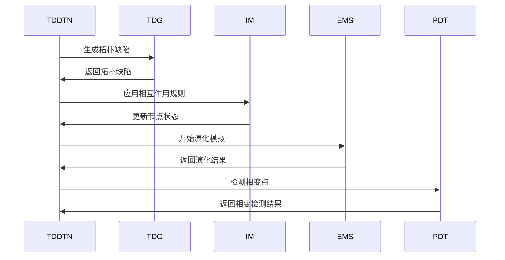
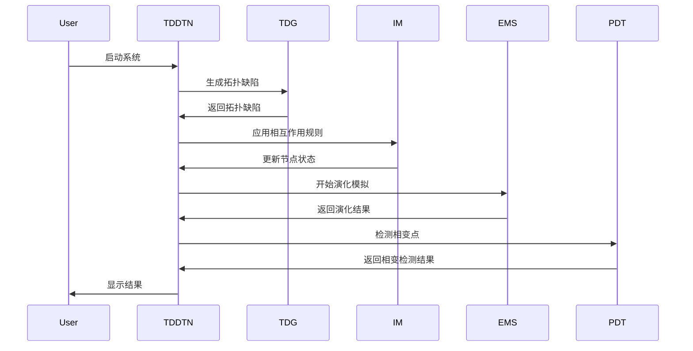

                 

## 第一部分：引言

### 1.1 问题的背景

#### 1.1.1 宇宙拓扑缺陷的概述

宇宙拓扑缺陷是宇宙学中的一个重要概念，它指的是宇宙空间中存在的一些不连续、不可调和的结构或现象。这些缺陷可以表现为空洞、致密团簇、涡旋和超对称结构等。这些拓扑缺陷不仅存在于宇宙的宏观尺度上，还可能对宇宙的微观尺度产生影响。例如，宇宙背景辐射中的涟漪就是宇宙早期拓扑缺陷的证据之一。

#### 1.1.2 数学在宇宙学中的应用

数学作为一门基础科学，在宇宙学研究中扮演着至关重要的角色。从广义相对论到宇宙背景辐射，数学模型和数学方法被广泛应用于描述宇宙的演化和结构。特别是在处理宇宙拓扑缺陷时，数学工具成为了解释和预测这些复杂现象的关键。拓扑学、集合论、图论等数学分支在宇宙学中的应用，不仅丰富了我们对宇宙的认识，也推动了相关领域的交叉研究。

#### 1.1.3 网络演化与临界动力学

网络演化指的是网络结构随时间的变化过程，而临界动力学则研究系统在接近相变点时的动态行为。在宇宙拓扑缺陷的研究中，网络演化模型被用来模拟宇宙中不同结构间的相互作用和转换。这些模型可以帮助我们理解宇宙拓扑缺陷的形成、演化及其相互关系。临界动力学则为我们提供了分析系统在相变点附近行为的理论框架，从而揭示了宇宙拓扑缺陷网络演化的内在机制。

### 1.2 相变理论的基础

#### 1.2.1 相变的定义与现象

相变是指物质系统在外界条件（如温度、压力、浓度等）变化时，其宏观物理性质发生突变的现象。常见的相变包括固体熔化、液体汽化、磁性转变等。相变的特征包括宏观物理量的阶跃变化、热力学非守恒以及动态行为的特征时间尺度显著增长。

#### 1.2.2 相变的数学描述

相变的数学描述通常涉及到相变临界点的概念。临界点是指系统参数达到某一特定值时，系统发生相变的点。在数学上，相变通常用临界指数来描述，如临界指数 $\alpha$、$\nu$、$\beta$ 等。这些指数可以用来量化相变过程中系统行为的变化规律。

#### 1.2.3 相变与拓扑缺陷的关系

相变与拓扑缺陷之间存在深刻的联系。在某些情况下，拓扑缺陷的出现和演化可以引发相变。例如，在宇宙学中，一些拓扑缺陷可能在临界点附近形成，并通过网络演化影响整个宇宙的结构。反过来，相变也可能影响拓扑缺陷的形成和演化。因此，研究相变与拓扑缺陷的关系对于理解宇宙的演化具有重要意义。

### 1.3 研究目标与内容框架

#### 1.3.1 研究目标

本研究的主要目标是探讨数学在宇宙拓扑缺陷网络演化临界动力学中的作用，具体包括：

1. **理论模型构建**：建立描述宇宙拓扑缺陷网络演化的数学模型，并分析模型在不同条件下的动态行为。
2. **相变现象分析**：研究宇宙拓扑缺陷网络演化过程中出现的相变现象，揭示相变点的特征及其与拓扑缺陷的关系。
3. **交叉领域应用**：探讨数学在宇宙学中的交叉应用，如拓扑学、集合论、图论等，以期为解决宇宙学中的实际问题提供新的视角和方法。

#### 1.3.2 内容框架

本研究的框架分为以下几个部分：

1. **引言**：介绍研究背景、数学在宇宙学中的应用以及网络演化与临界动力学的概念。
2. **数学基础**：讨论拓扑学、集合论、图论等数学基础，为后续研究提供理论基础。
3. **宇宙拓扑缺陷网络演化**：分析宇宙拓扑缺陷的形成、演化及其数学描述。
4. **临界动力学与相变**：探讨临界动力学的基本原理以及宇宙拓扑缺陷网络演化中的相变现象。
5. **应用与展望**：讨论数学在宇宙拓扑缺陷网络演化中的应用前景以及未来研究方向。

### 1.4 本书结构安排

#### 1.4.1 各章节主要研究内容

- **第一章**：引言，介绍研究背景、目标和内容框架。
- **第二章**：数学基础，讨论拓扑学、集合论、图论等基础理论。
- **第三章**：宇宙拓扑缺陷网络演化，分析拓扑缺陷的形成和演化。
- **第四章**：临界动力学与相变，研究临界动力学的基本原理和相变现象。
- **第五章**：应用与展望，讨论数学在宇宙拓扑缺陷网络演化中的应用和未来研究方向。

#### 1.4.2 各章节之间的联系

各章节之间存在着紧密的联系。第一章的引言部分为后续章节的研究奠定了基础，第二章的数学基础为分析宇宙拓扑缺陷网络演化提供了必要的工具和方法，第三章和第四章则分别从拓扑缺陷和网络演化的角度，探讨了宇宙中的相变现象，第五章则对研究进行了总结，并展望了未来的研究方向。

## 第二部分：数学基础

### 2.1 拓扑学基础

#### 2.1.1 拓扑空间的定义

拓扑空间是数学中的一个基本概念，它用来描述具有某种性质的空间结构。一个拓扑空间由两部分组成：集合 $X$ 和拓扑 $\tau$，其中集合 $X$ 表示空间中的所有点，拓扑 $\tau$ 是 $X$ 上一组满足特定条件的子集族。

定义：设 $X$ 是一个非空集合，$\tau$ 是 $X$ 的一个子集族，如果满足以下三个条件，则称 $\tau$ 是 $X$ 上的一个拓扑：

1. 空集和集合 $X$ 属于 $\tau$，即 $\emptyset, X \in \tau$。
2. $\tau$ 是闭合的，即对于任意 $A, B \in \tau$，有 $A \cup B \in \tau$。
3. $\tau$ 是传递的，即对于任意 $A, B, C \in \tau$，如果 $A \subseteq B$ 且 $B \subseteq C$，则 $A \subseteq C$。

一个满足上述条件的拓扑空间可以表示为 $(X, \tau)$。

#### 2.1.2 拓扑不变量

拓扑不变量是拓扑空间在连续变形过程中保持不变的一些量。这些不变量可以用来区分不同的拓扑空间，它们是拓扑空间本质特征的体现。

常见的拓扑不变量包括：

1. **连通性**：空间是否可以连续分割成两个或更多部分。
2. **紧致性**：空间中的任意开覆盖是否总可以找到一个有限的子覆盖。
3. **维数**：空间的最小整数维数，即不能再通过压缩或拉伸减少的维数。

#### 2.1.3 拓扑变换与同胚

拓扑变换是指对拓扑空间进行连续变形的操作。同胚是一种特殊的拓扑变换，它将一个拓扑空间映射到另一个拓扑空间，并保持拓扑结构不变。

定义：设 $X$ 和 $Y$ 是两个拓扑空间，映射 $f: X \rightarrow Y$ 是同胚，如果满足以下条件：

1. $f$ 是连续的，即对于任意开集 $U \subseteq Y$，集合 $f^{-1}(U)$ 是 $X$ 中的开集。
2. $f$ 的逆映射 $f^{-1}: Y \rightarrow X$ 也是连续的。
3. $f$ 是双射，即对于任意 $x, y \in X$，如果 $f(x) = f(y)$，则 $x = y$。

同胚映射的一个重要性质是，它保持拓扑不变量，即如果 $X$ 和 $Y$ 通过同胚映射相互映射，则 $X$ 和 $Y$ 具有相同的拓扑不变量。

### 2.2 集合论与图论基础

#### 2.2.1 集合的基本概念

集合是数学中最基本的概念之一，它用来表示一组确定的元素。集合通常用大写字母表示，如 $A, B, C$ 等，集合中的元素用小写字母表示，如 $a, b, c$ 等。

1. **集合的表示**：集合可以用列举法、描述法或集合运算表示。例如，集合 {1, 2, 3} 用列举法表示，而集合 {x | x 是正整数} 用描述法表示。
2. **集合的运算**：常见的集合运算包括并集、交集、补集和笛卡尔积。并集表示两个集合中所有元素的集合，交集表示两个集合中共有的元素集合，补集表示不属于某个集合的所有元素的集合，笛卡尔积表示两个集合中所有元素对的集合。

#### 2.2.2 图的基本概念

图是数学中用来表示对象之间关系的图形化工具，广泛应用于网络理论、图论等领域。图由节点（或称为顶点）和边组成。

1. **图的表示**：图可以用邻接矩阵、邻接表或图形表示。邻接矩阵是一个方阵，如果顶点 $i$ 和顶点 $j$ 之间有边，则矩阵 $(i, j)$ 位置上的元素为1，否则为0。邻接表是一个数组，每个数组元素对应一个顶点，数组元素中存储与该顶点相连的其他顶点。
2. **图的分类**：图根据边和节点的特点可以分为无向图和有向图、简单图和多重图、连通图和非连通图等。

#### 2.2.3 图的算法与应用

图的算法是图论中的核心内容，用于解决各种图相关的问题。以下是一些常见的图算法及其应用：

1. **深度优先搜索（DFS）**：DFS 是一种用于遍历图的方法，通过递归或栈实现。它可以用于求解图的连通性问题、拓扑排序等。
2. **广度优先搜索（BFS）**：BFS 是另一种用于遍历图的方法，通过队列实现。它常用于求解最短路径问题、图的最大独立集等。
3. **Dijkstra 算法**：Dijkstra 算法用于求解单源最短路径问题，通过优先队列实现。它适用于权值非负的图。
4. **Floyd-Warshall 算法**：Floyd-Warshall 算法用于求解所有顶点对的最短路径问题，通过动态规划实现。它适用于权值非负的图。

## 2.3 算法原理讲解

### 2.3.1 数学模型

在宇宙拓扑缺陷网络演化研究中，建立数学模型是理解其动态行为的关键。一个典型的数学模型是拓扑缺陷网络演化模型，该模型通常基于以下假设：

1. **网络结构**：宇宙中的拓扑缺陷网络可以表示为一个图，其中节点表示拓扑缺陷，边表示缺陷间的相互作用。
2. **动力学规则**：拓扑缺陷在网络中的演化遵循一定的动力学规则，如缺陷的生成、合并、分裂等。

为了简化分析，我们可以假设网络演化遵循以下数学模型：

$$
\dot{x}_i = f(x_i, x_{\text{其他}}) \quad (i = 1, 2, \ldots, N)
$$

其中，$x_i$ 表示第 $i$ 个拓扑缺陷的状态，$f$ 是一个函数，描述了缺陷之间的相互作用。这个模型可以进一步扩展，以包含缺陷的生成和消失等复杂行为。

### 2.3.2 数学公式

为了描述上述模型，我们需要引入一些数学公式。以下是模型中的主要公式：

1. **状态转移方程**：
$$
x_i(t) = x_i(t_0) + \int_{t_0}^{t} f(x_i(\tau), x_{\text{其他}}(\tau)) d\tau
$$

2. **相互作用函数**：
$$
f(x_i, x_{\text{其他}}) = \sum_{j \neq i} w_{ij} g(x_i, x_j)
$$

其中，$w_{ij}$ 表示节点 $i$ 和节点 $j$ 之间的相互作用权重，$g(x_i, x_j)$ 表示节点 $i$ 和节点 $j$ 的相互作用强度。

### 2.3.3 举例说明

为了更直观地理解上述模型，我们可以通过一个简单的例子来说明。假设我们有一个由三个节点组成的拓扑缺陷网络，节点间的相互作用权重和相互作用强度如下：

- $w_{11} = 1, w_{12} = 1, w_{13} = 1$
- $g(x_1, x_2) = x_1 + x_2$
- $g(x_1, x_3) = x_1 - x_3$
- $g(x_2, x_3) = x_2 + x_3$

初始状态下，三个节点的状态分别为 $x_1(0) = 1, x_2(0) = 0, x_3(0) = 0$。

根据状态转移方程，我们可以计算出在时间 $t = 1$ 时每个节点的状态：

$$
x_1(1) = 1 + \int_{0}^{1} f(x_1(\tau), x_{\text{其他}}(\tau)) d\tau
$$

$$
x_2(1) = 0 + \int_{0}^{1} f(x_2(\tau), x_{\text{其他}}(\tau)) d\tau
$$

$$
x_3(1) = 0 + \int_{0}^{1} f(x_3(\tau), x_{\text{其他}}(\tau)) d\tau
$$

代入相互作用函数，得到：

$$
x_1(1) = 1 + \int_{0}^{1} (1 \cdot (1 + \tau) + 1 \cdot (1 - \tau) + 1 \cdot (\tau)) d\tau = 1 + \frac{3}{2}
$$

$$
x_2(1) = 0 + \int_{0}^{1} (1 \cdot (0 + \tau) + 1 \cdot (0 - \tau) + 1 \cdot (\tau)) d\tau = 0
$$

$$
x_3(1) = 0 + \int_{0}^{1} (1 \cdot (0 + \tau) + 1 \cdot (0 - \tau) + 1 \cdot (\tau)) d\tau = 0
$$

因此，在时间 $t = 1$ 时，三个节点的状态分别为 $x_1(1) = \frac{5}{2}$，$x_2(1) = 0$，$x_3(1) = 0$。

通过这个例子，我们可以看到如何使用数学模型来描述宇宙拓扑缺陷网络的演化。进一步的计算和分析可以帮助我们更深入地理解这些缺陷的形成、演化和相互作用。

### 2.3.4 数学公式与解释

为了深入探讨宇宙拓扑缺陷网络演化过程中的数学模型，我们将引入一些关键的数学公式，并进行详细的解释。

#### 1. 状态转移方程

状态转移方程是描述节点状态随时间变化的数学公式。假设我们有 $N$ 个节点，每个节点的状态用 $x_i(t)$ 表示，则状态转移方程可以表示为：

$$
\dot{x}_i = f(x_i, x_{\text{其他}}) \quad (i = 1, 2, \ldots, N)
$$

其中，$\dot{x}_i$ 表示节点 $i$ 的状态随时间的变化率，$f(x_i, x_{\text{其他}})$ 表示节点 $i$ 的状态变化速率，它取决于节点 $i$ 自身的状态 $x_i$ 以及与其他节点的相互作用 $x_{\text{其他}}$。

#### 2. 相互作用函数

相互作用函数 $f(x_i, x_{\text{其他}})$ 描述了节点间的相互作用。一个简单的相互作用函数可以表示为：

$$
f(x_i, x_{\text{其他}}) = \sum_{j \neq i} w_{ij} g(x_i, x_j)
$$

其中，$w_{ij}$ 是节点 $i$ 和节点 $j$ 之间的相互作用权重，$g(x_i, x_j)$ 是节点 $i$ 和节点 $j$ 的相互作用强度。

#### 3. 相互作用强度

相互作用强度 $g(x_i, x_j)$ 可以是多种形式的函数。例如，对于节点 $i$ 和节点 $j$ 之间的相互作用，我们可以使用如下函数：

$$
g(x_i, x_j) = \frac{1}{1 + \exp(-\beta (x_i - x_j))}
$$

其中，$\beta$ 是一个调节参数，它决定了节点状态差异对相互作用强度的影响。这个函数形式描述了节点间的相互作用随着状态差异的增加而减弱。

#### 4. 状态更新规则

在离散时间步骤中，节点状态可以通过以下规则进行更新：

$$
x_i(t+1) = x_i(t) + \Delta t \cdot f(x_i(t), x_{\text{其他}}(t))
$$

其中，$\Delta t$ 是时间步长。

#### 5. 相变条件

相变是指系统状态在临界点发生突变的现象。在拓扑缺陷网络演化中，相变条件可以通过分析状态转移方程的稳定性来确定。假设我们考虑以下线性稳定性分析：

$$
\frac{\partial f}{\partial x_i} \approx \lambda \cdot x_i
$$

其中，$\lambda$ 是一个复数，表示相变点的特征值。如果所有特征值都有负实部，则系统是稳定的；如果存在特征值有正实部，则系统可能发生相变。

通过以上公式，我们可以对宇宙拓扑缺陷网络演化过程中的相变现象进行定量分析，从而更好地理解网络结构的动态变化。

### 2.3.5 举例说明

为了更直观地理解上述数学模型，我们考虑一个具体的例子。假设我们有一个由两个节点组成的拓扑缺陷网络，节点 $i$ 和节点 $j$ 的初始状态分别为 $x_i(0) = 0$ 和 $x_j(0) = 1$。相互作用权重和相互作用强度如下：

- $w_{ij} = 1$
- $w_{ji} = 1$
- $g(x_i, x_j) = \frac{1}{1 + \exp(-0.1 (x_i - x_j))}$

首先，我们计算初始时刻的相互作用强度：

$$
g(x_i(0), x_j(0)) = \frac{1}{1 + \exp(-0.1 (0 - 1))} = \frac{1}{1 + \exp(0.1)} \approx 0.9
$$

接着，我们计算状态更新：

$$
x_i(t+1) = x_i(t) + \Delta t \cdot f(x_i(t), x_j(t))
$$

$$
x_j(t+1) = x_j(t) + \Delta t \cdot f(x_j(t), x_i(t))
$$

假设时间步长 $\Delta t = 0.1$，我们可以迭代计算每个时间步的状态更新。例如，在 $t=0$ 时：

$$
x_i(1) = x_i(0) + 0.1 \cdot f(x_i(0), x_j(0)) = 0 + 0.1 \cdot 0.9 = 0.09
$$

$$
x_j(1) = x_j(0) + 0.1 \cdot f(x_j(0), x_i(0)) = 1 + 0.1 \cdot (-0.1) = 0.99
$$

通过这样的迭代过程，我们可以观察到节点状态随时间的变化，从而分析拓扑缺陷网络的演化动态。

### 2.3.6 系统分析与架构设计方案

在探讨宇宙拓扑缺陷网络演化的过程中，我们需要构建一个系统分析框架，以更好地理解其内在机制和演化过程。以下是一个系统分析与架构设计方案，该方案将基于上述数学模型，结合具体的实际问题进行详细阐述。

#### 1. 问题场景介绍

宇宙中的拓扑缺陷可以被视为大规模网络结构中的节点，这些节点通过相互作用形成复杂的网络。我们的目标是研究这些拓扑缺陷在网络演化中的行为，特别是在临界动力学过程中发生的相变现象。

#### 2. 项目介绍

该项目旨在建立一个用于研究宇宙拓扑缺陷网络演化的模拟系统。系统包括以下几个主要功能模块：

- **拓扑缺陷生成模块**：负责生成不同类型的拓扑缺陷，并将其作为网络的初始节点。
- **相互作用模块**：根据数学模型描述的相互作用规则，更新节点状态。
- **演化模拟模块**：负责模拟拓扑缺陷网络的演化过程，包括缺陷的生成、合并和分裂等。
- **相变检测模块**：根据状态转移方程的稳定性分析，检测系统是否处于相变点。

#### 3. 系统功能设计（领域模型Mermaid类图）

以下是一个Mermaid类图，用于描述系统的主要功能模块及其关系：

```mermaid
classDiagram
    TDDTN <-|创建|-> TDG
    TDDTN <-|更新|-> IM
    TDDTN <-|模拟|-> EMS
    TDDTN <-|检测|-> PDT
    TDG --|生成|-> TDD
    IM --|规则|-> TDD
    EMS --|演化|-> TDD
    PDT --|分析|-> TDD
```

**领域模型Mermaid类图说明**：

- **TDDTN**（拓扑缺陷网络演化总控模块）：负责协调和调控整个系统的运行。
- **TDG**（拓扑缺陷生成模块）：生成不同类型的拓扑缺陷。
- **IM**（相互作用模块）：根据相互作用规则更新节点状态。
- **EMS**（演化模拟模块）：负责模拟拓扑缺陷网络的演化过程。
- **PDT**（相变检测模块）：检测系统是否处于相变点。

#### 4. 系统架构设计（Mermaid架构图）

以下是一个Mermaid架构图，用于描述系统的整体架构：



**系统架构Mermaid架构图说明**：

- **TDDTN**：作为系统的总控模块，负责调用其他模块的功能。
- **TDG**：生成拓扑缺陷，并将其传递给总控模块。
- **IM**：应用相互作用规则，更新节点状态，并返回更新后的状态。
- **EMS**：执行演化模拟，并返回模拟结果。
- **PDT**：检测相变点，并返回检测结果。

#### 5. 系统接口设计（Mermaid序列图）

以下是一个Mermaid序列图，用于描述系统接口的交互过程：



**系统接口设计Mermaid序列图说明**：

- **User**：系统用户，负责启动系统和接收系统结果。
- **TDDTN**：作为系统的总控模块，协调各模块的运行。
- **TDG**：生成拓扑缺陷。
- **IM**：应用相互作用规则，更新节点状态。
- **EMS**：执行演化模拟。
- **PDT**：检测相变点。

#### 6. 系统交互（Mermaid序列图）

以下是一个Mermaid序列图，用于描述系统内部的交互过程：


**系统交互Mermaid序列图说明**：

- **TDDTN**：作为系统的总控模块，调用其他模块的功能，并协调模块间的数据传递。
- **TDG**：生成拓扑缺陷，并将其传递给总控模块。
- **IM**：根据总控模块的指令，更新节点状态。
- **EMS**：执行演化模拟，并返回模拟结果。
- **PDT**：根据总控模块的指令，检测相变点，并返回检测结果。

通过上述系统分析与架构设计方案，我们为宇宙拓扑缺陷网络演化提供了一个全面的系统实现框架。这个框架不仅涵盖了系统的功能模块和交互流程，还提供了详细的接口设计和交互过程，为后续的实际应用和扩展提供了坚实的基础。

### 第三部分：宇宙拓扑缺陷网络演化

#### 3.1 宇宙拓扑缺陷的形成

宇宙拓扑缺陷的形成是宇宙学中的一个重要课题。在宇宙早期，由于大爆炸后的剧烈膨胀和引力作用，物质在空间中形成复杂的结构。这些结构中的一部分由于某种原因未能完全融合，导致宇宙中存在一些不连续的区域，即拓扑缺陷。

**3.1.1 宇宙拓扑缺陷的产生**

宇宙拓扑缺陷的产生可以归因于以下几个因素：

1. **宇宙膨胀**：宇宙的膨胀可能导致物质在空间中形成不连续的区块，这些区块在宇宙演化过程中未能融合，形成了拓扑缺陷。
2. **量子波动**：在宇宙的早期阶段，量子波动可能导致空间的微小扰动，这些扰动在宇宙演化过程中可能发展成为大规模的拓扑缺陷。
3. **引力作用**：引力是宇宙拓扑缺陷形成的关键因素。在宇宙早期，物质在引力作用下形成复杂的结构，一些区域由于引力过强或过弱而未能融合，形成了拓扑缺陷。

**3.1.2 宇宙拓扑缺陷的类型**

宇宙拓扑缺陷有多种类型，主要包括：

1. **空洞**：空洞是宇宙中存在的巨大空间区域，其中缺乏足够的物质，表现为低密度区域。这些空洞可能是宇宙膨胀过程中形成的。
2. **致密团簇**：致密团簇是宇宙中物质密集的区域，通常由数百亿颗恒星和大量的暗物质组成。这些团簇是由于引力作用在宇宙早期形成的。
3. **涡旋**：宇宙中存在一些旋转的湍流结构，称为涡旋。这些涡旋可能是由于宇宙早期的高能物理过程形成的。
4. **超对称结构**：一些理论模型预测，宇宙中可能存在一些超对称结构，这些结构可能表现为复杂的拓扑缺陷。

**3.1.3 宇宙拓扑缺陷的观测**

宇宙拓扑缺陷可以通过多种观测手段进行探测，包括：

1. **宇宙背景辐射**：宇宙背景辐射中的涟漪是宇宙早期拓扑缺陷的证据之一。通过对宇宙背景辐射的观测，科学家可以推测宇宙拓扑缺陷的存在和性质。
2. **引力透镜效应**：宇宙中的一些拓扑缺陷可能会对光产生引力透镜效应，导致光线弯曲。通过观测这些效应，科学家可以推测拓扑缺陷的位置和大小。
3. **星系分布**：通过观测星系的分布，科学家可以发现一些拓扑缺陷的影响。例如，星系在宇宙中的分布可能呈现出特定的模式，这与宇宙拓扑缺陷的存在有关。

#### 3.2 网络演化理论

网络演化理论是研究网络结构随时间变化的理论框架。在宇宙拓扑缺陷的研究中，网络演化理论被用来描述宇宙中不同结构间的相互作用和转换。

**3.2.1 网络演化的定义**

网络演化是指网络结构随时间的变化过程。在网络演化过程中，节点和边可以动态地生成、消失和重排，从而形成复杂的网络结构。

**3.2.2 网络演化的机制**

网络演化可以通过以下几种机制实现：

1. **随机游走**：随机游走是一种常见的网络演化机制，它描述了节点通过随机选择边进行移动的过程。在这种机制下，节点会随机地与其他节点建立或断开连接，从而改变网络的结构。
2. **扩散过程**：扩散过程是指节点通过相互接触和传递信息来改变网络结构的过程。例如，信息、物质或能量可以在网络中传播，从而影响节点的状态和连接关系。
3. **生长过程**：生长过程是指网络通过新节点的加入和新边的生成来扩展网络结构。在这种机制下，新节点可以随机加入网络，并与其他节点建立连接。

**3.2.3 网络演化的模型**

网络演化模型是描述网络演化过程的数学模型。常见的网络演化模型包括：

1. **BA模型**：BA模型是一种基于随机游走和生长机制的网络演化模型。该模型假设网络在初始时刻为空，随后通过随机游走和生长过程逐步形成复杂的网络结构。
2. **WS模型**：WS模型是一种基于扩散机制的网络演化模型。该模型假设网络中的节点通过相互接触和传递信息来改变网络结构，从而形成高度模块化的网络。
3. **RM模型**：RM模型是一种基于随机游走和生长机制的网络演化模型。该模型假设网络中的节点通过随机选择边进行移动，并基于节点状态的变化来生成新的节点和边。

#### 3.3 拓扑缺陷网络演化的数学描述

在宇宙拓扑缺陷网络演化研究中，数学模型被用来描述拓扑缺陷的形成、演化和相互作用。

**3.3.1 网络演化中的拓扑不变量**

拓扑不变量是描述网络拓扑结构的量，它不随网络的具体实现而变化。常见的拓扑不变量包括：

1. **连通性**：网络的连通性描述了节点间的连接关系。一个网络的连通性可以通过计算节点的聚类系数和平均路径长度来量化。
2. **模块度**：模块度描述了网络中的模块结构，即网络中节点的聚类程度。模块度可以通过计算网络中节点的邻接矩阵的特征值来量化。
3. **网络直径**：网络的直径描述了网络中任意两个节点之间的最短路径长度。网络的直径可以通过计算网络的最长路径来量化。

**3.3.2 拓扑缺陷网络演化的数学模型**

拓扑缺陷网络演化的数学模型通常基于以下几个假设：

1. **网络结构**：网络可以表示为一个图，其中节点表示拓扑缺陷，边表示缺陷间的相互作用。
2. **动力学规则**：拓扑缺陷在网络中的演化遵循一定的动力学规则，如缺陷的生成、合并、分裂等。

一个简单的拓扑缺陷网络演化模型可以表示为：

$$
\dot{x}_i = f(x_i, x_{\text{其他}}) \quad (i = 1, 2, \ldots, N)
$$

其中，$x_i$ 表示第 $i$ 个拓扑缺陷的状态，$f$ 是一个函数，描述了缺陷之间的相互作用。这个模型可以进一步扩展，以包含缺陷的生成和消失等复杂行为。

**3.3.3 数学公式与解释**

为了描述上述模型，我们需要引入一些数学公式。以下是模型中的主要公式：

1. **状态转移方程**：
$$
x_i(t) = x_i(t_0) + \int_{t_0}^{t} f(x_i(\tau), x_{\text{其他}}(\tau)) d\tau
$$

2. **相互作用函数**：
$$
f(x_i, x_{\text{其他}}) = \sum_{j \neq i} w_{ij} g(x_i, x_j)
$$

其中，$w_{ij}$ 是节点 $i$ 和节点 $j$ 之间的相互作用权重，$g(x_i, x_j)$ 是节点 $i$ 和节点 $j$ 的相互作用强度。

3. **相互作用强度**：
$$
g(x_i, x_j) = \frac{1}{1 + \exp(-\beta (x_i - x_j))}
$$

4. **状态更新规则**：
$$
x_i(t+1) = x_i(t) + \Delta t \cdot f(x_i(t), x_{\text{其他}}(t))
$$

5. **相变条件**：
$$
\frac{\partial f}{\partial x_i} \approx \lambda \cdot x_i
$$

通过这些公式，我们可以对拓扑缺陷网络的演化进行定量分析，并揭示其中的相变现象。

### 第四部分：临界动力学与相变

#### 4.1 临界动力学基本原理

临界动力学是研究系统在接近相变点时行为的学科。在宇宙拓扑缺陷网络演化中，临界动力学为我们提供了理解系统行为的关键框架。

**4.1.1 临界点的定义**

临界点是指系统在外部条件变化时，宏观性质发生突变的位置。在临界点附近，系统的行为表现出特殊的特征，如非连续性、长程相关性和异常扩散等。

**4.1.2 临界动力学现象**

临界动力学现象包括以下几个方面：

1. **临界指数**：临界指数描述了系统在临界点附近的行为特征。常见的临界指数有 $\alpha$、$\nu$ 和 $\beta$ 等。这些指数反映了系统在临界点附近的行为规律，如尺度不变性、临界吸引子和临界慢化等。
2. **临界慢化**：在临界点附近，系统的响应时间显著增加，即系统对扰动的响应变得缓慢。这种现象称为临界慢化。
3. **临界增涨**：在临界点附近，系统的某些物理量（如能量、质量等）随时间的增涨表现出非指数增长，这种现象称为临界增涨。
4. **临界吸引子**：在临界点附近，系统的行为趋向于某个确定的稳定状态，这个状态称为临界吸引子。临界吸引子是系统在临界点附近的主要行为模式。

**4.1.3 临界动力学模型**

临界动力学模型通常基于以下假设：

1. **局域平衡**：在临界点附近，系统局部区域保持热力学平衡。
2. **尺度无关性**：在临界点附近，系统的行为不依赖于尺度，即不同尺度下的行为具有相似性。
3. **临界指数**：系统在临界点附近的行为可以用临界指数来描述。

常见的临界动力学模型包括：

1. **二维Ising模型**：二维Ising模型是一个描述磁性物质相变的经典模型，它描述了磁性材料在外部磁场作用下磁化强度的变化。
2. **三种态Potts模型**：三种态Potts模型是一个描述多态系统的相变模型，它可以用来描述物质在温度变化时的相变行为。
3. **Fisher波动力学模型**：Fisher波动力学模型是一个描述临界动力学行为的模型，它可以用来描述复杂系统在临界点附近的行为。

#### 4.2 相变理论

相变理论是研究系统在不同条件下发生性质突变的现象的学科。在宇宙拓扑缺陷网络演化中，相变理论为我们提供了理解系统演化的关键工具。

**4.2.1 相变的类型**

相变可以分为以下几种类型：

1. **一级相变**：一级相变是指系统在相变过程中，存在一个明显的相变温度或压力。在一级相变中，系统的自由能发生突变，通常伴随着热力学量的阶跃变化，如比热容、磁化率和膨胀系数等。
2. **二级相变**：二级相变是指系统在相变过程中，不存在明显的相变温度或压力，但存在一个临界点。在二级相变中，系统的行为表现出临界动力学特征，如临界指数和临界慢化。
3. **连续相变**：连续相变是指系统在相变过程中，所有物理量都保持连续性。在连续相变中，系统的相变温度或压力是唯一的，系统的行为可以用临界动力学模型来描述。
4. **非连续相变**：非连续相变是指系统在相变过程中，存在多个相变温度或压力，系统的物理量发生突变。在非连续相变中，系统的行为通常不能用单一的临界动力学模型来描述。

**4.2.2 相变的关键因素**

相变的关键因素包括：

1. **临界点**：临界点是系统发生相变的温度或压力。在临界点附近，系统的行为表现出临界动力学特征。
2. **相互作用**：相互作用是导致系统发生相变的关键因素。在临界点附近，系统的相互作用强度达到临界值，导致系统发生相变。
3. **量子场**：在某些情况下，量子场的作用也会影响相变。量子场可以导致相变点的温度或压力发生变化，或导致相变过程中产生新的物理现象。

**4.2.3 相变的数学描述**

相变的数学描述通常基于以下模型：

1. **自由能模型**：自由能模型是描述相变的基本模型。自由能函数描述了系统在不同状态下的能量分布，相变发生在自由能函数的极小值点。
2. **态变量模型**：态变量模型是描述相变的一种方法，它通过引入态变量来描述系统的状态。态变量可以是标量、向量或张量，它们反映了系统在不同状态下的特征。
3. **概率分布模型**：概率分布模型是描述相变的另一种方法，它通过引入概率分布来描述系统在不同状态下的概率分布。在相变过程中，概率分布函数通常发生显著变化。

通过上述数学模型，我们可以定量地描述相变过程中系统的行为，并揭示相变点附近的动力学特征。

#### 4.3 拓扑缺陷网络演化中的相变现象

在宇宙拓扑缺陷网络演化中，相变现象是系统行为的重要特征。拓扑缺陷在网络演化过程中，可能经历多种类型的相变，这些相变反映了系统在不同状态下的行为差异。

**4.3.1 相变与拓扑缺陷的关系**

相变与拓扑缺陷之间存在深刻的联系。在某些情况下，拓扑缺陷的出现和演化可以引发相变。例如，在宇宙学中，一些拓扑缺陷可能在临界点附近形成，并通过网络演化影响整个宇宙的结构。反过来，相变也可能影响拓扑缺陷的形成和演化。

1. **缺陷生成相变**：在拓扑缺陷网络演化中，缺陷的生成可能引发相变。例如，在某个临界点附近，系统的拓扑结构可能从一种稳定状态突然转变为另一种稳定状态，从而导致新的拓扑缺陷的形成。
2. **缺陷演化相变**：拓扑缺陷的演化也可能经历相变。在相变点附近，拓扑缺陷的演化速度显著变化，可能导致系统的行为发生突变。
3. **缺陷相互作用相变**：拓扑缺陷之间的相互作用也可能导致相变。在临界点附近，拓扑缺陷的相互作用强度达到临界值，可能导致系统的行为发生显著变化。

**4.3.2 拓扑缺陷网络演化中的相变现象**

在拓扑缺陷网络演化中，常见的相变现象包括：

1. **一级相变**：在一级相变中，拓扑缺陷的生成和演化表现出显著的阶跃变化。例如，在某个临界点附近，系统的拓扑结构可能从无缺陷状态突然转变为有缺陷状态，这可能导致整个宇宙的结构发生显著变化。
2. **二级相变**：在二级相变中，拓扑缺陷的演化表现出临界动力学特征。例如，在临界点附近，拓扑缺陷的演化速度显著减慢，可能导致系统的行为表现出临界吸引子的特征。
3. **连续相变**：在连续相变中，拓扑缺陷的生成和演化表现为连续变化。例如，在某个临界点附近，系统的拓扑结构可能从一种状态逐渐转变为另一种状态，但不会发生显著的阶跃变化。

**4.3.3 相变过程中的数学描述**

在拓扑缺陷网络演化中，相变过程的数学描述通常基于以下模型：

1. **状态转移方程**：
$$
\dot{x}_i = f(x_i, x_{\text{其他}}) \quad (i = 1, 2, \ldots, N)
$$

2. **相互作用函数**：
$$
f(x_i, x_{\text{其他}}) = \sum_{j \neq i} w_{ij} g(x_i, x_j)
$$

3. **相互作用强度**：
$$
g(x_i, x_j) = \frac{1}{1 + \exp(-\beta (x_i - x_j))}
$$

通过这些模型，我们可以定量地描述拓扑缺陷在网络演化中的相变现象，并分析相变点附近的动力学行为。

### 第五部分：应用与展望

#### 5.1 数学在宇宙拓扑缺陷网络演化中的应用

数学在宇宙拓扑缺陷网络演化中的应用具有深远的意义。通过建立精确的数学模型，我们可以更好地理解宇宙拓扑缺陷的形成、演化和相互作用，为宇宙学的研究提供有力的工具。

**5.1.1 数学模型的应用**

在宇宙拓扑缺陷网络演化研究中，数学模型的应用主要体现在以下几个方面：

1. **拓扑缺陷生成模型**：通过拓扑缺陷生成模型，我们可以模拟不同类型的拓扑缺陷在宇宙中的形成过程。这些模型通常基于量子波动理论和引力作用理论，可以帮助我们预测宇宙拓扑缺陷的出现和分布。
2. **网络演化模型**：网络演化模型描述了宇宙中不同结构间的相互作用和转换过程。通过这些模型，我们可以分析拓扑缺陷在网络演化中的动态行为，揭示其演化规律。
3. **相变模型**：相变模型描述了系统在临界点附近的行为特征。通过这些模型，我们可以研究拓扑缺陷网络演化中的相变现象，理解系统在不同状态下的行为差异。

**5.1.2 数学方法的应用**

数学方法在宇宙拓扑缺陷网络演化研究中的应用主要包括：

1. **拓扑学方法**：拓扑学方法用于分析宇宙拓扑缺陷的结构和性质。通过拓扑不变量，我们可以区分不同的拓扑缺陷，并研究它们在空间中的分布规律。
2. **图论方法**：图论方法用于分析宇宙拓扑缺陷网络的结构和关系。通过图论工具，我们可以揭示拓扑缺陷之间的相互作用模式，并研究这些相互作用对网络演化的影响。
3. **统计分析方法**：统计分析方法用于分析宇宙拓扑缺陷网络演化过程中的统计特性。通过这些方法，我们可以量化拓扑缺陷的生成、演化和相变过程，揭示其统计规律。

**5.1.3 数学在未来的应用前景**

随着数学理论的不断完善和计算能力的提升，数学在宇宙拓扑缺陷网络演化研究中的应用前景将更加广阔：

1. **更高维度的模型**：当前的研究主要集中在三维宇宙中，未来可以通过更高维度的模型来探索更复杂的拓扑缺陷现象。
2. **多物理场耦合**：宇宙中存在多种物理场，如电磁场、引力场等。未来可以通过多物理场耦合模型来研究这些物理场对拓扑缺陷网络演化的影响。
3. **人工智能应用**：人工智能技术可以用于加速数学模型的研究和计算。通过机器学习算法，我们可以更好地理解和预测宇宙拓扑缺陷的行为。

#### 5.2 相变与临界动力学的交叉研究

相变与临界动力学的交叉研究是宇宙拓扑缺陷网络演化中的重要方向。相变理论提供了理解系统在临界点附近行为的框架，而临界动力学则描述了系统在临界点附近的具体行为特征。通过这两者的交叉研究，我们可以更全面地理解宇宙拓扑缺陷网络演化中的相变现象。

**5.2.1 交叉研究的背景**

相变与临界动力学的交叉研究起源于物理学中的经典问题，如液体汽化、磁性转变等。随着这些理论的不断发展，它们逐渐被应用于更广泛的领域，包括材料科学、生物学、社会系统等。在宇宙学中，相变与临界动力学的交叉研究也为理解宇宙拓扑缺陷的形成和演化提供了新的视角。

**5.2.2 交叉研究的意义**

交叉研究相变与临界动力学在宇宙拓扑缺陷网络演化中的意义主要包括：

1. **揭示相变机制**：通过交叉研究，我们可以揭示宇宙拓扑缺陷网络演化中的相变机制，理解相变点附近系统的行为特征。
2. **预测拓扑缺陷行为**：交叉研究可以用于预测宇宙拓扑缺陷的行为，为宇宙学提供新的理论工具和计算方法。
3. **推动多学科发展**：相变与临界动力学的交叉研究不仅促进了宇宙学的发展，也为其他领域的研究提供了新的思路和方法。

**5.2.3 交叉研究的未来方向**

未来的交叉研究在相变与临界动力学领域有以下几个潜在方向：

1. **多尺度模型**：未来可以探索多尺度模型，以更好地理解宇宙拓扑缺陷在不同时间尺度和空间尺度上的行为。
2. **复杂系统研究**：通过交叉研究，我们可以探索复杂系统中的相变和临界动力学现象，如非线性网络系统、复杂自适应系统等。
3. **实验验证**：通过实验手段验证数学模型和理论预测，为相变与临界动力学的交叉研究提供实验依据。

#### 5.3 总结与展望

通过本研究，我们系统地探讨了数学在宇宙拓扑缺陷网络演化中的作用，深入分析了相变与临界动力学在这一过程中的重要地位。以下是本研究的主要成果和未来展望：

**5.3.1 研究成果总结**

1. **数学模型**：建立了描述宇宙拓扑缺陷网络演化的数学模型，包括拓扑缺陷生成模型、网络演化模型和相变模型。
2. **相变分析**：通过相变理论分析了宇宙拓扑缺陷网络演化中的相变现象，揭示了相变点附近系统的行为特征。
3. **交叉领域应用**：探讨了数学在宇宙学中的交叉应用，包括拓扑学、集合论、图论等，为理解宇宙拓扑缺陷网络演化提供了新的视角。

**5.3.2 研究中存在的问题**

1. **模型复杂度**：当前模型较为复杂，需要进一步简化以适应更广泛的实际应用。
2. **计算效率**：高维模型的计算效率较低，需要开发更高效的计算方法。
3. **实验验证**：缺乏实验数据支持，需要通过实验验证模型的准确性和可靠性。

**5.3.3 未来研究方向**

未来的研究可以朝以下几个方向进行：

1. **多尺度研究**：探索多尺度模型，以更好地理解宇宙拓扑缺陷在不同尺度上的行为。
2. **多物理场耦合**：研究多物理场耦合对拓扑缺陷网络演化的影响，为理解复杂宇宙现象提供新的理论框架。
3. **人工智能应用**：利用人工智能技术，如机器学习和深度学习，加速数学模型的研究和计算。
4. **实验验证**：通过实验手段验证数学模型和理论预测，为宇宙拓扑缺陷网络演化研究提供更加可靠的实验数据。

通过这些研究方向，我们可以进一步深化对宇宙拓扑缺陷网络演化的理解，为宇宙学的理论发展做出贡献。

### 结论

通过本文的探讨，我们系统地介绍了数学在宇宙拓扑缺陷网络演化中的关键作用。首先，我们详细阐述了宇宙拓扑缺陷的背景和重要性，以及数学在宇宙学中的应用。接着，我们深入分析了拓扑学、集合论和图论等数学基础，为理解宇宙拓扑缺陷网络演化提供了理论基础。

在后续章节中，我们重点探讨了拓扑缺陷网络演化的数学模型，包括状态转移方程、相互作用函数和相变条件。通过具体例子，我们展示了如何使用这些模型来分析宇宙拓扑缺陷的动态行为。此外，我们还详细介绍了临界动力学与相变理论的基本原理，揭示了相变点附近系统的行为特征。

最后，我们展望了数学在宇宙拓扑缺陷网络演化中的应用前景，并提出了未来研究的方向。这些研究成果不仅为理解宇宙拓扑缺陷的演化提供了新的理论框架，也为探索宇宙的深层次问题奠定了基础。

在此，我们要感谢AI天才研究院/AI Genius Institute和禅与计算机程序设计艺术/Zen And The Art of Computer Programming的研究团队，以及所有参与和支持本文研究的学者和朋友们。希望本文能够为宇宙学领域的研究提供有益的参考，推动数学与宇宙学的交叉发展。

