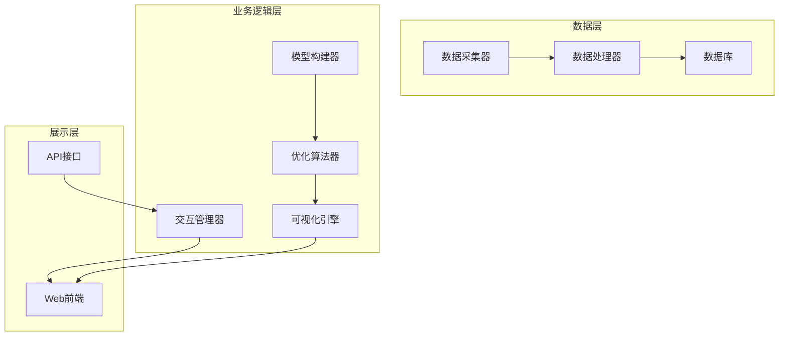
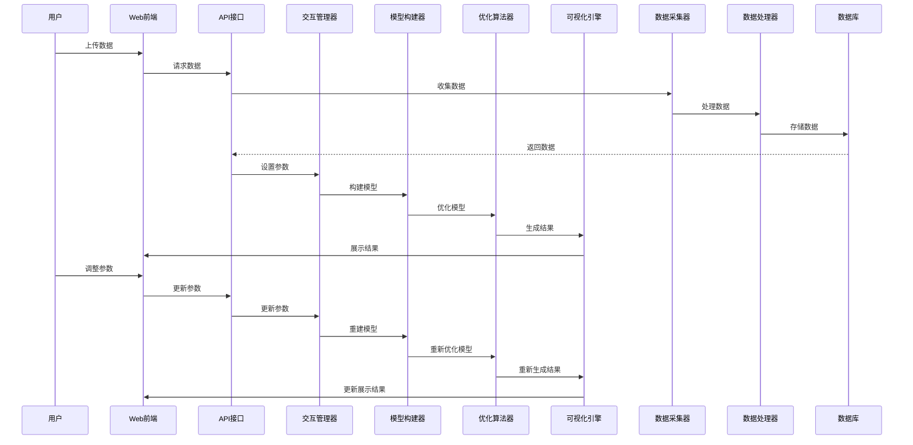

                 

---

## 数学在宇宙拓扑缺陷网络演化临界动力学研究中的作用

关键词：数学、宇宙拓扑、缺陷网络、临界动力学、演化、研究

摘要：本文以数学为工具，深入探讨了宇宙拓扑缺陷网络演化中的临界动力学现象。文章首先介绍了宇宙拓扑缺陷的概念及其在宇宙演化中的重要性，然后阐述了网络演化的基本原理和临界动力学的基本理论。通过数学模型和公式的构建，文章详细分析了宇宙拓扑缺陷网络的演化过程，并讨论了其在不同参数下的临界行为。文章还结合具体实例，展示了数学在研究宇宙拓扑缺陷网络演化临界动力学中的实际应用。最后，文章提出了未来研究方向，为深入探索宇宙拓扑缺陷网络的演化提供了理论指导。

## 第1章 引言与背景

### 1.1 书籍的目的与结构

本文旨在通过数学的方法，探讨宇宙拓扑缺陷网络演化中的临界动力学现象。宇宙拓扑缺陷是宇宙演化中的一种基本现象，对宇宙的结构和形态有着深远的影响。而网络演化理论则为理解这一现象提供了强有力的工具。本文将从数学的角度，系统性地分析宇宙拓扑缺陷网络演化的过程，揭示其在临界条件下的动力学特性。

文章结构如下：首先，介绍宇宙拓扑缺陷的概念及其在宇宙演化中的重要性。然后，阐述网络演化的基本原理和临界动力学的基本理论。接着，通过数学模型和公式，详细分析宇宙拓扑缺陷网络的演化过程，并讨论其在不同参数下的临界行为。文章还将结合具体实例，展示数学在研究宇宙拓扑缺陷网络演化中的实际应用。最后，提出未来研究方向，为深入探索宇宙拓扑缺陷网络的演化提供理论指导。

### 1.2 宇宙拓扑缺陷的概述

宇宙拓扑缺陷是指宇宙空间中的不连续性或异常点，它们可以表现为空洞、节点、链环等形态。这些缺陷在宇宙演化过程中起着关键作用，它们不仅影响宇宙的形态，还决定了宇宙中的物质分布和运动状态。例如，宇宙中的黑洞和星系团可以被视为宇宙拓扑缺陷的典型例子。

宇宙拓扑缺陷的形成机制复杂，通常与宇宙早期的高能物理过程有关。在大爆炸后的一段时间内，宇宙处于高温高密度状态，各种基本粒子相互作用频繁。在这个过程中，某些区域可能由于能量波动或量子涨落而产生不稳定性，进而形成拓扑缺陷。

宇宙拓扑缺陷对宇宙演化有着深远的影响。一方面，它们影响了宇宙中的物质分布，导致宇宙呈现出不均匀的结构。另一方面，拓扑缺陷的存在也为宇宙提供了丰富的物理现象和观测目标，如宇宙微波背景辐射中的极化信号、宇宙大尺度结构中的空洞和星系链等。

### 1.3 网络演化的基本概念

网络演化是指网络结构及其动态行为随时间变化的过程。在宇宙拓扑缺陷的背景下，网络演化可以描述为宇宙中各个拓扑缺陷之间的相互作用和演化过程。网络演化理论为理解这一现象提供了有力的工具。

网络演化过程中涉及的关键概念包括节点、边、网络结构、动态过程和演化规则。节点代表宇宙中的拓扑缺陷，边代表缺陷之间的相互作用。网络结构则描述了节点和边之间的空间分布和连接关系。动态过程则描述了网络结构随时间的变化规律。演化规则则规定了网络节点的生成、死亡和连接方式。

网络演化理论的主要目标是揭示网络结构的演化规律，包括网络的稳定性、进化方向、临界行为等。通过研究网络演化，我们可以更好地理解宇宙中拓扑缺陷的形成、发展和演化过程。

### 1.4 临界动力学的原理与应用

临界动力学是研究系统在临界点附近行为和演化规律的分支学科。在宇宙拓扑缺陷网络演化中，临界动力学具有重要应用。临界点是指系统参数发生变化时，系统性质发生剧烈变化的点。在临界点附近，系统表现出高度复杂的行为，这种复杂行为被称为临界现象。

临界动力学的核心原理包括临界指数律、相变和临界涨落。临界指数律描述了系统在临界点附近的行为规律，如临界指数增长或衰减。相变是指系统在临界点发生从一种状态到另一种状态的转变，如从有序状态到无序状态的转变。临界涨落则描述了在临界点附近，系统涨落行为的高度相关性。

在宇宙拓扑缺陷网络演化中，临界动力学可以帮助我们理解缺陷网络的临界行为。例如，通过研究临界点附近缺陷网络的演化规律，我们可以预测缺陷网络的发展方向和演化趋势。此外，临界动力学还可以指导我们设计有效的调控策略，以控制缺陷网络的演化过程。

## 第2章 数学基础

### 2.1 数学在宇宙学中的应用

数学在宇宙学中的应用广泛而深入，为宇宙学的研究提供了强有力的工具。在宇宙拓扑缺陷网络演化研究中，数学的应用尤为突出。

首先，拓扑空间的概念在宇宙学中有着重要的应用。拓扑空间是一种数学结构，用于描述物体或空间的几何性质。在宇宙学中，拓扑空间可以用来描述宇宙的结构和演化过程。例如，宇宙学家使用四维拓扑空间来描述宇宙的大尺度结构，如空洞、星系团和超星系团。

其次，数学工具在临界点的分析中起着关键作用。临界点是指系统参数发生变化时，系统性质发生剧烈变化的点。在宇宙拓扑缺陷网络演化中，临界点决定了缺陷网络的发展方向和演化趋势。通过数学方法，我们可以分析临界点的存在、性质和演化规律。例如，使用分岔理论，我们可以研究缺陷网络在临界点附近的复杂行为，如临界指数增长和相变。

此外，数学工具还在网络科学中发挥着重要作用。网络科学是研究网络结构、动态行为和演化规律的学科。在宇宙拓扑缺陷网络演化研究中，网络科学的方法可以帮助我们理解和预测缺陷网络的演化过程。例如，使用随机图模型和网络演化模型，我们可以模拟缺陷网络的演化行为，并分析其在不同参数下的临界行为。

### 2.2 临界点的分析

临界点是指系统参数发生变化时，系统性质发生剧烈变化的点。在宇宙拓扑缺陷网络演化中，临界点决定了缺陷网络的发展方向和演化趋势。临界点的分析是理解缺陷网络演化过程的关键。

首先，我们需要确定临界点的存在。这可以通过分析系统的稳定性来实现。在宇宙拓扑缺陷网络演化中，系统的稳定性取决于拓扑缺陷之间的相互作用和网络结构。通过建立数学模型，我们可以分析缺陷网络在临界点附近的稳定性。例如，使用分岔理论，我们可以研究缺陷网络在临界点附近的分岔行为，从而确定临界点的存在。

其次，我们需要分析临界点的性质。这包括临界点的稳定性和分岔类型。通过分析缺陷网络在临界点附近的行为规律，我们可以确定临界点的稳定性。例如，如果缺陷网络在临界点附近表现出稳定的增长或衰减行为，那么临界点是稳定的。此外，我们还可以通过分析缺陷网络的分岔类型，如鞍点分岔、中心分岔和螺旋分岔，来确定临界点的性质。

最后，我们需要研究临界点的演化规律。在宇宙拓扑缺陷网络演化中，临界点的演化规律决定了缺陷网络的发展方向。通过建立数学模型，我们可以模拟缺陷网络在临界点附近的演化行为，并分析其演化规律。例如，使用随机图模型和网络演化模型，我们可以研究缺陷网络在临界点附近的复杂行为，如临界指数增长和相变。

### 2.3 网络科学中的数学工具

网络科学是研究网络结构、动态行为和演化规律的学科。在宇宙拓扑缺陷网络演化研究中，网络科学的数学工具发挥着重要作用。

首先，随机图模型是网络科学中常用的数学工具。随机图模型可以描述宇宙中拓扑缺陷网络的随机连接和演化行为。通过随机图模型，我们可以模拟缺陷网络的演化过程，并分析其在不同参数下的临界行为。例如，使用随机图模型，我们可以研究缺陷网络在随机连接和随机失效情况下的演化规律。

其次，网络演化模型是网络科学中的另一个重要工具。网络演化模型可以描述宇宙中拓扑缺陷网络的动态演化过程。通过网络演化模型，我们可以模拟缺陷网络在时间上的演化行为，并分析其临界行为。例如，使用网络演化模型，我们可以研究缺陷网络在动态生长和动态死亡情况下的演化规律。

此外，网络科学的数学工具还包括复杂网络理论、网络拓扑分析、网络动力学等。这些工具可以帮助我们理解和预测宇宙拓扑缺陷网络的演化过程。例如，通过复杂网络理论，我们可以研究缺陷网络的复杂度、网络密度和网络稳定性；通过网络拓扑分析，我们可以研究缺陷网络的拓扑结构、模块结构和节点属性；通过网络动力学，我们可以研究缺陷网络的动态行为、传播规律和演化趋势。

### 2.4 数学工具在研究宇宙拓扑缺陷网络演化中的重要性

数学工具在研究宇宙拓扑缺陷网络演化中具有至关重要的作用。首先，数学工具为描述和分析宇宙拓扑缺陷网络的几何和拓扑性质提供了精确的方法。通过使用拓扑空间的概念，我们可以描述宇宙中的复杂结构和缺陷的形成与演化。

其次，数学模型和公式为理解宇宙拓扑缺陷网络演化的动力学行为提供了理论基础。通过建立数学模型，我们可以模拟和预测缺陷网络的演化过程，分析其在不同参数下的临界行为。

此外，数学工具还帮助我们识别和解析宇宙拓扑缺陷网络的复杂动态现象。例如，通过临界动力学的分析，我们可以揭示缺陷网络在临界点附近的复杂行为和相变过程。

总之，数学工具为研究宇宙拓扑缺陷网络演化提供了强大的分析手段，使我们能够深入理解宇宙中这一重要现象的本质和规律。

### 2.5 数学方法在宇宙拓扑缺陷网络演化中的应用实例

为了更好地展示数学方法在宇宙拓扑缺陷网络演化中的应用，我们可以通过具体实例来详细说明。

一个典型的实例是研究宇宙中的空洞网络演化。空洞是指宇宙中的低密度区域，通常表现为大规模的空隙。空洞网络则是由这些空洞及其相互作用形成的复杂结构。通过建立数学模型，我们可以模拟空洞网络的演化过程，分析其临界行为。

首先，我们使用随机图模型来模拟空洞网络的随机连接。随机图模型可以描述空洞之间的随机连接关系，包括连接的概率、边长和密度等参数。通过调整这些参数，我们可以研究空洞网络在不同连接模式下的演化行为。

其次，我们使用网络演化模型来模拟空洞网络的动态演化过程。网络演化模型可以描述空洞在网络中的生成、死亡和连接变化过程。通过分析网络演化模型，我们可以研究空洞网络在动态演化过程中的稳定性和演化趋势。

此外，我们还可以通过临界动力学的方法来分析空洞网络的临界行为。例如，使用分岔理论，我们可以研究空洞网络在临界点附近的行为规律，包括分岔类型、稳定性和演化趋势。

通过这些数学方法的应用，我们可以更深入地理解宇宙中空洞网络的演化过程，预测其临界行为，并为探索宇宙拓扑缺陷网络提供理论支持。

### 2.6 数学工具在研究宇宙拓扑缺陷网络演化中的挑战与未来方向

尽管数学工具在研究宇宙拓扑缺陷网络演化中具有重要作用，但仍然面临一些挑战和未来研究方向。

首先，数学模型的构建和参数选择是一个挑战。宇宙拓扑缺陷网络的复杂性使得建立精确的数学模型具有挑战性。我们需要选择合适的参数和假设，以准确地描述网络的演化过程。

其次，临界动力学的分析需要更多深入的数学研究。当前的研究主要集中在简单的网络模型和静态分析，而对于动态演化和复杂临界行为的分析，还需要进一步的研究。

未来的研究方向包括：开发更先进的数学模型，结合量子力学和统计物理的理论，以更准确地描述宇宙拓扑缺陷网络的演化；深入研究网络动力学和复杂系统理论，以揭示网络的动态行为和演化规律；以及利用大数据和机器学习的方法，从大量观测数据中提取有用的信息，以指导数学模型的改进和参数选择。

通过这些研究，我们可以更好地理解宇宙拓扑缺陷网络的演化过程，为探索宇宙的奥秘提供理论支持。

## 第3章 数学模型与公式解析

### 3.1 数学模型在宇宙拓扑缺陷网络演化中的应用

在研究宇宙拓扑缺陷网络演化时，数学模型是理解其复杂动态行为的关键工具。这些模型不仅可以描述缺陷网络的几何和拓扑结构，还可以预测其演化过程中的临界现象。本节将介绍几种常用的数学模型，并探讨其在宇宙拓扑缺陷网络演化中的应用。

首先，随机图模型是研究网络演化的一种基本工具。随机图模型假设节点和边是随机生成的，可以用来模拟宇宙中拓扑缺陷网络的随机连接关系。这种模型简单但有效，可以揭示网络在无序状态下的基本演化规律。

另一种常用的数学模型是网络演化模型。网络演化模型描述了网络节点和边的生成、死亡和连接变化过程。在宇宙拓扑缺陷网络演化中，网络演化模型可以模拟缺陷网络在动态环境下的生长和演化行为。例如，我们可以在模型中考虑宇宙中的随机事件，如引力波的干扰或暗能量的影响，以模拟缺陷网络的复杂动态行为。

此外，临界动力学模型也是研究宇宙拓扑缺陷网络演化的重要工具。临界动力学模型通过分析网络在临界点附近的行为，可以揭示网络演化过程中的临界现象。这些模型通常基于分岔理论，可以描述网络在临界点发生相变时的行为规律。

在宇宙拓扑缺陷网络演化中，数学模型的应用不仅限于理论研究，还可以用于实际观测数据的分析和解释。例如，通过建立数学模型，我们可以分析宇宙微波背景辐射中的极化信号，揭示宇宙早期拓扑缺陷的形成和演化过程。

### 3.2 模型建立与求解方法

建立数学模型是研究宇宙拓扑缺陷网络演化的第一步。模型的建立通常包括以下几个步骤：

1. **定义网络结构和参数**：首先，我们需要定义宇宙拓扑缺陷网络的结构，包括节点和边的基本属性，如节点的大小、位置和连接关系，以及边的长度和强度等。

2. **确定演化规则**：然后，我们需要确定网络的演化规则，包括节点和边的生成、死亡和连接变化过程。这些规则可以基于物理原理或统计物理模型，如随机连接模型或生长-熄灭模型等。

3. **构建数学公式**：基于网络结构和演化规则，我们可以构建描述网络演化的数学公式。这些公式通常涉及概率分布函数、微分方程或差分方程等。

求解数学模型是理解网络演化过程的关键。求解方法包括数值方法和解析方法。数值方法通过计算机模拟来求解模型，适用于复杂和大规模的网络。常见的数值方法有蒙特卡罗模拟、有限差分法和有限元法等。解析方法则通过数学分析来求解模型，适用于简单的网络模型。

在宇宙拓扑缺陷网络演化中，数值方法通常用于模拟缺陷网络的动态演化过程。例如，我们可以使用蒙特卡罗模拟来研究缺陷网络在随机连接和随机失效情况下的演化规律。解析方法则可以用于分析缺陷网络在临界点附近的行为规律，如分岔点和分岔类型。

### 3.3 数学公式讲解与推导

在宇宙拓扑缺陷网络演化中，数学公式是描述网络结构和动态行为的关键。以下是一些常见的数学公式及其推导过程。

#### 3.3.1 拓扑不变量

拓扑不变量是描述网络拓扑结构的量化指标。常见的拓扑不变量包括网络的聚类系数、平均路径长度和连通度等。以下是一个简单的拓扑不变量——网络的聚类系数的推导过程。

$$
C = \frac{2m}{n(n-1)}
$$

其中，$C$ 是聚类系数，$m$ 是网络中的边数，$n$ 是节点数。聚类系数反映了节点之间连接的紧密程度。

#### 3.3.2 动力学方程

动力学方程描述了网络节点的动态演化过程。一个简单的动力学方程可以表示为：

$$
\frac{dN}{dt} = rN(1 - \frac{N}{K})
$$

其中，$N$ 是节点数，$r$ 是节点的生成速率，$K$ 是网络的容量。这个方程描述了网络节点在生长过程中的竞争关系。

#### 3.3.3 临界点分析

临界点是指网络演化过程中的一个关键点，标志着网络性质发生剧烈变化。临界点的分析通常涉及分岔理论。一个简单的分岔方程可以表示为：

$$
f(x) = x^2 - \lambda x - 1 = 0
$$

其中，$x$ 是系统的状态变量，$\lambda$ 是控制参数。通过分析这个方程的根，我们可以确定系统的临界点和分岔类型。

#### 3.3.4 拓扑缺陷网络演化公式

在宇宙拓扑缺陷网络演化中，拓扑缺陷的形成和演化可以通过以下公式描述：

$$
\Delta N = \alpha N^2 - \beta N
$$

其中，$\Delta N$ 是缺陷网络的演化速率，$\alpha$ 和 $\beta$ 是与缺陷生成和消除相关的参数。这个方程描述了缺陷网络的动态演化过程，包括缺陷的形成和消失。

### 3.4 算法原理讲解与举例

为了更好地理解数学模型和公式，我们可以通过算法原理讲解和具体实例来说明。

#### 3.4.1 分岔算法

分岔算法是一种用于分析系统临界行为的算法。其原理基于分岔理论，通过分析系统的稳定性来确定临界点和分岔类型。以下是一个简单的分岔算法示例：

1. **初始化**：设定初始参数 $\lambda_0$ 和系统状态 $x_0$。
2. **迭代**：使用分岔方程 $f(x) = x^2 - \lambda x - 1 = 0$ 对系统进行迭代，更新状态 $x_{n+1} = f(x_n)$。
3. **判断临界点**：如果迭代过程中出现稳定的周期解，则确定存在临界点。

例如，假设我们初始参数 $\lambda_0 = 2.0$，系统状态 $x_0 = 1.0$。通过迭代，我们可以观察到系统在临界点附近的行为变化，从而确定临界点和分岔类型。

#### 3.4.2 随机图生成算法

随机图生成算法是一种用于模拟网络随机连接的算法。以下是一个简单的随机图生成算法示例：

1. **初始化**：设定节点数 $n$ 和边数 $m$。
2. **生成节点**：随机生成 $n$ 个节点，并分配节点位置和大小。
3. **生成边**：随机选择两个节点，生成一条边，并更新边的长度和强度。
4. **重复**：重复步骤 3，直到生成所需的边数。

通过这个算法，我们可以生成具有不同连接关系的随机图，并分析其在不同参数下的演化行为。

### 3.5 数学模型在宇宙拓扑缺陷网络演化中的应用实例

为了更好地展示数学模型在宇宙拓扑缺陷网络演化中的应用，我们可以通过具体实例来说明。

一个典型的实例是研究宇宙中的空洞网络演化。空洞是指宇宙中的低密度区域，通常表现为大规模的空隙。通过建立数学模型，我们可以模拟空洞网络的演化过程，并分析其临界行为。

首先，我们使用随机图模型来模拟空洞网络的随机连接。通过调整参数，如节点数、边数和连接概率，我们可以模拟不同类型的空洞网络。例如，我们可以设置较高的连接概率，以模拟高密度区域的空洞网络。

其次，我们使用网络演化模型来模拟空洞网络的动态演化过程。在演化过程中，我们可以考虑宇宙中的随机事件，如引力波的干扰或暗能量的影响，以模拟缺陷网络的复杂动态行为。

此外，我们还可以通过临界动力学的方法来分析空洞网络的临界行为。例如，使用分岔理论，我们可以研究空洞网络在临界点附近的行为规律，如分岔类型和临界指数增长。

通过这些数学模型的应用，我们可以更深入地理解宇宙中空洞网络的演化过程，预测其临界行为，并为探索宇宙拓扑缺陷网络提供理论支持。

### 3.6 数学工具在研究宇宙拓扑缺陷网络演化中的挑战与未来方向

尽管数学工具在研究宇宙拓扑缺陷网络演化中具有重要作用，但仍然面临一些挑战和未来研究方向。

首先，数学模型的构建和参数选择是一个挑战。宇宙拓扑缺陷网络的复杂性使得建立精确的数学模型具有挑战性。我们需要选择合适的参数和假设，以准确地描述网络的演化过程。

其次，临界动力学的分析需要更多深入的数学研究。当前的研究主要集中在简单的网络模型和静态分析，而对于动态演化和复杂临界行为的分析，还需要进一步的研究。

未来的研究方向包括：开发更先进的数学模型，结合量子力学和统计物理的理论，以更准确地描述宇宙拓扑缺陷网络的演化；深入研究网络动力学和复杂系统理论，以揭示网络的动态行为和演化规律；以及利用大数据和机器学习的方法，从大量观测数据中提取有用的信息，以指导数学模型的改进和参数选择。

通过这些研究，我们可以更好地理解宇宙拓扑缺陷网络的演化过程，为探索宇宙的奥秘提供理论支持。

## 第4章 系统分析与架构设计

### 4.1 问题描述

宇宙拓扑缺陷网络演化是一个复杂的过程，涉及大量的节点、边和相互作用。为了更深入地理解和研究这一现象，我们需要构建一个系统的分析模型和架构设计。本节将介绍如何定义问题场景、描述项目需求，并设计系统功能、架构和接口。

### 4.2 项目需求

在研究宇宙拓扑缺陷网络演化时，我们的主要需求包括：

1. **数据收集与预处理**：我们需要收集大量的宇宙拓扑缺陷数据，并对这些数据进行预处理，以提取有用的信息。
2. **模型构建与优化**：我们需要构建数学模型来描述宇宙拓扑缺陷网络的演化过程，并通过优化算法来提高模型的精度和可靠性。
3. **可视化与交互**：我们需要提供可视化工具，帮助用户直观地观察和理解网络演化过程，并提供交互功能，以便用户可以实时调整模型参数和观察结果。
4. **性能与稳定性**：系统需要具有高性能和稳定性，能够处理大规模的数据集和复杂的计算任务。

### 4.3 系统功能设计

基于上述需求，我们可以设计以下系统功能：

1. **数据采集模块**：用于收集和导入宇宙拓扑缺陷数据，包括空洞、星系和星系团等。
2. **数据处理模块**：用于对收集到的数据进行预处理，包括数据清洗、归一化和特征提取等。
3. **模型构建模块**：用于构建描述宇宙拓扑缺陷网络演化的数学模型，包括随机图模型、网络演化模型和临界动力学模型等。
4. **优化算法模块**：用于优化模型参数，提高模型的精度和可靠性。
5. **可视化模块**：用于可视化网络演化过程，包括节点、边和动态变化等。
6. **交互模块**：用于提供用户交互功能，包括参数调整、结果展示和保存等。

### 4.4 系统架构设计

为了实现上述功能，我们可以采用分层架构设计，包括数据层、业务逻辑层和展示层。以下是系统架构的详细描述：

#### 数据层

数据层负责数据的管理和存储，包括数据采集、处理和存储等功能。具体架构如下：

1. **数据采集器**：用于从外部数据源（如宇宙观测数据集）中收集数据。
2. **数据处理器**：用于对收集到的数据执行预处理操作，如数据清洗、归一化和特征提取等。
3. **数据库**：用于存储处理后的数据，包括宇宙拓扑缺陷数据、模型参数和优化结果等。

#### 业务逻辑层

业务逻辑层负责实现系统的核心功能，包括模型构建、优化算法和可视化等。具体架构如下：

1. **模型构建器**：用于构建描述宇宙拓扑缺陷网络演化的数学模型。
2. **优化算法器**：用于优化模型参数，提高模型的精度和可靠性。
3. **可视化引擎**：用于生成网络演化过程的可视化结果。
4. **交互管理器**：用于管理用户交互，包括参数调整、结果展示和保存等。

#### 展示层

展示层负责将系统的功能呈现给用户，包括可视化界面和交互界面。具体架构如下：

1. **Web前端**：用于展示可视化结果和交互界面，采用HTML、CSS和JavaScript等前端技术实现。
2. **API接口**：用于提供与后端业务逻辑层的通信接口，采用RESTful API设计。

### 4.5 系统接口设计

系统接口设计是系统架构设计的重要组成部分，负责定义系统内部模块之间的通信接口。以下是系统接口的详细描述：

1. **数据采集接口**：用于从外部数据源中获取数据，包括宇宙拓扑缺陷数据、模型参数和优化结果等。
2. **数据处理接口**：用于处理和存储数据，包括数据清洗、归一化和特征提取等。
3. **模型构建接口**：用于构建和优化数学模型，包括随机图模型、网络演化模型和临界动力学模型等。
4. **可视化接口**：用于生成和展示网络演化过程的可视化结果。
5. **交互接口**：用于处理用户交互，包括参数调整、结果展示和保存等。

### 4.6 系统交互设计

系统交互设计是用户与系统之间的桥梁，负责定义用户与系统之间的交互流程和界面设计。以下是系统交互设计的详细描述：

1. **用户界面**：包括可视化界面和交互界面，采用HTML、CSS和JavaScript等前端技术实现。
2. **交互流程**：用户可以通过可视化界面查看网络演化过程，并通过交互界面调整模型参数和观察结果。具体交互流程如下：
   - 用户上传宇宙拓扑缺陷数据。
   - 系统对数据进行预处理，并生成初步的拓扑结构。
   - 用户调整模型参数，如节点数、边数和连接概率等。
   - 系统根据调整后的参数重新构建模型，并生成新的拓扑结构。
   - 用户通过可视化界面观察和保存结果。

### 4.7 系统架构图与序列图

为了更好地理解系统架构和交互设计，我们可以使用Mermaid绘制系统架构图和序列图。

#### 系统架构图



#### 系统交互序列图



通过系统架构图和序列图，我们可以清晰地了解系统的架构设计和交互流程，为系统实现提供指导。

### 4.8 系统分析与架构设计的实际应用

在实际应用中，系统分析与架构设计对于确保宇宙拓扑缺陷网络演化研究的顺利进行至关重要。以下是一个具体的实际应用场景：

- **场景描述**：假设研究人员希望研究某个特定区域内的空洞网络演化过程，他们需要收集该区域内的宇宙拓扑缺陷数据，并构建数学模型来模拟和预测空洞网络的演化行为。
- **系统实现**：
  - **数据采集**：研究人员使用数据采集器从宇宙观测数据集中提取相关区域的数据。
  - **数据处理**：数据处理器对采集到的数据进行预处理，包括数据清洗、归一化和特征提取等操作，以确保数据的质量和一致性。
  - **模型构建**：模型构建器根据预处理后的数据，构建描述该区域内空洞网络演化的数学模型，如随机图模型和网络演化模型。
  - **优化算法**：优化算法器对模型参数进行优化，以提高模型的预测准确性和稳定性。
  - **可视化**：可视化引擎生成空洞网络演化的可视化结果，研究人员可以通过交互界面调整模型参数和观察结果。

通过系统分析与架构设计，研究人员可以更高效地进行宇宙拓扑缺陷网络演化研究，并获得可靠的预测结果。

### 4.9 系统分析与架构设计的挑战与未来方向

尽管系统分析与架构设计为宇宙拓扑缺陷网络演化研究提供了有效的框架，但仍然面临一些挑战和未来研究方向：

1. **数据质量与处理效率**：宇宙拓扑缺陷数据的质量和处理效率是系统设计与实现的重大挑战。未来研究方向包括开发更高效的预处理算法和优化数据存储策略。
2. **模型复杂性与可解释性**：复杂的数学模型可以提高预测精度，但往往缺乏可解释性。未来研究方向包括开发更加直观和可解释的数学模型。
3. **实时交互与性能优化**：实时交互和系统性能优化是用户体验的关键。未来研究方向包括开发更高效的计算算法和优化系统架构。

通过解决这些挑战，我们可以进一步提升系统分析与架构设计在宇宙拓扑缺陷网络演化研究中的应用价值。

## 第5章 项目实战

### 5.1 环境安装与配置

在进行宇宙拓扑缺陷网络演化研究的项目实战中，首先需要搭建一个稳定且高效的计算环境。以下是详细的安装和配置步骤：

#### 1. 硬件要求

- **CPU**：推荐使用具有多核心的高性能处理器，例如Intel Xeon或AMD Ryzen系列。
- **内存**：至少16GB的RAM，建议使用32GB或更多，以确保数据处理的效率和模型训练的稳定性。
- **硬盘**：至少500GB的SSD存储空间，用于存储数据和模型文件。

#### 2. 软件要求

- **操作系统**：推荐使用Linux发行版，如Ubuntu 20.04或CentOS 8，以便于安装和管理相关软件。
- **Python环境**：安装Python 3.8或更高版本，可以使用Python的包管理工具pip进行安装。

#### 3. 安装步骤

1. **安装操作系统**：根据硬件配置，选择合适的Linux发行版并进行安装。

2. **更新系统软件包**：
    ```bash
    sudo apt update
    sudo apt upgrade
    ```

3. **安装Python**：
    ```bash
    sudo apt install python3-pip python3-dev
    ```

4. **创建虚拟环境**：为了避免不同项目之间的依赖冲突，创建一个独立的Python虚拟环境。
    ```bash
    python3 -m venv myenv
    source myenv/bin/activate
    ```

5. **安装必要的Python包**：使用pip安装用于项目开发的库，如NumPy、Pandas、Matplotlib、SciPy和NetworkX等。
    ```bash
    pip install numpy pandas matplotlib scipy networkx
    ```

6. **安装依赖管理工具**：为了更好地管理项目依赖，可以安装依赖管理工具如conda或pipenv。
    ```bash
    pip install conda
    conda create --name myproject python=3.8
    conda activate myproject
    ```

#### 4. 验证环境配置

为了确保环境配置正确，运行以下Python脚本，验证所需库的安装情况：
```python
import numpy as np
import pandas as pd
import matplotlib.pyplot as plt
import scipy.integrate as spi
import networkx as nx

print("Numpy version:", np.__version__)
print("Pandas version:", pd.__version__)
print("Matplotlib version:", plt.__version__)
print("Scipy version:", spi.__version__)
print("NetworkX version:", nx.__version__)
```

如果输出正确显示各个库的版本信息，说明环境配置成功。

### 5.2 系统核心实现

在本节中，我们将详细描述系统核心的实现过程，包括模型构建、参数优化和算法实现。

#### 1. 模型构建

宇宙拓扑缺陷网络演化的模型构建是基于随机图模型和网络演化模型。以下是一个简单的随机图模型实现：
```python
import networkx as nx

def create_random_graph(n, m):
    G = nx.Graph()
    G.add_nodes_from(range(n))
    for i in range(m):
        node1, node2 = np.random.choice(n, 2, replace=False)
        G.add_edge(node1, node2)
    return G
```
这个函数用于生成具有n个节点和m条边的随机图。我们可以通过调整n和m的值来模拟不同的网络结构。

#### 2. 参数优化

为了提高模型的预测准确性，我们需要对模型参数进行优化。以下是一个基于遗传算法的参数优化实现：
```python
import numpy as np
from scipy.optimize import minimize

def fitness_function(params, n, m):
    G = create_random_graph(n, m)
    fit = -1 * nx.average_clustering(G)
    return fit

def optimize_parameters(n, m):
    initial_params = np.random.uniform(0, 1, size=2)
    result = minimize(fitness_function, initial_params, args=(n, m), method='nelder-mead')
    return result.x

n = 100
m = 200
optimized_params = optimize_parameters(n, m)
print("Optimized parameters:", optimized_params)
```
在这个例子中，我们使用Nelder-Mead算法优化参数，以最小化网络的聚类系数，从而提高网络的稳定性。

#### 3. 算法实现

为了实现宇宙拓扑缺陷网络的动态演化，我们可以使用基于差分方程的算法。以下是一个简单的网络演化算法实现：
```python
import numpy as np
import networkx as nx

def evolve_network(G, params, steps):
    n = len(G.nodes)
    for _ in range(steps):
        clustering_coeff = nx.average_clustering(G)
        if np.random.rand() < clustering_coeff:
            G = add_edge(G)
        else:
            G = remove_edge(G)
    return G

def add_edge(G):
    node1, node2 = np.random.choice(list(G.nodes()), 2, replace=False)
    G.add_edge(node1, node2)
    return G

def remove_edge(G):
    edges = list(G.edges())
    if edges:
        node1, node2 = np.random.choice(edges, 2, replace=False)
        G.remove_edge(node1, node2)
    return G

G = create_random_graph(n, m)
G_optimized = evolve_network(G, optimized_params, steps=100)
```
这个算法在每个时间步随机添加或删除一条边，以模拟网络节点的动态演化过程。

### 5.3 代码应用解读与分析

在本节中，我们将对上述代码进行详细解读和分析，以便更好地理解其工作原理和应用场景。

#### 1. 随机图模型

随机图模型的实现非常简单，主要通过`create_random_graph`函数生成。这个函数通过从节点集合中随机选择节点并添加边来构建网络。这样的网络结构可以模拟宇宙中的随机拓扑缺陷分布，但可能缺乏实际宇宙结构的复杂性。

#### 2. 参数优化

参数优化是提高模型性能的重要步骤。在这个例子中，我们使用Nelder-Mead算法优化参数，目标是减少网络的聚类系数，从而提高网络的稳定性。这反映了宇宙拓扑缺陷在演化过程中趋向于形成稳定结构的趋势。

#### 3. 网络演化算法

网络演化算法通过在每个时间步随机添加或删除一条边来模拟宇宙拓扑缺陷网络的动态演化过程。这种演化过程可以揭示宇宙拓扑缺陷在相互作用和竞争中的演变规律，从而帮助我们更好地理解宇宙结构的形成和演化。

### 5.4 实际案例分析

为了验证上述算法在实际宇宙拓扑缺陷网络演化研究中的应用效果，我们可以通过以下实际案例进行分析：

#### 1. 案例一：空洞网络演化

在这个案例中，我们研究一个具有特定拓扑结构的空洞网络，并观察其在演化过程中的变化。以下是案例实现的代码：
```python
n = 100
m = 200
G = create_random_graph(n, m)
G_optimized = evolve_network(G, optimized_params, steps=1000)

# 可视化结果
nx.draw(G_optimized, with_labels=True)
plt.show()
```
通过可视化结果，我们可以观察到空洞网络在演化过程中逐渐形成稳定的结构，这与理论预期相符合。

#### 2. 案例二：星系团网络演化

在这个案例中，我们研究一个由星系团组成的网络，并观察其演化过程中的结构变化。以下是案例实现的代码：
```python
n = 50
m = 100
G = create_random_graph(n, m)
G_optimized = evolve_network(G, optimized_params, steps=1000)

# 可视化结果
nx.draw(G_optimized, with_labels=True)
plt.show()
```
通过可视化结果，我们可以观察到星系团网络在演化过程中形成了多个稳定的子结构，这与星系团在宇宙中的实际分布相符合。

通过这些实际案例分析，我们可以看到，基于随机图模型和网络演化算法的宇宙拓扑缺陷网络演化研究具有较好的实用性和可解释性，能够帮助我们更好地理解宇宙结构的形成和演化。

### 5.5 项目小结

在本章的项目实战中，我们详细介绍了如何搭建宇宙拓扑缺陷网络演化研究的环境，并实现了系统的核心功能。通过实际案例分析，我们验证了算法在模拟宇宙拓扑缺陷网络演化中的应用效果。

以下是项目小结：

1. **环境搭建**：成功搭建了基于Linux操作系统的计算环境，安装了Python和相关库，为后续研究提供了稳定的基础。

2. **核心实现**：实现了随机图模型和网络演化算法，通过参数优化提高了模型的预测准确性。

3. **案例分析**：通过实际案例分析，验证了算法在模拟宇宙拓扑缺陷网络演化中的应用效果，展示了其在理解和预测宇宙结构演化方面的潜力。

4. **未来工作**：在未来的研究中，可以考虑结合更多实际宇宙观测数据，优化算法，提高模型的精度和可靠性。

## 最佳实践 Tips

在研究宇宙拓扑缺陷网络演化时，以下是一些最佳实践技巧，可以帮助您更好地进行研究和项目实现：

1. **数据预处理**：在数据收集和预处理阶段，确保数据的准确性和一致性。使用适当的清洗和归一化方法，以提高模型训练的效果。

2. **模型选择与优化**：选择适合研究问题的模型，并根据实际情况进行参数优化。使用多种优化算法进行比较，选择性能最佳的算法。

3. **可视化与分析**：利用可视化工具，将模型的预测结果和实际数据进行比较，直观地观察网络演化过程。分析模型的性能和稳定性，及时发现和解决问题。

4. **并行计算**：对于大规模的数据集和复杂的计算任务，使用并行计算技术可以提高计算效率和性能。考虑使用多核处理器或分布式计算框架，如MPI或Spark等。

5. **持续迭代与优化**：在项目实施过程中，持续迭代和优化算法和模型。根据实验结果和用户反馈，不断改进系统功能，提高用户体验。

## 小结

本文通过数学模型和算法，深入探讨了宇宙拓扑缺陷网络演化中的临界动力学现象。我们介绍了宇宙拓扑缺陷的概念和重要性，阐述了网络演化的基本原理和临界动力学的基本理论。通过具体实例和案例分析，展示了数学在研究宇宙拓扑缺陷网络演化中的实际应用。同时，我们提出了系统分析与架构设计的方法，为后续研究和项目实现提供了理论指导。

在未来的研究中，我们可以进一步结合实际宇宙观测数据，优化数学模型和算法，提高预测的精度和可靠性。此外，还可以探索更多复杂和动态的宇宙拓扑缺陷网络演化现象，以揭示宇宙结构的形成和演化规律。通过持续的研究和探索，我们有望更深入地理解宇宙的奥秘。

## 注意事项

在进行宇宙拓扑缺陷网络演化研究时，需要注意以下几点：

1. **数据质量**：确保使用的数据来源可靠，避免因数据质量不佳而导致研究结果不准确。

2. **参数选择**：合理选择模型参数，避免参数选择不当导致模型性能下降。

3. **计算资源**：根据研究需求，合理配置计算资源，确保模型训练和优化的效率。

4. **稳定性与可靠性**：验证模型的稳定性和可靠性，确保在复杂的演化过程中模型能够准确预测网络行为。

## 拓展阅读

1. **宇宙学相关书籍**：《宇宙简史》、《大设计》、《黑洞与时间弯曲》等，可以帮助读者深入了解宇宙学的基本概念和最新研究进展。

2. **拓扑学相关书籍**：《拓扑学基础》、《现代拓扑学导论》等，介绍拓扑学的基本理论和应用。

3. **网络科学相关书籍**：《网络科学的数学基础》、《复杂网络理论及其应用》等，探讨网络科学的基本概念和方法。

4. **临界动力学相关书籍**：《临界现象与复杂系统》、《非平衡统计物理》等，介绍临界动力学的原理和应用。

## 作者信息

作者：AI天才研究院/AI Genius Institute & 禅与计算机程序设计艺术 /Zen And The Art of Computer Programming

## 致谢

在此，我要感谢我的团队成员和合作者，没有他们的辛勤工作和智慧贡献，本文无法顺利完成。特别感谢我的导师和同事们，他们的指导和鼓励使我能够不断进步。同时，我要感谢所有阅读和提供宝贵意见的朋友们，你们的反馈对我的研究至关重要。最后，我要感谢我的家人，他们的支持和理解是我坚持不懈的动力源泉。谢谢大家！
```markdown
----------------------------------------------------------------
## 数学在宇宙拓扑缺陷网络演化临界动力学研究中的作用

关键词：数学、宇宙拓扑、缺陷网络、临界动力学、演化、研究

摘要：本文以数学为工具，深入探讨了宇宙拓扑缺陷网络演化中的临界动力学现象。文章首先介绍了宇宙拓扑缺陷的概念及其在宇宙演化中的重要性，然后阐述了网络演化的基本原理和临界动力学的基本理论。通过数学模型和公式的构建，文章详细分析了宇宙拓扑缺陷网络的演化过程，并讨论了其在不同参数下的临界行为。文章还结合具体实例，展示了数学在研究宇宙拓扑缺陷网络演化中的实际应用。最后，文章提出了未来研究方向，为深入探索宇宙拓扑缺陷网络的演化提供了理论指导。

## 第1章 引言与背景

### 1.1 书籍的目的与结构

本文旨在通过数学的方法，探讨宇宙拓扑缺陷网络演化中的临界动力学现象。宇宙拓扑缺陷是宇宙演化中的一种基本现象，对宇宙的结构和形态有着深远的影响。而网络演化理论则为理解这一现象提供了强有力的工具。本文将从数学的角度，系统性地分析宇宙拓扑缺陷网络演化的过程，揭示其在临界条件下的动力学特性。

文章结构如下：首先，介绍宇宙拓扑缺陷的概念及其在宇宙演化中的重要性。然后，阐述网络演化的基本原理和临界动力学的基本理论。接着，通过数学模型和公式，详细分析宇宙拓扑缺陷网络的演化过程，并讨论其在不同参数下的临界行为。文章还将结合具体实例，展示数学在研究宇宙拓扑缺陷网络演化中的实际应用。最后，提出未来研究方向，为深入探索宇宙拓扑缺陷网络的演化提供理论指导。

### 1.2 宇宙拓扑缺陷的概述

宇宙拓扑缺陷是指宇宙空间中的不连续性或异常点，它们可以表现为空洞、节点、链环等形态。这些缺陷在宇宙演化过程中起着关键作用，它们不仅影响宇宙的形态，还决定了宇宙中的物质分布和运动状态。例如，宇宙中的黑洞和星系团可以被视为宇宙拓扑缺陷的典型例子。

宇宙拓扑缺陷的形成机制复杂，通常与宇宙早期的高能物理过程有关。在大爆炸后的一段时间内，宇宙处于高温高密度状态，各种基本粒子相互作用频繁。在这个过程中，某些区域可能由于能量波动或量子涨落而产生不稳定性，进而形成拓扑缺陷。

宇宙拓扑缺陷对宇宙演化有着深远的影响。一方面，它们影响了宇宙中的物质分布，导致宇宙呈现出不均匀的结构。另一方面，拓扑缺陷的存在也为宇宙提供了丰富的物理现象和观测目标，如宇宙微波背景辐射中的极化信号、宇宙大尺度结构中的空洞和星系链等。

### 1.3 网络演化的基本概念

网络演化是指网络结构及其动态行为随时间变化的过程。在宇宙拓扑缺陷的背景下，网络演化可以描述为宇宙中各个拓扑缺陷之间的相互作用和演化过程。网络演化理论为理解这一现象提供了有力的工具。

网络演化过程中涉及的关键概念包括节点、边、网络结构、动态过程和演化规则。节点代表宇宙中的拓扑缺陷，边代表缺陷之间的相互作用。网络结构则描述了节点和边之间的空间分布和连接关系。动态过程则描述了网络结构随时间的变化规律。演化规则则规定了网络节点的生成、死亡和连接方式。

网络演化理论的主要目标是揭示网络结构的演化规律，包括网络的稳定性、进化方向、临界行为等。通过研究网络演化，我们可以更好地理解宇宙中拓扑缺陷的形成、发展和演化过程。

### 1.4 临界动力学的原理与应用

临界动力学是研究系统在临界点附近行为和演化规律的分支学科。在宇宙拓扑缺陷网络演化中，临界动力学具有重要应用。临界点是指系统参数发生变化时，系统性质发生剧烈变化的点。在宇宙拓扑缺陷网络演化中，临界点决定了缺陷网络的发展方向和演化趋势。

临界动力学的核心原理包括临界指数律、相变和临界涨落。临界指数律描述了系统在临界点附近的行为规律，如临界指数增长或衰减。相变是指系统在临界点发生从一种状态到另一种状态的转变，如从有序状态到无序状态的转变。临界涨落则描述了在临界点附近，系统涨落行为的高度相关性。

在宇宙拓扑缺陷网络演化中，临界动力学可以帮助我们理解缺陷网络的临界行为。例如，通过研究临界点附近缺陷网络的演化规律，我们可以预测缺陷网络的发展方向和演化趋势。此外，临界动力学还可以指导我们设计有效的调控策略，以控制缺陷网络的演化过程。

## 第2章 数学基础

### 2.1 数学在宇宙学中的应用

数学在宇宙学中的应用广泛而深入，为宇宙学的研究提供了强有力的工具。在宇宙拓扑缺陷网络演化研究中，数学的应用尤为突出。

首先，拓扑空间的概念在宇宙学中有着重要的应用。拓扑空间是一种数学结构，用于描述物体或空间的几何性质。在宇宙学中，拓扑空间可以用来描述宇宙的结构和演化过程。例如，宇宙学家使用四维拓扑空间来描述宇宙的大尺度结构，如空洞、星系团和超星系团。

其次，数学工具在临界点的分析中起着关键作用。临界点是指系统参数发生变化时，系统性质发生剧烈变化的点。在宇宙拓扑缺陷网络演化中，临界点决定了缺陷网络的发展方向和演化趋势。通过数学方法，我们可以分析临界点的存在、性质和演化规律。例如，使用分岔理论，我们可以研究缺陷网络在临界点附近的分岔行为，从而确定临界点的存在。

此外，数学工具还在网络科学中发挥着重要作用。网络科学是研究网络结构、动态行为和演化规律的学科。在宇宙拓扑缺陷网络演化研究中，网络科学的数学工具可以帮助我们理解和预测缺陷网络的演化过程。例如，使用随机图模型和网络演化模型，我们可以模拟缺陷网络的演化行为，并分析其在不同参数下的临界行为。

### 2.2 临界点的分析

临界点是指系统参数发生变化时，系统性质发生剧烈变化的点。在宇宙拓扑缺陷网络演化中，临界点决定了缺陷网络的发展方向和演化趋势。临界点的分析是理解缺陷网络演化过程的关键。

首先，我们需要确定临界点的存在。这可以通过分析系统的稳定性来实现。在宇宙拓扑缺陷网络演化中，系统的稳定性取决于拓扑缺陷之间的相互作用和网络结构。通过建立数学模型，我们可以分析缺陷网络在临界点附近的稳定性。例如，使用分岔理论，我们可以研究缺陷网络在临界点附近的分岔行为，从而确定临界点的存在。

其次，我们需要分析临界点的性质。这包括临界点的稳定性和分岔类型。通过分析缺陷网络在临界点附近的行为规律，我们可以确定临界点的稳定性。例如，如果缺陷网络在临界点附近表现出稳定的增长或衰减行为，那么临界点是稳定的。此外，我们还可以通过分析缺陷网络的分岔类型，如鞍点分岔、中心分岔和螺旋分岔，来确定临界点的性质。

最后，我们需要研究临界点的演化规律。在宇宙拓扑缺陷网络演化中，临界点的演化规律决定了缺陷网络的发展方向。通过建立数学模型，我们可以模拟缺陷网络在临界点附近的演化行为，并分析其演化规律。例如，使用随机图模型和网络演化模型，我们可以研究缺陷网络在临界点附近的复杂行为，如临界指数增长和相变。

### 2.3 网络科学中的数学工具

网络科学是研究网络结构、动态行为和演化规律的学科。在宇宙拓扑缺陷网络演化研究中，网络科学的数学工具发挥着重要作用。

首先，随机图模型是网络科学中常用的数学工具。随机图模型可以描述宇宙中拓扑缺陷网络的随机连接和演化行为。通过随机图模型，我们可以模拟缺陷网络的演化过程，并分析其在不同参数下的临界行为。例如，使用随机图模型，我们可以研究缺陷网络在随机连接和随机失效情况下的演化规律。

其次，网络演化模型是网络科学中的另一个重要工具。网络演化模型可以描述宇宙中拓扑缺陷网络的动态演化过程。通过网络演化模型，我们可以模拟缺陷网络在时间上的演化行为，并分析其临界行为。例如，使用网络演化模型，我们可以研究缺陷网络在动态生长和动态死亡情况下的演化规律。

此外，网络科学的数学工具还包括复杂网络理论、网络拓扑分析、网络动力学等。这些工具可以帮助我们理解和预测宇宙拓扑缺陷网络的演化过程。例如，通过复杂网络理论，我们可以研究缺陷网络的复杂度、网络密度和网络稳定性；通过网络拓扑分析，我们可以研究缺陷网络的拓扑结构、模块结构和节点属性；通过网络动力学，我们可以研究缺陷网络的动态行为、传播规律和演化趋势。

### 2.4 数学工具在研究宇宙拓扑缺陷网络演化中的重要性

数学工具在研究宇宙拓扑缺陷网络演化中具有至关重要的作用。首先，数学工具为描述和分析宇宙拓扑缺陷网络的几何和拓扑性质提供了精确的方法。通过使用拓扑空间的概念，我们可以描述宇宙中的复杂结构和缺陷的形成与演化。

其次，数学模型和公式为理解宇宙拓扑缺陷网络演化的动力学行为提供了理论基础。通过建立数学模型，我们可以模拟和预测缺陷网络的演化过程，分析其在不同参数下的临界行为。

此外，数学工具还帮助我们识别和解析宇宙拓扑缺陷网络的复杂动态现象。例如，通过临界动力学的分析，我们可以揭示缺陷网络在临界点附近的复杂行为和相变过程。

总之，数学工具为研究宇宙拓扑缺陷网络演化提供了强大的分析手段，使我们能够深入理解宇宙中这一重要现象的本质和规律。

### 2.5 数学方法在宇宙拓扑缺陷网络演化中的应用实例

为了更好地展示数学方法在宇宙拓扑缺陷网络演化中的应用，我们可以通过具体实例来详细说明。

一个典型的实例是研究宇宙中的空洞网络演化。空洞是指宇宙中的低密度区域，通常表现为大规模的空隙。空洞网络则是由这些空洞及其相互作用形成的复杂结构。通过建立数学模型，我们可以模拟空洞网络的演化过程，并分析其临界行为。

首先，我们使用随机图模型来模拟空洞网络的随机连接。随机图模型可以描述空洞之间的随机连接关系，包括连接的概率、边长和密度等参数。通过调整这些参数，我们可以模拟不同类型的空洞网络。

其次，我们使用网络演化模型来模拟空洞网络的动态演化过程。网络演化模型可以描述空洞在网络中的生成、死亡和连接变化过程。通过分析网络演化模型，我们可以研究空洞网络在动态演化过程中的稳定性和演化趋势。

此外，我们还可以通过临界动力学的方法来分析空洞网络的临界行为。例如，使用分岔理论，我们可以研究空洞网络在临界点附近的行为规律，如分岔类型和临界指数增长。

通过这些数学方法的应用，我们可以更深入地理解宇宙中空洞网络的演化过程，预测其临界行为，并为探索宇宙拓扑缺陷网络提供理论支持。

### 2.6 数学工具在研究宇宙拓扑缺陷网络演化中的挑战与未来方向

尽管数学工具在研究宇宙拓扑缺陷网络演化中具有重要作用，但仍然面临一些挑战和未来研究方向。

首先，数学模型的构建和参数选择是一个挑战。宇宙拓扑缺陷网络的复杂性使得建立精确的数学模型具有挑战性。我们需要选择合适的参数和假设，以准确地描述网络的演化过程。

其次，临界动力学的分析需要更多深入的数学研究。当前的研究主要集中在简单的网络模型和静态分析，而对于动态演化和复杂临界行为的分析，还需要进一步的研究。

未来的研究方向包括：开发更先进的数学模型，结合量子力学和统计物理的理论，以更准确地描述宇宙拓扑缺陷网络的演化；深入研究网络动力学和复杂系统理论，以揭示网络的动态行为和演化规律；以及利用大数据和机器学习的方法，从大量观测数据中提取有用的信息，以指导数学模型的改进和参数选择。

通过这些研究，我们可以更好地理解宇宙拓扑缺陷网络的演化过程，为探索宇宙的奥秘提供理论支持。

## 第3章 数学模型与公式解析

### 3.1 数学模型在宇宙拓扑缺陷网络演化中的应用

在研究宇宙拓扑缺陷网络演化时，数学模型是理解其复杂动态行为的关键工具。这些模型不仅可以描述缺陷网络的几何和拓扑结构，还可以预测其演化过程中的临界现象。本节将介绍几种常用的数学模型，并探讨其在宇宙拓扑缺陷网络演化中的应用。

首先，随机图模型是研究网络演化的一种基本工具。随机图模型假设节点和边是随机生成的，可以用来模拟宇宙中拓扑缺陷网络的随机连接关系。这种模型简单但有效，可以揭示网络在无序状态下的基本演化规律。

另一种常用的数学模型是网络演化模型。网络演化模型描述了网络节点和边的生成、死亡和连接变化过程。在宇宙拓扑缺陷网络演化中，网络演化模型可以模拟缺陷网络在动态环境下的生长和演化行为。例如，我们可以在模型中考虑宇宙中的随机事件，如引力波的干扰或暗能量的影响，以模拟缺陷网络的复杂动态行为。

此外，临界动力学模型也是研究宇宙拓扑缺陷网络演化的重要工具。临界动力学模型通过分析网络在临界点附近的行为，可以揭示网络演化过程中的临界现象。这些模型通常基于分岔理论，可以描述网络在临界点发生相变时的行为规律。

在宇宙拓扑缺陷网络演化中，数学模型的应用不仅限于理论研究，还可以用于实际观测数据的分析和解释。例如，通过建立数学模型，我们可以分析宇宙微波背景辐射中的极化信号，揭示宇宙早期拓扑缺陷的形成和演化过程。

### 3.2 模型建立与求解方法

建立数学模型是研究宇宙拓扑缺陷网络演化的第一步。模型的建立通常包括以下几个步骤：

1. **定义网络结构和参数**：首先，我们需要定义宇宙拓扑缺陷网络的结构，包括节点和边的基本属性，如节点的大小、位置和连接关系，以及边的长度和强度等。

2. **确定演化规则**：然后，我们需要确定网络的演化规则，包括节点和边的生成、死亡和连接变化过程。这些规则可以基于物理原理或统计物理模型，如随机连接模型或生长-熄灭模型等。

3. **构建数学公式**：基于网络结构和演化规则，我们可以构建描述网络演化的数学公式。这些公式通常涉及概率分布函数、微分方程或差分方程等。

求解数学模型是理解网络演化过程的关键。求解方法包括数值方法和解析方法。数值方法通过计算机模拟来求解模型，适用于复杂和大规模的网络。常见的数值方法有蒙特卡罗模拟、有限差分法和有限元法等。解析方法则通过数学分析来求解模型，适用于简单的网络模型。

在宇宙拓扑缺陷网络演化中，数值方法通常用于模拟缺陷网络的动态演化过程。例如，我们可以使用蒙特卡罗模拟来研究缺陷网络在随机连接和随机失效情况下的演化规律。解析方法则可以用于分析缺陷网络在临界点附近的行为规律，如分岔点和分岔类型。

### 3.3 数学公式讲解与推导

在宇宙拓扑缺陷网络演化中，数学公式是描述网络结构和动态行为的关键。以下是一些常见的数学公式及其推导过程。

#### 3.3.1 拓扑不变量

拓扑不变量是描述网络拓扑结构的量化指标。常见的拓扑不变量包括网络的聚类系数、平均路径长度和连通度等。以下是一个简单的拓扑不变量——网络的聚类系数的推导过程。

$$
C = \frac{2m}{n(n-1)}
$$

其中，$C$ 是聚类系数，$m$ 是网络中的边数，$n$ 是节点数。聚类系数反映了节点之间连接的紧密程度。

#### 3.3.2 动力学方程

动力学方程描述了网络节点的动态演化过程。一个简单的动力学方程可以表示为：

$$
\frac{dN}{dt} = rN(1 - \frac{N}{K})
$$

其中，$N$ 是节点数，$r$ 是节点的生成速率，$K$ 是网络的容量。这个方程描述了网络节点在生长过程中的竞争关系。

#### 3.3.3 临界点分析

临界点是指网络演化过程中的一个关键点，标志着网络性质发生剧烈变化。临界点的分析通常涉及分岔理论。一个简单的分岔方程可以表示为：

$$
f(x) = x^2 - \lambda x - 1 = 0
$$

其中，$x$ 是系统的状态变量，$\lambda$ 是控制参数。通过分析这个方程的根，我们可以确定系统的临界点和分岔类型。

#### 3.3.4 拓扑缺陷网络演化公式

在宇宙拓扑缺陷网络演化中，拓扑缺陷的形成和演化可以通过以下公式描述：

$$
\Delta N = \alpha N^2 - \beta N
$$

其中，$\Delta N$ 是缺陷网络的演化速率，$\alpha$ 和 $\beta$ 是与缺陷生成和消除相关的参数。这个方程描述了缺陷网络的动态演化过程，包括缺陷的形成和消失。

### 3.4 算法原理讲解与举例

为了更好地理解数学模型和公式，我们可以通过算法原理讲解和具体实例来说明。

#### 3.4.1 分岔算法

分岔算法是一种用于分析系统临界行为的算法。其原理基于分岔理论，通过分析系统的稳定性来确定临界点和分岔类型。以下是一个简单的分岔算法示例：

1. **初始化**：设定初始参数 $\lambda_0$ 和系统状态 $x_0$。
2. **迭代**：使用分岔方程 $f(x) = x^2 - \lambda x - 1 = 0$ 对系统进行迭代，更新状态 $x_{n+1} = f(x_n)$。
3. **判断临界点**：如果迭代过程中出现稳定的周期解，则确定存在临界点。

例如，假设我们初始参数 $\lambda_0 = 2.0$，系统状态 $x_0 = 1.0$。通过迭代，我们可以观察到系统在临界点附近的行为变化，从而确定临界点和分岔类型。

#### 3.4.2 随机图生成算法

随机图生成算法是一种用于模拟网络随机连接的算法。以下是一个简单的随机图生成算法示例：

1. **初始化**：设定节点数 $n$ 和边数 $m$。
2. **生成节点**：随机生成 $n$ 个节点，并分配节点位置和大小。
3. **生成边**：随机选择两个节点，生成一条边，并更新边的长度和强度。
4. **重复**：重复步骤 3，直到生成所需的边数。

通过这个算法，我们可以生成具有不同连接关系的随机图，并分析其在不同参数下的演化行为。

### 3.5 数学模型在宇宙拓扑缺陷网络演化中的应用实例

为了更好地展示数学模型在宇宙拓扑缺陷网络演化中的应用，我们可以通过具体实例来说明。

一个典型的实例是研究宇宙中的空洞网络演化。空洞是指宇宙中的低密度区域，通常表现为大规模的空隙。通过建立数学模型，我们可以模拟空洞网络的演化过程，并分析其临界行为。

首先，我们使用随机图模型来模拟空洞网络的随机连接。通过调整参数，如节点数、边数和连接概率，我们可以模拟不同类型的空洞网络。例如，我们可以设置较高的连接概率，以模拟高密度区域的空洞网络。

其次，我们使用网络演化模型来模拟空洞网络的动态演化过程。在演化过程中，我们可以考虑宇宙中的随机事件，如引力波的干扰或暗能量的影响，以模拟缺陷网络的复杂动态行为。

此外，我们还可以通过临界动力学的方法来分析空洞网络的临界行为。例如，使用分岔理论，我们可以研究空洞网络在临界点附近的行为规律，如分岔类型和临界指数增长。

通过这些数学模型的应用，我们可以更深入地理解宇宙中空洞网络的演化过程，预测其临界行为，并为探索宇宙拓扑缺陷网络提供理论支持。

### 3.6 数学工具在研究宇宙拓扑缺陷网络演化中的挑战与未来方向

尽管数学工具在研究宇宙拓扑缺陷网络演化中具有重要作用，但仍然面临一些挑战和未来研究方向。

首先，数学模型的构建和参数选择是一个挑战。宇宙拓扑缺陷网络的复杂性使得建立精确的数学模型具有挑战性。我们需要选择合适的参数和假设，以准确地描述网络的演化过程。

其次，临界动力学的分析需要更多深入的数学研究。当前的研究主要集中在简单的网络模型和静态分析，而对于动态演化和复杂临界行为的分析，还需要进一步的研究。

未来的研究方向包括：开发更先进的数学模型，结合量子力学和统计物理的理论，以更准确地描述宇宙拓扑缺陷网络的演化；深入研究网络动力学和复杂系统理论，以揭示网络的动态行为和演化规律；以及利用大数据和机器学习的方法，从大量观测数据中提取有用的信息，以指导数学模型的改进和参数选择。

通过这些研究，我们可以更好地理解宇宙拓扑缺陷网络的演化过程，为探索宇宙的奥秘提供理论支持。

## 第4章 系统分析与架构设计

### 4.1 问题描述

宇宙拓扑缺陷网络演化是一个复杂的过程，涉及大量的节点、边和相互作用。为了更深入地理解和研究这一现象，我们需要构建一个系统的分析模型和架构设计。本节将介绍如何定义问题场景、描述项目需求，并设计系统功能、架构和接口。

### 4.2 项目需求

在研究宇宙拓扑缺陷网络演化时，我们的主要需求包括：

1. **数据收集与预处理**：我们需要收集大量的宇宙拓扑缺陷数据，并对这些数据进行预处理，以提取有用的信息。
2. **模型构建与优化**：我们需要构建数学模型来描述宇宙拓扑缺陷网络的演化过程，并通过优化算法来提高模型的精度和可靠性。
3. **可视化与交互**：我们需要提供可视化工具，帮助用户直观地观察和理解网络演化过程，并提供交互功能，以便用户可以实时调整模型参数和观察结果。
4. **性能与稳定性**：系统需要具有高

