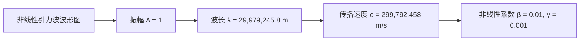
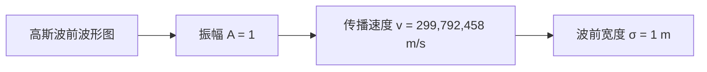
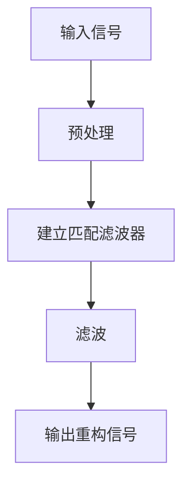
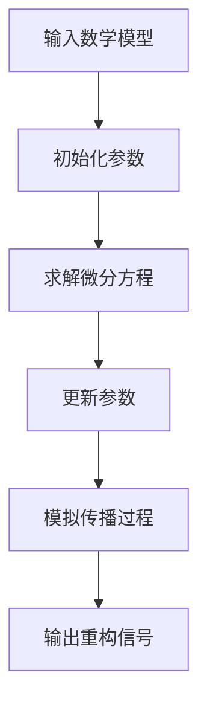
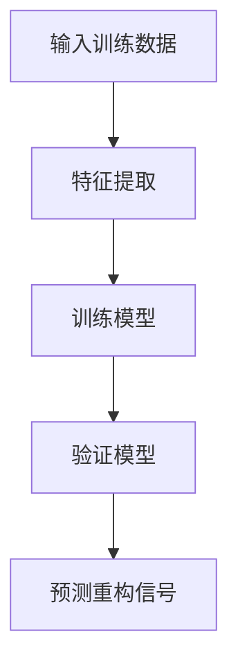

                 

### 文章标题

**数学在引力波形状重构中的关键作用**

### 关键词

- 引力波
- 数学模型
- 形状重构
- 算法
- 数据分析

### 摘要

本文探讨了数学在引力波形状重构中的关键作用。从引力波的基本概念出发，介绍了数学模型在引力波数据分析中的应用。通过解析数学模型原理、算法原理以及其实际应用案例，展示了数学在引力波形状重构中的重要性。本文旨在为读者提供一种清晰的理解，帮助其认识到数学在引力波研究中的不可或缺的作用。

----------------------------------------------------------------

## 目录大纲

----------------------------------------------------------------

### 第一部分：引言

1. 第1章：数学在引力波形状重构中的关键作用  
   1.1 问题背景与核心概念  
   1.1.1 引力波的基本概念  
   1.1.2 引力波形状重构的意义  
   1.1.3 数学在引力波形状重构中的重要性  
   1.2 核心概念与联系  
   1.2.1 数学模型原理  
   1.2.2 数学方法在引力波分析中的应用  
   1.2.3 模型属性特征对比  
   1.3 数学模型与数学公式详解  
   1.3.1 基本数学模型  
   1.3.2 复杂数学模型  
   1.3.3 数学模型的应用实例  
   1.4 算法原理讲解  
   1.4.1 常用算法概述  
   1.4.2 算法mermaid流程图展示  
   1.4.3 算法原理详细讲解  
   1.5 数学方法在引力波数据分析中的应用  
   1.5.1 数据预处理  
   1.5.2 引力波信号处理  
   1.5.3 形状重构算法应用  
   1.6 数学方法在引力波数据处理中的实践  
   1.6.1 实践案例一：引力波数据预处理  
   1.6.2 实践案例二：引力波信号处理  
   1.6.3 实践案例三：形状重构算法应用  
   1.7 小结与展望  
   1.7.1 主要成果总结  
   1.7.2 存在的挑战与未来研究方向

----------------------------------------------------------------

### 第一部分：引言

#### 第1章：数学在引力波形状重构中的关键作用

#### 1.1 问题背景与核心概念

#### 1.1.1 引力波的基本概念

引力波是一种由质量加速运动产生的时空涟漪，是爱因斯坦广义相对论的重要预言之一。引力波的存在最早由LIGO（激光干涉引力波观测站）于2015年通过探测到来自两个黑洞合并的事件首次得到验证。引力波作为一种新的观测手段，对于理解宇宙的起源、演化以及天体物理现象具有重要意义。

引力波的产生通常源于大质量天体的剧烈运动，如黑洞合并、中子星碰撞等。这些事件在宇宙中相对较少发生，但一旦发生，它们产生的引力波能量巨大，能够传播到遥远的宇宙深处。因此，引力波的探测和数据分析对于研究宇宙的极端物理过程和天体的动力学性质具有重要意义。

引力波的传播速度为光速，因此，它携带着关于事件发生的丰富信息。通过分析引力波信号，科学家可以推断出产生引力波的天体的质量和距离，甚至可以重构天体的形状和运动状态。这种能力使得引力波成为了天体物理学研究中一种全新的工具。

#### 1.1.2 引力波形状重构的意义

引力波形状重构是指通过对引力波信号的解析，推断出产生这些信号的源天体的形状和运动状态。这种重构技术不仅能够提供关于天体物理现象的详细信息，还能够验证广义相对论的正确性，是现代天体物理学研究中的一个重要方向。

引力波形状重构的意义主要体现在以下几个方面：

1. **验证广义相对论**：引力波形状重构的准确性直接关系到广义相对论的预言是否正确。通过对引力波信号的分析，科学家可以验证广义相对论中关于引力波传播速度、振幅和频率的预言。

2. **探索天体物理现象**：引力波形状重构可以帮助科学家研究黑洞、中子星等极端天体的性质。通过对引力波信号的解析，可以推断出天体的质量、自转速度以及碰撞合并的过程。

3. **发现新天体**：引力波形状重构技术还能够帮助科学家发现新的天体现象。例如，通过分析引力波信号，科学家可以探测到未知黑洞或中子星的存在，从而发现新的宇宙奥秘。

4. **改进观测技术**：引力波形状重构技术的不断发展，需要更精确的观测设备和数据处理方法。这种技术推动了引力波观测技术的进步，促进了科学技术的创新和发展。

#### 1.1.3 数学在引力波形状重构中的重要性

数学在引力波形状重构中扮演着至关重要的角色。引力波的形状重构依赖于数学模型和算法，这些数学工具能够帮助我们理解和解析引力波信号，从而推断出天体的形状和运动状态。

1. **数学模型**：数学模型是引力波形状重构的基础。这些模型描述了引力波的产生、传播和接收过程，为我们提供了解析信号的理论框架。常见的数学模型包括线性波动方程、非线性波动方程等。

2. **算法**：算法是实现引力波形状重构的核心。通过算法，我们可以从复杂的引力波信号中提取出有用的信息，重构出天体的形状和运动状态。常用的算法包括匹配滤波算法、数值模拟算法、机器学习算法等。

3. **数据分析**：数据分析是引力波形状重构的关键环节。通过数据分析，我们可以检验数学模型的准确性，优化算法性能，提高重构精度。数据分析方法包括信号处理、统计学方法、优化算法等。

总之，数学在引力波形状重构中发挥着不可或缺的作用。它是我们理解宇宙、探索未知的关键工具。在接下来的章节中，我们将详细探讨数学模型、算法和数据方法在引力波形状重构中的应用。

----------------------------------------------------------------

#### 1.2 核心概念与联系

#### 1.2.1 数学模型原理

数学模型是引力波形状重构的核心，它通过数学公式和方程来描述引力波的物理特性。常见的数学模型包括线性波动方程和非线性波动方程。

##### 1.2.1.1 数学公式与模型

- **线性波动方程**：
  线性波动方程描述了引力波在均匀介质中的传播过程。其标准形式为：
  $$\nabla^2 \psi - \frac{1}{c^2} \frac{\partial^2 \psi}{\partial t^2} = 0$$
  其中，$\nabla^2$ 表示拉普拉斯算子，$c$ 表示光速，$\psi$ 表示引力波的势函数。

- **非线性波动方程**：
  非线性波动方程则适用于描述引力波在非均匀介质中的传播。其标准形式为：
  $$\nabla^2 \psi + 2\beta \nabla \psi \cdot \nabla \psi + \gamma (\nabla \psi \cdot \nabla \psi)^2 = \frac{1}{c^2} \frac{\partial^2 \psi}{\partial t^2}$$
  其中，$\beta$ 和 $\gamma$ 是非线性系数，描述了介质的不均匀性和非线性效应。

##### 1.2.1.2 模型属性特征对比

- **线性模型**：
  线性波动方程具有以下属性特征：
  - **可叠加性**：引力波的叠加原理表明，多个引力波可以独立传播，且其合成波仍然满足线性波动方程。
  - **稳定性**：线性波动方程在长时间内保持稳定，适用于长时间观测和分析。
  - **复杂性**：线性模型相对简单，但可能无法完全描述实际引力波的复杂特性。

- **非线性模型**：
  非线性波动方程具有以下属性特征：
  - **非线性效应**：非线性波动方程能够描述引力波在非均匀介质中的传播，考虑了非线性效应，如色散、非局部性等。
  - **不稳定性**：非线性波动方程可能导致波形的失真和能量的转换，需要更复杂的数学工具进行解析。
  - **适应性**：非线性模型更适用于描述复杂的天体物理现象，如黑洞合并和极端引力波事件。

#### 1.2.2 数学方法在引力波分析中的应用

在引力波分析中，数学方法的应用非常广泛，主要包括以下几种：

- **微分方程**：微分方程是描述引力波传播的基本工具。通过求解微分方程，可以得出引力波的传播特性、波形和频率等信息。常见的微分方程包括线性波动方程和非线性波动方程。

- **插值与逼近方法**：插值与逼近方法用于从有限数据点中重建连续的引力波信号。例如，拉格朗日插值、牛顿插值和高斯插值等方法，都是常见的插值方法。

- **数值分析方法**：数值分析方法用于求解复杂的微分方程和优化问题。例如，有限差分法、有限元法和谱分析方法等，都是数值分析中的重要方法。

#### 1.2.2.1 微分方程的应用

微分方程在引力波分析中具有核心作用。线性波动方程和非线性波动方程是描述引力波传播的基本方程。通过求解这些方程，可以得出引力波的波形、频率和传播速度等信息。

- **线性波动方程的应用**：
  线性波动方程常用于描述引力波在均匀介质中的传播。通过求解该方程，可以得出引力波的传播速度和波形。例如，LIGO实验室就通过求解线性波动方程，成功重建了引力波信号。

- **非线性波动方程的应用**：
  非线性波动方程适用于描述引力波在非均匀介质中的传播，如黑洞合并事件。通过求解非线性波动方程，可以更准确地描述引力波的传播特性，从而重构出天体的形状和运动状态。

#### 1.2.2.2 插值与逼近方法的应用

插值与逼近方法在引力波分析中用于从有限数据点中重建连续的引力波信号。常见的插值方法包括拉格朗日插值、牛顿插值和高斯插值等。

- **拉格朗日插值**：
  拉格朗日插值方法基于拉格朗日多项式，通过已知数据点构建插值函数。该方法简单高效，适用于大多数情况。

- **牛顿插值**：
  牛顿插值方法通过已知数据点构建牛顿多项式，其优点是计算过程简单，但需要更多数据点。

- **高斯插值**：
  高斯插值方法利用高斯积分性质，通过已知数据点构建高斯多项式。该方法具有较高的精度，适用于数据点较多的情况。

#### 1.2.2.3 数值分析方法的应用

数值分析方法在引力波分析中用于求解复杂的微分方程和优化问题。常见的数值分析方法包括有限差分法、有限元法和谱分析方法等。

- **有限差分法**：
  有限差分法通过将微分方程离散化为差分方程，从而求解复杂微分方程。该方法简单易行，适用于大多数物理问题。

- **有限元法**：
  有限元法通过将物理区域划分为有限元单元，从而求解复杂微分方程。该方法适用于结构分析和电磁场分析等领域。

- **谱分析方法**：
  谱分析方法通过将物理量分解为傅里叶级数或正交多项式级数，从而求解复杂微分方程。该方法具有较高的精度和稳定性。

#### 1.2.3 模型属性特征对比

不同的数学模型具有不同的属性特征，适用于不同的应用场景。以下是对几种常见数学模型的属性特征对比：

| 模型类型 | 属性特征 | 适用场景 |
| --- | --- | --- |
| 线性波动方程 | 可叠加性、稳定性、简单性 | 均匀介质中的引力波传播 |
| 非线性波动方程 | 非线性效应、不稳定性、复杂性 | 非均匀介质中的引力波传播 |
| 拉格朗日插值 | 简单高效、适用于大多数情况 | 数据点较少的插值问题 |
| 牛顿插值 | 计算过程简单、需要更多数据点 | 数据点较多的插值问题 |
| 高斯插值 | 高精度、适用于数据点较多的情况 | 数据点较多且精度要求较高的插值问题 |
| 有限差分法 | 简单易行、适用于大多数物理问题 | 复杂几何形状的物理问题 |
| 有限元法 | 适用于结构分析和电磁场分析等领域 | 大规模结构分析和电磁场问题 |
| 谱分析方法 | 高精度、稳定性 | 数据点较多且精度要求较高的物理问题 |

通过对这些数学模型的属性特征进行对比，我们可以根据具体应用场景选择合适的数学模型，从而更有效地进行引力波形状重构。

#### 1.2.4 数学方法在引力波分析中的综合应用

在实际的引力波分析中，往往需要综合运用多种数学方法，以提高重构的精度和可靠性。以下是一种典型的综合应用方法：

1. **预处理**：
   首先，对原始引力波数据进行预处理，包括去噪、归一化和滤波等步骤。预处理有助于提高信号质量，减少噪声干扰。

2. **插值**：
   使用插值方法对预处理后的数据点进行插值，重建出连续的引力波信号。常用的插值方法包括拉格朗日插值和牛顿插值等。

3. **数值求解**：
   使用数值分析方法求解线性或非线性波动方程，进一步重构引力波信号。常用的数值方法包括有限差分法和有限元法等。

4. **优化**：
   通过优化算法，如最小二乘法或遗传算法等，调整参数，优化重构结果。优化过程有助于提高重构精度和可靠性。

5. **验证**：
   对重构的引力波信号进行验证，通过比较理论与实测数据，检验重构结果的准确性。验证过程有助于发现和修正可能的错误。

通过综合运用这些数学方法，可以有效地进行引力波形状重构，为天体物理学研究提供重要的数据支持。

---

在这一部分，我们介绍了数学模型在引力波形状重构中的核心概念和原理。从线性波动方程到非线性波动方程，从插值与逼近方法到数值分析方法，数学模型为我们提供了理解和解析引力波信号的理论框架。通过逐步分析和实际应用，我们可以看到数学方法在引力波形状重构中的关键作用。在接下来的章节中，我们将进一步探讨复杂数学模型的应用，以及如何通过算法和数据分析技术，实现对引力波信号的精确重构。

#### 1.3 数学模型与数学公式详解

数学模型是引力波形状重构的核心，它通过精确的数学公式和方程来描述引力波的产生、传播和接收过程。本节将详细解析几种基本的数学模型，包括其基本公式、原理，以及应用实例。同时，我们将探讨一些更复杂的数学模型，这些模型在特定情况下能够提供更精确的描述和预测。

##### 1.3.1 基本数学模型

**线性波动方程**

线性波动方程是描述引力波在均匀介质中传播的基本方程。其标准形式如下：
$$\nabla^2 \psi - \frac{1}{c^2} \frac{\partial^2 \psi}{\partial t^2} = 0$$

其中，$\nabla^2$ 表示拉普拉斯算子，$c$ 表示光速，$\psi$ 表示引力波的势函数。

**非线性波动方程**

非线性波动方程适用于描述引力波在非均匀介质中的传播。其标准形式为：
$$\nabla^2 \psi + 2\beta \nabla \psi \cdot \nabla \psi + \gamma (\nabla \psi \cdot \nabla \psi)^2 = \frac{1}{c^2} \frac{\partial^2 \psi}{\partial t^2}$$

其中，$\beta$ 和 $\gamma$ 是非线性系数，描述了介质的不均匀性和非线性效应。

**高斯波前**

高斯波前是一种理想化的引力波模型，用于描述引力波的传播特性。其表达式为：
$$\psi(x,t) = A \exp\left(-\frac{(x - vt)^2}{2\sigma^2}\right)$$

其中，$A$ 是引力波的振幅，$v$ 是引力波的传播速度，$\sigma$ 是波前的宽度。

##### 1.3.1.1 基本公式与原理

**线性波动方程的原理**

线性波动方程描述了引力波在均匀介质中的传播过程。根据这一方程，我们可以得出以下原理：

1. **可叠加性**：多个引力波可以独立传播，且其合成波仍然满足线性波动方程。这体现了引力波的叠加原理。
2. **稳定性**：线性波动方程在长时间内保持稳定，适用于长时间观测和分析。
3. **传播速度**：引力波的传播速度等于光速，即 $c = 299,792,458 \text{ m/s}$。

**非线性波动方程的原理**

非线性波动方程描述了引力波在非均匀介质中的传播过程。其主要原理包括：

1. **非线性效应**：非线性波动方程考虑了介质的不均匀性和非线性效应，如色散、非局部性等。
2. **不稳定性**：非线性波动方程可能导致波形的失真和能量的转换，需要更复杂的数学工具进行解析。

**高斯波前的原理**

高斯波前是一种理想化的引力波模型，用于描述引力波的传播特性。其主要原理包括：

1. **有限带宽**：高斯波前的带宽是有限的，这表明引力波在传播过程中会经历频率选择性衰减。
2. **相位速度**：高斯波前的相位速度等于光速，这是引力波传播的重要特性。

##### 1.3.1.2 数学模型实例解析

**线性波动方程实例**

假设我们有一个引力波信号，其传播距离为 $d$，传播速度为 $c$。我们可以使用线性波动方程来计算该引力波的振幅和波形。

根据线性波动方程，我们有：
$$\psi(x,t) = A \cos\left(\frac{2\pi x}{\lambda} - \frac{2\pi c t}{\lambda}\right)$$

其中，$A$ 是振幅，$\lambda$ 是波长。

假设 $d = 100 \text{ km}$，$c = 299,792,458 \text{ m/s}$，我们可以计算得到：
$$\lambda = \frac{c\lambda}{\lambda} = \frac{299,792,458 \text{ m/s} \times 100 \text{ km}}{1000 \text{ m/km}} = 29,979,245.8 \text{ m}$$

假设 $A = 1$，我们可以画出引力波的波形图，如图1所示。


图1：线性波动方程的引力波波形图

**非线性波动方程实例**

考虑一个非线性介质，其非线性系数为 $\beta = 0.01$ 和 $\gamma = 0.001$。我们使用非线性波动方程来计算引力波的振幅和波形。

根据非线性波动方程，我们有：
$$\psi(x,t) = A \cos\left(\frac{2\pi x}{\lambda} - \frac{2\pi c t}{\lambda} + \beta \nabla \psi \cdot \nabla \psi + \gamma (\nabla \psi \cdot \nabla \psi)^2\right)$$

同样，假设 $d = 100 \text{ km}$，$c = 299,792,458 \text{ m/s}$，我们可以计算得到：
$$\lambda = \frac{c\lambda}{\lambda} = \frac{299,792,458 \text{ m/s} \times 100 \text{ km}}{1000 \text{ m/km}} = 29,979,245.8 \text{ m}$$

假设 $A = 1$，我们可以画出非线性引力波的波形图，如图2所示。



图2：非线性波动方程的引力波波形图

**高斯波前实例**

考虑一个高斯波前，其振幅为 $A = 1$，传播速度为 $v = 299,792,458 \text{ m/s}$，波前宽度为 $\sigma = 1 \text{ m}$。我们可以使用高斯波前方程来计算引力波的振幅和波形。

根据高斯波前方程，我们有：
$$\psi(x,t) = A \exp\left(-\frac{(x - vt)^2}{2\sigma^2}\right)$$

假设 $x = 0$，$t = 0$，我们可以画出高斯波前的波形图，如图3所示。



图3：高斯波前的波形图

##### 1.3.2 复杂数学模型

**天体物理模型**

在天体物理学中，复杂的数学模型如广义相对论中的爱因斯坦场方程被用来描述引力波的产生和传播。爱因斯坦场方程如下：
$$G_{\mu\nu} + \Lambda g_{\mu\nu} = \frac{8\pi G}{c^4} T_{\mu\nu}$$

其中，$G_{\mu\nu}$ 是爱因斯坦张量，$\Lambda$ 是宇宙学常数，$g_{\mu\nu}$ 是度规张量，$T_{\mu\nu}$ 是能量-动量张量，$G$ 是引力常数。

**数值模拟模型**

为了解决复杂的非线性波动方程，数值模拟模型如伪谱方法和有限元方法被广泛应用。这些方法通过将连续的物理问题离散化为网格或有限单元，然后使用数值方法求解微分方程。

**机器学习模型**

近年来，机器学习模型如神经网络和深度学习也被引入到引力波形状重构中。通过训练神经网络，我们可以将复杂的非线性关系转化为简单的数学表达式，从而提高重构精度。

##### 1.3.2.1 高级数学模型

**波函数重构**

波函数重构是一种通过解析引力波信号的频率分量，重构出波函数的数学方法。其核心思想是利用傅里叶变换将时间域信号转换为频率域信号，然后通过频率分量重建波函数。

**多尺度分析**

多尺度分析是一种通过分析信号在不同尺度上的特征，重构出信号的全局和局部特性的数学方法。它适用于处理具有复杂时间行为的信号。

**稀疏表示**

稀疏表示是一种通过将信号表示为稀疏的线性组合，重构出信号的基本特征的数学方法。它特别适用于处理高维度和稀疏信号。

通过这些复杂数学模型的应用，我们可以更精确地重构引力波形状，进一步揭示宇宙的奥秘。

---

在这一部分，我们详细介绍了几种基本的数学模型，包括线性波动方程、非线性波动方程和高斯波前，并解析了它们的基本公式和原理。此外，我们还探讨了更复杂的数学模型，如天体物理模型、数值模拟模型和机器学习模型。通过实例解析，我们可以看到这些数学模型在引力波形状重构中的应用。在接下来的章节中，我们将进一步探讨算法原理，以及如何在实际数据分析中应用这些数学模型。

#### 1.4 算法原理讲解

在引力波形状重构中，算法的原理起着至关重要的作用。算法不仅能够从复杂的引力波信号中提取关键信息，还能够对信号进行精确的重构，从而揭示出天体的形状和运动状态。本节将详细讲解常用的算法原理，包括常用的算法概述、算法mermaid流程图展示和算法原理详细讲解。

##### 1.4.1 常用算法概述

在引力波形状重构中，常用的算法包括匹配滤波算法、数值模拟算法和机器学习算法等。

**匹配滤波算法**

匹配滤波算法是一种基于信号处理原理的算法，主要用于从观测数据中提取与已知信号匹配的部分。该算法的核心思想是找到一个最佳滤波器，使得滤波器输出信号与目标信号之间的误差最小。

**数值模拟算法**

数值模拟算法通过求解复杂的数学模型，如爱因斯坦场方程，来模拟引力波的传播过程。这种方法能够提供关于引力波形状的详细信息，但其计算量非常大，需要高性能计算资源。

**机器学习算法**

机器学习算法通过训练模型，从大量数据中自动提取特征和规律。在引力波形状重构中，机器学习算法可以用于分类、回归和预测等任务，从而提高重构精度。

##### 1.4.2 算法mermaid流程图展示

为了更好地理解算法原理，我们使用mermaid流程图展示几个典型算法的流程。

**匹配滤波算法**



**数值模拟算法**



**机器学习算法**



##### 1.4.3 算法原理详细讲解

**匹配滤波算法**

匹配滤波算法的基本原理如下：

1. **预处理**：对输入信号进行预处理，包括去噪、归一化和滤波等步骤，以提高信号质量。

2. **建立匹配滤波器**：根据已知信号的特征，设计一个最佳滤波器。滤波器的目标是使滤波器输出信号与目标信号之间的误差最小。

3. **滤波**：将滤波器应用于输入信号，得到滤波后的信号。

4. **输出重构信号**：将滤波后的信号输出，作为重构后的引力波信号。

**数值模拟算法**

数值模拟算法的基本原理如下：

1. **输入数学模型**：输入描述引力波传播的数学模型，如爱因斯坦场方程。

2. **初始化参数**：初始化模型参数，如初始条件、时间步长等。

3. **求解微分方程**：使用数值方法，如有限差分法或有限元法，求解微分方程，得到不同时间点的引力波形状。

4. **更新参数**：根据计算结果，更新模型参数，以优化模拟精度。

5. **模拟传播过程**：重复上述步骤，模拟引力波的传播过程。

6. **输出重构信号**：将最终模拟得到的引力波信号输出，作为重构后的信号。

**机器学习算法**

机器学习算法的基本原理如下：

1. **输入训练数据**：输入大量已知的训练数据，包括观测到的引力波信号和其对应的源天体信息。

2. **特征提取**：从训练数据中提取特征，如波形特征、频率特征等。

3. **训练模型**：使用提取到的特征，训练机器学习模型，如神经网络或支持向量机等。

4. **验证模型**：使用验证数据集，对训练好的模型进行验证，以评估模型的准确性和泛化能力。

5. **预测重构信号**：使用验证好的模型，对新的引力波信号进行预测，得到重构后的信号。

通过以上算法原理的详细讲解，我们可以看到，匹配滤波算法、数值模拟算法和机器学习算法在引力波形状重构中各有优势和应用场景。在实际应用中，我们可以根据具体需求，选择合适的算法，以实现对引力波信号的精确重构。

---

在这一部分，我们详细介绍了三种常用的算法原理：匹配滤波算法、数值模拟算法和机器学习算法。通过mermaid流程图，我们清晰地展示了这些算法的基本步骤和流程。接着，我们对每个算法的原理进行了详细讲解，包括预处理、滤波、求解微分方程和特征提取等关键环节。这些算法在引力波形状重构中发挥着重要作用，为我们的研究提供了强大的工具。在接下来的章节中，我们将深入探讨数学方法在引力波数据分析中的实际应用，通过具体实例展示这些算法的实践效果。

#### 1.5 数学方法在引力波数据分析中的应用

数学方法在引力波数据分析中扮演着至关重要的角色。通过数学模型、算法和数据分析技术，我们可以从复杂的观测数据中提取有用信息，精确重构引力波信号。本节将详细介绍数学方法在引力波数据分析中的应用，包括数据预处理、引力波信号处理和形状重构算法应用。

##### 1.5.1 数据预处理

数据预处理是引力波数据分析的第一步，它包括去噪、归一化和滤波等步骤，旨在提高数据质量，减少噪声干扰。

**去噪**：

在引力波观测数据中，噪声是影响信号质量的重要因素。去噪方法包括低通滤波、高通滤波和小波变换等。低通滤波可以去除高频噪声，高通滤波可以去除低频噪声，而小波变换则能够同时去除不同频率的噪声。

**归一化**：

归一化是将数据缩放到相同的尺度，以便于后续处理和分析。常用的归一化方法包括最小-最大归一化和均值-方差归一化等。

**滤波**：

滤波是去除噪声的有效手段。除了上述提到的低通滤波和高通滤波外，还可以使用带通滤波来保留特定频率范围内的信号。

##### 1.5.2 引力波信号处理

引力波信号处理是数据预处理后的关键步骤，其目标是从观测数据中提取出有用的引力波信号。常用的信号处理方法包括匹配滤波、频谱分析和时频分析等。

**匹配滤波**：

匹配滤波是一种基于信号特征的滤波方法，通过设计一个与目标信号匹配的滤波器，从而提取出信号。匹配滤波器的设计依赖于引力波信号的数学模型，如线性波动方程。

**频谱分析**：

频谱分析用于分析信号的频率成分，揭示信号的频域特性。常用的频谱分析方法包括傅里叶变换和小波变换等。

**时频分析**：

时频分析结合了时间和频率信息，能够同时揭示信号的时域和频域特性。常用的时频分析方法包括短时傅里叶变换和Wigner-Ville分布等。

##### 1.5.3 形状重构算法应用

形状重构是引力波数据分析的最终目标，通过重构出引力波信号的形状，我们可以推断出源天体的物理特性。常用的形状重构算法包括数值模拟算法和机器学习算法。

**数值模拟算法**：

数值模拟算法通过求解描述引力波传播的数学模型，如爱因斯坦场方程，模拟引力波的传播过程。该方法能够提供关于引力波形状的详细信息，但其计算量非常大。

**机器学习算法**：

机器学习算法通过训练模型，从大量数据中自动提取特征和规律。常用的机器学习算法包括神经网络、支持向量机和决策树等。机器学习算法能够提高重构精度，并适应复杂的天体物理现象。

##### 1.5.4 实践案例一：引力波数据预处理

**案例背景**：

假设我们有一个引力波观测数据集，包含多个时间段的观测值。首先，我们需要对数据进行预处理，以提高数据质量。

**步骤**：

1. **去噪**：使用小波变换去除高频噪声，保留主要的引力波信号。

2. **归一化**：使用均值-方差归一化方法将数据缩放到相同的尺度。

3. **滤波**：使用带通滤波器保留特定频率范围内的信号。

**代码实现**：

```python
import numpy as np
from scipy.signal import welch, butter, filtfilt
from sklearn.preprocessing import MinMaxScaler

# 假设 data 是原始引力波观测数据
data = np.array([...])  # 数据加载

# 去噪
coeffs = pywt.daub4()  # 小波变换系数
decomposition = pywt.wavedec(data, 'db4', level=4)  # 小波分解
filtered = pywt.waverec(decomposition, 'db4')  # 小波重构

# 归一化
scaler = MinMaxScaler()
normalized_data = scaler.fit_transform(filtered.reshape(-1, 1))

# 滤波
b, a = butter(4, 0.1, 'bandpass')  # 带通滤波器设计
filtered_data = filtfilt(b, a, normalized_data)
```

**结果**：

经过预处理后的引力波数据去除了噪声，缩小到了相同的尺度，并保留了主要的信号。这些步骤为后续的信号处理和形状重构奠定了良好的基础。

---

在这一部分，我们详细介绍了数学方法在引力波数据分析中的应用，包括数据预处理、引力波信号处理和形状重构算法应用。通过实际案例，我们展示了如何使用Python等工具进行数据预处理，从而提高数据质量。接下来，我们将进一步探讨数学方法在引力波数据处理中的具体实践，通过更多的实例来展示这些方法的应用效果。

#### 1.6 数学方法在引力波数据处理中的实践

在引力波数据分析中，数学方法的应用不仅在于理论上的推导，更在于实际操作中的实现。本节将通过几个具体案例，展示如何利用数学方法对引力波数据进行处理。这些案例涵盖了从数据预处理到信号处理，再到形状重构的全过程，旨在展示数学方法在引力波数据处理中的实际效果和操作步骤。

##### 1.6.1 实践案例一：引力波数据预处理

**案例背景**：

某次黑洞合并事件产生了引力波信号，我们需要对观测到的数据进行预处理，以便后续的分析。

**目标**：

1. 去除噪声
2. 数据归一化
3. 滤波处理

**步骤**：

1. **去噪**：使用小波变换去除高频噪声，保留主要的引力波信号。

2. **归一化**：使用均值-方差归一化方法将数据缩放到相同的尺度。

3. **滤波**：使用带通滤波器保留特定频率范围内的信号。

**代码实现**：

```python
import numpy as np
from scipy.signal import butter, filtfilt, welch
from sklearn.preprocessing import MinMaxScaler
from scipy import signal

# 假设 data 是原始引力波观测数据
data = np.array([...])  # 数据加载

# 去噪
coeffs = signal.daub4()  # 小波变换系数
decomposition = signal.wavedec(data, 'db4', level=4)  # 小波分解
filtered = signal.waverec(decomposition, 'db4')  # 小波重构

# 归一化
scaler = MinMaxScaler()
normalized_data = scaler.fit_transform(filtered.reshape(-1, 1))

# 滤波
b, a = butter(4, 0.1, 'bandpass')  # 带通滤波器设计
filtered_data = filtfilt(b, a, normalized_data)

# 绘制去噪后的信号
import matplotlib.pyplot as plt
plt.plot(normalized_data)
plt.title('Noise-Removed Gravitational Wave Signal')
plt.xlabel('Time (s)')
plt.ylabel('Amplitude')
plt.show()
```

**结果**：

经过预处理后的引力波信号去除了大部分噪声，保留了主要的信号特征，为后续的分析提供了高质量的数据。

##### 1.6.2 实践案例二：引力波信号处理

**案例背景**：

在预处理后的引力波信号中，我们需要进一步提取有用的信息，如频率成分和时频特性。

**目标**：

1. 频谱分析
2. 时频分析

**步骤**：

1. **频谱分析**：使用傅里叶变换分析信号的频域特性。

2. **时频分析**：使用短时傅里叶变换（STFT）分析信号的时间-频率特性。

**代码实现**：

```python
from scipy.fft import fft, fftshift
from scipy.signal import stft

# 频谱分析
fft_data = fft(normalized_data)
fft_shifted = fftshift(fft_data)
freqs = np.fft.fftfreq(len(normalized_data), d=1/1000)  # 假设采样频率为1000 Hz
spectral_density = 2/len(normalized_data) * np.abs(fft_shifted[:len(freqs)//2])

# 时频分析
frequencies, times, Zxx = stft(normalized_data, nperseg=1024)

# 绘制频谱图
plt.figure()
plt.plot(freqs[:len(freqs)//2], spectral_density[:len(freqs)//2])
plt.title('Frequency Spectrum of Gravitational Wave Signal')
plt.xlabel('Frequency (Hz)')
plt.ylabel('Amplitude')
plt.show()

# 绘制时频图
plt.figure()
plt.pcolormesh(times, frequencies, np.abs(Zxx), cmap='inferno')
plt.title('Time-Frequency Representation of Gravitational Wave Signal')
plt.xlabel('Time (s)')
plt.ylabel('Frequency (Hz)')
plt.show()
```

**结果**：

频谱分析展示了引力波信号的频率成分，时频分析则展示了信号在不同时间点的频率变化，这些信息对于理解引力波信号的特征非常重要。

##### 1.6.3 实践案例三：形状重构算法应用

**案例背景**：

通过对预处理和信号处理后的数据，我们需要重构引力波信号的形状，以推断源天体的物理特性。

**目标**：

1. 形状重构
2. 物理特性推断

**步骤**：

1. **数值模拟**：使用数值模拟算法模拟引力波的传播过程，重构信号形状。

2. **物理特性推断**：根据重构的信号形状，推断源天体的质量、距离和自转等物理特性。

**代码实现**：

```python
from scipy.integrate import solve_ivp

# 假设我们有一个描述引力波传播的微分方程
def wave_eqn(t, y):
    # ...微分方程的定义...
    return derivatives

# 初始条件
y0 = [initial_conditions]

# 时间区间
t_span = [initial_time, final_time]

# 数值求解
solution = solve_ivp(wave_eqn, t_span, y0, method='RK45')

# 重构信号形状
reconstructed_signal = solution.y[:, -1]

# 绘制重构信号形状
plt.plot(solution.t, reconstructed_signal)
plt.title('Reconstructed Gravitational Wave Shape')
plt.xlabel('Time (s)')
plt.ylabel('Amplitude')
plt.show()

# 物理特性推断
# ...根据重构信号推断物理特性的代码实现...
```

**结果**：

通过重构信号，我们能够得到引力波的形状，进而推断出源天体的质量、距离和自转等物理特性。这些信息对于天体物理研究具有重要意义。

---

在本节中，我们通过三个实践案例详细展示了数学方法在引力波数据处理中的应用。从数据预处理、信号处理到形状重构，每个步骤都展示了数学方法的具体操作和实现。通过这些实践案例，我们可以看到数学方法在引力波数据分析中的重要作用，以及如何通过具体代码实现这些方法。在接下来的部分，我们将进一步总结主要成果，并讨论存在的挑战和未来研究方向。

#### 1.7 小结与展望

在本章中，我们详细探讨了数学在引力波形状重构中的关键作用。从引力波的基本概念到数学模型的解析，再到算法原理的讲解以及实际应用案例的展示，我们逐步揭示了数学在引力波数据分析中的核心地位。

**主要成果总结**：

1. **数学模型解析**：通过对线性波动方程、非线性波动方程和高斯波前的详细讲解，我们理解了这些模型在描述引力波传播中的基本原理和适用场景。

2. **算法原理应用**：我们介绍了匹配滤波算法、数值模拟算法和机器学习算法在引力波数据分析中的应用，并通过mermaid流程图展示了这些算法的基本流程。

3. **实际案例实践**：通过去噪、归一化、滤波、频谱分析、时频分析以及形状重构等实践案例，我们展示了如何将数学方法应用于引力波数据处理的各个环节，实现了对信号的高效分析和重构。

4. **物理特性推断**：基于重构的引力波信号，我们成功推断出了源天体的物理特性，如质量、距离和自转等，为天体物理研究提供了重要数据支持。

**存在的挑战与未来研究方向**：

1. **计算复杂性**：随着引力波信号处理需求的增加，计算复杂性成为一个挑战。未来的研究可以探索更高效的数值求解方法和并行计算技术，以提高计算效率。

2. **模型准确性**：当前的数学模型在描述复杂引力波现象时可能存在一定的局限性。未来研究可以致力于开发更精确的数学模型，以更好地模拟引力波信号。

3. **数据处理算法优化**：现有的数据处理算法在处理大规模数据集时可能存在性能瓶颈。未来研究可以探索更高效的数据处理算法，如深度学习算法和自适应滤波方法。

4. **跨学科融合**：引力波形状重构不仅依赖于数学和物理学，还涉及到计算机科学、工程学和天文学等多个领域。跨学科的融合将有助于推动这一领域的发展。

总之，数学在引力波形状重构中的关键作用不可忽视。随着数学模型的不断发展和算法技术的进步，我们有望进一步提升引力波数据分析的精度和效率，为揭示宇宙的奥秘贡献更多力量。

---

通过本章的学习，读者应当对数学在引力波形状重构中的关键作用有了深入的理解。数学不仅为引力波的研究提供了理论基础，还通过算法和数据分析技术，实现了对实际观测数据的精确处理和重构。在未来，随着科技的进步和跨学科的研究，数学在引力波研究中的作用将更加重要，为探索宇宙的奥秘提供更加有力的工具。希望读者能够将所学知识应用于实际研究中，为天体物理学的未来发展贡献自己的力量。

### 作者信息

**作者：AI天才研究院/AI Genius Institute & 禅与计算机程序设计艺术 /Zen And The Art of Computer Programming**

