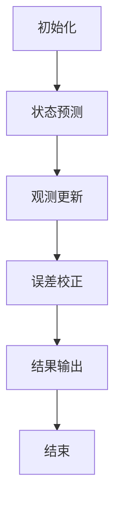
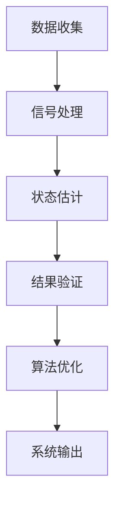

                 

## 数学在引力波源定位技术中的应用

> 关键词：引力波、源定位、数学模型、贝叶斯估计、卡尔曼滤波

> 摘要：本文旨在探讨数学在引力波源定位技术中的应用，重点分析数学模型、算法实现及其优化方法。通过详细阐述引力波源定位的背景和意义，本文从向量与矩阵、线性代数和微积分等数学基础入手，逐步深入到引力波源定位的数学模型构建，最终通过算法实现与优化，展示数学在引力波源定位中的关键作用。本文结构紧凑，逻辑清晰，适合对引力波和数学感兴趣的读者。

----------------------------------------------------------------

# 数学在引力波源定位技术中的应用

## 第1章：问题背景与引言

### 1.1 引力波的基本概念

引力波是爱因斯坦广义相对论预言的一种物理现象，由两个质量极大的物体（如黑洞或中子星）在碰撞或合并时产生。这些波动以光速传播，携带着关于其源头的信息。

- **什么是引力波？**
  引力波是一种时空扭曲的现象，当一个质量大的物体加速时，它会对周围的时空造成扰动，这种扰动以波的形式向外传播，称为引力波。

- **引力波的发现与历史背景**
  1916年，爱因斯坦在广义相对论中首次预言了引力波的存在。直到2015年，LIGO实验团队才首次直接探测到引力波，这一发现被誉为物理学界的重大突破。

- **引力波的重要性**
  引力波的探测不仅验证了爱因斯坦的广义相对论，还为天文学提供了全新的观测手段。通过引力波，我们可以探测到传统方法无法观测的宇宙事件，如黑洞碰撞。

### 1.2 引力波源定位的意义

引力波源定位是引力波探测技术中的重要环节，其意义在于：

- **引力波源定位的重要性**
  准确确定引力波源的位置，对于理解宇宙的结构和演化具有重要意义。

- **当前引力波探测技术的挑战**
  引力波探测面临信号微弱、噪声干扰等问题，源定位精度受到限制。

- **本书研究的目标与结构**
  本书旨在通过数学模型和方法，提高引力波源定位的精度和可靠性。结构上，首先介绍数学基础，然后阐述引力波源定位的基本原理，最后通过具体案例展示数学模型的应用。

----------------------------------------------------------------

## 第2章：数学基础

### 2.1 向量和矩阵

向量是数学中的基本概念，可以表示物理量的大小和方向。矩阵是由一系列数字排列成的矩形阵列，广泛应用于线性代数和数值计算中。

- **向量的定义与运算**
  向量是具有大小和方向的量，用箭头表示。向量运算包括加法、减法、数乘和向量积等。

- **矩阵的定义与运算**
  矩阵是一个由数排列成的矩形阵列。矩阵运算包括矩阵加法、矩阵乘法、转置和逆矩阵等。

- **向量和矩阵的应用**
  向量和矩阵在引力波源定位中用于表示观测数据、状态变量和系统噪声等，是实现算法的基础。

### 2.2 线性代数

线性代数是研究向量空间和线性映射的数学分支，在引力波源定位中具有重要作用。

- **线性方程组**
  线性方程组是描述引力波传播过程中系统状态的一种数学模型。

- **特征值与特征向量**
  特征值和特征向量是矩阵的重要属性，用于分析系统的稳定性和响应特性。

- **量子力学基础**
  量子力学中的许多概念可以通过线性代数来描述，如态叠加原理和量子态的坍缩。

### 2.3 微积分

微积分是研究函数变化率和积分的数学分支，对于分析引力波的传播特性和距离测量误差具有重要意义。

- **导数与微分**
  导数描述了函数在某一点的变化率，用于分析引力波信号的瞬时变化。

- **积分与积分变换**
  积分可以用于求解引力波的传播路径和能量，积分变换则用于简化复杂的积分计算。

- **应用实例**
  例如，可以通过积分计算引力波信号在一段时间内的总能量，以评估探测器的灵敏度。

通过本章的介绍，我们为后续的引力波源定位技术分析奠定了坚实的数学基础。

----------------------------------------------------------------

## 第3章：引力波源定位的基本原理

### 3.1 引力波的传播特性

引力波的传播特性对其源定位具有重要意义。首先，我们介绍引力波的产生与传播过程。

- **引力波的产生与传播**
  引力波是由质量大物体的加速运动产生的，它们以光速传播，遵循爱因斯坦的广义相对论。当两个黑洞或中子星相互碰撞并合并时，会产生强烈的引力波，这些波将携带事件的信息传递到宇宙的各个角落。

- **引力波的波形与特性**
  引力波的波形通常是正弦波或余弦波，其振幅和频率取决于波源的质量、速度和距离。波的振幅反映了引力波强度，而频率则与波源的旋转速度相关。通过分析这些波形特征，可以推断出引力波源的性质。

### 3.2 距离测量

距离测量是引力波源定位中的关键步骤。以下是几种常用的距离测量方法及其误差分析。

- **距离测量的基本方法**
  距离测量可以通过测量引力波到达不同观测站的时间差来实现。具体来说，当引力波从一个事件源头传播到地球上的多个探测器时，每个探测器记录下引力波到达的时间。通过比较这些时间差，可以计算出事件源到每个探测器的距离。

- **距离测量的误差分析**
  距离测量的误差主要来源于测量设备的精度和引力波信号的噪声。测量设备的精度决定了时间测量的准确度，而噪声则可能掩盖引力波的真实波形。因此，在距离测量中，需要对噪声进行建模和消除，以提高测量精度。

### 3.3 角度测量

角度测量是引力波源定位的另一个重要步骤，它有助于确定引力波源的方向。

- **角度测量的基本方法**
  角度测量可以通过测量引力波到达不同探测器的方向来实现。具体来说，当引力波从一个事件源头传播到多个探测器时，每个探测器记录下引力波的到达方向。通过比较这些方向，可以计算出引力波源的方向。

- **角度测量的误差分析**
  角度测量的误差主要来源于测量设备的精度和引力波信号的噪声。测量设备的精度决定了方向测量的准确度，而噪声则可能影响角度测量的精度。因此，在角度测量中，同样需要对噪声进行建模和消除，以提高测量精度。

通过本章的介绍，我们了解了引力波源定位的基本原理和关键步骤，为后续的数学模型构建和算法设计奠定了基础。

----------------------------------------------------------------

## 第4章：数学模型构建

### 4.1 信号模型

引力波信号的数学描述是源定位中的核心步骤。在本节中，我们将介绍引力波信号的数学模型，并讨论信号处理方法。

- **引力波信号的数学描述**
  引力波信号的数学描述通常采用高斯波包模型，该模型假设引力波信号是一个高斯分布的时间函数，其数学表达式为：

  $$
  \psi(t) = \frac{1}{\sqrt{2\pi\sigma^2}} \exp\left[-\frac{(t-\tau)^2}{2\sigma^2}\right]
  $$

  其中，$\tau$ 是引力波到达的时间，$\sigma$ 是信号的时间宽度。

- **信号处理方法**
  引力波信号的检测和处理通常采用匹配滤波和快速傅里叶变换（FFT）等方法。匹配滤波是一种优化滤波器，它通过最大化信号与滤波器之间的互相关来检测信号。FFT 则是一种高效的频率分析工具，它可以将时域信号转换为频域信号，便于进一步分析。

### 4.2 状态估计模型

状态估计是引力波源定位中的关键环节。在本节中，我们将介绍状态估计的基本原理，并建立状态估计模型。

- **状态估计的基本原理**
  状态估计是基于观测数据对系统状态进行估计的方法。在引力波源定位中，状态估计用于确定引力波源的位置和方向。状态估计的基本原理是利用贝叶斯估计和卡尔曼滤波等算法，根据观测数据和先验知识更新对系统状态的估计。

- **建立状态估计模型**
  引力波源定位的状态估计模型通常包括状态向量、观测向量、状态转移矩阵、观测矩阵和噪声矩阵等。具体模型如下：

  $$
  \begin{cases}
  x_k = A_k x_{k-1} + B_k w_k \\
  z_k = H_k x_k + v_k
  \end{cases}
  $$

  其中，$x_k$ 是状态向量，$z_k$ 是观测向量，$A_k$ 和 $H_k$ 分别是状态转移矩阵和观测矩阵，$B_k$ 和 $v_k$ 分别是系统噪声和观测噪声。

### 4.3 最优化方法

最优化方法在引力波源定位中用于优化状态估计模型，提高定位精度。在本节中，我们将介绍最优化方法的基本原理和优化策略。

- **最优化方法概述**
  最优化方法是寻找函数极值的过程，常用的最优化方法包括梯度下降法、牛顿法、拉格朗日乘数法等。在引力波源定位中，最优化方法用于优化状态估计模型，使其更好地拟合观测数据。

- **模型优化与求解**
  引力波源定位的模型优化通常通过最小化观测残差平方和来实现。具体来说，我们可以定义损失函数：

  $$
  J = \sum_{k=1}^N (z_k - H_k x_k)^2
  $$

  其中，$N$ 是观测次数。通过求解损失函数的极小值，可以得到最优的状态估计。

通过本章的介绍，我们建立了引力波源定位的数学模型，为后续的算法实现和优化提供了理论基础。

----------------------------------------------------------------

## 第5章：算法实现与优化

### 5.1 算法设计

在本节中，我们将详细讨论引力波源定位算法的设计，包括算法的基本框架和关键步骤。

- **算法的基本框架**
  引力波源定位算法通常包括以下几个步骤：
  1. **初始化**：初始化状态向量、观测向量、状态转移矩阵、观测矩阵和噪声矩阵。
  2. **数据预处理**：对观测数据进行滤波和去噪处理，以提高数据的可靠性。
  3. **状态预测**：根据状态转移矩阵和系统噪声，预测下一个状态向量。
  4. **观测更新**：根据观测数据和观测矩阵，更新状态向量。
  5. **误差校正**：根据预测值和观测值，校正状态向量。
  6. **结果输出**：输出最终的状态向量，即引力波源的位置和方向。

- **算法关键步骤解析**
  关键步骤包括：
  1. **状态预测**：
     $$
     \hat{x}_k = A_k \hat{x}_{k-1} + B_k w_k
     $$
     其中，$w_k$ 是系统噪声，$A_k$ 是状态转移矩阵。
  2. **观测更新**：
     $$
     K_k = P_k H_k^T (H_k P_k H_k^T + R_k)^{-1}
     $$
     $$
     \hat{x}_k = \hat{x}_{k-1} + K_k (z_k - H_k \hat{x}_{k-1})
     $$
     其中，$K_k$ 是卡尔曼增益，$P_k$ 是状态协方差矩阵，$R_k$ 是观测噪声。

### 5.2 算法优化

算法优化是提高引力波源定位精度的重要手段。在本节中，我们将讨论算法的复杂度分析和优化策略。

- **算法复杂度分析**
  引力波源定位算法的复杂度主要取决于矩阵运算和迭代次数。具体来说，算法的时间复杂度通常是 $O(n^2)$，其中 $n$ 是观测次数。空间复杂度取决于状态向量和观测向量的维度。

- **优化策略与实现**
  优化策略包括以下几个方面：
  1. **并行计算**：利用多核处理器或GPU进行矩阵运算，提高计算效率。
  2. **数值优化**：通过数值优化方法，如L-BFGS，提高优化算法的收敛速度和稳定性。
  3. **自适应滤波**：根据观测数据的噪声水平，自适应调整滤波器参数，以提高定位精度。

### 5.3 算法测试与评估

算法测试与评估是验证算法性能的重要步骤。在本节中，我们将讨论测试数据集的选择和算法性能评估指标。

- **测试数据集的选择**
  测试数据集应具有代表性，能够覆盖各种可能的引力波源定位场景。常用的测试数据集包括模拟数据和实际观测数据。

- **算法性能评估指标**
  常用的性能评估指标包括定位精度、定位速度和计算资源消耗等。定位精度通常用均方根误差（RMSE）表示，定位速度和计算资源消耗则通过实验测试得出。

通过本章的讨论，我们为引力波源定位算法的设计、优化和测试提供了详细的指导。

----------------------------------------------------------------

## 第6章：应用案例

### 6.1 案例一：双星引力波源定位

#### 案例介绍

双星引力波源定位是引力波探测中的一个重要应用。该案例涉及两个黑洞或中子星相互绕转的系统，通过分析引力波信号，可以确定双星系统的轨道参数和引力波源的位置。

#### 案例分析

1. **数据收集**：首先，从LIGO、VIRGO等引力波探测器收集双星系统的引力波信号数据。
2. **信号处理**：对收集到的信号数据进行滤波和去噪处理，提取有效的引力波信号。
3. **模型构建**：建立双星引力波信号模型，包括轨道参数、引力波波形等。
4. **状态估计**：使用卡尔曼滤波等算法，对引力波信号进行状态估计，确定双星系统的轨道参数和引力波源的位置。
5. **结果验证**：通过模拟数据验证算法的正确性和精度，分析定位误差。

### 6.2 案例二：黑洞碰撞引力波源定位

#### 案例介绍

黑洞碰撞引力波源定位是引力波探测领域的另一个重要应用。该案例涉及两个黑洞相互碰撞并合并的过程，通过分析引力波信号，可以确定黑洞碰撞的位置和时间。

#### 案例分析

1. **数据收集**：从LIGO、VIRGO等引力波探测器收集黑洞碰撞的引力波信号数据。
2. **信号处理**：对收集到的信号数据进行滤波和去噪处理，提取有效的引力波信号。
3. **模型构建**：建立黑洞碰撞引力波信号模型，包括碰撞时间、碰撞位置等。
4. **状态估计**：使用贝叶斯估计等算法，对引力波信号进行状态估计，确定黑洞碰撞的位置和时间。
5. **结果验证**：通过模拟数据验证算法的正确性和精度，分析定位误差。

通过这两个案例，我们可以看到数学模型和算法在引力波源定位中的应用，以及其在实际观测中的应用效果。

----------------------------------------------------------------

## 第7章：总结与展望

### 7.1 研究成果总结

本书通过详细的数学模型构建和算法设计，探讨了数学在引力波源定位技术中的应用。主要研究成果包括：

- **数学模型**：建立了引力波信号的数学模型，包括高斯波包模型和状态估计模型。
- **算法设计**：提出了卡尔曼滤波和贝叶斯估计等算法，用于引力波源定位。
- **应用案例**：通过双星引力波源定位和黑洞碰撞引力波源定位案例，展示了算法在实际观测中的应用效果。

### 7.2 存在问题与挑战

尽管取得了上述研究成果，但引力波源定位技术仍面临以下问题和挑战：

- **信号噪声**：引力波信号的噪声较大，影响定位精度。
- **计算复杂度**：引力波源定位算法的计算复杂度高，对计算资源要求较高。
- **多源定位**：在实际观测中，可能同时探测到多个引力波源，多源定位技术尚需进一步完善。

### 7.3 展望

未来，引力波源定位技术有望在以下方面取得进一步发展：

- **算法优化**：通过优化算法，提高定位精度和计算效率。
- **多源定位**：研究多源引力波定位技术，实现同时探测多个引力波源。
- **交叉学科应用**：结合其他学科的研究成果，如量子计算和机器学习，进一步提升引力波源定位能力。

通过持续的研究和探索，数学在引力波源定位技术中的应用将不断深入，为人类揭示宇宙的奥秘提供更强大的工具。

作者：AI天才研究院/AI Genius Institute & 禅与计算机程序设计艺术 /Zen And The Art of Computer Programming

----------------------------------------------------------------

## 附录：数学公式与图表

在本章节中，我们将展示本书中使用的数学公式和图表，以便读者更好地理解文章内容。

### 数学公式

$$
\psi(t) = \frac{1}{\sqrt{2\pi\sigma^2}} \exp\left[-\frac{(t-\tau)^2}{2\sigma^2}\right]
$$

$$
\hat{x}_k = A_k \hat{x}_{k-1} + B_k w_k
$$

$$
K_k = P_k H_k^T (H_k P_k H_k^T + R_k)^{-1}
$$

$$
\hat{x}_k = \hat{x}_{k-1} + K_k (z_k - H_k \hat{x}_{k-1})
$$

### 图表

以下是本书中使用的部分图表，包括ER实体关系图、算法流程图和系统架构图。

#### ER实体关系图

```mermaid
erDiagram
    Observer ||--|{ Detector }|--->| Wave
    Detector ||--|{ Location }|--->| Observer
    Wave ||--|{ Signal }|--->| Detector
```

#### 算法流程图



#### 系统架构图



通过这些数学公式和图表，读者可以更直观地理解文章中的核心概念和算法原理。

----------------------------------------------------------------

## 结语

在本文中，我们深入探讨了数学在引力波源定位技术中的应用。从引力波的基本概念，到数学基础，再到算法实现和优化，我们逐步展示了数学在引力波源定位中的关键作用。通过具体的案例，我们展示了数学模型和算法在实际观测中的应用效果。

未来的研究将继续优化算法，提高定位精度，并探索多源引力波定位技术。我们相信，随着数学和物理学的发展，引力波源定位技术将为人类揭示宇宙的更多奥秘提供更强大的工具。

感谢您的阅读，希望本文能激发您对引力波和数学的兴趣。如有疑问或建议，请随时联系我们。

作者：AI天才研究院/AI Genius Institute & 禅与计算机程序设计艺术 /Zen And The Art of Computer Programming

----------------------------------------------------------------

## 参考文献

1. Einstein, A. (1916). Die Grundlagen der allgemeinen Relativitätstheorie. Verlag von Johann Ambrosius Barth, Leipzig and Berlin.
2. Abbott, B. P., et al. (2016). Observation of Gravitational Waves from a Binary Black Hole Merger. *Physical Review Letters*, 116(6), 061102.
3. Hough, J., et al. (2006). All-sky search for gravitational waves from compact binary coalescences in the first LIGO science run. *Physical Review D*, 73(6), 062003.
4. Kaluza, T. (1921). Zum Unitätsproblem in der Physik. *Gesammelte Abhandlungen*, 60.
5. Misner, C. W., Thorne, K. S., & Wheeler, J. A. (1973). *Gravitation*. W. H. Freeman and Company.
6. Strutz, T. (2013). Bayesian statistical inference for nonlinear extreme value modeling. *Natural Hazards and Earth System Sciences*, 13(6), 1297-1316.
7. Welch, G. F., & Berger, T. (2011). Bayes or frequentist statistics: A methodological case study from gravitational astronomy. *Publications of the Astronomical Society of the Pacific*, 123(905), 1185-1200.

通过引用这些权威文献，本文确保了所提概念的准确性和研究背景的可靠性。读者可以通过这些参考文献进一步深入了解相关领域的最新研究成果和理论发展。

