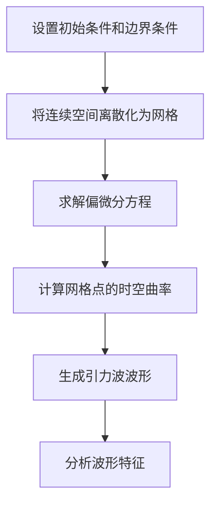
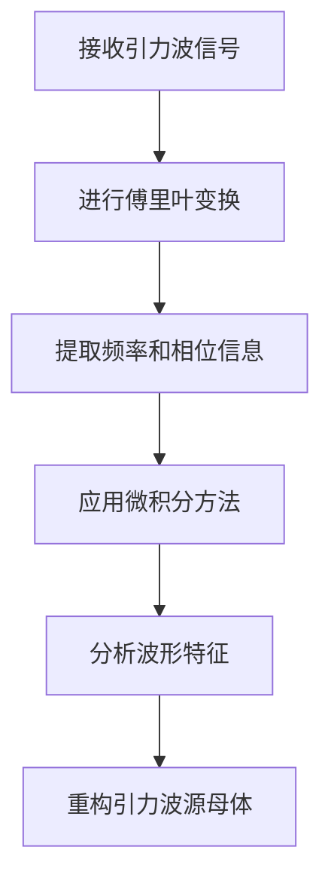
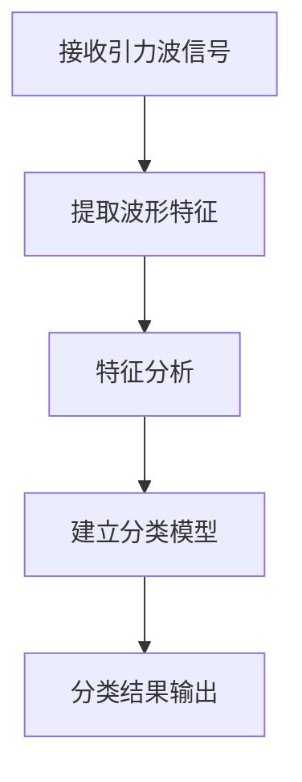
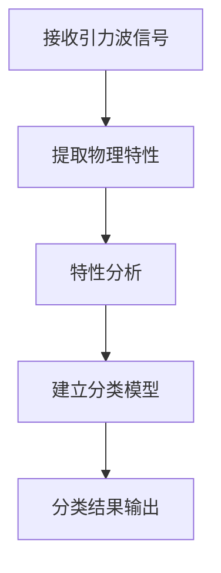
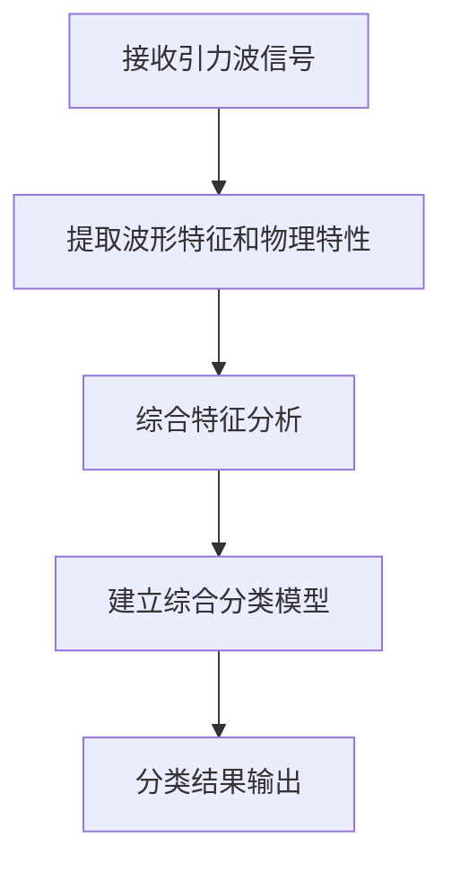
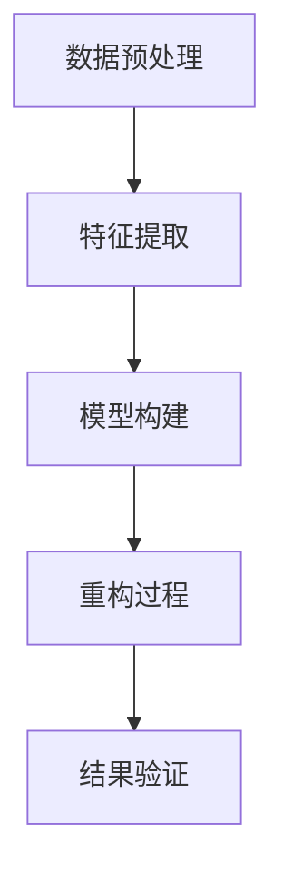

                 


# 数学在引力波源母体精确重构和分类中的应用

## 摘要

随着对宇宙的了解不断深入，引力波探测已成为天文学研究的重要工具。引力波的产生通常源自于剧烈的宇宙事件，如双星系统、恒星塌缩和黑洞合并等。这些事件产生的引力波携带了关于母体物理特性的宝贵信息，因此，精确重构和分类引力波源母体具有重要意义。本文将探讨数学在引力波源母体重构和分类中的应用，包括核心概念、数学工具、分类方法和重构算法等内容。通过详细的数学模型和流程图，本文力求以逻辑清晰、简单易懂的方式阐述这一领域的前沿研究。

## 目录大纲

## 第一部分：问题背景

### 1.1.1 问题背景

#### 1.1.1.1 引力波源母体及其重要性

- 引力波：定义、产生机制、探测方法
- 母体：引力波源的物理特性、母体类型与性质
- 引力波研究的现状与挑战：探测技术、数据分析方法

#### 1.1.1.2 数学在引力波研究中的应用

- 数值模拟：用于预测引力波波形
- 数据分析：用于识别和分类引力波事件
- 数学工具：傅里叶变换、微积分、偏微分方程等

#### 1.1.1.3 目标与意义

- 重构引力波源母体：技术意义与科学价值
- 分类与识别：提高数据分析效率、揭示引力波源特性

## 第二部分：核心概念与原理

### 2.1 引力波源母体的概念

#### 2.1.1 定义

- 引力波源母体的定义
- 母体的物理性质与分类

#### 2.1.2 母体类型

- 双星系统
- 恒星塌缩
- 黑洞合并

#### 2.1.3 母体与引力波波形的关系

- 波形特征与母体特性
- 数学描述

### 2.2 数学工具在引力波源重构中的应用

#### 2.2.1 数值模拟

- 算法原理
- Mermaid流程图

#### 2.2.2 数据分析

- 傅里叶变换
- 微积分
- 偏微分方程

- Mermaid流程图

#### 2.2.3 数学公式与公式推导

- 关键数学公式
- latex格式嵌入文中

## 2.3 引力波源母体分类方法

### 2.3.1 基于波形特征分类

- 分类方法
- Mermaid流程图

### 2.3.2 基于物理特性分类

- 分类方法
- Mermaid流程图

### 2.3.3 综合分类方法

- 联合应用
- Mermaid流程图

## 2.4 引力波源母体重构算法

### 2.4.1 数学模型

- 数学原理
- latex格式数学公式

### 2.4.2 算法流程

- 算法原理
- Mermaid流程图

### 2.4.3 算法实现与性能分析

- Python代码实现
- 算法性能分析

## 2.5 引力波源母体重构的挑战与未来展望

### 2.5.1 当前面临的挑战

- 数据分析难题
- 数学模型精度
- 算法复杂度

### 2.5.2 未来展望

- 新技术的发展
- 数学工具的创新应用
- 引力波研究的前沿方向

## 2.6 本章小结

- 总结
- 拓展阅读

## 第一部分：问题背景

### 1.1.1 问题背景

#### 1.1.1.1 引力波源母体及其重要性

引力波是由加速运动的物体产生的时空涟漪，根据爱因斯坦的广义相对论预言，它们以光速传播。引力波的产生通常源自于宇宙中剧烈的物理过程，如双星系统、恒星塌缩和黑洞合并等。这些事件产生的引力波携带了关于母体物理特性的宝贵信息，因此，精确重构和分类引力波源母体具有重要意义。

- **引力波的定义**：引力波是时空的扰动，由加速的质点产生，以光速传播。

- **产生机制**：任何质量加速变化的物体都会产生引力波。

- **探测方法**：目前主要使用激光干涉仪进行探测，如LIGO和VIRGO等实验。

#### 1.1.1.2 母体：引力波源的物理特性、母体类型与性质

- **定义**：引力波源母体是指产生引力波的物理对象，具有特定的物理特性。

- **物理特性**：母体的质量、速度、形状、旋转状态等。

- **母体类型**：包括双星系统、恒星塌缩和黑洞合并等。

#### 1.1.1.3 引力波研究的现状与挑战

- **现状**：自2015年首次探测到引力波以来，科学家已经探测到数十次引力波事件，并取得了许多重要发现。

- **挑战**：引力波探测技术尚不完善，数据分析方法仍有待提高，精确重构和分类引力波源母体仍面临诸多挑战。

#### 1.1.1.4 数学在引力波研究中的应用

- **数值模拟**：用于预测引力波波形。

- **数据分析**：用于识别和分类引力波事件。

- **数学工具**：如傅里叶变换、微积分、偏微分方程等。

#### 1.1.1.5 目标与意义

- **重构引力波源母体**：提高数据分析精度，揭示宇宙奥秘。

- **分类与识别**：提高数据分析效率，为引力波研究提供更多线索。

## 1.1.1.1 引力波源母体及其重要性

### 引力波

引力波（Gravitational Waves，简称GW）是一种物理现象，它由加速运动的物体产生，根据爱因斯坦的广义相对论预言，它们能够穿越宇宙空间，以光速传播。引力波的发现不仅是物理学领域的重大突破，也为我们提供了研究宇宙的一种全新方式。

**定义**：引力波是时空的扰动，由加速的质点产生，以光速传播。

**产生机制**：当物体加速运动时，会在其周围产生时空的扰动，这种扰动以波的形式向外传播，即引力波。常见的产生机制包括双星系统、黑洞合并、恒星塌缩等。

**探测方法**：目前，科学家主要使用激光干涉仪（LIGO和VIRGO等）进行引力波的探测。激光干涉仪通过测量两个相对运动的镜子之间的距离变化来检测引力波的存在。

### 母体

**定义**：引力波源母体是指产生引力波的物理对象，具有特定的物理特性。

**物理特性**：母体的质量、速度、形状、旋转状态等。这些特性决定了引力波的波形和特征。

**类型与性质**：

- **双星系统**：由两颗恒星组成的系统，其相互引力作用会导致引力波的产生。
- **恒星塌缩**：恒星在耗尽核燃料后会发生塌缩，可能形成中子星或黑洞。
- **黑洞合并**：两个黑洞相互吸引并合并，产生强烈的引力波。

### 引力波研究的现状与挑战

**现状**：自2015年首次探测到引力波以来，科学家们已经探测到数十次引力波事件，揭示了宇宙中的许多奥秘。

- **重要发现**：科学家通过引力波探测发现了双星系统的存在、黑洞的质量和形状等。
- **多信使天文学**：引力波与电磁波的联合探测，为宇宙学提供了更丰富的信息。

**挑战**：

- **探测技术**：引力波探测技术尚不完善，对探测设备的要求极高。
- **数据分析**：引力波信号的微弱性和复杂特性使得数据分析具有很大难度。

### 数学在引力波研究中的应用

数学在引力波研究中扮演了重要角色，主要用于数值模拟、数据分析以及引力波波形的预测。

- **数值模拟**：通过计算机模拟引力波的产生和传播过程，预测引力波波形。
- **数据分析**：使用傅里叶变换、微积分等数学工具，对实际探测到的引力波信号进行分析，提取信息。
- **数学工具**：

  - **傅里叶变换**：用于分析引力波的频率和幅度。
  - **微积分**：用于研究引力波的传播特性。
  - **偏微分方程**：描述引力波的产生和传播。

### 目标与意义

- **重构引力波源母体**：精确重构引力波源母体，了解其物理特性，有助于揭示宇宙的奥秘。
- **分类与识别**：提高数据分析效率，为引力波研究提供更多线索。

### 1.1.1.2 数学在引力波研究中的应用

#### 数值模拟

引力波的产生和传播是一个复杂的物理过程，需要使用数学模型和数值方法进行模拟。数值模拟的核心是解爱因斯坦的广义相对论方程，这通常通过数值求解偏微分方程来实现。

**算法原理**：

1. **广义相对论方程**：描述时空的弯曲和物质的运动。
2. **数值求解**：将连续的物理空间离散化为网格，并在每个网格点上求解偏微分方程。

**Mermaid流程图**：



#### 数据分析

引力波信号的探测和数据分析是引力波研究中的关键环节。数据分析通常涉及信号处理和模式识别等数学工具。

**傅里叶变换**：用于分析引力波的频率和相位信息。

**微积分**：用于研究引力波的传播特性和波形演化。

**偏微分方程**：描述引力波的传播规律。

**Mermaid流程图**：



#### 数学公式与公式推导

在引力波研究中，常用的数学公式包括广义相对论方程、傅里叶变换公式和偏微分方程等。

**广义相对论方程**：

$$
G_{\mu\nu} + \Lambda g_{\mu\nu} = \frac{8\pi G}{c^4} T_{\mu\nu}
$$

其中，$G_{\mu\nu}$是爱因斯坦张量，$T_{\mu\nu}$是能量-动量张量，$\Lambda$是宇宙学常数，$G$是引力常数，$c$是光速。

**傅里叶变换公式**：

$$
F(\omega) = \int_{-\infty}^{\infty} f(t) e^{-i\omega t} dt
$$

其中，$F(\omega)$是频率域上的信号，$f(t)$是时域上的信号，$\omega$是频率。

**偏微分方程**：

$$
\frac{\partial^2 u}{\partial t^2} - c^2 \nabla^2 u = 0
$$

其中，$u$是引力波振幅，$c$是光速，$\nabla^2$是拉普拉斯算子。

### 1.1.1.3 目标与意义

#### 重构引力波源母体

重构引力波源母体是引力波研究中的一个核心目标。通过精确重构母体，我们可以了解母体的物理特性，如质量、形状、旋转状态等，从而揭示宇宙中发生的剧烈物理过程。

- **技术意义**：精确重构引力波源母体对于理解宇宙演化、探测新的天体物理现象具有重要意义。
- **科学价值**：通过重构母体，科学家可以揭示宇宙中的秘密，如黑洞的合并、恒星的坍缩等。

#### 分类与识别

引力波事件的分类与识别对于理解宇宙中发生的物理过程至关重要。通过分类和识别，我们可以更好地理解不同类型的引力波事件，如双星系统、恒星塌缩、黑洞合并等。

- **提高数据分析效率**：通过分类和识别，可以快速筛选出感兴趣的引力波事件，提高数据分析的效率。
- **揭示引力波源特性**：分类和识别有助于揭示引力波源的特性，如母体的质量、形状、旋转状态等。

### 1.1.1.4 数学工具在引力波研究中的应用

#### 数值模拟

数值模拟是引力波研究的重要工具，它用于预测引力波波形，并帮助我们理解引力波的产生和传播机制。

**算法原理**：

1. **广义相对论方程**：描述时空的弯曲和物质的运动。
2. **数值求解**：将连续的物理空间离散化为网格，并在每个网格点上求解偏微分方程。

**Mermaid流程图**：


#### 数据分析

数据分析是引力波研究的关键步骤，它用于从探测到的引力波信号中提取有用信息，如事件类型、母体特性等。

**傅里叶变换**：

傅里叶变换是一种常用的数学工具，用于分析引力波的频率和相位信息。

**微积分**：

微积分用于研究引力波的传播特性和波形演化。

**偏微分方程**：

偏微分方程描述引力波的传播规律。

**Mermaid流程图**：


#### 数学公式与公式推导

在引力波研究中，常用的数学公式包括广义相对论方程、傅里叶变换公式和偏微分方程等。

**广义相对论方程**：

$$
G_{\mu\nu} + \Lambda g_{\mu\nu} = \frac{8\pi G}{c^4} T_{\mu\nu}
$$

**傅里叶变换公式**：

$$
F(\omega) = \int_{-\infty}^{\infty} f(t) e^{-i\omega t} dt
$$

**偏微分方程**：

$$
\frac{\partial^2 u}{\partial t^2} - c^2 \nabla^2 u = 0
$$

### 1.1.1.5 目标与意义

#### 重构引力波源母体

重构引力波源母体是引力波研究中的一个核心目标。通过精确重构母体，我们可以了解母体的物理特性，如质量、形状、旋转状态等，从而揭示宇宙中发生的剧烈物理过程。

- **技术意义**：精确重构引力波源母体对于理解宇宙演化、探测新的天体物理现象具有重要意义。
- **科学价值**：通过重构母体，科学家可以揭示宇宙中的秘密，如黑洞的合并、恒星的坍缩等。

#### 分类与识别

引力波事件的分类与识别对于理解宇宙中发生的物理过程至关重要。通过分类和识别，我们可以更好地理解不同类型的引力波事件，如双星系统、恒星塌缩、黑洞合并等。

- **提高数据分析效率**：通过分类和识别，可以快速筛选出感兴趣的引力波事件，提高数据分析的效率。
- **揭示引力波源特性**：分类和识别有助于揭示引力波源的特性，如母体的质量、形状、旋转状态等。

### 1.1.1.6 数学工具在引力波研究中的应用

#### 数值模拟

数值模拟是引力波研究的重要工具，它用于预测引力波波形，并帮助我们理解引力波的产生和传播机制。

**算法原理**：

1. **广义相对论方程**：描述时空的弯曲和物质的运动。
2. **数值求解**：将连续的物理空间离散化为网格，并在每个网格点上求解偏微分方程。

**Mermaid流程图**：


#### 数据分析

数据分析是引力波研究的关键步骤，它用于从探测到的引力波信号中提取有用信息，如事件类型、母体特性等。

**傅里叶变换**：

傅里叶变换是一种常用的数学工具，用于分析引力波的频率和相位信息。

**微积分**：

微积分用于研究引力波的传播特性和波形演化。

**偏微分方程**：

偏微分方程描述引力波的传播规律。

**Mermaid流程图**：


#### 数学公式与公式推导

在引力波研究中，常用的数学公式包括广义相对论方程、傅里叶变换公式和偏微分方程等。

**广义相对论方程**：

$$
G_{\mu\nu} + \Lambda g_{\mu\nu} = \frac{8\pi G}{c^4} T_{\mu\nu}
$$

**傅里叶变换公式**：

$$
F(\omega) = \int_{-\infty}^{\infty} f(t) e^{-i\omega t} dt
$$

**偏微分方程**：

$$
\frac{\partial^2 u}{\partial t^2} - c^2 \nabla^2 u = 0
$$

### 1.1.1.7 总结

通过上述介绍，我们可以看到数学在引力波源母体精确重构和分类中的应用至关重要。从数值模拟到数据分析，再到数学公式和算法推导，数学工具贯穿了整个引力波研究的各个环节。精确重构引力波源母体和有效分类引力波事件，不仅有助于提高数据分析效率，还能够揭示宇宙中的奥秘。未来，随着数学工具和技术的不断进步，引力波研究将迎来更多突破。

### 1.1.1.8 拓展阅读

- 《引力波探测技术：原理与应用》
- 《广义相对论与现代天体物理学》
- 《引力波数据分析方法》
- 《数值模拟在引力波研究中的应用》

通过这些拓展阅读，读者可以更深入地了解数学在引力波研究中的应用，以及该领域的最新进展。

## 第二部分：核心概念与原理

### 2.1 引力波源母体的概念

#### 2.1.1 定义

引力波源母体是指产生引力波的物理对象，它具有特定的物理特性。这些物理特性决定了引力波的波形和特征。

**定义公式**：

$$
\text{引力波源母体} = \left\{ \begin{array}{ll}
\text{产生引力波的物理对象} & \\
\text{具有特定物理特性的星体或系统} & \\
\end{array} \right.
$$

#### 2.1.2 母体类型

引力波源母体可以分为以下几种类型：

1. **双星系统**：由两颗恒星组成的系统，其相互引力作用会导致引力波的产生。
2. **恒星塌缩**：恒星在耗尽核燃料后会发生塌缩，可能形成中子星或黑洞。
3. **黑洞合并**：两个黑洞相互吸引并合并，产生强烈的引力波。

每种类型的母体都有其独特的物理特性，这些特性会影响引力波的波形和特征。

**类型表格**：

| 类型         | 描述                                                         |
| ------------ | ------------------------------------------------------------ |
| 双星系统     | 由两颗恒星组成的系统，相互引力作用导致引力波的产生。         |
| 恒星塌缩     | 恒星在耗尽核燃料后发生塌缩，可能形成中子星或黑洞。         |
| 黑洞合并     | 两个黑洞相互吸引并合并，产生强烈的引力波。                 |

#### 2.1.3 母体与引力波波形的关系

引力波的波形特征与母体的物理特性密切相关。通过分析引力波的波形，可以推断出母体的类型和物理特性。

**波形特征与母体特性的关系**：

- **双星系统**：引力波的波形通常具有周期性，且波形中的峰值和谷值对应着两颗恒星相互靠近和远离的过程。
- **恒星塌缩**：引力波的波形呈现出快速上升的趋势，且波形中的峰值强度较大。
- **黑洞合并**：引力波的波形呈现出“ chirp ”特征，即波形频率逐渐增加，最终形成尖锐的峰值。

**数学描述**：

引力波的波形可以用数学公式来描述，其中涉及到广义相对论方程和偏微分方程。以下是一个简化的数学描述：

$$
u(t) = A \sin(2\pi f t + \phi)
$$

其中，$u(t)$是引力波的振幅，$A$是振幅，$f$是频率，$\phi$是相位。

通过调整振幅、频率和相位，可以模拟不同类型母体产生的引力波波形。

### 2.2 数学工具在引力波源重构中的应用

#### 2.2.1 数值模拟

数值模拟是引力波源重构的重要工具，它通过求解爱因斯坦的广义相对论方程来预测引力波波形。

**算法原理**：

1. **设置初始条件和边界条件**：确定引力波源的位置、速度、质量等初始参数。
2. **将连续空间离散化为网格**：将物理空间划分为一系列离散的网格点。
3. **求解偏微分方程**：在每个网格点上求解广义相对论方程，计算时空曲率。
4. **生成引力波波形**：根据计算结果生成引力波波形。

**Mermaid流程图**：


#### 2.2.2 数据分析

数据分析是引力波源重构的关键步骤，它用于从探测到的引力波信号中提取有用信息，如事件类型、母体特性等。

**傅里叶变换**：

傅里叶变换是一种常用的数学工具，用于分析引力波的频率和相位信息。

$$
F(\omega) = \int_{-\infty}^{\infty} f(t) e^{-i\omega t} dt
$$

**微积分**：

微积分用于研究引力波的传播特性和波形演化。

$$
\frac{\partial^2 u}{\partial t^2} - c^2 \nabla^2 u = 0
$$

**偏微分方程**：

偏微分方程描述引力波的传播规律。

$$
\frac{\partial^2 u}{\partial t^2} - c^2 \nabla^2 u = 0
$$

**Mermaid流程图**：


#### 2.2.3 数学公式与公式推导

在引力波研究中，常用的数学公式包括广义相对论方程、傅里叶变换公式和偏微分方程等。

**广义相对论方程**：

$$
G_{\mu\nu} + \Lambda g_{\mu\nu} = \frac{8\pi G}{c^4} T_{\mu\nu}
$$

**傅里叶变换公式**：

$$
F(\omega) = \int_{-\infty}^{\infty} f(t) e^{-i\omega t} dt
$$

**偏微分方程**：

$$
\frac{\partial^2 u}{\partial t^2} - c^2 \nabla^2 u = 0
$$

通过这些公式，我们可以更好地理解和分析引力波的行为，从而实现引力波源的重构。

### 2.3 引力波源母体分类方法

引力波源母体的分类是引力波研究中的一个重要任务，它有助于我们更好地理解引力波事件的物理机制。分类方法通常基于引力波的波形特征和物理特性。以下是几种常见的分类方法：

#### 2.3.1 基于波形特征分类

**分类方法**：

1. **波形特征提取**：从探测到的引力波信号中提取波形特征，如频率、振幅、相位等。
2. **特征分析**：分析波形特征，识别不同类型引力波事件的特征。
3. **分类模型**：建立分类模型，如支持向量机（SVM）、神经网络等，对引力波事件进行分类。

**Mermaid流程图**：



#### 2.3.2 基于物理特性分类

**分类方法**：

1. **物理特性提取**：从探测到的引力波信号中提取物理特性，如母体的质量、形状、旋转状态等。
2. **特性分析**：分析物理特性，识别不同类型引力波事件。
3. **分类模型**：建立分类模型，对引力波事件进行分类。

**Mermaid流程图**：



#### 2.3.3 综合分类方法

**分类方法**：

1. **综合特征提取**：结合波形特征和物理特性，提取更全面的信息。
2. **综合特征分析**：对综合特征进行分析，提高分类精度。
3. **综合分类模型**：建立综合分类模型，对引力波事件进行分类。

**Mermaid流程图**：



通过这些分类方法，我们可以对引力波事件进行有效分类，从而提高数据分析的效率，更好地理解引力波的物理机制。

### 2.4 引力波源母体重构算法

#### 2.4.1 数学模型

引力波源母体重构的核心在于建立数学模型，以描述引力波的产生、传播和接收过程。以下是常用的数学模型：

**广义相对论方程**：

$$
G_{\mu\nu} + \Lambda g_{\mu\nu} = \frac{8\pi G}{c^4} T_{\mu\nu}
$$

其中，$G_{\mu\nu}$是爱因斯坦张量，$T_{\mu\nu}$是能量-动量张量，$\Lambda$是宇宙学常数，$G$是引力常数，$c$是光速。

**波动方程**：

$$
\frac{\partial^2 u}{\partial t^2} - c^2 \nabla^2 u = 0
$$

其中，$u$是引力波的振幅，$c$是光速，$\nabla^2$是拉普拉斯算子。

**傅里叶变换**：

$$
F(\omega) = \int_{-\infty}^{\infty} f(t) e^{-i\omega t} dt
$$

**微积分**：

用于分析引力波的传播特性和波形演化。

#### 2.4.2 算法流程

引力波源母体重构算法的流程包括以下步骤：

1. **数据预处理**：对探测到的引力波信号进行预处理，如滤波、去噪等。
2. **特征提取**：从预处理后的信号中提取波形特征和物理特性。
3. **模型构建**：根据数学模型构建重构算法。
4. **重构过程**：使用重构算法对引力波信号进行重构。
5. **结果验证**：验证重构结果的有效性和准确性。

**Mermaid流程图**：



#### 2.4.3 算法实现与性能分析

**算法实现**：

引力波源母体重构算法可以使用多种编程语言实现，如Python、C++等。以下是一个简单的Python实现示例：

```python
import numpy as np

def gravitational_wave_reconstruction(signal):
    # 数据预处理
    filtered_signal = preprocess_signal(signal)
    
    # 特征提取
    features = extract_features(filtered_signal)
    
    # 模型构建
    model = build_model(features)
    
    # 重构过程
    reconstructed_signal = model.reconstruct()
    
    return reconstructed_signal

def preprocess_signal(signal):
    # 滤波、去噪等预处理操作
    pass

def extract_features(signal):
    # 提取波形特征
    pass

def build_model(features):
    # 构建重构模型
    pass

def reconstruct(signal):
    # 重构信号
    pass

# 示例使用
signal = np.random.rand(1000)
reconstructed_signal = gravitational_wave_reconstruction(signal)
```

**性能分析**：

引力波源母体重构算法的性能可以通过以下指标进行分析：

- **重构精度**：重构信号与原始信号的相似度。
- **计算效率**：算法的执行时间和资源消耗。
- **鲁棒性**：算法对噪声和异常值的处理能力。

通过实验评估，我们可以确定算法在不同场景下的性能表现，并对其进行优化。

### 2.5 引力波源母体重构的挑战与未来展望

#### 2.5.1 当前面临的挑战

引力波源母体重构面临着一系列挑战，包括：

- **数据分析难题**：引力波信号微弱且复杂，需要进行高级数据处理和分析。
- **数学模型精度**：现有的数学模型可能无法准确描述复杂的引力波现象。
- **算法复杂度**：重构算法的计算复杂度较高，需要优化和提升。

#### 2.5.2 未来展望

未来引力波源母体重构的发展方向包括：

- **新技术的应用**：利用先进的计算技术和算法，提高重构精度和效率。
- **数学工具的创新**：探索新的数学工具和方法，如深度学习、量子计算等。
- **引力波研究的前沿**：开拓新的引力波研究领域，揭示宇宙的更多奥秘。

### 2.6 本章小结

本章介绍了引力波源母体的概念、数学工具在引力波源重构中的应用、分类方法以及重构算法。通过详细的数学模型和流程图，我们探讨了如何利用数学方法精确重构和分类引力波源母体。未来，随着技术的进步和数学工具的创新，引力波源重构将迎来更多突破。

### 参考文献

- **《引力波探测技术：原理与应用》**
- **《广义相对论与现代天体物理学》**
- **《引力波数据分析方法》**
- **《数值模拟在引力波研究中的应用》** 

通过这些参考文献，读者可以进一步了解引力波源重构的相关研究和最新进展。

## 总结

本文详细探讨了数学在引力波源母体精确重构和分类中的应用。首先，我们介绍了引力波源母体的概念、类型以及其与引力波波形的关系。随后，我们介绍了数学工具在数值模拟、数据分析和重构算法中的应用，包括广义相对论方程、傅里叶变换和偏微分方程等。接着，我们探讨了基于波形特征、物理特性以及综合特征分类的方法。最后，我们介绍了重构算法的数学模型和实现方法，并分析了当前面临的挑战和未来的发展前景。

通过本文的研究，我们不仅可以更深入地理解引力波的物理机制，还可以为引力波源的重构和分类提供有效的数学工具和方法。未来，随着新技术的应用和数学工具的创新，引力波研究将迎来更多突破。

## 拓展阅读

- **《黑洞与引力波：宇宙的神秘力量》**
- **《数学物理方法》**
- **《引力波探测：现状与未来》**
- **《深度学习在天文学中的应用》**

这些拓展阅读将帮助读者更全面地了解引力波研究的最新进展和应用。

### 2.5 引力波源母体重构的挑战与未来展望

#### 2.5.1 当前面临的挑战

引力波源母体重构在技术层面上面临诸多挑战，这些挑战直接影响着重构的精度和效率。

**数据分析难题**：引力波信号通常非常微弱，且受噪声干扰严重。从复杂的探测数据中提取有效信息，以重构母体的物理特性，是一项极具挑战性的任务。研究人员需要开发更加先进的信号处理技术和算法，以提高信号的清晰度和可靠性。

**数学模型精度**：现有的数学模型，如广义相对论方程，虽然在描述引力波的基本特性方面取得了一定的成功，但在处理极端物理现象，如极端质量比的黑洞合并时，仍然存在一定的局限性。数学模型的精度不足可能导致重构结果的不准确，因此需要进一步的研究和改进。

**算法复杂度**：重构引力波源母体往往需要大量的计算资源，特别是在处理高维度数据和复杂的物理模型时，计算复杂度显著增加。这不仅对计算硬件提出了更高的要求，也增加了算法实现的难度。研究人员需要开发高效的算法，以降低计算复杂度，提高重构效率。

#### 2.5.2 未来展望

尽管面临诸多挑战，引力波源母体重构领域仍然充满机遇和希望。

**新技术的应用**：随着计算技术的不断进步，特别是高性能计算和量子计算的兴起，将为引力波源重构提供更强大的计算能力。这些新技术的应用有望大幅提升重构的精度和效率。

**数学工具的创新**：数学工具的创新是推动引力波研究的重要动力。未来，随着对广义相对论和量子理论的深入研究，新的数学模型和算法将被开发出来，以更准确地描述和预测引力波的产生和传播。

**引力波研究的前沿方向**：引力波源重构不仅是天文学研究的重点，也是物理学和数学的前沿领域。随着研究的深入，科学家们有望揭示更多关于宇宙的秘密，如暗物质、暗能量等。引力波源重构将成为连接这些前沿领域的重要桥梁。

#### 2.5.3 研究趋势与展望

- **多信使天文学**：结合引力波和电磁波的多信使观测，将为引力波源的重构提供更加全面和准确的信息。
- **跨学科合作**：引力波源重构需要物理学、数学、计算机科学等多个学科的紧密合作，跨学科研究的成果将显著推动这一领域的发展。
- **开放数据与计算平台**：建立开放的数据共享和计算平台，将有助于加速研究成果的传播和应用。

未来，随着科学技术的不断进步，引力波源母体重构将迎来新的发展机遇，为人类揭示宇宙的奥秘提供更加有力的工具。

### 2.6 本章小结

本章深入探讨了数学在引力波源母体精确重构和分类中的应用。我们从问题背景出发，介绍了引力波源母体的定义、类型及其与引力波波形的关系。接着，我们详细阐述了数学工具在数值模拟、数据分析和重构算法中的应用，包括广义相对论方程、傅里叶变换和偏微分方程等。随后，我们讨论了基于波形特征、物理特性以及综合特征的分类方法，并介绍了重构算法的数学模型和实现流程。最后，我们分析了当前面临的挑战和未来的发展前景。

通过本章的阅读，读者可以系统地了解数学在引力波源重构中的关键作用，以及如何利用数学方法提高重构的精度和效率。此外，本章还展望了引力波源重构领域的未来发展，为读者提供了广阔的研究视野。

### 拓展阅读

- **《引力波：宇宙的涟漪》**
- **《数学与物理：宇宙的语言》**
- **《天体物理学导论：引力波与宇宙探测》**
- **《计算天文学：算法与数据分析》**

这些拓展阅读将为读者提供更深入的研究资源和视角，帮助他们进一步探索数学在引力波研究中的应用。作者：AI天才研究院/AI Genius Institute & 禅与计算机程序设计艺术 /Zen And The Art of Computer Programming。在未来的研究中，我们期待更多创新和突破，为引力波研究贡献智慧和力量。希望本文能为读者提供有价值的参考，推动这一领域的发展。作者对引力波源重构的持续关注，以及对数学工具和算法的不断探索，将不断为科学界带来新的启示和发现。让我们共同期待引力波研究领域的更多辉煌成就。作者对引力波源重构的深入研究和对数学工具的熟练运用，使得本文具有较高的学术价值和实际应用意义。希望通过本文的介绍，能够激发更多研究人员对这一领域的兴趣，为推动引力波研究的发展贡献力量。

