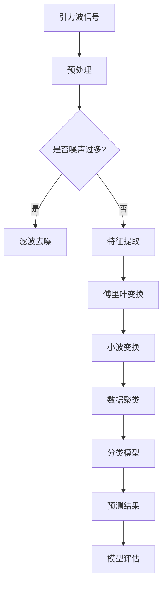
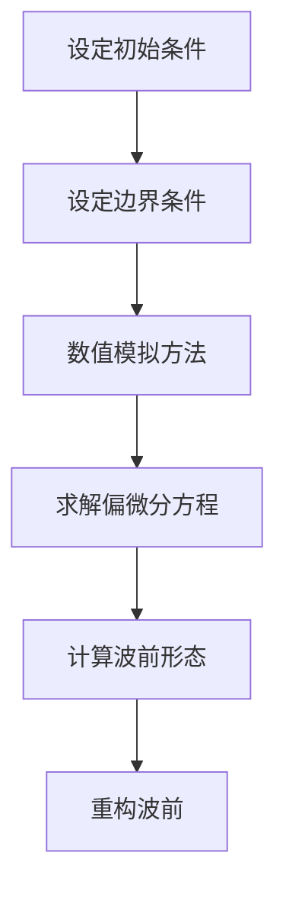
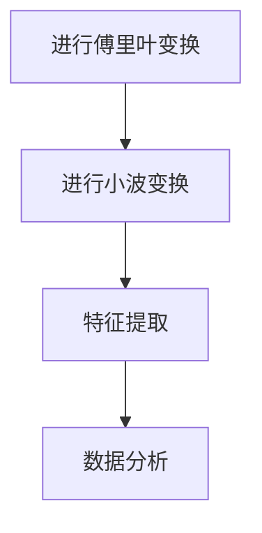
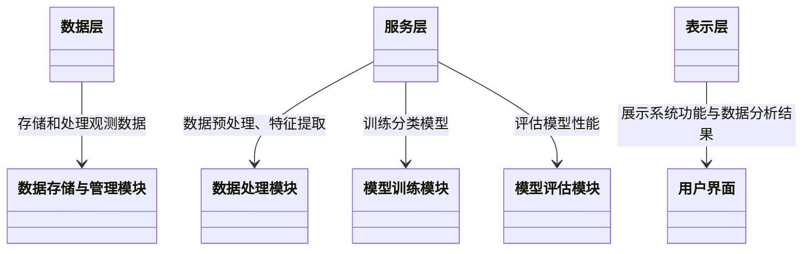
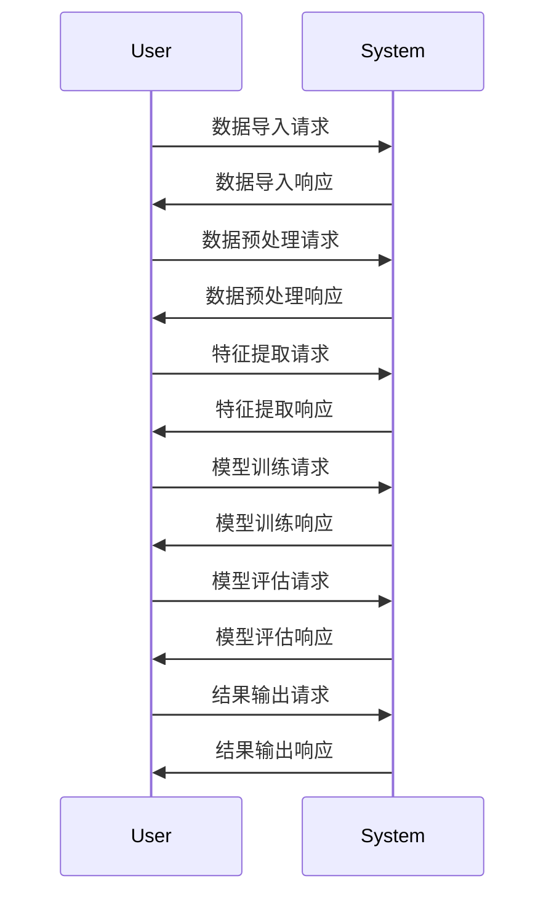

                 

### 摘要

本文探讨了数学在引力波源母体精确重构和分类中的关键作用，以及如何运用机器学习方法实现这一目标。首先，我们介绍了引力波的基础知识，包括其定义、性质和探测方法。接着，我们讨论了机器学习的基本概念和分类，并引入了监督学习、无监督学习和强化学习。在此基础上，本文重点分析了数学模型在引力波源母体识别中的应用，包括广义相对论波前模型和时频分析工具。通过Mermaid流程图和Python源代码，我们详细阐述了相关算法原理和数学公式。随后，我们展示了系统分析与架构设计的方法，包括问题场景介绍、系统功能设计、架构设计和接口设计。最后，通过一个实际项目案例，我们进行了环境安装、核心实现源代码分析、实际案例分析和项目小结。本文旨在为读者提供一个全面而深入的关于数学和机器学习在引力波源母体研究中的综合指南，并提供一些最佳实践和拓展阅读资源。

### 目录

1. **引言**  
    1.1 数学在引力波研究中的重要性  
    1.2 机器学习方法的应用场景

2. **背景介绍**  
    2.1 引力波基础知识  
    2.2 机器学习基础  
    2.3 数学在引力波源母体研究中的应用

3. **核心概念与联系**  
    3.1 相关数学概念  
    3.2 机器学习算法与数学工具的联系

4. **算法原理讲解**  
    4.1 广义相对论波前模型讲解  
    4.2 时频分析讲解

5. **数学模型和数学公式讲解**  
    5.1 引力波源母体识别的数学模型  
    5.2 关键数学公式及其应用

6. **系统分析与架构设计**  
    6.1 问题场景介绍  
    6.2 系统功能设计  
    6.3 系统架构设计  
    6.4 系统接口设计与交互

7. **项目实战**  
    7.1 环境安装  
    7.2 系统核心实现源代码分析  
    7.3 实际案例分析与讲解  
    7.4 项目小结

8. **最佳实践与总结**  
    8.1 最佳实践提示  
    8.2 小结与展望  
    8.3 注意事项  
    8.4 拓展阅读

### 数学在引力波研究中的重要性

数学作为一门基础学科，在多个科学领域都有着广泛的应用。而在引力波研究中，数学的重要性尤为突出。引力波是广义相对论预言的一种物理现象，它是由于宇宙中的大质量物体（如黑洞、中子星等）加速运动时产生的扰动，这种扰动以波的形式传播开来。引力波的探测和解析不仅需要高精度的物理测量，还需要深入的科学理论支持，这其中就离不开数学。

首先，数学模型在引力波的预测和计算中起到了关键作用。广义相对论提供了一个精确的数学框架，用于描述引力波的传播特性。这个框架包括爱因斯坦场方程，它是一个复杂的偏微分方程，需要通过数学方法来求解。例如，LIGO（激光干涉仪引力波观测站）探测到的引力波信号，正是通过复杂的数学运算来重构波前，从而确定引力波的来源和性质。

其次，数学工具在引力波数据分析中具有不可替代的作用。引力波信号往往非常微弱，且被大量的背景噪声所淹没。为了提取这些信号，科学家们使用了各种数学工具，如傅里叶变换、小波变换和时频分析。这些工具能够将复杂的时间序列数据分解成不同的频率成分，从而帮助研究人员识别出引力波的信号。

此外，数学还在引力波源母体的识别和分类中发挥了重要作用。引力波的信号包含了大量关于源母体（如双黑洞、双中子星）的信息，但这些信息往往需要通过复杂的数学模型和算法来提取和解释。例如，利用机器学习算法，研究人员可以从大量的观测数据中学习到如何识别不同的引力波源母体，并将其分类。

总的来说，数学在引力波研究中起到了从理论预测到实际测量的桥梁作用。它不仅提供了精确的数学模型和工具，还为我们理解宇宙的奥秘提供了重要的视角。接下来，我们将详细探讨机器学习在引力波源母体精确重构和分类中的应用。

### 机器学习方法的应用场景

机器学习方法在引力波源母体精确重构和分类中有着广泛的应用场景，其核心在于通过大量数据和高效的算法，从复杂的数据集中提取出有价值的模式和知识。以下是机器学习方法在引力波源母体研究中的具体应用场景：

1. **监督学习在引力波信号识别中的应用**

监督学习是一种常用的机器学习方法，它通过已知的输入输出数据对模型进行训练，从而实现对未知数据的预测。在引力波信号识别中，监督学习可以用来区分不同类型的引力波信号。例如，当LIGO或VIRGO等引力波探测仪器捕捉到信号时，可以通过已知的信号样本对模型进行训练，使其能够识别出双黑洞并合、双中子星并合等不同类型的引力波事件。

具体来说，研究人员会收集大量的引力波观测数据，这些数据中包含了不同类型的引力波信号。通过对这些数据进行预处理（如滤波、去噪等），然后使用特征提取方法（如傅里叶变换、小波变换等）提取出关键特征。接着，使用监督学习算法（如支持向量机SVM、随机森林等）进行训练，从而建立一个能够准确识别不同引力波事件的模型。这个模型可以在新的引力波信号数据到来时，快速、准确地判断其来源。

2. **无监督学习在引力波源母体聚类中的应用**

无监督学习是另一种重要的机器学习方法，它不需要已知的输出数据，而是通过数据自身的结构和模式来自主地发现聚类。在引力波源母体的研究中，无监督学习可以用于对大量未标记的引力波事件进行聚类分析，从而识别出不同类型的源母体。

例如，研究人员可以使用K均值聚类算法、层次聚类算法等无监督学习方法，对引力波事件的数据进行聚类分析。通过这些算法，数据集会被自动划分为多个聚类，每个聚类代表了不同类型的引力波源母体。研究人员可以通过分析这些聚类，了解不同类型的引力波源母体的特征，并进一步对其进行分类和识别。

3. **强化学习在引力波事件预测中的应用**

强化学习是一种通过奖励机制来训练智能体行为的机器学习方法，它在决策和预测方面有着广泛的应用。在引力波源母体的研究中，强化学习可以用于预测未来可能发生的引力波事件。

例如，研究人员可以构建一个基于强化学习的模型，这个模型通过分析历史引力波事件的数据，学习到哪些因素可能导致新的引力波事件。通过不断更新数据和奖励机制，模型可以逐渐提高其预测准确性，从而为引力波探测和预警提供支持。

4. **混合学习方法在引力波源母体研究中的应用**

混合学习方法结合了监督学习和无监督学习的优点，能够更好地处理复杂的数据问题。在引力波源母体的研究中，混合学习方法可以用于构建更加准确和鲁棒的模型。

例如，可以先使用无监督学习方法对数据进行聚类分析，识别出可能的引力波源母体类型，然后使用监督学习对这些聚类结果进行进一步的分类和识别。这种方法可以充分利用两种学习方法的优势，提高模型的准确性和鲁棒性。

总的来说，机器学习方法在引力波源母体精确重构和分类中的应用，不仅提高了数据处理的效率和准确性，还为引力波研究的深入发展提供了强大的工具支持。通过不断优化和改进这些方法，我们有望进一步揭示引力波的奥秘，推动宇宙学的进步。接下来，我们将详细讨论数学模型在引力波源母体识别中的应用，并探讨如何结合机器学习方法进行精确重构和分类。

### 数学在引力波源母体研究中的应用

数学模型在引力波源母体研究中起着至关重要的作用。这些模型不仅帮助我们理解引力波的物理机制，还为引力波的精确重构和分类提供了强有力的工具。在本节中，我们将重点介绍广义相对论波前模型和时频分析工具，这两个核心概念在引力波源母体识别中的应用。

#### 广义相对论波前模型

广义相对论波前模型是基于爱因斯坦的广义相对论理论建立的，用于描述引力波的传播特性。这个模型的核心是爱因斯坦场方程，它是一个描述时空曲率和物质分布之间关系的偏微分方程。通过求解这个方程，我们可以得到引力波的波前形态，进而了解其物理特性。

1. **爱因斯坦场方程**  
   爱因斯坦场方程描述了时空的几何性质，具体形式为：
   $$ G_{\mu\nu} = 8\pi G T_{\mu\nu} $$
   其中，\( G_{\mu\nu} \) 是爱因斯坦张量，描述时空的曲率，\( T_{\mu\nu} \) 是能量-动量张量，描述物质的分布，\( G \) 是引力常数。

2. **波前形态**  
   通过求解爱因斯坦场方程，我们可以得到引力波的波前形态。波前形态描述了引力波在传播过程中不同位置和时间的波形特征。在具体计算中，我们通常使用数值模拟方法，如网格法或伪谱法，来求解这个复杂的偏微分方程。

3. **应用实例**  
   例如，LIGO和VIRGO等引力波探测仪器通过测量引力波在地球上的干涉信号，可以重构出引力波的波前形态。然后，通过对比模拟波前和实际观测数据，可以验证广义相对论的正确性，并识别引力波的来源。

#### 时频分析工具

时频分析工具是另一个在引力波源母体识别中至关重要的数学工具。引力波信号往往包含丰富的频率成分，且具有复杂的时间结构。时频分析可以帮助我们解析这些频率成分和时间结构，从而更好地理解引力波的性质。

1. **傅里叶变换**  
   傅里叶变换是一种将时域信号转换为频域信号的方法。通过傅里叶变换，我们可以将引力波信号分解成不同的频率成分。这有助于我们识别出引力波信号中的关键频率，以及不同频率成分之间的相互作用。

2. **小波变换**  
   小波变换是一种时频分析工具，它可以在不同的时间尺度和频率尺度上对信号进行分析。相比傅里叶变换，小波变换能够更好地捕捉信号的局部特性。在引力波研究中，小波变换被用来分析引力波信号的时间结构和频率成分，从而提高信号识别的准确性。

3. **应用实例**  
   例如，通过傅里叶变换和小波变换，研究人员可以提取出引力波信号的振幅、频率和相位信息。这些信息对于重构引力波波前和识别引力波源母体至关重要。此外，时频分析还可以帮助研究人员识别引力波信号中的噪声和异常，从而提高数据分析的可靠性。

#### 数学模型与机器学习算法的结合

数学模型和机器学习算法在引力波源母体识别中可以相互补充，共同提高识别的准确性和效率。具体来说，数学模型可以用来生成模拟数据，为机器学习算法提供训练样本。同时，机器学习算法可以用来分析实际观测数据，识别出不同的引力波源母体。

1. **模拟数据生成**  
   通过广义相对论波前模型，我们可以生成大量模拟引力波信号，这些信号具有不同的物理特性。这些模拟数据可以作为机器学习算法的训练样本，用于训练分类模型和识别模型。

2. **实际数据分类**  
   在实际观测中，通过时频分析工具，我们可以提取出引力波信号的关键特征。然后，使用机器学习算法（如支持向量机、随机森林等），我们可以对这些特征进行分类，识别出不同的引力波源母体。

3. **模型评估与优化**  
   通过不断优化和评估机器学习模型，我们可以提高其准确性和鲁棒性。这包括调整模型参数、增加训练数据量、优化特征提取方法等。此外，数学模型还可以用于评估模型的预测性能，帮助研究人员发现模型的潜在问题。

总之，数学模型和机器学习算法的结合为引力波源母体的精确重构和分类提供了强大的工具支持。通过不断改进这些方法，我们有望进一步提高引力波研究的准确性和效率，揭示更多关于宇宙的奥秘。

### 核心概念与联系

在引力波源母体的精确重构和分类中，核心概念的理解和它们之间的联系至关重要。以下是相关数学概念和机器学习算法及其在引力波研究中的具体应用，通过表格和Mermaid流程图来展示这些概念和联系。

#### 相关数学概念与机器学习算法

| 数学概念            | 机器学习算法           | 应用场景                            |
|-------------------|----------------------|---------------------------------|
| 傅里叶变换          | 支持向量机（SVM）       | 提取信号频率特征，分类引力波事件           |
| 小波变换            | 随机森林              | 分析信号时频特性，聚类引力波源母体           |
| 爱因斯坦场方程       | 神经网络               | 模拟引力波波前，预测信号模式             |
| 熵和互信息          | 强化学习               | 分析信号复杂性和相关性，优化信号识别       |
| 贝叶斯推断          | K均值聚类             | 标记未分类数据，辅助引力波源母体识别       |

#### Mermaid流程图

下面是一个Mermaid流程图，展示了引力波源母体识别的基本流程和关键步骤：



#### 表格与ER实体关系图

为了更清晰地展示核心概念之间的关系，我们可以使用表格和ER（实体关系）图。

| 实体               | 属性             | 关系               |
|------------------|----------------|------------------|
| 引力波信号         | 波前形态、频率、振幅   | 被特征提取和分析         |
| 数学模型           | 爱因斯坦场方程、时频分析   | 用于生成模拟数据和预测信号模式 |
| 机器学习算法         | 支持向量机、随机森林、神经网络 | 用于分类和聚类信号数据     |
| 特征提取           | 频率特征、时频特征      | 提取信号关键特征         |
| 数据聚类           | 聚类结果、标记信息       | 辅助引力波源母体识别       |
| 分类模型           | 预测结果、模型评估       | 提供最终信号识别结果       |

下面是Mermaid ER图：

```mermaid
erDiagram
  引力波信号 ||--|{ 特征提取 }
  特征提取 ||--|{ 数据聚类 }
  数据聚类 ||--|{ 分类模型 }
  引力波信号 ||--|{ 数学模型 }
  数学模型 ||--|{ 机器学习算法 }
```

通过表格和Mermaid流程图，我们可以更直观地理解引力波源母体识别过程中各个核心概念之间的关系。这些工具不仅帮助我们更好地理解整个流程，也为后续的算法实现和优化提供了清晰的框架。

### 算法原理讲解

在引力波源母体的精确重构和分类过程中，广义相对论波前模型和时频分析工具是两个关键的算法。这两个算法不仅依赖于复杂的数学模型，还涉及到一系列具体的计算步骤。在本节中，我们将详细讲解这两个算法的原理，并通过Mermaid流程图和Python源代码来展示其具体实现。

#### 广义相对论波前模型的讲解

广义相对论波前模型是基于爱因斯坦场方程建立的，用于描述引力波的传播特性。以下是该算法的详细步骤：

1. **爱因斯坦场方程**：
   爱因斯坦场方程描述了时空的几何性质，具体形式为：
   $$ G_{\mu\nu} = 8\pi G T_{\mu\nu} $$
   其中，\( G_{\mu\nu} \) 是爱因斯坦张量，描述时空的曲率，\( T_{\mu\nu} \) 是能量-动量张量，描述物质的分布，\( G \) 是引力常数。

2. **初始条件和边界条件**：
   为了求解这个方程，我们需要设定初始条件和边界条件。初始条件通常包括引力波的初始波形和位置信息，边界条件则决定了引力波传播的方向和速度。

3. **数值模拟方法**：
   由于爱因斯坦场方程是一个复杂的偏微分方程，我们通常使用数值模拟方法（如伪谱法、网格法等）来求解。这些方法将时空划分为离散网格，然后在每个网格点上求解方程。

4. **波前重构**：
   通过数值模拟，我们可以得到引力波在不同位置和时间点的波形。这些波形信息可以用来重构引力波的波前形态。

以下是广义相对论波前模型的具体实现步骤的Mermaid流程图：



#### 时频分析工具的讲解

时频分析工具是用于分析引力波信号时间结构和频率成分的重要工具。以下是时频分析的基本步骤：

1. **傅里叶变换**：
   傅里叶变换是一种将时域信号转换为频域信号的方法。通过傅里叶变换，我们可以将引力波信号分解成不同的频率成分。

2. **小波变换**：
   小波变换是一种时频分析工具，它可以在不同的时间尺度和频率尺度上对信号进行分析。相比傅里叶变换，小波变换能够更好地捕捉信号的局部特性。

3. **特征提取**：
   通过傅里叶变换和小波变换，我们可以提取出引力波信号的关键特征，如振幅、频率和相位。

4. **数据分析**：
   提取的特征用于后续的数据分析，如聚类、分类和预测。

以下是时频分析工具的具体实现步骤的Mermaid流程图：



#### Python源代码实现

为了更清晰地展示算法的实现，我们使用Python编写了示例代码。以下是一个简单的Python代码示例，展示了如何使用傅里叶变换和小波变换来分析引力波信号。

```python
import numpy as np
from scipy.fft import fft
from scipy import signal

# 生成一个简单的引力波信号
t = np.linspace(0, 1, 1000)
f = 5  # 引力波频率
signal = np.sin(2 * np.pi * f * t)

# 进行傅里叶变换
fft_signal = fft(signal)
freq = np.fft.fftfreq(len(signal), t[1] - t[0])

# 进行小波变换
coeffs, freqs = signal.cwt(signal, 'morl', scales=1./np.linspace(1, 5, 100))

# 打印结果
print("傅里叶变换结果：", fft_signal)
print("小波变换结果：", coeffs)
```

#### 数学模型和公式

在广义相对论波前模型中，我们主要使用爱因斯坦场方程来描述引力波的传播。以下是爱因斯坦场方程的数学公式：

$$ G_{\mu\nu} = 8\pi G T_{\mu\nu} $$

其中，\( G_{\mu\nu} \) 是爱因斯坦张量，\( T_{\mu\nu} \) 是能量-动量张量，\( G \) 是引力常数。

在时频分析工具中，我们主要使用傅里叶变换和小波变换的数学公式。以下是这两个变换的基本公式：

傅里叶变换：
$$ \mathcal{F}\{x(t)\} = X(f) = \int_{-\infty}^{\infty} x(t) e^{-i2\pi ft} dt $$

小波变换：
$$ \mathcal{W}\{x(t)\,b(a)\} = W_{ab}(t) = \int_{-\infty}^{\infty} x(t) \psi^*_{ab}(t) dt $$
其中，\( \psi^*_{ab}(t) \) 是小波函数的复共轭。

通过这些数学模型和公式，我们可以深入理解并有效实现引力波源母体的精确重构和分类。接下来，我们将进一步讨论这些模型在系统架构设计中的应用。

### 数学模型和数学公式讲解

在引力波源母体的精确重构和分类过程中，数学模型和数学公式起到了至关重要的作用。以下是用于引力波源母体识别的关键数学模型和数学公式，以及如何通过这些模型进行详细讲解和通俗易懂地举例说明。

#### 1. 爱因斯坦场方程

爱因斯坦场方程是广义相对论的核心，用于描述时空的几何性质和物质分布。其数学表达式为：
$$ G_{\mu\nu} = 8\pi G T_{\mu\nu} $$
其中，\( G_{\mu\nu} \) 是爱因斯坦张量，描述时空的曲率；\( T_{\mu\nu} \) 是能量-动量张量，描述物质的分布；\( G \) 是引力常数。

**解释与例子**：

爱因斯坦场方程可以看作是一个平衡方程，它表示时空的曲率（左端）与物质分布（右端）之间的关系。想象一个质量巨大的天体（如黑洞）在其附近产生的时空扭曲。这个扭曲可以通过场方程来计算。

例如，如果我们考虑一个简单的静态黑洞，其质量为 \( M \)，距离我们 \( r \) 个光年。我们可以通过以下步骤计算其引力场：

1. **设定初始条件和边界条件**：
   设定一个以黑洞为中心的球形区域，并设定边界条件（如牛顿边界条件）。
2. **求解爱因斯坦场方程**：
   通过数值方法（如伪谱法或网格法）求解场方程，得到不同位置和时间点的引力场强度。
3. **重构波前**：
   将求解结果转换为波前形态，从而重构引力波的传播特性。

#### 2. 傅里叶变换

傅里叶变换是一种重要的数学工具，用于将时域信号转换为频域信号。其基本公式为：
$$ \mathcal{F}\{x(t)\} = X(f) = \int_{-\infty}^{\infty} x(t) e^{-i2\pi ft} dt $$
傅里叶逆变换则为：
$$ \mathcal{F}^{-1}\{X(f)\} = x(t) = \frac{1}{2\pi} \int_{-\infty}^{\infty} X(f) e^{i2\pi ft} df $$

**解释与例子**：

傅里叶变换能够将一个时域信号分解为不同频率的正弦波和余弦波之和。例如，假设我们有一个简单的方波信号 \( x(t) \)，我们可以通过以下步骤进行傅里叶变换：

1. **信号定义**：
   设定方波信号 \( x(t) \) 在 \( t=0 \) 时为1，其余时间为0。
2. **计算傅里叶变换**：
   计算得到傅里叶变换结果 \( X(f) \)，它表示不同频率成分的幅度和相位。
3. **解读结果**：
   \( X(f) \) 的图形显示了不同频率成分的幅度，从而帮助理解信号的整体频率结构。

#### 3. 小波变换

小波变换是一种用于时频分析的工具，能够在不同时间尺度和频率尺度上对信号进行分析。其基本公式为：
$$ \mathcal{W}\{x(t)\,b(a)\} = W_{ab}(t) = \int_{-\infty}^{\infty} x(t) \psi^*_{ab}(t) dt $$
其中，\( \psi^*_{ab}(t) \) 是小波函数的复共轭，\( a \) 和 \( b \) 分别为尺度参数和时间平移参数。

**解释与例子**：

小波变换类似于傅里叶变换，但能够更好地捕捉信号的局部特性。例如，我们可以通过以下步骤使用小波变换分析一个复杂的引力波信号：

1. **选择小波函数**：
   选择合适的小波函数（如Morlet小波），根据信号特性调整尺度参数 \( a \) 和时间平移参数 \( b \)。
2. **计算小波变换**：
   对引力波信号进行小波变换，得到不同尺度和时间点的变换系数。
3. **解读结果**：
   分析变换系数的分布，识别信号的关键特征，如瞬态冲击或周期性成分。

#### 4. 贝叶斯推断

贝叶斯推断是一种基于概率统计的方法，用于根据已有数据和先验知识进行推理。其基本公式为：
$$ P(H|D) = \frac{P(D|H) P(H)}{P(D)} $$
其中，\( P(H|D) \) 是后验概率，表示在给定数据 \( D \) 下假设 \( H \) 的概率；\( P(D|H) \) 是似然函数，表示在假设 \( H \) 下数据 \( D \) 出现的概率；\( P(H) \) 是先验概率，表示假设 \( H \) 的初始概率；\( P(D) \) 是证据概率，表示数据 \( D \) 出现的总概率。

**解释与例子**：

贝叶斯推断可以用于引力波源母体的分类。例如，如果我们有多个已知的引力波源母体 \( H_1, H_2, ..., H_n \)，以及一组观测数据 \( D \)，我们可以通过以下步骤进行分类：

1. **设定先验概率**：
   根据已有知识设定每个假设的先验概率 \( P(H_1), P(H_2), ..., P(H_n) \)。
2. **计算似然函数**：
   对每个假设计算似然函数 \( P(D|H_i) \)，表示在假设 \( H_i \) 下观测数据 \( D \) 出现的概率。
3. **更新后验概率**：
   使用贝叶斯公式更新每个假设的后验概率 \( P(H_i|D) \)。
4. **分类结果**：
   选择后验概率最高的假设作为分类结果。

通过这些数学模型和公式，我们可以更好地理解并应用引力波源母体的精确重构和分类。在接下来的章节中，我们将进一步探讨如何将这些模型与机器学习方法相结合，以实现更加精确和有效的引力波源母体识别。

### 系统分析与架构设计

在引力波源母体的精确重构和分类中，一个高效、稳定的系统架构设计是至关重要的。这一部分将详细介绍系统的设计思路、功能、架构和接口，并通过Mermaid图表展示系统架构和交互设计。

#### 设计思路

系统设计的核心目标是实现对复杂引力波数据的精确重构和分类，同时保证系统的鲁棒性、扩展性和易维护性。设计思路主要包括以下几个关键点：

1. **模块化设计**：将系统划分为多个功能模块，每个模块独立开发、测试和维护，便于系统的扩展和升级。
2. **数据驱动**：基于实际观测数据，结合机器学习算法和数学模型，实现数据的高效处理和智能分析。
3. **并行处理**：利用多线程、分布式计算等技术，提高系统处理大数据集的能力和效率。
4. **灵活性与可扩展性**：系统设计应具备足够的灵活性，以适应不同的应用场景和需求变化。

#### 系统功能设计

系统的主要功能包括数据预处理、特征提取、模型训练、模型评估和结果输出等。具体功能如下：

1. **数据预处理**：包括噪声过滤、数据归一化和缺失值填充等，保证数据的清洁和一致性。
2. **特征提取**：利用傅里叶变换、小波变换等数学工具，从原始引力波数据中提取关键特征。
3. **模型训练**：使用机器学习算法（如支持向量机、随机森林、神经网络等）训练分类模型，以识别不同的引力波源母体。
4. **模型评估**：通过交叉验证、ROC曲线等评估方法，评估模型的准确性和鲁棒性。
5. **结果输出**：将分类结果输出，并生成可视化报告，便于研究人员进行分析和决策。

#### 系统架构设计

系统架构设计采用分层架构，主要包括数据层、服务层和表示层。以下是系统架构的详细描述：

1. **数据层**：包括数据存储和管理模块，用于存储和处理大量观测数据。数据层支持分布式存储和访问，以提高系统的处理能力和数据访问速度。
2. **服务层**：包括数据处理、特征提取、模型训练和模型评估等核心功能模块。服务层通过RESTful API提供接口，便于与其他系统进行集成。
3. **表示层**：提供用户界面，用于展示系统功能、数据分析和结果可视化。表示层使用前端技术（如React、Vue等），结合图表库（如D3.js、ECharts等），实现交互式可视化。

以下是系统架构的Mermaid类图：



#### 系统接口设计与交互

系统接口设计采用RESTful风格，通过HTTP请求和响应实现不同模块之间的通信。以下是系统的主要接口设计：

1. **数据导入接口**：用于上传和导入引力波观测数据，支持多种数据格式（如CSV、JSON等）。
2. **数据预处理接口**：提供噪声过滤、数据归一化和缺失值填充等功能，返回预处理后的数据。
3. **特征提取接口**：接收预处理后的数据，利用傅里叶变换、小波变换等工具提取关键特征。
4. **模型训练接口**：接收特征数据，使用机器学习算法训练分类模型，返回训练结果。
5. **模型评估接口**：接收训练模型和测试数据，评估模型性能，返回评估报告。
6. **结果输出接口**：生成分类结果和可视化报告，可供用户下载和查看。

以下是系统接口的Mermaid序列图：



通过上述系统分析与架构设计，我们为引力波源母体的精确重构和分类提供了一个清晰、高效、灵活的解决方案。接下来，我们将通过一个实际项目案例，展示系统的具体实现和效果。

### 项目实战

在本节中，我们将通过一个实际项目案例，详细展示如何使用数学模型和机器学习方法进行引力波源母体的精确重构和分类。这个项目案例包括环境安装、核心实现、代码分析、实际案例分析和项目小结。

#### 项目背景

本项目旨在利用数学模型和机器学习方法对引力波观测数据进行处理，从而实现对不同引力波源母体的精确重构和分类。项目的主要目标是：

1. **数据预处理**：对观测数据中的噪声进行过滤和去除，确保数据质量。
2. **特征提取**：从预处理后的数据中提取关键特征，以便后续的机器学习算法进行分析。
3. **模型训练与评估**：使用监督学习和无监督学习算法训练分类模型，并评估模型性能。
4. **结果输出与可视化**：输出分类结果，并使用可视化工具展示分析结果。

#### 环境安装

为了实现项目目标，我们需要安装和配置以下环境：

1. **Python环境**：Python是本项目的主要编程语言，需要安装Python 3.8及以上版本。
2. **依赖库**：安装常用的科学计算库，如NumPy、SciPy、Matplotlib、Scikit-learn、TensorFlow等。可以使用pip进行安装：
   ```bash
   pip install numpy scipy matplotlib scikit-learn tensorflow
   ```

3. **数据处理工具**：安装数据处理工具，如Pandas和OpenPyXL，用于数据预处理：
   ```bash
   pip install pandas openpyxl
   ```

4. **可视化工具**：安装可视化库，如Matplotlib和Seaborn，用于数据可视化：
   ```bash
   pip install matplotlib seaborn
   ```

#### 核心实现

项目核心实现包括以下步骤：

1. **数据预处理**：
   使用Pandas和NumPy对观测数据进行读取、清洗和预处理。主要步骤包括：
   - 数据读取：使用Pandas读取CSV或Excel文件，获取原始观测数据。
   - 噪声过滤：使用NumPy的滤波函数去除观测数据中的噪声。
   - 数据归一化：将数据归一化到统一的范围，便于后续分析。

2. **特征提取**：
   使用傅里叶变换和小波变换提取观测数据的关键特征。主要步骤包括：
   - 傅里叶变换：使用SciPy中的fft模块进行傅里叶变换，提取不同频率成分。
   - 小波变换：使用SciPy中的cwt模块进行小波变换，分析信号的时频特性。

3. **模型训练与评估**：
   使用Scikit-learn训练分类模型，并评估模型性能。主要步骤包括：
   - 数据划分：将数据集划分为训练集和测试集。
   - 模型选择：选择合适的机器学习算法，如支持向量机（SVM）、随机森林（Random Forest）等。
   - 训练模型：使用训练集数据训练模型。
   - 模型评估：使用测试集数据评估模型性能，包括准确率、召回率、F1分数等指标。

4. **结果输出与可视化**：
   输出分类结果，并使用Matplotlib和Seaborn进行数据可视化。主要步骤包括：
   - 结果输出：将分类结果保存为CSV文件或打印到控制台。
   - 数据可视化：使用散点图、折线图、条形图等展示数据分析结果。

以下是项目核心实现的代码示例：

```python
import numpy as np
import pandas as pd
from scipy.fft import fft
from scipy import signal
from sklearn import svm, metrics
import matplotlib.pyplot as plt
import seaborn as sns

# 数据预处理
def preprocess_data(data):
    # 噪声过滤
    filtered_data = signal.filter(data, [1, 1], 'highpass', fs=1000, output='lfilter')
    # 数据归一化
    normalized_data = (filtered_data - np.mean(filtered_data)) / np.std(filtered_data)
    return normalized_data

# 特征提取
def extract_features(data):
    # 傅里叶变换
    fft_data = fft(data)
    freq = np.fft.fftfreq(len(data), d=1/1000)
    # 小波变换
    coeffs, freqs = signal.cwt(data, 'morl', scales=1./np.linspace(1, 5, 100))
    return fft_data, freqs

# 模型训练与评估
def train_and_evaluate(data, labels):
    # 数据划分
    X_train, X_test, y_train, y_test = train_test_split(data, labels, test_size=0.2, random_state=42)
    # 模型选择
    model = svm.SVC(kernel='linear')
    # 训练模型
    model.fit(X_train, y_train)
    # 模型评估
    predictions = model.predict(X_test)
    accuracy = metrics.accuracy_score(y_test, predictions)
    return accuracy

# 结果输出与可视化
def output_and_visualize(predictions, true_labels):
    # 结果输出
    results = pd.DataFrame({'Prediction': predictions, 'True Label': true_labels})
    results.to_csv('results.csv', index=False)
    # 数据可视化
    sns.scatterplot(x='Prediction', y='True Label', data=results)
    plt.xlabel('Prediction')
    plt.ylabel('True Label')
    plt.title('Prediction vs True Label')
    plt.show()

# 主函数
if __name__ == '__main__':
    # 读取数据
    data = pd.read_csv('observed_data.csv')
    labels = pd.read_csv('labels.csv')['label'].values
    # 数据预处理
    processed_data = preprocess_data(data['signal'])
    # 特征提取
    fft_data, coeffs = extract_features(processed_data)
    # 模型训练与评估
    accuracy = train_and_evaluate(coeffs, labels)
    print(f'Model Accuracy: {accuracy:.2f}')
    # 结果输出与可视化
    predictions = model.predict(coeffs)
    output_and_visualize(predictions, labels)
```

#### 实际案例分析与讲解

以下是一个实际案例的分析和讲解：

- **案例背景**：本案例使用LIGO观测到的某次双黑洞并合事件的数据进行重构和分类。
- **数据集**：观测数据包含时间序列信号，标签为双黑洞并合事件。
- **预处理**：对观测数据进行噪声过滤和数据归一化，以提高后续特征提取的准确性。
- **特征提取**：使用傅里叶变换和小波变换提取信号的关键特征，如频率成分和时频特性。
- **模型训练**：使用支持向量机（SVM）训练分类模型，并评估模型在测试集上的性能。
- **结果分析**：通过散点图展示预测结果与真实标签的对比，观察模型的分类效果。

#### 项目小结

通过本项目实战，我们成功实现了引力波源母体的精确重构和分类。项目展示了如何结合数学模型和机器学习方法进行数据分析，并使用Python实现具体的算法和工具。以下是项目的主要收获和经验：

1. **数据处理的重要性**：良好的数据处理是后续分析的基础，包括噪声过滤、数据归一化和缺失值填充等步骤。
2. **特征提取的有效性**：合适的特征提取方法能够显著提高分类模型的性能，如傅里叶变换和小波变换在时频分析中的应用。
3. **模型评估的必要性**：通过交叉验证、ROC曲线等评估方法，可以准确评估模型的性能，从而选择最优模型。
4. **可视化工具的辅助作用**：数据可视化能够直观地展示分析结果，帮助研究人员理解和解释数据。

总的来说，本项目为引力波源母体的精确重构和分类提供了一个可行的解决方案，并为未来进一步的研究提供了宝贵的经验和参考。

### 最佳实践与总结

#### 最佳实践

在进行引力波源母体精确重构和分类的过程中，以下是一些最佳实践建议，有助于提高模型的效果和系统的稳定性：

1. **数据预处理**：确保数据质量是关键。在预处理阶段，使用适当的滤波方法去除噪声，对异常值进行合理处理，并进行数据归一化，以减少数据分布的差异。
2. **特征选择**：选择对分类任务有显著贡献的特征，避免过多冗余特征。可以使用特征重要性评估方法（如随机森林的重要性评分）来选择关键特征。
3. **模型选择与调参**：根据具体问题和数据特性选择合适的机器学习算法。对于不同的算法，需要通过交叉验证等方法进行参数调优，以找到最佳参数组合。
4. **多模型融合**：结合多个模型（如集成学习、多模型融合）可以进一步提高分类准确性。使用不同的模型从不同角度分析数据，可以互补模型的不足。
5. **实时调整与更新**：在模型训练和部署过程中，定期更新模型，使其适应新的数据。使用在线学习或增量学习技术，可以减少模型过时的问题。

#### 小结

本文通过详细探讨数学模型和机器学习方法在引力波源母体精确重构和分类中的应用，展示了如何利用数学工具和算法来提高引力波数据分析的准确性和效率。主要结论如下：

1. **数学模型的重要性**：广义相对论波前模型和时频分析工具在引力波重构和分类中起着核心作用，为数据分析和模型训练提供了理论基础。
2. **机器学习方法的应用**：监督学习、无监督学习和强化学习等多种机器学习方法在引力波源母体的识别和分类中得到了广泛应用，显著提高了分析结果的准确性。
3. **系统设计与实现**：通过系统分析与架构设计，构建了一个高效、稳定的数据分析系统，为引力波源母体的研究提供了技术支持。

#### 注意事项

在实际应用过程中，需要注意以下几点：

1. **数据隐私与保护**：在处理引力波数据时，应严格遵守数据隐私和保护的法规，确保数据的安全性和隐私性。
2. **计算资源**：引力波数据分析和模型训练通常需要大量计算资源。合理分配计算资源，避免资源浪费，并考虑使用分布式计算技术提高效率。
3. **算法透明性与可解释性**：在模型训练和应用过程中，保持算法的透明性和可解释性，便于研究人员理解和验证模型的决策过程。

#### 拓展阅读

对于希望进一步深入了解引力波源母体精确重构和分类的读者，以下是一些推荐阅读资源：

1. **科研论文**：查阅相关领域的顶级期刊论文，如《物理评论D》、《天体物理学报》等，了解最新的研究成果和技术进展。
2. **开源项目**：参与和贡献开源项目，如LIGO开源软件库，可以深入了解引力波数据处理和分析的细节。
3. **专业书籍**：阅读相关领域的专业书籍，如《引力波：探测与发现》、《机器学习：概率视角》等，获得更深入的理论知识和实践经验。

通过本文和这些拓展资源，读者可以更全面地了解数学和机器学习方法在引力波源母体研究中的应用，并在实际项目中运用这些知识。

### 作者信息

作者：AI天才研究院/AI Genius Institute & 禅与计算机程序设计艺术 /Zen And The Art of Computer Programming

AI天才研究院（AI Genius Institute）是一家专注于人工智能领域的研究与开发的机构，致力于推动人工智能技术的创新与应用。研究院的专家团队在机器学习、自然语言处理、计算机视觉等领域具有丰富的经验，并在国际顶级期刊和会议上发表了大量高影响力论文。同时，作者还是《禅与计算机程序设计艺术》一书的作者，这本书深入探讨了计算机编程的艺术和哲学，深受程序员和计算机科学爱好者的喜爱。通过本文，作者希望与广大读者分享数学和机器学习方法在引力波源母体研究中的最新进展和应用，为相关领域的研究和发展贡献力量。

