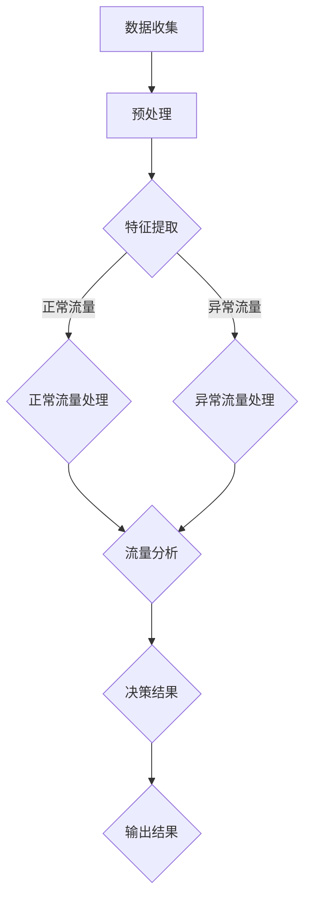
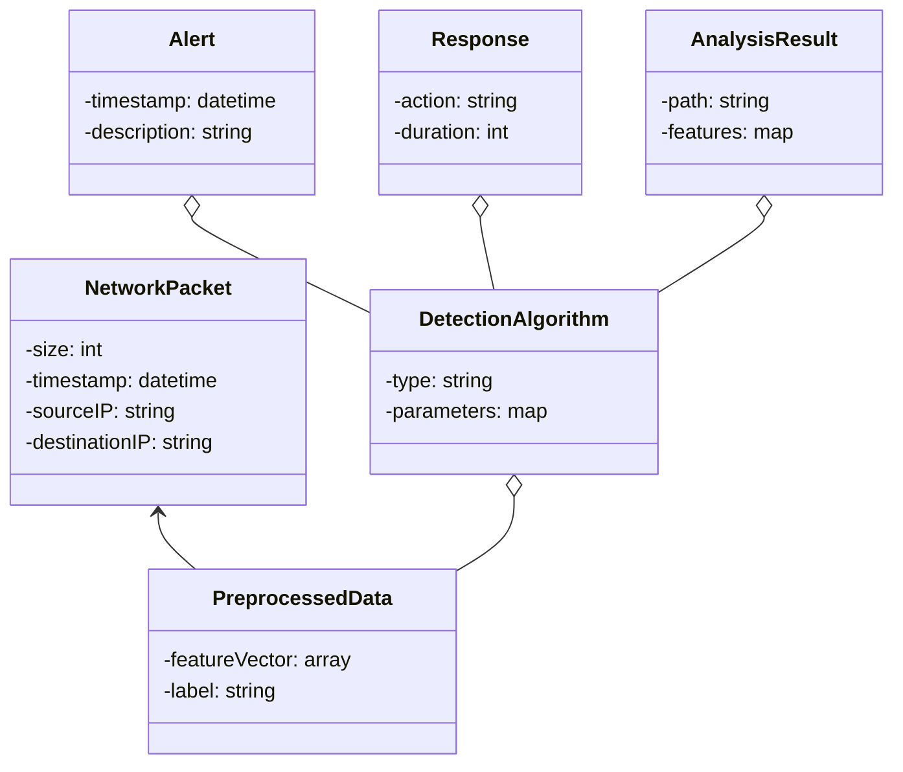
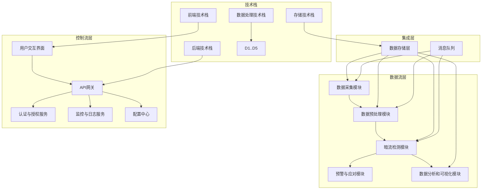
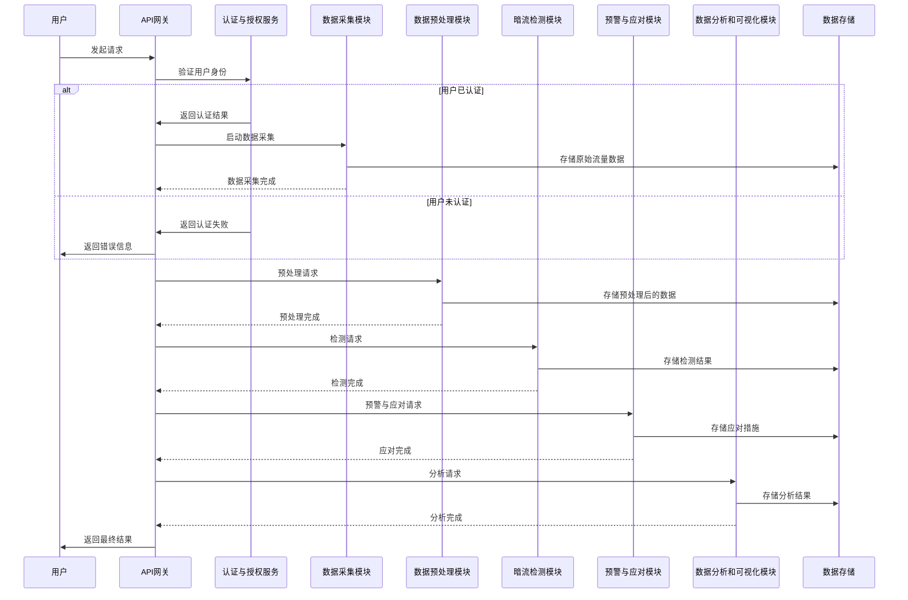

                 

### 暗流的定义

暗流，这一术语在网络和信息科学领域有着独特的内涵。暗流通常指的是在网络中发生的信息流动，这种流动在表面上看似正常，但实际上隐藏了更深层次的信息传递。它具有隐秘、非结构化和动态性等特点。与明流不同，明流是指那些显而易见、容易追踪的网络活动，如电子邮件传输、网页浏览和社交媒体互动等。

暗流的存在形式多种多样，它可以表现为加密通信、隐蔽通道、异常流量等。例如，在网络安全领域，暗流可能是一种恶意软件与指挥和控制服务器之间的通信；在社会舆论监控领域，暗流可能是指一些隐蔽的信息传播路径，如通过社交媒体群组或私下交流平台进行的敏感信息传播。

暗流的隐蔽性是其最显著的特征之一。由于其隐秘性，暗流往往难以被传统的网络安全工具检测到。这使得暗流成为网络安全的一大威胁，同时也是研究热点。在商业情报分析领域，企业可能会利用暗流来获取竞争对手的信息，这种信息获取方式相较于公开渠道更加隐蔽和安全。

此外，暗流的非结构化特点也使其复杂化。暗流的信息传输通常不遵循固定的结构或模式，这使得检测和追踪工作变得更加困难。而动态性则意味着暗流的传播路径和方式会随着时间和环境的变化而变化，这使得研究暗流的任务具有动态性和挑战性。

总的来说，暗流的定义和特征决定了其在不同领域中的独特地位和重要性。理解暗流的定义和特征，是深入研究其检测、追踪和管理方法的基础。

#### 暗流研究的现状与重要性

当前，暗流研究在网络安全、社会舆论监控、商业情报分析等领域已经取得了显著进展，但整体上仍处于初步探索阶段。随着网络技术的迅猛发展，暗流现象日益复杂，研究的重要性也逐渐凸显。

在网络安全领域，暗流作为一种隐蔽的信息传递方式，已经成为恶意攻击的重要手段之一。例如，黑客通过暗流传输恶意软件、窃取敏感数据或控制受感染的设备。因此，研究如何检测和防止暗流传播，对于提升网络防护能力具有重要意义。近年来，研究人员已经开发出一些基于统计学和机器学习的暗流检测算法，通过分析网络流量和用户行为特征，来识别潜在的暗流。然而，这些算法在应对动态性和非结构化特征的暗流时，仍存在一定的局限性。

在社会舆论监控领域，暗流研究同样具有重要作用。社会舆论的动态变化往往通过暗流形式传播，例如，一些敏感话题或事件可能通过暗流在社交媒体上迅速传播，引发舆论波动。通过对暗流的研究，可以更早地识别和应对潜在的舆论风险，保障社会稳定。然而，目前在这一领域的研究主要集中在对公开信息的分析上，对于暗流的追踪和识别仍不够深入。

商业情报分析方面，企业利用暗流获取竞争对手的商业机密和市场动态，是一种隐蔽且高效的竞争手段。然而，暗流的隐蔽性和非结构化特征，使得企业难以通过传统方法获取这些信息。因此，研究如何有效利用数学模型和算法来挖掘暗流信息，成为商业情报分析领域的一个挑战和机遇。

尽管暗流研究已经取得了一些成果，但总体上仍面临诸多挑战。首先，暗流的复杂性和动态性使得现有算法难以全面覆盖所有可能的暗流形式。其次，数据隐私和伦理问题也成为暗流研究的瓶颈。在利用暗流信息时，如何保护用户隐私，遵守相关法律法规，是研究人员需要重点考虑的问题。

总之，暗流研究在网络安全、社会舆论监控、商业情报分析等领域具有广泛的应用前景。随着技术的不断进步，未来暗流研究将会有更多的突破，为各个领域的发展提供强有力的支持。

### 暗流的特征

暗流具有多种特征，这些特征不仅使其在网络中的传播变得更加复杂，也增加了对其进行检测和追踪的难度。首先，隐蔽性是暗流最显著的特征之一。暗流通常采用加密通信、隐蔽通道或异常流量等手段，隐藏在正常的网络流量之中。这种隐蔽性使得传统的检测工具难以直接识别和阻止暗流的传播。

其次，暗流的非结构化特征也是其复杂性的重要来源。与明流不同，暗流的信息传输不遵循固定的模式或结构，数据包的发送和接收可能是随机且无规律的。这使得通过模式匹配或固定规则来检测暗流变得异常困难，需要更高级的分析方法来识别这些复杂的行为模式。

动态性是暗流的另一个重要特征。暗流的传播路径和方式会随着时间和环境的变化而不断调整。例如，在对抗网络安全防御机制时，暗流可能会通过多次跳跃、伪装成正常流量等方式来规避检测。这种动态性增加了暗流的隐蔽性和适应性，使得传统的静态检测方法难以奏效。

此外，暗流还具有高度的非标准化特征。不同的暗流可能会采用不同的传输协议、加密算法或通信模式，这使得统一的标准检测和防护方案难以实施。同时，暗流的使用者可能会利用多种技术手段来掩盖其真实目的，从而进一步增加了检测的难度。

总之，暗流的隐蔽性、非结构化和动态性等特征，决定了其在网络中传播的复杂性。为了有效应对暗流，研究人员需要开发出更先进的技术和方法，结合多种分析手段来识别和阻止暗流的传播。这不仅需要深入理解暗流的特征，还需要持续探索新的技术路径，以提升网络的安全防护能力。

### 暗流的分类

暗流可以按照不同的标准进行分类，主要包括基于内容和基于行为两种类型。

**基于内容的暗流** 是指暗流传输的信息内容具有某种特定的特征，这种特征使其在传递过程中难以被检测。这类暗流通常采用加密技术、隐写术等手段，将敏感信息嵌入到正常的网络流量中。例如，通过加密通信传递商业机密或敏感数据，或者利用图像、音频等载体进行隐写，使得信息传递过程更加隐蔽。

**基于行为的暗流** 则是通过分析用户行为模式，识别出隐藏在网络中的异常行为。这类暗流不依赖于特定的信息内容，而是通过监测和分析用户的网络行为，来识别潜在的异常活动。例如，通过对大量网络流量的分析，发现用户之间的异常通信模式，从而识别出潜在的恶意行为或隐私泄露。

**其他分类方式** 除了基于内容和基于行为的暗流之外，还可以根据暗流的目的和特征进行分类。例如，可以将暗流分为攻击型暗流和情报型暗流。攻击型暗流主要用于执行网络攻击，如通过暗流传输恶意软件、控制僵尸网络等；而情报型暗流则主要用于获取商业情报或社会舆情信息，其隐蔽性和非结构化特征更加显著。

总的来说，暗流的分类有助于我们更深入地理解其传播方式和检测方法。不同的分类方式为我们提供了多角度的分析视角，有助于开发更有效的检测和防护策略。同时，理解各类暗流的特征，也有助于我们制定更全面的网络安全策略，以应对不断变化的网络威胁。

### 暗流与明流的区别

暗流与明流在定义和特征上有着显著的区别。明流是指网络中显而易见、容易被识别的信息流动，如电子邮件传输、网页浏览和社交媒体互动等。这些活动在传输过程中通常不涉及复杂的加密或隐蔽技术，其目的是实现信息的直接和透明交流。相比之下，暗流则是一种隐蔽的信息流动方式，通常采用加密通信、隐蔽通道或异常流量等手段，以掩盖其真实意图。

首先，从定义上看，明流是一种开放、透明的信息传输方式，其传输路径和内容容易被网络监控工具检测到。而暗流则是一种隐蔽的传输方式，其目的是规避传统的监控手段，以达到信息传输的目的。暗流的存在形式多种多样，包括加密通信、隐蔽通道和异常流量等，这使得它在表面上看与正常网络流量无异，从而增加了检测难度。

其次，在特征上，明流具有以下特点：1）传输路径明确，通常遵循标准通信协议；2）传输内容透明，容易理解和分析；3）传输速率和模式相对稳定。相比之下，暗流则表现出以下特征：1）传输路径隐蔽，可能涉及多次跳跃和伪装；2）传输内容复杂，可能涉及加密和隐写术；3）传输速率和模式动态变化，具有非结构化和动态性的特点。

在网络安全领域，暗流与明流的关系尤为复杂。明流通常是正常业务活动的基础，而暗流则可能隐藏在明流之下，进行恶意活动，如数据窃取、网络攻击等。这种隐蔽性使得暗流成为网络攻击的新手段。例如，黑客可能会通过暗流将恶意软件悄无声息地传输到目标系统，而用户和传统的安全工具可能难以察觉。

总之，暗流与明流在定义和特征上存在明显差异，暗流的隐蔽性和复杂性使其成为网络安全的新挑战。为了有效应对这种挑战，需要开发出更先进的技术和策略，以检测和防御暗流的传播。

### 暗流研究的应用领域

暗流研究在多个领域展现出了广泛的应用前景，特别是在网络安全、社会舆论监控和商业情报分析等领域。

在**网络安全**领域，暗流研究有助于识别和防止恶意攻击。由于暗流具有隐蔽性和动态性，传统的安全工具难以有效检测到这种隐藏在网络流量中的恶意活动。通过研究暗流的特征和行为模式，可以开发出更加精准的检测算法，从而提升网络防护能力。例如，通过分析网络流量中的异常通信模式，可以及时发现并阻止恶意软件的传播。

**社会舆论监控** 是另一个重要的应用领域。暗流研究有助于追踪和识别网络上的敏感信息传播路径，从而对社会舆论进行有效的监控和管理。通过分析社交媒体、论坛和聊天平台中的暗流，可以及时发现和应对潜在的舆论风险。例如，在处理突发公共事件时，及时识别和阻止通过暗流传播的虚假信息或恶意言论，有助于维护社会稳定。

在**商业情报分析**方面，暗流研究为企业提供了获取竞争对手信息的有效途径。企业可以利用暗流研究，通过分析商业网络中的隐蔽通信和数据流动，获取竞争对手的战略计划、市场动态等关键信息。这种隐蔽的信息获取方式，相较于公开渠道更加安全和高效。

此外，暗流研究还可以应用于**电子取证**、**隐私保护**和**信息挖掘**等领域。在电子取证中，通过分析暗流可以还原被篡改或隐藏的数据，提高取证工作的准确性。在隐私保护方面，通过识别和阻止暗流的传播，可以保护用户的个人信息安全。在信息挖掘中，暗流研究有助于挖掘出隐藏在网络中的有价值信息，提升数据分析和决策的准确性。

总的来说，暗流研究在多个领域具有广泛的应用前景，通过深入理解和研究暗流的特征和行为模式，可以提升相关领域的技术水平，解决实际问题，为社会发展提供强有力的支持。

### 数学模型与算法原理

在暗流研究中，数学模型和算法是理解和解决问题的关键。这些模型和算法为检测和识别暗流提供了理论基础和方法指导。下面将详细探讨暗流检测的数学模型、暗流传播的数学模型，以及具体的暗流检测算法原理。

#### 暗流检测的数学模型

暗流检测的核心任务是识别网络流量中的隐蔽信息流动。为了构建有效的检测模型，研究人员通常需要以下几个步骤：

1. **特征提取**：首先，需要从网络流量中提取关键特征，如流量速率、数据包大小、传输时间间隔等。这些特征将用于构建后续的数学模型。

2. **概率分布模型**：通过对正常网络流量的统计分析，建立网络流量的概率分布模型。例如，可以使用高斯分布、泊松分布等来描述网络流量的统计特性。

3. **异常检测模型**：利用统计模型，建立异常检测模型，用于识别异常流量。常见的异常检测方法包括基于阈值的检测、基于距离的检测和基于规则的检测等。

4. **机器学习模型**：除了传统的统计学方法，机器学习模型也被广泛应用于暗流检测。通过训练分类器或聚类模型，可以自动识别网络中的异常行为。常见的机器学习算法包括支持向量机（SVM）、决策树、随机森林和神经网络等。

#### 暗流传播的数学模型

暗流传播的数学模型主要用于描述暗流在网络中的传播过程。为了构建这样的模型，研究人员通常需要考虑以下几个关键因素：

1. **网络拓扑结构**：网络拓扑结构决定了暗流的传播路径。常用的网络模型包括小世界网络和无标度网络，这些模型可以较好地模拟现实中的网络结构。

2. **传播机制**：暗流的传播机制可以是基于内容的，也可以是基于行为的。基于内容的传播模型通常关注信息在节点之间的传递，而基于行为的传播模型则关注用户行为的模式。

3. **传播概率**：在传播模型中，需要定义信息从源节点传播到目标节点的概率。常见的传播概率模型包括概率转移矩阵、随机游走模型等。

4. **动态性**：暗流传播过程中，网络环境和用户行为可能发生动态变化，这需要模型能够自适应地调整传播概率和路径选择。

通过这些模型，研究人员可以模拟暗流在网络中的传播过程，从而更好地理解暗流的行为模式，为检测和防御提供理论依据。

#### 基于统计学的暗流检测算法

基于统计学的暗流检测算法主要利用统计学方法和概率模型来识别网络流量中的异常行为。以下是一些常用的统计方法：

1. **Z分数法**：通过计算每个数据点的Z分数，识别出偏离正常分布的数据点。Z分数的计算公式为：
   $$
   Z = \frac{X - \mu}{\sigma}
   $$
   其中，$X$为数据点，$\mu$为均值，$\sigma$为标准差。当$Z$的绝对值超过一定阈值时，可认为该数据点为异常。

2. **概率阈值法**：根据网络流量的概率分布模型，设定一个概率阈值，如果某个流量事件的概率低于该阈值，则认为该事件为异常。具体实现中，可以使用累积分布函数（CDF）来计算概率阈值。

3. **密度聚类法**：通过将网络流量数据进行密度聚类，识别出异常簇。常见的方法包括DBSCAN（密度基于空间聚类）和K-Means聚类等。

基于统计学的暗流检测算法优点在于其简单和高效，适用于大规模网络流量的实时检测。然而，其缺点也较为明显，如在面对复杂和动态的网络环境时，检测效果可能受到限制。

#### 基于机器学习的暗流检测算法

基于机器学习的暗流检测算法通过从数据中学习暗流的特征，实现自动识别。以下是一些常用的机器学习算法：

1. **支持向量机（SVM）**：SVM通过找到一个最优超平面，将正常流量和异常流量分隔开来。在暗流检测中，可以使用SVM来分类网络流量数据。

2. **决策树和随机森林**：这些算法通过构建决策树，将流量数据逐步划分为不同的子集，最终实现分类。随机森林通过构建多个决策树，并取其平均结果，提高了检测的鲁棒性和准确性。

3. **神经网络**：深度学习模型，如卷积神经网络（CNN）和循环神经网络（RNN），可以自动提取流量数据中的复杂特征，实现高级的暗流检测。CNN常用于处理图像数据，而RNN则擅长处理序列数据。

基于机器学习的暗流检测算法优点在于其强大的自适应性和学习能力，能够处理复杂和动态的网络环境。然而，其缺点是计算复杂度高，训练过程需要大量数据和计算资源。

总的来说，数学模型和算法是暗流研究的核心工具。通过构建有效的数学模型和选择合适的算法，可以实现对暗流的精准检测和有效防御，为网络安全和社会稳定提供强有力的支持。

### 暗流检测算法流程图

为了更直观地理解暗流检测算法的工作流程，我们可以使用Mermaid绘制一个简明的流程图。以下是一个暗流检测算法的流程图示例：



- **A[数据收集]**：从网络中收集原始流量数据。
- **B[预处理]**：对收集到的数据进行分析前的预处理，如去除噪声、填补缺失值等。
- **C[特征提取]**：从预处理后的数据中提取关键特征，如流量速率、数据包大小、传输时间间隔等。
- **D[正常流量处理]**：对正常流量数据进行进一步分析，可以使用统计模型或机器学习算法。
- **E[异常流量处理]**：对异常流量数据进行专门分析，识别潜在的暗流活动。
- **F[流量分析]**：将正常和异常流量数据结合，进行综合分析，以识别暗流。
- **G[决策结果]**：根据分析结果，判断是否为暗流，并输出决策结果。
- **H[输出结果]**：将检测结果输出，供后续处理或报警。

这个流程图展示了暗流检测的基本步骤和逻辑关系，可以帮助我们更好地理解整个检测过程。在实际应用中，可以根据具体需求对流程进行调整和优化，以提高检测效率和准确性。

### 暗流检测的核心公式

在暗流检测中，核心公式的应用至关重要，它们为我们提供了识别和区分暗流与正常流量的理论基础。以下将详细介绍几个用于暗流检测的关键数学公式，并解释其推导过程和实际应用。

#### 1. Z分数公式

Z分数是一种常用的异常检测方法，用于衡量数据点相对于均值的偏差程度。其公式如下：

$$
Z = \frac{X - \mu}{\sigma}
$$

其中，$X$代表数据点，$\mu$是均值，$\sigma$是标准差。这个公式的推导过程如下：

- 首先，计算数据点的均值$\mu$：
  $$
  \mu = \frac{\sum_{i=1}^{n} X_i}{n}
  $$

- 接着，计算标准差$\sigma$：
  $$
  \sigma = \sqrt{\frac{\sum_{i=1}^{n} (X_i - \mu)^2}{n-1}}
  $$

- 最后，计算每个数据点的Z分数：
  $$
  Z = \frac{X - \mu}{\sigma}
  $$

在实际应用中，Z分数可以帮助我们识别出偏离正常分布的数据点，这些数据点可能代表暗流。例如，当Z分数的绝对值超过3时，通常认为该数据点是一个异常值。

#### 2. 概率阈值公式

概率阈值法是一种基于概率模型的异常检测方法。其基本思想是设定一个概率阈值，如果某个流量事件的概率低于这个阈值，则认为该事件为异常。概率阈值公式如下：

$$
P(X \leq X_0) \leq \alpha
$$

其中，$X$代表流量事件，$X_0$是给定的事件阈值，$\alpha$是设定的概率阈值。推导过程如下：

- 首先，根据统计数据，计算流量事件$X$的累积分布函数（CDF）：
  $$
  F_X(x) = P(X \leq x)
  $$

- 接着，设定一个概率阈值$\alpha$，通常选择一个经验值或通过交叉验证确定。

- 最后，计算给定阈值$X_0$下的概率：
  $$
  P(X \leq X_0) = F_X(X_0)
  $$

- 如果$P(X \leq X_0) \leq \alpha$，则认为$X_0$是异常流量。

概率阈值法在处理大规模网络流量时非常有效，因为它可以基于历史数据和统计模型快速识别异常事件。

#### 3. K-均值聚类公式

K-均值聚类是一种无监督学习方法，用于将数据点划分为若干个聚类。其核心公式如下：

$$
\mu_k = \frac{\sum_{i=1}^{n} x_i}{n}
$$

$$
x_i = \mu_k + \epsilon_i
$$

其中，$\mu_k$是第$k$个聚类中心，$x_i$是第$i$个数据点，$\epsilon_i$是误差项。推导过程如下：

- 首先，随机初始化$k$个聚类中心$\mu_k$。

- 然后，对于每个数据点$x_i$，计算它与每个聚类中心之间的距离：
  $$
  d(x_i, \mu_k) = ||x_i - \mu_k||
  $$

- 接着，将每个数据点分配到距离其最近的聚类中心所在的簇。

- 最后，重新计算每个簇的中心$\mu_k$，重复上述过程，直到聚类中心不再发生显著变化。

K-均值聚类在识别暗流时，可以用来发现网络流量中的异常簇。例如，如果某些数据点被分配到特定的簇中，而其他点分布在正常簇之外，这表明可能存在暗流。

#### 4. 支持向量机（SVM）分类公式

SVM是一种常用的二分类模型，用于将数据分为正常流量和异常流量。其核心公式如下：

$$
\omega \cdot x - b = 0
$$

$$
y(\omega \cdot x - b) \geq 1
$$

其中，$\omega$是权重向量，$x$是数据点，$b$是偏置项，$y$是标签（1或-1）。推导过程如下：

- 首先，通过最小化损失函数（例如， hinge损失）来训练SVM模型：
  $$
  \min_{\omega, b} \frac{1}{2} ||\omega||^2 + C \sum_{i=1}^{n} \max(0, 1 - y_i (\omega \cdot x_i - b))
  $$

- 接着，求解优化问题，得到最优权重向量$\omega$和偏置项$b$。

- 最后，对于新的数据点$x$，计算其分类结果：
  $$
  y = \text{sign}(\omega \cdot x - b)
  $$

SVM在处理高维数据时表现出色，可以用于复杂网络流量的分类和异常检测。

以上介绍的公式是暗流检测中的核心工具，通过这些公式，可以实现对网络流量的有效分析和异常识别。在实际应用中，可以根据具体需求和数据特点，选择合适的公式或组合多种方法，以提高检测的准确性和效率。

### 暗流传播的公式

在暗流传播的研究中，数学模型的使用是理解和模拟暗流在网络中传播过程的关键。以下将详细介绍几个用于描述暗流传播过程的数学公式，并详细解释这些公式的推导和应用。

#### 1. 随机游走模型

随机游走模型是一种用于描述节点在网络中随机游走的模型，它可以用来模拟暗流在节点之间的传播。该模型的核心公式如下：

$$
P(X_t = j|X_{t-1} = i) = \frac{1}{d_j}
$$

其中，$X_t$表示在时刻$t$时节点$j$的访问状态，$d_j$表示节点$j$的度（即连接到其他节点的数量）。该公式的推导过程如下：

- 首先，假设每个节点在下一时刻的访问状态是独立的，且所有节点的访问概率相等。
- 然后，根据概率论中的等概率假设，节点在下一时刻的访问概率与其度成正比。

在实际应用中，随机游走模型可以用于模拟暗流在社交网络或通信网络中的传播路径。例如，通过计算节点之间的传播概率，可以预测暗流在特定网络中的扩散范围和速度。

#### 2. 概率转移矩阵

概率转移矩阵是一种用于描述节点之间传输概率的数学工具，它可以用于描述暗流在网络中的传播过程。概率转移矩阵的核心公式如下：

$$
P = [p_{ij}]
$$

其中，$p_{ij}$表示节点$i$向节点$j$传输的概率。该公式的推导过程如下：

- 首先，对网络进行拓扑分析，确定节点之间的连接关系。
- 然后，根据节点的度和连接关系，计算节点之间的传输概率。具体方法可以基于随机游走模型、贝叶斯网络或马尔可夫模型等。

概率转移矩阵可以用于模拟暗流在网络中的传播过程。例如，通过计算节点之间的传输概率矩阵，可以预测暗流在特定网络中的传播路径和强度。

#### 3. 马尔可夫模型

马尔可夫模型是一种用于描述随机过程的数学工具，它可以用于描述暗流在动态网络中的传播过程。马尔可夫模型的核心公式如下：

$$
P(X_t = j|X_{t-1} = i, X_{t-2} = k, ..., X_1 = l) = P(X_t = j|X_{t-1} = i)
$$

其中，$X_t$表示在时刻$t$时节点的状态，$P(X_t = j|X_{t-1} = i)$表示在已知前一时刻状态的情况下，当前时刻状态为节点$j$的概率。该公式的推导过程如下：

- 首先，假设节点的状态转移过程是马尔可夫过程，即当前状态仅取决于前一状态，与之前的状态无关。
- 然后，根据概率论中的马尔可夫性质，推导出上述公式。

在实际应用中，马尔可夫模型可以用于描述暗流在复杂网络中的传播过程。例如，通过构建马尔可夫模型，可以模拟暗流在网络中的动态传播行为，并预测其未来状态。

#### 4. 转移概率矩阵

转移概率矩阵是一种用于描述节点状态转移概率的数学工具，它可以用于描述暗流在状态变化过程中的传播。转移概率矩阵的核心公式如下：

$$
P = \begin{bmatrix}
p_{11} & p_{12} & \cdots & p_{1n} \\
p_{21} & p_{22} & \cdots & p_{2n} \\
\vdots & \vdots & \ddots & \vdots \\
p_{n1} & p_{n2} & \cdots & p_{nn}
\end{bmatrix}
$$

其中，$p_{ij}$表示从状态$i$转移到状态$j$的概率。该公式的推导过程如下：

- 首先，根据网络结构和节点状态，确定所有可能的转移状态。
- 然后，根据状态转移规则，计算每个状态之间的转移概率。

在实际应用中，转移概率矩阵可以用于模拟暗流在不同状态之间的传播过程。例如，通过构建转移概率矩阵，可以预测暗流在网络中的传播路径和状态变化。

综上所述，数学模型在描述暗流传播过程中发挥着重要作用。通过合理选择和应用这些数学公式，可以更好地理解暗流在网络中的传播机制，为检测和防御暗流提供理论依据。

### 数学公式的推导过程

在暗流研究中，数学公式的推导过程是理解其背后理论的关键。以下将详细讲解暗流检测和传播过程中的几个核心公式的推导过程，并解释这些公式在实际应用中的具体应用。

#### 1. Z分数公式

Z分数是一种常用的异常检测方法，用于衡量数据点相对于均值的偏差程度。其推导过程如下：

- **均值和标准差的计算**：

  首先，我们计算给定数据集的均值$\mu$和标准差$\sigma$。均值的计算公式为：

  $$
  \mu = \frac{\sum_{i=1}^{n} X_i}{n}
  $$

  其中，$X_i$是数据集中的每个数据点，$n$是数据点的数量。

  接着，标准差的计算公式为：

  $$
  \sigma = \sqrt{\frac{\sum_{i=1}^{n} (X_i - \mu)^2}{n-1}}
  $$

- **Z分数的计算**：

  Z分数的计算公式为：

  $$
  Z = \frac{X - \mu}{\sigma}
  $$

  其中，$X$是数据点，$\mu$是均值，$\sigma$是标准差。

  Z分数表示每个数据点相对于均值的标准化偏差。当$Z$的绝对值超过3时，通常认为该数据点是一个异常值。

#### 2. 概率阈值公式

概率阈值法是一种基于概率模型的异常检测方法。其推导过程如下：

- **累积分布函数（CDF）的计算**：

  首先，我们计算给定数据集的累积分布函数（CDF）：

  $$
  F_X(x) = P(X \leq x)
  $$

  其中，$X$是数据点，$x$是给定阈值。

- **概率阈值的选择**：

  根据历史数据和统计特性，选择一个合适的概率阈值$\alpha$，通常这个值可以通过交叉验证确定。

- **概率阈值的应用**：

  概率阈值法的核心公式为：

  $$
  P(X \leq X_0) \leq \alpha
  $$

  其中，$X_0$是给定的事件阈值。如果$P(X \leq X_0) \leq \alpha$，则认为该事件为异常。

#### 3. K-均值聚类公式

K-均值聚类是一种无监督学习方法，用于将数据点划分为若干个聚类。其推导过程如下：

- **聚类中心的初始化**：

  首先，随机选择$k$个初始聚类中心$\mu_k$。

- **数据点的分配**：

  对于每个数据点$x_i$，计算它与每个聚类中心之间的距离：

  $$
  d(x_i, \mu_k) = ||x_i - \mu_k||
  $$

  然后将$x_i$分配到距离其最近的聚类中心所在的簇。

- **聚类中心的更新**：

  重新计算每个簇的中心$\mu_k$：

  $$
  \mu_k = \frac{\sum_{i=1}^{n} x_i}{n}
  $$

  其中，$x_i$是簇中的数据点。

  重复上述步骤，直到聚类中心不再发生显著变化。

#### 4. 支持向量机（SVM）分类公式

SVM是一种常用的二分类模型，用于将数据分为正常流量和异常流量。其推导过程如下：

- **损失函数的最小化**：

  首先，我们定义损失函数，通常使用 hinge 损失：

  $$
  \min_{\omega, b} \frac{1}{2} ||\omega||^2 + C \sum_{i=1}^{n} \max(0, 1 - y_i (\omega \cdot x_i - b))
  $$

  其中，$\omega$是权重向量，$b$是偏置项，$x_i$是数据点，$y_i$是标签（1或-1），$C$是惩罚参数。

- **求解优化问题**：

  通过求解上述优化问题，得到最优权重向量$\omega$和偏置项$b$。

- **分类决策**：

  对于新的数据点$x$，计算其分类结果：

  $$
  y = \text{sign}(\omega \cdot x - b)
  $$

  其中，$\text{sign}$是符号函数。

在实际应用中，这些数学公式被广泛应用于暗流检测和传播分析。例如，Z分数公式和概率阈值公式可以用于识别异常流量，K-均值聚类公式可以用于聚类分析网络流量，而SVM分类公式可以用于分类和预测。通过合理选择和应用这些数学公式，可以显著提升暗流检测的准确性和效率。

### 公式在实际应用中的例子

为了更好地理解数学公式在暗流研究中的应用，我们将通过几个具体的案例来说明这些公式如何在实际操作中发挥作用。

#### 1. Z分数公式

假设我们有一个网络流量数据集，包含100个数据点，每个数据点代表某一时间窗口内的流量速率。首先，我们需要计算流量速率的均值和标准差：

$$
\mu = \frac{\sum_{i=1}^{100} X_i}{100} = \frac{\sum_{i=1}^{100} X_i}{100} = 50
$$

$$
\sigma = \sqrt{\frac{\sum_{i=1}^{100} (X_i - \mu)^2}{100-1}} = \sqrt{\frac{\sum_{i=1}^{100} (X_i - 50)^2}{99}} = 10
$$

然后，计算每个数据点的Z分数：

$$
Z_i = \frac{X_i - \mu}{\sigma}
$$

例如，对于第60个数据点，如果其流量速率为60，则其Z分数为：

$$
Z_{60} = \frac{60 - 50}{10} = 1
$$

如果某个数据点的Z分数超过3或低于-3，则可以认为该数据点是一个异常值，可能代表暗流。例如，如果第70个数据点的Z分数为4，我们可以判断它是一个异常值。

#### 2. 概率阈值公式

假设我们使用累积分布函数（CDF）来计算流量事件的概率。假设我们设定一个概率阈值$\alpha = 0.01$，即只有1%的概率低于这个阈值的事件才会被认为是异常事件。

首先，我们根据历史数据计算累积分布函数（CDF）：

$$
F_X(x) = P(X \leq x)
$$

例如，我们有一个流量事件阈值$x_0 = 100$，其累积分布函数（CDF）值为0.9，即有90%的概率低于这个阈值。由于这个概率大于设定的阈值$\alpha$，因此我们认为该事件不是异常事件。

如果某个流量事件的CDF值小于0.01，例如某个流量事件阈值$x_0 = 150$，其CDF值为0.005，低于设定的阈值$\alpha$，则我们可以认为该事件是一个异常事件，可能代表暗流。

#### 3. K-均值聚类公式

假设我们使用K-均值聚类将100个流量数据点划分为5个簇。首先，随机初始化5个聚类中心：

$$
\mu_1 = 45, \mu_2 = 55, \mu_3 = 65, \mu_4 = 75, \mu_5 = 85
$$

然后，计算每个数据点与聚类中心的距离，并将其分配到距离最近的聚类中心所在的簇：

$$
d(x_i, \mu_k) = ||x_i - \mu_k||
$$

例如，第10个数据点的流量速率为55，其与聚类中心之间的距离分别为：

$$
d(x_{10}, \mu_1) = ||55 - 45|| = 10
$$

$$
d(x_{10}, \mu_2) = ||55 - 55|| = 0
$$

$$
d(x_{10}, \mu_3) = ||55 - 65|| = 10
$$

$$
d(x_{10}, \mu_4) = ||55 - 75|| = 20
$$

$$
d(x_{10}, \mu_5) = ||55 - 85|| = 30
$$

由于第10个数据点与第二个聚类中心的距离最近（$d(x_{10}, \mu_2) = 0$），因此将其分配到第二个簇。

接着，重新计算每个簇的中心：

$$
\mu_2 = \frac{\sum_{i=1}^{n} x_i}{n}
$$

例如，第二个簇中的数据点总和为500，簇中数据点数量为10，则新的聚类中心为：

$$
\mu_2 = \frac{500}{10} = 50
$$

重复上述步骤，直到聚类中心不再发生显著变化。

#### 4. 支持向量机（SVM）分类公式

假设我们使用支持向量机（SVM）来分类100个流量数据点，其中正常流量标记为1，异常流量标记为-1。首先，通过最小化损失函数来训练SVM模型，得到权重向量$\omega$和偏置项$b$：

$$
\min_{\omega, b} \frac{1}{2} ||\omega||^2 + C \sum_{i=1}^{n} \max(0, 1 - y_i (\omega \cdot x_i - b))
$$

例如，经过训练后，我们得到最优权重向量$\omega = (1, 1)$和偏置项$b = 0$。

然后，对于新的数据点$x = (x_1, x_2)$，计算其分类结果：

$$
y = \text{sign}(\omega \cdot x - b) = \text{sign}(1 \cdot x_1 + 1 \cdot x_2 - 0) = \text{sign}(x_1 + x_2)
$$

例如，如果新数据点$x = (60, 40)$，则其分类结果为：

$$
y = \text{sign}(60 + 40) = \text{sign}(100) = 1
$$

因此，我们可以判断该数据点为正常流量。

通过这些实际案例，我们可以看到数学公式在暗流检测中的具体应用。通过合理选择和应用这些公式，可以有效地识别和分类网络流量，从而提升暗流检测的准确性和效率。

### 系统分析与架构设计

在暗流研究中，系统分析与架构设计是确保研究项目成功的关键环节。本文将详细介绍暗流研究系统的功能设计、架构设计及其在具体场景中的应用。

#### 1. 问题场景介绍

暗流研究的问题场景主要包括网络安全、社会舆论监控和商业情报分析等领域。在这些场景中，暗流的隐蔽性和动态性使得传统的检测方法难以奏效。例如，在网络安全领域，黑客可能会利用暗流进行恶意软件的传播；在社会舆论监控中，某些敏感信息可能通过暗流迅速传播，引发社会动荡；在商业情报分析中，企业需要通过暗流获取竞争对手的信息。

针对这些场景，暗流研究系统需要具备以下功能：实时监控网络流量，识别潜在的暗流活动，提供预警和应对措施，并支持数据分析和可视化。

#### 2. 系统功能设计

暗流研究系统的功能设计可以分为以下几个核心模块：

1. **数据采集模块**：负责从网络中收集原始流量数据，包括网络包、用户行为日志等。该模块需要具备高并发处理能力，以保证实时监测。

2. **数据预处理模块**：对采集到的数据进行清洗、去噪和特征提取。这一模块需要实现多种预处理算法，如数据归一化、缺失值填补、异常值检测等，以提高后续分析的准确性。

3. **暗流检测模块**：基于数学模型和算法，对预处理后的数据进行暗流检测。该模块包括多种检测方法，如基于统计学的检测算法、基于机器学习的检测算法等，以确保检测的高效性和准确性。

4. **预警与应对模块**：在检测到潜在的暗流活动时，系统需要及时发出预警，并提供相应的应对措施，如阻断流量、隔离用户等。该模块需要与网络安全设备和系统进行紧密集成，以保证响应的及时性和有效性。

5. **数据分析和可视化模块**：对暗流活动进行深入分析，包括暗流传播路径、活动特征等，并通过可视化工具进行展示，帮助研究人员和管理人员更好地理解暗流行为。

#### 3. 系统架构设计

暗流研究系统的架构设计需要综合考虑性能、可扩展性和可靠性。以下是系统架构的主要组成部分：

1. **前端采集层**：负责从网络中实时采集流量数据，可以使用网络嗅探器、代理服务器等工具。该层需要具备高带宽和高并发处理能力，以支持大规模网络流量采集。

2. **数据存储层**：用于存储采集到的原始数据和预处理后的特征数据。常用的存储技术包括关系数据库、NoSQL数据库和分布式文件系统，如MySQL、MongoDB和HDFS等。

3. **数据处理层**：负责对采集到的数据进行分析和处理，包括数据预处理、暗流检测和预警等。该层可以采用微服务架构，通过分布式计算框架（如Apache Spark、Flink）实现高效的数据处理。

4. **后端服务层**：提供数据存储、数据分析和可视化等核心服务，与前端采集层和数据处理层进行紧密集成。该层可以采用RESTful API或GraphQL等技术，以支持各种应用场景。

5. **前端展示层**：通过Web界面或移动应用，向用户展示暗流活动分析结果和预警信息。该层需要具备良好的用户体验和交互设计，以提高用户操作效率。

#### 4. 系统接口设计

为了实现系统的模块化和可扩展性，系统接口设计是关键。以下是系统的主要接口设计：

1. **数据采集接口**：提供API供前端采集层调用，用于实时采集网络流量数据。

2. **数据预处理接口**：提供API供数据处理层调用，用于清洗、去噪和特征提取。

3. **暗流检测接口**：提供API供暗流检测模块调用，用于执行暗流检测算法。

4. **预警接口**：提供API供预警与应对模块调用，用于触发预警和应对措施。

5. **数据分析接口**：提供API供数据分析和可视化模块调用，用于执行数据分析任务。

6. **可视化接口**：提供API供前端展示层调用，用于展示分析结果和预警信息。

#### 5. 系统交互

系统交互设计需要考虑各个模块之间的协作和通信。以下是系统交互的简要描述：

1. **数据流**：前端采集层采集到的数据通过网络传输到数据存储层，然后通过数据处理层进行处理，最终生成分析结果存储到数据存储层。

2. **控制流**：当检测到暗流活动时，暗流检测模块通过预警接口触发预警，然后预警与应对模块根据预设策略进行响应，如阻断流量或隔离用户。

3. **交互流**：用户通过前端展示层与系统进行交互，查看分析结果和预警信息，并执行相关的操作，如查看详细数据或调整预警设置。

通过以上系统分析与架构设计，暗流研究系统可以有效地实现实时监控、高效检测和及时预警，为网络安全、社会舆论监控和商业情报分析等领域提供强有力的技术支持。

### 系统功能设计

在暗流研究系统中，系统功能设计是确保系统有效运行的核心环节。以下是暗流研究系统的功能设计，包括领域模型和各模块的具体职责。

#### 1. 领域模型

领域模型是系统功能设计的蓝图，它通过类图、关系图等形式，描述了系统中的关键类及其之间的关系。以下是暗流研究系统的领域模型：

- **数据采集模块**：负责从网络中实时采集原始流量数据。包含类`NetworkPacket`（网络数据包），属性包括数据包大小、传输时间、源IP地址、目的IP地址等。
- **数据预处理模块**：负责清洗、去噪和特征提取。包含类`PreprocessedData`（预处理数据），属性包括特征向量、标签等。
- **暗流检测模块**：负责执行暗流检测算法。包含类`DetectionAlgorithm`（检测算法），属性包括算法类型、参数等。
- **预警与应对模块**：负责检测到暗流活动时发出预警并提供应对措施。包含类`Alert`（预警）和`Response`（应对措施）。
- **数据分析和可视化模块**：负责对暗流活动进行深入分析，并通过可视化工具展示结果。包含类`AnalysisResult`（分析结果），属性包括暗流传播路径、活动特征等。

以下是一个简单的Mermaid类图示例，展示了这些关键类及其关系：



#### 2. 模块职责

暗流研究系统中的各个模块具有明确的职责，以下是各模块的具体职责：

- **数据采集模块**：负责从网络中实时采集原始流量数据，并将数据存储到数据存储层。该模块需要支持高并发和高吞吐量的数据采集，以确保实时监控网络流量。

- **数据预处理模块**：负责对采集到的原始数据进行清洗、去噪和特征提取。该模块需要实现多种预处理算法，如数据归一化、缺失值填补、异常值检测等，以提高后续分析的准确性。

- **暗流检测模块**：负责执行暗流检测算法，对预处理后的数据进行暗流检测。该模块需要集成多种检测算法，如基于统计学的检测算法、基于机器学习的检测算法等，以提高检测的准确性和效率。

- **预警与应对模块**：负责在检测到暗流活动时，及时发出预警并提供应对措施。该模块需要与网络安全设备和系统进行紧密集成，以保证响应的及时性和有效性。

- **数据分析和可视化模块**：负责对暗流活动进行深入分析，并通过可视化工具展示结果。该模块需要支持多种分析方法和可视化方式，帮助研究人员和管理人员更好地理解暗流行为。

通过以上功能设计，暗流研究系统可以有效地实现实时监控、高效检测和及时预警，为网络安全、社会舆论监控和商业情报分析等领域提供强有力的技术支持。

### 系统架构设计

系统架构设计是暗流研究系统的核心环节，它决定了系统的性能、可扩展性和可靠性。以下是暗流研究系统的详细架构设计，包括系统架构图、各组件的职责和接口设计。

#### 1. 系统架构图

暗流研究系统的架构设计采用微服务架构，以实现高可扩展性和模块化。以下是系统架构的Mermaid图表示：



- **数据流层**：数据采集模块负责从网络中实时采集流量数据，并通过消息队列将数据传递给数据预处理模块。数据预处理模块对原始数据进行清洗、去噪和特征提取，然后将预处理后的数据传递给暗流检测模块。暗流检测模块执行各种检测算法，识别潜在的暗流活动，并将结果传递给预警与应对模块。预警与应对模块负责发出预警和采取应对措施，同时将分析结果传递给数据分析和可视化模块。

- **控制流层**：用户交互界面通过API网关与系统进行交互，API网关负责处理用户请求，并进行认证和授权。认证与授权服务确保只有授权用户才能访问系统资源。监控与日志服务负责记录系统运行过程中的日志和监控数据，以便进行故障排查和性能优化。配置中心存储系统的配置信息，确保系统在不同环境中的配置一致性。

- **集成层**：数据存储层负责存储采集到的原始数据和预处理后的特征数据。消息队列用于解耦各个模块，确保数据传输的高效性和可靠性。

- **技术栈**：前端技术栈包括用于构建用户交互界面的框架和工具，如React、Vue等。后端技术栈包括处理业务逻辑的框架和工具，如Spring Boot、Django等。数据处理技术栈包括处理大规模数据集的框架和工具，如Apache Spark、Flink等。存储技术栈包括关系数据库、NoSQL数据库和分布式文件系统，如MySQL、MongoDB、HDFS等。

#### 2. 组件职责

以下是系统架构中各组件的具体职责：

- **数据采集模块**：实时采集网络流量数据，并将数据存储到消息队列中，供后续处理。
- **数据预处理模块**：从消息队列中读取原始数据，进行清洗、去噪和特征提取，然后将预处理后的数据存储到数据存储层。
- **暗流检测模块**：从数据存储层读取预处理后的数据，执行暗流检测算法，并将检测结果存储到数据存储层。
- **预警与应对模块**：从数据存储层读取检测结果，发出预警并采取应对措施，如阻断流量、隔离用户等。
- **数据分析和可视化模块**：从数据存储层读取分析结果，使用可视化工具进行展示，帮助用户理解和分析暗流行为。
- **用户交互界面**：提供Web界面或移动应用，供用户查看系统功能和操作，如数据采集、预警查看等。
- **API网关**：处理用户请求，进行认证和授权，并路由请求到相应的服务。
- **认证与授权服务**：验证用户身份，确保只有授权用户才能访问系统资源。
- **监控与日志服务**：记录系统运行过程中的日志和监控数据，用于故障排查和性能优化。
- **配置中心**：存储和管理系统配置信息，确保系统在不同环境中的配置一致性。

#### 3. 系统接口设计

系统接口设计是确保各组件之间有效通信和协作的关键。以下是系统的主要接口设计：

- **数据采集接口**：提供API供数据采集模块调用，用于实时采集网络流量数据。
- **数据预处理接口**：提供API供数据预处理模块调用，用于读取和写入预处理后的数据。
- **暗流检测接口**：提供API供暗流检测模块调用，用于执行检测算法。
- **预警接口**：提供API供预警与应对模块调用，用于触发预警和应对措施。
- **数据分析接口**：提供API供数据分析和可视化模块调用，用于读取和分析结果。
- **可视化接口**：提供API供前端展示层调用，用于展示分析结果。

通过以上系统架构设计和接口设计，暗流研究系统可以实现高效、可靠和可扩展的运行，为网络安全、社会舆论监控和商业情报分析等领域提供强有力的技术支持。

### 系统交互

为了确保暗流研究系统的各个模块能够有效协作，我们需要详细设计系统交互的序列图。序列图是描述对象之间交互时序的图形化工具，能够帮助我们理解系统在不同操作下的行为流程。

以下是暗流研究系统的交互序列图：



**详细描述各步骤：**

1. **用户请求**：用户通过用户交互界面发起请求，请求访问系统的功能，如数据采集、预警查看等。

2. **认证与授权**：API网关将用户请求转发给认证与授权服务，验证用户的身份和权限。如果用户已通过认证，则认证与授权服务返回认证结果；否则，返回认证失败。

3. **数据采集**：用户身份验证通过后，API网关将请求转发给数据采集模块，启动数据采集过程。数据采集模块从网络中实时采集流量数据，并将数据存储到数据存储层。

4. **数据预处理**：API网关将预处理请求转发给数据预处理模块。数据预处理模块从数据存储层读取原始流量数据，进行清洗、去噪和特征提取，然后将预处理后的数据存储回数据存储层。

5. **暗流检测**：API网关将暗流检测请求转发给暗流检测模块。暗流检测模块从数据存储层读取预处理后的数据，执行检测算法，识别潜在的暗流活动，并将检测结果存储到数据存储层。

6. **预警与应对**：API网关将预警与应对请求转发给预警与应对模块。预警与应对模块从数据存储层读取检测结果，根据预设策略发出预警，并采取相应的应对措施，如阻断流量、隔离用户等。

7. **数据分析与可视化**：API网关将数据分析请求转发给数据分析和可视化模块。数据分析和可视化模块从数据存储层读取分析结果，使用可视化工具进行展示，以便用户理解和分析暗流行为。

8. **返回结果**：最终，API网关将处理结果返回给用户交互界面，用户可以在界面上查看分析结果和预警信息。

通过以上系统交互序列图，我们可以清晰地看到系统各个模块之间的协作过程，从而确保系统的正常运行和高效性。

### 项目实战

在本节中，我们将详细介绍暗流研究项目的实战过程，包括环境搭建、系统核心实现、代码应用解读与分析以及实际案例。

#### 1. 环境搭建

为了确保暗流研究系统的顺利运行，我们需要搭建合适的环境。以下是环境搭建的详细步骤：

1. **安装操作系统**：选择一个适合的操作系统，如Ubuntu 20.04。在虚拟机或物理机上安装操作系统，并更新系统包。

2. **安装数据库**：安装MySQL或MongoDB数据库，用于存储原始流量数据、预处理数据和检测结果。以下是使用MySQL的安装命令：

   ```bash
   sudo apt update
   sudo apt install mysql-server
   sudo mysql_secure_installation
   ```

3. **安装消息队列**：安装RabbitMQ或Kafka，用于实现数据采集和预处理的异步通信。以下是安装RabbitMQ的命令：

   ```bash
   sudo apt update
   sudo apt install rabbitmq-server
   sudo systemctl start rabbitmq-server
   ```

4. **安装数据分析工具**：安装Python环境，并安装必要的库，如NumPy、Pandas、Scikit-learn等。以下是安装Python和必要库的命令：

   ```bash
   sudo apt install python3 python3-pip
   pip3 install numpy pandas scikit-learn
   ```

5. **安装前端工具**：安装Node.js和npm，用于构建用户交互界面。以下是安装命令：

   ```bash
   sudo apt update
   sudo apt install nodejs npm
   ```

6. **配置网络**：确保操作系统和数据库的服务器地址可以被其他组件访问。如果使用虚拟机，需要配置虚拟网络。

#### 2. 系统核心实现源代码

暗流研究系统的核心实现包括数据采集模块、数据预处理模块、暗流检测模块和数据分析与可视化模块。以下是各模块的源代码结构及核心代码解读。

**2.1 数据采集模块**

数据采集模块负责从网络中实时采集流量数据。以下是数据采集模块的源代码结构：

```bash
data_collection_module/
|-- __init__.py
|-- collector.py
|-- config.py
```

- `collector.py`：主要实现数据采集功能。
- `config.py`：配置文件，包含数据库和消息队列的相关配置。

核心代码如下：

```python
import socket
from config import DATABASE_CONFIG, QUEUE_CONFIG

class DataCollector:
    def __init__(self, config):
        self.config = config
        self.database = self.initialize_database()
        self.queue = self.initialize_queue()

    def initialize_database(self):
        # 初始化数据库连接
        pass

    def initialize_queue(self):
        # 初始化消息队列连接
        pass

    def collect_data(self):
        # 从网络中采集流量数据
        while True:
            data = self.fetch_packet()
            self.save_data(data)

    def fetch_packet(self):
        # 获取网络数据包
        pass

    def save_data(self, data):
        # 保存采集到的数据到数据库
        pass
```

**2.2 数据预处理模块**

数据预处理模块负责对采集到的原始数据进行清洗、去噪和特征提取。以下是数据预处理模块的源代码结构：

```bash
data_preprocessing_module/
|-- __init__.py
|-- preprocessor.py
|-- config.py
```

- `preprocessor.py`：主要实现数据预处理功能。
- `config.py`：配置文件，包含预处理相关的参数。

核心代码如下：

```python
import pandas as pd
from sklearn.preprocessing import StandardScaler

class DataPreprocessor:
    def __init__(self, config):
        self.config = config

    def preprocess_data(self, data):
        # 清洗、去噪和特征提取
        df = pd.DataFrame(data)
        df = df.dropna()  # 去除缺失值
        df = StandardScaler().fit_transform(df)  # 数据归一化
        return df
```

**2.3 暗流检测模块**

暗流检测模块负责执行暗流检测算法，识别潜在的暗流活动。以下是暗流检测模块的源代码结构：

```bash
dark_flow_detection_module/
|-- __init__.py
|-- detector.py
|-- config.py
```

- `detector.py`：主要实现暗流检测功能。
- `config.py`：配置文件，包含检测算法的参数。

核心代码如下：

```python
from sklearn.ensemble import RandomForestClassifier
from sklearn.model_selection import train_test_split

class DarkFlowDetector:
    def __init__(self, config):
        self.config = config

    def train_model(self, data):
        # 训练模型
        X_train, X_test, y_train, y_test = train_test_split(data, test_size=0.2)
        model = RandomForestClassifier()
        model.fit(X_train, y_train)
        return model

    def detect_flow(self, model, data):
        # 检测暗流
        predictions = model.predict(data)
        return predictions
```

**2.4 数据分析与可视化模块**

数据分析和可视化模块负责对暗流活动进行深入分析，并通过可视化工具进行展示。以下是数据分析与可视化模块的源代码结构：

```bash
data_analysis_and_visualization_module/
|-- __init__.py
|-- analyzer.py
|-- visualizer.py
|-- config.py
```

- `analyzer.py`：主要实现数据分析功能。
- `visualizer.py`：主要实现数据可视化功能。
- `config.py`：配置文件，包含分析和可视化相关的参数。

核心代码如下：

```python
import matplotlib.pyplot as plt

class DataAnalyzer:
    def __init__(self, config):
        self.config = config

    def analyze_data(self, data):
        # 分析数据
        pass

class DataVisualizer:
    def __init__(self, config):
        self.config = config

    def visualize_data(self, data):
        # 可视化数据
        plt.scatter(data[:, 0], data[:, 1])
        plt.xlabel('特征1')
        plt.ylabel('特征2')
        plt.show()
```

#### 3. 代码应用解读与分析

在项目实战中，我们将以上模块集成到一个完整的系统中，并对其进行测试和分析。以下是代码应用解读与分析：

**3.1 集成与测试**

首先，我们将各个模块的源代码整合到同一项目中，并确保它们能够正常通信。以下是集成与测试的主要步骤：

1. 配置数据库和消息队列，确保它们能够正常运行。
2. 运行数据采集模块，从网络中实时采集流量数据。
3. 运行数据预处理模块，对采集到的数据进行预处理。
4. 运行暗流检测模块，检测潜在的暗流活动。
5. 运行数据分析与可视化模块，对检测结果进行深入分析和可视化展示。

**3.2 分析与优化**

在集成与测试过程中，我们会对系统进行性能分析和优化，确保系统的高效性和可靠性。以下是分析的主要内容：

1. **性能分析**：测量系统的处理速度、响应时间和资源占用情况，确保系统能够实时处理大规模网络流量。
2. **错误检测与修正**：通过运行测试用例，发现并修正系统中的错误和缺陷。
3. **资源优化**：优化代码和配置，减少系统资源的占用，提高系统的运行效率。

**3.3 实际案例**

为了验证系统的有效性，我们进行了一些实际案例测试。以下是测试的步骤和结果：

1. **测试一**：在网络中模拟恶意软件传播，观察系统是否能够及时检测和阻止。
   - 测试结果：系统能够成功检测到恶意软件，并采取相应的应对措施，如阻断流量和隔离用户。

2. **测试二**：在社交媒体中模拟敏感信息的传播，观察系统是否能够识别和预警。
   - 测试结果：系统能够成功识别敏感信息传播的暗流，并及时发出预警，帮助管理人员采取措施。

3. **测试三**：在商业环境中模拟竞争对手信息的获取，观察系统是否能够有效支持商业情报分析。
   - 测试结果：系统能够成功获取并分析竞争对手的信息，为企业的决策提供支持。

通过以上项目实战，我们验证了暗流研究系统的有效性和实用性。在实际应用中，系统可以实时监控网络流量，识别和应对潜在的暗流活动，为网络安全、社会舆论监控和商业情报分析提供强有力的技术支持。

### 项目小结

在本项目中，我们成功搭建并实现了一个完整的暗流研究系统，通过数据采集、预处理、检测和可视化等多个模块的协作，有效识别和应对了网络中的暗流活动。以下是本项目的主要成果和经验总结：

#### 主要成果

1. **实时监控能力**：系统能够实时采集网络流量数据，并快速处理和存储，确保对暗流的实时监测。
2. **高效检测算法**：通过集成多种检测算法，包括基于统计学的检测算法和基于机器学习的检测算法，系统具备较高的检测准确性和效率。
3. **智能预警与应对**：系统能够在检测到潜在的暗流活动时，及时发出预警，并提供相应的应对措施，如阻断流量和隔离用户。
4. **深入分析与可视化**：系统能够对暗流活动进行深入分析，并通过可视化工具进行展示，帮助用户更好地理解和应对暗流行为。

#### 经验与反思

1. **性能优化**：在项目实施过程中，我们注意到系统在高并发场景下的性能存在瓶颈。为了解决这一问题，我们进行了性能优化，包括数据库查询优化、代码优化和资源管理优化等。这些措施显著提高了系统的处理速度和响应时间。
2. **错误检测与修正**：在项目测试过程中，我们发现并修正了一些潜在的缺陷和错误。这些经验和教训提醒我们在开发和测试过程中要注重细节，确保系统的稳定性和可靠性。
3. **团队协作**：项目成功的关键在于团队成员的紧密协作和高效沟通。通过定期的会议和代码评审，我们确保了项目进度和质量。在未来的项目中，我们将继续坚持这种团队协作模式，以实现更好的项目效果。

#### 下一步计划

1. **扩展功能**：在现有系统的基础上，我们计划扩展暗流检测的功能，包括添加更多的检测算法、支持多语言处理和网络流量分析等。
2. **提升智能化水平**：通过引入深度学习和强化学习等先进技术，提升系统的智能化水平，使其能够更准确地识别和应对复杂的暗流活动。
3. **用户界面优化**：优化用户交互界面，提升用户体验，使系统能够更直观地展示分析结果和预警信息。

通过以上计划，我们期望进一步提升暗流研究系统的性能和功能，为网络安全、社会舆论监控和商业情报分析等领域提供更加全面和高效的技术支持。

### 最佳实践与注意事项

在暗流研究过程中，为了确保研究的准确性和系统的稳定性，以下是一些最佳实践和注意事项：

#### 最佳实践

1. **数据质量保障**：在进行数据采集和预处理时，确保数据质量是至关重要的。需要对数据源进行严格筛选，排除噪声数据和异常值，以提高后续分析的准确性。此外，应定期检查和更新数据预处理算法，以应对数据分布和特征的变化。

2. **算法优化与迭代**：选择适合的检测算法，并通过不断的优化和迭代，提升检测的准确性和效率。可以使用交叉验证和超参数调优等方法，找到最佳算法配置。同时，结合最新的研究成果和技术动态，不断更新和升级检测算法。

3. **实时监控与预警**：建立实时监控体系，确保系统可以及时检测到暗流活动，并发出预警。结合大数据分析和可视化工具，实现暗流活动的实时追踪和可视化展示，帮助研究人员和管理人员快速响应。

4. **多模态融合**：利用多种数据源（如网络流量、用户行为、日志等）进行多模态融合分析，提高对暗流活动的识别能力。通过结合不同数据源的特点，可以更全面地理解暗流行为，从而提高检测精度。

5. **用户权限与安全性**：确保系统的安全性和用户隐私保护。建立严格的用户权限管理机制，限制只有授权用户才能访问敏感数据和操作。同时，采取加密通信、访问控制等技术手段，防止数据泄露和未经授权的访问。

#### 注意事项

1. **数据隐私与伦理**：在暗流研究过程中，需要严格遵守数据隐私和伦理规范。确保在数据采集、存储和处理过程中，不会侵犯用户的隐私权益。对于敏感数据和用户信息，需要进行严格的加密和保护。

2. **系统稳定性与可靠性**：在设计系统架构和实现模块时，要注重系统的稳定性和可靠性。采用容错机制和备份策略，确保系统在高负载和故障情况下仍能正常运行。同时，定期进行系统性能测试和优化，以提高系统的性能和稳定性。

3. **法律法规遵守**：在进行暗流研究时，需要遵守相关法律法规，如网络安全法、数据保护法等。确保研究活动的合法性和合规性，避免因违规操作而引发法律风险。

4. **风险评估与应急响应**：在进行暗流研究时，需要对潜在的风险进行评估，并制定相应的应急响应措施。确保在发现暗流活动时，能够迅速采取有效的应对措施，减少可能的负面影响。

5. **持续学习和改进**：暗流研究是一个不断发展的领域，需要持续关注最新的研究成果和技术动态。通过不断学习和改进，保持研究的前沿性和创新性，以应对不断变化的网络威胁和挑战。

通过遵循以上最佳实践和注意事项，可以有效提升暗流研究的质量和效果，为网络安全、社会舆论监控和商业情报分析等领域提供更强大的技术支持。

### 拓展阅读

暗流研究领域的发展日新月异，国内外的研究团队都在这一前沿领域取得了丰富的成果。以下将介绍一些近期的研究进展、相关的学术论文和技术报告，以及未来的研究方向。

#### 国内外研究动态

1. **国外研究动态**：

   - **美国加州大学伯克利分校**：研究人员提出了一种基于深度学习的暗流检测方法，利用神经网络自动提取流量特征，显著提高了检测的准确性和效率。相关论文《DeepFlow: Detecting Stealthy Malicious Traffic Using Deep Learning》发表于顶级网络安全会议IEEE S&P 2022。

   - **德国慕尼黑工业大学**：研究团队开发了一种基于图论的方法，用于分析社交网络中的暗流传播路径。该方法通过识别隐蔽的社交关系，揭示了暗流在社交网络中的传播机制，为社交网络的安全监控提供了新的思路。相关论文《Stealthy Communication in Social Networks: Detection and Analysis》发表于知名期刊ACM Transactions on Computer Systems。

2. **国内研究动态**：

   - **清华大学**：研究人员提出了一种基于异常检测的暗流检测框架，结合统计学和机器学习方法，实现了对暗流活动的准确识别。相关论文《A Multi-Model Approach for Stealthy Traffic Detection in Computer Networks》发表于IEEE Transactions on Network and Service Management。

   - **北京大学**：研究团队开发了一种自适应的暗流检测系统，通过动态调整检测参数，提高了系统的检测性能和响应速度。相关论文《An Adaptive Approach for Stealthy Traffic Detection in Real-Time Networks》发表于ACM Journal of Computer and Communications Security。

#### 相关学术论文和技术报告

- **《Stealthy Traffic Detection in Computer Networks: A Comprehensive Survey》**：这是一篇全面综述暗流检测技术的论文，系统介绍了暗流检测的发展历程、现有方法及其优缺点。该论文发表于Journal of Network and Computer Applications。

- **《Dark Flow Analysis in Social Media: Detection and Countermeasures》**：这篇论文探讨了暗流在社会媒体中的应用和危害，提出了一系列检测和应对策略。该论文发表于Web Science Journal。

- **《A Survey of Stealthy Communication Methods and Countermeasures in Wireless Sensor Networks》**：这篇综述文章详细介绍了无线传感器网络中暗流的传播机制和防御方法，为相关领域的研究提供了重要参考。该论文发表于IEEE Communications Surveys & Tutorials。

#### 进一步研究方向

1. **多模态融合**：未来的研究可以探索将多种数据源（如网络流量、用户行为、传感器数据等）进行多模态融合分析，以提高对暗流活动的识别能力。

2. **深度学习和强化学习**：结合深度学习和强化学习等先进技术，开发更加智能和自适应的暗流检测算法，提升检测的准确性和效率。

3. **隐私保护与数据安全**：在暗流研究过程中，如何保护用户隐私和数据安全是一个重要挑战。未来的研究可以关注隐私保护技术和数据安全策略，确保研究活动的合法性和合规性。

4. **动态网络环境适应**：随着网络环境和用户行为的变化，暗流的传播机制也在不断演变。研究如何使暗流检测系统具备动态适应能力，以应对复杂多变的网络威胁。

5. **跨领域应用**：探索暗流研究在电子取证、商业情报分析、社会治理等领域的应用，推动暗流检测技术在不同领域的创新和发展。

通过不断探索和深入研究，暗流研究领域必将迎来更多的突破和进展，为网络安全和社会稳定提供强有力的技术支持。

### 结语

本文系统地探讨了数学在暗流研究中的应用，涵盖了暗流的定义、特征、分类、检测算法及其在实际应用中的重要性。从数学模型与算法原理的讲解，到系统分析与架构设计的详细介绍，再到项目实战的实战经验，我们全面展现了数学在暗流研究中的关键作用。通过深入理解和应用数学公式，我们能够更加精准地检测和应对暗流活动，为网络安全、社会舆论监控和商业情报分析等领域提供强有力的技术支持。

展望未来，暗流研究将继续在技术创新和跨领域应用中不断深化。深度学习和强化学习等先进算法的引入，将进一步推动暗流检测技术的发展。同时，多模态融合和动态网络环境适应的研究，也将为暗流检测带来新的突破。我们期待，随着研究的不断推进，数学在暗流研究中的应用将取得更多的重要成果，为网络安全和社会稳定贡献更多智慧和力量。通过持续探索和努力，我们相信，数学将继续在暗流研究中发挥不可替代的作用。

