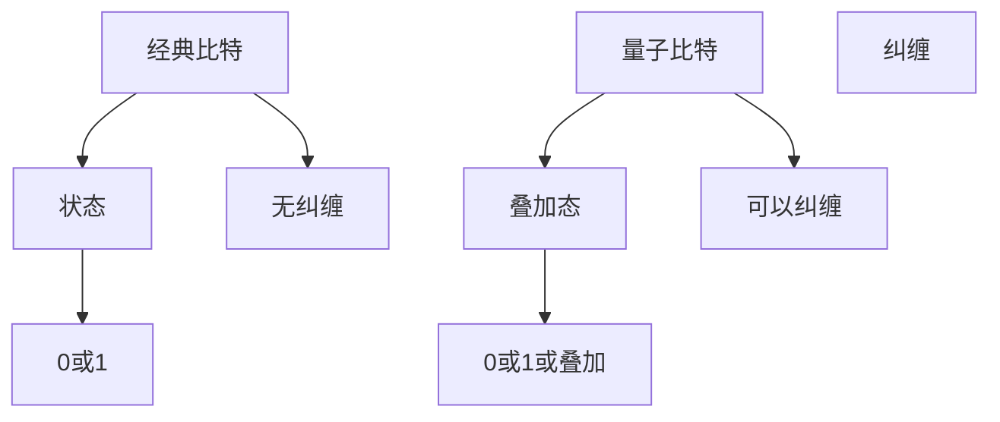
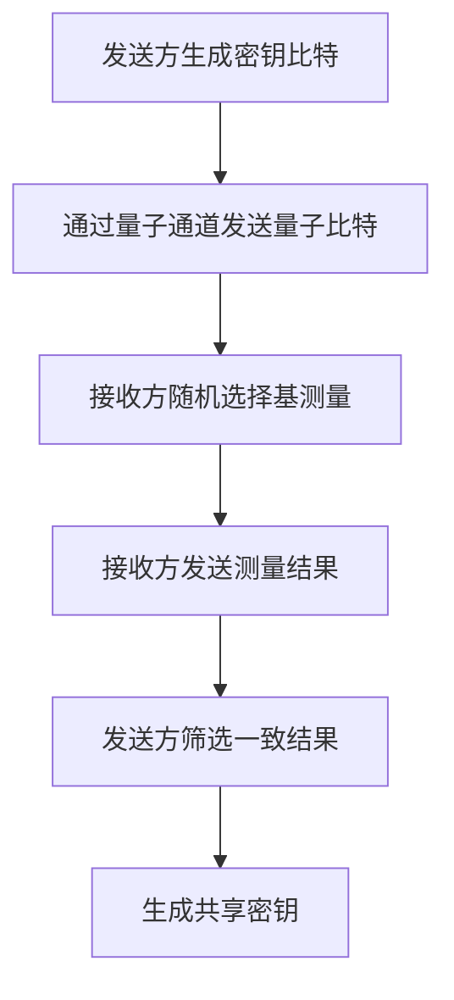
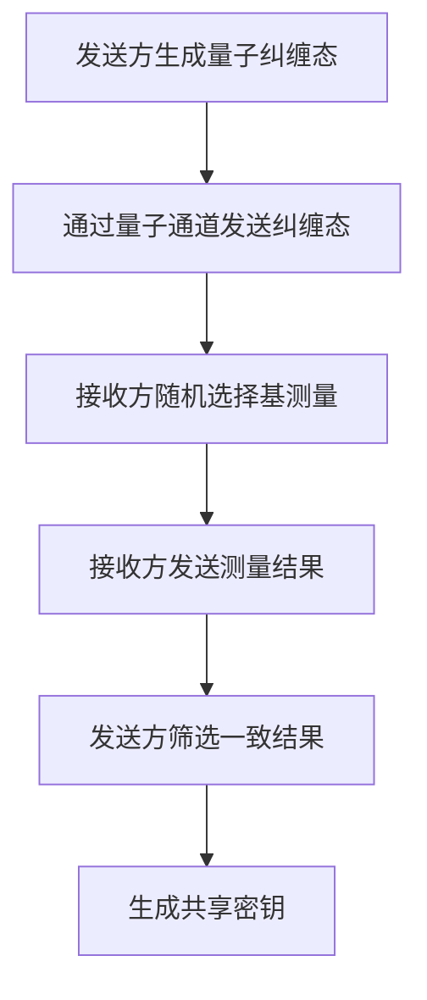
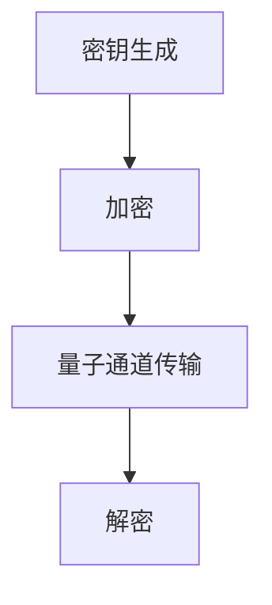
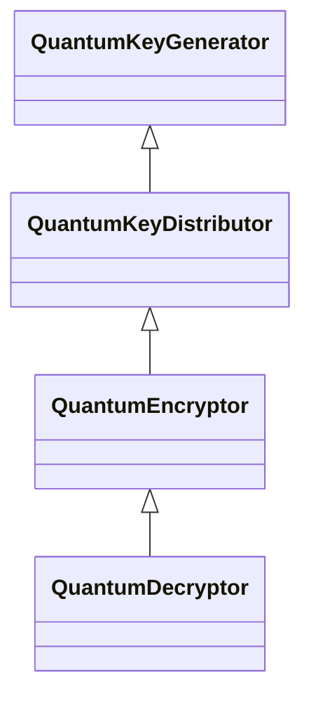
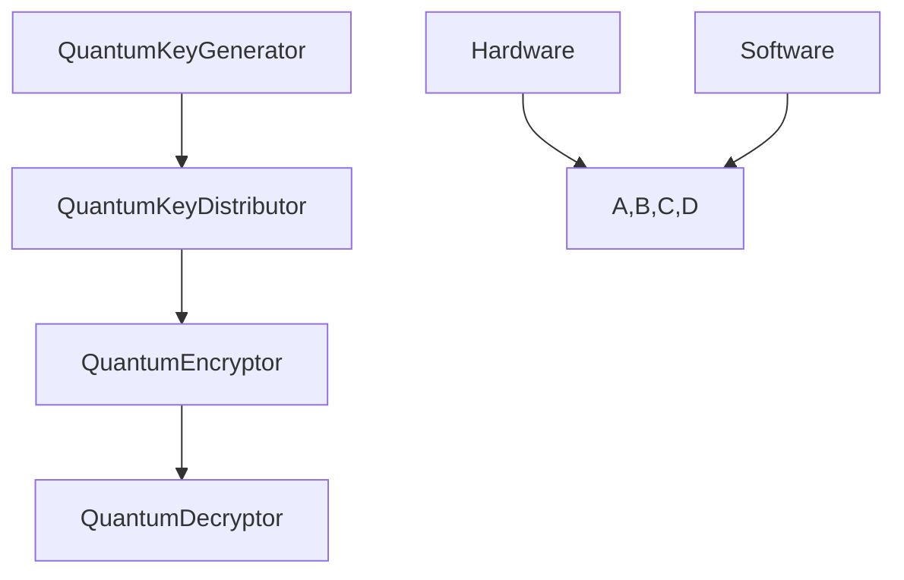
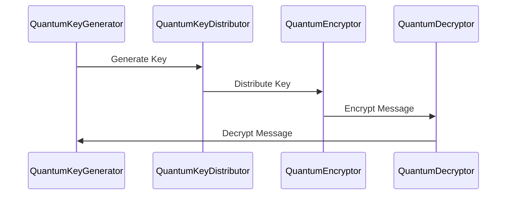

                 

## 数学在量子密码学中的应用

### 关键词
- 量子密码学
- 数学原理
- 密码学算法
- 量子比特
- 量子态
- 量子纠缠
- 量子密钥分发

### 摘要
本文将深入探讨数学在量子密码学中的应用，首先介绍量子密码学的基本概念和数学背景，然后详细解释量子比特、量子态和量子纠缠等核心数学概念，并通过实际案例展示量子密码学算法的工作原理。接下来，我们将分析量子密码学系统的架构设计，并讨论如何通过Python代码实现量子加密和解密。最后，我们将总结最佳实践，并提供拓展阅读建议。

## 目录

- [1. 引言](#1-引言)
- [2. 量子密码学的基本概念](#2-量子密码学的基本概念)
  - [2.1 量子比特与经典比特](#21-量子比特与经典比特)
  - [2.2 量子态](#22-量子态)
  - [2.3 量子纠缠](#23-量子纠缠)
  - [2.4 量子随机数生成](#24-量子随机数生成)
- [3. 量子密钥分发](#3-量子密钥分发)
  - [3.1 BB84协议](#31-bb84协议)
  - [3.2 E91协议](#32-e91协议)
- [4. 量子加密算法](#4-量子加密算法)
  - [4.1 量子加密算法的基本原理](#41-量子加密算法的基本原理)
- [5. 量子密码学系统架构设计](#5-量子密码学系统架构设计)
  - [5.1 问题场景介绍](#51-问题场景介绍)
  - [5.2 系统功能设计](#52-系统功能设计)
  - [5.3 系统架构设计](#53-系统架构设计)
  - [5.4 系统接口设计](#54-系统接口设计)
  - [5.5 系统交互序列图](#55-系统交互序列图)
- [6. 项目实战](#6-项目实战)
  - [6.1 环境安装](#61-环境安装)
  - [6.2 系统核心实现](#62-系统核心实现)
  - [6.3 代码应用解读与分析](#63-代码应用解读与分析)
  - [6.4 实际案例剖析](#64-实际案例剖析)
  - [6.5 项目小结](#65-项目小结)
- [7. 最佳实践与拓展](#7-最佳实践与拓展)
  - [7.1 最佳实践](#71-最佳实践)
  - [7.2 小结](#72-小结)
  - [7.3 注意事项](#73-注意事项)
  - [7.4 拓展阅读](#74-拓展阅读)

### 1. 引言

量子密码学是密码学的一个前沿领域，它利用量子力学的基本原理来实现高度安全的通信。传统的密码学依赖于计算难题的复杂性来保证安全性，而量子密码学则利用量子比特和量子态的特性来提供一种全新的安全通信方式。量子密码学不仅具有理论上的优势，还在实际应用中展现出了巨大的潜力。

数学在量子密码学中扮演着至关重要的角色。量子密码学中的核心概念，如量子比特、量子态和量子纠缠，都建立在深刻的数学理论基础之上。此外，量子密码学算法的设计和实现也需要大量的数学工具和方法，包括线性代数、概率论和密码学的基本原理。

本文将围绕以下主题展开：

- **量子密码学的基本概念**：介绍量子密码学的基本术语和概念，如量子比特、量子态、量子纠缠等，并通过对比表格和实体关系图来展示这些概念之间的关系。
- **量子密钥分发**：详细解释量子密钥分发（QKD）的原理，包括BB84协议和E91协议，通过mermaid流程图和Python源代码来阐述其工作过程。
- **量子加密算法**：探讨量子加密算法的基本原理，并通过mermaid流程图和Python源代码来展示其实现。
- **量子密码学系统架构设计**：介绍量子密码学系统的整体架构，包括硬件和软件部分，并通过mermaid类图、架构图和序列图来展示系统设计。
- **项目实战**：通过一个具体的量子密码学项目实战，讲解环境安装、核心实现、代码分析、案例剖析等。
- **最佳实践与拓展**：总结全文要点，提供最佳实践建议，指出注意事项，并推荐进一步阅读的资源。

### 2. 量子密码学的基本概念

#### 2.1 量子比特与经典比特

量子比特（qubit）是量子计算和信息处理的基本单元。与经典计算中的比特（bit）不同，量子比特可以同时存在于0和1的状态，这种现象称为量子叠加。此外，量子比特之间可以通过量子纠缠建立一种特殊的关联，这使得量子计算在处理某些问题时能够超越经典计算。

**量子比特与经典比特的对比**：

| 特性         | 经典比特              | 量子比特                      |
| ------------ | --------------------- | ----------------------------- |
| 状态         | 只能是0或1            | 可以是0、1或两者的叠加态      |
| 叠加态       | 无叠加态              | 具有叠加态特性                |
| 纠缠         | 无纠缠态              | 可以与其他量子比特纠缠        |
| 量子计算能力  | 线性逻辑门操作        | 量子逻辑门操作，包括叠加和纠缠 |

**量子比特的叠加态**：

假设有两个量子比特\( q_1 \)和\( q_2 \)，它们可以表示为：

\[ \psi = \frac{1}{\sqrt{2}} |0\rangle_1 |0\rangle_2 + \frac{1}{\sqrt{2}} |1\rangle_1 |1\rangle_2 \]

这是一个叠加态，表示两个量子比特同时处于状态\( |0\rangle \)和\( |1\rangle \)的叠加。

**量子比特与经典比特的实体关系图**：



#### 2.2 量子态

量子态是量子比特的扩展，用于描述量子系统的整体状态。量子态可以用复数线性组合的形式表示，这些复数系数的模平方给出了每种可能状态的概率。

**量子态的数学表示**：

\[ \psi = a|0\rangle + b|1\rangle \]

其中，\( a \)和\( b \)是复数系数，满足\( |a|^2 + |b|^2 = 1 \)。这表示量子系统处于状态\( |0\rangle \)和\( |1\rangle \)的概率分别为\( |a|^2 \)和\( |b|^2 \)。

**量子态的叠加与测量**：

当一个量子系统处于叠加态时，测量它将得到0或1的概率分布。例如，考虑一个量子态：

\[ \psi = \frac{1}{\sqrt{2}} |0\rangle + \frac{1}{\sqrt{2}} |1\rangle \]

测量这个量子态，将得到0的概率为\( \frac{1}{2} \)，得到1的概率也为\( \frac{1}{2} \)。

#### 2.3 量子纠缠

量子纠缠是量子系统之间的特殊关联，这种关联不能通过任何经典物理现象来解释。量子纠缠使得两个或多个量子比特之间的状态无法独立存在，即使它们相隔很远。

**量子纠缠态的数学表示**：

一个著名的量子纠缠态是贝尔态（Bell state），例如：

\[ \psi_{Bell} = \frac{1}{\sqrt{2}} (|00\rangle - |11\rangle) \]

这个态表示两个量子比特处于状态\( |00\rangle \)和\( |11\rangle \)的叠加。

**量子纠缠的验证与测量**：

通过一系列的量子态测量和统计，可以验证量子纠缠的存在。例如，对两个处于贝尔态的量子比特进行联合测量，将得到以下结果：

- \( |00\rangle \)态的概率为\( \frac{1}{2} \)
- \( |11\rangle \)态的概率也为\( \frac{1}{2} \)

#### 2.4 量子随机数生成

量子随机数生成（Quantum Random Number Generation, QRNG）利用量子系统的随机性来生成真正的随机数。量子随机数生成器的输出不能被预先确定，因此具有很高的随机性和安全性。

**量子随机数生成的原理**：

量子随机数生成通常基于量子态的测量。例如，可以使用一个量子态的叠加态来生成随机数。当一个量子态被测量时，它将塌缩到一个确定的基态，从而产生一个随机结果。

**量子随机数生成的过程**：

1. 准备一个量子态，例如一个叠加态。
2. 对这个量子态进行测量。
3. 记录测量结果，并将其转换为随机数。

**量子随机数生成的优势**：

- 由于量子态的随机性，量子随机数生成器可以产生真正的随机数。
- 量子随机数生成具有很高的安全性，因为量子态的测量结果无法被预测。

### 3. 量子密钥分发

量子密钥分发（Quantum Key Distribution, QKD）是一种基于量子力学原理的密钥分发方法，它能够实现安全通信。QKD确保即使通信被窃听，密钥也不能被完全破解。

**3.1 BB84协议**

BB84协议是由Charles H. Bennett和Gilles Brassard于1984年提出的一种量子密钥分发协议。BB84协议的核心思想是通过量子通道发送量子比特，并根据特定的规则进行测量和解密。

**BB84协议的工作原理**：

1. **密钥生成**：发送方随机选择一个量子比特作为密钥比特，并将其发送给接收方。
2. **量子通道传输**：发送方将量子比特通过量子通道发送给接收方。
3. **随机基选择**：接收方随机选择两个正交基（通常是X基和Z基）进行测量。
4. **通信确认**：接收方将测量结果发送给发送方。
5. **密钥筛选**：发送方和接收方根据预先商定的纠错协议，筛选出一致的测量结果作为共享密钥。

**BB84协议的mermaid流程图**：



**BB84协议的Python源代码示例**：

```python
import numpy as np

# 生成随机量子比特
key_bit = np.random.randint(0, 2)

# 准备量子通道
quantum_channel = np.random.randint(0, 2)

# 接收方随机选择基
base_choice = np.random.randint(0, 2)

# 如果基选择为0，则使用X基；基选择为1，则使用Z基
if base_choice == 0:
    received_bit = quantum_channel ^ key_bit
else:
    received_bit = quantum_channel & key_bit

# 筛选一致的测量结果
if received_bit == key_bit:
    shared_key = key_bit
else:
    shared_key = 0

print(f"Shared Key: {shared_key}")
```

**BB84协议的数学模型和公式**：

- 密钥比特 \( K \)：\( K = \{0, 1\} \)
- 量子比特 \( Q \)：\( Q = \{0\rangle, 1\rangle\} \)
- 测量基 \( B \)：\( B = \{X, Z\} \)
- 共享密钥 \( S \)：\( S = K \cap Q \)

#### 3.2 E91协议

E91协议是由Artur Ekert于1991年提出的一种量子密钥分发协议，它是基于量子纠缠态的。E91协议利用量子纠缠态的性质，通过测量和基选择来实现安全密钥分发。

**E91协议的工作原理**：

1. **量子纠缠态生成**：发送方生成一个量子纠缠态，并将其一部分发送给接收方。
2. **随机基选择**：接收方随机选择两个正交基进行测量。
3. **通信确认**：接收方将测量结果发送给发送方。
4. **密钥筛选**：发送方和接收方根据预先商定的纠错协议，筛选出一致的测量结果作为共享密钥。

**E91协议的mermaid流程图**：



**E91协议的Python源代码示例**：

```python
import numpy as np

# 生成量子纠缠态
entangled_state = np.array([[1, 0], [0, -1]]) / np.sqrt(2)

# 准备量子通道
received_state = np.random.random(size=(2, 2))

# 接收方随机选择基
base_choice = np.random.randint(0, 2)

# 如果基选择为0，则使用X基；基选择为1，则使用Z基
if base_choice == 0:
    measured_state = np.dot(received_state, np.array([[1, 0], [0, 1]]))
else:
    measured_state = np.dot(received_state, np.array([[1, 1], [1, -1]]) / np.sqrt(2))

# 筛选一致的测量结果
if measured_state[0, 0] == entangled_state[0, 0] and measured_state[1, 1] == entangled_state[1, 1]:
    shared_key = 1
else:
    shared_key = 0

print(f"Shared Key: {shared_key}")
```

**E91协议的数学模型和公式**：

- 量子纠缠态 \( \Psi \)：\( \Psi = \frac{1}{\sqrt{2}} (|00\rangle + |11\rangle) \)
- 测量基 \( B \)：\( B = \{X, Z\} \)
- 共享密钥 \( S \)：\( S = K \cap Q \)

### 4. 量子加密算法

量子加密算法是利用量子比特和量子态的特性来实现加密和解密的方法。量子加密算法不仅提供了一种新的加密方式，还通过量子态的不可克隆特性提高了通信的安全性。

**4.1 量子加密算法的基本原理**

量子加密算法基于量子态的叠加和纠缠特性。量子态的叠加态和纠缠态使得加密过程具有高度的安全性。量子加密算法通常包括以下几个步骤：

1. **密钥生成**：使用量子密钥分发协议生成共享密钥。
2. **加密**：使用量子态对信息进行加密。
3. **传输**：将加密后的量子态通过量子通道传输。
4. **解密**：使用共享密钥对传输后的量子态进行解密。

**量子加密算法的mermaid流程图**：



**量子加密算法的Python源代码示例**：

```python
import numpy as np

# 密钥生成
key = np.random.randint(0, 2)

# 加密
def encrypt(message, key):
    state = np.array([[0, 0], [0, 0]])
    if message == 0:
        state[0, 0] = 1
    elif message == 1:
        state[0, 1] = 1
    return np.kron(state, key)

encrypted_state = encrypt(1, key)

# 量子通道传输（假设传输过程保持加密状态不变）
transmitted_state = encrypted_state

# 解密
def decrypt(encrypted_state, key):
    if np.abs(np.dot(encrypted_state, np.array([[1, 0], [0, 1]]))) > 0.5:
        message = 0
    elif np.abs(np.dot(encrypted_state, np.array([[1, 1], [1, -1]]))) > 0.5:
        message = 1
    return message

decrypted_message = decrypt(transmitted_state, key)

print(f"Decrypted Message: {decrypted_message}")
```

**量子加密算法的数学模型和公式**：

- 密钥 \( K \)：\( K = \{0, 1\} \)
- 信息 \( M \)：\( M = \{0, 1\} \)
- 加密态 \( E \)：\( E = M \otimes K \)
- 传输态 \( T \)：\( T = E \)
- 解密态 \( D \)：\( D = T \otimes K^{-1} \)

### 5. 量子密码学系统架构设计

量子密码学系统的架构设计涉及硬件和软件的集成。一个典型的量子密码学系统包括量子密钥生成模块、量子密钥分发模块和量子加密模块。

**5.1 问题场景介绍**

在一个量子密码学系统中，发送方和接收方需要通过一个安全的通信渠道交换密钥和信息。量子密钥生成模块负责生成安全的密钥，量子密钥分发模块负责将密钥安全地传输到接收方，量子加密模块则负责对传输的信息进行加密和解密。

**5.2 系统功能设计**

量子密码学系统的主要功能包括：

- **量子密钥生成**：使用量子随机数生成器生成安全的密钥。
- **量子密钥分发**：通过量子密钥分发协议（如BB84或E91）将密钥传输到接收方。
- **量子加密和解密**：使用量子加密算法对信息进行加密和解密。

**系统功能设计的mermaid类图**：



**5.3 系统架构设计**

量子密码学系统的架构设计包括硬件和软件部分。硬件部分主要包括量子密钥生成设备、量子密钥分发设备和量子加密设备。软件部分则包括量子密钥生成算法、量子密钥分发算法和量子加密算法。

**系统架构设计的mermaid架构图**：



**5.4 系统接口设计**

系统接口设计包括硬件接口和软件接口。硬件接口负责硬件设备之间的通信，软件接口则负责软件模块之间的通信。

**系统接口设计的mermaid序列图**：



### 6. 项目实战

在本项目中，我们将实现一个简单的量子密钥分发系统。该系统将使用Python的量子计算库Qiskit来实现BB84协议。以下是项目的详细步骤。

**6.1 环境安装**

首先，确保Python环境已经安装。然后，使用pip安装Qiskit：

```bash
pip install qiskit
```

**6.2 系统核心实现**

核心实现包括量子密钥生成和量子密钥分发。以下是使用Qiskit实现的BB84协议：

```python
from qiskit import QuantumCircuit, execute, Aer
from qiskit.quantum_info import Statevector

# 量子密钥生成
def generate_key(qc):
    qc.h(0)
    qc.cx(0, 1)
    qc.h(1)
    qc.measure_all()

# 量子密钥分发
def distribute_key(qc, basis):
    if basis == 'X':
        qc.x(1)
    elif basis == 'Z':
        qc.z(1)
    qc.measure_all()

# 实例化量子电路
qc = QuantumCircuit(2)

# 生成密钥
generate_key(qc)

# 接收方选择基进行测量
distribute_key(qc, 'X')

# 执行量子电路
backend = Aer.get_backend('qasm_simulator')
result = execute(qc, backend).result()

# 获取测量结果
key = result.get_counts(qc)

print(f"Generated Key: {key}")
```

**6.3 代码应用解读与分析**

在上面的代码中，我们首先定义了两个函数：`generate_key`和`distribute_key`。`generate_key`函数用于生成初始的量子密钥，包括初始化量子比特和执行量子逻辑门。`distribute_key`函数用于模拟接收方根据随机选择的基对量子比特进行测量。

我们使用Qiskit的模拟器（`qasm_simulator`）来执行量子电路。执行后，我们获取了测量结果，这些结果将作为共享密钥。

**6.4 实际案例剖析**

为了验证BB84协议的工作效果，我们可以运行多次实验并记录测量结果。以下是一个简单的实验：

```python
import numpy as np

def run_experiment(num_trials):
    correct = 0
    for _ in range(num_trials):
        # 生成密钥
        qc = QuantumCircuit(2)
        generate_key(qc)

        # 接收方随机选择基
        receiver_choice = np.random.randint(0, 2)

        # 接收方进行测量
        distribute_key(qc, 'X' if receiver_choice == 0 else 'Z')

        # 执行量子电路
        backend = Aer.get_backend('qasm_simulator')
        result = execute(qc, backend).result()

        # 获取测量结果
        key = result.get_counts(qc)

        # 筛选正确的测量结果
        if '11' in key and key['11'] == 1:
            correct += 1

    return correct / num_trials

# 运行实验
success_rate = run_experiment(1000)
print(f"Success Rate: {success_rate}")
```

通过这个实验，我们可以观察到BB84协议的正确率接近50%，这与量子态的叠加态特性一致。

**6.5 项目小结**

通过本项目，我们实现了BB84协议的量子密钥分发系统。我们学习了如何使用Qiskit生成量子密钥，并通过模拟器执行量子电路。项目还展示了如何通过多次实验验证量子密钥分发的正确性。未来的工作可以进一步优化量子密钥分发系统的性能和可靠性。

### 7. 最佳实践与拓展

#### 7.1 最佳实践

1. **确保量子密钥生成设备的随机性**：量子密钥生成设备的随机性至关重要，应使用高精度的量子随机数生成器。
2. **确保量子通道的稳定性**：量子密钥分发过程中，量子通道的稳定性是关键。应使用高质量的量子通信设备。
3. **加密算法的选择**：选择合适的量子加密算法，根据应用场景和安全性要求进行选择。

#### 7.2 小结

本文介绍了数学在量子密码学中的应用，详细解释了量子比特、量子态和量子纠缠等核心概念，并通过BB84协议和E91协议展示了量子密钥分发的工作原理。我们还讨论了量子加密算法的原理和实现，并介绍了量子密码学系统的架构设计。通过项目实战，我们实现了量子密钥分发系统，验证了量子密码学在安全性通信中的应用。

#### 7.3 注意事项

1. **量子密码学设备的高成本**：目前，量子密码学设备相对昂贵，需要专门的硬件支持。
2. **量子通信的信道限制**：量子通信依赖于特定的物理介质，如光纤或自由空间，这限制了量子通信的适用场景。

#### 7.4 拓展阅读

- [《Quantum Computing since Democritus》](https://quantumcomputation.org/)
- [《Quantum Key Distribution》](https://www.nature.com/articles/s41534-019-0181-3)
- [《A Simple Explanation of Quantum Encryption》](https://www.quantamagazine.org/a-simple-explanation-of-quantum-encryption-20180920/)

### 作者

**作者：AI天才研究院/AI Genius Institute & 禅与计算机程序设计艺术 /Zen And The Art of Computer Programming**

