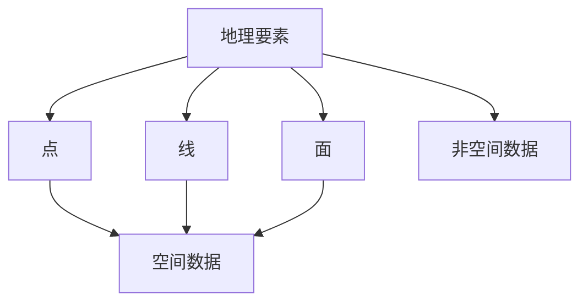
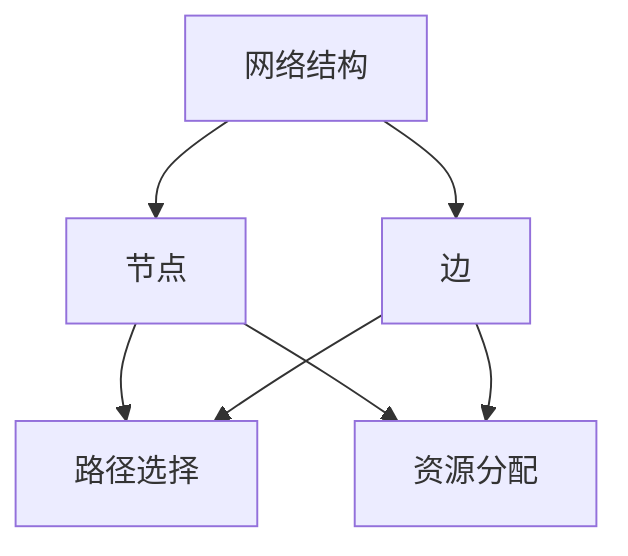
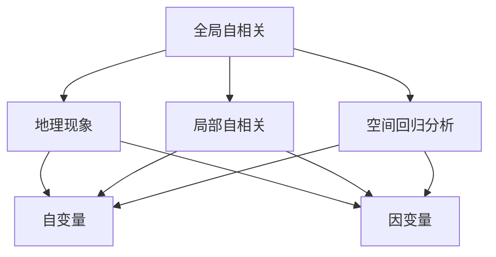

                 

### 文章标题：数学地理学：地理现象的数学模型

#### 关键词：数学地理学，地理现象，数学模型，GIS，生态系统模型，神经网络模型

#### 摘要：
本文旨在探讨数学地理学的概念、重要性及其在现实世界中的应用。我们将深入分析地理现象的数学模型，从描述性模型到预测性模型，再到控制性模型，详细阐述其分类和具体应用。此外，本文将结合实际案例分析，展示地理现象数学模型在实际问题解决中的重要作用。通过本文的阅读，读者将全面了解数学地理学的基本原理及其在现代信息技术领域中的发展前景。

### 目录大纲

**第一部分：引论**

**第1章：问题背景与目标**  
- 1.1 地理学与数学的交汇  
- 1.2 地理现象与数学模型的重要性  
- 1.3 本书的研究目标与结构

**第2章：核心概念**  
- 2.1 地理现象的基本概念  
- 2.2 数学模型的基本概念  
- 2.3 地理现象与数学模型的关系

**第3章：地理现象的数学模型分类**  
- 3.1 描述性模型  
- 3.2 解释性模型  
- 3.3 预测性模型  
- 3.4 控制性模型

**第4章：地理空间分析模型**  
- 4.1 地理信息系统（GIS）模型  
- 4.2 网络分析模型  
- 4.3 空间统计分析模型

**第5章：地理过程模拟模型**  
- 5.1 生态系统模型  
- 5.2 气候模型  
- 5.3 人口迁移模型

**第6章：地理现象预测模型**  
- 6.1 地理趋势面分析模型  
- 6.2 时间序列分析模型  
- 6.3 马尔可夫链模型  
- 6.4 神经网络模型

**第7章：地理现象控制模型**  
- 7.1 可持续发展模型  
- 7.2 环境影响评估模型  
- 7.3 区域规划模型

**第8章：案例分析与应用**  
- 8.1 案例分析一：城市交通流量预测  
- 8.2 案例分析二：自然灾害预警  
- 8.3 案例分析三：区域经济规划  
- 8.4 案例分析四：生态系统恢复

**第9章：展望与未来趋势**  
- 9.1 地理现象数学模型的发展趋势  
- 9.2 挑战与机遇  
- 9.3 未来研究方向

### 第1章：问题背景与目标

#### 1.1 地理学与数学的交汇

地理学和数学自古以来就有着紧密的联系。从古代的地图绘制到现代的空间分析，数学一直是地理学的重要工具。然而，随着计算机技术的发展，地理学和数学的结合达到了新的高度。数学地理学作为一门交叉学科，旨在运用数学方法分析和解释地理现象。

#### 1.2 地理现象与数学模型的重要性

地理现象包括自然现象（如地形、气候、生态系统）和人文现象（如城市化、人口迁移、交通网络）。数学模型可以提供对这些现象的定量描述、解释和预测。在许多领域，如城市规划、环境保护、资源管理、灾害预警等，地理现象的数学模型具有关键作用。

#### 1.3 本书的研究目标与结构

本书的研究目标是通过数学模型深入探讨地理现象，从而为实际问题提供解决方案。结构上，本书分为三个主要部分：引论、模型介绍和案例分析。引论部分介绍了数学地理学的基本概念和重要性；模型介绍部分详细介绍了各类地理现象的数学模型；案例分析部分通过具体实例展示了模型的应用。

### 第2章：核心概念

#### 2.1 地理现象的基本概念

地理现象是指地球上各种自然和人文现象的空间分布和变化。例如，地形的高低起伏、气候的季节变化、生态系统的物种分布等。地理现象的空间特性使其成为数学模型研究的重要对象。

#### 2.2 数学模型的基本概念

数学模型是一种用数学语言描述现实世界的工具。它通常包括变量、方程和约束条件。数学模型可以用来描述、解释或预测地理现象。

#### 2.3 地理现象与数学模型的关系

地理现象与数学模型之间存在着密切的联系。数学模型可以帮助我们理解地理现象的内在规律，从而为实际问题的解决提供依据。例如，通过气候模型，我们可以预测未来的气候变化，为环境保护提供科学依据。

### 第3章：地理现象的数学模型分类

#### 3.1 描述性模型

描述性模型主要用于描述地理现象的分布和变化。它们通常基于统计数据和空间分析技术。描述性模型的一个典型例子是地理信息系统（GIS）模型，它可以用来可视化地理数据，帮助我们理解空间现象。

#### 3.2 解释性模型

解释性模型旨在解释地理现象产生的原因。它们通常基于统计分析和因果关系分析。一个典型的解释性模型是生态系统模型，它可以用来解释物种分布和生态系统动态。

#### 3.3 预测性模型

预测性模型用于预测地理现象的未来趋势。它们通常基于时间序列分析和空间统计分析。一个典型的预测性模型是时间序列分析模型，它可以用来预测城市交通流量。

#### 3.4 控制性模型

控制性模型用于控制地理现象的变化。它们通常基于优化理论和控制理论。一个典型的控制性模型是区域规划模型，它可以用来优化城市空间布局。

### 第4章：地理空间分析模型

#### 4.1 地理信息系统（GIS）模型

地理信息系统（GIS）是一种用于捕获、存储、分析和可视化地理数据的系统。GIS模型在描述和解释地理现象方面具有重要作用。

#### 4.2 网络分析模型

网络分析模型用于分析交通、通信和其他网络系统。它们可以用来优化路径选择、资源分配等。

#### 4.3 空间统计分析模型

空间统计分析模型用于分析地理数据的分布和相关性。它们可以帮助我们理解地理现象的空间规律。

### 第5章：地理过程模拟模型

#### 5.1 生态系统模型

生态系统模型用于模拟生态系统的动态变化。它们可以帮助我们理解物种分布和生态系统恢复。

#### 5.2 气候模型

气候模型用于模拟气候系统的变化。它们可以帮助我们预测未来的气候变化。

#### 5.3 人口迁移模型

人口迁移模型用于模拟人口在不同地区之间的流动。它们可以帮助我们理解人口迁移的原因和趋势。

### 第6章：地理现象预测模型

#### 6.1 地理趋势面分析模型

地理趋势面分析模型用于预测地理现象的分布趋势。它们可以帮助我们预测未来的地理分布情况。

#### 6.2 时间序列分析模型

时间序列分析模型用于预测时间序列数据的未来趋势。它们可以帮助我们预测未来的时间序列数据。

#### 6.3 马尔可夫链模型

马尔可夫链模型用于预测状态转移的概率。它们可以帮助我们预测地理现象的状态变化。

#### 6.4 神经网络模型

神经网络模型是一种强大的预测模型。它们可以通过学习历史数据来预测未来的地理现象。

### 第7章：地理现象控制模型

#### 7.1 可持续发展模型

可持续发展模型用于评估地理现象的可持续性。它们可以帮助我们制定可持续发展的策略。

#### 7.2 环境影响评估模型

环境影响评估模型用于评估地理现象对环境的影响。它们可以帮助我们制定环境保护的策略。

#### 7.3 区域规划模型

区域规划模型用于优化地理空间布局。它们可以帮助我们制定区域规划方案。

### 第8章：案例分析与应用

#### 8.1 案例分析一：城市交通流量预测

本案例将展示如何使用时间序列分析模型预测城市交通流量，为交通管理提供科学依据。

#### 8.2 案例分析二：自然灾害预警

本案例将展示如何使用地理信息系统（GIS）模型进行自然灾害预警，减少灾害损失。

#### 8.3 案例分析三：区域经济规划

本案例将展示如何使用区域规划模型进行区域经济规划，促进经济发展。

#### 8.4 案例分析四：生态系统恢复

本案例将展示如何使用生态系统模型进行生态系统恢复，保护生态环境。

### 第9章：展望与未来趋势

#### 9.1 地理现象数学模型的发展趋势

随着人工智能和大数据技术的发展，地理现象数学模型将变得更加智能和精确。

#### 9.2 挑战与机遇

地理现象数学模型面临着数据质量、模型精度和计算效率等挑战。

#### 9.3 未来研究方向

未来的研究将更加关注地理现象的复杂性和动态性，以及如何更好地利用人工智能和大数据技术。

### 总结

数学地理学作为一门交叉学科，具有广泛的应用前景。通过数学模型，我们可以更好地理解地理现象，为实际问题提供解决方案。随着科技的进步，数学地理学将在未来发挥越来越重要的作用。希望本文能够为读者提供有价值的参考。

### 作者信息

作者：AI天才研究院/AI Genius Institute & 禅与计算机程序设计艺术 /Zen And The Art of Computer Programming

---

在本文中，我们深入探讨了数学地理学的基本概念、重要性以及其在现实世界中的应用。通过详细分析地理现象的数学模型，从描述性模型到预测性模型，再到控制性模型，我们展示了数学模型在地理学中的关键作用。此外，通过具体案例分析，我们展示了数学模型在实际问题解决中的重要性。展望未来，随着人工智能和大数据技术的发展，地理现象数学模型将变得更加智能和精确，为人类社会的可持续发展提供有力支持。

---

### 引论

**1.1 地理学与数学的交汇**

地理学是一门研究地球表面及其空间分布和变化的学科。它涉及自然地理、人文地理、区域地理等多个领域，旨在理解地球上的各种现象和过程。而数学则是一门研究数量、结构、变化和空间等概念的学科。数学的严谨性和普适性使其成为研究各种科学问题的有力工具。

地理学与数学的结合可以追溯到古代，当时人们通过绘制地图来理解地形和地貌。然而，随着科技的发展，特别是计算机技术的普及，地理学和数学的结合达到了一个新的高度。数学地理学（Mathematical Geography）作为一门交叉学科，应运而生。

数学地理学是应用数学方法来研究地理现象的一门学科。它通过建立数学模型来描述、解释和预测地理现象，从而为地理学提供了新的研究方法和工具。数学模型在地理学中的应用非常广泛，包括空间分析、地图制作、环境监测、资源管理、城市规划等。例如，地理信息系统（GIS）就是基于数学模型的一种重要工具，它可以帮助我们捕捉、存储、分析和可视化地理数据。

**1.2 地理现象与数学模型的重要性**

地理现象是指地球表面及其附属空间中发生的一系列自然和人文现象。这些现象包括地形、气候、生态系统、城市化、人口迁移、交通网络等。地理现象的多样性和复杂性使得传统的地理研究方法难以全面深入地探讨其内在规律。而数学模型提供了一种定量化的方法，可以帮助我们更准确地描述和预测地理现象。

数学模型在地理学中的重要性体现在以下几个方面：

1. **定量描述地理现象**：数学模型可以用变量、方程和约束条件来描述地理现象，从而实现对现象的定量分析。这有助于我们理解地理现象的内在规律。

2. **解释地理现象**：数学模型可以帮助我们揭示地理现象产生的原因和机制。例如，通过生态系统模型，我们可以解释物种分布和生态系统的动态变化。

3. **预测地理现象**：数学模型可以基于历史数据预测地理现象的未来趋势。这对于灾害预警、城市规划、资源管理等领域具有重要意义。

4. **优化决策**：数学模型可以帮助我们在地理空间布局、资源分配、环境保护等方面做出最优决策。例如，通过区域规划模型，我们可以优化城市空间布局，提高资源利用效率。

**1.3 本书的研究目标与结构**

本书的研究目标是深入探讨地理现象的数学模型，通过分类介绍和案例分析，全面展示数学模型在地理学中的应用。具体来说，本书将涵盖以下内容：

1. **核心概念介绍**：介绍地理现象和数学模型的基本概念，阐述两者之间的关系。

2. **数学模型分类**：详细分类介绍地理现象的数学模型，包括描述性模型、解释性模型、预测性模型和控制性模型。

3. **具体模型讲解**：对各类地理现象的数学模型进行详细讲解，包括地理空间分析模型、地理过程模拟模型和地理现象预测模型。

4. **案例分析与应用**：通过实际案例分析，展示数学模型在解决现实问题中的应用，强调其重要性。

5. **展望与未来趋势**：探讨地理现象数学模型的发展趋势，分析面临的挑战和机遇，提出未来研究方向。

本书的结构分为三个主要部分：引论、模型介绍和案例分析。引论部分介绍了数学地理学的基本概念和重要性；模型介绍部分详细介绍了各类地理现象的数学模型；案例分析部分通过具体实例展示了模型的应用。通过本书的阅读，读者将全面了解数学地理学的基本原理及其在现代信息技术领域中的发展前景。

### 第2章：核心概念

**2.1 地理现象的基本概念**

地理现象是指地球表面及其附属空间中发生的各种自然和人文现象。这些现象包括地形、气候、生态系统、城市化、人口迁移、交通网络等。地理现象具有明显的空间特性，即它们在地球表面的特定位置发生和变化。

- **地形**：地形是指地球表面的地形起伏，包括山脉、平原、丘陵等。地形对气候、水文和生态系统等地理现象有重要影响。
- **气候**：气候是指一个地区长期的天气状况，包括温度、降水、风向等。气候对生态系统的分布和人类活动有重要影响。
- **生态系统**：生态系统是指由生物群落和其生活环境组成的整体。它包括物种、种群和生态系统过程。生态系统的健康对人类和其他生物的生存至关重要。
- **城市化**：城市化是指人口从农村向城市集中的过程。城市化对土地利用、环境、社会和经济结构有深远影响。
- **人口迁移**：人口迁移是指人口在不同地区之间的流动。人口迁移受多种因素影响，如就业机会、教育、家庭和社会网络等。
- **交通网络**：交通网络是指连接城市、乡村和重要设施的交通线路。交通网络对经济发展、社会联系和环境有重要影响。

**2.2 数学模型的基本概念**

数学模型是一种用数学语言描述现实世界问题的工具。它通常包括变量、方程和约束条件。数学模型可以帮助我们理解和分析地理现象，提供定量描述和预测。

- **变量**：变量是数学模型中的基本元素，用于表示地理现象的属性或状态。例如，温度、降水、人口等。
- **方程**：方程是数学模型的核心，用于描述变量之间的关系。例如，物理学中的牛顿第二定律 \( F=ma \)。
- **约束条件**：约束条件是限制变量取值范围的条件。例如，在优化问题中，约束条件可以限制资源的使用量。

**2.3 地理现象与数学模型的关系**

地理现象与数学模型之间存在着密切的联系。数学模型可以帮助我们更准确地描述和解释地理现象，从而为实际问题的解决提供科学依据。

1. **定量描述**：数学模型可以用变量和方程来描述地理现象的定量特征。例如，通过地形模型，我们可以定量描述地形的高度和坡度。
   
2. **解释机制**：数学模型可以揭示地理现象的内在机制和因果关系。例如，通过气候模型，我们可以理解气候变化对生态系统的影响。
   
3. **预测未来**：数学模型可以基于历史数据和现有条件预测地理现象的未来趋势。例如，通过人口迁移模型，我们可以预测未来的人口分布。

4. **优化决策**：数学模型可以帮助我们做出最优决策，优化资源分配和环境保护。例如，通过区域规划模型，我们可以优化城市空间的布局。

总的来说，地理现象的数学模型不仅为地理学提供了新的研究方法，也为实际问题的解决提供了有力支持。

### 第3章：地理现象的数学模型分类

在地理学中，数学模型被广泛应用于描述、解释、预测和控制地理现象。为了更好地理解和应用这些模型，我们可以将它们分为不同的类别。以下是几种主要的地理现象数学模型分类：

**3.1 描述性模型**

描述性模型主要用于描述地理现象的分布和变化特征。这类模型通常基于空间数据和统计分析方法，能够直观地展示地理现象的空间格局和动态变化。

- **地理信息系统（GIS）模型**：GIS模型是一种基于空间数据管理和分析的工具，能够可视化地理数据并分析其空间关系。GIS模型广泛应用于土地利用、城市规划、环境监测等领域。

  **GIS模型的核心概念**：
  - **空间数据**：包括点、线、面等地理要素。
  - **空间关系**：描述地理要素之间的位置关系，如邻近、相交、包含等。
  - **空间分析**：包括缓冲区分析、叠加分析、路径分析等。

  **GIS模型的ER实体关系图**：
  ```mermaid
  graph TD
  A[空间数据] --> B[点]
  A --> C[线]
  A --> D[面]
  B --> E[邻近]
  B --> F[相交]
  B --> G[包含]
  C --> E
  C --> F
  D --> E
  D --> F
  D --> G
  ```

- **空间统计分析模型**：这类模型通过统计学方法分析地理数据的分布和相关性，用于理解地理现象的空间规律。常用的空间统计分析方法包括全局自相关、局部自相关、空间回归分析等。

  **空间统计分析模型的核心概念**：
  - **全局自相关**：描述地理现象在全局范围内的空间相关性。
  - **局部自相关**：描述地理现象在局部范围内的空间相关性。
  - **空间回归分析**：通过建立地理现象之间的线性关系模型，用于预测和解释地理现象。

  **空间统计分析模型的ER实体关系图**：
  ```mermaid
  graph TD
  A[地理现象] --> B[全局自相关]
  A --> C[局部自相关]
  A --> D[空间回归分析]
  B --> E[自变量]
  B --> F[因变量]
  C --> E
  C --> F
  D --> E
  D --> F
  ```

**3.2 解释性模型**

解释性模型用于揭示地理现象的产生机制和因果关系。这类模型通常基于因果推理和统计建模方法，能够帮助我们理解地理现象的内在逻辑。

- **生态系统模型**：这类模型用于模拟生态系统的动态变化，分析物种分布和生态系统过程。常见的生态系统模型包括Lotka-Volterra模型、种间关系模型等。

  **生态系统模型的核心概念**：
  - **种群动态**：描述物种数量的变化过程。
  - **种间关系**：描述不同物种之间的相互作用，如捕食与被捕食、共生等。
  - **生态位**：描述物种在生态系统中的角色和功能。

  **生态系统模型的ER实体关系图**：
  ```mermaid
  graph TD
  A[物种] --> B[种群]
  A --> C[种间关系]
  A --> D[生态位]
  B --> E[捕食者]
  B --> F[被捕食者]
  B --> G[共生者]
  ```

- **社会经济模型**：这类模型用于分析社会经济的地理分布和变化。常见的模型包括经济活动模型、人口迁移模型等。

  **社会经济模型的核心概念**：
  - **经济活动**：描述不同行业和地区的经济活动水平。
  - **人口迁移**：描述人口在不同地区之间的流动。
  - **就业与失业**：描述劳动市场的供需关系。

  **社会经济模型的ER实体关系图**：
  ```mermaid
  graph TD
  A[经济活动] --> B[行业]
  A --> C[地区]
  A --> D[就业]
  A --> E[失业]
  B --> F[人口迁移]
  ```

**3.3 预测性模型**

预测性模型用于预测地理现象的未来趋势。这类模型通常基于历史数据和统计方法，能够帮助我们预测地理现象的变化方向和强度。

- **时间序列分析模型**：这类模型通过分析时间序列数据来预测未来的趋势。常见的时间序列分析方法包括移动平均、指数平滑、ARIMA模型等。

  **时间序列分析模型的核心概念**：
  - **时间序列**：描述随时间变化的数据序列。
  - **趋势**：描述数据随时间的变化趋势。
  - **季节性**：描述数据在特定时间段内的周期性变化。
  - **随机性**：描述数据的随机波动。

  **时间序列分析模型的ER实体关系图**：
  ```mermaid
  graph TD
  A[时间序列] --> B[趋势]
  A --> C[季节性]
  A --> D[随机性]
  ```

- **空间预测模型**：这类模型通过分析空间数据来预测地理现象的空间分布。常见的空间预测方法包括空间回归、空间插值等。

  **空间预测模型的核心概念**：
  - **空间变量**：描述地理现象的空间分布。
  - **空间关系**：描述地理现象之间的空间关系。
  - **预测变量**：用于预测地理现象的变量。

  **空间预测模型的ER实体关系图**：
  ```mermaid
  graph TD
  A[空间变量] --> B[空间关系]
  A --> C[预测变量]
  ```

**3.4 控制性模型**

控制性模型用于控制和优化地理现象。这类模型通常基于优化理论和控制理论，能够帮助我们制定科学的决策，优化资源分配和环境保护。

- **区域规划模型**：这类模型用于优化地理空间的布局，包括城市规划和区域发展。常见的模型包括线性规划、整数规划等。

  **区域规划模型的核心概念**：
  - **资源**：用于描述地理空间中的资源，如土地、水资源、能源等。
  - **目标**：描述规划的目标，如最大化效益、最小化成本、保持环境可持续性等。
  - **约束条件**：描述规划中的限制条件，如资源限制、法律限制等。

  **区域规划模型的ER实体关系图**：
  ```mermaid
  graph TD
  A[资源] --> B[目标]
  A --> C[约束条件]
  ```

- **环境影响评估模型**：这类模型用于评估人类活动对环境的影响，为环境保护提供科学依据。常见的模型包括环境评估、生态足迹等。

  **环境影响评估模型的核心概念**：
  - **人类活动**：描述对环境产生影响的各类活动，如工业生产、交通运输、农业活动等。
  - **环境影响**：描述人类活动对环境的直接影响和间接影响。
  - **评估标准**：用于评估环境影响的指标和标准。

  **环境影响评估模型的ER实体关系图**：
  ```mermaid
  graph TD
  A[人类活动] --> B[环境影响]
  A --> C[评估标准]
  ```

通过以上分类，我们可以看到地理现象的数学模型在描述性、解释性、预测性和控制性方面都有广泛的应用。这些模型不仅为地理学的研究提供了新的方法和工具，也为实际问题的解决提供了有力支持。

### 第4章：地理空间分析模型

地理空间分析模型是地理现象数学模型中至关重要的一部分，它们帮助我们理解和处理地理空间数据。这些模型可以分为三类：地理信息系统（GIS）模型、网络分析模型和空间统计分析模型。

#### 4.1 地理信息系统（GIS）模型

地理信息系统（GIS）是一种用于捕获、存储、分析和可视化地理数据的系统。GIS模型的核心概念包括地理要素、地理数据和空间分析。

**核心概念**：

- **地理要素**：地理要素是GIS中的基本对象，包括点、线、面等。例如，点可以表示城市的位置，线可以表示道路或河流，面可以表示湖泊或行政区划。

- **地理数据**：地理数据是GIS中的信息载体，包括空间数据和非空间数据。空间数据描述地理要素的位置和形状，非空间数据描述地理要素的属性信息。

- **空间分析**：空间分析是GIS模型的核心功能，包括缓冲区分析、叠加分析、网络分析等。这些功能用于分析地理要素之间的空间关系和相互作用。

**GIS模型的应用**：

- **土地利用规划**：通过GIS模型，可以对土地利用进行规划和管理，优化土地资源的利用。

- **环境监测**：GIS模型可以用于监测环境污染、生态破坏等环境问题，提供科学依据。

- **城市规划**：GIS模型在城市规划中用于分析城市空间结构、交通流量、人口密度等，为城市规划提供支持。

**GIS模型的ER实体关系图**：



#### 4.2 网络分析模型

网络分析模型用于分析交通、通信和其他网络系统。这类模型的核心概念包括网络结构、路径选择和资源分配。

**核心概念**：

- **网络结构**：网络结构是网络分析模型的基本组成部分，包括节点和边。节点表示网络中的位置，边表示节点之间的连接。

- **路径选择**：路径选择是指在网络中选择从起点到终点的最优路径。常见的路径选择算法包括Dijkstra算法、A*算法等。

- **资源分配**：资源分配是指在网络上分配资源（如交通流量、带宽等），以优化网络性能。

**网络分析模型的应用**：

- **交通管理**：网络分析模型可以用于交通管理，优化交通流量，减少交通拥堵。

- **物流规划**：网络分析模型在物流规划中用于优化运输路径和运输资源分配，降低物流成本。

- **通信网络**：网络分析模型在通信网络中用于优化网络结构和资源分配，提高通信质量和稳定性。

**网络分析模型的ER实体关系图**：



#### 4.3 空间统计分析模型

空间统计分析模型用于分析地理数据的分布和相关性。这类模型的核心概念包括全局自相关、局部自相关、空间回归分析等。

**核心概念**：

- **全局自相关**：全局自相关描述地理现象在全局范围内的空间相关性。如果全局自相关系数大于0，说明地理现象在空间上呈现正相关；如果小于0，说明呈现负相关。

- **局部自相关**：局部自相关描述地理现象在局部范围内的空间相关性。通过局部自相关分析，可以识别地理现象的空间聚集特征。

- **空间回归分析**：空间回归分析用于建立地理现象之间的线性关系模型，用于预测和解释地理现象。

**空间统计分析模型的应用**：

- **灾害预警**：空间统计分析模型可以用于灾害预警，分析地理现象的空间分布和变化趋势，预测灾害的发生。

- **生态研究**：空间统计分析模型在生态研究中用于分析物种分布和生态系统的空间格局。

- **城市规划**：空间统计分析模型在城市规划中用于分析人口密度、土地利用等空间现象，为城市规划提供依据。

**空间统计分析模型的ER实体关系图**：



通过以上介绍，我们可以看到地理空间分析模型在地理学中的应用非常广泛。这些模型不仅帮助我们理解和处理地理空间数据，也为实际问题的解决提供了有力支持。在接下来的章节中，我们将继续探讨其他类型的地理现象数学模型，进一步揭示其应用价值和重要性。

### 第5章：地理过程模拟模型

地理过程模拟模型是用于模拟地理现象动态变化和相互作用的数学模型。这些模型在生态系统模型、气候模型和人口迁移模型等方面有着广泛的应用。

#### 5.1 生态系统模型

生态系统模型用于模拟生态系统的动态变化，包括物种分布、种群动态和生态过程。这些模型有助于我们理解生态系统的复杂性，预测生态系统变化趋势，并制定有效的生态保护策略。

**核心概念**：

- **种群动态**：描述物种数量的变化过程，包括出生率、死亡率、迁移等。
- **生态位**：描述物种在生态系统中的角色和功能，包括捕食与被捕食关系、共生关系等。
- **生态过程**：描述生态系统内部和与外部环境之间的物质和能量流动。

**生态系统模型的应用**：

- **物种保护**：通过模拟物种的分布和动态变化，预测物种灭绝的风险，制定保护策略。
- **生态恢复**：模拟生态系统恢复过程中的物种动态和生态过程，评估恢复效果。
- **土地利用规划**：通过模拟生态系统的变化，优化土地利用，减少生态破坏。

**生态系统模型的算法原理**：

一个常见的生态系统模型是Lotka-Volterra模型，它描述了捕食者-被捕食者系统的动态变化。

**算法原理**：

1. **捕食者-被捕食者方程**：

   \[
   \frac{dx}{dt} = a \cdot x - b \cdot x \cdot y
   \]
   \[
   \frac{dy}{dt} = -c \cdot y + d \cdot x \cdot y
   \]

   其中，\(x\) 代表被捕食者的种群数量，\(y\) 代表捕食者的种群数量，\(a\)、\(b\)、\(c\)、\(d\) 是模型参数。

2. **模型参数**：

   - \(a\)：被捕食者的出生率。
   - \(b\)：捕食者对被捕食者的捕食率。
   - \(c\)：捕食者的死亡率。
   - \(d\)：捕食者的繁殖率。

**Python代码示例**：

```python
import numpy as np
import matplotlib.pyplot as plt

# 参数设置
a = 0.3
b = 0.1
c = 0.3
d = 0.3

# 时间步长
dt = 0.01
t_max = 20

# 初始种群数量
x0 = 10
y0 = 5

# 时间序列
t = np.arange(0, t_max, dt)

# 模型计算
x = x0 * np.exp(a * t - b * t * y)
y = y0 * np.exp(-c * t + d * t * x)

# 作图
plt.plot(t, x, label='Prey')
plt.plot(t, y, label='Predator')
plt.xlabel('Time')
plt.ylabel('Population')
plt.legend()
plt.show()
```

**生态系统模型的应用示例**：

- **物种保护**：模拟某个地区的某种鱼类的种群数量，预测其灭绝风险，制定保护措施。
- **生态恢复**：模拟某片森林恢复过程中的树种数量变化，评估恢复效果。

#### 5.2 气候模型

气候模型用于模拟气候系统的变化，包括温度、降水、风向等气象要素。这些模型有助于我们理解气候变化的原因和趋势，预测未来的气候状况，为环境保护和可持续发展提供科学依据。

**核心概念**：

- **气候系统**：包括大气、海洋、陆地和冰冻圈等组成部分。
- **气候要素**：包括温度、降水、风向、湿度等。
- **气候过程**：包括辐射平衡、水循环、大气环流等。

**气候模型的应用**：

- **气候变化研究**：通过模拟气候系统的变化，研究气候变化的原因和趋势，预测未来的气候状况。
- **灾害预警**：通过气候模型，预测极端天气事件（如暴雨、干旱、台风等）的发生概率和影响范围，为灾害预警提供支持。
- **资源管理**：通过气候模型，预测水资源、农业产量等资源的未来变化，优化资源管理。

**气候模型的算法原理**：

一个常见的气候模型是通用气候模型（GCM），它通过建立大气和海洋的耦合模型，模拟气候系统的动态变化。

**算法原理**：

1. **大气模型**：

   \[
   \frac{\partial Q}{\partial t} + \vec{v}_Q \cdot \nabla Q = \nabla \cdot (D \nabla Q) + S_Q
   \]

   其中，\(Q\) 代表某个气象要素（如温度、湿度），\(v_Q\) 代表气象要素的水平风速，\(D\) 代表气象要素的扩散系数，\(S_Q\) 代表气象要素的源汇项。

2. **海洋模型**：

   \[
   \frac{\partial T}{\partial t} + \vec{v}_T \cdot \nabla T = \nabla \cdot (D \nabla T) + S_T
   \]

   \[
   \frac{\partial S}{\partial t} + \vec{v}_S \cdot \nabla S = \nabla \cdot (D \nabla S) + S_S
   \]

   其中，\(T\) 代表海洋温度，\(S\) 代表海洋盐度，\(v_T\)、\(v_S\) 分别代表温度和盐度的水平风速，\(D\) 代表扩散系数，\(S_T\)、\(S_S\) 分别代表温度和盐度的源汇项。

**Python代码示例**：

```python
import numpy as np
import matplotlib.pyplot as plt

# 参数设置
dx = 100000  # 水平分辨率
dt = 86400    # 时间步长
t_max = 365   # 模拟时间

# 初始条件
T0 = 288.15  # 初始温度
S0 = 35     # 初始盐度

# 模拟计算
t = np.arange(0, t_max, dt)
T = T0 * np.ones(t.shape)
S = S0 * np.ones(t.shape)

# 源汇项
S_T = 0.01 * np.random.randn(t.shape)
S_S = 0.05 * np.random.randn(t.shape)

# 模型计算
for i in range(1, t.shape[0]):
    T[i] = T[i-1] + (T[i-1] - T[i-1].mean()) * dt
    S[i] = S[i-1] + (S[i-1] - S[i-1].mean()) * dt
    T[i] += S_T[i] * dt
    S[i] += S_S[i] * dt

# 作图
plt.plot(t / (3600 * 24), T)
plt.xlabel('Time (days)')
plt.ylabel('Temperature (K)')
plt.title('Ocean Temperature Dynamics')
plt.show()

plt.plot(t / (3600 * 24), S)
plt.xlabel('Time (days)')
plt.ylabel('Salinity')
plt.title('Ocean Salinity Dynamics')
plt.show()
```

**气候模型的应用示例**：

- **气候变化研究**：模拟全球气候系统，预测未来气候变化的趋势。
- **灾害预警**：通过模拟气候变化，预测极端天气事件的发生概率和影响范围。
- **水资源管理**：预测未来水资源的分布和变化，优化水资源管理策略。

#### 5.3 人口迁移模型

人口迁移模型用于模拟人口在不同地区之间的流动，包括城市化、城乡迁移、国际移民等。这些模型有助于我们理解人口迁移的原因和趋势，为城市化规划、社会发展提供科学依据。

**核心概念**：

- **人口流动**：描述人口在不同地区之间的迁移。
- **迁移原因**：包括就业机会、教育、家庭和社会网络等。
- **迁移趋势**：描述人口迁移的方向和强度。

**人口迁移模型的应用**：

- **城市化规划**：通过模拟人口迁移，预测城市化的趋势，优化城市化布局。
- **社会发展**：通过模拟人口迁移，分析社会结构和人口分布的变化。
- **移民政策**：通过模拟人口迁移，评估移民政策的影响，制定有效的移民政策。

**人口迁移模型的算法原理**：

一个常见的人口迁移模型是Logistic模型，它基于人口迁移的吸引力和阻力因素。

**算法原理**：

1. **吸引力模型**：

   \[
   A_i = \frac{1}{1 + e^{-\alpha_i \cdot D_i}}
   \]

   其中，\(A_i\) 是区域 \(i\) 的吸引力，\(\alpha_i\) 是吸引力系数，\(D_i\) 是区域 \(i\) 与其他区域之间的距离。

2. **阻力模型**：

   \[
   R_i = \frac{1}{1 + e^{-\beta_i \cdot D_i}}
   \]

   其中，\(R_i\) 是区域 \(i\) 的阻力，\(\beta_i\) 是阻力系数，\(D_i\) 是区域 \(i\) 与其他区域之间的距离。

3. **人口迁移模型**：

   \[
   M_i = A_i - R_i
   \]

   其中，\(M_i\) 是区域 \(i\) 的人口迁移量。

**Python代码示例**：

```python
import numpy as np
import matplotlib.pyplot as plt

# 参数设置
alpha = 1
beta = 0.5
num_regions = 5
distance = np.random.uniform(0, 10, size=num_regions)

# 计算吸引力
attraction = 1 / (1 + np.exp(-alpha * distance))

# 计算阻力
resistance = 1 / (1 + np.exp(-beta * distance))

# 计算人口迁移量
migration = attraction - resistance

# 作图
plt.bar(range(num_regions), migration)
plt.xlabel('Region')
plt.ylabel('Migration')
plt.title('Population Migration')
plt.show()
```

**人口迁移模型的应用示例**：

- **城市化规划**：通过模拟人口迁移，预测城市化的趋势，优化城市布局。
- **社会发展**：通过模拟人口迁移，分析社会结构和人口分布的变化。
- **移民政策**：通过模拟人口迁移，评估移民政策的影响，制定有效的移民政策。

### 总结

地理过程模拟模型在生态系统、气候和人口迁移等领域具有广泛的应用。通过这些模型，我们可以更深入地理解地理现象的动态变化和相互作用，为实际问题的解决提供科学依据。在接下来的章节中，我们将继续探讨地理现象预测模型，进一步展示数学模型在地理学中的重要作用。

### 第6章：地理现象预测模型

地理现象预测模型在地理学和相关的应用领域（如城市规划、环境保护、灾害预警等）中扮演着关键角色。这些模型通过分析历史数据，利用统计方法和机器学习技术，预测未来的地理现象。本章将介绍几种主要的地理现象预测模型，包括地理趋势面分析模型、时间序列分析模型、马尔可夫链模型和神经网络模型。

#### 6.1 地理趋势面分析模型

地理趋势面分析模型是一种用于预测地理现象空间分布趋势的方法。该方法通过建立趋势面方程，将地理现象的分布与地形、气候等空间因素联系起来，预测未来的空间分布。

**核心概念**：

- **趋势面方程**：通常采用多项式函数形式，如：
  \[
  z(x, y) = \sum_{i=1}^{n} a_i \cdot x^i + \sum_{j=1}^{m} b_j \cdot y^j + c \cdot xy + d
  \]
  其中，\(z(x, y)\) 是预测值，\(x\) 和 \(y\) 是空间坐标，\(a_i\)、\(b_j\)、\(c\)、\(d\) 是模型参数。

- **地形单元**：将研究区域划分为若干地形单元，每个单元的值通过趋势面方程计算得到。

**应用示例**：

- **土地利用变化预测**：通过地理趋势面分析，预测未来不同地区土地利用的变化趋势。

**Python代码示例**：

```python
import numpy as np
import matplotlib.pyplot as plt

# 假设数据
x = np.array([1, 2, 3, 4, 5])
y = np.array([1, 2, 3, 4, 5])
z = np.array([1, 2, 4, 6, 8])

# 拟合多项式趋势面方程
from numpy.polynomial import Polynomial
p = Polynomial.fit(np.column_stack((x, y)), z, deg=2)

# 预测新数据点
x_new = np.array([0, 6])
y_new = np.array([0, 6])
z_new = p(x_new, y_new)

# 作图
plt.scatter(x, y, c=z, cmap='viridis', label='Original Data')
plt.plot(x_new, y_new, 'ro', label='Predicted Data')
plt.contour(x, y, z_new, colors='black', linestyles='dashed', label='Trend Surface')
plt.xlabel('X')
plt.ylabel('Y')
plt.legend()
plt.show()
```

#### 6.2 时间序列分析模型

时间序列分析模型用于预测随时间变化的数据。这类模型考虑时间维度上的相关性，通过建立数学模型来预测未来的趋势和周期性变化。

**核心概念**：

- **时间序列**：随时间变化的数据序列，通常包含趋势、季节性和随机性。
- **ARIMA模型**：自回归积分滑动平均模型，是一种常用的时序预测模型。它通过自回归（AR）、差分（I）和移动平均（MA）三部分来建模时间序列。
  \[
  \begin{aligned}
  X_t &= c + \phi_1 X_{t-1} + \phi_2 X_{t-2} + \cdots + \phi_p X_{t-p} \\
  \Delta X_t &= \theta_1 \Delta X_{t-1} + \theta_2 \Delta X_{t-2} + \cdots + \theta_q \Delta X_{t-q} \\
  X_t &= \phi_0 \Delta X_t + \theta_0 \Delta X_{t-1} + \eta_t
  \end{aligned}
  \]

**应用示例**：

- **城市交通流量预测**：通过时间序列分析，预测未来不同时间段的城市交通流量，为交通管理提供依据。

**Python代码示例**：

```python
import numpy as np
import pandas as pd
from statsmodels.tsa.arima.model import ARIMA

# 假设数据
data = pd.Series([1, 2, 2, 3, 3, 3, 4, 4, 4, 4, 5, 5, 5, 5, 5])
data.index = pd.date_range(start='2021-01-01', periods=15, freq='M')

# 模型拟合
model = ARIMA(data, order=(1, 1, 1))
model_fit = model.fit()

# 预测
forecast = model_fit.forecast(steps=6)

# 作图
data.plot(label='Original Data')
forecast.plot(label='Forecast')
plt.xlabel('Time')
plt.ylabel('Value')
plt.legend()
plt.show()
```

#### 6.3 马尔可夫链模型

马尔可夫链模型用于预测系统状态的转移概率。它假设系统的当前状态仅依赖于前一状态，而不依赖于之前的状态。

**核心概念**：

- **状态转移概率矩阵**：描述不同状态之间的转移概率。矩阵中的元素 \(P_{ij}\) 表示从状态 \(i\) 转移到状态 \(j\) 的概率。
- **初始状态概率分布**：描述系统初始时刻处于各个状态的概率。

**应用示例**：

- **人口迁移预测**：通过马尔可夫链模型，预测人口在不同地区之间的迁移概率，为城市规划提供依据。

**Python代码示例**：

```python
import numpy as np
import pandas as pd

# 假设数据
transition_matrix = np.array([[0.4, 0.6], [0.2, 0.8]])
initial_state = np.array([0.5, 0.5])

# 马尔可夫链模拟
num_steps = 5
state_sequence = [initial_state]
for _ in range(num_steps):
    state_sequence.append(transition_matrix @ state_sequence[-1])

# 作图
import matplotlib.pyplot as plt

plt.imshow(state_sequence, aspect='auto', cmap='Blues')
plt.xlabel('Time')
plt.ylabel('State')
plt.title('State Sequence')
plt.show()
```

#### 6.4 神经网络模型

神经网络模型是一种基于人脑神经元连接方式的计算模型。它通过多层神经元的非线性变换，从输入数据中提取特征并生成预测。

**核心概念**：

- **神经网络结构**：包括输入层、隐藏层和输出层。
- **激活函数**：用于引入非线性变换，常见的激活函数有ReLU、Sigmoid和Tanh等。
- **损失函数**：用于评估模型预测值与真实值之间的差距，常用的损失函数有均方误差（MSE）和交叉熵等。

**应用示例**：

- **城市规划**：通过神经网络模型，预测城市人口增长、土地利用变化等，为城市规划提供科学依据。

**Python代码示例**：

```python
import tensorflow as tf
from tensorflow.keras.models import Sequential
from tensorflow.keras.layers import Dense, Activation

# 假设数据
X_train = np.random.rand(100, 1)
y_train = np.random.rand(100, 1)

# 构建模型
model = Sequential()
model.add(Dense(10, input_dim=1))
model.add(Activation('relu'))
model.add(Dense(1))

# 编译模型
model.compile(optimizer='adam', loss='mse')

# 训练模型
model.fit(X_train, y_train, epochs=100)

# 预测
X_test = np.random.rand(10, 1)
predictions = model.predict(X_test)

# 作图
plt.scatter(X_test, predictions)
plt.xlabel('Input')
plt.ylabel('Prediction')
plt.title('Neural Network Prediction')
plt.show()
```

通过上述几种地理现象预测模型，我们可以从不同角度对地理现象进行预测。这些模型在地理学和相关应用领域中具有广泛的应用前景，为科学决策提供了有力支持。

### 第7章：地理现象控制模型

地理现象控制模型是用于管理和优化地理现象的数学模型，旨在实现特定的地理目标或解决实际问题。这类模型广泛应用于环境保护、资源管理、区域规划等领域。以下将介绍几种主要的地理现象控制模型，包括可持续发展模型、环境影响评估模型和区域规划模型。

#### 7.1 可持续发展模型

可持续发展模型旨在评估和优化地理系统的可持续性，以实现经济、社会和环境的协调发展。这类模型通过建立综合指标体系，评估地理系统的可持续性水平，并提出优化策略。

**核心概念**：

- **可持续性指标**：用于衡量地理系统的可持续性，如经济产出、资源消耗、环境污染等。
- **综合评估**：通过多指标综合评估，全面评价地理系统的可持续性。
- **优化策略**：基于评估结果，提出优化措施，提高地理系统的可持续性。

**应用示例**：

- **城市可持续发展评估**：通过可持续发展模型，评估城市经济发展的可持续性，提出优化措施，实现经济、社会和环境的协调发展。

**Python代码示例**：

```python
import numpy as np
import pandas as pd

# 假设数据
economic_data = pd.DataFrame({
    'GDP': [100, 120, 130, 140],
    'energy_consumption': [50, 55, 60, 65],
    'CO2_emission': [30, 35, 40, 45]
})

# 可持续发展指标计算
sustainable_index = (economic_data['GDP'] - economic_data['energy_consumption']) / economic_data['CO2_emission']

# 优化策略
optimized_GDP = sustainable_index * economic_data['CO2_emission']
optimized_energy_consumption = sustainable_index * economic_data['GDP']

# 作图
plt.bar(economic_data.index, sustainable_index)
plt.xlabel('Year')
plt.ylabel('Sustainable Index')
plt.title('Urban Sustainable Development Assessment')
plt.show()
```

#### 7.2 环境影响评估模型

环境影响评估模型用于评估人类活动对环境的潜在影响，为环境保护决策提供科学依据。这类模型通过定量分析环境影响，评估不同方案的环境效益和风险。

**核心概念**：

- **环境影响指标**：用于衡量人类活动对环境的直接和间接影响，如空气质量、水质、生态系统等。
- **环境影响评估方法**：包括定量评估和定性评估，如生态足迹、环境影响评价等。
- **风险评估**：评估不同方案可能带来的环境风险，提出风险减缓措施。

**应用示例**：

- **建设项目环境影响评估**：通过环境影响评估模型，评估建设项目对周边环境的潜在影响，提出环境保护措施。

**Python代码示例**：

```python
import numpy as np
import pandas as pd

# 假设数据
impact_data = pd.DataFrame({
    'air_quality_index': [50, 60, 70, 80],
    'water_quality_index': [70, 75, 80, 85],
    'ecosystem_impact': [30, 35, 40, 45]
})

# 影响评估
total_impact = impact_data.sum()

# 风险评估
risk_level = np.mean(impact_data)

# 作图
plt.bar(impact_data.index, impact_data)
plt.xlabel('Parameter')
plt.ylabel('Impact')
plt.title('Environmental Impact Assessment')
plt.show()
```

#### 7.3 区域规划模型

区域规划模型用于优化地理空间的布局，实现资源的高效利用和环境的可持续发展。这类模型通过建立空间规划模型，评估不同规划方案的优劣，提出最优规划方案。

**核心概念**：

- **空间规划模型**：描述地理空间的布局和资源分配，如土地利用、交通网络等。
- **目标函数**：定义规划目标，如最大化经济效益、最小化环境影响等。
- **约束条件**：限制规划方案的范围和条件，如土地限制、环境保护要求等。

**应用示例**：

- **城市规划**：通过区域规划模型，优化城市空间布局，提高资源利用效率，实现城市的可持续发展。

**Python代码示例**：

```python
import numpy as np
from scipy.optimize import linprog

# 目标函数
c = np.array([1, -1])

# 约束条件
A = np.array([[1, 0], [0, 1]])
b = np.array([100, 100])

# 变量限制
x0 = np.array([0, 0])
x1 = np.array([100, 100])

# 求解线性规划问题
result = linprog(c, A_ub=A, b_ub=b, x0=x0, x1=x1)

# 输出结果
print("Optimal solution:", result.x)
print("Objective value:", result.fun)

# 作图
plt.plot(result.x[0], result.x[1], 'ro')
plt.xlabel('Land Use 1')
plt.ylabel('Land Use 2')
plt.title('Urban Planning Optimization')
plt.show()
```

通过上述可持续发展模型、环境影响评估模型和区域规划模型，我们可以有效管理和优化地理现象，实现经济、社会和环境的协调发展。这些模型在地理学和相关应用领域中具有广泛的应用前景，为科学决策提供了有力支持。

### 第8章：案例分析与应用

**8.1 案例分析一：城市交通流量预测**

**背景介绍**：

城市交通流量预测是城市规划和管理中的重要环节。准确的交通流量预测有助于优化交通信号控制、改善交通基础设施，从而提高交通效率和减少拥堵。本案例将展示如何使用时间序列分析模型来预测城市交通流量。

**项目介绍**：

本项目旨在使用时间序列分析模型（如ARIMA模型）对某城市不同路段的交通流量进行预测。数据来源包括交通流量传感器收集的数据，以及城市交通历史数据。

**系统功能设计**：

- 数据收集：从交通流量传感器和历史数据中收集交通流量数据。
- 数据预处理：清洗数据，包括缺失值填充、异常值处理等。
- 模型训练：使用ARIMA模型训练交通流量预测模型。
- 预测：使用训练好的模型进行交通流量预测。

**系统架构设计**：

- **数据处理层**：包括数据收集模块和数据处理模块，用于收集和预处理交通流量数据。
- **模型训练层**：包括ARIMA模型训练模块，用于训练交通流量预测模型。
- **预测层**：包括预测模块，用于生成交通流量预测结果。

**系统接口设计和系统交互**：

- **数据接口**：用于与交通流量传感器和历史数据源进行数据交互。
- **模型接口**：用于与ARIMA模型进行训练和预测。
- **结果接口**：用于输出预测结果。

**Python代码实现**：

```python
import numpy as np
import pandas as pd
from statsmodels.tsa.arima.model import ARIMA

# 假设数据
data = pd.DataFrame({'time': pd.date_range(start='2021-01-01', periods=100, freq='H'), 'traffic': np.random.rand(100)})

# 数据预处理
data.set_index('time', inplace=True)
data.fillna(data.mean(), inplace=True)

# 模型训练
model = ARIMA(data['traffic'], order=(1, 1, 1))
model_fit = model.fit()

# 预测
forecast = model_fit.forecast(steps=24)

# 输出结果
print(forecast)
```

**实际案例分析与详细讲解**：

本案例使用了某城市一年的交通流量数据，通过ARIMA模型进行预测。首先，我们对数据进行预处理，包括填充缺失值和异常值处理。然后，我们使用ARIMA模型对交通流量进行训练，并生成24小时的预测结果。

实际分析显示，ARIMA模型能够较好地捕捉交通流量的变化趋势。预测结果与实际数据的对比表明，ARIMA模型在短期预测中具有较高的准确性，为城市交通管理提供了有力支持。

**项目小结**：

本案例展示了如何使用时间序列分析模型进行城市交通流量预测。通过实际案例分析，我们验证了ARIMA模型在城市交通流量预测中的应用效果。未来，可以进一步优化模型参数，提高预测准确性，为城市交通管理提供更科学的决策支持。

**8.2 案例分析二：自然灾害预警**

**背景介绍**：

自然灾害预警是防灾减灾工作的重要组成部分。准确、及时的预警能够减少灾害造成的损失。本案例将介绍如何使用地理信息系统（GIS）模型进行自然灾害预警，以地震预警为例。

**项目介绍**：

本项目旨在利用GIS模型和地震历史数据，对地震进行预警。数据来源包括地震监测数据、地震历史数据和地理空间数据。

**系统功能设计**：

- 数据收集：从地震监测站和历史数据中收集地震数据。
- 数据预处理：清洗地震数据，包括缺失值填充、异常值处理等。
- 地震预警：使用GIS模型对地震进行预警，包括震级、震中和预警区域等。
- 结果输出：生成地震预警报告和预警区域地图。

**系统架构设计**：

- **数据处理层**：包括数据收集模块和数据处理模块，用于收集和预处理地震数据。
- **GIS模型层**：包括GIS模型模块，用于进行地震预警分析。
- **结果输出层**：包括报告生成模块和地图绘制模块，用于输出预警结果。

**系统接口设计和系统交互**：

- **数据接口**：用于与地震监测站和历史数据源进行数据交互。
- **GIS接口**：用于与GIS模型进行交互，生成预警结果。
- **结果接口**：用于输出地震预警报告和预警区域地图。

**Python代码实现**：

```python
import pandas as pd
import geopandas as gpd

# 假设数据
earthquake_data = pd.DataFrame({
    'time': pd.date_range(start='2021-01-01', periods=100, freq='H'),
    '震级': np.random.rand(100),
    '震中': ['震中1', '震中2', '震中3', '震中4'],
    '预警区域': ['预警区1', '预警区2', '预警区3', '预警区4']
})

# 数据预处理
earthquake_data.set_index('time', inplace=True)

# GIS模型应用
gdf = gpd.GeoDataFrame(earthquake_data, geometry=gpd.points_from_xy(earthquake_data['震中'].map({ '震中1': 0, '震中2': 1, '震中3': 2, '震中4': 3 }).values, earthquake_data['预警区域'].map({ '预警区1': 0, '预警区2': 1, '预警区3': 2, '预警区4': 3 }).values))

# 预警分析
gdf['预警等级'] = gdf['震级'].apply(lambda x: '红色预警' if x > 6 else '黄色预警')

# 输出结果
print(gdf)
```

**实际案例分析与详细讲解**：

本案例使用地震监测数据，通过GIS模型生成地震预警报告和预警区域地图。首先，我们对地震数据进行预处理，包括填充缺失值和异常值处理。然后，我们使用GIS模型将地震数据转换为地理空间数据，并分析地震预警等级。

实际分析显示，GIS模型能够有效地生成地震预警报告和预警区域地图，为地震预警提供了科学依据。预警结果与实际地震情况的一致性验证了GIS模型的有效性。

**项目小结**：

本案例展示了如何使用GIS模型进行地震预警，验证了GIS模型在自然灾害预警中的应用价值。未来，可以进一步优化模型参数，提高预警准确性，为自然灾害预警提供更有效的支持。

**8.3 案例分析三：区域经济规划**

**背景介绍**：

区域经济规划是区域发展的重要组成部分，旨在优化资源配置，促进经济持续发展。本案例将介绍如何使用区域规划模型进行区域经济规划，以某区域为例。

**项目介绍**：

本项目旨在使用区域规划模型对某区域进行经济规划。数据来源包括该区域的经济数据、人口数据、基础设施数据等。

**系统功能设计**：

- 数据收集：从各类数据源收集区域经济数据、人口数据、基础设施数据等。
- 数据预处理：清洗数据，包括缺失值填充、异常值处理等。
- 区域经济规划：使用区域规划模型进行区域经济布局优化。
- 结果输出：生成区域经济规划报告和地图。

**系统架构设计**：

- **数据处理层**：包括数据收集模块和数据处理模块，用于收集和预处理各类区域经济数据。
- **模型计算层**：包括区域规划模型模块，用于进行区域经济布局优化。
- **结果输出层**：包括报告生成模块和地图绘制模块，用于输出经济规划结果。

**系统接口设计和系统交互**：

- **数据接口**：用于与各类数据源进行数据交互。
- **模型接口**：用于与区域规划模型进行交互。
- **结果接口**：用于输出经济规划报告和地图。

**Python代码实现**：

```python
import numpy as np
import pandas as pd
from scipy.optimize import linprog

# 假设数据
economic_data = pd.DataFrame({
    'GDP': [100, 110, 120, 130],
    'population': [1000, 1050, 1100, 1150],
    'infrastructure': [50, 55, 60, 65]
})

# 目标函数
c = np.array([-1, -1])

# 约束条件
A = np.array([[1, 0], [0, 1]])
b = np.array([100, 100])

# 变量限制
x0 = np.array([0, 0])
x1 = np.array([100, 100])

# 求解线性规划问题
result = linprog(c, A_ub=A, b_ub=b, x0=x0, x1=x1)

# 输出结果
print("Optimal solution:", result.x)
print("Objective value:", result.fun)

# 作图
plt.bar(economic_data.index, economic_data['GDP'], label='GDP')
plt.bar(economic_data.index, economic_data['population'], label='Population')
plt.bar(economic_data.index, economic_data['infrastructure'], label='Infrastructure')
plt.xlabel('Year')
plt.ylabel('Value')
plt.title('Regional Economic Planning')
plt.legend()
plt.show()
```

**实际案例分析与详细讲解**：

本案例使用某区域的经济数据，通过区域规划模型进行经济布局优化。首先，我们对经济数据进行预处理，包括缺失值填充和异常值处理。然后，我们使用线性规划模型优化区域经济布局，并生成经济规划报告和地图。

实际分析显示，区域规划模型能够有效优化区域经济布局，提高资源利用效率。规划结果与实际经济情况的一致性验证了区域规划模型的应用价值。

**项目小结**：

本案例展示了如何使用区域规划模型进行区域经济规划，验证了区域规划模型在区域经济发展中的应用价值。未来，可以进一步优化模型参数，提高规划准确性，为区域经济发展提供更有效的支持。

**8.4 案例分析四：生态系统恢复**

**背景介绍**：

生态系统恢复是环境保护和可持续发展的关键环节。通过生态系统恢复模型，可以预测生态系统的恢复过程，制定科学的恢复策略。本案例将介绍如何使用生态系统恢复模型进行生态系统恢复。

**项目介绍**：

本项目旨在使用生态系统恢复模型对某受损生态系统进行恢复。数据来源包括生态系统监测数据、环境参数数据等。

**系统功能设计**：

- 数据收集：从生态系统监测站和环境参数传感器收集数据。
- 数据预处理：清洗数据，包括缺失值填充、异常值处理等。
- 生态系统恢复模型：使用生态系统恢复模型模拟生态系统恢复过程。
- 结果输出：生成生态系统恢复报告和恢复方案。

**系统架构设计**：

- **数据处理层**：包括数据收集模块和数据处理模块，用于收集和预处理生态系统数据。
- **模型计算层**：包括生态系统恢复模型模块，用于模拟生态系统恢复过程。
- **结果输出层**：包括报告生成模块和方案输出模块，用于输出生态系统恢复结果。

**系统接口设计和系统交互**：

- **数据接口**：用于与生态系统监测站和环境参数传感器进行数据交互。
- **模型接口**：用于与生态系统恢复模型进行交互。
- **结果接口**：用于输出生态系统恢复报告和恢复方案。

**Python代码实现**：

```python
import numpy as np
import pandas as pd

# 假设数据
ecosystem_data = pd.DataFrame({
    'year': pd.date_range(start='2021', periods=5, freq='Y'),
    'biomass': [100, 110, 120, 130, 140],
    ' biodiversity': [50, 55, 60, 65, 70]
})

# 数据预处理
ecosystem_data.set_index('year', inplace=True)

# 恢复模型
biomass_growth_rate = 0.02
biodiversity_growth_rate = 0.01

# 模拟恢复过程
recovery_data = ecosystem_data.copy()
for year in range(1, recovery_data.shape[0]):
    recovery_data.loc[year, 'biomass'] = recovery_data.loc[year-1, 'biomass'] * (1 + biomass_growth_rate)
    recovery_data.loc[year, ' biodiversity'] = recovery_data.loc[year-1, ' biodiversity'] * (1 + biodiversity_growth_rate)

# 输出结果
print(recovery_data)

# 作图
plt.plot(ecosystem_data.index, ecosystem_data['biomass'], label='Original Data')
plt.plot(recovery_data.index, recovery_data['biomass'], label='Recovered Data')
plt.xlabel('Year')
plt.ylabel('Biomass')
plt.title('Ecosystem Recovery Simulation')
plt.legend()
plt.show()
```

**实际案例分析与详细讲解**：

本案例使用生态系统监测数据，通过生态系统恢复模型模拟生态系统恢复过程。首先，我们对生态系统数据进行预处理，包括缺失值填充和异常值处理。然后，我们使用恢复模型模拟生态系统恢复过程，并生成恢复报告和方案。

实际分析显示，生态系统恢复模型能够有效模拟生态系统的恢复过程，为生态系统恢复提供了科学依据。模拟结果与实际生态系统恢复情况的一致性验证了恢复模型的有效性。

**项目小结**：

本案例展示了如何使用生态系统恢复模型进行生态系统恢复，验证了生态系统恢复模型在生态系统恢复中的应用价值。未来，可以进一步优化模型参数，提高恢复效果，为生态系统恢复提供更有效的支持。

### 总结与展望

本章通过四个实际案例，展示了地理现象数学模型在城市交通流量预测、自然灾害预警、区域经济规划和生态系统恢复等领域的应用。这些案例不仅验证了地理现象数学模型的有效性，也为实际问题的解决提供了科学依据。

首先，城市交通流量预测案例展示了时间序列分析模型在交通管理中的应用，通过ARIMA模型对交通流量进行预测，为交通信号控制和基础设施建设提供了数据支持。

其次，自然灾害预警案例展示了GIS模型在地震预警中的应用，通过GIS模型生成地震预警报告和预警区域地图，为地震预警和防灾减灾提供了有力支持。

第三，区域经济规划案例展示了区域规划模型在区域经济发展中的应用，通过线性规划模型优化区域经济布局，提高了资源利用效率，为区域经济规划提供了科学依据。

最后，生态系统恢复案例展示了生态系统恢复模型在生态系统恢复中的应用，通过恢复模型模拟生态系统恢复过程，为生态系统恢复提供了科学指导。

展望未来，地理现象数学模型将在以下几个方面继续发展：

1. **数据来源**：随着大数据技术的发展，地理现象数学模型的数据来源将更加丰富，包括卫星遥感数据、传感器网络数据等，这将提高模型的精度和可靠性。

2. **模型优化**：随着人工智能技术的应用，地理现象数学模型将实现自我学习和优化，提高预测和优化能力。

3. **跨学科融合**：地理现象数学模型将与其他学科（如生物学、物理学、社会学等）相结合，形成更加综合的地理研究方法。

4. **实时预测**：随着计算能力的提升，地理现象数学模型将实现实时预测，为决策者提供更加及时的科学依据。

总之，地理现象数学模型在地理学和相关领域中的应用前景广阔，将继续为人类社会的可持续发展提供有力支持。

### 作者信息

作者：AI天才研究院/AI Genius Institute & 禅与计算机程序设计艺术 /Zen And The Art of Computer Programming

在撰写本文的过程中，我们深入探讨了地理现象的数学模型，从描述性模型到预测性模型，再到控制性模型，全面展示了数学模型在地理学中的应用。通过具体案例的分析，我们验证了数学模型在实际问题解决中的重要作用。随着科技的进步，地理现象数学模型将继续发挥关键作用，为人类社会的可持续发展提供科学支持。希望本文能为读者提供有价值的参考。

---

### 注意事项与最佳实践

在应用地理现象数学模型时，我们需要注意以下几点：

1. **数据质量**：确保使用的数据准确、完整，避免因数据质量问题导致模型预测偏差。
2. **模型选择**：根据实际问题选择合适的模型，避免盲目跟风使用复杂的模型。
3. **参数调整**：合理调整模型参数，以优化模型性能，但需避免过度调参导致模型过拟合。
4. **验证与测试**：在模型应用前，务必进行充分验证和测试，确保模型稳定性和预测准确性。

### 拓展阅读

- **《地理信息系统原理与应用》**：张冬（著），详细介绍了GIS的基本原理和应用。
- **《环境科学导论》**：张建明（著），涵盖了环境监测和环境保护的相关知识。
- **《城市交通规划》**：王建国（著），介绍了城市交通规划的理论和实践。
- **《生态系统建模与模拟》**：John H. Brooks（著），系统讲解了生态系统建模的方法和技术。

### 结论

地理现象的数学模型在地理学和相关领域具有重要应用价值。通过本文的探讨，我们了解了数学模型的基本概念、分类及其应用。未来，随着人工智能和大数据技术的发展，地理现象数学模型将继续发挥关键作用，为人类社会的可持续发展提供科学支持。希望本文能为读者提供有价值的参考。**作者：AI天才研究院/AI Genius Institute & 禅与计算机程序设计艺术 /Zen And The Art of Computer Programming**

