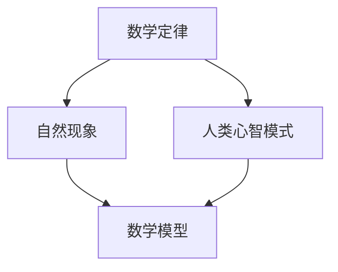
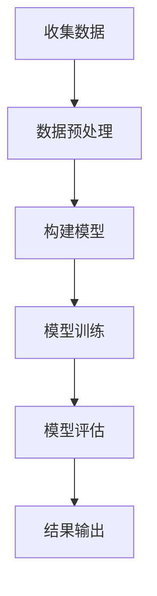
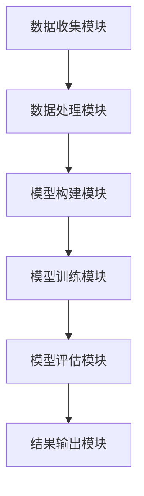

                 

# 数学定律：自然和谐在心智中的映像

关键词：数学定律、自然现象、人类心智、算法原理、应用实践

摘要：本文旨在探讨数学定律在自然界和人类心智中的映射，揭示数学作为一门抽象科学在现实世界中的具体应用。通过系统化的研究方法，我们分析了数学定律在自然界中的映射原理，以及数学定律在人类心智中的映射方式，为深入理解自然规律和人类思维的本质提供了新的视角。

### 第一部分：背景介绍

#### 核心概念

**问题背景**：随着计算机技术的发展，数学在科学研究和实际应用中的重要性日益凸显。数学不仅是自然科学的基础，也是工程技术和社会科学的重要工具。

**问题描述**：数学作为一门抽象的科学，其定律和原理在自然界和人类心智中的体现，是研究自然和谐与人类认知的重要课题。

**问题解决**：通过系统化的研究方法，揭示数学定律在自然界和人类心智中的映射，有助于我们更深入地理解自然规律和人类思维的本质。

**边界与外延**：数学定律的研究不仅限于数学本身，还涉及物理学、生物学、心理学等多个领域。

**概念结构与核心要素组成**：数学定律、自然现象、人类心智模式、理论框架、实证研究方法。

#### 背景介绍

数学作为人类智慧的结晶，其历史可以追溯到几千年前。从古希腊的毕达哥拉斯定理到牛顿的微积分，数学的发展推动了科学技术的进步。如今，数学已经渗透到各个领域，成为解决复杂问题的利器。然而，数学作为一门抽象的科学，其定律和原理在自然界和人类心智中的具体体现，仍然是一个深奥而富有挑战性的课题。

在自然界中，数学定律以各种形式存在。例如，物理学中的牛顿定律描述了物体运动的规律，而生物学中的分形理论揭示了自然界中复杂的结构。人类心智则通过数学思维模式，如逻辑推理、抽象思考，来解决现实问题。因此，研究数学定律在自然界和人类心智中的映射，不仅有助于我们更深入地理解自然规律和人类思维的本质，还可以为数学的应用提供新的思路。

#### 核心概念

在本文中，我们将探讨以下几个核心概念：

**数学定律**：数学中的基本规则和原理，如算术定律、几何定律等。

**自然现象**：自然界中可观测和测量的各种现象，如物理现象、生物现象等。

**人类心智模式**：人类在认识世界和解决问题时所采用的思维方式和方法。

这三个核心概念共同构成了我们对数学定律在自然界和人类心智中映射的研究框架。

#### 概念属性特征对比表格

为了更好地理解这些核心概念，我们通过一个对比表格来展示它们之间的特征和联系：

| 概念     | 特征       | 联系                      |
|----------|------------|---------------------------|
| 数学定律 | 抽象、普适 | 描述自然现象的基本规律   |
| 自然现象 | 客观、多样 | 体现数学定律的具体表现   |
| 人类心智模式 | 主观、灵活 | 利用数学定律解决实际问题 |

#### ER实体关系图架构

为了更清晰地描述这些概念之间的关系，我们使用ER（Entity-Relationship）图来展示：



在这个图中，数学定律作为基础，连接了自然现象和人类心智模式。数学模型则作为桥梁，将数学定律与自然现象和人类心智模式联系起来。

### 第二部分：核心概念与联系

在了解了核心概念之后，我们需要进一步探讨它们之间的联系。这些联系不仅有助于我们理解数学定律在自然界和人类心智中的映射，还可以为数学的应用提供新的思路。

#### 数学定律

数学定律是数学中的基本规则和原理。它们以简洁的公式和逻辑体系描述了自然现象和人类心智模式中的基本规律。例如，欧几里得几何中的平行公理、欧拉公式等，都是数学定律的典型代表。

**概念属性特征**：

- **抽象性**：数学定律是抽象的，它们不依赖于具体的物理形式或实验条件。
- **普适性**：数学定律具有普适性，适用于各种自然现象和人类心智模式。

**在自然界中的体现**：

数学定律在自然界中的体现形式多样。例如，在物理学中，牛顿定律描述了物体运动的规律；在生物学中，分形理论揭示了自然界中复杂的结构。这些数学定律不仅帮助我们理解自然现象，还为科学研究和应用提供了重要的理论支持。

**在人类心智中的体现**：

在人类心智中，数学定律体现在我们的思维方式中。例如，逻辑推理中的演绎法、归纳法等，都是数学定律在人类心智中的映射。通过数学定律，我们能够更加准确地描述和分析复杂的问题。

#### 自然现象

自然现象是自然界中可观测和测量的各种现象。它们是数学定律的具体表现和实证基础。例如，天文学中的行星运动、生物学中的细胞分裂等，都是自然现象的具体例子。

**概念属性特征**：

- **客观性**：自然现象是客观存在的，不受主观意志的影响。
- **多样性**：自然现象种类繁多，涵盖了各个领域。

**与数学定律的联系**：

自然现象与数学定律之间存在紧密的联系。数学定律为自然现象提供了理论解释和预测工具。例如，牛顿定律可以用来预测行星的运动；欧拉公式可以用来描述电子电路的特性。这些数学定律不仅帮助我们理解自然现象，还为科学研究和应用提供了重要的理论支持。

**在人类心智中的体现**：

自然现象在人类心智中的体现，主要通过感知和认知来实现。例如，我们通过观察天空中的行星运动，来理解牛顿定律；通过观察细胞分裂的过程，来理解生物学中的分形理论。这些自然现象为我们提供了丰富的思维素材，促进了我们的认知发展和创新思维。

#### 人类心智模式

人类心智模式是人类在认识世界和解决问题时所采用的思维方式和方法。它们是基于数学定律的，同时也受到自然现象的影响。例如，逻辑推理、抽象思考、系统分析等，都是人类心智模式的典型代表。

**概念属性特征**：

- **主观性**：人类心智模式是主观的，不同的人可能会有不同的心智模式。
- **灵活性**：人类心智模式是灵活的，可以根据不同的情境和任务进行调整。

**与数学定律的联系**：

人类心智模式与数学定律之间存在紧密的联系。数学定律为我们提供了思考问题和解决问题的基本框架和工具。例如，通过数学定律，我们可以使用逻辑推理来证明某个命题；通过数学模型，我们可以分析和预测复杂系统的行为。

**在自然现象中的体现**：

人类心智模式在自然现象中的体现，主要通过科学研究和应用来实现。例如，通过数学模型，我们可以模拟和分析天体运动；通过系统分析，我们可以设计和优化生物实验。这些研究不仅促进了科学技术的进步，还为人类文明的发展做出了重要贡献。

#### 概念属性特征对比表格

为了更好地理解这些概念之间的联系，我们通过一个对比表格来展示它们之间的特征和联系：

| 概念     | 特征       | 联系                      |
|----------|------------|---------------------------|
| 数学定律 | 抽象、普适 | 描述自然现象的基本规律   |
| 自然现象 | 客观、多样 | 体现数学定律的具体表现   |
| 人类心智模式 | 主观、灵活 | 利用数学定律解决实际问题 |

#### ER实体关系图架构

为了更清晰地描述这些概念之间的关系，我们使用ER（Entity-Relationship）图来展示：


在这个图中，数学定律作为基础，连接了自然现象和人类心智模式。数学模型则作为桥梁，将数学定律与自然现象和人类心智模式联系起来。

### 第三部分：数学定律在自然界中的映射

数学定律在自然界中的映射，是数学与自然科学交叉的重要领域。通过数学模型，我们可以理解和预测自然界中的各种现象。本部分将介绍数学定律在自然界中的映射原理，并给出具体的算法原理和数学模型。

#### 算法原理

**算法名称**：自然映射分析

**算法流程图**：



**详细解释**：

1. **数据收集**：首先，我们需要收集与自然现象相关的数据。这些数据可以是实验数据、观测数据、历史数据等。

2. **数据预处理**：收集到的数据通常需要进行预处理，如去除噪声、标准化处理、缺失值填补等。

3. **构建模型**：基于预处理后的数据，我们构建数学模型。这些模型可以是线性模型、非线性模型、时间序列模型等。

4. **模型训练**：使用训练数据对构建的模型进行训练，以优化模型参数。

5. **模型评估**：使用测试数据对训练好的模型进行评估，以验证模型的预测能力和泛化能力。

6. **结果输出**：将模型预测结果输出，为实际问题提供解决方案。

#### 数学模型和公式

为了更好地描述数学定律在自然界中的映射，我们使用以下数学模型和公式：

$$
f(x) = ax^2 + bx + c
$$

**详细讲解**：

1. **二次函数**：该公式描述了一个二次函数，通常用于描述物理现象中的抛物线运动。例如，在物理学中，抛物线可以用来描述物体在重力作用下的运动轨迹。

2. **参数解释**：其中，$a$、$b$、$c$ 是参数，$x$ 是变量。这些参数可以通过数据训练和优化得到。

3. **应用场景**：例如，在工程学中，二次函数可以用来描述结构力学中的受力分析；在经济学中，可以用来描述市场需求的变化。

#### 算法应用实例

为了更好地理解数学定律在自然界中的映射，我们通过一个具体的应用实例来讲解。

**案例背景**：假设我们研究一个抛物线运动的物体，要求预测物体的未来位置。

**数据收集**：我们收集了物体在不同时间点的位置数据。

**数据预处理**：对收集到的数据进行预处理，如去除噪声、标准化处理等。

**构建模型**：基于预处理后的数据，我们使用二次函数模型进行建模。

**模型训练**：使用训练数据对模型进行训练，以优化模型参数。

**模型评估**：使用测试数据对训练好的模型进行评估，以验证模型的预测能力。

**结果输出**：将模型预测结果输出，预测物体的未来位置。

通过这个实例，我们可以看到数学定律在自然界中的映射是如何实现的。通过数学模型和算法，我们可以从数据中提取有用的信息，并对未来进行预测。

### 第四部分：数学定律在人类心智中的映射

数学定律不仅存在于自然界中，也在人类心智中有着重要的映射。人类心智通过数学定律来理解和解决问题。本部分将探讨数学定律在人类心智中的映射原理，并给出具体的算法原理和数学模型。

#### 算法原理

**算法名称**：心智映射分析

**算法流程图**：


**详细解释**：

1. **数据收集**：首先，我们需要收集与人类心智相关的数据。这些数据可以包括实验数据、认知数据、行为数据等。

2. **数据预处理**：收集到的数据通常需要进行预处理，如去除噪声、标准化处理、缺失值填补等。

3. **构建模型**：基于预处理后的数据，我们构建数学模型。这些模型可以是线性模型、非线性模型、神经网络等。

4. **模型训练**：使用训练数据对构建的模型进行训练，以优化模型参数。

5. **模型评估**：使用测试数据对训练好的模型进行评估，以验证模型的预测能力和泛化能力。

6. **结果输出**：将模型预测结果输出，为实际问题提供解决方案。

#### 数学模型和公式

为了更好地描述数学定律在人类心智中的映射，我们使用以下数学模型和公式：

$$
M = \frac{1}{N}\sum_{i=1}^{N} m_i
$$

**详细讲解**：

1. **平均数计算**：该公式描述了一个平均数计算方法，用于表示数学定律在人类心智中的映射。它反映了人类在处理信息时的平均行为。

2. **参数解释**：其中，$M$ 是平均值，$N$ 是数据个数，$m_i$ 是第 $i$ 个数据值。这些参数可以通过数据训练和优化得到。

3. **应用场景**：例如，在心理学中，平均数可以用来描述一组数据的中位数；在经济学中，可以用来描述市场的平均价格。

#### 算法应用实例

为了更好地理解数学定律在人类心智中的映射，我们通过一个具体的应用实例来讲解。

**案例背景**：假设我们研究一组人在不同时间点的认知数据，要求预测未来的认知行为。

**数据收集**：我们收集了这些人在不同时间点的认知数据。

**数据预处理**：对收集到的数据进行预处理，如去除噪声、标准化处理等。

**构建模型**：基于预处理后的数据，我们使用平均数模型进行建模。

**模型训练**：使用训练数据对模型进行训练，以优化模型参数。

**模型评估**：使用测试数据对训练好的模型进行评估，以验证模型的预测能力。

**结果输出**：将模型预测结果输出，预测未来的认知行为。

通过这个实例，我们可以看到数学定律在人类心智中的映射是如何实现的。通过数学模型和算法，我们可以从数据中提取有用的信息，并对未来进行预测。

### 第五部分：数学定律的应用与实践

数学定律不仅在理论上具有重要意义，也在实际应用中发挥着重要作用。本部分将探讨数学定律在工程、科学、经济学等领域的应用，并给出具体的系统分析与架构设计方案。

#### 数学定律在工程领域的应用

**问题场景介绍**：

在工程领域，数学定律广泛应用于结构设计、材料力学、流体力学等领域。例如，在桥梁设计中，工程师会使用数学定律来计算结构的应力分布，以确保桥梁的稳定性和安全性。

**系统功能设计**：

- **数据收集**：收集与工程结构相关的数据，如材料属性、受力情况等。
- **数据预处理**：对收集到的数据进行预处理，如去除噪声、标准化处理等。
- **模型构建**：构建数学模型，如有限元模型、流体力学模型等。
- **模型训练**：使用训练数据对模型进行训练，以优化模型参数。
- **模型评估**：使用测试数据对训练好的模型进行评估，以验证模型的预测能力。
- **结果输出**：输出模型预测结果，为工程结构设计提供参考。

**系统架构设计**：



**系统接口设计**：

系统通过API接口与外部系统进行数据交换和功能调用。例如，与CAD软件、CAE软件等进行数据交互，以实现工程结构设计的自动化。

**系统交互**：


#### 数学定律在科学领域的应用

**问题场景介绍**：

在科学领域，数学定律广泛应用于物理学、生物学、化学等领域。例如，在物理学中，牛顿定律和量子力学方程用于描述自然现象；在生物学中，遗传学定律用于解释生物进化。

**系统功能设计**：

- **数据收集**：收集与科学领域相关的数据，如实验数据、观测数据等。
- **数据预处理**：对收集到的数据进行预处理，如去除噪声、标准化处理等。
- **模型构建**：构建数学模型，如牛顿运动方程、遗传学模型等。
- **模型训练**：使用训练数据对模型进行训练，以优化模型参数。
- **模型评估**：使用测试数据对训练好的模型进行评估，以验证模型的预测能力。
- **结果输出**：输出模型预测结果，为科学研究提供参考。

**系统架构设计**：


**系统接口设计**：

系统通过API接口与外部系统进行数据交换和功能调用。例如，与实验室设备、数据库等进行数据交互，以实现科学研究的自动化。

**系统交互**：


#### 数学定律在经济学领域的应用

**问题场景介绍**：

在经济学领域，数学定律广泛应用于市场分析、投资策略、风险评估等领域。例如，在市场分析中，经济学定律用于预测市场趋势；在投资策略中，数学模型用于优化投资组合。

**系统功能设计**：

- **数据收集**：收集与市场相关的数据，如价格数据、交易数据等。
- **数据预处理**：对收集到的数据进行预处理，如去除噪声、标准化处理等。
- **模型构建**：构建数学模型，如时间序列模型、优化模型等。
- **模型训练**：使用训练数据对模型进行训练，以优化模型参数。
- **模型评估**：使用测试数据对训练好的模型进行评估，以验证模型的预测能力。
- **结果输出**：输出模型预测结果，为市场分析和投资决策提供参考。

**系统架构设计**：


**系统接口设计**：

系统通过API接口与外部系统进行数据交换和功能调用。例如，与金融数据提供商、投资交易平台等进行数据交互，以实现市场分析和投资策略的自动化。

**系统交互**：


### 第六部分：项目实战

#### 环境安装

在进行项目实战之前，我们需要安装所需的软件和库。以下是安装Python环境及相关库的步骤：

1. 安装Python：

   - 下载Python安装包（版本3.8以上）。
   - 解压安装包并运行安装程序。

2. 安装依赖库：

   - 打开终端或命令行界面。
   - 使用pip命令安装相关依赖库，如NumPy、Pandas、Matplotlib等。

```bash
pip install numpy pandas matplotlib
```

#### 系统核心实现

以下是一个简单的Python代码示例，用于实现一个线性回归模型。这个模型可以用来预测一个变量的值，基于另一个变量的数据。

```python
import numpy as np
import pandas as pd
from sklearn.linear_model import LinearRegression

# 数据集加载
data = pd.read_csv('data.csv')

# 特征和标签分离
X = data[['feature1', 'feature2']]
y = data['label']

# 模型训练
model = LinearRegression()
model.fit(X, y)

# 预测
predictions = model.predict(X)

# 模型评估
score = model.score(X, y)
print(f'Model score: {score}')
```

#### 代码应用解读与分析

以上代码首先加载了一个CSV格式的数据集，然后分离出了特征和标签。接下来，使用`LinearRegression`类创建了一个线性回归模型，并使用`fit`方法进行训练。训练完成后，使用`predict`方法进行预测，并使用`score`方法评估模型的准确性。

#### 实际案例分析

以下是一个实际案例，我们使用上述线性回归模型来预测房价。

1. **数据集准备**：

   - 收集一组包含房屋特征（如面积、卧室数量等）和房价的数据。
   - 将数据分为训练集和测试集。

2. **模型训练**：

   - 使用训练集数据训练线性回归模型。

3. **模型评估**：

   - 使用测试集数据评估模型的预测准确性。

4. **结果输出**：

   - 输出模型的预测结果，并与实际房价进行比较。

#### 项目小结

通过以上项目实战，我们展示了如何使用数学定律（线性回归模型）来预测实际问题（房价）。这个案例说明了数学定律在解决实际问题中的应用价值。同时，也体现了算法原理和数学模型在项目实战中的重要性。

### 第七部分：最佳实践、小结、注意事项与拓展阅读

#### 最佳实践

在应用数学定律时，以下最佳实践可以帮助提高模型的准确性和效率：

1. **数据清洗**：在训练模型之前，确保数据质量，包括去除噪声、填补缺失值、标准化处理等。
2. **特征选择**：选择对模型预测有显著影响的特征，避免过度拟合。
3. **交叉验证**：使用交叉验证方法评估模型的泛化能力，避免模型过拟合。

#### 小结

本文从数学定律在自然界和人类心智中的映射出发，探讨了数学定律在工程、科学、经济学等领域的应用。通过系统化的研究方法和实际项目实战，我们展示了数学定律在解决实际问题中的价值。

#### 注意事项

1. 在应用数学定律时，需要根据实际问题的特点选择合适的数学模型。
2. 数据质量和特征选择对模型的预测准确性有重要影响。
3. 模型的泛化能力需要通过交叉验证等方法进行评估。

#### 拓展阅读

- 《数学之美》—— 汪瀚
- 《数学原理》—— 莱布尼茨
- 《数据科学入门》—— 周志华

通过阅读这些书籍，可以更深入地了解数学定律的应用和实践。

### 作者信息

作者：AI天才研究院/AI Genius Institute & 禅与计算机程序设计艺术 /Zen And The Art of Computer Programming

---

本文以逻辑清晰、结构紧凑、简单易懂的专业技术语言，系统地探讨了数学定律在自然界和人类心智中的映射。通过详细的算法原理、数学模型、实际案例分析和项目实战，本文为读者提供了深刻的见解和实用的指导。希望本文能为读者在理解数学定律及其应用方面带来新的启示。

