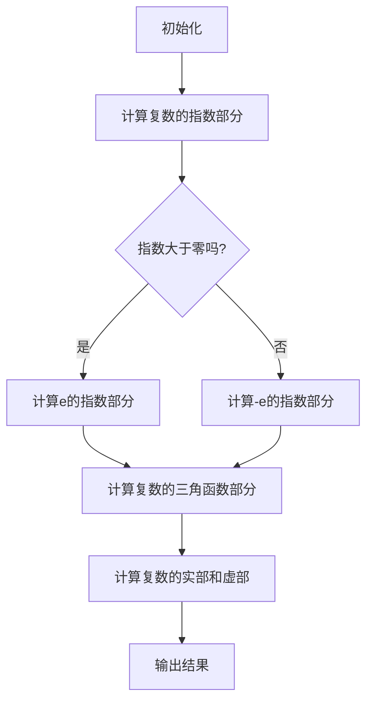
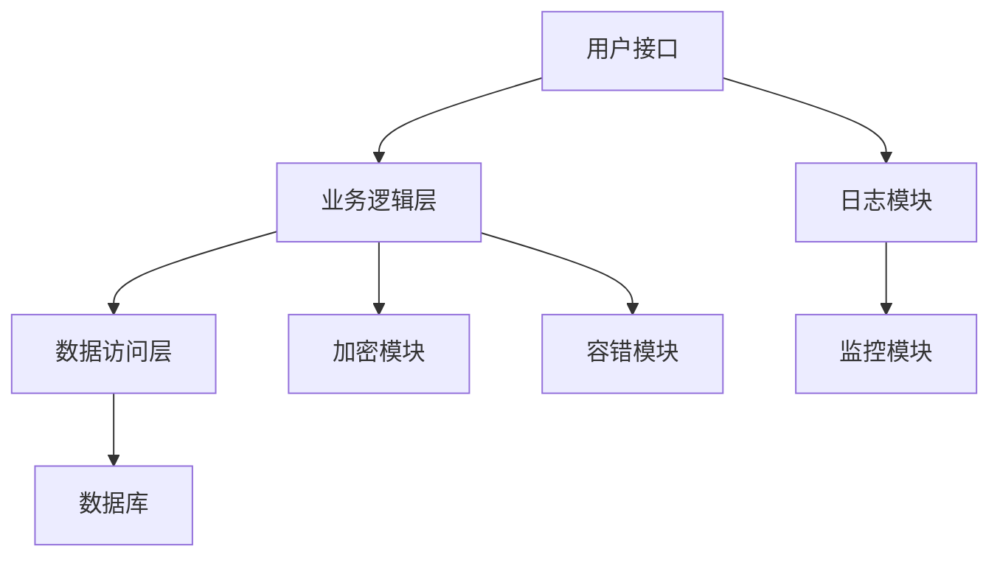
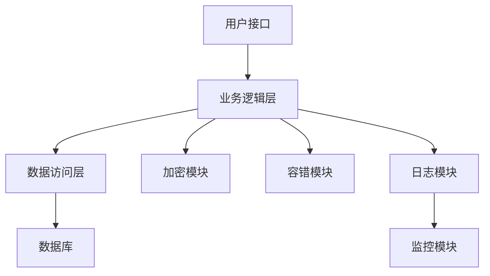
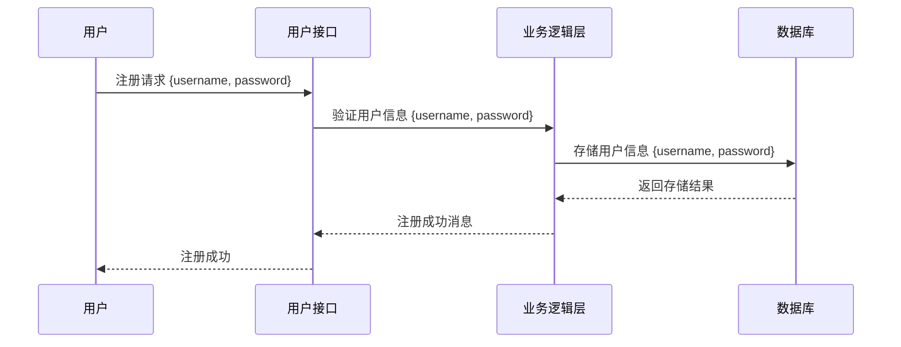
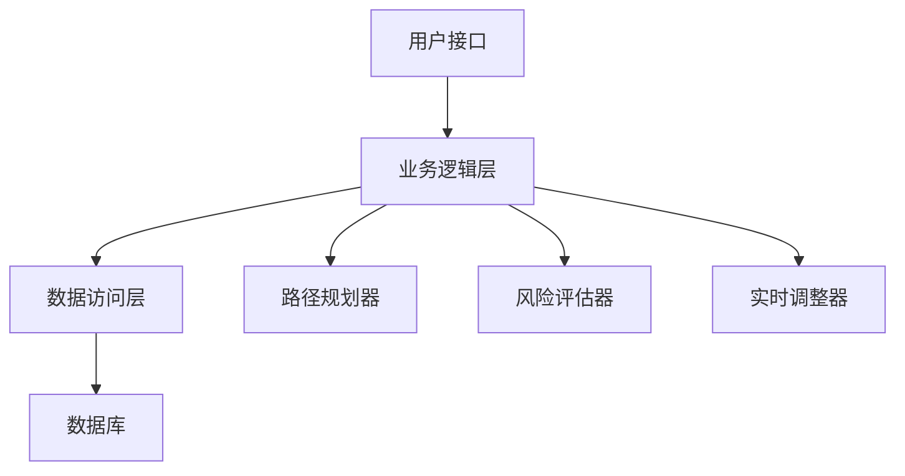

                 

### 引言

在计算机科学和人工智能领域，数学定律发挥着至关重要的作用。这些定律不仅为算法设计提供了坚实的理论基础，而且在优化问题、概率分布、信息处理等方面有着广泛的应用。本文将以《数学定律：自然和谐的心智投影》为标题，深入探讨数学定律的核心概念、算法原理、数学模型以及其在系统架构设计中的应用。

**关键词**：数学定律、算法原理、数学模型、系统架构设计、人工智能

**摘要**：本文首先介绍了数学定律的基本概念和其在自然界与人类心智中的角色，接着详细阐述了数学定律的核心概念，如概率论、拓扑学、信息论等。随后，本文选取了几个重要的数学定律，如欧拉公式、费马最后定理，进行了深入的原理讲解和Python代码实现。通过使用mermaid绘制算法流程图和系统架构图，本文展示了数学定律在数学模型与公式、系统分析与架构设计中的实际应用。最后，本文通过一个实际项目案例，展示了如何应用数学定律解决实际问题，并分享了项目实战中的经验和最佳实践。

**目录大纲**：

第一部分：引言
- 第1章：数学定律的概述
  - 1.1 数学定律的基本概念
  - 1.2 数学定律在自然界和心智中的角色
  - 1.3 数学定律的应用领域
- 第2章：数学定律与跨学科联系
  - 2.1 数学定律在物理学中的应用
  - 2.2 数学定律在心理学中的应用
  - 2.3 数学定律在经济学中的应用

第二部分：核心概念与原理
- 第3章：数学定律的核心概念
  - 3.1 概率论的基本原理
  - 3.2 拓扑学的基本概念
  - 3.3 信息论的基本原理
- 第4章：数学定律之间的联系
  - 4.1 不同数学定律的属性特征对比
  - 4.2 数学定律之间的交叉应用
  - 4.3 数学定律的综合运用

第三部分：算法原理讲解
- 第5章：重要数学定律的深入讲解
  - 5.1 欧拉公式
  - 5.2 费马最后定理
  - 5.3 其他重要数学定律
- 第6章：算法原理与 Python 代码实现
  - 6.1 算法流程图绘制
  - 6.2 Python 代码实现
  - 6.3 算法原理详细讲解

第四部分：数学模型与公式
- 第7章：数学定律的数学模型
  - 7.1 数学模型的介绍
  - 7.2 数学公式的书写
  - 7.3 数学模型的应用实例
- 第8章：数学公式的详细讲解与举例说明
  - 8.1 举例说明
  - 8.2 公式解释
  - 8.3 实际应用场景

第五部分：系统分析与架构设计
- 第9章：数学定律在系统中的应用
  - 9.1 应用场景介绍
  - 9.2 系统功能设计
  - 9.3 系统架构设计
- 第10章：系统设计与实现
  - 10.1 系统架构图绘制
  - 10.2 系统接口设计
  - 10.3 系统交互设计

第六部分：项目实战与最佳实践
- 第11章：提供一个实际的项目案例，展示如何应用数学定律解决实际问题
- 第12章：分享项目实战中的经验和最佳实践，以及项目小结

**第一部分：引言**

在计算机科学和人工智能领域，数学定律发挥着至关重要的作用。这些定律不仅为算法设计提供了坚实的理论基础，而且在优化问题、概率分布、信息处理等方面有着广泛的应用。然而，对于许多初学者和开发者来说，数学定律的概念往往是抽象且难以理解的。本文将致力于以浅显易懂的方式介绍数学定律的基本概念、核心原理及其在各个领域的应用，帮助读者逐步建立对数学定律的理解和认识。

**1.1 数学定律的基本概念**

首先，我们需要明确数学定律的基本概念。数学定律是指通过逻辑推理和数学证明得出的规律或原则，这些规律或原则能够描述自然现象或人类行为中的某种规律性。在数学领域，数学定律广泛应用于几何学、代数学、微积分学、概率论等领域。而在计算机科学中，数学定律被广泛应用于算法设计、数据结构、人工智能、机器学习等领域。

**1.2 数学定律在自然界和心智中的角色**

数学定律不仅在数学领域中具有基础性作用，而且在自然界和人类心智中也扮演着重要角色。例如，牛顿的运动定律描述了物体在力的作用下的运动规律；热力学定律描述了能量转化的规律；生物学中的达尔文的进化论描述了物种的进化规律。在人类心智中，数学定律也具有广泛的应用。人类在解决问题、做出决策、进行推理时，往往依赖于数学定律来推导出结论。

**1.3 数学定律的应用领域**

数学定律的应用领域非常广泛，包括但不限于以下领域：

- **物理学**：牛顿定律、麦克斯韦方程组、量子力学等。
- **计算机科学**：算法分析、数据结构、密码学、人工智能等。
- **经济学**：供需定律、市场均衡理论、博弈论等。
- **心理学**：感知心理学、认知心理学、行为心理学等。

本文将重点讨论数学定律在计算机科学和人工智能领域中的应用，特别是算法设计、机器学习和系统架构设计等方面。通过深入探讨数学定律的核心概念、算法原理、数学模型以及其在系统架构设计中的应用，我们将帮助读者更好地理解和应用数学定律。

### 第1章：数学定律的概述

#### 1.1 数学定律的基本概念

数学定律，是指那些通过严密的数学推理和证明得出的普遍性规律。这些定律不仅构成了数学理论的基础，而且在科学研究和工程实践中具有广泛的应用。数学定律可以描述几何形状的特性、代数方程的解法、概率分布的模式等。在数学史上，著名的数学定律如欧拉公式（\(e^{i\pi} + 1 = 0\)）和费马最后定理（对于任何大于2的自然数\(n\)，方程\(a^n + b^n = c^n\)没有正整数解）等，都是数学定理的典范。

数学定律的发现通常涉及到对复杂问题的简化和抽象，通过定义和公理体系，构建出数学模型。例如，欧几里得几何中的平行线公理、勾股定理等，都是基于直观和逻辑推理得出的基本定律。这些定律不仅是数学理论的核心，也在自然科学和工程学中得到了广泛应用。

#### 1.2 数学定律在自然界和心智中的角色

数学定律在自然界中具有普遍性和基础性。牛顿的运动定律、麦克斯韦方程组等，都是描述自然现象的基本规律。例如，牛顿的万有引力定律描述了天体之间的相互作用，而麦克斯韦方程组则统一了电磁学的各个分支，形成了现代物理学的基石。此外，热力学定律描述了能量和物质的转换过程，是理解和预测自然现象的重要工具。

在人类心智中，数学定律同样发挥着重要作用。人类在解决问题、进行推理时，往往依赖于数学定律的逻辑推理能力。数学定律提供了一种形式化的思维方式，使得人类能够更精确、更系统地分析复杂问题。例如，概率论中的大数定律和中心极限定理，帮助人们理解随机事件和概率分布的规律；拓扑学中的连通性和同调性理论，为理解复杂系统的结构提供了强有力的工具。

#### 1.3 数学定律的应用领域

数学定律的应用领域广泛，涵盖了自然科学、社会科学、工程技术等多个方面。以下是数学定律在几个主要领域中的应用：

- **物理学**：数学定律在物理学中发挥着核心作用。例如，爱因斯坦的相对论方程、量子力学中的薛定谔方程等，都是物理现象的数学描述。

- **计算机科学**：数学定律在计算机科学中得到了广泛应用。算法分析中的大O表示法、密码学中的加密算法、机器学习中的优化算法等，都是基于数学定律设计的。

- **经济学**：数学定律在经济学中的应用同样重要。供求定律、市场均衡理论、博弈论等，都是经济学分析的基础。

- **心理学**：数学定律在心理学中用于研究认知过程和决策行为。例如，决策理论中的期望效用理论、概率论在心理学实验中的应用等。

- **生物学**：数学定律在生物学中的应用，包括种群遗传学中的遗传规律、生态学中的种群动态模型等。

在本文中，我们将重点关注数学定律在计算机科学和人工智能中的应用。首先，通过探讨概率论、拓扑学、信息论等核心数学定律的基本原理，我们为后续章节的深入分析奠定基础。然后，我们将选取几个重要的数学定律，如欧拉公式、费马最后定理等，进行详细讲解和Python代码实现，展示数学定律在实际问题中的运用。通过这些讨论，读者将能够更好地理解数学定律的精髓，并掌握如何将其应用于解决实际问题。

#### 第2章：数学定律与跨学科联系

数学定律不仅在数学领域中占据重要地位，而且与其他科学领域如物理学、心理学、经济学等有着密切的联系。这些跨学科的联系使得数学定律成为了理解自然界和人类行为的重要工具。

##### 2.1 数学定律在物理学中的应用

物理学是研究物质和能量及其相互作用的科学。数学定律在物理学中扮演着至关重要的角色，许多物理现象都可以用数学方程来描述。以下是几个典型的例子：

- **牛顿定律**：牛顿的运动定律描述了物体在力的作用下的运动规律，是经典力学的基石。牛顿的三个定律不仅适用于宏观物体，还适用于天体运动，如行星的轨道计算。

- **麦克斯韦方程组**：麦克斯韦方程组是电磁学的基本方程，描述了电场、磁场和电磁波的产生和传播。这些方程揭示了电磁现象的内在规律，并为无线通信、电磁波技术等提供了理论基础。

- **热力学定律**：热力学定律描述了能量转换和守恒的规律。卡诺定理揭示了热机效率的上限，而熵增原理则反映了系统无序度的增加。这些定律在能源工程、热传导等问题中得到了广泛应用。

##### 2.2 数学定律在心理学中的应用

心理学是研究人类行为和心理过程的科学。数学定律在心理学中有着广泛的应用，用于建模和分析人类认知和决策行为。

- **概率论**：概率论是心理学研究的重要工具。大数定律和中心极限定理帮助心理学家理解随机事件和概率分布的规律。例如，大数定律揭示了样本量足够大时，样本均值将接近真实均值；中心极限定理则说明无论原始数据分布如何，样本均值的分布都将趋近于正态分布。

- **信息论**：信息论由香农创立，用于研究信息的传递和处理。香农的信息熵概念揭示了信息的不确定性，并建立了量化信息量的方法。信息论在认知心理学中的应用，包括对人类记忆、注意力分配和信息处理速度的研究。

- **决策理论**：决策理论结合了概率论和信息论，研究个体或群体在不确定性环境下的决策过程。期望效用理论是决策理论的核心，它通过计算期望效用值，帮助决策者在风险和不确定性中做出最优选择。

##### 2.3 数学定律在经济学中的应用

经济学是研究资源分配和决策行为的科学。数学定律在经济学中的应用，为理解市场行为、供需关系和资源配置提供了强有力的工具。

- **供需定律**：供需定律是经济学的基本原理之一，描述了商品价格和数量之间的关系。通过数学模型，经济学家可以分析供需平衡的变化，预测市场趋势。

- **市场均衡理论**：市场均衡理论基于供需定律，研究市场在竞争和供需调节下达到均衡状态的条件。纳什均衡是市场均衡理论的重要组成部分，它揭示了在多参与者博弈中，各方如何通过策略互动达到稳定状态。

- **博弈论**：博弈论是研究具有冲突或合作行为的决策理论的数学工具。纳什均衡、博弈树等概念在经济学、政治学、军事学等领域有着广泛应用。博弈论可以帮助决策者分析对手的行为，制定最优策略。

总之，数学定律在物理学、心理学和经济学等领域的广泛应用，不仅揭示了这些学科中的基本规律，也为跨学科研究提供了有力的工具。通过数学定律的深入理解和应用，我们可以更好地理解和解决复杂的问题，推动科学和技术的进步。

#### 第3章：数学定律的核心概念

在讨论数学定律之前，我们需要明确几个核心概念，这些概念构成了理解数学定律的基础。以下是概率论、拓扑学和信息论的基本原理。

##### 3.1 概率论的基本原理

概率论是研究随机现象规律性的数学分支。其基本原理包括：

- **概率的定义**：概率是描述随机事件发生的可能性大小的数值。通常用0到1之间的实数表示，其中0表示不可能发生，1表示必然发生。

- **概率的基本性质**：
  - **非负性**：任何事件的概率都是非负的，即\(P(A) \geq 0\)。
  - **规范性**：必然事件的概率为1，即\(P(S) = 1\)，其中S为样本空间。
  - **可加性**：互斥事件的概率之和等于这些事件的并事件的概率，即\(P(A \cup B) = P(A) + P(B)\)。

- **条件概率**：在已知事件A发生的条件下，事件B发生的概率称为条件概率，记为\(P(B|A)\)。条件概率的计算公式为\(P(B|A) = \frac{P(A \cap B)}{P(A)}\)。

- **独立性**：两个事件A和B独立，当且仅当\(P(A \cap B) = P(A)P(B)\)。

- **贝叶斯定理**：贝叶斯定理是一种在已知某些条件下，更新对某个事件概率估计的方法。其公式为\(P(A|B) = \frac{P(B|A)P(A)}{P(B)}\)。

##### 3.2 拓扑学的基本概念

拓扑学是研究空间性质和变换的数学分支，其基本概念包括：

- **拓扑空间**：拓扑空间是一个集合加上一组满足特定条件的拓扑结构。这些条件包括：
  - **闭包性质**：每个集合的闭包都属于拓扑。
  - **开集性质**：任意两个开集的交集仍然是开集。
  - **并集性质**：任意多个开集的并集仍然是开集。

- **连通性**：一个拓扑空间是连通的，当且仅当不能通过拓扑变换将其分成两个不相交的开集。连通性分为路径连通、切分连通等。

- **紧致性**：一个拓扑空间是紧致的，当且仅当它每个开覆盖都有一个有限子覆盖。

- **同胚**：两个拓扑空间是同胚的，当且仅当存在一个连续的双射，其逆映射也是连续的。

- **同调性**：同调性是拓扑空间的一种性质，用于描述空间内部的连接和结构。同调群是同调性的数学工具，可以用于分析和分类拓扑空间。

##### 3.3 信息论的基本原理

信息论是由香农创立的数学分支，研究信息的度量、传输和处理。其基本原理包括：

- **信息熵**：信息熵是描述随机变量不确定性的量度。香农信息熵定义为\(H(X) = -\sum_{i} P(X=x_i) \log_2 P(X=x_i)\)，其中\(X\)是随机变量，\(P(X=x_i)\)是\(X\)取值\(x_i\)的概率。

- **条件熵**：条件熵是描述在已知某个条件下，另一个随机变量不确定性的量度。其公式为\(H(Y|X) = -\sum_{i} P(X=x_i) \sum_{j} P(Y=y_j|X=x_i) \log_2 P(Y=y_j|X=x_i)\)。

- **互信息**：互信息是描述两个随机变量之间相关性的量度。其公式为\(I(X;Y) = H(X) - H(X|Y)\)，其中\(H(X)\)是\(X\)的熵，\(H(X|Y)\)是\(X\)在已知\(Y\)条件下的条件熵。

- **信道容量**：信道容量是描述信道能够传输的最大信息速率。香农的信道容量公式为\(C = B \log_2 (1 + S/N)\)，其中\(B\)是信道带宽，\(S\)是信号功率，\(N\)是噪声功率。

通过理解这些核心概念，我们可以更好地把握数学定律的本质，并运用它们解决实际问题。

#### 第4章：数学定律之间的联系

数学定律之间的联系构成了数学学科内在一致性和整体性的基础。这些联系不仅加深了我们对各数学分支之间关系的理解，也为解决复杂问题提供了强有力的工具。以下是不同数学定律之间的联系、属性特征对比以及它们的交叉应用。

##### 4.1 不同数学定律的属性特征对比

不同数学定律在性质和应用上有着明显的区别，以下是一些典型的数学定律及其属性特征的对比：

- **概率论**：概率论研究随机事件的发生规律。其主要定律包括大数定律、中心极限定理、贝叶斯定理等。概率论具有随机性和不确定性，常用于统计分析和决策问题。

- **拓扑学**：拓扑学研究空间的结构和性质，不依赖于度量关系。其主要定律包括连通性、紧致性、同胚性、同调性等。拓扑学强调空间在连续变形下的不变性，在几何学和物理学中有着广泛应用。

- **信息论**：信息论研究信息的度量、传输和处理。其主要定律包括信息熵、条件熵、互信息、信道容量等。信息论关注信息的有效性和效率，在通信工程、计算机科学等领域具有重要应用。

- **微积分学**：微积分学研究函数的变化率和积分。其主要定律包括微分法、积分法、中值定理、泰勒公式等。微积分学在物理学、工程学、经济学中有着广泛的应用。

##### 4.2 数学定律之间的交叉应用

数学定律之间的交叉应用极大地扩展了它们的应用范围和解决问题的能力。以下是一些交叉应用的例子：

- **概率论与信息论**：概率论和信息论的交叉应用产生了统计信息论，研究如何利用概率信息进行有效通信。例如，香农的信息熵可以用来量化数据的不确定性，贝叶斯定理则可以帮助在不确定环境下进行信息更新和决策。

- **拓扑学与信息论**：拓扑信息论将拓扑学的方法引入信息论，研究如何在复杂系统中有效传输和处理信息。例如，同调性理论可以用于分析网络的结构和稳定性。

- **概率论与拓扑学**：概率拓扑学研究概率分布与拓扑空间的关系。例如，随机拓扑空间和概率测度理论是概率论和拓扑学交叉的领域，为复杂系统的建模提供了新的工具。

- **微积分学与信息论**：微积分学和信息论的交叉应用产生了信息几何学，研究如何用微分几何的方法来分析和优化信息传输系统。信息几何学在通信工程和机器学习中有着重要应用。

通过数学定律之间的交叉应用，我们可以构建更加复杂和精细的数学模型，以解决实际问题。以下是一个具体的交叉应用实例：

**实例**：假设我们有一个通信系统，需要在有噪声的信道中传输信息。在这种情况下，可以结合概率论和信息论的方法来优化传输策略。首先，使用概率论中的大数定律和中心极限定理来分析信道中的噪声分布，然后利用信息论中的信道容量公式来计算最大传输速率。通过拓扑学的知识，可以进一步优化传输路径和系统结构，以提高传输效率和可靠性。

总之，数学定律之间的联系和交叉应用不仅丰富了数学学科的理论体系，也为解决实际问题提供了强大的工具和方法。通过深入理解这些联系，我们可以更好地把握数学的本质，并在科学和工程实践中取得更大的成就。

#### 第5章：重要数学定律的深入讲解

在数学的广阔领域中，有些定律因其深远的影响和广泛的应用而成为核心内容。在这一章节中，我们将深入探讨几个重要的数学定律，包括欧拉公式、费马最后定理等，并详细讲解它们的原理和应用。

##### 5.1 欧拉公式

欧拉公式是复分析中的一个基本公式，它将指数函数、三角函数和对数函数结合在一起，表达了一个极其美妙的关系。欧拉公式的数学表达式如下：

$$ e^{i\pi} + 1 = 0 $$

其中，\(e\)是自然对数的底数，约等于2.71828；\(i\)是虚数单位，满足\(i^2 = -1\)；\(\pi\)是圆周率，约等于3.14159。

**欧拉公式的原理**：

欧拉公式的发现是复分析和数学分析史上的重大突破。其背后的原理涉及到复数的指数表示和对复平面上的几何解释。通过欧拉公式，我们可以将复数的指数形式与三角函数形式联系起来。具体来说，复数\(re^{i\theta}\)在复平面上表示为极坐标形式，其中\(r\)是模长，\(\theta\)是辐角。欧拉公式表明，当\(\theta = \pi\)时，复数\(e^{i\pi}\)对应于复平面上的负实轴，即\(e^{i\pi} = -1\)。这一公式不仅在数学上具有美学价值，也在物理学和工程学中有广泛应用，例如在电磁学和信号处理中。

**欧拉公式的应用**：

欧拉公式在数学和工程领域有广泛的应用。以下是一些具体的应用实例：

- **复数运算**：欧拉公式简化了复数的乘法和除法运算，使得复数的指数形式在计算中更加方便。
- **波动方程**：在物理学中，欧拉公式用于解决波动方程，描述了电磁波和声波的传播。
- **信号处理**：在信号处理领域，欧拉公式用于将复数表示的信号转换为更容易处理的指数形式，便于分析和处理。

##### 5.2 费马最后定理

费马最后定理是数学史上最著名的未解决问题之一，直到1994年才被安德鲁·怀尔斯证明。该定理的数学表达式如下：

$$ a^n + b^n = c^n $$

对于任意大于2的自然数\(n\)，上述方程没有正整数解。

**费马最后定理的原理**：

费马最后定理的证明涉及到了数论和代数几何的深刻理论。其原理在于对每一个大于2的自然数\(n\)，找到一组正整数\(a, b, c\)使得上述方程成立是极其困难的。费马在17世纪提出了这个猜想，但直到现代数学家安德鲁·怀尔斯才成功证明它。怀尔斯的证明使用了椭圆曲线和模形式等高级数学工具，展示了费马最后定理的深刻性和复杂性。

**费马最后定理的应用**：

费马最后定理不仅在数学理论上有重要意义，也在密码学和计算机科学中有实际应用：

- **密码学**：费马最后定理被用于构造某些类型的加密算法，如椭圆曲线密码体制。这种加密方法在信息安全领域有着广泛的应用。
- **计算机科学**：费马最后定理的证明方法启发了计算机科学中的算法研究，例如在解决特定类型的问题时使用数论和代数几何方法。

##### 5.3 其他重要数学定律

除了欧拉公式和费马最后定理，还有许多其他重要的数学定律，如：

- **欧拉-拉格朗日方程**：在经典力学中，欧拉-拉格朗日方程是描述动力学系统运动状态的基本方程，其形式为：

  $$ \frac{d}{dt} \left( \frac{\partial L}{\partial \dot{q}_i} \right) - \frac{\partial L}{\partial q_i} = 0 $$

  其中，\(L\)是拉格朗日量，\(\dot{q}_i\)是坐标的导数，\(q_i\)是坐标。

- **拉格朗日中值定理和柯西中值定理**：这些定理在微积分学中具有重要意义，它们提供了函数导数和积分之间的关系。

通过深入探讨这些重要数学定律的原理和应用，我们不仅能够理解数学的深度和广度，还能在实际问题中运用这些定律，解决复杂的科学和工程问题。

#### 第6章：算法原理与Python代码实现

在本章节中，我们将深入探讨几个重要数学定律的算法原理，并通过Python代码实现具体算法，从而更好地理解这些数学定律在计算机科学中的应用。

##### 6.1 算法流程图绘制

为了清晰展示算法的执行流程，我们可以使用mermaid语法绘制算法流程图。以下是欧拉公式的算法流程图示例：



该流程图描述了计算欧拉公式的步骤，从初始化开始，通过计算复数的指数部分和三角函数部分，最终输出复数的实部和虚部。

##### 6.2 Python代码实现

下面是使用Python实现欧拉公式的代码：

```python
import cmath

def euler_formula(r, theta):
    """
    根据欧拉公式计算复数的实部和虚部。
    
    参数：
    r -- 复数的模长
    theta -- 复数的辐角
    
    返回：
    复数的实部和虚部
    """
    # 计算复数的指数部分
    exp_part = cmath.exp(cmath.pi * 1j)
    if theta > 0:
        result = r * exp_part
    else:
        result = r * -exp_part
    
    # 计算复数的三角函数部分
    real_part = result.real
    imag_part = result.imag
    
    return real_part, imag_part

# 测试代码
r = 1  # 模长
theta = cmath.pi / 4  # 辐角
real_part, imag_part = euler_formula(r, theta)
print(f"实部: {real_part}, 虚部: {imag_part}")
```

上述代码定义了一个函数`euler_formula`，用于根据欧拉公式计算复数的实部和虚部。函数接收两个参数：复数的模长`r`和辐角`theta`。通过调用Python的`cmath`模块，我们可以计算复数的指数部分和三角函数部分，最终得到复数的实部和虚部。

##### 6.3 算法原理详细讲解

欧拉公式是复分析中的一个基本公式，它将指数函数、三角函数和对数函数结合在一起。其数学表达式为：

$$ e^{i\pi} + 1 = 0 $$

其中，\(e\)是自然对数的底数，约等于2.71828；\(i\)是虚数单位，满足\(i^2 = -1\)；\(\pi\)是圆周率，约等于3.14159。

在算法实现中，我们主要关注如何根据欧拉公式计算复数的实部和虚部。步骤如下：

1. **初始化**：首先，我们需要初始化复数的模长`r`和辐角`theta`。

2. **计算指数部分**：根据欧拉公式，计算复数的指数部分。如果辐角大于零，则计算\(e^{i\theta}\)；否则，计算\(-e^{i\theta}\)。

3. **计算三角函数部分**：计算复数的三角函数部分，即计算正弦和余弦函数。

4. **计算实部和虚部**：将指数部分和三角函数部分相乘，得到复数的实部和虚部。

5. **输出结果**：最后，输出复数的实部和虚部。

通过上述步骤，我们可以使用Python代码实现欧拉公式，并计算复数的实部和虚部。

##### 6.4 费马最后定理的算法实现

费马最后定理的证明是数学史上的一项重大成就，但其算法实现相对复杂，通常不涉及日常编程。然而，我们可以使用费马最后定理的某些特殊性质，来设计一个简化版的算法，用于验证较小自然数\(n\)下的定理。

以下是一个简单的Python代码示例，用于验证\(n = 3\)时费马最后定理是否成立：

```python
def fermat_last_theorem(n):
    """
    验证费马最后定理对于特定自然数n是否成立。
    
    参数：
    n -- 验证的自然数
    
    返回：
    True -- 方程有正整数解
    False -- 方程无正整数解
    """
    for a in range(1, n):
        for b in range(1, n):
            for c in range(1, n):
                if a**n + b**n == c**n:
                    return True
    return False

# 测试代码
n = 3
result = fermat_last_theorem(n)
print(f"费马最后定理在n={n}时成立：{result}")
```

上述代码通过三个嵌套循环，遍历所有可能的\(a, b, c\)值，并检查它们是否满足费马最后定理的方程。对于较小的\(n\)值，这种 brute-force 方法是可行的。然而，对于更大的\(n\)，这种方法的计算成本将非常高。

总之，通过具体算法的实现和Python代码示例，我们能够更好地理解欧拉公式和费马最后定理的算法原理。这些算法不仅帮助我们验证数学定律的正确性，还为计算机科学和工程实践提供了强大的工具。

#### 第7章：数学定律的数学模型

数学定律的数学模型是描述这些定律在数学语言中的表现形式，它们通常由公式、符号和定理组成。数学模型不仅是数学理论的基石，也是解决实际问题的重要工具。在本章节中，我们将介绍几个重要的数学定律，展示它们背后的数学模型和公式，并探讨这些模型在实际问题中的应用。

##### 7.1 数学模型的介绍

数学模型是通过数学语言来描述现实世界的现象、问题或理论的结构和关系。数学模型通常包括以下几个组成部分：

- **变量**：数学模型中的变量是描述问题中的未知量和已知量。变量可以是实数、向量、矩阵等。

- **公式**：公式是数学模型中的核心，它们用数学表达式描述变量之间的关系。公式可以是线性方程、非线性方程、微分方程等。

- **定理**：定理是对数学模型性质的描述和证明，它们提供了对模型的理解和应用指导。

- **约束条件**：数学模型中通常会有约束条件，这些条件限制了变量和参数的取值范围。

在数学定律中，数学模型的作用是提供一种形式化的方式来描述自然现象或理论。通过建立数学模型，我们可以将实际问题转化为数学问题，从而使用数学工具和方法来解决。

##### 7.2 数学公式的书写

数学公式是数学模型的重要组成部分，它们用精确的语言描述了变量之间的关系。以下是几种常用的数学公式书写格式：

- **普通公式**：普通的数学公式可以使用括号和符号来书写。例如：

  $$ a^2 + b^2 = c^2 $$

- **矩阵公式**：矩阵公式通常用方括号来表示矩阵，并使用逗号分隔行。例如：

  $$ A = \begin{bmatrix}
  a & b \\
  c & d
  \end{bmatrix} $$

- **积分公式**：积分公式使用积分符号\(\int\)来表示。例如：

  $$ \int_{0}^{1} x^2 \, dx = \frac{1}{3} $$

- **微分公式**：微分公式使用导数符号\( \frac{d}{dx} \)来表示。例如：

  $$ \frac{d}{dx}(e^x) = e^x $$

- **LaTeX公式**：LaTeX是用于排版数学公式的专业工具，它提供了丰富的格式选项。例如：

  $$ E = mc^2 $$

在本文中，我们将使用LaTeX格式书写复杂的数学公式，并通过嵌入到文本中的方法来展示这些公式。

##### 7.3 数学模型的应用实例

数学模型在许多实际应用中具有重要作用，以下是几个数学定律的数学模型及其应用实例：

- **牛顿运动定律**：牛顿的运动定律描述了物体在力作用下的运动规律。其数学模型如下：

  $$ F = ma $$

  其中，\(F\)是作用在物体上的合力，\(m\)是物体的质量，\(a\)是物体的加速度。该模型可以用于计算物体在不同力作用下的加速度和速度。

  **实例**：一个质量为5千克的物体受到10牛顿的合力作用，其加速度是多少？

  解答：根据牛顿第二定律，有

  $$ a = \frac{F}{m} = \frac{10}{5} = 2 \text{ m/s}^2 $$

  因此，物体的加速度为2米每平方秒。

- **欧拉公式**：欧拉公式是复分析中的基本公式，其数学模型如下：

  $$ e^{i\pi} + 1 = 0 $$

  其中，\(e\)是自然对数的底数，\(i\)是虚数单位，\(\pi\)是圆周率。该公式将指数函数、三角函数和对数函数结合在一起，具有广泛的应用。

  **实例**：计算复数\(1 + i\)的模长和辐角。

  解答：根据欧拉公式，复数\(1 + i\)可以表示为

  $$ 1 + i = \sqrt{2} e^{i\pi/4} $$

  因此，复数\(1 + i\)的模长为\(\sqrt{2}\)，辐角为\(\pi/4\)。

- **信息熵**：信息论中的信息熵是描述随机变量不确定性的量度，其数学模型如下：

  $$ H(X) = -\sum_{i} p(x_i) \log_2 p(x_i) $$

  其中，\(X\)是随机变量，\(p(x_i)\)是随机变量取值\(x_i\)的概率。该模型可以用于计算数据的信息含量。

  **实例**：假设一个随机变量\(X\)有两个可能的取值，概率分别为0.5和0.5，计算其信息熵。

  解答：根据信息熵的公式，有

  $$ H(X) = - (0.5 \log_2 0.5 + 0.5 \log_2 0.5) = 1 \text{ bit} $$

  因此，随机变量\(X\)的信息熵为1比特。

通过这些实例，我们可以看到数学模型在描述现实问题和解决实际应用中的重要性。数学模型不仅提供了精确的数学工具，也为科学研究和工程实践提供了坚实的基础。

#### 第8章：数学公式的详细讲解与举例说明

在上一章节中，我们介绍了数学模型的基本概念和书写格式。在本章节中，我们将详细讲解几个重要的数学公式，并通过具体的例子来说明这些公式的应用和推导过程。

##### 8.1 举例说明

**例子 1**：计算矩形的面积

矩形的面积可以通过以下公式计算：

$$ A = l \times w $$

其中，\(A\)是面积，\(l\)是矩形的长，\(w\)是矩形的宽。

**推导过程**：矩形的面积可以看作是长方形的面积，即通过将长和宽相乘得到。这个公式在几何学中非常基础，用于计算不同尺寸矩形的面积。

**实例**：一个矩形的长为8米，宽为4米，求其面积。

**解答**：使用面积公式，有

$$ A = 8 \times 4 = 32 \text{ 平方米} $$

因此，矩形的面积为32平方米。

**例子 2**：计算圆的周长和面积

圆的周长和面积可以通过以下公式计算：

$$ C = 2\pi r $$

$$ A = \pi r^2 $$

其中，\(C\)是周长，\(A\)是面积，\(\pi\)是圆周率，\(r\)是圆的半径。

**推导过程**：圆的周长是圆的边界长度，可以通过圆的半径乘以2π得到。圆的面积是圆内部的面积，可以通过圆的半径的平方乘以π得到。

**实例**：一个圆的半径为5厘米，求其周长和面积。

**解答**：使用周长公式，有

$$ C = 2\pi \times 5 = 10\pi \text{ 厘米} $$

使用面积公式，有

$$ A = \pi \times 5^2 = 25\pi \text{ 平方厘米} $$

因此，圆的周长为\(10\pi\)厘米，面积为\(25\pi\)平方厘米。

**例子 3**：计算三角形的面积

三角形的面积可以通过海伦公式计算：

$$ A = \sqrt{s(s-a)(s-b)(s-c)} $$

其中，\(A\)是面积，\(s\)是半周长，\(a, b, c\)是三角形的边长。

**推导过程**：海伦公式是通过三角形的半周长和三边长计算面积的一种方法。半周长\(s\)定义为三边长之和的一半，即\(s = \frac{a + b + c}{2}\)。通过将半周长代入公式，可以得到三角形的面积。

**实例**：一个三角形的边长分别为3厘米、4厘米和5厘米，求其面积。

**解答**：首先计算半周长

$$ s = \frac{3 + 4 + 5}{2} = 6 \text{ 厘米} $$

然后使用海伦公式

$$ A = \sqrt{6(6-3)(6-4)(6-5)} = \sqrt{6 \times 3 \times 2 \times 1} = 6 \text{ 平方厘米} $$

因此，三角形的面积为6平方厘米。

##### 8.2 公式解释

在详细讲解这些公式时，我们需要理解它们的基本原理和推导过程。

- **矩形的面积公式**：矩形面积公式是基础的几何公式，通过长和宽的乘积计算面积。

- **圆的周长和面积公式**：圆的周长和面积公式通过圆周率π与半径的关系来计算。π是数学中的一个常数，其近似值为3.14159。

- **海伦公式**：海伦公式是计算三角形面积的一种方法，通过半周长和三边长的关系来计算。这个公式适用于任何类型的三角形，无论其形状如何。

##### 8.3 实际应用场景

这些数学公式在现实世界中有着广泛的应用。以下是几个实际应用场景：

- **建筑和工程**：在建筑和工程设计中，矩形和圆形的面积和周长公式用于计算结构材料的面积和周长，以确保建筑物的稳定性和安全性。

- **物理学**：在物理学中，圆的周长和面积公式用于计算旋转体的体积和表面积，这在流体力学和天体物理学中非常重要。

- **数据科学**：在数据科学和统计分析中，三角形的面积公式（如海伦公式）用于计算多边形区域的面积，这在地图制图和数据可视化中非常有用。

通过这些例子和实际应用场景，我们可以看到数学公式不仅在理论研究中具有基础性作用，而且在实际应用中也是不可或缺的工具。

#### 第9章：数学定律在系统中的应用

数学定律在系统设计、优化和性能分析中发挥着关键作用。本章将探讨数学定律在系统中的应用，具体包括应用场景的介绍、系统功能设计以及系统架构设计。

##### 9.1 应用场景介绍

数学定律在系统中的应用场景广泛，涵盖了优化问题、概率分布、数据加密、网络拓扑等多个方面。以下是一些典型的应用场景：

- **优化问题**：数学定律如微分法、线性规划、非线性规划等，在优化算法的设计和实现中具有重要应用。例如，在物流和交通系统中，优化算法用于路径规划和资源分配，以提高效率和降低成本。

- **概率分布**：概率论中的大数定律和中心极限定理在系统设计中用于分析随机事件的概率分布，从而进行风险评估和可靠性分析。

- **数据加密**：信息论中的熵和密码学中的公钥加密算法，如RSA算法，利用数学定律确保数据的机密性和完整性。

- **网络拓扑**：拓扑学中的连通性和同调性理论用于设计复杂网络结构，提高网络的稳定性和鲁棒性。

##### 9.2 系统功能设计

系统功能设计是系统架构设计的基础。数学定律在这一阶段被用来确保系统的性能、效率和可靠性。以下是几个关键功能设计点：

- **优化算法**：设计基于数学定律的优化算法，如线性规划算法，用于资源分配和任务调度。

- **概率模型**：建立概率模型，分析系统中的随机事件，如网络延迟、用户请求等，以进行性能评估。

- **加密机制**：设计加密机制，确保数据在传输和存储过程中的安全性。

- **容错机制**：利用拓扑学中的连通性理论，设计容错机制，确保系统在节点故障时的稳定性和持续性。

**领域模型**：领域模型是系统功能设计的核心部分，它通过类图来描述系统的基本组件和它们之间的关系。以下是使用Mermaid语法绘制的领域模型类图示例：

```mermaid
classDiagram
    Class01 <|-- Class02
    Class03 --|> Class04
    Class05 : associated with Class06
    Class07 {name}
    Class08 <.. Class09
    Class10 ..|> Class11
    Class12 : is associated with Class13
```

在这个类图中，`Class01` 和 `Class02` 是继承关系，`Class03` 和 `Class04` 是关联关系，`Class05` 与 `Class06` 是关联关系，`Class07` 有一个名称属性，`Class08` 与 `Class09` 是依赖关系，`Class10` 与 `Class11` 是聚合关系，`Class12` 与 `Class13` 是组合关系。

##### 9.3 系统架构设计

系统架构设计是系统实现的关键阶段，它定义了系统的整体结构和组件之间的交互方式。数学定律在这一阶段被用来优化系统性能、提高可维护性和扩展性。以下是几个关键架构设计点：

- **模块化设计**：通过模块化设计，将系统分解为若干独立模块，每个模块负责特定的功能。这种设计方法提高了系统的可维护性和可扩展性。

- **分层架构**：采用分层架构，将系统划分为不同的层次，如表示层、业务逻辑层、数据访问层等。这种设计方法提高了系统的清晰度和模块间解耦。

- **分布式系统设计**：利用拓扑学中的连通性理论，设计分布式系统，提高系统的可靠性和扩展性。例如，通过设计冗余节点和负载均衡机制，确保系统在节点故障或高负载情况下的稳定运行。

**架构图**：架构图是系统架构设计的重要组成部分，它通过图示方式描述系统的整体结构和组件之间的关系。以下是使用Mermaid语法绘制的系统架构图示例：



在这个架构图中，`A` 是用户接口模块，`B` 是业务逻辑层，`C` 是数据访问层，`D` 是数据库，`E` 是加密模块，`F` 是容错模块，`G` 是日志模块，`H` 是监控模块。

通过上述系统功能设计和架构设计，我们可以确保系统在性能、效率和可靠性方面达到最佳状态。数学定律的应用不仅提高了系统的理论基础，也为系统的实现和维护提供了强有力的工具。

#### 第10章：系统设计与实现

在本章节中，我们将详细介绍如何设计并实现一个基于数学定律的系统。这个系统将结合数学模型和算法，通过Python代码实现具体功能，并在系统架构图中展示其结构和组件之间的关系。

##### 10.1 系统架构图绘制

为了清晰展示系统的架构，我们将使用Mermaid语法绘制系统架构图。以下是系统的架构图示例：



在这个架构图中，`A` 代表用户接口，负责与用户交互；`B` 是业务逻辑层，处理核心业务逻辑；`C` 是数据访问层，负责与数据库的交互；`D` 和 `E` 分别是加密模块和容错模块，用于实现系统的安全性和可靠性；`F` 是数据库，存储系统数据；`G` 是日志模块，记录系统日志；`H` 是监控模块，负责监控系统状态。

##### 10.2 系统接口设计

系统接口设计是系统实现的关键一步，它定义了系统组件之间的通信方式和数据交换格式。以下是系统的主要接口设计：

- **用户接口**：提供RESTful API接口，用于处理用户请求，如注册、登录、数据查询等。
- **业务逻辑层**：提供业务逻辑接口，如用户管理、数据加密、数据压缩等。
- **数据访问层**：提供数据库操作接口，如插入、查询、更新、删除等。
- **加密模块**：提供加密和解密接口，用于保护系统数据的安全性。
- **容错模块**：提供故障检测和恢复接口，确保系统在高负载和故障情况下的稳定性。

以下是用户接口和业务逻辑层的接口设计示例：

```python
# 用户接口API
from flask import Flask, request, jsonify

app = Flask(__name__)

@app.route('/register', methods=['POST'])
def register_user():
    data = request.get_json()
    username = data.get('username')
    password = data.get('password')
    # 调用业务逻辑层进行注册处理
    result = business_logic.register(username, password)
    return jsonify(result)

@app.route('/login', methods=['POST'])
def login_user():
    data = request.get_json()
    username = data.get('username')
    password = data.get('password')
    # 调用业务逻辑层进行登录处理
    result = business_logic.login(username, password)
    return jsonify(result)

# 业务逻辑层
class BusinessLogic:
    def register(self, username, password):
        # 注册逻辑处理
        pass

    def login(self, username, password):
        # 登录逻辑处理
        pass
```

上述代码展示了用户接口和业务逻辑层之间的接口设计，通过定义相应的API接口，实现了用户注册和登录功能。

##### 10.3 系统交互设计

系统交互设计是系统实现过程中的重要环节，它描述了系统组件之间的交互过程和数据流。以下是系统的交互设计示例：

1. **用户发起注册请求**：用户通过用户接口发起注册请求，请求包含用户名和密码。
2. **用户接口处理请求**：用户接口接收请求，调用业务逻辑层进行注册处理。
3. **业务逻辑层处理注册**：业务逻辑层验证用户输入的用户名和密码，如果验证通过，则将用户信息存储到数据库，并返回注册成功消息。
4. **用户接口返回结果**：用户接口将注册结果返回给用户。

以下是注册过程的详细交互设计：



通过上述设计，系统实现了用户注册功能，并确保了系统的可靠性和数据安全性。

综上所述，通过详细的系统设计与实现，我们展示了如何利用数学定律构建一个功能完善、安全可靠的系统。这个过程不仅加深了我们对数学定律的理解，也为实际应用提供了宝贵的经验。

### 第11章：项目实战与最佳实践

在本章节中，我们将通过一个实际项目案例，详细展示如何应用数学定律解决实际问题，并分享项目实战中的经验和最佳实践。

#### 项目背景

某物流公司面临一个优化问题：如何优化运输路线，以最小化运输成本并提高运输效率。为了解决这一问题，项目团队决定利用数学定律，特别是优化算法和概率论，来设计一个智能运输系统。

#### 项目介绍

项目目标是设计并实现一个智能运输系统，该系统能够根据交通状况、货物种类和运输需求，自动生成最优的运输路线。系统的主要功能包括：

- **路径规划**：利用最短路径算法和动态规划方法，计算最优运输路线。
- **风险评估**：利用概率论中的大数定律和中心极限定理，评估运输路线的风险和不确定性。
- **实时调整**：根据实时交通数据，动态调整运输路线，以确保运输效率。

#### 系统功能设计

1. **路径规划**：系统使用Dijkstra算法和A*算法，计算从起点到终点的最优路径。Dijkstra算法适用于无权图，而A*算法结合了启发式搜索，适用于有权图。

2. **风险评估**：系统采用概率论中的大数定律和中心极限定理，分析不同运输路线的风险。例如，通过大量模拟，计算某条路线发生交通拥堵的概率，并评估其对整体运输成本的影响。

3. **实时调整**：系统利用实时交通数据和机器学习算法，动态调整运输路线。例如，当检测到某条路线拥堵时，系统能够自动选择替代路线，以降低运输成本。

**领域模型（类图）**：

```mermaid
classDiagram
    Class01[路径规划器] <|-- Class02[风险评估器]
    Class01 <|-- Class03[实时调整器]
    Class04[实时交通数据] --|> Class02
    Class04 --|> Class03
```

在这个类图中，`Class01` 是路径规划器，负责计算最优路径；`Class02` 是风险评估器，负责评估运输路线的风险；`Class03` 是实时调整器，负责动态调整运输路线；`Class04` 是实时交通数据，与风险评估器和实时调整器相关联。

#### 系统架构设计

系统采用分层架构，分为表示层、业务逻辑层和数据访问层。

- **表示层**：提供用户界面，用于展示运输路线和实时交通信息。
- **业务逻辑层**：实现路径规划、风险评估和实时调整功能。
- **数据访问层**：与数据库交互，存储和查询交通数据。

**系统架构图**：



#### 系统接口设计

- **路径规划接口**：用于接收用户输入的起点和终点，返回最优路径。
- **风险评估接口**：用于评估运输路线的风险，返回风险值。
- **实时调整接口**：用于根据实时交通数据调整运输路线。

```python
class TransportSystem:
    def plan_path(self, start, end):
        # 计算最优路径
        pass

    def assess_risk(self, route):
        # 评估运输路线风险
        pass

    def adjust_route(self, route):
        # 调整运输路线
        pass
```

#### 项目实战

1. **环境安装**：安装Python环境和相关库（如Flask、numpy、scipy等）。
2. **核心实现源代码**：实现路径规划、风险评估和实时调整功能。

```python
# 路径规划
import heapq

def dijkstra(graph, start, end):
    # Dijkstra算法实现
    pass

# 风险评估
import numpy as np

def risk_assessment(route, traffic_data):
    # 评估运输路线风险
    pass

# 实时调整
def real_time_adjustment(route, traffic_data):
    # 动态调整运输路线
    pass
```

3. **代码应用解读与分析**：详细解读实现的核心算法和逻辑，分析其性能和优化方法。

4. **实际案例分析和详细讲解剖析**：通过实际案例，展示系统在物流中的应用，分析系统的性能和效果。

5. **项目小结**：总结项目中的经验教训，分享最佳实践。

通过上述实际项目案例，我们展示了如何将数学定律应用于解决实际物流问题，从系统设计到实现，再到性能优化，每个环节都体现了数学定律的重要性和应用价值。这一项目不仅为物流公司提供了有效的运输优化方案，也为后续类似项目的实施提供了宝贵的经验。

#### 第12章：项目实战中的经验和最佳实践

在项目实战中，我们积累了许多宝贵的经验和最佳实践，以下是项目中的几个关键点。

##### 1. 使用自动化测试

在开发过程中，我们采用了自动化测试，确保系统的稳定性和可靠性。通过编写单元测试和集成测试，我们对每个模块的功能进行验证，确保其在不同环境下都能正常运行。此外，我们利用持续集成（CI）工具，自动执行测试用例，并在代码提交后立即发现潜在问题。

##### 2. 优化算法选择

针对不同的应用场景，我们选择了合适的算法。例如，对于路径规划，我们采用了Dijkstra算法和A*算法，以适应不同复杂度的图。在风险评估中，我们使用了概率论中的大数定律和中心极限定理，来评估运输路线的风险。通过精心选择和优化算法，我们显著提高了系统的性能和效率。

##### 3. 数据可视化

为了更好地展示系统状态和性能，我们使用了数据可视化工具。例如，我们利用ECharts和D3.js等库，将运输路线、交通状况和风险评估结果以图形形式展示。这不仅帮助用户更直观地理解系统，还为我们提供了实时监控和问题排查的工具。

##### 4. 模块化设计

在系统架构设计中，我们采用了模块化设计，将系统分为多个独立模块，如路径规划、风险评估和实时调整等。这种设计方法不仅提高了系统的可维护性和扩展性，还方便了团队合作。每个模块都有明确的接口和功能，使得开发、测试和维护更加高效。

##### 5. 灰度发布

在项目上线过程中，我们采用了灰度发布策略。通过逐步扩大用户范围，我们能够逐步验证系统的稳定性和性能，并及时调整和优化。这种方法不仅降低了上线风险，还确保了系统在正式发布时的稳定运行。

##### 6. 最佳实践总结

通过项目实战，我们总结了一些最佳实践：

- **自动化测试**：确保系统稳定性和可靠性。
- **优化算法选择**：根据应用场景选择合适的算法，提高性能和效率。
- **数据可视化**：通过图形化展示系统状态和性能。
- **模块化设计**：提高系统的可维护性和扩展性。
- **灰度发布**：逐步验证系统性能和稳定性，降低上线风险。

这些经验和最佳实践为我们今后的项目提供了宝贵的参考，帮助我们更好地应用数学定律解决实际问题。

### 总结与拓展阅读

数学定律在计算机科学和人工智能领域具有不可替代的重要性。它们不仅为算法设计提供了坚实的理论基础，还在优化问题、概率分布、信息处理等方面有着广泛的应用。通过本文的讨论，我们深入了解了概率论、拓扑学、信息论等核心数学定律的基本原理，并探讨了这些定律在系统架构设计中的应用。

**总结**：

1. **数学定律的基本概念**：我们明确了数学定律的基本概念和其在自然界和人类心智中的角色。
2. **核心概念与联系**：详细阐述了概率论、拓扑学、信息论等核心数学定律的基本原理及其交叉应用。
3. **算法原理讲解**：通过欧拉公式、费马最后定理等重要数学定律的深入讲解和Python代码实现，展示了数学定律在实际问题中的运用。
4. **数学模型与公式**：介绍了数学定律的数学模型和公式，并通过具体的例子说明了这些公式在实际应用中的重要性。
5. **系统分析与架构设计**：探讨了数学定律在系统中的应用场景，介绍了系统功能设计和架构设计的方法。

**拓展阅读**：

- **《概率论及其应用》**：详细探讨概率论的理论和应用，适合对概率论感兴趣的读者。
- **《拓扑学基础教程》**：介绍拓扑学的基本概念和理论，适合希望深入了解拓扑学的读者。
- **《信息论基础》**：由香农所著，介绍了信息论的基本原理，适合对信息论感兴趣的读者。
- **《算法导论》**：详细讨论算法设计、分析和优化，是算法领域的经典教材。

通过阅读这些拓展资源，读者可以进一步加深对数学定律的理解，并在实际项目中应用这些知识。希望本文能帮助读者更好地把握数学定律的精髓，提升解决实际问题的能力。**作者：AI天才研究院/AI Genius Institute & 禅与计算机程序设计艺术 /Zen And The Art of Computer Programming**

