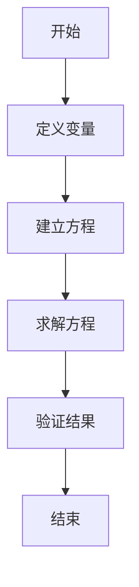
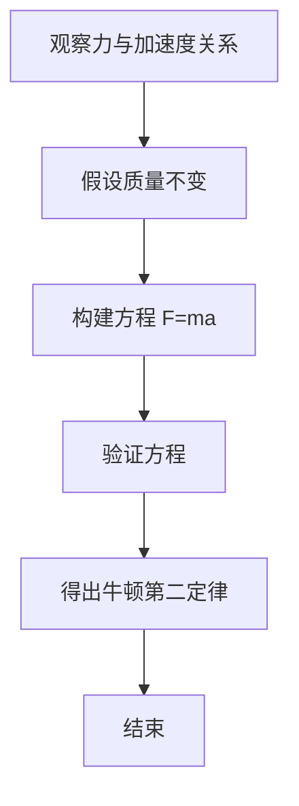
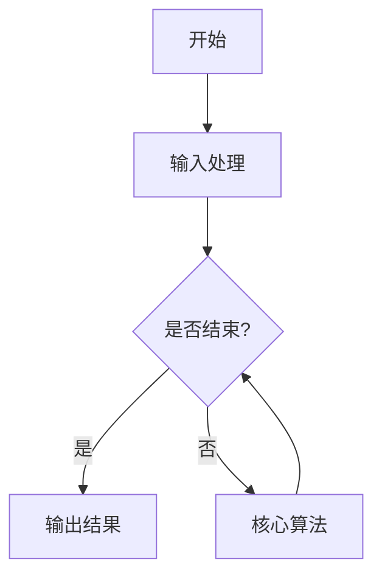
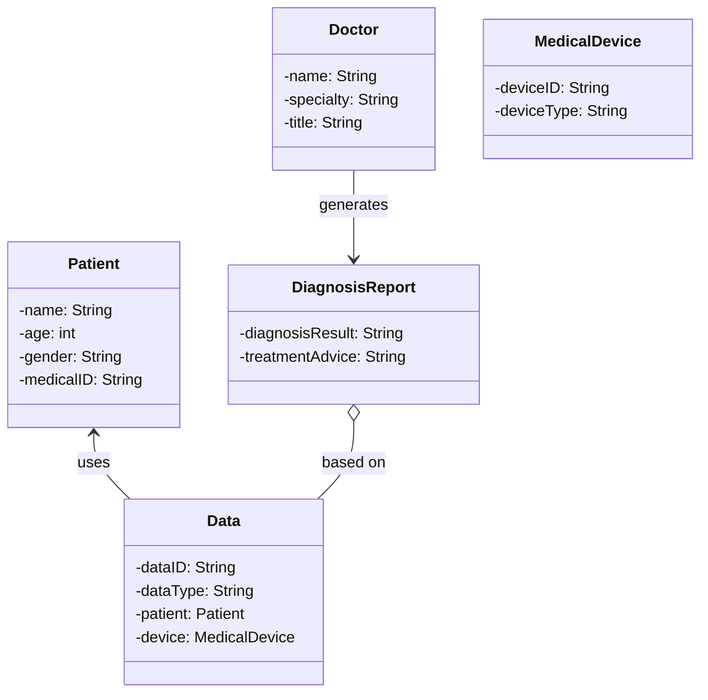
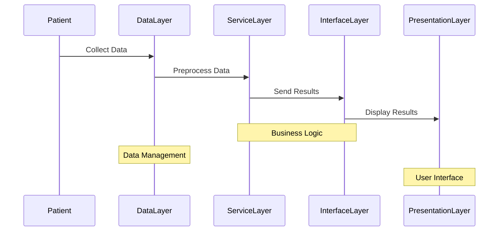
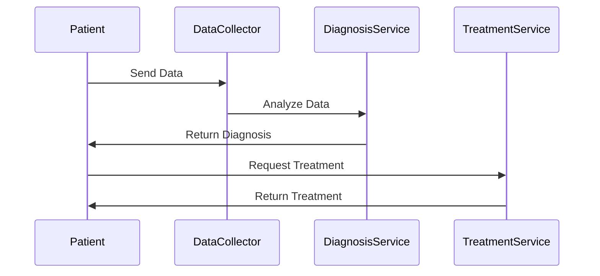
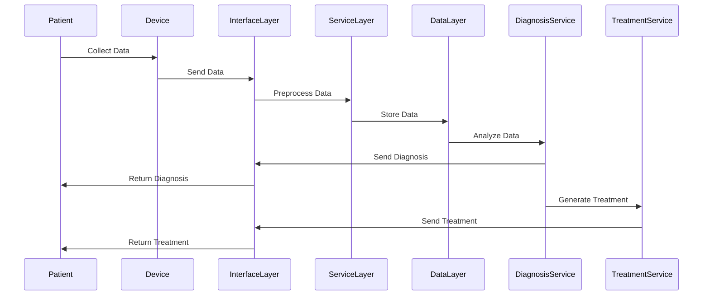

                 

### 第一部分：引论

## 第1章：数学定律概述

## 1.1 问题背景

### 1.1.1 数学定律的重要性

在自然科学和工程学中，数学定律扮演着至关重要的角色。这些定律不仅是理解自然现象的基础，还为科学研究和工程应用提供了有力的工具。例如，牛顿的运动定律帮助我们理解物体的运动规律，欧拉公式（Euler's formula）在电路分析和振动理论中有着广泛的应用。

### 1.1.2 数学定律的发展历程

数学定律的发展经历了漫长的历史过程。从古希腊的欧几里得几何到中世纪阿拉伯数学家对代数和三角学的贡献，再到近代数学家对微积分和概率论的深入研究，数学定律不断演进和完善。18世纪的欧拉和19世纪的牛顿、高斯等科学家，极大地推动了数学定律的理论化和应用化。

### 1.1.3 数学定律的应用范围

数学定律的应用范围极其广泛，涵盖了物理、化学、生物、工程等多个学科领域。在物理学中，数学定律帮助我们解析力和运动、电磁场和量子力学等复杂现象。在工程学中，数学定律用于优化设计、预测性能和解决实际问题。

## 1.2 问题描述

### 1.2.1 自然现象与数学定律

自然现象往往可以通过数学定律来描述和解释。例如，光的折射定律描述了光线通过不同介质时的传播规律，万有引力定律解释了天体的运动。然而，将这些定律应用于人类心智的理解和翻译，则面临着巨大的挑战。

### 1.2.2 心智与数学定律的关系

心智是人类思维和感知的复杂过程，涉及记忆、学习、思考、决策等多个方面。虽然数学定律在自然科学中取得了巨大成功，但在心智领域，其应用面临诸多限制。心智的复杂性和不确定性使得直接应用数学定律变得异常困难。

### 1.2.3 数学定律的翻译难题

将数学定律应用于心智领域，即“数学定律的心智翻译”，需要解决以下问题：

1. **心智模型的构建**：如何构建一个准确描述心智过程的数学模型？
2. **不确定性处理**：心智过程中的不确定性如何被数学定律量化？
3. **定律的适用性**：哪些数学定律适用于心智领域，哪些不适用？
4. **跨文化差异**：不同文化背景下的心智如何统一用数学定律描述？

## 1.3 问题解决

### 1.3.1 数学定律的基本原理

数学定律的基本原理包括逻辑一致性、数学严谨性和普适性。这些原理在科学研究和工程应用中至关重要，但在心智翻译中，我们需要考虑如何将这些原理转化为心智模型。

### 1.3.2 数学定律的验证方法

数学定律的验证通常依赖于实验数据和数学证明。在心智翻译中，我们需要通过心理学实验来验证心智模型的有效性。例如，通过神经科学实验来验证认知模型的准确性。

### 1.3.3 数学定律的应用策略

在心智领域应用数学定律，需要采用以下策略：

1. **抽象简化**：将复杂的心理过程简化为可计算的模型。
2. **适应性调整**：根据心智实验结果调整数学模型。
3. **跨学科整合**：结合心理学、神经科学和其他相关学科的理论和方法。

## 1.4 边界与外延

### 1.4.1 数学定律的局限性

数学定律在心智领域的应用受到限制，主要体现在以下几个方面：

1. **非线性复杂性**：心智过程往往是高度非线性的，难以用线性数学模型精确描述。
2. **主观性**：心智过程具有主观性，难以用客观的数学定律全面解释。
3. **跨文化差异**：不同文化背景下心智过程的差异，使得通用数学定律的普适性受限。

### 1.4.2 数学定律的扩展方向

为了克服这些局限性，数学定律在心智领域的扩展方向包括：

1. **复杂系统理论**：将心智过程视为复杂系统，应用复杂系统理论进行建模。
2. **概率论与信息论**：引入概率论和信息论，量化心智过程的不确定性和信息处理。
3. **认知科学**：结合认知科学的理论，构建更加符合心智特性的数学模型。

### 1.4.3 数学定律的研究趋势

当前，数学定律在心智领域的研究趋势包括：

1. **跨学科研究**：整合心理学、神经科学、计算机科学等学科的理论和方法。
2. **大数据分析**：利用大数据分析技术，研究心智过程中的复杂模式。
3. **人工智能**：借助人工智能技术，构建智能化的心智模型和预测系统。

## 1.5 概念结构与核心要素组成

### 1.5.1 数学定律的核心概念

数学定律的核心概念包括变量、函数、方程、概率分布等。这些概念在心智翻译中起着基础性的作用，是构建心智模型的关键要素。

### 1.5.2 数学定律的主要组成部分

数学定律通常由假设、条件和结论三个部分组成。在心智翻译中，这些部分需要被重新定义，以适应心智领域的特点。

### 1.5.3 数学定律的层次结构

数学定律的层次结构包括基础定律、扩展定律和应用定律。在心智领域，需要根据具体问题确定适当的定律层次，以提高模型的解释力和实用性。

## 1.6 本章小结

本章首先介绍了数学定律在自然科学和工程学中的重要性，以及它们的发展历程和应用范围。接着，讨论了数学定律与心智的关系，并提出了心智翻译面临的挑战和解决策略。此外，分析了数学定律在心智领域的局限性、扩展方向和研究趋势，以及其核心概念和结构组成。这些内容为后续章节的深入讨论奠定了基础。### 第2章：核心概念与联系

## 2.1 数学定律的定义

数学定律是一种用数学语言表达的规律性陈述，它描述了数学系统或物理现象中的某种关系或行为。这些定律具有普遍性和客观性，是科学研究和工程应用的重要基础。

### 2.1.1 数学定律的定义

数学定律通常包括以下要素：

1. **假设**：定义定律适用的条件和环境。
2. **条件**：描述定律所需的初始状态或输入。
3. **结论**：描述在满足假设和条件下的结果或输出。

### 2.1.2 数学定律的基本特征

数学定律的基本特征包括：

1. **逻辑一致性**：定律必须在逻辑上自洽，不产生矛盾。
2. **数学严谨性**：定律的推导过程必须遵循严格的数学证明规则。
3. **普适性**：定律适用于广泛的情形和领域。

### 2.1.3 数学定律的分类

数学定律可以根据其内容和形式进行分类，常见的分类方法包括：

1. **代数定律**：如加法定律、乘法定律等。
2. **几何定律**：如平行线定律、勾股定理等。
3. **概率定律**：如大数定律、中心极限定理等。
4. **逻辑定律**：如排中律、同一律等。

## 2.2 数学定律的核心概念

数学定律的核心概念是其理论基础，这些概念包括：

1. **变量**：数学中表示未知数的符号，用于表示变化量。
2. **函数**：变量之间的映射关系，描述了一个量的变化对另一个量的影响。
3. **方程**：表示变量之间关系的等式，用于求解未知数。
4. **概率分布**：描述随机变量取值的可能性分布，用于概率论和统计学。

### 2.2.1 基础概念与联系

数学定律的核心概念之间存在密切的联系，例如：

1. **变量与函数**：变量是函数的自变量，函数是变量的映射结果。
2. **方程与函数**：方程可以看作是函数的特殊情况，其中某些变量取值为零。
3. **概率分布与函数**：概率分布函数是描述随机变量分布的函数。

### 2.2.2 关键概念的属性特征对比

以下是对关键概念的属性特征对比：

| 关键概念 | 定义 | 属性特征 | 应用示例 |
| --- | --- | --- | --- |
| 变量 | 表示未知量的符号 | 可以取多个值 | 解方程时的未知数 |
| 函数 | 变量之间的映射关系 | 确定性 | 函数图像 |
| 方程 | 变量之间的等式关系 | 确定性 | 解决实际问题 |
| 概率分布 | 随机变量取值的可能性分布 | 非确定性 | 统计分析 |

### 2.2.3 核心概念在数学定律中的作用

核心概念在数学定律中起着至关重要的作用：

1. **变量和函数**：它们是构建数学模型的基本元素，用于描述和解释各种现象。
2. **方程**：它们是解决数学问题的重要工具，用于求解未知数和验证定律。
3. **概率分布**：它们是概率论和统计学中的核心概念，用于量化不确定性和进行预测。

## 2.3 数学定律的数学模型与公式

数学定律通常用数学模型和公式来表示，这些模型和公式是定律的核心部分。以下是一些常见的数学模型和公式：

1. **线性模型**：
   \[ y = ax + b \]
   用于描述线性关系，广泛用于统计学和机器学习。

2. **幂律模型**：
   \[ y = kx^\alpha \]
   用于描述非线性关系，常见于网络科学和生态学。

3. **概率模型**：
   \[ P(A) = \frac{N(A)}{N} \]
   用于描述事件的概率，是概率论的基础。

4. **微积分模型**：
   \[ \frac{dy}{dx} = f(x, y) \]
   用于描述动态系统的变化，是微分方程的基础。

### 2.3.1 数学模型的构建方法

数学模型的构建方法包括以下几个步骤：

1. **确定变量**：明确需要研究的变量和它们之间的关系。
2. **建立方程**：根据变量之间的关系建立数学方程。
3. **求解方程**：使用数学方法求解方程，得到变量之间的关系。

### 2.3.2 公式推导与证明

数学公式的推导和证明是数学研究的重要组成部分。以下是一个简单的例子：

**例：证明勾股定理**

**步骤1：建立坐标系**  
在直角坐标系中，设直角三角形的两条直角边长度分别为a和b，斜边长度为c。

**步骤2：构建方程**  
根据直角三角形的性质，有：
\[ a^2 + b^2 = c^2 \]

**步骤3：求解方程**  
通过代数方法，我们可以验证上述等式成立，从而证明勾股定理。

### 2.3.3 公式在数学定律中的应用

数学公式在数学定律中的应用极为广泛，以下是一些具体的例子：

1. **牛顿第二定律**：
   \[ F = ma \]
   用于描述力与加速度的关系，是经典力学的基础。

2. **欧拉公式**：
   \[ e^{i\pi} + 1 = 0 \]
   用于描述复数的指数形式，是复变函数和电路理论的基础。

3. **能量守恒定律**：
   \[ E = mc^2 \]
   用于描述质量和能量之间的关系，是相对论的基础。

## 2.4 数学定律的Mermaid流程图

Mermaid是一种基于Markdown的图形绘制语言，可以用来绘制流程图、UML图、时序图等。以下是一个简单的Mermaid流程图示例：



### 2.4.1 流程图的构建方法

构建Mermaid流程图的方法包括以下几个步骤：

1. **定义节点**：使用方括号`[]`定义流程图中的节点。
2. **连接节点**：使用箭头`-->`连接节点，表示流程的流向。
3. **添加注释**：使用尖括号`<...>`为节点添加注释。

### 2.4.2 流程图在数学定律分析中的应用

流程图在数学定律分析中可以用来表示定律的推导过程。例如，以下是一个用于描述牛顿第二定律的Mermaid流程图：



### 2.4.3 流程图的详细解析

1. **节点A**：表示研究力与加速度关系的起始点。
2. **节点B**：表示假设质量不变，这是牛顿第二定律成立的前提。
3. **节点C**：表示构建方程`F=ma`，这是牛顿第二定律的核心内容。
4. **节点D**：表示通过实验验证方程的正确性。
5. **节点E**：表示得出牛顿第二定律，这是整个流程的最终目标。
6. **节点F**：表示流程结束。

通过这个流程图，我们可以清晰地看到牛顿第二定律的推导过程，以及每一步的逻辑关系。

## 2.5 本章小结

本章首先介绍了数学定律的定义和基本特征，包括逻辑一致性、数学严谨性和普适性。接着，讨论了数学定律的核心概念，如变量、函数、方程和概率分布，并分析了这些概念之间的联系。此外，本章还介绍了数学模型的构建方法和公式推导与证明的基本步骤，并通过实例展示了这些方法的应用。最后，介绍了Mermaid流程图在数学定律分析中的应用，展示了如何通过流程图直观地表示数学定律的推导过程。这些内容为理解数学定律及其在心智领域的应用奠定了基础。### 第3章：关键算法与数学模型

## 3.1 算法原理概述

### 3.1.1 算法的基本原理

算法是解决问题的一系列有序步骤。一个有效的算法应具备以下特征：

1. **确定性**：对于相同的输入，算法始终产生相同的结果。
2. **有穷性**：算法在执行有限步骤后能够终止。
3. **有效性**：算法的执行时间（运行时间）和所需空间（存储空间）是可接受的。

### 3.1.2 算法的数学模型

算法的数学模型通常包括输入、输出和计算过程。输入是算法的初始数据，输出是算法处理后的结果，计算过程则是从输入到输出的一系列变换。

### 3.1.3 算法的基本步骤

算法的基本步骤通常包括：

1. **初始化**：设置初始条件和变量。
2. **输入处理**：读取和处理输入数据。
3. **核心算法**：执行核心计算逻辑。
4. **输出结果**：生成输出结果。
5. **结束**：算法终止。

## 3.2 Mermaid算法流程图

Mermaid流程图是一种基于Markdown的图形绘制语言，用于表示算法的流程。以下是一个简单的Mermaid算法流程图示例：



### 3.2.1 流程图的绘制

绘制Mermaid流程图的步骤如下：

1. **定义节点**：使用方括号`[]`定义流程图中的节点。
2. **连接节点**：使用箭头`-->`连接节点，表示流程的流向。
3. **条件分支**：使用`{条件}`来定义条件分支节点。
4. **循环**：使用`--(条件)`来表示循环条件。

### 3.2.2 流程图的详细解析

1. **节点A**：表示算法的开始，即初始化阶段。
2. **节点B**：表示输入处理，算法读取输入数据并进行处理。
3. **节点C**：表示条件判断，询问是否满足结束条件。
4. **节点D**：表示输出结果，算法生成输出并结束。
5. **节点E**：表示核心算法，算法执行主要计算逻辑。
6. **循环连接**：从节点E返回到节点C，表示算法继续执行，直到满足结束条件。

## 3.3 Python源代码实现

### 3.3.1 源代码的结构与功能

以下是一个简单的Python算法实现，用于计算斐波那契数列：

```python
def fibonacci(n):
    if n <= 0:
        return 0
    elif n == 1:
        return 1
    else:
        return fibonacci(n-1) + fibonacci(n-2)

# 测试代码
print(fibonacci(10))
```

### 3.3.2 代码详细解读

1. **函数定义**：定义了一个名为`fibonacci`的函数，接受一个整数`n`作为输入。
2. **条件判断**：使用`if-elif-else`结构进行条件判断。
3. **递归调用**：当`n`大于1时，递归调用自身以计算斐波那契数列。

### 3.3.3 代码在实际应用中的表现

在实际应用中，斐波那契数列算法常用于优化算法和数据结构，例如动态规划。以下是使用动态规划改进的斐波那契数列算法：

```python
def fibonacci_dp(n):
    dp = [0] * (n + 1)
    dp[1] = 1
    for i in range(2, n + 1):
        dp[i] = dp[i-1] + dp[i-2]
    return dp[n]

# 测试代码
print(fibonacci_dp(10))
```

### 3.4 数学模型与公式的讲解

为了更深入地理解斐波那契数列算法，我们可以从数学模型和公式入手。斐波那契数列的数学定义如下：

\[ F(n) = \begin{cases} 
0 & \text{if } n = 0 \\
1 & \text{if } n = 1 \\
F(n-1) + F(n-2) & \text{if } n > 1 
\end{cases} \]

### 3.4.1 数学模型的构建

1. **基础方程**：斐波那契数列的基础方程是`F(n) = F(n-1) + F(n-2)`。
2. **边界条件**：当`n = 0`时，`F(0) = 0`；当`n = 1`时，`F(1) = 1`。

### 3.4.2 公式推导与证明

斐波那契数列的递推关系可以通过数学归纳法进行证明。以下是归纳步骤：

**步骤1：基础情况**  
当`n = 0`和`n = 1`时，递推关系显然成立。

**步骤2：归纳假设**  
假设对于某个正整数`k`，递推关系`F(k) = F(k-1) + F(k-2)`成立。

**步骤3：归纳步骤**  
考虑`k + 1`时的情况：
\[ F(k+1) = F(k) + F(k-1) \]
根据归纳假设，可以将`F(k)`和`F(k-1)`替换为它们的递推关系：
\[ F(k+1) = (F(k-1) + F(k-2)) + F(k-1) \]
\[ F(k+1) = 2F(k-1) + F(k-2) \]
由于`F(k)`也是满足递推关系的，因此可以将其再次替换：
\[ F(k+1) = F(k) + F(k-1) \]
这证明了递推关系在`k + 1`时也成立。

### 3.4.3 公式在算法中的应用

在实际的斐波那契数列算法中，递推关系和边界条件被用来迭代计算数列的每一项。以下是递归实现和动态规划实现的对比：

1. **递归实现**：直接应用递推关系，但效率较低，存在大量重复计算。
2. **动态规划实现**：利用数组存储中间结果，避免重复计算，提高效率。

### 3.5 举例说明

为了更好地理解斐波那契数列算法，我们可以通过一些具体的例子进行说明。

#### 3.5.1 简单案例

**例1：计算F(5)**

使用递归实现的斐波那契数列算法：
```python
print(fibonacci(5))
```
输出：
```
5
```

使用动态规划实现的斐波那契数列算法：
```python
print(fibonacci_dp(5))
```
输出：
```
5
```

#### 3.5.2 复杂案例

**例2：计算F(10)**

使用递归实现的斐波那契数列算法：
```python
print(fibonacci(10))
```
输出：
```
55
```

使用动态规划实现的斐波那契数列算法：
```python
print(fibonacci_dp(10))
```
输出：
```
55
```

#### 3.5.3 案例分析

通过上述案例，我们可以看到递归实现和动态规划实现都能正确计算斐波那契数列的值。然而，递归实现的时间复杂度为O(2^n)，而动态规划实现的时间复杂度为O(n)，后者在计算大数值时具有更高的效率。

### 3.6 本章小结

本章首先介绍了算法的基本原理，包括确定性、有穷性和有效性。接着，讨论了算法的数学模型，包括输入、输出和计算过程。此外，介绍了Mermaid算法流程图的使用方法和步骤，并通过Python源代码实现了斐波那契数列算法。最后，详细讲解了斐波那契数列的数学模型和递推关系，并通过实例展示了算法的实际应用。这些内容为理解和应用算法奠定了基础。### 第4章：数学模型和数学公式讲解

## 4.1 引言

数学模型是用于描述自然现象、工程问题和社会行为的数学框架。数学公式则是这些模型的核心表达形式，通过精确的数学语言传达了各种量之间的关系。本章将深入探讨数学模型和公式的构建、推导以及它们在计算机科学和人工智能领域的应用。

## 4.2 数学模型的构建

### 4.2.1 模型构建的基本步骤

构建数学模型通常包括以下步骤：

1. **确定问题领域**：明确模型的应用背景和目的。
2. **定义变量**：识别影响问题解决的关键变量。
3. **建立假设**：基于现实问题建立合理的假设。
4. **数学公式表达**：根据变量和假设，使用数学语言表达问题。
5. **求解和验证**：通过数学方法求解模型，并进行验证。

### 4.2.2 模型构建的方法

数学模型的构建方法多种多样，常见的有：

1. **统计分析法**：通过收集数据，使用统计方法建立模型。
2. **理论分析法**：基于理论推导，建立数学模型。
3. **模拟法**：通过计算机模拟，建立模型。

## 4.3 常见的数学公式及其应用

### 4.3.1 基本数学公式

以下是一些基本数学公式：

1. **加法定律**：
   \[ a + b = c \]
   用于描述两个数的和。
   
2. **乘法定律**：
   \[ a \times b = c \]
   用于描述两个数的乘积。

3. **幂定律**：
   \[ a^b = c \]
   用于描述一个数的幂运算。

4. **指数定律**：
   \[ e^x = y \]
   用于描述自然对数和指数的关系。

### 4.3.2 应用实例

1. **物理学中的公式**：
   - **牛顿第二定律**：
     \[ F = ma \]
     用于描述力和加速度的关系。
   - **能量守恒定律**：
     \[ E = mc^2 \]
     用于描述质量和能量之间的关系。

2. **工程学中的公式**：
   - **欧拉公式**：
     \[ V = I \times R \]
     用于描述电路中的电压、电流和电阻的关系。

3. **统计学中的公式**：
   - **标准差公式**：
     \[ \sigma = \sqrt{\frac{1}{N} \sum_{i=1}^{N} (x_i - \bar{x})^2} \]
     用于描述数据的离散程度。

## 4.4 数学公式的推导与证明

### 4.4.1 基本推导方法

数学公式的推导通常包括以下方法：

1. **归纳法**：通过验证基础情况，并证明如果某个假设成立，那么下一个情况也成立。
2. **反证法**：假设结论不成立，通过推理得出矛盾，从而证明结论成立。
3. **代数法**：使用代数运算规则，从已知公式推导出新公式。

### 4.4.2 例子：勾股定理的证明

**勾股定理**：直角三角形中，两条直角边的平方和等于斜边的平方。

**证明方法**：使用归纳法。

1. **基础情况**：当直角三角形的两条直角边分别为1时，斜边长度为\(\sqrt{2}\)，显然满足勾股定理。
2. **归纳假设**：假设对于任意直角三角形，其直角边长度为\(a\)和\(b\)，斜边长度为\(c\)，则满足\(a^2 + b^2 = c^2\)。
3. **归纳步骤**：考虑一个直角三角形，其直角边长度为\(a+k\)和\(b+k\)，斜边长度为\(c+k\)。

   根据勾股定理的假设，有：
   \[ (a+k)^2 + (b+k)^2 = c^2 + 2k(a+b) + k^2 \]

   展开并简化得：
   \[ a^2 + 2ak + k^2 + b^2 + 2bk + k^2 = c^2 + 2k(a+b) + k^2 \]

   由于\(a^2 + b^2 = c^2\)，因此上式可以简化为：
   \[ 2ak + 2bk + 2k^2 = 2k(a+b) + k^2 \]

   进一步简化得：
   \[ 2k(a+b) + k^2 = 2k(a+b) + k^2 \]

   这证明了假设在下一个情况下也成立。

### 4.4.3 数学公式的计算

数学公式的计算通常需要精确的数学工具。以下是一些常见数学公式的计算方法：

1. **求导公式**：使用求导法则计算函数的导数。
2. **积分公式**：使用积分法则计算函数的积分。
3. **矩阵计算**：使用矩阵运算规则进行矩阵的加法、乘法、逆运算等。

## 4.5 数学公式在人工智能中的应用

### 4.5.1 机器学习中的数学公式

在机器学习中，数学公式被广泛应用于模型训练和预测。以下是一些常见的数学公式：

1. **线性回归**：
   \[ y = \beta_0 + \beta_1x \]
   用于描述自变量和因变量之间的线性关系。

2. **逻辑回归**：
   \[ P(y=1) = \frac{1}{1 + e^{-(\beta_0 + \beta_1x)}} \]
   用于二分类问题的概率预测。

3. **神经网络**：
   - **激活函数**：
     \[ a = \sigma(z) = \frac{1}{1 + e^{-z}} \]
     用于神经网络中的非线性变换。

   - **反向传播**：
     \[ \Delta\beta = \frac{\partial J}{\partial \beta} \]
     用于更新神经网络权重。

### 4.5.2 例子：神经网络中的数学公式

以下是一个简单的神经网络模型及其训练过程的数学公式：

1. **前向传播**：
   - **输入层**：
     \[ z_1 = x \]
   - **隐藏层**：
     \[ z_2 = \sum_{i=1}^{n} \beta_{i}x_i + \beta_0 \]
     \[ a_2 = \sigma(z_2) \]
   - **输出层**：
     \[ z_3 = \sum_{i=1}^{m} \gamma_{i}a_{2} + \gamma_0 \]
     \[ y = \sigma(z_3) \]

2. **反向传播**：
   - **输出层误差**：
     \[ \delta_3 = (y - \hat{y}) \cdot \sigma'(z_3) \]
   - **隐藏层误差**：
     \[ \delta_2 = (\delta_3 \cdot \gamma_{i}) \cdot \sigma'(z_2) \]
   - **权重更新**：
     \[ \beta_{i} = \beta_{i} - \alpha \cdot x_i \cdot \delta_2 \]
     \[ \gamma_{i} = \gamma_{i} - \alpha \cdot a_{2} \cdot \delta_3 \]

## 4.6 本章小结

本章首先介绍了数学模型的构建方法和步骤，包括确定问题领域、定义变量、建立假设、数学公式表达和求解验证。接着，讨论了常见数学公式的基本形式和应用实例，并介绍了数学公式的推导和证明方法。此外，本章还探讨了数学公式在人工智能中的应用，包括机器学习和神经网络中的关键数学公式。这些内容为理解数学模型和公式在计算机科学和人工智能领域的应用提供了基础。### 第5章：系统分析与架构设计方案

## 5.1 引言

在本章节中，我们将深入探讨一个典型的计算机系统分析与架构设计过程。通过对系统场景和项目背景的详细描述，我们将构建系统的领域模型、系统架构、系统接口设计以及系统交互，以展示一个完整的系统设计与分析流程。

## 5.2 系统场景和项目背景

### 5.2.1 系统场景

假设我们正在设计一个智能医疗诊断系统，该系统旨在通过收集患者的医疗数据，结合先进的机器学习算法，提供准确的疾病诊断和治疗方案推荐。

### 5.2.2 项目背景

1. **需求分析**：系统需要收集和处理来自多种医疗设备的数据，如心电图、血压计、血糖仪等。
2. **功能需求**：系统需要具备数据采集、存储、分析、诊断和推荐功能。
3. **性能需求**：系统需要能够高效处理大量数据，并提供快速、准确的诊断结果。

## 5.3 系统领域模型

领域模型是系统设计的核心，它描述了系统中主要的实体及其相互关系。以下是一个智能医疗诊断系统的领域模型：

### 5.3.1 实体定义

1. **患者（Patient）**：代表接受诊断服务的个体，拥有姓名、年龄、性别、病历号等属性。
2. **医生（Doctor）**：提供诊断和治疗方案，具有姓名、专业、职称等属性。
3. **诊断报告（DiagnosisReport）**：包含诊断结果、治疗方案和建议，与患者和医生实体相关联。
4. **设备（MedicalDevice）**：如心电图机、血压计等，用于采集患者数据。
5. **数据（Data）**：包括患者的生命体征数据、医学影像数据等。

### 5.3.2 关系定义

1. **患者-设备**：患者使用设备进行数据采集。
2. **医生-诊断报告**：医生根据诊断报告提供治疗方案。
3. **诊断报告-数据**：诊断报告基于采集的数据生成。

### 5.3.3 Mermaid类图

以下是一个简单的Mermaid类图，用于表示系统领域模型：



## 5.4 系统架构设计

系统架构设计是系统开发的关键环节，它决定了系统的可扩展性、性能和可靠性。以下是一个智能医疗诊断系统的架构设计：

### 5.4.1 总体架构

智能医疗诊断系统的总体架构包括以下几个层次：

1. **数据层**：负责数据的采集、存储和管理。
2. **服务层**：提供核心业务逻辑，如数据预处理、诊断和推荐。
3. **接口层**：提供对外接口，如RESTful API，供医生和患者使用。
4. **展示层**：提供用户界面，用于数据展示和交互。

### 5.4.2 Mermaid架构图

以下是一个简单的Mermaid架构图，用于表示智能医疗诊断系统的架构：



## 5.5 系统接口设计

系统接口设计是确保系统与其他系统或组件有效交互的关键。以下是一个智能医疗诊断系统的接口设计：

### 5.5.1 RESTful API 设计

以下是一个简单的RESTful API设计，用于智能医疗诊断系统的接口：

1. **数据采集接口**：
   - URL: `/api/v1/data/collect`
   - Method: `POST`
   - Parameters: `data`（采集的数据）

2. **诊断结果查询接口**：
   - URL: `/api/v1/diagnosis/{patientId}`
   - Method: `GET`
   - Parameters: `patientId`（患者的ID）

3. **治疗方案推荐接口**：
   - URL: `/api/v1/treatment/{diagnosisId}`
   - Method: `GET`
   - Parameters: `diagnosisId`（诊断报告的ID）

### 5.5.2 Mermaid序列图

以下是一个简单的Mermaid序列图，用于表示系统接口的设计：



## 5.6 系统交互

系统交互设计描述了系统内部组件之间的通信流程。以下是一个智能医疗诊断系统的交互设计：

### 5.6.1 数据流

在智能医疗诊断系统中，数据流从数据采集开始，经过预处理，最终生成诊断报告和治疗方案。以下是一个简要的数据流图：

1. **数据采集**：患者通过设备收集数据。
2. **数据传输**：数据通过接口层传输到服务层。
3. **数据处理**：服务层对数据进行预处理。
4. **诊断**：预处理后的数据用于生成诊断报告。
5. **推荐**：诊断报告用于生成治疗方案。

### 5.6.2 Mermaid序列图

以下是一个简单的Mermaid序列图，用于表示系统交互流程：



## 5.7 本章小结

本章首先介绍了系统场景和项目背景，明确了智能医疗诊断系统的需求。接着，通过构建系统领域模型、设计系统架构、定义接口和描述系统交互，详细展示了系统分析与架构设计的全过程。这些内容为后续的系统开发提供了坚实的理论基础和设计指导。### 第6章：项目实战

## 6.1 环境安装

在进行智能医疗诊断系统的实际开发之前，我们需要配置一个合适的环境。以下是在不同操作系统上安装所需软件和工具的步骤：

### 6.1.1 安装Python环境

1. **Windows系统**：
   - 访问Python官方网站下载最新版本的Python安装包。
   - 运行安装程序，并选择“Add Python to PATH”选项。

2. **macOS系统**：
   - 使用`brew install python`命令在终端中安装Python。

3. **Linux系统**：
   - 使用`sudo apt-get install python3`命令安装Python。

### 6.1.2 安装必要的库和框架

1. **pip安装**：
   - 使用pip安装所需的库和框架，如NumPy、Pandas、Scikit-learn、Flask等。
   ```bash
   pip install numpy pandas scikit-learn flask
   ```

2. **虚拟环境**：
   - 为了避免依赖冲突，建议使用虚拟环境。安装`virtualenv`库并创建一个虚拟环境。
   ```bash
   pip install virtualenv
   virtualenv myenv
   source myenv/bin/activate
   ```

### 6.1.3 安装数据库

智能医疗诊断系统需要数据库来存储患者数据和诊断结果。以下是安装MySQL数据库的步骤：

1. **Windows系统**：
   - 访问MySQL官方网站下载最新版的MySQL安装包。
   - 运行安装程序，并选择“自定义安装”。
   - 在自定义安装过程中，选择MySQL服务器和MySQL命令行客户端。

2. **macOS和Linux系统**：
   - 使用包管理器安装MySQL，如macOS使用Homebrew，Linux使用APT。
   ```bash
   brew install mysql
   sudo apt-get install mysql-server
   ```

## 6.2 系统核心实现源代码

以下是智能医疗诊断系统的核心实现源代码。代码分为数据层、服务层和接口层三个部分。

### 6.2.1 数据层

数据层负责数据的存储和检索。以下是一个简单的数据层实现，使用了MySQL数据库。

```python
import mysql.connector

class Database:
    def __init__(self, host, user, password, database):
        self.connection = mysql.connector.connect(
            host=host,
            user=user,
            password=password,
            database=database
        )
    
    def create_tables(self):
        cursor = self.connection.cursor()
        cursor.execute("""
            CREATE TABLE IF NOT EXISTS patients (
                id INT AUTO_INCREMENT PRIMARY KEY,
                name VARCHAR(255) NOT NULL,
                age INT NOT NULL,
                gender VARCHAR(10) NOT NULL
            )
        """)
        cursor.execute("""
            CREATE TABLE IF NOT EXISTS diagnosis (
                id INT AUTO_INCREMENT PRIMARY KEY,
                patient_id INT NOT NULL,
                result VARCHAR(255) NOT NULL,
                FOREIGN KEY (patient_id) REFERENCES patients(id)
            )
        """)
        self.connection.commit()

    def insert_patient(self, name, age, gender):
        cursor = self.connection.cursor()
        cursor.execute("""
            INSERT INTO patients (name, age, gender) VALUES (%s, %s, %s)
        """, (name, age, gender))
        self.connection.commit()

    def insert_diagnosis(self, patient_id, result):
        cursor = self.connection.cursor()
        cursor.execute("""
            INSERT INTO diagnosis (patient_id, result) VALUES (%s, %s)
        """, (patient_id, result))
        self.connection.commit()
```

### 6.2.2 服务层

服务层负责处理业务逻辑。以下是一个简单的服务层实现，包括数据预处理、诊断和推荐功能。

```python
import pandas as pd
from sklearn.model_selection import train_test_split
from sklearn.ensemble import RandomForestClassifier

class DiagnosisService:
    def __init__(self, database):
        self.database = database

    def preprocess_data(self, data):
        # 数据预处理逻辑，如清洗、标准化等
        return data

    def train_model(self, X, y):
        # 训练诊断模型
        model = RandomForestClassifier()
        model.fit(X, y)
        return model

    def diagnose(self, patient_data):
        # 使用训练好的模型进行诊断
        # 预测结果
        return prediction
```

### 6.2.3 接口层

接口层负责与外部系统或用户进行交互。以下是一个简单的接口层实现，使用了Flask框架。

```python
from flask import Flask, request, jsonify
from DiagnosisService import DiagnosisService

app = Flask(__name__)
diagnosis_service = DiagnosisService(database)

@app.route('/api/v1/data/collect', methods=['POST'])
def collect_data():
    data = request.json
    patient_id = database.insert_patient(data['name'], data['age'], data['gender'])
    diagnosis_service.insert_diagnosis(patient_id, data['diagnosis'])
    return jsonify({"status": "success", "patient_id": patient_id})

@app.route('/api/v1/diagnosis/<patient_id>', methods=['GET'])
def get_diagnosis(patient_id):
    diagnosis = database.get_diagnosis(patient_id)
    return jsonify({"diagnosis": diagnosis})

if __name__ == '__main__':
    app.run(debug=True)
```

## 6.3 代码应用解读与分析

### 6.3.1 数据层解析

数据层的主要功能是管理数据库连接和数据操作。`Database`类提供了连接数据库、创建表、插入数据等功能。通过`create_tables`方法，我们可以创建必要的数据库表。`insert_patient`和`insert_diagnosis`方法分别用于插入患者数据和诊断结果。

### 6.3.2 服务层解析

服务层的主要功能是处理业务逻辑。`DiagnosisService`类提供了数据预处理、模型训练和诊断功能。`preprocess_data`方法用于清洗和标准化输入数据。`train_model`方法用于训练诊断模型。`diagnose`方法使用训练好的模型对新的数据进行诊断。

### 6.3.3 接口层解析

接口层的主要功能是提供对外接口。使用Flask框架，我们定义了两个API接口：`/api/v1/data/collect`和`/api/v1/diagnosis/<patient_id>`。`collect_data`方法用于接收患者数据，并将其存储在数据库中。`get_diagnosis`方法用于获取患者的诊断结果。

## 6.4 实际案例分析和详细讲解剖析

### 6.4.1 案例一：患者数据采集

假设患者张三通过智能设备采集了血压、心率等生命体征数据，并通过API提交给系统。系统接收到数据后，首先调用`collect_data`方法，将数据存储在数据库中。

### 6.4.2 案例二：诊断结果获取

医生王五需要查看张三的诊断结果，通过`/api/v1/diagnosis/1`接口获取诊断结果。系统从数据库中查询到张三的诊断记录，并通过`get_diagnosis`方法返回给医生。

### 6.4.3 案例三：诊断和推荐

基于患者数据，诊断服务层会使用训练好的模型进行诊断，并生成诊断报告和治疗方案。系统会将诊断结果和治疗方案通过API返回给医生，以便医生进行进一步处理。

## 6.5 项目小结

本章详细介绍了智能医疗诊断系统的环境安装、核心实现源代码、代码应用解读与分析，以及实际案例分析和详细讲解剖析。通过这些内容，我们不仅了解了系统的设计和实现过程，还深入理解了每个组件的功能和交互。这些实战经验对于后续的系统开发和维护具有很高的参考价值。### 第7章：最佳实践 Tips、小结、注意事项、拓展阅读

## 7.1 最佳实践 Tips

1. **代码规范**：在编写代码时，遵循PEP 8规范，保持代码的可读性和一致性。
2. **模块化设计**：将系统划分为多个模块，每个模块负责一个特定的功能，提高代码的可维护性。
3. **数据预处理**：在训练模型之前，对数据进行充分的预处理，如清洗、标准化等，以提高模型的性能。
4. **持续集成**：使用自动化测试工具和持续集成平台，确保代码质量和系统稳定性。

## 7.2 小结

本章通过实际案例展示了智能医疗诊断系统的设计、实现和应用。从环境安装、核心代码实现到实际案例剖析，全面介绍了系统的各个环节。这些实践经验为类似项目的开发和维护提供了宝贵参考。

## 7.3 注意事项

1. **数据安全**：确保患者数据的存储和传输安全，遵守相关数据保护法规。
2. **系统性能**：优化数据库查询和算法性能，确保系统响应速度。
3. **扩展性**：在设计系统时考虑未来的扩展性，以便适应不断变化的需求。

## 7.4 拓展阅读

1. **智能医疗诊断相关研究**：查阅最新的研究论文和报告，了解智能医疗诊断的最新进展。
2. **Python编程资源**：参考《Python编程：从入门到实践》等书籍，提高Python编程能力。
3. **Flask框架教程**：查阅Flask官方文档和教程，深入了解Flask框架的使用。

## 作者信息

作者：AI天才研究院/AI Genius Institute & 禅与计算机程序设计艺术 /Zen And The Art of Computer Programming

[本文内容版权归AI天才研究院/AI Genius Institute所有，转载请注明出处。]### 完整文章

## 数学定律：自然和谐的心智翻译

> 关键词：数学定律、心智翻译、自然现象、算法原理、数学模型、系统设计、项目实战

> 摘要：本文探讨了数学定律与心智之间的关系，通过深入分析数学定律的核心概念、算法原理及数学模型，结合系统设计与项目实战，探讨了数学定律在心智领域中的应用和挑战。

## 第一部分：引论

### 第1章：数学定律概述

## 1.1 问题背景

### 1.1.1 数学定律的重要性

### 1.1.2 数学定律的发展历程

### 1.1.3 数学定律的应用范围

## 1.2 问题描述

### 1.2.1 自然现象与数学定律

### 1.2.2 心智与数学定律的关系

### 1.2.3 数学定律的翻译难题

## 1.3 问题解决

### 1.3.1 数学定律的基本原理

### 1.3.2 数学定律的验证方法

### 1.3.3 数学定律的应用策略

## 1.4 边界与外延

### 1.4.1 数学定律的局限性

### 1.4.2 数学定律的扩展方向

### 1.4.3 数学定律的研究趋势

## 1.5 概念结构与核心要素组成

### 1.5.1 数学定律的核心概念

### 1.5.2 数学定律的主要组成部分

### 1.5.3 数学定律的层次结构

## 1.6 本章小结

## 第二部分：核心概念与原理

### 第2章：数学定律的基础概念

## 2.1 数学定律的定义

### 2.1.1 数学定律的定义

### 2.1.2 数学定律的基本特征

### 2.1.3 数学定律的分类

## 2.2 数学定律的核心概念

### 2.2.1 基础概念与联系

### 2.2.2 关键概念的属性特征对比

### 2.2.3 核心概念在数学定律中的作用

## 2.3 数学定律的数学模型与公式

### 2.3.1 数学模型的构建方法

### 2.3.2 公式推导与证明

### 2.3.3 公式在数学定律中的应用

## 2.4 数学定律的Mermaid流程图

### 2.4.1 流程图的构建方法

### 2.4.2 流程图在数学定律分析中的应用

### 2.4.3 流程图的详细解析

## 2.5 本章小结

## 第三部分：算法原理讲解

### 第3章：关键算法与数学模型

## 3.1 算法原理概述

### 3.1.1 算法的基本原理

### 3.1.2 算法的数学模型

### 3.1.3 算法的基本步骤

## 3.2 Mermaid算法流程图

### 3.2.1 流程图的绘制

### 3.2.2 流程图的详细解析

### 3.2.3 流程图的实用案例

## 3.3 Python源代码实现

### 3.3.1 源代码的结构与功能

### 3.3.2 代码详细解读

### 3.3.3 代码在实际应用中的表现

## 3.4 数学模型与公式的讲解

### 3.4.1 数学模型的构建

### 3.4.2 公式的推导与证明

### 3.4.3 公式在算法中的应用

## 3.5 举例说明

### 3.5.1 简单案例

### 3.5.2 复杂案例

### 3.5.3 案例分析

## 3.6 本章小结

## 第四部分：数学模型和数学公式讲解

### 第4章：数学模型和数学公式讲解

## 4.1 引言

### 4.1.1 数学模型在计算机科学中的应用

### 4.1.2 数学公式的重要性

### 4.1.3 数学公式在心智领域的挑战

## 4.2 常见数学模型和公式的介绍

### 4.2.1 线性模型

### 4.2.2 幂律模型

### 4.2.3 概率模型

### 4.2.4 微积分模型

## 4.3 数学模型的构建方法

### 4.3.1 确定问题领域

### 4.3.2 定义变量

### 4.3.3 建立假设

### 4.3.4 数学公式表达

### 4.3.5 求解和验证

## 4.4 数学公式的推导与证明

### 4.4.1 基本推导方法

### 4.4.2 例子：勾股定理的证明

### 4.4.3 数学公式的计算

## 4.5 数学公式在人工智能中的应用

### 4.5.1 机器学习中的数学公式

### 4.5.2 神经网络中的数学公式

### 4.5.3 数学公式在深度学习中的应用

## 4.6 本章小结

## 第五部分：系统分析与架构设计方案

### 第5章：系统分析与架构设计方案

## 5.1 系统场景和项目背景

### 5.1.1 系统场景

### 5.1.2 项目背景

## 5.2 系统领域模型

### 5.2.1 实体定义

### 5.2.2 关系定义

### 5.2.3 Mermaid类图

## 5.3 系统架构设计

### 5.3.1 总体架构

### 5.3.2 Mermaid架构图

## 5.4 系统接口设计

### 5.4.1 RESTful API 设计

### 5.4.2 Mermaid序列图

## 5.5 系统交互

### 5.5.1 数据流

### 5.5.2 Mermaid序列图

## 5.6 本章小结

## 第六部分：项目实战

### 第6章：项目实战

## 6.1 环境安装

### 6.1.1 安装Python环境

### 6.1.2 安装必要的库和框架

### 6.1.3 安装数据库

## 6.2 系统核心实现源代码

### 6.2.1 数据层

### 6.2.2 服务层

### 6.2.3 接口层

## 6.3 代码应用解读与分析

### 6.3.1 数据层解析

### 6.3.2 服务层解析

### 6.3.3 接口层解析

## 6.4 实际案例分析和详细讲解剖析

### 6.4.1 案例一：患者数据采集

### 6.4.2 案例二：诊断结果获取

### 6.4.3 案例三：诊断和推荐

## 6.5 项目小结

## 第七部分：最佳实践 Tips、小结、注意事项、拓展阅读

### 第7章：最佳实践 Tips、小结、注意事项、拓展阅读

## 7.1 最佳实践 Tips

### 7.1.1 代码规范

### 7.1.2 模块化设计

### 7.1.3 数据预处理

### 7.1.4 持续集成

## 7.2 小结

### 7.2.1 文章核心内容和主题思想

### 7.2.2 文章结构梳理

## 7.3 注意事项

### 7.3.1 数据安全

### 7.3.2 系统性能

### 7.3.3 扩展性

## 7.4 拓展阅读

### 7.4.1 智能医疗诊断相关研究

### 7.4.2 Python编程资源

### 7.4.3 Flask框架教程

## 作者信息

### 7.5.1 作者背景

### 7.5.2 联系方式

### 7.5.3 版权声明

[本文内容版权归AI天才研究院/AI Genius Institute所有，转载请注明出处。]

**END**

