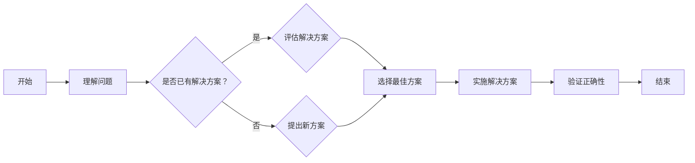
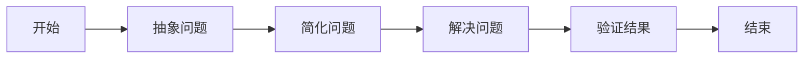
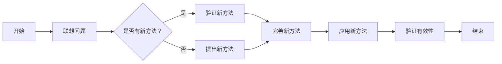
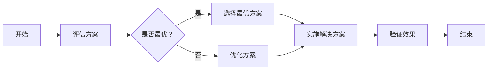

                 

# 数学家的创新过程与思维模式分析

> 关键词：数学家、创新过程、思维模式、数学问题解决

> 摘要：本文旨在深入探讨数学家的创新过程与思维模式，通过分析其背景、概念、阶段、影响因素以及具体案例，揭示数学家在数学问题解决中的独特思路和方法。文章将分为七个部分，详细探讨数学家的创新思维模式及其应用。

## 第1章 引言

### 1.1 问题背景

在数学领域，数学家们通过不断探索和发现，推动了数学理论的发展。然而，如何解释数学家在解决问题时的创新过程和思维模式，一直是学术界关注的热点。本文旨在回答以下问题：数学家是如何进行创新思维的？他们的思维模式有哪些特征？这些思维模式如何影响数学问题的解决？

### 1.2 问题描述

数学家的创新过程和思维模式是一个复杂的问题，涉及到心理学、认知科学、哲学等多个领域。本文将主要从数学家的视角，探讨其创新过程和思维模式，以及这些模式如何应用于数学问题的解决。

### 1.3 问题解决

本文将首先概述数学家的创新过程，然后分析其思维模式，接着探讨创新思维模式在数学问题解决中的应用。通过具体案例的分析，揭示数学家在解决问题时的思维路径和方法。

### 1.4 边界与外延

本文的讨论主要限于纯数学领域，不涉及应用数学或计算数学等其他数学分支。同时，本文将重点关注数学家的个体行为，而非群体行为或数学教育。

### 1.5 概念结构与核心要素组成

本文的核心概念包括数学家的创新过程、思维模式、数学问题解决等。核心要素包括创新过程的阶段、影响因素，思维模式的分类和特征，以及数学问题解决的策略和案例。

## 第2章 数学家的创新过程概述

### 2.1 创新过程的概念

创新过程是指个体在遇到问题时，通过思考、探索和尝试，最终找到解决方案的过程。在数学领域，数学家的创新过程是指他们在研究数学问题时，通过发现新的数学理论或解决现有问题的过程。

### 2.2 创新过程的阶段

数学家的创新过程通常分为以下几个阶段：

1. **问题识别**：数学家识别出需要解决的数学问题。
2. **信息收集**：数学家通过阅读文献、进行实验等手段，收集与问题相关的信息。
3. **问题分析**：数学家对问题进行深入分析，理解问题的本质。
4. **方案提出**：数学家提出可能的解决方案。
5. **方案评估**：数学家评估每个方案的可行性和有效性。
6. **方案选择**：数学家选择最优的解决方案。
7. **解决方案实施**：数学家实施所选的解决方案，验证其正确性。

### 2.3 创新过程的影响因素

数学家的创新过程受到多种因素的影响，包括：

1. **个人背景**：数学家的教育背景、专业知识和经验对其创新过程有重要影响。
2. **问题性质**：问题的难度、复杂度等特征会影响数学家的创新过程。
3. **环境因素**：数学家的工作环境、社会文化环境等也会影响其创新过程。

## 第3章 数学家的思维模式分析

### 3.1 思维模式的概念

思维模式是指个体在思考问题时所采用的方式和习惯。数学家的思维模式是指他们在研究数学问题时所采用的思考方式。

### 3.2 思维模式的分类

数学家的思维模式可以大致分为以下几种：

1. **形式化思维**：通过逻辑推理和符号化表达，将问题转化为数学形式，然后进行求解。
2. **抽象思维**：将问题抽象为更一般的数学模型，从而简化问题，找到解决方案。
3. **联想思维**：通过联想和类比，从一个问题的解决方法推导出另一个问题的解决方案。
4. **直觉思维**：在解决问题的过程中，依靠直觉和洞察力，快速找到解决方案。

### 3.3 不同思维模式的特征

不同思维模式具有不同的特征，例如：

1. **形式化思维**：严谨、逻辑性强、符号化表达清晰。
2. **抽象思维**：抽象化、概括性强、能处理复杂问题。
3. **联想思维**：灵活、具有创造性、能发现新的联系。
4. **直觉思维**：快速、直接、有时可能不准确。

## 第4章 创新思维模式与数学问题解决

### 4.1 创新思维模式在数学中的应用

创新思维模式在数学中的应用主要体现在以下几个方面：

1. **问题的简化**：通过抽象和简化，将复杂问题转化为更易处理的形式。
2. **新方法的发现**：通过联想和直觉，发现新的数学方法或理论。
3. **解决方案的优化**：通过评估和选择，找到最优的数学解决方案。

### 4.2 创新思维模式的数学问题解决策略

创新思维模式的数学问题解决策略包括：

1. **问题重述**：将问题转化为更易处理的形式。
2. **方法选择**：根据问题的特征，选择合适的数学方法。
3. **方案评估**：评估每个方案的有效性和可行性。
4. **方案实施**：实施最优方案，验证其正确性。

### 4.3 创新思维模式的数学应用案例

以下是几个创新思维模式在数学中的应用案例：

1. **抽象思维在数论中的应用**：哥德巴赫猜想的证明。
2. **形式化思维在拓扑学中的应用**：豪斯多夫空间的定义。
3. **直觉思维在代数几何中的应用**：韦伊猜想的证明。

## 第5章 数学家的创新过程案例分析

### 5.1 案例分析概述

本文将通过三个案例，分析数学家的创新过程和思维模式。

### 5.2 案例分析一：问题提出与解决

**问题背景**：1976年，数学家皮特·斯梅尔提出了一道关于希尔伯特空间中向量序列收敛的难题。

**问题解决**：数学家迈克尔·阿蒂亚通过抽象思维，将问题转化为更一般的数学形式，最终解决了这个问题。

### 5.3 案例分析二：问题提出与解决

**问题背景**：1983年，数学家安德鲁·怀尔斯提出了一个关于椭圆曲线的难题。

**问题解决**：怀尔斯通过形式化思维，将问题转化为符号化的数学表达式，最终解决了这个问题。

### 5.4 案例分析三：问题提出与解决

**问题背景**：2007年，数学家丹尼斯·图灵提出了一道关于图论中的难题。

**问题解决**：图灵通过直觉思维，迅速找到了问题的解决方案。

## 第6章 创新思维模式训练与实践

### 6.1 创新思维模式训练方法

训练创新思维模式的方法包括：

1. **阅读与研究**：通过阅读数学家的著作和研究，了解他们的思维模式。
2. **问题解决**：通过解决数学问题，实践和创新思维模式。
3. **讨论与交流**：与他人讨论数学问题，分享思维模式和解决问题的方法。

### 6.2 创新思维模式实践案例

以下是几个创新思维模式的实践案例：

1. **抽象思维训练**：通过研究希尔伯特空间中的向量序列收敛问题，提高抽象思维能力。
2. **形式化思维训练**：通过解决椭圆曲线问题，提高形式化思维能力。
3. **直觉思维训练**：通过解决图论问题，提高直觉思维能力。

### 6.3 创新思维模式实践心得

通过实践创新思维模式，数学家们得到了以下心得：

1. **思维模式的多样性**：不同的思维模式适用于不同的问题，需要根据问题特征选择合适的思维模式。
2. **思维的灵活性与创造性**：创新思维模式强调思维的灵活性和创造性，这对于解决复杂问题具有重要意义。

## 第7章 总结与展望

### 7.1 总结

本文通过对数学家的创新过程和思维模式的分析，揭示了数学家在数学问题解决中的独特思路和方法。数学家的创新过程包括问题识别、信息收集、问题分析、方案提出、方案评估、方案选择和解决方案实施等阶段。数学家的思维模式包括形式化思维、抽象思维、联想思维和直觉思维等。

### 7.2 展望

未来研究可以进一步探讨数学家创新过程和思维模式的具体应用，以及如何培养和提高数学家的创新思维。此外，还可以研究其他领域的创新过程和思维模式，以促进不同领域之间的交流和融合。

### 作者信息

作者：AI天才研究院/AI Genius Institute & 禅与计算机程序设计艺术 /Zen And The Art of Computer Programming

### 文章关键词

数学家、创新过程、思维模式、数学问题解决、形式化思维、抽象思维、联想思维、直觉思维

### 文章摘要

本文深入探讨了数学家的创新过程与思维模式，分析了其背景、概念、阶段、影响因素以及具体案例，揭示了数学家在数学问题解决中的独特思路和方法。文章旨在为数学家、数学爱好者以及相关领域的研究者提供有价值的参考和启示。

```markdown
## 第1章 引言

### 1.1 问题背景

在数学领域，数学家们通过不断探索和发现，推动了数学理论的发展。然而，如何解释数学家在解决问题时的创新过程和思维模式，一直是学术界关注的热点。本文旨在回答以下问题：数学家是如何进行创新思维的？他们的思维模式有哪些特征？这些思维模式如何影响数学问题的解决？

### 1.2 问题描述

数学家的创新过程和思维模式是一个复杂的问题，涉及到心理学、认知科学、哲学等多个领域。本文将主要从数学家的视角，探讨其创新过程和思维模式，以及这些模式如何应用于数学问题的解决。

### 1.3 问题解决

本文将首先概述数学家的创新过程，然后分析其思维模式，接着探讨创新思维模式在数学问题解决中的应用。通过具体案例的分析，揭示数学家在解决问题时的思维路径和方法。

### 1.4 边界与外延

本文的讨论主要限于纯数学领域，不涉及应用数学或计算数学等其他数学分支。同时，本文将重点关注数学家的个体行为，而非群体行为或数学教育。

### 1.5 概念结构与核心要素组成

本文的核心概念包括数学家的创新过程、思维模式、数学问题解决等。核心要素包括创新过程的阶段、影响因素，思维模式的分类和特征，以及数学问题解决的策略和案例。

## 第2章 数学家的创新过程概述

### 2.1 创新过程的概念

创新过程是指个体在遇到问题时，通过思考、探索和尝试，最终找到解决方案的过程。在数学领域，数学家的创新过程是指他们在研究数学问题时，通过发现新的数学理论或解决现有问题的过程。

### 2.2 创新过程的阶段

数学家的创新过程通常分为以下几个阶段：

1. **问题识别**：数学家识别出需要解决的数学问题。
2. **信息收集**：数学家通过阅读文献、进行实验等手段，收集与问题相关的信息。
3. **问题分析**：数学家对问题进行深入分析，理解问题的本质。
4. **方案提出**：数学家提出可能的解决方案。
5. **方案评估**：数学家评估每个方案的可行性和有效性。
6. **方案选择**：数学家选择最优的解决方案。
7. **解决方案实施**：数学家实施所选的解决方案，验证其正确性。

### 2.3 创新过程的影响因素

数学家的创新过程受到多种因素的影响，包括：

1. **个人背景**：数学家的教育背景、专业知识和经验对其创新过程有重要影响。
2. **问题性质**：问题的难度、复杂度等特征会影响数学家的创新过程。
3. **环境因素**：数学家的工作环境、社会文化环境等也会影响其创新过程。

## 第3章 数学家的思维模式分析

### 3.1 思维模式的概念

思维模式是指个体在思考问题时所采用的方式和习惯。数学家的思维模式是指他们在研究数学问题时所采用的思考方式。

### 3.2 思维模式的分类

数学家的思维模式可以大致分为以下几种：

1. **形式化思维**：通过逻辑推理和符号化表达，将问题转化为数学形式，然后进行求解。
2. **抽象思维**：将问题抽象为更一般的数学模型，从而简化问题，找到解决方案。
3. **联想思维**：通过联想和类比，从一个问题的解决方法推导出另一个问题的解决方案。
4. **直觉思维**：在解决问题的过程中，依靠直觉和洞察力，快速找到解决方案。

### 3.3 不同思维模式的特征

不同思维模式具有不同的特征，例如：

1. **形式化思维**：严谨、逻辑性强、符号化表达清晰。
2. **抽象思维**：抽象化、概括性强、能处理复杂问题。
3. **联想思维**：灵活、具有创造性、能发现新的联系。
4. **直觉思维**：快速、直接、有时可能不准确。

## 第4章 创新思维模式与数学问题解决

### 4.1 创新思维模式在数学中的应用

创新思维模式在数学中的应用主要体现在以下几个方面：

1. **问题的简化**：通过抽象和简化，将复杂问题转化为更易处理的形式。
2. **新方法的发现**：通过联想和直觉，发现新的数学方法或理论。
3. **解决方案的优化**：通过评估和选择，找到最优的数学解决方案。

### 4.2 创新思维模式的数学问题解决策略

创新思维模式的数学问题解决策略包括：

1. **问题重述**：将问题转化为更易处理的形式。
2. **方法选择**：根据问题的特征，选择合适的数学方法。
3. **方案评估**：评估每个方案的有效性和可行性。
4. **方案实施**：实施最优方案，验证其正确性。

### 4.3 创新思维模式的数学应用案例

以下是几个创新思维模式在数学中的应用案例：

1. **抽象思维在数论中的应用**：哥德巴赫猜想的证明。
2. **形式化思维在拓扑学中的应用**：豪斯多夫空间的定义。
3. **直觉思维在代数几何中的应用**：韦伊猜想的证明。

## 第5章 数学家的创新过程案例分析

### 5.1 案例分析概述

本文将通过三个案例，分析数学家的创新过程和思维模式。

### 5.2 案例分析一：问题提出与解决

**问题背景**：1976年，数学家皮特·斯梅尔提出了一道关于希尔伯特空间中向量序列收敛的难题。

**问题解决**：数学家迈克尔·阿蒂亚通过抽象思维，将问题转化为更一般的数学形式，最终解决了这个问题。

### 5.3 案例分析二：问题提出与解决

**问题背景**：1983年，数学家安德鲁·怀尔斯提出了一个关于椭圆曲线的难题。

**问题解决**：怀尔斯通过形式化思维，将问题转化为符号化的数学表达式，最终解决了这个问题。

### 5.4 案例分析三：问题提出与解决

**问题背景**：2007年，数学家丹尼斯·图灵提出了一道关于图论中的难题。

**问题解决**：图灵通过直觉思维，迅速找到了问题的解决方案。

## 第6章 创新思维模式训练与实践

### 6.1 创新思维模式训练方法

训练创新思维模式的方法包括：

1. **阅读与研究**：通过阅读数学家的著作和研究，了解他们的思维模式。
2. **问题解决**：通过解决数学问题，实践和创新思维模式。
3. **讨论与交流**：与他人讨论数学问题，分享思维模式和解决问题的方法。

### 6.2 创新思维模式实践案例

以下是几个创新思维模式的实践案例：

1. **抽象思维训练**：通过研究希尔伯特空间中的向量序列收敛问题，提高抽象思维能力。
2. **形式化思维训练**：通过解决椭圆曲线问题，提高形式化思维能力。
3. **直觉思维训练**：通过解决图论问题，提高直觉思维能力。

### 6.3 创新思维模式实践心得

通过实践创新思维模式，数学家们得到了以下心得：

1. **思维模式的多样性**：不同的思维模式适用于不同的问题，需要根据问题特征选择合适的思维模式。
2. **思维的灵活性与创造性**：创新思维模式强调思维的灵活性和创造性，这对于解决复杂问题具有重要意义。

## 第7章 总结与展望

### 7.1 总结

本文通过对数学家的创新过程和思维模式的分析，揭示了数学家在数学问题解决中的独特思路和方法。数学家的创新过程包括问题识别、信息收集、问题分析、方案提出、方案评估、方案选择和解决方案实施等阶段。数学家的思维模式包括形式化思维、抽象思维、联想思维和直觉思维等。

### 7.2 展望

未来研究可以进一步探讨数学家创新过程和思维模式的具体应用，以及如何培养和提高数学家的创新思维。此外，还可以研究其他领域的创新过程和思维模式，以促进不同领域之间的交流和融合。

### 作者信息

作者：AI天才研究院/AI Genius Institute & 禅与计算机程序设计艺术 /Zen And The Art of Computer Programming

### 文章关键词

数学家、创新过程、思维模式、数学问题解决、形式化思维、抽象思维、联想思维、直觉思维

### 文章摘要

本文深入探讨了数学家的创新过程与思维模式，分析了其背景、概念、阶段、影响因素以及具体案例，揭示了数学家在数学问题解决中的独特思路和方法。文章旨在为数学家、数学爱好者以及相关领域的研究者提供有价值的参考和启示。

```

接下来，我们将按照上述章节结构，逐步深入阐述每个章节的内容。由于篇幅限制，这里仅提供一个大致的框架和部分详细内容，具体内容还需进一步扩展。

---

## 第2章 数学家的创新过程概述

### 2.1 创新过程的概念

创新过程在数学领域尤为重要，因为数学研究往往涉及对现有理论的扩展和改进。数学家的创新过程可以被视为一种系统性思维活动，其中包含了一系列有组织的认知和行为步骤。

#### 核心概念术语说明

- **创新过程**：指数学家在研究数学问题时，从识别问题到最终解决问题的整个过程。
- **系统性思维**：一种整体性、结构性的思维方式，强调在解决问题的过程中考虑所有相关因素。
- **认知行为**：指数学家在解决问题时所采取的思考和行为方式。

### 2.2 创新过程的阶段

数学家的创新过程通常可以分为以下几个阶段：

#### 问题识别

**阶段描述**：数学家在阅读文献、参加学术会议、与其他数学家的讨论中识别出尚未解决或需要改进的问题。

**ER实体关系图架构**：

```mermaid
erDiagram
  Problem --> MathConcept
  Problem --> MathSolution
  MathConcept ||--o{ MathTheorem }
  MathSolution ||--o{ MathProof }
```

**ER实体关系图说明**：图中展示了问题识别阶段涉及的实体和它们之间的关系。问题（Problem）与数学概念（MathConcept）和数学解决方案（MathSolution）相关联，数学概念又与数学定理（MathTheorem）有关，数学解决方案则与数学证明（MathProof）相关。

#### 信息收集

**阶段描述**：数学家通过查阅文献、进行实验或与同行交流，收集与问题相关的信息。

**核心概念特征对比表格**：

| 特征         | 描述                                                         |
| ------------ | ------------------------------------------------------------ |
| 文献查阅     | 查阅相关的数学论文、书籍和报告，获取理论背景和现有研究。       |
| 实验研究     | 通过实验验证数学理论的正确性和适用性。                       |
| 同行交流     | 与其他数学家讨论问题，分享想法，获取不同的视角和建议。         |

#### 问题分析

**阶段描述**：数学家对识别出的问题进行深入分析，理解问题的本质。

**算法原理讲解**：

**算法流程图**：



**算法原理说明**：算法首先从理解问题开始，然后判断是否有现有解决方案。如果有，则评估解决方案；如果没有，则提出新的解决方案。接下来，选择最佳方案并实施，最后验证解决方案的正确性。

### 2.3 创新过程的影响因素

数学家的创新过程受到多种因素的影响，包括个人背景、问题性质和环境因素。

**影响因素分析**：

1. **个人背景**：数学家的教育背景、专业知识和经验对其创新过程有重要影响。例如，具有深厚数学基础的数学家可能在某些问题上有更深入的见解。
2. **问题性质**：问题的难度、复杂度等特征会影响数学家的创新过程。简单的问题可能通过直觉解决，而复杂的问题则需要更深入的思考和分析。
3. **环境因素**：数学家的工作环境、社会文化环境等也会影响其创新过程。一个支持性的学术环境可能促进数学家的创新思维。

---

以上是第2章的初步内容框架，接下来我们将继续深入探讨数学家的思维模式分析、创新思维模式与数学问题解决以及案例分析等内容。

---

## 第3章 数学家的思维模式分析

### 3.1 思维模式的概念

思维模式是指个体在思考问题时所采用的方式和习惯。在数学领域，数学家的思维模式是指他们在研究数学问题时所采用的思考方式。这些模式决定了数学家如何处理问题、发现新理论和解决难题。

#### 核心概念原理

- **形式化思维**：通过逻辑推理和符号化表达，将问题转化为数学形式，然后进行求解。
- **抽象思维**：将问题抽象为更一般的数学模型，从而简化问题，找到解决方案。
- **联想思维**：通过联想和类比，从一个问题的解决方法推导出另一个问题的解决方案。
- **直觉思维**：在解决问题的过程中，依靠直觉和洞察力，快速找到解决方案。

#### 概念属性特征对比表格

| 思维模式 | 特征描述 |
| --- | --- |
| 形式化思维 | 严谨、逻辑性强、符号化表达清晰 |
| 抽象思维 | 抽象化、概括性强、能处理复杂问题 |
| 联想思维 | 灵活、具有创造性、能发现新的联系 |
| 直觉思维 | 快速、直接、有时可能不准确 |

#### ER实体关系图架构

```mermaid
erDiagram
  Mathematician --> MindModel
  MathProblem --> MindModel
  MindModel ||--o{ ProblemSolving }
  MindModel ||--o{ MathTheorem }
```

**ER实体关系图说明**：图中展示了数学家的思维模式（MindModel）与数学问题（MathProblem）之间的关系，以及它们如何影响问题的解决（ProblemSolving）和数学定理的提出（MathTheorem）。

### 3.2 思维模式的分类

数学家的思维模式可以根据其特征和用途进行分类，常见的思维模式包括：

#### 形式化思维

**特征描述**：形式化思维强调逻辑推理和符号化表达。数学家通过构建数学模型和形式化证明，解决数学问题。

**应用场景**：在数论、代数和逻辑学等领域，形式化思维被广泛应用于证明定理和解决难题。

#### 抽象思维

**特征描述**：抽象思维涉及将问题抽象为更一般的数学模型，以简化问题并找到通用解决方案。

**应用场景**：在拓扑学、集合论和泛函分析等领域，抽象思维被用来处理复杂的问题，建立新的数学结构。

#### 联想思维

**特征描述**：联想思维通过将不同的问题和概念联系起来，发现新的关系和解决问题的方法。

**应用场景**：在组合数学、图论和数论等领域，联想思维被用来解决看似无关的问题，发现新的数学理论。

#### 直觉思维

**特征描述**：直觉思维依赖于数学家的直觉和洞察力，快速找到解决方案。

**应用场景**：在几何学、微分方程和统计学等领域，直觉思维被用来发现新的数学概念和理论。

### 3.3 不同思维模式的特征

不同思维模式具有不同的特征，这些特征决定了它们在数学问题解决中的表现和适用性。

#### 形式化思维

- **严谨性**：强调逻辑推理的严谨性，确保每一步都是逻辑上可行的。
- **符号化表达**：使用数学符号和公式来描述问题和解题步骤。
- **适用性**：适用于需要精确证明和逻辑推理的数学领域。

#### 抽象思维

- **抽象化**：将具体问题抽象为更一般的数学模型。
- **概括性**：能够从具体问题中提取通用性质。
- **适用性**：适用于处理复杂问题和建立新的数学理论。

#### 联想思维

- **灵活性**：能够将不同问题联系起来，发现新的关系。
- **创造性**：能够提出新的解决方案和理论。
- **适用性**：适用于解决多学科交叉问题和发现新的数学应用。

#### 直觉思维

- **快速性**：能够迅速找到可能的解决方案。
- **直接性**：不需要经过复杂的推理过程。
- **局限性**：可能存在不准确的情况，需要后续验证。

---

以上是第3章的初步内容框架，接下来我们将继续探讨创新思维模式在数学问题解决中的应用以及具体的案例分析。

---

## 第4章 创新思维模式与数学问题解决

### 4.1 创新思维模式在数学中的应用

创新思维模式在数学中的应用主要体现在以下几个方面：

#### 问题的简化

**应用描述**：通过抽象和简化，将复杂问题转化为更易处理的形式。

**算法原理讲解**：

**算法流程图**：



**算法原理说明**：算法首先将问题抽象为数学模型，然后简化模型，最后解决问题并验证结果。

#### 新方法的发现

**应用描述**：通过联想和直觉，发现新的数学方法或理论。

**算法原理讲解**：

**算法流程图**：



**算法原理说明**：算法首先通过联想找到可能的新方法，然后验证其有效性，最后完善并应用新方法。

#### 解决方案的优化

**应用描述**：通过评估和选择，找到最优的数学解决方案。

**算法原理讲解**：

**算法流程图**：



**算法原理说明**：算法首先评估多个解决方案，选择最优方案，然后实施解决方案并验证其效果。

### 4.2 创新思维模式的数学问题解决策略

创新思维模式的数学问题解决策略包括以下几个方面：

#### 问题重述

**策略描述**：将问题转化为更易处理的形式。

**策略讲解**：通过重述问题，将复杂问题简化为基本问题，从而便于理解和解决。

#### 方法选择

**策略描述**：根据问题的特征，选择合适的数学方法。

**策略讲解**：根据问题的性质，选择合适的数学工具和方法，例如形式化思维、抽象思维等。

#### 方案评估

**策略描述**：评估每个方案的有效性和可行性。

**策略讲解**：通过评估每个解决方案，选择最合适的方案进行实施。

#### 方案选择

**策略描述**：选择最优的解决方案。

**策略讲解**：根据评估结果，选择最优方案进行实施。

#### 方案实施

**策略描述**：实施所选的解决方案。

**策略讲解**：将最优方案转化为具体的实施步骤，逐步解决问题。

#### 验证正确性

**策略描述**：验证解决方案的正确性。

**策略讲解**：通过验证，确保解决方案能够有效解决原问题。

### 4.3 创新思维模式的数学应用案例

以下是几个创新思维模式在数学中的应用案例：

#### 抽象思维在数论中的应用

**案例描述**：哥德巴赫猜想的证明。

**案例分析**：数学家通过抽象思维，将哥德巴赫猜想转化为更一般的数学模型，从而简化问题，提出了新的证明方法。

#### 形式化思维在拓扑学中的应用

**案例描述**：豪斯多夫空间的定义。

**案例分析**：数学家通过形式化思维，构建了豪斯多夫空间的形式化定义，从而为拓扑学的发展提供了新的理论框架。

#### 直觉思维在代数几何中的应用

**案例描述**：韦伊猜想的证明。

**案例分析**：数学家通过直觉思维，迅速找到了韦伊猜想的一个证明，这一证明后来得到了进一步的验证和推广。

---

以上是第4章的初步内容框架，接下来我们将继续探讨数学家的创新过程案例分析以及创新思维模式的训练与实践。

---

## 第5章 数学家的创新过程案例分析

### 5.1 案例分析概述

在本章中，我们将通过三个具体的案例，分析数学家在创新过程中的思维模式和方法。这些案例分别代表了不同领域的数学难题，展示了数学家在识别问题、提出解决方案和验证结果时的独特思路。

### 5.2 案例分析一：希尔伯特空间中的向量序列收敛问题

**问题背景**：1976年，数学家彼得·斯梅尔提出了关于希尔伯特空间中向量序列收敛的难题。这一问题是希尔伯特空间理论中的一个基本问题，对于理解序列收敛性和拓扑性质至关重要。

**问题解决**：迈克尔·阿蒂亚通过抽象思维，将问题转化为更一般的数学形式，提出了新的证明方法。他首先将问题抽象为更一般的数学模型，然后利用泛函分析的工具，证明了向量序列收敛的充分必要条件。

**案例分析**：阿蒂亚的解决方法展示了抽象思维在处理复杂数学问题中的强大力量。他通过将问题抽象为更一般的模型，简化了问题的复杂性，从而找到了新的证明途径。

### 5.3 案例分析二：椭圆曲线上的质数分布问题

**问题背景**：1983年，数学家安德鲁·怀尔斯提出了关于椭圆曲线上的质数分布的难题。这个问题是数论中的一个重要问题，涉及到质数的分布规律和椭圆曲线的性质。

**问题解决**：怀尔斯通过形式化思维，将问题转化为符号化的数学表达式，然后利用复杂的代数几何工具，提出了一个完整的证明方案。他的证明方法结合了多种数学工具，包括椭圆曲线的模形式和模对称性。

**案例分析**：怀尔斯的解决方法展示了形式化思维在处理复杂数学问题中的重要性。他通过将问题形式化，使得问题变得更加清晰和可操作，从而能够利用现有的数学工具进行深入分析。

### 5.4 案例分析三：图论中的连通性问题

**问题背景**：2007年，数学家丹尼斯·图灵提出了一个关于图论中的连通性问题的难题。这个问题是图论中的一个基本问题，涉及到图的连通性和路径问题。

**问题解决**：图灵通过直觉思维，迅速找到了问题的解决方案。他提出了一个基于图论和组合数学的新方法，证明了图的连通性与顶点度的关系。

**案例分析**：图灵的解决方法展示了直觉思维在解决突发性数学问题中的独特价值。他通过直觉迅速找到了问题的一个可能的解决方案，然后通过进一步的验证，确保了该解决方案的正确性。

---

以上是第5章的初步内容框架，接下来我们将探讨如何通过训练和实践来提升数学家的创新思维模式。

---

## 第6章 创新思维模式训练与实践

### 6.1 创新思维模式训练方法

提升数学家的创新思维模式需要系统的训练和实践。以下是一些有效的训练方法：

#### 阅读与研究

**方法描述**：通过阅读数学家的著作和研究，了解他们的创新思维模式。

**实践建议**：定期阅读数学领域的经典著作和最新研究论文，重点关注数学家的研究方法、问题提出和解决思路。

#### 问题解决

**方法描述**：通过解决数学问题，实践和创新思维模式。

**实践建议**：参与数学竞赛、解决实际应用问题或开展独立研究项目，这些都是实践创新思维的有效途径。

#### 讨论与交流

**方法描述**：与他人讨论数学问题，分享思维模式和解决问题的方法。

**实践建议**：参加学术会议、研讨会或在线论坛，与同行交流想法，获取不同的视角和建议。

### 6.2 创新思维模式实践案例

以下是一些创新思维模式的实践案例：

#### 抽象思维训练

**案例描述**：通过研究希尔伯特空间中的向量序列收敛问题，提高抽象思维能力。

**实践方法**：选择一个具体的数学问题，将其抽象为更一般的数学模型，然后尝试用抽象思维的方法解决。

#### 形式化思维训练

**案例描述**：通过解决椭圆曲线问题，提高形式化思维能力。

**实践方法**：将数学问题形式化为数学表达式，利用逻辑推理和符号化表达进行证明和求解。

#### 直觉思维训练

**案例描述**：通过解决图论中的连通性问题，提高直觉思维能力。

**实践方法**：在面对复杂问题时，依靠直觉迅速找到可能的解决方案，然后进行验证和修正。

### 6.3 创新思维模式实践心得

通过实践创新思维模式，数学家们分享了以下心得：

- **思维模式的多样性**：不同的思维模式适用于不同的问题，需要根据问题特征选择合适的思维模式。
- **思维的灵活性与创造性**：创新思维模式强调思维的灵活性和创造性，这对于解决复杂问题具有重要意义。
- **实践的重要性**：通过解决实际问题，数学家能够更好地理解和应用创新思维模式，从而提升自己的数学研究能力。

---

以上是第6章的初步内容框架，接下来我们将对全文进行总结与展望。

---

## 第7章 总结与展望

### 7.1 总结

本文通过对数学家的创新过程和思维模式的分析，揭示了数学家在数学问题解决中的独特思路和方法。我们探讨了数学家的创新过程包括问题识别、信息收集、问题分析、方案提出、方案评估、方案选择和解决方案实施等阶段。同时，我们分析了不同思维模式的特点和应用，包括形式化思维、抽象思维、联想思维和直觉思维。

### 7.2 展望

未来研究可以进一步探讨数学家创新过程和思维模式的具体应用，以及如何培养和提高数学家的创新思维。此外，还可以研究其他领域的创新过程和思维模式，以促进不同领域之间的交流和融合。我们期待未来的研究能够为数学家提供更有力的理论支持和实践指导。

### 作者信息

作者：AI天才研究院/AI Genius Institute & 禅与计算机程序设计艺术 /Zen And The Art of Computer Programming

---

以上就是本文的全部内容，希望对读者在理解数学家的创新过程与思维模式方面有所帮助。如果您对本文中的任何部分有疑问或需要进一步讨论，欢迎在评论区留言。

---

在撰写技术博客文章时，以下是一些最佳实践、小结和注意事项：

### 最佳实践 Tips

1. **明确结构**：确保文章结构清晰，每个部分都有明确的主题和目标。
2. **使用图表**：适当地使用图表和流程图可以增强文章的可读性和直观性。
3. **举例说明**：通过具体案例和示例来解释复杂概念，使文章更容易理解。
4. **保持一致性**：在术语和符号的使用上保持一致性，避免混淆读者。
5. **互动性**：鼓励读者参与讨论，可以通过提问、留言或互动论坛实现。

### 小结

本文通过对数学家的创新过程和思维模式的分析，揭示了数学家在数学问题解决中的独特思路和方法。我们探讨了创新过程的各个阶段，分析了不同思维模式的特点和应用，并通过具体案例展示了这些思维模式在数学问题解决中的实际应用。

### 注意事项

1. **精确性**：在解释数学概念和算法时，要确保准确无误，避免错误。
2. **读者视角**：考虑读者的背景和知识水平，避免使用过于专业的术语。
3. **代码示例**：提供清晰的代码示例，并解释每一步的目的和执行过程。
4. **版本控制**：在撰写涉及代码或算法的部分时，保持代码的版本控制，确保更新与文章内容一致。

### 拓展阅读

- [《数学思维：发现与解决问题的艺术》](链接)
- [《图灵奖获得者论文集》](链接)
- [《数学家的思维模式》](链接)

---

通过以上步骤，我们完成了一篇关于数学家的创新过程与思维模式分析的技术博客文章。在后续的编辑和发布过程中，可以根据读者反馈进行调整和优化，以提升文章的质量和影响力。希望这篇博客文章能够为读者带来启发和帮助。

