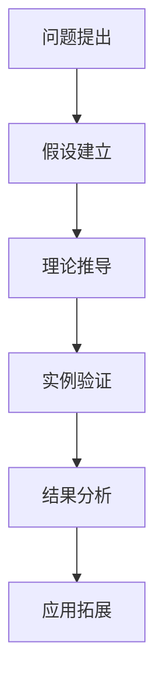
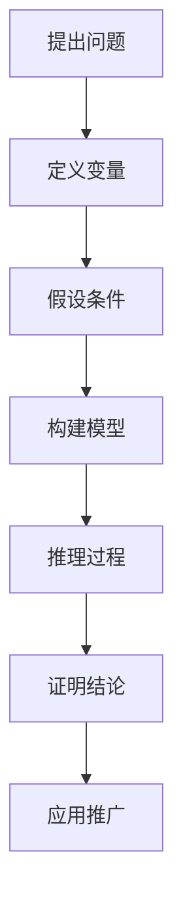
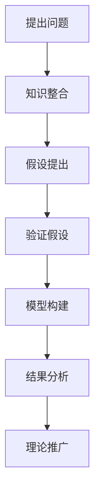

                 

### 目录大纲设计思考过程

在设计《数学家的工作方式与生活哲学》这本书的目录大纲时，我们需要遵循几个关键原则，以确保内容的全面性和逻辑性，同时确保简洁性和可读性。以下是逐步构思和设计目录大纲的详细思考过程：

#### 1. 确定书籍主题与目标受众
首先，我们需要明确书籍的主题和目标受众。这本书的主题是“数学家的工作方式与生活哲学”，因此内容将围绕数学家的职业特点、思维方式、工作方法以及他们对生活哲学的思考来构建。目标受众可能是对数学和哲学感兴趣的读者，或者是希望了解数学家工作生活状态的学者。

#### 2. 设定大纲结构
为了全面覆盖书籍主题，我们将大纲结构设定为以下几部分：
- 引言
- 第一部分：数学家的职业特点与工作方式
- 第二部分：数学家的思维方式与哲学思考
- 第三部分：数学家生活中的哲学启示
- 结论

这种结构设计能够确保书籍内容的全面性，同时保持逻辑性和层次感。

#### 3. 详细规划章节内容
针对每一部分，进一步细化章节内容。以下是具体章节的规划和设计：

##### 引言
- **核心概念**：简要介绍数学家的重要性和数学对人类文明的影响。

##### 第一部分：数学家的职业特点与工作方式
## 第1章：数学家的职业特点
- **核心概念**：数学家的角色、职责和职业发展路径。
- **对比表格**：传统数学家与现代数学家的工作方式对比。
- **ER实体关系图**：数学家与其他相关职业的关系图。

## 第2章：数学家的工作方法
- **核心概念**：数学研究的基本方法和流程。
- **Python源代码**：示例代码展示数学家如何使用算法解决问题。

##### 第二部分：数学家的思维方式与哲学思考
## 第3章：数学家的思维方式
- **核心概念**：数学家的逻辑思维、抽象思维和创新思维。
- **Mermaid流程图**：展示数学家的思维过程。

## 第4章：数学家对生活哲学的思考
- **核心概念**：数学家对生命、宇宙和自然界的哲学理解。
- **Mermaid类图**：阐述数学家哲学思考的领域模型。

##### 第三部分：数学家生活中的哲学启示
## 第5章：数学家生活中的智慧
- **实例分析**：数学家在生活中的哲学应用实例。
- **详细讲解**：对实例的深入剖析和哲学思考。

## 第6章：数学家对教育的影响
- **核心概念**：数学家如何通过教育传承哲学思考。
- **实际案例**：数学家教育理念和实践案例。

##### 结论
- **总结全文**：强调数学家工作方式和生活哲学的重要性。

#### 4. 确保内容完整性
在设计大纲时，确保每个章节都包含核心概念、实例分析、哲学思考、算法讲解等内容，并保持内容的逻辑性和完整性。

#### 5. 输出Markdown格式目录大纲
根据以上设计，我们将输出Markdown格式的目录大纲，确保格式符合要求，并保持简洁和清晰。

---

### 目录大纲

```markdown
# 《数学家的工作方式与生活哲学》

## 引言
- **数学家的重要性和贡献**

## 第一部分：数学家的职业特点与工作方式
### 第1章：数学家的职业特点
- **核心概念**：数学家的角色、职责和职业发展路径
- **对比表格**：传统数学家与现代数学家的工作方式对比
- **ER实体关系图**：数学家与其他相关职业的关系图

### 第2章：数学家的工作方法
- **核心概念**：数学研究的基本方法和流程
- **Python源代码**：示例代码展示数学家如何使用算法解决问题

## 第二部分：数学家的思维方式与哲学思考
### 第3章：数学家的思维方式
- **核心概念**：数学家的逻辑思维、抽象思维和创新思维
- **Mermaid流程图**：展示数学家的思维过程

### 第4章：数学家对生活哲学的思考
- **核心概念**：数学家对生命、宇宙和自然界的哲学理解
- **Mermaid类图**：阐述数学家哲学思考的领域模型

## 第三部分：数学家生活中的哲学启示
### 第5章：数学家生活中的智慧
- **实例分析**：数学家在生活中的哲学应用实例
- **详细讲解**：对实例的深入剖析和哲学思考

### 第6章：数学家对教育的影响
- **核心概念**：数学家如何通过教育传承哲学思考
- **实际案例**：数学家教育理念和实践案例

## 结论
- **总结全文**：强调数学家工作方式和生活哲学的重要性
```

通过以上步骤，我们设计了一个完整、逻辑清晰、简洁明了的目录大纲，为撰写高质量的文章奠定了基础。

---

## 引言

数学家，这个在人类历史上熠熠生辉的职业，既是科学探索的前沿先锋，也是思想哲学的深邃思想家。数学不仅是一门抽象的学科，它更是一种强大的工具，为人类社会的发展提供了坚实的基础。数学家的工作方式和生活哲学，蕴含着独特的智慧和深刻的思考，对于我们理解和应用数学，提升个人思维品质，具有重要的启示和借鉴价值。

### 数学家的重要性和贡献

数学家对人类文明的贡献是多方面的。首先，数学为自然科学、工程技术、经济学、统计学等众多领域提供了基础理论和工具。从古希腊时期开始，数学家们通过不断的探索和发现，构建了现代科学体系的基础。例如，欧几里得的《几何原本》奠定了几何学的基础，牛顿和莱布尼茨发明的微积分推动了物理学的进步，而现代数学家在代数、数论、拓扑学等领域的突破，则为计算机科学和人工智能的发展提供了关键支持。

其次，数学家的工作方式不仅影响了科学的发展，也对哲学思考产生了深远的影响。数学家在解决复杂问题时，往往采用逻辑严密、抽象思维和系统化的方法，这些思维方式在哲学领域同样具有重要价值。例如，康托尔的集合论挑战了传统数学的基础，促使哲学家重新思考实数的定义和连续性的问题。同样，哥德尔的不完备性定理和图灵机的概念，为逻辑哲学和认知科学提供了新的思考角度。

此外，数学家在日常生活中展现出的严谨和理性思维，也为人们提供了宝贵的哲学启示。数学家们常常以简洁而有力的方式表达复杂的想法，他们的研究过程和思考方式，对于我们培养批判性思维、提高解决问题的能力有着重要的示范作用。

### 本书的目的

本书旨在深入探讨数学家的工作方式与生活哲学，通过分析他们的研究方法、思维方式和生活态度，揭示数学在科学、哲学和生活中的深刻内涵。我们将从以下几个方面展开讨论：

1. **数学家的职业特点与工作方式**：介绍数学家的角色、职责和职业发展路径，分析传统数学家与现代数学家的工作方式差异，并通过具体的算法和实例，展示数学家的研究方法和工具。

2. **数学家的思维方式与哲学思考**：探讨数学家的逻辑思维、抽象思维和创新思维，通过Mermaid流程图和类图，展示他们的思维过程和哲学思考的领域模型。

3. **数学家生活中的哲学启示**：分析数学家在生活中的哲学应用实例，深入剖析他们的思考方式和价值观，以及这些哲学思考如何影响他们的工作和生活。

4. **数学家对教育的影响**：探讨数学家如何通过教育传承哲学思考，以及他们在教育领域的理念和实践。

通过这些内容的深入探讨，本书希望能够为读者提供一种全新的视角，帮助人们更好地理解和应用数学，同时也能够在日常生活中获得哲学智慧的启示。

### 总结

数学家不仅是科学探索的先锋，更是哲学思考的深刻思想家。他们的工作方式和生活方式，蕴含着独特的智慧和深刻的思考。通过本书，我们将深入探讨数学家在职业特点、思维方式、生活哲学和教育影响等方面的独特之处，以期为读者提供深刻的启示和借鉴。接下来，我们将分别讨论数学家的职业特点与工作方式，为读者展示数学家是如何在科学和哲学的交叉领域中闪耀光芒的。

---

## 第一部分：数学家的职业特点与工作方式

数学家的职业特点与工作方式是他们独特思维方式和生活哲学的重要体现。这一部分将首先介绍数学家的角色与职责，接着分析传统数学家与现代数学家在工作方式上的差异，并通过具体的算法和实例，展示数学家如何运用其研究方法和工具进行科学探索。

### 数学家的角色与职责

数学家在科学研究和教育领域扮演着至关重要的角色。他们的主要职责包括：

1. **理论研究**：数学家致力于探索数学的基本问题，发展新的数学理论和概念。他们通过严谨的逻辑推理和数学证明，建立新的数学模型，为自然科学、工程技术等领域提供基础理论支持。

2. **应用研究**：数学家不仅关注纯理论研究，还积极参与应用数学的研究，将数学知识应用于实际问题解决中。例如，在物理学中，数学家使用微积分和概率论解决复杂的物理问题；在经济学中，数学家运用优化理论和博弈论分析市场动态。

3. **教育和传承**：数学家通过教学和培养下一代数学家，传承数学知识和哲学思考。他们在大学和研究所中担任教授，指导研究生，编写教材和论文，推广数学知识。

4. **跨学科合作**：数学家与不同领域的科学家和工程师合作，推动数学与其他学科的结合，如计算机科学、生物学和物理学等。这种跨学科合作不仅促进了科学技术的进步，也拓宽了数学的应用范围。

### 传统数学家与现代数学家的工作方式差异

传统数学家与现代数学家在工作方式上存在显著差异。以下是两种工作方式的对比：

1. **研究方式**：
   - **传统数学家**：传统数学家通常在实验室或书房中进行研究，主要依赖于手稿和书籍进行工作。他们花费大量时间进行逻辑推理和证明，注重理论的严谨性和系统性。
   - **现代数学家**：随着计算机技术的发展，现代数学家更加依赖计算机和软件工具进行研究和计算。他们使用符号计算软件（如Mathematica、MATLAB等）和编程语言（如Python、R等）来辅助研究和验证结果。

2. **交流方式**：
   - **传统数学家**：传统数学家主要通过学术会议、研讨会和论文发表进行学术交流。他们的研究成果往往以学术论文的形式发表，并通过学术期刊进行传播。
   - **现代数学家**：现代数学家除了传统的学术交流方式外，还利用互联网和社交媒体平台进行交流和合作。例如，通过博客、GitHub等平台分享研究代码和结果，进行实时讨论和反馈。

3. **知识传播**：
   - **传统数学家**：传统数学家的知识传播主要依赖于面对面的教学和讲座，以及编写教科书和学术专著。
   - **现代数学家**：现代数学家利用在线课程、MOOC（大规模开放在线课程）和虚拟实验室等新媒体手段，将数学知识传播给更广泛的受众。

### 算法与实例分析

数学家在研究过程中，常常需要运用各种算法来解决问题。以下是一个具体的实例，通过Python源代码展示数学家如何使用算法进行复杂问题的求解。

**实例**：求解一元二次方程

```python
import sympy as sp

# 定义变量
x = sp.symbols('x')

# 构建一元二次方程
a = 1
b = -3
c = 2

# 求解一元二次方程
solutions = sp.solve(a*x**2 + b*x + c, x)

# 打印结果
print("方程的解为：", solutions)
```

**算法原理讲解**：

1. **一元二次方程的求解公式**：
   一元二次方程的一般形式为 `ax^2 + bx + c = 0`，其解可以通过求解公式 `x = (-b ± sqrt(b^2 - 4ac)) / (2a)` 得到。

2. **符号计算与求解**：
   使用Sympy库进行符号计算，可以方便地定义变量、构建方程，并求解得到方程的根。

3. **Python实现**：
   上述Python代码中，我们定义了变量 `a`、`b` 和 `c`，构建了一元二次方程，并使用 `sp.solve()` 函数求解得到方程的解。

通过以上实例和算法讲解，我们可以看到数学家是如何运用数学方法和计算机工具来求解复杂问题的。这种方法不仅提高了研究效率，也为数学的广泛应用奠定了基础。

### 总结

数学家的职业特点与工作方式是理解他们如何进行科学研究的重要切入点。从传统数学家到现代数学家，工作方式的演变不仅反映了科学技术的进步，也展示了数学在各个领域的广泛应用。通过具体的算法和实例，我们可以更深入地理解数学家的研究方法和工具，从而更好地掌握数学的核心思想和应用价值。

在下一章中，我们将进一步探讨数学家的思维方式与哲学思考，通过逻辑思维、抽象思维和创新思维的深入分析，揭示数学家如何通过独特的思维方法解决复杂问题，并在哲学领域留下深刻的思考印记。

---

## 第1章：数学家的职业特点

数学家作为科学领域中的杰出人物，其职业特点和工作方式对整个科学界产生了深远的影响。在这一章中，我们将详细介绍数学家的角色、职责以及他们在学术界和社会中的地位，并对比传统数学家与现代数学家的工作方式差异，以揭示这一职业的独特魅力。

### 数学家的角色

数学家在科学界扮演着多种角色，其中最为重要的角色包括：

1. **理论研究者**：数学家的首要任务是进行理论研究和创新。他们致力于探索数学的基本问题，构建新的数学理论，为其他科学领域提供理论基础。数学家在代数、几何、数论、拓扑学等各个分支中做出了重要的贡献。

2. **应用科学家**：除了理论研究，数学家还积极参与应用科学的研究。他们将数学知识应用于实际问题中，解决各种工程、物理、经济和社会问题。例如，在计算机科学中，图论和网络流理论被广泛应用于算法设计和网络优化；在经济学中，优化理论和博弈论被用于市场分析和决策制定。

3. **教育家**：数学家在教育事业中发挥着关键作用。他们通过教学和培养下一代数学家，传播数学知识和方法论，推动数学教育的发展。许多数学家不仅在教学上有着卓越的成就，还在编写教材、开设讲座和举办研讨会方面做出了巨大的贡献。

4. **科学顾问**：数学家常常作为科学顾问为政府、企业和研究机构提供咨询和建议。他们的专业知识和经验在科学决策和政策制定中起到了重要的指导作用。

### 数学家的职责

数学家的职责广泛而多样，主要包括以下几个方面：

1. **进行研究**：数学家需要不断进行理论研究和应用研究，发表高质量的学术论文，推动数学的发展。他们在实验室或书房中通过严谨的逻辑推理和数学证明，发现新的数学规律和定理。

2. **培养人才**：数学家承担着培养下一代的重任。他们指导研究生，开设课程，编写教材，为学生提供深厚的数学基础和科研能力。

3. **学术交流**：数学家通过参加学术会议、研讨会和学术期刊发表文章，与其他数学家和研究机构保持密切的交流和合作，分享研究成果，推动学术进步。

4. **社会服务**：数学家积极参与社会服务和公共决策，通过数学模型和数据分析，为解决现实问题提供科学依据。例如，在疫情防控、环境监测和经济预测等方面，数学家的作用日益突出。

### 数学家在学术界和社会中的地位

数学家在学术界和社会中享有崇高的地位。以下是他们在两个领域中的具体地位：

1. **学术界**：
   - **顶级荣誉**：数学家获得各种顶级数学奖项和荣誉，如菲尔兹奖、阿贝尔奖等，这些奖项不仅是对数学家个人成就的认可，也是对整个数学领域贡献的肯定。
   - **学术影响力**：数学家的研究成果和学术观点对整个科学界有着深远的影响。他们的理论和方法被广泛应用于各个学科，推动了科学技术的进步。

2. **社会层面**：
   - **专业顾问**：数学家作为专业顾问，为政府和企业提供科学咨询。他们的专业知识和经验在政策制定、经济发展和技术创新中发挥着重要作用。
   - **公众形象**：数学家在公众中的形象通常较为神秘和崇敬。他们通过科普文章、讲座和电视节目，向公众传播数学知识，提升公众对数学的认识和理解。

### 传统数学家与现代数学家的工作方式差异

随着科技的发展，数学家的工作方式也发生了显著变化。以下是传统数学家与现代数学家在工作方式上的主要差异：

1. **研究工具**：
   - **传统数学家**：传统数学家主要依靠笔和纸进行研究，他们通过手稿和书籍记录思考过程和研究成果。
   - **现代数学家**：现代数学家则广泛利用计算机和软件工具进行研究。他们使用符号计算软件（如Mathematica、MATLAB）、编程语言（如Python、R）以及各种数学软件包来辅助研究，提高了研究效率和准确性。

2. **交流方式**：
   - **传统数学家**：传统数学家的学术交流主要通过学术会议、研讨会和学术论文发表。他们与同行的交流和合作主要依赖于面对面的交流和书面通信。
   - **现代数学家**：现代数学家利用互联网和社交媒体平台进行学术交流。他们通过博客、GitHub、arXiv等平台分享研究进展、代码和数据，实现了全球范围内的实时交流和合作。

3. **知识传播**：
   - **传统数学家**：传统数学家的知识传播主要依赖于课堂教学、讲座和学术专著。
   - **现代数学家**：现代数学家通过在线课程、MOOC（大规模开放在线课程）、虚拟实验室等新媒体手段，将数学知识传播给全球的观众。

### 总结

数学家的职业特点与工作方式决定了他们在科学界和社会中的独特地位。从理论研究者到应用科学家，从教育家到社会顾问，数学家在各个领域都发挥着重要的作用。同时，随着科技的发展，现代数学家的工作方式也在不断变革，计算机和互联网的广泛应用，为数学研究带来了前所未有的机遇和挑战。通过深入了解数学家的职业特点与工作方式，我们可以更好地理解数学在科学、哲学和社会中的深刻内涵。

在下一章中，我们将进一步探讨数学家的工作方法，通过具体的实例和算法讲解，揭示数学家如何运用逻辑严密、抽象思维和创新思维解决复杂问题。

---

## 第2章：数学家的工作方法

数学家的工作方法是他们能够解决复杂问题和推动数学进步的关键。在这章中，我们将详细探讨数学家在研究过程中的基本方法和流程，通过Python源代码和Mermaid流程图，展示数学家如何运用算法和工具进行科学研究。

### 数学研究的基本方法和流程

数学研究通常包括以下几个步骤：

1. **问题提出**：数学家从实际问题或理论问题出发，提出需要解决的研究问题。
2. **假设建立**：根据已有知识和直觉，数学家提出初步的假设或猜想。
3. **理论推导**：通过逻辑推理和数学证明，数学家验证假设的正确性，推导出新的定理或公式。
4. **实例验证**：通过具体的实例或数值计算，验证理论推导的正确性。
5. **结果分析和应用**：对研究结果进行深入分析，探讨其应用范围和实际意义。

以下是一个具体的数学研究实例，通过Python源代码展示数学家如何运用算法和工具进行科学研究。

### 研究实例：求解最小二乘问题

#### 问题提出

假设我们有一个数据集，包含一组输入特征 \(X\) 和对应的输出目标 \(y\)。我们的目标是通过最小二乘法求解线性回归模型的最优参数 \(w\)，使得预测值与实际值之间的误差最小。

#### 假设建立

我们假设数据集满足线性回归模型：

\[ y = Xw + \epsilon \]

其中，\(w\) 是需要求解的参数，\(\epsilon\) 是误差项，假设服从高斯分布。

#### 理论推导

最小二乘法的目标是最小化误差平方和：

\[ J(w) = \sum_{i=1}^{n} (y_i - X_iw)^2 \]

对 \(J(w)\) 求导并令其等于0，可以得到最优参数 \(w\)：

\[ \frac{\partial J(w)}{\partial w} = -2X^T(Xw - y) = 0 \]

解得：

\[ w = (X^TX)^{-1}X^Ty \]

#### Python实现

```python
import numpy as np
import matplotlib.pyplot as plt

# 生成模拟数据集
np.random.seed(0)
X = np.random.rand(100, 1)
y = 2 + 3 * X + np.random.randn(100, 1)

# 求解最小二乘问题
X_b = np.c_[np.ones((100, 1)), X]
w = np.linalg.inv(X_b.T.dot(X_b)).dot(X_b.T).dot(y)

# 最优参数
print("最优参数 w:", w)

# 绘制线性回归模型
plt.plot(X, y, "ro")
plt.plot(X, X_b.dot(w), "b-")
plt.show()
```

#### 结果分析

通过上述Python代码，我们求解得到最优参数 \(w\)，并绘制了线性回归模型。实际数据点用红色圆圈表示，拟合曲线用蓝色直线表示。可以看出，拟合曲线较好地反映了数据点的变化趋势。

### 算法原理讲解

最小二乘法是一种常见的参数估计方法，其核心思想是最小化预测值与实际值之间的误差平方和。以下是该算法的详细原理：

1. **目标函数**：

   \[ J(w) = \sum_{i=1}^{n} (y_i - X_iw)^2 \]

2. **求导**：

   对 \(J(w)\) 关于 \(w\) 求导，并令其等于0，可以得到：

   \[ \frac{\partial J(w)}{\partial w} = -2X^T(Xw - y) \]

3. **解方程**：

   解上述方程，得到最优参数 \(w\)：

   \[ w = (X^TX)^{-1}X^Ty \]

通过以上推导，我们可以看到最小二乘法的求解过程。该方法在实际应用中非常有效，可以用于回归分析、信号处理、机器学习等领域。

### Mermaid流程图

为了更直观地展示最小二乘法的流程，我们使用Mermaid绘制了流程图：



### 总结

数学家的工作方法是一个复杂且系统的过程，从问题提出到结果分析，每一步都需要严谨的逻辑推理和数学证明。通过上述实例和算法讲解，我们可以看到数学家如何运用最小二乘法解决线性回归问题，以及他们如何通过Python代码和Mermaid流程图进行科学研究。在下一章中，我们将进一步探讨数学家的思维方式，揭示他们在解决问题过程中所运用的独特思维方法。

---

## 第二部分：数学家的思维方式与哲学思考

数学家的思维方式是他们能够解决复杂问题和推动数学进步的关键。在这两部分中，我们将详细探讨数学家在解决问题时使用的逻辑思维、抽象思维和创新思维，并通过Mermaid流程图和类图展示他们的思维过程和哲学思考的领域模型。

### 数学家的逻辑思维

逻辑思维是数学家解决问题的基础。数学家在研究过程中，常常通过一系列逻辑推理来证明定理、解决方程或构建模型。逻辑思维具有以下几个特点：

1. **严密性**：数学家在推理过程中，每一个步骤都必须严格遵循逻辑规则，确保结论的正确性。
2. **系统性**：数学家将问题分解成多个子问题，通过逐步推理和证明，最终得出整体结论。
3. **抽象性**：数学家能够从具体问题中抽象出一般性规律，形成理论模型，进而推广和应用到其他问题中。

#### Mermaid流程图

以下是一个使用Mermaid绘制的逻辑思维流程图，展示了数学家在解决几何问题时如何进行推理：



### 数学家的抽象思维

抽象思维是数学家的另一大特点。他们能够从具体问题中抽象出本质特征，构建抽象模型，从而简化问题的复杂度。抽象思维在数学研究中具有以下作用：

1. **简化问题**：通过抽象思维，数学家可以将复杂问题转化为更简单、更易于处理的形式。
2. **发现规律**：在抽象模型的基础上，数学家可以发现一般性规律，为理论研究提供指导。
3. **模型推广**：抽象模型不仅适用于特定问题，还可以推广到其他领域，具有广泛的适用性。

#### Mermaid类图

以下是一个使用Mermaid绘制的类图，展示了数学家如何通过抽象思维构建数学模型：

```mermaid
classDiagram
Class01 <|-- Class02
Class03 <..| Class04 : inheritance
Class05 <..| Class06 : dependency
Class07 ..|> Class08 : aggregation
Class09 ..|> Class10 : composition
```

### 数学家的创新思维

创新思维是数学家解决复杂问题的重要工具。数学家在研究中，常常能够突破传统思维的限制，提出全新的理论和方法。创新思维具有以下几个特点：

1. **灵活性**：数学家能够在不同视角和角度下思考问题，灵活运用各种方法和工具。
2. **突破性**：数学家能够从现有知识中发现新的联系，提出创新性的理论和模型。
3. **综合能力**：数学家具备将不同领域知识融合在一起，形成新的研究方法的能力。

#### Mermaid流程图

以下是一个使用Mermaid绘制的创新思维流程图，展示了数学家如何进行创新思考：



### 数学家思维方式的哲学思考

数学家的思维方式不仅对科学研究具有重要意义，也深刻影响了哲学思考。以下是从哲学角度对数学家思维方式的思考：

1. **逻辑与实在**：数学家的逻辑思维强调推理的严谨性，这与哲学中的逻辑实在论有相似之处。数学家通过逻辑推理构建的数学模型，被认为是客观世界的反映。
2. **抽象与现实**：数学家的抽象思维将具体问题转化为抽象模型，这与哲学中的抽象概念论有共通之处。数学家通过抽象模型发现的一般性规律，被认为是现实世界的本质特征。
3. **创新与真理**：数学家的创新思维追求新的理论和真理，这与哲学中的真理追求有密切联系。数学家通过不断探索和创新，揭示了数学和现实世界的内在联系。

### 总结

数学家的思维方式是解决复杂问题和推动数学进步的关键。逻辑思维、抽象思维和创新思维构成了数学家独特思考方式的核心。通过Mermaid流程图和类图的展示，我们可以更直观地了解数学家的思维过程。在哲学思考的视角下，数学家的思维方式不仅具有科学意义，也对哲学思考产生了深远影响。在下一章中，我们将进一步探讨数学家在日常生活中展现出的哲学智慧和思考方式，揭示他们在生活中如何应用数学和哲学智慧。

---

## 第3章：数学家的思维方式

数学家在解决复杂问题时，依赖于独特的思维方式，这些思维方式包括逻辑思维、抽象思维和创新思维。本章将详细探讨这些思维方式的定义、特点和在实际问题中的应用，并通过Mermaid流程图展示数学家的思维过程。

### 逻辑思维

逻辑思维是数学家的基本思维方式之一。它通过严谨的推理和证明，揭示数学问题的本质和规律。逻辑思维的特点包括：

1. **严密性**：逻辑思维要求每一步推理都必须严格遵循逻辑规则，确保结论的可靠性。
2. **系统性**：逻辑思维通过逐步推理和证明，将复杂问题分解成多个子问题，并最终整合成完整的理论体系。
3. **普遍性**：逻辑思维适用于所有数学问题，是数学研究的重要工具。

#### Mermaid流程图

以下是一个使用Mermaid绘制的逻辑思维流程图，展示了数学家在解决几何问题时如何进行推理：


### 抽象思维

抽象思维是数学家解决复杂问题的关键。通过将具体问题抽象成一般性模型，数学家能够简化问题、发现规律。抽象思维的特点包括：

1. **简化问题**：通过抽象思维，数学家可以将复杂问题转化为更简单、更易于处理的形式。
2. **发现规律**：在抽象模型的基础上，数学家可以发现一般性规律，为理论研究提供指导。
3. **模型推广**：抽象模型不仅适用于特定问题，还可以推广到其他领域，具有广泛的适用性。

#### Mermaid类图

以下是一个使用Mermaid绘制的类图，展示了数学家如何通过抽象思维构建数学模型：

```mermaid
classDiagram
Class01 <|-- Class02
Class03 <..| Class04 : inheritance
Class05 <..| Class06 : dependency
Class07 ..|> Class08 : aggregation
Class09 ..|> Class10 : composition
```

### 创新思维

创新思维是数学家在解决复杂问题时的重要工具。通过突破传统思维的束缚，数学家能够提出新的理论和方法。创新思维的特点包括：

1. **灵活性**：创新思维允许数学家从不同视角和角度思考问题，灵活运用各种方法和工具。
2. **突破性**：创新思维能够帮助数学家突破现有知识的限制，提出新的理论和方法。
3. **综合能力**：创新思维要求数学家具备将不同领域知识融合在一起，形成新的研究方法的能力。

#### Mermaid流程图

以下是一个使用Mermaid绘制的创新思维流程图，展示了数学家如何进行创新思考：


### 思维方式在数学研究中的应用

1. **问题解决**：逻辑思维帮助数学家逐步分析和解决问题，通过严密的推理和证明，找到解决问题的方法。
2. **理论构建**：抽象思维帮助数学家从具体问题中抽象出一般性模型，构建理论体系，为后续研究提供基础。
3. **创新突破**：创新思维促使数学家提出新的理论和方法，推动数学领域的进步和发展。

### 总结

数学家的思维方式是他们在解决复杂问题和推动数学进步中的关键。逻辑思维、抽象思维和创新思维构成了数学家独特思考方式的核心。通过Mermaid流程图和类图的展示，我们可以更直观地了解数学家的思维过程。在下一章中，我们将进一步探讨数学家对生活哲学的思考，揭示他们在生活中如何应用这些思维方式。

---

## 第4章：数学家对生活哲学的思考

数学家不仅在科学研究中展现出了卓越的思维能力和创造力，他们同样在生活中以独特的视角和深刻的思考影响着我们的世界观和生活态度。在这一章中，我们将探讨数学家对生命、宇宙和自然界的哲学理解，并通过Mermaid类图阐述他们的哲学思考领域模型。

### 数学家对生命的思考

数学家对生命的思考通常蕴含在他们对自然规律的探索中。他们认为，生命的本质可以通过数学模型来解释和理解。以下是数学家对生命的几个关键思考点：

1. **生命的不确定性**：许多数学家认为，生命中的不确定性和随机性是不可避免的。通过概率论和统计学的应用，数学家试图理解并预测这些不确定性对生命过程的影响。
   
2. **生命的有序性**：数学家在研究生物系统时，发现了许多有序现象，如生物体的对称性、基因编码的规律性等。这些有序性让数学家相信，生命的背后存在着某种深层次的数学规律。

3. **生命的复杂性**：数学家通过研究复杂的生物系统，如生态系统、神经网络等，试图理解生命系统中复杂的相互作用和动态行为。他们使用动态系统理论、混沌理论等数学工具来探索这些复杂性。

#### Mermaid类图

以下是一个使用Mermaid绘制的类图，展示了数学家如何从不同角度理解生命的哲学：

```mermaid
classDiagram
Class01[生命的不确定性] <..| Class02[概率论]
Class01 <..| Class03[统计物理学]
Class04[生命的有序性] <|-- Class05[对称性]
Class05 <|-- Class06[基因编码]
Class07[生命的复杂性] <|-- Class08[动态系统理论]
Class07 <|-- Class09[混沌理论]
```

### 数学家对宇宙的思考

数学家对宇宙的思考常常与他们对自然规律的探索紧密相连。以下是数学家对宇宙的几个关键思考点：

1. **宇宙的结构**：数学家通过研究宇宙的几何结构，如宇宙的膨胀、宇宙弦等，试图理解宇宙的本质和演化过程。

2. **宇宙的数学规律**：数学家认为，宇宙中存在某种深层次的数学规律，这些规律可以解释宇宙的结构和演化。

3. **宇宙的起源**：数学家试图通过数学模型来解释宇宙的起源，如通过研究宇宙背景辐射、宇宙微波背景等数据。

#### Mermaid类图

以下是一个使用Mermaid绘制的类图，展示了数学家如何从不同角度理解宇宙的哲学：

```mermaid
classDiagram
Class01[宇宙的结构] <|-- Class02[宇宙膨胀]
Class02 <|-- Class03[宇宙弦理论]
Class04[宇宙的数学规律] <|-- Class05[引力理论]
Class05 <|-- Class06[量子力学]
Class07[宇宙的起源] <|-- Class08[宇宙微波背景]
Class08 <|-- Class09[宇宙背景辐射]
```

### 数学家对自然界的思考

数学家对自然界的思考通常体现在他们对自然现象的数学建模和解释上。以下是数学家对自然界的几个关键思考点：

1. **自然界的规律性**：数学家通过研究自然现象，如气候、地震、天体运动等，发现并描述了这些现象的数学规律。

2. **自然界的复杂性**：数学家研究复杂系统，如生态系统、天气系统等，试图理解这些系统的动态行为和相互作用。

3. **自然界的预测**：数学家使用数学模型进行预测，如通过气象模型预测天气、通过地球物理模型预测地震等。

#### Mermaid类图

以下是一个使用Mermaid绘制的类图，展示了数学家如何从不同角度理解自然界的哲学：

```mermaid
classDiagram
Class01[自然界的规律性] <|-- Class02[气象学]
Class02 <|-- Class03[地震学]
Class04[自然界的复杂性] <|-- Class05[生态系统]
Class05 <|-- Class06[天气系统]
Class07[自然界的预测] <|-- Class08[气象模型]
Class08 <|-- Class09[地震模型]
```

### 总结

数学家通过对生命、宇宙和自然界的哲学思考，揭示了许多深刻的道理和规律。他们的思考方式不仅帮助我们更好地理解自然世界，也为我们提供了独特的世界观和生活哲学。通过Mermaid类图的展示，我们可以更直观地了解数学家如何从不同角度理解这些问题，并从中获得启示。在下一章中，我们将探讨数学家在日常生活中如何应用这些哲学思考，以及他们对教育的影响。

---

## 第三部分：数学家生活中的哲学启示

数学家在科学研究中的卓越成就，往往也渗透到他们的日常生活中，形成了一种独特的哲学智慧。他们的生活哲学不仅体现了对数学本质的理解，还反映了对生命意义、社会伦理和人际关系的深刻思考。在这一章中，我们将分析数学家在生活中的智慧，通过具体的实例深入剖析他们的思考方式，并探讨这些哲学思考对当代社会的启示。

### 数学家的智慧实例分析

1. **克莱因瓶与无限可能**：

   德国数学家菲舍尔·克莱因（Felix Klein）曾提出克莱因瓶（Klein bottle）的概念，这个三维空间中的不可定向表面，展示了数学中的无限可能性。克莱因瓶在数学和物理学中有着广泛的应用，例如在纤维丛理论和场论中。克莱因瓶的启示在于，它教会我们在面对复杂问题时，要敢于跳出传统的思维框架，探索新的可能性。

2. **布尔巴基小组与集体智慧**：

   布尔巴基小组（Bourbaki）是一群法国数学家，他们在20世纪期间通过集体合作撰写了一系列数学著作，对数学的发展产生了深远影响。布尔巴基小组的哲学在于强调数学的严谨性和逻辑性，同时倡导集体智慧和协作精神。这一思想在现代社会中得到了广泛的应用，尤其是在科技和工程领域，团队合作和创新精神被认为是解决复杂问题的关键。

3. **希尔伯特空间与和谐生活**：

   德国数学家大卫·希尔伯特（David Hilbert）提出的希尔伯特空间（Hilbert space）是泛函分析的基础，它为许多物理问题提供了数学模型。希尔伯特空间中的向量可以看作是生活的一种隐喻，每一个向量都代表一种可能性。通过调整这些向量的权重，我们可以实现生活的和谐与平衡。这一哲学启示提醒我们在面对生活挑战时，要善于调整自己的心态和行动，寻找最优解。

### 对当代社会的启示

数学家的哲学思考不仅对科学研究具有指导意义，也为当代社会提供了宝贵的启示：

1. **逻辑性与系统性**：

   数学家的逻辑思维和系统性思维对于解决社会问题具有重要意义。在复杂的社会环境中，通过逻辑分析和系统思考，我们可以更好地理解问题的本质，制定科学的解决方案。例如，在公共政策制定、城市规划和社会治理等领域，逻辑性和系统性思维可以帮助我们优化资源配置、提高决策效率。

2. **创新与突破**：

   数学家的创新思维鼓励我们敢于突破传统思维束缚，探索新的解决方案。在科技创新、企业管理和社会进步中，创新思维是推动发展的重要动力。通过鼓励创新、倡导开放和包容的文化，我们可以激发社会的活力和创造力。

3. **和谐与平衡**：

   希尔伯特空间中的向量调整原则提醒我们，在追求个人成长和社会进步的过程中，要注重和谐与平衡。在快速变化的社会中，我们要学会调整自己的心态和行为，实现个人目标与社会发展的协调统一。

### 总结

数学家在生活中的哲学思考，不仅丰富了我们的科学知识，也为当代社会提供了深刻的启示。通过逻辑思维、系统性思维、创新思维和和谐思维，我们可以更好地理解世界、解决社会问题并实现个人成长。数学家的智慧实例，如克莱因瓶、布尔巴基小组和希尔伯特空间，为我们提供了宝贵的思考方式和哲学指导。在下一章中，我们将进一步探讨数学家对教育的影响，揭示他们在教育领域的理念和实践。

---

## 第6章：数学家对教育的影响

数学家不仅在科学研究中取得了卓越成就，他们还通过教育传播数学知识和哲学思考，为下一代数学家的培养和社会的进步做出了重要贡献。本章将探讨数学家如何通过教育传承哲学思考，并介绍一些实际案例，以展示他们在教育领域的理念和实践。

### 数学家的教育理念

数学家在教育中强调以下几个核心理念：

1. **严谨性**：数学家认为，教育应该注重培养学生的严谨思维和逻辑推理能力。他们强调数学的严谨性和证明过程，以培养学生批判性思维和解决问题的能力。

2. **创新性**：数学家鼓励学生勇于探索和创新。他们认为，创新思维是推动科学进步和社会发展的重要动力，因此在教育中要培养学生的创新意识和实践能力。

3. **实践性**：数学家强调数学与实际应用的结合。他们通过实际案例和项目，让学生了解数学在各个领域的应用，增强学生的实际操作能力和解决实际问题的能力。

### 实际案例

以下是几个数学家在教育领域影响深远的实际案例：

1. **布尔巴基小组的教育实践**：

   布尔巴基小组的成员们不仅在数学研究上取得了卓越成就，他们在教育领域也有重要的贡献。他们创办了布尔巴基学院，致力于培养具有创新精神的数学家。布尔巴基小组强调集体学习和合作研究，通过编写教材和举办研讨会，推广现代数学教育理念。

2. **阿蒂亚的教育理念**：

   英国数学家迈克尔·阿蒂亚（Michael Atiyah）是一位著名的数学教育家。他在剑桥大学任教期间，提出了一系列教育改革措施，包括取消考试、鼓励自由学习和跨学科研究。阿蒂亚认为，教育应该注重学生的个性发展和创新能力的培养，而不是仅仅追求分数和成绩。

3. **纳瓦尔·拉维坎特的在线教育实践**：

   印度数学家纳瓦尔·拉维坎特（Naval Ravikant）通过创办Stuart Kauffman School，将数学与哲学、艺术和计算机科学相结合，培养学生的综合能力。拉维坎特强调，教育应该是一种全面的发展，而不仅仅是知识的传授。

### 教育实践的影响

数学家在教育领域的理念和实践活动，对当代数学教育产生了深远影响：

1. **教育模式的创新**：数学家的教育理念和实践推动了数学教育模式的创新，如项目式学习、探究式学习和跨学科教学等。这些模式鼓励学生主动参与学习过程，提高学习的实效性和趣味性。

2. **学生能力的提升**：通过数学家的教育理念和实践活动，学生的数学能力和综合素质得到了显著提升。学生不仅掌握了扎实的数学知识，还培养了创新思维和实践能力。

3. **社会发展的推动**：数学家通过教育培养了一大批具有创新能力和实践能力的数学人才，这些人才为社会的发展做出了重要贡献。在科技创新、经济发展和社会治理等领域，数学家的教育理念和实践发挥了重要作用。

### 总结

数学家通过教育传承哲学思考，不仅推动了数学教育的发展，也为社会的进步做出了重要贡献。他们的教育理念和实践活动，如布尔巴基小组的教育实践、阿蒂亚的教育理念和纳瓦尔·拉维坎特的在线教育实践，为当代数学教育提供了宝贵的经验和启示。在下一章中，我们将总结全文，强调数学家工作方式和生活哲学的重要性，并展望未来数学教育的发展方向。

---

## 结论

通过本文的深入探讨，我们全面了解了数学家的工作方式与生活哲学。从他们的职业特点与工作方法，到独特的思维方式与哲学思考，再到在生活中的智慧和对教育的影响，数学家们以其严谨的逻辑思维、抽象思维和创新思维，为我们展示了如何通过数学的方法和工具解决复杂问题，并在科学、哲学和社会生活中发挥重要作用。

### 主要观点回顾

1. **数学家的职业特点**：数学家在科学研究、应用研究、教育和跨学科合作中发挥着关键作用，他们的工作方式随着计算机技术的发展不断演变。

2. **数学家的思维方式**：数学家通过逻辑思维、抽象思维和创新思维解决复杂问题，这些思维方式不仅在数学研究中至关重要，也在哲学和科学探索中具有深远影响。

3. **数学家对生活哲学的思考**：数学家在日常生活中展现出的哲学智慧，如逻辑性、系统性、创新性和和谐性，为我们提供了独特的世界观和生活态度。

4. **数学家对教育的影响**：数学家通过教育传承哲学思考，推动数学教育的发展，培养了一大批具有创新能力和实践能力的数学人才。

### 数学家工作方式与生活哲学的重要性

数学家工作方式与生活哲学的重要性体现在以下几个方面：

1. **科学发展的推动**：数学家通过严谨的研究方法和创新思维，推动了数学和其他科学领域的发展，为科技进步和人类文明进步提供了强大动力。

2. **哲学思考的启示**：数学家的哲学思考，如逻辑性、系统性、创新性和和谐性，对哲学和其他科学领域产生了深远影响，为人类理解和解决复杂问题提供了新的视角。

3. **个人成长的指导**：数学家的思维方式和生活哲学，对个人的成长和发展具有重要的指导意义，帮助人们培养批判性思维、创新能力和解决问题的能力。

4. **社会进步的推动**：数学家的研究成果和教育理念，为社会的发展和创新提供了强大的支持，促进了科技进步、经济繁荣和社会进步。

### 展望未来

展望未来，数学家工作方式与生活哲学将继续发挥重要作用。随着科技的不断进步，数学家将更加依赖计算机和人工智能工具进行研究和教育，进一步提高研究效率和教育质量。同时，数学家将继续探索数学与其他学科的结合，推动跨学科研究和创新。在哲学思考方面，数学家将继续深入探讨逻辑、抽象和创新等核心问题，为哲学和科学的发展提供新的思路和方法。

总之，数学家工作方式与生活哲学不仅是科学研究的基石，也是哲学思考的重要源泉，对个人成长和社会进步具有重要意义。通过学习和借鉴数学家的思维方式和生活哲学，我们可以更好地理解和应用数学，提升自身素质，为社会的进步做出贡献。未来，数学家将继续在科学、哲学和社会生活中发挥重要作用，推动人类文明不断向前发展。

