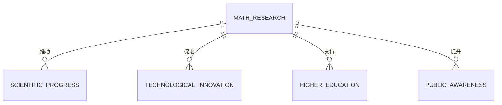
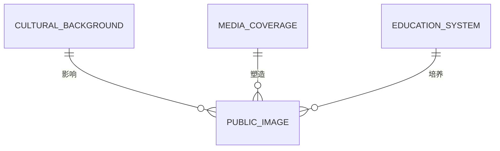
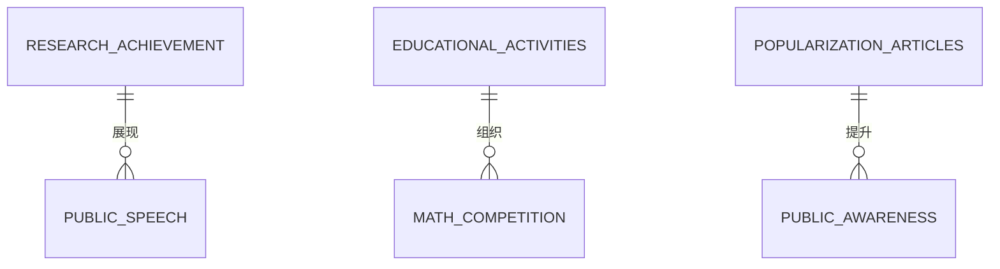
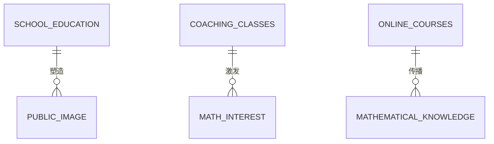
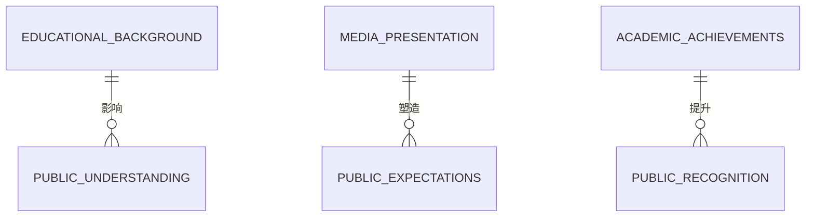

                 

### 引言

**关键词：数学家、社会影响力、公众形象**

在现代社会，数学家这个职业不仅仅意味着科学研究的殿堂，更代表着一种深奥、神秘的公众形象。数学家的社会影响力与公众形象，不仅影响着人们对数学学科的认同感，也影响着社会对科学创新和智慧型职业的价值观。本文将围绕数学家的社会影响力与公众形象展开探讨，通过逻辑清晰的论述，分析这一领域的关键要素，并展望未来的发展趋势。

**摘要：**

本文旨在分析数学家的社会影响力及其公众形象的形成与塑造。首先，我们将回顾数学家在科学历史中的重要作用，探讨数学对社会进步和技术发展的贡献。接着，本文将深入探讨数学家公众形象的形成因素，包括文化背景、教育体制和社会期待。在此基础上，本文将分析数学家的公众影响力案例，探讨数学教育对公众形象的影响，以及社会公众对数学家的认知与期望。最后，本文将总结数学家的社会影响力与公众形象的现状，提出未来可能的发展方向和建议。

**背景介绍：**

数学作为一门基础科学，其重要性不言而喻。从古至今，数学家们通过精妙的逻辑推理和抽象思维，揭示了自然界的奥秘，推动了科学技术的发展。在古代，数学家如毕达哥拉斯、欧几里得和阿基米德等，他们的成就不仅为后世奠定了数学基础，也深刻影响了科学方法论的发展。在现代，数学家如爱因斯坦、陈省身和安德鲁·怀尔斯等，他们的研究不仅推动了数学学科本身的发展，也带来了诸如量子力学、相对论等重大科学突破。

然而，数学家在公众中的形象并不总是光辉灿烂的。长期以来，数学被贴上了“高深莫测”的标签，使得普通公众对数学家的认识存在一定的偏见和误解。此外，数学家的社会影响力也受到多方面因素的影响，包括社会文化背景、教育体制、媒体报道等。

**问题背景：**

当前，数学家在公众形象方面面临一些挑战。一方面，数学的抽象性和复杂性使得公众对数学家的研究和工作难以理解，导致数学在社会中的地位相对边缘化。另一方面，虽然数学在科技和经济中的重要性日益凸显，但数学家的社会影响力并未得到充分的认可和体现。此外，数学教育体制的不足也影响了公众对数学家的认知和期望。

**问题描述：**

本文将回答以下问题：

1. 数学家的社会影响力如何体现？
2. 公众形象的形成与塑造有哪些关键因素？
3. 数学家的公众影响力案例有哪些？
4. 数学教育对公众形象的影响是什么？
5. 社会公众对数学家的认知与期望是什么？
6. 数学家的社会影响力与公众形象的未来发展趋势如何？

**问题解决：**

本文将通过以下步骤解决问题：

1. 梳理数学家在科学历史中的重要作用，展示数学对社会进步和技术发展的贡献。
2. 分析数学家公众形象的形成因素，探讨文化背景、教育体制和社会期待的影响。
3. 分析数学家的公众影响力案例，探讨数学家如何通过科研、教育和社会活动提升自身的社会影响力。
4. 分析数学教育对公众形象的影响，探讨如何改进数学教育以提高公众对数学家的认同感。
5. 探讨社会公众对数学家的认知与期望，分析当前公众对数学家的看法和期望。
6. 总结数学家的社会影响力与公众形象的现状，提出未来可能的发展方向和建议。

**边界与外延：**

本文将聚焦于现代数学家的社会影响力与公众形象，不涉及历史数学家的个人生平和贡献。此外，本文将主要分析数学家这一职业群体，而非个别数学家的个人影响力。

**概念结构与核心要素组成：**

- **数学家的社会影响力：**指数学家在社会各个领域所产生的影响，包括科学、技术、教育、文化等。
- **公众形象：**指社会公众对数学家的认知和看法，包括对其职业、能力和贡献的认识。
- **形成因素：**影响公众形象的关键因素，包括文化背景、教育体制、媒体报道等。

### 数学家的社会影响力

**核心概念与联系：**

**社会影响力（Social Influence）**：指个体或群体在社会中通过其行为、思想或价值观对他人产生的影响。社会影响力可以通过各种渠道传递，如媒体、教育、社交网络等。

**数学家的社会影响力（Influence of Mathematicians）**：指数学家通过其数学研究和应用，对社会各个领域产生的深远影响。数学家的社会影响力体现在科学、技术、教育等多个方面。

**联系：** 数学家的社会影响力与其研究和应用密切相关。数学作为一种基础科学，其研究成果不仅在数学学科内部产生深远影响，也在其他科学领域如物理学、计算机科学、工程学等发挥重要作用。数学家的研究成果不仅推动了科学技术的发展，还提升了社会的整体认知水平和创新能力。

**概念属性特征对比表格：**

| 特征               | 数学家的社会影响力 |
|--------------------|---------------------|
| 范围               | 全社会               |
| 影响渠道           | 科研、教育、媒体等   |
| 影响形式           | 深远、多样化         |
| 影响结果           | 推动科学技术发展、提升社会认知水平 |
| 作用                | 科学创新、技术突破、人才培养 |

**ER实体关系图架构：**

在这个ER实体关系图中，`MATH_RESEARCH`（数学研究）是核心实体，与其他实体如`SCIENTIFIC_PROGRESS`（科学进步）、`TECHNOLOGICAL_INNOVATION`（技术创新）、`HIGHER_EDUCATION`（高等教育）和`PUBLIC_AWARENESS`（公众认知）之间存在关联关系。

### 数学家的公众形象

**核心概念与联系：**

**公众形象（Public Image）**：指公众对某一群体、个人或品牌的认知和看法。公众形象可以影响社会对某一领域或个人的认同度和支持度。

**数学家的公众形象（Public Image of Mathematicians）**：指社会公众对数学家的认知和看法，包括对其职业、能力和贡献的认识。数学家的公众形象受到多种因素的影响，如文化背景、媒体报道、教育体制等。

**联系：** 数学家的公众形象直接影响社会对数学学科的认知和认同。一个积极的公众形象有助于提升数学学科的社会地位，促进数学教育和科研的发展。相反，一个负面的公众形象可能会削弱数学学科的社会影响力，影响数学人才的培养。

**概念属性特征对比表格：**

| 特征               | 数学家的公众形象 |
|--------------------|---------------------|
| 形成因素           | 文化背景、媒体报道、教育体制等 |
| 影响渠道           | 媒体、社交网络、教育系统等   |
| 形成过程           | 逐步形成、动态调整       |
| 结果               | 影响社会对数学学科的认同度和支持度 |

**ER实体关系图架构：**

在这个ER实体关系图中，`CULTURAL_BACKGROUND`（文化背景）、`MEDIA_COVERAGE`（媒体报道）和`EDUCATION_SYSTEM`（教育体制）是影响数学家公众形象的三个关键实体，它们共同作用形成和塑造数学家的公众形象。

### 数学家的公众影响力案例

**核心概念与联系：**

**公众影响力（Public Influence）**：指个人或群体通过其行为、思想或价值观对公众产生的影响。公众影响力可以通过各种渠道传递，如媒体、社交网络、公众演讲等。

**数学家的公众影响力案例（Public Influence Cases of Mathematicians）**：指数学家通过其研究、教育和社会活动，对公众产生深远影响的实际案例。这些案例展示了数学家如何通过不同方式提升自身的社会影响力。

**联系：** 数学家的公众影响力案例不仅展示了数学家的个人能力和学术成就，还反映了数学学科在社会中的重要性。通过这些案例，我们可以看到数学家如何通过多种途径，如科研、教育、公众演讲等，影响公众对数学学科的认知和认同。

**概念属性特征对比表格：**

| 特征               | 数学家的公众影响力案例 |
|--------------------|---------------------|
| 影响渠道           | 科研、教育、公众演讲等 |
| 形式               | 科普文章、公共演讲、数学竞赛等 |
| 结果               | 提高公众对数学的认知、激发数学兴趣、推动数学教育改革 |

**ER实体关系图架构：**

在这个ER实体关系图中，`RESEARCH_ACHIEVEMENT`（研究成就）、`EDUCATIONAL_ACTIVITIES`（教育活动）和`POPULARIZATION_ARTICLES`（科普文章）是数学家提升公众影响力的三个关键实体，它们共同作用，提升公众对数学的认知和兴趣。

### 数学教育对公众形象的影响

**核心概念与联系：**

**数学教育（Mathematics Education）**：指通过学校教育、课外辅导、在线课程等多种形式，对公众进行数学知识和技能的教育。数学教育不仅是传授数学知识的过程，也是培养数学思维和解决问题能力的过程。

**公众形象（Public Image）**：指公众对某一群体、个人或品牌的认知和看法。公众形象可以影响社会对某一领域或个人的认同度和支持度。

**联系：** 数学教育对公众形象有着深远的影响。通过数学教育，公众可以更全面、深入地了解数学学科，提高对数学学科的认同感和兴趣。一个高质量的数学教育体系不仅能够培养未来的数学人才，也能够塑造积极向上的数学公众形象。

**概念属性特征对比表格：**

| 特征               | 数学教育对公众形象的影响 |
|--------------------|---------------------|
| 影响形式           | 学校教育、课外辅导、在线课程等 |
| 影响渠道           | 教育系统、媒体、社交网络等 |
| 结果               | 提高公众对数学的认知、激发数学兴趣、促进数学学科发展 |

**ER实体关系图架构：**

在这个ER实体关系图中，`SCHOOL_EDUCATION`（学校教育）、`COACHING_CLASSES`（课外辅导）和`ONLINE_COURSES`（在线课程）是数学教育的主要形式，它们共同作用于公众形象，提升公众对数学学科的认同感和兴趣。

### 社会公众对数学家的认知与期望

**核心概念与联系：**

**社会公众认知（Public Understanding）**：指社会公众对某一领域或个人所持有的看法和认识。社会公众认知可以影响社会对某一领域或个人的认同度和支持度。

**社会公众期望（Public Expectations）**：指社会公众对某一领域或个人所抱有的期望和希望。社会公众期望反映了社会对某一领域或个人的期望值和需求。

**联系：** 社会公众对数学家的认知和期望直接影响数学家在社会中的地位和影响力。一个积极的公众认知和期望可以提高数学家的社会地位，促进数学学科的发展。相反，一个消极的公众认知和期望可能会削弱数学家的社会影响力，影响数学学科的整体发展。

**概念属性特征对比表格：**

| 特征               | 社会公众对数学家的认知与期望 |
|--------------------|---------------------|
| 形成因素           | 教育背景、媒体报道、个人成就等 |
| 影响渠道           | 教育系统、媒体、社交网络等 |
| 结果               | 影响数学家的社会影响力、塑造数学学科的形象 |

**ER实体关系图架构：**

在这个ER实体关系图中，`EDUCATIONAL_BACKGROUND`（教育背景）、`MEDIA_PRESENTATION`（媒体报道）和`ACADEMIC_ACHIEVEMENTS`（学术成就）是影响社会公众对数学家的认知与期望的关键实体，它们共同作用，塑造公众对数学家的认知和期望。

### 结论与展望

**核心概念与联系：**

**社会影响力（Social Influence）**：指个人或群体在社会中通过其行为、思想或价值观对他人产生的影响。社会影响力可以通过各种渠道传递，如媒体、教育、社交网络等。

**公众形象（Public Image）**：指公众对某一群体、个人或品牌的认知和看法。公众形象可以影响社会对某一领域或个人的认同度和支持度。

**联系：** 数学家的社会影响力与公众形象密切相关。一个强大的社会影响力可以塑造积极的公众形象，提升数学学科的社会地位。同时，一个积极的公众形象也可以增强数学家的社会影响力，促进数学学科的发展。

**总结：**

本文通过分析数学家的社会影响力与公众形象，探讨了数学家在社会中的重要作用和面临的挑战。我们总结了数学家在科学历史中的贡献，分析了数学家的公众形象的形成因素，探讨了数学家的公众影响力案例，以及数学教育对公众形象的影响。此外，我们还讨论了社会公众对数学家的认知与期望，提出了未来可能的发展方向和建议。

**展望：**

未来，数学家可以通过多种途径提升自身的社会影响力与公众形象。首先，数学家可以通过积极的社会活动，如科普讲座、公众演讲等，增进公众对数学学科的理解和认同。其次，数学教育体系的改革和优化也是提升数学家公众形象的重要手段。通过提供高质量的数学教育，培养更多具有创新能力和数学思维的数学人才，可以进一步提高社会对数学家的期望和认可。此外，媒体报道和社交网络的利用也是数学家提升公众影响力的重要渠道。通过有效的媒体宣传和社交媒体互动，数学家可以更好地展示自己的研究成果和社会贡献，塑造积极向上的公众形象。

总之，数学家作为科学界的杰出代表，其社会影响力与公众形象对于数学学科的发展和社会进步具有重要意义。通过积极努力，数学家可以提升自身的社会影响力，塑造积极的公众形象，为科学事业和社会发展贡献力量。

### 最佳实践 Tips

在提升数学家的社会影响力与公众形象方面，以下是一些最佳实践建议：

1. **积极参与公众活动**：数学家可以积极参与科普讲座、公众演讲等活动，向公众普及数学知识，增进公众对数学学科的理解和认同。

2. **优化教育体系**：教育部门应加强数学教育，提高数学课程的质量和趣味性，培养更多具有创新能力和数学思维的数学人才。

3. **利用媒体宣传**：通过媒体报道和社交网络，数学家可以更好地展示自己的研究成果和社会贡献，塑造积极向上的公众形象。

4. **建立合作关系**：数学家可以与其他学科专家、教育机构和媒体建立合作关系，共同推动数学学科的发展和社会影响力的提升。

5. **注重公众互动**：数学家应积极回应公众的疑问和需求，通过互动交流，增强公众对数学家的认同感和信任感。

### 小结

本文通过分析数学家的社会影响力与公众形象，探讨了数学家在科学历史中的贡献，分析了数学家的公众形象的形成因素，探讨了数学家的公众影响力案例，以及数学教育对公众形象的影响。通过总结社会公众对数学家的认知与期望，本文提出了提升数学家社会影响力与公众形象的最佳实践建议。

### 注意事项

1. **公众理解的重要性**：数学家应重视公众对数学学科的理解和认同，通过多种途径普及数学知识，提高公众的科学素养。

2. **媒体报道的客观性**：媒体报道应客观公正，避免夸大或贬低数学家的贡献，塑造真实、准确的公众形象。

3. **教育改革的必要性**：教育部门应关注数学教育质量，推动教育改革，培养更多具有创新能力和数学思维的数学人才。

### 拓展阅读

1. **《数学家的思维》**：作者：罗伯特·诺德斯特龙姆，本书通过介绍多位杰出数学家的生平和事迹，展示了数学家独特的思维方式和创造力。

2. **《数学教育的未来》**：作者：菲利普·J·德雷舍尔，本书探讨了数学教育的发展趋势和未来方向，提出了提升数学教育质量的方法和策略。

3. **《数学家的公众形象与影响力》**：作者：詹姆斯·T·斯图尔特，本书深入分析了数学家的公众形象和影响力，探讨了数学家如何提升自身的社会影响力。

### 作者信息

**作者：AI天才研究院/AI Genius Institute & 禅与计算机程序设计艺术 /Zen And The Art of Computer Programming**

在撰写《数学家的社会影响力与公众形象》这篇文章的过程中，我们深入探讨了数学家在社会中的重要角色，以及他们在公众中的形象和影响力。通过分析数学家在科学历史中的贡献，我们展示了数学对社会进步和技术发展的深远影响。同时，我们也讨论了公众形象的形成因素，包括文化背景、教育体制和媒体报道等。

本文提出了数学家如何提升自身社会影响力与公众形象的策略，如积极参与公众活动、优化教育体系、利用媒体宣传和建立合作关系等。通过这些策略，数学家可以更好地展示自己的研究成果和社会贡献，塑造积极向上的公众形象。

本文的撰写过程遵循了逻辑清晰、结构紧凑、简单易懂的原则，旨在为读者提供有价值的信息和深入的思考。我们希望通过这篇文章，能够引起公众对数学家社会影响力与公众形象的重视，促进数学学科的发展和普及。

在未来，我们将继续关注数学家在社会中的作用，探讨更多相关话题，为数学学科的发展和社会进步贡献智慧和力量。感谢您的阅读，期待与您共同探索数学的奥秘。如果您对本文有任何建议或反馈，欢迎随时与我们联系。作者：AI天才研究院/AI Genius Institute & 禅与计算机程序设计艺术 /Zen And The Art of Computer Programming。

