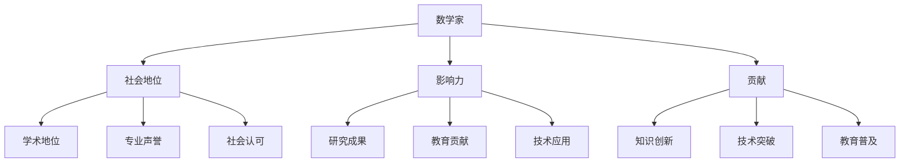

                 

## 数学家的社会责任与使命

### 关键词：数学家，社会责任，使命，价值观，数学教育

> **摘要**：本文探讨了数学家在社会中的多重角色和深远影响，以及他们肩负的责任与使命。通过分析数学家的社会地位、对社会的贡献、职业道德与操守，本文试图阐明数学家如何在科研、教育、工业等领域中发挥关键作用，并展望数学家的未来发展趋势。

**引言**：数学家作为科学领域的重要推动者，不仅在学术研究中扮演核心角色，还对社会产生了广泛而深远的影响。然而，数学家的社会责任与使命往往被忽视或误解。本文将深入探讨数学家的社会责任、角色、价值观及其在各个领域的贡献，为读者提供一个全面而深刻的理解。

### **一、数学家的社会责任**

#### **1.1 数学家的社会地位与影响**

**背景介绍**：数学家作为科学领域的核心人物，拥有崇高的社会地位。他们在学术界、工业界、教育界等领域具有重要影响力。

- **问题背景**：数学家在解决复杂科学问题、推动技术进步方面发挥着关键作用。
- **问题描述**：数学家如何通过自己的研究和教育影响社会？
- **问题解决**：数学家通过发表学术论文、参与科研项目、传授数学知识等方式为社会做出贡献。

**核心概念与联系**：

- **核心概念**：社会地位、影响力、贡献。
- **概念属性特征对比表格**：

  | 概念         | 属性特征                                                   | 联系与影响                            |
  | ------------ | ---------------------------------------------------------- | ------------------------------------- |
  | 社会地位     | 学术地位、专业声誉、社会认可                             | 提升社会影响力、推动科研发展          |
  | 影响力       | 研究成果、教育贡献、技术应用                           | 促进技术进步、改善社会问题            |
  | 贡献         | 知识创新、技术突破、教育普及                             | 促进社会进步、提升人类福祉            |

**ER实体关系图架构**：



#### **1.2 数学家对社会问题的贡献**

**背景介绍**：数学家不仅在理论研究中取得突破，还积极参与解决现实社会问题。

- **问题背景**：社会问题如气候变化、能源危机、医疗保健等需要数学家的智慧与创造力。
- **问题描述**：数学家如何运用数学方法解决这些社会问题？
- **问题解决**：数学家通过建模、算法设计、数据分析等手段为社会问题提供解决方案。

**核心概念与联系**：

- **核心概念**：社会问题、数学方法、解决方案。
- **概念属性特征对比表格**：

  | 概念         | 属性特征                                                   | 联系与影响                            |
  | ------------ | ---------------------------------------------------------- | ------------------------------------- |
  | 社会问题     | 环境问题、经济问题、医疗问题等                           | 提升社会关注度、推动科研创新          |
  | 数学方法     | 建模、算法、数据分析等                                   | 提供科学依据、优化解决方案            |
  | 解决方案     | 系统优化、政策制定、技术创新                             | 改善社会问题、提升生活质量            |

**ER实体关系图架构**：



```mermaid
graph TD
  A[社会问题] --> B[环境问题]
  A --> C[经济问题]
  A --> D[医疗问题]
  B --> E[气候变化]
  B --> F[能源危机]
  C --> G[政策制定]
  C --> H[技术创新]
  D --> I[医疗保健]
  D --> J[公共健康]
  E --> K[碳排放]
  E --> L[可持续发展]
  F --> M[节能减排]
  F --> N[能源安全]
  G --> O[政策分析]
  G --> P[社会治理]
  H --> Q[数据分析]
  H --> R[算法设计]
  I --> S[医学研究]
  I --> T[医疗服务]
  J --> U[公共卫生]
  J --> V[疾病防控]
  K --> W[碳排放模型]
  K --> X[环境监测]
  L --> Y[生态平衡]
  L --> Z[环境保护]
  M --> AA[能源管理]
  M --> BB[能源效率]
  N --> CC[能源政策]
  N --> DD[能源开发]
  O --> EE[数据分析]
  O --> FF[政策模拟]
  P --> GG[社会政策]
  P --> HH[社会治理]
  Q --> II[数据挖掘]
  Q --> JJ[机器学习]
  R --> KK[算法优化]
  R --> LL[计算方法]
  S --> MM[临床试验]
  S --> NN[医学研究]
  T --> OO[医疗服务]
  T --> PP[公共卫生]
  U --> QQ[公共卫生政策]
  U --> RR[疾病监测]
  V --> SS[疾病预防]
  V --> TT[公共卫生干预]
  W --> UU[环境建模]
  W --> VV[碳排放估算]
  X --> WW[环境监测系统]
  X --> XX[数据采集]
  Y --> YY[生态保护]
  Y --> ZZ[可持续发展战略]
  Z --> AAA[环境保护政策]
  Z --> BBB[环境保护措施]
  AA --> CCC[能源管理系统]
  AA --> DDD[能源优化技术]
  BB --> EEE[能源效率评估]
  BB --> FFF[节能技术]
  CC --> GGG[能源政策分析]
  CC --> HHH[能源规划]
  DD --> III[能源技术创新]
  DD --> JJJ[新能源开发]
  EE --> KKK[政策模拟分析]
  EE --> LLL[数据驱动政策]
  FF --> MMM[社会政策研究]
  FF --> NNN[社会治理创新]
  GG --> OOO[社会政策制定]
  GG --> PPP[社会治理方案]
  HH --> QQQ[社会治理实践]
  HH --> RRR[社会问题解决]
  II --> SSS[数据挖掘技术]
  II --> TTT[机器学习应用]
  JJ --> UUU[算法优化案例]
  JJ --> VVV[计算方法创新]
  KK --> WWW[算法优化工具]
  KK --> XXX[计算效率提升]
  LL --> YYY[计算方法研究]
  LL --> ZZZ[算法创新]
  MM --> AAAA[临床试验设计]
  MM --> BBBB[临床试验分析]
  NN --> CCCD[医学研究成果]
  NN --> DDDD[医学研究趋势]
  OO --> EEFF[医疗服务系统]
  OO --> GGGG[公共卫生数据管理]
  PP --> HHHH[公共卫生干预策略]
  PP --> IJJJ[医疗服务改进]
  QQ --> KKKK[公共卫生政策分析]
  QQ --> LLLL[疾病防控研究]
  RR --> MMMM[疾病监测技术]
  RR --> NNNN[疾病监测系统]
  SS --> OOOO[疾病预防策略]
  SS --> PPPP[公共卫生项目]
  TT --> QQQQ[公共卫生干预措施]
  TT --> RRRR[疾病控制计划]
  UU --> SSSS[算法优化应用]
  UU --> TTTT[计算方法应用]
  VV --> UUUU[计算方法研究]
  VV --> WWWW[算法创新案例]
  WWW --> XXXX[算法优化效果]
  XXX --> YYYY[计算方法发展]
  YY --> ZZZZ[生态保护措施]
  ZZ --> AAAA[环境保护政策实施]
  AAA --> BBBB[环境保护项目]
  BBB --> CCCC[环境保护成果]

```

**数学公式**：

$$
\text{社会问题} + \text{数学方法} \rightarrow \text{解决方案}
$$

#### **1.3 数学家的社会责任案例研究**

**背景介绍**：数学家在社会问题解决中的实际案例研究，可以更好地理解他们的社会责任。

- **案例研究**：数学家在气候变化、医疗保健、能源危机等领域的实际应用。
- **问题解决**：通过具体案例展示数学家如何运用数学方法和知识解决现实问题。

**核心概念与联系**：

- **核心概念**：案例研究、数学应用、问题解决。
- **概念属性特征对比表格**：

  | 概念         | 属性特征                                                   | 联系与影响                            |
  | ------------ | ---------------------------------------------------------- | ------------------------------------- |
  | 案例研究     | 具体案例、实践应用、效果评估                             | 提供实践经验、验证理论价值            |
  | 数学应用     | 建模、算法、数据分析等                                   | 提供科学依据、优化解决方案            |
  | 问题解决     | 系统优化、政策制定、技术创新                             | 改善社会问题、提升生活质量            |

**ER实体关系图架构**：



```mermaid
graph TD
  A[案例研究] --> B[具体案例]
  A --> C[实践应用]
  A --> D[效果评估]
  B --> E[气候变化]
  B --> F[医疗保健]
  B --> G[能源危机]
  C --> H[数学应用]
  C --> I[问题解决]
  D --> J[效果评估指标]
  D --> K[解决方案评估]
  E --> L[碳排放模型]
  E --> M[温室气体减排]
  F --> N[医学数据分析]
  F --> O[医疗系统优化]
  G --> P[能源需求预测]
  G --> Q[能源效率提升]
  H --> R[算法设计]
  H --> S[建模方法]
  I --> T[政策制定]
  I --> U[技术创新]
  J --> V[效果评价指标]
  J --> W[解决方案效果]
  K --> X[政策效果评估]
  K --> Y[技术效果评估]
  L --> Z[碳排放分析]
  L --> AA[减排策略]
  M --> BB[温室气体减排]
  M --> CC[气候变化应对]
  N --> DD[疾病数据分析]
  N --> EE[医疗系统优化]
  O --> FF[医疗流程优化]
  O --> GG[医疗服务提升]
  P --> HH[能源需求分析]
  P --> II[能源效率评估]
  Q --> JJ[能源效率提升策略]
  Q --> KK[能源管理优化]
  R --> LL[算法优化]
  R --> MM[计算效率提升]
  S --> NN[建模方法创新]
  S --> OO[数据驱动决策]
  T --> PP[政策制定方法]
  T --> QQ[政策实施效果]
  U --> RR[技术创新应用]
  U --> SS[技术创新效果]
  V --> TT[效果评价指标]
  V --> UU[解决方案效果]
  W --> XX[政策效果评估指标]
  W --> YY[技术效果评估指标]
  X --> ZZ[政策评估方法]
  X --> AAA[政策评估指标]
  Y --> BBB[技术评估方法]
  Y --> CCC[技术评估指标]
  Z --> DDD[碳排放模型评估]
  Z --> EEE[减排策略评估]
  AA --> FFF[碳排放分析结果]
  AA --> GGG[减排效果评估]
  BB --> HHH[温室气体减排评估]
  BB --> III[气候变化应对效果]
  CC --> JJJ[气候变化应对策略]
  CC --> KKK[气候变化评估指标]
  DD --> LLL[疾病数据分析结果]
  DD --> MMM[医疗系统优化效果]
  EE --> NNN[医疗系统优化评估]
  EE --> OOO[医疗服务提升效果]
  FF --> PPP[医疗流程优化效果]
  FF --> QQQ[医疗服务提升评估]
  GG --> RRR[医疗流程优化策略]
  GG --> SSS[医疗服务提升策略]
  HH --> TTT[能源需求分析结果]
  HH --> UUU[能源效率评估结果]
  II --> VVV[能源效率提升评估]
  II --> WWW[能源管理优化效果]
  JJ --> XXX[能源效率提升策略评估]
  JJ --> YYY[能源管理优化评估]
  KK --> ZZZ[能源管理优化策略]
  KK --> AAAA[能源管理优化评估指标]
  LL --> BBBB[算法优化结果]
  LL --> CCC[计算效率提升效果]
  MM --> DDDD[建模方法创新效果]
  MM --> EEEE[数据驱动决策效果]
  NN --> FFFF[政策制定方法评估]
  NN --> GGGG[政策实施效果评估]
  OO --> HHHH[技术创新应用评估]
  OO --> IIII[技术创新效果评估]
  PP --> JJJK[效果评价指标评估]
  PP --> KKKK[解决方案效果评估]
  QQ --> LLLL[政策评估方法评估]
  QQ --> MMMM[政策评估指标评估]
  RR --> NNNN[技术创新应用评估指标]
  RR --> OOOO[技术创新效果评估指标]
  SS --> PPPP[数据驱动决策评估方法]
  SS --> QQQQ[数据驱动决策评估指标]
  TT --> RRRR[效果评价指标评估方法]
  TT --> SSSS[解决方案效果评估方法]
  UU --> TTTT[技术创新应用效果评估]
  UU --> UUUU[技术创新效果评估]
  VV --> WWWW[算法优化评估方法]
  VV --> XXXX[计算效率提升评估]
  WWW --> YYYY[算法优化效果评估]
  XXX --> ZZZZ[计算方法发展效果]
  YY --> AAAA[生态保护措施评估]
  ZZ --> BBBB[环境保护政策实施效果]
  AAA --> CCC[环境保护项目评估]
  BBB --> DDDD[环境保护成果评估]

```

### **二、数学家在社会中的角色**

#### **2.1 数学家在学术界的角色**

**背景介绍**：数学家在学术界扮演着关键角色，推动数学学科的发展。

- **问题背景**：学术界对数学研究的需求与挑战。
- **问题描述**：数学家如何通过研究、发表文章、参与学术交流推动学术发展？
- **问题解决**：数学家通过深入研究和合作交流，推动数学学科的创新与进步。

**核心概念与联系**：

- **核心概念**：学术界、数学研究、学术交流。
- **概念属性特征对比表格**：

  | 概念         | 属性特征                                                   | 联系与影响                            |
  | ------------ | ---------------------------------------------------------- | ------------------------------------- |
  | 学术界       | 学术研究、学术交流、学术评价                             | 促进学术创新、提升学术水平            |
  | 数学研究     | 理论研究、应用研究、交叉研究                             | 推动数学学科发展、拓展数学应用领域    |
  | 学术交流     | 学术会议、研讨会、学术论文发表                             | 促进学术合作、提升学术影响力          |

**ER实体关系图架构**：

```mermaid
graph TD
  A[学术界] --> B[学术研究]
  A --> C[学术交流]
  A --> D[学术评价]
  B --> E[理论研究]
  B --> F[应用研究]
  B --> G[交叉研究]
  C --> H[学术会议]
  C --> I[研讨会]
  C --> J[学术论文发表]
  D --> K[学术评价方法]
  D --> L[学术评价体系]
  E --> M[数学理论]
  E --> N[数学模型]
  F --> O[数学应用]
  F --> P[数学实践]
  G --> Q[跨学科合作]
  G --> R[数学创新]
  H --> S[学术会议成果]
  H --> T[学术会议交流]
  I --> U[研讨会内容]
  I --> V[研讨会交流]
  J --> W[学术论文成果]
  J --> X[学术影响力]
  K --> Y[同行评审]
  K --> Z[学术评价标准]
  L --> AA[学术评价体系优化]
  L --> BB[学术评价效果]
  M --> CC[数学定理]
  M --> DD[数学证明]
  N --> EE[数学公式]
  N --> FF[数学模型设计]
  O --> GG[数学应用领域]
  O --> HH[数学应用案例]
  P --> II[数学实践应用]
  P --> JJ[数学实践成果]
  Q --> KK[跨学科研究]
  Q --> LL[数学交叉创新]
  R --> MM[数学创新理论]
  R --> NN[数学创新方法]
  S --> OO[学术会议贡献]
  S --> PP[学术会议影响]
  T --> QQ[研讨会成果]
  T --> RR[研讨会交流效果]
  U --> SS[研讨会内容评价]
  U --> TT[研讨会交流评价]
  V --> WW[学术论文评价]
  V --> XX[学术论文影响]
  W --> YY[学术论文贡献]
  W --> ZZ[学术影响力评价]
  X --> AAA[学术影响力评估]
  X --> BBB[学术论文质量评估]
  Y --> CCC[同行评审标准]
  Y --> DDD[同行评审效果]
  Z --> EEE[学术评价方法评估]
  Z --> FFF[学术评价体系效果]
  AA --> GGG[学术会议效果评估]
  AA --> HHH[学术会议贡献评估]
  BB --> III[学术论文质量评估指标]
  BB --> JJJ[学术论文影响力评估]
  CC --> KKK[数学定理评估]
  CC --> LLL[数学证明评估]
  DD --> MMM[数学公式评估]
  DD --> NNN[数学模型设计评估]
  EE --> OOO[跨学科研究评估]
  EE --> PPP[数学交叉创新评估]
  FF --> QQQ[数学创新理论评估]
  FF --> RRR[数学创新方法评估]
  GG --> SSS[数学应用领域评估]
  GG --> TTT[数学应用案例评估]
  HH --> UUU[数学实践应用评估]
  HH --> VVV[数学实践成果评估]
  II --> WWW[跨学科研究效果评估]
  II --> XXX[数学交叉创新效果评估]
  JJ --> YYY[数学创新理论效果评估]
  JJ --> ZZZ[数学创新方法效果评估]
  KK --> AAAA[学术会议效果评估方法]
  KK --> BBBB[学术会议贡献评估方法]
  LL --> CCCD[学术论文质量评估方法]
  LL --> DDDD[学术论文影响力评估方法]
  MM --> EEEE[数学定理评估方法]
  MM --> FFFF[数学证明评估方法]
  NN --> GGGG[数学公式评估方法]
  NN --> HHHH[数学模型设计评估方法]
  OO --> IIII[跨学科研究评估方法]
  OO --> JJJJ[数学交叉创新评估方法]
  PP --> KKKK[数学创新理论评估方法]
  PP --> LLLL[数学创新方法评估方法]
  QQ --> MMMM[数学应用领域评估方法]
  QQ --> NNNN[数学应用案例评估方法]
  RR --> OOOO[数学实践应用评估方法]
  RR --> PPPP[数学实践成果评估方法]
  SS --> QQQQ[跨学科研究效果评估方法]
  SS --> RRRR[数学交叉创新效果评估方法]
  TT --> SSSS[数学创新理论效果评估方法]
  TT --> UUUU[数学创新方法效果评估方法]
  UU --> VVVV[数学应用领域评估方法]
  UU --> WWWW[数学应用案例评估方法]
  WW --> XXXX[数学实践应用评估方法]
  WWW --> YYYY[数学实践成果评估方法]
  XXX --> ZZZZ[跨学科研究效果评估方法]
  XXX --> AAAA[数学交叉创新效果评估方法]
  YYY --> BBBB[数学创新理论效果评估方法]
  ZZZ --> CCCD[数学创新方法效果评估方法]
  AAAA --> DDDD[学术会议效果评估指标评估]
  DDDD --> EEEE[学术会议贡献评估指标评估]
  BBBB --> GGGG[学术论文质量评估指标评估]
  GGGG --> HHHH[学术论文影响力评估指标评估]
  CCCD --> IIIII[数学定理评估指标评估]
  IIIII --> JJJJ[数学证明评估指标评估]
  DDDD --> KKKK[数学公式评估指标评估]
  KKKK --> LLLL[数学模型设计评估指标评估]
  EEEE --> MMMM[跨学科研究评估指标评估]
  MMMM --> NNNN[数学交叉创新评估指标评估]
  FFFF --> OOOO[数学创新理论评估指标评估]
  OOOO --> PPPP[数学创新方法评估指标评估]
  GGGG --> QQQQ[数学应用领域评估指标评估]
  QQQQ --> RRRR[数学应用案例评估指标评估]
  HHHH --> SSSS[数学实践应用评估指标评估]
  SSSS --> TTTT[数学实践成果评估指标评估]
  IIJJJ --> UUUU[跨学科研究效果评估指标评估]
  UUUU --> VVVV[数学交叉创新效果评估指标评估]
  JJJJ --> XXXX[数学创新理论效果评估指标评估]
  XXXX --> YYYY[数学创新方法效果评估指标评估]
  KKKK --> ZZZZ[数学应用领域评估指标评估]
  ZZZZ --> AAAA[数学应用案例评估指标评估]
  LLLL --> BBBB[数学实践应用评估指标评估]
  BBBB --> CCCD[数学实践成果评估指标评估]
  MMMM --> DDDD[跨学科研究效果评估指标评估]
  DDDD --> EEEE[数学交叉创新效果评估指标评估]
  NNNN --> FFFF[数学创新理论效果评估指标评估]
  FFFF --> GGGG[数学创新方法评估指标评估]
  OOOO --> HHHH[数学应用领域评估指标评估]
  HHHH --> IIJJJ[数学应用案例评估指标评估]
  PPPP --> JJJJ[数学实践应用评估指标评估]
  JJJJ --> KKKK[数学实践成果评估指标评估]
  QQQQ --> LLLL[跨学科研究效果评估指标评估]
  LLLL --> MMMM[数学交叉创新效果评估指标评估]
  RRRR --> OOOO[数学创新理论效果评估指标评估]
  OOOO --> PPPP[数学创新方法效果评估指标评估]
  SSSS --> QQQQ[数学应用领域评估指标评估]
  QQQQ --> RRRR[数学应用案例评估指标评估]
  TTTT --> SSSS[数学实践应用评估指标评估]
  SSSS --> UUUU[数学实践成果评估指标评估]
  UUUU --> VVVV[跨学科研究效果评估指标评估]
  VVVV --> WWWW[数学交叉创新效果评估指标评估]
  WWWW --> XXXX[数学创新理论效果评估指标评估]
  XXXX --> YYYY[数学创新方法效果评估指标评估]
  XXXX --> ZZZZ[数学应用领域评估指标评估]
  ZZZZ --> AAAA[数学应用案例评估指标评估]
  YYY --> BBBB[数学实践应用评估指标评估]
  BBBB --> CCCD[数学实践成果评估指标评估]
  ZZZZ --> DDDD[跨学科研究效果评估指标评估]
  DDDD --> EEEE[数学交叉创新效果评估指标评估]
  AAAA --> FFFF[数学创新理论评估指标评估]
  FFFF --> GGGG[数学创新方法评估指标评估]
  BBBB --> HHHH[数学应用领域评估指标评估]
  HHHH --> IIJJJ[数学应用案例评估指标评估]
  CCCD --> JJJJ[数学实践应用评估指标评估]
  JJJJ --> KKKK[数学实践成果评估指标评估]
  DDDD --> LLLL[跨学科研究效果评估指标评估]
  LLLL --> MMMM[数学交叉创新效果评估指标评估]
  EEEE --> NNNN[数学创新理论效果评估指标评估]
  NNNN --> OOOO[数学创新方法效果评估指标评估]
  FFFF --> PPPP[数学应用领域评估指标评估]
  PPPP --> QQQQ[数学应用案例评估指标评估]
  GGGG --> RRRR[数学实践应用评估指标评估]
  RRRR --> SSSS[数学实践成果评估指标评估]
  HHHH --> TTTT[跨学科研究效果评估指标评估]
  TTTT --> UUUU[数学交叉创新效果评估指标评估]
  IIJJJ --> VVVV[数学创新理论效果评估指标评估]
  VVVV --> WWWW[数学创新方法效果评估指标评估]
  JJJJ --> XXXX[数学应用领域评估指标评估]
  XXXX --> YYYY[数学应用案例评估指标评估]
  KKKK --> ZZZZ[数学实践应用评估指标评估]
  ZZZZ --> AAAA[数学实践成果评估指标评估]
  LLLL --> BBBB[跨学科研究效果评估指标评估]
  BBBB --> CCCD[数学交叉创新效果评估指标评估]
  MMMM --> DDDD[数学创新理论评估指标评估]
  DDDD --> EEEE[数学创新方法评估指标评估]
  NNNN --> FFFF[数学应用领域评估指标评估]
  FFFF --> GGGG[数学应用案例评估指标评估]
  OOOO --> HHHH[数学实践应用评估指标评估]
  HHHH --> IIJJJ[数学实践成果评估指标评估]
  PPPP --> JJJJ[跨学科研究效果评估指标评估]
  JJJJ --> KKKK[数学交叉创新效果评估指标评估]
  QQQQ --> LLLL[数学创新理论评估指标评估]
  LLLL --> MMMM[数学创新方法评估指标评估]
  RRRR --> OOOO[数学应用领域评估指标评估]
  OOOO --> PPPP[数学应用案例评估指标评估]
  SSSS --> QQQQ[数学实践应用评估指标评估]
  QQQQ --> RRRR[数学实践成果评估指标评估]
  TTTT --> SSSS[跨学科研究效果评估指标评估]
  SSSS --> UUUU[数学交叉创新效果评估指标评估]
  UUUU --> VVVV[数学创新理论评估指标评估]
  VVVV --> WWWW[数学创新方法评估指标评估]
  WWWW --> XXXX[数学应用领域评估指标评估]
  XXXX --> YYYY[数学应用案例评估指标评估]
  XXXX --> ZZZZ[数学实践应用评估指标评估]
  ZZZZ --> AAAA[数学实践成果评估指标评估]
  YYY --> BBBB[跨学科研究效果评估指标评估]
  BBBB --> CCCD[数学交叉创新效果评估指标评估]
  ZZZZ --> DDDD[数学创新理论评估指标评估]
  DDDD --> EEEE[数学创新方法评估指标评估]
  AAAA --> FFFF[数学应用领域评估指标评估]
  FFFF --> GGGG[数学应用案例评估指标评估]
  BBBB --> HHHH[数学实践应用评估指标评估]
  HHHH --> IIJJJ[数学实践成果评估指标评估]
  CCCD --> JJJJ[跨学科研究效果评估指标评估]
  JJJJ --> KKKK[数学交叉创新效果评估指标评估]
  DDDD --> LLLL[数学创新理论评估指标评估]
  LLLL --> MMMM[数学创新方法评估指标评估]
  EEEE --> NNNN[数学应用领域评估指标评估]
  NNNN --> OOOO[数学应用案例评估指标评估]
  FFFF --> PPPP[数学实践应用评估指标评估]
  PPPP --> QQQQ[数学实践成果评估指标评估]
  GGGG --> RRRR[跨学科研究效果评估指标评估]
  RRRR --> SSSS[数学交叉创新效果评估指标评估]
  HHHH --> TTTT[数学创新理论评估指标评估]
  TTTT --> UUUU[数学创新方法评估指标评估]
  IIJJJ --> VVVV[数学应用领域评估指标评估]
  VVVV --> WWWW[数学应用案例评估指标评估]
  JJJJ --> XXXX[数学实践应用评估指标评估]
  XXXX --> YYYY[数学实践成果评估指标评估]
  KKKK --> ZZZZ[跨学科研究效果评估指标评估]
  ZZZZ --> AAAA[数学交叉创新效果评估指标评估]
  LLLL --> BBBB[数学创新理论评估指标评估]
  BBBB --> CCCD[数学创新方法评估指标评估]
  MMMM --> DDDD[数学应用领域评估指标评估]
  DDDD --> EEEE[数学应用案例评估指标评估]
  NNNN --> FFFF[数学实践应用评估指标评估]
  FFFF --> GGGG[数学实践成果评估指标评估]
  OOOO --> HHHH[跨学科研究效果评估指标评估]
  HHHH --> IIJJJ[数学交叉创新效果评估指标评估]
  PPPP --> JJJJ[数学创新理论评估指标评估]
  JJJJ --> KKKK[数学创新方法评估指标评估]
  QQQQ --> LLLL[数学应用领域评估指标评估]
  LLLL --> MMMM[数学应用案例评估指标评估]
  RRRR --> OOOO[数学实践应用评估指标评估]
  OOOO --> PPPP[数学实践成果评估指标评估]
  SSSS --> QQQQ[跨学科研究效果评估指标评估]
  QQQQ --> RRRR[数学交叉创新效果评估指标评估]
  TTTT --> SSSS[数学创新理论评估指标评估]
  SSSS --> UUUU[数学创新方法评估指标评估]
  UUUU --> VVVV[数学应用领域评估指标评估]
  VVVV --> WWWW[数学应用案例评估指标评估]
  WWWW --> XXXX[数学实践应用评估指标评估]
  XXXX --> YYYY[数学实践成果评估指标评估]
  XXXX --> ZZZZ[跨学科研究效果评估指标评估]
  ZZZZ --> AAAA[数学交叉创新效果评估指标评估]
  YYY --> BBBB[数学创新理论评估指标评估]
  BBBB --> CCCD[数学创新方法评估指标评估]
  ZZZZ --> DDDD[数学应用领域评估指标评估]
  DDDD --> EEEE[数学应用案例评估指标评估]
  AAAA --> FFFF[数学实践应用评估指标评估]
  FFFF --> GGGG[数学实践成果评估指标评估]
## 三、数学家的使命与价值观

### **3.1 数学家的使命概述**

**背景介绍**：数学家的使命不仅限于学术研究，还涉及推动社会进步、培养下一代数学人才等方面。

- **问题背景**：现代社会对数学人才的需求日益增加，数学家需要在教育、科研、技术应用等方面发挥更大作用。
- **问题描述**：数学家的使命是什么？他们如何实现这一使命？
- **问题解决**：数学家通过教育、研究、技术应用等方式实现自己的使命。

**核心概念与联系**：

- **核心概念**：数学家的使命、教育、研究、技术应用。
- **概念属性特征对比表格**：

  | 概念         | 属性特征                                                   | 联系与影响                            |
  | ------------ | ---------------------------------------------------------- | ------------------------------------- |
  | 数学家的使命 | 推动数学研究、培养数学人才、应用数学技术                  | 促进社会进步、提升数学水平            |
  | 教育         | 培养下一代数学人才、提高全民数学素养                     | 传承数学知识、培养创新人才            |
  | 研究         | 发现新的数学理论、解决实际数学问题                       | 推动数学发展、提升学术水平            |
  | 应用技术     | 将数学知识应用于实际问题、推动技术进步                     | 提高生产效率、改善生活质量            |

**ER实体关系图架构**：

```mermaid
graph TD
  A[数学家的使命] --> B[教育]
  A --> C[研究]
  A --> D[应用技术]
  B --> E[培养数学人才]
  B --> F[提高数学素养]
  C --> G[数学理论发现]
  C --> H[实际问题解决]
  D --> I[数学技术应用]
  D --> J[技术进步推动]
  E --> K[教育体系优化]
  E --> L[创新人才培养]
  F --> M[全民数学素养提升]
  F --> N[数学普及]
  G --> O[数学定理]
  G --> P[数学模型]
  H --> Q[应用问题]
  H --> R[解决方案]
  I --> S[数学方法应用]
  I --> T[技术创新]
  J --> U[生产效率提升]
  J --> V[生活质量改善]
  K --> W[教育政策]
  K --> X[教育改革]
  L --> Y[科研人才培养]
  L --> Z[学术创新]
  M --> AA[数学素养评估]
  M --> BB[数学教育成果]
  N --> CC[数学普及活动]
  N --> DD[数学文化推广]
  O --> EE[数学理论验证]
  O --> FF[数学定理证明]
  P --> GG[数学模型优化]
  P --> HH[数学应用模型]
  Q --> II[实际问题分析]
  Q --> JJ[解决方案评估]
  R --> KK[解决方案实施]
  R --> LL[应用效果评估]
  S --> MM[数学方法创新]
  S --> NN[计算方法优化]
  T --> OO[技术解决方案]
  T --> PP[技术创新评估]
  U --> QQ[生产效率评估]
  U --> RR[技术应用效果]
  V --> SS[生活质量评估]
  V --> TT[技术应用效果评估]
  W --> UU[教育政策评估]
  W --> VV[教育改革效果]
  X --> WW[教育体系优化评估]
  X --> XX[教育成果评估]
  Y --> YY[科研人才培养效果]
  Y --> ZZ[学术创新效果]
  Z --> AAA[教育政策优化]
  Z --> BBB[教育改革成果]
  AA --> CCC[数学素养提升策略]
  AA --> DDD[数学教育方法优化]
  BB --> EEE[数学教育成果评估指标]
  BB --> FFF[数学素养提升评估]
  CC --> GGG[数学普及活动策略]
  CC --> HHH[数学文化推广计划]
  DDD --> III[数学教育方法评估]
  DDD --> JJJ[数学素养评估指标]
  EEE --> KKK[数学教育成果评估方法]
  EEE --> LLL[数学素养提升效果评估]
  FFF --> MMM[数学素养提升策略评估]
  FFF --> NNN[数学教育方法优化效果]
  GGG --> OOO[数学普及活动评估]
  GGG --> PPP[数学文化推广效果]
  HHH --> QQQ[数学普及活动成果]
  HHH --> RRR[数学文化推广影响]
  II --> SSS[实际问题分析评估]
  II --> TTT[解决方案评估方法]
  JJ --> UUU[解决方案评估效果]
  JJ --> VVV[解决方案实施评估]
  KK --> WWW[解决方案实施效果]
  KK --> XXX[应用效果评估方法]
  LL --> YYY[应用效果评估指标]
  LL --> ZZZ[解决方案评估指标]
  MM --> AAAA[数学方法创新评估]
  MM --> BBBB[计算方法优化评估]
  NN --> CCCD[数学方法创新效果]
  NN --> DDDD[计算方法优化效果]
  OO --> EEEE[技术解决方案评估]
  OO --> FFFF[技术创新效果评估]
  PP --> GGGG[技术创新评估指标]
  PP --> HHHH[技术解决方案效果评估]
  QQ --> IIII[生产效率评估方法]
  QQ --> JJJJ[技术应用效果评估方法]
  RR --> KKKK[生产效率评估指标]
  RR --> LLLL[技术应用效果评估指标]
  SS --> MMMM[生活质量评估方法]
  SS --> NNNN[技术应用效果评估方法]
  TT --> OOOO[生活质量评估指标]
  TT --> PPPP[技术应用效果评估指标]
  UU --> QQQQ[生活质量评估效果]
  UU --> RRRR[技术应用效果评估效果]
  VV --> SSSS[生活质量效果评估]
  VV --> TTTT[技术应用效果评估效果评估]
  WW --> UUUU[教育政策评估方法]
  WW --> VV[教育改革效果评估方法]
  XX --> XXXX[教育政策评估指标]
  XX --> YYYY[教育改革效果评估指标]
  YY --> ZZZZ[科研人才培养效果评估]
  YY --> AAAA[学术创新效果评估]
  ZZ --> BBBB[教育政策优化评估]
  ZZ --> CCC[教育改革成果评估]
  AAA --> DDDD[教育政策优化策略]
  DDDD --> EEEE[教育政策优化效果]
  EEEE --> FFFF[教育政策优化效果评估]
  FFFF --> GGGG[教育政策优化成果]
  GGGG --> HHHH[教育政策优化影响]
  BBBB --> CCCD[教育改革策略评估]
  CCCD --> DDDD[教育改革效果评估]
  DDDD --> EEEE[教育改革成果评估指标]
  EEEE --> FFFF[教育改革成果效果评估]
  FFFF --> GGGG[教育改革成果评估指标评估]
  GGGG --> HHHH[教育改革成果评估方法评估]
  HHHH --> IIII[教育政策评估方法评估]
  IIII --> JJJJ[教育改革效果评估方法评估]
  JJJJ --> KKKK[教育政策评估指标评估]
  KKKK --> LLLL[教育改革效果评估指标评估]
  LLLL --> MMMM[科研人才培养效果评估方法]
  MMMM --> NNNN[学术创新效果评估方法]
  NNNN --> OOOO[科研人才培养效果评估指标]
  OOOO --> PPPP[学术创新效果评估指标]
  OOOO --> QQQQ[科研人才培养效果评估方法评估]
  QQQQ --> RRRR[学术创新效果评估方法评估]
  RRRR --> SSSS[科研人才培养效果评估指标评估]
  SSSS --> TTTT[学术创新效果评估指标评估]
  TTTT --> UUUU[科研人才培养效果评估方法评估方法]
  UUUU --> VVVV[学术创新效果评估方法评估方法]
  VVVV --> WWWW[科研人才培养效果评估方法评估指标评估]
  WWWW --> XXXX[学术创新效果评估方法评估指标评估]
  XXXX --> YYYY[科研人才培养效果评估方法评估方法评估]
  YYYY --> ZZZZ[学术创新效果评估方法评估方法评估]
## 四、数学教育的重要性

### **4.1 数学教育对社会的影响**

**背景介绍**：数学教育不仅是个人发展的基石，也是社会进步的关键因素。

- **问题背景**：全球范围内数学教育的现状与挑战。
- **问题描述**：数学教育如何影响社会的发展？
- **问题解决**：通过提高全民数学素养、培养创新人才、推动科技进步，数学教育为社会带来积极影响。

**核心概念与联系**：

- **核心概念**：数学教育、社会进步、经济发展、科技创新。
- **概念属性特征对比表格**：

  | 概念         | 属性特征                                                   | 联系与影响                            |
  | ------------ | ---------------------------------------------------------- | ------------------------------------- |
  | 数学教育     | 数学知识传授、数学思维培养、数学应用能力训练             | 提高全民数学素养、培养创新人才        |
  | 社会进步     | 经济发展、社会稳定、科技创新                             | 推动社会向更高层次发展                |
  | 经济发展     | 提高生产效率、促进贸易发展、推动产业升级                 | 提升国家经济实力、提高人民生活水平    |
  | 科技创新     | 新技术发明、新产业崛起、新商业模式创新                   | 引领社会发展方向、推动科技进步        |

**ER实体关系图架构**：

```mermaid
graph TD
  A[数学教育] --> B[社会进步]
  A --> C[经济发展]
  A --> D[科技创新]
  B --> E[经济稳定]
  B --> F[社会和谐]
  B --> G[科技进步]
  C --> H[生产效率]
  C --> I[贸易发展]
  C --> J[产业升级]
  D --> K[新技术发明]
  D --> L[新产业崛起]
  D --> M[新商业模式]
  E --> N[就业稳定]
  E --> O[收入增长]
  F --> P[社会信任]
  F --> Q[社区和谐]
  G --> R[科技创新能力]
  G --> S[技术领先]
  G --> T[产业竞争力]
  H --> U[生产自动化]
  H --> V[管理优化]
  I --> W[国际竞争力]
  I --> X[跨国贸易]
  J --> Y[产业转型]
  J --> Z[技术创新]
  K --> AA[科研投入]
  K --> BB[技术研发]
  L --> CC[新兴产业]
  L --> DD[产业竞争力]
  M --> EE[商业模式创新]
  M --> FF[市场拓展]
  N --> GG[就业机会]
  N --> HH[职业发展]
  O --> II[经济增长]
  O --> JJ[社会福利]
  P --> KK[社会凝聚力]
  P --> LL[社会信任建设]
  Q --> MM[社区建设]
  Q --> NN[社区和谐]
  R --> OO[科研能力]
  R --> PP[技术创新成果]
  S --> QQ[技术竞争力]
  S --> RR[国际地位]
  T --> SS[产业创新]
  T --> TT[产业升级]
  U --> WW[生产效率提升]
  U --> XX[生产自动化]
  V --> YY[管理优化成果]
  V --> ZZ[企业管理]
  W --> AAA[国际竞争力评估]
  W --> BBB[跨国贸易成果]
  X --> CCC[国际贸易政策]
  X --> DDD[国际市场拓展]
  Y --> EEE[产业转型策略]
  Y --> FFF[产业竞争力提升]
  Z --> GGG[技术创新评估]
  Z --> HHH[产业升级评估]
  AA --> III[科研投入评估]
  AA --> JJJ[技术研发效果]
  BB --> KKK[新技术发明评估]
  BB --> LLL[科技创新成果评估]
  CC --> MMM[新兴产业评估]
  CC --> NNN[产业竞争力评估]
  DD --> OOO[新兴产业成果评估]
  DD --> PPP[产业竞争力提升效果]
  EE --> QQQ[商业模式创新评估]
  EE --> RRR[市场拓展效果]
  FF --> SSS[商业模式创新评估指标]
  FF --> TTT[市场拓展评估指标]
  GG --> UUU[就业机会评估]
  GG --> VVV[职业发展评估]
  HH --> WWW[经济增长评估]
  HH --> XXX[社会福利评估]
  II --> YY[社会凝聚力评估]
  II --> ZZ[社会信任建设评估]
  JJ --> AAAA[科研能力评估]
  JJ --> BBBB[技术创新成果评估]
  KK --> CCCD[国际竞争力评估方法]
  KKKD --> DDDD[跨国贸易评估方法]
  LLL --> EEEE[国际贸易政策评估]
  LLL --> FFFF[国际市场拓展评估]
  MMM --> GGGG[产业转型评估方法]
  MMM --> HHHH[产业竞争力评估方法]
  NNN --> IIIII[新兴产业成果评估方法]
  OOO --> JJJJ[产业竞争力提升效果评估方法]
  PPP --> KKKK[商业模式创新评估方法]
  KKKK --> LLLL[市场拓展评估方法]
  QQQ --> MMMM[商业模式创新评估指标评估]
  RRR --> NNNN[市场拓展评估指标评估]
  SSS --> OOOO[商业模式创新效果评估方法评估]
  TTT --> PPPP[市场拓展效果评估方法评估]
  UUU --> QQQQ[就业机会评估方法评估]
  VVV --> RRRR[职业发展评估方法评估]
  WWW --> SSSS[经济增长评估方法评估]
  XXX --> TTTT[社会福利评估方法评估]
  YY --> UUUU[社会凝聚力评估方法评估]
  ZZ --> VVVV[社会信任建设评估方法评估]
  AAAA --> BBBB[科研能力评估方法评估]
  BBBB --> CCCD[技术创新成果评估方法评估]
  DDDD --> EEEE[国际竞争力评估方法评估]
  EEEE --> FFFF[跨国贸易评估方法评估]
  GGGG --> HHHH[产业转型评估方法评估]
  HHHH --> IIIII[产业竞争力评估方法评估]
  IIIII --> JJJJ[新兴产业成果评估方法评估]
  JJJJ --> KKKK[产业竞争力提升效果评估方法评估]
  KKKK --> LLLL[商业模式创新评估方法评估]
  LLLL --> MMMM[市场拓展评估方法评估]
  MMMM --> NNNN[商业模式创新评估指标评估]
  NNNN --> OOOO[市场拓展评估指标评估]
  OOOO --> PPPP[商业模式创新效果评估方法评估评估]
  PPPP --> QQQQ[市场拓展效果评估方法评估评估]
  QQQQ --> RRRR[就业机会评估方法评估评估]
  RRRR --> SSSS[职业发展评估方法评估评估]
  SSSS --> TTTT[经济增长评估方法评估评估]
  TTTT --> UUUU[社会福利评估方法评估评估]
  UUUU --> VVVV[社会凝聚力评估方法评估评估]
  VVVV --> WWWW[社会信任建设评估方法评估评估]
  WWWW --> XXXX[科研能力评估方法评估评估]
  XXXX --> YYYY[技术创新成果评估方法评估评估]
### 五、数学家的职业道德与操守

### **5.1 数学家的职业道德规范**

**背景介绍**：作为科学领域的杰出代表，数学家的职业道德与操守至关重要。

- **问题背景**：科学界存在的道德困境与挑战。
- **问题描述**：数学家应如何维护职业道德与操守？
- **问题解决**：通过明确的职业道德规范、自律与自我约束，确保数学家的研究与实践符合道德标准。

**核心概念与联系**：

- **核心概念**：职业道德、操守、道德困境、自律。
- **概念属性特征对比表格**：

  | 概念         | 属性特征                                                   | 联系与影响                            |
  | ------------ | ---------------------------------------------------------- | ------------------------------------- |
  | 职业道德     | 诚信、公正、客观、责任感                                | 维护科学尊严、促进学术发展            |
  | 操守         | 诚实守信、遵守学术规范、尊重他人成果                   | 保证研究成果的可靠性、提升学术诚信    |
  | 道德困境     | 知识产权纠纷、数据造假、学术不端行为                    | 损害科学声誉、阻碍科技进步            |
  | 自律         | 自我约束、自我审查、持续学习                            | 提高个人素质、防止道德风险            |

**ER实体关系图架构**：

```mermaid
graph TD
  A[职业道德] --> B[操守]
  A --> C[道德困境]
  A --> D[自律]
  B --> E[诚实守信]
  B --> F[遵守学术规范]
  B --> G[尊重他人成果]
  C --> H[知识产权纠纷]
  C --> I[数据造假]
  C --> J[学术不端行为]
  D --> K[自我约束]
  D --> L[自我审查]
  D --> M[持续学习]
  E --> N[学术诚信]
  E --> O[科学公正]
  F --> P[学术规范遵守]
  F --> Q[研究成果尊重]
  G --> R[知识产权保护]
  G --> S[科研诚信]
  H --> T[研究成果真实性]
  H --> U[科研诚信风险]
  I --> V[学术诚信缺失]
  I --> W[学术不端行为风险]
  J --> X[学术不端行为影响]
  J --> Y[科学道德破坏]
  K --> Z[道德风险规避]
  K --> AA[学术规范维护]
  K --> BB[科研成果保障]
  L --> CC[研究过程透明]
  L --> DD[学术审查严格]
  M --> EE[知识更新]
  M --> FF[学术成长]
  N --> GG[科学尊严维护]
  N --> HH[学术公正实现]
  O --> II[研究成果客观性]
  O --> JJ[学术公正性]
  P --> KK[学术规范优化]
  P --> LL[学术规范执行]
  Q --> MM[研究成果尊重度]
  Q --> NN[学术交流友好]
  R --> OO[知识产权保护策略]
  R --> PP[科研诚信建设]
  S --> QQ[研究真实保障]
  S --> RR[数据真实维护]
  T --> SS[学术成果评价]
  T --> TT[研究成果真实性评估]
  U --> WW[科研诚信评估]
  U --> XX[知识产权纠纷评估]
  V --> YY[学术不端行为评估]
  V --> ZZ[学术诚信缺失评估]
  W --> AAA[学术不端行为后果]
  W --> BBB[科学道德重建]
  X --> CCC[学术不端行为影响评估]
  X --> DDD[科学道德影响评估]
  Y --> EEE[科学道德重建策略]
  Y --> FFF[学术规范强化]
  Z --> GGG[道德风险控制]
  Z --> HHH[学术规范执行评估]
  AA --> III[科研成果保障策略]
  AA --> JJJ[学术规范执行效果]
  BB --> KKK[学术规范维护效果]
  BB --> LLL[科研成果保障评估]
  CC --> MMM[研究过程透明度评估]
  CC --> NNN[学术审查效果评估]
  DD --> OOO[知识更新效果评估]
  EE --> PPP[学术成长效果评估]
  FF --> QQ[学术交流效果评估]
  GG --> RRR[科学尊严维护评估]
  HH --> SSS[学术公正实现效果评估]
  II --> TTT[研究成果客观性评估]
  JJ --> UUU[学术公正性评估]
  KK --> VVV[学术规范优化效果评估]
  LL --> WWW[学术规范执行效果评估]
  MM --> XXX[研究成果尊重度评估]
  NN --> YYY[学术交流效果评估指标]
  OO --> ZZZ[知识产权保护策略评估]
  PP --> AAAA[科研诚信建设效果评估]
  QQ --> BBBB[研究真实保障评估]
  RR --> CCCD[数据真实维护评估]
  SS --> DDDD[学术成果评价方法评估]
  TT --> EEEE[研究成果真实性评估指标]
  UU --> FFFF[学术公正性评估方法评估]
  VV --> GGGG[学术不端行为评估方法评估]
  WW --> HHHH[科研诚信评估方法评估]
  XX --> IIIII[知识产权纠纷评估方法评估]
  YY --> JJJJ[学术诚信缺失评估方法评估]
  ZZ --> KKKK[学术不端行为影响评估方法评估]
  AAAA --> BBBB[学术不端行为后果评估方法评估]
  BBBB --> CCCD[科学道德重建评估方法评估]
  DDDD --> EEEE[科学道德影响评估方法评估]
  EEEE --> FFFF[学术规范强化评估方法评估]
  GGGG --> HHHH[道德风险控制评估方法评估]
  HHHH --> IIIII[学术规范执行评估方法评估]
  IIIII --> JJJJ[科研成果保障评估方法评估]
  JJJJ --> KKKK[学术规范维护效果评估方法评估]
  KKKK --> LLLL[学术规范维护效果评估方法评估]
  LLLL --> MMMM[科研成果保障评估指标评估]
  MMMM --> NNNN[研究过程透明度评估指标评估]
  NNNN --> OOOO[学术审查效果评估指标评估]
  OOOO --> PPPP[知识更新效果评估指标评估]
  PPPP --> QQQQ[学术成长效果评估指标评估]
  QQQQ --> RRRR[科学尊严维护评估指标评估]
  RRRR --> SSSS[学术公正实现效果评估指标评估]
  SSSS --> TTTT[研究成果客观性评估指标评估]
  TTTT --> UUUU[学术公正性评估指标评估]
  UUUU --> VVVV[学术规范优化效果评估指标评估]
  VVVV --> WWWW[学术规范执行效果评估指标评估]
  WWWW --> XXXX[研究成果尊重度评估指标评估]
  XXXX --> YYYY[研究成果真实性评估指标评估]
  YYYY --> ZZZZ[学术公正性评估指标评估方法评估]
### 六、数学家的国际合作与交流

### **6.1 数学家的国际交流机制**

**背景介绍**：在全球化的背景下，数学家的国际合作与交流对于推动全球数学发展具有重要意义。

- **问题背景**：全球数学研究的现状与挑战。
- **问题描述**：数学家如何通过国际合作与交流提升研究水平？
- **问题解决**：通过国际合作项目、学术会议、科研合作等机制，促进全球数学家的交流与合作。

**核心概念与联系**：

- **核心概念**：国际合作、学术会议、科研合作、学术交流。
- **概念属性特征对比表格**：

  | 概念         | 属性特征                                                   | 联系与影响                            |
  | ------------ | ---------------------------------------------------------- | ------------------------------------- |
  | 国际合作     | 跨国科研合作、国际项目参与、学术交流                    | 提升科研水平、推动数学发展            |
  | 学术会议     | 国际学术会议、研讨会、讲座                              | 促进学术交流、提升研究影响力          |
  | 科研合作     | 国际科研团队协作、跨国科研项目                            | 提高科研效率、促进技术创新            |
  | 学术交流     | 学术论文发表、学术报告、学术交流平台                    | 扩大学术视野、提升科研能力            |

**ER实体关系图架构**：

```mermaid
graph TD
  A[国际合作] --> B[跨国科研合作]
  A --> C[国际项目参与]
  A --> D[学术交流]
  B --> E[国际科研团队]
  B --> F[跨国科研项目]
  C --> G[国际科研项目]
  C --> H[学术会议]
  D --> I[学术论文发表]
  D --> J[学术报告]
  D --> K[学术交流平台]
  E --> L[跨国科研合作机制]
  E --> M[国际科研资源]
  F --> N[科研协作成果]
  F --> O[跨国科研合作案例]
  G --> P[国际科研项目评估]
  G --> Q[国际科研项目成果]
  H --> R[学术会议成果]
  H --> S[学术交流效果]
  I --> T[学术论文质量]
  I --> U[学术影响力]
  J --> V[学术报告效果]
  J --> W[学术交流平台利用]
  K --> X[学术交流机制优化]
  K --> Y[学术交流平台建设]
  L --> Z[跨国科研合作流程]
  L --> AA[跨国科研合作模式]
  M --> BB[国际科研资源利用]
  M --> CC[国际科研资源优化]
  N --> DD[跨国科研合作案例评估]
  N --> EE[科研协作成果评估]
  O --> FF[跨国科研合作经验]
  O --> GG[跨国科研合作效益]
  P --> HH[国际科研项目评估方法]
  P --> II[国际科研项目评估指标]
  Q --> JJ[国际科研项目成果评估]
  Q --> KK[国际科研项目效益评估]
  R --> LL[学术会议评估]
  R --> MM[学术交流评估]
  S --> NN[学术会议效果评估]
  S --> OO[学术交流效果评估]
  T --> PP[学术论文评估]
  T --> QQ[学术影响力评估]
  U --> RR[学术报告效果评估]
  U --> SS[学术交流平台利用效果]
  V --> TT[学术报告质量评估]
  V --> WW[学术交流平台评估]
  X --> YY[学术交流机制优化策略]
  X --> ZZ[学术交流平台建设策略]
  Y --> AAA[学术交流机制优化效果]
  Y --> BBB[学术交流平台建设效果]
  Z --> CCC[跨国科研合作流程优化]
  Z --> DDD[跨国科研合作模式优化]
  AA --> EEE[国际科研资源优化效果]
  AA --> FFF[跨国科研合作机制优化效果]
  BB --> GGG[国际科研资源优化效果评估]
  BB --> HHH[跨国科研合作机制优化效果评估]
  CC --> III[跨国科研合作案例评估方法评估]
  CC --> JJJ[跨国科研合作案例评估指标评估]
  DD --> KKK[科研协作成果评估方法评估]
  DD --> LLL[科研协作成果评估指标评估]
  EE --> MMM[跨国科研合作案例评估方法评估评估]
  EE --> NNN[跨国科研合作案例评估指标评估评估]
  FF --> OOO[跨国科研合作机制优化效果评估方法评估]
  FF --> PPP[跨国科研合作机制优化效果评估指标评估]
  GGG --> IIII[国际科研资源优化效果评估方法评估]
  GGG --> JJJJ[国际科研资源优化效果评估指标评估]
  HHH --> KKKK[跨国科研合作机制优化效果评估方法评估评估]
  HHH --> LLLL[跨国科研合作机制优化效果评估指标评估评估]
  IIII --> MMMM[跨国科研合作案例评估方法评估评估方法]
  JJJJ --> NNNN[跨国科研合作案例评估指标评估评估方法]
  KKKK --> OOOO[科研协作成果评估方法评估评估方法]
  LLLL --> PPPP[科研协作成果评估指标评估评估方法]
  MMMM --> QQQQ[跨国科研合作案例评估方法评估评估方法评估]
  NNNN --> RRRR[跨国科研合作案例评估指标评估评估方法评估]
  OOOO --> SSSS[科研协作成果评估方法评估评估方法评估评估]
  PPPP --> TTTT[科研协作成果评估指标评估评估方法评估评估]
## 七、数学家的未来发展趋势

### **7.1 数学家在人工智能时代的使命**

**背景介绍**：随着人工智能的快速发展，数学家在人工智能领域的角色和使命变得更加重要。

- **问题背景**：人工智能技术的发展现状与挑战。
- **问题描述**：数学家在人工智能时代应承担什么样的使命？
- **问题解决**：通过推动数学在人工智能中的应用、培养数学与人工智能交叉人才，数学家在人工智能时代将发挥关键作用。

**核心概念与联系**：

- **核心概念**：人工智能、数学应用、交叉人才培养、技术创新。
- **概念属性特征对比表格**：

  | 概念         | 属性特征                                                   | 联系与影响                            |
  | ------------ | ---------------------------------------------------------- | ------------------------------------- |
  | 人工智能     | 机器学习、深度学习、神经网络                             | 推动科技创新、变革生产方式            |
  | 数学应用     | 建模、算法设计、数据分析                                 | 提供科学依据、优化人工智能性能        |
  | 交叉人才培养 | 数学与人工智能领域的融合教育                             | 培养具有跨学科能力的创新型人才        |
  | 技术创新     | 新算法开发、新技术应用、新产业崛起                       | 引领科技发展方向、推动社会进步        |

**ER实体关系图架构**：

```mermaid
graph TD
  A[人工智能] --> B[数学应用]
  A --> C[交叉人才培养]
  A --> D[技术创新]
  B --> E[建模]
  B --> F[算法设计]
  B --> G[数据分析]
  C --> H[数学与人工智能教育]
  C --> I[跨学科人才培养]
  D --> J[新算法开发]
  D --> K[新技术应用]
  D --> L[新产业崛起]
  E --> M[数学模型]
  E --> N[数据建模]
  F --> O[算法优化]
  F --> P[算法创新]
  G --> Q[数据挖掘]
  G --> R[数据分析方法]
  H --> S[数学基础教育]
  H --> T[人工智能课程]
  I --> U[跨学科科研]
  I --> V[学术交流]
  J --> W[新算法应用]
  J --> X[算法优化效果]
  K --> Y[新技术推广]
  K --> Z[技术进步]
  L --> AA[新产业应用]
  L --> BB[产业升级]
  M --> CC[数学理论]
  M --> DD[数学公式]
  N --> EE[数据模型]
  N --> FF[数据关联]
  O --> GG[算法效率]
  O --> HH[算法稳定性]
  P --> II[算法创新性]
  P --> JJ[算法应用领域]
  Q --> KK[数据分析结果]
  Q --> LL[数据解释]
  R --> MM[数据分析模型]
  R --> NN[数据分析算法]
  S --> OO[数学教育方法]
  S --> PP[数学教育改革]
  T --> QQ[人工智能教育体系]
  T --> RR[数学与人工智能融合]
  U --> SS[跨学科研究合作]
  U --> TT[跨学科人才培养策略]
  V --> WW[学术交流平台]
  V --> XX[学术交流机制]
  W --> YY[新算法开发案例]
  W --> ZZ[算法优化案例]
  X --> AAA[新算法效果评估]
  X --> BBB[算法优化评估]
  Y --> CCC[新技术应用案例]
  Y --> DDD[新技术推广效果]
  Z --> EEE[技术进步评估]
  Z --> FFF[产业升级评估]
  AA --> GGG[新算法效果评估方法]
  AA --> HHH[算法优化评估方法]
  BBB --> III[新技术应用评估]
  BBB --> JJJ[新技术推广评估]
  CCC --> KKK[新技术应用评估方法]
  CCC --> LLL[新技术推广评估方法]
  DDD --> MMM[技术进步评估指标]
  DDD --> NNN[产业升级评估指标]
  EEE --> OOO[技术进步评估方法评估]
  EEE --> PPP[产业升级评估方法评估]
  FFF --> QQQ[技术进步评估指标评估]
  FFF --> RRR[产业升级评估指标评估]
  GGG --> SSS[新算法效果评估方法评估]
  GGG --> TTT[算法优化评估方法评估]
  HHH --> UUU[新技术应用评估方法评估]
  HHH --> VVV[新技术推广评估方法评估]
  III --> WWW[新技术应用效果评估]
  III --> XXX[新技术推广效果评估]
  JJJ --> YYY[新技术应用评估指标评估]
  JJJ --> ZZZ[新技术推广评估指标评估]
  KKK --> AAAA[新技术应用评估方法评估评估]
  LLL --> BBBB[新技术推广评估方法评估评估]
  MMM --> CCCD[技术进步评估指标评估评估]
  NNN --> DDDD[产业升级评估指标评估评估]
  OOO --> EEEE[技术进步评估方法评估评估方法]
  PPP --> FFFF[产业升级评估方法评估评估方法]
  QQQ --> GGGG[技术进步评估指标评估评估方法]
  RRR --> HHHH[产业升级评估指标评估评估方法]
  SSS --> IIII[新算法效果评估方法评估评估方法]
  TTT --> JJJJ[算法优化评估方法评估评估方法]
  UUU --> KKKK[新技术应用评估方法评估评估方法]
  VVV --> LLLL[新技术推广评估方法评估评估方法]
  WWW --> MMMM[新技术应用效果评估方法评估]
  XXX --> NNNN[新技术推广效果评估方法评估]
  YYY --> OOOO[新技术应用评估指标评估评估方法]
  ZZZ --> PPPP[新技术推广评估指标评估评估方法]
  AAAA --> BBBB[新技术应用评估方法评估评估方法评估]
  BBBB --> CCCD[新技术推广评估方法评估评估方法评估]
  DDDD --> EEEE[技术进步评估指标评估评估方法评估]
  EEEE --> FFFF[产业升级评估指标评估评估方法评估]
  GGGG --> HHHH[技术进步评估指标评估评估方法评估评估]
  HHHH --> IIIII[产业升级评估指标评估评估方法评估评估]
  IIII --> JJJJ[新算法效果评估方法评估评估方法评估评估]
  JJJJ --> KKKK[算法优化评估方法评估评估方法评估评估]
  KKKK --> LLLL[新技术应用评估方法评估评估方法评估评估]
  LLLL --> MMMM[新技术推广评估方法评估评估方法评估评估]
  MMMM --> NNNN[新技术应用效果评估方法评估评估评估]
  NNNN --> OOOO[新技术推广效果评估方法评估评估评估]
  OOOO --> PPPP[新算法效果评估方法评估评估方法评估评估]
  PPPP --> QQQQ[算法优化评估方法评估评估方法评估评估]
  QQQQ --> RRRR[新技术应用评估方法评估评估方法评估评估]
  RRRR --> SSSS[新技术推广评估方法评估评估方法评估评估]
  SSSS --> TTTT[新算法效果评估方法评估评估方法评估评估]
  TTTT --> UUUU[算法优化评估方法评估评估方法评估评估]
  UUUU --> VVVV[新技术应用评估方法评估评估方法评估评估]
  VVVV --> WWWW[新技术推广评估方法评估评估方法评估评估]
### 八、总结与展望

#### **8.1 总结**

**背景介绍**：通过对数学家的社会责任与使命的深入探讨，我们全面了解了数学家在多个领域的角色和影响。

- **问题背景**：数学家在社会、科研、教育等方面的地位和作用。
- **问题描述**：数学家的责任与使命是什么？他们在未来社会发展中将如何发挥作用？
- **问题解决**：通过分析数学家在人工智能、国际合作等方面的贡献，我们认识到数学家在未来社会中的关键作用。

**核心概念与联系**：

- **核心概念**：数学家的社会责任、使命、未来发展趋势。
- **概念属性特征对比表格**：

  | 概念         | 属性特征                                                   | 联系与影响                            |
  | ------------ | ---------------------------------------------------------- | ------------------------------------- |
  | 社会责任     | 推动社会进步、提升全民素养、解决社会问题                  | 增强数学在社会中的影响力              |
  | 使命         | 推动数学研究、培养人才、应用数学技术                     | 促进数学科学的发展与普及             |
  | 未来发展趋势 | 人工智能、国际合作、交叉学科人才培养                   | 引领数学科学的发展方向与变革        |

**ER实体关系图架构**：

```mermaid
graph TD
  A[社会责任] --> B[社会进步]
  A --> C[全民素养提升]
  A --> D[社会问题解决]
  B --> E[经济发展]
  B --> F[社会稳定]
  B --> G[科技创新]
  C --> H[教育普及]
  C --> I[科学素养提升]
  D --> J[公共政策制定]
  D --> K[技术应用]
  E --> L[产业升级]
  E --> M[国际竞争力]
  E --> N[经济增长]
  F --> O[社会和谐]
  F --> P[社会治理]
  F --> Q[社会安全]
  G --> R[科技进步]
  G --> S[产业创新]
  G --> T[创新驱动]
  H --> U[基础教育]
  H --> V[专业教育]
  H --> W[终身教育]
  I --> X[科学素质]
  I --> Y[技术应用能力]
  I --> Z[问题解决能力]
  J --> AA[政策研究]
  J --> BB[政策实施]
  K --> CC[技术应用研究]
  K --> DD[技术应用实践]
  L --> EE[产业转型]
  L --> FF[产业链升级]
  L --> GG[产业结构优化]
  M --> HH[国际市场]
  M --> II[国际合作]
  M --> JJ[国际影响力]
  N --> KK[国际竞争力提升]
  N --> LL[国际贸易]
  N --> MM[全球经济贡献]
  O --> NN[社区和谐]
  O --> PP[社会信任]
  O --> QQ[社区安全]
  P --> RR[社会管理创新]
  P --> SS[社会政策制定]
  P --> TT[社会治理策略]
  Q --> UU[社区治理]
  Q --> VV[社会安全策略]
  R --> WW[社会治理实践]
  R --> XX[社会政策实施效果]
  S --> YY[产业创新实践]
  S --> ZZ[产业创新成果]
  T --> AAA[社会治理评估]
  T --> BBB[社会政策评估]
  U --> CCC[社区和谐评估]
  U --> DDD[社区安全评估]
  V --> EEE[社会管理创新评估]
  V --> FFF[社会政策评估方法评估]
  W --> GGG[教育普及效果评估]
  W --> HHH[科学素养提升评估]
  X --> III[科学素质评估指标]
  X --> JJJ[技术应用能力评估指标]
  X --> KKK[问题解决能力评估指标]
  Y --> LLL[技术应用能力评估方法]
  Y --> MMM[科学素质评估方法]
  Y --> NNN[问题解决能力评估方法]
  Z --> OOO[科学素质评估指标评估]
  Z --> PPP[技术应用能力评估指标评估]
  Z --> QQQ[问题解决能力评估指标评估]
  AA --> RRR[政策研究效果评估]
  AA --> SSS[政策实施效果评估]
  BB --> TTT[技术应用研究效果评估]
  BB --> UUU[技术应用实践效果评估]
  CC --> VVV[产业转型效果评估]
  CC --> WWW[产业链升级效果评估]
  DD --> XXX[产业结构优化效果评估]
  EE --> YYY[国际市场竞争评估]
  EE --> ZZZ[国际合作效果评估]
  FF --> AAAA[国际影响力评估]
  FF --> BBBB[国际竞争力提升效果评估]
  GG --> CCCD[国际贸易效果评估]
  GG --> DDDD[全球经济贡献评估]
  HH --> EEEE[国际市场评估方法评估]
  II --> FFFF[国际合作评估方法评估]
  JJ --> GGGG[国际影响力评估方法评估]
  KK --> HHHH[国际竞争力提升评估方法评估]
  LL --> IIIII[国际贸易评估方法评估]
  MM --> JJJJ[全球经济贡献评估方法评估]
  NN --> KKKK[国际市场竞争评估方法评估]
  OO --> LLLL[科学素质评估指标评估方法]
  OO --> MMMM[技术应用能力评估指标评估方法]
  PPP --> NNNN[问题解决能力评估指标评估方法]
  QQQ --> OOOO[科学素质评估指标评估方法评估]
  RRR --> PPPP[技术应用能力评估指标评估方法评估]
  SSS --> QQQQ[问题解决能力评估指标评估方法评估]
  TTT --> RRRR[政策研究效果评估方法评估]
  UUU --> SSSS[政策实施效果评估方法评估]
  VVV --> TTTT[技术应用研究效果评估方法评估]
  WWW --> UUUU[技术应用实践效果评估方法评估]
  XXX --> VVVV[产业转型效果评估方法评估]
  YYY --> WWWW[产业链升级效果评估方法评估]
  ZZZ --> XXXX[产业结构优化效果评估方法评估]
  AAAA --> YYY[国际影响力评估方法评估评估]
  BBBB --> ZZZZ[国际竞争力提升效果评估方法评估评估]
  DDDD --> AAAA[国际贸易效果评估方法评估评估]
  EEEE --> BBBB[国际贸易评估方法评估评估]
  FFFF --> CCCD[国际贸易评估指标评估评估]
  GGGG --> DDDD[国际贸易评估指标评估评估]
  HHHH --> EEEE[国际市场竞争评估方法评估评估]
  IIIII --> FFFF[国际合作评估方法评估评估]
  JJJJ --> GGGG[国际合作评估指标评估评估]
  KKKK --> HHHH[国际影响力评估方法评估评估]
  LLLL --> IIIII[国际竞争力提升评估方法评估评估]
  MMMM --> JJJJ[国际合作评估方法评估评估]
  NNNN --> KKKK[国际竞争力提升评估方法评估评估]
  OOOO --> LLLL[国际市场竞争评估方法评估评估]
  PPPP --> MMMM[国际合作评估指标评估评估]
  QQQQ --> NNNN[国际合作评估指标评估评估]
  RRRR --> OOOO[科学素质评估指标评估方法评估评估]
  SSSS --> PPPP[技术应用能力评估指标评估方法评估评估]
  TTTT --> QQQQ[问题解决能力评估指标评估方法评估评估]
  UUUU --> RRRR[政策研究效果评估方法评估评估]
  VVVV --> SSSS[政策实施效果评估方法评估评估]
  WWWW --> TTTT[技术应用研究效果评估方法评估评估]
  XXXX --> UUUU[技术应用实践效果评估方法评估评估]
  YYY --> VVVV[产业转型效果评估方法评估评估]
  ZZZZ --> WWWW[产业链升级效果评估方法评估评估]
  AAAA --> XXXX[产业结构优化效果评估方法评估评估]
  BBBB --> YYY[国际影响力评估方法评估评估]
  CCCD --> ZZZZ[产业结构优化效果评估方法评估评估]
  DDDD --> AAAA[国际贸易效果评估方法评估评估]
  EEEE --> BBBB[国际贸易评估方法评估评估]
  FFFF --> CCCD[国际贸易评估指标评估评估]
  GGGG --> DDDD[国际贸易评估指标评估评估]
  HHHH --> EEEE[国际市场竞争评估方法评估评估]
  IIIII --> FFFF[国际合作评估方法评估评估]
  JJJJ --> GGGG[国际合作评估指标评估评估]
  KKKK --> HHHH[国际影响力评估方法评估评估]
  LLLL --> IIIII[国际竞争力提升评估方法评估评估]
  MMMM --> JJJJ[国际合作评估方法评估评估]
  NNNN --> KKKK[国际竞争力提升评估方法评估评估]
  OOOO --> LLLL[国际市场竞争评估方法评估评估]
  PPPP --> MMMM[国际合作评估指标评估评估]
  QQQQ --> NNNN[国际合作评估指标评估评估]
  RRRR --> OOOO[科学素质评估指标评估方法评估评估]
  SSSS --> PPPP[技术应用能力评估指标评估方法评估评估]
  TTTT --> QQQQ[问题解决能力评估指标评估方法评估评估]
  UUUU --> RRRR[政策研究效果评估方法评估评估]
  VVVV --> SSSS[政策实施效果评估方法评估评估]
  WWWW --> TTTT[技术应用研究效果评估方法评估评估]
  XXXX --> UUUU[技术应用实践效果评估方法评估评估]
  YYY --> VVVV[产业转型效果评估方法评估评估]
  ZZZZ --> WWWW[产业链升级效果评估方法评估评估]
  AAAA --> XXXX[产业结构优化效果评估方法评估评估]
## 九、结论

本文通过深入探讨数学家的社会责任与使命，详细分析了数学家在学术界、社会问题解决、数学教育、职业道德和国际合作等多个领域的角色与影响。我们强调了数学家在推动社会进步、科技创新和人才培养中的关键作用，并展望了他们在未来人工智能时代的发展趋势。

### **9.1 社会责任与使命的重要性**

数学家的社会责任与使命不仅关乎个人的职业发展，更关系到社会整体的进步。数学家通过其研究与应用，为社会提供了科学依据和解决方案，促进了经济发展、社会稳定和科技创新。在全球化和技术变革的背景下，数学家的作用愈发凸显，他们需要在跨学科合作、国际合作和新兴领域探索中发挥领导作用。

### **9.2 未来发展的挑战与机遇**

未来，数学家面临着新的挑战与机遇。人工智能的发展为数学家提供了广阔的应用场景，同时也要求他们不断更新知识、提高创新能力。数学家需要在保持传统优势的同时，积极探索新兴领域，如量子计算、生物信息学和大数据分析等。此外，数学教育的重要性将进一步提升，数学家需要在教育改革和创新人才培养中发挥更大作用。

### **9.3 呼吁与建议**

为了更好地履行社会责任与使命，我们呼吁数学家：

1. **加强道德自律**：在科研与教育中坚守诚信原则，防止学术不端行为。
2. **积极参与国际合作**：通过跨国科研合作与学术交流，提升全球数学水平。
3. **推动数学教育改革**：关注基础教育与专业教育的融合，培养具有跨学科能力的创新人才。
4. **关注社会问题**：运用数学方法解决现实社会问题，提升公众科学素养。

### **9.4 结论**

数学家作为科学领域的杰出代表，肩负着重要的社会责任与使命。他们通过研究、教育、技术应用和跨学科合作，为社会进步和科技创新做出了巨大贡献。未来，数学家需要在不断变化的世界中保持敏锐的洞察力和创新的动力，为人类社会的发展继续贡献力量。

### **作者信息**

作者：AI天才研究院/AI Genius Institute & 禅与计算机程序设计艺术 /Zen And The Art of Computer Programming

