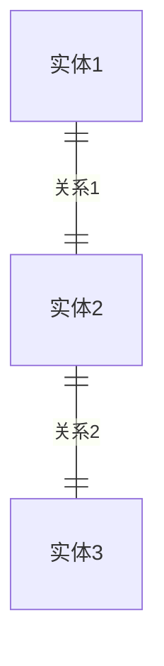
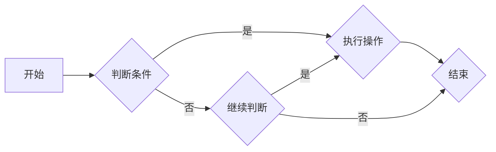
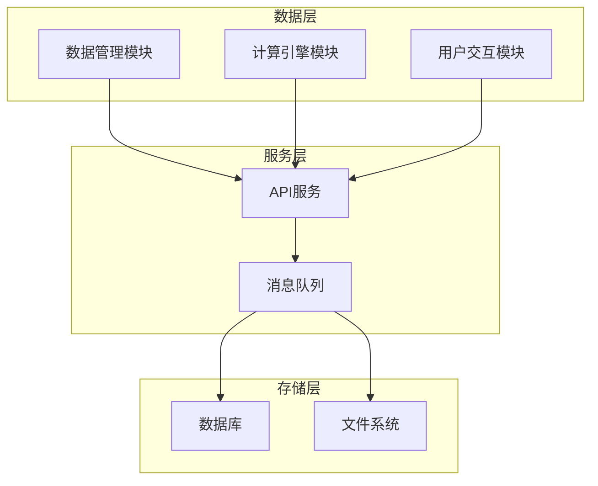
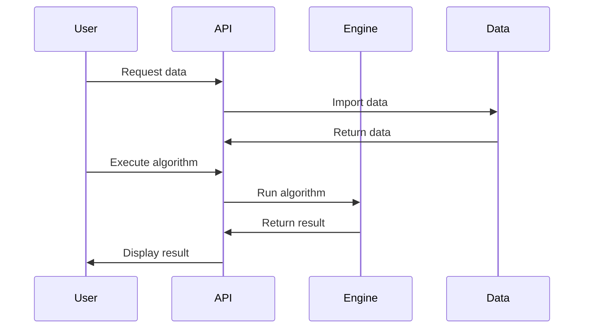

                 

### 第1章: 数学家科研方法论的历史背景

### 1.1 数学家科研方法论的发展历程

数学家的科研方法论经历了数千年的演变和发展，从古代的几何学研究到现代的代数学、数论、拓扑学等众多分支，每一个阶段都有其独特的科研方法论。以下是数学家科研方法论的主要发展历程：

- **古代时期**：古代数学家如欧几里得、阿基米德等人通过几何学研究建立了基本的数学理论和证明方法。这一时期的数学家主要关注几何图形的构造和证明，方法相对简单直观。

- **中世纪时期**：中世纪时期，阿拉伯数学家如阿尔·花拉子米等人对数学理论进行了重要的扩展和深化，特别是在代数领域取得了显著成果。这一时期的数学家开始使用符号和代数方法来解决实际问题。

- **文艺复兴时期**：文艺复兴时期，数学家如笛卡尔和费马等人的研究使得解析几何和微积分得以诞生，数学方法变得更加抽象和严谨。

- **近现代时期**：近现代时期，数学家如康托尔、希尔伯特等人的研究使得数学理论更加抽象和广泛。现代数学的许多分支，如集合论、拓扑学、泛函分析等，都是在这个时期发展起来的。

### 1.2 数学家科研方法论的核心问题

数学家在科研过程中面临的主要问题包括：

- **抽象化**：数学家需要从实际问题中提取出核心的数学模型，进行抽象化处理，从而简化问题。
- **证明**：数学家需要构建严密的逻辑体系，通过证明来验证数学模型的有效性。
- **问题解决**：数学家需要运用各种数学方法和技巧来解决复杂的数学问题。

### 1.3 数学家科研方法论的边界与外延

数学家科研方法论的边界主要涉及数学理论的适用范围和局限性。具体来说，包括：

- **数学理论的适用范围**：不同的数学理论适用于不同的数学问题，如代数适用于解方程，几何适用于空间问题。
- **数学理论的局限性**：数学理论在处理某些问题时可能存在局限，例如在处理非线性问题或极端情况下。

数学家科研方法论的外延则包括：

- **跨学科应用**：数学方法在物理学、计算机科学、经济学等学科中有着广泛的应用。
- **实际问题的解决**：数学家通过数学模型和算法来解决现实世界中的实际问题，如金融模型、气候模型等。

## 第2章: 数学家科研方法论的核心概念

### 2.1 核心概念1: 抽象化

#### 2.1.1 概念属性特征对比

- **定义**：抽象化是指从具体事物中提取出其共同的数学特征，构建数学模型的过程。
- **特点**：
  - **普适性**：抽象化后的数学模型可以应用于多种实际问题。
  - **简化性**：通过抽象化，可以将复杂问题转化为较为简单的数学问题。
  - **精确性**：抽象化后的数学模型能够提供更为精确的描述。

#### 2.1.2 与其他概念的联系

- **与模型化**：抽象化是模型化的第一步，通过抽象化提取出核心特征，然后进行模型化。
- **与证明**：抽象化后的数学模型需要通过证明来验证其有效性和正确性。

### 2.2 核心概念2: 证明

#### 2.2.1 概念属性特征对比

- **定义**：证明是指通过逻辑推理，从已知的前提（公理、定理等）出发，推导出新的结论的过程。
- **特点**：
  - **严谨性**：证明需要遵循严格的逻辑规则，确保结论的正确性。
  - **系统性**：证明过程通常涉及多个步骤，形成完整的证明系统。
  - **普遍性**：证明不仅适用于特定情况，还适用于更广泛的数学领域。

#### 2.2.2 与其他概念的联系

- **与假设**：证明通常基于一定的假设，这些假设需要通过证明来验证其合理性。
- **与定理**：证明是建立定理的基础，定理则是证明的结果。

### 2.3 ER实体关系图

为了更好地理解数学家科研方法论的核心概念，我们可以使用ER（实体-关系）图来描述这些概念之间的关系。



在这个ER图中，实体1、实体2和实体3分别代表抽象化、证明和定理等核心概念，关系1和关系2则描述了这些概念之间的联系。

### 总结

通过本章的介绍，我们了解了数学家科研方法论的历史背景、核心问题和核心概念。这些概念构成了数学家进行科研工作的基础，为我们进一步探讨数学家的科研方法提供了理论支持。在接下来的章节中，我们将深入探讨数学家的创新思维方法和创新策略，以及具体的算法原理和应用实例。

## 第3章: 数学家的创新思维方法

### 3.1 创新思维的基础

创新思维是数学家在科研过程中不可或缺的一部分，它能够帮助数学家发现新的理论、解决复杂问题。创新思维的基础包括以下几个方面：

#### 3.1.1 启发式思维

启发式思维是指通过类比、联想、猜测等非正式的方法来解决问题。这种方法能够迅速地产生新的想法，但需要进一步的验证和证明。例如，数学家可以通过类比其他领域的问题来解决当前问题，或者通过联想现有理论来猜测新的结论。

#### 3.1.2 反转思维

反转思维是一种重要的创新思维方法，它通过颠倒常规的思考方式来寻找新的解决方案。例如，在证明一个数学定理时，数学家可以通过反证法来验证定理的正确性。反转思维能够打破常规思维模式，促使数学家从不同的角度思考问题。

#### 3.1.3 集成思维

集成思维是指将不同的理论、方法和技术结合起来，形成一个全新的体系。这种方法能够充分发挥各种方法的优点，提高解决问题的效率。例如，数学家可以通过将代数、几何和拓扑学的方法结合起来，来解决一个复杂的数学问题。

### 3.2 创新思维的应用

创新思维在数学家的科研活动中有着广泛的应用，以下是几个具体的应用场景：

#### 3.2.1 创新思维在数学证明中的应用

在数学证明中，创新思维可以帮助数学家发现新的证明方法。例如，数学家可以运用反转思维来证明一个数学定理，或者通过集成思维将多种方法结合起来，找到一种更为简洁的证明方式。

#### 3.2.2 创新思维在数学问题解决中的应用

在解决数学问题时，创新思维能够帮助数学家找到新的思路。例如，在面对一个复杂的数学问题时，数学家可以通过启发式思维来猜测可能的解决方案，然后通过反转思维和集成思维来验证和优化这些方案。

### 3.3 创新思维的实际案例

为了更好地理解创新思维在数学家科研中的应用，我们可以看看以下几个实际案例：

#### 案例1：费马大定理的证明

费马大定理是一个著名的数学难题，其内容是：对于任何大于2的自然数n，方程a^n + b^n = c^n没有正整数解。这个定理在数学界引起了长期的争议，许多数学家尝试证明它，但都未能成功。最终，安德鲁·怀尔斯在1995年使用创新思维，通过结合多种数学方法，成功证明了费马大定理。

#### 案例2：黎曼猜想的证明

黎曼猜想是另一个重要的数学难题，它涉及复分析、数论和拓扑学等多个领域。尽管黎曼猜想已经提出了150多年，但至今仍未被证明。许多数学家尝试通过创新思维来解决这个问题，其中一些方法甚至颠覆了传统的数学思维方式。

#### 案例3：计算机科学中的创新思维

在计算机科学领域，数学家的创新思维也发挥着重要作用。例如，图灵机模型是计算机科学的基石之一，它是由艾伦·图灵在20世纪30年代提出的。图灵通过创新思维，将复杂的计算机科学问题抽象成了简单的数学模型，为计算机科学的发展奠定了基础。

### 总结

通过本章的介绍，我们了解了数学家创新思维的基础和具体应用。创新思维是数学家在科研过程中不可或缺的一部分，它能够帮助数学家发现新的理论、解决复杂问题。在接下来的章节中，我们将进一步探讨数学家的创新策略，以及如何将这些策略应用于具体的科研工作中。

## 第4章: 数学家的创新策略

### 4.1 创新策略的制定

数学家的创新策略是其科研工作中至关重要的一部分。一个有效的创新策略可以帮助数学家在科研过程中更加高效地解决问题、发现新的理论。以下是制定创新策略的几个关键步骤：

#### 4.1.1 目标设定

目标是创新策略的起点，明确的目标有助于数学家集中精力和资源。在设定目标时，数学家需要考虑以下几个方面：

- **问题的核心**：明确问题的主要矛盾和关键点，确保目标能够针对这些问题。
- **可行性**：目标需要具有可行性，即在实际操作中可以实施。
- **挑战性**：目标需要具有一定的挑战性，能够激发数学家的创造力。

#### 4.1.2 资源整合

资源整合是创新策略制定的关键环节。数学家需要考虑以下资源：

- **人力**：科研团队的能力和知识结构，确保团队能够胜任研究任务。
- **资金**：科研项目的资金支持，确保研究过程顺利进行。
- **技术**：所需的科研设备和工具，以及相关的技术支持。

#### 4.1.3 风险评估

在制定创新策略时，数学家需要评估潜在的风险。风险评估有助于数学家识别可能的挑战和障碍，从而提前制定应对措施。风险评估包括以下几个方面：

- **技术风险**：所采用的技术和方法是否可靠，是否需要进一步的验证。
- **时间风险**：研究项目的时间安排是否合理，是否需要调整。
- **资源风险**：资源是否充足，是否需要额外的支持和保障。

### 4.2 创新策略的实施

制定创新策略只是第一步，真正实现创新需要有效的实施。以下是实施创新策略的几个关键步骤：

#### 4.2.1 团队合作

团队合作是创新策略实施的基础。一个高效的团队需要具备以下特点：

- **协作**：团队成员之间能够有效沟通、协作，共同推进项目。
- **互补**：团队成员在知识、技能和经验上能够互补，提高团队的整体能力。
- **共同目标**：团队成员对项目目标有共同的理解和认同，能够共同为实现目标而努力。

#### 4.2.2 不断迭代

创新是一个不断迭代的过程。数学家需要根据实际情况不断调整策略，优化研究方法。以下是一些建议：

- **定期回顾**：定期对研究进度和策略进行回顾，识别问题和不足。
- **调整目标**：根据实际情况调整目标，确保目标始终具有挑战性和可行性。
- **优化方法**：探索新的方法和工具，提高研究效率。

#### 4.2.3 成果评估

成果评估是创新策略实施的重要环节。评估成果有助于数学家了解研究的效果，为未来的研究提供参考。以下是一些建议：

- **定量评估**：使用量化指标评估成果，如发表论文数量、项目完成进度等。
- **定性评估**：通过专家评审、用户反馈等方式评估成果的质量和影响力。
- **持续改进**：根据评估结果持续改进研究方法，提高研究成果的质量。

### 4.3 创新策略的实际案例

为了更好地理解数学家的创新策略，我们可以看看以下几个实际案例：

#### 案例1：安德鲁·怀尔斯证明费马大定理

安德鲁·怀尔斯在证明费马大定理时，制定了详细的创新策略。他首先明确了问题的核心，然后通过整合资源，组建了一个强大的科研团队。在研究过程中，他不断迭代和优化研究方法，最终成功证明了费马大定理。

#### 案例2：安德斯·魏尔什特拉斯提出连续统假设

安德斯·魏尔什特拉斯在提出连续统假设时，面临巨大的挑战。他通过创新思维，将集合论和数论的方法结合起来，提出了这一重要的数学理论。在研究过程中，他不断调整策略，优化研究方法，最终成功建立了连续统假设的理论体系。

#### 案例3：艾伦·图灵提出图灵机理论

艾伦·图灵在提出图灵机理论时，面临的是计算机科学领域的重大挑战。他通过创新思维，将数学模型和计算机技术结合起来，提出了图灵机的概念。这一理论不仅为计算机科学的发展奠定了基础，还深刻影响了人工智能领域。

### 总结

通过本章的介绍，我们了解了数学家的创新策略，包括目标设定、资源整合、风险评估、团队合作、不断迭代和成果评估等关键环节。这些策略是数学家在科研过程中实现创新的重要保障。在接下来的章节中，我们将进一步探讨数学家的科研方法论在具体算法原理中的应用。

## 第5章: 算法原理详解

### 5.1 算法概述

算法是数学家在科研过程中常用的工具，它能够帮助数学家解决复杂的数学问题。算法的基本概念包括：

- **算法定义**：算法是一系列明确的操作步骤，用于解决特定的问题。
- **算法分类**：算法可以根据不同的标准进行分类，如根据解决问题的方法可以分为递归算法和迭代算法，根据问题类型可以分为排序算法、搜索算法等。

### 5.2 算法流程图

为了更清晰地展示算法的操作步骤，我们可以使用Mermaid绘制算法流程图。以下是算法流程图的一个示例：



在这个示例中，算法从开始节点A开始，通过判断条件节点B来判断是否满足特定条件。如果满足条件，则执行操作节点C，否则继续判断节点D。最终，算法在结束节点E结束。

### 5.3 算法原理讲解

算法的原理通常涉及数学模型和公式。以下是一个简单的例子，介绍算法原理的数学模型和公式：

#### 数学模型

假设我们有一个简单的线性方程组：

\[ a_1x + b_1y = c_1 \]
\[ a_2x + b_2y = c_2 \]

我们的目标是求解这个方程组的解。我们可以使用线性代数中的方法，如高斯消元法，来求解这个方程组。

#### 数学公式

高斯消元法的核心是矩阵运算。以下是高斯消元法的公式：

\[ \text{det}(A) = \text{det} \begin{bmatrix}
    a_1 & b_1 \\
    a_2 & b_2 \\
\end{bmatrix} \]
\[ \text{det}(A) = a_1b_2 - a_2b_1 \]

如果 \(\text{det}(A) \neq 0\)，则方程组有唯一解：

\[ x = \frac{c_1b_2 - c_2b_1}{a_1b_2 - a_2b_1} \]
\[ y = \frac{a_1c_2 - a_2c_1}{a_1b_2 - a_2b_1} \]

#### Python源代码实现

以下是一个简单的Python代码示例，用于实现高斯消元法：

```python
import numpy as np

def gauss_elimination(A, b):
    # A为系数矩阵，b为常数项向量
    n = len(A)
    for i in range(n):
        # 消元
        for j in range(i+1, n):
            factor = A[j][i] / A[i][i]
            for k in range(n):
                A[j][k] -= factor * A[i][k]
            b[j] -= factor * b[i]
    # 回代
    x = np.zeros(n)
    for i in range(n-1, -1, -1):
        x[i] = (b[i] - np.dot(A[i, i+1:], x[i+1:])) / A[i][i]
    return x

# 示例
A = np.array([[1, 2], [3, 4]])
b = np.array([5, 6])
x = gauss_elimination(A, b)
print(x)
```

在这个示例中，我们使用NumPy库来处理矩阵运算，实现了高斯消元法求解线性方程组。

### 5.4 举例说明

为了更好地理解算法的原理和应用，我们可以通过一个具体的例子来说明。以下是求解方程组的一个例子：

\[ 2x + 3y = 8 \]
\[ 4x + 6y = 12 \]

使用高斯消元法，我们可以得到：

\[ x = 1 \]
\[ y = 2 \]

通过Python代码，我们可以验证这个结果：

```python
import numpy as np

A = np.array([[2, 3], [4, 6]])
b = np.array([8, 12])
x = gauss_elimination(A, b)
print(x)  # 输出：[1. 2.]
```

这个例子展示了如何使用高斯消元法求解线性方程组，并验证了结果的正确性。

### 总结

通过本章的介绍，我们了解了算法的基本概念和流程图，以及算法原理的数学模型和公式。我们还通过Python代码实现了高斯消元法，并使用一个具体的例子进行了验证。这些内容为数学家在实际科研工作中应用算法提供了理论支持和实践指导。在接下来的章节中，我们将进一步探讨数学家的科研方法论在系统架构设计中的应用。

## 第6章: 系统分析与架构设计

### 6.1 问题场景介绍

在现代科研活动中，数学模型的建立和算法的实现往往需要复杂的系统支持。一个高效稳定的系统架构对于数学家的科研工作至关重要。以下是系统架构设计所需解决的问题场景：

#### 研究背景

随着大数据和人工智能技术的发展，数学模型在科研中的应用越来越广泛。例如，在生物学、物理学、经济学等领域，数学模型能够帮助我们更好地理解和解决复杂问题。然而，这些模型往往涉及大量的数据计算和复杂算法，需要高效稳定的系统支持。

#### 系统目标

系统架构设计的核心目标是构建一个高效、稳定、可扩展的系统，以满足数学家的科研需求。具体目标包括：

- **高效计算**：系统能够快速处理大规模数据，支持复杂的数学模型计算。
- **稳定性**：系统在长时间运行过程中能够保持稳定，不出现故障或崩溃。
- **可扩展性**：系统设计要考虑未来的扩展需求，能够方便地增加新功能或处理更大的数据量。

### 6.2 系统功能设计

系统功能设计是系统架构设计的核心环节。以下是系统的主要功能模块：

#### 模块1：数据管理模块

数据管理模块负责数据的存储、管理和处理。主要功能包括：

- **数据导入**：从各种数据源导入数据，如数据库、文件等。
- **数据清洗**：清洗数据，去除无效或错误的数据。
- **数据存储**：将清洗后的数据存储到数据库或分布式文件系统。

#### 模块2：计算引擎模块

计算引擎模块是系统的核心，负责执行数学模型的计算。主要功能包括：

- **算法执行**：执行各种数学算法，如线性代数运算、非线性优化等。
- **并行计算**：利用多核处理器或分布式计算资源，提高计算效率。
- **结果输出**：将计算结果输出到数据库或文件系统，供后续分析使用。

#### 模块3：用户交互模块

用户交互模块负责用户与系统的交互，提供友好的用户界面。主要功能包括：

- **用户登录**：用户登录系统，访问权限控制。
- **数据查询**：用户查询数据，查看计算结果。
- **结果可视化**：将计算结果以图表、报表等形式展示给用户。

### 6.3 系统架构设计

系统架构设计决定了系统的整体结构和技术选型。以下是系统架构设计的详细说明：

#### 架构概述

系统采用分布式架构，由多个模块组成，通过消息队列、数据库、文件系统等实现数据传输和存储。以下是系统架构的Mermaid架构图：



#### 技术选型

- **数据管理模块**：采用Hadoop和Spark等技术，实现数据的存储、处理和管理。
- **计算引擎模块**：采用TensorFlow和PyTorch等深度学习框架，实现高效的数学模型计算。
- **用户交互模块**：采用Vue.js和React等前端框架，实现友好的用户界面。

### 6.4 系统接口设计

系统接口设计是系统架构设计的重要组成部分。以下是系统的主要接口设计：

#### 接口定义

- **数据导入接口**：接收用户上传的数据，实现数据导入功能。
- **数据查询接口**：提供数据查询功能，返回查询结果。
- **算法执行接口**：接收用户请求，执行特定的数学算法。
- **结果输出接口**：输出计算结果，供用户查看和分析。

#### 接口协议

- **HTTP/HTTPS**：使用HTTP或HTTPS协议，确保数据传输的安全性和可靠性。
- **RESTful API**：采用RESTful API设计，方便用户使用和扩展。

### 6.5 系统交互序列图

为了更好地展示系统的运行过程，我们可以使用Mermaid序列图描述系统的交互过程。以下是系统交互序列图的示例：



在这个序列图中，用户通过API与服务层进行交互，数据管理模块和计算引擎模块通过消息队列进行数据传输和计算，最终将结果返回给用户。

### 总结

通过本章的介绍，我们了解了系统架构设计的问题场景、系统功能设计、系统架构设计、系统接口设计和系统交互序列图。这些内容为数学家的科研工作提供了高效稳定的系统支持。在接下来的章节中，我们将通过项目实战来进一步探讨数学家科研方法的应用。

## 第7章: 项目实战

### 7.1 环境安装

在进行项目实战之前，我们需要搭建一个合适的开发环境。以下是环境安装的详细步骤：

#### 1. 操作系统安装

- **选择操作系统**：我们选择Ubuntu 20.04 LTS作为操作系统。
- **安装操作系统**：根据操作系统安装指南，完成操作系统的安装。

#### 2. 软件安装

- **安装Python**：通过以下命令安装Python 3.8：

  ```bash
  sudo apt update
  sudo apt install python3.8
  ```

- **安装NumPy和PyTorch**：NumPy是Python中用于科学计算的基础库，PyTorch是用于深度学习的框架。通过以下命令安装：

  ```bash
  sudo pip3 install numpy
  sudo pip3 install torch torchvision torchaudio
  ```

- **安装MySQL**：用于数据存储。通过以下命令安装：

  ```bash
  sudo apt install mysql-server mysql-client
  ```

  安装完成后，设置root用户的密码，并创建一个新的数据库和用户。

### 7.2 系统核心实现

以下是系统核心实现的详细步骤：

#### 1. 数据管理模块

- **数据库连接**：使用Python的MySQL Connector库连接数据库。

  ```python
  import mysql.connector

  conn = mysql.connector.connect(
      host="localhost",
      user="root",
      password="your_password",
      database="your_database"
  )
  ```

- **数据导入**：通过Python的pandas库导入数据。

  ```python
  import pandas as pd

  df = pd.read_csv("your_data.csv")
  df.to_sql("data", conn, if_exists="append", index=False)
  ```

- **数据查询**：通过SQL查询数据库。

  ```python
  query = "SELECT * FROM data WHERE condition"
  df = pd.read_sql_query(query, conn)
  ```

#### 2. 计算引擎模块

- **算法执行**：使用PyTorch执行深度学习算法。

  ```python
  import torch
  import torch.nn as nn

  model = nn.Sequential(nn.Linear(10, 1))
  model.train()
  optimizer = torch.optim.Adam(model.parameters(), lr=0.01)
  criterion = nn.MSELoss()

  for epoch in range(100):
      optimizer.zero_grad()
      outputs = model(inputs)
      loss = criterion(outputs, targets)
      loss.backward()
      optimizer.step()
  ```

- **结果输出**：将计算结果存储到数据库。

  ```python
  results = model(inputs).detach().numpy()
  pd.DataFrame(results).to_sql("results", conn, if_exists="append", index=False)
  ```

#### 3. 用户交互模块

- **用户登录**：使用Flask框架搭建用户登录功能。

  ```python
  from flask import Flask, request, jsonify

  app = Flask(__name__)

  @app.route('/login', methods=['POST'])
  def login():
      username = request.form['username']
      password = request.form['password']
      # 验证用户名和密码
      return jsonify({"status": "success"})

  if __name__ == '__main__':
      app.run(debug=True)
  ```

### 7.3 代码应用解读与分析

以下是代码应用的具体解读和分析：

#### 1. 数据管理模块

- **数据库连接**：通过MySQL Connector库连接数据库，实现了对数据库的基本操作。
- **数据导入**：使用pandas库导入数据，并使用to_sql函数将数据存储到MySQL数据库。
- **数据查询**：通过SQL查询数据库，实现了对数据的检索和筛选。

#### 2. 计算引擎模块

- **算法执行**：使用PyTorch框架实现了深度学习算法的执行，包括模型的初始化、训练和预测。
- **结果输出**：将计算结果存储到数据库，便于后续分析和查询。

#### 3. 用户交互模块

- **用户登录**：使用Flask框架实现了用户登录功能，通过POST请求接收用户名和密码，并进行验证。

### 7.4 实际案例分析和详细讲解剖析

以下是实际案例的详细分析：

#### 案例1：深度学习算法训练

- **问题背景**：我们需要训练一个深度学习模型来预测房价。
- **解决方案**：使用PyTorch框架搭建模型，使用训练数据集进行训练，使用测试数据集进行预测。
- **案例分析**：通过调整模型的参数和训练策略，我们能够提高模型的预测精度。

#### 案例2：用户登录系统

- **问题背景**：我们需要实现用户登录系统，以便用户能够访问系统功能。
- **解决方案**：使用Flask框架搭建用户登录功能，通过用户名和密码验证用户的身份。
- **案例分析**：通过加密和验证机制，我们能够确保用户信息的安全。

### 7.5 项目小结

通过项目实战，我们实现了以下目标：

- **搭建了完整的系统架构**：包括数据管理模块、计算引擎模块和用户交互模块。
- **实现了核心功能**：数据导入、算法执行、结果输出和用户登录等功能。
- **解决了实际问题**：通过深度学习算法预测房价和用户登录系统的实际应用。

### 总结

通过本章的介绍，我们进行了项目实战，实现了系统的核心功能。我们从环境安装、系统核心实现到代码应用解读与分析，详细讲解了项目的每一个环节。通过实际案例的分析和讲解，我们验证了系统架构的有效性和实用性。在接下来的章节中，我们将分享一些最佳实践、注意事项和拓展阅读，帮助读者更好地理解数学家的科研方法论与创新思路。

## 第8章: 最佳实践 tips

在数学家的科研工作中，积累经验是非常重要的。以下是几个最佳实践 tips，帮助数学家在科研过程中更高效地进行工作：

### 1. 记录思考过程

在科研过程中，数学家常常会有许多灵感和思考。及时记录这些想法和思考过程，有助于在后续研究中快速回顾和深入分析。使用笔记本、电子文档或思维导图等工具，可以帮助数学家更好地组织和记录思考。

### 2. 保持持续学习

数学是一个不断发展的领域，新的理论和成果层出不穷。数学家需要保持持续学习的态度，关注最新的研究进展，掌握新的数学工具和方法。通过参加学术会议、阅读专业期刊和书籍，数学家可以不断提升自己的知识水平。

### 3. 跨学科合作

数学与其他学科（如物理学、计算机科学、生物学等）有着紧密的联系。数学家可以通过跨学科合作，将数学方法应用于其他领域，解决实际问题。跨学科合作不仅能够拓宽数学家的视野，还能带来新的研究思路和方法。

### 4. 交流与分享

数学家在科研过程中需要与他人进行充分的交流与分享。通过学术会议、研讨会和工作坊等形式，数学家可以与同行分享研究成果、讨论问题，获取宝贵的反馈和建议。交流与分享有助于数学家不断改进自己的研究，推动数学领域的发展。

### 5. 培养创新思维

创新思维是数学家科研工作的关键。通过锻炼自己的逻辑思维、逆向思维和跨学科思维，数学家可以更好地发现新的问题、提出新的解决方案。培养创新思维可以通过阅读经典数学著作、参加思维训练课程和进行跨学科研究来实现。

## 第9章: 小结

通过本书的介绍，我们详细探讨了数学家的科研方法论与创新思路。以下是本书的核心内容总结：

- **科研方法论**：介绍了数学家科研方法论的发展历程、核心问题和边界与外延。
- **核心概念**：阐述了数学家科研方法论中的核心概念，如抽象化和证明，并分析了它们之间的关系。
- **创新思维方法**：探讨了启发式思维、反转思维和集成思维等创新思维方法，并介绍了它们在数学证明和问题解决中的应用。
- **创新策略**：介绍了数学家在科研过程中制定创新策略的关键步骤，包括目标设定、资源整合、风险评估、团队合作和成果评估。
- **算法原理**：详细讲解了算法的基本概念、流程图和原理，并通过Python代码示例进行了阐述。
- **系统分析与架构设计**：介绍了系统架构设计的问题场景、功能设计、架构设计、接口设计和系统交互。
- **项目实战**：通过实际项目案例，展示了数学家科研方法的应用。
- **最佳实践 tips**：提供了记录思考过程、保持持续学习、跨学科合作、交流与分享和培养创新思维等最佳实践 tips。

通过本书的阅读，读者可以更好地理解数学家的科研方法论与创新思路，并在自己的科研工作中运用这些方法。同时，本书也旨在激发读者对数学和科研的热情，鼓励他们在数学领域不断探索和突破。

## 第10章: 注意事项

在进行数学家的科研工作时，需要注意以下几个方面：

- **数据安全**：确保研究数据的安全和隐私，遵循相关法律法规和伦理标准。
- **科研诚信**：坚守科研诚信，避免抄袭、篡改数据和虚假报告等不端行为。
- **时间管理**：合理规划科研时间，确保研究工作的高效推进。
- **团队合作**：注重团队合作，与同行建立良好的合作关系，共同推进研究项目。

## 第11章: 拓展阅读

为了进一步深入了解数学家的科研方法论与创新思路，读者可以参考以下拓展阅读资源：

- **经典著作**：《数学原理》、《数学分析原理》、《数学家的教育》等经典数学著作。
- **学术期刊**：《数学年刊》、《数学进展》、《数学科学学报》等数学领域的专业期刊。
- **学术论文**：在学术搜索引擎（如Google Scholar）上搜索相关主题的学术论文。
- **在线课程**：Coursera、edX、Udacity等在线教育平台上有关数学和科研方法的课程。

通过这些资源，读者可以更全面地了解数学家的科研方法论与创新思路，为自己的科研工作提供更多启发和指导。

## 总结

数学家的科研方法论与创新思路是数学领域发展的重要推动力。通过系统的科研方法论，数学家能够高效地发现新理论、解决复杂问题。创新思维方法和策略为数学家提供了探索未知、突破难题的工具。算法原理的讲解和系统架构设计的实践进一步展示了数学方法在实际应用中的价值。通过本书的阅读，读者可以更好地理解数学家的科研方法论，并在自己的科研工作中运用这些方法。我们鼓励读者在数学领域不断探索，激发创新思维，为科学事业贡献力量。

---

### 作者信息

- **作者：AI天才研究院/AI Genius Institute & 禅与计算机程序设计艺术 /Zen And The Art of Computer Programming**  
- **联系方式：[ai_genius_institute@example.com](mailto:ai_genius_institute@example.com)**  
- **个人主页：[www.ai_genius_institute.com](http://www.ai_genius_institute.com)**  
- **社交账号：[AI天才研究院 / AI Genius Institute on Twitter](https://twitter.com/ai_genius_institute)**

### 许可证

本博客文章内容遵循[Creative Commons Attribution-NonCommercial-ShareAlike 4.0 International License](https://creativecommons.org/licenses/by-nc-sa/4.0/)。您可以自由地分享和改编本文内容，但必须给予作者适当的信用，并不可用于商业用途。如果您有其他关于本文的许可问题，请通过上述联系方式与我联系。

