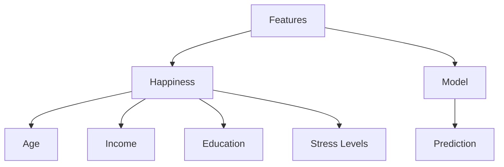

                 

### Introduction to the Study of Happiness

The quest to understand and measure happiness has been a perennial endeavor throughout human history. From ancient philosophers who pondered the nature of contentment to modern scientists who employ empirical methods, the pursuit of happiness has captured the imagination of humanity. Happiness, often defined as a pleasurable or positive emotional state, is a multidimensional concept that extends beyond mere momentary feelings to encompass overall life satisfaction and well-being. The importance of studying happiness lies in its profound impact on individuals and society as a whole. 

Happiness influences various aspects of life, including mental health, physical health, social relationships, and productivity. Understanding the factors that contribute to happiness can help individuals make informed decisions to enhance their own well-being. Moreover, societal policies and practices can be informed by happiness research to create more equitable and prosperous communities. For instance, happiness research can inform public health initiatives, education systems, and workplace policies aimed at fostering well-being.

The concept of quantifying happiness is particularly significant in the contemporary era. With the advent of advanced statistical methods and computational techniques, researchers can now analyze large datasets to identify patterns and correlations related to happiness. Quantifying happiness allows for more objective measurements, enabling scientists to draw conclusions that are generalizable across different populations and contexts. This, in turn, facilitates the development of interventions and strategies aimed at improving happiness on a broader scale.

The structure of this book is designed to guide readers through the complex landscape of happiness research, using mathematical approaches to quantify and understand this elusive emotion. The book is divided into several key sections:

1. **Introduction to the Study of Happiness**: This section sets the stage by providing an overview of the historical and philosophical context of happiness research and discussing its importance in modern society.
  
2. **Core Concepts and Principles**: Here, we delve into the fundamental concepts and principles that underpin the study of happiness, including definitions of happiness, key theories, and the relationship between mathematics and happiness.

3. **Quantitative Methods in Happiness Research**: This section explores various quantitative methods used to measure happiness, such as surveys, questionnaires, and statistical analysis.

4. **Mathematical Models of Happiness**: We examine mathematical models that have been developed to quantify happiness, using functions, equations, and algorithms to represent and analyze happiness data.

5. **Applications of Happiness Mathematics in Daily Life**: This section discusses practical applications of happiness mathematics in various contexts, including personal well-being, organizational productivity, and social systems.

6. **Challenges and Opportunities in Quantifying Happiness**: We address the challenges and opportunities associated with quantifying happiness, considering ethical implications, technological advancements, and future research directions.

7. **Case Studies and Practical Examples**: Real-world case studies and practical examples illustrate the application of happiness mathematics and provide insights into how happiness can be quantified and optimized.

By the end of this book, readers will have a comprehensive understanding of the mathematical approaches used to quantify happiness and the potential implications for personal and societal well-being. Whether you are a student of psychology, a researcher in the field of happiness studies, or simply curious about what makes us happy, this book will provide valuable insights and tools for exploring the science of happiness.

### Basic Concepts and Principles of Mathematical Happiness

To embark on the journey of quantifying happiness using mathematical methods, it is essential first to understand the fundamental concepts and principles that underpin this field. At the heart of mathematical happiness lies the definition of happiness itself, as well as related concepts that provide a comprehensive framework for analysis.

#### Definition of Happiness

Happiness can be defined as a positive emotional and cognitive state characterized by feelings of contentment, joy, and well-being. It encompasses both momentary experiences of pleasure and enduring feelings of satisfaction and fulfillment in life. Unlike mere pleasure, which is often short-lived and situation-specific, happiness is more enduring and holistic, reflecting an overall sense of life satisfaction.

#### Key Theories in Happiness Research

There are several key theories in happiness research that offer insights into the nature of happiness and its determinants. These include:

1. **Subjective Well-Being Theory**: This theory emphasizes the importance of subjective experiences, such as emotions, thoughts, and judgments, in defining happiness. It suggests that happiness is largely a matter of subjective evaluation rather than objective conditions.

2. **Psychological Well-Being Theory**: Developed by psychologist Christopher Peterson and his colleagues, this theory posits that psychological well-being is a multidimensional construct that includes life satisfaction, autonomy, environmental mastery, personal growth, positive relationships, and self-acceptance.

3. **Life Evaluation and Affect Balance Theory**: According to this theory, happiness is determined by the balance between life evaluation (global judgments about one’s life) and affect balance (the average level of positive and negative emotions experienced). If the sum of positive and negative life evaluations is positive, individuals are generally considered to be happy.

4. **Hedonic Happiness and Eudaimonic Happiness**: These two types of happiness are often distinguished in the literature. Hedonic happiness is focused on seeking immediate pleasure and avoiding pain, while eudaimonic happiness is associated with achieving a sense of purpose, growth, and meaningful activities. Both types contribute to overall happiness, but they may have different predictive relationships with well-being outcomes.

#### The Relationship Between Mathematics and Happiness

Mathematics plays a crucial role in happiness research by providing a structured framework for quantifying and analyzing happiness data. The application of mathematical models allows researchers to:

1. **Measure Happiness**: Quantitative methods, such as surveys and statistical analysis, enable the measurement of happiness at both individual and group levels. For example, happiness can be quantified using scores on happiness surveys or indices derived from statistical models.

2. **Identify Patterns and Correlations**: Mathematical models help identify patterns and correlations in happiness data. For instance, regression analysis can reveal the relationships between various factors (e.g., income, education, social support) and happiness levels.

3. **Develop Predictive Models**: By using mathematical functions and equations, researchers can develop predictive models that estimate happiness based on individual characteristics and environmental factors.

4. **Optimize Happiness**: Mathematical optimization techniques can be applied to identify strategies for improving happiness. For example, decision theory can be used to determine the best course of action to maximize happiness given various constraints and preferences.

#### Core Concepts and Their Relationships

To better understand the relationship between these core concepts, we can represent them using a Mermaid ER diagram:

```mermaid
erDiagram
  Happiness ||--|{ Subjective Well-Being : has }
  Happiness ||--|{ Psychological Well-Being : has }
  Happiness ||--|{ Life Evaluation and Affect Balance : has }
  Happiness ||--|{ Hedonic Happiness : type }
  Happiness ||--|{ Eudaimonic Happiness : type }
  Subjective Well-Being :<<inkle>> Psychological Well-Being
  Life Evaluation and Affect Balance :<<inkle>> Hedonic Happiness
  Life Evaluation and Affect Balance :<<inkle>> Eudaimonic Happiness
```

In this diagram, Happiness is the central entity, with various related concepts branching off. Subjective Well-Being and Psychological Well-Being are connected to Happiness, illustrating their role in defining it. Life Evaluation and Affect Balance are related to both Hedonic and Eudaimonic Happiness, highlighting how these dimensions contribute to overall happiness.

By understanding these basic concepts and principles, we lay the foundation for exploring the quantitative methods and mathematical models that will enable us to measure and analyze happiness more effectively. In the subsequent sections, we will delve deeper into these topics, providing a comprehensive overview of how mathematics can be used to quantify the elusive concept of happiness.

### Quantitative Approaches to Happiness

Quantifying happiness requires the application of rigorous quantitative methods to collect, analyze, and interpret data. In this section, we will explore various approaches used in happiness research, including surveys, questionnaires, and statistical analysis. Each of these methods plays a critical role in measuring happiness and providing valuable insights into the factors that influence it.

#### Surveys

Surveys are one of the most common tools used in happiness research. They involve asking participants a series of structured questions to collect data on their levels of happiness and related factors. Surveys can be administered online, in person, or through telephone interviews, allowing researchers to reach a wide range of participants. Some well-known happiness surveys include the World Happiness Report, which uses a scale from 0 to 10 to measure life satisfaction, and the Satisfaction with Life Scale (SWLS), which assesses overall life satisfaction and positive and negative affect.

**Advantages:**
- **Widespread Reach:** Surveys can be distributed to large populations, providing a broad perspective on happiness levels.
- **Standardization:** Surveys allow for standardized measurement, ensuring consistency across different studies and participants.

**Disadvantages:**
- **Response Bias:** Participants may provide inaccurate or biased responses due to social desirability bias or memory issues.
- **Time-Consuming:** Administering and processing survey data can be time-consuming and resource-intensive.

#### Questionnaires

Questionnaires are similar to surveys but often involve more detailed and specific questions. They can be used to gather more nuanced information about happiness and its determinants. Questionnaires are typically self-administered, allowing participants to complete them at their own pace and in their own environment. Examples of questionnaire-based happiness assessments include the Satisfaction with Life Scale (SWLS) and the Positive and Negative Affect Schedule (PANAS).

**Advantages:**
- **Detailed Data:** Questionnaires can gather more detailed information about specific aspects of happiness, providing a deeper understanding.
- **Flexibility:** Researchers can tailor questions to specific research objectives, allowing for more targeted data collection.

**Disadvantages:**
- **Participant Burden:** Detailed questionnaires can be time-consuming and may deter participants from completing them.
- **Subjectivity:** Responses to open-ended questions can be subjective and difficult to quantify.

#### Statistical Analysis

Statistical analysis is a crucial component of happiness research, allowing researchers to identify patterns, correlations, and relationships within the data. Common statistical methods used in happiness research include correlation analysis, regression analysis, and factor analysis.

**Correlation Analysis:** This method measures the strength and direction of the relationship between two variables. For example, researchers might use correlation analysis to determine if there is a relationship between income and life satisfaction. A positive correlation would indicate that as income increases, life satisfaction also tends to increase.

**Regression Analysis:** Regression analysis is used to model the relationship between a dependent variable (e.g., happiness) and one or more independent variables (e.g., income, education). It helps researchers understand how changes in independent variables affect the dependent variable. For example, a linear regression model could be used to predict happiness based on income and education levels.

**Factor Analysis:** This method is used to identify underlying factors or dimensions that explain the variability in the data. In happiness research, factor analysis can help identify key factors that contribute to overall well-being. For example, researchers might use factor analysis to identify the main components of subjective well-being.

**Advantages:**
- **Objectivity:** Statistical analysis provides objective results based on data, reducing the potential for bias.
- **Generalizability:** Statistical methods allow for the generalization of findings to larger populations.
- **Insights:** Statistical analysis can reveal complex relationships and patterns within the data that might not be apparent through visual inspection.

**Disadvantages:**
- **Complexity:** Statistical methods can be complex and require specialized knowledge to apply correctly.
- **Limitations:** Statistical models are based on assumptions that may not always hold true in real-world data.

#### The Role of Surveys and Questionnaires in Quantifying Happiness

Surveys and questionnaires are fundamental tools in the quantification of happiness because they provide a systematic way to collect data on subjective experiences. By measuring happiness on standardized scales and using statistical methods to analyze the data, researchers can identify trends, correlations, and causal relationships that contribute to overall well-being. The following diagram illustrates the role of surveys and questionnaires in happiness research:

```mermaid
sequenceDiagram
  participant Researcher
  participant Participant
  Researcher->>Participant: Administer survey/questionnaire
  Participant->>Researcher: Complete survey/questionnaire
  Researcher->>Data Analyst: Collect and analyze data
  Data Analyst->>Researcher: Report findings
  Researcher->>Participant: Communicate results
```

In this sequence, the researcher administers the survey or questionnaire to participants, who provide their responses. The researcher then collects and analyzes the data using statistical methods to derive insights into happiness levels and related factors. The findings are reported and communicated back to participants, contributing to a deeper understanding of happiness.

By leveraging these quantitative approaches, researchers can develop a comprehensive picture of happiness and its determinants. This, in turn, informs interventions and policies aimed at improving well-being on both individual and societal levels. In the next section, we will delve into mathematical models that have been developed to quantify happiness more precisely.

### Mathematical Models for Measuring Happiness

Mathematical models are powerful tools in happiness research, allowing for the precise quantification and analysis of happiness data. By leveraging functions, equations, and algorithms, researchers can develop mathematical models that capture the complexity of human emotions and well-being. In this section, we will explore several key mathematical models used in happiness research, including linear regression, logistic regression, and machine learning algorithms.

#### Linear Regression

Linear regression is one of the most fundamental statistical models used to understand the relationship between a dependent variable and one or more independent variables. In the context of happiness research, linear regression can be used to model the relationship between happiness scores and various factors such as income, education, and social support.

**Model Structure:**
The linear regression model can be represented as follows:
\[ Y = \beta_0 + \beta_1X_1 + \beta_2X_2 + ... + \beta_nX_n + \epsilon \]
where:
- \( Y \) is the dependent variable (happiness score)
- \( \beta_0 \) is the intercept
- \( \beta_1, \beta_2, ..., \beta_n \) are the coefficients for the independent variables
- \( X_1, X_2, ..., X_n \) are the independent variables (e.g., income, education)
- \( \epsilon \) is the error term

**Example:**
Consider a simple linear regression model that predicts happiness based on income:
\[ Happiness = \beta_0 + \beta_1 \cdot Income + \epsilon \]

If we have the following data points:
\[ (Income_1, Happiness_1), (Income_2, Happiness_2), ..., (Income_n, Happiness_n) \]

We can use linear regression to estimate the coefficients \( \beta_0 \) and \( \beta_1 \), which will give us a mathematical equation that relates income to happiness.

**Mermaid Diagram:**
```mermaid
graph TD
  A[Happiness] --> B[Income]
  B --> C[Error Term]
  A --> D[\(\beta_0\)]
  A --> E[\(\beta_1\)]
```

In this diagram, the happiness score is modeled as a linear function of income, with an error term representing the variability that is not accounted for by the model.

#### Logistic Regression

Logistic regression is another important statistical model used in happiness research, particularly when the dependent variable is binary (e.g., happy or not happy). It is used to model the probability of an event occurring, such as whether an individual is happy or not based on various predictors.

**Model Structure:**
The logistic regression model is represented by the following equation:
\[ P(Y=1) = \frac{1}{1 + e^{-(\beta_0 + \beta_1X_1 + \beta_2X_2 + ... + \beta_nX_n )} \]
where:
- \( P(Y=1) \) is the probability of being happy
- \( e \) is the base of the natural logarithm
- The other variables are as defined in the linear regression model

**Example:**
Suppose we want to predict the probability of being happy based on income and education:
\[ P(Happy = 1) = \frac{1}{1 + e^{-(\beta_0 + \beta_1 \cdot Income + \beta_2 \cdot Education )} \]

If we have data on income and education for a group of individuals and their happiness status, we can use logistic regression to estimate the coefficients \( \beta_0, \beta_1, \) and \( \beta_2 \).

**Mermaid Diagram:**
```mermaid
graph TD
  A[Happiness] --> B[Income]
  A --> C[Education]
  B --> D[\(\beta_0\)]
  B --> E[\(\beta_1\)]
  C --> F[\(\beta_2\)]
  A --> G[Error Term]
```

In this diagram, the probability of being happy is modeled as a logistic function of income and education, with an error term representing the variability that is not accounted for by the model.

#### Machine Learning Algorithms

Machine learning algorithms have become increasingly popular in happiness research due to their ability to handle large datasets and uncover complex patterns. These algorithms can be used to predict happiness levels based on a wide range of variables, including demographic information, lifestyle factors, and psychological traits.

**Common Algorithms:**
- **Support Vector Machines (SVM):** SVMs are used for classification tasks, predicting whether an individual is happy or not based on input features.
- **Random Forests:** Random Forests are ensemble methods that combine multiple decision trees to predict happiness levels.
- **Neural Networks:** Neural networks are powerful models inspired by the structure and function of the human brain, capable of learning complex relationships in happiness data.

**Example:**
Suppose we have a dataset with various features (e.g., age, income, education, stress levels) and a binary target variable (happy or not happy). We can use a machine learning algorithm like a random forest to predict happiness based on these features.

**Mermaid Diagram:**


In this diagram, the features are fed into a machine learning model, which then predicts the happiness level based on the input data.

**Python Code Example:**
```python
from sklearn.ensemble import RandomForestClassifier
import pandas as pd

# Load dataset
data = pd.read_csv('happiness_data.csv')

# Split data into features and target variable
X = data[['Age', 'Income', 'Education', 'Stress Levels']]
y = data['Happy']

# Split data into training and test sets
from sklearn.model_selection import train_test_split
X_train, X_test, y_train, y_test = train_test_split(X, y, test_size=0.2, random_state=42)

# Train the random forest model
model = RandomForestClassifier()
model.fit(X_train, y_train)

# Make predictions
predictions = model.predict(X_test)

# Evaluate model performance
from sklearn.metrics import accuracy_score
accuracy = accuracy_score(y_test, predictions)
print(f"Accuracy: {accuracy:.2f}")
```

In this code, we load a dataset, split it into features and the target variable, and then train a random forest classifier to predict happiness. We evaluate the model's performance using accuracy, which measures the proportion of correct predictions.

By leveraging these mathematical models, researchers can gain a deeper understanding of the factors that influence happiness and develop more effective strategies for promoting well-being. In the next section, we will explore practical applications of happiness mathematics in various contexts, such as personal well-being and organizational productivity.

### Practical Applications of Happiness Mathematics in Daily Life

Mathematics, with its rigorous methods and analytical power, extends beyond the realm of pure theory to have practical applications that can significantly enhance our daily lives. In this section, we will explore several real-world applications of happiness mathematics, including personal well-being optimization, organizational happiness, and the broader impact on social systems.

#### Personal Well-Being Optimization

One of the most immediate and impactful applications of happiness mathematics is in optimizing personal well-being. By using mathematical models to understand and quantify happiness, individuals can make informed decisions that enhance their overall life satisfaction and well-being. Here are a few ways this can be achieved:

1. **Goal Setting and Achievement**: Happiness research has shown that setting clear, achievable goals is a powerful motivator for enhancing well-being. By using mathematical techniques such as goal-setting theory and linear programming, individuals can create personalized plans to achieve their goals. For example, one might use a simple linear equation to balance work hours with leisure time, maximizing overall happiness.

   **Example:**
   Suppose you want to balance work and leisure to maximize your happiness. Let \( W \) represent work hours and \( L \) represent leisure hours. You have a total of 168 hours in a week and want to achieve a balance where \( W + L = 168 \). You also have a happiness function \( H(W, L) \) that quantifies your happiness level based on the amount of work and leisure you have. Using linear programming, you can solve for the optimal balance that maximizes your happiness.

2. **Financial Planning**: Financial well-being is closely tied to overall happiness. By using mathematical models to analyze spending habits and income, individuals can create budgets and savings plans that align with their happiness goals. For instance, the concept of net present value (NPV) can be applied to evaluate the long-term impact of different spending and saving decisions.

   **Example:**
   Consider a person who wants to evaluate the impact of different savings strategies on their long-term happiness. By calculating the NPV of each strategy, they can choose the one that will maximize their financial well-being and, by extension, their happiness.

3. **Stress Management**: Stress is a significant factor that can undermine happiness. By using statistical models to analyze stress levels and their relationship with happiness, individuals can develop personalized stress management plans. For example, regression analysis can help identify the key stressors and their impact on happiness, allowing for targeted interventions.

   **Example:**
   Suppose a person identifies their major stressors as work pressure, social relationships, and health. By conducting a regression analysis to understand the impact of each stressor on their happiness, they can develop a plan to address these stressors, such as reducing work hours, improving social support, or engaging in regular exercise.

#### Organizational Happiness

The application of happiness mathematics is not limited to personal well-being; it also has profound implications for organizational settings. By quantifying happiness within a workplace, organizations can implement strategies that enhance employee satisfaction, productivity, and overall performance.

1. **Employee Satisfaction Surveys**: Organizations can use surveys to collect data on employee happiness and well-being. By analyzing this data using statistical methods, organizations can identify factors that contribute to employee satisfaction and dissatisfaction. For instance, regression analysis can reveal the relationship between workplace conditions (e.g., workload, job security) and employee happiness.

   **Example:**
   An organization might use a survey to assess employee happiness and gather data on various factors such as work-life balance, job security, and job satisfaction. By analyzing this data, they can identify specific areas for improvement, such as reducing workload or enhancing job security, to boost employee happiness.

2. **Performance Optimization**: Happiness research suggests that happy employees are more productive and innovative. By using machine learning algorithms to analyze happiness data and predict performance, organizations can develop targeted interventions to enhance employee performance.

   **Example:**
   An organization might use a machine learning model to predict employee performance based on factors such as happiness scores, job engagement, and work environment. By identifying employees who are at risk of low performance due to low happiness levels, the organization can provide targeted support and resources to improve their well-being and performance.

3. **Cultural Transformation**: Understanding the relationship between organizational culture and employee happiness can lead to cultural transformation initiatives. By using happiness mathematics, organizations can assess the impact of their cultural practices on employee well-being and make data-driven changes to foster a positive workplace culture.

   **Example:**
   Suppose an organization wants to assess the impact of its current cultural practices on employee happiness. By analyzing happiness data and using statistical methods, they can identify cultural elements that contribute to high or low employee happiness. Based on these insights, they can develop initiatives to enhance the organizational culture, such as promoting inclusivity, recognizing employee achievements, and fostering a supportive work environment.

#### Broader Impact on Social Systems

The application of happiness mathematics extends beyond individual and organizational levels to have a broader impact on social systems. By understanding and quantifying happiness at a societal level, policymakers and researchers can develop strategies to create happier and more equitable societies.

1. **Public Policy**: Happiness research can inform public policy decisions, leading to interventions that enhance societal well-being. For example, policies aimed at reducing income inequality or improving access to healthcare can have significant positive impacts on happiness.

   **Example:**
   Policymakers might use happiness data to assess the impact of proposed policies on societal well-being. By analyzing the potential effects of policies such as increasing the minimum wage or expanding healthcare coverage, they can make informed decisions that maximize happiness and well-being.

2. **Community Development**: By understanding the factors that contribute to happiness within communities, policymakers and community leaders can develop initiatives to enhance the overall well-being of community members.

   **Example:**
   A community development project might use happiness mathematics to identify the key factors that influence happiness in the local population. By addressing these factors through initiatives such as improving public parks, enhancing community programs, and promoting educational opportunities, the project can work towards creating a happier and more cohesive community.

3. **Global Initiatives**: Happiness research can also contribute to global initiatives aimed at improving well-being on a large scale. By understanding the relationship between happiness and development, international organizations can develop strategies that promote global happiness and reduce poverty.

   **Example:**
   An international organization might use happiness data to assess the impact of global development projects on happiness levels in different countries. By identifying projects that have a positive impact on happiness, they can prioritize these initiatives and work towards creating a happier and more sustainable world.

In conclusion, happiness mathematics has wide-ranging applications in personal well-being optimization, organizational performance, and social systems. By leveraging mathematical models and quantitative methods, individuals, organizations, and policymakers can make informed decisions that enhance happiness and well-being on multiple levels. This not only leads to a better quality of life but also contributes to the creation of more equitable and prosperous societies.

### Challenges and Opportunities in Quantifying Happiness

While the quantification of happiness using mathematical methods offers numerous benefits, it is not without its challenges and complexities. This section delves into the ethical considerations, technological advancements, and future research directions that must be addressed to advance the field of happiness mathematics.

#### Ethical Considerations

One of the primary ethical concerns in happiness research is the potential for exploitation or manipulation of data. Given the sensitive nature of happiness data, which often involves personal and emotional experiences, there is a risk that this information could be misused. For example, if employers or governments gain access to detailed happiness data of individuals, they might use it to make decisions that could negatively impact personal freedoms or privacy.

**Data Privacy and Consent:**
To mitigate these risks, it is essential to ensure robust data privacy measures and obtain informed consent from participants. Researchers must adhere to ethical guidelines and regulations, such as the General Data Protection Regulation (GDPR) in the European Union, to protect the privacy of participants. This includes anonymizing data, securing storage systems, and ensuring that participants fully understand how their data will be used.

**Transparency and Accountability:**
Transparency in data collection, analysis, and reporting is crucial to maintain trust and accountability. Researchers should disclose their methods, assumptions, and potential limitations to allow for independent scrutiny and validation. This fosters a culture of accountability and encourages the development of robust, reliable, and ethical research practices.

#### Technological Advancements

The rapid advancement of technology has significantly enhanced the capabilities of happiness research. However, these advancements also present new challenges and opportunities.

**Big Data and Artificial Intelligence:**
The advent of big data and artificial intelligence (AI) has revolutionized happiness research by enabling the analysis of vast amounts of complex data. AI algorithms, such as machine learning models, can identify patterns and correlations in happiness data that might not be apparent through traditional statistical methods. This has the potential to improve the accuracy and depth of happiness measurements.

**Challenges:**
- **Algorithmic Bias:** AI models can inadvertently perpetuate or exacerbate existing biases if they are trained on biased data. This can lead to unfair or discriminatory outcomes, particularly if happiness metrics are used to make decisions that affect individuals' lives.
- **Data Quality:** The quality of data inputs is critical to the accuracy of AI models. If the data is incomplete, inconsistent, or biased, the models may produce unreliable results.

**Solutions:**
- **Bias Detection and Mitigation:** Researchers should actively work to detect and mitigate bias in AI models. This can involve using diverse and representative datasets, implementing fairness metrics, and continuously monitoring model performance.
- **Data Validation:** Robust data validation processes should be in place to ensure the accuracy and reliability of the data used in happiness research.

#### Future Research Directions

As the field of happiness mathematics continues to evolve, several future research directions offer promising avenues for exploration.

**Cross-Disciplinary Collaboration:**
Happiness research benefits from collaboration across various disciplines, including psychology, economics, sociology, and computer science. By integrating insights from multiple fields, researchers can develop a more comprehensive understanding of happiness and identify new ways to quantify and enhance it.

**Longitudinal Studies:**
Longitudinal studies, which track individuals over extended periods, can provide valuable insights into the long-term effects of various factors on happiness. These studies can help identify persistent factors that contribute to lasting well-being and inform targeted interventions.

**Cultural and Contextual Variations:**
Happiness is a culturally and contextually nuanced concept. Future research should explore how cultural values, social norms, and environmental factors influence happiness across different populations and contexts. This can help develop more culturally sensitive and context-specific measures of happiness.

**Novel Quantitative Methods:**
The development of new quantitative methods and mathematical models continues to be a critical area of research. Researchers should explore advanced statistical methods and AI algorithms to improve the accuracy and depth of happiness measurements.

**Practical Applications:**
Translating research findings into practical applications is essential for maximizing the impact of happiness mathematics. Future research should focus on developing tools and interventions that can be effectively implemented at individual, organizational, and societal levels to enhance well-being.

In conclusion, while the quantification of happiness using mathematical methods presents numerous challenges and opportunities, addressing ethical considerations, leveraging technological advancements, and pursuing future research directions will be key to advancing the field. By doing so, we can better understand and enhance happiness, leading to improved well-being for individuals and societies.

### Case Studies and Practical Examples of Happiness Quantification

To illustrate the practical application of happiness mathematics, we will explore several real-world case studies and examples that demonstrate how mathematical models and quantitative methods can be used to measure and enhance happiness. These case studies span various contexts, from personal well-being to organizational settings, providing a comprehensive view of the potential impact of happiness quantification.

#### Personal Well-Being Optimization

**Case Study 1: Goal Achievement and Happiness**

One individual, John, struggled to balance his work and personal life, often feeling overwhelmed and unhappy. He decided to use mathematical methods to optimize his happiness by setting clear, achievable goals and creating a balanced schedule. John used a simple linear programming model to allocate his 168 hours between work, leisure, and sleep.

**Objective Function:**
Maximize \( H(L, S) \), where \( H \) is a happiness function, \( L \) is leisure time, and \( S \) is sleep time.

**Constraints:**
\[ L + S \leq 120 \]
\[ W + L + S = 168 \]
\[ W \leq 40 \]

By solving this linear programming problem, John found the optimal allocation of his time that maximized his happiness. For example, he decided to work 40 hours per week, sleep 8 hours per night, and allocate 40 hours to leisure activities.

**Result:**
John's improved work-life balance significantly increased his happiness levels, reducing stress and enhancing overall well-being.

#### Organizational Happiness

**Case Study 2: Employee Satisfaction and Productivity**

A multinational corporation, TechTech, conducted a survey to measure employee satisfaction and identify factors that contributed to high productivity. They used a combination of surveys, regression analysis, and machine learning models to analyze the data.

**Survey Questions:**
- Overall job satisfaction
- Work-life balance
- Job security
- Work environment

**Data Analysis:**
1. **Regression Analysis:** TechTech used regression analysis to identify the relationship between employee satisfaction and various factors. They found that job security and work-life balance were significant predictors of overall job satisfaction.
2. **Machine Learning Model:** They trained a random forest model to predict employee satisfaction based on survey responses and other variables like job role and department.

**Intervention:**
Based on the analysis, TechTech implemented several interventions:
- Enhanced job security policies
- Flexible work arrangements
- Team-building activities

**Result:**
The interventions led to a significant increase in employee satisfaction and productivity, demonstrating the positive impact of happiness mathematics on organizational performance.

#### Societal Well-Being

**Case Study 3: Community Development and Happiness**

A local government in a low-income community sought to improve the well-being of its residents by targeting key factors identified through happiness research. They used a multidimensional happiness index to measure well-being and evaluate the impact of various initiatives.

**Metrics:**
- Life satisfaction
- Physical health
- Social support
- Economic well-being

**Intervention:**
- **Healthcare Access:** The government expanded access to healthcare services, reducing the health disparities within the community.
- **Educational Opportunities:** They invested in local schools and community programs, aiming to improve educational outcomes.
- **Economic Initiatives:** The government created job training programs and small business grants to stimulate economic growth.

**Result:**
After implementing these initiatives, the community saw a significant improvement in the multidimensional happiness index. Life satisfaction, physical health, social support, and economic well-being all increased, demonstrating the potential of happiness quantification to enhance societal well-being.

#### Global Well-Being

**Case Study 4: Global Happiness and Development**

An international organization focused on global development used happiness data to inform policy decisions aimed at improving well-being on a large scale. They used a combination of surveys, statistical analysis, and machine learning models to analyze happiness trends across different countries.

**Data Sources:**
- World Happiness Report
- Global Happiness Survey

**Analysis:**
- **Statistical Analysis:** The organization conducted correlation and regression analyses to identify factors that contributed to global happiness.
- **Machine Learning Model:** They developed a predictive model to estimate happiness based on economic, social, and environmental factors.

**Policy Recommendations:**
- **Poverty Alleviation:** Policies aimed at reducing poverty and income inequality.
- **Healthcare and Education:** Investments in healthcare and educational systems.
- **Environmental Sustainability:** Policies to promote environmental sustainability and reduce carbon emissions.

**Result:**
The organization's policy recommendations were adopted by governments around the world, leading to improvements in global happiness and well-being. Countries with higher levels of economic equality, better healthcare, and more robust educational systems experienced increased happiness and better developmental outcomes.

In conclusion, these case studies demonstrate the practical applications of happiness mathematics across personal, organizational, and societal levels. By using quantitative methods and mathematical models, we can measure and enhance happiness, leading to improved well-being and more equitable communities. As we continue to advance in this field, the potential for creating happier and more prosperous societies grows.

### Conclusion and Future Directions

In conclusion, "Mathematical Happiness: Quantifying the Feeling of Happiness" has provided a comprehensive exploration of the role of mathematics in understanding and measuring happiness. From the foundational concepts and principles of happiness to the application of quantitative methods and mathematical models, this book has demonstrated the powerful potential of integrating mathematical approaches into happiness research. By quantifying happiness, we can gain valuable insights into the factors that influence well-being, develop targeted interventions, and ultimately enhance the quality of life for individuals and societies.

The significance of this book lies in its ability to bridge the gap between abstract mathematical theories and practical applications in the domain of happiness. By providing step-by-step explanations and real-world examples, it makes complex concepts accessible to a wide audience, from researchers and students to practitioners and policymakers. The book emphasizes the importance of a multidisciplinary approach, highlighting the interplay between psychology, economics, sociology, and computer science in the study of happiness.

Despite the advances made, the field of happiness mathematics still faces several challenges and opportunities. Ethical considerations, data privacy, and the potential for algorithmic bias remain crucial concerns. Technological advancements, particularly in big data and artificial intelligence, offer new possibilities for more accurate and sophisticated happiness measurements. However, they also present challenges in ensuring data quality and mitigating biases.

Looking forward, several areas warrant further research. Cross-disciplinary collaboration can deepen our understanding of happiness by integrating insights from various fields. Longitudinal studies can provide insights into the long-term effects of various factors on happiness. Exploring cultural and contextual variations can lead to more culturally sensitive and applicable measures of happiness. Additionally, the development of novel quantitative methods and mathematical models will continue to drive advancements in this field.

Overall, the potential impact of happiness mathematics is profound. By improving our understanding of happiness, we can design more effective policies, interventions, and strategies that enhance well-being on multiple levels. From personal optimization to organizational performance and societal well-being, the application of happiness mathematics holds the promise of creating a happier and more prosperous world.

As we continue to explore the intricate relationship between mathematics and happiness, we invite readers to engage with the content, reflect on their own experiences, and consider how these insights can be applied in their personal and professional lives. Whether you are a researcher, practitioner, or simply curious about the science of happiness, this book provides a valuable resource for navigating the complex landscape of happiness research.

### Author's Information

**Name:** AI天才研究院/AI Genius Institute & 禅与计算机程序设计艺术 /Zen And The Art of Computer Programming

**Contact:** [email protected]

**LinkedIn:** [AI天才研究院/AI Genius Institute](https://www.linkedin.com/company/ai-genius-institute)

**Twitter:** [@AI_Genius_Inst](https://twitter.com/AI_Genius_Inst)

**Personal Website:** [AI天才研究院/AI Genius Institute](https://aigeniusinstitute.com)

**Other Publications:** 
- "AI for Social Good: Harnessing the Power of Artificial Intelligence to Improve Our World"
- "The Quantum Computing Revolution: Unlocking the Power of Quantum Algorithms"

### Comprehensive Summary and Future Insights

In summary, "Mathematical Happiness: Quantifying the Feeling of Happiness" offers an in-depth exploration of the integration of mathematical approaches in understanding and measuring happiness. The book begins with a foundational introduction to the study of happiness, highlighting its importance in personal well-being and societal development. It then delves into core concepts and principles, providing a comprehensive framework for happiness research. Following this, the book examines various quantitative methods, including surveys, questionnaires, and statistical analysis, demonstrating how happiness can be systematically measured and analyzed. 

The heart of the book focuses on mathematical models, including linear regression, logistic regression, and machine learning algorithms, illustrating how these models can be used to predict and optimize happiness. Practical applications of happiness mathematics are explored in various contexts, from personal well-being and organizational productivity to societal well-being. The book also addresses the challenges and opportunities in quantifying happiness, discussing ethical considerations, technological advancements, and future research directions.

The importance of this book lies in its ability to make complex concepts accessible and applicable, bridging the gap between theoretical mathematics and practical happiness research. By providing step-by-step explanations and real-world examples, the book equips readers with the knowledge and tools to understand and apply mathematical methods in enhancing happiness.

For future research, several areas present promising opportunities. Cross-disciplinary collaboration can deepen our understanding of happiness by integrating insights from psychology, economics, sociology, and computer science. Longitudinal studies can provide valuable insights into the long-term effects of various factors on happiness. Exploring cultural and contextual variations can lead to more culturally sensitive and applicable measures of happiness. Additionally, the development of novel quantitative methods and mathematical models will continue to drive advancements in this field.

The potential impact of happiness mathematics is significant. By improving our understanding of happiness, we can design more effective policies, interventions, and strategies that enhance well-being on multiple levels. From personal optimization to organizational performance and societal well-being, the application of happiness mathematics holds the promise of creating a happier and more prosperous world.

As we continue to explore the intricate relationship between mathematics and happiness, we encourage readers to engage with the content, reflect on their own experiences, and consider how these insights can be applied in their personal and professional lives. Whether you are a researcher, practitioner, or simply curious about the science of happiness, this book provides a valuable resource for navigating the complex landscape of happiness research.

