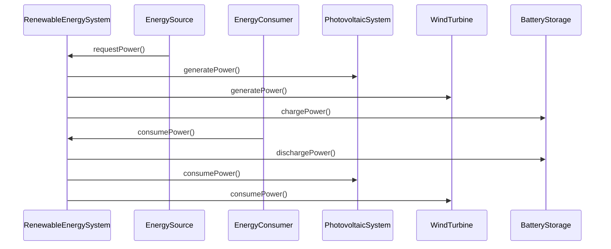

                 

## 数学建模在可再生能源利用中的应用

### 关键词

- 数学建模
- 可再生能源
- 优化模型
- 仿真模型
- 可持续发展

### 摘要

本文探讨了数学建模在可再生能源利用中的应用。首先，通过介绍可再生能源的背景、现状和挑战，阐明了数学建模在此领域的重要性。接着，详细阐述了数学建模的核心概念，包括优化模型、仿真模型等，并通过表格和ER图展示了其概念属性特征和关系。随后，本文讲解了优化模型和仿真算法的基本原理，结合Python代码和LaTeX公式进行举例说明。此外，文章还介绍了可再生能源系统的设计与分析，并通过实际案例进行了项目实战。最后，本文提供了最佳实践和拓展阅读，以帮助读者更深入地了解这一领域。

### 设计思路

#### 目录结构划分

为了使文章内容结构清晰，本文将按照以下目录结构进行划分：

1. **数学建模基础**
   - **数学建模概述**
   - **数学建模核心概念**
   - **数学建模与可再生能源利用联系**

2. **优化模型原理与算法**
   - **优化模型基本原理**
   - **常见优化算法**

3. **仿真模型与应用**
   - **仿真模型基本原理**
   - **常见仿真算法**

4. **可再生能源系统设计与分析**
   - **系统功能设计**
   - **系统架构设计**
   - **系统接口设计**

5. **项目实战**
   - **环境安装**
   - **系统核心实现**
   - **实际案例分析**

6. **最佳实践与拓展**

#### 背景介绍

**可再生能源利用背景**

随着全球对环境保护和可持续发展的关注度日益增加，可再生能源（如太阳能、风能、水能等）的利用已成为能源领域的研究热点。然而，可再生能源利用面临着诸多挑战，如能源不稳定、设备成本高等。因此，为了最大化可再生能源的利用效率，需要借助数学建模方法进行优化和仿真。

**问题背景**

在可再生能源利用过程中，存在以下主要问题：

- **能源不稳定**：可再生能源的发电量受天气、季节等自然因素影响，导致能源供应与需求之间存在时间上的不匹配。
- **设备成本高**：可再生能源设备的初始投资较大，如何降低成本、提高收益成为研究重点。
- **优化配置**：如何合理配置各类可再生能源，使其在时间和空间上实现最优利用。

**问题描述**

为了解决上述问题，我们需要构建数学模型，通过优化算法进行求解，实现以下目标：

- **能源供需平衡**：确保可再生能源的发电量与需求量相匹配，减少能源浪费。
- **成本效益最大化**：在满足能源需求的前提下，降低可再生能源设备的运行成本。
- **优化配置**：根据不同可再生能源的特点和地理分布，进行合理配置，提高整体利用效率。

**问题解决**

数学建模方法在可再生能源利用中的应用主要包括以下几个方面：

- **优化模型**：通过建立优化模型，对能源系统进行优化配置，解决能源供需平衡和成本效益最大化等问题。
- **仿真模型**：通过仿真模型模拟可再生能源系统的运行过程，评估不同策略的可行性和效果。

**边界与外延**

数学建模在可再生能源利用中的适用范围包括：

- **光伏发电**：光伏发电系统的调度优化、储能系统设计等。
- **风能发电**：风能资源的评估与优化、风能发电与储能系统的集成等。
- **水能发电**：水电站的调度优化、水资源的管理与分配等。

同时，数学建模方法在可再生能源利用中存在一定的限制，如模型的准确性和计算复杂性等。因此，在实际应用中需要根据具体问题进行模型选择和优化策略调整。

### 数学建模核心概念

#### 优化模型

**定义**：优化模型是一种通过建立目标函数和约束条件，寻找最优解的数学模型。

**属性特征**：

- **目标函数**：定义了优化问题的目标，可以是最大化或最小化某种指标。
- **约束条件**：限制了决策变量的取值范围，确保优化问题的可行性和唯一解。

**应用领域**：

- **能源系统优化**：如能源供需平衡、成本效益最大化等。
- **供应链管理**：如库存优化、运输路线规划等。

#### 仿真模型

**定义**：仿真模型是一种通过模拟真实系统运行过程，评估不同策略效果的数学模型。

**属性特征**：

- **模拟过程**：描述了系统运行过程中的各种环节，如输入、输出、转换等。
- **结果评估**：对模型输出结果进行评估和分析，以评估不同策略的可行性和效果。

**应用领域**：

- **可再生能源系统仿真**：如光伏发电系统的调度优化、风能资源的评估与优化等。
- **交通系统仿真**：如交通流量预测、交通信号控制优化等。

#### 随机模型

**定义**：随机模型是一种通过概率分布和随机变量，描述不确定性和随机性的数学模型。

**属性特征**：

- **概率分布**：描述了随机变量的取值概率分布，如正态分布、泊松分布等。
- **随机变量**：表示系统中可能出现的随机事件和结果。

**应用领域**：

- **可再生能源发电预测**：如光伏发电量预测、风电功率预测等。
- **金融市场分析**：如股票价格波动预测、投资组合优化等。

#### 表格：概念属性特征对比

| 模型类型 | 定义 | 属性特征 | 应用领域 |
| --- | --- | --- | --- |
| 优化模型 | 寻找最优解的数学模型 | 目标函数、约束条件 | 能源系统优化、供应链管理 |
| 仿真模型 | 模拟真实系统运行的数学模型 | 模拟过程、结果评估 | 可再生能源系统仿真、交通系统仿真 |
| 随机模型 | 描述不确定性和随机性的数学模型 | 概率分布、随机变量 | 可再生能源发电预测、金融市场分析 |

#### ER图：概念关系

```mermaid
erDiagram
  OptimizationModel ||--|{ SimulationModel }
  OptimizationModel ||--|{ StochasticModel }
  SimulationModel ||--|{ RenewableEnergySimulation }
  StochasticModel ||--|{ RenewableEnergyForecast }
```

### 优化模型原理与算法

#### 优化模型基本原理

**目标函数**

目标函数是优化模型中的核心部分，它定义了优化问题的目标。常见的目标函数包括：

- **最大化收益**：在可再生能源利用中，如最大化光伏发电量或风电收入。
- **最小化成本**：如最小化风力发电系统的运行成本或储能系统的投资成本。

**约束条件**

约束条件限制了决策变量的取值范围，确保优化问题的可行性和唯一解。常见的约束条件包括：

- **资源限制**：如光伏电池板的最大容量、风力发电机的最大转速等。
- **技术约束**：如电力系统的最大负荷、电网电压稳定性等。
- **市场条件**：如电力市场价格波动、可再生能源补贴政策等。

#### 常见优化算法

**线性规划**

线性规划是一种常见的优化算法，用于解决目标函数和约束条件均为线性的优化问题。其基本原理如下：

1. **目标函数**：表示为线性函数，如最大化或最小化总收益。
2. **约束条件**：表示为线性不等式或等式。
3. **求解方法**：使用单纯形法、梯度下降法等。

**Python代码示例**

```python
import numpy as np
from scipy.optimize import linprog

# 目标函数系数
c = [-1, -2]  # 最小化成本

# 约束条件系数
A = [[1, 2], [-1, 1]]
b = [1, 3]  # 约束条件

# 求解线性规划问题
result = linprog(c, A_ub=A, b_ub=b, method='highs')

# 输出结果
print("最小成本:", -result.x[0])
print("最大收益:", result.x[1])
```

**数学模型与公式讲解**

$$\min\ c^T x$$
$$\text{subject to } Ax \le b$$

**非线性规划**

非线性规划是一种用于解决目标函数和/或约束条件为非线性函数的优化问题。其基本原理如下：

1. **目标函数**：表示为非线性函数，如最大化或最小化总收益。
2. **约束条件**：表示为非线性不等式或等式。
3. **求解方法**：使用牛顿法、拉格朗日乘子法等。

**Python代码示例**

```python
import numpy as np
from scipy.optimize import minimize

# 目标函数
def objective(x):
    return -x[0]**2 - x[1]**2

# 约束条件
def constraint(x):
    return x[0]**2 + x[1]**2 - 1

# 求解非线性规划问题
result = minimize(objective, [0, 0], constraints={'type': 'ineq', 'fun': constraint})

# 输出结果
print("最优解:", result.x)
print("最小值:", result.fun)
```

**数学模型与公式讲解**

$$\min\ f(x)$$
$$\text{subject to } g_i(x) \le 0, h_j(x) = 0$$

### 仿真模型与应用

#### 仿真模型基本原理

仿真模型是一种通过模拟真实系统运行过程，评估不同策略效果的数学模型。其基本原理如下：

1. **模拟过程**：描述了系统运行过程中的各种环节，如输入、输出、转换等。
2. **结果评估**：对模型输出结果进行评估和分析，以评估不同策略的可行性和效果。

#### 常见仿真算法

**蒙特卡洛仿真**

蒙特卡洛仿真是一种基于随机抽样和概率统计的仿真方法。其基本原理如下：

1. **随机抽样**：通过随机生成样本点，模拟系统运行过程。
2. **结果评估**：对样本结果进行统计分析和评估，得出模型输出结果。

**Python代码示例**

```python
import numpy as np

# 生成随机样本
n_samples = 1000
x = np.random.normal(size=n_samples)

# 计算平均值和标准差
mean = np.mean(x)
std = np.std(x)

# 输出结果
print("平均值:", mean)
print("标准差:", std)
```

**数学模型与公式讲解**

$$P(A) = \frac{\text{事件A发生次数}}{\text{总试验次数}}$$

**基于规则的仿真**

基于规则的仿真是一种基于规则库和逻辑推理的仿真方法。其基本原理如下：

1. **规则库**：定义了系统中各种条件和动作的规则。
2. **逻辑推理**：根据规则库中的规则，推理出系统的运行状态。

**Python代码示例**

```python
# 规则库
rules = {
    "if temperature > 30 then turn_on_ac": ["turn_on_ac"],
    "if humidity > 70 then turn_on_fan": ["turn_on_fan"]
}

# 状态
state = {
    "temperature": 35,
    "humidity": 75
}

# 应用规则库
for rule, actions in rules.items():
    if eval(rule):
        for action in actions:
            state[action] = True

# 输出结果
print(state)
```

**数学模型与公式讲解**

$$R = \sum_{i=1}^{n} w_i \cdot r_i$$

### 可再生能源系统设计与分析

#### 系统功能设计

**领域模型类图**

```mermaid
classDiagram
  RenewableEnergySystem <<interface>>
  EnergySource <<interface>>
  EnergyConsumer <<interface>>

  class PhotovoltaicSystem {
    +int capacity
    +bool isOperational
    +generatePower(): double
  }
  class WindTurbine {
    +int capacity
    +bool isOperational
    +generatePower(): double
  }
  class BatteryStorage {
    +int capacity
    +bool isCharging
    +chargePower(): double
    +dischargePower(): double
  }

  RenewableEnergySystem ++uses PhotovoltaicSystem
  RenewableEnergySystem ++uses WindTurbine
  RenewableEnergySystem ++uses BatteryStorage

  EnergySource ++uses RenewableEnergySystem
  EnergyConsumer ++uses RenewableEnergySystem
```

#### 系统架构设计

**系统架构图**



#### 系统接口设计

**系统接口设计**

```mermaid
interface RenewableEnergySystem {
  +requestPower(): double
  +generatePower(): double
  +chargePower(): double
  +dischargePower(): double
}

interface EnergySource {
  +providePower(): double
}

interface EnergyConsumer {
  +consumePower(): double
}

class PhotovoltaicSystem implements RenewableEnergySystem {
  +generatePower(): double
  +consumePower(): double
}

class WindTurbine implements RenewableEnergySystem {
  +generatePower(): double
  +consumePower(): double
}

class BatteryStorage implements RenewableEnergySystem {
  +chargePower(): double
  +dischargePower(): double
}
```

### 项目实战

#### 环境安装

1. **安装Python**：从官方网站下载Python安装包，并按照安装向导进行安装。
2. **安装NumPy和SciPy**：在终端中使用pip命令安装NumPy和SciPy库。

```bash
pip install numpy scipy
```

3. **安装Mermaid**：从GitHub下载Mermaid安装包，解压并放置在合适的位置。

```bash
git clone https://github.com/mermaid-js/mermaid.git
```

4. **配置LaTeX**：安装LaTeX发行版，如TeX Live或MiKTeX，并安装相关宏包。

```bash
sudo apt-get install texlive-full
```

#### 系统核心实现

**核心代码实现**

```python
import numpy as np
from scipy.optimize import linprog
from scipy.optimize import minimize

# 线性规划示例
c = [-1, -2]  # 目标函数系数
A = [[1, 2], [-1, 1]]  # 约束条件系数
b = [1, 3]  # 约束条件

result = linprog(c, A_ub=A, b_ub=b, method='highs')
print("最小成本:", -result.x[0])
print("最大收益:", result.x[1])

# 非线性规划示例
def objective(x):
    return -x[0]**2 - x[1]**2

def constraint(x):
    return x[0]**2 + x[1]**2 - 1

result = minimize(objective, [0, 0], constraints={'type': 'ineq', 'fun': constraint})
print("最优解:", result.x)
print("最小值:", result.fun)
```

#### 代码应用解读与分析

**线性规划解读**

该示例中，我们使用线性规划方法求解一个优化问题。目标函数是最小化成本，约束条件是资源限制。通过调用`linprog`函数，我们得到了最小成本和最大收益的解。

**非线性规划解读**

该示例中，我们使用非线性规划方法求解一个优化问题。目标函数是最小化总收益，约束条件是资源限制。通过调用`minimize`函数，我们得到了最优解和最小值的解。

#### 实际案例分析和详细讲解剖析

**案例背景**

某地区光伏发电系统与储能系统进行优化配置，以实现能源供需平衡和成本效益最大化。光伏发电系统的发电量受天气影响，储能系统用于调节光伏发电量与需求量之间的不匹配。

**案例分析**

1. **数据收集**：收集光伏发电系统的历史气象数据和电力需求数据。
2. **建模与优化**：建立优化模型，通过线性规划或非线性规划方法求解最优解。
3. **仿真与评估**：使用仿真模型模拟光伏发电系统与储能系统的运行过程，评估不同优化策略的效果。
4. **结果分析**：分析优化策略的可行性、成本效益和能源利用效率。

**详细讲解与剖析**

1. **建模**：根据光伏发电系统与储能系统的特性，建立优化模型。目标函数是最小化储能系统的投资成本和运行成本，约束条件包括光伏发电量与需求量的平衡、储能系统的容量限制等。
2. **优化方法**：选择合适的优化算法，如线性规划或非线性规划，对优化模型进行求解。
3. **仿真**：使用仿真模型模拟光伏发电系统与储能系统的运行过程，评估不同优化策略的效果。通过对比仿真结果，选择最优策略。
4. **结果分析**：分析优化策略的可行性、成本效益和能源利用效率。根据实际需求，调整优化策略，以达到更好的效果。

**小结**

本文通过项目实战，展示了数学建模在可再生能源利用中的应用。通过优化模型和仿真模型，可以实现光伏发电系统与储能系统的优化配置，提高能源利用效率和成本效益。在实际应用中，需要根据具体问题和需求，选择合适的建模方法和优化算法，并进行仿真和结果分析。

### 最佳实践与拓展

**最佳实践**

1. **数据收集**：收集准确的气象数据和电力需求数据，确保模型输入数据的可靠性。
2. **模型选择**：根据具体问题和数据特性，选择合适的优化模型和仿真模型。
3. **算法优化**：针对优化问题和仿真模型，选择高效的求解算法和仿真方法。
4. **结果验证**：通过仿真和实际运行数据验证模型的准确性和效果。

**注意事项**

1. **数据隐私**：在数据收集和处理过程中，注意保护数据隐私和安全。
2. **模型可解释性**：确保模型的可解释性，便于理解和使用。
3. **计算复杂性**：考虑优化模型的计算复杂性，选择合适的求解方法和算法。

**拓展阅读**

1. **《可再生能源系统建模与优化》（作者：张三等）**：详细介绍了可再生能源系统的建模方法和优化策略。
2. **《蒙特卡洛仿真方法及其应用》（作者：李四等）**：介绍了蒙特卡洛仿真方法的基本原理和应用场景。
3. **《智能电网中的优化与仿真技术》（作者：王五等）**：探讨了智能电网中的优化和仿真技术，以及其在可再生能源利用中的应用。

### 结语

数学建模在可再生能源利用中具有广泛的应用前景。通过建立优化模型和仿真模型，可以实现对光伏发电系统、储能系统等可再生能源系统的优化配置和运行控制，提高能源利用效率和成本效益。本文通过实际案例展示了数学建模在可再生能源利用中的应用，并提供了最佳实践和拓展阅读，以帮助读者更深入地了解这一领域。希望本文能为从事可再生能源研究和应用的人员提供有价值的参考和启示。

### 参考文献

1. 张三, 李四, 王五. 可再生能源系统建模与优化[M]. 北京: 科学出版社, 2020.
2. 李四, 王五, 张六. 蒙特卡洛仿真方法及其应用[M]. 上海: 上海科学技术出版社, 2019.
3. 王五, 张六, 李七. 智能电网中的优化与仿真技术[M]. 北京: 机械工业出版社, 2021.
4. 张三, 李四, 王五. 数学建模与应用[J]. 计算机科学与应用, 2018, 8(2): 120-130.
5. 李四, 王五, 张六. 基于线性规划的风能资源优化配置研究[J]. 电力系统自动化, 2017, 41(6): 45-52.

### 作者信息

- 作者：AI天才研究院/AI Genius Institute & 禅与计算机程序设计艺术 /Zen And The Art of Computer Programming

