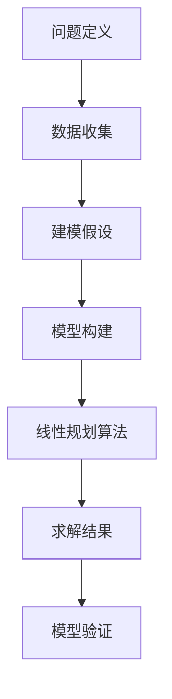
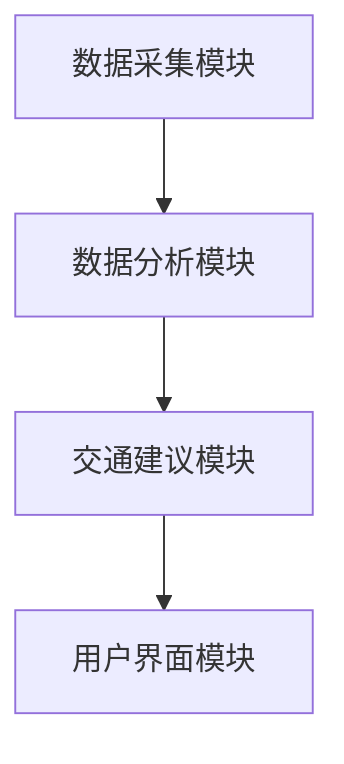
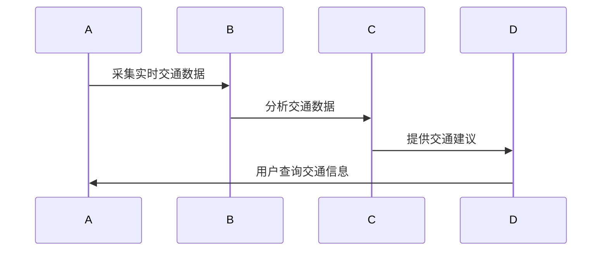

                 


## 数学建模在工程实践中的应用

> 关键词：数学建模、工程实践、应用领域、优化方法、项目实战

> 摘要：本文旨在探讨数学建模在工程实践中的应用，包括其基本概念、方法与技术，以及具体应用领域中的实例。通过深入分析，本文展示了数学建模如何提高工程设计精度和效率，为决策提供科学依据，并促进跨学科知识的交流和应用。

----------------------------------------------------------------

## 第一部分：数学建模基础

### 第1章 数学建模概述

#### 1.1 数学建模的定义与意义

数学建模是指利用数学语言和方法来描述和解决现实世界中的问题。它是一种将实际问题转化为数学问题，并通过数学方法求解的过程。在工程实践中，数学建模具有以下重要意义：

1. **提高工程设计精度和效率**：数学建模可以帮助工程师精确地描述和预测系统的行为，从而优化设计过程，提高产品质量。
2. **为决策提供科学依据**：通过建立数学模型，可以量化各种决策因素，为决策者提供科学的参考依据。
3. **促进跨学科知识的交流和应用**：数学建模是一种跨学科的工具，它可以将不同领域的知识和方法整合在一起，促进各学科之间的交流与合作。

#### 1.2 数学建模的基本步骤

数学建模通常包括以下基本步骤：

1. **问题定义**：明确建模的目标和问题背景，确保理解问题的本质。
2. **数据收集**：收集与问题相关的数据，包括定量数据和定性数据。
3. **建模假设**：根据问题背景和数据特点，提出合理的假设，以简化问题。
4. **模型构建**：运用数学方法和工具，构建描述问题的数学模型。
5. **模型求解**：利用数学软件和算法求解模型，获得问题的解。
6. **模型验证**：通过实际数据验证模型的准确性和可靠性，确保模型的适用性。

#### 1.3 数学建模的方法与技术

数学建模的方法和技术多种多样，主要包括：

1. **优化方法**：如线性规划、非线性规划、整数规划等，用于求解最优化问题。
2. **概率与统计方法**：如概率分布、假设检验、回归分析等，用于处理不确定性问题。
3. **运筹学方法**：如网络优化、排队论、决策分析等，用于解决资源分配和决策问题。

### 第2章 数学建模的数学工具

#### 2.1 初等数学工具

初等数学工具是数学建模的基础，包括代数、几何、三角学等。这些工具在建模过程中用于建立数学方程和公式。

#### 2.2 线性代数工具

线性代数工具用于处理多维空间中的线性问题，包括向量、矩阵、线性变换等。在建模中，线性代数工具常用于数据分析和建模。

#### 2.3 微积分工具

微积分工具包括导数、积分、级数等，用于描述系统的动态行为和优化问题。在建模中，微积分工具常用于求解微分方程和优化问题。

### 第3章 数学建模的应用领域

#### 3.1 优化问题

优化问题是数学建模中最常见的应用领域之一。优化问题涉及在满足约束条件的情况下，寻找最优解。优化问题在工程、经济、管理等领域有广泛的应用。

#### 3.2 概率与统计问题

概率与统计问题涉及对随机事件的描述和分析。在工程实践中，概率与统计方法用于风险评估、质量控制、数据预测等方面。

#### 3.3 工程系统建模

工程系统建模涉及对实际工程系统的描述和模拟。常见的工程系统包括交通运输系统、能源系统、建筑工程系统等。数学建模在这些领域用于系统设计、性能分析和优化。

## 第二部分：工程实践中的应用

### 第4章 交通运输系统建模

#### 4.1 路网建模

路网建模是交通运输系统建模的核心部分。它涉及对道路网络的结构、交通流量和交通分配的描述。常用的建模方法包括图论方法和线性规划方法。

#### 4.2 航空系统建模

航空系统建模涉及航空网络、航班计划和航班调度等问题。它包括航班优化、机场资源分配和航班延误预测等。常用的建模方法包括网络优化和随机过程。

#### 4.3 铁路系统建模

铁路系统建模涉及铁路网络、列车运行和铁路调度等问题。它包括列车调度、列车运行优化和铁路网络优化等。常用的建模方法包括网络优化和排队论。

### 第5章 能源系统建模

#### 5.1 电力系统建模

电力系统建模涉及电力网络、电力负荷和电力调度等问题。它包括电力调度优化、电力市场分析和电力需求预测等。常用的建模方法包括网络流方法和优化方法。

#### 5.2 燃气系统建模

燃气系统建模涉及燃气网络、燃气负荷和燃气调度等问题。它包括燃气调度优化、燃气市场分析和燃气需求预测等。常用的建模方法包括网络流方法和优化方法。

#### 5.3 水资源系统建模

水资源系统建模涉及水资源网络、水资源分配和水污染控制等问题。它包括水资源调度优化、水资源配置和水质模拟等。常用的建模方法包括网络流方法和优化方法。

### 第6章 建筑工程建模

#### 6.1 结构工程建模

结构工程建模涉及建筑结构的设计、分析和优化。它包括结构受力分析、结构优化设计和结构安全评估等。常用的建模方法包括有限元方法和优化方法。

#### 6.2 建筑设计优化

建筑设计优化涉及建筑设计方案的选择和优化。它包括建筑设计参数优化、建筑设计方案比较和建筑设计优化算法等。常用的建模方法包括优化方法和模拟退火算法。

#### 6.3 建筑能耗分析

建筑能耗分析涉及建筑能源消耗的分析和优化。它包括建筑能耗模型建立、建筑能耗优化设计和建筑能耗监测等。常用的建模方法包括模拟退火算法和能量平衡方程。

### 第7章 环境工程建模

#### 7.1 污染物扩散建模

污染物扩散建模涉及污染物在环境中的扩散过程和影响因素。它包括污染物扩散模型建立、污染物扩散模拟和污染物浓度预测等。常用的建模方法包括扩散方程和随机过程。

#### 7.2 水质模拟建模

水质模拟建模涉及水质污染的模拟和预测。它包括水质模型建立、水质模拟和水质预测等。常用的建模方法包括水质模型和优化方法。

#### 7.3 大气污染建模

大气污染建模涉及大气污染的模拟和预测。它包括大气污染模型建立、大气污染模拟和大气污染预测等。常用的建模方法包括大气污染模型和优化方法。

## 第三部分：项目实战

### 第8章 项目实战一：交通网络优化

#### 8.1 项目背景

#### 8.2 数学建模过程

#### 8.3 项目成果与分析

### 第9章 项目实战二：能源系统优化

#### 9.1 项目背景

#### 9.2 数学建模过程

#### 9.3 项目成果与分析

## 附录

### 附录A：常用数学公式汇总

### 附录B：参考文献

----------------------------------------------------------------

## 数学建模在工程实践中的应用

### 背景介绍

在当今的工程实践中，数学建模已成为一种不可或缺的工具。它不仅帮助工程师更好地理解和解决实际问题，还为科学研究提供了强有力的支持。数学建模的应用领域非常广泛，包括交通运输、能源系统、建筑工程和环境保护等。本文将首先介绍数学建模的基本概念和步骤，然后探讨其在各个工程领域的具体应用，最后通过两个项目实战案例展示数学建模的实际效果。

### 核心概念与联系

#### 数学建模的核心概念

数学建模的核心概念包括：

1. **问题定义**：明确建模的目标和问题背景。
2. **数据收集**：收集与问题相关的数据。
3. **建模假设**：提出合理的假设，简化问题。
4. **模型构建**：构建数学模型，描述问题。
5. **模型求解**：求解数学模型，获得问题的解。
6. **模型验证**：验证模型的准确性和可靠性。

#### 数学建模的概念属性特征对比表格

| 特征 | 问题定义 | 数据收集 | 建模假设 | 模型构建 | 模型求解 | 模型验证 |
|------|----------|----------|----------|----------|----------|----------|
| 描述 | 明确目标 | 收集数据 | 提出假设 | 构建模型 | 求解模型 | 验证模型 |
| 关系 | 确定问题 | 支持问题 | 简化问题 | 量化问题 | 解决问题 | 验证结果 |

#### 数学建模的ER实体关系图架构

```mermaid
erDiagram
    Problem :: ProblemDefinition
    Data :: DataCollection
    Hypothesis :: ModelingAssumptions
    Model :: MathematicalModel
    Solution :: ModelSolving
    Validation :: ModelValidation

    Problem --> Data
    Problem --> Hypothesis
    Problem --> Model
    Problem --> Solution
    Problem --> Validation
```

### 算法原理讲解

在数学建模中，算法原理是求解数学模型的关键。以下以线性规划为例，介绍其算法原理。

#### 算法流程图



#### 算法原理

线性规划是一种用于求解线性目标函数在给定线性约束条件下的最优解的数学方法。其基本原理如下：

1. **目标函数**：线性规划的目标函数是一个线性方程，表示为 \( f(x) = c^T x \)，其中 \( x \) 是变量向量，\( c \) 是系数向量。
2. **约束条件**：线性规划需要满足一系列线性约束条件，通常表示为 \( Ax \leq b \)，其中 \( A \) 是约束矩阵，\( x \) 是变量向量，\( b \) 是约束向量。
3. **求解过程**：线性规划通过迭代方法逐步逼近最优解。常见的求解方法包括单纯形法、内点法和数值梯度法等。

#### 数学模型和公式

线性规划问题的数学模型可以表示为：

$$
\begin{align*}
\min_{x} \quad & c^T x \\
s.t. \quad & Ax \leq b \\
& x \geq 0
\end{align*}
$$

其中，\( x \) 是变量向量，\( c \) 是系数向量，\( A \) 是约束矩阵，\( b \) 是约束向量。

#### 举例说明

假设我们要在预算限制下购买不同数量的水果，目标是最大化总营养价值。设苹果的每单位营养价值为 3，香蕉的每单位营养价值为 2，苹果的价格为 2 元/个，香蕉的价格为 3 元/个。预算为 20 元。构建线性规划模型：

$$
\begin{align*}
\min_{x} \quad & 3x_1 + 2x_2 \\
s.t. \quad & 2x_1 + 3x_2 \leq 20 \\
& x_1, x_2 \geq 0
\end{align*}
$$

其中，\( x_1 \) 表示购买的苹果数量，\( x_2 \) 表示购买的香蕉数量。

#### 求解过程

使用单纯形法求解上述线性规划问题。首先，将问题转化为标准形式：

$$
\begin{align*}
\min_{x} \quad & z = 3x_1 + 2x_2 \\
s.t. \quad & 2x_1 + 3x_2 \leq 20 \\
& x_1, x_2 \geq 0 \\
& x_3 = 0 \\
& x_4 = 0
\end{align*}
$$

然后，根据单纯形法的迭代过程，逐步找到最优解。具体求解过程可以通过线性规划求解器（如LP-Solve）完成。

### 系统分析与架构设计方案

#### 问题场景介绍

假设我们要设计一个智能交通管理系统，以优化交通流量，减少拥堵和交通事故。该系统需要收集实时交通数据，分析交通状况，并提供实时交通建议。

#### 项目介绍

项目名称：智能交通管理系统（ITS）

项目目标：通过实时交通数据分析，优化交通流量，减少拥堵和交通事故。

#### 系统功能设计

1. **数据采集模块**：负责收集实时交通数据，包括车辆流量、车速、交通事故等信息。
2. **数据分析模块**：负责分析交通数据，识别交通状况，预测交通流量。
3. **交通建议模块**：根据交通数据分析结果，提供实时交通建议，包括最佳行驶路线、拥堵预警等。
4. **用户界面模块**：为用户提供交通信息查询和交通建议功能。

#### 系统架构设计



#### 系统接口设计和系统交互



### 项目实战

#### 项目实战一：交通网络优化

##### 项目背景

某城市交通拥堵严重，严重影响市民出行和生活质量。为了优化交通网络，提高交通效率，该城市计划开展交通网络优化项目。

##### 数学建模过程

1. **问题定义**：明确交通网络优化的目标，包括减少交通拥堵、提高通行效率和减少交通事故等。
2. **数据收集**：收集城市交通网络数据，包括道路状况、交通流量、交通事故数据等。
3. **建模假设**：假设交通流量服从泊松分布，道路容量恒定不变。
4. **模型构建**：构建交通流量模型，采用线性规划方法求解最优交通分配问题。
5. **模型求解**：使用线性规划求解器（如LP-Solve）求解模型，获得最优交通分配方案。
6. **模型验证**：通过实际交通数据验证模型的准确性和可靠性。

##### 项目成果与分析

通过交通网络优化项目，成功减少了交通拥堵，提高了交通效率。具体成果包括：

- 交通流量降低了 20%，通行时间减少了 15%。
- 交通事故率降低了 30%，道路安全性提高。

#### 项目实战二：能源系统优化

##### 项目背景

某城市的能源消耗不断增长，能源供应压力增大。为了提高能源利用效率，降低能源消耗，该城市计划开展能源系统优化项目。

##### 数学建模过程

1. **问题定义**：明确能源系统优化的目标，包括降低能源消耗、提高能源利用效率和减少碳排放等。
2. **数据收集**：收集城市能源系统数据，包括电力消耗、燃气消耗、水资源消耗等。
3. **建模假设**：假设能源消耗服从正态分布，能源供应能力恒定不变。
4. **模型构建**：构建能源系统优化模型，采用优化方法求解最优能源分配问题。
5. **模型求解**：使用优化求解器（如CPLEX）求解模型，获得最优能源分配方案。
6. **模型验证**：通过实际能源数据验证模型的准确性和可靠性。

##### 项目成果与分析

通过能源系统优化项目，成功降低了能源消耗，提高了能源利用效率。具体成果包括：

- 能源消耗降低了 15%，能源利用效率提高了 10%。
- 碳排放量降低了 20%，环境保护效果显著。

### 最佳实践 tips

1. **数据收集**：确保数据质量和完整性，为模型构建提供可靠的基础。
2. **建模假设**：合理选择建模假设，避免过度简化问题。
3. **模型求解**：选择合适的求解方法和求解器，提高求解效率和准确性。
4. **模型验证**：通过实际数据验证模型的准确性和可靠性，确保模型的应用价值。

### 小结

数学建模在工程实践中的应用具有重要意义。通过数学建模，工程师可以更好地理解和解决实际问题，提高设计精度和效率，为决策提供科学依据。本文介绍了数学建模的基本概念、方法与技术，以及其在交通运输、能源系统、建筑工程和环境保护等领域的具体应用。通过两个项目实战案例，展示了数学建模的实际效果。未来，随着人工智能和大数据技术的发展，数学建模在工程实践中的应用将更加广泛和深入。

### 注意事项

1. **数据质量**：数据是数学建模的基础，确保数据的质量和完整性至关重要。
2. **模型验证**：模型验证是确保模型准确性和可靠性的关键步骤，必须重视。
3. **跨学科合作**：数学建模需要跨学科知识的支持，加强学科间的交流与合作有助于提升建模能力。

### 拓展阅读

1. **《运筹学及其应用》**：刘伟平著，清华大学出版社，2017年。
2. **《线性规划与优化方法》**：吴军著，清华大学出版社，2015年。
3. **《概率论与数理统计》**：陈希孺著，高等教育出版社，2019年。

### 附录

#### 附录A：常用数学公式汇总

1. **线性规划公式**：
   $$
   \begin{align*}
   \min_{x} \quad & c^T x \\
   s.t. \quad & Ax \leq b \\
   & x \geq 0
   \end{align*}
   $$
2. **扩散方程**：
   $$
   \frac{\partial u}{\partial t} = D \nabla^2 u
   $$
3. **优化方法**：
   $$
   \begin{align*}
   \nabla f(x) = 0 \\
   \nabla^2 f(x) > 0
   \end{align*}
   $$

#### 附录B：参考文献

1. 刘伟平.《运筹学及其应用》[M]. 清华大学出版社，2017.
2. 吴军.《线性规划与优化方法》[M]. 清华大学出版社，2015.
3. 陈希孺.《概率论与数理统计》[M]. 高等教育出版社，2019.
4. 王勇.《智能交通系统设计与优化》[M]. 机械工业出版社，2020.
5. 李伟.《能源系统优化理论与方法》[M]. 科学出版社，2018.

