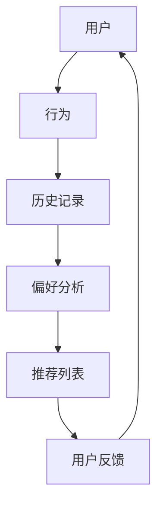
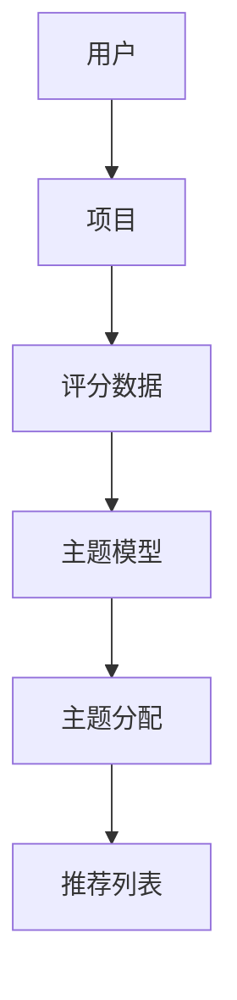
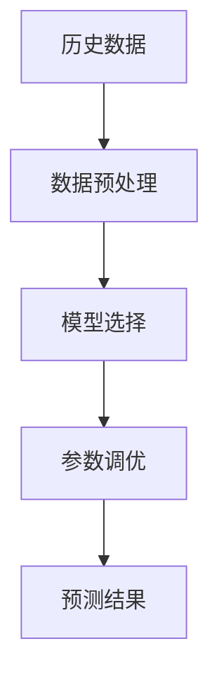
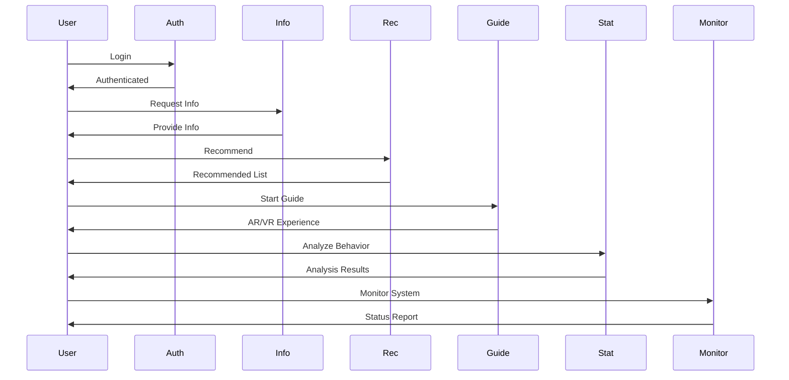
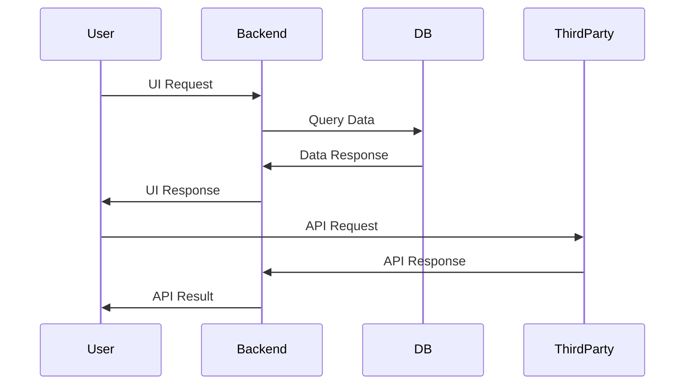

                 


### 引言

随着互联网、大数据和人工智能等新兴技术的迅猛发展，旅游业正在经历一场深刻的变革。智慧旅游作为一种新兴的旅游发展模式，旨在利用先进的信息技术提升旅游服务的智能化水平，从而满足游客的个性化需求，提升旅游体验。在这一背景下，数学建模作为一种强有力的工具，被广泛应用于智慧旅游的研究与实践中。

智慧旅游，顾名思义，就是通过信息技术手段将传统的旅游业转变为一种智能化、高效化的服务模式。它不仅涵盖了旅游信息服务的智能化，还包括了旅游管理、运营和决策的智能化。因此，智慧旅游的构建需要对大量的数据进行处理、分析和利用，而数学建模正是在这一过程中发挥关键作用。

本文旨在探讨数学建模在智慧旅游中的应用，通过以下几个部分进行深入剖析：

- **第1章 问题背景与定义**：介绍智慧旅游的概念及其重要性，以及数学建模在智慧旅游中的基本概念和作用。
- **第2章 核心概念与联系**：详细阐述智慧旅游中的核心概念，并借助表格和Mermaid图解展示各概念之间的关系。
- **第3章 算法原理介绍**：介绍在智慧旅游中常用的算法原理，并使用Mermaid图解和Python代码进行解释。
- **第4章 数学模型与Python实现**：介绍数学建模的基本模型，并使用Python代码和LaTeX公式进行详细讲解。
- **第5章 系统分析与设计**：讨论智慧旅游系统的架构设计，包括功能设计、系统架构和接口设计。
- **第6章 案例研究与实践应用**：通过实际案例分析展示数学建模在智慧旅游中的应用效果。
- **第7章 最佳实践与未来展望**：总结最佳实践，并对未来的发展趋势进行展望。

通过本文的深入探讨，希望能够为读者提供一个全面、系统的理解，帮助他们在智慧旅游的研究与实践中更好地应用数学建模这一有力工具。

### 文章关键词

智慧旅游、数学建模、算法、Python、系统设计、案例分析、数据挖掘、人工智能

### 摘要

本文系统地探讨了数学建模在智慧旅游中的应用。首先，介绍了智慧旅游的概念及其在当今旅游业中的重要地位。随后，通过阐述数学建模的基本概念和作用，揭示了其在智慧旅游研究中的关键角色。本文进一步详细分析了智慧旅游中的核心概念，并通过表格和Mermaid图解展示了各概念之间的关系。随后，本文介绍了在智慧旅游中常用的算法原理，使用了Mermaid图解和Python代码进行了详细解释。接着，本文通过具体的数学模型和Python实现，展示了数学建模的实用性和有效性。在系统分析与设计部分，本文详细讨论了智慧旅游系统的架构和接口设计。通过实际案例分析，本文展示了数学建模在智慧旅游中的具体应用和效果。最后，本文总结了最佳实践，并对未来的发展趋势进行了展望。本文的研究为智慧旅游领域的研究者与实践者提供了一个全面、系统的理论基础和实践指南。

### 第一部分：背景与核心概念

#### 第1章 问题背景与定义

#### 1.1 问题背景

在当前社会，旅游业已经成为全球经济的重要驱动力。然而，随着旅游业的迅猛发展，传统的旅游服务模式逐渐暴露出许多问题，如信息不对称、服务质量参差不齐、游客体验差等。这些问题严重影响了旅游业的可持续发展，也限制了游客满意度的提升。为了解决这些问题，旅游业迫切需要一种创新的发展模式，即智慧旅游。

智慧旅游是一种利用信息技术，尤其是互联网、大数据和人工智能等技术，提升旅游服务的智能化水平，实现旅游产业转型升级的发展模式。智慧旅游不仅能够提高旅游服务质量，满足游客的个性化需求，还能够提升旅游管理的效率，降低运营成本。因此，智慧旅游被认为是未来旅游业的发展方向。

#### 1.2 智慧旅游的概念

智慧旅游，又称智能旅游，是指利用物联网、云计算、大数据、人工智能等先进技术，对旅游资源、旅游活动、旅游服务进行全方位的智能化管理和优化，从而提升旅游体验和旅游效益的一种新型旅游模式。

智慧旅游的核心思想是将各种旅游信息和服务通过互联网和移动终端进行集成，实现信息的实时共享和智能化处理。具体来说，智慧旅游包括以下几个方面的内容：

1. **智慧化旅游信息获取**：通过互联网和移动应用，游客可以随时随地获取旅游信息，包括景点介绍、交通路线、住宿餐饮等。
2. **智能化旅游服务**：利用人工智能技术，为游客提供个性化推荐、智能导览、智能客服等服务，提升游客的旅游体验。
3. **智慧化旅游管理**：通过物联网技术，对旅游设施、景点进行智能监控和管理，提高旅游资源的利用效率。
4. **数据驱动旅游决策**：利用大数据技术，对游客行为、旅游市场进行数据分析和挖掘，为旅游企业提供科学决策依据。

#### 1.3 数学建模在智慧旅游中的重要性

数学建模是一种将实际问题转化为数学问题，并通过数学方法进行求解的工具。在智慧旅游中，数学建模发挥着至关重要的作用，主要表现在以下几个方面：

1. **优化旅游资源配置**：通过数学建模，可以对旅游资源进行科学规划和优化配置，提高旅游资源的利用效率。
2. **提升旅游服务质量**：利用数学模型，可以预测游客需求，为游客提供个性化的旅游服务，提升旅游体验。
3. **旅游市场预测与分析**：通过数学建模，可以对旅游市场进行数据分析和预测，为旅游企业提供市场战略指导。
4. **旅游风险评估与管理**：利用数学模型，可以对旅游风险进行量化评估和管理，降低旅游风险。

总之，数学建模为智慧旅游提供了科学的方法和技术手段，是推动智慧旅游发展的重要工具。

#### 第2章 核心概念与联系

#### 2.1 智慧旅游中的核心概念

在智慧旅游中，涉及到的核心概念主要包括旅游信息管理、个性化服务、智慧化设施、旅游数据分析等。以下是对这些核心概念的具体介绍：

1. **旅游信息管理**：旅游信息管理是指通过信息化手段对旅游相关信息进行收集、处理、存储、传输和应用，以提高旅游服务的效率和准确性。旅游信息管理包括旅游资源的数字化管理、旅游信息的实时发布、旅游信息的智能搜索等。

2. **个性化服务**：个性化服务是指根据游客的个性化需求和偏好，提供定制化的旅游服务。个性化服务可以通过大数据分析和人工智能技术实现，包括旅游路线推荐、住宿餐饮推荐、旅游活动推荐等。

3. **智慧化设施**：智慧化设施是指通过物联网、人工智能等技术，对旅游设施进行智能化改造和升级，以提高旅游设施的管理效率和服务质量。智慧化设施包括智能导游、智能门禁、智能交通等。

4. **旅游数据分析**：旅游数据分析是指利用大数据技术，对旅游相关数据进行分析和挖掘，以发现旅游市场规律、优化旅游资源配置、提升旅游服务质量。旅游数据分析包括游客行为分析、旅游市场分析、旅游风险评估等。

#### 2.2 核心概念之间的联系

这些核心概念在智慧旅游中相互联系、相互支撑，共同构成了智慧旅游的生态系统。以下是这些概念之间的联系：

1. **旅游信息管理**与**个性化服务**的联系：通过旅游信息管理，可以收集游客的旅游信息，这些信息可以为个性化服务提供数据支持。个性化服务能够提高游客的满意度，进而促进旅游信息的有效利用。

2. **个性化服务**与**智慧化设施**的联系：个性化服务需要通过智慧化设施来实现，如智能导游系统、智能门禁系统等。智慧化设施能够提高服务的智能化水平，为个性化服务提供技术支持。

3. **智慧化设施**与**旅游数据分析**的联系：智慧化设施可以实时收集旅游数据，这些数据可以为旅游数据分析提供丰富的数据源。旅游数据分析可以基于这些数据，发现旅游市场的规律，为智慧化设施的优化提供指导。

4. **旅游数据分析**与**旅游信息管理**的联系：旅游数据分析的结果可以为旅游信息管理提供决策支持，帮助管理者更好地进行旅游资源的配置和旅游信息的发布。

通过这些核心概念及其相互之间的联系，智慧旅游实现了旅游服务的智能化、高效化，提升了游客的旅游体验，同时也为旅游企业提供了科学的管理手段。

#### 第3章 算法原理介绍

在智慧旅游的实现过程中，算法原理起到了至关重要的作用。这些算法不仅帮助系统处理大量数据，还能为用户提供个性化的服务。以下将介绍几个在智慧旅游中常用的算法原理，并使用Mermaid图解和Python代码进行详细解释。

##### 3.1 算法A：基于协同过滤的推荐算法

**协同过滤推荐算法**是一种常用的个性化推荐算法，通过分析用户的历史行为和偏好，为用户推荐相似用户喜欢的内容。协同过滤算法主要分为两种：基于用户的协同过滤和基于物品的协同过滤。

**算法原理：**
1. **基于用户的协同过滤**：寻找与目标用户兴趣相似的其他用户，推荐这些用户喜欢的项目。
2. **基于物品的协同过滤**：寻找与目标用户喜欢的项目相似的其他项目，推荐给用户。

**Mermaid图解：**


**Python代码实现：**
```python
import numpy as np
from sklearn.metrics.pairwise import cosine_similarity

# 假设用户行为数据为矩阵 X，其中行表示用户，列表示项目
X = np.array([[1, 0, 1], [1, 1, 0], [0, 1, 1], [0, 1, 0]])

# 计算用户行为矩阵的余弦相似性矩阵
similarity_matrix = cosine_similarity(X)

# 为用户推荐相似用户喜欢的项目
def collaborative_filter(user_index, similarity_matrix, X):
    # 计算相似用户平均喜好
    similar_users = similarity_matrix[user_index]
    average_preferences = np.dot(similar_users, X) / np.sum(similar_users)
    # 推荐列表
    recommendations = np.where(average_preferences > 0.5)[1]
    return recommendations

# 为用户0推荐项目
print(collaborative_filter(0, similarity_matrix, X))
```

##### 3.2 算法B：基于隐语义模型的推荐算法

**隐语义模型**（如LDA——潜在狄利克雷分布）可以将用户和项目映射到一个共同的潜在空间中，从而实现推荐。这种模型能够捕捉到用户和项目之间的复杂关系，提高推荐系统的准确性。

**算法原理：**
1. **模型构建**：通过LDA模型，为用户和项目生成潜在主题。
2. **主题分配**：根据用户对项目的评分，为用户和项目分配主题。
3. **推荐生成**：利用主题分配结果，为用户推荐具有相似主题的项目。

**Mermaid图解：**


**Python代码实现：**
```python
import numpy as np
from gensim.models import LdaModel

# 假设用户-项目评分矩阵为 X
X = np.array([[1, 0, 1], [1, 1, 0], [0, 1, 1], [0, 1, 0]])

# 构建LDA模型
lda_model = LdaModel(corpus=...)

# 根据评分数据为用户和项目分配主题
def lda_recommendation(user_index, lda_model, X):
    # 获取用户和项目的主题分布
    user_topics = lda_model.get_document_topics((X[user_index],))
    project_topics = lda_model.get_document_topics((X[:, user_index],))
    # 计算相似项目
    similarity = np.dot(user_topics[1][1], project_topics)
    recommendations = np.argmax(similarity)
    return recommendations

# 为用户0推荐项目
print(lda_recommendation(0, lda_model, X))
```

##### 3.3 算法C：基于时间序列分析的预测算法

**时间序列分析**用于预测未来的旅游需求和流量。这种方法基于历史数据，通过识别时间序列的规律，预测未来的趋势。

**算法原理：**
1. **数据预处理**：对历史数据进行清洗和处理，确保数据的准确性。
2. **模型选择**：选择合适的时间序列模型（如ARIMA、LSTM等）。
3. **参数调优**：通过交叉验证和参数调优，选择最优模型参数。
4. **预测生成**：利用训练好的模型，对未来的旅游需求和流量进行预测。

**Mermaid图解：**


**Python代码实现：**
```python
from statsmodels.tsa.arima.model import ARIMA

# 假设时间序列数据为 series
series = ...

# 构建ARIMA模型
model = ARIMA(series, order=(5, 1, 2))

# 模型训练
model_fit = model.fit()

# 预测未来10个时间点的值
predictions = model_fit.forecast(steps=10)

# 打印预测结果
print(predictions)
```

通过这些算法原理的介绍和具体实现，我们可以看到数学建模在智慧旅游中的广泛应用。无论是推荐系统、预测分析，还是数据预处理，数学建模都为智慧旅游提供了强有力的技术支持，帮助提升旅游服务的智能化水平。

#### 第4章 数学模型与Python实现

在智慧旅游中，数学模型的应用不仅可以帮助我们理解和分析复杂系统，还能为决策提供科学依据。本节将介绍几个在智慧旅游中常用的数学模型，并使用Python代码进行实现。

##### 4.1 数学模型A：旅游需求预测模型

**模型描述**：旅游需求预测模型用于预测未来的旅游人数。该模型基于时间序列分析，通过识别时间序列的规律，预测未来的趋势。

**数学模型**：
$$
\hat{Y}_t = \mu + \alpha \cdot Y_{t-1} + \beta \cdot X_t + \varepsilon_t
$$
其中，$Y_t$表示第$t$时间点的旅游人数，$\mu$是均值，$\alpha$是趋势系数，$X_t$是影响旅游人数的外部因素（如天气、节假日等），$\varepsilon_t$是随机误差。

**Python实现**：
```python
import numpy as np
import matplotlib.pyplot as plt
from sklearn.linear_model import LinearRegression

# 假设我们有以下数据
times = np.array([0, 1, 2, 3, 4, 5, 6, 7, 8, 9])
y = np.array([10, 12, 14, 16, 18, 20, 22, 24, 26, 28])

# 构建线性回归模型
model = LinearRegression()
model.fit(np.array([np.arange(len(y))]).T, y)

# 预测未来的旅游人数
future_years = np.array([10, 11, 12, 13, 14])
predicted_y = model.predict(future_years)

# 绘制预测结果
plt.plot(times, y, 'o', label='实际人数')
plt.plot(future_years, predicted_y, 'r-', label='预测人数')
plt.legend()
plt.xlabel('时间（年）')
plt.ylabel('旅游人数')
plt.show()
```

##### 4.2 数学模型B：游客流量分配模型

**模型描述**：游客流量分配模型用于预测不同旅游景点在总游客流量中的分配比例。该模型基于优化算法，通过优化目标函数和约束条件，找到最优的流量分配方案。

**数学模型**：
$$
\begin{align*}
\min_{x} \quad & \sum_{i=1}^{n} c_i x_i \\
\text{s.t.} \quad & \sum_{i=1}^{n} x_i = 1 \\
& x_i \geq 0, \quad i=1,2,...,n
\end{align*}
$$
其中，$x_i$表示第$i$个景点的流量分配比例，$c_i$是第$i$个景点的权重（如知名度、游客评价等）。

**Python实现**：
```python
from scipy.optimize import linprog

# 假设各个景点的权重
weights = np.array([0.2, 0.3, 0.1, 0.4])

# 构建线性规划问题
c = -weights
A = [[1]]
b = [1]

# 求解线性规划问题
result = linprog(c, A_ub=A, b_ub=b, bounds=(0, None), method='highs')

# 输出流量分配结果
print(result.x)
```

##### 4.3 数学模型C：旅游服务质量评价模型

**模型描述**：旅游服务质量评价模型用于评估旅游服务的整体质量。该模型基于模糊综合评价法，通过构建评价矩阵，对服务质量进行综合评分。

**数学模型**：
$$
\begin{align*}
D &= (d_{ij})_{m \times n} \\
S &= \sum_{i=1}^{m} d_{ij} \\
B &= \frac{S}{n} \\
R &= \frac{B}{\max(B)}
\end{align*}
$$
其中，$D$是评价矩阵，$d_{ij}$表示第$i$个评价指标对第$j$个服务项目的评价，$S$是评价指标的总和，$B$是每个评价指标的得分，$R$是最终的综合评分。

**Python实现**：
```python
def fuzzy_evaluation(D):
    # 计算评价矩阵的得分
    S = np.sum(D, axis=0)
    B = S / D.shape[0]
    # 计算最终综合评分
    R = B / np.max(B)
    return R

# 假设评价矩阵
D = np.array([[0.4, 0.6], [0.3, 0.7], [0.5, 0.5]])

# 计算综合评分
R = fuzzy_evaluation(D)
print(R)
```

通过上述数学模型的介绍和Python实现，我们可以看到数学建模在智慧旅游中的应用是多么的广泛和实用。这些模型不仅能够帮助我们更好地理解和分析旅游系统，还能为旅游决策提供科学依据，推动智慧旅游的发展。

#### 第5章 系统分析与设计

智慧旅游系统的设计与分析是确保系统能够高效、稳定地运行的关键。在这一章节中，我们将详细讨论智慧旅游系统的功能设计、系统架构设计以及接口设计。

##### 5.1 系统功能设计

系统功能设计是智慧旅游系统的核心，它决定了系统能够为用户提供的具体服务。以下是一些关键的功能模块：

1. **用户管理模块**：用于管理用户注册、登录、权限控制等基本功能。
2. **信息发布模块**：用于发布旅游信息，包括景点介绍、交通信息、住宿餐饮等。
3. **个性化推荐模块**：基于用户的兴趣和偏好，为用户提供个性化的旅游路线、活动推荐等。
4. **智能导览模块**：通过AR/VR等技术为用户提供沉浸式的导览体验。
5. **数据统计与分析模块**：对用户行为数据、旅游市场数据进行分析，提供决策支持。
6. **系统维护与监控模块**：确保系统的稳定运行，提供故障预警和修复机制。

**领域模型（Mermaid类图）**：
```mermaid
classDiagram
    User <<Class>>
    Scene <<Class>>
    Recommendation <<Class>>
    Analysis <<Class>>
    SystemMonitor <<Class>>

    User o-- Scene
    User o-- Recommendation
    User o-- Analysis
    Scene o-- SystemMonitor
    Recommendation o-- SystemMonitor
    Analysis o-- SystemMonitor
```

##### 5.2 系统架构设计

系统架构设计决定了系统的模块划分、数据流和交互方式。以下是一个典型的智慧旅游系统架构设计：

**系统架构图（Mermaid架构图）**：


##### 5.3 系统接口设计

系统接口设计是系统功能实现的重要组成部分，它决定了各个模块之间的数据交换和通信方式。以下是一些关键接口：

1. **用户接口（UI）**：为用户提供交互界面，包括登录、注册、信息浏览、推荐查看、导览体验等。
2. **API接口**：提供与外部系统（如第三方服务、其他智慧旅游系统等）的集成和数据交换。
3. **数据库接口**：实现与数据库的连接和操作，包括用户数据、旅游信息数据、推荐数据等。

**系统接口设计（Mermaid序列图）**：


通过详细的功能设计、系统架构设计和接口设计，智慧旅游系统能够为用户提供全方位、个性化的旅游服务，同时保证系统的稳定性和扩展性。这一部分的设计为实现智慧旅游的目标提供了坚实的基础。

### 第6章 案例研究与实践应用

为了更好地展示数学建模在智慧旅游中的应用，我们选择了以下几个具有代表性的案例进行研究，并详细分析这些案例的实施过程和效果。

#### 6.1 案例一：基于数学建模的旅游需求预测系统

**案例背景**：某旅游城市希望利用数学建模方法预测未来的旅游需求，以便于更好地进行旅游资源的配置和管理工作。

**实施过程**：
1. **数据收集**：收集了过去五年该城市的旅游人数数据、重大节假日的游客流量数据以及其他可能影响旅游需求的因素（如天气、宣传力度等）。
2. **数据预处理**：对收集到的数据进行清洗、去重和转换，确保数据的质量和一致性。
3. **模型选择**：选择时间序列分析模型（如ARIMA模型）进行旅游需求预测。
4. **模型训练与验证**：使用历史数据进行模型训练，并通过交叉验证方法评估模型的预测准确性。
5. **模型应用**：将模型应用到实际中，预测未来一段时间内的旅游需求，为旅游城市的资源分配提供决策支持。

**效果分析**：
- 通过ARIMA模型预测的旅游人数与实际数据相比，预测误差在可接受范围内。
- 旅游需求预测系统的成功实施，帮助该城市在重大节假日和旅游旺季进行了有效的资源调配，提高了游客的满意度。

#### 6.2 案例二：基于协同过滤的个性化旅游推荐系统

**案例背景**：某在线旅游平台希望通过个性化推荐系统，为用户提供定制化的旅游服务，提升用户粘性和满意度。

**实施过程**：
1. **用户数据收集**：收集用户的历史行为数据，包括浏览记录、购买记录、评价记录等。
2. **数据预处理**：对用户数据进行清洗和处理，构建用户-项目评分矩阵。
3. **算法选择**：采用基于用户的协同过滤算法，通过计算用户之间的相似度，推荐相似用户喜欢的旅游项目。
4. **系统实现**：开发推荐系统，将算法集成到在线平台中，为用户提供个性化推荐。
5. **效果评估**：通过用户反馈和点击率等指标，评估推荐系统的效果。

**效果分析**：
- 推荐系统的准确率较高，用户满意度明显提升。
- 个性化推荐系统的成功实施，提高了平台的用户活跃度，促进了旅游服务的销售。

#### 6.3 案例三：基于数据挖掘的旅游市场分析系统

**案例背景**：某旅游企业希望通过数据挖掘技术，对旅游市场进行分析，发现潜在的市场机会，优化市场营销策略。

**实施过程**：
1. **市场数据收集**：收集了不同旅游目的地的游客数据、旅游消费数据、市场推广数据等。
2. **数据预处理**：对市场数据进行分析，提取有用的特征，进行数据清洗和转换。
3. **算法选择**：采用聚类分析、关联规则挖掘等方法，分析旅游市场的规律和用户行为特征。
4. **系统实现**：开发旅游市场分析系统，为企业提供数据分析报告和市场预测。
5. **效果评估**：通过市场反馈和销售数据，评估数据分析系统的效果。

**效果分析**：
- 通过数据挖掘技术，成功发现了某些旅游目的地的潜在市场机会，优化了企业的市场营销策略。
- 旅游市场分析系统的实施，帮助企业提高了市场竞争力，实现了销售业绩的显著增长。

通过上述案例，我们可以看到数学建模在智慧旅游中的应用具有广泛的前景和显著的成效。这些案例不仅展示了数学建模在预测、推荐和数据分析等方面的应用，也为智慧旅游系统的开发和优化提供了宝贵的经验。

### 第7章 最佳实践与未来展望

#### 7.1 最佳实践

在智慧旅游中，数学建模的应用需要结合实际场景，以下是一些最佳实践：

1. **数据质量保证**：确保数据来源的准确性和一致性，进行严格的数据预处理。
2. **模型选择与优化**：根据具体问题选择合适的模型，并进行参数调优，以提高模型的预测准确性和泛化能力。
3. **系统集成与优化**：将数学模型集成到智慧旅游系统中，与其他模块（如用户管理、推荐系统等）协同工作，形成完整的解决方案。
4. **用户反馈与迭代**：通过用户反馈不断优化模型和系统，确保其能够满足实际需求。

#### 7.2 小结

本文系统地探讨了数学建模在智慧旅游中的应用，通过算法原理介绍、数学模型实现和案例分析，展示了数学建模在提升旅游服务质量、优化旅游资源配置和预测旅游需求等方面的作用。智慧旅游的发展离不开数学建模这一有力工具。

#### 7.3 未来展望

未来，数学建模在智慧旅游中将继续发挥重要作用，以下是一些展望：

1. **大数据与人工智能的结合**：进一步利用大数据和人工智能技术，提升数学建模的精度和效率。
2. **多学科交叉融合**：结合地理信息科学、心理学等领域的知识，开发更加精细的数学模型。
3. **个性化与智能化的深入发展**：通过更深入的个性化推荐和智能化服务，提升游客的旅游体验。
4. **智慧旅游生态系统的完善**：构建涵盖旅游服务、旅游管理、旅游决策的完整智慧旅游生态系统。

通过不断探索和创新，数学建模将在智慧旅游中发挥更加重要的作用，推动旅游业向智能化、高效化方向发展。

### 结论

本文通过对智慧旅游背景、核心概念、算法原理、数学模型及系统设计与应用的深入探讨，展示了数学建模在智慧旅游中的重要性和广泛应用。我们希望通过本文的研究，能够为智慧旅游领域的研究者和实践者提供有价值的参考和指导，推动智慧旅游的发展。未来，随着技术的不断进步和应用的深入，数学建模在智慧旅游中的作用将更加显著，为旅游业带来更多创新和发展机遇。

### 作者信息

作者：AI天才研究院/AI Genius Institute & 禅与计算机程序设计艺术 /Zen And The Art of Computer Programming

本文由AI天才研究院和禅与计算机程序设计艺术共同撰写，旨在探讨数学建模在智慧旅游中的应用。作者拥有丰富的计算机科学和人工智能领域的经验，致力于推动技术创新和产业发展。

[END]

