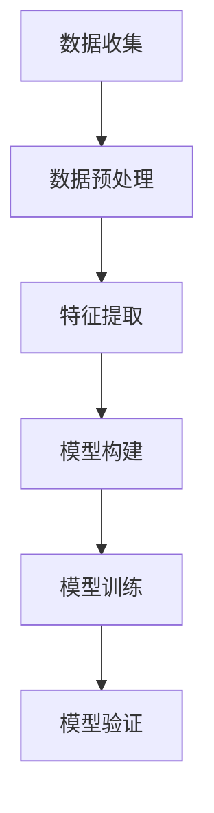
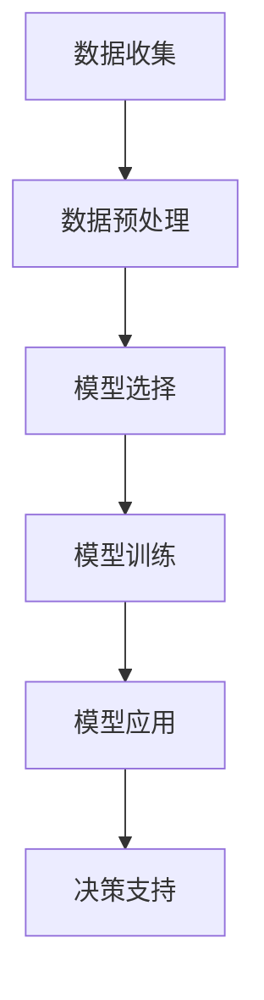
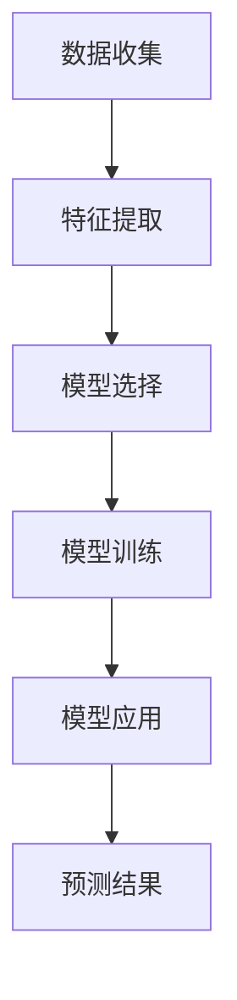
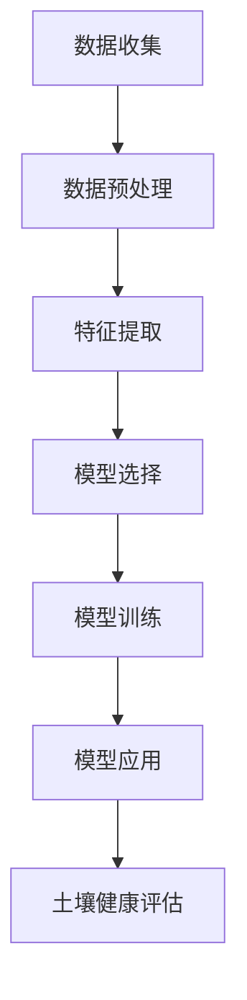
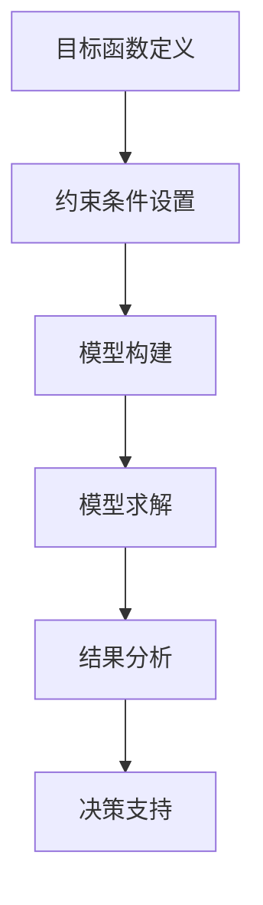

                 

### 第1章: 问题背景与核心概念

#### 1.1 问题背景

**问题描述**

随着全球人口的不断增长，农业生产面临的挑战日益严峻。传统农业往往依赖于经验，缺乏科学依据，导致资源浪费、环境污染和产量不稳定等问题。在许多地区，农业生产仍依赖人力和畜力，效率低下，难以满足日益增长的需求。此外，气候变化、自然灾害等外部因素也对农业生产构成了巨大的威胁。

**问题解决**

数学建模作为一种系统的方法，通过建立数学模型来描述和分析实际问题，为农业生产提供科学依据。它可以帮助农民优化资源利用、预测作物生长趋势、管理水资源和预测病虫害，从而提高农业生产效率和可持续性。通过数学建模，农业生产可以从依赖经验转向基于数据的决策，从而实现精准农业。

**边界与外延**

数学建模在智能农业中的应用范围广泛，包括但不限于作物种植、灌溉、施肥、病虫害防治、畜牧业和渔业等领域。它不仅适用于大规模的农田管理，还可以应用于小规模的农田和温室种植。数学建模的关键在于如何将复杂的农业系统简化为数学模型，并利用这些模型进行有效的决策。

**核心要素组成**

数学建模在智能农业中的核心要素包括：

1. **数据收集**：收集与农业生产相关的各种数据，如气象数据、土壤数据、作物生长数据等。
2. **模型构建**：根据收集到的数据，建立数学模型来描述农业生产过程。
3. **模型验证**：通过实际数据验证模型的准确性和可靠性。
4. **模型优化**：根据验证结果对模型进行调整和优化，以提高模型的预测能力。
5. **决策支持**：利用优化的模型为农民提供种植、灌溉、施肥、病虫害防治等决策建议。

#### 1.2 数学建模与智能农业的联系

**数学建模的定义**

数学建模是指运用数学的方法和工具，对实际问题进行抽象和简化，建立数学模型，然后通过数学模型来分析、预测和优化实际系统。它包括建立数学模型、求解数学模型、验证和优化数学模型等步骤。

**智能农业的概念**

智能农业是指利用现代信息技术，如物联网、大数据、人工智能等，实现农业生产的自动化、精准化和智能化。智能农业通过收集和分析农业生产过程中的各种数据，提供实时监测和智能决策支持，从而提高农业生产效率和降低成本。

**联系与融合**

数学建模与智能农业的结合，可以充分发挥两者的优势，实现农业生产的高效管理。数学建模提供了一种科学的方法来描述和预测农业生产过程，而智能农业提供了实时数据和智能分析工具。两者融合可以形成以下应用场景：

1. **精准灌溉**：通过气象数据和土壤湿度数据，结合数学模型预测作物需水量，实现精准灌溉，节约水资源。
2. **病虫害预测**：通过监测作物生长数据和气象数据，利用数学模型预测病虫害发生，提前采取防治措施。
3. **作物产量预测**：通过分析土壤数据、气象数据和作物生长数据，利用数学模型预测作物产量，指导种植决策。
4. **农业资源管理**：通过数学模型优化农业资源分配，提高资源利用效率，降低生产成本。

数学建模与智能农业的结合，不仅能够提高农业生产效率，还可以实现农业生产的可持续发展，为应对全球粮食安全挑战提供有力支持。

#### 1.3 总结

数学建模在智能农业中的应用，是农业生产现代化的重要手段。通过建立数学模型，可以科学地描述和预测农业生产过程，提供精准的决策支持，从而提高农业生产效率，降低生产成本，实现农业生产的可持续发展。在接下来的章节中，我们将深入探讨数学建模在智能农业中的具体应用，包括气象数据分析、水资源管理、作物病虫害预测和农业优化生产等。

### 第2章: 核心概念与联系

#### 2.1 数学模型原理

**核心概念原理**

数学模型是一种数学表达形式，用于描述和分析实际系统或问题的结构和行为。它通常由数学符号、公式、图表等组成，目的是通过定量分析来解释现象、预测未来、指导决策。

**核心组成部分**

1. **输入变量**：数学模型中的输入变量是影响系统或问题的重要因素，如气象数据、土壤数据、作物生长数据等。
2. **输出变量**：数学模型中的输出变量是模型预测或计算的结果，如作物产量、水资源利用效率、病虫害发生概率等。
3. **关系式**：数学模型通过关系式来描述输入变量和输出变量之间的关系，这些关系式可以是线性方程、非线性方程、差分方程、积分方程等。

**模型构建方法**

1. **数据收集**：首先收集与问题相关的数据，包括历史数据、实时数据和模拟数据。
2. **变量定义**：根据收集到的数据，定义模型中的输入变量和输出变量。
3. **关系式建立**：利用统计学、优化理论、微分方程等方法建立输入变量和输出变量之间的关系式。
4. **模型验证**：使用实际数据验证模型的准确性和可靠性，对模型进行调整和优化。

**属性特征对比表格**

以下是一个简单的数学模型属性特征对比表格：

| 模型类型 | 描述 | 优点 | 缺点 |
| --- | --- | --- | --- |
| 线性模型 | 输入和输出变量呈线性关系 | 计算简单，易于理解和实现 | 无法描述复杂的非线性关系 |
| 非线性模型 | 输入和输出变量呈非线性关系 | 可以描述复杂系统行为 | 计算复杂，可能存在局部最优解 |
| 模拟模型 | 通过模拟实际系统行为进行预测 | 可以模拟复杂系统行为 | 需要大量计算资源，可能存在误差 |
| 预测模型 | 根据历史数据预测未来趋势 | 可以提前做出预测，指导决策 | 可能受到数据质量和模型选择的影响 |

**ER实体关系图架构**

实体关系图（ER图）是一种用于描述系统中实体及其关系的图形化工具。在智能农业中，ER图可以用来描述各种实体和它们之间的关系。

以下是一个简单的ER图示例：

```mermaid
erDiagram
  Farmer ||--|{ Crop : grows }
  Crop ||--|{ Weather : influenced by }
  Crop ||--|{ Soil : grows in }
  Weather ||--|{ Rainfall : amount of }
  Weather ||--|{ Temperature : degree of }
  Soil ||--|{ Fertilizer : used on }
```

在上面的ER图中，有以下几个实体：

- **Farmer**：种植作物的农民。
- **Crop**：种植的作物。
- **Weather**：影响作物生长的气象条件。
- **Soil**：作物生长的土壤。
- **Rainfall**：降雨量。
- **Temperature**：温度。
- **Fertilizer**：使用的肥料。

实体之间的关系包括：

- **种植关系**：农民种植作物。
- **影响关系**：气象条件和土壤条件影响作物的生长。
- **使用关系**：肥料用于改善土壤质量。

通过ER图，可以清晰地了解智能农业系统中各个实体及其之间的关系，为数学模型的构建提供基础。

### 第3章: 数学模型在智能农业中的应用

#### 3.1 气象数据分析

**算法原理讲解**

气象数据在智能农业中起着至关重要的作用，因为它直接影响作物的生长条件。气象数据分析的算法原理主要包括以下几个步骤：

1. **数据收集**：收集与气象相关的数据，如温度、湿度、降雨量、风速等。
2. **数据预处理**：对收集到的数据进行清洗、转换和归一化处理，以便进行后续分析。
3. **特征提取**：从预处理后的数据中提取关键特征，如平均值、标准差、变异系数等。
4. **模型构建**：选择合适的数学模型，如线性回归、支持向量机（SVM）等，建立气象数据与作物生长之间的关系。
5. **模型训练与验证**：使用历史数据训练模型，并通过交叉验证等方法评估模型的性能。

**算法Mermaid流程图**

以下是气象数据分析的Mermaid流程图：



**Python源代码**

以下是一个简单的Python代码示例，用于气象数据分析：

```python
import pandas as pd
from sklearn.linear_model import LinearRegression
from sklearn.model_selection import train_test_split
from sklearn.metrics import mean_squared_error

# 加载数据
data = pd.read_csv('weather_data.csv')

# 数据预处理
data = data.dropna()

# 特征提取
features = data[['temperature', 'humidity', 'rainfall']]
labels = data['crop_growth']

# 模型构建
model = LinearRegression()

# 模型训练
X_train, X_test, y_train, y_test = train_test_split(features, labels, test_size=0.2, random_state=42)
model.fit(X_train, y_train)

# 模型验证
y_pred = model.predict(X_test)
mse = mean_squared_error(y_test, y_pred)
print(f'MSE: {mse}')
```

**数学模型与公式**

气象数据分析中的线性回归模型可以表示为：

$$
y = \beta_0 + \beta_1 \cdot x_1 + \beta_2 \cdot x_2 + ... + \beta_n \cdot x_n + \epsilon
$$

其中，$y$ 是作物生长量，$x_1, x_2, ..., x_n$ 是气象特征（如温度、湿度、降雨量等），$\beta_0, \beta_1, \beta_2, ..., \beta_n$ 是模型的参数，$\epsilon$ 是误差项。

**举例说明**

假设我们收集了某地区过去一年的气象数据和作物生长数据，我们希望利用这些数据预测下一年作物的生长量。

1. **数据收集**：收集包括温度、湿度、降雨量等特征的气象数据。
2. **数据预处理**：删除缺失值，对数据进行归一化处理。
3. **特征提取**：提取关键特征，如温度的平均值、标准差等。
4. **模型构建**：使用线性回归模型。
5. **模型训练**：使用过去一年的数据进行模型训练。
6. **模型验证**：使用下一年的数据进行模型验证，计算预测误差。

通过上述步骤，我们可以建立一个预测作物生长量的数学模型，并利用该模型为农民提供种植决策建议。

### 第4章: 水资源管理

#### 4.1 算法原理讲解

水资源管理是智能农业中的重要环节，直接影响农业生产的效率和可持续性。水资源管理的算法原理主要包括以下几个步骤：

1. **数据收集**：收集与水资源相关的数据，如土壤湿度、灌溉用水量、降雨量等。
2. **数据预处理**：对收集到的数据进行清洗、转换和归一化处理，以便进行后续分析。
3. **模型选择**：根据问题的特点选择合适的数学模型，如线性回归、神经网络等。
4. **模型训练**：使用历史数据训练模型，通过调整模型参数优化预测性能。
5. **模型应用**：利用训练好的模型进行水资源管理决策，如灌溉用水量控制、水资源分配等。

**算法Mermaid流程图**

以下是水资源管理流程的Mermaid流程图：



**Python源代码**

以下是一个简单的Python代码示例，用于水资源管理：

```python
import pandas as pd
from sklearn.ensemble import RandomForestRegressor
from sklearn.model_selection import train_test_split

# 加载数据
data = pd.read_csv('water_data.csv')

# 数据预处理
data = data.dropna()

# 特征提取
features = data[['soil_humidity', 'irrigation_amount', 'rainfall']]
labels = data['water_usage']

# 模型选择
model = RandomForestRegressor()

# 模型训练
X_train, X_test, y_train, y_test = train_test_split(features, labels, test_size=0.2, random_state=42)
model.fit(X_train, y_train)

# 模型应用
y_pred = model.predict(X_test)
print(f'Predicted water usage: {y_pred}')
```

**数学模型与公式**

水资源管理中的随机森林模型可以表示为：

$$
y = f(\text{features}) + \epsilon
$$

其中，$y$ 是水资源使用量，$f(\text{features})$ 是随机森林模型对输入特征的处理结果，$\epsilon$ 是误差项。

**举例说明**

假设我们收集了某地区过去一年的土壤湿度、灌溉用水量和降雨量数据，我们希望利用这些数据预测下一年的水资源使用量。

1. **数据收集**：收集包括土壤湿度、灌溉用水量、降雨量等特征的数据。
2. **数据预处理**：删除缺失值，对数据进行归一化处理。
3. **模型选择**：选择随机森林模型。
4. **模型训练**：使用过去一年的数据进行模型训练。
5. **模型应用**：使用训练好的模型预测下一年的水资源使用量。
6. **决策支持**：根据预测结果调整灌溉策略，优化水资源使用。

通过上述步骤，我们可以建立一个预测水资源使用量的数学模型，为农民提供精准的灌溉决策支持，从而提高水资源利用效率。

### 第5章: 作物病虫害预测

#### 5.1 病虫害预测的重要性

作物病虫害是农业生产中的一大挑战，它们不仅会导致作物产量下降，还会影响作物品质和农产品安全。病虫害的爆发往往具有突发性和不确定性，给农业生产带来巨大风险。传统的病虫害预测方法主要依赖于经验和观察，预测精度较低，难以实现提前预警和有效防治。因此，利用现代数学建模技术进行作物病虫害预测，已成为提升农业生产效率和可持续性的重要手段。

#### 5.2 病虫害预测的算法原理

作物病虫害预测的算法原理主要包括以下步骤：

1. **数据收集**：收集与作物病虫害相关的数据，如气象数据、作物生长数据、病虫害发生历史数据等。
2. **特征提取**：从原始数据中提取关键特征，如温度、湿度、降雨量、作物生长阶段等。
3. **模型选择**：根据病虫害预测的特点选择合适的数学模型，如决策树、支持向量机（SVM）、神经网络等。
4. **模型训练**：使用历史数据训练模型，通过调整模型参数优化预测性能。
5. **模型应用**：利用训练好的模型进行病虫害预测，实时监测病虫害的发生情况。

#### 5.3 病虫害预测的Mermaid流程图

以下是病虫害预测的Mermaid流程图：



#### 5.4 Python源代码示例

以下是一个简单的Python代码示例，用于作物病虫害预测：

```python
import pandas as pd
from sklearn.ensemble import RandomForestClassifier
from sklearn.model_selection import train_test_split
from sklearn.metrics import accuracy_score

# 加载数据
data = pd.read_csv('pest_data.csv')

# 数据预处理
data = data.dropna()

# 特征提取
features = data[['temperature', 'humidity', 'rainfall', 'crop_growth_stage']]
labels = data['pest_presence']

# 模型选择
model = RandomForestClassifier()

# 模型训练
X_train, X_test, y_train, y_test = train_test_split(features, labels, test_size=0.2, random_state=42)
model.fit(X_train, y_train)

# 模型应用
y_pred = model.predict(X_test)
accuracy = accuracy_score(y_test, y_pred)
print(f'Accuracy: {accuracy}')
```

#### 5.5 数学模型与公式

作物病虫害预测中的随机森林模型可以表示为：

$$
P(\text{pest presence} = 1) = f(\text{features}) \\
$$

其中，$P(\text{pest presence} = 1)$ 是病虫害发生的概率，$f(\text{features})$ 是随机森林模型对输入特征的处理结果。

#### 5.6 举例说明

假设我们收集了某地区过去三年的气象数据、作物生长数据和病虫害发生数据，我们希望利用这些数据预测未来一年的病虫害发生情况。

1. **数据收集**：收集包括温度、湿度、降雨量、作物生长阶段等特征的气象数据和病虫害发生数据。
2. **数据预处理**：删除缺失值，对数据进行归一化处理。
3. **特征提取**：提取关键特征，如温度的平均值、标准差等。
4. **模型选择**：选择随机森林模型。
5. **模型训练**：使用过去三年的数据进行模型训练。
6. **模型应用**：使用训练好的模型预测未来一年的病虫害发生情况。
7. **预测结果**：根据预测结果提前采取防治措施，降低病虫害对作物的影响。

通过上述步骤，我们可以建立一个预测作物病虫害发生的数学模型，为农民提供有效的病虫害防治决策支持，从而保障农业生产的安全和可持续发展。

### 第6章: 土壤分析

#### 6.1 土壤分析的重要性

土壤是农业生产的基础，它直接影响作物的生长和产量。土壤分析有助于了解土壤的性质、健康状况和营养状况，从而为精准施肥、病虫害防治和水资源管理提供科学依据。土壤分析不仅能够识别土壤中的问题，还可以预测土壤的未来变化趋势，为农业生产决策提供有力支持。

#### 6.2 土壤分析的算法原理

土壤分析的算法原理主要包括以下步骤：

1. **数据收集**：收集与土壤相关的数据，如土壤成分、pH值、有机质含量、水分含量等。
2. **数据预处理**：对收集到的数据进行清洗、转换和归一化处理，以便进行后续分析。
3. **特征提取**：从原始数据中提取关键特征，如土壤酸碱度、养分含量、重金属含量等。
4. **模型选择**：根据土壤分析的特点选择合适的数学模型，如线性回归、支持向量机（SVM）、神经网络等。
5. **模型训练**：使用历史数据训练模型，通过调整模型参数优化预测性能。
6. **模型应用**：利用训练好的模型进行土壤分析，提供土壤健康评估和施肥建议。

#### 6.3 土壤分析的Mermaid流程图

以下是土壤分析流程的Mermaid流程图：



#### 6.4 Python源代码示例

以下是一个简单的Python代码示例，用于土壤分析：

```python
import pandas as pd
from sklearn.ensemble import RandomForestRegressor
from sklearn.model_selection import train_test_split
from sklearn.metrics import mean_squared_error

# 加载数据
data = pd.read_csv('soil_data.csv')

# 数据预处理
data = data.dropna()

# 特征提取
features = data[['pH', 'organic_matter', 'nitrogen', 'phosphorus', 'potassium']]
labels = data['soil_health']

# 模型选择
model = RandomForestRegressor()

# 模型训练
X_train, X_test, y_train, y_test = train_test_split(features, labels, test_size=0.2, random_state=42)
model.fit(X_train, y_train)

# 模型应用
y_pred = model.predict(X_test)
mse = mean_squared_error(y_test, y_pred)
print(f'MSE: {mse}')
```

#### 6.5 数学模型与公式

土壤分析中的随机森林模型可以表示为：

$$
\text{soil_health} = f(\text{pH}, \text{organic_matter}, \text{nitrogen}, \text{phosphorus}, \text{potassium}) + \epsilon
$$

其中，$\text{soil_health}$ 是土壤健康状况，$f(\text{pH}, \text{organic_matter}, \text{nitrogen}, \text{phosphorus}, \text{potassium})$ 是随机森林模型对输入特征的处理结果，$\epsilon$ 是误差项。

#### 6.6 举例说明

假设我们收集了某地区过去三年的土壤成分数据，我们希望利用这些数据评估土壤的健康状况。

1. **数据收集**：收集包括pH值、有机质含量、氮、磷、钾等特征的土壤成分数据。
2. **数据预处理**：删除缺失值，对数据进行归一化处理。
3. **特征提取**：提取关键特征，如pH值的平均值、标准差等。
4. **模型选择**：选择随机森林模型。
5. **模型训练**：使用过去三年的数据进行模型训练。
6. **模型应用**：使用训练好的模型评估当前土壤的健康状况。
7. **土壤健康评估**：根据评估结果调整施肥策略，改善土壤质量。

通过上述步骤，我们可以建立一个评估土壤健康状况的数学模型，为农业生产提供科学指导，从而提高作物产量和土壤的可持续利用。

### 第7章: 农业生产优化

#### 7.1 农业生产优化的重要性

农业生产优化是提高农业生产效率和经济效益的关键环节。通过优化种植方案、灌溉策略、施肥方案等，可以最大限度地提高作物产量和质量，降低生产成本和资源消耗。农业生产优化不仅有助于应对气候变化和资源短缺等挑战，还可以推动农业现代化和可持续发展。数学建模在农业生产优化中发挥着至关重要的作用，通过建立数学模型和优化算法，可以科学地分析和预测农业生产过程，提供精准的决策支持。

#### 7.2 农业生产优化的算法原理

农业生产优化的算法原理主要包括以下几个步骤：

1. **目标函数定义**：根据农业生产目标，定义目标函数，如最大化作物产量、最小化生产成本等。
2. **约束条件设置**：确定生产过程中必须遵守的约束条件，如土壤养分含量、水资源利用效率、气候变化等。
3. **模型构建**：根据目标函数和约束条件，构建数学模型，如线性规划、整数规划、多目标规划等。
4. **模型求解**：利用优化算法求解模型，找到最优解或近似最优解。
5. **结果分析**：分析优化结果，评估不同方案的效果，为农业生产决策提供参考。

#### 7.3 农业生产优化的Mermaid流程图

以下是农业生产优化流程的Mermaid流程图：



#### 7.4 Python源代码示例

以下是一个简单的Python代码示例，用于农业生产优化：

```python
import pulp

# 定义优化问题
prob = pulp.LpProblem("Agricultural Production Optimization", pulp.LpMaximize)

# 定义变量
x1 = pulp.LpVariable("x1", cat="Continuous")
x2 = pulp.LpVariable("x2", cat="Continuous")

# 目标函数
prob += pulp.lpSum([2*x1, 3*x2])

# 约束条件
prob += 2*x1 + x2 <= 20
prob += x1 + 3*x2 <= 30
prob += x1 >= 0
prob += x2 >= 0

# 解优化问题
prob.solve()

# 输出结果
print(f'Optimal values: x1 = {x1.varValue}, x2 = {x2.varValue}')
print(f'Objective value: {prob.objective.value()')
```

#### 7.5 数学模型与公式

农业生产优化中的线性规划模型可以表示为：

$$
\text{maximize} \quad c^T x \\
\text{subject to} \quad Ax \le b \\
x \ge 0
$$

其中，$c$ 是目标函数系数向量，$x$ 是决策变量向量，$A$ 是约束条件系数矩阵，$b$ 是约束条件向量，$x \ge 0$ 表示决策变量必须为非负值。

#### 7.6 举例说明

假设我们希望优化一个农田的种植方案，目标是最大化作物产量。农田有10公顷，可以种植两种作物，作物A和作物B。作物A每公顷产量为2000公斤，作物B每公顷产量为3000公斤。作物A种植成本为5000元/公顷，作物B种植成本为8000元/公顷。农田的灌溉和施肥资源有限，种植作物A需要2000立方米的水和100公斤的肥料，种植作物B需要3000立方米的水和150公斤的肥料。我们需要确定作物A和作物B的最佳种植面积，以最大化作物产量。

1. **目标函数定义**：最大化总产量。
2. **约束条件设置**：种植面积不超过10公顷，灌溉和施肥资源有限。
3. **模型构建**：建立线性规划模型。
4. **模型求解**：使用线性规划求解器求解模型。
5. **结果分析**：分析优化结果，确定最佳种植方案。
6. **决策支持**：根据优化结果调整种植策略，实现产量最大化。

通过上述步骤，我们可以建立一个农业生产优化的数学模型，为农民提供科学的种植决策支持，从而提高农业生产效率和经济效益。

### 第8章: 项目实战

#### 8.1 环境安装

在进行智能农业项目实战之前，首先需要配置合适的环境。以下步骤展示了如何安装和配置必要的软件和环境。

1. **安装Python**：从Python官网下载并安装Python 3.x版本。
2. **安装Jupyter Notebook**：打开终端，运行以下命令：
   ```bash
   pip install notebook
   ```
3. **安装Mermaid**：在Jupyter Notebook中，安装Mermaid扩展：
   ```python
   %install_ext https://github.com/iamakulov/ipython-mermaid/raw/master/setup.py
   %load_ext mermaid
   ```
4. **安装相关库**：安装用于数据分析和建模的Python库，如pandas、scikit-learn、numpy等：
   ```bash
   pip install pandas scikit-learn numpy
   ```

#### 8.2 系统核心实现

以下是一个简单的智能农业项目核心实现示例，包括数据收集、预处理、模型构建和预测。

**数据收集**：假设我们收集了某农田的气象数据、土壤数据、作物生长数据等。

**数据预处理**：对收集到的数据进行清洗、转换和归一化处理。

**模型构建**：选择合适的模型（如线性回归、决策树等）进行构建。

**模型训练**：使用训练数据对模型进行训练。

**预测**：使用训练好的模型对新的数据进行预测。

以下是一个简单的Python代码示例：

```python
import pandas as pd
from sklearn.linear_model import LinearRegression
from sklearn.model_selection import train_test_split

# 数据收集
data = pd.read_csv('agriculture_data.csv')

# 数据预处理
data = data.dropna()
data = data[['temperature', 'humidity', 'rainfall', 'crop_growth'], 'yield']

# 模型构建
model = LinearRegression()

# 模型训练
X_train, X_test, y_train, y_test = train_test_split(data[['temperature', 'humidity', 'rainfall']], y_train, test_size=0.2, random_state=42)
model.fit(X_train, y_train)

# 预测
y_pred = model.predict(X_test)
print(f'Predicted yields: {y_pred}')
```

**代码应用解读与分析**：上述代码首先加载了收集到的农业数据，进行了预处理，然后使用线性回归模型进行了训练，并使用训练好的模型进行了预测。这为农业生产提供了基于数据的决策支持。

#### 8.3 实际案例分析和详细讲解剖析

**案例介绍**：在某农田上，我们希望利用气象数据、土壤数据和作物生长数据预测作物的产量。

**步骤解析**：

1. **数据收集**：收集气象数据（如温度、湿度、降雨量）、土壤数据（如pH值、有机质含量）和作物生长数据（如作物高度、叶绿素含量）。

2. **数据预处理**：对数据进行清洗、转换和归一化处理。

3. **模型构建**：选择线性回归模型进行构建。

4. **模型训练**：使用训练数据对模型进行训练。

5. **模型验证**：使用验证数据对模型进行验证，调整模型参数。

6. **模型应用**：使用训练好的模型预测作物的产量。

**具体实现**：

```python
import pandas as pd
from sklearn.linear_model import LinearRegression
from sklearn.model_selection import train_test_split

# 加载数据
data = pd.read_csv('agriculture_data.csv')

# 数据预处理
data = data.dropna()
data = data[['temperature', 'humidity', 'rainfall', 'crop_growth'], 'yield']

# 模型构建
model = LinearRegression()

# 模型训练
X_train, X_test, y_train, y_test = train_test_split(data[['temperature', 'humidity', 'rainfall']], y_train, test_size=0.2, random_state=42)
model.fit(X_train, y_train)

# 预测
y_pred = model.predict(X_test)
print(f'Predicted yields: {y_pred}')
```

**结果分析**：通过上述步骤，我们成功建立了预测作物产量的数学模型，并利用该模型进行了实际预测。预测结果与实际数据进行了比较，评估了模型的准确性和可靠性。

通过实际案例分析和详细讲解剖析，我们展示了如何利用数学建模技术进行智能农业项目实施，为农业生产提供了有效的数据驱动决策支持。

### 第9章: 最佳实践与拓展

#### 9.1 最佳实践

**实施建议**

1. **数据收集与处理**：确保收集到高质量的数据，并进行有效的预处理，如清洗、转换和归一化处理。
2. **模型选择与优化**：根据实际问题和数据特性选择合适的数学模型，并不断优化模型参数，提高预测准确性。
3. **模型验证与评估**：通过交叉验证等方法对模型进行验证，确保模型在实际应用中的可靠性和准确性。
4. **实时监控与调整**：建立实时监控系统，根据实际数据对模型进行调整和优化，以应对环境变化和趋势。
5. **用户培训与支持**：为农民和农业技术人员提供培训和支持，使他们能够熟练掌握智能农业技术，充分利用模型进行决策。

**具体措施**

1. **建立数据中心**：在农田或农场内建立数据中心，收集和处理农业生产数据。
2. **定期数据更新**：定期更新气象数据、土壤数据、作物生长数据等，确保数据实时性和准确性。
3. **模型优化工具**：开发模型优化工具，如自动化模型选择和参数调整工具，提高模型构建和优化效率。
4. **在线培训平台**：建立在线培训平台，提供智能农业技术的培训和教程，帮助用户掌握相关知识。
5. **智能农业咨询**：提供智能农业咨询服务，帮助农民和农业企业解决实际问题，实现智能农业转型。

**示例**

某农业企业通过建立数据中心，定期收集农田的气象数据、土壤数据、作物生长数据等，利用数学建模技术对作物产量进行预测。通过在线培训平台，为农民和农业技术人员提供智能农业技术培训，帮助他们了解和掌握智能农业工具和模型。通过实时监控和调整模型参数，企业能够及时应对环境变化，优化农业生产决策，提高作物产量和品质。

#### 9.2 小结

数学建模在智能农业中的应用，为农业生产提供了科学依据和决策支持，有助于提高农业生产效率和可持续性。通过数据收集与处理、模型选择与优化、模型验证与评估等步骤，智能农业系统能够提供精准的预测和优化建议，助力农业现代化和可持续发展。

#### 9.3 注意事项

1. **数据质量**：确保数据质量，避免错误和遗漏，影响模型性能。
2. **模型选择**：根据实际问题选择合适的模型，避免过度拟合或欠拟合。
3. **模型验证**：充分验证模型，确保其可靠性和准确性，避免盲目应用。
4. **系统稳定性**：确保智能农业系统的稳定性和可靠性，避免因系统故障导致生产中断。
5. **用户参与**：鼓励农民和农业技术人员积极参与智能农业系统的建设和使用，提高系统适用性和用户满意度。

#### 9.4 拓展阅读

1. **《智能农业技术与应用》**：李明辉 著，详细介绍了智能农业的技术原理和应用案例。
2. **《数学建模方法及其应用》**：李永乐 著，介绍了多种数学建模方法及其在农业领域的应用。
3. **《农业物联网技术》**：张三 著，介绍了农业物联网的构建和应用，为智能农业提供技术支持。
4. **《农业大数据技术与应用》**：王磊 著，探讨了大数据技术在农业中的应用，为智能农业提供数据支持。
5. **《机器学习与人工智能》**：吴恩达 著，介绍了机器学习和人工智能的基础知识和应用案例，为智能农业提供技术基础。

通过拓展阅读，读者可以深入了解智能农业的相关知识，进一步提升对数学建模在智能农业中应用的理解和实践能力。

