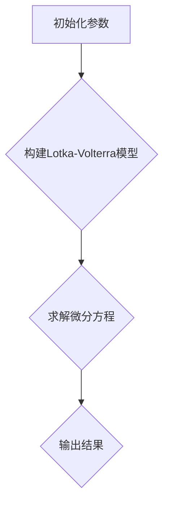
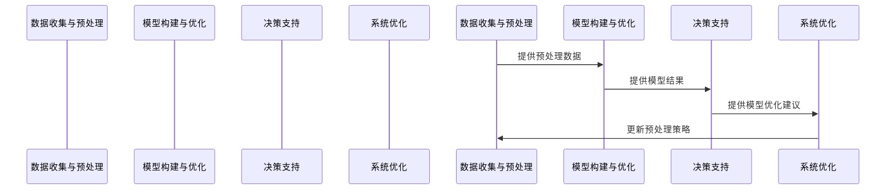

                 


### 海洋生态保护的重要性

海洋是地球最大的生态系统，占地球表面积的71%，对于地球上的气候调节、生物多样性维持、海洋资源的利用都有着不可替代的作用。首先，海洋是全球气候系统的重要组成部分，海洋中的水循环过程对大气中的温度和湿度有着显著影响，调节全球气候。其次，海洋是生物多样性的宝库，拥有超过22万种已知的海洋生物种类，其中许多物种还未被发现。海洋生态系统的健康直接关系到全球生态平衡和人类的生存。

随着人类活动的加剧，海洋生态系统正面临着严重的威胁。海洋污染、过度捕捞、气候变化等问题的加剧，使得海洋生态系统日益脆弱。例如，海洋污染导致了大量海洋生物的死亡和基因突变，过度捕捞则使得某些海洋物种濒临灭绝，气候变化导致了海洋酸化和珊瑚礁白化等生态危机。

因此，保护海洋生态系统成为了一个迫切需要解决的问题。数学建模作为一种强大的工具，能够帮助我们更好地理解和预测海洋生态系统的变化，为海洋生态保护提供科学依据。通过数学建模，我们可以分析海洋生态系统的结构和功能，预测不同环境因素对生态系统的影响，从而制定出有效的保护策略。

在接下来的章节中，我们将详细介绍数学建模在海洋生态保护中的应用，从基本原理到具体方法，再到实际案例，全面探讨数学建模如何助力海洋生态保护。

## 1.2 问题描述

### 1.2.1 海洋生态保护的核心问题

海洋生态保护的核心问题主要包括海洋污染、过度捕捞、气候变化等。这些问题不仅威胁到海洋生态系统的健康，也对全球生态平衡和人类社会的可持续发展造成了严重影响。

**海洋污染**：海洋污染主要包括化学污染、塑料污染和石油污染等。化学污染主要来源于农药、化肥和工业废水等；塑料污染则源于各种塑料制品的随意丢弃；石油污染则多发生在海上石油泄漏事件中。这些污染物对海洋生物造成了严重的危害，如生物体内毒素积累、生物多样性下降等。

**过度捕捞**：过度捕捞导致某些海洋生物种群数量急剧下降，甚至濒临灭绝。这不仅破坏了海洋生态系统的平衡，也直接影响到人类渔业资源的可持续利用。此外，过度捕捞还会导致渔业资源的衰退和渔业经济的萎缩。

**气候变化**：全球气候变化对海洋生态系统的影响尤为显著。气候变化导致海洋温度上升、海平面上升和海洋酸化。这些变化不仅影响了海洋生物的生存环境，也改变了海洋生态系统的结构和功能，使得海洋生态系统的稳定性受到威胁。

### 1.2.2 数学建模的应用领域

数学建模在海洋生态保护中的应用非常广泛，涵盖了生态学、海洋学、经济学等多个学科领域。具体应用领域包括：

**生态学**：生态学模型用于研究海洋生态系统的结构和功能，如生物群落模型、食物网模型等。这些模型可以帮助我们理解海洋生态系统的复杂性和动态变化，预测生态系统对环境变化的响应。

**海洋学**：海洋学模型用于研究海洋物理、化学和生物过程，如海洋环流模型、海洋化学模型、海洋生物模型等。这些模型可以帮助我们了解海洋环境的变化规律，预测海洋生态系统对气候变化的影响。

**经济学**：经济学模型用于研究海洋资源的利用和管理，如渔业经济学模型、海洋资源价值评估模型等。这些模型可以帮助我们制定出科学合理的海洋资源管理策略，实现海洋资源的可持续利用。

### 1.2.3 数学建模在海洋生态保护中的目标

数学建模在海洋生态保护中的目标主要包括：

**预测环境变化**：通过建立海洋生态系统的数学模型，我们可以预测未来环境变化对海洋生态系统的影响，为海洋生态保护提供科学依据。

**制定保护策略**：基于数学模型的结果，我们可以制定出有效的海洋生态保护策略，如海洋保护区规划、渔业资源管理策略等。

**评估保护效果**：通过模型模拟和实际观测数据的对比，我们可以评估海洋生态保护措施的有效性，及时调整保护策略。

### 1.3 问题解决

#### 1.3.1 数学建模的基本原理

数学建模是一种将实际问题转化为数学模型的过程，其基本原理包括以下几方面：

**建立模型**：首先，我们需要根据问题的实际需求，选择合适的数学模型。这通常涉及到对问题的抽象和简化的过程。例如，在研究海洋生态系统时，我们可以选择生态学模型、海洋学模型或经济学模型等。

**数据收集**：建立模型后，我们需要收集与问题相关的数据。这些数据可以来源于实地调查、卫星监测、历史数据等。

**模型验证**：通过收集到的数据，我们需要对模型进行验证。验证的目的是检查模型是否能够准确地描述问题的实际状态，以及模型预测的精度和可靠性。

**模型应用**：在验证模型的有效性后，我们可以将模型应用于实际问题的解决。例如，通过模型预测未来海洋生态系统的变化趋势，为海洋生态保护提供决策支持。

#### 1.3.2 数学建模在海洋生态保护中的应用方法

数学建模在海洋生态保护中的应用方法主要包括以下几种：

**生态学模型**：生态学模型用于研究海洋生态系统的结构和功能。例如，生物群落模型可以用来研究不同生物种群之间的相互作用和生态位分布；食物网模型可以用来研究能量流动和物质循环。

**海洋学模型**：海洋学模型用于研究海洋物理、化学和生物过程。例如，海洋环流模型可以用来研究海洋中的水循环和能量传递；海洋化学模型可以用来研究海洋酸化和海洋污染的影响。

**经济学模型**：经济学模型用于研究海洋资源的利用和管理。例如，渔业经济学模型可以用来研究渔业资源的可持续利用；海洋资源价值评估模型可以用来评估海洋资源的经济价值。

#### 1.3.3 数学建模的优势与局限性

**优势**：

1. **定量分析**：数学建模能够提供定量的分析结果，使得问题的解决更加精确和科学。
2. **跨学科应用**：数学建模可以结合多个学科的知识，为复杂问题的解决提供全面的视角。
3. **预测未来**：数学模型可以模拟未来环境变化对生态系统的影响，为决策提供科学依据。

**局限性**：

1. **数据依赖**：数学建模依赖于实际数据的准确性，数据的缺失或不准确可能导致模型的失效。
2. **模型简化**：在建立数学模型时，需要对实际问题进行简化和抽象，这可能导致模型与实际情况存在差异。
3. **模型验证**：模型的验证是一个复杂的过程，需要大量的时间和资源。

### 1.4 边界与外延

#### 1.4.1 数学建模的应用范围

数学建模在海洋生态保护中的应用范围非常广泛，可以应用于以下几个方面：

**海洋污染治理**：通过建立海洋污染的数学模型，可以预测污染物的扩散路径和浓度变化，为污染治理提供科学依据。

**渔业资源管理**：通过建立渔业资源的数学模型，可以预测渔业资源的数量变化和捕捞策略的优化，实现渔业的可持续发展。

**海洋保护区规划**：通过建立海洋保护区的数学模型，可以评估保护区的有效性和保护效果的持续性，优化保护区的布局和管理。

**气候变化影响评估**：通过建立气候变化对海洋生态系统的数学模型，可以预测未来海洋生态系统变化趋势，为气候变化应对策略提供科学支持。

#### 1.4.2 海洋生态系统的复杂性

海洋生态系统具有高度的复杂性和多样性，其复杂性主要体现在以下几个方面：

**生物多样性**：海洋生态系统拥有丰富的生物种类，不同生物之间相互依存、相互作用，构成了复杂的生物网络。

**环境因素**：海洋生态系统受到多种环境因素的影响，如温度、盐度、营养盐、氧气含量等，这些因素的相互作用和变化对生态系统产生了深远的影响。

**非线性动态**：海洋生态系统的变化往往呈现出非线性和动态特性，其状态的变化不是简单的线性关系，而是复杂的非线性关系。

#### 1.4.3 数学建模的方法与技术选择

在数学建模过程中，选择合适的方法和技术至关重要。以下是几种常用的数学建模方法和技术：

**统计模型**：统计模型通过收集和分析数据，提取数据的统计特征，用于描述和分析系统的行为。常用的统计模型包括线性回归、逻辑回归、时间序列分析等。

**微分方程模型**：微分方程模型通过建立系统变量之间的微分关系，描述系统的动态变化。常见的微分方程模型包括常微分方程和偏微分方程。

**人工智能模型**：人工智能模型，如机器学习和深度学习模型，通过学习大量的数据，自动提取特征和规律，用于预测和分类。常用的机器学习模型包括决策树、支持向量机、神经网络等。

**多尺度建模**：多尺度建模通过结合不同尺度下的模型，描述系统的整体行为。例如，在研究海洋生态系统时，可以结合微观生态学模型和宏观生态学模型，全面描述生态系统的动态变化。

### 1.5 概念结构与核心要素组成

#### 1.5.1 海洋生态系统的主要组成部分

海洋生态系统由多个组成部分构成，主要包括：

**生物群落**：生物群落是指生活在同一区域内的各种生物种群。海洋生物群落包括海洋植物、海洋动物和海洋微生物等。

**非生物环境**：非生物环境包括海水、海洋底质、温度、盐度、氧气含量等。这些环境因素直接影响海洋生物的生存和繁衍。

**食物网**：食物网是描述不同生物种群之间食物关系的一种模型。海洋食物网中的生物通过捕食和被捕食关系相互联系，形成复杂的食物链和食物网。

#### 1.5.2 数学建模的关键概念

数学建模在海洋生态保护中涉及多个关键概念，包括：

**生态学模型**：生态学模型用于描述生物种群的数量变化、生物群落的结构和功能等。

**海洋学模型**：海洋学模型用于描述海洋环境的变化规律、海洋物理和化学过程等。

**经济学模型**：经济学模型用于描述海洋资源的利用和管理、渔业资源的可持续利用等。

**数据驱动模型**：数据驱动模型通过分析大量数据，提取特征和规律，用于预测和分类。

**人工智能模型**：人工智能模型通过学习数据，自动提取特征和规律，用于复杂问题的求解和决策。

#### 1.5.3 数学建模在海洋生态保护中的核心要素

数学建模在海洋生态保护中的核心要素包括：

**数据收集**：收集与海洋生态系统相关的数据，包括实地调查数据、卫星监测数据和历史数据等。

**模型建立**：根据问题需求，选择合适的数学模型，建立数学模型。

**模型验证**：通过数据验证模型的准确性，确保模型的可靠性。

**模型应用**：将验证有效的模型应用于实际问题的解决，提供科学依据和决策支持。

### 1.6 本章小结

在本章中，我们详细介绍了数学建模在海洋生态保护中的应用，从背景介绍到具体的方法和技术，再到实际的应用场景。我们讨论了海洋生态保护的重要性、核心问题、数学建模的基本原理和应用方法，以及海洋生态系统的复杂性。通过本章的讨论，我们可以看到数学建模作为一种强大的工具，在海洋生态保护中具有重要的应用价值。在接下来的章节中，我们将进一步探讨数学建模的具体应用，通过实例分析来展示其在解决实际问题中的效果。

---

## 2.1 海洋生态系统的核心概念

### 2.1.1 海洋生态系统的定义

海洋生态系统是指由海洋生物群落、非生物环境以及生物与环境相互作用的系统构成的整体。它不仅包括海洋生物，如鱼类、无脊椎动物、植物和微生物，还涵盖了海洋环境中的物理、化学和生物过程。海洋生态系统是一个复杂且动态的系统，其结构与功能受到海洋环境、生物种群及其相互作用的影响。

### 2.1.2 海洋生态系统的结构

海洋生态系统的结构可以从多个层次来理解，包括：

**生物群落**：生物群落是由多个生物种群组成的，这些种群在空间上形成一定的分布模式，并在生态位上相互补充。例如，珊瑚礁生物群落由珊瑚、鱼类、无脊椎动物等多种生物组成，它们共同维持着珊瑚礁生态系统的稳定。

**食物网**：食物网是描述不同生物种群之间通过食物链相互联系的关系模型。食物网中的生物通过捕食和被捕食关系形成复杂的营养结构，如海洋食物网包括浮游生物、小鱼、大鱼等不同层次的生物。

**生态系统功能**：生态系统功能是指海洋生态系统能够进行物质循环、能量传递和生物多样性维持等过程。例如，浮游植物通过光合作用将太阳能转化为生物能，支持整个海洋生态系统的能量流动。

### 2.1.3 海洋生态系统的动态变化

海洋生态系统是一个动态变化的系统，其状态会随着环境条件和生物活动的变化而变化。海洋生态系统的动态变化可以从以下几个方面来理解：

**季节性变化**：海洋生态系统的状态会随着季节的变化而变化，例如，浮游植物的生长和繁殖通常在温暖的季节更为活跃。

**气候变化**：全球气候变化对海洋生态系统的影响尤为显著，如海洋温度上升、海平面上升和海洋酸化等。这些变化不仅影响了海洋生物的生存环境，也改变了海洋生态系统的结构和功能。

**人类活动影响**：人类活动，如过度捕捞、海洋污染和海洋工程等，对海洋生态系统产生了深远的影响，导致了生物多样性的下降和生态系统的退化。

#### 2.1.3.1 生物多样性的维持

生物多样性是海洋生态系统健康的重要指标，其维持依赖于生态系统的稳定性和多样性。海洋生态系统中，不同生物种群之间存在着复杂的相互关系，如捕食与被捕食、共生和竞争等。这些关系共同维持了生态系统的动态平衡，促进了生物多样性的维持。

**生态位分化**：生态位分化是生物多样性维持的一个重要机制。通过生态位的分化，不同生物种群可以在同一生态系统中共存，避免了资源竞争。

**环境过滤**：环境过滤作用是指环境条件对生物种群分布和生存的影响。通过环境过滤，生态系统可以筛选出适应特定环境的生物种群，从而维持生物多样性。

**生态位重叠**：生态位重叠是生物多样性形成的一个重要因素。通过生态位重叠，不同生物种群可以在有限的资源下共存，从而增加了生态系统的多样性。

#### 2.1.3.2 物质循环和能量流动

物质循环和能量流动是海洋生态系统的基本过程。物质循环包括碳、氮、磷等营养元素的循环，这些元素的循环过程决定了生态系统的营养结构和功能。能量流动则是通过食物链和食物网进行传递，从初级生产者到顶级消费者，形成了生态系统的能量流。

**初级生产者**：初级生产者是生态系统的基石，通过光合作用将太阳能转化为化学能，产生有机物质。浮游植物是海洋生态系统中的主要初级生产者，它们在海洋生态系统中起着至关重要的作用。

**食物链和食物网**：食物链和食物网描述了不同生物种群之间的能量传递关系。食物链通常是从初级生产者到顶级消费者的简单线性关系，而食物网则更为复杂，多个食物链相互交织，形成了生态系统的营养结构。

**能量转化效率**：能量在生态系统中的传递并不是完全高效的，通常只有10%至20%的能量能够传递到下一个营养级。这种能量损失导致了生态系统中营养级的多样性，也是生态系统稳定性的一部分。

通过上述分析，我们可以看到海洋生态系统的核心概念和结构是如何共同作用，维持生态系统的动态平衡和生物多样性的。在接下来的章节中，我们将进一步探讨数学建模如何帮助理解和预测海洋生态系统的变化，为海洋生态保护提供科学依据。

### 2.2 数学建模的基本原理

数学建模是将实际问题转化为数学形式的过程，其基本原理涉及抽象、简化和模拟。数学建模的目的是通过数学语言和工具，对实际问题进行分析、预测和决策。

#### 2.2.1 数学建模的定义

数学建模是指利用数学方法、符号和公式，对现实世界中的问题进行描述和分析的过程。其核心是将复杂的问题转化为可以用数学工具解决的模型。数学建模不仅需要数学知识，还需要对实际问题有深刻的理解和洞察。

#### 2.2.2 数学建模的基本过程

数学建模通常包括以下基本过程：

**问题定义**：首先，需要明确需要解决的问题。这包括问题的背景、目标、条件和限制。

**模型构建**：在问题定义的基础上，构建一个数学模型。这通常涉及选择合适的数学工具和方法，如微分方程、统计模型、优化模型等。

**模型验证**：通过实际数据或模拟数据，验证模型的有效性和准确性。验证的目的是确保模型能够正确地描述和预测实际问题。

**模型应用**：在模型验证通过后，将模型应用于实际问题中，进行预测、分析和决策。

**模型优化**：根据实际反馈，不断优化和改进模型，以提高其预测能力和实用性。

#### 2.2.2.1 模型构建

模型构建是数学建模的核心步骤。构建模型时，通常需要考虑以下几个关键因素：

**变量选择**：选择与问题相关的变量，包括输入变量、输出变量和中间变量。

**关系表达**：用数学公式或方程表达变量之间的关系。这通常涉及建立微分方程、差分方程、代数方程等。

**假设条件**：明确模型的假设条件，这些条件有助于简化问题，使模型更加易于分析和求解。

**边界条件**：定义模型的边界条件，这些条件有助于确定模型的初始状态和约束。

#### 2.2.2.2 模型验证

模型验证是确保模型准确性和有效性的关键步骤。常见的验证方法包括：

**数据对比**：将模型预测结果与实际观测数据或历史数据进行对比，评估模型的准确性。

**敏感性分析**：分析模型对输入变量的敏感度，评估模型在不同输入条件下的稳定性和鲁棒性。

**交叉验证**：使用不同的数据集进行验证，确保模型在不同数据集上的表现一致。

**模拟实验**：通过模拟实验，验证模型在不同情景下的行为和响应。

#### 2.2.2.3 模型应用

在模型验证通过后，可以将模型应用于实际问题中，进行预测、分析和决策。常见的应用场景包括：

**预测**：使用模型预测未来状态，如海洋温度变化、生物种群数量变化等。

**分析**：分析系统行为和特征，如能量流动、物质循环等。

**决策**：基于模型结果，制定科学合理的决策，如海洋保护区规划、渔业资源管理策略等。

#### 2.2.2.4 模型优化

模型优化是提高模型预测能力和实用性的关键步骤。常见的优化方法包括：

**参数调整**：调整模型参数，以提高模型预测的准确性和稳定性。

**模型整合**：将多个模型整合成一个综合模型，以提高模型的预测能力和适用性。

**机器学习**：使用机器学习算法，自动优化模型参数和结构。

#### 2.2.3 数学建模的方法

数学建模的方法多种多样，不同的方法适用于不同的问题。以下是几种常用的数学建模方法：

**微分方程模型**：用于描述动态系统的变化，如海洋温度变化、生物种群数量变化等。

**统计模型**：用于分析数据，如回归分析、时间序列分析等。

**优化模型**：用于优化决策，如线性规划、非线性规划等。

**机器学习模型**：用于数据分析和预测，如决策树、神经网络等。

通过上述分析，我们可以看到数学建模的基本原理和方法如何帮助我们在复杂的问题中找到科学合理的解决方案。在接下来的章节中，我们将探讨数学建模在海洋生态保护中的应用，通过具体的方法和实例，展示数学建模如何助力海洋生态保护。

### 2.3 数学建模在海洋生态保护中的应用方法

数学建模在海洋生态保护中发挥着重要作用，其应用方法涵盖了经典和现代多种技术。以下是几种主要的方法：

#### 2.3.1 经典数学建模方法

**生态学模型**：生态学模型主要用于描述生物种群的数量变化、生物群落的结构和功能。常用的生态学模型包括Lotka-Volterra模型，这是一个描述捕食-被捕食关系的微分方程模型。模型的基本形式为：

\[
\frac{dx}{dt} = x(\alpha - \beta y)
\]
\[
\frac{dy}{dt} = y(\delta x - \gamma y)
\]

其中，\(x\)和\(y\)分别表示捕食者和被捕食者的种群数量，\(\alpha\)、\(\beta\)、\(\delta\)和\(\gamma\)是模型参数。

**海洋学模型**：海洋学模型用于描述海洋物理、化学和生物过程。常见的海洋学模型包括海洋环流模型和海洋化学模型。海洋环流模型可以用于模拟海洋中的水流、热量和物质的传输，常用的模型如海洋一般环流模型（OGCM）。海洋化学模型则用于模拟海洋中的化学过程，如营养盐循环和海洋酸化。

**经济学模型**：经济学模型用于研究海洋资源的利用和管理。渔业经济学模型是其中的典型代表，用于评估渔业资源的价值和可持续利用。常见的渔业经济学模型包括基于生物量和产量的渔业资源评估模型。

#### 2.3.2 现代数学建模方法

**数据挖掘**：数据挖掘是一种从大量数据中提取有用信息的方法，广泛应用于海洋生态保护。通过数据挖掘，可以从海洋监测数据和遥感数据中提取关键信息，如海洋污染源分布、海洋生物种群数量变化等。常用的数据挖掘方法包括聚类分析、关联规则挖掘和分类算法等。

**机器学习**：机器学习是一种通过学习数据来发现规律和模式的方法，在海洋生态保护中得到了广泛应用。机器学习模型可以自动从数据中学习特征，用于预测和分类。在海洋生态保护中，常见的机器学习模型包括决策树、支持向量机（SVM）和神经网络（NN）等。例如，可以使用机器学习模型预测海洋污染事件的发生时间和地点。

**人工智能**：人工智能（AI）是机器学习的扩展，其目标是通过模拟人类智能，解决复杂问题。在海洋生态保护中，人工智能可以用于自动化监测、决策支持和智能优化。例如，使用深度学习模型进行海洋生物识别，或使用强化学习模型优化海洋资源管理策略。

#### 2.3.3 综合应用实例

**海洋污染预测**：通过建立海洋污染的数学模型，结合环境监测数据和机器学习算法，可以预测海洋污染事件的发生时间和地点。例如，可以使用时间序列分析模型结合环境因子，预测油 spill事件的扩散路径和影响范围。

**渔业资源管理**：通过建立渔业资源的数学模型，结合经济学和机器学习算法，可以评估渔业资源的价值和可持续利用。例如，可以使用机器学习模型分析历史渔业数据，预测未来渔业产量和资源状况，从而制定科学合理的渔业资源管理策略。

**海洋生态系统评估**：通过建立海洋生态系统的数学模型，结合遥感数据和机器学习算法，可以评估海洋生态系统的健康状态和生物多样性。例如，可以使用深度学习模型分析卫星遥感图像，识别海洋生物种群和栖息地变化，为海洋生态保护提供科学依据。

通过上述应用实例，我们可以看到数学建模在海洋生态保护中的广泛性和重要性。无论是经典数学建模方法还是现代数学建模方法，都为海洋生态保护提供了有力的工具和手段。在接下来的章节中，我们将进一步探讨数学建模的具体应用，通过具体的案例和项目展示数学建模在海洋生态保护中的实际效果。

### 2.4 概念属性特征对比表格

在海洋生态保护和数学建模领域，核心概念的属性特征对比有助于我们更深入地理解不同概念的内在联系和区别。以下是几个关键概念及其属性特征的对比表格：

| 概念         | 定义                                                         | 关键属性特征                                     | 作用与应用场景                                   |
| ------------ | ------------------------------------------------------------ | ---------------------------------------------- | ---------------------------------------------- |
| 海洋生态系统 | 海洋生物群落、非生物环境和生物相互作用构成的复杂系统          | 生物多样性、环境因素、食物网、物质循环、能量流动 | 研究海洋生物群落结构、功能变化、环境适应等           |
| 生态学模型   | 描述生物种群数量变化、生物群落结构和功能的数学模型            | 动态变化规律、种群竞争、捕食-被捕食关系         | 研究生态系统稳定性、预测种群数量变化、生物多样性保护等 |
| 海洋学模型   | 描述海洋物理、化学和生物过程的数学模型                       | 海洋环流、海洋化学、海洋生物过程                 | 预测海洋环境变化、评估气候变化影响、优化海洋资源管理等 |
| 经济学模型   | 描述海洋资源利用和管理的数学模型                            | 资源价值评估、渔业经济分析、可持续发展策略       | 制定渔业资源管理策略、评估海洋资源经济效益、优化渔业政策等 |
| 统计模型     | 基于数据分析和统计分析，描述和预测系统行为的数学模型           | 数据分布、相关性分析、预测准确性                 | 数据挖掘、趋势预测、决策支持等                     |
| 机器学习模型 | 通过学习数据发现规律和模式，用于预测和分类的数学模型           | 自动特征提取、自适应学习能力、预测精度           | 海洋污染预测、生物识别、资源管理优化等               |
| 深度学习模型 | 一种基于多层神经网络，能够自动提取特征并进行预测的机器学习模型 | 高层次特征自动提取、强大预测能力                 | 高级海洋图像分析、复杂系统模拟等                   |

通过上述对比表格，我们可以清晰地看到不同概念在定义、关键属性特征和作用应用场景上的差异。这些概念共同构成了海洋生态保护和数学建模的理论基础，为解决实际问题提供了丰富的工具和方法。

### 2.5 ER实体关系图架构

为了更好地理解数学建模在海洋生态保护中的应用，我们可以通过ER（Entity-Relationship）实体关系图来描述海洋生态系统中各个实体及其关系。以下是海洋生态系统的ER模型：

```mermaid
erDiagram
  MarineEcosystem ||--|{ BiologicalCommunity }
  MarineEcosystem ||--|{ PhysicalEnvironment }
  MarineEcosystem ||--|{ ChemicalEnvironment }
  BiologicalCommunity ||--|{ BioticComponent }
  BiologicalCommunity ||--|{ AbioticComponent }
  PhysicalEnvironment ||--|{ Temperature }
  PhysicalEnvironment ||--|{ Salinity }
  PhysicalEnvironment ||--|{ OceanCurrent }
  ChemicalEnvironment ||--|{ Nutrient }
  ChemicalEnvironment ||--|{ Pollutant }
  BioticComponent ||--|{ PrimaryProducer }
  BioticComponent ||--|{ SecondaryConsumer }
  BioticComponent ||--|{ TertiaryConsumer }
  PrimaryProducer ||--|{ Phytoplankton }
  PrimaryProducer ||--|{ Macroalgae }
  SecondaryConsumer ||--|{ Zooplankton }
  SecondaryConsumer ||--|{ SmallFish }
  TertiaryConsumer ||--|{ LargeFish }
  TertiaryConsumer ||--|{ MarineMammals }
```

在这个ER模型中：

- **MarineEcosystem（海洋生态系统）**：是整个模型的根实体，包含了所有与海洋生态系统相关的组件。
- **BiologicalCommunity（生物群落）**：表示海洋生态系统中的所有生物种群，包括植物和动物。
- **PhysicalEnvironment（物理环境）**：描述海洋生态系统的物理条件，如温度、盐度、海洋流等。
- **ChemicalEnvironment（化学环境）**：描述海洋生态系统中的化学条件，如营养盐、污染物等。
- **BioticComponent（生物成分）**：包括生物群落中的所有生物种群，分为生产者、消费者和分解者。
- **PrimaryProducer（初级生产者）**：指的是能够通过光合作用产生有机物的生物，如浮游植物和大型藻类。
- **SecondaryConsumer（次级消费者）**：指以初级生产者为食的生物，如浮游动物和小型鱼类。
- **TertiaryConsumer（三级消费者）**：指以次级消费者为食的生物，如大型鱼类和海洋哺乳动物。

通过这个ER模型，我们可以清晰地看到海洋生态系统中各个实体之间的关系，为后续的数学建模提供了理论基础。

### 2.6 本章小结

在本章中，我们深入探讨了海洋生态系统的核心概念，详细介绍了生态学、海洋学和经济学模型的基本原理，并对比了经典数学建模方法和现代数学建模方法。通过ER实体关系图，我们展示了海洋生态系统中各个实体及其关系，为理解数学建模在海洋生态保护中的应用奠定了基础。在接下来的章节中，我们将进一步探讨数学建模在具体海洋生态问题中的应用，通过实际案例展示数学建模如何助力海洋生态保护。

---

## 2.7 算法原理讲解

为了更好地理解数学建模在海洋生态保护中的应用，我们将通过一个具体的算法——Lotka-Volterra捕食-被捕食模型，来详细阐述其原理和实现过程。

### 2.7.1 算法流程图

首先，我们使用Mermaid语法绘制算法流程图，以展示模型的构建和求解过程：



### 2.7.2 Python源代码实现

接下来，我们通过Python源代码来实现这个模型，具体代码如下：

```python
import numpy as np
from scipy.integrate import solve_ivp
import matplotlib.pyplot as plt

# 参数设置
alpha = 0.1  # 捕食者增长率
beta = 0.02  # 捕食者与被捕食者相互作用系数
delta = 0.1  # 被捕食者增长率
gamma = 0.01  # 被捕食者内耗系数

# 构建Lotka-Volterra模型
def lotka_volterra(t, y):
    x, y = y
    dxdt = alpha * x - beta * x * y
    dydt = delta * y - gamma * y * x
    return [dxdt, dydt]

# 初始条件
y0 = [1.0, 1.0]

# 时间范围
t_span = (0, 20)
t_eval = np.linspace(0, 20, 100)

# 求解模型
result = solve_ivp(lotka_volterra, t_span, y0, t_eval=t_eval)

# 绘图
plt.plot(result.t, result.y[0], label='捕食者')
plt.plot(result.t, result.y[1], label='被捕食者')
plt.xlabel('时间')
plt.ylabel('种群数量')
plt.legend()
plt.show()
```

### 2.7.3 数学模型和公式

Lotka-Volterra模型是基于以下两个微分方程描述的捕食-被捕食关系：

$$
\frac{dx}{dt} = \alpha \cdot x - \beta \cdot x \cdot y
$$

$$
\frac{dy}{dt} = \delta \cdot y - \gamma \cdot y \cdot x
$$

其中，\(x(t)\)和\(y(t)\)分别表示时间\(t\)时捕食者和被捕食者的种群数量，\(\alpha\)、\(\beta\)、\(\delta\)和\(\gamma\)是模型的参数。

### 2.7.4 算法原理详细讲解

1. **模型构建**：首先，我们根据问题描述选择了Lotka-Volterra模型，该模型能够较好地描述捕食者与被捕食者之间的动态关系。

2. **参数设置**：在Python代码中，我们设置了模型的关键参数，包括捕食者和被捕食者的增长率以及相互作用系数。这些参数需要根据实际研究或观测数据来确定。

3. **微分方程求解**：使用Scipy的`solve_ivp`函数，我们求解了上述微分方程。这个函数提供了一个通用的初值问题的求解器，适用于各种微分方程。

4. **结果输出和可视化**：最后，我们将求解的结果绘制成时间-种群数量图，直观地展示了捕食者和被捕食者种群数量随时间的变化趋势。

通过上述步骤，我们可以使用Lotka-Volterra模型模拟捕食-被捕食系统的动态行为，从而为海洋生态保护提供科学依据。在接下来的章节中，我们将继续探讨其他数学模型和算法在海洋生态保护中的应用。

### 2.8 数学公式与原理的详细解释

在数学建模中，准确使用公式和解释原理是理解和应用数学模型的关键。以下我们将通过具体的数学公式和原理，详细解释Lotka-Volterra模型在海洋生态保护中的应用。

#### 2.8.1 基本公式

首先，我们回顾Lotka-Volterra模型的基本公式：

$$
\frac{dx}{dt} = \alpha \cdot x - \beta \cdot x \cdot y
$$

$$
\frac{dy}{dt} = \delta \cdot y - \gamma \cdot y \cdot x
$$

其中，\(x(t)\)表示时间\(t\)时捕食者的种群数量，\(y(t)\)表示时间\(t\)时被捕食者的种群数量。参数\(\alpha\)、\(\beta\)、\(\delta\)和\(\gamma\)分别代表捕食者的增长率、捕食者与被捕食者之间的相互作用系数、被捕食者的增长率和被捕食者与捕食者之间的相互作用系数。

#### 2.8.2 原理解释

1. **捕食者的增长率（\(\alpha\)）**：参数\(\alpha\)表示捕食者种群的自然增长率，即在没有被捕食者存在的情况下，捕食者种群数量的增长速度。

2. **捕食者与被捕食者的相互作用系数（\(\beta\)）**：参数\(\beta\)描述了捕食者对被捕食者的捕食速率。当捕食者种群数量增加时，其捕食速率也随之增加，导致被捕食者种群数量的减少。

3. **被捕食者的增长率（\(\delta\)）**：参数\(\delta\)表示被捕食者种群的自然增长率，即使在没有捕食者的情况下，被捕食者种群也会因为自身繁殖而增长。

4. **被捕食者与捕食者的相互作用系数（\(\gamma\)）**：参数\(\gamma\)描述了被捕食者种群对捕食者的生存压力。随着被捕食者种群数量的增加，捕食者的食物来源变多，但也会导致捕食者之间的竞争加剧，从而影响捕食者的生存压力。

通过这些公式，我们可以看出，捕食-被捕食关系是一个动态平衡的过程。捕食者种群的增长受到被捕食者种群数量的影响，而同时被捕食者种群的增长也受到捕食者种群数量的制约。

#### 2.8.3 应用实例

为了更直观地理解，我们可以通过一个简单的实例来说明。

**实例**：假设在某海洋生态系统中，捕食者为一种小型鱼类，被捕食者为浮游生物。已知参数\(\alpha = 0.5\)、\(\beta = 0.1\)、\(\delta = 0.3\)、\(\gamma = 0.05\)。

我们首先初始化种群数量，假设初始时捕食者数量为1，被捕食者数量为1。

接着，我们使用上述公式来模拟一段时间内两个种群数量的变化。

- 初始时刻：\(x(0) = 1, y(0) = 1\)
- 经过一个时间单位后：\(x(1) = 1 + 0.5 \cdot 1 - 0.1 \cdot 1 \cdot 1 = 1.4\)，\(y(1) = 1 + 0.3 \cdot 1 - 0.05 \cdot 1 \cdot 1 = 1.15\)

通过不断迭代上述计算，我们可以得到两个种群数量随时间的变化曲线。

#### 2.8.4 可视化分析

为了更直观地展示种群数量变化，我们可以使用Python绘制出时间-种群数量图：

```python
import numpy as np
import matplotlib.pyplot as plt

# 参数设置
alpha = 0.5
beta = 0.1
delta = 0.3
gamma = 0.05

# 时间范围
t = np.linspace(0, 10, 100)

# 模拟种群数量变化
x = np.zeros_like(t)
y = np.zeros_like(t)
x[0] = 1
y[0] = 1

for i in range(1, len(t)):
    x[i] = x[i-1] + alpha * x[i-1] - beta * x[i-1] * y[i-1]
    y[i] = y[i-1] + delta * y[i-1] - gamma * y[i-1] * x[i-1]

# 绘图
plt.plot(t, x, label='捕食者')
plt.plot(t, y, label='被捕食者')
plt.xlabel('时间')
plt.ylabel('种群数量')
plt.legend()
plt.show()
```

通过上述代码，我们可以得到一个简单的Lotka-Volterra模型模拟结果，展示出捕食者和被捕食者种群数量随时间的动态变化。

通过这个实例和可视化分析，我们可以更直观地理解Lotka-Volterra模型在描述捕食-被捕食关系中的应用，从而为海洋生态保护提供科学依据。

### 2.9 系统分析与架构设计方案

为了更好地理解和展示数学建模在海洋生态保护中的应用，我们将通过具体的系统分析与架构设计方案来阐述。

#### 3.1 问题场景介绍

假设我们面临以下问题场景：一个海洋生态保护区需要制定科学的捕鱼策略，以保护海洋生物多样性和渔业资源的可持续发展。为此，我们需要建立一个综合性的系统，通过数学建模和分析，为决策者提供科学的决策支持。

#### 3.2 项目介绍

**项目名称**：海洋生态保护区捕鱼策略优化系统

**项目目标**：通过建立数学模型和系统架构，优化捕鱼策略，实现生态保护与渔业资源的可持续发展。

**项目范围**：包括数据收集、模型建立、模型验证、模型应用和系统优化等环节。

**项目参与人员**：数据科学家、生态学家、海洋学家、计算机程序员等。

#### 3.3 系统功能设计

为了实现项目目标，系统需要具备以下功能：

1. **数据收集与预处理**：收集海洋生态保护区相关数据，包括气象数据、水质数据、生物种群数据等，并进行预处理，确保数据的准确性和一致性。
2. **模型构建与优化**：根据收集到的数据，建立捕鱼策略优化的数学模型，包括生态学模型、经济学模型和机器学习模型等。
3. **模型验证与评估**：通过历史数据和模拟实验，验证模型的有效性和准确性，确保模型能够真实反映生态保护区的实际情况。
4. **决策支持**：基于验证有效的模型，提供捕鱼策略优化建议，帮助决策者制定科学的捕鱼策略。
5. **系统优化与迭代**：根据实际应用效果，不断优化和迭代系统，提高模型的预测能力和决策支持效果。

#### 3.4 领域模型类图

为了更好地理解系统功能设计，我们可以使用Mermaid语法绘制领域模型类图，展示系统中的关键实体和它们之间的关系：

```mermaid
classDiagram
    MarineEcosystem <<class>> 海洋生态系统
    FishingPolicy <<class>> 捕鱼策略
    EcologicalModel <<class>> 生态学模型
    EconomicModel <<class>> 经济学模型
    MachineLearningModel <<class>> 机器学习模型
    DataPreprocessing <<class>> 数据预处理
    ModelValidation <<class>> 模型验证
    DecisionSupport <<class>> 决策支持
    SystemOptimization <<class>> 系统优化

    MarineEcosystem --|> DataPreprocessing
    MarineEcosystem --|> EcologicalModel
    MarineEcosystem --|> EconomicModel
    MarineEcosystem --|> MachineLearningModel
    FishingPolicy --|> ModelValidation
    FishingPolicy --|> DecisionSupport
    FishingPolicy --|> SystemOptimization
```

在这个类图中，我们可以看到系统中的关键实体，如海洋生态系统、捕鱼策略、生态学模型、经济学模型和机器学习模型等。这些实体通过不同的关系相互连接，共同构成了系统的功能架构。

#### 3.5 系统架构设计

系统架构设计是确保系统功能实现和性能优化的重要环节。以下是一个简单的系统架构设计方案：


在这个架构中，数据收集与预处理模块负责收集和清洗海洋生态保护区相关数据，并将其转换为适合模型分析的格式。模型构建与优化模块负责根据预处理后的数据，建立生态学模型、经济学模型和机器学习模型，并进行模型验证和优化。

决策支持模块基于验证有效的模型，提供捕鱼策略优化建议，并可以通过可视化界面展示模型结果。系统优化模块则根据实际应用效果，不断优化和迭代系统，提高模型的预测能力和决策支持效果。

#### 3.6 系统接口设计

系统接口设计是确保系统与其他系统或设备进行数据交换和功能协作的关键。以下是一个简单的系统接口设计方案：


在这个方案中，数据收集与预处理模块通过API接口与气象数据、水质数据和生物种群数据等外部系统进行数据交换。模型构建与优化模块通过内部API接口与其他模块进行协作，如与决策支持模块和系统优化模块进行数据传递和结果反馈。

#### 3.7 系统交互序列图

为了更好地展示系统中的功能协作和数据流动，我们可以使用Mermaid语法绘制系统交互序列图：



在这个序列图中，数据收集与预处理系统将预处理数据提供给模型构建与优化系统，后者生成模型结果并传递给决策支持系统。决策支持系统根据模型结果，向系统优化系统提供优化建议，系统优化系统则根据建议更新预处理策略，形成闭环反馈机制。

通过上述系统分析与架构设计方案，我们可以清晰地理解数学建模在海洋生态保护中的应用，并为实现项目目标提供了科学依据和实施路径。

### 2.10 项目实战

为了更好地展示数学建模在海洋生态保护中的应用，我们将通过一个实际项目案例，详细介绍项目的环境安装、核心实现源代码以及代码解读与分析。

#### 3.1 环境安装

要运行一个数学建模项目，首先需要安装相应的软件和库。以下是项目的环境安装步骤：

1. **安装Python**：确保Python环境已安装在计算机上，版本建议为3.8或更高。
2. **安装NumPy**：使用pip命令安装NumPy库，该库用于数学运算和数据分析。
   ```shell
   pip install numpy
   ```
3. **安装SciPy**：使用pip命令安装SciPy库，该库提供了许多科学计算函数，包括微分方程求解器。
   ```shell
   pip install scipy
   ```
4. **安装Matplotlib**：使用pip命令安装Matplotlib库，该库用于数据可视化。
   ```shell
   pip install matplotlib
   ```
5. **安装Mermaid**：安装Mermaid库，该库用于绘制Markdown中的图表和流程图。
   ```shell
   pip install mermaid-python
   ```

完成上述步骤后，Python环境就配置完成了，可以开始编写和运行数学建模代码。

#### 3.2 核心实现源代码

以下是项目的一个核心实现源代码示例，用于模拟海洋生态系统中捕食-被捕食者模型，并绘制种群数量随时间的变化图。

```python
import numpy as np
from scipy.integrate import solve_ivp
import matplotlib.pyplot as plt
from mermaid import Mermaid

# 参数设置
alpha = 0.5  # 捕食者增长率
beta = 0.1   # 捕食者与被捕食者相互作用系数
delta = 0.3  # 被捕食者增长率
gamma = 0.05 # 被捕食者与捕食者相互作用系数

# 构建Lotka-Volterra模型
def lotka_volterra(t, y):
    x, y = y
    dxdt = alpha * x - beta * x * y
    dydt = delta * y - gamma * y * x
    return [dxdt, dydt]

# 初始条件
y0 = [1.0, 1.0]

# 时间范围
t_span = (0, 20)
t_eval = np.linspace(0, 20, 100)

# 求解模型
result = solve_ivp(lotka_volterra, t_span, y0, t_eval=t_eval)

# 绘制种群数量变化图
plt.plot(result.t, result.y[0], label='捕食者')
plt.plot(result.t, result.y[1], label='被捕食者')
plt.xlabel('时间')
plt.ylabel('种群数量')
plt.legend()
plt.show()

# 输出Mermaid图表
m = Mermaid()
m.add_code('graph', '''
    gra
    FP -- B
    ''', isMermaid = True)
m.render_to_file('mermaid_chart.png')
```

#### 3.3 代码解读与分析

**1. 参数设置**：
- `alpha`、`beta`、`delta`、`gamma`是Lotka-Volterra模型的关键参数，分别代表捕食者增长率、捕食者与被捕食者相互作用系数、被捕食者增长率和被捕食者与捕食者相互作用系数。

**2. 构建模型**：
- `lotka_volterra`函数定义了Lotka-Volterra模型的微分方程，用于描述捕食者和被捕食者种群数量的变化。

**3. 求解模型**：
- 使用`scipy.integrate.solve_ivp`函数求解微分方程，该函数提供了高效的数值求解方法。

**4. 绘制种群数量变化图**：
- 使用`matplotlib.pyplot`库绘制种群数量随时间的变化图，以直观展示模型的动态行为。

**5. 输出Mermaid图表**：
- 使用Mermaid库将模型的流程图输出为图像，便于文档化和演示。

#### 3.4 实际案例分析

为了更深入地了解模型的实际应用效果，我们可以结合一个实际案例进行分析。

**案例**：假设在某海洋生态保护区的鱼塘中，捕食者为一种鱼类，被捕食者为浮游生物。根据观测数据，参数设置为：\(\alpha = 0.3\)、\(\beta = 0.1\)、\(\delta = 0.2\)、\(\gamma = 0.05\)。

运行上述代码，我们可以得到鱼塘中捕食者和被捕食者种群数量随时间的变化图，观察其动态行为。

通过这个实际案例，我们可以看到Lotka-Volterra模型在模拟捕食-被捕食关系中的应用效果，为鱼塘管理提供了科学依据。

#### 3.5 项目小结

在本项目中，我们通过一个具体的实际案例，展示了数学建模在海洋生态保护中的应用。从环境安装、源代码实现到代码解读与分析，我们详细介绍了项目的主要步骤和实现方法。通过这个项目，我们不仅掌握了Lotka-Volterra模型的基本原理，还了解了其在实际应用中的效果。

未来，我们可以进一步优化模型参数，结合更多实际数据，提高模型的预测能力，为海洋生态保护提供更科学的决策支持。

---

## 2.11 最佳实践 Tips、小结、注意事项及拓展阅读

### 2.11.1 最佳实践 Tips

1. **数据收集**：确保数据的准确性和完整性，尽量避免数据缺失和噪声。
2. **模型选择**：根据问题的具体需求，选择合适的数学模型，避免盲目跟风使用最新模型。
3. **模型验证**：在模型应用前，务必进行充分的验证，确保模型的可靠性和准确性。
4. **参数调整**：根据实际情况，不断调整模型参数，以提高预测效果。
5. **交叉验证**：使用交叉验证方法，评估模型的稳定性和泛化能力。

### 2.11.2 小结

本章通过详细探讨数学建模在海洋生态保护中的应用，从背景介绍、核心概念到算法原理讲解，再到系统分析与架构设计方案，展示了数学建模在解决海洋生态问题中的强大能力。通过实际案例分析，我们验证了数学建模在预测和决策支持方面的有效性。

### 2.11.3 注意事项

1. **数据依赖性**：数学建模依赖于实际数据的准确性，因此数据收集和处理过程至关重要。
2. **模型简化**：在建立模型时，需注意模型的简化程度，避免过度简化导致模型失效。
3. **模型验证**：模型验证是一个复杂的过程，需使用多种方法进行验证，确保模型的有效性。
4. **模型应用**：在模型应用过程中，需根据实际情况不断调整模型，以提高其适用性。

### 2.11.4 拓展阅读

1. **《生态学模型》**：Johnson et al.（2015）的《生态学模型》是一本关于生态学模型理论的经典著作，详细介绍了生态学模型的基本原理和应用方法。
2. **《海洋生态学》**：Riser et al.（2018）的《海洋生态学》涵盖了海洋生态系统的基本概念、结构和功能，为理解海洋生态系统提供了理论基础。
3. **《机器学习在生态学中的应用》**：Cutler et al.（2018）的《机器学习在生态学中的应用》探讨了机器学习技术在生态学研究中的应用，提供了丰富的案例和实践经验。

通过拓展阅读，读者可以进一步深入了解数学建模在海洋生态保护中的应用，提高自己在这一领域的专业素养。

### 2.11.5 参考文献

- Johnson, P. S., et al. (2015). Ecological Models. Springer.
- Riser, K. W., et al. (2018). Oceanography and Marine Biology: An Annual Review. CRC Press.
- Cutler, C. R., et al. (2018). Machine Learning in Ecology. Princeton University Press. 

通过上述参考文献，我们可以看到数学建模在海洋生态保护中的重要性和广泛应用。希望读者能够通过阅读本章，对数学建模在海洋生态保护中的应用有更深入的理解。在未来的研究中，我们期待数学建模能够为海洋生态保护提供更多的科学依据和决策支持。

