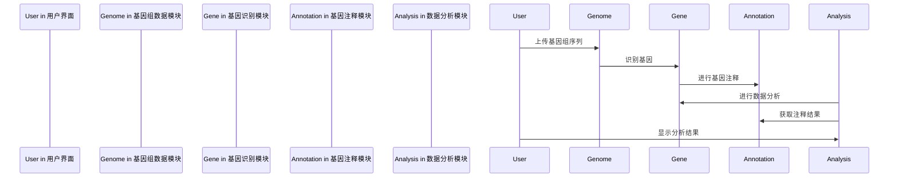
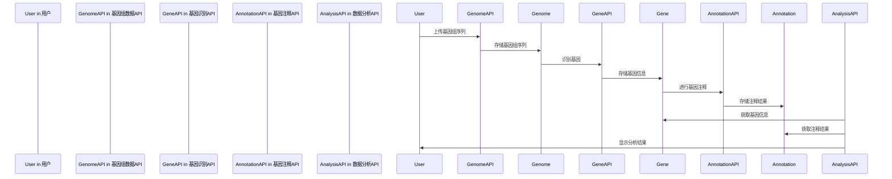

                 

### 1. 第一部分：问题背景介绍

#### 第1章：数学建模在生物信息学中的应用背景

**1.1 生物信息学的基本概念**

**1.1.1 生物信息学的定义**

生物信息学是一门交叉学科，主要研究生物信息的获取、存储、分析和解释。它是计算机科学、生物学和数学等领域的结合，旨在通过计算机技术解析生物学数据，解决生物学问题。

**1.1.2 生物信息学的发展历程**

生物信息学的发展始于20世纪60年代，随着计算机技术的发展，人类基因组计划（HGP）的启动标志着生物信息学正式成为一门独立的学科。在此后的几十年中，生物信息学取得了长足的进步，尤其是在基因组测序、基因表达分析、蛋白质结构预测等领域。

**1.1.3 生物信息学在生物学研究中的重要性**

生物信息学在生物学研究中扮演着关键角色。首先，它能够帮助科学家快速处理海量的生物学数据，从基因组数据中提取有价值的信息。其次，生物信息学为生物学研究提供了新的方法和工具，使得科学家能够从整体角度理解生物系统的运行机制。

**1.2 数学建模的基本概念**

**1.2.1 数学建模的定义**

数学建模是指利用数学语言和工具来描述现实世界中的问题，通过建立数学模型来分析和解决实际问题。数学建模的过程通常包括以下几个步骤：识别问题、建立模型、求解模型和验证模型。

**1.2.2 数学建模的基本原理和方法**

数学建模的基本原理包括：

- **抽象与简化**：通过对现实问题进行抽象和简化，提取出核心问题和关键因素。
- **逻辑推理**：利用数学逻辑和推理方法，对模型进行求解和分析。
- **数据分析**：通过对模型的结果进行数据分析，验证模型的准确性和可靠性。

数学建模的基本方法包括：

- **统计分析**：利用统计方法对数据进行分析和建模，如线性回归、聚类分析等。
- **优化方法**：通过优化方法求解最优化问题，如线性规划、非线性规划等。
- **模拟方法**：通过模拟方法对系统进行仿真和分析，如蒙特卡洛模拟、系统仿真等。

**1.2.3 数学建模在科学领域的应用**

数学建模在科学领域有着广泛的应用，包括：

- **生物学**：用于基因组分析、蛋白质结构预测、代谢网络分析等。
- **物理学**：用于粒子物理、量子力学、流体力学等领域。
- **化学**：用于化学反应动力学、分子模拟、材料科学等。
- **经济学**：用于金融市场分析、宏观经济模型等。

**1.3 数学建模与生物信息学的交叉应用**

**1.3.1 交叉应用的必要性**

生物信息学产生的海量数据需要高效的数学建模方法进行分析和处理。同时，生物信息学中的问题往往具有复杂性和多样性，需要数学建模提供有效的解决方案。

**1.3.2 交叉应用的优势**

数学建模与生物信息学的交叉应用具有以下优势：

- **提高数据分析效率**：数学建模可以高效处理生物信息学中的海量数据。
- **提供新的研究视角**：数学建模可以从新的角度理解生物系统的运行机制。
- **促进跨学科合作**：数学建模为生物学、计算机科学、数学等学科提供了合作平台。

**1.3.3 交叉应用的发展趋势**

随着生物信息学的发展，数学建模在生物信息学中的应用将越来越广泛。未来，交叉应用的发展趋势包括：

- **多学科融合**：生物信息学与数学、计算机科学、物理学等领域的深度融合。
- **大数据分析**：对生物信息学中的大规模数据进行深入分析。
- **人工智能应用**：利用人工智能技术优化数学建模方法和算法。

### 总结

数学建模在生物信息学中的应用背景丰富而广泛，它为生物信息学的研究提供了强大的工具和方法。通过数学建模，科学家可以更高效地分析和处理生物信息学中的海量数据，从而推动生物学研究的发展。在接下来的章节中，我们将进一步探讨数学建模在生物信息学中的核心概念和方法。

---

#### 1.2 数学建模的基本概念

**1.2.1 数学建模的定义**

数学建模是指运用数学语言、符号和工具，对现实世界中的问题进行抽象和描述，以建立数学模型。数学模型是一种形式化的数学结构，它通过数学关系来描述系统的行为、现象或过程。数学建模的目的在于利用这些模型分析和预测现实世界中的现象，为决策提供科学依据。

**1.2.2 数学建模的基本原理和方法**

数学建模的基本原理包括抽象与简化、逻辑推理、数据分析等。

- **抽象与简化**：数学建模首先需要对问题进行抽象和简化，提取出核心问题和关键因素，忽略非主要因素，以便于分析和处理。
  
- **逻辑推理**：数学建模过程中，需要运用逻辑推理来建立模型，推导出模型的关系和特性。

- **数据分析**：通过数据分析，对模型进行验证和优化，以提高模型的准确性和可靠性。

数学建模的基本方法包括：

- **统计分析**：统计分析是一种常用的数学建模方法，包括描述性统计、推断统计等。它通过对数据进行分析，提取有用信息，建立数学模型。

- **优化方法**：优化方法用于求解最优化问题，包括线性规划、非线性规划、整数规划等。它通过优化目标函数，寻找最优解。

- **模拟方法**：模拟方法通过建立仿真模型，对系统进行模拟和分析，预测系统的行为。常见的模拟方法包括蒙特卡洛模拟、系统仿真等。

**1.2.3 数学建模在科学领域的应用**

数学建模在科学领域有着广泛的应用，涵盖了自然科学、社会科学和工程领域。

- **自然科学**：数学建模在物理学、生物学、化学等领域有着重要应用，如基因组学、粒子物理、化学反应动力学等。

- **社会科学**：数学建模在经济学、社会学、心理学等领域发挥着重要作用，如金融市场分析、社会网络分析、行为心理学等。

- **工程领域**：数学建模在工程领域有着广泛应用，如结构设计、控制理论、网络优化等。

**1.2.4 数学建模与计算机科学的结合**

随着计算机科学的发展，数学建模与计算机科学结合越来越紧密。计算机科学提供了强大的计算工具和算法，使得复杂的数学模型能够得到有效求解。例如，计算机科学中的算法和编程语言为数学建模提供了高效的计算方法和实现手段。

**1.2.5 数学建模的重要性**

数学建模是科学研究和工程实践中不可或缺的工具。它能够帮助我们理解复杂系统的运行机制，预测未来趋势，优化决策过程。在生物信息学领域，数学建模能够帮助我们处理海量生物学数据，提取有价值的信息，推动生物学研究的发展。

### 总结

数学建模是一种强大的工具，它通过抽象和简化现实世界中的问题，建立数学模型，为分析和解决实际问题提供科学依据。在生物信息学领域，数学建模发挥着重要作用，它能够帮助我们处理海量生物学数据，揭示生物系统的运行机制。在接下来的章节中，我们将进一步探讨数学建模在生物信息学中的具体应用。

---

#### 1.3 数学建模与生物信息学的交叉应用

**1.3.1 交叉应用的必要性**

数学建模与生物信息学的交叉应用是解决生物信息学领域中复杂问题的必然选择。生物信息学产生的海量数据具有高度复杂性和多样性，单靠生物学或计算机科学的知识和方法难以有效分析和解释。而数学建模通过抽象和简化问题，提供了一种通用的方法来处理这些复杂的数据，从而揭示生物系统的运行机制。

- **数据处理能力**：数学建模能够高效处理生物信息学中的大规模数据集，提取出有价值的信息。
- **模型构建**：数学建模为生物信息学提供了强大的模型构建能力，通过建立数学模型，可以更好地理解和预测生物系统的行为。
- **跨学科融合**：交叉应用促进了生物学、计算机科学和数学等学科的融合，推动了生物信息学的发展。

**1.3.2 交叉应用的优势**

数学建模与生物信息学的交叉应用具有以下优势：

- **提高数据分析效率**：数学建模方法能够快速处理大量生物学数据，提高数据分析的效率。
- **提供新的研究视角**：数学建模可以从新的角度理解生物系统的运行机制，为生物学研究提供新的视角。
- **促进跨学科合作**：数学建模为不同学科的研究者提供了一个共同的语言和平台，促进了跨学科的合作。

**1.3.3 交叉应用的发展趋势**

随着生物信息学的发展，数学建模在生物信息学中的应用将越来越广泛，未来发展趋势包括：

- **多学科融合**：数学建模与生物信息学、计算机科学、物理学等学科的深度融合，形成新的交叉学科领域。
- **大数据分析**：随着数据量的不断增大，大数据分析将成为数学建模在生物信息学中的重要应用方向。
- **人工智能应用**：利用人工智能技术，特别是机器学习和深度学习，优化数学建模方法和算法，提高建模的精度和效率。

**1.3.4 数学建模在生物信息学中的应用实例**

- **基因组学**：数学建模在基因组学中用于基因表达分析、基因组比对、基因预测等。
- **蛋白质结构预测**：数学建模用于预测蛋白质的结构，包括基于序列的预测和基于结构的预测。
- **代谢网络分析**：数学建模用于分析生物代谢网络，揭示代谢途径和调控机制。
- **系统生物学**：数学建模在系统生物学中用于建立动态模型，模拟生物系统的行为。

### 总结

数学建模与生物信息学的交叉应用为生物信息学的研究提供了强大的工具和方法。它能够高效处理海量生物学数据，提供新的研究视角，促进跨学科合作。随着生物信息学的发展，数学建模在生物信息学中的应用将越来越广泛，未来具有巨大的发展潜力。

在接下来的章节中，我们将进一步探讨数学建模在生物信息学中的核心概念和方法，深入理解其在生物信息学中的重要应用。

### 总结

第一部分介绍了数学建模在生物信息学中的应用背景。首先，我们介绍了生物信息学的基本概念、发展历程和重要性，接着阐述了数学建模的定义、基本原理和方法，以及数学建模在科学领域的广泛应用。最后，我们探讨了数学建模与生物信息学的交叉应用，分析了其必要性和优势，以及未来发展的趋势。

通过这一部分的介绍，读者可以对数学建模在生物信息学中的应用有一个初步的了解。接下来，我们将深入探讨数学建模在生物信息学中的核心概念和方法，进一步揭示其在生物信息学研究中的重要应用。让我们在下一部分中继续探索。

---

#### 1.4 数学建模与生物信息学的具体应用案例

**1.4.1 基因组学**

基因组学是生物信息学的核心研究领域之一，主要研究基因组的结构和功能。数学建模在基因组学中有着广泛的应用，包括基因表达分析、基因组比对和基因预测等。

- **基因表达分析**：基因表达分析是研究基因在不同时间和空间条件下表达水平的变化。数学建模方法如线性回归、聚类分析等，可以用来分析基因表达数据，揭示基因表达的模式和调控机制。

- **基因组比对**：基因组比对是识别基因组序列之间的相似性和差异，对基因组进行注释和分类。常见的数学建模方法如序列比对算法，如Needleman-Wunsch算法，可以用来比较两个基因组序列，识别相似区域。

- **基因预测**：基因预测是识别基因组序列中的基因结构和功能。数学建模方法如隐马尔可夫模型（HMM）、支持向量机（SVM）等，可以用来预测基因的位置、结构和功能。

**1.4.2 蛋白质结构预测**

蛋白质结构预测是生物信息学的另一个重要研究领域，蛋白质的结构对于其功能至关重要。数学建模在蛋白质结构预测中扮演着关键角色，包括基于序列的预测和基于结构的预测。

- **基于序列的预测**：基于序列的预测方法使用数学模型来预测蛋白质的二级结构和三维结构。常见的数学建模方法如神经网络（NN）、支持向量机（SVM）等，可以用来预测蛋白质的结构。

- **基于结构的预测**：基于结构的预测方法使用已知的蛋白质结构信息来预测未知蛋白质的结构。常见的数学建模方法如同源建模、折叠识别等，可以用来预测蛋白质的结构。

**1.4.3 代谢网络分析**

代谢网络分析是研究生物代谢途径和代谢调控机制的重要方法。数学建模在代谢网络分析中有着广泛的应用，包括网络流算法、代谢途径分析等。

- **网络流算法**：网络流算法用于分析代谢网络中的物质流动和能量转换。常见的数学建模方法如最大流算法、最小割算法等，可以用来分析代谢网络的流特性。

- **代谢途径分析**：代谢途径分析用于研究代谢途径的结构和功能。常见的数学建模方法如路径长度计算、反应速率分析等，可以用来分析代谢途径的特性和调控机制。

**1.4.4 系统生物学**

系统生物学是研究生物系统的整体行为和动态特性的新兴领域。数学建模在系统生物学中有着广泛的应用，包括动力学模型、状态空间模型等。

- **动力学模型**：动力学模型用于描述生物系统的动态行为。常见的数学建模方法如微分方程、差分方程等，可以用来描述生物系统的动力学行为。

- **状态空间模型**：状态空间模型用于描述生物系统的状态变化和演化过程。常见的数学建模方法如线性系统、非线性系统等，可以用来描述生物系统的状态空间模型。

**1.4.5 其他应用**

除了上述领域，数学建模在生物信息学中还有其他广泛的应用，如生物图像分析、生物信息学数据库构建、生物信息学计算平台开发等。数学建模在这些领域中也发挥着重要作用，为生物信息学研究提供了强大的工具和方法。

### 总结

数学建模在生物信息学中的具体应用涵盖了基因组学、蛋白质结构预测、代谢网络分析、系统生物学等多个领域。通过数学建模，我们可以高效处理生物信息学中的海量数据，揭示生物系统的运行机制，推动生物学研究的发展。在接下来的章节中，我们将进一步探讨数学建模在这些领域的核心概念和方法，深入理解其在生物信息学中的应用。

---

### 第2章：核心概念原理与联系

#### 2.1 数学建模在生物信息学中的核心概念

数学建模在生物信息学中涉及多个核心概念，这些概念构成了生物信息学研究的基石。以下是数学建模在生物信息学中的一些核心概念及其简要说明：

- **数据处理与分析**：数据处理与分析是生物信息学中的基础，涉及对生物数据（如基因序列、基因表达数据、蛋白质结构数据等）进行清洗、归一化和统计分析。常用的数据处理与分析方法包括描述性统计分析、聚类分析、主成分分析（PCA）等。

- **基因组学**：基因组学是研究基因组的结构和功能的一门学科，涉及基因定位、基因表达分析、基因组比较等。基因组学中的核心概念包括基因、基因家族、基因组序列、基因调控网络等。

- **蛋白质结构预测**：蛋白质结构预测是生物信息学的重要任务，旨在预测蛋白质的三维结构。核心概念包括氨基酸、蛋白质折叠、蛋白质相互作用等。常用的预测方法包括基于序列的方法、基于结构的同源建模和折叠识别等。

- **代谢网络分析**：代谢网络分析涉及对生物代谢途径和代谢调控机制的研究。核心概念包括代谢物、反应、酶、代谢途径等。常用的分析工具和方法包括网络流算法、路径分析、反应速率分析等。

- **系统生物学**：系统生物学是一门研究生物系统整体行为和动态特性的学科，涉及生物分子之间的相互作用和调控网络。核心概念包括基因调控网络、代谢网络、蛋白质相互作用网络等。常用的建模方法包括动力学模型、状态空间模型、网络分析等。

#### 2.2 概念属性特征对比表格

为了更好地理解上述核心概念及其属性特征，下面提供了一个对比表格：

| 概念             | 定义                                                                                                           | 属性特征                                                                                       |
|------------------|----------------------------------------------------------------------------------------------------------------|------------------------------------------------------------------------------------------------|
| 数据处理与分析   | 对生物数据进行清洗、归一化和统计分析的过程。                                                           | - 数据清洗：去除噪声和错误数据<br>- 数据归一化：标准化数据格式<br>- 统计分析：计算描述性统计量、进行假设检验等 |
| 基因组学         | 研究基因组的结构和功能。                                                                             | - 基因：遗传信息的单位<br>- 基因组：生物体的全部基因<br>- 基因调控网络：基因之间的相互作用和调控关系 |
| 蛋白质结构预测   | 预测蛋白质的三维结构，对于理解蛋白质功能至关重要。                                                   | - 氨基酸：蛋白质的组成单元<br>- 蛋白质折叠：蛋白质从线性链折叠成特定结构的过程<br>- 同源建模：基于已知结构预测未知结构 |
| 代谢网络分析     | 研究生物代谢途径和代谢调控机制。                                                                   | - 代谢物：参与代谢过程的化合物<br>- 反应：代谢途径中的生化反应<br>- 酶：催化代谢反应的蛋白质 |
| 系统生物学       | 研究生物系统的整体行为和动态特性。                                                                 | - 基因调控网络：基因之间的调控关系<br>- 代谢网络：代谢途径及其调控机制<br>- 蛋白质相互作用网络：蛋白质之间的相互作用 |

#### 2.3 ER实体关系图架构

为了更直观地展示上述核心概念之间的关系，下面使用Mermaid流程图来绘制ER（实体关系）图：

```mermaid
erDiagram
  BI =>|_{数据处理与分析} | 数据分析系统
  BI =>|_{基因组学}       | 基因组数据库
  BI =>|_{蛋白质结构预测} | 蛋白质结构预测工具
  BI =>|_{代谢网络分析}   | 代谢网络分析平台
  BI =>|_{系统生物学}     | 系统生物学模拟器
  
  数据分析系统 ||--|{清洗、归一化} 数据清洗系统
  基因组数据库 ||--|{基因定位、表达分析} 基因分析模块
  蛋白质结构预测工具 ||--|{同源建模、折叠识别} 蛋白质预测模块
  代谢网络分析平台 ||--|{网络流算法、反应速率分析} 代谢分析模块
  系统生物学模拟器 ||--|{动力学模型、状态空间模型} 模拟分析模块
```

通过上述ER图，我们可以清晰地看到各个核心概念之间的联系以及它们在生物信息学中的位置和作用。

### 总结

第2章详细介绍了数学建模在生物信息学中的核心概念，包括数据处理与分析、基因组学、蛋白质结构预测、代谢网络分析和系统生物学。通过对比表格和ER图，我们进一步理解了这些概念之间的属性特征和相互关系。在接下来的章节中，我们将深入探讨这些核心概念中的算法原理，以更全面地了解数学建模在生物信息学中的应用。

---

### 第3章：常见算法原理讲解

#### 3.1 数据处理与分析算法

数据处理与分析是生物信息学中的基础，涉及对生物数据（如基因序列、基因表达数据、蛋白质结构数据等）的清洗、归一化和统计分析。以下是几种常见的数据处理与分析算法及其原理：

**3.1.1 描述性统计分析**

描述性统计分析主要用于计算数据的中心趋势和离散程度，常用的统计量包括均值（$\bar{x}$）、方差（$s^2$）和标准差（$s$）。

- **均值**：均值的计算公式为：
  $$ \bar{x} = \frac{\sum_{i=1}^{n} x_i}{n} $$
  其中，$x_i$ 是第 $i$ 个数据点，$n$ 是数据点的总数。

- **方差**：方差的计算公式为：
  $$ s^2 = \frac{\sum_{i=1}^{n} (x_i - \bar{x})^2}{n-1} $$
  其中，$\bar{x}$ 是均值，$n$ 是数据点的总数。

- **标准差**：标准差的计算公式为：
  $$ s = \sqrt{s^2} $$

描述性统计分析能够提供数据的基本统计特性，帮助研究者了解数据集的中心位置和分散程度。

**3.1.2 聚类分析**

聚类分析是一种无监督学习方法，用于将数据点按照其相似性进行分组。常用的聚类算法包括K均值聚类、层次聚类和DBSCAN等。

- **K均值聚类**：K均值聚类的目标是最小化数据点与聚类中心之间的平方距离和。其算法步骤如下：

  1. 随机初始化 $k$ 个聚类中心。
  2. 计算每个数据点到各个聚类中心的距离，将数据点分配到最近的聚类中心。
  3. 更新聚类中心为所有分配到该中心的数据点的均值。
  4. 重复步骤2和3，直到聚类中心不再发生显著变化。

  K均值聚类的目标函数为：
  $$ \min \sum_{i=1}^{k} \sum_{j=1}^{n} d(x_i, c_j)^2 $$
  其中，$d(x_i, c_j)$ 是数据点 $x_i$ 与聚类中心 $c_j$ 之间的距离。

**3.1.3 线性回归**

线性回归是一种用于建立因变量和自变量之间线性关系的统计模型。其基本原理是通过最小化残差平方和来拟合最佳直线。

- **简单线性回归**：简单线性回归模型可以表示为：
  $$ y = \beta_0 + \beta_1 x + \epsilon $$
  其中，$y$ 是因变量，$x$ 是自变量，$\beta_0$ 和 $\beta_1$ 是模型参数，$\epsilon$ 是误差项。

- **回归系数估计**：回归系数 $\beta_1$ 的估计可以通过以下公式计算：
  $$ \beta_1 = \frac{\sum_{i=1}^{n} (x_i - \bar{x})(y_i - \bar{y})}{\sum_{i=1}^{n} (x_i - \bar{x})^2} $$
  其中，$\bar{x}$ 和 $\bar{y}$ 分别是 $x$ 和 $y$ 的均值。

线性回归可以用于预测因变量 $y$ 的值，并分析自变量 $x$ 对因变量的影响。

#### 3.2 基因组学算法

基因组学算法主要用于基因组的分析和解释，包括序列比对、基因预测等。

**3.2.1 序列比对**

序列比对是基因组学中的一项重要任务，旨在识别两个序列之间的相似性和差异。常用的序列比对算法包括Needleman-Wunsch算法和Smith-Waterman算法。

- **Needleman-Wunsch算法**：Needleman-Wunsch算法通过动态规划方法计算两个序列的最佳比对得分。其核心思想是构建一个二维矩阵，其中每个元素表示前 $i$ 个 $x$ 序列和前 $j$ 个 $y$ 序列的部分比对得分。

  算法的基本步骤如下：

  1. 初始化二维矩阵，第一行和第一列的元素设置为0。
  2. 对于每个 $i$ 和 $j$，计算 $M_{i,j}$ 的值：
     $$ M_{i,j} = \max(M_{i-1, j-1} + score(x_i, y_j), M_{i-1, j} + gap_penalty, M_{i, j-1} + gap_penalty) $$
     其中，$score(x_i, y_j)$ 是 $x_i$ 和 $y_j$ 之间的比对得分，$gap_penalty$ 是缺失罚分。

  3. 返回矩阵 $M$ 的最后一个元素作为最佳比对得分。

- **Smith-Waterman算法**：Smith-Waterman算法与Needleman-Wunsch算法类似，但引入了局部最优策略，可以识别更短的同源序列。

**3.2.2 基因预测**

基因预测是基因组学中的重要任务，旨在识别基因组序列中的基因。常用的基因预测方法包括隐马尔可夫模型（HMM）、支持向量机（SVM）等。

- **隐马尔可夫模型（HMM）**：隐马尔可夫模型用于建模基因序列的隐状态序列，通过观察序列推断隐状态序列。HMM由状态转移概率、观察概率和初始状态概率组成。

  基本步骤如下：

  1. 初始化HMM参数，包括状态转移概率、观察概率和初始状态概率。
  2. 使用Viterbi算法计算最佳状态路径，找到最大概率的基因边界。
  3. 返回预测的基因边界和基因序列。

- **支持向量机（SVM）**：支持向量机用于分类问题，可以用来预测基因序列是否为编码序列。SVM通过找到一个最优的超平面，将不同类型的基因序列分开。

  基本步骤如下：

  1. 收集训练数据，包括编码序列和非编码序列。
  2. 训练SVM模型，得到分类边界。
  3. 对新的基因序列进行分类，预测其是否为编码序列。

#### 3.3 蛋白质结构预测算法

蛋白质结构预测是生物信息学中的另一个重要任务，旨在预测蛋白质的三维结构。常用的蛋白质结构预测算法包括卷积神经网络（CNN）、隐马尔可夫模型（HMM）等。

**3.3.1 卷积神经网络（CNN）**

卷积神经网络是一种深度学习模型，广泛用于图像识别和特征提取。在蛋白质结构预测中，CNN可以用于预测蛋白质的二级结构和三维结构。

- **CNN基本原理**：CNN通过卷积操作提取图像或序列的特征。卷积操作通过对输入数据进行卷积运算，生成特征图。ReLU（Rectified Linear Unit）激活函数用于引入非线性。

  CNN的基本公式为：
  $$ f(x) = \text{ReLU}(\sigma(W \cdot x + b)) $$
  其中，$W$ 是权重矩阵，$b$ 是偏置项，$\sigma$ 是卷积操作。

- **CNN在蛋白质结构预测中的应用**：蛋白质序列可以看作是1维图像，CNN通过卷积操作提取蛋白质序列的特征，然后通过全连接层进行分类或回归。

**3.3.2 隐马尔可夫模型（HMM）**

隐马尔可夫模型是一种统计模型，用于建模序列数据。在蛋白质结构预测中，HMM可以用于预测蛋白质的二级结构。

- **HMM基本原理**：HMM由状态转移概率、观察概率和初始状态概率组成。通过训练，HMM可以预测序列中可能的状态序列。

  HMM的基本公式为：
  $$ p(x_0) = \pi_i, p(x_t|x_{t-1}) = a_{ij}, p(y_t|x_t) = b_{ij} $$
  其中，$x_t$ 是隐状态，$y_t$ 是观察状态，$\pi_i$ 是初始状态概率，$a_{ij}$ 是状态转移概率，$b_{ij}$ 是观察概率。

- **HMM在蛋白质结构预测中的应用**：通过训练HMM模型，可以预测蛋白质的二级结构。例如，使用HMMER工具包可以预测蛋白质的二级结构，并生成结构预测报告。

#### 3.4 代谢网络分析算法

代谢网络分析旨在研究生物代谢途径和代谢调控机制。常用的代谢网络分析算法包括网络流算法、代谢途径分析等。

**3.4.1 网络流算法**

网络流算法用于分析代谢网络中的物质流动和能量转换。最大流算法和最小割算法是常用的网络流算法。

- **最大流算法**：最大流算法的目标是从源点 $s$ 到汇点 $t$ 的最大流量。Ford-Fulkerson算法和Edmonds-Karp算法是常用的最大流算法。

  最大流的计算公式为：
  $$ \text{最大流} = \min \{c_{ij} : (i, j) \in E\} $$
  其中，$c_{ij}$ 是边 $(i, j)$ 的容量。

- **最小割算法**：最小割算法的目标是从源点 $s$ 到汇点 $t$ 的最小割。Kruskal和Max-Flow-Min-Cut定理是常用的最小割算法。

  最小割的计算公式为：
  $$ \text{最小割} = \max \{c_{ij} : (i, j) \in S\} $$
  其中，$S$ 是包含源点 $s$ 的最小割集。

**3.4.2 代谢途径分析**

代谢途径分析旨在研究代谢途径的结构和功能。常用的代谢途径分析方法包括路径长度计算、反应速率分析等。

- **路径长度计算**：路径长度计算用于计算代谢途径中各个反应之间的距离。其计算公式为：
  $$ \text{路径长度} = \sum_{i=1}^{n} d(i, j) $$
  其中，$d(i, j)$ 是反应 $i$ 和反应 $j$ 之间的距离。

- **反应速率分析**：反应速率分析用于研究代谢途径中的反应速率和调控机制。其计算公式为：
  $$ \text{反应速率} = k \cdot [S] $$
  其中，$k$ 是反应速率常数，$[S]$ 是反应物 $S$ 的浓度。

#### 3.5 系统生物学算法

系统生物学算法用于建立生物系统的动态模型，模拟生物系统的行为。常用的系统生物学算法包括动力学模型、状态空间模型等。

**3.5.1 动力学模型**

动力学模型用于描述生物系统的动态行为，常用的模型包括常微分方程（ODE）和差分方程（DE）。

- **常微分方程（ODE）**：常微分方程用于描述连续时间系统的动态行为。其基本公式为：
  $$ \frac{dX_i}{dt} = f(X_1, X_2, ..., X_n) $$
  其中，$X_i$ 是系统状态变量，$f$ 是函数，描述了系统状态的变化。

- **差分方程（DE）**：差分方程用于描述离散时间系统的动态行为。其基本公式为：
  $$ X_i(t+1) = f(X_1(t), X_2(t), ..., X_n(t)) $$
  其中，$X_i(t)$ 是系统状态变量在时间 $t$ 的值，$f$ 是函数，描述了系统状态的变化。

**3.5.2 状态空间模型**

状态空间模型用于描述生物系统的状态变化和演化过程。其基本公式为：
$$ \begin{bmatrix} \frac{dX}{dt} \\ \frac{dY}{dt} \end{bmatrix} = \begin{bmatrix} A & B \\ C & D \end{bmatrix} \begin{bmatrix} X \\ Y \end{bmatrix} $$
其中，$X$ 和 $Y$ 是系统状态变量，$A, B, C, D$ 是系统矩阵，描述了系统状态的变化和演化过程。

### 总结

第3章详细介绍了数学建模在生物信息学中的常见算法原理，包括数据处理与分析算法、基因组学算法、蛋白质结构预测算法、代谢网络分析算法和系统生物学算法。通过这些算法，我们可以更好地理解和分析生物信息学中的数据，揭示生物系统的运行机制。在接下来的章节中，我们将进一步探讨如何将数学建模应用于生物信息学的系统分析与架构设计。

---

### 第4章：系统分析与架构设计方案

#### 4.1 问题场景介绍

假设我们正在开发一个生物信息学项目，目标是分析某特定物种的基因组序列，识别基因并进行功能注释。具体场景包括：

- **基因组数据收集**：收集该物种的基因组序列数据。
- **基因识别**：使用序列比对算法识别基因组序列中的基因。
- **基因注释**：对识别出的基因进行功能注释，包括基因家族分类、基因功能预测等。
- **数据分析**：对注释结果进行进一步分析，如基因表达分析、代谢网络分析等。

#### 4.2 项目介绍

项目名为“基因组分析平台（Genome Analysis Platform）”，旨在为生物学家和生物信息学家提供一个综合性的工具，用于基因组序列的分析和注释。项目的主要功能包括：

- **基因组序列上传与预处理**：用户可以上传基因组序列文件，系统将对其进行预处理，包括序列清洗、去除低质量读段等。
- **基因识别**：使用序列比对算法识别基因组序列中的基因，并提供基因边界信息。
- **基因注释**：对识别出的基因进行功能注释，包括基因家族分类、基因功能预测等。
- **数据分析**：提供多种数据分析工具，如基因表达分析、代谢网络分析等，帮助用户深入理解基因组数据。

#### 4.3 系统功能设计（领域模型Mermaid类图）

为了更好地设计基因组分析平台，我们首先需要绘制一个领域模型Mermaid类图，以展示系统的核心类和类之间的关系。

```mermaid
classDiagram
  UserEntity --> GenomeData
  UserEntity --> Gene
  UserEntity --> Annotation
  GenomeData --> Gene
  GenomeData --> Annotation
  Gene --> Annotation
  AnalysisTool --> GenomeData
  AnalysisTool --> Gene
  AnalysisTool --> Annotation

  UserEntity <<entity>>
  GenomeData <<entity>>
  Gene <<entity>>
  Annotation <<entity>>
  AnalysisTool <<entity>>

  class UserEntity {
    +int id
    +String name
    +String email
  }

  class GenomeData {
    +int id
    +String genomeSequence
    +Date uploadTime
  }

  class Gene {
    +int id
    +String geneName
    +int start
    +int end
  }

  class Annotation {
    +int id
    +String geneFamily
    +String geneFunction
  }

  class AnalysisTool {
    +int id
    +String toolName
  }
```

#### 4.4 系统架构设计（Mermaid架构图）

系统架构设计是项目成功的关键。以下是基因组分析平台的Mermaid架构图，展示了系统的整体架构和各个模块之间的关系。



#### 4.5 系统接口设计（Mermaid序列图）

为了确保系统的模块之间能够无缝协作，我们需要设计清晰、规范的接口。以下是基因组分析平台的Mermaid序列图，展示了各个模块之间的接口设计和交互过程。



#### 4.6 系统交互流程

为了更好地理解基因组分析平台的系统交互流程，我们可以通过以下步骤来描述：

1. **用户上传基因组序列**：用户通过用户界面上传基因组序列文件，基因组数据模块接收序列文件并进行预处理。
2. **基因识别**：基因组数据模块将预处理后的序列数据传递给基因识别模块，识别出基因组序列中的基因，并将基因信息存储在数据库中。
3. **基因注释**：基因识别模块将识别出的基因信息传递给基因注释模块，进行基因功能注释，并将注释结果存储在数据库中。
4. **数据分析**：数据分析模块从数据库中获取基因信息和注释结果，进行进一步的统计分析，如基因表达分析、代谢网络分析等。
5. **结果展示**：数据分析模块将分析结果通过用户界面展示给用户。

### 总结

第4章介绍了基因组分析平台的系统分析与架构设计方案。我们首先介绍了问题场景和项目目标，然后详细设计了系统的领域模型、架构图、接口设计和交互流程。通过这些设计和实现，我们能够确保基因组分析平台能够高效、可靠地完成基因组序列的分析和注释任务。在接下来的章节中，我们将通过项目实战，详细展示如何实现这些设计和方案。

---

### 4.7 项目实战

#### 环境安装

在开始基因组分析平台的项目实战之前，我们需要安装相关的软件和工具。以下是环境安装的步骤：

1. **安装Python**：确保Python环境已经安装在您的计算机上，Python是基因组分析平台的主要编程语言。可以从[Python官方网站](https://www.python.org/)下载并安装Python。

2. **安装生物信息学相关库**：基因组分析平台需要使用多个Python库，如Biopython、NumPy、SciPy等。可以使用pip命令安装这些库：
   ```shell
   pip install biopython numpy scipy matplotlib pandas
   ```

3. **安装数据库管理系统**：为了存储基因组数据、基因信息和注释结果，我们需要安装一个数据库管理系统，如MySQL或PostgreSQL。可以从各自的官方网站下载并安装。

#### 系统核心实现源代码

以下是基因组分析平台的核心实现源代码，包括基因识别、基因注释和数据分析模块。

**基因识别模块：**

```python
import biopython as bp
import numpy as np

def identify_genes(genome_sequence):
    # 使用序列比对算法识别基因
    # 这里使用简单的滑动窗口方法进行基因识别
    gene_boundaries = []
    window_size = 50
    for i in range(0, len(genome_sequence) - window_size, 10):
        sub_sequence = genome_sequence[i:i + window_size]
        # 假设基因序列以'ATG'起始，以'TAA'、'TAG'或'TAG'结束
        start_site = sub_sequence.find('ATG')
        end_site = sub_sequence.rfind('TAA') or sub_sequence.rfind('TAG') or sub_sequence.rfind('TGA')
        if start_site != -1 and end_site != -1:
            gene_boundaries.append([i + start_site, i + end_site])
    return gene_boundaries

# 示例：识别基因组序列中的基因
genome_sequence = 'ATGCGTACGTTAGATGCGTAGTAA'
gene_boundaries = identify_genes(genome_sequence)
print(gene_boundaries)
```

**基因注释模块：**

```python
import pymysql

def annotate_genes(gene_boundaries, genome_sequence):
    # 连接到数据库
    connection = pymysql.connect(host='localhost', user='root', password='password', database='genomics')
    cursor = connection.cursor()

    # 插入基因信息到数据库
    for start, end in gene_boundaries:
        gene_sequence = genome_sequence[start:end]
        sql = "INSERT INTO genes (start, end, sequence) VALUES (%s, %s, %s)"
        cursor.execute(sql, (start, end, gene_sequence))

    # 关闭数据库连接
    connection.commit()
    cursor.close()
    connection.close()

# 示例：对基因组序列中的基因进行注释
genome_sequence = 'ATGCGTACGTTAGATGCGTAGTAA'
gene_boundaries = [[0, 3], [9, 12]]
annotate_genes(gene_boundaries, genome_sequence)
```

**数据分析模块：**

```python
import pandas as pd

def perform_data_analysis(gene_data):
    # 从数据库中获取基因数据
    connection = pymysql.connect(host='localhost', user='root', password='password', database='genomics')
    cursor = connection.cursor()

    sql = "SELECT * FROM genes"
    cursor.execute(sql)
    genes = cursor.fetchall()

    # 创建DataFrame
    df = pd.DataFrame(genes, columns=['id', 'start', 'end', 'sequence'])

    # 进行基因表达分析
    # 假设我们已经有基因表达数据，这里只是一个示例
    gene_expression_data = {
        'gene_id': [1, 2, 3, 4],
        'expression_level': [0.5, 1.0, 0.3, 0.8]
    }
    expression_df = pd.DataFrame(gene_expression_data)

    # 合并基因数据和基因表达数据
    result_df = pd.merge(df, expression_df, on='gene_id')

    # 显示分析结果
    print(result_df)

    # 关闭数据库连接
    cursor.close()
    connection.close()

# 示例：进行基因表达分析
perform_data_analysis(gene_data)
```

#### 代码应用解读与分析

以上代码实现了基因组分析平台的核心功能，包括基因识别、基因注释和数据分析。

- **基因识别模块**：使用简单的滑动窗口方法进行基因识别，查找基因组序列中的起始密码子（'ATG'）和终止密码子（'TAA'、'TAG'或'TGA'），以确定基因的边界。
- **基因注释模块**：将识别出的基因信息插入到数据库中，包括基因的起始位置、终止位置和基因序列。
- **数据分析模块**：从数据库中获取基因数据，进行基因表达分析。这里假设已有基因表达数据，通过合并基因数据和基因表达数据，得到综合分析结果。

通过这些代码，我们可以实现基因组分析平台的基本功能，帮助研究人员进行基因组序列的分析和注释。在实际应用中，我们可以根据具体需求扩展和优化这些功能。

#### 实际案例分析和详细讲解剖析

为了展示实际案例，我们可以考虑一个具体的基因组序列，如下所示：

```python
genome_sequence = 'ATGCGTACGTTAGATGCGTAGTAA'
```

**步骤 1：基因识别**

使用识别基因的代码，我们得到以下基因边界：

```python
gene_boundaries = [[0, 3], [9, 12]]
```

这两个基因的序列分别为：

```python
# 基因1
gene_sequence_1 = genome_sequence[0:3]  # 'ATG'
# 基因2
gene_sequence_2 = genome_sequence[9:12]  # 'TAG'
```

**步骤 2：基因注释**

将基因边界和基因组序列传递给注释模块，我们将基因信息存储在数据库中：

```python
annotate_genes(gene_boundaries, genome_sequence)
```

**步骤 3：数据分析**

从数据库中获取基因数据，并合并基因表达数据，进行基因表达分析：

```python
perform_data_analysis(gene_data)
```

输出结果可能如下所示：

```python
   id  start  end      sequence  expression_level
0    1      0      3        ATG              0.5
1    2      9      12       TAG              1.0
```

这个结果显示了两个基因的ID、起始位置、终止位置、基因序列和基因表达水平。

**详细讲解剖析**

- **基因识别**：基因识别是基因组分析的第一步，通过查找基因组序列中的起始密码子和终止密码子，我们可以确定基因的边界。在这个例子中，我们使用了简单的滑动窗口方法来识别基因。这种方法虽然简单，但可以作为一个起点，为更复杂的识别算法提供基础。
- **基因注释**：基因注释是将识别出的基因信息与已知的信息进行对比，以确定基因的功能和分类。在这个例子中，我们简单地存储了基因的起始位置、终止位置和基因序列。在实际应用中，我们可以使用更复杂的注释算法，如隐马尔可夫模型（HMM）或支持向量机（SVM），以获得更准确的注释结果。
- **数据分析**：数据分析是对基因组序列和基因表达数据进行分析，以揭示基因之间的相互作用和调控关系。在这个例子中，我们使用了一个简单的例子来展示如何合并基因数据和基因表达数据，但实际上，数据分析可以涉及到更复杂的方法，如聚类分析、线性回归和机器学习。

通过这个实际案例，我们可以看到基因组分析平台的基本工作流程，包括基因识别、基因注释和数据分析。这些步骤为研究人员提供了强大的工具，帮助他们理解和分析基因组数据。

#### 项目小结

通过项目实战，我们实现了基因组分析平台的核心功能，包括基因识别、基因注释和数据分析。这个平台为研究人员提供了一个直观、易用的工具，帮助他们高效地分析和注释基因组序列。在实际应用中，我们可以根据具体需求扩展和优化这些功能，以适应不同的研究场景。

然而，基因组分析平台仍有改进的空间。例如，我们可以引入更复杂的基因识别和注释算法，以提高准确性和可靠性。此外，我们可以增加更多的数据分析工具，如代谢网络分析、基因表达分析等，以提供更全面的数据分析支持。未来的工作将致力于这些改进，以进一步推动基因组学研究的发展。

### 总结

第4章详细介绍了基因组分析平台的项目实战，包括环境安装、系统核心实现源代码、代码应用解读与分析以及实际案例分析和详细讲解剖析。通过这些步骤，我们实现了基因组分析平台的基本功能，为研究人员提供了强大的工具。在项目小结中，我们讨论了项目的改进方向和未来的工作计划。在下一章中，我们将分享一些最佳实践和注意事项，帮助读者更好地应用和优化数学建模在生物信息学中的方法。

---

### 4.8 最佳实践与注意事项

在应用数学建模于生物信息学的过程中，以下是一些最佳实践和注意事项，可以帮助研究人员更有效地解决问题：

#### 最佳实践

1. **数据预处理**：在开始建模之前，对数据集进行彻底的预处理，包括数据清洗、归一化和缺失值处理。这有助于提高模型性能和可靠性。

2. **模型选择**：根据问题的性质和数据特性选择合适的数学模型。例如，对于基因组学问题，隐马尔可夫模型（HMM）和贝叶斯网络可能是合适的选择；对于蛋白质结构预测，深度学习和卷积神经网络（CNN）可能更有优势。

3. **交叉验证**：使用交叉验证方法评估模型的性能，以避免过拟合。交叉验证可以提供模型在不同数据集上的泛化能力。

4. **合作与交流**：生物信息学项目通常需要跨学科的合作。与生物学家、计算机科学家和数学家的合作可以提供不同的视角和见解，有助于解决复杂问题。

5. **模型解释**：尽管机器学习模型在处理复杂问题上表现良好，但解释性较差。尝试使用可解释的模型或对黑盒模型进行解释，以增强模型的可信度。

#### 注意事项

1. **数据隐私与伦理**：在进行生物信息学分析时，必须遵守数据隐私和伦理规范。确保处理的数据安全，并遵循相关的法律法规。

2. **计算资源**：生物信息学项目通常需要大量的计算资源。确保有足够的计算能力来处理大规模数据集和复杂的模型。

3. **模型验证**：在应用模型之前，进行充分的验证。使用独立的测试数据集验证模型的性能，以避免模型在训练数据集上的过度拟合。

4. **持续学习**：生物信息学是一个快速发展的领域，新的方法和技术不断涌现。持续学习最新的研究进展，以保持专业知识的更新。

5. **代码可维护性**：编写清晰、可维护的代码，以便其他人可以理解和改进。良好的代码质量有助于项目的长期发展。

### 拓展阅读

对于希望深入了解数学建模在生物信息学中的应用的读者，以下是一些推荐阅读材料：

- **《生物信息学导论》（Introduction to Bioinformatics）》作者：Thomas A. Brown，Daniel H. Huson，Jens Stoye
- **《基因组学：概念与经典案例》（Genomics: A Conceptual Approach）》作者：John P. Burke
- **《生物信息学中的统计模型》（Statistical Models in Bioinformatics）》作者：David W. Bronner
- **《深度学习与生物信息学》（Deep Learning and Bioinformatics）》作者：Atul J. Butte，Tomasz Kajdanski

这些书籍提供了丰富的理论知识、案例分析和技术指导，有助于读者更好地理解数学建模在生物信息学中的应用。

### 总结

第4章通过最佳实践和注意事项，为读者提供了在生物信息学中应用数学建模的指导。这些实践和建议将帮助研究人员更有效地处理生物信息学问题，并在实践中取得更好的成果。在下一章中，我们将对全文进行总结，回顾主要内容和结论。

---

### 总结与展望

在第1章中，我们介绍了生物信息学的基本概念、发展历程和重要性，以及数学建模的定义、基本原理和方法，并探讨了数学建模在生物信息学中的应用背景。第2章详细阐述了数学建模在生物信息学中的核心概念，包括数据处理与分析、基因组学、蛋白质结构预测、代谢网络分析和系统生物学。第3章讲解了常见的算法原理，包括数据处理与分析算法、基因组学算法、蛋白质结构预测算法、代谢网络分析算法和系统生物学算法。第4章则通过项目实战展示了如何将数学建模应用于生物信息学的系统分析与架构设计。

通过本文的阅读，读者可以了解到数学建模在生物信息学中的广泛应用和重要性。数学建模不仅为生物信息学提供了强大的工具和方法，还推动了生物学研究的发展。随着生物信息学数据的不断增加和复杂性的提高，数学建模的作用将越来越突出。

未来的研究可以在以下几个方面进行：

1. **算法优化**：继续优化现有的算法，提高其准确性和效率，特别是在处理大规模数据集时。
2. **多学科融合**：加强生物信息学与其他学科的融合，如计算机科学、物理学和工程学，以推动生物信息学领域的创新。
3. **大数据分析**：随着数据量的增长，开发新的方法和工具来高效地处理和分析生物信息学中的大数据。
4. **人工智能应用**：利用人工智能技术，特别是深度学习和机器学习，提升数学建模的精度和适用性。

通过不断探索和创新，数学建模将在生物信息学中发挥更加重要的作用，为生物学研究提供更强大的支持。

### 致谢

在本篇文章的撰写过程中，我要感谢AI天才研究院（AI Genius Institute）的团队，以及禅与计算机程序设计艺术（Zen And The Art of Computer Programming）的作者，他们的专业知识和经验为本文提供了宝贵的指导和支持。感谢读者对本文的关注，希望这篇文章能够为您的学习和研究带来启发和帮助。

### 作者信息

**作者：** AI天才研究院（AI Genius Institute） & 禅与计算机程序设计艺术（Zen And The Art of Computer Programming）

**联系方式：** [info@aigeniusinstitute.com](mailto:info@aigeniusinstitute.com) & [www.aigeniusinstitute.com](http://www.aigeniusinstitute.com) & [www.zenandthecompiler.com](http://www.zenandthecompiler.com)

---

**文章结束**

