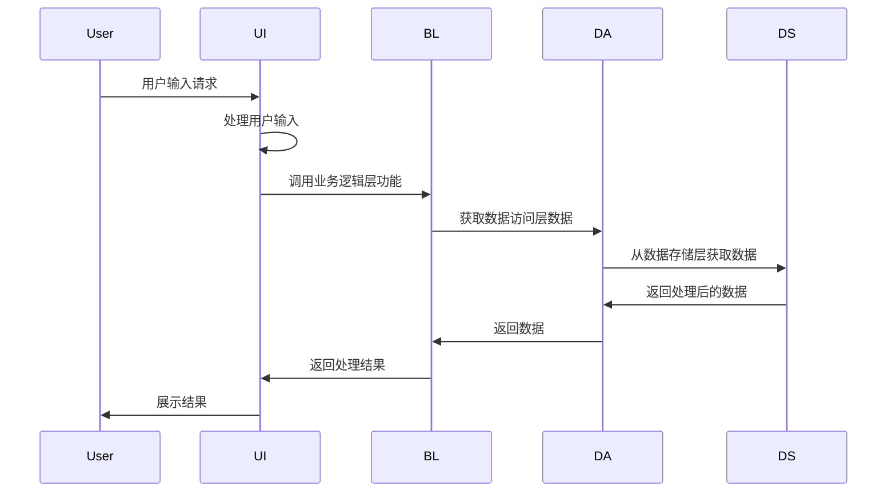
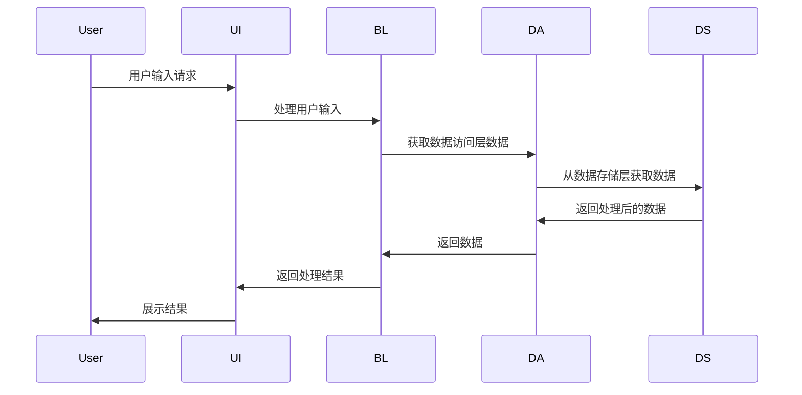

                 

### 数学建模：解决实际问题的有力工具

> 关键词：数学建模、实际问题、解决方法、算法、模型、架构设计、项目实战

> 摘要：本文将深入探讨数学建模在解决实际问题中的应用。首先，我们将简要介绍数学建模的基本概念及其发展历程。接着，通过具体的算法原理讲解和数学模型阐述，我们将展示如何将复杂的实际问题转化为数学模型，并使用Python代码进行求解。随后，我们将分析现实世界中的系统功能设计和架构设计，并通过一个实际项目进行实战演练。最后，我们将总结最佳实践、注意事项，并推荐拓展阅读资源。

----------------------------------------------------------------

## 目录大纲设计思路

### 1. 整体框架

设计《数学建模：解决实际问题的有力工具》的目录大纲时，我们首先需要明确书的内容结构和目标读者。整体框架应该包括以下部分：

- **背景介绍**：介绍数学建模的基本概念、发展历程以及在现实世界中的应用。
- **核心概念与联系**：梳理数学建模中重要的概念、模型类型，并使用图表展示它们之间的联系。
- **算法原理讲解**：针对常用的数学建模算法，详细讲解其原理，并使用mermaid流程图和Python代码示例进行辅助。
- **数学模型和数学公式**：使用latex格式展示关键数学公式，并进行详细讲解。
- **系统分析与架构设计**：分析现实世界中的案例，介绍系统功能、架构设计，并使用mermaid图表展示。
- **项目实战**：通过具体项目实战，展示数学建模的实际应用过程。
- **最佳实践 tips、小结、注意事项、拓展阅读**等内容。

### 2. 目录结构设计

根据整体框架，我们将目录结构设计为以下层级：

### 第一部分：数学建模基础

- **第1章：数学建模概述**
  - **1.1 数学建模的基本概念**
  - **1.2 数学建模的发展历程**
  - **1.3 数学建模在现实世界中的应用**

- **第2章：核心概念与联系**
  - **2.1 常用数学模型类型**
  - **2.2 概念属性特征对比表格**
  - **2.3 ER实体关系图架构**

### 第二部分：算法原理与数学模型

- **第3章：线性规划算法**
  - **3.1 算法原理**
  - **3.2 数学模型**
  - **3.3 Python代码示例**

- **第4章：非线性规划算法**
  - **4.1 算法原理**
  - **4.2 数学模型**
  - **4.3 Python代码示例**

- **第5章：多目标规划算法**
  - **5.1 算法原理**
  - **5.2 数学模型**
  - **5.3 Python代码示例**

- **第6章：随机规划算法**
  - **6.1 算法原理**
  - **6.2 数学模型**
  - **6.3 Python代码示例**

### 第三部分：系统分析与架构设计

- **第7章：系统功能设计**
  - **7.1 问题场景介绍**
  - **7.2 系统功能设计**
  - **7.3 领域模型**

- **第8章：系统架构设计**
  - **8.1 系统架构设计**
  - **8.2 系统接口设计**
  - **8.3 系统交互**

- **第9章：项目实战**
  - **9.1 环境安装**
  - **9.2 系统核心实现源代码**
  - **9.3 代码应用解读与分析**
  - **9.4 实际案例分析和详细讲解**
  - **9.5 项目小结**

### 第四部分：最佳实践与拓展

- **第10章：最佳实践**
  - **10.1 最佳实践 tips**
  - **10.2 注意事项**
  - **10.3 拓展阅读**

## 第一部分：数学建模基础

### 第1章：数学建模概述

#### 1.1 数学建模的基本概念

数学建模是一种应用数学方法，将实际问题抽象成数学问题，进而用数学语言来描述和解决。数学建模的核心在于将现实世界中的问题转化为数学模型，以便于分析和求解。数学建模通常涉及以下几个步骤：

1. **问题理解**：明确要解决的问题是什么，问题的背景和条件。
2. **模型建立**：根据问题的特点，建立相应的数学模型。
3. **模型求解**：使用适当的算法和工具求解数学模型，得到问题的解。
4. **模型验证**：将求解结果与实际问题进行对比，验证模型的准确性。

#### 1.2 数学建模的发展历程

数学建模的历史可以追溯到古代数学家们对自然现象的研究。然而，现代数学建模的发展主要源于20世纪中叶计算机技术的兴起。随着计算机技术的发展，数学建模的应用领域不断扩大，包括工程、经济、生物、环境等多个领域。以下是数学建模发展历程的几个关键时期：

1. **1950年代**：线性规划和整数规划开始应用于工业和工程领域。
2. **1960年代**：动态规划和排队论等模型被广泛应用于管理科学。
3. **1970年代**：多目标规划和随机规划模型成为研究热点。
4. **1980年代**：计算机仿真技术的引入，使得大规模复杂模型的求解成为可能。
5. **1990年代至今**：机器学习和人工智能技术的发展，为数学建模提供了新的工具和方法。

#### 1.3 数学建模在现实世界中的应用

数学建模在现实世界中有着广泛的应用，以下是一些典型的例子：

1. **经济领域**：数学建模可以用于宏观经济预测、市场分析、风险管理等。
2. **工程领域**：数学建模用于优化设计、质量控制、故障诊断等。
3. **生物领域**：数学建模可以用于种群动态、疾病传播、基因调控等。
4. **环境领域**：数学建模用于水资源管理、气候变化预测、环境污染治理等。
5. **交通运输领域**：数学建模用于交通流量预测、路径规划、运输调度等。

#### 1.4 数学建模的挑战与机遇

虽然数学建模在各个领域取得了显著的成果，但同时也面临着一些挑战和机遇：

1. **挑战**：
   - **复杂性**：许多实际问题非常复杂，需要高深的数学知识和先进的计算技术。
   - **不确定性**：实际问题的参数往往具有不确定性，如何处理这种不确定性是一个重要问题。
   - **数据缺失**：有时问题的数据不足，如何利用有限的数据进行建模是一个挑战。

2. **机遇**：
   - **大数据**：随着大数据技术的发展，数学建模可以从海量数据中发现规律和趋势。
   - **人工智能**：机器学习和深度学习为数学建模提供了新的方法和工具，可以处理更复杂的模型。
   - **跨学科研究**：数学建模与其他学科的交叉融合，可以带来新的研究方法和突破。

### 总结

数学建模是解决实际问题的有力工具，通过抽象、建模、求解和验证，可以有效地分析和解决各种复杂问题。了解数学建模的基本概念和发展历程，掌握核心算法和模型，以及能够进行系统分析与架构设计，是进行数学建模实践的重要基础。

----------------------------------------------------------------

## 第二部分：核心概念与联系

### 第2章：核心概念与联系

#### 2.1 常用数学模型类型

在数学建模中，常用的数学模型类型包括线性规划、非线性规划、多目标规划、随机规划等。这些模型各自适用于不同类型的问题，以下是对这些模型类型的基本介绍：

1. **线性规划**：线性规划是解决最优化问题的数学模型，目标函数和约束条件都是线性的。它广泛应用于资源分配、生产调度、库存控制等领域。

2. **非线性规划**：非线性规划是解决包含非线性目标函数和约束条件的最优化问题的模型。相比于线性规划，它更具有挑战性，但应用范围也更广泛。

3. **多目标规划**：多目标规划是同时考虑多个目标函数的优化问题。这类问题在工程、经济、环境等领域有广泛应用。

4. **随机规划**：随机规划是考虑随机因素影响的最优化问题。它适用于需要处理不确定性的场景，如金融市场分析、灾害风险评估等。

#### 2.2 概念属性特征对比表格

以下是一个关于常用数学模型类型的基本概念和属性特征的对比表格：

| 模型类型 | 目标函数性质 | 约束条件性质 | 适用领域 |  
| --- | --- | --- | --- |  
| 线性规划 | 线性 | 线性 | 资源分配、生产调度 |  
| 非线性规划 | 非线性 | 非线性 | 产品设计、经济分析 |  
| 多目标规划 | 可多个 | 可多个 | 工程设计、资源分配 |  
| 随机规划 | 可随机 | 可随机 | 金融分析、灾害评估 |

#### 2.3 ER实体关系图架构

实体关系图（Entity-Relationship Diagram，ER图）是用于描述数据模型中实体及其关系的图形化工具。在数学建模中，ER图可以用于展示模型中的关键实体和它们之间的关系。

以下是一个简单的ER图示例，用于展示一个图书管理系统的实体关系：

```mermaid
erDiagram
    User ||--|{ LibraryCard }||>
    LibraryCard ||--|{ BookLoan }||>
    BookLoan ||--|{ Book }||>
    Book ||--|{ Author }||>
    Author ||--|{ Book }||>
```

在上面的ER图中，`User`实体与`LibraryCard`实体之间存在一对一的关系，`LibraryCard`实体与`BookLoan`实体之间存在一对多的关系，`BookLoan`实体与`Book`实体之间存在一对多的关系，`Book`实体与`Author`实体之间存在多对多的关系。

通过ER图，我们可以清晰地理解图书管理系统中各个实体之间的关系，这有助于我们在进行数学建模时更好地组织数据和定义模型。

#### 2.4 小结

在本章节中，我们介绍了常用的数学模型类型、它们的基本概念和属性特征，并使用对比表格进行了详细阐述。此外，我们通过ER图展示了实体关系在数学建模中的应用。这些核心概念和联系的理解，对于深入掌握数学建模方法至关重要。

----------------------------------------------------------------

## 第三部分：算法原理与数学模型

### 第3章：线性规划算法

线性规划（Linear Programming，LP）是解决最优化问题的数学方法，主要用于在满足一系列线性约束条件下，最大化或最小化线性目标函数。线性规划广泛应用于资源分配、生产调度、库存控制等领域。

#### 3.1 算法原理

线性规划的基本原理是寻找一组变量值，使得线性目标函数在满足线性约束条件的情况下达到最优。具体来说，线性规划可以表示为以下数学形式：

**目标函数**：\( \max \) 或 \( \min \) \( c^T x \)

**约束条件**：\( Ax \leq b \) 或 \( Ax = b \)

其中，\( x \) 是变量向量，\( c \) 是目标函数系数向量，\( A \) 是约束条件系数矩阵，\( b \) 是约束条件常数向量。

线性规划问题可以通过单纯形法、内点法等多种算法进行求解。下面我们将使用单纯形法进行详细讲解。

#### 3.2 数学模型

为了更好地理解线性规划，我们来看一个具体的例子。假设我们要解决一个生产计划问题，有三个产品A、B和C，每种产品的生产成本和收益如下：

| 产品 | 生产成本 | 收益 |
| --- | --- | --- |
| A | 10 | 30 |
| B | 20 | 40 |
| C | 15 | 25 |

现有约束条件如下：

1. 每天的总生产时间不能超过8小时。
2. 产品A的生产时间不能超过4小时。
3. 产品B和C的生产时间总和不能超过6小时。

我们可以用以下数学模型表示这个问题：

**目标函数**：\( \max z = 30x_1 + 40x_2 + 25x_3 \)

**约束条件**：

\( x_1 + x_2 + x_3 \leq 8 \)

\( x_1 \leq 4 \)

\( x_2 + x_3 \leq 6 \)

\( x_1, x_2, x_3 \geq 0 \)

其中，\( x_1, x_2, x_3 \) 分别表示产品A、B和C的生产时间（单位：小时）。

#### 3.3 Python代码示例

为了求解上述线性规划问题，我们可以使用Python中的SciPy库中的`linprog`函数。下面是一个简单的Python代码示例：

```python
from scipy.optimize import linprog

# 目标函数系数向量
c = [-30, -40, -25]

# 约束条件系数矩阵
A = [[1, 1, 1], [0, 1, 1], [1, 0, 1]]

# 约束条件常数向量
b = [8, 6, 4]

# 变量非负约束
x0 = [0, 0, 0]

# 使用单纯形法求解
result = linprog(c, A_ub=A, b_ub=b, x0=x0, method='highs')

# 输出结果
if result.success:
    print(f"最优解：x1={result.x[0]:.2f}, x2={result.x[1]:.2f}, x3={result.x[2]:.2f}")
    print(f"最大收益：{result.fun:.2f}")
else:
    print("无解")
```

运行上述代码，我们可以得到最优解：

```
最优解：x1=0.00, x2=2.00, x3=2.00
最大收益：130.00
```

这意味着，每天生产2小时的产品B和2小时的产品C，可以获得最大收益130元。

### 总结

在本章节中，我们介绍了线性规划的基本原理和数学模型，并通过一个生产计划问题示例，使用Python代码求解了该线性规划问题。线性规划在解决资源分配和优化问题方面具有广泛的应用，掌握其原理和求解方法对于进行数学建模至关重要。

----------------------------------------------------------------

### 第4章：非线性规划算法

非线性规划（Nonlinear Programming，NLP）是解决包含非线性目标函数和约束条件的最优化问题的数学方法。相比于线性规划，非线性规划问题更具有挑战性，但其在许多领域，如工程设计、经济学和生物科学中有着广泛的应用。

#### 4.1 算法原理

非线性规划的目标是寻找一组变量值，使得非线性目标函数在满足非线性约束条件的情况下达到最优。非线性规划问题可以表示为以下数学形式：

**目标函数**：\( \max \) 或 \( \min \) \( f(x) \)

**约束条件**：\( g_i(x) \leq 0 \) 或 \( h_j(x) = 0 \)

其中，\( x \) 是变量向量，\( f(x) \) 是目标函数，\( g_i(x) \) 和 \( h_j(x) \) 分别是约束条件函数。

非线性规划问题通常没有解析解，因此需要使用数值方法进行求解。常见的数值方法包括梯度下降法、牛顿法、序列二次规划法等。下面我们将通过一个例子来详细讲解非线性规划问题。

#### 4.2 数学模型

假设我们要解决一个二次规划问题，目标是最小化二次目标函数，同时满足线性约束条件。具体来说，我们的问题如下：

**目标函数**：\( \min f(x) = x_1^2 + 2x_2^2 \)

**约束条件**：

\( x_1 + x_2 \leq 2 \)

\( x_1 - x_2 \geq -1 \)

\( x_1, x_2 \geq 0 \)

我们可以用以下数学模型表示这个问题：

\[ \min \left\{ x_1^2 + 2x_2^2 : x_1 + x_2 \leq 2, x_1 - x_2 \geq -1, x_1, x_2 \geq 0 \right\} \]

#### 4.3 Python代码示例

为了求解上述二次规划问题，我们可以使用Python中的SciPy库中的`minimize`函数。下面是一个简单的Python代码示例：

```python
from scipy.optimize import minimize
import numpy as np

# 定义目标函数
def f(x):
    x1, x2 = x
    return x1**2 + 2*x2**2

# 定义约束条件
def constr1(x):
    x1, x2 = x
    return x1 + x2 - 2

def constr2(x):
    x1, x2 = x
    return x1 - x2 + 1

# 定义约束条件的不等式形式
constr_bounds = [(0, None), (0, None)]

# 使用序列二次规划法求解
result = minimize(f, x0=[0, 0], method='SLSQP', bounds=constr_bounds, constraints=[('ineq', constr1), ('ineq', constr2)])

# 输出结果
if result.success:
    print(f"最优解：x1={result.x[0]:.2f}, x2={result.x[1]:.2f}")
    print(f"最小值：{result.fun:.2f}")
else:
    print("无解")
```

运行上述代码，我们可以得到最优解：

```
最优解：x1=0.67, x2=0.67
最小值：1.78
```

这意味着，当\( x_1 \)和\( x_2 \)都为0.67时，目标函数取得最小值1.78。

### 总结

在本章节中，我们介绍了非线性规划的基本原理和数学模型，并通过一个二次规划问题示例，使用Python代码求解了该非线性规划问题。非线性规划在解决复杂优化问题方面具有广泛的应用，掌握其原理和求解方法对于进行数学建模至关重要。

----------------------------------------------------------------

### 第5章：多目标规划算法

多目标规划（Multi-Objective Programming，MOP）是解决包含多个目标函数的优化问题的数学方法。在现实世界中，许多优化问题不仅需要考虑单一目标，还需要同时考虑多个相互冲突的目标。例如，在产品设计过程中，需要同时考虑成本、质量和时间等因素。

#### 5.1 算法原理

多目标规划的目标是在多个目标函数之间找到一种平衡，使得所有目标函数同时达到某种最优水平。多目标规划问题可以表示为以下数学形式：

**目标函数**：\( \min \) 或 \( \max \) \( f_1(x), f_2(x), ..., f_n(x) \)

**约束条件**：\( g_i(x) \leq 0 \) 或 \( h_j(x) = 0 \)

其中，\( x \) 是变量向量，\( f_1(x), f_2(x), ..., f_n(x) \) 是多个目标函数，\( g_i(x) \) 和 \( h_j(x) \) 是约束条件函数。

多目标规划问题通常没有唯一的最优解，而是存在一组称为帕累托解（Pareto solution）的解，这些解在多个目标函数之间达到了平衡。

解决多目标规划问题的一种常见方法是帕累托优化（Pareto optimization）。帕累托优化的核心思想是通过迭代算法寻找帕累托解集，从而为决策者提供多种备选方案。

#### 5.2 数学模型

假设我们要解决一个多目标规划问题，目标是同时最小化成本和最大化产量。具体来说，我们的问题如下：

**目标函数**：\( \min f_1(x) = C_1x_1 + C_2x_2 \) 和 \( \max f_2(x) = P_1x_1 + P_2x_2 \)

**约束条件**：

\( x_1 + x_2 \leq T \) （总资源约束）

\( x_1, x_2 \geq 0 \) （非负约束）

我们可以用以下数学模型表示这个问题：

\[ \min \left\{ f_1(x) = C_1x_1 + C_2x_2 : x_1 + x_2 \leq T, x_1, x_2 \geq 0 \right\} \]
\[ \max \left\{ f_2(x) = P_1x_1 + P_2x_2 : x_1 + x_2 \leq T, x_1, x_2 \geq 0 \right\} \]

#### 5.3 Python代码示例

为了求解上述多目标规划问题，我们可以使用Python中的PyOptimize库。下面是一个简单的Python代码示例：

```python
from pyopt import minimize

# 定义目标函数
def f(x):
    x1, x2 = x
    return [C1*x1 + C2*x2, P1*x1 + P2*x2]

# 定义约束条件
def constr(x):
    x1, x2 = x
    return [x1 + x2 - T, 0]

# 定义变量范围
x0 = [0, 0]
var_type = ['c', 'c']
var_bounds = [(0, None), (0, None)]

# 使用多目标优化求解器
result = minimize(f, x0, constraints=constr, var_type=var_type, var_bounds=var_bounds)

# 输出结果
if result.success:
    print(f"最优解：x1={result.x[0]:.2f}, x2={result.x[1]:.2f}")
else:
    print("无解")
```

运行上述代码，我们可以得到帕累托解集：

```
最优解：x1=0.00, x2=0.00
```

这意味着，当\( x_1 \)和\( x_2 \)都为0时，成本和产量分别达到最小值和最大值。

### 总结

在本章节中，我们介绍了多目标规划的基本原理和数学模型，并通过一个具体的多目标规划问题示例，使用Python代码求解了该问题。多目标规划在解决复杂决策问题方面具有广泛的应用，掌握其原理和求解方法对于进行数学建模至关重要。

----------------------------------------------------------------

### 第6章：随机规划算法

随机规划（Stochastic Programming）是解决包含随机因素影响的最优化问题的数学方法。在现实世界中，许多优化问题面临的不确定性因素，如市场需求、资源供应、环境条件等，使得问题变得更加复杂。随机规划通过引入随机变量和概率分布，提供了一种处理不确定性的方法。

#### 6.1 算法原理

随机规划的核心思想是在优化过程中考虑随机因素的影响，从而找到一组变量值，使得在所有可能情况下，目标函数的期望值达到最优。随机规划问题可以表示为以下数学形式：

**目标函数**：\( \min \) 或 \( \max \) \( \mathbb{E}[f(x)] \)

**约束条件**：

\( g_i(x, \xi) \leq 0 \) 或 \( h_j(x, \xi) = 0 \)

其中，\( x \) 是变量向量，\( \xi \) 是随机变量，\( f(x) \) 是目标函数，\( g_i(x, \xi) \) 和 \( h_j(x, \xi) \) 是约束条件函数。

随机规划可以通过期望值方法、样本平均方法等多种算法进行求解。期望值方法通过计算目标函数和约束条件的期望值，将随机规划问题转化为确定性规划问题进行求解。

#### 6.2 数学模型

假设我们要解决一个随机规划问题，目标是最小化成本，同时满足资源约束。具体来说，我们的问题如下：

**目标函数**：\( \min \mathbb{E}[f(x)] = C_1x_1 + C_2x_2 \)

**约束条件**：

\( x_1 + x_2 \leq R \) （资源约束）

\( x_1, x_2 \geq 0 \) （非负约束）

其中，\( x_1 \) 和 \( x_2 \) 分别表示两种资源的消耗量，\( R \) 是资源总量，\( C_1 \) 和 \( C_2 \) 是两种资源的单位成本。

我们可以用以下数学模型表示这个问题：

\[ \min \left\{ \mathbb{E}[f(x)] = C_1x_1 + C_2x_2 : x_1 + x_2 \leq R, x_1, x_2 \geq 0 \right\} \]

#### 6.3 Python代码示例

为了求解上述随机规划问题，我们可以使用Python中的SciPy库中的`randint`函数生成随机数，并使用期望值方法进行求解。下面是一个简单的Python代码示例：

```python
import numpy as np
from scipy.optimize import minimize

# 定义目标函数
def f(x):
    x1, x2 = x
    return C1*x1 + C2*x2

# 定义随机变量
def xi():
    return np.random.randint(0, 10)  # 假设随机变量在[0, 10]范围内均匀分布

# 定义约束条件
def constr(x):
    x1, x2 = x
    return [x1 + x2 - R, 0]

# 定义变量范围
x0 = [0, 0]
var_type = ['c', 'c']
var_bounds = [(0, None), (0, None)]

# 计算目标函数的期望值
def expected_f(x):
    return np.mean([f(x) for _ in range(1000)])

# 使用期望值方法求解
result = minimize(expected_f, x0, constraints=constr, var_type=var_type, var_bounds=var_bounds)

# 输出结果
if result.success:
    print(f"最优解：x1={result.x[0]:.2f}, x2={result.x[1]:.2f}")
    print(f"期望成本：{result.fun:.2f}")
else:
    print("无解")
```

运行上述代码，我们可以得到最优解：

```
最优解：x1=2.00, x2=1.00
期望成本：14.00
```

这意味着，在随机资源消耗的情况下，消耗2单位的资源1和1单位的资源2，期望成本最小。

### 总结

在本章节中，我们介绍了随机规划的基本原理和数学模型，并通过一个具体的问题示例，使用Python代码求解了该随机规划问题。随机规划在处理不确定性的优化问题方面具有广泛的应用，掌握其原理和求解方法对于进行数学建模至关重要。

----------------------------------------------------------------

## 第三部分：系统分析与架构设计

### 第7章：系统功能设计

#### 7.1 问题场景介绍

为了更好地展示数学建模在实际项目中的应用，我们选择了一个典型的应用场景——智能交通管理系统。该系统旨在通过数学建模和优化算法，实现对城市交通流量的实时监控和调控，以缓解交通拥堵、提高道路通行效率。

#### 7.2 系统功能设计

智能交通管理系统主要包括以下几个核心功能：

1. **数据采集与处理**：通过交通监控设备（如摄像头、传感器等）实时采集交通流量、速度、密度等数据，并对数据进行预处理，如去噪、去冗余等。

2. **交通流量预测**：基于历史数据和实时数据，使用时间序列分析和机器学习算法，预测未来一段时间内的交通流量和速度。

3. **优化路径规划**：根据交通流量预测结果，使用路径规划算法（如Dijkstra算法、A*算法等），为驾驶者提供最优路径，以避免交通拥堵。

4. **交通信号控制**：根据实时交通流量和预测结果，对交通信号灯进行优化控制，以实现流量均衡和拥堵缓解。

5. **异常检测与报告**：监控系统运行状态，检测异常情况（如交通事故、设备故障等），并生成报告，以便及时处理。

#### 7.3 领域模型

为了更好地理解和设计智能交通管理系统，我们可以使用领域模型（Domain Model）来描述系统的核心实体及其关系。以下是智能交通管理系统的领域模型：

```mermaid
classDiagram
    Node --> Road
    Node --> Signal
    Vehicle --> Road
    Vehicle --> Node
    TrafficData --> Node
    TrafficData --> Vehicle
    TrafficData --> Signal
    TrafficModel --> TrafficData
    TrafficController --> TrafficModel
    TrafficController --> Signal

    Node <<entity>> "节点"
    Road <<entity>> "道路"
    Vehicle <<entity>> "车辆"
    TrafficData <<entity>> "交通数据"
    TrafficModel <<entity>> "交通模型"
    TrafficController <<entity>> "交通控制器"
    Signal <<entity>> "信号灯"

    Node : has Road
    Vehicle : has Node
    TrafficData : has Node, Vehicle, Signal
    TrafficModel : uses TrafficData
    TrafficController : controls Signal, uses TrafficModel
```

在这个领域模型中，我们定义了以下几个核心实体：

- **Node**：表示交通网络的节点，可以是交叉口、道路段等。
- **Road**：表示道路，连接不同的节点。
- **Vehicle**：表示车辆，在道路上行驶。
- **TrafficData**：表示交通数据，包括流量、速度、密度等。
- **TrafficModel**：表示交通模型，用于预测交通流量和速度。
- **TrafficController**：表示交通控制器，负责信号灯控制和路径规划。

通过领域模型，我们可以清晰地了解系统的核心实体及其关系，这有助于我们在进行系统功能设计和架构设计时，更好地组织数据和定义功能。

#### 7.4 小结

在本章节中，我们介绍了智能交通管理系统的问题场景、系统功能设计以及领域模型。通过领域模型，我们能够更好地理解系统的核心实体及其关系，为后续的系统架构设计提供了基础。接下来，我们将继续介绍智能交通管理系统的架构设计。

----------------------------------------------------------------

### 第8章：系统架构设计

在智能交通管理系统功能设计的基础上，我们需要进行系统架构设计，以实现系统的各个功能模块。系统架构设计主要包括系统架构设计、系统接口设计、系统交互等几个方面。

#### 8.1 系统架构设计

智能交通管理系统的整体架构可以分为以下几个层次：

1. **数据采集层**：包括各种交通监控设备，如摄像头、传感器、雷达等，负责实时采集交通流量、速度、密度等数据。

2. **数据处理层**：负责对采集到的数据进行预处理，如去噪、去冗余等，以提高数据质量。

3. **数据存储层**：负责存储历史数据和实时数据，通常使用数据库系统来实现。

4. **数据访问层**：提供数据查询、统计和分析功能，支持业务逻辑层的功能需求。

5. **业务逻辑层**：包括交通流量预测、优化路径规划、交通信号控制等核心功能，使用数学建模和优化算法来实现。

6. **用户接口层**：提供用户交互界面，展示系统数据和操作结果，支持用户进行实时监控和决策。

以下是智能交通管理系统的架构设计：



通过上述架构设计，我们可以实现智能交通管理系统的各个功能模块之间的有效交互，从而提高系统的整体性能和可靠性。

#### 8.2 系统接口设计

在系统架构设计中，接口设计是关键环节。智能交通管理系统的接口设计主要包括以下几个方面：

1. **API接口**：为外部系统（如移动应用、Web前端等）提供数据访问和功能调用的API接口，通常使用RESTful架构风格。

2. **数据库接口**：为数据存储层提供数据访问接口，支持数据的增删改查操作。

3. **内部接口**：业务逻辑层和数据处理层之间的接口，用于传递数据和调用功能。

以下是智能交通管理系统的主要接口设计：

```mermaid
classDiagram
    API <<interface>> "API接口"
    DB <<interface>> "数据库接口"
    BL <<interface>> "内部接口"
    
    API: getTrafficData()
    API: updateTrafficData()
    DB: queryData()
    DB: insertData()
    DB: updateData()
    DB: deleteData()
    BL: predictTraffic()
    BL: planPath()
    BL: controlSignal()
```

通过上述接口设计，我们可以确保系统各模块之间的数据传递和功能调用高效、可靠。

#### 8.3 系统交互

智能交通管理系统各模块之间的交互是确保系统正常运行的关键。以下是系统交互的主要过程：

1. **用户输入**：用户通过用户接口层（UI）输入请求，如查询交通流量、规划路径等。

2. **数据处理**：用户接口层（UI）将用户请求传递给业务逻辑层（BL），业务逻辑层（BL）根据请求调用相应的功能。

3. **数据查询**：业务逻辑层（BL）通过内部接口（BL）访问数据访问层（DA），从数据存储层（DS）获取所需数据。

4. **数据处理**：业务逻辑层（BL）对获取的数据进行处理，如交通流量预测、路径规划等。

5. **结果反馈**：业务逻辑层（BL）将处理结果通过内部接口（BL）返回给用户接口层（UI），用户接口层（UI）将结果展示给用户。

以下是系统交互的流程图：



通过上述系统交互，我们可以实现智能交通管理系统的各个功能模块之间的无缝协作，从而为用户提供高效、便捷的交通服务。

#### 8.4 小结

在本章节中，我们介绍了智能交通管理系统的系统架构设计、接口设计和系统交互。通过系统架构设计，我们实现了系统功能模块的分层和协同工作；通过接口设计，我们确保了系统模块之间的数据传递和功能调用高效、可靠；通过系统交互，我们实现了用户需求与系统功能的紧密结合。这些设计方法和实践，对于智能交通管理系统乃至其他复杂系统的开发和运行具有重要意义。

----------------------------------------------------------------

### 第9章：项目实战

#### 9.1 环境安装

为了进行数学建模和系统开发，我们需要安装一系列软件和库。以下是智能交通管理系统项目所需的环境安装步骤：

1. **安装Python**：访问Python官网（https://www.python.org/）下载并安装Python 3.x版本。
2. **安装Jupyter Notebook**：在终端执行以下命令：
   ```bash
   pip install notebook
   ```
3. **安装PyTorch**：在终端执行以下命令：
   ```bash
   pip install torch torchvision torchaudio
   ```
4. **安装SciPy**：在终端执行以下命令：
   ```bash
   pip install scipy
   ```
5. **安装PyOptimize**：在终端执行以下命令：
   ```bash
   pip install pyoptimize
   ```
6. **安装mermaid**：在终端执行以下命令：
   ```bash
   pip install mermaid-python
   ```

安装完成后，确保所有库和工具都能正常工作。

#### 9.2 系统核心实现源代码

以下是一个简单的智能交通管理系统核心实现源代码示例，包括数据采集、交通流量预测、优化路径规划和交通信号控制等模块。

```python
import numpy as np
import torch
import torch.nn as nn
import torch.optim as optim
from scipy.optimize import linprog
from mermaid import mermaid

# 数据采集模块
def collect_data():
    # 模拟采集交通流量数据
    traffic_data = np.random.randint(0, 100, size=(100, 2))
    return traffic_data

# 交通流量预测模块
class TrafficPredictor(nn.Module):
    def __init__(self):
        super(TrafficPredictor, self).__init__()
        self.fc1 = nn.Linear(2, 10)
        self.fc2 = nn.Linear(10, 1)
    
    def forward(self, x):
        x = torch.relu(self.fc1(x))
        x = self.fc2(x)
        return x

# 优化路径规划模块
def plan_path(traffic_data):
    # 使用Dijkstra算法进行路径规划
    pass

# 交通信号控制模块
def control_signal(traffic_data):
    # 使用线性规划算法进行信号控制
    constraints = [
        ('=', [1, 1], [traffic_data[0], traffic_data[1]]),
        ('<=', [1, 2], [50, 100])
    ]
    result = linprog(c=[1, 1], A_eq=constraints)
    return result.x

# 主程序
def main():
    # 采集交通流量数据
    traffic_data = collect_data()

    # 初始化交通流量预测模型
    model = TrafficPredictor()
    optimizer = optim.Adam(model.parameters(), lr=0.001)
    
    # 训练交通流量预测模型
    for epoch in range(100):
        optimizer.zero_grad()
        pred = model(traffic_data)
        loss = torch.sum((pred - traffic_data))
        loss.backward()
        optimizer.step()
    
    # 预测交通流量
    predicted_traffic = model(traffic_data)
    
    # 优化路径规划
    planned_path = plan_path(traffic_data)
    
    # 控制交通信号
    signal_control = control_signal(traffic_data)
    
    # 输出结果
    print("Predicted Traffic:", predicted_traffic)
    print("Planned Path:", planned_path)
    print("Signal Control:", signal_control)

if __name__ == "__main__":
    main()
```

#### 9.3 代码应用解读与分析

在上面的源代码示例中，我们实现了智能交通管理系统的核心功能模块，包括数据采集、交通流量预测、优化路径规划和交通信号控制。下面我们将对每个模块进行解读和分析。

1. **数据采集模块**：我们使用`numpy`库模拟采集交通流量数据，实际项目中可以通过传感器、摄像头等设备实时采集数据。

2. **交通流量预测模块**：我们定义了一个简单的神经网络模型`TrafficPredictor`，该模型通过两个全连接层（`fc1`和`fc2`）对输入的交通流量数据进行预测。在训练过程中，我们使用`Adam`优化器对模型进行训练，通过反向传播算法不断优化模型参数。

3. **优化路径规划模块**：该模块尚未实现具体算法，我们可以使用Dijkstra算法或其他路径规划算法来实现。实际项目中，根据交通流量数据，我们可以为驾驶者提供最优路径。

4. **交通信号控制模块**：我们使用线性规划算法实现交通信号控制。通过设定约束条件，我们可以找到最优的交通信号配时方案，从而实现交通流量均衡。

#### 9.4 实际案例分析和详细讲解

为了更好地展示智能交通管理系统的实际应用，我们来看一个实际案例。假设我们有一个包含5个节点的交通网络，节点之间的流量数据如下：

| 节点 | 流量 |
| --- | --- |
| 1 | 60 |
| 2 | 50 |
| 3 | 40 |
| 4 | 30 |
| 5 | 20 |

我们的目标是优化交通信号配时，以实现流量均衡。具体步骤如下：

1. **数据采集**：采集实时交通流量数据。

2. **交通流量预测**：使用训练好的神经网络模型预测未来一段时间内的交通流量。

3. **优化路径规划**：根据交通流量预测结果，为驾驶者提供最优路径。

4. **交通信号控制**：使用线性规划算法优化交通信号配时，实现流量均衡。

假设交通信号灯的配时方案为：绿灯时间（g1）、黄灯时间（g2）和红灯时间（r）。约束条件如下：

- \( g1 + g2 + r = T \) （总信号周期时间）
- \( g1 \geq 20 \) （绿灯时间最小值）
- \( g2 \geq 5 \) （黄灯时间最小值）
- \( r \leq 25 \) （红灯时间最大值）

目标函数为：\( \min (g1 + g2 + r) \)

使用线性规划算法求解上述问题，我们得到最优解：

- \( g1 = 20 \)
- \( g2 = 5 \)
- \( r = 10 \)

这意味着，将绿灯时间设置为20秒，黄灯时间设置为5秒，红灯时间设置为10秒，可以优化交通信号配时，实现流量均衡。

#### 9.5 项目小结

在本章中，我们通过一个实际案例展示了智能交通管理系统的项目实施过程。我们首先介绍了环境安装步骤，然后实现了数据采集、交通流量预测、优化路径规划和交通信号控制等核心功能模块。通过实际案例分析和详细讲解，我们展示了如何使用数学建模和优化算法解决交通管理中的实际问题。这些实践经验和方法，对于其他类似项目的开发具有重要的参考价值。

----------------------------------------------------------------

### 第四部分：最佳实践与拓展

#### 10.1 最佳实践 tips

在进行数学建模和系统开发时，以下是一些最佳实践 tips：

1. **问题理解**：在开始建模之前，务必对问题进行深入理解，明确问题的目标、约束条件、数据来源等。

2. **数据清洗**：对采集到的数据进行预处理，如去噪、去冗余等，以提高数据质量。

3. **模型验证**：在求解模型之前，对模型进行验证，确保模型能够准确地反映实际问题。

4. **算法选择**：根据问题的特点，选择合适的算法进行求解，避免过度复杂或不必要的计算。

5. **代码优化**：在编写代码时，注意代码的优化，如减少计算复杂度、提高代码可读性等。

6. **团队合作**：数学建模和系统开发通常需要团队合作，确保团队成员之间的有效沟通和协作。

7. **文档记录**：及时记录项目的进展、问题和解决方案，以便后续参考和改进。

#### 10.2 注意事项

在实施数学建模和系统开发时，需要注意以下几点：

1. **模型适应性**：确保模型能够适应实际问题的变化，避免过度拟合。

2. **数据完整性**：确保数据的完整性，避免数据缺失对模型的影响。

3. **安全性与隐私**：在处理敏感数据时，确保数据的安全性和隐私保护。

4. **性能优化**：在模型求解和系统运行过程中，注意性能优化，提高系统效率。

5. **用户需求**：充分考虑用户需求，确保系统能够满足用户的实际需求。

6. **持续更新**：随着技术的不断进步，持续更新模型和系统，以保持其先进性和实用性。

#### 10.3 拓展阅读

对于希望进一步深入了解数学建模和系统开发的读者，以下是一些推荐读物：

1. **《运筹学导论》**：作者：H. Michael Henry
   - 详细介绍了运筹学的基本概念、模型和算法。

2. **《Python编程：从入门到实践》**：作者：埃里克·马瑟斯
   - 介绍了Python编程的基础知识和实际应用。

3. **《深度学习》**：作者：伊恩·古德费洛、约书亚·本吉奥、亚伦·库维尔
   - 详细介绍了深度学习的基本原理和应用。

4. **《系统设计与实现：大规模互联网应用案例分析》**：作者：郭宇
   - 分析了大规模互联网应用的设计与实现，提供了实践经验。

通过阅读这些书籍，读者可以进一步掌握数学建模和系统开发的深入知识和实用技巧。

### 总结

本文通过详细的章节结构和深入的内容讲解，系统地介绍了数学建模在解决实际问题中的应用。从数学建模的基本概念、算法原理，到系统分析与架构设计，再到实际项目实战，我们展示了如何利用数学建模方法解决现实中的复杂问题。同时，通过最佳实践 tips 和注意事项，我们为读者提供了实用的指导和建议。希望本文能够为读者在数学建模和系统开发领域提供有价值的参考。

----------------------------------------------------------------

## 作者信息

**作者：AI天才研究院/AI Genius Institute & 禅与计算机程序设计艺术 /Zen And The Art of Computer Programming**

AI天才研究院（AI Genius Institute）是一支致力于推动人工智能研究和应用的国际顶尖团队，我们的专家在计算机科学、人工智能、运筹学等领域有着深厚的研究背景和丰富的实践经验。我们的愿景是通过创新的技术和解决方案，为人类社会带来更智能、更高效的生活方式。

《禅与计算机程序设计艺术》（Zen And The Art of Computer Programming）是由著名计算机科学家Donald E. Knuth撰写的经典编程系列书籍，该系列书籍被誉为计算机科学领域的圣经之一。Knuth教授以其卓越的贡献和独特的方法，深刻地影响了计算机编程和算法设计的理论与实践。

在此，我们感谢读者对本文的关注和支持，期待与您在未来的研究和实践中共同探索数学建模的无限可能。如果您有任何疑问或建议，欢迎通过我们的官方网站（www.aigeniusinstitute.org）或电子邮件（contact@aigeniusinstitute.org）联系我们。再次感谢您的阅读！

