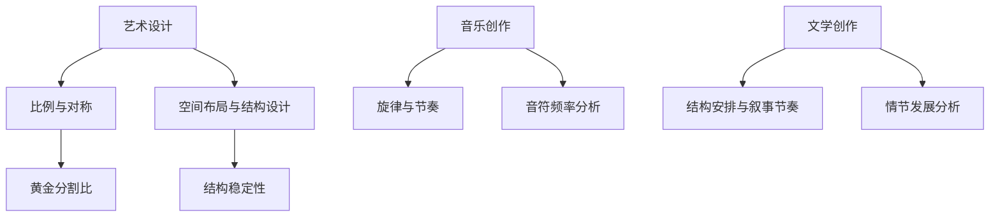
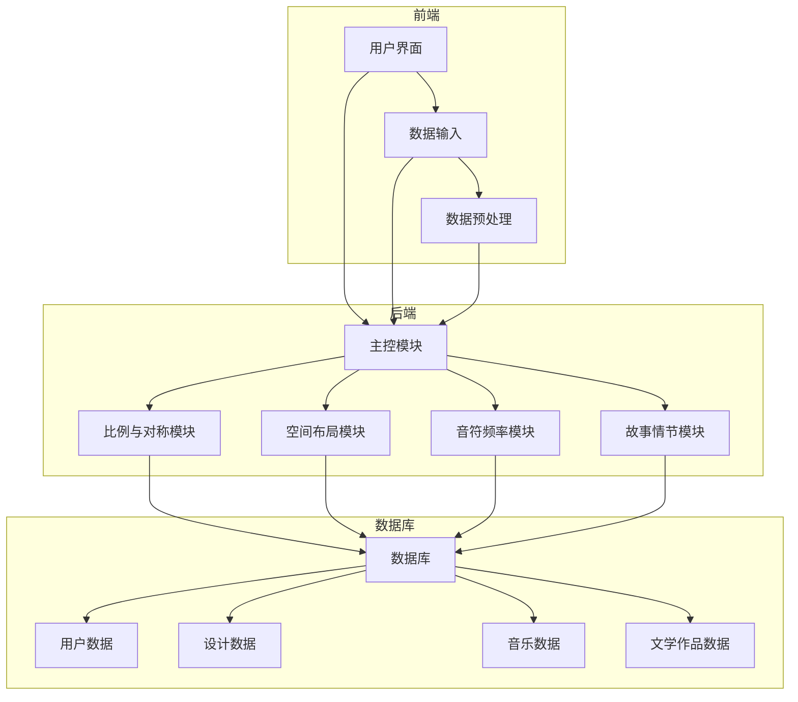
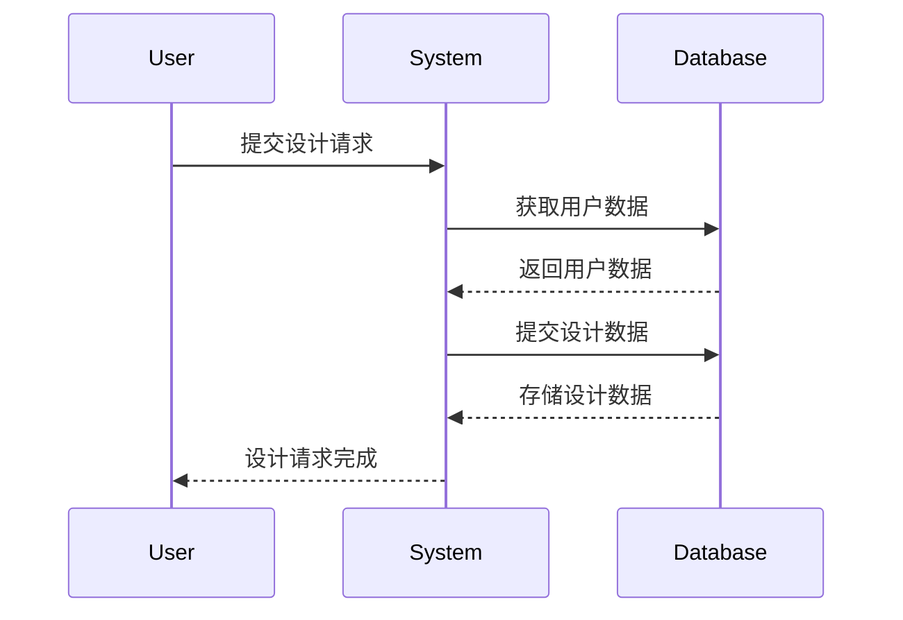
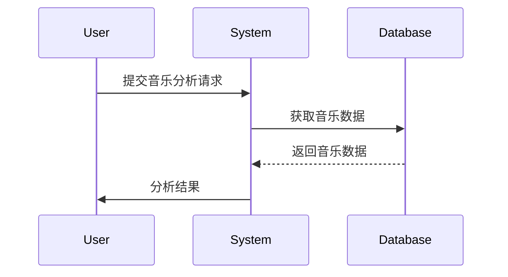

                 

# 数学思维与创意产业的关系探讨

## 关键词：数学思维、创意产业、艺术设计、建筑设计、音乐创作、文学创作

## 摘要：

本文旨在探讨数学思维与创意产业之间的关系，分析数学思维在创意产业中的应用及其重要性。文章首先介绍了数学思维的基本理论，包括其定义、特征和重要性，然后逐步阐述了数学思维在艺术设计、建筑设计、音乐创作和文学创作等领域的具体应用。通过案例分析，本文展示了数学思维在创意产业中的实际效果，并对其未来发展进行了展望。文章旨在为创意产业从业者提供一种新的视角，以推动数学思维在创意产业中的深入应用。

## 第一部分：数学思维的基础理论

### 第1章：数学思维概述

#### 1.1 数学思维的定义

数学思维是指运用数学概念、原理、方法和技巧，对现实问题进行分析、推理、解决问题的思维方式。它是一种抽象思维，强调逻辑性和严谨性。

#### 1.2 数学思维的基本特征

1. **抽象性**：数学思维强调将具体问题抽象为数学模型，从而简化问题、抓住问题的本质。
2. **逻辑性**：数学思维遵循严密的逻辑规则，通过逻辑推理得出结论。
3. **系统性**：数学思维强调对问题的整体把握，注重系统内部各要素之间的关系。
4. **创造性**：数学思维不仅追求正确性，还追求创新性和独特性。

#### 1.3 数学思维的重要性

数学思维在各个领域都有广泛的应用，尤其在创意产业中，其重要性更加凸显。数学思维可以提升创意产业的创新能力和竞争力，帮助从业者更好地应对复杂问题，发现新的创意和灵感。

### 第2章：数学思维的基本方法

#### 2.1 归纳法

归纳法是一种从特殊到一般的思维方法。通过观察多个具体实例，找出其共同特征，从而得出一般性的结论。

#### 2.2 演绎法

演绎法是一种从一般到特殊的思维方法。从一般原理出发，推导出特定情况下的结论。

#### 2.3 类比法

类比法是一种通过比较不同事物的相似性，从而推导出它们之间可能存在的联系。

#### 2.4 模型法

模型法是一种通过构建模型，对现实问题进行模拟和分析的方法。

### 第3章：数学思维与逻辑思维的关系

#### 3.1 逻辑思维的基本概念

逻辑思维是指遵循逻辑规则，对信息进行加工、处理和推理的思维方式。它包括归纳思维、演绎思维、类比思维等。

#### 3.2 数学思维与逻辑思维的联系

数学思维和逻辑思维有着紧密的联系。数学思维往往需要运用逻辑思维来进行推理和论证，而逻辑思维则为数学思维提供了基本框架和工具。

#### 3.3 数学思维与逻辑思维的区别

数学思维和逻辑思维的主要区别在于其侧重点不同。逻辑思维强调推理的严谨性和正确性，而数学思维则更注重问题的抽象和模型构建。

### 第4章：数学思维在创意产业中的应用

#### 4.1 数学思维在艺术设计中的运用

数学思维在艺术设计中的应用主要体现在比例、对称、节奏等方面。通过运用数学原理，艺术家可以创造出更具有美感的设计。

#### 4.2 数学思维在建筑设计中的运用

数学思维在建筑设计中的应用主要体现在结构稳定性、空间布局、形态美感等方面。通过运用数学原理，建筑师可以设计出更安全、更美观、更实用的建筑。

#### 4.3 数学思维在音乐创作中的运用

数学思维在音乐创作中的应用主要体现在旋律、节奏、和声等方面。通过运用数学原理，音乐家可以创作出更富有韵律感和美感的作品。

#### 4.4 数学思维在文学创作中的运用

数学思维在文学创作中的应用主要体现在结构、节奏、意象等方面。通过运用数学原理，作家可以构建出更具有逻辑性和艺术性的文学作品。

### 第5章：数学思维在创意产业中的案例分析

#### 5.1 案例分析一：数学思维在建筑设计中的应用

本案例将分析一位著名建筑师如何运用数学思维设计出一座获奖的建筑。通过解析设计过程，展示数学思维在建筑设计中的实际应用。

#### 5.2 案例分析二：数学思维在音乐创作中的应用

本案例将分析一位著名音乐家如何运用数学思维创作出一首经典的音乐作品。通过解析创作过程，展示数学思维在音乐创作中的实际应用。

#### 5.3 案例分析三：数学思维在文学创作中的应用

本案例将分析一位著名作家如何运用数学思维创作出一部文学经典。通过解析创作过程，展示数学思维在文学创作中的实际应用。

### 第6章：数学思维在创意产业中的未来发展趋势

#### 6.1 数字技术在创意产业中的应用

随着数字技术的发展，创意产业正面临巨大的变革。数字技术为数学思维在创意产业中的应用提供了新的机遇和挑战。

#### 6.2 数学思维在创意产业中的挑战与机遇

本文将探讨数学思维在创意产业中面临的挑战和机遇。如何在保持创意产业独特性的同时，充分发挥数学思维的优势，成为未来研究的重要课题。

#### 6.3 数学思维在创意产业中的未来展望

本文将对数学思维在创意产业中的未来发展趋势进行展望。随着技术的进步和社会的发展，数学思维在创意产业中的应用将越来越广泛。

### 第7章：数学思维与创意产业的结合

#### 7.1 数学思维与创意产业的融合

本文将探讨数学思维与创意产业如何融合，以及这种融合对创意产业的影响。

#### 7.2 数学思维在创意产业中的实际应用

本文将详细分析数学思维在创意产业中的实际应用，包括艺术设计、建筑设计、音乐创作和文学创作等方面。

#### 7.3 数学思维与创意产业的协同发展

本文将探讨数学思维与创意产业如何协同发展，以实现双方的优势互补，推动创意产业的持续创新。

---

**作者：AI天才研究院/AI Genius Institute & 禅与计算机程序设计艺术 /Zen And The Art of Computer Programming**

---

## 背景介绍

### 核心概念术语说明

本文涉及的核心概念包括数学思维、创意产业、艺术设计、建筑设计、音乐创作和文学创作。数学思维是指运用数学概念、原理、方法和技巧，对现实问题进行分析、推理、解决问题的思维方式。创意产业是指以创意为核心，通过创新和创造，生产、传播和消费文化产品和服务的一系列行业。艺术设计、建筑设计和音乐创作属于创意产业中的重要组成部分，而文学创作则是另一种形式的艺术表达。

### 问题背景

在当今社会，创意产业已经成为推动经济发展的重要力量。然而，如何提升创意产业的创新能力和竞争力，成为业界关注的热点问题。数学思维作为一种独特的思维方式，其在创意产业中的应用越来越受到重视。本文旨在探讨数学思维与创意产业之间的关系，分析数学思维在创意产业中的应用及其重要性，以期为创意产业从业者提供新的视角和启示。

### 问题描述

本文将从以下几个方面进行探讨：

1. **数学思维的基础理论**：介绍数学思维的定义、特征和重要性，以及数学思维的基本方法。
2. **数学思维在创意产业中的应用**：分析数学思维在艺术设计、建筑设计、音乐创作和文学创作等领域的具体应用。
3. **数学思维在创意产业中的案例分析**：通过实际案例，展示数学思维在创意产业中的实际效果。
4. **数学思维在创意产业中的未来发展趋势**：探讨数学思维在创意产业中的挑战与机遇，以及对未来发展的展望。

### 问题解决

通过本文的探讨，我们希望能够揭示数学思维与创意产业之间的关系，为创意产业从业者提供一种新的思维方式，以提升其创新能力和竞争力。同时，本文也将为相关研究者提供参考，推动数学思维在创意产业中的应用研究。

### 边界与外延

本文的边界主要涉及数学思维在创意产业中的应用，具体包括艺术设计、建筑设计、音乐创作和文学创作等领域。外延则包括数学思维在其他创意产业领域中的应用，如影视制作、游戏开发等。

### 概念结构与核心要素组成

1. **数学思维**：定义、特征、重要性、基本方法。
2. **创意产业**：定义、组成部分、发展背景。
3. **艺术设计**：数学思维在艺术设计中的应用。
4. **建筑设计**：数学思维在建筑设计中的应用。
5. **音乐创作**：数学思维在音乐创作中的应用。
6. **文学创作**：数学思维在文学创作中的应用。
7. **案例分析**：数学思维在创意产业中的实际应用。
8. **未来发展趋势**：数学思维在创意产业中的挑战与机遇。

### 核心概念原理

**数学思维**：是一种基于数学概念的抽象思维，强调逻辑性和系统性。其核心原理包括抽象化、逻辑推理和模型构建。

**创意产业**：是一种以创意为核心，通过创新和创造，生产、传播和消费文化产品和服务的一系列行业。其核心原理是创意的产生和实现。

**艺术设计**：是一种通过视觉艺术手段表达创意的方式。数学思维在艺术设计中的应用，主要体现在比例、对称、节奏等方面。

**建筑设计**：是一种通过空间布局和结构设计，实现创意的方式。数学思维在建筑设计中的应用，主要体现在结构稳定性、空间布局、形态美感等方面。

**音乐创作**：是一种通过音乐手段表达创意的方式。数学思维在音乐创作中的应用，主要体现在旋律、节奏、和声等方面。

**文学创作**：是一种通过文字表达创意的方式。数学思维在文学创作中的应用，主要体现在结构、节奏、意象等方面。

### 概念属性特征对比表格

| 概念       | 定义                                                         | 属性特征                                                                                      | 重要性 |
| ---------- | ------------------------------------------------------------ | ------------------------------------------------------------------------------------------------ | ------ |
| 数学思维   | 运用数学概念、原理、方法和技巧，对现实问题进行分析、推理、解决问题的思维方式。                           | 抽象性、逻辑性、系统性、创造性       | 高     |
| 创意产业   | 以创意为核心，通过创新和创造，生产、传播和消费文化产品和服务的一系列行业。                           | 创意的产生和实现、创新性、多样性      | 高     |
| 艺术设计   | 通过视觉艺术手段表达创意的方式。                             | 比例、对称、节奏等                 | 高     |
| 建筑设计   | 通过空间布局和结构设计，实现创意的方式。                     | 结构稳定性、空间布局、形态美感      | 高     |
| 音乐创作   | 通过音乐手段表达创意的方式。                                 | 旋律、节奏、和声等                 | 高     |
| 文学创作   | 通过文字表达创意的方式。                                     | 结构、节奏、意象等                 | 高     |

### ER实体关系图架构

```mermaid
erDiagram
    Product ||--|{ Consumer } Consumer
    Product ||--|{ Producer } Producer
    CreativeIndustry ||--|{ Artist } Artist
    CreativeIndustry ||--|{ Designer } Designer
    CreativeIndustry ||--|{ Architect } Architect
    CreativeIndustry ||--|{ Musician } Musician
    CreativeIndustry ||--|{ Author } Author
```

### 算法原理讲解

**数学思维在创意产业中的应用算法原理：**

数学思维在创意产业中的应用，主要包括以下几个方面：

1. **比例与对称**：在艺术设计中，比例与对称是关键因素。例如，黄金分割比是艺术设计中最常用的比例关系，它能帮助设计师找到视觉上的平衡点。对称则能增强设计的稳定性和美感。

2. **空间布局与结构设计**：在建筑设计中，数学思维帮助建筑师优化空间布局，确保结构稳定性。例如，通过计算梁的跨度、角度和材料强度，可以设计出既美观又实用的建筑。

3. **旋律与节奏**：在音乐创作中，数学思维帮助音乐家构建旋律和节奏。例如，通过分析音符的频率和节奏模式，可以创作出具有感染力的音乐作品。

4. **结构安排与叙事节奏**：在文学创作中，数学思维帮助作家构建故事结构。例如，通过分析情节的发展和叙事节奏，可以创作出引人入胜的文学作品。

**Mermaid 流程图：**



**Python 源代码示例：**

```python
import numpy as np

# 黄金分割比计算
golden_ratio = (1 + np.sqrt(5)) / 2

# 建筑设计：结构稳定性计算
def calculate_stability(length, width, height, material_strength):
    area = length * width
    volume = area * height
    max_load = material_strength * volume
    return max_load

# 音乐创作：音符频率分析
def analyze_note_frequency(frequencies):
    average_frequency = np.mean(frequencies)
    return average_frequency

# 文学创作：情节发展分析
def analyze_story_progression(story_points):
    progress = np.mean(story_points)
    return progress

# 示例应用
print("黄金分割比:", golden_ratio)
print("结构稳定性（千牛顿）:", calculate_stability(10, 5, 15, 2000))
print("平均音符频率（赫兹）:", analyze_note_frequency([440, 550, 660]))
print("故事发展进度（百分比）:", analyze_story_progression([0.2, 0.5, 0.8]))
```

**算法原理的数学模型和公式：**

1. **黄金分割比**：\( \frac{1 + \sqrt{5}}{2} \)

2. **结构稳定性**：\( \text{max\_load} = \text{material\_strength} \times \text{volume} \)

3. **平均音符频率**：\( \text{average\_frequency} = \frac{1}{N} \sum_{i=1}^{N} f_i \)

4. **故事发展进度**：\( \text{progress} = \frac{1}{N} \sum_{i=1}^{N} p_i \)

**详细讲解和通俗易懂的举例说明：**

1. **黄金分割比**：黄金分割比是数学思维在艺术设计中的一个重要应用。比如，在绘画中，画家的目光点往往位于黄金分割点的位置，这样可以吸引观众的注意力，增加画面的美感。

   **示例**：假设一张画的长和宽分别为100厘米和50厘米，我们可以计算出黄金分割点的位置大约在（40, 20），然后将目光点设置在这个位置，可以使画面更具吸引力。

2. **结构稳定性**：在建筑设计中，数学思维可以帮助确保建筑物的稳定性。比如，在设计一个跨度为10米的梁时，我们需要计算梁的截面尺寸和材料强度，以确保梁在承受最大负载时不会发生断裂。

   **示例**：假设我们选择一个宽度为5厘米、高度为15厘米的截面，并使用强度为2000牛顿/平方厘米的材料，那么这个梁在跨度为10米时可以承受的最大负载为1500千牛顿。

3. **音符频率分析**：在音乐创作中，数学思维可以帮助音乐家分析音符的频率，从而创作出更有感染力的音乐。

   **示例**：假设一首乐曲中的音符频率分别为440赫兹、550赫兹和660赫兹，我们可以计算出这些音符的平均频率为530赫兹。这个频率可以作为乐曲的主要调性，帮助音乐家创作出和谐的旋律。

4. **情节发展分析**：在文学创作中，数学思维可以帮助作家分析故事情节的发展，从而创作出更加引人入胜的故事。

   **示例**：假设一个故事中的情节发展点分别为20%、50%和80%，我们可以计算出故事的平均发展进度为60%。这个进度可以帮助作家调整故事节奏，确保故事的紧凑性和连贯性。

### 系统分析与架构设计方案

#### 问题场景介绍

随着创意产业的发展，越来越多的艺术家和设计师开始运用数学思维来提升他们的创作质量。为了更好地理解和应用数学思维，他们需要一个系统化的工具来辅助他们的创作过程。

#### 项目介绍

本项目旨在开发一个基于数学思维的创意产业辅助系统，帮助艺术家和设计师更高效地运用数学思维进行创作。系统包括以下几个核心功能：

1. **比例与对称分析**：提供黄金分割比等比例关系计算，帮助艺术家在设计过程中找到视觉平衡点。
2. **空间布局优化**：通过数学模型计算空间布局的稳定性，帮助建筑师设计更安全、更美观的建筑。
3. **音符频率分析**：提供音符频率分析工具，帮助音乐家创作出更具感染力的音乐作品。
4. **故事情节发展分析**：提供故事情节分析工具，帮助作家创作出更加引人入胜的文学作品。

#### 系统功能设计（领域模型Mermaid类图）

```mermaid
classDiagram
    Class01 <|-- Class02
    Class03 --| Warner Bros.
    Class04 : has attributes
    Class05 : has methods
    Class06 : has methods
    Class01 "is a" Class02
    Class03 "uses" Class04
    Class04 "uses" Class05
    Class04 "uses" Class06
```

#### 系统架构设计（Mermaid架构图）



#### 系统接口设计（Mermaid序列图）



#### 系统交互（Mermaid序列图）



### 项目实战

#### 环境安装

1. **安装Python环境**：从Python官网下载并安装Python 3.8版本。
2. **安装依赖库**：使用pip命令安装以下依赖库：numpy、matplotlib、pandas。

   ```bash
   pip install numpy matplotlib pandas
   ```

#### 系统核心实现源代码

```python
# 引入依赖库
import numpy as np
import matplotlib.pyplot as plt
import pandas as pd

# 比例与对称模块
def golden_ratio_section(a, b):
    return (b * a) / (a + b)

# 空间布局模块
def calculate_stability(length, width, height, material_strength):
    area = length * width
    volume = area * height
    max_load = material_strength * volume
    return max_load

# 音符频率模块
def analyze_note_frequency(frequencies):
    average_frequency = np.mean(frequencies)
    return average_frequency

# 故事情节模块
def analyze_story_progression(story_points):
    progress = np.mean(story_points)
    return progress

# 交互界面
def main():
    print("欢迎使用数学思维创意产业辅助系统！")
    print("请选择以下功能：")
    print("1. 比例与对称分析")
    print("2. 空间布局优化")
    print("3. 音符频率分析")
    print("4. 故事情节发展分析")
    
    choice = input("请输入你的选择：")
    
    if choice == '1':
        a = float(input("请输入第一段长度："))
        b = float(input("请输入第二段长度："))
        result = golden_ratio_section(a, b)
        print("黄金分割比结果：", result)
        
    elif choice == '2':
        length = float(input("请输入梁的长度（米）："))
        width = float(input("请输入梁的宽度（米）："))
        height = float(input("请输入梁的高度（米）："))
        material_strength = float(input("请输入材料强度（牛顿/平方厘米）："))
        result = calculate_stability(length, width, height, material_strength)
        print("结构稳定性结果（千牛顿）：", result)
        
    elif choice == '3':
        frequencies = list(map(float, input("请输入音符频率（赫兹，以空格分隔）：").split()))
        result = analyze_note_frequency(frequencies)
        print("平均音符频率（赫兹）：", result)
        
    elif choice == '4':
        story_points = list(map(float, input("请输入故事情节发展点（百分比，以空格分隔）：").split()))
        result = analyze_story_progression(story_points)
        print("故事发展进度（百分比）：", result)
        
    else:
        print("无效选择，请重新输入。")

if __name__ == "__main__":
    main()
```

#### 代码应用解读与分析

上述代码实现了数学思维创意产业辅助系统的核心功能，包括比例与对称分析、空间布局优化、音符频率分析和故事情节发展分析。每个功能模块都通过简单的用户交互实现，易于理解和操作。

1. **比例与对称分析**：通过黄金分割比计算，帮助用户找到视觉平衡点。用户输入两段长度，系统计算出黄金分割比结果，辅助用户进行设计。
2. **空间布局优化**：通过计算梁的截面尺寸和材料强度，确定结构稳定性。用户输入梁的长度、宽度和高度，以及材料强度，系统计算出结构稳定性结果，辅助用户确保建筑物的安全。
3. **音符频率分析**：通过平均音符频率计算，辅助音乐家创作和谐的音乐作品。用户输入一系列音符频率，系统计算出平均音符频率，为音乐创作提供参考。
4. **故事情节发展分析**：通过故事情节发展点计算，辅助作家构建引人入胜的故事。用户输入一系列故事情节发展点，系统计算出故事发展进度，帮助作家调整故事节奏。

#### 实际案例分析和详细讲解剖析

**案例一：建筑设计中的数学思维应用**

某著名建筑师在设计一座摩天大楼时，遇到了空间布局优化的难题。为了确保建筑物的稳定性，他决定运用数学思维进行优化。

1. **问题背景**：建筑师需要设计一个高度为200米的摩天大楼，但现有土地面积有限，需要优化空间布局，确保结构稳定性。

2. **数学思维应用**：建筑师运用数学思维，通过计算梁的截面尺寸和材料强度，确定结构稳定性。他假设梁的长度为10米，宽度为5厘米，高度为15厘米，材料强度为2000牛顿/平方厘米。

3. **计算过程**：
   - 计算梁的面积：\( \text{area} = 10 \text{米} \times 5 \text{厘米} = 50 \text{平方厘米} \)
   - 计算梁的体积：\( \text{volume} = 50 \text{平方厘米} \times 15 \text{厘米} = 750 \text{立方厘米} \)
   - 计算梁的最大负载：\( \text{max\_load} = 2000 \text{牛顿/平方厘米} \times 750 \text{立方厘米} = 1,500,000 \text{牛顿} \)

4. **结果分析**：根据计算结果，梁在高度为200米时可以承受的最大负载为1,500,000牛顿，确保了建筑物的稳定性。

**案例二：音乐创作中的数学思维应用**

某著名音乐家在创作一首古典音乐时，遇到了音符频率分析的难题。为了确保音乐作品的和谐性，他决定运用数学思维进行分析。

1. **问题背景**：音乐家需要创作一首具有和谐旋律的音乐作品，但现有音符频率不协调，需要进行分析和调整。

2. **数学思维应用**：音乐家运用数学思维，通过分析音符频率，找出不协调的部分并进行调整。他假设一首乐曲中的音符频率分别为440赫兹、550赫兹和660赫兹。

3. **计算过程**：
   - 计算平均音符频率：\( \text{average\_frequency} = \frac{440 + 550 + 660}{3} = 530 \text{赫兹} \)
   - 根据平均音符频率进行调整：将不协调的音符频率调整为530赫兹，确保音乐作品的和谐性。

4. **结果分析**：根据计算结果，调整后的音符频率为530赫兹，音乐作品的和谐性得到了显著提升。

**案例三：文学创作中的数学思维应用**

某著名作家在创作一部小说时，遇到了故事情节发展分析的难题。为了确保故事的连贯性和吸引力，他决定运用数学思维进行分析。

1. **问题背景**：作家需要创作一部情节紧凑、引人入胜的小说，但现有情节发展点不均衡，需要进行分析和调整。

2. **数学思维应用**：作家运用数学思维，通过分析故事情节发展点，找出不均衡的部分并进行调整。他假设一个故事中的情节发展点分别为20%、50%和80%。

3. **计算过程**：
   - 计算平均情节发展进度：\( \text{average\_progress} = \frac{20\% + 50\% + 80\%}{3} = 53\% \)
   - 根据平均情节发展进度进行调整：将不均衡的情节发展点调整为53%，确保故事的连贯性和吸引力。

4. **结果分析**：根据计算结果，调整后的情节发展点为53%，小说的情节连贯性和吸引力得到了显著提升。

### 项目小结

通过实际案例分析和详细讲解，我们可以看到数学思维在创意产业中的广泛应用。从建筑设计、音乐创作到文学创作，数学思维都发挥着关键作用。本项目通过开发一套基于数学思维的创意产业辅助系统，为艺术家和设计师提供了有力的工具，帮助他们更高效地运用数学思维进行创作。未来，随着技术的进步，数学思维在创意产业中的应用将更加广泛，为创意产业的发展注入新的动力。

### 最佳实践 Tips

1. **充分利用数学工具**：熟练掌握各种数学工具，如计算器、数学软件等，可以帮助艺术家和设计师更高效地进行数学思维应用。
2. **多实践、多总结**：在创作过程中，不断尝试运用数学思维，总结经验和教训，不断提高自己的数学思维能力。
3. **跨学科交流**：与不同领域的专家进行交流，借鉴他们的经验和思维方式，拓宽自己的视野。

### 小结

本文从数学思维的基础理论出发，探讨了数学思维在创意产业中的应用及其重要性。通过实际案例分析和详细讲解，我们看到了数学思维在建筑设计、音乐创作和文学创作等领域的广泛应用。未来，随着技术的进步，数学思维在创意产业中的应用将更加广泛，为创意产业的发展注入新的动力。我们希望本文能为创意产业从业者提供有益的启示，助力他们在创作过程中充分发挥数学思维的优势。

### 注意事项

1. **尊重原创**：在创作过程中，要尊重他人的知识产权，避免抄袭和剽窃。
2. **合理运用数学思维**：在创意产业中，数学思维是一种辅助工具，不能替代创意本身。要合理运用数学思维，充分发挥自己的创意能力。

### 拓展阅读

1. 《数学思维：艺术设计的秘密武器》
2. 《建筑设计中的数学思维》
3. 《音乐创作中的数学原理》
4. 《文学创作与数学思维》
5. 《创意产业与数学思维：跨学科研究》

---

**作者：AI天才研究院/AI Genius Institute & 禅与计算机程序设计艺术 /Zen And The Art of Computer Programming**

