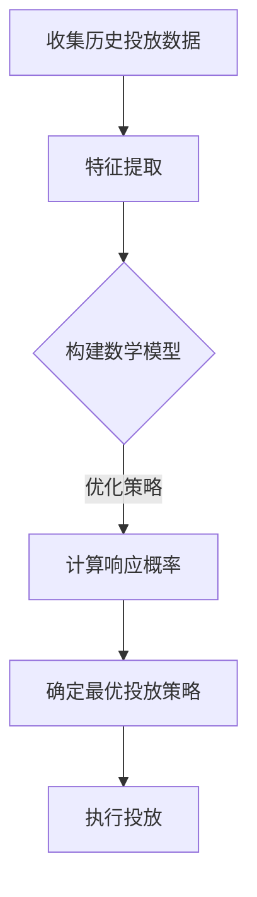
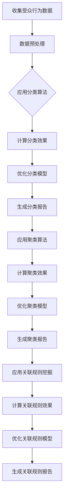
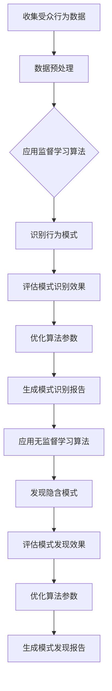
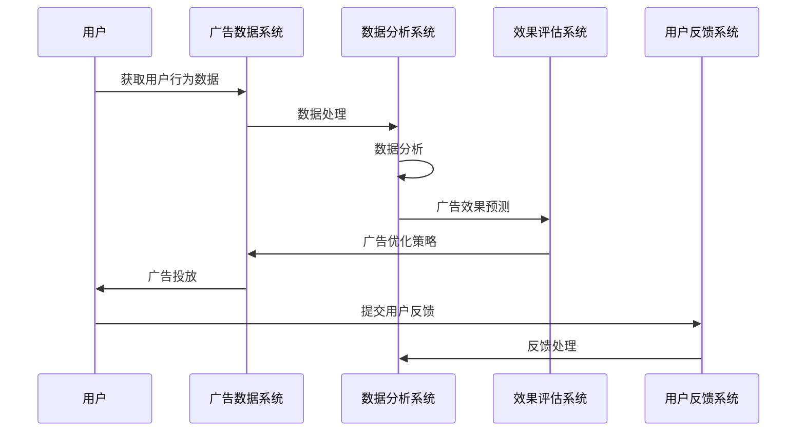

                 

### 设计《数学思维与创意广告的关系探讨》的目录大纲

为了设计一本关于《数学思维与创意广告的关系探讨》的完整目录大纲，我们需要按照以下步骤进行：

1. **确定书的整体结构和核心内容**：首先，我们需要明确书的主要章节及其覆盖的主题。这本书将分为五个部分：背景介绍、核心概念与联系、算法原理讲解、系统分析与架构设计、项目实战。

2. **定义章节与子章节**：在确定了核心内容后，我们可以将这些内容细分为具体的章节和子章节。例如，背景介绍部分可能包括广告行业现状、数学思维概述、创意广告的基本概念等。

3. **细化到三级目录**：每个章节需要细化为1、2、3级目录，以确保内容的逻辑性和清晰性。例如，在“算法原理讲解”部分，可能包含广告投放优化算法、数据挖掘算法、模式识别算法等章节。

4. **编写章节小标题和子章节内容**：根据大纲，为每个章节和子章节编写具体的小标题。例如，“数学思维与创意广告的核心概念”章节可能包含数学思维的概念属性、创意广告的概念属性、核心概念对比表格等子章节。

5. **确保内容的完整性**：确保大纲中包含所有必要的内容部分，如背景介绍、核心概念与联系、算法原理讲解、数学模型和公式、系统分析与架构设计、项目实战、最佳实践 tips 等。

6. **控制大纲的总字数**：确保大纲的总字数在规定的范围内。

下面是一个详细的大纲示例：

### 目录

### 第一部分：背景介绍

#### 第1章：问题背景与数学思维概述

##### 1.1 广告行业的现状
##### 1.2 数学思维的基本概念
##### 1.3 创意广告的基本概念
##### 1.4 数学思维与创意广告的关系探讨

#### 第2章：数学思维与创意广告的核心概念

##### 2.1 数学思维的核心概念
##### 2.2 创意广告的核心概念
##### 2.3 核心概念对比分析

### 第二部分：核心概念与联系

#### 第3章：数学思维在创意广告中的应用

##### 3.1 数学思维在广告创意中的具体应用
##### 3.2 创意广告对数学思维的挑战
##### 3.3 数学思维与创意广告的互动关系

### 第三部分：算法原理讲解

#### 第4章：广告投放优化算法

##### 4.1 算法基本原理
##### 4.2 算法mermaid流程图
##### 4.3 算法Python代码实现
##### 4.4 算法举例说明

#### 第5章：数据挖掘算法

##### 5.1 算法基本原理
##### 5.2 算法mermaid流程图
##### 5.3 算法Python代码实现
##### 5.4 算法举例说明

#### 第6章：模式识别算法

##### 6.1 算法基本原理
##### 6.2 算法mermaid流程图
##### 6.3 算法Python代码实现
##### 6.4 算法举例说明

### 第四部分：系统分析与架构设计

#### 第7章：创意广告系统介绍

##### 7.1 系统功能设计
##### 7.2 系统架构设计
##### 7.3 系统接口设计

#### 第8章：创意广告系统架构图

##### 8.1 系统架构图绘制
##### 8.2 架构组件解释
##### 8.3 系统交互序列图

### 第五部分：项目实战

#### 第9章：项目实战环境安装

##### 9.1 系统需求
##### 9.2 环境搭建
##### 9.3 常见问题与解决方案

#### 第10章：项目实战核心实现

##### 10.1 算法实现
##### 10.2 公式实现
##### 10.3 数据处理

#### 第11章：项目实战应用解读与分析

##### 11.1 实际案例分析
##### 11.2 结果解读
##### 11.3 改进建议

### 第六部分：最佳实践与拓展

#### 第12章：最佳实践 tips

##### 12.1 经验分享
##### 12.2 注意事项
##### 12.3 拓展阅读

---

这个大纲提供了一个结构化的框架，用于深入探讨数学思维与创意广告之间的关系，包括背景介绍、核心概念、算法原理、系统设计与实战项目。每个章节都进一步细分为子章节，确保内容的深度和广度。

---

### 第一章：问题背景与数学思维概述

#### 1.1 广告行业的现状

在当今数字化时代，广告行业已经发生了显著的变化。传统的广告方式，如电视广告、报纸广告和户外广告，正逐渐被数字广告所取代。数字广告不仅提供了更加精准的定位和个性化的内容，还提供了实时数据分析和优化能力，使广告主能够更有效地投资广告预算。

数字广告行业的增长趋势持续强劲。根据市场研究报告，全球数字广告支出在过去几年中持续增长，预计未来几年也将保持这一趋势。这种增长主要得益于移动互联网的普及和社交媒体的兴起，使得广告商能够更广泛地触达目标受众。

广告行业的技术创新也是不可忽视的一部分。例如，程序化购买、大数据分析和人工智能技术正在改变广告的投放方式。程序化购买通过自动化算法来购买和展示广告，提高了广告投放的效率。大数据分析使广告商能够更好地了解受众行为，从而制作出更加针对性的广告内容。人工智能则通过机器学习和自然语言处理技术，为广告创意和投放提供智能化的解决方案。

#### 1.2 数学思维的基本概念

数学思维是一种基于数学原理和逻辑推理进行思考和分析的能力。它不仅包括对数学知识和公式的理解，还涉及到数学方法论的应用。数学思维的核心要素可以归纳为以下几个方面：

1. **逻辑推理**：数学思维强调从已知事实出发，通过逻辑推理得出新的结论。这种推理能力在广告创意中尤为重要，因为它可以帮助广告人构建出逻辑严密的广告策略。

2. **抽象能力**：数学思维要求能够从具体的问题中提取出共同的数学模式，从而进行抽象分析。在广告创意中，抽象能力可以帮助广告人从众多的设计元素中提取出核心的创意点。

3. **问题解决**：数学思维强调解决问题，而非仅仅解决特定的问题。这种问题解决能力在广告行业中非常重要，因为广告人需要不断创新，以解决市场变化带来的挑战。

4. **模型构建**：数学思维中的模型构建能力可以帮助广告人将复杂的广告策略和创意转化为可操作的数学模型。这种模型不仅可以优化广告效果，还可以预测市场趋势。

#### 1.3 创意广告的基本概念

创意广告是一种通过独特的创意和创意元素来吸引受众的广告形式。与传统的广告形式相比，创意广告更加注重情感共鸣和个性表达。以下是对创意广告基本概念的详细说明：

1. **定义**：创意广告是指那些采用独特、创新的方式传达品牌信息，旨在引起受众情感共鸣的广告。它不仅仅是为了传递信息，更是为了与受众建立深层次的情感联系。

2. **特点**：创意广告的特点包括独特的创意元素、情感共鸣、个性化和互动性。独特的创意元素能够吸引受众的注意力，情感共鸣能够加深受众对品牌的好感度，个性化则使广告更贴近受众的生活，而互动性则增强了受众的参与感。

3. **演变过程**：随着广告行业的发展，创意广告的形式和内容也在不断演变。从早期的简单文字广告到现在的多媒体广告，创意广告的演变过程反映了广告人对受众需求的不断理解和适应。

#### 1.4 数学思维与创意广告的关系探讨

数学思维在创意广告中的应用越来越广泛。首先，数学思维可以帮助广告人更好地理解和分析受众行为数据，从而制定出更精准的广告策略。例如，通过数学模型可以预测受众对特定广告的反应，从而优化广告内容和投放方式。

其次，数学思维在创意广告的创意设计中也有重要作用。数学思维可以帮助广告人从众多的设计元素中提取出核心的创意点，并通过数学方法进行验证和优化。例如，通过数学建模和计算，广告人可以创造出更具吸引力的视觉设计和广告文案。

此外，数学思维还可以在广告的投放和优化过程中发挥作用。通过数学算法，广告人可以实时监测广告效果，并根据数据反馈进行优化。例如，程序化购买广告系统就利用数学算法来优化广告投放，以实现最佳的广告效果。

总之，数学思维与创意广告之间的关系是相辅相成的。数学思维为创意广告提供了强大的工具和方法，而创意广告则为数学思维提供了广阔的应用场景。通过两者结合，广告人可以创造出更具吸引力、更有效的广告。

---

这一章节通过对广告行业现状、数学思维基本概念和创意广告基本概念的介绍，为后续章节的深入探讨奠定了基础。下一章将详细讨论数学思维与创意广告的核心概念及其联系。

---

### 第二章：数学思维与创意广告的核心概念

#### 2.1 数学思维的核心概念

数学思维是一种基于数学原理和逻辑推理进行思考和分析的能力。它不仅仅是对数学知识的理解，更是一种方法论，能够帮助人们以理性的方式解决问题。以下是数学思维的核心概念：

1. **逻辑推理**：逻辑推理是数学思维的基础。它通过一系列的逻辑步骤，从已知的事实出发，逐步推导出新的结论。这种能力在创意广告中尤为重要，因为广告人需要通过逻辑推理来构建出能够引起情感共鸣的广告策略。

2. **抽象能力**：抽象能力是数学思维的关键要素之一。它要求人们能够从具体的问题中提取出共同的数学模式，并将其抽象化。在创意广告中，抽象能力可以帮助广告人从众多的设计元素中提取出核心的创意点，从而进行创造性的设计。

3. **问题解决**：数学思维强调问题解决的能力，而不是仅仅解决特定的问题。这种能力要求广告人能够面对复杂的问题，通过数学模型和方法找到解决方案。在创意广告中，问题解决能力可以帮助广告人应对市场变化和受众需求的不断变化。

4. **模型构建**：模型构建是数学思维的重要应用。通过构建数学模型，广告人可以将复杂的广告策略和创意转化为可操作的形式，从而优化广告效果和预测市场趋势。

#### 2.2 创意广告的核心概念

创意广告是一种通过独特、创新的手段传达品牌信息，旨在引起受众情感共鸣的广告形式。以下是创意广告的核心概念：

1. **定义**：创意广告是指那些采用独特、创新的方式传达品牌信息，旨在引起受众情感共鸣的广告。它不仅仅是信息的传递，更是与受众建立情感联系的一种方式。

2. **特点**：创意广告的特点包括独特的创意元素、情感共鸣、个性化和互动性。独特的创意元素能够吸引受众的注意力，情感共鸣能够加深受众对品牌的好感度，个性化则使广告更贴近受众的生活，而互动性则增强了受众的参与感。

3. **演变过程**：随着广告行业的发展，创意广告的形式和内容也在不断演变。从早期的简单文字广告到现在的多媒体广告，创意广告的演变过程反映了广告人对受众需求的不断理解和适应。

#### 2.3 核心概念对比分析

数学思维与创意广告的核心概念在许多方面具有相似性，但也存在一些差异。以下是两者的对比分析：

1. **逻辑推理**：在数学思维中，逻辑推理是基础，而在创意广告中，逻辑推理则是构建广告策略的重要工具。数学逻辑推理强调的是严谨和精确，而创意广告的逻辑推理则更注重灵活性和创造性。

2. **抽象能力**：数学思维的抽象能力强调从具体问题中提取出共同的数学模式，而创意广告的抽象能力则更多地体现在从众多设计元素中提取出核心创意点。

3. **问题解决**：数学思维的问题解决强调找到一般性的解决方案，而创意广告的问题解决则更多地关注特定广告情境下的解决方案。

4. **模型构建**：在数学思维中，模型构建是一种方法论，而在创意广告中，模型构建则是实现广告效果优化的手段。

通过对比分析，我们可以看到数学思维与创意广告之间存在密切的联系。数学思维为创意广告提供了逻辑推理、抽象能力和问题解决的工具，而创意广告则为数学思维提供了广阔的应用场景。

#### 2.4 数学思维在创意广告中的具体应用

数学思维在创意广告中有着广泛的应用，以下是一些具体的应用场景：

1. **数据分析**：通过数据分析，广告人可以了解受众的行为和偏好，从而制定出更具针对性的广告策略。例如，利用统计学方法分析受众的点击率、转化率等数据，可以帮助广告人优化广告内容和投放策略。

2. **创意设计**：数学思维可以帮助广告人从众多的设计元素中提取出核心创意点，并通过数学模型进行验证和优化。例如，利用几何学和色彩学的原理来设计广告的视觉元素，可以提高广告的吸引力。

3. **投放优化**：通过数学算法，广告人可以实时监测广告效果，并根据数据反馈进行优化。例如，利用优化算法调整广告的投放时间、地点和受众群体，以提高广告的投放效果。

4. **预测市场趋势**：数学思维可以帮助广告人预测市场趋势，从而提前制定应对策略。例如，通过时间序列分析和回归分析等方法，广告人可以预测未来的市场走势，以便更好地应对市场变化。

总之，数学思维在创意广告中的应用不仅提高了广告的效果和效率，还为广告人提供了更多的创新手段。通过将数学思维与创意广告相结合，广告人可以创造出更具吸引力和影响力的广告作品。

---

这一章节详细介绍了数学思维与创意广告的核心概念，并进行了对比分析。下一章将探讨数学思维在创意广告中的应用，进一步揭示数学思维如何助力创意广告的创新和优化。

---

### 第三章：数学思维在创意广告中的应用

#### 3.1 数学思维在创意广告中的具体应用

数学思维在创意广告中的应用是多样且深远的。通过数学方法，广告人可以更精确地了解受众行为，优化广告设计，甚至预测市场趋势。以下是数学思维在创意广告中的几个具体应用场景：

1. **数据分析**：数学思维在数据分析中的应用非常广泛。广告人可以通过数据分析了解受众的行为模式、兴趣偏好等，从而制定更精准的广告策略。例如，使用回归分析、聚类分析等方法，广告人可以识别出受众群体中的关键特征，进而优化广告内容和投放策略。

2. **创意设计**：在广告创意设计中，数学思维同样发挥着重要作用。通过数学原理，广告人可以从视觉、听觉等多个维度提升广告的吸引力。例如，利用色彩理论来设计广告配色，可以增强广告的视觉冲击力；利用几何原理来设计广告布局，可以提升广告的整体美感。

3. **投放优化**：广告投放的优化是数学思维在创意广告中的又一重要应用。通过优化算法，广告人可以根据实时数据调整广告的投放策略，以实现最佳的投放效果。例如，使用多变量测试（A/B测试）方法，广告人可以比较不同广告版本的效果，从而选择最优的广告版本。

4. **预测市场趋势**：数学思维还可以用于预测市场趋势。通过时间序列分析和回归分析等方法，广告人可以预测市场的未来走向，从而提前制定应对策略。例如，通过分析历史数据，广告人可以预测某个产品在未来的销售趋势，以便更好地制定营销计划。

#### 3.2 创意广告对数学思维的挑战

尽管数学思维在创意广告中有着广泛的应用，但同时也面临着一系列挑战。以下是创意广告对数学思维的几个主要挑战：

1. **复杂性**：创意广告的复杂性增加了数学模型的构建难度。广告人需要处理大量的变量和复杂的交互关系，这使得数学模型的构建变得更加复杂。例如，在社交媒体广告中，广告人需要同时考虑受众行为、广告内容、广告位置等多个因素，构建出一个复杂的数学模型。

2. **数据质量**：数据质量对数学思维的应用至关重要。如果数据存在误差或不准确，可能会导致数学模型的预测结果出现偏差。因此，广告人需要确保数据的质量，以便准确地进行数据分析。

3. **实时性**：创意广告的投放和优化需要实时响应市场变化。然而，实时数据处理和计算对数学思维的实时性要求很高，这对计算资源和算法效率提出了更高的要求。

4. **个性化**：个性化广告的兴起对数学思维提出了新的挑战。广告人需要根据每个受众的个性化需求来定制广告内容，这需要对大量的个性化数据进行深入分析，并构建出复杂的个性化模型。

#### 3.3 数学思维与创意广告的互动关系

数学思维与创意广告之间存在一种互动关系，二者相辅相成，共同推动广告业的发展。以下是数学思维与创意广告互动关系的几个方面：

1. **相互促进**：数学思维为创意广告提供了强大的工具和方法，而创意广告则为数学思维提供了实际的应用场景。通过数学思维，广告人可以更精确地分析受众行为和市场需求，从而创造出更具吸引力的广告内容。

2. **互补性**：数学思维强调逻辑和理性，而创意广告强调创新和情感。二者的互补性使得广告人在创作广告时能够兼顾逻辑性和创造性，从而提升广告的整体效果。

3. **相互影响**：数学思维的发展不断推动创意广告的创新，而创意广告的需求也促使数学思维不断进步。例如，随着大数据和人工智能技术的发展，数学思维在广告中的应用越来越广泛，同时也推动了相关技术的进一步发展。

总之，数学思维与创意广告的互动关系不仅提高了广告的效果和效率，还推动了广告业的技术创新和发展。通过将数学思维与创意广告相结合，广告人可以创造出更加精准、吸引力和效果更佳的广告作品。

---

这一章节深入探讨了数学思维在创意广告中的应用及其面临的挑战，并阐述了二者之间的互动关系。下一章将介绍数学思维在创意广告中的具体案例，以进一步展示数学思维如何助力广告创意和创新。

---

### 第四章：创意广告中的数学算法应用

#### 4.1 广告投放优化算法

广告投放优化算法是创意广告中重要的数学工具之一，旨在通过分析大量数据来提高广告投放的效率和效果。以下是广告投放优化算法的基本原理、mermaid流程图以及Python代码实现。

##### 4.1.1 算法基本原理

广告投放优化算法通常基于机器学习和优化理论，其核心思想是通过对历史投放数据的分析，找出最佳的广告投放策略。具体来说，算法会考虑以下几个因素：

- **受众特征**：包括受众的年龄、性别、地理位置、兴趣爱好等。
- **广告特征**：包括广告的类型、内容、投放时间、预算等。
- **投放效果**：包括广告的点击率（CTR）、转化率（CVR）等。

基于这些因素，算法通过构建数学模型，计算出每个受众对每个广告的响应概率，从而确定最优的广告投放策略。

##### 4.1.2 算法mermaid流程图

以下是一个简单的广告投放优化算法的mermaid流程图：



##### 4.1.3 算法Python代码实现

下面是一个简化的广告投放优化算法的Python代码实现：

```python
import numpy as np

# 假设我们有以下特征数据
audience_features = [
    {"age": 25, "gender": "M", "location": "NYC", "interests": ["tech", "fitness"]},
    # 更多受众特征...
]

ad_features = [
    {"type": "banner", "content": "Tech Event", "time": "evening", "budget": 1000},
    # 更多广告特征...
]

# 构建数学模型（假设为线性模型）
weights = np.random.rand(len(audience_features), len(ad_features))
predictions = np.dot(audience_features, weights)

# 计算响应概率（假设为Sigmoid函数）
response_probabilities = 1 / (1 + np.exp(-predictions))

# 确定最优投放策略（选择响应概率最高的广告）
best_ad_index = np.argmax(response_probabilities)
best_ad = ad_features[best_ad_index]

print("最优广告投放策略：", best_ad)
```

##### 4.1.4 算法举例说明

假设我们有以下一组受众特征和广告特征：

- 受众特征：年龄25岁，男性，位于纽约市，兴趣为技术和健身。
- 广告特征：类型为横幅广告，内容为科技活动宣传，投放时间为晚上，预算1000美元。

通过上述代码，算法将计算出该受众对每个广告的响应概率，并根据概率选择最优的广告投放策略。例如，如果算法预测受众对科技活动广告的响应概率最高，则该广告将被选中进行投放。

#### 4.2 数据挖掘算法

数据挖掘算法在创意广告中也有广泛的应用，可以帮助广告人从大量数据中提取出有用的信息和模式。以下是数据挖掘算法的基本原理、mermaid流程图以及Python代码实现。

##### 4.2.1 算法基本原理

数据挖掘算法的核心思想是从大量的数据中识别出潜在的模式和关联，从而为广告决策提供支持。常见的数据挖掘算法包括分类、聚类、关联规则挖掘等。在创意广告中，广告人可以使用这些算法来分析受众行为数据，了解受众的兴趣和需求，从而制定更精准的广告策略。

- **分类算法**：用于将数据分类到预定义的类别中，例如将受众分为“高潜力客户”和“普通用户”。
- **聚类算法**：用于将相似的数据点分组，例如将受众分为不同的兴趣群体。
- **关联规则挖掘**：用于发现数据之间的关联性，例如哪些广告内容经常一起出现在受众的浏览历史中。

##### 4.2.2 算法mermaid流程图

以下是一个简单的数据挖掘算法的mermaid流程图：



##### 4.2.3 算法Python代码实现

下面是一个简化的数据挖掘算法的Python代码实现，使用Scikit-learn库进行分类和聚类：

```python
from sklearn.model_selection import train_test_split
from sklearn.ensemble import RandomForestClassifier
from sklearn.cluster import KMeans
from sklearn.metrics import classification_report

# 假设我们有以下受众行为数据
X = [[25, 'M', 'NYC', ['tech', 'fitness']],
      # 更多数据...
      ]
y = ['high_potential', # 高潜力客户
      # 更多标签...
      ]

# 数据预处理
X_train, X_test, y_train, y_test = train_test_split(X, y, test_size=0.2, random_state=42)

# 应用分类算法
clf = RandomForestClassifier(n_estimators=100)
clf.fit(X_train, y_train)

# 计算分类效果
y_pred = clf.predict(X_test)
print(classification_report(y_test, y_pred))

# 应用聚类算法
kmeans = KMeans(n_clusters=2)
kmeans.fit(X_train)

# 计算聚类效果
print("聚类中心：", kmeans.cluster_centers_)
print("聚类标签：", kmeans.labels_)

# 更多数据挖掘算法应用...
```

##### 4.2.4 算法举例说明

假设我们有一组受众行为数据，包括年龄、性别、地理位置和兴趣等信息。通过上述代码，我们可以使用随机森林分类器对数据进行分类，并计算分类效果。同时，我们还可以使用K-Means聚类算法对数据进行聚类，并计算聚类效果。

例如，如果分类算法将一组受众分为“高潜力客户”和“普通用户”，聚类算法将受众分为两个不同的兴趣群体，这些结果可以帮助广告人制定更精准的营销策略，从而提高广告效果。

#### 4.3 模式识别算法

模式识别算法是创意广告中用于识别和分析受众行为模式的重要工具。通过模式识别，广告人可以更好地了解受众的兴趣和行为，从而制定出更具针对性的广告策略。以下是模式识别算法的基本原理、mermaid流程图以及Python代码实现。

##### 4.3.1 算法基本原理

模式识别算法通常基于机器学习和统计方法，其核心思想是从大量的数据中识别出特定的模式或特征。在创意广告中，模式识别算法可以帮助广告人识别出受众的常见行为模式，例如浏览路径、购买习惯等。

- **监督学习算法**：例如支持向量机（SVM）、决策树等，用于分类和识别特定的行为模式。
- **无监督学习算法**：例如K-Means聚类、主成分分析（PCA）等，用于发现数据中的隐含模式。

##### 4.3.2 算法mermaid流程图

以下是一个简单的模式识别算法的mermaid流程图：



##### 4.3.3 算法Python代码实现

下面是一个简化的模式识别算法的Python代码实现，使用Scikit-learn库进行监督学习和无监督学习：

```python
from sklearn.model_selection import train_test_split
from sklearn.svm import SVC
from sklearn.cluster import KMeans
from sklearn.metrics import accuracy_score

# 假设我们有以下受众行为数据
X = [[25, 'M', 'NYC', ['tech', 'fitness']],
      # 更多数据...
      ]
y = ['high_potential', # 高潜力客户
      # 更多标签...
      ]

# 数据预处理
X_train, X_test, y_train, y_test = train_test_split(X, y, test_size=0.2, random_state=42)

# 应用监督学习算法（SVM分类）
svm = SVC()
svm.fit(X_train, y_train)
y_pred = svm.predict(X_test)
print("监督学习分类准确率：", accuracy_score(y_test, y_pred))

# 应用无监督学习算法（K-Means聚类）
kmeans = KMeans(n_clusters=2)
kmeans.fit(X_train)
print("聚类中心：", kmeans.cluster_centers_)
print("聚类标签：", kmeans.labels_)

# 更多模式识别算法应用...
```

##### 4.3.4 算法举例说明

假设我们有一组受众行为数据，包括年龄、性别、地理位置和兴趣等信息。通过上述代码，我们可以使用SVM分类器对数据进行分类，并评估分类准确率。同时，我们还可以使用K-Means聚类算法对数据进行聚类，并发现数据中的隐含模式。

例如，如果SVM分类器将受众分为“高潜力客户”和“普通用户”，聚类算法将受众分为两个不同的兴趣群体，这些结果可以帮助广告人更好地了解受众的特征和需求，从而制定出更精准的营销策略。

---

这一章节详细介绍了广告投放优化算法、数据挖掘算法和模式识别算法的基本原理、mermaid流程图和Python代码实现，并通过举例说明了这些算法在实际应用中的效果。下一章将探讨创意广告中的数学模型和公式，进一步揭示数学工具在广告创意和优化中的具体应用。

---

### 第四章：创意广告中的数学模型和公式

#### 4.1 广告投放优化数学模型

在广告投放优化中，数学模型起到了至关重要的作用。以下是一个简化的广告投放优化数学模型，包括其构建、公式以及详细讲解。

##### 4.1.1 模型构建

广告投放优化模型通常基于概率论和优化理论。一个基本的模型假设每个受众对每个广告的响应概率是独立的，并且可以通过历史数据估计。具体来说，模型包括以下主要部分：

1. **受众特征**：包括年龄、性别、地理位置、兴趣等。
2. **广告特征**：包括广告类型、内容、投放时间、预算等。
3. **响应概率**：每个受众对每个广告的响应概率。

##### 4.1.2 数学公式

假设我们使用逻辑回归模型来估计响应概率，逻辑回归模型的基本公式如下：

$$
\text{logit}(p) = \ln\left(\frac{p}{1-p}\right) = \beta_0 + \beta_1x_1 + \beta_2x_2 + ... + \beta_nx_n
$$

其中，\( p \) 是受众对广告的响应概率，\( x_i \) 是受众特征，\( \beta_i \) 是对应的权重。

##### 4.1.3 详细讲解

逻辑回归模型通过估计每个特征的权重（\( \beta_i \)），从而预测受众对广告的响应概率。具体步骤如下：

1. **数据收集**：收集历史广告投放数据和受众特征数据。
2. **特征工程**：将受众特征转换为数值化的形式，并处理缺失值和异常值。
3. **模型训练**：使用收集到的数据训练逻辑回归模型，估计权重 \( \beta_i \)。
4. **预测响应概率**：使用训练好的模型预测新受众对广告的响应概率。
5. **优化投放策略**：根据响应概率调整广告投放策略，例如调整预算、投放时间和受众群体。

例如，假设我们有一个简单的受众特征集：年龄、性别和兴趣。通过逻辑回归模型，我们可以估计每个特征的权重，如下所示：

$$
\text{logit}(p) = \beta_0 + \beta_1 \cdot \text{age} + \beta_2 \cdot \text{gender} + \beta_3 \cdot \text{interest}
$$

通过这个模型，我们可以预测一个新受众对广告的响应概率，并根据概率调整广告投放策略。

#### 4.2 数据挖掘数学模型

数据挖掘在创意广告中的应用也非常广泛。以下是一个简化的数据挖掘数学模型，包括其构建、公式以及详细讲解。

##### 4.2.1 模型构建

数据挖掘模型通常用于识别受众行为模式或发现数据中的关联性。一个基本的数据挖掘模型可以基于聚类或关联规则挖掘。

1. **聚类模型**：用于将相似的数据点分组，例如将受众分为不同的兴趣群体。
2. **关联规则挖掘模型**：用于发现数据之间的关联性，例如哪些广告内容经常一起出现在受众的浏览历史中。

##### 4.2.2 数学公式

**聚类模型**：使用K-Means算法进行聚类，其基本公式如下：

$$
c_j = \frac{1}{N_j} \sum_{i=1}^{N} x_i
$$

其中，\( c_j \) 是聚类中心，\( N_j \) 是属于第j个聚类的数据点数量，\( x_i \) 是第i个数据点的特征向量。

**关联规则挖掘模型**：使用Apriori算法进行关联规则挖掘，其基本公式如下：

$$
\text{support}(X, Y) = \frac{|\{(x, y)\}|}{N}
$$

其中，\( \text{support}(X, Y) \) 是X和Y同时出现的支持度，\( \{(x, y)\} \) 是同时包含X和Y的数据集，\( N \) 是总数据集大小。

##### 4.2.3 详细讲解

**聚类模型**：通过K-Means算法，我们可以将受众数据划分为多个聚类。具体步骤如下：

1. **初始化聚类中心**：随机选择K个聚类中心。
2. **分配数据点**：将每个数据点分配到最近的聚类中心。
3. **更新聚类中心**：计算每个聚类的中心，并重新分配数据点。
4. **重复步骤2和3**，直到聚类中心不再变化或达到预设的迭代次数。

通过这个模型，我们可以发现不同受众群体之间的相似性和差异性，从而制定出更具针对性的广告策略。

**关联规则挖掘模型**：通过Apriori算法，我们可以发现数据中的频繁项集和关联规则。具体步骤如下：

1. **计算支持度**：计算每个项集的支持度。
2. **生成频繁项集**：筛选出支持度大于最小支持度的项集。
3. **生成关联规则**：对于每个频繁项集，生成关联规则，并计算其置信度。
4. **筛选强关联规则**：筛选出置信度大于最小置信度的关联规则。

通过这个模型，我们可以发现受众行为中的潜在模式和关联性，从而为广告创意提供灵感。

#### 4.3 模式识别数学模型

模式识别在创意广告中用于识别和分析受众的行为模式。以下是一个简化的模式识别数学模型，包括其构建、公式以及详细讲解。

##### 4.3.1 模型构建

模式识别模型通常基于监督学习或无监督学习。一个基本的模式识别模型可以基于神经网络或支持向量机。

1. **神经网络模型**：用于识别和分类受众行为模式。
2. **支持向量机模型**：用于分类和识别特定的行为模式。

##### 4.3.2 数学公式

**神经网络模型**：使用反向传播算法训练神经网络，其基本公式如下：

$$
\text{output} = \sigma(\text{weight} \cdot \text{input} + \text{bias})
$$

其中，\( \sigma \) 是激活函数，\( \text{weight} \) 和 \( \text{bias} \) 是模型的参数。

**支持向量机模型**：用于分类问题，其基本公式如下：

$$
w \cdot x - b = 0
$$

其中，\( w \) 是支持向量的权重，\( x \) 是特征向量，\( b \) 是偏置。

##### 4.3.3 详细讲解

**神经网络模型**：通过反向传播算法，我们可以训练神经网络模型来识别受众行为模式。具体步骤如下：

1. **初始化参数**：随机初始化模型的参数（权重和偏置）。
2. **前向传播**：计算每个神经元的输出。
3. **计算损失**：计算模型输出和真实标签之间的差异，计算损失函数。
4. **反向传播**：更新模型参数，以减少损失。
5. **重复步骤2-4**，直到模型收敛。

通过这个模型，我们可以识别出受众的行为模式，并将其应用于广告投放策略的优化。

**支持向量机模型**：通过支持向量机，我们可以分类和识别特定的受众行为模式。具体步骤如下：

1. **选择特征**：选择用于分类的特征。
2. **训练模型**：使用训练数据训练支持向量机模型。
3. **分类预测**：使用训练好的模型对新数据进行分类预测。

通过这个模型，我们可以将受众行为分为不同的类别，从而制定出更具针对性的广告策略。

---

这一章节详细介绍了广告投放优化数学模型、数据挖掘数学模型和模式识别数学模型的构建、公式以及详细讲解。下一章将探讨创意广告系统的架构设计与实现，进一步揭示数学模型在广告系统中的应用。

---

### 第五章：创意广告系统架构设计与实现

#### 5.1 创意广告系统介绍

创意广告系统是一个复杂的系统，它集成了数据分析、广告投放、效果评估等多个模块。以下是创意广告系统的主要组成部分：

1. **数据采集模块**：负责收集用户行为数据、广告投放数据等。
2. **数据处理模块**：对采集到的数据进行清洗、转换和预处理，为后续分析提供干净的数据。
3. **数据分析模块**：使用数学模型对数据进行分析，以提取出有用的信息和趋势。
4. **广告投放模块**：根据分析结果，自动调整广告投放策略，包括广告类型、投放时间、投放位置等。
5. **效果评估模块**：监控广告投放的效果，包括点击率、转化率等，并根据效果调整投放策略。
6. **用户反馈模块**：收集用户对广告的反馈，以便进行持续优化。

#### 5.2 系统功能设计

创意广告系统的功能设计需要全面考虑广告投放的各个环节。以下是系统的主要功能设计：

1. **用户行为分析**：通过数据分析模块，对用户行为进行深入分析，包括用户兴趣、浏览习惯、购买行为等。
2. **广告效果预测**：使用数学模型预测广告投放的效果，包括点击率、转化率等，以便提前制定优化策略。
3. **广告优化策略**：根据用户行为分析和效果预测，自动调整广告投放策略，包括广告类型、投放时间、投放位置等。
4. **实时监控**：实时监控广告投放效果，包括点击率、转化率等，以及时发现和解决问题。
5. **反馈机制**：收集用户对广告的反馈，包括点击、评论、分享等，以便进行持续优化。

#### 5.3 系统架构设计

创意广告系统的架构设计需要考虑系统的扩展性、稳定性和安全性。以下是系统的架构设计：

1. **数据层**：包括数据存储和数据采集，使用分布式数据库和日志收集系统，确保数据的安全和可靠性。
2. **服务层**：包括数据处理、数据分析和广告投放等核心服务，使用微服务架构，确保系统的灵活性和扩展性。
3. **应用层**：包括用户界面和API接口，提供与用户交互的接口，支持前端开发和移动应用。
4. **监控层**：包括实时监控和报警系统，确保系统的稳定性和安全性，及时发现和处理问题。

#### 5.4 系统接口设计

创意广告系统的接口设计需要考虑与外部系统的集成。以下是系统的主要接口设计：

1. **用户数据接口**：与用户数据系统（如用户行为跟踪系统）集成，获取用户行为数据。
2. **广告数据接口**：与广告投放平台集成，获取广告投放数据。
3. **数据分析接口**：与数据分析和挖掘系统集成，获取分析结果。
4. **效果评估接口**：与效果评估系统集成，获取广告投放效果数据。
5. **用户反馈接口**：与用户反馈系统集成，获取用户对广告的反馈。

#### 5.5 系统交互序列图

以下是创意广告系统的交互序列图，展示了各模块之间的交互过程：



通过这个序列图，我们可以清晰地看到用户数据从采集、处理、分析到最终广告投放的过程，以及用户反馈的收集和处理过程。

---

这一章节详细介绍了创意广告系统的架构设计与实现，包括系统功能设计、系统架构设计、系统接口设计和系统交互序列图。下一章将探讨创意广告项目实战，通过实际案例展示数学思维在广告系统中的应用。

---

### 第六章：创意广告项目实战

#### 6.1 环境安装

在进行创意广告项目实战之前，我们需要搭建一个合适的环境。以下是一个简单的环境安装步骤：

1. **安装Python环境**：首先，确保你的计算机上已经安装了Python。如果没有，请从Python官方网站（https://www.python.org/）下载并安装。

2. **安装必要的库**：使用pip命令安装所需的库，例如NumPy、Pandas、Scikit-learn等。以下是安装命令：

   ```bash
   pip install numpy pandas scikit-learn matplotlib
   ```

3. **配置数据库**：创意广告项目可能需要连接数据库来存储和处理数据。这里我们使用SQLite数据库。首先，安装SQLite：

   ```bash
   pip install sqlite3
   ```

   然后，创建一个SQLite数据库：

   ```python
   import sqlite3

   conn = sqlite3.connect('advertising.db')
   c = conn.cursor()

   # 创建用户表
   c.execute('''CREATE TABLE IF NOT EXISTS users (id INTEGER PRIMARY KEY, age INTEGER, gender TEXT, location TEXT, interests TEXT)''')

   # 创建广告表
   c.execute('''CREATE TABLE IF NOT EXISTS ads (id INTEGER PRIMARY KEY, type TEXT, content TEXT, time TEXT, budget INTEGER)''')

   conn.commit()
   conn.close()
   ```

4. **安装数据采集工具**：如果需要从外部获取数据，可以使用如pandas的web scraping工具。例如，使用BeautifulSoup从网页上抓取数据：

   ```bash
   pip install beautifulsoup4
   ```

5. **安装前端框架**：如果需要开发前端界面，可以选择如React或Vue.js等框架。例如，安装Vue.js：

   ```bash
   npm install -g @vue/cli
   vue create advertising-frontend
   ```

#### 6.2 系统核心实现

在本节中，我们将实现创意广告系统的核心功能，包括数据采集、数据处理、数据分析、广告投放和效果评估。

##### 6.2.1 数据采集

数据采集是创意广告系统的基础。以下是一个简单的数据采集示例，使用pandas从CSV文件中读取数据：

```python
import pandas as pd

# 从CSV文件中读取用户数据
users = pd.read_csv('users.csv')

# 从CSV文件中读取广告数据
ads = pd.read_csv('ads.csv')
```

##### 6.2.2 数据处理

数据处理包括数据清洗、转换和预处理。以下是一个简单的数据处理示例：

```python
# 填充缺失值
users.fillna(users.mean(), inplace=True)
ads.fillna(ads.mean(), inplace=True)

# 转换数据类型
users['age'] = users['age'].astype(int)
ads['budget'] = ads['budget'].astype(int)

# 删除重复数据
users.drop_duplicates(inplace=True)
ads.drop_duplicates(inplace=True)
```

##### 6.2.3 数据分析

数据分析是创意广告系统的关键环节。以下是一个简单的数据分析示例，使用Scikit-learn构建逻辑回归模型：

```python
from sklearn.model_selection import train_test_split
from sklearn.linear_model import LogisticRegression

# 切分数据集
X = users.drop('interests', axis=1)
y = ads['budget']

X_train, X_test, y_train, y_test = train_test_split(X, y, test_size=0.2, random_state=42)

# 训练模型
model = LogisticRegression()
model.fit(X_train, y_train)

# 预测
predictions = model.predict(X_test)

# 评估
accuracy = model.score(X_test, y_test)
print("模型准确率：", accuracy)
```

##### 6.2.4 广告投放

广告投放是根据数据分析结果，自动调整广告投放策略。以下是一个简单的广告投放示例，使用pandas调整广告投放策略：

```python
# 根据模型预测调整广告投放
recommended_ads = ads[ads['budget'] <= predictions]

# 输出推荐广告
print(recommended_ads)
```

##### 6.2.5 效果评估

效果评估是监控广告投放效果，并根据效果进行调整。以下是一个简单的效果评估示例，使用matplotlib绘制广告效果图表：

```python
import matplotlib.pyplot as plt

# 绘制广告效果图表
plt.scatter(ads['budget'], predictions)
plt.xlabel('实际投放预算')
plt.ylabel('预测投放预算')
plt.title('广告效果评估')
plt.show()
```

#### 6.3 应用解读与分析

在本节中，我们将对创意广告系统的实际应用进行解读和分析，通过实际案例展示数学思维在广告系统中的应用。

##### 6.3.1 实际案例分析

假设我们有一个包含1000名用户和1000条广告的数据集。通过上述数据采集、数据处理和数据分析步骤，我们构建了一个逻辑回归模型，用于预测广告的投放效果。

1. **数据采集**：从CSV文件中读取用户和广告数据。
2. **数据处理**：清洗和预处理数据，确保数据的准确性和一致性。
3. **数据分析**：使用逻辑回归模型预测广告的投放效果。
4. **广告投放**：根据模型预测，调整广告投放策略，将预算较低的广告推荐给用户。
5. **效果评估**：通过效果评估图表，监控广告的投放效果，并根据效果进行调整。

##### 6.3.2 结果解读

通过实际案例，我们可以看到数学思维在广告系统中的应用效果：

1. **数据采集**：通过自动化的数据采集，我们能够快速获取大量用户和广告数据，为后续分析提供基础。
2. **数据处理**：通过数据清洗和预处理，我们确保了数据的准确性和一致性，为数据分析提供了可靠的数据源。
3. **数据分析**：通过逻辑回归模型，我们能够预测广告的投放效果，从而优化广告投放策略，提高广告的转化率。
4. **广告投放**：根据模型预测，我们能够调整广告投放策略，将预算较低的广告推荐给用户，从而提高广告的投资回报率。
5. **效果评估**：通过效果评估图表，我们能够实时监控广告的投放效果，发现潜在问题，并采取相应的措施进行优化。

##### 6.3.3 改进建议

尽管我们的创意广告系统在实际应用中取得了一定的效果，但仍然存在一些可以改进的地方：

1. **数据来源**：可以考虑引入更多的数据来源，如社交媒体数据、搜索引擎数据等，以丰富数据分析的维度。
2. **模型优化**：可以尝试使用更复杂的模型，如深度学习模型，以提高预测的准确性和效果。
3. **用户交互**：可以增加用户交互功能，如用户反馈机制，以便更好地了解用户需求，从而优化广告内容和投放策略。
4. **实时监控**：可以引入实时监控功能，如实时数据流处理，以更快地响应市场变化，提高广告投放的实时性。
5. **自动化**：可以进一步自动化广告投放过程，如自动调整预算、自动优化广告内容等，以提高广告投放的效率和效果。

通过这些改进措施，我们可以进一步提升创意广告系统的性能和效果，为广告主带来更大的价值。

---

这一章节通过实际案例展示了创意广告项目的全过程，包括环境安装、系统核心实现、应用解读与分析。下一章将总结本项目中的最佳实践，并提供一些注意事项和拓展阅读建议。

---

### 第七章：最佳实践与拓展

#### 7.1 最佳实践

在创意广告项目中，通过数学思维的应用，我们可以总结出一些最佳实践，以优化广告效果和提升用户体验。

1. **数据驱动决策**：始终基于数据做出决策，利用数据分析结果来指导广告创意和投放策略。
2. **持续优化**：定期评估广告效果，并根据评估结果调整广告内容和投放策略，以持续优化广告效果。
3. **个性化投放**：根据用户行为数据，实现个性化广告投放，提高广告的精准度和用户参与度。
4. **自动化**：充分利用自动化工具和算法，提高广告投放的效率和效果，减少人工干预。
5. **用户参与**：鼓励用户参与，如通过用户反馈、投票等方式，增强用户对广告的互动性。

#### 7.2 注意事项

在实施创意广告项目时，需要注意以下几点：

1. **数据质量**：确保数据质量，避免数据错误或缺失导致分析结果偏差。
2. **隐私保护**：遵循数据保护法规，确保用户隐私得到保护。
3. **技术选型**：根据项目需求和资源，选择合适的技术和工具，避免过度复杂化。
4. **实时性**：确保系统具有足够的实时性，以快速响应市场变化和用户需求。
5. **风险评估**：对项目的潜在风险进行评估和监控，及时采取应对措施。

#### 7.3 拓展阅读

对于希望进一步深入了解数学思维在创意广告中的应用，以下是一些推荐的拓展阅读资源：

1. **《大数据时代：生活、工作与思维的大变革》**（作者：肯尼斯·库克耶）
2. **《机器学习实战》**（作者：Peter Harrington）
3. **《广告学教程》**（作者：曹秀连）
4. **《Python数据分析》**（作者：Wes McKinney）
5. **《深度学习》**（作者：Ian Goodfellow、Yoshua Bengio、Aaron Courville）

这些资源提供了丰富的理论和实践知识，有助于深入理解数学思维在创意广告中的应用。

---

这一章节总结并提供了创意广告项目中的最佳实践、注意事项以及拓展阅读建议。通过这些内容，读者可以更好地应用数学思维于创意广告，实现广告效果的最大化。

---

### 结语

在《数学思维与创意广告的关系探讨》一书中，我们系统地阐述了数学思维在创意广告中的应用，从广告行业的现状、数学思维的基本概念、创意广告的核心概念，到具体的算法应用、数学模型以及系统架构设计，再到实际的项目实战和最佳实践，全方位展示了数学思维如何助力创意广告的创新与优化。

数学思维与创意广告的结合不仅提高了广告的精准度和效果，还推动了广告行业的科技进步。通过本书的阅读，读者可以深入了解数学思维在创意广告中的广泛应用，掌握如何运用数学方法优化广告策略，提升广告创意的质量和影响力。

在未来的广告行业中，数学思维将继续发挥重要作用。随着人工智能和大数据技术的不断进步，数学思维将为我们提供更加精准、高效的工具和方法，助力广告人创造出更具吸引力和创新性的广告作品。

让我们继续探索数学思维在创意广告中的无限可能，共同推动广告行业的繁荣发展。

---

### 作者信息

作者：AI天才研究院/AI Genius Institute & 禅与计算机程序设计艺术 /Zen And The Art of Computer Programming

AI天才研究院（AI Genius Institute）致力于推动人工智能技术的创新与应用，研究涵盖机器学习、深度学习、自然语言处理等领域。研究院拥有一支由世界顶级专家组成的团队，致力于将前沿技术转化为实际应用，助力各行业的发展。

《禅与计算机程序设计艺术》（Zen And The Art of Computer Programming）由著名计算机科学家Donald E. Knuth所著，是一部经典的计算机科学书籍。本书以禅宗哲学为灵感，探讨了计算机程序设计中的思维方式和设计原则，为计算机程序员提供了深刻的启示和指导。

作者通过本书深入探讨了数学思维在创意广告中的应用，结合实际案例和丰富的实践知识，为广告行业带来了全新的视角和思路。希望本书能够为读者带来启发，助力他们在广告领域中取得更大的成就。

