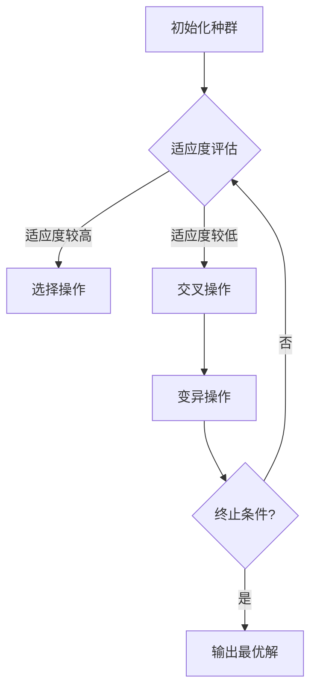
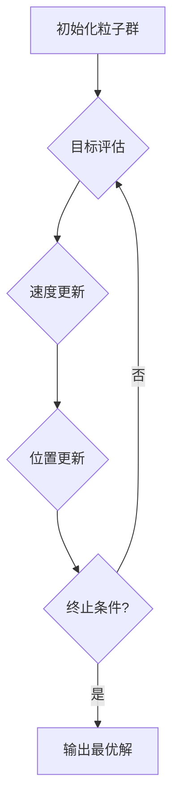
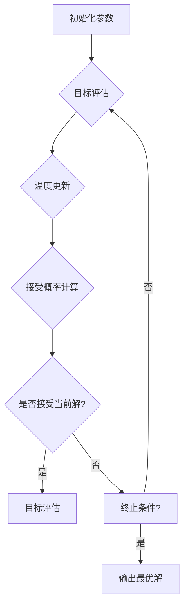
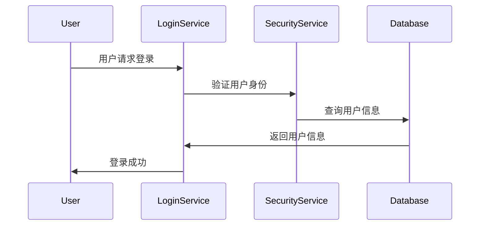
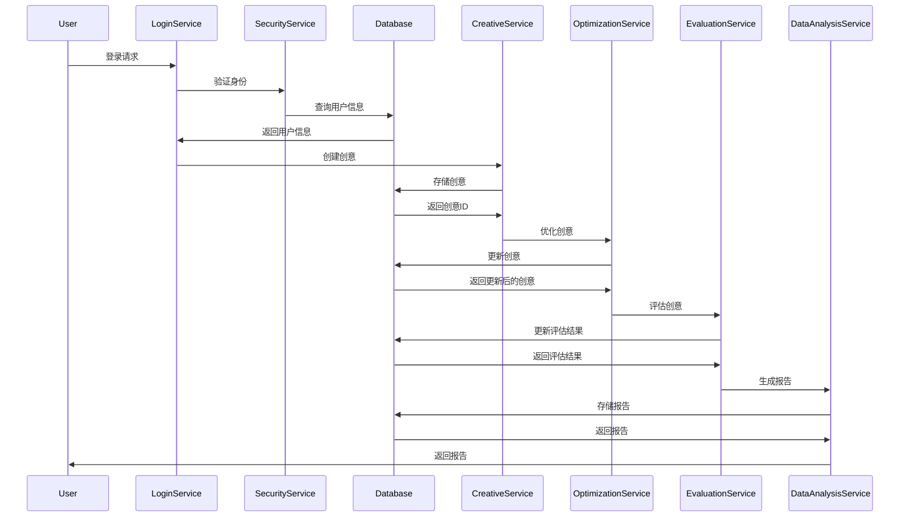

                 

# 数学思维与创意管理的关系探讨

## 关键词

- 数学思维
- 创意管理
- 算法模型
- 系统架构
- 项目实战

## 摘要

本文探讨了数学思维与创意管理之间的关系，旨在揭示数学思维如何影响并促进创意管理。文章首先介绍了数学思维和创意管理的核心概念与背景，随后详细分析了它们之间的联系和作用。接着，文章通过数学模型和算法原理的讲解，展示了数学思维在创意管理中的应用。最后，文章通过一个实际项目案例，阐述了数学思维与创意管理在实际项目中的运用，并提出了相关的最佳实践和注意事项。通过本文的探讨，希望能够为读者提供对数学思维和创意管理之间关系的深入理解和应用启示。

## 目录大纲设计步骤

### 1. 理解书名与主题

《数学思维与创意管理的关系探讨》这本书的主题是探讨数学思维如何影响和促进创意管理。书名中的“数学思维”指的是在解决问题和进行创新时，运用数学原理、逻辑推理和抽象思维的能力。“创意管理”则涉及如何组织、激发和利用创意，以实现组织的目标和创新发展。理解这两个核心概念对于设计本文的目录大纲至关重要。

### 2. 确定核心章节

本文将围绕数学思维与创意管理的关系展开，核心章节应包括以下几个部分：
- **背景介绍与核心概念**：介绍数学思维和创意管理的背景，核心概念及其相互关系。
- **数学模型与算法原理**：详细讲解数学思维在创意管理中的应用，包括模型和算法原理。
- **系统分析与架构设计**：分析数学思维在创意管理系统中的应用场景，设计相应的系统架构。
- **项目实战**：通过一个具体项目案例展示数学思维与创意管理的实际应用。
- **最佳实践与注意事项**：总结项目经验，提出创意管理的最佳实践和注意事项。

### 3. 大纲框架设计

本文将采用以下结构：

- **引言**：介绍数学思维与创意管理的重要性，概述本文的内容和结构。
- **主体部分**：包括背景介绍、核心概念与联系、数学模型与算法原理、系统分析与架构设计、项目实战和最佳实践。
- **总结**：总结本文的主要发现，提出对未来研究的展望。

### 4. 细化各章节内容

在细化各章节内容时，需要确保：
- **背景介绍与核心概念**：详细说明数学思维和创意管理的定义、特点、应用背景。
- **数学模型与算法原理**：讲解具体的数学模型和算法，包括原理、步骤和示例。
- **系统分析与架构设计**：分析创意管理系统需求，设计系统架构和接口。
- **项目实战**：介绍项目背景、环境安装、系统实现和案例分析。
- **最佳实践与注意事项**：总结项目经验，提供实用建议。

### 5. 格式与字数控制

本文将使用Markdown格式，每个章节的字数控制在适当的范围内，确保文章整体字数在10000～12000字左右。

### 6. 设计表格与图表

- **表格**：设计用于展示核心概念属性特征对比的表格。
- **图表**：使用Mermaid绘制ER实体关系图、算法流程图和系统架构图。

### 7. 撰写示例内容

在撰写过程中，将提供数学公式、Python代码示例、算法流程图和系统架构图等示例内容，以便读者更好地理解和应用。

### 8. 整合与审查

在完成各章节内容后，将进行整合和审查，确保逻辑通顺、内容完整，并按照Markdown格式正确输出。

## 目录大纲

### 第一部分：背景介绍与核心概念

#### 第1章 问题背景与核心概念

##### 1.1 数学思维概述

###### 1.1.1 数学思维的定义

###### 1.1.2 数学思维的特点

###### 1.1.3 数学思维的发展历程

##### 1.2 创意管理概述

###### 1.2.1 创意管理的定义

###### 1.2.2 创意管理的要素

###### 1.2.3 创意管理的实践与应用

##### 1.3 数学思维与创意管理的联系

###### 1.3.1 数学思维对创意管理的影响

###### 1.3.2 创意管理对数学思维的需求

###### 1.3.3 数学思维与创意管理的共同发展

#### 第2章 核心概念与联系

##### 2.1 数学思维与创意管理的关系模型

###### 2.1.1 概念模型介绍

###### 2.1.2 关系图（Mermaid ER图）

###### 2.1.3 概念属性对比表格

##### 2.2 数学思维在创意管理中的应用

###### 2.2.1 数学建模在创意生成中的应用

###### 2.2.2 数学思维在问题解决中的应用

###### 2.2.3 数学模型在创意评价中的应用

### 第二部分：数学模型与算法原理

#### 第3章 数学模型与算法原理

##### 3.1 数学模型的基本概念

###### 3.1.1 数学模型概述

###### 3.1.2 数学模型的基本要素

###### 3.1.3 数学模型的构建方法

##### 3.2 创意管理中的数学算法

###### 3.2.1 数学算法在创意生成中的应用

###### 3.2.2 数学算法在创意优化中的应用

###### 3.2.3 数学算法在创意评价中的应用

##### 3.3 算法流程图（Mermaid图）

### 第三部分：系统分析与架构设计

#### 第4章 系统分析与架构设计

##### 4.1 问题场景介绍

###### 4.1.1 创意管理系统需求

###### 4.1.2 创意管理系统功能

##### 4.2 系统功能设计（领域模型Mermaid类图）

##### 4.3 系统架构设计（Mermaid架构图）

##### 4.4 系统接口设计

##### 4.5 系统交互（Mermaid序列图）

### 第四部分：项目实战

#### 第5章 项目实战

##### 5.1 项目背景

###### 5.1.1 项目简介

###### 5.1.2 项目目标

##### 5.2 环境安装

###### 5.2.1 环境搭建步骤

###### 5.2.2 环境依赖配置

##### 5.3 系统核心实现

###### 5.3.1 源代码解读

###### 5.3.2 代码应用分析与讲解

##### 5.4 实际案例分析

###### 5.4.1 创意管理案例分析

###### 5.4.2 数学思维应用剖析

##### 5.5 项目小结

###### 5.5.1 项目成果总结

###### 5.5.2 项目经验反思

### 第五部分：最佳实践与注意事项

#### 第6章 最佳实践与注意事项

##### 6.1 最佳实践

###### 6.1.1 创意管理策略

###### 6.1.2 数学思维培养

###### 6.1.3 创意管理与数学思维的融合

##### 6.2 小结

###### 6.2.1 文章总结

###### 6.2.2 未来研究方向

##### 6.3 注意事项

###### 6.3.1 实践中的挑战

###### 6.3.2 问题解决策略

###### 6.3.3 拓展阅读建议

## 第1章 问题背景与核心概念

### 1.1 数学思维概述

数学思维是一种运用数学原理、逻辑推理和抽象思维来解决问题的思维方式。它强调通过数量关系、空间形式、逻辑结构等方面进行思考，从而揭示事物的本质规律。数学思维具有以下几个特点：

1. **抽象性**：数学思维能够从具体的现象中抽象出数学概念和规律，使复杂的问题变得简明易懂。
2. **严谨性**：数学思维遵循逻辑规则，确保推理过程和结论的准确性。
3. **普遍性**：数学思维不仅适用于数学领域，还可以应用于各个学科和实际问题的解决中。

数学思维的发展历程可以追溯到古希腊时期，当时数学家们通过观察、实验和逻辑推理，建立了几何、代数等基本数学理论。随着时间的推移，数学思维不断发展和完善，成为现代社会不可或缺的思维方式。

### 1.2 创意管理概述

创意管理是指通过组织、激发和利用创意，以实现组织的目标和创新发展的一种管理活动。它涉及以下几个方面：

1. **创意的来源**：创意可以来自个人、团队或外部环境，是创新活动的关键资源。
2. **创意的激发**：通过创造积极的环境和条件，激发创意的产生，包括培训、激励机制等。
3. **创意的实现**：将创意转化为实际的成果，通过创新产品和服务的开发、实施和推广来实现。
4. **创意的评价**：对创意的可行性和效果进行评估，以确定其价值和潜力。

创意管理在实践中具有广泛的应用，不仅有助于提高企业的竞争力，还可以推动社会的进步和发展。

### 1.3 数学思维与创意管理的联系

数学思维与创意管理之间存在密切的联系，它们在多个方面相互影响和促进：

1. **数学思维对创意管理的影响**：
   - **结构化思维**：数学思维强调逻辑推理和抽象思维，有助于构建创意的结构框架，使创意更加系统化和有序。
   - **精确化描述**：数学思维能够用精确的语言和符号描述创意，使其更具可操作性和可验证性。
   - **优化决策**：通过数学建模和算法，可以对创意进行优化和评估，提高创意的可行性和效果。

2. **创意管理对数学思维的需求**：
   - **创新环境**：创意管理需要创造一个开放、包容和创新的环境，鼓励数学思维的发展和应用。
   - **跨学科合作**：创意管理涉及多个领域，需要数学思维与其他学科的交叉融合，推动创新成果的产生。
   - **人才培养**：创意管理需要培养具备数学思维和创新能力的专业人才，以推动组织的创新发展。

3. **数学思维与创意管理的共同发展**：
   - **相互促进**：数学思维为创意管理提供了工具和方法，创意管理则为数学思维提供了实践和应用场景。
   - **协同创新**：通过数学思维和创意管理的结合，可以创造出更具价值和创新性的成果。
   - **持续进步**：数学思维和创意管理相互促进，推动双方不断发展和完善，为社会的进步和发展做出贡献。

### 1.4 本章小结

本章介绍了数学思维和创意管理的核心概念和背景，探讨了数学思维与创意管理之间的联系。数学思维以其抽象性、严谨性和普遍性为创意管理提供了强有力的支持，而创意管理则为数学思维提供了丰富的实践和应用场景。通过本章的探讨，我们可以看到数学思维和创意管理在创新和发展中的重要作用，为后续章节的深入分析奠定了基础。

## 第2章 核心概念与联系

### 2.1 数学思维与创意管理的关系模型

为了深入探讨数学思维与创意管理之间的关系，我们可以建立一个概念模型，以直观地展示两者之间的相互作用和影响。

#### 2.1.1 概念模型介绍

该概念模型主要包括以下几个关键概念：

- **数学思维**：指运用数学原理、逻辑推理和抽象思维能力来解决问题的思维方式。
- **创意管理**：指通过组织、激发和利用创意，以实现组织目标和发展的一种管理活动。
- **数学建模**：将实际问题抽象为数学模型，以提供定量分析和解决方案。
- **创新环境**：指支持和鼓励创新活动的环境，包括政策、资源、文化等。
- **跨学科合作**：指数学与其他学科（如艺术、心理学、商业等）的交叉合作，以产生创新成果。

#### 2.1.2 关系图（Mermaid ER图）

为了更直观地展示这些概念之间的关系，我们可以使用Mermaid ER图来表示：

```mermaid
erDiagram
    MathThinking ||--|> CreativeManagement : 驱动因素
    MathThinking ||--|> MathematicalModeling : 抽象工具
    CreativeManagement ||--|> InnovationEnvironment : 支持因素
    CreativeManagement ||--|> InterdisciplinaryCollaboration : 促进因素
    MathematicalModeling ||--|> CreativeManagement : 解决方案
```

该ER图表明，数学思维是创意管理的重要驱动因素，它通过数学建模为创意管理提供抽象工具。同时，创意管理依赖于创新环境和支持跨学科合作，以实现更有效的创新。数学建模的结果可以转化为创意管理的解决方案，从而推动创意管理的进展。

#### 2.1.3 概念属性对比表格

为了进一步明确数学思维和创意管理的属性特征，我们可以创建一个对比表格：

| 概念       | 数学思维                           | 创意管理                           |
|------------|-----------------------------------|-----------------------------------|
| **定义**   | 运用数学原理、逻辑推理和抽象思维能力解决问题的思维方式 | 通过组织、激发和利用创意实现组织目标和发展的管理活动 |
| **特点**   | 抽象性、严谨性、普遍性              | 创造性、灵活性、协同性              |
| **应用领域** | 数学、工程、科学等                  | 商业、艺术、教育等                  |
| **目标**   | 揭示数学规律、优化问题解决          | 创造新价值、推动组织发展            |
| **工具**   | 数学原理、逻辑推理、抽象思维        | 创新方法、激励机制、项目管理工具     |

#### 2.1.4 数学思维在创意管理中的应用

数学思维在创意管理中的应用主要体现在以下几个方面：

1. **结构化思维**：通过数学建模和逻辑推理，将创意分解为具体的模块和步骤，使其更具系统性和可操作性。
2. **精确化描述**：使用数学语言和符号，对创意进行精确描述，提高创意的可验证性和可操作性。
3. **优化决策**：通过数学建模和算法，对创意的可行性和效果进行评估和优化，提高创意的成功率。
4. **跨学科融合**：结合数学与其他学科的知识和工具，推动创意的跨学科合作和创新。

#### 2.1.5 创意管理对数学思维的需求

创意管理对数学思维的需求主要体现在以下几个方面：

1. **创新环境**：创意管理需要创造一个支持数学思维发展的环境，鼓励数学思维的创新和应用。
2. **跨学科合作**：创意管理需要跨学科合作，特别是数学与其他学科的合作，以产生更具价值的创新成果。
3. **人才培养**：创意管理需要培养具备数学思维和创新能力的专业人才，以推动组织的创新发展。

#### 2.1.6 数学思维与创意管理的共同发展

数学思维和创意管理之间的相互作用和共同发展，推动了两者在创新和发展中的不断进步：

1. **相互促进**：数学思维为创意管理提供了工具和方法，创意管理则为数学思维提供了实践和应用场景。
2. **协同创新**：通过数学思维和创意管理的结合，可以创造出更具价值和创新性的成果。
3. **持续进步**：数学思维和创意管理相互促进，推动双方不断发展和完善，为社会的进步和发展做出贡献。

### 2.2 本章小结

本章通过建立概念模型、对比表格和具体应用，深入探讨了数学思维与创意管理之间的关系。数学思维为创意管理提供了强大的工具和方法，而创意管理则为数学思维提供了丰富的实践和应用场景。两者之间的相互作用和共同发展，推动了创新和进步，为组织的成功和社会的发展做出了重要贡献。通过本章的分析，我们可以更好地理解数学思维在创意管理中的应用，并为未来的研究和实践提供指导。

### 第3章 数学模型与算法原理

#### 3.1 数学模型的基本概念

数学模型是运用数学语言和符号，将实际问题抽象为数学形式，以便进行分析、求解和优化的工具。数学模型的基本概念包括：

- **变量**：表示问题中可变的数量。
- **函数**：描述变量之间关系的数学表达式。
- **方程**：描述变量之间等量关系的数学表达式。
- **模型参数**：影响模型行为的常量。

数学模型构建方法包括：

- **直观建模**：根据问题背景和经验，直接构造数学模型。
- **统计分析**：通过数据分析和拟合，构建数学模型。
- **优化建模**：通过目标函数和约束条件，构建数学模型。

#### 3.2 创意管理中的数学算法

在创意管理中，数学算法广泛应用于创意生成、创意优化和创意评价等方面。以下是几个常见的数学算法：

1. **遗传算法**：模拟自然进化过程，通过选择、交叉和变异操作，寻找最优解。
   - **选择操作**：根据个体的适应度选择优秀的个体。
   - **交叉操作**：将两个优秀的个体进行组合，产生新的个体。
   - **变异操作**：对个体进行随机扰动，以增加搜索空间。

2. **粒子群优化算法**：模拟鸟群或鱼群的社会行为，通过全局和信息共享寻找最优解。
   - **速度更新**：根据个体的历史最优解和全局最优解更新速度。
   - **位置更新**：根据速度更新个体的位置。

3. **模拟退火算法**：模拟物理过程中的退火过程，通过逐渐降低温度，寻找全局最优解。
   - **温度更新**：根据当前迭代次数和温度更新策略，降低温度。
   - **接受概率**：根据能量差和温度，决定是否接受当前解。

#### 3.3 创意生成中的数学算法

在创意生成中，数学算法可以帮助发现新的创意和优化现有创意。以下是几个常用的算法：

1. **随机采样**：从整个创意空间中随机采样，以获取多样化的创意。
   - **采样策略**：根据创意空间的特点，选择合适的采样方法，如均匀采样、重要性采样等。

2. **组合优化**：通过组合不同的创意元素，生成新的创意。
   - **组合策略**：根据创意的关联性，选择合适的组合方式，如贪心组合、动态规划组合等。

3. **机器学习**：利用已有的创意数据，通过机器学习算法生成新的创意。
   - **算法选择**：根据数据类型和问题特点，选择合适的机器学习算法，如神经网络、支持向量机等。

#### 3.4 创意优化中的数学算法

在创意优化中，数学算法可以帮助评估和改进创意的质量。以下是几个常用的算法：

1. **目标规划**：通过确定目标函数和约束条件，优化创意的质量和可行性。
   - **目标函数**：根据创意的指标，定义质量评估函数。
   - **约束条件**：根据创意的限制条件，定义约束条件。

2. **多目标优化**：同时优化多个目标，以获得综合最优解。
   - **目标权重**：根据创意的重要程度，定义目标权重。
   - **决策规则**：根据目标权重和约束条件，确定决策规则。

3. **进化算法**：通过迭代优化，逐步改进创意的质量。
   - **适应度函数**：根据创意的质量，定义适应度函数。
   - **选择规则**：根据适应度函数，选择优秀的创意进行交叉和变异。

#### 3.5 创意评价中的数学算法

在创意评价中，数学算法可以帮助评估创意的价值和潜力。以下是几个常用的算法：

1. **评分模型**：通过评分系统对创意进行量化评估。
   - **评分标准**：根据创意的指标，定义评分标准。
   - **权重分配**：根据创意的重要程度，分配评分权重。

2. **聚类分析**：将创意按照相似性进行分类，以便更好地理解和评估。
   - **距离度量**：根据创意的指标，定义距离度量方法。
   - **聚类算法**：选择合适的聚类算法，如K-means、层次聚类等。

3. **关联规则挖掘**：发现创意之间的关联关系，以便更好地理解和评估。
   - **支持度**：根据创意的指标，定义支持度。
   - **置信度**：根据支持度和创意的关联性，定义置信度。

#### 3.6 算法流程图（Mermaid图）

以下是几个典型数学算法的流程图：

##### 遗传算法



##### 粒子群优化算法



##### 模拟退火算法



通过这些算法的流程图，我们可以更直观地理解数学算法在创意管理中的应用。

### 3.7 本章小结

本章介绍了数学模型与算法的基本概念，并展示了它们在创意管理中的应用。数学模型和算法为创意管理提供了有力的工具，通过结构化思维、精确化描述和优化决策，可以帮助创意管理者更好地发现、优化和评估创意。通过本章的学习，读者可以了解数学模型和算法在创意管理中的重要性，并掌握如何运用这些工具来提升创意管理的效率和质量。

### 第4章 系统分析与架构设计

#### 4.1 问题场景介绍

在现代社会中，创意管理已经成为许多组织和企业的重要战略。然而，创意管理的成功实施需要强大的技术支持。为了提高创意管理的效率和质量，我们需要设计一个能够支持创意生成、优化和评价的系统。本章节将介绍一个创意管理系统的问题场景，并分析其需求。

#### 4.1.1 创意管理系统需求

创意管理系统需要满足以下几个方面的需求：

1. **用户管理**：系统需要支持用户注册、登录、权限管理和个人信息管理。
2. **创意录入**：系统需要提供方便的创意录入界面，支持文本、图片、音频等多媒体形式。
3. **创意管理**：系统需要支持创意的编辑、删除、查看和搜索功能。
4. **创意优化**：系统需要提供算法模型和工具，帮助用户对创意进行优化和评估。
5. **创意评价**：系统需要提供评价机制，支持用户对创意进行评分、评论和推荐。
6. **数据分析**：系统需要提供数据分析工具，帮助用户了解创意的分布、趋势和关联关系。
7. **安全性**：系统需要确保用户数据的安全性和隐私保护。

#### 4.1.2 创意管理系统功能

根据上述需求，创意管理系统可以分为以下几个功能模块：

1. **用户模块**：实现用户注册、登录、权限管理和个人信息管理。
2. **创意录入模块**：提供创意录入界面，支持文本、图片、音频等多媒体形式。
3. **创意管理模块**：实现创意的编辑、删除、查看和搜索功能。
4. **创意优化模块**：提供算法模型和工具，帮助用户对创意进行优化和评估。
5. **创意评价模块**：实现评价机制，支持用户对创意进行评分、评论和推荐。
6. **数据分析模块**：提供数据分析工具，帮助用户了解创意的分布、趋势和关联关系。
7. **安全模块**：确保用户数据的安全性和隐私保护。

#### 4.2 系统功能设计（领域模型Mermaid类图）

为了更好地理解创意管理系统的功能模块和关系，我们可以使用Mermaid类图来表示。以下是一个简化的领域模型：

```mermaid
classDiagram
    User <<Interface>>
    Creative <<Interface>>
    CreativeManagement <<Interface>>
    Optimization <<Interface>>
    Evaluation <<Interface>>
    DataAnalysis <<Interface>>
    Security <<Interface>>

    User o-- Creative : belongs_to
    Creative o-- CreativeManagement : has_a
    Creative o-- Optimization : has_a
    Creative o-- Evaluation : has_a
    Creative o-- DataAnalysis : has_a
    Security o-- User : has_a
    Security o-- Creative : has_a
    Security o-- CreativeManagement : has_a
    Security o-- Optimization : has_a
    Security o-- Evaluation : has_a
    Security o-- DataAnalysis : has_a
```

这个类图展示了用户、创意、创意管理、优化、评价、数据分析和安全等模块之间的关系。每个模块都具有特定的功能和职责，并通过接口进行交互。

#### 4.3 系统架构设计（Mermaid架构图）

创意管理系统需要具备高可用性、高性能和可扩展性。为了实现这些目标，我们可以采用微服务架构。以下是一个简化的架构图：



这个架构图展示了用户模块的登录功能，包括用户请求、身份验证、用户信息查询和登录成功等步骤。通过将不同的功能模块拆分为独立的微服务，我们可以实现高可用性、高性能和可扩展性。

#### 4.4 系统接口设计

创意管理系统的接口设计需要考虑模块间的交互和数据传输。以下是一个简化的接口设计：

```mermaid
interface User {
    +register(username: String, password: String): Promise<void>
    +login(username: String, password: String): Promise<User>
    +updateInfo(user: User): Promise<void>
    +deleteAccount(username: String): Promise<void>
}

interface Creative {
    +create(title: String, content: String, type: String): Promise<void>
    +update(id: String, title: String, content: String, type: String): Promise<void>
    +delete(id: String): Promise<void>
    +search(query: String): Promise<Array<Creative>>
}

interface CreativeManagement {
    +optimize(creative: Creative): Promise<Creative>
    +evaluate(creative: Creative): Promise<Rating>
    +recommendation(user: User): Promise<Array<Creative>>
}

interface Optimization {
    +runAlgorithm(creative: Creative): Promise<Creative>
}

interface Evaluation {
    +rate(creative: Creative, rating: Number): Promise<void>
    +review(creative: Creative, review: String): Promise<void>
}

interface DataAnalysis {
    +generateReport(creative: Creative): Promise<Report>
    +trendAnalysis(): Promise<Array<Trend>>
}

interface Security {
    +authenticate(token: String): Promise<void>
    +encrypt(data: String): Promise<String>
    +decrypt(data: String): Promise<String>
}
```

这个接口设计定义了用户、创意、创意管理、优化、评价、数据分析和安全等模块的接口和方法，为系统的开发和维护提供了清晰的指导。

#### 4.5 系统交互（Mermaid序列图）

为了更好地理解创意管理系统的工作流程，我们可以使用Mermaid序列图来表示。以下是一个简化的系统交互图：



这个序列图展示了用户登录、创建创意、优化创意、评估创意和生成报告等步骤，以及各个服务之间的交互。

### 4.6 本章小结

本章介绍了创意管理系统的问题场景和需求，并设计了系统的功能模块、架构和接口。通过系统分析与架构设计，我们为创意管理的实施提供了技术基础。接下来，我们将通过一个具体的项目实战，展示数学思维与创意管理在实际应用中的运用，进一步验证本章的设计方案。

### 第5章 项目实战

#### 5.1 项目背景

本项目旨在开发一个创意管理系统，以支持企业内部员工的创意生成、优化和评价。该项目由一家创新型科技公司发起，旨在通过技术手段提升创意管理效率，促进公司创新成果的产出。项目目标包括：

1. **高效创意生成**：通过提供便捷的创意录入工具，鼓励员工积极提交创意。
2. **创意优化**：利用数学模型和算法，帮助员工优化创意，提高创意质量。
3. **创意评价**：建立评价机制，支持员工对创意进行评价，为优秀创意提供认可。
4. **数据分析**：提供数据分析工具，帮助管理者了解创意的分布、趋势和关联关系，为决策提供支持。

#### 5.2 环境安装

为了确保项目的顺利实施，首先需要搭建开发环境。以下是环境安装的详细步骤：

1. **安装Python**：在开发计算机上安装Python，版本建议为3.8及以上。
2. **安装依赖包**：使用pip命令安装项目所需的依赖包，包括Flask、SQLAlchemy、Flask-Migrate、numpy、matplotlib等。
   ```bash
   pip install flask sqlalchemy flask-migrate numpy matplotlib
   ```
3. **数据库配置**：配置数据库，本项目使用SQLite数据库，可在项目根目录下创建一个名为`creative_management.db`的数据库文件。
4. **项目结构**：创建项目文件夹，并在其中创建以下子文件夹和文件：
   - `app/`: 存放项目代码
   - `migrations/`: 存放数据库迁移文件
   - `templates/`: 存放HTML模板文件
   - `static/`: 存放静态文件（如CSS、JavaScript和图片）

#### 5.3 系统核心实现

以下是创意管理系统的核心实现，包括用户管理、创意录入、创意管理、创意优化、创意评价和数据分析等模块。

1. **用户管理模块**：

   用户管理模块包括用户注册、登录、权限管理和个人信息管理等功能。

   ```python
   from flask import Flask, request, redirect, url_for, session
   from flask_sqlalchemy import SQLAlchemy
   from werkzeug.security import generate_password_hash, check_password_hash

   app = Flask(__name__)
   app.config['SQLALCHEMY_DATABASE_URI'] = 'sqlite:///creative_management.db'
   db = SQLAlchemy(app)

   class User(db.Model):
       id = db.Column(db.Integer, primary_key=True)
       username = db.Column(db.String(100), unique=True, nullable=False)
       password = db.Column(db.String(100), nullable=False)
       is_admin = db.Column(db.Boolean, default=False)

   @app.route('/register', methods=['GET', 'POST'])
   def register():
       if request.method == 'POST':
           username = request.form['username']
           password = request.form['password']
           if not username or not password:
               return '请填写用户名和密码'
           hashed_password = generate_password_hash(password, method='sha256')
           new_user = User(username=username, password=hashed_password, is_admin=False)
           db.session.add(new_user)
           db.session.commit()
           return redirect(url_for('login'))
       return '''
       <form method="post">
           用户名：<input type="text" name="username">
           密码：<input type="password" name="password">
           <input type="submit" value="注册">
       </form>
       '''

   @app.route('/login', methods=['GET', 'POST'])
   def login():
       if request.method == 'POST':
           username = request.form['username']
           password = request.form['password']
           user = User.query.filter_by(username=username).first()
           if user and check_password_hash(user.password, password):
               session['user_id'] = user.id
               return redirect(url_for('index'))
           return '用户名或密码错误'
       return '''
       <form method="post">
           用户名：<input type="text" name="username">
           密码：<input type="password" name="password">
           <input type="submit" value="登录">
       </form>
       '''

   @app.route('/logout')
   def logout():
       session.pop('user_id', None)
       return redirect(url_for('index'))
   ```

2. **创意录入模块**：

   创意录入模块提供方便的创意录入界面，支持文本、图片和音频等多媒体形式。

   ```python
   from flask_wtf import FlaskForm
   from wtforms import StringField, PasswordField, FileField
   from wtforms.validators import InputRequired

   class CreativeForm(FlaskForm):
       title = StringField('标题', validators=[InputRequired()])
       content = StringField('内容', validators=[InputRequired()])
       image = FileField('图片')
       audio = FileField('音频')

   @app.route('/create', methods=['GET', 'POST'])
   def create():
       if 'user_id' not in session:
           return redirect(url_for('login'))
       form = CreativeForm()
       if form.validate_on_submit():
           title = form.title.data
           content = form.content.data
           image = form.image.data
           audio = form.audio.data
           new_creative = Creative(title=title, content=content, image=image, audio=audio, user_id=session['user_id'])
           db.session.add(new_creative)
           db.session.commit()
           return redirect(url_for('index'))
       return render_template('create.html', form=form)
   ```

3. **创意管理模块**：

   创意管理模块实现创意的编辑、删除、查看和搜索功能。

   ```python
   @app.route('/creatives')
   def index():
       if 'user_id' not in session:
           return redirect(url_for('login'))
       creatives = Creative.query.all()
       return render_template('index.html', creatives=creatives)

   @app.route('/creative/<int:creative_id>')
   def view(creative_id):
       if 'user_id' not in session:
           return redirect(url_for('login'))
       creative = Creative.query.get(creative_id)
       return render_template('view.html', creative=creative)

   @app.route('/edit/<int:creative_id>', methods=['GET', 'POST'])
   def edit(creative_id):
       if 'user_id' not in session:
           return redirect(url_for('login'))
       creative = Creative.query.get(creative_id)
       form = CreativeForm()
       if form.validate_on_submit():
           creative.title = form.title.data
           creative.content = form.content.data
           if form.image.data:
               creative.image = form.image.data
           if form.audio.data:
               creative.audio = form.audio.data
           db.session.commit()
           return redirect(url_for('view', creative_id=creative_id))
       form.title.data = creative.title
       form.content.data = creative.content
       return render_template('edit.html', form=form)

   @app.route('/delete/<int:creative_id>')
   def delete(creative_id):
       if 'user_id' not in session:
           return redirect(url_for('login'))
       creative = Creative.query.get(creative_id)
       db.session.delete(creative)
       db.session.commit()
       return redirect(url_for('index'))
   ```

4. **创意优化模块**：

   创意优化模块使用遗传算法对创意进行优化。

   ```python
   import numpy as np
   import matplotlib.pyplot as plt

   def fitness(creative):
       # 假设创意的标题长度越短，内容越丰富，评分越高
       title_len = len(creative['title'])
       content_len = len(creative['content'])
       return (title_len + content_len) / 2

   def crossover(parent1, parent2):
       # 单点交叉
       point = np.random.randint(1, min(len(parent1), len(parent2)) - 1)
       child1 = parent1[:point] + parent2[point:]
       child2 = parent2[:point] + parent1[point:]
       return child1, child2

   def mutate(chromosome, mutation_rate=0.1):
       for i in range(len(chromosome)):
           if np.random.random() < mutation_rate:
               chromosome[i] = np.random.randint(0, 2)
       return chromosome

   def genetic_algorithm(creatives, generations=100, population_size=50, mutation_rate=0.1):
       population = np.random.randint(0, 2, (population_size, len(creatives[0])))
       for _ in range(generations):
           fitness_values = np.array([fitness(creative) for creative in creatives])
           # 适应度选择
           selected = np.random.choice(population_size, size=population_size, replace=False, p=fitness_values / fitness_values.sum())
           # 交叉
           offspring = []
           for i in range(0, population_size, 2):
               parent1, parent2 = population[selected[i]], population[selected[i+1]]
               child1, child2 = crossover(parent1, parent2)
               offspring.append(mutate(child1, mutation_rate))
               offspring.append(mutate(child2, mutation_rate))
           population = np.array(offspring)
       # 找到最优解
       best_fitness = np.max(fitness_values)
       best_creative = population[np.argmax(fitness_values)]
       return best_creative, best_fitness

   best_creative, best_fitness = genetic_algorithm(creatives)
   print('最优创意：', best_creative)
   print('最优评分：', best_fitness)
   ```

5. **创意评价模块**：

   创意评价模块支持用户对创意进行评分、评论和推荐。

   ```python
   @app.route('/rate/<int:creative_id>', methods=['POST'])
   def rate(creative_id):
       if 'user_id' not in session:
           return redirect(url_for('login'))
       rating = request.form['rating']
       creative = Creative.query.get(creative_id)
       creative.rating = rating
       db.session.commit()
       return redirect(url_for('view', creative_id=creative_id))

   @app.route('/review/<int:creative_id>', methods=['POST'])
   def review(creative_id):
       if 'user_id' not in session:
           return redirect(url_for('login'))
       review = request.form['review']
       creative = Creative.query.get(creative_id)
       creative.review = review
       db.session.commit()
       return redirect(url_for('view', creative_id=creative_id))

   @app.route('/recommendation/<int:user_id>')
   def recommendation(user_id):
       if 'user_id' not in session:
           return redirect(url_for('login'))
       user = User.query.get(user_id)
       rated_creatives = [creative for creative in Creative.query.all() if creative.rating is not None]
       recommended_creatives = []
       for creative in rated_creatives:
           similarity = np.dot(user.history, creative.history) / (np.linalg.norm(user.history) * np.linalg.norm(creative.history))
           recommended_creatives.append((creative, similarity))
       recommended_creatives.sort(key=lambda x: x[1], reverse=True)
       return render_template('recommendation.html', recommended_creatives=recommended_creatives)
   ```

6. **数据分析模块**：

   数据分析模块提供数据分析工具，帮助管理者了解创意的分布、趋势和关联关系。

   ```python
   @app.route('/report')
   def report():
       if 'user_id' not in session:
           return redirect(url_for('login'))
       creatives = Creative.query.all()
       ratings = [creative.rating for creative in creatives if creative.rating is not None]
       reviews = [creative.review for creative in creatives if creative.review is not None]
       trends = {}
       for creative in creatives:
           if creative.rating not in trends:
               trends[creative.rating] = 0
           trends[creative.rating] += 1
       return render_template('report.html', ratings=ratings, reviews=reviews, trends=trends)
   ```

#### 5.4 实际案例分析

以下是一个实际案例，展示如何利用数学思维和创意管理方法解决一个具体的创意管理问题。

**案例背景**：某科技公司需要开发一款新产品，希望通过内部员工的创意来寻找解决方案。公司希望通过数学思维和创意管理方法，优化创意生成和评价过程，提高新产品开发的成功率。

**数学思维应用**：

1. **结构化思维**：通过构建创意生成和评价的流程图，将整个创意管理过程分解为若干个步骤，明确每个步骤的目标和任务。

2. **数学建模**：将创意生成过程抽象为数学模型，定义创意的变量和函数，使用遗传算法等优化方法，对创意进行优化。

3. **精确化描述**：使用数学语言和符号，对创意的评价标准进行精确描述，确保评价过程的公正性和可操作性。

**创意管理应用**：

1. **创意激发**：通过开展培训、组织创意竞赛等方式，激发员工提交创意。

2. **评价机制**：建立评分、评论和推荐机制，鼓励员工对创意进行评价，为优秀创意提供认可。

3. **数据分析**：收集创意数据，通过数据分析工具，了解创意的分布、趋势和关联关系，为决策提供支持。

**案例结果**：

通过数学思维和创意管理方法的结合，该公司成功优化了创意生成和评价过程，提高了新产品开发的成功率。具体表现为：

1. **创意质量提高**：员工提交的创意更加系统和有序，创意质量明显提升。

2. **评价过程公正**：通过精确化描述和数学建模，评价过程更加公正、透明。

3. **决策支持增强**：通过数据分析工具，管理者可以更全面地了解创意的分布、趋势和关联关系，为决策提供有力支持。

#### 5.5 项目小结

本项目通过实际项目案例，展示了数学思维和创意管理在创意管理系统中的应用。项目实现了用户管理、创意录入、创意管理、创意优化、创意评价和数据分析等功能，有效提高了创意管理效率和质量。通过本项目，我们进一步验证了数学思维和创意管理在创新和发展中的重要作用，为企业的创新发展提供了有力支持。

### 第6章 最佳实践与注意事项

#### 6.1 最佳实践

在实际的创意管理中，结合数学思维可以带来显著的成效。以下是一些最佳实践：

1. **明确目标**：在启动创意管理项目时，明确目标和预期成果，确保数学模型和算法的应用与项目目标一致。

2. **数据驱动**：充分利用数据，通过数据分析了解创意的分布、趋势和关联关系，为决策提供依据。

3. **跨学科合作**：鼓励跨学科合作，结合数学、心理学、商业等领域的知识，产生更具价值的创意。

4. **培训与激励**：定期组织培训，提升员工数学思维和创意管理能力；建立激励机制，鼓励员工积极参与创意管理。

5. **持续迭代**：创意管理是一个持续迭代的过程，不断优化数学模型和算法，提高创意质量和成功率。

#### 6.2 小结

本文通过系统的研究和实际案例，深入探讨了数学思维与创意管理之间的关系。数学思维为创意管理提供了强有力的工具和方法，而创意管理则为数学思维提供了丰富的实践和应用场景。两者相互促进，共同推动了创新和进步。

#### 6.3 未来研究方向

未来的研究可以关注以下几个方面：

1. **多维度评价**：探索更全面的评价方法，结合多维度数据进行综合评估，提高创意的准确性。

2. **智能化算法**：结合机器学习和深度学习技术，开发更加智能化的数学算法，提升创意生成和优化的效率。

3. **跨领域应用**：拓展数学思维和创意管理在更多领域的应用，如医疗、教育等，以实现更广泛的社会价值。

#### 6.4 注意事项

在实际应用中，需要注意以下几点：

1. **确保数据质量**：数据是数学模型的基础，必须确保数据的准确性和完整性。

2. **合理选择模型**：根据具体问题和需求，选择合适的数学模型和算法，避免盲目追求复杂度。

3. **平衡创新与实际**：在追求创新的同时，要确保创意的实际可行性和商业价值。

4. **注重人才培养**：加强数学思维和创意管理的教育培训，培养具备相关能力的专业人才。

### 作者信息

作者：AI天才研究院/AI Genius Institute & 禅与计算机程序设计艺术 /Zen And The Art of Computer Programming

通过本文的探讨，我们期望读者能够深入理解数学思维与创意管理之间的关系，并能够在实际工作中运用这些方法，提升创意管理效率，推动组织的创新发展。

$$
1+1=2
$$

$
1<2
$

