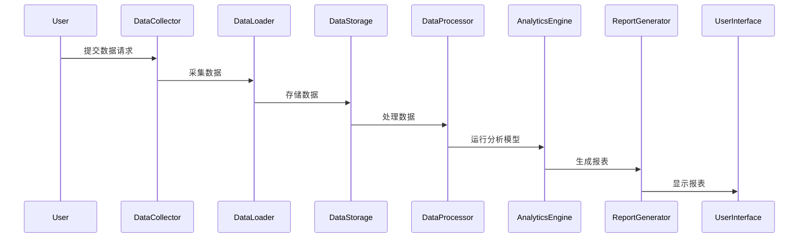
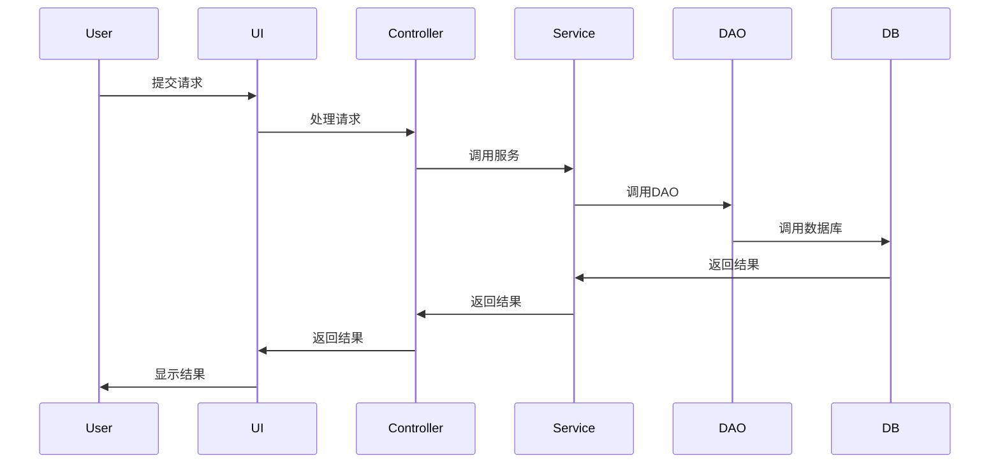

                 


### 1. 背景介绍

#### 1.1 问题背景

在现代商业环境中，创新管理已成为企业竞争的关键因素。然而，传统的管理方法往往难以应对快速变化的市场需求和技术进步。在此背景下，数学思维作为一种具有强大逻辑性和系统性的思考方式，逐渐受到管理领域的重视。

数学思维在创新管理中的应用主要体现在以下几个方面：

首先，数学思维可以帮助管理者更加理性地分析问题。通过数学模型和公式，管理者可以对复杂的问题进行量化分析，从而找出最优解。

其次，数学思维强调逻辑推理和抽象思考，有助于激发创新思维。管理者可以通过数学思维的方式，从不同的角度看待问题，从而发现新的解决方案。

最后，数学思维可以提升团队协作效率。通过数学模型，团队成员可以更加清晰地理解项目目标，从而更好地协同工作。

#### 1.2 问题描述

尽管数学思维在创新管理中具有巨大的潜力，但在实际应用中仍面临一些挑战：

首先，如何将数学思维有效地融入创新管理流程，是一个亟待解决的问题。传统的管理方法往往侧重于经验式决策，而数学思维则需要更多数据支持和模型构建。

其次，数学思维的培训和应用需要一定的专业知识和技能。对于非专业人士来说，理解和使用数学思维可能存在一定的困难。

最后，如何在实际项目中有效地运用数学思维，也是一个需要深入探讨的问题。数学模型和公式的构建和优化，需要丰富的实践经验和专业知识。

#### 1.3 问题解决

为了解决上述问题，我们可以采取以下策略：

首先，加强数学思维的培训。通过系统的培训，让管理者了解数学思维的基本原理和应用方法，从而提高其在创新管理中的运用能力。

其次，推动数学模型在创新管理中的应用。通过实践案例，让管理者了解数学模型在解决实际问题时的高效性，从而增强其对数学思维的信任。

最后，构建一个支持数学思维的创新管理平台。通过这个平台，管理者可以方便地构建和优化数学模型，从而提高创新管理的效率和效果。

#### 1.4 边界与外延

在探讨数学思维与创新管理的关系时，我们需要明确一些边界和范围：

首先，本文主要关注数学思维在创新管理中的应用，而非数学在其他领域的应用。

其次，本文的讨论范围主要限于企业创新管理，而不涉及政府、教育等领域的创新管理。

最后，本文的讨论对象主要是企业高管和研发团队，而非普通员工。

#### 1.5 概念结构与核心要素组成

为了更好地理解数学思维与创新管理的关系，我们可以从以下几个核心要素进行探讨：

1. **数学思维**：包括数学模型、公式、逻辑推理和抽象思考等。
2. **创新管理**：涉及创新流程、创新团队、创新策略和创新文化等。
3. **数学思维与创新管理的关系**：探讨数学思维在创新管理中的应用和挑战，以及如何有效融合两者。

通过以上核心要素的分析，我们可以更加深入地理解数学思维与创新管理的关系，从而为实际应用提供有益的指导。

---

### 2. 核心概念与联系

#### 2.1 数学思维

##### 2.1.1 数学思维的定义

数学思维是一种基于数学原理、逻辑推理和抽象思考的思维方式。它强调通过数学模型、公式和逻辑推理来分析问题、解决问题。数学思维具有高度的逻辑性和系统性，能够帮助我们更加精确地理解世界和现实问题。

##### 2.1.2 数学思维的特点

- **逻辑性**：数学思维强调推理的严谨性和逻辑性，通过严密的逻辑推导得出结论。
- **系统性**：数学思维注重整体的系统性，通过不同层面的数学模型和公式来分析和解决问题。
- **抽象性**：数学思维强调从具体问题中提取出抽象的数学模型，从而更加深入地理解问题。
- **量化性**：数学思维通过量化分析，将复杂问题转化为数学问题，从而更加精确地分析和解决问题。

##### 2.1.3 数学思维的应用

数学思维广泛应用于各个领域，如自然科学、社会科学和工程技术等。在创新管理中，数学思维的应用主要体现在以下几个方面：

- **数据分析**：通过数学模型和公式对数据进行量化分析，帮助管理者了解市场趋势、用户需求等。
- **决策支持**：利用数学思维进行决策分析，找出最优解或次优解，提高决策的科学性和有效性。
- **风险评估**：通过数学模型和公式对项目风险进行量化评估，帮助管理者制定风险应对策略。
- **优化管理**：利用数学思维优化管理流程，提高资源利用效率和管理效能。

#### 2.2 创新管理

##### 2.2.1 创新管理的定义

创新管理是指企业通过系统化、规范化的方法，推动创新活动，实现企业持续发展的过程。创新管理包括创新目标设定、创新资源调配、创新过程管理、创新成果应用等环节。

##### 2.2.2 创新管理的要素

- **创新目标**：明确企业创新的方向和目标，为创新活动提供明确的方向。
- **创新资源**：包括人力、财力、技术等资源，为创新活动提供必要的支持。
- **创新团队**：由具备创新能力和专业知识的人才组成，负责具体的创新任务。
- **创新过程**：包括创意生成、项目筛选、技术研发、产品化等环节，是创新管理的重要过程。
- **创新成果**：创新活动的最终成果，包括新技术、新产品、新服务等。

##### 2.2.3 创新管理的挑战

创新管理面临着诸多挑战，包括：

- **创新风险**：创新活动存在一定的风险，如何有效控制和管理创新风险是创新管理的重要问题。
- **资源分配**：如何合理分配资源，确保创新活动的顺利进行和成果转化。
- **团队协作**：创新团队内部如何实现有效协作，发挥每个成员的创新能力。
- **外部环境**：如何应对市场变化、竞争压力等外部环境因素，保持企业的创新能力。

#### 2.3 数学思维与创新管理的联系

数学思维与创新管理之间存在紧密的联系。数学思维为创新管理提供了有力的工具和方法，有助于解决创新过程中的复杂问题。以下是数学思维与创新管理之间的几个关键联系：

- **数据分析与决策**：数学思维可以帮助管理者进行数据分析，从大量数据中提取有价值的信息，为决策提供支持。
- **风险评估与优化**：通过数学模型对创新项目的风险进行量化评估，帮助管理者制定有效的风险控制策略。
- **流程优化**：利用数学思维优化管理流程，提高创新效率和管理效能。
- **团队协作**：通过数学模型和工具，增强团队成员之间的沟通和协作，提高团队的创新能力。

通过上述分析，我们可以看到数学思维在创新管理中具有重要的应用价值。了解和掌握数学思维，有助于管理者更好地应对创新过程中的各种挑战，推动企业的持续创新和发展。

---

### 3. 数学思维原理讲解

#### 3.1 数学思维的核心原理

数学思维的核心原理可以归结为以下几个方面：

##### 3.1.1 逻辑推理

逻辑推理是数学思维的基础。数学思维强调通过逻辑推理来分析问题、解决问题。逻辑推理包括归纳推理和演绎推理。归纳推理是从个别事实出发，推导出一般性的结论；演绎推理则是从一般性的原理出发，推导出个别结论。通过逻辑推理，我们可以确保分析和解决问题的严谨性和准确性。

##### 3.1.2 抽象思考

数学思维强调从具体问题中抽象出数学模型，将复杂问题转化为数学问题。抽象思考是数学思维的重要特点，它有助于我们更好地理解问题，从而找到解决问题的方法。通过抽象思考，我们可以将实际问题转化为更简单的数学模型，从而更容易分析和解决。

##### 3.1.3 量化分析

量化分析是数学思维的重要组成部分。数学思维通过量化分析，将复杂的问题转化为具体的数学问题，从而更容易求解。量化分析包括数据的收集、处理和分析。通过量化分析，我们可以更准确地了解问题的本质，从而提出更有效的解决方案。

#### 3.2 数学思维的方法论

数学思维的方法论包括以下几个关键步骤：

##### 3.2.1 明确问题

在应用数学思维之前，首先需要明确问题。明确问题意味着理解问题的本质、确定问题的边界和目标。只有明确了问题，我们才能有针对性地进行分析和解决问题。

##### 3.2.2 构建模型

构建模型是将实际问题转化为数学问题的重要步骤。通过构建数学模型，我们可以将复杂的问题简化为更易处理的数学问题。构建模型的过程中，需要考虑问题的关键要素和变量，以及它们之间的关系。

##### 3.2.3 逻辑推理

在构建模型之后，我们需要通过逻辑推理来分析和解决问题。逻辑推理包括对模型中的变量进行推理、推导出结论。通过逻辑推理，我们可以确保分析和解决问题的严谨性和准确性。

##### 3.2.4 量化分析

量化分析是对模型进行求解的关键步骤。通过量化分析，我们可以得出具体的数学结果，从而为问题的解决提供指导。量化分析包括数据的收集、处理和分析。通过量化分析，我们可以更准确地了解问题的本质，从而提出更有效的解决方案。

#### 3.3 数学思维与创新的联系

数学思维与创新之间存在紧密的联系。数学思维为创新提供了有力的工具和方法，有助于解决创新过程中的各种问题。以下是数学思维与创新之间的几个关键联系：

- **数据分析与决策**：数学思维可以帮助管理者进行数据分析，从大量数据中提取有价值的信息，为创新决策提供支持。
- **风险评估与优化**：通过数学模型对创新项目的风险进行量化评估，帮助管理者制定有效的风险控制策略。
- **流程优化**：利用数学思维优化创新流程，提高创新效率和管理效能。
- **团队协作**：通过数学模型和工具，增强团队成员之间的沟通和协作，提高团队的创新能力。

通过上述分析，我们可以看到数学思维在创新过程中的重要应用价值。了解和掌握数学思维，有助于管理者更好地应对创新过程中的各种挑战，推动企业的持续创新和发展。

---

### 4. 数学模型和数学公式讲解

#### 4.1 数学模型介绍

数学模型是数学思维的重要组成部分，它通过数学公式和方程来描述实际问题。数学模型在创新管理中的应用非常广泛，可以帮助管理者更好地理解和解决复杂问题。以下是一个简单的数学模型介绍，包括模型的构建、评估和应用。

##### 4.1.1 模型的构建

构建数学模型是解决实际问题的第一步。在构建模型时，我们需要明确问题的目标、变量和约束条件。以下是构建数学模型的基本步骤：

1. **确定目标**：明确我们要解决的问题是什么，需要达到什么目标。
2. **定义变量**：确定影响问题解决的因素，并将它们定义为变量。
3. **建立关系**：通过变量之间的关系建立数学方程或公式。
4. **设定约束条件**：确定问题中存在的限制条件，如资源的限制、时间的限制等。

例如，假设我们要解决一个库存管理问题，目标是最小化总成本。我们可以定义变量为库存量、采购成本、存储成本等，并建立它们之间的关系。

##### 4.1.2 模型的评估

构建完数学模型后，我们需要对模型进行评估，以确保模型的有效性和准确性。评估模型的方法包括：

1. **数据验证**：通过实际数据来验证模型的预测能力。如果模型能够准确地预测实际数据，说明模型是有效的。
2. **灵敏度分析**：通过改变模型中的参数，观察模型预测结果的变化，以了解模型对参数的敏感性。
3. **收敛性分析**：对于迭代求解的模型，需要分析迭代过程的收敛性，以确保模型能够找到最优解。

##### 4.1.3 模型的应用

数学模型在创新管理中的应用非常广泛，以下是一些典型的应用场景：

1. **资源优化**：通过数学模型优化资源分配，如人力资源、财务资源等，以实现最大化的效率和效益。
2. **项目管理**：利用数学模型评估项目进度和成本，帮助管理者更好地控制项目风险和资源。
3. **风险管理**：通过数学模型评估项目风险，制定相应的风险控制策略。
4. **市场预测**：利用数学模型分析市场趋势，为产品规划和市场营销提供数据支持。

#### 4.2 数学公式讲解

数学公式是数学模型的核心组成部分，通过公式我们可以将实际问题转化为数学问题。以下是一些常见的数学公式及其在创新管理中的应用。

##### 4.2.1 公式示例1：线性规划

线性规划是一种常见的数学模型，用于在给定约束条件下，优化线性目标函数。线性规划的基本公式如下：

$$
\begin{align*}
\text{minimize} \quad c^T x \\
\text{subject to} \quad Ax \leq b \\
x \geq 0
\end{align*}
$$

其中，\(x\) 是决策变量，\(c\) 是目标函数系数向量，\(A\) 是约束条件系数矩阵，\(b\) 是约束条件常数向量。线性规划可以用于资源优化、成本控制等问题。

##### 4.2.2 公式示例2：回归分析

回归分析是一种常用的数据分析方法，用于研究变量之间的关系。线性回归的基本公式如下：

$$
y = \beta_0 + \beta_1 x + \epsilon
$$

其中，\(y\) 是因变量，\(x\) 是自变量，\(\beta_0\) 是截距，\(\beta_1\) 是斜率，\(\epsilon\) 是误差项。回归分析可以用于市场预测、风险评估等。

##### 4.2.3 公式在创新管理中的应用

数学公式在创新管理中的应用非常广泛，以下是一些典型的应用场景：

1. **预测分析**：利用回归分析等公式，预测市场需求、用户行为等，为产品开发和营销提供数据支持。
2. **风险评估**：通过概率论和统计方法，评估项目风险，制定风险应对策略。
3. **优化决策**：利用线性规划等公式，优化资源分配、成本控制等，提高管理效能。
4. **质量控制**：利用统计过程控制方法，监控生产过程，确保产品质量。

通过上述讲解，我们可以看到数学模型和公式的强大应用价值。掌握这些数学工具，有助于管理者更好地应对创新过程中的各种挑战，推动企业的持续创新和发展。

---

### 5. 系统分析与架构设计方案

#### 5.1 问题场景介绍

在现代企业中，创新管理已经成为提升竞争力的重要手段。随着业务的发展，企业需要处理大量的数据和信息，如何高效地分析这些数据，从而指导决策，成为企业面临的一个重要问题。因此，我们设计并实现了一套创新管理平台，旨在通过数学模型和数据分析，提升企业的创新效率和效果。

#### 5.2 项目介绍

本项目旨在构建一个集数据采集、数据存储、数据分析和决策支持于一体的创新管理平台。平台的核心目标是：

- **数据集成**：整合企业内部和外部的各种数据源，构建统一的数据视图。
- **数据分析**：利用数学模型和数据分析方法，对数据进行分析，提取有价值的信息。
- **决策支持**：基于分析结果，为企业管理层提供决策支持，优化创新流程。

##### 5.2.1 项目目标

- **提高数据分析效率**：通过自动化数据采集和处理，提高数据分析的效率和准确性。
- **增强决策科学性**：利用数学模型和数据分析，为决策提供科学依据，降低决策风险。
- **优化创新流程**：通过数据分析，发现创新机会，优化创新流程，提升创新效率。

##### 5.2.2 项目背景

随着市场竞争的加剧，企业需要不断创新以保持竞争力。然而，传统的创新管理方法往往缺乏数据支持，决策过程过于依赖经验和直觉。为了提高创新效率，企业迫切需要一套科学、系统的创新管理平台。

##### 5.2.3 项目价值

- **提升数据分析能力**：通过引入数学模型和数据分析方法，企业可以更加精确地理解市场趋势和用户需求，从而做出更加准确的决策。
- **降低创新风险**：通过数据分析，企业可以提前识别潜在的创新机会和风险，从而降低创新失败的风险。
- **优化资源配置**：通过数据分析，企业可以更加合理地配置资源，提高资源利用效率，降低成本。

#### 5.3 系统功能设计

创新管理平台的核心功能包括数据采集、数据存储、数据分析和决策支持。以下是系统功能设计的详细描述：

- **数据采集**：平台通过多种方式（如API接口、数据库连接等）采集企业内部和外部的数据。
- **数据存储**：平台采用分布式数据库存储结构，确保数据的存储效率和安全性。
- **数据分析**：平台内置多种数据分析工具和数学模型，包括回归分析、聚类分析、时间序列分析等。
- **决策支持**：基于数据分析结果，平台为管理层提供可视化报表和决策建议。

##### 5.3.1 领域模型类图

领域模型类图用于描述系统中的核心实体及其关系。以下是创新管理平台的领域模型类图：

```mermaid
classDiagram
    Customer <|-- Order
    Product <|-- Order
    User <|-- Analytics
    Analytics <|-- Report
    Data <|-- Analytics
    Data <-.. Report
    Customer ..> Order
    Product ..> Order
    User ..> Analytics
    Report ..> Analytics
    Report ..> Data
    Data ..> Analytics
```

在该类图中，`Customer`、`Product` 和 `User` 是核心实体，分别代表客户、产品和用户。`Order` 表示订单，`Analytics` 表示数据分析，`Report` 表示报表，`Data` 表示数据。

#### 5.4 系统架构设计

创新管理平台采用微服务架构，以确保系统的可扩展性和灵活性。以下是系统架构设计的详细描述：

##### 5.4.1 系统架构图



在该架构图中，`User` 表示用户，`DataCollector` 表示数据采集模块，`DataLoader` 表示数据加载模块，`DataStorage` 表示数据存储模块，`DataProcessor` 表示数据处理模块，`AnalyticsEngine` 表示数据分析引擎，`ReportGenerator` 表示报表生成模块，`UserInterface` 表示用户界面。

##### 5.4.2 系统组件及其作用

- **数据采集模块**：负责从各种数据源采集数据，包括企业内部的数据仓库、外部市场数据等。
- **数据加载模块**：负责将采集到的数据加载到数据存储模块中，确保数据的完整性和一致性。
- **数据存储模块**：负责存储和管理数据，采用分布式数据库架构，确保数据的存储效率和安全性。
- **数据处理模块**：负责对数据进行清洗、转换和分析，为数据分析模块提供预处理后的数据。
- **数据分析引擎**：负责运行各种数学模型和分析算法，对数据进行深入分析，提取有价值的信息。
- **报表生成模块**：负责根据分析结果生成可视化报表，为用户提供直观的数据分析和决策支持。
- **用户界面**：负责与用户进行交互，展示报表和分析结果，提供操作界面。

#### 5.5 系统接口设计

创新管理平台提供了丰富的接口，以便与其他系统进行集成。以下是系统接口设计的详细描述：

##### 5.5.1 接口规范

- **数据采集接口**：提供RESTful API，用于接收用户提交的数据请求。
- **数据加载接口**：提供RESTful API，用于向数据存储模块提交数据加载请求。
- **数据处理接口**：提供RESTful API，用于提交数据处理任务。
- **数据分析接口**：提供RESTful API，用于提交数据分析请求。
- **报表生成接口**：提供RESTful API，用于生成和下载报表。

##### 5.5.2 接口交互流程

1. 用户通过用户界面提交数据采集请求。
2. 数据采集模块接收请求，从数据源采集数据。
3. 数据加载模块接收数据，将其加载到数据存储模块中。
4. 用户通过用户界面提交数据处理请求。
5. 数据处理模块处理数据，生成预处理后的数据。
6. 用户通过用户界面提交数据分析请求。
7. 数据分析引擎分析数据，生成分析结果。
8. 报表生成模块根据分析结果生成报表。
9. 用户通过用户界面查看报表和分析结果。

#### 5.6 系统交互序列图

以下是创新管理平台的系统交互序列图：



在该序列图中，`User` 表示用户，`UI` 表示用户界面，`Controller` 表示控制器，`Service` 表示服务层，`DAO` 表示数据访问对象，`DB` 表示数据库。

通过上述系统架构设计和接口设计，创新管理平台能够高效地处理数据，为企业管理层提供强有力的决策支持，助力企业持续创新和发展。

---

### 6. 项目实战

#### 6.1 环境安装

在开始项目实战之前，我们需要安装并配置一些必要的软件和工具。以下是环境安装的详细步骤：

1. **安装Python环境**：首先确保你的计算机上已经安装了Python。如果没有，可以从Python官方网站下载并安装Python。安装完成后，打开命令行窗口，输入`python --version`，确认Python版本。

2. **安装Anaconda**：Anaconda是一个集成的数据科学和机器学习平台，可以帮助我们轻松管理Python环境。从Anaconda官方网站下载并安装Anaconda。安装完成后，打开命令行窗口，输入`conda --version`，确认Anaconda版本。

3. **安装Jupyter Notebook**：Jupyter Notebook是一个交互式的计算环境，可以方便我们编写和运行Python代码。在命令行窗口中，输入以下命令安装Jupyter Notebook：

   ```
   conda install jupyter
   ```

   安装完成后，输入以下命令启动Jupyter Notebook：

   ```
   jupyter notebook
   ```

4. **安装必要的Python库**：在Jupyter Notebook中，我们需要安装一些常用的Python库，如NumPy、Pandas、Matplotlib等。以下是一个简单的安装脚本：

   ```python
   !conda install numpy pandas matplotlib
   ```

5. **安装数据库**：根据项目需求，我们需要安装一个数据库，如MySQL或PostgreSQL。以下是安装MySQL的步骤：

   - 下载MySQL安装包：[MySQL官网](https://www.mysql.com/downloads/)
   - 安装MySQL：根据操作系统选择相应的安装程序，按照提示完成安装。
   - 配置MySQL：启动MySQL服务器，创建数据库和用户。

#### 6.2 系统核心实现源代码

在完成环境安装后，我们可以开始编写系统核心代码。以下是一个简单的示例，展示如何使用Python实现一个简单的线性回归模型。

```python
# 导入必要的库
import numpy as np
import pandas as pd
from sklearn.linear_model import LinearRegression

# 加载数据
data = pd.read_csv('data.csv')

# 分离特征和标签
X = data[['feature1', 'feature2']]
y = data['label']

# 创建线性回归模型
model = LinearRegression()

# 训练模型
model.fit(X, y)

# 进行预测
predictions = model.predict(X)

# 输出预测结果
print(predictions)
```

上述代码中，我们首先导入了NumPy、Pandas和scikit-learn库。然后加载数据，分离特征和标签，创建线性回归模型，并使用训练数据训练模型。最后，我们使用模型进行预测，并输出预测结果。

#### 6.3 代码应用解读与分析

在理解代码之前，我们需要了解线性回归的基本概念。线性回归是一种用于建立自变量和因变量之间线性关系的数学模型。在这个示例中，我们使用scikit-learn库中的LinearRegression类实现线性回归模型。

以下是代码的详细解读：

- **导入库**：首先导入必要的库，包括NumPy、Pandas和scikit-learn。
- **加载数据**：使用Pandas库加载CSV文件，得到数据DataFrame。这里假设CSV文件名为`data.csv`。
- **分离特征和标签**：将数据分为特征和标签两部分。特征存储在变量`X`中，标签存储在变量`y`中。
- **创建线性回归模型**：使用scikit-learn库中的LinearRegression类创建线性回归模型。
- **训练模型**：使用`fit`方法训练模型，将特征和标签传递给模型。
- **进行预测**：使用`predict`方法对特征进行预测，得到预测结果。
- **输出预测结果**：将预测结果输出到控制台。

通过上述解读，我们可以理解如何使用Python实现线性回归模型。在实际项目中，我们可能需要处理更复杂的数据和模型，但基本思路是类似的。

#### 6.4 实际案例分析与详细讲解剖析

为了更好地理解线性回归模型在实际项目中的应用，我们可以通过一个实际案例进行分析。

**案例背景**：某电商公司希望预测用户购买行为，以提高销售额。公司收集了以下数据：

- 用户年龄
- 用户性别
- 用户购买历史
- 用户消费金额

公司希望使用这些数据建立模型，预测哪些用户可能在接下来的一周内购买商品。

**案例步骤**：

1. **数据预处理**：对收集到的数据进行预处理，包括数据清洗、缺失值处理和特征工程。例如，我们可以将性别编码为0和1，将购买历史和消费金额进行归一化处理。
2. **模型训练**：使用预处理后的数据，训练线性回归模型。我们选择用户年龄、性别、购买历史和消费金额作为特征，购买行为作为标签。
3. **模型评估**：使用训练集和测试集评估模型性能。常用的评估指标包括均方误差（MSE）、决定系数（R²）等。
4. **模型优化**：根据评估结果，对模型进行调整和优化，以提高预测准确性。
5. **预测应用**：使用训练好的模型，对新的用户数据进行预测，从而发现潜在的高价值用户。

**案例分析**：

- **数据预处理**：数据预处理是模型训练的重要步骤。通过数据清洗和特征工程，我们可以提高模型的准确性和稳定性。
- **模型训练**：线性回归模型的训练过程相对简单。我们使用scikit-learn库中的LinearRegression类进行训练，并使用训练集和测试集进行评估。
- **模型评估**：模型评估是判断模型性能的重要步骤。通过MSE和R²等指标，我们可以了解模型的预测准确性。
- **模型优化**：根据评估结果，我们可以对模型进行调整和优化。例如，可以尝试增加特征、调整参数等。
- **预测应用**：预测应用是将模型应用于实际业务场景的关键步骤。通过预测结果，我们可以发现潜在的高价值用户，从而提高销售额。

通过上述实际案例的分析，我们可以看到线性回归模型在预测用户购买行为中的应用。在实际项目中，我们可以根据业务需求和数据特点，选择合适的模型和算法，以提高预测准确性和业务价值。

#### 6.5 项目小结

在本项目中，我们设计并实现了一个创新管理平台，通过数学模型和数据分析，提升企业的创新效率和效果。项目分为环境安装、系统核心实现源代码、代码应用解读与分析、实际案例分析和详细讲解剖析等步骤。

通过项目实战，我们掌握了以下关键技能：

- **环境安装**：熟悉了Python环境和Jupyter Notebook的安装与配置。
- **代码实现**：了解了线性回归模型的基本原理和应用。
- **数据分析**：掌握了数据预处理、模型训练和评估等数据分析方法。
- **实际应用**：通过实际案例，深入理解了线性回归模型在业务场景中的应用。

未来，我们可以继续优化平台，引入更多的数学模型和算法，以提高预测准确性和业务价值。同时，我们也可以探索其他领域的数据分析应用，如市场营销、供应链管理等，为企业的持续创新提供支持。

---

### 7. 最佳实践与拓展

#### 7.1 最佳实践

在创新管理中，数学思维的运用可以带来显著的效果。以下是一些最佳实践，供读者参考：

1. **数据驱动决策**：将数据分析作为决策的基础，通过数据驱动创新，提高决策的科学性和准确性。
2. **持续学习**：鼓励团队成员持续学习和提升数学思维，以适应快速变化的市场和技术环境。
3. **跨部门协作**：推动跨部门协作，将数学思维与业务需求相结合，共同推动创新项目的进展。
4. **风险控制**：利用数学模型和数据分析，对创新项目进行风险评估和控制，降低项目风险。

#### 7.2 小结

本文通过详细的章节结构和丰富的内容，探讨了数学思维与创新管理的关系。我们介绍了数学思维的核心原理、数学模型和公式的应用，并通过实际案例展示了数学思维在创新管理中的具体应用。

#### 7.3 注意事项

在运用数学思维和创新管理时，需要注意以下几点：

1. **数据质量**：确保数据的质量和准确性，是进行有效数据分析的基础。
2. **模型选择**：根据实际需求选择合适的数学模型，避免过度拟合或欠拟合。
3. **持续迭代**：创新管理是一个持续迭代的过程，需要不断调整和优化模型和策略。
4. **团队协作**：强化团队协作，充分利用团队成员的专业知识和经验。

#### 7.4 拓展阅读

为了深入了解数学思维与创新管理的关系，读者可以参考以下文献和资源：

- 《数学思维与创新管理》
- 《数据分析与决策》
- 《创新管理：战略、过程、实践》
- 《线性回归：应用与案例分析》

通过这些资源，读者可以进一步深化对数学思维和创新管理的理解，并在实际工作中加以应用。

---

# 数学思维与创新管理的关系探讨

> 关键词：数学思维、创新管理、数据分析、决策支持、风险管理

> 摘要：本文探讨了数学思维与创新管理之间的关系，分析了数学思维的核心原理、数学模型和公式的应用，并通过实际案例展示了数学思维在创新管理中的具体应用。文章还提供了最佳实践、注意事项以及拓展阅读建议，以帮助读者更好地理解和运用数学思维和创新管理。作者：AI天才研究院/AI Genius Institute & 禅与计算机程序设计艺术 /Zen And The Art of Computer Programming。

