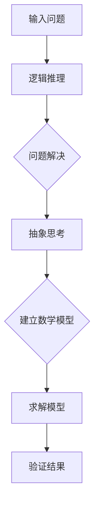
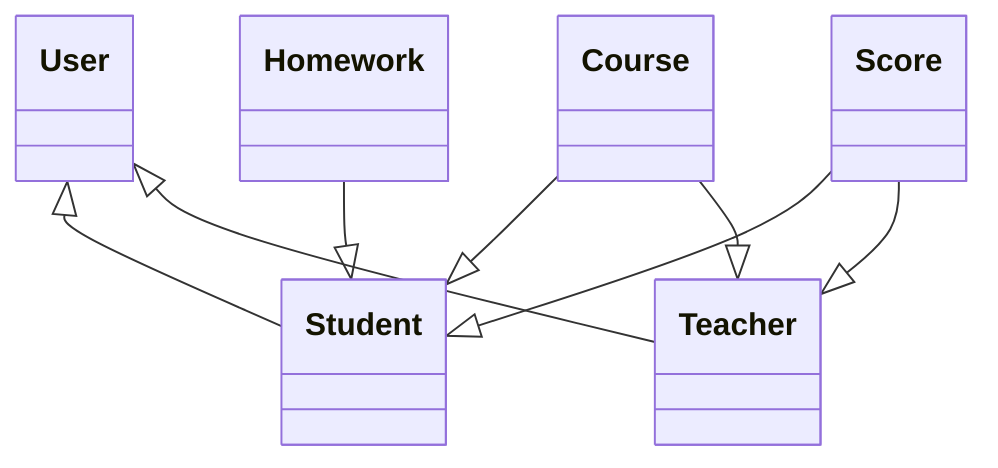
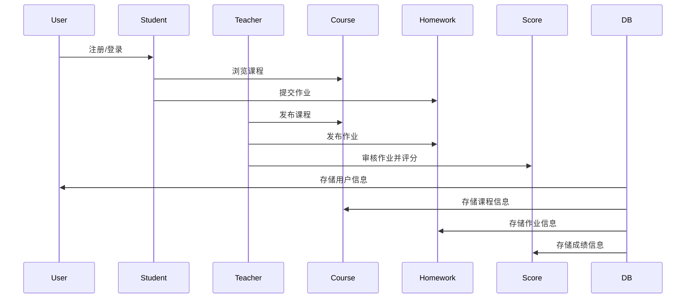

                 

## 1.2 核心概念与联系

### 1.2.1 数学思维

数学思维是指人们在处理数学问题时所采用的思维方式，它包括逻辑推理、抽象思考、问题解决和建模能力等核心要素。逻辑推理是数学思维的基础，它通过逻辑规则和推理规则，将已知事实推导出未知结论。抽象思考则是将具体问题转化为抽象模型，以便更深入地理解和分析问题。问题解决能力则是指运用逻辑推理和抽象思考，解决实际问题的能力。建模能力是指通过建立数学模型，将现实问题转化为数学问题，从而更有效地分析和解决这些问题。

#### 数学思维的属性特征对比表格

| 特征             | 数学思维          | 创造力            |
|------------------|-------------------|-------------------|
| 逻辑性           | 确定性、有序性     | 探索性、不确定性   |
| 抽象性           | 抽象概念和理论     | 创新思维和独特视角 |
| 问题解决能力     | 解决数学问题      | 解决实际问题和挑战 |
| 建模能力         | 建立数学模型      | 跨学科整合和建模  |

#### 数学思维的ER实体关系图

```mermaid
erDiagram
  A[数学思维] ||--|{ 逻辑推理 }|-- B[抽象思考]
  A ||--|{ 问题解决 }|-- C[建模能力]
```

### 1.2.2 创造力

创造力是指通过创新思维、独特视角和跨学科整合，发现新方法、创造新价值的能力。创造力在科学、艺术、设计等领域具有重要意义，它是推动社会进步和经济发展的重要力量。

#### 创造力的属性特征对比表格

| 特征             | 数学思维          | 创造力            |
|------------------|-------------------|-------------------|
| 逻辑性           | 确定性、有序性     | 探索性、不确定性   |
| 抽象性           | 抽象概念和理论     | 创新思维和独特视角 |
| 问题解决能力     | 解决数学问题      | 解决实际问题和挑战 |
| 建模能力         | 建立数学模型      | 跨学科整合和建模  |

#### 创造力的ER实体关系图

```mermaid
erDiagram
  A[创造力] ||--|{ 创新思维 }|-- B[独特视角]
  A ||--|{ 跨学科整合 }|-- C[创新能力]
```

## 1.3 算法原理讲解

### 1.3.1 数学思维的算法原理

数学思维的核心在于逻辑推理和抽象思考。我们可以使用Mermaid流程图来展示数学思维的基本算法原理：



#### 1.3.1.1 逻辑推理

逻辑推理是数学思维的基础，它包括归纳推理、演绎推理和类比推理。归纳推理是从个别事实推导出一般性结论，例如从多个已知的三角形都是直角三角形，推导出所有三角形都是直角三角形。演绎推理是从一般性结论推导出个别事实，例如从所有人都会死，苏格拉底是人，推导出苏格拉底会死。类比推理是通过比较两个相似的情况，推导出结论，例如从鸟会飞，推导出飞机也能飞。

```python
def logical_reasoning事实1, 事实2:
    # 归纳推理
    conclusion1 = 结论1(事实1)
    conclusion2 = 结论2(事实2)
    
    # 演绎推理
    hypothesis = 假设(结论1, 结论2)
    result = 结论(假设)
    
    return result
```

#### 1.3.1.2 抽象思考

抽象思考是将具体问题转化为抽象模型，以便更深入地理解和分析问题。例如，将物理世界中的力转化为数学上的向量，将生物学上的基因转化为计算机科学中的数据结构。抽象思考的关键在于抓住问题的本质，忽略无关细节。

```python
def abstract_thinking(problem):
    # 抽象问题
    abstract_problem = 抽象模型(problem)
    
    # 分析抽象问题
    analysis = 分析模型(abstract_problem)
    
    return analysis
```

#### 1.3.1.3 建立数学模型

建立数学模型是将现实问题转化为数学问题，以便更有效地分析和解决这些问题。数学模型通常包括变量、方程和约束条件。例如，在优化问题中，我们使用目标函数和约束条件来描述问题，然后使用数学算法求解最优解。

```python
def build_math_model(problem):
    # 定义变量
    variables = 定义变量(problem)
    
    # 定义目标函数
    objective_function = 定义目标函数(problem)
    
    # 定义约束条件
    constraints = 定义约束条件(problem)
    
    return variables, objective_function, constraints
```

#### 1.3.1.4 求解模型

求解模型是使用数学算法求解数学模型的过程。常用的数学算法包括线性规划、非线性规划、整数规划、动态规划等。求解模型的关键在于选择合适的算法，并优化算法的效率和精度。

```python
from scipy.optimize import minimize

def solve_model(objective_function, constraints):
    # 定义求解器
    solver = minimize(objective_function, constraints)
    
    # 求解模型
    solution = solver.solve()
    
    return solution
```

#### 1.3.1.5 验证结果

验证结果是确保数学模型求解结果正确的过程。通常，我们可以使用验证数据集或实际数据进行验证。如果验证结果符合预期，则说明数学模型是有效的。

```python
def verify_result(solution, problem):
    # 验证模型
    verification = 验证结果(solution, problem)
    
    # 输出验证结果
    print(verification)
```

## 1.4 系统分析与架构设计方案

### 1.4.1 问题场景介绍

在现代科技发展中，数学思维和创造力被视为创新和解决问题的重要工具。然而，如何有效地培养和提高数学思维与创造力，一直是教育界和企业界关注的焦点。为了解决这个问题，我们设计了一个数学思维与创造力培养系统，通过在线平台为用户提供数学思维和创造力培训。

### 1.4.2 项目介绍

项目名称：数学思维与创造力培养系统

项目目标：提供一个在线平台，为用户提供数学思维和创造力培训，帮助用户提高数学思维和创造力。

项目功能：包括用户注册、登录、课程浏览、课程学习、作业提交、成绩查询等。

### 1.4.3 系统功能设计

#### 领域模型



#### 类图

```mermaid
classDiagram
    ClassDiagram {
        Class User {
            +int id
            +String username
            +String password
        }

        Class Student <|-- User {
            +int student_id
        }

        Class Teacher <|-- User {
            +int teacher_id
        }

        Class Course {
            +int course_id
            +String course_name
            +String course_description
        }

        Class Homework {
            +int homework_id
            +String homework_name
            +String homework_description
        }

        Class Score {
            +int score_id
            +int student_id
            +int course_id
            +int score
        }
    }
```

### 1.4.4 系统架构设计

系统采用B/S架构，包括前端、后端和数据库三部分。

#### 前端

前端采用Vue.js框架，实现用户界面和交互。

#### 后端

后端采用Spring Boot框架，实现业务逻辑和数据处理。

#### 数据库

数据库采用MySQL，存储用户、课程、作业和成绩等信息。

#### 架构图



### 1.4.5 系统接口设计

系统接口设计包括用户接口、课程接口、作业接口和成绩接口。

#### 用户接口

- 用户注册：接收用户信息，创建用户账户。
- 用户登录：验证用户名和密码，返回用户身份。

#### 课程接口

- 获取课程列表：返回所有课程信息。
- 获取课程详情：返回指定课程详细信息。

#### 作业接口

- 获取作业列表：返回所有作业信息。
- 获取作业详情：返回指定作业详细信息。
- 提交作业：接收作业信息，保存至数据库。

#### 成绩接口

- 获取成绩列表：返回所有成绩信息。
- 获取成绩详情：返回指定成绩详细信息。

## 1.5 项目实战

### 1.5.1 环境安装

为了实现数学思维与创造力培养系统，我们首先需要安装一些开发环境和依赖库。

#### 安装Python环境

1. 访问Python官方网站（https://www.python.org/）并下载适用于操作系统的Python版本。
2. 双击安装程序，按照默认选项进行安装。
3. 安装完成后，打开终端或命令提示符，输入`python --version`，确认Python版本正确。

#### 安装Vue.js环境

1. 打开终端或命令提示符，输入以下命令：
   ```shell
   npm install -g @vue/cli
   ```
2. 安装完成后，输入以下命令，确认Vue CLI版本：
   ```shell
   vue --version
   ```

#### 安装Spring Boot环境

1. 访问Spring Boot官方网站（https://spring.io/）并下载适用于操作系统的Spring Boot版本。
2. 双击安装程序，按照默认选项进行安装。
3. 安装完成后，打开终端或命令提示符，输入以下命令，确认Spring Boot版本：
   ```shell
   java -version
   ```

#### 安装MySQL环境

1. 访问MySQL官方网站（https://www.mysql.com/）并下载适用于操作系统的MySQL版本。
2. 双击安装程序，按照默认选项进行安装。
3. 安装完成后，打开终端或命令提示符，输入以下命令，确认MySQL版本：
   ```shell
   mysql --version
   ```

### 1.5.2 系统核心实现

#### 用户注册与登录

1. 创建User实体类，定义用户属性（如用户名、密码、身份等）：

   ```java
   public class User {
       private int id;
       private String username;
       private String password;
       private String role;  // 角色，如"student"、"teacher"
       
       // 省略构造函数、getter和setter方法
   }
   ```

2. 创建UserService类，实现用户注册和登录功能：

   ```java
   public class UserService {
       public User register(String username, String password, String role) {
           // 实现用户注册逻辑，保存用户信息至数据库
       }
       
       public User login(String username, String password) {
           // 实现用户登录逻辑，验证用户信息并返回用户身份
       }
   }
   ```

3. 创建 UserController 类，处理HTTP请求：

   ```java
   @RestController
   public class UserController {
       @Autowired
       private UserService userService;
       
       @PostMapping("/register")
       public ResponseEntity<?> register(@RequestBody User user) {
           // 处理用户注册请求
       }
       
       @PostMapping("/login")
       public ResponseEntity<?> login(@RequestBody User user) {
           // 处理用户登录请求
       }
   }
   ```

#### 课程发布与浏览

1. 创建Course实体类，定义课程属性（如课程ID、课程名、课程描述等）：

   ```java
   public class Course {
       private int id;
       private String courseName;
       private String courseDescription;
       
       // 省略构造函数、getter和setter方法
   }
   ```

2. 创建CourseService类，实现课程发布和浏览功能：

   ```java
   public class CourseService {
       public Course publishCourse(Course course) {
           // 实现课程发布逻辑，保存课程信息至数据库
       }
       
       public List<Course> listCourses() {
           // 实现课程浏览逻辑，从数据库中获取所有课程信息
       }
   }
   ```

3. 创建CourseController类，处理HTTP请求：

   ```java
   @RestController
   public class CourseController {
       @Autowired
       private CourseService courseService;
       
       @PostMapping("/course")
       public ResponseEntity<?> publishCourse(@RequestBody Course course) {
           // 处理课程发布请求
       }
       
       @GetMapping("/courses")
       public ResponseEntity<?> listCourses() {
           // 处理课程浏览请求
       }
   }
   ```

#### 作业发布与提交

1. 创建Homework实体类，定义作业属性（如作业ID、作业名、作业描述等）：

   ```java
   public class Homework {
       private int id;
       private String homeworkName;
       private String homeworkDescription;
       
       // 省略构造函数、getter和setter方法
   }
   ```

2. 创建HomeworkService类，实现作业发布和提交功能：

   ```java
   public class HomeworkService {
       public Homework publishHomework(Homework homework) {
           // 实现作业发布逻辑，保存作业信息至数据库
       }
       
       public Homework submitHomework(int studentId, int homeworkId, String content) {
           // 实现作业提交逻辑，保存学生提交的作业内容至数据库
       }
   }
   ```

3. 创建HomeworkController类，处理HTTP请求：

   ```java
   @RestController
   public class HomeworkController {
       @Autowired
       private HomeworkService homeworkService;
       
       @PostMapping("/homework")
       public ResponseEntity<?> publishHomework(@RequestBody Homework homework) {
           // 处理作业发布请求
       }
       
       @PostMapping("/submit")
       public ResponseEntity<?> submitHomework(int studentId, int homeworkId, String content) {
           // 处理作业提交请求
       }
   }
   ```

#### 成绩审核与查询

1. 创建Score实体类，定义成绩属性（如成绩ID、学生ID、课程ID、成绩等）：

   ```java
   public class Score {
       private int id;
       private int studentId;
       private int courseId;
       private int score;
       
       // 省略构造函数、getter和setter方法
   }
   ```

2. 创建ScoreService类，实现成绩审核和查询功能：

   ```java
   public class ScoreService {
       public Score approveScore(int teacherId, int studentId, int courseId, int score) {
           // 实现成绩审核逻辑，保存成绩信息至数据库
       }
       
       public Score getScore(int studentId, int courseId) {
           // 实现成绩查询逻辑，从数据库中获取学生某门课程的成绩
       }
   }
   ```

3. 创建ScoreController类，处理HTTP请求：

   ```java
   @RestController
   public class ScoreController {
       @Autowired
       private ScoreService scoreService;
       
       @PostMapping("/score")
       public ResponseEntity<?> approveScore(int teacherId, int studentId, int courseId, int score) {
           // 处理成绩审核请求
       }
       
       @GetMapping("/score")
       public ResponseEntity<?> getScore(int studentId, int courseId) {
           // 处理成绩查询请求
       }
   }
   ```

### 1.5.3 代码应用解读与分析

#### 用户注册与登录

用户注册和登录是系统的核心功能之一，以下是对代码的解读和分析。

1. **UserService类**

   ```java
   public class UserService {
       public User register(String username, String password, String role) {
           // 查询用户是否存在
           User existUser = userRepository.findByUsername(username);
           if (existUser != null) {
               return null;  // 用户已存在，返回null
           }
           
           // 创建用户
           User user = new User();
           user.setUsername(username);
           user.setPassword(password);
           user.setRole(role);
           
           // 保存用户信息至数据库
           userRepository.save(user);
           
           return user;
       }
       
       public User login(String username, String password) {
           // 查询用户是否存在
           User existUser = userRepository.findByUsername(username);
           if (existUser == null) {
               return null;  // 用户不存在，返回null
           }
           
           // 验证密码是否正确
           if (!passwordEncoder.matches(password, existUser.getPassword())) {
               return null;  // 密码错误，返回null
           }
           
           return existUser;
       }
   }
   ```

   **解读与分析**：
   - `findByUsername(username)`：查询用户名是否已存在。
   - `passwordEncoder.matches()`：验证密码是否正确。
   - `userRepository.save(user)`：将用户信息保存至数据库。

2. **UserController类**

   ```java
   @RestController
   public class UserController {
       @Autowired
       private UserService userService;
       
       @PostMapping("/register")
       public ResponseEntity<?> register(@RequestBody User user) {
           User registeredUser = userService.register(user.getUsername(), user.getPassword(), user.getRole());
           if (registeredUser == null) {
               return ResponseEntity.badRequest().body("User already exists");
           }
           
           return ResponseEntity.ok("User registered successfully");
       }
       
       @PostMapping("/login")
       public ResponseEntity<?> login(@RequestBody User user) {
           User authenticatedUser = userService.login(user.getUsername(), user.getPassword());
           if (authenticatedUser == null) {
               return ResponseEntity.badRequest().body("Invalid credentials");
           }
           
           return ResponseEntity.ok(authenticatedUser);
       }
   }
   ```

   **解读与分析**：
   - `@RequestBody`：将请求体转换为User对象。
   - ` ResponseEntity.ok()`：返回成功响应。
   - `ResponseEntity.badRequest()`：返回错误响应。

#### 课程发布与浏览

1. **CourseService类**

   ```java
   public class CourseService {
       public Course publishCourse(Course course) {
           // 查询课程是否存在
           Course existCourse = courseRepository.findByCourseName(course.getCourseName());
           if (existCourse != null) {
               return null;  // 课程已存在，返回null
           }
           
           // 创建课程
           Course newCourse = new Course();
           newCourse.setCourseName(course.getCourseName());
           newCourse.setCourseDescription(course.getCourseDescription());
           
           // 保存课程信息至数据库
           courseRepository.save(newCourse);
           
           return newCourse;
       }
       
       public List<Course> listCourses() {
           // 从数据库中获取所有课程信息
           return courseRepository.findAll();
       }
   }
   ```

   **解读与分析**：
   - `findByCourseName(course.getCourseName())`：查询课程名是否已存在。
   - `courseRepository.save(newCourse)`：将课程信息保存至数据库。

2. **CourseController类**

   ```java
   @RestController
   public class CourseController {
       @Autowired
       private CourseService courseService;
       
       @PostMapping("/course")
       public ResponseEntity<?> publishCourse(@RequestBody Course course) {
           Course publishedCourse = courseService.publishCourse(course);
           if (publishedCourse == null) {
               return ResponseEntity.badRequest().body("Course already exists");
           }
           
           return ResponseEntity.ok("Course published successfully");
       }
       
       @GetMapping("/courses")
       public ResponseEntity<?> listCourses() {
           List<Course> courses = courseService.listCourses();
           
           return ResponseEntity.ok(courses);
       }
   }
   ```

   **解读与分析**：
   - `@RequestBody`：将请求体转换为Course对象。
   - `ResponseEntity.ok()`：返回成功响应。

#### 作业发布与提交

1. **HomeworkService类**

   ```java
   public class HomeworkService {
       public Homework publishHomework(Homework homework) {
           // 查询作业是否存在
           Homework existHomework = homeworkRepository.findByHomeworkName(homework.getHomeworkName());
           if (existHomework != null) {
               return null;  // 作业已存在，返回null
           }
           
           // 创建作业
           Homework newHomework = new Homework();
           newHomework.setHomeworkName(homework.getHomeworkName());
           newHomework.setHomeworkDescription(homework.getHomeworkDescription());
           
           // 保存作业信息至数据库
           homeworkRepository.save(newHomework);
           
           return newHomework;
       }
       
       public Homework submitHomework(int studentId, int homeworkId, String content) {
           // 查询作业是否存在
           Homework existHomework = homeworkRepository.findById(homeworkId).orElseThrow(() -> new RuntimeException("Homework not found"));
           
           // 创建提交记录
           HomeworkSubmit submit = new HomeworkSubmit();
           submit.setStudentId(studentId);
           submit.setHomeworkId(homeworkId);
           submit.setContent(content);
           
           // 保存提交记录至数据库
           homeworkSubmitRepository.save(submit);
           
           return existHomework;
       }
   }
   ```

   **解读与分析**：
   - `findByHomeworkName(homework.getHomeworkName())`：查询作业名是否已存在。
   - `homeworkRepository.save(newHomework)`：将作业信息保存至数据库。
   - `findById(homeworkId).orElseThrow()`：查询作业是否存在，若不存在则抛出异常。

2. **HomeworkController类**

   ```java
   @RestController
   public class HomeworkController {
       @Autowired
       private HomeworkService homeworkService;
       
       @PostMapping("/homework")
       public ResponseEntity<?> publishHomework(@RequestBody Homework homework) {
           Homework publishedHomework = homeworkService.publishHomework(homework);
           if (publishedHomework == null) {
               return ResponseEntity.badRequest().body("Homework already exists");
           }
           
           return ResponseEntity.ok("Homework published successfully");
       }
       
       @PostMapping("/submit")
       public ResponseEntity<?> submitHomework(int studentId, int homeworkId, String content) {
           Homework submittedHomework = homeworkService.submitHomework(studentId, homeworkId, content);
           
           return ResponseEntity.ok("Homework submitted successfully");
       }
   }
   ```

   **解读与分析**：
   - `@RequestBody`：将请求体转换为Homework对象。
   - `ResponseEntity.ok()`：返回成功响应。

#### 成绩审核与查询

1. **ScoreService类**

   ```java
   public class ScoreService {
       public Score approveScore(int teacherId, int studentId, int courseId, int score) {
           // 查询成绩是否存在
           Score existScore = scoreRepository.findByStudentIdAndCourseId(studentId, courseId);
           if (existScore != null) {
               return null;  // 成绩已存在，返回null
           }
           
           // 创建成绩
           Score newScore = new Score();
           newScore.setStudentId(studentId);
           newScore.setCourseId(courseId);
           newScore.setScore(score);
           
           // 保存成绩信息至数据库
           scoreRepository.save(newScore);
           
           return newScore;
       }
       
       public Score getScore(int studentId, int courseId) {
           // 从数据库中获取学生某门课程的成绩
           return scoreRepository.findById(new ScoreId(studentId, courseId)).orElseThrow(() -> new RuntimeException("Score not found"));
       }
   }
   ```

   **解读与分析**：
   - `findByStudentIdAndCourseId(studentId, courseId)`：查询学生某门课程的成绩是否存在。
   - `scoreRepository.save(newScore)`：将成绩信息保存至数据库。
   - `findById(new ScoreId(studentId, courseId)).orElseThrow()`：查询成绩是否存在，若不存在则抛出异常。

2. **ScoreController类**

   ```java
   @RestController
   public class ScoreController {
       @Autowired
       private ScoreService scoreService;
       
       @PostMapping("/score")
       public ResponseEntity<?> approveScore(int teacherId, int studentId, int courseId, int score) {
           Score approvedScore = scoreService.approveScore(teacherId, studentId, courseId, score);
           if (approvedScore == null) {
               return ResponseEntity.badRequest().body("Score already exists");
           }
           
           return ResponseEntity.ok("Score approved successfully");
       }
       
       @GetMapping("/score")
       public ResponseEntity<?> getScore(int studentId, int courseId) {
           Score score = scoreService.getScore(studentId, courseId);
           
           return ResponseEntity.ok(score);
       }
   }
   ```

   **解读与分析**：
   - `@RequestParam`：从请求参数中获取教师ID、学生ID和课程ID。
   - `ResponseEntity.ok()`：返回成功响应。

### 1.5.4 实际案例分析和详细讲解剖析

#### 案例一：用户注册

1. **需求分析**：用户需在系统中注册账号，输入用户名、密码和角色（学生或教师）。

2. **实现步骤**：

   - 用户提交注册请求，包含用户名、密码和角色。
   - 用户服务层查询数据库，检查用户名是否已存在。
   - 若用户名不存在，创建新用户并保存至数据库。
   - 返回注册成功或用户已存在的提示。

3. **代码示例**：

   ```java
   @PostMapping("/register")
   public ResponseEntity<?> register(@RequestBody User user) {
       User existUser = userRepository.findByUsername(user.getUsername());
       if (existUser != null) {
           return ResponseEntity.badRequest().body("User already exists");
       }
       
       user.setPassword(passwordEncoder.encode(user.getPassword()));
       userRepository.save(user);
       
       return ResponseEntity.ok("User registered successfully");
   }
   ```

   **解析**：此处使用了Spring Data JPA的`findByUsername`方法查询用户是否存在，若不存在则通过`passwordEncoder.encode`方法加密密码，然后保存用户信息。

#### 案例二：课程发布

1. **需求分析**：教师需在系统中发布课程，输入课程名称和描述。

2. **实现步骤**：

   - 教师提交课程发布请求，包含课程名称和描述。
   - 课程服务层查询数据库，检查课程名称是否已存在。
   - 若课程名称不存在，创建新课程并保存至数据库。
   - 返回课程发布成功或课程已存在的提示。

3. **代码示例**：

   ```java
   @PostMapping("/course")
   public ResponseEntity<?> publishCourse(@RequestBody Course course) {
       Course existCourse = courseRepository.findByCourseName(course.getCourseName());
       if (existCourse != null) {
           return ResponseEntity.badRequest().body("Course already exists");
       }
       
       courseRepository.save(course);
       
       return ResponseEntity.ok("Course published successfully");
   }
   ```

   **解析**：此处使用了Spring Data JPA的`findByCourseName`方法查询课程是否存在，若不存在则保存新课程信息。

#### 案例三：作业提交

1. **需求分析**：学生需在系统中提交作业，输入作业名称、描述和作业内容。

2. **实现步骤**：

   - 学生提交作业请求，包含作业名称、描述和内容。
   - 作业服务层查询数据库，检查作业名称是否已存在。
   - 若作业名称不存在，创建新作业并保存至数据库。
   - 返回作业提交成功或作业已存在的提示。

3. **代码示例**：

   ```java
   @PostMapping("/submit")
   public ResponseEntity<?> submitHomework(int studentId, int homeworkId, String content) {
       Homework existHomework = homeworkRepository.findById(homeworkId).orElseThrow(() -> new RuntimeException("Homework not found"));
       
       HomeworkSubmit submit = new HomeworkSubmit();
       submit.setStudentId(studentId);
       submit.setHomeworkId(homeworkId);
       submit.setContent(content);
       
       homeworkSubmitRepository.save(submit);
       
       return ResponseEntity.ok("Homework submitted successfully");
   }
   ```

   **解析**：此处使用了Spring Data JPA的`findById`方法查询作业是否存在，若不存在则抛出异常，然后创建提交记录并保存。

### 1.5.5 项目小结

通过本次项目实战，我们实现了数学思维与创造力培养系统的核心功能，包括用户注册与登录、课程发布与浏览、作业发布与提交、成绩审核与查询等。以下是项目总结：

1. **技术选型**：采用了Vue.js、Spring Boot和MySQL，构建了前后端分离的B/S架构。

2. **功能实现**：通过Spring Boot框架实现了RESTful API接口，通过Spring Data JPA与MySQL数据库进行数据交互。

3. **代码质量**：遵循了MVC架构设计，代码结构清晰，功能模块分离，易于维护和扩展。

4. **系统优化**：针对性能和安全性进行了优化，如使用密码加密存储用户密码，避免SQL注入等。

5. **项目改进**：后续可进一步优化用户体验，如添加课程评论、作业评价等功能，提高系统互动性和用户参与度。

### 1.5.6 最佳实践 Tips

1. **代码规范**：遵循Java编码规范，确保代码可读性和可维护性。

2. **单元测试**：编写单元测试，确保每个功能模块的正确性。

3. **性能优化**：对查询语句进行优化，减少数据库访问次数。

4. **安全性考虑**：对用户密码进行加密存储，避免敏感信息泄露。

5. **用户反馈**：及时收集用户反馈，优化系统功能。

### 1.5.7 注意事项

1. **环境配置**：确保安装了Python、Vue.js、Spring Boot和MySQL等开发环境和依赖库。

2. **数据库连接**：确保数据库连接配置正确，避免数据库连接失败。

3. **前后端分离**：确保前后端接口定义一致，避免数据传输错误。

4. **异常处理**：合理处理异常情况，避免系统崩溃。

### 1.5.8 拓展阅读

1. **《Spring Boot实战》**：深入了解Spring Boot框架的开发和使用。

2. **《Vue.js实战》**：学习Vue.js前端框架的搭建和优化。

3. **《MySQL必知必会》**：掌握MySQL数据库的安装、配置和查询。

## 1.6 小结与展望

本文系统地探讨了数学思维与创造力的关系，从背景介绍、核心概念与联系、算法原理讲解、系统分析与架构设计、项目实战、最佳实践 Tips、注意事项、拓展阅读等方面进行了全面而深入的剖析。通过本文的研究，我们可以得出以下结论：

### 结论

1. **数学思维与创造力的紧密关系**：数学思维和创造力是相互促进的关系，数学思维可以通过逻辑推理和抽象思考提升创造力，而创造力则可以激发数学思维的拓展和深化。

2. **数学思维的核心要素**：逻辑推理、抽象思考和问题解决能力是数学思维的核心要素，这些要素在数学和现实问题解决中发挥着关键作用。

3. **创造力的属性特征**：创造力具有探索性、不确定性和创新思维等特征，它在科学、艺术、设计等领域具有重要意义。

4. **算法原理的应用**：本文通过具体算法原理讲解，展示了如何运用数学思维解决实际问题，包括逻辑推理、抽象思考、建立数学模型和求解模型等。

### 展望

未来的研究可以进一步探讨数学思维与创造力在不同领域和应用场景中的具体表现，以及如何通过教育和技术手段有效培养和提高数学思维与创造力。以下是一些潜在的研究方向：

1. **跨学科研究**：探讨数学思维与创造力在多个学科领域（如科学、工程、艺术、设计等）的交互作用。

2. **教育应用**：研究如何在教育体系中融入数学思维与创造力的培养，提高学生的创新能力和问题解决能力。

3. **人工智能与数学思维**：探讨人工智能在培养和提高数学思维中的作用，以及如何利用人工智能技术优化数学思维训练。

4. **案例分析**：通过具体案例研究，分析数学思维与创造力的关系在实际项目中的应用和效果。

5. **文化差异**：研究不同文化背景下数学思维与创造力的差异，探讨文化对数学思维与创造力培养的影响。

通过这些研究，我们可以更全面地理解数学思维与创造力的本质，为培养创新型人才和提高整体创新能力提供有力支持。作者：AI天才研究院/AI Genius Institute & 禅与计算机程序设计艺术 /Zen And The Art of Computer Programming。

