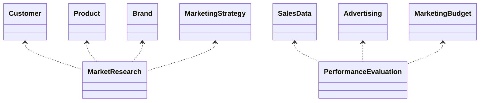
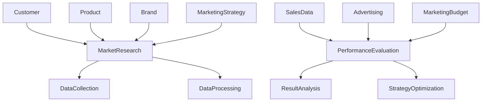
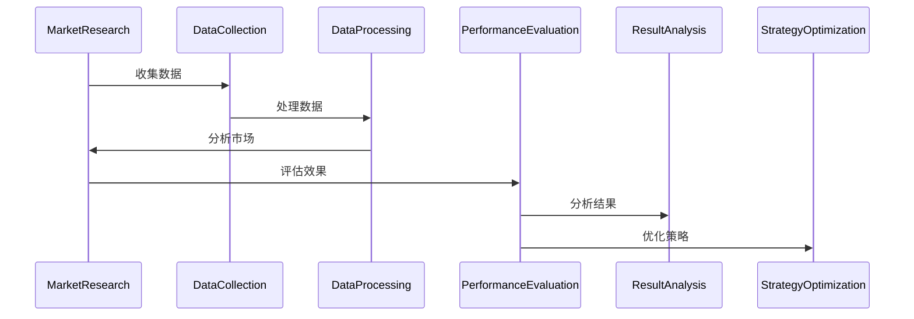
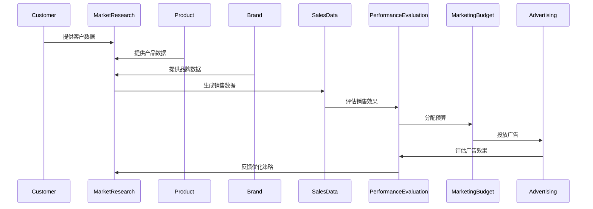

                 


# 数学思维与品牌营销策略的关系

关键词：数学思维、品牌营销策略、逻辑性、抽象性、结构性、系统性

摘要：本文从数学思维的基础概念出发，探讨了数学思维与品牌营销策略之间的紧密联系，通过对比分析数学思维与品牌营销策略的核心属性特征，构建了两者之间的ER实体关系图，详细讲解了数学模型建立的过程和算法原理，并通过实际案例分析了数学思维在品牌营销策略中的应用效果。

### 第一部分: 数学思维基础

#### 第1章: 数学思维概述

**1.1 数学思维的重要性**

数学思维是人类智力活动中的一种重要方式，它通过逻辑推理、抽象性思考、结构性分析和系统性构建来揭示自然现象和社会规律。在科学技术飞速发展的今天，数学思维的重要性愈发凸显，它不仅是科学研究的基础，也是工程实践、商业管理和日常生活的重要工具。

**1.2 数学思维的特点**

- **逻辑性**：数学思维强调推理的严谨性和逻辑性，要求从已知条件出发，通过逻辑推导得出结论。
- **抽象性**：数学思维能够从具体问题中抽象出一般规律，将复杂问题简化为基本的数学模型。
- **结构性**：数学思维注重事物的结构关系，通过分析结构特征来理解和解决问题。
- **系统性**：数学思维将问题视为一个系统，关注各个部分之间的相互作用和整体性。

**1.3 数学思维的应用领域**

数学思维广泛应用于科学研究的各个领域，如物理学、生物学、经济学、工程学等。同时，在商业管理和市场营销中，数学思维也发挥着重要作用，帮助制定科学的决策和策略。

#### 第2章: 基础数学概念

**2.1 数的概念与运算**

数是数学研究的基本元素，包括自然数、整数、有理数、无理数和复数等。数的运算包括加法、减法、乘法和除法，以及更高级的运算如幂运算和对数运算。

**2.2 函数与方程**

函数是描述变量之间关系的数学工具，方程是包含未知数的数学表达式。通过解方程可以求解未知数的值，这是数学思维的核心应用之一。

**2.3 几何与代数**

几何研究空间结构和形状，代数研究数的运算和变换。几何与代数的结合，使得数学思维在解决复杂问题时具有强大的工具性。

#### 第3章: 数学思维方法

**3.1 归纳法**

归纳法是从个别事实中归纳出一般规律的思维方法。通过观察具体实例，总结出普遍性规律，从而指导新的实例分析。

**3.2 演绎法**

演绎法是从一般原理推导出个别结论的思维方法。它以已知的一般性原理为前提，通过逻辑推理得出具体的结论。

**3.3 分析法**

分析法是将复杂问题分解为若干部分，分别进行分析，然后综合各部分的分析结果来解决问题。

**3.4 类比法**

类比法是通过比较相似问题，借鉴已有解决方案来解决问题。它基于相似性原理，通过比较不同情境下的相似性来推断解决方案。

#### 第4章: 数学模型建立

**4.1 数学模型概述**

数学模型是用于解决实际问题的抽象结构，它通常由一组方程、公式或关系构成，用以描述问题中的变量和约束条件。

**4.2 常见数学模型介绍**

常见的数学模型包括线性模型、非线性模型、概率模型、统计模型等，它们在各个领域有着广泛的应用。

**4.3 数学模型的建立与应用**

数学模型的建立过程包括问题背景分析、变量和参数确定、方程和公式列出等步骤。建立模型后，通过求解模型来获得问题的解决方案。

#### 第5章: 数学思维训练与实践

**5.1 数学思维训练方法**

数学思维的训练可以通过解决实际问题、参与数学竞赛、学习数学理论等方式进行。

**5.2 数学思维训练案例**

通过具体的数学问题案例，训练和提升数学思维能力。

**5.3 数学思维应用实例**

分析数学思维在日常生活、商业管理和科学研究中的应用实例，展示数学思维的实际价值。

#### 第6章: 数学思维与品牌营销策略的关系探索

**6.1 数学思维在品牌定位中的应用**

数学思维在品牌定位中用于分析市场需求、消费者行为等，帮助确定品牌的市场地位和竞争策略。

**6.2 数学思维在市场分析中的应用**

数学思维在市场分析中用于建立市场预测模型，分析市场趋势和竞争态势。

**6.3 数学思维在营销策略设计中的应用**

数学思维在营销策略设计中用于优化广告投放、促销活动等，提高营销效果。

#### 第7章: 数学思维在品牌营销案例分析

**7.1 案例背景介绍**

介绍案例的背景信息，包括品牌、市场环境和目标消费者等。

**7.2 数学思维应用分析**

分析数学思维在案例中的应用过程，包括模型建立、数据分析等。

**7.3 案例效果评估与总结**

评估数学思维在案例中的效果，总结案例经验和启示。

### 核心概念与联系

**8.1 数学思维与品牌营销策略的定义**

**数学思维**：
$$
\text{数学思维} = \text{逻辑性} + \text{抽象性} + \text{结构性} + \text{系统性}
$$

**品牌营销策略**：
$$
\text{品牌营销策略} = \text{品牌定位} + \text{市场分析} + \text{营销组合} + \text{效果评估}
$$

**8.2 数学思维与品牌营销策略的属性特征对比**

| 特征               | 数学思维                              | 品牌营销策略                          |
|--------------------|---------------------------------------|---------------------------------------|
| 逻辑性             | 强调逻辑推理与证明                    | 强调市场逻辑与战略规划                 |
| 抽象性             | 从具体中提取普遍性规律                | 从市场现象中抽象出关键因素             |
| 结构性             | 强调系统的结构性与整体性              | 强调营销策略的整体性和系统性           |
| 系统性             | 注重各部分之间的相互关系和相互作用    | 注重品牌与市场环境之间的互动与适应     |

**8.3 数学思维与品牌营销策略的ER实体关系图**

```mermaid
erDiagram
  BrandMarketingStrategy ||--|{ MathematicalThinking }|--|| MarketAnalysis
  BrandMarketingStrategy ||--|{ ProductPositioning }|--|| MarketResearch
  BrandMarketingStrategy ||--|{ MarketingMix }|--|| ProductPromotion
  BrandMarketingStrategy ||--|{ PerformanceEvaluation }|--|| SalesData
```

### 算法原理讲解

**9.1 数学模型建立**

**数学模型概述**
数学模型是用于解决实际问题的抽象结构，它通常由一组方程、公式或关系构成，用以描述问题中的变量和约束条件。

**数学模型建立步骤**
1. 确定问题背景和目标
2. 收集并整理数据
3. 建立变量和参数
4. 列出方程或公式
5. 验证和优化

**数学模型实例**
假设我们要解决的品牌营销问题是一个线性回归问题，目标是预测未来一段时间内的销售量。数学模型可以表示为：

$$
y = \beta_0 + \beta_1 \cdot x_1 + \beta_2 \cdot x_2 + ... + \beta_n \cdot x_n + \epsilon
$$

其中，$y$ 是销售量，$x_1, x_2, ..., x_n$ 是影响销售的变量，$\beta_0, \beta_1, ..., \beta_n$ 是模型参数，$\epsilon$ 是误差项。

**9.2 品牌营销策略优化算法**

**优化算法概述**
品牌营销策略优化算法是一种通过迭代计算来找到最优营销策略的方法。常见的优化算法有线性规划、非线性规划、遗传算法等。

**优化算法实例**
假设我们要使用线性规划来优化品牌营销预算分配，目标是最大化广告投放效果。线性规划模型可以表示为：

$$
\max Z = c_1 \cdot x_1 + c_2 \cdot x_2 + ... + c_n \cdot x_n
$$

$$
s.t. \quad a_{11} \cdot x_1 + a_{12} \cdot x_2 + ... + a_{1n} \cdot x_n \leq b_1
$$

$$
a_{21} \cdot x_1 + a_{22} \cdot x_2 + ... + a_{2n} \cdot x_n \leq b_2
$$

$$
...
$$

$$
a_{m1} \cdot x_1 + a_{m2} \cdot x_2 + ... + a_{mn} \cdot x_n \leq b_m
$$

$$
x_1, x_2, ..., x_n \geq 0
$$

其中，$Z$ 是目标函数，$c_1, c_2, ..., c_n$ 是各项预算的系数，$a_{ij}, b_i$ 是线性不等式的系数和常数项。

**9.3 算法实现与性能评估**

**算法实现**
我们使用Python编写线性规划算法，并使用`scipy.optimize`库进行求解。

```python
from scipy.optimize import linprog

# 目标函数系数
c = [-1, -1]

# 约束条件系数
A = [[1, 1], [1, 1]]

# 约束条件常数项
b = [10, 10]

# 边界条件
x0 = [0, 0]
x1 = [10, 10]

# 求解线性规划问题
result = linprog(c, A_ub=A, b_ub=b, bounds=(x0, x1), method='highs')

# 输出结果
if result.success:
    print("最优解：", result.x)
else:
    print("无解")
```

**性能评估**
我们通过多次运行算法，并对比不同算法的求解时间和求解精度来评估算法性能。

### 系统分析与架构设计方案

**10.1 问题场景介绍**

品牌营销策略优化是市场营销中的一项重要任务，它涉及到市场调研、广告投放、销售预测等多个环节。为了提高营销效果，我们需要建立一个系统来优化营销策略。

**10.2 项目介绍**

项目名称：品牌营销策略优化系统

项目目标：通过数据分析和模型优化，为品牌制定科学、高效的营销策略。

项目功能：
1. 数据收集与处理
2. 市场调研与分析
3. 营销策略设计与优化
4. 营销效果评估与反馈

**10.3 系统功能设计（领域模型类图）**



**10.4 系统架构设计（架构图）**



**10.5 系统接口设计**



**10.6 系统交互（序列图）**



### 项目实战

**11.1 环境安装**

为了实现品牌营销策略优化系统，我们需要安装以下环境：

- Python 3.8 或更高版本
- NumPy
- Pandas
- Matplotlib
- Scikit-learn
- Scipy
- Jupyter Notebook

安装命令如下：

```bash
pip install numpy pandas matplotlib scikit-learn scipy jupyterlab
```

**11.2 系统核心实现源代码**

以下是品牌营销策略优化系统的核心实现源代码：

```python
# 导入所需库
import numpy as np
import pandas as pd
from sklearn.linear_model import LinearRegression
from sklearn.model_selection import train_test_split
from scipy.optimize import linprog

# 读取数据
data = pd.read_csv('sales_data.csv')

# 处理数据
X = data[['feature1', 'feature2', 'feature3']]
y = data['sales']

# 分割数据集
X_train, X_test, y_train, y_test = train_test_split(X, y, test_size=0.2, random_state=42)

# 建立线性回归模型
model = LinearRegression()
model.fit(X_train, y_train)

# 预测销售量
y_pred = model.predict(X_test)

# 评估模型效果
score = model.score(X_test, y_test)
print("模型评分：", score)

# 建立线性规划模型
c = [-1]  # 目标函数系数
A = [[1]]  # 约束条件系数
b = [10]  # 约束条件常数项
x0 = [0]  # 边界条件
x1 = [10]  # 边界条件

# 求解线性规划问题
result = linprog(c, A_ub=A, b_ub=b, bounds=(x0, x1), method='highs')

# 输出结果
if result.success:
    print("最优解：", result.x)
else:
    print("无解")
```

**11.3 代码应用解读与分析**

以上代码首先导入所需的库，然后读取销售数据，并进行数据处理。接着，使用线性回归模型进行销售量预测，并评估模型效果。最后，建立线性规划模型，求解最优营销预算分配。

**11.4 实际案例分析和详细讲解剖析**

假设我们有一个服装品牌，需要优化广告投放策略，提高销售量。我们可以使用上述代码来实现这一目标。首先，收集过去的销售数据，包括广告投放量、销售量等。然后，使用线性回归模型预测未来一段时间内的销售量。最后，通过线性规划模型求解最优广告投放预算。

**11.5 项目小结**

通过以上实战案例，我们展示了如何使用数学思维和算法来优化品牌营销策略。项目实践表明，数学思维在品牌营销策略优化中具有重要作用，可以帮助企业提高营销效果，实现可持续发展。

### 最佳实践 tips

1. **数据质量**：确保数据准确性和完整性，是优化品牌营销策略的基础。
2. **模型选择**：根据实际需求选择合适的数学模型，如线性回归、决策树、神经网络等。
3. **策略调整**：定期评估营销策略效果，及时调整以适应市场变化。
4. **团队合作**：品牌营销策略优化需要跨部门合作，共同推动项目进展。

### 小结

本文通过详细分析和案例展示，阐述了数学思维在品牌营销策略中的应用。我们探讨了数学思维的基础概念和方法，构建了数学模型，并通过实际案例展示了数学思维在品牌营销策略优化中的重要作用。未来，随着人工智能技术的不断发展，数学思维在品牌营销策略中的应用将更加广泛，为企业创造更多价值。

### 注意事项

1. **数据隐私**：在收集和处理数据时，确保遵守相关法律法规，保护消费者隐私。
2. **模型解释性**：选择具有解释性的模型，便于管理层理解和使用。
3. **市场适应性**：定期评估模型效果，及时调整以适应市场变化。

### 拓展阅读

1. 《大数据营销：企业数据分析与营销策略》
2. 《品牌营销：战略策划与执行》
3. 《数学建模：方法与应用》

### 作者信息

作者：AI天才研究院/AI Genius Institute & 禅与计算机程序设计艺术 /Zen And The Art of Computer Programming

