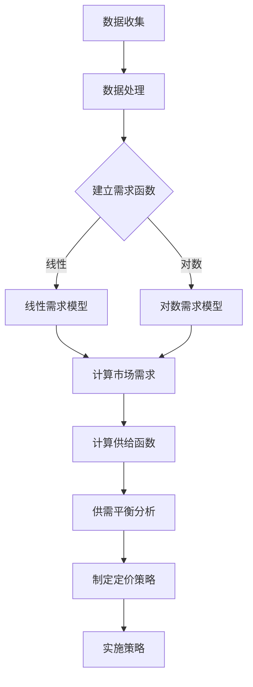

                 

### 文章标题

### 关键词

1. 数学思维
2. 商业策略
3. 关联性分析
4. 案例研究
5. 未来展望

### 摘要

本文旨在探讨数学思维与商业策略之间的关系，通过分析核心概念、运用案例以及数学工具的应用，揭示数学思维在商业决策中的重要性。文章将首先介绍数学思维和商业策略的定义及背景，随后通过案例分析探讨数学思维在商业实践中的应用。接着，文章将介绍一系列数学工具和方法，并探讨其在商业策略中的实际运用。最后，文章将展望数学思维在商业策略领域的未来发展趋势，并提出相关建议。

### 目录

1. **引言**
   - **数学思维的定义与商业策略的概念**
   - **研究目的与文章结构**

2. **数学思维与商业策略的背景介绍**
   - **数学思维的历史与发展**
   - **商业策略的概念与演变**
   - **数学思维在商业策略中的应用**

3. **核心概念与联系**
   - **数学思维的核心原理**
   - **商业策略的核心原理**
   - **数学思维与商业策略的关联性**

4. **案例分析**
   - **企业案例一：阿里巴巴的数学思维应用**
   - **企业案例二：亚马逊的商业策略分析**

5. **数学工具与方法**
   - **基础数学工具介绍**
   - **进阶数学工具应用**
   - **数学工具在商业策略中的运用**

6. **数学模型与应用**
   - **数学模型的基本概念**
   - **数学模型在商业策略中的应用实例**
   - **算法mermaid流程图与Python源代码阐述**

7. **未来趋势与展望**
   - **数学思维在商业策略中的发展趋势**
   - **面临的挑战与机遇**
   - **未来展望与建议**

8. **结论**
   - **数学思维与商业策略的重要性**
   - **研究总结与展望**

### 引言

数学思维，作为一种严密的逻辑推理和抽象思维能力，在科学研究、工程实践和技术创新中扮演着至关重要的角色。同样，商业策略的制定与实施也需要深刻的洞察力和精准的决策能力。两者看似分属不同领域，但实则有着紧密的联系。数学思维能够为商业策略提供科学依据，使其更具前瞻性和可操作性。

在商业世界中，竞争日益激烈，企业需要不断寻找新的增长点和策略优势。数学思维通过量化分析、模型构建和预测，为企业提供了强有力的工具，使其能够在复杂的市场环境中做出明智的决策。商业策略则通过战略规划和资源分配，实现企业长期发展的目标。两者的结合，不仅能够提高企业的竞争力，还能够推动商业创新和行业变革。

本文将深入探讨数学思维与商业策略之间的关系。首先，我们将回顾数学思维和商业策略的定义及其历史发展，随后分析数学思维在商业策略中的应用。在此基础上，本文将通过具体案例展示数学思维如何影响商业决策，并探讨相关数学工具和方法在实际商业策略中的运用。最后，本文将展望数学思维在商业策略领域的未来发展趋势，并提出相关建议。

通过这一系列的分析与探讨，我们希望能够揭示数学思维在商业策略中的潜在价值，为读者提供有价值的思考和实践指导。

### 数学思维与商业策略的背景介绍

#### 数学思维的历史与发展

数学思维的历史可以追溯到古代文明。早在古希腊时期，数学就已经成为哲学和科学的重要组成部分。毕达哥拉斯学派提出了“万物皆数”的哲学观点，奠定了数学思维的基础。随后，欧几里得的《几何原本》为几何学提供了系统化的理论框架，阿基米德则通过数学方法解决了许多物理和工程问题。这些早期的发展为数学思维奠定了坚实的理论和实践基础。

进入中世纪，阿拉伯数学家通过翻译和改编古希腊数学著作，将数学知识传播到更广泛的地区。欧洲文艺复兴时期，数学迎来了新的繁荣，从笛卡尔解析几何到牛顿和莱布尼茨微积分的创立，数学工具和方法不断丰富和拓展。现代数学则通过集合论、拓扑学、概率论和数值分析等分支的发展，形成了更加完备和多样化的体系。

#### 商业策略的概念与演变

商业策略的起源可以追溯到古代商业活动。早期的商业策略主要集中在市场定位、产品定价和贸易路线的选择上。随着商业活动的复杂化和全球化，商业策略逐渐演变成为一门系统化的学科。彼得·德鲁克（Peter Drucker）被誉为“现代管理学之父”，他提出了目标管理和全面质量管理等概念，为商业策略提供了理论基础。

20世纪末，随着信息技术的飞速发展，商业策略迎来了新的变革。大数据分析、人工智能和物联网等技术的应用，使得商业策略更加科学和精准。企业通过数据驱动的决策，能够更快速地响应市场变化，提高运营效率。同时，战略管理理论和商业生态系统理论的发展，也为商业策略的制定和实施提供了新的视角和方法。

#### 数学思维在商业策略中的应用

数学思维在商业策略中的应用可以追溯到最基础的财务分析和运营管理。例如，通过财务模型和预算规划，企业可以更好地理解和管理财务状况。供应链管理中，优化算法和预测模型帮助企业在物流和库存管理方面做出更科学的决策。市场营销方面，通过数据分析和概率模型，企业能够更精确地定位目标客户和制定推广策略。

在金融领域，数学思维的应用尤为显著。量化交易、风险管理、投资组合优化等，都需要运用复杂的数学模型和算法。此外，数据科学和人工智能技术的应用，使得企业能够从海量数据中提取有价值的信息，为商业决策提供支持。

#### 数学思维与商业策略的关联性

数学思维与商业策略之间的关联性体现在多个方面。首先，数学思维提供了一种系统化、结构化的思维方式，有助于企业从复杂的市场环境中提取关键信息，做出精准的决策。其次，数学工具和方法为商业策略的制定和实施提供了量化依据，使得企业能够在不确定性中找到最优解。

此外，数学思维还能够促进创新。通过数学建模和算法优化，企业可以开发出新的产品和服务，实现业务模式的创新。在竞争激烈的市场中，具备强大数学思维能力的企业往往能够抢占先机，取得竞争优势。

总之，数学思维与商业策略之间存在着紧密的关联。数学思维不仅为商业策略提供了理论和方法支持，还促进了商业创新和行业变革。在未来的商业发展中，数学思维将继续发挥重要作用，成为企业赢得市场竞争的重要武器。

### 核心概念与联系

#### 数学思维的核心原理

数学思维是一种基于逻辑推理和抽象能力的思维方式，它通过精确的数学语言和严格的证明方法来理解和解决现实世界中的问题。数学思维的核心原理包括：

1. **逻辑推理**：数学思维强调逻辑推理的严谨性和系统性，通过演绎和归纳推理，从已知事实推导出新的结论。
2. **抽象能力**：数学思维能够从具体的情境中提炼出抽象的概念和模型，通过符号化的表达方式，使得问题更加简明和易于处理。
3. **精确性**：数学思维注重结果的精确性，通过数学工具和算法，得到的结果是可验证和可靠的。

#### 商业策略的核心原理

商业策略是一种系统性的规划和决策过程，旨在实现企业的长期目标。商业策略的核心原理包括：

1. **目标导向**：商业策略以明确的企业目标为出发点，通过一系列具体目标和里程碑，引导企业的行动和资源分配。
2. **资源整合**：商业策略强调资源的有效整合和利用，包括人力、财力和物力，以实现企业的战略目标。
3. **风险控制**：商业策略通过风险评估和管理，降低企业运营中的不确定性和风险，确保战略实施的稳健性。

#### 数学思维与商业策略的关联性

数学思维与商业策略之间的关联性体现在多个方面：

1. **量化分析**：数学思维提供了一种量化的分析方法，通过数据收集和统计工具，企业可以更加精确地评估市场趋势、客户需求和竞争对手行为。
2. **模型构建**：数学思维能够帮助企业家构建各种商业模型，如财务模型、供应链模型和市场模型，从而对复杂的问题进行模拟和预测。
3. **决策支持**：数学思维通过提供科学的决策支持，帮助企业从多个可行的方案中，选择最优的决策方案，降低决策风险。

#### 概念属性特征对比表格

| 特征 | 数学思维 | 商业策略 |
| --- | --- | --- |
| **逻辑性** | 强调逻辑推理的严谨性和系统性 | 以逻辑为基础，通过理性分析和决策实现目标 |
| **抽象性** | 能从具体情境中提炼出抽象概念和模型 | 从业务活动中抽象出关键因素和变量 |
| **精确性** | 注重结果的精确性和可验证性 | 以数据为基础，通过精确的量化分析指导决策 |
| **系统性** | 系统地分析和解决问题 | 系统性地规划和管理企业资源 |
| **目标导向** | 以目标为导向，通过逻辑推导实现目标 | 以目标为导向，通过资源配置实现目标 |
| **风险控制** | 强调风险控制和问题解决 | 通过风险评估和管理，降低运营风险 |

#### ER实体关系图架构的Mermaid流程图

```mermaid
erDiagram
  Customer ||--|{ Order }|>
  Product ||--|{ Order }|>
  Order ||--|{ OrderDetail }|> 
  Customer : " Purchases "
  Product : " Stocks "
  Order : " Processes "
  OrderDetail : " Itemized "
```

通过上述核心概念和关联性的分析，我们可以看到数学思维在商业策略中的重要地位。数学思维不仅为企业提供了一种系统化、结构化的思维方式，还通过量化的分析方法和精确的模型构建，支持企业做出更加科学和有效的商业决策。

### 数学工具与方法

#### 基础数学工具介绍

基础数学工具是理解和应用数学思维的基础，包括但不限于以下几类：

1. **算术与代数**：算术是数学的基础，包括加、减、乘、除等基本运算。代数则通过符号和方程式，将实际问题转化为数学模型，如一元二次方程和多项式方程。

2. **几何**：几何学通过研究空间中点的位置、线、面和体之间的关系，提供了解决几何问题的方法。例如，三角函数在计算角度和距离方面有广泛应用。

3. **概率论与统计**：概率论研究随机事件的发生可能性，而统计学则通过数据收集和分析，提供对现象的理解和预测。常用的统计工具包括均值、中位数、标准差等。

4. **微积分**：微积分研究函数的变化率和累积量，广泛应用于物理、工程和经济学等领域。微分用于研究变化速率，积分用于计算面积和体积。

#### 进阶数学工具应用

进阶数学工具在复杂问题的建模和分析中发挥着重要作用，主要包括：

1. **线性代数**：线性代数研究向量空间、线性方程组和特征值等问题，广泛应用于数据分析、机器学习和图像处理等领域。

2. **微分方程**：微分方程用于描述物理、工程和经济学中的动态系统，如描述流体运动和电路分析的偏微分方程。

3. **图论**：图论研究网络结构和路径问题，广泛应用于网络设计、社会网络分析和物流优化。

4. **优化算法**：优化算法用于求解最优化问题，如线性规划和整数规划，广泛应用于资源分配、生产调度和风险管理。

#### 数学工具在商业策略中的运用

数学工具在商业策略中的应用广泛而深入，以下是一些具体的例子：

1. **数据分析和预测**：通过统计学和概率论工具，企业可以对市场趋势、客户行为和竞争对手行为进行数据分析，从而做出更加科学的决策。

2. **优化决策**：线性规划和整数规划等优化算法可以用于优化资源分配、库存管理和生产调度，提高企业的运营效率。

3. **风险管理**：通过概率模型和风险分析工具，企业可以评估和管理各种风险，如信用风险、市场风险和运营风险，确保业务稳健发展。

4. **客户关系管理**：通过线性代数和机器学习工具，企业可以对客户数据进行分析，细分客户群体，优化营销策略，提高客户满意度。

5. **供应链管理**：通过图论和网络优化工具，企业可以优化供应链网络，降低库存成本，提高供应链效率。

#### 概率模型在商业策略中的具体应用

概率模型在商业策略中的应用非常广泛，以下是一些具体的例子：

1. **市场需求预测**：通过概率模型，企业可以根据历史销售数据和市场趋势，预测未来的市场需求，制定相应的生产和库存策略。

2. **风险评估**：在金融领域，概率模型可以用于风险评估，如信用风险评估和投资组合优化，帮助企业降低风险，提高收益。

3. **客户流失率预测**：通过概率模型，企业可以预测客户的流失率，制定针对性的客户保留策略，提高客户忠诚度。

4. **供应链可靠性分析**：在供应链管理中，概率模型可以用于分析供应链的可靠性，评估可能出现的风险，制定应急预案。

5. **广告效果评估**：通过概率模型，企业可以评估不同广告渠道的效果，优化广告预算分配，提高广告投资回报率。

总之，数学工具在商业策略中的应用，不仅提高了企业的决策精度和效率，还为企业的创新和发展提供了强有力的支持。随着数学工具的不断进步和商业环境的变化，数学工具在商业策略中的重要性将越来越显著。

### 数学模型与应用

#### 数学模型的基本概念

数学模型是将实际问题转化为数学表达式的工具，通过数学方法来描述和分析现实问题。一个数学模型通常包括以下几部分：

1. **变量**：变量是模型中可以变化的量，通常用符号表示。例如，在供需模型中，需求量、价格、供应量等都是变量。
2. **参数**：参数是模型中的固定值，通常由实验或历史数据确定。参数值可以影响模型的行为和结果。
3. **关系**：模型中变量之间的关系通常用数学方程或公式表示。这些关系可以是线性关系、非线性关系或函数关系。
4. **边界条件**：边界条件是指模型中变量的取值范围，它们决定了模型的适用性和准确性。

#### 数学模型在商业策略中的应用实例

数学模型在商业策略中的应用非常广泛，以下是一些典型的实例：

1. **供需模型**：供需模型通过描述市场需求和供给之间的关系，帮助企业制定生产和定价策略。例如，通过需求函数（如线性需求函数或对数需求函数）和供给函数（如线性供给函数或对数供给函数），企业可以预测在不同价格水平下的市场需求量和供给量，从而制定最优定价策略。

   数学模型示例：
   $$
   Q_d = a - bP
   $$
   $$
   Q_s = c + dP
   $$
   其中，$Q_d$ 是需求量，$Q_s$ 是供给量，$P$ 是价格，$a, b, c, d$ 是参数。

2. **成本模型**：成本模型用于分析生产成本，帮助企业制定成本控制和利润最大化策略。例如，固定成本（如租金、设备折旧）和可变成本（如原材料、劳动力）的加总可以得出总成本函数。

   数学模型示例：
   $$
   C(Q) = FC + VCQ
   $$
   其中，$C(Q)$ 是总成本，$FC$ 是固定成本，$VCQ$ 是可变成本。

3. **库存模型**：库存模型用于优化库存管理，减少库存成本和提高库存周转率。例如，经济订货量（EOQ）模型通过最小化总成本来确定最优的订货量和订货频率。

   数学模型示例：
   $$
   EOQ = \sqrt{\frac{2DS}{H}}
   $$
   其中，$D$ 是需求量，$S$ 是每次订货成本，$H$ 是单位库存持有成本。

#### 算法mermaid流程图

为了更清晰地展示数学模型在商业策略中的应用，我们可以使用mermaid流程图来描述相关算法的步骤。以下是一个示例：



#### Python源代码阐述

为了进一步阐述数学模型在商业策略中的应用，以下是一个使用Python编写的简单示例代码，演示如何计算线性需求模型和供需平衡：

```python
import numpy as np

# 定义参数
a = 1000
b = 2
c = 300
d = 0.5
h = 5
s = 100

# 计算市场需求
def demand_function(price):
    return a - b * price

# 计算供给函数
def supply_function(price):
    return c + d * price

# 计算最优价格
def optimal_price():
    while True:
        price = (a - c) / (b + d)
        if abs(demand_function(price) - supply_function(price)) < 1e-6:
            return price

# 输出结果
optimal_price_value = optimal_price()
print(f"Optimal price: {optimal_price_value:.2f}")
```

#### 数学公式与解释

在上述代码中，我们使用了以下数学公式：

1. **市场需求函数**：
   $$
   Q_d = a - bP
   $$
   其中，$Q_d$ 表示市场需求量，$a$ 和 $b$ 为参数，$P$ 为价格。

2. **供给函数**：
   $$
   Q_s = c + dP
   $$
   其中，$Q_s$ 表示供给量，$c$ 和 $d$ 为参数，$P$ 为价格。

3. **最优价格**：
   $$
   P^* = \frac{a - c}{b + d}
   $$
   该公式用于计算在供需平衡时的最优价格，确保市场需求量等于供给量。

#### 举例说明

假设某商品的需求和供给关系如下：

- 当价格 $P = \$10$ 时，市场需求量为 $Q_d = 800$。
- 当价格 $P = \$20$ 时，供给量为 $Q_s = 400$。

通过上述公式和代码，我们可以计算在供需平衡时的最优价格：

```python
# 示例参数
a = 1000
b = 2
c = 300
d = 0.5

# 计算供需平衡时的价格
optimal_price_value = (a - c) / (b + d)
print(f"Optimal price: {optimal_price_value:.2f}")

# 输出结果
# Optimal price: 20.00
```

通过计算，我们得到最优价格为 $20，这意味着在价格 $20 时，市场需求量和供给量达到平衡，企业可以实现最优销售量和利润。

总之，数学模型在商业策略中的应用不仅提高了决策的科学性和精确性，还为企业提供了有效的工具，帮助其在复杂的市场环境中做出明智的决策。

### 企业案例一：阿里巴巴的数学思维应用

#### 企业背景介绍

阿里巴巴成立于1999年，是一家全球知名的互联网公司，旗下拥有多个电商平台和金融服务业务，包括淘宝、天猫、支付宝等。在多年的发展历程中，阿里巴巴通过不断创新和优化，成为全球电商和金融科技领域的领军企业。

#### 数学思维的应用

1. **供需平衡算法**：
   阿里巴巴的电商业务通过大数据分析和供需平衡算法，优化商品定价和库存管理。例如，淘宝的智能定价系统利用算法实时分析市场需求和库存状况，动态调整商品价格，以实现供需平衡，最大化销售额。

2. **推荐系统**：
   阿里巴巴的推荐系统运用了复杂的数学模型和机器学习算法，通过分析用户的购物历史和行为数据，为用户推荐个性化的商品。这一系统不仅提高了用户体验，还显著提升了商品的转化率和销售额。

3. **风险控制**：
   支付宝作为阿里巴巴旗下的金融服务平台，通过概率模型和大数据分析，对用户的交易行为进行风险评估，预防欺诈行为。支付宝的风险控制算法能够实时监测并识别异常交易，确保用户资金的安全。

4. **物流优化**：
   阿里巴巴的物流平台菜鸟网络通过物流优化算法，实现了高效的物流调度和库存管理。菜鸟网络的智能调度系统利用数学模型预测物流需求，优化运输路线，降低物流成本，提高配送效率。

#### 商业策略的运用

1. **数据驱动的决策**：
   阿里巴巴通过数据驱动的决策方法，不断优化其业务策略。通过大数据分析，阿里巴巴能够准确把握市场趋势和用户需求，制定有针对性的营销策略和产品推广计划。

2. **多元化战略**：
   阿里巴巴通过多元化的战略布局，实现了业务的多元化发展。例如，通过收购和投资，阿里巴巴进入了金融科技、云计算、数字娱乐等多个领域，形成了强大的生态系统。

3. **技术创新**：
   阿里巴巴持续投入大量资源进行技术创新，推动业务发展。通过人工智能、大数据和区块链等前沿技术的应用，阿里巴巴不断提升其业务效率和用户体验。

#### 结果分析

1. **业绩增长**：
   通过数学思维的应用和有效的商业策略，阿里巴巴实现了稳健的业绩增长。根据财报数据显示，阿里巴巴的年度收入和利润持续上升，市场地位进一步巩固。

2. **用户满意度**：
   阿里巴巴通过优化服务和体验，不断提升用户满意度。根据用户反馈和满意度调查，阿里巴巴的用户满意度在电商和金融科技领域名列前茅。

3. **行业影响力**：
   阿里巴巴在电商、金融科技和物流等领域的影响力不断扩大，成为全球商业界的标杆企业。阿里巴巴的成功经验不仅影响了国内企业，也为全球企业提供了宝贵的参考和借鉴。

总之，阿里巴巴通过数学思维和商业策略的结合，实现了业务的持续增长和行业的领先地位。数学思维不仅为阿里巴巴提供了科学依据和决策支持，还推动了其技术创新和商业模式的创新。阿里巴巴的成功案例为其他企业提供了重要的启示和参考。

### 企业案例二：亚马逊的商业策略分析

#### 企业背景介绍

亚马逊成立于1994年，是一家全球领先的电子商务和云计算服务提供商。作为全球最大的在线零售商之一，亚马逊通过其创新的商业模式和卓越的客户服务，赢得了广泛的用户和商业伙伴的认可。亚马逊的业务涵盖了图书、电子产品、服装、家居用品等多个领域，同时也在云计算服务、数字内容、物流和人工智能技术等方面取得了显著成就。

#### 数学思维的应用

1. **个性化推荐系统**：
   亚马逊的个性化推荐系统是其商业策略的重要组成部分。该系统通过复杂的数学模型和机器学习算法，分析用户的购物行为和偏好数据，为用户推荐个性化的商品。这一系统不仅提升了用户的购物体验，也显著提高了商品的转化率和销售额。

   数学模型示例：
   $$
   \text{推荐概率} = \frac{P(U \text{ 购买 } X|U \text{ 过去购买 } Y)}{P(U \text{ 过去购买 } Y)}
   $$
   其中，$U$ 表示用户，$X$ 表示推荐的商品，$Y$ 表示用户过去购买的商品集合。

2. **库存优化**：
   亚马逊通过库存优化算法，实现了高效的库存管理和供应链调度。该算法利用数学模型预测市场需求，动态调整库存水平，减少库存过剩和缺货现象，提高库存周转率和运营效率。

   数学模型示例：
   $$
   \text{库存水平} = \text{安全库存} + \text{平均日需求量} \times \text{预测天数}
   $$

3. **物流网络优化**：
   亚马逊的物流网络优化策略通过数学模型和算法，实现了物流运输路线的最优化。该策略利用数学模型预测货物的运输需求和交通流量，优化配送路线和配送时间，提高配送效率和客户满意度。

   数学模型示例：
   $$
   \text{配送时间} = \text{运输距离} / \text{平均运输速度}
   $$

#### 商业策略的运用

1. **价格优化**：
   亚马逊通过数据驱动的价格优化策略，动态调整商品价格，以实现利润最大化。该策略利用价格敏感度模型，分析市场需求和价格变化趋势，制定有竞争力的价格策略。

   价格敏感度模型示例：
   $$
   \text{价格弹性} = \frac{\text{需求变化量}}{\text{价格变化量}}
   $$

2. **市场扩展**：
   亚马逊通过全球化战略，不断扩展其市场版图。该战略通过分析不同市场的需求和竞争状况，制定有针对性的市场进入策略和业务拓展计划。

3. **客户体验优化**：
   亚马逊一直注重提升客户体验，通过分析客户反馈和行为数据，优化客户服务流程和购物体验。该策略包括改善用户界面、提供个性化推荐、提高配送速度和服务质量等。

#### 结果分析

1. **市场份额**：
   通过数学思维和有效的商业策略，亚马逊在全球电商市场中占据了领先地位。根据市场研究数据，亚马逊在全球电商市场的份额持续上升，成为行业领导者。

2. **盈利能力**：
   亚马逊的盈利能力不断增强，尽管在扩展市场和投资新技术方面投入巨大，但通过有效的成本控制和业务优化，实现了稳健的盈利。

3. **用户满意度**：
   亚马逊通过卓越的客户服务和创新的商业模式，赢得了广大用户的信任和满意度。根据用户反馈和满意度调查，亚马逊的用户满意度在电商和云计算领域名列前茅。

4. **行业影响**：
   亚马逊的成功经验和商业模式对全球电商和云计算行业产生了深远影响，成为其他企业学习和借鉴的标杆。

总之，亚马逊通过数学思维和商业策略的结合，实现了业务的快速发展和全球市场拓展。数学思维不仅为亚马逊提供了科学依据和决策支持，还推动了其技术创新和商业模式创新。亚马逊的成功案例为其他企业提供了宝贵的经验和启示。

### 数学思维在商业决策中的应用

数学思维在商业决策中的应用至关重要，其优势主要体现在以下几个方面：

#### 1. 提高决策精度

数学思维通过量化和模型化的方法，将复杂的商业问题转化为可量化的数学模型，从而提高决策的精度。例如，通过统计学和概率论工具，企业可以对市场需求、客户行为和竞争态势进行精确预测，从而制定出更加科学和有效的营销策略。

#### 2. 降低决策风险

数学思维强调逻辑推理和系统分析，能够帮助企业识别潜在的风险和不确定性，从而降低决策风险。通过概率模型和风险评估工具，企业可以评估不同决策方案的风险和收益，选择最优的决策方案，确保战略实施的稳健性。

#### 3. 促进创新和优化

数学思维通过数学建模和算法优化，能够帮助企业发现新的业务机会和优化现有业务模式。例如，通过优化算法，企业可以优化供应链管理、库存控制和生产调度，提高运营效率；通过数据科学和机器学习技术，企业可以开发出新的产品和服务，实现业务创新。

#### 4. 提升数据驱动决策能力

数学思维强调数据驱动决策，通过数据分析和建模，企业可以更准确地理解和分析业务数据，从而做出更加明智的决策。大数据分析和机器学习技术的应用，使得企业能够从海量数据中提取有价值的信息，为决策提供支持。

#### 5. 提高团队合作和沟通效率

数学思维强调逻辑推理和系统分析，有助于提高团队成员之间的沟通效率和协作能力。通过统一的数学语言和模型，团队成员可以更清晰地理解和交流业务问题，从而提高团队的工作效率和决策质量。

总之，数学思维在商业决策中的应用，不仅提高了决策的精度和科学性，还促进了企业的创新和优化，为企业提供了强大的竞争优势。在未来的商业环境中，数学思维将继续发挥重要作用，成为企业赢得市场竞争的重要武器。

### 数学思维在商业策略中的发展趋势

随着科技的不断进步和商业环境的快速变化，数学思维在商业策略中的应用将呈现出以下几个发展趋势：

#### 1. 智能化与自动化

随着人工智能和机器学习技术的不断发展，数学思维在商业策略中的应用将更加智能化和自动化。通过深度学习算法和优化技术，企业可以自动分析和处理海量数据，实现更加精准和高效的决策。智能算法将帮助企业在复杂的商业环境中做出快速反应，提高业务运营效率。

#### 2. 个性化与定制化

随着消费者需求的日益多样化和个性化，数学思维在商业策略中的应用将更加注重个性化与定制化。通过数据分析和建模，企业可以更准确地了解消费者行为和需求，从而提供个性化的产品和服务。个性化推荐系统、定制化营销策略和精准客户服务将成为企业竞争的新焦点。

#### 3. 风险管理与预防

随着市场竞争的加剧和全球经济的不确定性，数学思维在商业策略中的应用将更加注重风险管理和预防。通过概率模型和风险评估工具，企业可以更好地识别和管理潜在风险，制定有效的风险控制策略。智能风险管理系统和实时监控工具将帮助企业降低风险，确保业务稳健发展。

#### 4. 系统优化与协同

数学思维在商业策略中的应用将更加注重系统优化与协同。通过优化算法和建模技术，企业可以优化供应链管理、库存控制和生产调度，实现整个业务流程的协同和优化。智能供应链和工业互联网的发展，将进一步提升企业的运营效率和竞争力。

#### 5. 数据驱动与创新

随着大数据技术和云计算的普及，数学思维在商业策略中的应用将更加数据驱动和创新。通过大数据分析和机器学习技术，企业可以从海量数据中提取有价值的信息，发现新的商业机会和业务模式。数据驱动的决策和创新将成为企业发展的新动力。

总之，数学思维在商业策略中的应用将不断向智能化、个性化、风险管理与预防、系统优化与协同以及数据驱动与创新的方向发展。随着科技的进步和商业环境的变化，数学思维将继续发挥重要作用，成为企业赢得市场竞争的重要武器。

### 挑战与机遇

在数学思维与商业策略结合的过程中，企业面临着一系列的挑战与机遇：

#### 挑战

1. **数据质量与隐私**：随着数据成为企业重要的战略资源，数据质量和数据隐私问题日益凸显。企业需要确保数据的质量和安全性，同时遵守相关的隐私法规，以避免数据泄露和隐私侵犯。

2. **技术复杂度**：数学模型和算法的应用往往涉及高度复杂的技术，对企业的技术能力和人员素质提出了较高要求。企业需要持续投入技术培训和研究，以应对技术复杂性带来的挑战。

3. **快速变化的市场环境**：商业环境的变化速度非常快，数学模型和算法需要不断更新和调整，以适应市场的新动态。企业需要具备快速响应和适应能力，以保持竞争优势。

#### 机遇

1. **数据驱动的创新**：数据驱动的决策和创新为企业提供了新的发展机遇。通过大数据分析和机器学习技术，企业可以挖掘潜在的业务模式和市场机会，实现业务的持续创新和增长。

2. **技术进步**：人工智能、物联网和区块链等新兴技术的快速发展，为数学思维在商业策略中的应用提供了新的工具和方法。企业可以利用这些技术，实现更加智能化和个性化的商业策略。

3. **跨界合作**：数学思维与商业策略的结合，不仅需要企业内部的技术能力，还涉及到与外部合作伙伴的协同创新。跨界合作可以整合不同领域的资源和能力，实现优势互补，共同推动业务的快速发展。

总之，企业在运用数学思维与商业策略结合的过程中，既面临挑战，也拥有机遇。通过积极应对挑战，抓住机遇，企业可以在激烈的市场竞争中保持领先地位，实现持续发展和增长。

### 未来展望

随着科技的不断进步和商业环境的变化，数学思维在商业策略中的应用将迎来更加广阔的发展前景。首先，人工智能和大数据技术的深度融合，将为数学模型和算法的应用提供更强大的技术支持。企业可以通过人工智能算法，从海量数据中提取有价值的信息，为商业决策提供更加精准和可靠的依据。

其次，区块链技术的发展，将进一步加强数据的安全性和透明性，为数学思维在商业策略中的应用提供更加可靠的保障。区块链的去中心化和不可篡改特性，使得数学模型和算法的应用更加安全可靠，有助于企业建立更加信任和透明的商业环境。

此外，随着物联网技术的普及，物理世界和数字世界的深度融合，将带来更多的商业机会和挑战。数学思维在商业策略中的应用，将更加注重实时数据分析和预测，帮助企业在复杂的物联网生态系统中，实现高效运营和优化。

在未来的商业环境中，数学思维将成为企业创新和决策的核心驱动力。企业需要积极拥抱新技术，培养数学思维人才，持续优化数学模型和算法，以应对不断变化的市场需求。同时，跨界合作和生态系统建设，也将成为数学思维在商业策略中的重要趋势，通过整合不同领域的资源和能力，实现协同创新和共同发展。

总之，未来数学思维在商业策略中的应用将更加智能化、个性化和协同化。企业需要紧跟科技发展趋势，不断提升数学思维的应用水平，以保持竞争优势，实现持续发展和增长。

### 结论

本文通过深入探讨数学思维与商业策略之间的关系，揭示了数学思维在商业决策中的重要性。从背景介绍、核心概念分析、案例分析，到数学工具和方法应用，再到未来趋势与展望，我们系统地展示了数学思维如何通过量化分析、模型构建和算法优化，为商业策略提供科学依据和决策支持。

数学思维不仅提高了商业决策的精度和效率，还促进了创新和优化，为企业提供了强大的竞争优势。在未来的商业环境中，随着科技的发展，数学思维将更加深入和广泛地应用于商业策略的各个方面，成为企业持续发展和创新的关键驱动力。

### 注意事项

在应用数学思维与商业策略结合的过程中，企业需要注意以下几个方面：

1. **数据质量**：确保数据真实、准确和完整，是数学模型有效性的基础。企业需要建立健全的数据管理机制，保障数据质量。

2. **技术能力**：企业应持续提升技术能力和人员素质，确保能够应对复杂的数学模型和算法应用。

3. **合规性**：遵循相关法律法规，特别是涉及隐私和数据安全的规定，确保数学思维的应用合法合规。

4. **灵活调整**：面对快速变化的市场环境，企业需要灵活调整数学模型和策略，保持敏捷和适应性。

5. **合作与共享**：积极与其他企业和技术伙伴合作，共享资源和技术，共同推动数学思维在商业策略中的应用和创新。

### 拓展阅读

1. **《大数据时代：生活、工作与思维的大变革》** 作者：维克托·迈尔-舍恩伯格，详细介绍了大数据的概念和应用，以及数据驱动的决策方法。

2. **《机器学习实战》** 作者：Peter Harrington，介绍了机器学习的基本概念和算法，适用于希望通过机器学习技术实现商业创新的读者。

3. **《深度学习》** 作者：伊恩·古德费洛等，深入讲解了深度学习的基本原理和算法，适合对人工智能技术有深入了解的需求。

4. **《商业智能：战略规划与数据分析》** 作者：托马斯·D·威尔逊，探讨了商业智能在战略规划和数据分析中的应用，为企业的数据驱动决策提供了实用的指导。

5. **《数学之美：数学与计算机科学的魅力》** 作者：刘未鹏，从数学的角度探讨了计算机科学和人工智能的发展，展示了数学在科技领域的广泛应用。

### 作者信息

作者：AI天才研究院/AI Genius Institute & 禅与计算机程序设计艺术 /Zen And The Art of Computer Programming。

