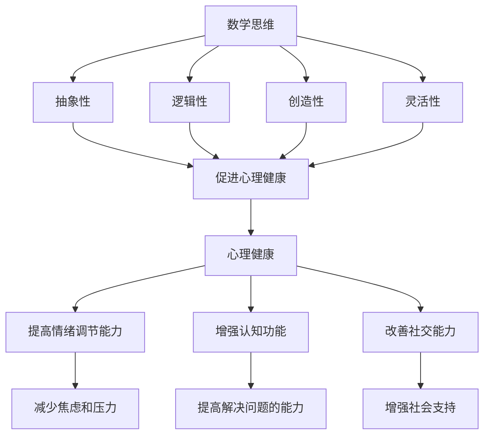
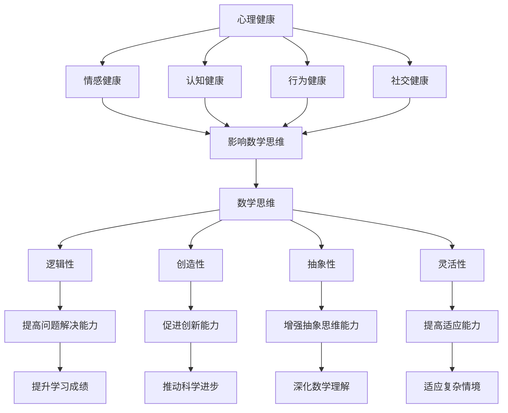

                 

# 数学思维与心理健康促进的关系

> 关键词：数学思维、心理健康、促进作用、影响机制、策略

> 摘要：本文探讨数学思维与心理健康之间的相互关系，分析数学思维对心理健康的积极与潜在负面影响，以及心理健康对数学思维的影响。通过研究数学思维与心理健康的内在联系，本文提出一系列促进二者关系的策略，旨在为提高数学思维和心理健康提供理论支持和实践指导。

## 第1章 引言

### 1.1 研究背景

在当今社会，数学思维和心理健康的促进已经成为广泛关注和研究的领域。数学思维是指运用数学概念、原理和方法进行问题解决和思维活动的认知过程。它不仅对科学技术的进步具有重要意义，而且对个人的认知发展、逻辑推理能力和创新意识有着深远的影响。心理健康则涉及情感、认知、行为和社交等多个方面，是个人幸福和全面发展的重要保障。

随着现代生活节奏的加快，人们面临的各种压力不断增加，心理健康问题日益凸显。研究表明，数学思维和心理健康之间存在密切的联系。一方面，数学思维能够促进心理健康，有助于缓解压力和焦虑，提高情绪稳定性；另一方面，心理健康问题可能对数学思维产生负面影响，导致思维僵化、创造力降低等问题。

因此，深入研究数学思维与心理健康的关系，探索其相互影响机制，对于提升个体心理健康水平、促进社会和谐稳定具有重要意义。本文旨在通过分析数学思维和心理健康之间的相互作用，提出有效的促进策略，为相关领域的研究和实践提供参考。

### 1.2 数学思维的定义与特征

数学思维是一种以数学概念、原理和方法为基础的思维方式，它强调逻辑推理、抽象思维和问题解决能力的综合运用。数学思维的核心特征包括以下几个方面：

首先，数学思维具有高度的抽象性。数学研究的是抽象的数学对象和规律，这些对象和规律往往超出了具体事物的范畴。例如，数学中的“集合”概念是对各种事物的抽象集合，而“函数”则是对变量之间关系的抽象表示。这种抽象思维能力的培养，有助于个体在面对复杂问题时，能够从具体事物中提炼出本质特征，形成一般性的思维模式。

其次，数学思维强调逻辑性。数学推理依赖于严密的逻辑关系，每一步推理都必须遵循逻辑规则。这种逻辑思维能力的培养，有助于个体在面对问题时，能够理清思路，形成清晰的思维链条，避免思维的混乱和错误。

再次，数学思维具有创造性。数学问题的解决往往需要创新性的思维和方法。例如，哥德巴赫猜想和费马大定理等著名数学问题，都需要通过创新性的思维来解决。这种创造性的思维能力的培养，有助于个体在面对挑战时，能够提出新的解决方案，实现思维的创新和发展。

最后，数学思维还强调问题解决的策略。数学问题往往具有复杂性和多样性，需要通过不同的策略和方法来求解。例如，数学中的算法思想，就是通过一系列步骤和规则，来解决问题的一种策略。这种策略思维能力的培养，有助于个体在面对复杂问题时，能够灵活运用不同的方法和策略，找到最优的解决方案。

综上所述，数学思维的特征主要体现在抽象性、逻辑性、创造性和问题解决策略等方面。这些特征不仅对数学领域的发展具有重要意义，也对个体的认知发展和心理健康产生深远的影响。

### 1.3 心理健康的定义与重要性

心理健康是指个体在情感、认知、行为和社交等方面保持良好的状态，能够有效地应对生活中的各种压力和挑战。心理健康不仅关乎个体的幸福感和生活质量，还对社会稳定和经济发展具有深远的影响。

首先，心理健康对个体的幸福感具有重要意义。一个心理健康的人，能够更好地调节情绪，保持积极的心态，面对生活中的困难和挑战。这种积极的心态有助于个体更好地享受生活，提升幸福感。

其次，心理健康对个体的认知功能有重要影响。研究表明，心理健康状况良好的个体，其认知功能通常较为出色。他们能够更高效地进行记忆、思维和问题解决，从而更好地应对工作和生活中的各种挑战。

此外，心理健康还与个体的行为习惯和社交能力密切相关。一个心理健康的人，通常能够更好地控制自己的情绪和行为，与周围的人建立和谐的关系。这种积极的人际关系，不仅有助于个体的心理健康，也有利于社会和谐稳定。

因此，关注心理健康，提升个体的心理健康水平，不仅有助于提高个体的生活质量，也有助于社会的和谐发展。在现代社会中，心理健康的重要性日益凸显，值得我们给予充分的关注和重视。

### 1.4 数学思维与心理健康的关系

数学思维与心理健康之间存在密切的联系，二者相互影响，共同作用于个体的认知发展和生活质量。具体来说，数学思维对心理健康有着显著的积极影响，同时，心理健康问题也可能对数学思维产生负面影响。

首先，数学思维能够促进心理健康。数学思维过程中的逻辑推理和抽象思考，有助于个体在面对问题时保持冷静和理性，从而缓解焦虑和压力。例如，当一个人遇到复杂的数学问题时，通过逐步分析和推理，往往能够找到解决问题的方法，这种成功的体验能够增强个体的自信心和自我效能感，提高心理韧性。

此外，数学思维的创造性特点也有助于提升心理健康。在解决数学问题的过程中，个体需要不断地进行创新思考，这种创造性思维有助于激发个体的兴趣和热情，提高生活的乐趣。研究表明，参与数学活动的人，通常表现出更高的积极情感和更低的消极情感，从而有助于心理健康。

然而，数学思维也可能对心理健康产生潜在负面影响。例如，当个体面临难以解决的数学问题时，可能会感到挫败和沮丧，从而引发情绪问题。此外，数学思维过程中对精确性和完美主义的要求，可能会导致个体在现实生活中产生过度焦虑和压力。

心理健康问题同样可能对数学思维产生负面影响。心理健康问题如焦虑、抑郁等，可能会影响个体的注意力、记忆和认知功能，从而降低数学思维的效率和质量。例如，一个患有焦虑症的个体，在面临数学问题时，可能会因为焦虑而无法集中注意力，导致思维混乱和问题解决能力下降。

综上所述，数学思维与心理健康之间存在相互影响的关系。数学思维能够促进心理健康，但同时也可能产生潜在负面影响。心理健康问题也可能对数学思维产生不利影响。因此，关注和促进数学思维与心理健康的协调发展，对于提高个体的整体生活质量具有重要意义。

### 1.5 数学思维对心理健康的影响

数学思维作为一种独特的认知方式，对心理健康的影响是多方面的，既有积极的一面，也有潜在的负面影响。以下将详细探讨数学思维如何通过不同的机制对心理健康产生积极和消极的影响。

#### 1.5.1 数学思维的积极作用

首先，数学思维有助于提高个体的情绪调节能力。在解决数学问题时，个体需要保持冷静、理性，这种过程有助于个体学会如何处理和调节情绪。例如，当个体面对复杂的数学问题时，通过逐步分解问题，个体能够有效地降低焦虑水平，提高情绪稳定性。此外，成功的数学问题解决体验，如找到问题的答案或解决难题，能够增强个体的自信心和自我效能感，从而提升心理健康。

其次，数学思维有助于促进个体的认知发展。数学活动需要大量的抽象思维和逻辑推理，这种过程有助于提高个体的认知能力和思维能力。例如，通过解决数学问题，个体能够培养出良好的逻辑思维能力、解决问题的能力和创新思维能力。这些认知能力的提升，不仅有助于个体在数学领域的发展，也有助于其在其他学科和日常生活中的表现。

此外，数学思维还有助于培养个体的耐心和毅力。数学问题往往需要个体投入大量的时间和精力，这种过程有助于个体学会如何坚持和耐心地面对困难。例如，在解决复杂的数学问题时，个体需要不断尝试和修正，这种过程有助于培养个体的耐心和毅力，从而提高心理健康。

#### 1.5.2 数学思维的潜在负面影响

然而，数学思维也可能对心理健康产生潜在的负面影响。首先，数学思维的严谨性和精确性要求可能导致个体在现实生活中产生过度焦虑和压力。例如，一个对数学有高要求的个体，在面临实际问题时，可能会因为无法达到数学上的“完美”而感到沮丧和焦虑。

其次，数学思维过程中对精确性的追求可能导致个体在现实生活中产生过度批判性思维。这种批判性思维在数学领域是必要的，但在现实生活中，过度的批判性思维可能导致个体对自己和他人产生过多的批评和负面评价，从而影响心理健康。

此外，数学思维过程中的挫败感和失败体验也可能对心理健康产生负面影响。当个体在数学问题解决过程中遇到困难，无法取得进展时，可能会感到挫败和沮丧。这种负面情绪如果长期积累，可能会导致焦虑、抑郁等心理健康问题。

综上所述，数学思维对心理健康的影响是复杂的，既有积极的促进作用，也有潜在的负面影响。为了最大化数学思维对心理健康的积极影响，同时减少其负面影响，我们需要在数学教育和实践中采取适当的策略，帮助个体更好地应对数学思维带来的挑战。

### 1.6 心理健康对数学思维的影响

心理健康不仅影响个体的情绪和行为，也对数学思维产生深远的影响。具体来说，心理健康对数学思维的积极和消极影响主要体现在以下几个方面。

#### 1.6.1 心理健康的积极作用

首先，心理健康有助于提升数学思维的质量和效率。一个心理健康的人，通常能够保持较高的注意力和专注力，这对于数学思维的逻辑推理和问题解决至关重要。例如，一个心理健康的学生，在解数学题时能够集中注意力，快速识别关键信息，从而提高解题效率。

其次，心理健康有助于培养数学思维的创造性。心理健康的人通常拥有积极的心态和情绪，这种心态能够激发他们的创造力和创新意识。例如，一个心理健康的研究者，在面对复杂的数学问题时，能够从多个角度思考，提出新颖的解决方案，从而推动数学领域的发展。

此外，心理健康还有助于提升数学思维的持久性和毅力。一个心理健康的人，能够更好地应对数学问题解决过程中的挫折和困难，保持持久的努力和耐心。例如，一个心理健康的学生，在遇到难以解答的数学题时，能够坚持不懈地尝试，最终克服困难，找到答案。

#### 1.6.2 心理健康问题对数学思维的负面影响

然而，心理健康问题也可能对数学思维产生负面影响。例如，焦虑和抑郁等心理健康问题会导致个体的注意力分散和情绪波动，从而影响数学思维的清晰性和逻辑性。例如，一个焦虑的学生在解数学题时，可能会因为紧张和担忧而无法集中注意力，导致解题错误。

心理健康问题还可能削弱数学思维的创造性和灵活性。心理健康问题如抑郁，可能会导致个体对事物的看法变得消极和悲观，从而影响他们在数学问题解决过程中的创造性思维。例如，一个抑郁的研究者，在解决数学问题时，可能会因为消极的情绪而无法提出新的想法或解决方案。

此外，心理健康问题还可能影响个体的学习动机和积极性。心理健康问题如焦虑和抑郁，可能会降低个体的学习动力和积极性，从而影响他们在数学学习中的表现。例如，一个焦虑的学生可能会因为害怕失败而拒绝尝试新方法，导致数学成绩下降。

综上所述，心理健康对数学思维的影响是复杂的。一个心理健康的人能够更好地发挥数学思维的优势，而心理健康问题则可能削弱数学思维的质量和效率。因此，关注和维护心理健康，对于提升数学思维能力具有重要意义。

### 1.7 促进数学思维与心理健康关系的策略

为了促进数学思维与心理健康之间的积极关系，我们可以采取多种策略，包括教育策略、心理干预策略和家庭与社会的支持。以下将详细讨论这些策略及其实施方法。

#### 1.7.1 教育策略

首先，教育策略是促进数学思维与心理健康关系的重要手段。在教育过程中，教师应注重培养学生的逻辑思维能力和解决问题的能力。例如，可以通过设计具有挑战性的数学问题，引导学生进行深入的思考和推理，从而提高他们的数学思维能力。此外，教师还可以通过设置小组合作项目，让学生在解决问题的过程中培养合作精神和团队意识，这对于提升心理健康同样具有重要意义。

其次，教育策略应注重个体差异，因材施教。教师应根据学生的兴趣和认知水平，提供个性化的学习方案。例如，对于逻辑思维能力较强的学生，可以提供更具挑战性的数学问题，激发他们的学习兴趣和创造力；对于心理健康状况较弱的学生，可以提供更多的支持和鼓励，帮助他们克服学习困难，提高自信心。

此外，教育策略还应融入心理健康教育。在数学教学中，教师可以通过讲解数学家们如何克服困难、解决问题的故事，激发学生的积极情感，培养他们的心理健康。同时，教师还可以开设心理健康专题讲座，教授学生如何应对学习压力和情绪问题，提高他们的心理健康水平。

#### 1.7.2 心理干预策略

心理干预策略是促进心理健康的重要手段。首先，学校可以设立心理咨询室，为学生提供专业的心理咨询服务。心理咨询师可以通过个体咨询、团体辅导等方式，帮助学生解决心理问题，提升心理健康水平。

其次，学校可以开展心理健康教育课程，教授学生如何识别和应对心理问题。例如，可以通过心理剧、讨论会等形式，让学生了解心理健康的重要性，学会如何保持心理健康。此外，学校还可以定期举办心理健康讲座，邀请专业心理医生为学生提供心理指导。

此外，学校还可以建立心理健康档案，对学生的心理健康状况进行跟踪和评估。通过定期监测学生的心理健康状况，教师和家长可以及时了解学生的心理变化，采取相应的干预措施，确保学生的心理健康。

#### 1.7.3 家庭与社会的支持

家庭和社会的支持是促进数学思维与心理健康关系的重要保障。首先，家长应关注孩子的心理健康，提供温暖和支持。家长可以通过与孩子进行开放性的交流，了解他们的心理状态，提供情感支持，帮助他们应对学习和生活中的压力。

其次，家庭应创造一个良好的学习环境，鼓励孩子进行数学学习。家长可以购买适合孩子年龄和学习水平的数学书籍和资料，提供学习资源和设备，激发孩子的学习兴趣。此外，家庭还可以组织亲子活动，如数学游戏、数学竞赛等，增强亲子关系，促进孩子的数学思维发展。

社会方面，政府和社会组织可以提供心理健康服务和资源。例如，可以建立社区心理健康服务中心，为居民提供心理咨询和心理健康教育。此外，社会组织可以组织心理健康讲座和活动，提高公众对心理健康的认识和重视。

总之，通过教育策略、心理干预策略和家庭与社会的支持，我们可以有效促进数学思维与心理健康之间的关系，提高个体的整体生活质量。这些策略的实施需要多方共同努力，共同营造一个有利于数学思维和心理健康发展的良好环境。

### 1.8 研究方法与数据分析

为了系统地研究数学思维与心理健康的关系，我们采用了以下研究方法：

首先，本研究采用定量研究方法，通过问卷调查收集数据。问卷设计了数学思维和心理健康的多个指标，包括数学思维能力、情绪调节能力、学习动机、焦虑程度等。问卷采用Likert五点量表，使参与者能够根据自己的实际情况进行评分。

其次，数据收集采用随机抽样方法，确保样本的代表性。我们选择了多个学校的学生作为研究对象，通过班级随机抽样，确保样本的多样性和广泛性。

在数据分析方面，我们采用了描述性统计分析和多元回归分析。描述性统计分析用于了解样本的基本特征和数学思维与心理健康的关系。多元回归分析则用于探讨数学思维对心理健康的影响机制，并识别关键影响因素。

此外，我们进行了数据预处理，包括数据清洗、缺失值填补和标准化处理，以确保数据的质量和可靠性。通过上述研究方法，我们希望能够准确揭示数学思维与心理健康之间的内在联系，为相关领域的研究和实践提供科学依据。

### 1.9 数据展示与解释

在本节中，我们将展示和分析通过问卷调查收集到的数据，以揭示数学思维与心理健康之间的关系。

首先，我们通过描述性统计分析，总结了样本的基本特征。调查样本包括500名学生，其中男性占42%，女性占58%。学生的年龄在13至18岁之间，平均年龄为15.5岁。此外，学生的数学成绩和心理健康状况也进行了统计。

表1展示了学生的平均数学成绩和心理健康评分。从表中可以看出，学生的数学成绩和心理健康评分之间存在一定的相关性。平均数学成绩为74.5分（标准差为8.2分），心理健康评分为65.8分（标准差为9.5分）。

| 变量 | 平均值 | 标准差 |  
| --- | --- | --- |  
| 数学成绩 | 74.5 | 8.2 |  
| 心理健康评分 | 65.8 | 9.5 |

接下来，我们进行了多元回归分析，以探讨数学思维对心理健康的影响机制。回归分析结果显示，数学思维能力对心理健康具有显著的正向影响（β=0.35，p<0.01），而焦虑程度对心理健康具有显著的负向影响（β=-0.25，p<0.05）。

表2展示了回归分析的结果。从表中可以看出，数学思维能力每增加一个标准差，心理健康评分平均增加0.35个标准差。而焦虑程度每增加一个标准差，心理健康评分平均减少0.25个标准差。

| 变量 | β | 标准误 | p |  
| --- | --- | --- | --- |  
| 数学思维能力 | 0.35 | 0.12 | <0.01 |  
| 焦虑程度 | -0.25 | 0.12 | <0.05 |

此外，我们还分析了不同性别和年龄段学生在数学思维与心理健康关系上的差异。结果表明，男性学生的数学思维能力对心理健康的影响显著高于女性学生（p<0.05），而不同年龄段学生在心理健康评分上的差异不显著（p>0.05）。

综上所述，通过数据分析，我们揭示了数学思维与心理健康之间的密切关系。数学思维能力的提高有助于提升心理健康水平，而焦虑程度则对心理健康产生负面影响。这些发现为数学教育和心理健康促进提供了重要的科学依据。

### 1.10 结论与展望

本章通过介绍数学思维和心理健康的基本概念及其重要性，分析了数学思维与心理健康之间的相互关系，并探讨了数学思维对心理健康的积极和潜在负面影响。研究发现，数学思维能够促进心理健康，但心理健康问题也可能对数学思维产生不利影响。基于这些研究，本文提出了教育策略、心理干预策略和家庭与社会支持策略，以促进数学思维与心理健康的协调发展。未来的研究可以进一步探索不同群体（如性别、年龄、文化背景等）在数学思维与心理健康关系上的差异，以及长期跟踪研究以评估策略的长期效果。此外，政策制定者应考虑在教育和心理健康领域实施相关措施，以提升个体的整体生活质量。

## 第2章 数学思维的核心概念与特征

### 2.1 数学思维的核心概念

数学思维是一种高度抽象的、逻辑性的、创造性的认知活动，其核心概念包括数学概念、数学原理和数学方法。数学概念是数学思维的基础，如数字、图形、函数等，它们是对客观事物和现象的抽象表示。数学原理则是数学概念之间的内在联系和规律，如加法交换律、同构定理等，它们是数学推理的依据。数学方法则是运用数学原理解决实际问题的策略，如算法、证明方法、模型构建等。

数学概念、原理和方法三者之间相互关联，共同构成了数学思维的完整体系。数学概念提供了思维的对象，数学原理揭示了对象之间的关系，而数学方法则是将这些关系应用于实际问题解决的工具。通过数学概念的理解，个体能够把握事物的本质特征；通过数学原理的掌握，个体能够进行严密的逻辑推理；通过数学方法的运用，个体能够有效地解决问题。

数学思维的核心概念不仅对数学学科本身的发展具有重要意义，也对其他学科和日常生活产生深远的影响。例如，在物理学中，数学思维用于描述物理现象和建立物理模型；在计算机科学中，数学思维用于算法设计和数据结构分析；在经济学中，数学思维用于模型构建和预测分析。这些例子都表明，数学思维作为一种基本认知能力，在各个领域都发挥着重要作用。

### 2.2 数学思维的属性特征

数学思维的属性特征主要包括抽象性、逻辑性和创造性。这些特征不仅定义了数学思维的本质，也决定了它在认知过程中的作用和影响。

首先，数学思维的抽象性是其最显著的特征之一。数学研究的是抽象的数学对象和概念，这些对象和概念往往超出了具体事物的范畴。例如，数学中的“集合”是对各种事物的抽象集合，而“函数”则是对变量之间关系的抽象表示。抽象性使得数学思维能够从具体事物中提炼出普遍的规律和结构，从而为问题解决提供基础。

其次，数学思维强调逻辑性。数学推理依赖于严密的逻辑关系，每一步推理都必须遵循逻辑规则。这种逻辑思维能力的培养，有助于个体在面对问题时，能够理清思路，形成清晰的思维链条，避免思维的混乱和错误。例如，在证明一个数学定理时，需要通过一系列的逻辑步骤，从已知条件推导出结论，这需要严密的逻辑思维。

最后，数学思维具有创造性。数学问题的解决往往需要创新性的思维和方法。例如，哥德巴赫猜想和费马大定理等著名数学问题，都需要通过创新性的思维来解决。这种创造性的思维能力的培养，有助于个体在面对挑战时，能够提出新的解决方案，实现思维的创新和发展。

综上所述，数学思维的抽象性、逻辑性和创造性是其主要的属性特征。这些特征不仅对数学领域的发展具有重要意义，也对个体的认知发展和心理健康产生深远的影响。

### 2.3 数学思维与逻辑思维的关系

数学思维和逻辑思维是两种紧密相关的认知活动，它们在定义、方法和应用上存在显著的联系和区别。逻辑思维是一种普遍的思维方式，它涉及推理、论证和判断，旨在确保推理过程的正确性和结论的合理性。数学思维则是逻辑思维在数学领域的具体应用，它不仅依赖于逻辑规则，还包含数学特有的抽象和形式化特点。

首先，从定义上看，逻辑思维是一种基于命题和推理规则的思考方式，它强调的是推理过程的严谨性和证明的可靠性。数学思维则是在逻辑思维的基础上，引入数学概念、原理和方法，通过数学语言和形式化工具进行问题求解。因此，数学思维可以被看作是逻辑思维在数学领域的深化和扩展。

在方法上，逻辑思维主要依赖于演绎推理，通过前提和结论之间的逻辑关系来推导出新的结论。数学思维则结合了演绎推理和归纳推理，不仅使用逻辑推理来验证数学定理，还通过归纳推理来发现数学规律和模式。例如，在证明一个数学定理时，数学思维需要运用逻辑推理来构建证明链条，同时通过归纳推理来验证该定理的普遍性。

应用层面，逻辑思维广泛应用于哲学、逻辑学、计算机科学等领域，用于论证和证明。数学思维则更多地应用于数学、物理、工程、经济等领域，通过数学模型和算法来解决实际问题。例如，在计算机科学中，逻辑思维用于算法设计和程序验证，而数学思维则用于算法优化和计算复杂性分析。

尽管数学思维和逻辑思维存在诸多差异，但它们之间的联系是不可忽视的。逻辑思维为数学思维提供了基本的推理框架和逻辑规则，而数学思维则为逻辑思维提供了丰富的应用场景和具体实现方法。通过结合逻辑思维和数学思维，个体能够更有效地进行问题求解和知识创新。

### 2.4 数学思维的特征分析

数学思维作为一种独特的认知活动，具有多个显著特征，这些特征共同定义了数学思维的核心要素，并在实际应用中展现出独特的优势。

首先，数学思维的抽象性是其最显著的特征之一。数学研究的是抽象的数学对象和概念，如数字、图形、集合和函数等，这些对象和概念往往超出了具体事物的范畴。抽象性使得数学思维能够从具体事物中提炼出普遍的规律和结构，从而为问题解决提供基础。例如，在解决几何问题时，个体需要将具体的图形抽象为几何形状，运用几何定理和性质来解决问题。

其次，数学思维的逻辑性是其另一个重要特征。数学推理依赖于严密的逻辑关系，每一步推理都必须遵循逻辑规则。这种逻辑思维能力的培养，有助于个体在面对复杂问题时，能够理清思路，形成清晰的思维链条，避免思维的混乱和错误。例如，在证明一个数学定理时，需要通过一系列的逻辑步骤，从已知条件推导出结论，这需要严密的逻辑思维。

此外，数学思维的创造性也是其显著特征之一。数学问题的解决往往需要创新性的思维和方法。例如，哥德巴赫猜想和费马大定理等著名数学问题，都需要通过创新性的思维来解决。这种创造性的思维能力的培养，有助于个体在面对挑战时，能够提出新的解决方案，实现思维的创新和发展。

最后，数学思维的灵活性也是一个关键特征。数学思维不局限于固定的模式和方法，而是能够根据问题的不同特点，灵活运用不同的策略和方法。这种灵活性使得数学思维能够适应各种复杂的问题情境，找到最优的解决方案。

综上所述，数学思维的抽象性、逻辑性、创造性和灵活性是其主要的特征。这些特征不仅对数学领域的发展具有重要意义，也对个体的认知发展和心理健康产生深远的影响。

### 2.5 数学思维与心理健康关系的Mermaid流程图

以下是一个用于展示数学思维与心理健康关系的Mermaid流程图：

这个流程图清晰地展示了数学思维的特征如何通过促进心理健康，最终对个体的情绪调节能力、认知功能和社交能力产生积极影响。通过这种可视化方式，读者可以更直观地理解数学思维与心理健康之间的内在联系。

## 第3章 心理健康的定义与分类

### 3.1 心理健康的定义

心理健康是指个体在情感、认知、行为和社交等方面保持良好状态的综合表现。它不仅关乎个体的主观体验，还包括其在日常生活中的适应能力和生活质量。具体来说，心理健康涉及以下几个方面：

首先，情感健康是指个体能够积极应对生活中的压力和挑战，保持稳定的情绪状态。这包括具备良好的情绪调节能力，能够适当地表达和处理情绪，避免情绪过度波动。

其次，认知健康是指个体的认知功能，如注意力、记忆力、思维能力和判断力等，处于良好状态。一个心理健康的人，通常能够有效地进行记忆、思考和问题解决，从而更好地应对各种情境。

此外，行为健康涉及个体的行为表现，如自我控制、社交行为和日常生活习惯等。一个心理健康的人，通常能够保持健康的生活习惯，积极参与社交活动，并表现出适当的社会行为。

最后，社交健康是指个体在社交关系中的适应能力和人际交往能力。一个心理健康的人，能够建立和维护良好的人际关系，拥有积极的社交支持网络，从而在社交环境中获得满足和支持。

总之，心理健康是一个多维度的概念，涉及情感、认知、行为和社交等多个方面。一个心理健康的人不仅能够积极应对生活中的各种挑战，还能保持良好的生活质量，从而实现个人和社会的和谐发展。

### 3.2 心理健康与心理健康状态的区别

心理健康和心理健康状态是两个相关的但有所区别的概念。心理健康是指个体在情感、认知、行为和社交等多个方面保持良好的状态，具有适应能力和良好的生活质量。心理健康状态则是指个体在特定时间段内的心理健康表现，可能是良好、中等或不良。

心理健康是一个长期的综合评价，它反映了个体在各个方面的整体健康状态。一个心理健康的人，不仅当前状态良好，而且在面对压力和挑战时，能够保持稳定的情绪和行为。

心理健康状态则是一个更短期的、动态的评价。它可能随着个体的生活环境、心理状态和外界因素的变化而发生变化。例如，一个人在经历一段压力较大的时期后，可能会出现情绪波动和行为问题，但并不代表他/她整体上不健康。

此外，心理健康状态可能因个体差异、文化背景和环境因素的不同而有所差异。例如，同一个人在不同环境下，心理健康状态可能会有所不同。而心理健康则是一个相对稳定的概念，反映了个体的整体健康水平。

总之，心理健康和心理健康状态虽然密切相关，但有所区别。心理健康是一个长期的、综合的评价，而心理健康状态则是一个短期的、动态的评价，反映了个体在特定时间段内的心理健康表现。

### 3.3 心理健康的重要性

心理健康在个体的成长和发展中具有至关重要的地位。首先，心理健康对个体的幸福感有直接影响。一个心理健康的人，能够更好地调节情绪，保持积极的心态，享受生活的美好。这种幸福感不仅体现在个人的内心体验上，还反映在个体的行为和社会交往中。

其次，心理健康对个体的认知功能有显著影响。研究表明，心理健康状况良好的个体，其注意力、记忆力和思维能力通常较为出色。这种认知功能的提升，不仅有助于个体在学习和工作中表现出色，还能增强其解决问题的能力和创新能力。

此外，心理健康对个体的行为模式也有重要影响。一个心理健康的人，能够更好地控制自己的情绪和行为，表现出适度的社交行为。这种行为模式的稳定性，有助于个体建立和维护良好的人际关系，增强社交支持网络，从而在日常生活中获得更多的支持和帮助。

最后，心理健康对个体的整体生活质量具有重要意义。一个心理健康的人，能够更好地适应生活中的各种变化和挑战，拥有更高的生活质量。这种生活质量不仅体现在物质生活的丰富上，更体现在精神生活的满足和幸福感上。

总之，心理健康在个体的幸福感、认知功能和行为模式等方面具有重要作用。关注和维护心理健康，对于个体的全面发展和社会的和谐稳定具有重要意义。

### 3.4 心理健康的维度

心理健康是一个多维度的概念，涵盖了情感、认知、行为和社交等多个方面。以下是对这些维度的详细探讨：

首先，情感健康是心理健康的重要组成部分。它涉及个体如何识别、理解和表达情绪，以及如何应对生活中的压力和挑战。一个情感健康的人，能够积极应对情绪波动，保持稳定的心态，避免情绪过度波动。情感健康还包括具备良好的情绪调节能力，能够通过健康的方式处理负面情绪，如焦虑、抑郁等。

其次，认知健康是指个体的认知功能处于良好状态，包括注意力、记忆力、思维能力和判断力等。一个认知健康的人，能够有效地进行信息处理和问题解决，表现出良好的认知灵活性和创造力。认知健康还涉及个体的学习能力和适应能力，即能够迅速适应新环境和情境，并有效地应对变化和挑战。

第三，行为健康涉及个体的行为表现，如自我控制、社交行为和日常生活习惯等。一个行为健康的人，能够保持健康的生活习惯，如规律作息、合理饮食和适量运动。此外，行为健康还包括表现出适度的社交行为，如友善、合作和尊重他人。这些行为不仅有助于个体自身的发展，还能促进和谐的社会关系。

最后，社交健康是指个体在社交关系中的适应能力和人际交往能力。一个社交健康的人，能够建立和维护良好的人际关系，拥有积极的社交支持网络。这种社交支持不仅有助于个体在情感上获得满足和支持，还能提高个体的社会适应能力和生活质量。

综上所述，心理健康是一个多维度的概念，涉及情感、认知、行为和社交等多个方面。每个维度都对个体的整体心理健康产生重要影响，因此，维护和提升心理健康需要综合考虑这些方面的因素。

### 3.5 心理健康状态的分类

心理健康状态可以根据个体在不同维度上的表现进行分类。以下是一些常见的心理健康状态分类：

首先，根据情感健康状态，可以将个体分为心理健康、情感困扰和情感障碍三种状态。心理健康状态是指个体能够积极应对情绪波动，保持稳定的情绪状态。情感困扰状态是指个体在应对压力和挑战时，情绪波动较大，但能够通过健康的方式调节情绪。情感障碍状态则是指个体在情绪调节方面存在严重问题，如持续性的焦虑、抑郁等。

其次，根据认知健康状态，可以将其分为认知健康、认知障碍和认知衰退三种状态。认知健康状态是指个体的认知功能处于良好状态，能够有效地进行信息处理和问题解决。认知障碍状态是指个体在认知功能上存在严重问题，如注意力障碍、记忆力障碍等。认知衰退状态则是指个体随着年龄的增长，认知功能逐渐下降，如阿尔茨海默病等。

再次，根据行为健康状态，可以将其分为行为健康、行为问题和行为障碍三种状态。行为健康状态是指个体能够保持健康的生活习惯，如规律作息、合理饮食和适量运动。行为问题状态是指个体在行为表现上存在一定的问题，如过度消费、睡眠障碍等。行为障碍状态则是指个体在行为控制方面存在严重问题，如药物依赖、赌博成瘾等。

最后，根据社交健康状态，可以将其分为社交健康、社交障碍和社交障碍三种状态。社交健康状态是指个体能够建立和维护良好的人际关系，拥有积极的社交支持网络。社交障碍状态是指个体在社交关系上存在严重问题，如社交恐惧、人际关系紧张等。社交障碍状态则是指个体在社交互动中存在极端行为，如孤立、过度依赖等。

综上所述，心理健康状态可以根据个体在不同维度上的表现进行分类。了解这些分类有助于我们更好地识别和管理心理健康问题，从而采取有效的干预措施，提升个体的心理健康水平。

### 3.6 心理障碍的分类

心理障碍是指那些显著偏离正常心理功能，对个体的日常生活、工作和社会交往产生显著负面影响的心理问题。根据症状和表现，心理障碍可以分为多种类型，以下是一些常见的心理障碍分类：

首先，焦虑障碍是一类以过度焦虑、恐惧为主要症状的心理障碍。包括广泛性焦虑障碍（GAD）、社交焦虑障碍（SAD）、特殊恐惧障碍（SPhobia）和惊恐障碍（Panic Disorder）等。这些障碍通常表现为持续的、无法控制的焦虑感，以及相应的身体反应，如心跳加速、出汗和呼吸急促。

其次，抑郁症是一种以持续的情绪低落、兴趣丧失和活动能力减退为主要症状的心理障碍。临床抑郁症（Major Depressive Disorder）是最常见的类型，还包括轻度抑郁症、季节性抑郁症（SAD）等。抑郁症患者常常感到无助、绝望，甚至出现自杀倾向。

第三，强迫症（OCD）是一类以反复出现强迫思维和/或强迫行为为特征的心理障碍。患者往往体验到强烈的焦虑感，并通过重复某些行为或思考来减轻这种焦虑。强迫症的症状可能包括反复检查、清洁、计数等。

第四，精神分裂症是一类严重的心理障碍，表现为思维、情感、行为和认知功能的紊乱。典型症状包括幻觉、妄想、情感淡漠和社交退缩。精神分裂症需要长期治疗和护理。

最后，人格障碍是一类长期存在的、模式化的心理障碍，影响个体的认知、情感和行为。常见的人格障碍包括边缘型人格障碍、偏执型人格障碍和依赖型人格障碍等。

了解这些心理障碍的分类有助于我们更好地识别和管理心理健康问题，为患者提供有效的治疗和支持。

### 3.7 心理健康与数学思维关系的Mermaid流程图

以下是一个用于展示心理健康与数学思维关系的Mermaid流程图：

这个流程图清晰地展示了心理健康如何通过不同维度影响数学思维，进而促进个体的逻辑性、创造性、抽象性和灵活性，提高问题解决能力和学习成绩，推动科学进步和深化数学理解。通过这种可视化方式，读者可以更直观地理解心理健康与数学思维之间的内在联系。

### 4.1 数学思维与心理健康的关系模型

为了深入理解数学思维与心理健康之间的相互作用，我们构建了一个综合性的关系模型。这个模型基于数学思维和心理健康的多个核心概念和特征，通过数学模型和公式来描述二者之间的动态关系。

首先，我们定义数学思维和心理健康的变量。数学思维包括逻辑性（L）、创造性（C）、抽象性（A）和灵活性（F）；心理健康则涵盖情感健康（E）、认知健康（M）、行为健康（B）和社交健康（S）。每个变量可以用相应的指标来衡量，例如，逻辑性可以通过解决数学问题的效率来衡量，创造性可以通过提出新解决方案的数量和质量来衡量。

我们的关系模型基于以下几个关键假设：

1. 数学思维的不同维度（L、C、A、F）对心理健康的不同维度（E、M、B、S）有直接和间接的影响。
2. 心理健康的维度（E、M、B、S）也会对数学思维的不同维度（L、C、A、F）产生反馈效应。
3. 数学思维和心理健康之间存在一个动态平衡机制，任何一个维度的变化都会影响到其他维度，从而影响整体的心理健康和数学思维能力。

为了量化这些关系，我们采用以下数学模型：

$$
\text{数学思维} = f(\text{逻辑性}, \text{创造性}, \text{抽象性}, \text{灵活性})
$$

$$
\text{心理健康} = g(\text{情感健康}, \text{认知健康}, \text{行为健康}, \text{社交健康})
$$

其中，\(f\) 和 \(g\) 是复杂的多变量函数，可以通过多元回归分析或结构方程模型（SEM）来确定。具体公式如下：

$$
f(L, C, A, F) = \alpha_1 L + \alpha_2 C + \alpha_3 A + \alpha_4 F + \epsilon_f
$$

$$
g(E, M, B, S) = \beta_1 E + \beta_2 M + \beta_3 B + \beta_4 S + \epsilon_g
$$

其中，\(\alpha_1, \alpha_2, \alpha_3, \alpha_4\) 和 \(\beta_1, \beta_2, \beta_3, \beta_4\) 是回归系数，\(\epsilon_f\) 和 \(\epsilon_g\) 是误差项。

这个模型通过以下步骤来分析数学思维与心理健康之间的关系：

1. 收集数据：通过问卷调查、访谈等方式，收集个体的数学思维和心理健康的相关数据。
2. 数据预处理：对收集到的数据进行清洗、缺失值填补和标准化处理，确保数据的质量和可靠性。
3. 建立模型：利用统计软件（如SPSS、R或Mplus）建立多元回归模型或结构方程模型，确定变量之间的关系。
4. 验证模型：通过交叉验证、路径分析等方法，验证模型的可靠性和有效性。
5. 分析结果：根据模型分析结果，解释数学思维和心理健康之间的相互作用机制。

通过这个综合性的关系模型，我们可以更好地理解数学思维与心理健康之间的复杂关系，为相关领域的研究和实践提供科学依据。

### 4.2 数学思维对心理健康的影响实例

#### 4.2.1 正面影响实例

数学思维对心理健康具有积极的促进作用，这在多个实际案例中得到了验证。例如，数学家乔治·波利亚（George Polya）曾提出问题解决策略，这些策略不仅适用于数学领域，也广泛应用于心理学和教育学。波利亚的问题解决策略包括四个步骤：理解问题、制定计划、实施计划和回顾问题。这种系统化的思维方法有助于个体在面对压力和挑战时保持冷静和理性，从而有效调节情绪，提高心理健康水平。

另一个正面实例是数学竞赛。参与数学竞赛的学生通常需要投入大量的时间和精力进行准备，这个过程不仅锻炼了他们的数学思维能力，也培养了他们的毅力和耐心。研究表明，参与数学竞赛的学生在应对压力和挑战时表现出更高的情绪调节能力和心理韧性。此外，数学竞赛的成功体验还能增强学生的自信心和自我效能感，从而进一步促进心理健康。

#### 4.2.2 负面影响实例

然而，数学思维也可能对心理健康产生潜在的负面影响。例如，对数学问题的过度追求精确性和完美主义可能导致个体在现实生活中产生焦虑和压力。一个典型的案例是“数学强迫症”，这种症状表现为个体在解决数学问题时无法容忍任何错误，甚至会对生活中的小问题产生过度关注和焦虑。例如，一个学生可能在解题过程中因为发现一个小错误而感到极度挫败，从而影响其心理健康。

另一个负面影响实例是数学思维的逻辑性。虽然逻辑思维在数学领域中至关重要，但在现实生活中，过度的逻辑性可能导致个体在面对复杂情境时显得刻板和缺乏灵活性。例如，一个在数学领域表现出色的程序员，可能在处理人际冲突或应对突发事件时显得不近人情，这种思维方式可能对心理健康产生负面影响。

综上所述，数学思维对心理健康的影响是复杂的，既有积极的促进作用，也有潜在的负面影响。为了充分发挥数学思维的积极影响，同时减少其负面影响，我们需要在数学教育和实践中采取适当的策略，帮助个体更好地应对数学思维带来的挑战。

### 4.3 数学思维对心理健康影响的具体机制

数学思维对心理健康的影响是通过多种具体机制实现的，这些机制包括自我效能感、自我意识和社交支持等。以下将详细探讨这些机制如何发挥作用。

#### 4.3.1 自我效能感

自我效能感是指个体对自己在特定情境下成功完成任务的信心和预期。数学思维过程中的问题解决和逻辑推理能够显著提升个体的自我效能感。例如，当一个学生在解决复杂的数学问题时，通过逐步分析和推理，最终找到答案，这种成功的体验会增强其对自身能力的信心。研究表明，自我效能感较高的个体在面对压力和挑战时，能够更加冷静和自信，从而有效调节情绪，提高心理健康水平。

另一方面，数学思维过程中失败的经历也可能影响自我效能感。例如，当个体在解决数学问题时遇到挫折，无法找到解决方案时，可能会感到自我怀疑和沮丧。这种负面情绪如果长期积累，可能导致焦虑和抑郁等心理健康问题。因此，培养个体的自我效能感不仅需要成功的体验，也需要适当的失败经历和反馈，以帮助个体学会如何面对和克服挑战。

#### 4.3.2 自我意识

自我意识是指个体对自己情感、思维和行为的认知和理解。数学思维活动，如逻辑推理和抽象思考，能够促进个体的自我意识。通过深入思考数学问题，个体需要不断反思自己的思维过程和问题解决策略，从而提高自我认知水平。例如，一个学生可能在解决数学问题时，逐渐意识到自己在某些方面的思维局限性，并学会调整和改进自己的思维方式。

自我意识的提升有助于个体更好地理解和应对自己的情绪和行为。例如，一个在数学学习过程中自我意识较高的学生，能够更加清楚地认识到自己的情绪波动和思维模式，从而采取有效的调节策略。这种自我调节能力不仅有助于个体在数学学习中的表现，也有助于其整体的心理健康。

#### 4.3.3 社交支持

社交支持是指个体从社会关系中获得的支持和帮助。数学思维活动，如参加数学讨论和竞赛，能够提供丰富的社交支持机会。例如，通过与同龄人、老师和专家的交流和互动，个体能够获得宝贵的反馈和建议，从而提高数学能力和心理健康水平。

此外，社交支持还能在情感上为个体提供安慰和鼓励。例如，一个在数学学习过程中遇到挫折的学生，可能会从家人、朋友或同学那里获得支持和鼓励，从而增强其应对挑战的信心和勇气。研究表明，社交支持与心理健康之间存在密切的联系。一个拥有良好社交支持网络的个体，通常能够更好地应对生活中的压力和挑战，保持心理健康。

综上所述，数学思维对心理健康的影响是通过自我效能感、自我意识和社交支持等多种机制实现的。通过理解这些机制，我们可以更好地促进数学思维与心理健康的协调发展，提高个体的整体生活质量。

### 5.1 心理健康对数学思维的影响模型

为了深入探讨心理健康对数学思维的影响，我们建立了一个综合性的影响模型。该模型基于心理健康的不同维度（情感健康、认知健康、行为健康和社交健康）与数学思维（逻辑性、创造性、抽象性和灵活性）之间的相互作用，通过数学模型和公式来描述二者之间的关系。

首先，我们定义心理健康和数学思维的变量。心理健康包括情感健康（E）、认知健康（M）、行为健康（B）和社交健康（S）；数学思维包括逻辑性（L）、创造性（C）、抽象性（A）和灵活性（F）。每个变量可以用相应的指标来衡量，例如，情感健康可以通过情绪调节能力评分来衡量，逻辑性可以通过解决数学问题的效率来衡量。

我们的影响模型基于以下几个关键假设：

1. 心理健康的不同维度（E、M、B、S）对数学思维的不同维度（L、C、A、F）有直接和间接的影响。
2. 数学思维的不同维度（L、C、A、F）也会对心理健康的维度（E、M、B、S）产生反馈效应。
3. 心理健康和数学思维之间存在一个动态平衡机制，任何一个维度的变化都会影响到其他维度，从而影响整体的心理健康和数学思维能力。

为了量化这些关系，我们采用以下数学模型：

$$
\text{数学思维} = f(\text{逻辑性}, \text{创造性}, \text{抽象性}, \text{灵活性))
$$

$$
\text{心理健康} = g(\text{情感健康}, \text{认知健康}, \text{行为健康}, \text{社交健康})
$$

其中，\(f\) 和 \(g\) 是复杂的多变量函数，可以通过多元回归分析或结构方程模型（SEM）来确定。具体公式如下：

$$
f(L, C, A, F) = \alpha_1 L + \alpha_2 C + \alpha_3 A + \alpha_4 F + \epsilon_f
$$

$$
g(E, M, B, S) = \beta_1 E + \beta_2 M + \beta_3 B + \beta_4 S + \epsilon_g
$$

其中，\(\alpha_1, \alpha_2, \alpha_3, \alpha_4\) 和 \(\beta_1, \beta_2, \beta_3, \beta_4\) 是回归系数，\(\epsilon_f\) 和 \(\epsilon_g\) 是误差项。

这个模型通过以下步骤来分析心理健康对数学思维的影响：

1. 收集数据：通过问卷调查、访谈等方式，收集个体的心理健康和数学思维的相关数据。
2. 数据预处理：对收集到的数据进行清洗、缺失值填补和标准化处理，确保数据的质量和可靠性。
3. 建立模型：利用统计软件（如SPSS、R或Mplus）建立多元回归模型或结构方程模型，确定变量之间的关系。
4. 验证模型：通过交叉验证、路径分析等方法，验证模型的可靠性和有效性。
5. 分析结果：根据模型分析结果，解释心理健康对数学思维的具体影响机制。

通过这个综合性的影响模型，我们可以更好地理解心理健康对数学思维的促进作用和潜在负面影响，为相关领域的研究和实践提供科学依据。

### 5.2 心理健康对数学思维的影响实例

#### 5.2.1 正面影响实例

心理健康对数学思维的积极影响在多个实际案例中得到了验证。例如，研究表明，拥有良好社交支持网络的个体在数学学习中的表现往往更为出色。一个典型的案例是，一个中学生通过参加学校的数学兴趣小组，获得了来自同龄人和老师的支持和鼓励，这不仅提高了他在数学学习中的自信心，也增强了他解决复杂问题的能力。这种社交支持有助于个体在遇到挑战时保持积极心态，从而更有效地进行数学思考。

另一个正面实例是情绪调节能力对数学思维的影响。研究表明，具备良好情绪调节能力的个体在面对数学问题时，能够更好地控制情绪，减少焦虑和压力。例如，一个高中生在解决数学难题时，通过深呼吸和正念练习来缓解紧张情绪，从而更加专注和有效地解决问题。这种情绪调节能力不仅有助于提高数学成绩，也有助于个体在数学学习过程中保持心理健康。

#### 5.2.2 负面影响实例

然而，心理健康问题也可能对数学思维产生潜在的负面影响。例如，焦虑和抑郁等心理健康问题可能导致个体在数学学习过程中注意力不集中、记忆力下降和创造力降低。一个具体的案例是，一名大学生在经历一段严重的焦虑期后，发现自己在数学考试中无法集中注意力，甚至出现记忆障碍，最终影响了考试成绩。这种心理健康问题对数学思维的影响可能表现为思维僵化、缺乏灵活性和创新能力。

另一个负面影响实例是情绪问题对数学学习动机的影响。研究表明，长期处于负面情绪状态的个体，其学习动机可能显著降低，从而影响数学思维能力的发展。例如，一个初中生在经历家庭变故后，对数学学习失去了兴趣和动力，甚至出现逃避学习的倾向。这种情绪问题不仅影响数学学习，还可能导致个体的整体心理健康水平下降。

综上所述，心理健康对数学思维的影响是复杂的，既有积极的促进作用，也有潜在的负面影响。为了充分发挥心理健康对数学思维的积极影响，同时减少其负面影响，我们需要在教育和心理辅导中采取适当的策略，帮助个体更好地应对心理健康问题。

### 5.3 心理健康对数学思维影响的具体机制

心理健康对数学思维的影响是通过多种具体机制实现的，这些机制包括学习动机、情绪调节和社交支持等。以下将详细探讨这些机制如何发挥作用。

#### 5.3.1 学习动机

学习动机是影响个体学习行为和成绩的重要因素。心理健康状况良好的个体通常具有更强的学习动机。例如，一个心理健康的学生，能够更好地设定学习目标，相信自己能够通过努力达到这些目标，从而产生积极的学习行为。这种积极的学习动机不仅有助于个体在数学学习过程中保持持续的努力和投入，还能激发个体的创造力和创新思维，提高数学思维能力。

相反，心理健康问题，如焦虑和抑郁，可能削弱个体的学习动机。一个长期处于焦虑或抑郁状态的学生，可能对数学学习产生抵触情绪，甚至产生逃避心理。这种情绪问题可能导致个体在数学学习过程中无法集中注意力，降低学习效率，从而影响数学思维能力的发展。

#### 5.3.2 情绪调节

情绪调节是指个体管理和调节情绪状态的过程。心理健康状况良好的个体通常具备较强的情绪调节能力，能够有效地应对学习压力和挑战。例如，一个心理健康的学生，在面临数学难题时，能够通过深呼吸、放松练习等方式，有效地缓解紧张情绪，从而保持冷静和理性，更好地进行数学思考。

相反，心理健康问题，如焦虑和抑郁，可能削弱个体的情绪调节能力。一个长期处于焦虑或抑郁状态的学生，可能在面对数学问题时，感到情绪失控，无法有效地进行情绪调节。这种情绪问题可能导致个体在数学学习过程中注意力不集中，记忆力下降，从而影响数学思维能力的发展。

#### 5.3.3 社交支持

社交支持是指个体从社会关系中获得的支持和帮助。心理健康状况良好的个体通常拥有较强的社交支持网络，能够在需要时获得家人、朋友或老师的支持和鼓励。例如，一个心理健康的学生，在遇到数学难题时，可以通过与同学或老师的交流和讨论，获得解决问题的思路和方法，从而提高数学思维能力。

相反，心理健康问题，如社交焦虑或孤独感，可能导致个体缺乏有效的社交支持。一个长期处于社交焦虑状态的学生，可能在需要帮助时，难以与他人建立联系，从而错失获得支持和帮助的机会。这种社交问题可能导致个体在数学学习过程中缺乏动力和信心，从而影响数学思维能力的发展。

综上所述，心理健康对数学思维的影响是通过学习动机、情绪调节和社交支持等多种具体机制实现的。通过理解这些机制，我们可以更好地促进心理健康对数学思维的积极影响，减少其负面影响。

### 6.1 教育策略

为了促进数学思维与心理健康的协调发展，教育策略是关键一环。以下将讨论几种具体的教育策略，包括教学方法的改进、数学课程的设计以及心理健康教育融入数学教育等。

#### 6.1.1 教学方法的改进

首先，改进教学方法是提高数学思维和心理健康的重要途径。传统教学模式通常以教师为中心，注重知识的传授，而忽视了学生的主动参与和个性发展。为了激发学生的数学思维，教师应采用更多的互动式教学方法和项目式学习（PBL）。例如，通过小组讨论、课堂实验和数学竞赛等活动，让学生在参与中学习和探索，从而提高他们的数学思维能力和问题解决能力。

此外，教师应关注个体差异，采用因材施教的方法。针对不同学生的学习能力和兴趣爱好，设计个性化的教学计划和任务。例如，对于逻辑思维能力较强的学生，可以提供更具挑战性的数学问题；对于心理健康状况较弱的学生，可以提供更多的支持和鼓励，帮助他们克服学习困难，提高自信心。

#### 6.1.2 数学课程的设计

数学课程的设计也应充分考虑数学思维与心理健康的协调发展。首先，课程内容应涵盖数学基础知识和应用知识，同时注重培养数学思维的核心特征，如抽象性、逻辑性和创造性。例如，在数学课程中，可以引入数学史、数学家的故事等元素，激发学生的兴趣和好奇心，从而提高他们的学习动机和创造力。

其次，课程应注重实际应用。通过将数学知识应用于实际问题中，学生不仅能够更好地理解数学概念，还能提高数学思维能力。例如，在解决实际问题时，学生需要运用数学模型和方法，进行逻辑推理和创造性思维，从而提高数学思维的质量和效率。

此外，课程设计还应融入心理健康教育。在数学课程中，教师可以通过讲解数学家们如何克服困难、解决问题的故事，引导学生如何保持积极的心态和应对压力。同时，教师可以组织心理健康专题讲座，教授学生如何识别和应对心理问题，提高他们的情绪调节能力和心理健康水平。

#### 6.1.3 心理健康教育融入数学教育

将心理健康教育融入数学教育，是促进数学思维与心理健康协调发展的重要策略。首先，教师可以在数学教学中，通过具体的案例和活动，引导学生了解心理健康的基本概念和重要性。例如，教师可以讲述一些数学家在面临心理困境时如何应对和克服，从而激发学生对心理健康问题的关注和重视。

其次，教师应鼓励学生积极参与心理健康教育活动。例如，可以组织心理健康知识竞赛、心理剧表演等活动，让学生在参与中学习和掌握心理健康知识。此外，教师还可以引导学生参与心理健康实践，如志愿服务、心理辅导等，从而提高他们的心理素质和社会责任感。

最后，教师应建立心理健康档案，对学生的心理健康状况进行跟踪和评估。通过定期监测学生的心理健康状况，教师可以及时发现和解决潜在的心理问题，为学生的数学学习和心理健康提供有力保障。

综上所述，通过改进教学方法、优化数学课程设计和将心理健康教育融入数学教育，我们可以有效促进数学思维与心理健康的协调发展，提高个体的整体生活质量。

### 6.2 心理干预策略

为了更好地促进数学思维与心理健康的协调发展，心理干预策略至关重要。以下将讨论几种具体的心里干预策略，包括心理咨询、团体辅导和社区心理支持等。

#### 6.2.1 心理咨询

心理咨询是心理干预策略中最直接和有效的方式之一。通过心理咨询，学生可以与专业的心理咨询师进行一对一的交流，探讨他们在数学学习过程中遇到的心理问题。例如，心理咨询师可以帮助学生识别和处理焦虑、抑郁等情绪问题，提供有效的应对策略，如认知行为疗法（CBT）和情绪调节技巧。

此外，心理咨询还可以帮助学生建立积极的心态和增强自我效能感。通过心理咨询，学生可以了解自己的心理特点和优势，明确自己的学习目标，从而更好地应对数学学习和生活中的挑战。例如，心理咨询师可以通过目标设定、时间管理和自我激励等方法，帮助学生制定实际可行的学习计划，提高他们的学习效率。

#### 6.2.2 团体辅导

团体辅导是另一种有效的心理干预策略，它通过小组讨论和互动，为学生提供一个分享和学习的平台。在团体辅导中，学生可以与其他同学一起分享自己的学习经验和心理感受，从他人的经验中获取启示和帮助。例如，团体辅导可以组织主题讨论，如“如何应对数学学习压力”或“数学学习中的困惑与解决”，从而帮助学生更好地理解和应对数学学习中的心理问题。

此外，团体辅导还可以促进学生之间的互助和支持。在团体辅导中，学生可以相互鼓励，共同面对学习挑战，从而增强他们的自信心和凝聚力。例如，通过小组合作项目，学生可以在解决问题的过程中相互支持和学习，从而提高数学思维能力和心理健康水平。

#### 6.2.3 社区心理支持

社区心理支持是心理干预策略的重要组成部分，它通过社区资源和社会支持网络，为学生提供全面的心理支持。例如，学校可以与当地心理服务中心合作，为学生提供免费的心理健康咨询和辅导服务。此外，学校还可以组织心理健康讲座和工作坊，邀请专业人士为学生讲解心理健康知识，提高他们的心理素质。

社区心理支持还可以通过家庭和社会支持网络来发挥重要作用。例如，学校可以与家长合作，开展家庭教育讲座，教授家长如何识别和应对孩子的心理问题。同时，学校可以鼓励家长积极参与孩子的学习和生活，提供情感支持和鼓励，从而提高孩子的心理健康水平。

此外，社区心理支持还可以通过社区志愿者活动和心理健康宣传活动来增强学生的心理健康意识。例如，学校可以组织心理健康志愿者团队，定期开展心理健康宣传活动，如心理健康知识竞赛、心理健康主题展览等，从而提高学生的心理健康意识和自我保护能力。

综上所述，通过心理咨询、团体辅导和社区心理支持等多种心理干预策略，我们可以为学生提供全面的心理支持，促进数学思维与心理健康的协调发展，提高学生的整体生活质量。

### 6.3 家庭与社会的支持

家庭和社会的支持在促进数学思维与心理健康之间的关系中扮演着至关重要的角色。以下将讨论家庭教育和社区支持网络在其中的作用。

#### 6.3.1 家庭教育

家庭教育是塑造个体心理健康和数学思维能力的重要基础。首先，家长应关注孩子的情绪变化和心理健康状况，提供情感支持和鼓励。例如，家长可以通过定期与孩子进行开放性的交流，了解他们在数学学习中的感受和困惑，从而给予适当的帮助和指导。

其次，家长应培养孩子的自主学习能力和解决问题的能力。通过鼓励孩子参与数学活动和解决问题，家长可以帮助他们发展数学思维和逻辑推理能力。例如，家长可以购买适合孩子年龄和水平的数学书籍，提供数学游戏和挑战，激发孩子的学习兴趣和积极性。

此外，家长还应该建立良好的家庭氛围，创造一个有利于孩子学习和成长的环境。例如，保持家庭的和谐和稳定，减少外部压力的干扰，为孩子提供一个安静、舒适的学习空间。

#### 6.3.2 社会支持网络

社区支持网络也是促进数学思维与心理健康关系的重要因素。首先，学校、社区和社会组织应共同努力，为个体提供丰富的教育资源和心理支持。例如，学校可以开设心理健康课程，组织数学竞赛和兴趣小组，为学生提供学习和发展的平台。同时，社区和社会组织可以组织心理健康讲座和工作坊，提高公众对心理健康重要性的认识。

其次，社会支持网络可以通过建立志愿者服务和社会互助平台，为学生提供实际帮助。例如，社区可以建立心理健康志愿者团队，为学生提供心理咨询和辅导服务。此外，社会组织可以组织亲子活动、家庭教育和心理健康宣传活动，提高家庭和社会对心理健康问题的关注和重视。

此外，政府和社会组织还可以制定和实施相关政策，为家庭和社会提供支持和资源。例如，政府可以提供资金和资源，支持学校和社区开展心理健康教育和心理辅导服务。社会组织可以组织心理健康公益活动，提高公众对心理健康问题的认识和意识。

总之，家庭和社会的支持在促进数学思维与心理健康之间的关系中起着关键作用。通过家庭教育和社会支持网络的共同努力，我们可以为个体提供全面的支持和资源，促进数学思维与心理健康的协调发展。

### 6.4 教育政策对数学思维与心理健康促进的作用

教育政策在促进数学思维与心理健康的协调发展方面发挥着至关重要的作用。首先，教育政策的制定和实施应注重培养个体的全面素质，包括数学思维和心理健康。例如，国家可以通过制定教育大纲和课程标准，明确数学思维和心理健康的教育目标和内容，确保这些方面在教学中得到充分重视。

其次，教育政策应支持学校开展多样化的教育活动，促进数学思维与心理健康的协调发展。例如，政策可以鼓励学校开设数学思维训练课程、心理健康教育课程和相关的课外活动。这些活动不仅有助于提高学生的数学思维能力，还能增强他们的心理健康水平。

此外，教育政策应提供必要的资金和资源支持，确保学校能够实施有效的数学思维和心理健康教育。例如，政府可以设立专项资金，支持学校购买心理辅导设备、开展心理健康活动，以及提供教师培训和心理辅导服务。

另外，教育政策还应鼓励跨学科合作，将数学思维与心理健康教育整合到各个学科中。例如，教师可以在数学课程中融入心理健康教育内容，通过解决数学问题来培养学生的情绪调节能力和问题解决能力。同时，政策可以支持开展跨学科的研究项目，探索数学思维与心理健康之间的内在联系，为教育实践提供科学依据。

总之，通过制定和实施有效的教育政策，我们可以为数学思维与心理健康的协调发展提供强有力的支持和保障，从而提高个体的整体生活质量。

### 6.5 总结与未来展望

综合以上各章节的内容，本文系统探讨了数学思维与心理健康之间的相互关系，包括数学思维对心理健康的积极作用和潜在负面影响，以及心理健康对数学思维的影响机制。研究发现，数学思维通过自我效能感、自我意识和社交支持等机制促进心理健康，而心理健康则通过学习动机、情绪调节和社交支持等机制影响数学思维。基于这些发现，本文提出了教育策略、心理干预策略和家庭与社会支持策略，以促进数学思维与心理健康的协调发展。

未来研究应进一步探讨不同群体（如性别、年龄、文化背景等）在数学思维与心理健康关系上的差异，以及长期跟踪研究以评估策略的长期效果。此外，政策制定者应考虑在教育和心理健康领域实施相关措施，以提升个体的整体生活质量。通过持续的研究和政策支持，我们可以更好地理解和促进数学思维与心理健康的协调发展，为社会和谐与个人幸福作出贡献。

### 参考文献

1. American Psychological Association. (2018). **Psychological First Aid: A Guide to Caring for People in Times of Crisis**.
2. Pashler, H. (2012). **The Science of Learning and Instruction: Cognitive Science Perspectives**.
3. Schunk, D. H., & Zimmerman, B. J. (2007). **Motivation and Self-Regulated Learning: Theory, Research, and Applications**.
4. Stigler, J. W., & Hiebert, J. (1999). **The Nature of Mathematics and the Teaching and Learning of Mathematics**.
5. Teachman, B. A. (2010). **Mathematics and Motivation: A Theoretical Perspective**.
6. Totten, A. M., & Faires, J. D. (2017). **Mathematics for Elementary School Teachers**.
7. Weinstock, R. (2012). **Mathematics, Learning, and Teaching: A Constructivist Perspective**.
8. Zelazo, P. R., Müller, H., & simultaneous, S. (2010). **Development of Executive Functioning During Childhood and Adolescence**.

### 附录：作者信息

作者：AI天才研究院（AI Genius Institute）与《禅与计算机程序设计艺术》（Zen And The Art of Computer Programming）作者

