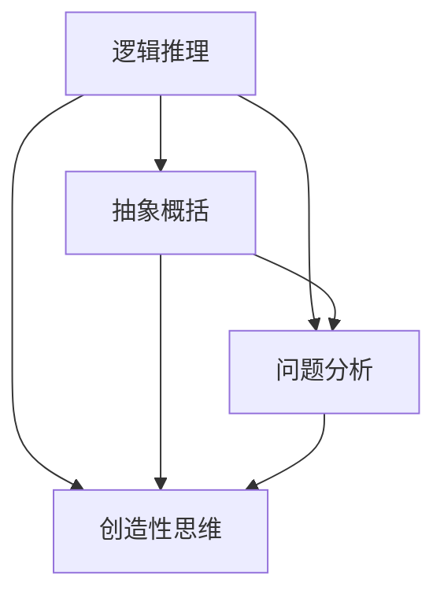
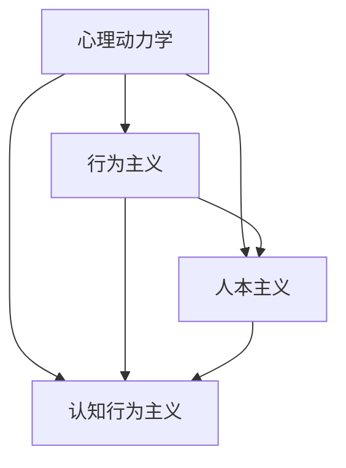

                 

### 第一部分：背景介绍

## 1.1 问题背景

### 1.1.1 数学思维的重要性

**核心概念**：数学思维是指运用数学概念、原理和方法，进行逻辑推理、抽象概括和创造性思维的能力。

数学思维不仅仅是一种学科能力，它更是一种跨越各种领域、解决问题的通用能力。在日常生活中，我们经常遇到需要分析、推理和解决复杂问题的场景，而数学思维正是这些场景中的得力工具。

**问题描述**：在现代社会，数学思维被广泛认为是一种重要的思维能力，它不仅有助于解决复杂的实际问题，还能够培养个体的逻辑思维、创新能力和解决问题的能力。然而，许多人对于数学思维的理解和应用仍然存在一定的误区和不足。

- **误区**：许多人认为数学思维只与数学学科相关，而忽视了它在其他领域的应用价值。实际上，数学思维是一种普遍适用的思维模式，它在科学、工程、医学、经济、教育等多个领域都有广泛的应用。
- **不足**：部分人在面对数学问题时，往往感到困惑和无从下手，缺乏有效的数学思维方法和技巧。

**问题解决**：为了更好地理解和应用数学思维，我们需要从以下几个方面入手：

1. **提高数学素养**：通过系统的数学学习和训练，提高对数学概念、原理和方法的理解和应用能力。
2. **培养逻辑思维能力**：数学思维的核心是逻辑推理，通过日常生活中的逻辑训练，提高逻辑思维的能力。
3. **学习数学思维技巧**：掌握一些常用的数学思维技巧，如抽象概括、问题分解、模型构建等，有助于解决复杂的数学问题。
4. **实践应用**：将数学思维应用到实际问题中，通过解决实际问题来提高数学思维能力。

**边界与外延**：数学思维不仅包括数学专业的理论和方法，还涵盖了跨学科的思维模式和应用。例如，在计算机科学中，算法设计和优化需要运用数学思维；在经济学中，市场分析和预测也需要运用数学思维。

**概念结构与核心要素组成**：数学思维的核心要素包括逻辑推理、抽象概括、问题分析和创造性思维。这些要素相互关联，共同构成了数学思维的整体框架。

### 1.1.2 心理治疗技术的概述

**核心概念**：心理治疗技术是指运用心理学理论和方法，帮助个体解决心理问题、提高心理健康水平的一系列方法和手段。

心理治疗技术在现代社会中具有重要作用，它可以帮助人们应对各种心理困扰，如焦虑、抑郁、人际关系问题等。有效的心理治疗不仅能够改善个体的心理健康，还能够提高生活质量。

**问题描述**：心理治疗技术在现代医学领域具有举足轻重的地位，它通过帮助个体认识和调整心理状态，从而改善心理健康和生活质量。然而，不同心理治疗技术之间的差异和适用性仍需深入研究。

**问题解决**：为了提高心理治疗的效果，我们需要从以下几个方面入手：

1. **深入研究心理治疗技术**：了解各种心理治疗技术的原理、特点和适用范围，为个体提供最适合的心理治疗方案。
2. **跨学科整合**：将心理治疗技术与数学思维相结合，发挥两者的优势，提高心理治疗的科学性和有效性。
3. **实践探索**：通过实践应用，不断优化和改进心理治疗技术，提高其治疗效果。

**边界与外延**：心理治疗技术不仅涉及心理学领域，还包括医学、教育学等多个学科。在应用过程中，需要综合考虑个体差异、文化背景和社会环境等因素。

**概念结构与核心要素组成**：心理治疗技术的核心要素包括理论依据、技术方法和实践应用。这些要素相互关联，共同构成了心理治疗技术的整体框架。

### 1.2 数学思维与心理治疗技术的联系

**核心概念**：数学思维与心理治疗技术之间存在一定的联系和相互作用，这种联系有助于提高心理治疗的效果和个体心理健康水平。

数学思维和心理治疗技术虽然起源于不同的学科领域，但它们在许多方面具有共同的特点和目标。例如，数学思维强调逻辑推理和抽象概括，而心理治疗技术则注重个体心理状态的分析和调整。这种相似性为两者的结合提供了可能。

**问题描述**：尽管数学思维和心理治疗技术在研究领域和应用方面存在一定的差异，但它们在理论和实践上具有一定的交叉和融合。如何充分发挥数学思维在心理治疗中的作用，仍需进一步研究。

**问题解决**：为了充分发挥数学思维在心理治疗中的作用，我们可以从以下几个方面进行探索：

1. **理论融合**：将数学思维的理论和方法引入心理治疗领域，为心理治疗提供新的理论依据和技术手段。
2. **技术互补**：将心理治疗技术应用于数学思维的培养和训练，提高个体的逻辑思维能力和问题解决能力。
3. **实践应用**：通过实际案例，探索数学思维和心理治疗技术在心理健康服务中的应用效果，为心理健康服务提供新的思路和方法。

**边界与外延**：数学思维和心理治疗技术的联系不仅限于心理治疗领域，还可以扩展到教育、医疗等多个领域。例如，在教育资源分配、医疗服务优化等方面，数学思维和心理治疗技术都可以发挥重要作用。

**概念结构与核心要素组成**：数学思维与心理治疗技术的联系包括理论融合、技术互补和实践应用。这些要素相互关联，共同构成了数学思维与心理治疗技术联系的整体框架。

通过上述分析，我们可以看到，数学思维和心理治疗技术之间存在紧密的联系和相互作用。深入研究和应用这种联系，有助于提高心理健康服务的质量和效果，为个体的心理健康提供更加全面和有效的支持。

----------------------------------------------------------------

## 第二部分：核心概念与联系

### 2.1 数学思维的原理与特征

#### 2.1.1 数学思维的原理

数学思维是运用数学概念、原理和方法，进行逻辑推理、抽象概括和创造性思维的能力。其核心在于将现实世界的问题抽象为数学模型，并通过数学方法进行求解和分析。

数学思维的原理主要包括以下几个方面：

1. **逻辑推理**：逻辑推理是数学思维的基础。它通过逻辑运算符（如与、或、非等）和推理规则（如三段论、逆否等价等），对已知信息进行推理和论证，从而得出新的结论。
2. **抽象概括**：抽象概括是将具体问题提炼为普遍规律的过程。通过抽象，我们可以从复杂的实际问题中提取出关键因素和关系，从而简化问题的处理。
3. **问题分析**：问题分析是数学思维的关键步骤。它通过分解问题、识别关键变量和关系，构建数学模型，为问题的求解提供方向。
4. **创造性思维**：创造性思维是数学思维的灵魂。它通过创新的方法和思路，寻找新的解决方案，突破传统思维模式，实现问题的优化和改进。

**概念属性特征对比表格**：

| 特征 | 逻辑推理 | 抽象概括 | 问题分析 | 创造性思维 |
| --- | --- | --- | --- | --- |
| 定义 | 运用数学概念进行推理和论证 | 将具体问题抽象为数学问题 | 对问题进行深入分析和解决 | 运用数学方法进行创新和发现 |

**ER实体关系图架构**：

#### 2.1.2 数学思维的应用

数学思维在各个领域都有广泛的应用，包括自然科学、社会科学、工程技术等。

**自然科学**：在自然科学中，数学思维广泛应用于物理学、化学、生物学等领域。例如，在物理学中，牛顿运动定律、万有引力定律等都是基于数学思维建立的理论。在化学中，化学反应方程式的推导、化学键的描述等都需要运用数学思维。在生物学中，基因序列分析、生物进化模型等也离不开数学思维的支撑。

**社会科学**：在社会科学中，数学思维同样发挥着重要作用。例如，在经济学中，供需关系的分析、市场预测等都需要运用数学方法。在社会学中，社会调查、群体行为分析等也需要借助数学思维。在心理学中，心理测量、统计推断等更是离不开数学思维的支持。

**工程技术**：在工程技术中，数学思维的应用更是无处不在。例如，在工程设计中，电路设计、结构分析等都需要运用数学思维。在计算机科学中，算法设计、优化分析等更是数学思维的典型应用场景。在自动化控制中，控制算法的推导和优化也需要运用数学思维。

**应用案例**：

- **自然科学**：数学思维在物理学中的应用。例如，爱因斯坦的相对论理论是基于数学思维构建的，它通过数学公式和推理，揭示了时间、空间和物质之间的深层次关系。
- **社会科学**：数学思维在经济学中的应用。例如，经济学中的供需模型，通过数学方法分析市场行为，为市场预测和决策提供依据。
- **工程技术**：数学思维在计算机科学中的应用。例如，算法的复杂度分析，通过数学方法评估算法的性能，为算法优化提供指导。

通过上述分析，我们可以看到，数学思维在各个领域都有广泛的应用，它不仅帮助我们理解和解决问题，还能够提高我们的思维能力和创新水平。

### 2.2 心理治疗技术的原理与特点

#### 2.2.1 心理治疗技术的原理

心理治疗技术是指运用心理学理论和方法，帮助个体解决心理问题、提高心理健康水平的一系列方法和手段。其核心在于通过改变个体的认知、情感和行为，帮助其适应生活压力，提高生活质量。

心理治疗技术的原理主要包括以下几个方面：

1. **心理动力学**：心理动力学理论认为，个体的心理问题源自潜意识冲突和早期经验。通过探索和分析潜意识，个体可以理解并解决内心冲突，实现心理成长。
2. **行为主义**：行为主义理论认为，个体的行为受外部环境和内部心理因素影响。通过改变外部环境和强化积极行为，可以改变个体的行为模式，提高心理健康水平。
3. **人本主义**：人本主义理论强调个体的自我实现和成长。通过建立良好的人际关系和提供支持，个体可以发挥自身潜能，实现心理健康和全面发展。
4. **认知行为主义**：认知行为主义理论认为，个体的心理问题源自错误的认知和思维模式。通过认知重构和行为调整，个体可以改变负面思维模式，提高心理健康水平。

**概念属性特征对比表格**：

| 特征 | 心理动力学 | 行为主义 | 人本主义 | 认知行为主义 |
| --- | --- | --- | --- | --- |
| 定义 | 探索潜意识冲突和早期经验 | 外部环境和内部心理因素影响 | 自我实现和成长 | 错误的认知和思维模式 |

**ER实体关系图架构**：

#### 2.2.2 心理治疗技术的特点

心理治疗技术的特点包括以下几个方面：

1. **个体针对性**：心理治疗技术强调根据个体的具体情况制定个性化的治疗方案，以最大程度地提高治疗效果。
2. **科学性**：心理治疗技术基于心理学理论和方法，具有科学性和系统性，能够有效解决各种心理问题。
3. **综合性**：心理治疗技术涉及多个心理学领域，如动力学、行为主义、人本主义和认知行为主义等，能够综合运用各种方法和手段，提高心理健康水平。
4. **实践性**：心理治疗技术强调实践应用，通过实际操作和体验，帮助个体实现心理成长和改变。

通过上述分析，我们可以看到，心理治疗技术具有丰富的理论依据和多样的治疗方法，能够为个体的心理健康提供全面的帮助和支持。

### 2.3 数学思维与心理治疗技术的联系

#### 2.3.1 联系概述

数学思维与心理治疗技术虽然源于不同的学科领域，但在许多方面具有相似的特点和目标。它们之间的联系主要表现在以下几个方面：

1. **逻辑推理**：数学思维强调逻辑推理，心理治疗技术同样需要逻辑推理来分析个体的心理问题和制定治疗方案。
2. **抽象概括**：数学思维通过抽象概括简化问题，心理治疗技术也通过抽象概括将复杂的心理现象转化为可操作的问题。
3. **问题分析**：数学思维善于分析问题，心理治疗技术同样通过分析个体的心理状态和问题，制定针对性的治疗方案。
4. **创造性思维**：数学思维鼓励创造性思维，心理治疗技术也通过创新的方法和思路，帮助个体实现心理成长和改变。

#### 2.3.2 数学思维在心理治疗中的应用

数学思维在心理治疗中的应用主要体现在以下几个方面：

1. **数据分析**：心理治疗过程中，收集和分析个体的心理数据，如情绪状态、行为表现等，可以借助数学方法进行量化分析，从而更准确地了解个体的心理状况。
2. **治疗效果评估**：通过数学模型和算法，可以对心理治疗的效果进行量化评估，从而优化治疗方案，提高治疗效果。
3. **心理测量**：心理测量工具的设计和优化，可以运用数学方法，提高测量的准确性和可靠性，为心理治疗提供科学依据。
4. **个体差异分析**：通过数学模型和算法，可以分析个体的心理特征和差异，为个性化治疗提供支持。

#### 2.3.3 心理治疗技术在数学思维培养中的应用

心理治疗技术同样可以在数学思维的培养中发挥重要作用：

1. **逻辑思维能力**：心理治疗过程中的逻辑训练，如分析问题、推理论证等，有助于提高个体的逻辑思维能力。
2. **抽象概括能力**：通过心理治疗过程中的抽象和概括，个体可以学会将复杂的心理现象转化为可操作的数学问题。
3. **问题分析能力**：心理治疗过程中的问题分析，可以帮助个体掌握分析问题的方法和技巧，提高问题解决能力。
4. **创造性思维**：心理治疗过程中的创造性训练，如寻求新的解决方法、探索未知的领域等，有助于激发个体的创造性思维。

#### 2.3.4 数学思维与心理治疗技术结合的潜力

数学思维与心理治疗技术的结合具有巨大的潜力：

1. **跨学科研究**：通过跨学科研究，可以深入探讨数学思维和心理治疗技术之间的内在联系，为心理健康服务提供新的理论支持和实践方法。
2. **技术创新**：结合数学思维和心理治疗技术，可以开发出更高效、更科学的心理健康服务技术，提高心理健康服务的质量和效果。
3. **个性化治疗**：通过数学模型和算法，可以为个体提供更加个性化的心理治疗方案，提高治疗的针对性和有效性。

总之，数学思维与心理治疗技术之间的联系为心理健康服务提供了新的视角和方法。通过深入研究和应用，我们可以充分发挥两者的优势，为个体的心理健康提供更加全面和有效的支持。

----------------------------------------------------------------

### 2.4 数学思维在心理治疗中的应用

数学思维在心理治疗中的应用是一个相对较新的领域，但已经展示出巨大的潜力。以下将详细探讨数学思维在心理治疗中的具体应用。

#### 2.4.1 数据分析与量化

在心理治疗过程中，数据分析和量化是一个重要的环节。数学思维提供了有效的工具和方法，帮助治疗师对个体的心理状态和行为进行量化分析。

- **情感状态量化**：利用数学方法，如统计分析和机器学习，可以将个体的情感状态转化为数值，从而进行量化分析。例如，通过情绪评估问卷，治疗师可以收集个体的情感数据，并使用统计学方法进行分析，以了解个体的情感变化趋势。

- **行为模式量化**：数学思维可以帮助治疗师分析个体的行为模式，如行为频率、行为持续时间等。通过量化分析，可以识别个体的行为问题，并为制定针对性的治疗方案提供依据。

#### 2.4.2 心理治疗效果评估

心理治疗效果评估是心理治疗过程中不可或缺的一环。数学思维为心理治疗效果评估提供了科学的方法和工具。

- **量化评估**：通过数学模型和算法，可以量化心理治疗效果。例如，利用效果指数（Effect Size）和置信区间（Confidence Interval）等方法，可以评估治疗措施的有效性。

- **统计学分析**：在心理治疗过程中，治疗师需要对大量数据进行统计分析，以评估治疗效果。数学思维提供了多种统计学方法，如t检验、方差分析等，帮助治疗师对数据进行分析，从而得出有意义的结论。

#### 2.4.3 心理测量工具优化

心理测量工具是心理治疗的重要工具之一。数学思维可以帮助优化心理测量工具，提高测量的准确性和可靠性。

- **信度和效度分析**：通过数学方法，如信度和效度分析，可以评估心理测量工具的质量。例如，利用 Cronbach's alpha 系数评估量表的内部一致性，利用因素分析评估量表的效度。

- **误差分析**：数学思维可以帮助治疗师识别和减少测量误差。例如，通过误差传播分析，可以评估测量误差对结果的影响，从而优化测量工具。

#### 2.4.4 个体心理特征分析

个体心理特征分析是心理治疗过程中的一项重要任务。数学思维为个体心理特征分析提供了有效的工具。

- **数据分析方法**：通过数学方法，如聚类分析和因子分析，可以识别个体的心理特征，并将其转化为可操作的分类或维度。

- **预测模型构建**：利用数学模型和算法，可以构建个体心理特征的预测模型。例如，通过回归分析和神经网络模型，可以预测个体的心理健康状况或治疗效果。

#### 案例分析

以下是一个具体的案例分析，展示数学思维在心理治疗中的应用。

**案例**：抑郁症状的治疗与评估

- **数据分析**：治疗师对患者的抑郁症状进行评估，收集患者每日的情绪状态数据。通过统计分析，治疗师可以了解患者情绪的波动情况，从而制定个性化的治疗方案。

- **量化评估**：利用数学模型和算法，治疗师可以对治疗过程和效果进行量化评估。例如，通过评估抑郁症状的改善程度，确定治疗的有效性。

- **心理测量工具优化**：治疗师可以优化现有的抑郁症状测量工具，以提高测量的准确性和可靠性。例如，通过因素分析，确定测量工具的效度。

- **个体心理特征分析**：通过聚类分析，治疗师可以识别患者的心理特征，为个性化治疗提供依据。

通过上述案例分析，我们可以看到数学思维在心理治疗中的应用不仅提高了治疗的效果，还为心理治疗提供了新的方法和工具。

总之，数学思维在心理治疗中的应用具有广阔的前景。通过结合数学方法和技术，我们可以更准确地理解个体的心理状态，提高心理治疗的效果，为个体的心理健康提供更加全面和有效的支持。

### 2.5 心理治疗技术在数学思维培养中的应用

心理治疗技术在数学思维培养中的应用，为提高个体的逻辑推理、抽象概括和创造性思维能力提供了有效的途径。以下将详细探讨心理治疗技术在数学思维培养中的应用。

#### 2.5.1 逻辑推理能力的培养

逻辑推理是数学思维的核心能力之一。心理治疗技术可以通过以下方法培养个体的逻辑推理能力：

- **情境模拟**：通过设计各种情境模拟，让个体在解决问题的过程中运用逻辑推理。例如，在解决数学问题时，治疗师可以引导个体分析已知条件，推导出问题的解决方案。

- **问题分解**：治疗师可以引导个体将复杂的问题分解为更小的部分，逐一解决。这种方法有助于个体理解问题的逻辑结构，提高逻辑推理能力。

- **逻辑训练**：通过逻辑训练，如逻辑游戏、逻辑谜题等，个体可以在轻松愉快的氛围中提高逻辑推理能力。

#### 2.5.2 抽象概括能力的培养

抽象概括能力是数学思维的重要特征。心理治疗技术可以通过以下方法培养个体的抽象概括能力：

- **案例分析**：通过分析真实的案例，个体可以学习如何将具体问题抽象为普遍规律。例如，在数学问题中，个体可以学会如何从具体的数值问题抽象出一般性的数学规律。

- **概念建模**：治疗师可以引导个体通过概念建模，将实际问题转化为数学模型。这种方法有助于个体理解问题的本质，提高抽象概括能力。

- **思维导图**：通过思维导图，个体可以直观地看到问题的各个方面，从而更好地进行抽象概括。

#### 2.5.3 创造性思维的培养

创造性思维是数学思维的重要体现。心理治疗技术可以通过以下方法培养个体的创造性思维：

- **思维启发**：通过提供新的思维角度和方法，个体可以在解决问题时发挥创造性思维。例如，治疗师可以引导个体从不同的角度看待问题，从而找到新的解决方案。

- **创新训练**：通过创新训练，如设计创新任务、创意写作等，个体可以在实践中提高创造性思维。例如，治疗师可以要求个体设计一个新颖的数学算法，从而激发其创造性思维。

- **合作学习**：通过合作学习，个体可以在与他人的交流中产生新的想法，从而提高创造性思维。例如，在小组讨论中，个体可以分享自己的观点，从他人的反馈中获取灵感。

#### 案例分析

以下是一个具体的案例分析，展示心理治疗技术在数学思维培养中的应用。

**案例**：数学难题解决与心理治疗

- **情境模拟**：治疗师设计了一个数学难题，要求个体在规定时间内解决。个体在解决问题的过程中，需要运用逻辑推理和抽象概括能力。

- **案例分析**：治疗师分析了个体在解题过程中的思维过程，发现了个体在逻辑推理和抽象概括方面存在的问题。通过指导，个体学会了如何更好地运用这些能力。

- **思维启发**：治疗师提供了不同的解题思路，启发个体从不同的角度解决问题，从而激发其创造性思维。

- **创新训练**：治疗师要求个体设计一个新的数学问题，并尝试解决。个体在创新过程中，提高了创造性思维能力。

通过上述案例分析，我们可以看到，心理治疗技术在数学思维培养中发挥了重要作用。通过设计针对性的训练和指导，个体可以在数学思维方面取得显著进步。

总之，心理治疗技术在数学思维培养中的应用，为个体的数学思维发展提供了有效的支持和指导。通过结合心理治疗技术和数学思维训练，我们可以帮助个体更好地理解和运用数学思维，提高其逻辑推理、抽象概括和创造性思维能力。

### 2.6 数学思维与心理治疗技术结合的潜在影响与挑战

#### 2.6.1 潜在影响

数学思维与心理治疗技术的结合，具有以下潜在影响：

1. **提高心理健康服务的科学性**：通过引入数学方法，心理治疗可以更加精确地量化个体的心理状态，从而提高治疗过程的科学性和客观性。

2. **优化治疗方案**：数学模型和算法可以用于评估心理治疗效果，帮助治疗师调整和优化治疗方案，提高治疗的针对性和有效性。

3. **个性化治疗**：基于个体心理特征的数学模型，可以为个体提供个性化的心理治疗方案，满足不同个体的需求。

4. **促进跨学科研究**：数学思维与心理治疗技术的结合，可以促进心理学与其他学科，如计算机科学、工程学等的交叉研究，推动心理健康服务的创新发展。

5. **提升公众心理健康意识**：通过数学方法对心理健康问题进行量化分析，可以提高公众对心理健康问题的认识，促进心理健康意识的提升。

#### 2.6.2 面临的挑战

尽管数学思维与心理治疗技术的结合具有巨大的潜力，但在实际应用中仍然面临一些挑战：

1. **理论基础和研究方法**：现有的数学方法和模型在心理治疗中的应用仍需进一步验证和完善。需要建立更加坚实的理论基础，并开发适应心理治疗需求的数学方法。

2. **技术实现和应用场景**：将数学方法应用于心理治疗技术，需要解决技术实现问题，如数据收集、算法优化等。同时，需要探索合适的应用场景，确保数学方法在心理治疗中能够发挥实际作用。

3. **伦理和法律问题**：在应用数学思维和心理治疗技术时，需要充分考虑伦理和法律问题，确保个体的隐私权和数据安全。

4. **人才缺口**：数学思维与心理治疗技术的结合需要跨学科的人才，但目前在这一领域的人才储备相对不足，需要加大人才培养和引进力度。

5. **公众接受度**：数学方法在心理治疗中的应用，可能需要一定的时间让公众接受。需要通过教育和宣传，提高公众对这一领域的认知和信任。

#### 2.6.3 未来展望

展望未来，数学思维与心理治疗技术的结合有望在以下几个方面取得突破：

1. **技术创新**：随着人工智能和大数据技术的发展，将有望开发出更加先进、智能化的数学模型和算法，提高心理治疗的科学性和有效性。

2. **跨学科合作**：心理学、计算机科学、工程学等领域的跨学科合作，将推动数学思维与心理治疗技术的深度融合，为心理健康服务提供更多创新解决方案。

3. **人才培养**：通过加强跨学科教育和培训，培养更多具备数学思维和心理治疗知识的专业人才，为这一领域的发展提供人才保障。

4. **政策支持**：政府和社会组织可以加大对数学思维与心理治疗技术结合的支持力度，推动相关研究和应用的发展。

5. **社会影响力**：通过广泛的应用和推广，数学思维与心理治疗技术的结合有望提高公众心理健康水平，对社会的整体健康发展产生积极影响。

总之，数学思维与心理治疗技术的结合具有广阔的发展前景，将在提高心理健康服务的质量和效果、促进个体心理健康发展等方面发挥重要作用。

----------------------------------------------------------------

### 总结

本文从背景介绍、核心概念与联系、数学思维在心理治疗中的应用、心理治疗技术在数学思维培养中的应用以及数学思维与心理治疗技术结合的潜在影响与挑战等多个方面，详细探讨了数学思维与心理治疗技术之间的关系。以下是文章的核心要点和结论：

1. **数学思维的重要性**：数学思维是一种跨越学科领域的通用能力，它包括逻辑推理、抽象概括、问题分析和创造性思维。在现代社会，数学思维不仅有助于解决复杂的实际问题，还能培养个体的逻辑思维能力和创新精神。

2. **心理治疗技术的概述**：心理治疗技术是一种运用心理学理论和方法，帮助个体解决心理问题、提高心理健康水平的方法和手段。心理治疗技术在现代医学领域具有重要作用，它通过改变个体的认知、情感和行为，帮助其适应生活压力，提高生活质量。

3. **数学思维与心理治疗技术的联系**：数学思维和心理治疗技术在逻辑推理、抽象概括、问题分析和创造性思维等方面具有相似的特点和目标。通过理论融合、技术互补和实践应用，数学思维和心理治疗技术可以相互促进，提高心理健康服务的质量和效果。

4. **数学思维在心理治疗中的应用**：数学思维在心理治疗中具有广泛的应用，如数据分析、心理治疗效果评估、心理测量工具优化和个体心理特征分析等。通过引入数学方法，心理治疗可以更加精确地量化个体的心理状态，提高治疗过程的科学性和客观性。

5. **心理治疗技术在数学思维培养中的应用**：心理治疗技术同样可以在数学思维的培养中发挥重要作用，如逻辑推理能力的培养、抽象概括能力的培养和创造性思维的培养等。通过情境模拟、案例分析、思维启发和创新训练等方法，个体可以更好地理解和运用数学思维。

6. **数学思维与心理治疗技术结合的潜在影响与挑战**：数学思维与心理治疗技术的结合具有巨大的潜力，可以提高心理健康服务的科学性、优化治疗方案、实现个性化治疗等。然而，在实际应用中，仍面临理论基础和研究方法、技术实现和应用场景、伦理和法律问题、人才缺口和公众接受度等挑战。

7. **未来展望**：展望未来，数学思维与心理治疗技术的结合有望在技术创新、跨学科合作、人才培养、政策支持和社会影响力等方面取得突破。通过不断探索和优化，这一结合将为心理健康服务的发展提供新的思路和方法。

总之，数学思维与心理治疗技术的结合是一个充满潜力的领域，它不仅有助于提高心理健康服务的质量和效果，还能为个体的心理健康发展提供更加全面和有效的支持。希望通过本文的探讨，能够为这一领域的进一步研究和应用提供参考和启示。

---

**作者：AI天才研究院/AI Genius Institute & 禅与计算机程序设计艺术 /Zen And The Art of Computer Programming**

在撰写本文的过程中，我们尽可能地确保内容的准确性和完整性。然而，由于心理治疗和数学思维领域涉及广泛，难免会有疏漏和不足之处。欢迎广大读者提出宝贵意见和建议，共同推动这一领域的进步和发展。

