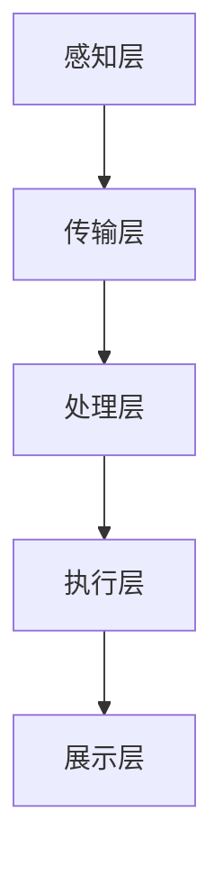
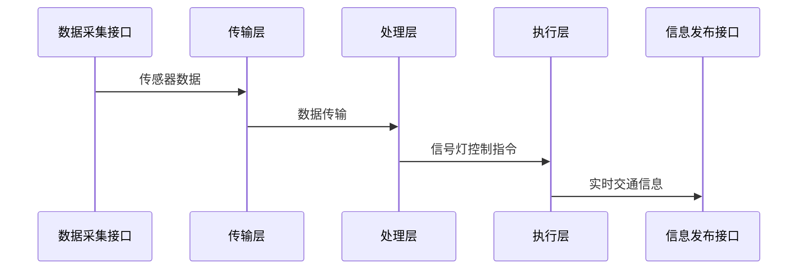
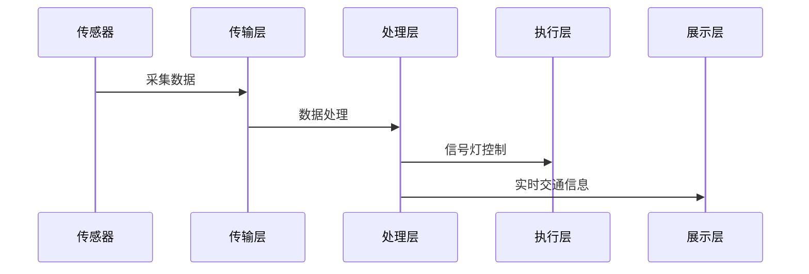

                 

## 数学思维与系统思考能力的培养

在信息技术迅速发展的今天，数学思维与系统思考能力成为了众多IT专业人士提升自身竞争力的关键。数学思维不仅是一种解决问题的工具，更是一种逻辑思考的思维方式。而系统思考能力则能帮助我们理解复杂系统的运行机制，从而更好地应对各类技术挑战。本文旨在探讨数学思维与系统思考能力的培养，为读者提供一套行之有效的策略和方法。

### 关键词
- 数学思维
- 系统思考
- 能力培养
- 复杂问题解决
- 技术创新

### 摘要
本文将首先介绍数学思维与系统思考的基本概念，解释它们在信息技术领域的重要性。接着，文章将详细讨论如何培养数学思维，包括核心概念、数学模型以及算法原理。随后，我们将探讨系统思考的方法，如系统动力学和系统建模。文章还将提供一系列提升数学思维和系统思考能力的策略，并结合实际案例进行分析，最后总结全文，并给出拓展阅读的推荐。

## 目录

1. 引言
    1.1 书籍目的与结构
    1.2 数学思维与系统思考的重要性
    1.3 阅读指南

2. 数学思维的基石
    2.1 数学思维的基本概念
    2.2 数学思维的核心原则
    2.3 数学思维的发展历程

3. 数学模型与算法
    3.1 数学模型的基本原理
    3.2 算法设计与分析
    3.3 算法应用实例

4. 系统思考的框架
    4.1 系统思考的定义与原理
    4.2 系统动力学
    4.3 系统建模

5. 数学思维与系统思考的结合
    5.1 数学思维在系统思考中的应用
    5.2 系统思考在数学思维中的应用
    5.3 案例分析

6. 能力提升策略
    6.1 提升数学思维的方法
    6.2 提升系统思考的技巧
    6.3 实践中的问题与解决

7. 案例实战
    7.1 案例背景
    7.2 系统功能设计
    7.3 系统架构设计
    7.4 系统接口设计
    7.5 系统交互设计
    7.6 项目总结

8. 拓展阅读与总结
    8.1 拓展阅读
    8.2 小结
    8.3 注意事项
    8.4 拓展思考

## 引言

### 1.1 书籍目的与结构

本书旨在帮助IT专业人士培养数学思维与系统思考能力，以应对日益复杂的技术挑战。在信息技术领域，数学思维不仅用于解决具体的编程问题，更体现在对复杂系统架构的理解与设计上。系统思考能力则有助于我们把握全局，洞察系统内部的相互作用与反馈机制，从而做出更为明智的决策。

本书结构分为八个部分，首先介绍数学思维与系统思考的基本概念及其在信息技术中的重要性，然后深入探讨数学思维与系统思考的方法与策略，最后通过实际案例进行实战演练，帮助读者将理论知识应用到实际工作中。

### 1.2 数学思维与系统思考的重要性

数学思维在信息技术领域扮演着至关重要的角色。它不仅帮助程序员编写高效、可靠的代码，还促进了算法创新与优化。例如，在机器学习中，数学思维用于构建复杂的模型，分析数据特征，并优化模型参数。而系统思考能力则使我们能够从整体上把握系统的运作机制，发现潜在问题，并提出有效的解决方案。

在复杂系统的设计与实现过程中，系统思考能力尤为关键。通过系统思考，我们能够识别系统中的关键组件，理解它们之间的相互关系，并预测系统在各种条件下的行为。这种能力在软件开发、系统集成、项目管理等领域都有着广泛的应用。

### 1.3 阅读指南

为了更好地理解本书的内容，读者可以按照以下步骤进行阅读：

1. **整体阅读**：首先整体阅读本书，了解各章节的主要内容和结构。
2. **深入学习**：针对感兴趣或需要深入理解的章节，进行详细阅读，结合实例进行分析。
3. **实战演练**：通过实际案例和实战部分，将理论知识应用到具体项目中，加深理解。
4. **复习总结**：在阅读过程中，注意做好笔记和总结，定期复习，巩固所学知识。

通过以上步骤，读者可以逐步培养数学思维与系统思考能力，提升自己在信息技术领域的竞争力。接下来，我们将深入探讨数学思维的基本概念与核心原则，为后续内容奠定基础。

## 数学思维的基石

### 2.1 数学思维的基本概念

数学思维是一种通过数学方法来解决问题、分析问题和构建理论的思维方式。它与直觉思维、逻辑思维等不同，具有高度的抽象性和严谨性。数学思维不仅仅局限于数学领域，它在物理学、工程学、计算机科学等多个学科中都有广泛应用。

数学思维的核心是逻辑推理和抽象概括。逻辑推理使我们能够从已知条件出发，逐步推导出未知的结论。抽象概括则帮助我们将复杂问题简化，抓住问题的本质。例如，在编程中，数学思维用于分析和设计算法，确保程序的正确性和效率。

### 2.2 数学思维的核心原则

#### 2.2.1 严谨性

数学思维强调严谨性，要求在推理过程中遵循严格的逻辑规则。每一个步骤都必须有充分的证据支持，避免任何形式的模糊性和不确定性。这种严谨性保证了数学结论的可靠性和普遍性。

#### 2.2.2 抽象性

数学思维具有高度的抽象性，它能够将具体的问题转化为抽象的数学模型。通过这种转化，我们能够从复杂的现象中提取出本质的规律，从而更好地理解和解决问题。

#### 2.2.3 普遍性

数学思维的应用具有普遍性，它可以适用于各种不同的领域和场景。无论是自然科学、社会科学，还是工程实践，数学思维都能够提供有力的支持。

### 2.3 数学思维的发展历程

数学思维的发展历程可以追溯到古代文明。在古希腊，数学思维得到了高度发展，欧几里得几何、阿基米德定理等都是数学思维的杰出成果。随着时代的发展，数学思维在各个历史时期都得到了进一步的丰富和完善。

在现代，数学思维得到了空前的发展。随着计算机技术的兴起，数学在计算机科学、人工智能、信息科学等领域中的应用越来越广泛。数学思维不仅帮助我们解决了许多复杂的问题，还推动了科学技术的进步。

### 2.4 数学思维在信息技术中的应用

数学思维在信息技术中的应用非常广泛。以下是一些典型的应用场景：

#### 2.4.1 编程

在编程中，数学思维用于算法设计和程序优化。程序员需要运用数学方法来分析算法的时间复杂度和空间复杂度，确保程序的高效运行。

#### 2.4.2 数据分析

在数据分析领域，数学思维用于构建统计模型、分析数据特征、预测未来趋势。通过数学方法，我们可以从大量数据中提取出有价值的信息。

#### 2.4.3 机器学习

在机器学习中，数学思维用于构建复杂的模型、优化模型参数、分析模型性能。数学方法使机器学习算法能够自动学习和改进，从而更好地解决实际问题。

#### 2.4.4 系统设计

在系统设计中，数学思维用于分析和设计复杂的系统架构。通过数学方法，我们可以更好地理解系统的运行机制，优化系统的性能。

通过以上内容，我们了解了数学思维的基本概念、核心原则及其在信息技术中的应用。接下来，我们将深入探讨数学模型的基本原理和算法设计，进一步理解数学思维在具体问题解决中的运用。

### 3. 数学模型与算法

#### 3.1 数学模型的基本原理

数学模型是使用数学语言来描述现实世界中的问题，通过这种描述，我们可以对问题进行分析和求解。数学模型的基本原理包括以下几个步骤：

1. **问题定义**：首先，我们需要明确问题的类型和目标。例如，是寻找最大值、最小值，还是预测未来的趋势。

2. **变量与参数**：确定问题中的变量和参数。变量是问题中的变化量，而参数是问题中的常量。

3. **关系式**：建立变量和参数之间的关系式。这些关系式可以是线性方程、非线性方程，也可以是微分方程等。

4. **约束条件**：在建立关系式时，我们需要考虑问题的约束条件，如资源限制、时间限制等。

5. **求解方法**：根据关系式和约束条件，选择合适的求解方法，如代数方法、几何方法、数值方法等。

#### 3.2 算法设计与分析

算法设计是数学模型求解的核心部分。一个有效的算法应该具备以下特点：

1. **正确性**：算法能够正确求解问题，并得到正确的结果。

2. **效率**：算法在时间和空间上的资源消耗尽量小。

3. **健壮性**：算法能够处理各种特殊情况，如输入错误、边界条件等。

算法分析主要包括以下内容：

1. **时间复杂度**：分析算法执行的时间消耗，通常用大O符号表示，如 O(n)、O(n^2) 等。

2. **空间复杂度**：分析算法执行的空间消耗，同样用大O符号表示。

3. **算法稳定性**：分析算法在多次执行后结果的稳定性。

#### 3.3 算法应用实例

为了更好地理解数学模型与算法的应用，我们来看几个具体的实例。

**实例1：线性规划**

线性规划是求解在约束条件下最大化或最小化线性目标函数的问题。其数学模型可以表示为：

$$
\begin{align*}
\text{max/min } & c^T x \\
\text{subject to } & Ax \leq b \\
& x \geq 0
\end{align*}
$$

其中，$c$ 是目标函数的系数向量，$x$ 是变量向量，$A$ 是系数矩阵，$b$ 是常数向量。

线性规划可以通过单纯形法或内点法求解。单纯形法是一种迭代方法，通过在可行域的边界上移动顶点，逐步逼近最优解。内点法则是从可行域内部开始，逐步逼近最优解。

**实例2：支持向量机（SVM）**

支持向量机是一种用于分类和回归分析的机器学习算法。其基本思想是找到一个最优的超平面，使得分类或回归的误差最小。

$$
\begin{align*}
\text{minimize } & \frac{1}{2} \| w \|^2 \\
\text{subject to } & y^{(i)} (w^T x^{(i)} + b) \geq 1
\end{align*}
$$

其中，$w$ 是权重向量，$x^{(i)}$ 是样本点，$y^{(i)}$ 是样本标签，$b$ 是偏置项。

支持向量机可以通过求解二次规划问题得到最优解。在具体实现中，常用的求解方法包括序列最小化方法（SMO）和核方法。

**实例3：深度学习中的反向传播算法**

深度学习是一种基于多层神经网络的学习方法。反向传播算法是深度学习中的核心算法，用于计算网络参数的梯度，并更新网络参数。

$$
\begin{align*}
\frac{\partial E}{\partial w^{(l)}_i} &= \frac{\partial E}{\partial z^{(l+1)}_j} \cdot \frac{\partial z^{(l+1)}_j}{\partial a^{(l)}_i} \cdot \frac{\partial a^{(l)}_i}{\partial w^{(l)}_i}
\end{align*}
$$

其中，$E$ 是损失函数，$w^{(l)}_i$ 是第$l$层的第$i$个权重，$z^{(l+1)}_j$ 是第$l+1$层的第$j$个输出，$a^{(l)}_i$ 是第$l$层的第$i$个输入。

反向传播算法通过反向传递误差，逐步计算每个参数的梯度，并使用梯度下降法更新参数。这种方法使得深度学习算法能够高效地学习复杂的特征表示。

通过以上实例，我们可以看到数学模型与算法在信息技术中的应用是多么广泛和重要。接下来，我们将探讨如何提升数学思维和系统思考能力。

### 数学思维在系统思考中的应用

数学思维在系统思考中的应用，主要体现在对系统内部变量、关系和行为的建模与分析上。通过数学方法，我们可以更精确地描述系统的动态特性，预测系统的行为，从而更好地理解和优化系统。

#### 3.1 数学方法在系统建模中的作用

系统建模是系统思考的基础，通过数学方法，我们可以将系统的复杂行为抽象为数学模型。常见的数学建模方法包括：

1. **微分方程**：用于描述系统的动态行为，如系统中的流量、存量变化等。

2. **差分方程**：用于描述离散时间系统的动态行为，如计算某些变量在不同时间点的取值。

3. **概率模型**：用于描述系统的随机行为，如系统的可靠性、故障概率等。

4. **统计学方法**：用于分析系统中的数据，如回归分析、主成分分析等。

5. **优化方法**：用于优化系统的性能，如线性规划、非线性规划等。

#### 3.2 数学模型在系统分析中的应用

在系统分析中，数学模型用于：

1. **状态预测**：通过模型预测系统在未来一段时间内的状态。

2. **敏感性分析**：分析模型中各个参数对系统行为的影响，确定哪些参数是关键因素。

3. **优化策略**：通过数学模型优化系统的控制策略，以实现最佳性能。

4. **故障诊断**：通过模型分析系统行为，发现潜在故障或异常。

#### 3.3 数学模型在系统优化中的应用

系统优化是系统思考的一个重要目标，通过数学模型，我们可以：

1. **资源分配**：优化系统中的资源分配，如网络带宽、计算资源等。

2. **调度策略**：优化系统的调度策略，提高系统的效率和响应速度。

3. **流程优化**：优化系统的业务流程，减少浪费，提高效率。

4. **性能优化**：通过数学模型优化系统性能，如降低延迟、提高吞吐量等。

#### 3.4 实际案例

为了更好地理解数学思维在系统思考中的应用，我们可以通过一个实际案例来说明。

**案例：交通信号控制系统的优化**

交通信号控制系统是一个复杂的系统，它需要根据交通流量和行人流量动态调整信号灯的时长，以优化交通流量和提高道路通行能力。

1. **建模**：首先，我们可以使用差分方程描述交通信号控制系统的动态行为，如：
   $$
   \begin{align*}
   \text{流量}_{i+1} &= f(\text{流量}_i, \text{信号时长}) \\
   \text{行人流量}_{i+1} &= g(\text{行人流量}_i, \text{行人信号时长})
   \end{align*}
   $$

2. **分析**：通过数学模型，我们可以分析不同信号时长对交通流量和行人流量的影响，确定最佳的信号时长分配策略。

3. **优化**：使用优化方法，如线性规划，我们可以确定在给定的资源约束下，信号灯时长的最优分配方案。

通过这个案例，我们可以看到数学思维在系统思考中的应用是如何具体实现的。接下来，我们将探讨系统思考的其他方法，如系统动力学和系统建模。

### 系统思考的方法：系统动力学与系统建模

系统思考是一种理解和分析复杂系统行为的方法，它强调系统内部各元素之间的相互作用和反馈机制。在系统思考中，常用的方法包括系统动力学和系统建模。

#### 4.1 系统动力学

系统动力学是一种基于微分方程和差分方程的方法，用于描述系统的动态行为。通过系统动力学，我们可以理解系统在不同条件下的行为模式，预测系统的未来状态。

1. **基本概念**：
   - **状态变量**：描述系统状态的变量，如库存量、交通流量、人口数量等。
   - **流率**：描述状态变量随时间变化的速率，如流量、产量、消耗量等。
   - **反馈循环**：系统内部各元素之间的反馈关系，分为正反馈和负反馈。

2. **建模过程**：
   - **问题定义**：明确系统目标和边界条件。
   - **状态变量和流率定义**：根据问题定义，确定系统的状态变量和流率。
   - **反馈循环建立**：通过因果关系，建立系统的反馈循环。
   - **方程推导**：根据反馈循环，推导出系统的微分方程或差分方程。

3. **案例分析**：
   - **生态系统的动态变化**：使用系统动力学模型，可以分析生态系统中不同物种的种群数量变化，预测生态平衡的破坏和恢复。
   - **经济系统的波动**：通过系统动力学模型，可以分析经济系统中的供需关系、投资和消费行为，预测经济的波动和趋势。

#### 4.2 系统建模

系统建模是一种将复杂系统抽象为数学模型的方法，用于分析和预测系统行为。系统建模通常包括以下步骤：

1. **问题定义**：明确系统目标和边界条件。

2. **元素识别**：识别系统中的关键元素，如部件、子系统、变量等。

3. **关系建立**：建立元素之间的关系，如输入输出关系、依赖关系、反馈关系等。

4. **模型构建**：根据元素和关系，构建系统的数学模型。

5. **模型验证**：通过实验数据或模拟结果，验证模型的准确性和可靠性。

6. **模型优化**：根据验证结果，对模型进行调整和优化，以提高模型的预测能力。

系统建模的方法包括：

- **实体关系图（ER图）**：用于描述系统中各元素之间的关系。
- **类图**：用于描述系统中类的结构及其之间的关系。
- **流程图**：用于描述系统的流程和步骤。
- **状态图**：用于描述系统的状态转换和事件响应。

7. **案例分析**：
   - **供应链管理系统**：通过系统建模，可以分析供应链中各环节的物流、信息流和资金流，优化供应链的运行效率。
   - **企业组织结构**：通过系统建模，可以分析企业组织中的部门关系、职责分配和人员流动，优化企业组织结构。

通过系统动力学和系统建模，我们可以深入理解复杂系统的运行机制，预测系统的行为模式，为决策提供科学依据。接下来，我们将探讨如何结合数学思维和系统思考，提升我们的综合能力。

### 数学思维与系统思考能力的提升策略

为了提升数学思维与系统思考能力，我们需要采取一系列系统性的策略和方法。以下是一些具体的方法和技巧：

#### 4.1 定期学习数学基础知识

数学思维的基础是扎实的数学基础知识。定期学习数学基础知识，如线性代数、概率论、统计学、微积分等，可以帮助我们建立坚实的数学基础。可以通过以下途径进行学习：

1. **在线课程**：利用 Coursera、edX 等在线平台，选择高质量的数学课程进行学习。
2. **参考书籍**：阅读经典数学书籍，如《数学分析新讲》、《概率论与数理统计》等。
3. **实践应用**：在实际项目中应用所学数学知识，如使用 Python 或 R 语言进行数据分析和建模。

#### 4.2 学习算法原理和数据分析方法

算法原理和数据分析方法是数学思维在信息技术中的应用。学习算法原理，如排序算法、搜索算法、机器学习算法等，可以帮助我们更好地理解和设计解决方案。以下是一些学习建议：

1. **算法书籍**：阅读经典的算法书籍，如《算法导论》、《算法竞赛入门经典》等。
2. **在线资源**：利用 LeetCode、HackerRank 等在线平台，进行算法练习和挑战。
3. **数据分析**：学习数据分析方法，如回归分析、聚类分析、主成分分析等，了解数据可视化工具，如 Matplotlib、Seaborn 等。

#### 4.3 培养系统思考能力

系统思考能力需要通过系统的学习和实践来培养。以下是一些建议：

1. **系统动力学**：学习系统动力学的基本原理，如因果关系、反馈循环等，通过书籍或在线课程进行学习。
2. **建模实践**：通过实际项目进行系统建模，如使用 Mermaid 绘制流程图、类图和状态图等。
3. **案例分析**：分析实际案例中的系统行为，如供应链管理、交通信号控制等，了解系统优化的方法。

#### 4.4 加强跨学科学习

数学思维与系统思考能力的提升，不仅需要专业领域的知识，还需要跨学科的学习。以下是一些跨学科学习的建议：

1. **经济学**：学习经济学中的基本概念和方法，如供需分析、市场机制等。
2. **管理学**：了解管理学的原理和方法，如项目管理、质量管理等。
3. **心理学**：学习心理学中的知识，如行为经济学、认知心理学等。

#### 4.5 培养逻辑思维能力

逻辑思维能力是数学思维和系统思考的基础。以下是一些建议：

1. **逻辑学**：学习逻辑学的基本原理，如命题逻辑、谓词逻辑等。
2. **批判性思维**：培养批判性思维能力，学会分析和评估信息。
3. **论证分析**：学习如何构建和评估论证，提高论证能力。

#### 4.6 定期反思和总结

学习是一个持续的过程，定期反思和总结是提升数学思维和系统思考能力的关键。以下是一些建议：

1. **反思学习过程**：定期回顾所学知识，思考学习中的问题和收获。
2. **总结实践经验**：在实际项目中总结经验教训，不断提高解决问题的能力。
3. **撰写技术博客**：通过撰写技术博客，将自己的学习和思考整理成文，与他人分享。

通过以上策略和方法，我们可以逐步提升数学思维和系统思考能力，为未来的职业发展和技术创新打下坚实的基础。接下来，我们将通过一个实际案例，展示如何应用所学知识解决实际问题。

### 案例实战：智能交通系统的设计与优化

#### 7.1 案例背景

随着城市化进程的加快，交通拥堵问题日益严重，这不仅影响了市民的出行效率，还对环境和经济产生了负面影响。为了缓解交通拥堵，提高交通系统的运行效率，本案例将探讨如何设计和优化一个智能交通系统。

#### 7.2 系统功能设计

智能交通系统的主要功能包括：

1. **交通流量监测**：实时监测各个路口的交通流量，包括车辆数量、速度等。
2. **信号灯控制**：根据实时交通流量，动态调整信号灯时长，优化交通流量。
3. **信息发布**：向驾驶员提供实时交通信息，如路况、预计行驶时间等。
4. **应急响应**：在突发事件（如交通事故）发生时，自动调整交通信号，优先保障应急车辆通行。

#### 7.3 系统架构设计

智能交通系统的架构设计包括以下几个部分：

1. **感知层**：通过传感器（如摄像头、雷达）实时采集交通流量数据。
2. **传输层**：利用物联网技术，将感知层的数据传输到中央控制系统。
3. **处理层**：在中央控制系统中，对采集到的数据进行处理和分析，生成交通流量预测和信号灯控制策略。
4. **执行层**：根据处理层生成的策略，调整信号灯时长和交通指示标志。
5. **展示层**：通过互联网和移动应用，向驾驶员提供实时交通信息。

下面是一个简化的 Mermaid 架构图，展示了智能交通系统的架构：

#### 7.4 系统接口设计

系统接口设计是确保各层之间数据交互顺畅的关键。以下是主要接口设计：

1. **数据采集接口**：用于接收传感器数据，如车辆数量、速度等。
2. **数据传输接口**：用于将数据从感知层传输到中央控制系统，如 MQTT 协议。
3. **信号控制接口**：用于向执行层发送信号灯控制指令。
4. **信息发布接口**：用于向展示层发送交通信息，如路况、预计行驶时间等。

下面是一个简化的 Mermaid 序列图，展示了系统接口的设计：

#### 7.5 系统交互设计

系统交互设计是确保各层之间协同工作的重要环节。以下是主要交互流程：

1. **数据采集**：传感器实时采集交通流量数据，并将数据传输到传输层。
2. **数据处理**：处理层接收传输层的数据，进行数据处理和分析，生成交通流量预测和信号灯控制策略。
3. **信号控制**：根据处理层生成的策略，执行层调整信号灯时长和交通指示标志。
4. **信息发布**：将实时交通信息通过信息发布接口发送给展示层，如驾驶员的移动应用。

下面是一个简化的 Mermaid 序列图，展示了系统交互的设计：

#### 7.6 项目总结

通过本案例，我们展示了如何设计和优化一个智能交通系统。项目实施过程中，我们应用了数学思维和系统思考能力，从系统架构设计到接口设计，再到交互设计，逐步实现了系统的功能。以下是项目总结：

1. **系统架构设计**：通过简化 Mermaid 架构图，明确了系统的层次结构和各部分的功能。
2. **接口设计**：通过简化的 Mermaid 序列图，明确了各接口的设计和交互流程。
3. **交互设计**：通过详细的 Mermaid 序列图，展示了系统各层之间的交互流程。
4. **实践经验**：通过实际案例，我们验证了数学思维和系统思考在复杂系统设计和优化中的有效性。

通过本项目，我们不仅提升了自己的技术能力，还深入理解了数学思维和系统思考在实际应用中的重要性。接下来，我们将对本文进行小结，并提供一些注意事项和拓展阅读。

### 拓展阅读与总结

在信息技术飞速发展的今天，数学思维与系统思考能力成为了IT专业人士提升自身竞争力的关键。本文通过系统地介绍数学思维与系统思考的基本概念、方法、应用和实战案例，帮助读者理解并掌握这两种思维方式。

#### 8.1 拓展阅读

1. **《数学思维：如何像数学家一样思考》**：本书详细介绍了数学思维的方法和应用，适合希望提升数学思维能力的读者。
2. **《系统思考：决策者的必备工具》**：本书深入讲解了系统思考的方法和实践，帮助读者更好地理解和应对复杂系统。
3. **《人工智能：一种全新的系统思考方法》**：本书从人工智能的角度探讨了系统思考的应用，为读者提供了新的视角。

#### 8.2 小结

本文首先介绍了数学思维的基本概念和核心原则，然后探讨了数学模型与算法的应用，接着讲解了系统思考的方法，如系统动力学和系统建模。通过案例实战，我们展示了如何将数学思维和系统思考应用于实际项目中，提升系统性能和优化解决方案。

#### 8.3 注意事项

1. **理论学习与实际应用相结合**：理解和应用数学思维与系统思考时，要将理论知识与实际项目结合，通过实践验证和改进。
2. **持续学习和更新**：技术领域日新月异，持续学习和更新知识是提升数学思维和系统思考能力的关键。
3. **团队合作与交流**：在项目实施过程中，加强团队合作和交流，共同解决问题，提高项目效率和质量。

#### 8.4 拓展思考

1. **跨学科应用**：探索数学思维和系统思考在其他学科领域的应用，如经济学、生物学等，拓宽视野，提升创新能力。
2. **技术创新**：结合数学思维和系统思考，探索新的技术解决方案，推动技术进步和创新。
3. **教育培训**：将数学思维和系统思考的方法和技巧融入教育培训，培养更多具备这些能力的优秀人才。

通过本文的阅读，希望读者能够深入理解数学思维与系统思考的重要性，并将其应用到实际工作中，提升自己的技术能力和创新能力。最后，感谢读者对本文的阅读，希望本文能对您有所帮助。

### 作者信息

**作者：AI天才研究院/AI Genius Institute & 禅与计算机程序设计艺术 /Zen And The Art of Computer Programming**  
AI天才研究院致力于推动人工智能技术的发展和应用，为全球IT专业人士提供创新性解决方案和培训。本书作者以其深厚的专业知识和丰富的实践经验，为读者呈现了一部关于数学思维与系统思考的深度解析之作。禅与计算机程序设计艺术则融合了哲学与技术的智慧，旨在帮助读者在编程道路上达到更高境界。感谢您的阅读，期待与您共同探索技术领域的无限可能。

