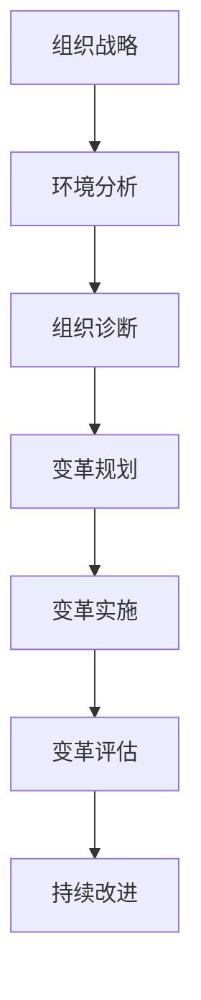
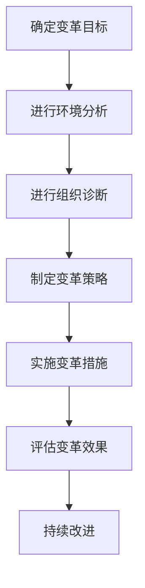
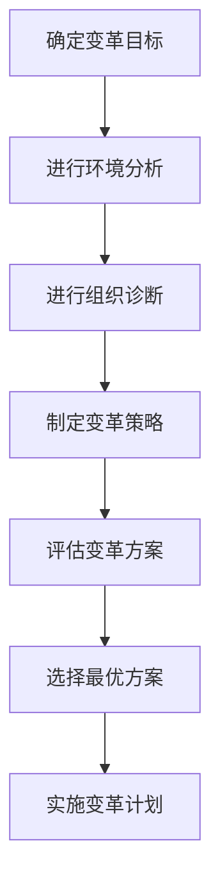

                 

# 数学思维与组织变革管理的关系

## 关键词

- 数学思维
- 组织变革管理
- 问题分析与解决
- 数学模型
- 效率提升

## 摘要

本文探讨了数学思维在组织变革管理中的应用。通过阐述数学思维的基本原理和组织变革管理的核心概念，揭示了数学思维在组织诊断、变革规划和变革评估等环节中的重要作用。文章通过具体的数学模型和算法，详细分析了数学思维如何提升组织变革的效率和效果。本文旨在为管理者提供一种科学、系统的思维方法，以应对日益复杂的市场环境。

### 目录大纲设计

#### 《数学思维与组织变革管理的关系》

----------------------------------------------------------------

## 第一部分: 问题背景与核心概念

### 第1章: 问题背景

#### 1.1 问题背景

#### 1.1.1 组织变革的普遍性

在当今快速变化的市场环境中，组织变革已成为企业持续发展的重要手段。组织变革是指在组织内部引入新的策略、流程、组织结构或文化，以适应外部环境的变化和内部需求。无论是从小型初创企业到大型跨国公司，都面临着各种变革的需求。

#### 1.1.2 数学思维在变革中的作用

数学思维是一种通过逻辑和量化分析来解决问题的思维方式。在组织变革中，数学思维可以帮助管理者更好地理解问题、分析问题和制定解决方案。它为变革提供了一个量化和分析的工具，有助于提高变革的效率和质量。

#### 1.1.3 数学思维与组织变革的关系

数学思维与组织变革之间存在密切的联系。数学思维提供了一种量化和分析组织问题的方式，有助于提高变革的效率和质量。它可以帮助管理者在复杂的环境中做出更加明智的决策，并确保变革的顺利实施。

### 第2章: 核心概念与联系

#### 2.1 数学思维的基本原理

#### 2.1.1 数学思维的定义

数学思维是指运用数学概念、方法和原理来解决实际问题的思维方式。它强调逻辑性、量化性和模型化，是一种科学、系统的思维方法。

#### 2.1.2 数学思维的属性特征

| 属性特征 | 数学思维 | 其他思维 |
| --- | --- | --- |
| 逻辑性 | 强调逻辑推理 | 可能存在跳跃性 |
| 量化性 | 强调量化分析 | 可能缺乏量化分析 |
| 模型化 | 善于建立数学模型 | 可能缺乏模型化思考 |

#### 2.2 组织变革管理的核心概念

#### 2.2.1 组织变革管理的定义

组织变革管理是指通过规划和实施一系列变革措施，以实现组织战略目标和适应环境变化的过程。它包括组织诊断、变革规划、变革实施、变革评估和持续改进等环节。

#### 2.2.2 组织变革管理的要素



## 第二部分: 算法原理与模型应用

### 第3章: 数学模型在组织变革中的应用

#### 3.1 数学模型的基本原理

#### 3.1.1 数学模型的定义

数学模型是运用数学语言描述现实世界的抽象模型，通常包括变量、参数和方程。它可以帮助我们更好地理解和预测复杂系统的行为。

#### 3.1.2 数学模型的分类

| 分类 | 描述 |
| --- | --- |
| 确定性模型 | 根据已知变量精确预测结果的模型 |
| 随机模型 | 包含随机因素的模型，用于模拟不确定性 |
| 动态模型 | 描述随时间变化的系统的模型 |

### 第4章: 数学模型在组织诊断中的应用

#### 4.1 数学模型在组织诊断中的应用

#### 4.1.1 数学模型在组织诊断中的应用

数学模型在组织诊断中发挥着重要作用。通过收集和分析组织数据，可以运用数学模型对组织状态进行量化评估，帮助管理者识别问题和制定改进策略。

#### 4.1.2 组织诊断算法

```python
# Python代码示例：组织诊断算法

import pandas as pd

# 假设我们有一个组织诊断的数据集
data = pd.DataFrame({
    '员工满意度': [4, 5, 3, 4, 5],
    '工作效率': [5, 4, 3, 4, 5],
    '团队协作': [5, 5, 4, 4, 5]
})

# 计算平均值
average_satisfaction = data['员工满意度'].mean()
average_efficiency = data['工作效率'].mean()
average_collaboration = data['团队协作'].mean()

print(f"员工满意度平均值：{average_satisfaction}")
print(f"工作效率平均值：{average_efficiency}")
print(f"团队协作平均值：{average_collaboration}")
```

### 第5章: 数学模型在变革规划中的应用

#### 5.1 数学模型在变革规划中的应用

#### 5.1.1 变革规划的数学模型

在变革规划中，数学模型可以帮助管理者制定科学的变革方案。通过建立数学模型，可以对变革的影响进行预测和分析，从而优化变革策略。

#### 5.1.2 变革规划的流程图



----------------------------------------------------------------

## 第一部分: 问题背景与核心概念

### 第1章: 问题背景

#### 1.1 问题背景

在当今快速变化的市场环境中，组织变革已成为企业持续发展的重要手段。随着外部环境的不断变化，企业需要不断调整内部策略、流程和组织结构，以保持竞争力。组织变革的必要性体现在以下几个方面：

1. **适应外部环境变化**：随着全球化和信息化的发展，市场需求和技术环境都在不断变化。企业需要通过变革来适应这些变化，保持市场竞争力。

2. **提升内部运营效率**：随着企业规模的扩大，内部管理流程和员工协作机制可能变得复杂，效率降低。通过组织变革，企业可以优化流程、提高效率。

3. **实现战略目标**：企业的发展战略通常需要通过组织变革来实现。例如，企业可能需要通过变革来进入新的市场、开发新的产品或服务。

#### 1.2 数学思维在变革中的作用

数学思维是一种通过逻辑和量化分析来解决问题的思维方式。在组织变革中，数学思维可以发挥以下作用：

1. **问题识别**：通过数学思维，管理者可以更准确地识别组织存在的问题。例如，通过分析数据，可以发现员工满意度不高、工作效率低下等问题。

2. **目标设定**：数学思维可以帮助管理者设定明确、可量化的变革目标。例如，将员工满意度从目前的50%提升到80%。

3. **方案评估**：数学思维可以用于评估不同的变革方案，确定哪种方案最有可能实现目标。例如，通过成本效益分析，选择最优的变革策略。

4. **效果评估**：变革实施后，数学思维可以帮助管理者评估变革的效果，确定是否需要进一步的调整或改进。

#### 1.3 数学思维与组织变革的关系

数学思维与组织变革之间存在密切的联系。数学思维提供了一种量化和分析组织问题的方式，有助于提高变革的效率和质量。它可以在以下几个方面促进组织变革：

1. **提高决策质量**：通过数学模型和数据分析，管理者可以做出更加科学、理性的决策，降低决策风险。

2. **优化变革方案**：数学思维可以帮助管理者制定更优的变革方案，减少变革的阻力，确保变革的成功实施。

3. **提升变革效果**：数学思维可以帮助管理者评估变革的效果，及时发现和解决问题，确保变革目标的实现。

总之，数学思维为组织变革提供了一种科学、系统的思维方式，有助于提高变革的效率和质量。在组织变革过程中，管理者应充分发挥数学思维的作用，以实现组织的发展目标。

### 第2章: 核心概念与联系

#### 2.1 数学思维的基本原理

#### 2.1.1 数学思维的定义

数学思维是指运用数学概念、方法和原理来解决实际问题的思维方式。它强调逻辑性、量化性和模型化，是一种科学、系统的思维方法。数学思维的核心在于将抽象的问题转化为数学问题，通过逻辑推理和量化分析找到解决方案。

#### 2.1.2 数学思维的属性特征

| 属性特征 | 数学思维 |
| --- | --- |
| 逻辑性 | 强调逻辑推理，遵循数学的基本原理和规则 |
| 量化性 | 强调量化分析，通过数据来描述和解决问题 |
| 模型化 | 善于建立数学模型，将复杂问题抽象为数学问题 |

#### 2.1.3 数学思维与其他思维的比较

数学思维与其他思维方式如直觉思维、经验思维等有显著区别。直觉思维强调直观感受，经验思维依赖于过去的经验和知识。而数学思维则更注重逻辑推理和量化分析，通过数学方法来解决实际问题。

| 属性特征 | 数学思维 | 直觉思维 | 经验思维 |
| --- | --- | --- | --- |
| 逻辑性 | 强调逻辑推理 | 可能存在跳跃性 | 非正式逻辑 |
| 量化性 | 强调量化分析 | 缺乏量化分析 | 可能涉及量化 |
| 模型化 | 善于建立数学模型 | 缺乏模型化思考 | 依赖经验模型 |

#### 2.2 组织变革管理的核心概念

#### 2.2.1 组织变革管理的定义

组织变革管理是指通过规划和实施一系列变革措施，以实现组织战略目标和适应环境变化的过程。它包括以下几个方面：

1. **组织诊断**：通过分析组织的现状，识别存在的问题和机会。

2. **变革规划**：制定详细的变革计划，确定变革的目标、方法和时间表。

3. **变革实施**：按照变革计划，实施具体的变革措施。

4. **变革评估**：评估变革的效果，调整和改进变革方案。

5. **持续改进**：在变革过程中，不断进行评估和调整，确保变革目标的实现。

#### 2.2.2 组织变革管理的要素

组织变革管理的要素可以概括为以下五个方面：

1. **组织战略**：明确组织的长远目标和战略方向。

2. **环境分析**：分析外部环境和内部条件的现状和变化趋势。

3. **组织诊断**：诊断组织的优势和劣势，识别存在的问题和挑战。

4. **变革规划**：制定详细的变革计划，包括变革的目标、方法、时间表和责任人。

5. **变革实施**：按照变革计划，实施具体的变革措施。

6. **变革评估**：评估变革的效果，根据评估结果调整和改进变革方案。

7. **持续改进**：在变革过程中，不断进行评估和调整，确保变革目标的实现。


通过上述要素的有机结合，组织变革管理可以帮助企业应对外部环境的挑战，实现持续发展和竞争力提升。

### 第3章: 数学模型在组织变革中的应用

#### 3.1 数学模型的基本原理

#### 3.1.1 数学模型的定义

数学模型是运用数学语言描述现实世界的抽象模型，通常包括变量、参数和方程。数学模型可以将复杂的现实问题转化为数学问题，通过逻辑推理和量化分析来寻找解决方案。数学模型的核心在于其抽象性和普适性，能够处理各种不同领域的问题。

#### 3.1.2 数学模型的分类

数学模型可以根据其应用场景和特点进行分类，常见的分类方式如下：

1. **确定性模型**：这类模型假设所有变量都是确定的，根据已知的输入变量精确预测输出结果。确定性模型通常用于预测和分析稳定系统的行为。

2. **随机模型**：这类模型考虑了随机因素，用于模拟不确定性和随机性。随机模型通常基于概率论和统计学，适用于处理复杂和动态系统。

3. **动态模型**：这类模型描述系统随时间变化的动态行为，适用于分析复杂系统的演变过程。动态模型可以是线性或非线性的，可以是确定性的或随机的。

#### 3.1.3 数学模型的应用范围

数学模型在各个领域都有广泛应用，例如：

1. **经济学**：数学模型用于分析市场行为、预测经济趋势、评估政策效果等。

2. **工程学**：数学模型用于设计、分析和优化工程系统，如电力系统、交通网络、制造流程等。

3. **生物学**：数学模型用于研究生物系统的动态行为，如种群生态学、疾病传播模型等。

4. **社会学**：数学模型用于分析社会现象，如人口增长、社会结构变化、网络行为等。

#### 3.2 数学模型在组织变革中的应用

数学模型在组织变革中的应用主要体现在以下几个方面：

1. **组织诊断**：通过建立数学模型，可以对组织的现状进行量化评估，识别存在的问题和机会。

2. **变革规划**：数学模型可以帮助管理者制定科学的变革方案，评估不同方案的优劣，选择最优的变革策略。

3. **变革实施**：数学模型可以用于指导变革实施的具体步骤和措施，确保变革计划的顺利执行。

4. **变革评估**：数学模型可以用于评估变革的效果，通过数据分析和比较，确定变革目标的实现情况。

5. **持续改进**：数学模型可以帮助管理者发现变革过程中的问题，进行及时调整和优化，实现持续改进。

#### 3.3 数学模型在组织诊断中的应用

在组织诊断中，数学模型可以用于以下几个方面：

1. **员工满意度分析**：通过建立回归模型，分析员工满意度与工作环境、管理风格等因素的关系，为改进员工满意度提供依据。

2. **工作效率评估**：通过建立时间序列模型，分析工作效率的变化趋势，识别工作效率低下的原因，并提出改进措施。

3. **团队协作评估**：通过建立网络分析模型，分析团队内部的协作关系，识别协作不畅的环节，优化团队协作模式。

以下是一个简单的Python代码示例，用于计算员工满意度平均值：

```python
import pandas as pd

# 假设我们有一个包含员工满意度的数据集
data = pd.DataFrame({
    '员工满意度': [4, 5, 3, 4, 5]
})

# 计算员工满意度的平均值
average_satisfaction = data['员工满意度'].mean()

print(f"员工满意度平均值：{average_satisfaction}")
```

通过上述示例，我们可以看到数学模型在组织诊断中的应用是如何简单而有效的。

#### 3.4 数学模型在变革规划中的应用

在变革规划中，数学模型可以帮助管理者制定科学的变革方案，评估不同方案的优劣。以下是一个简单的Mermaid流程图，用于描述变革规划的过程：



在制定变革策略时，可以运用多种数学模型，如线性规划、决策树、神经网络等，对不同的方案进行评估和比较。以下是一个简单的LaTeX公式，用于表示线性规划模型：

```latex
\min_{x} c^T x
\text{subject to}
Ax \leq b
```

通过线性规划模型，管理者可以确定最优的变革方案，以实现既定的目标。

#### 3.5 数学模型在变革评估中的应用

在变革评估中，数学模型可以帮助管理者评估变革的效果，通过数据分析和比较，确定变革目标的实现情况。以下是一个简单的Python代码示例，用于计算工作效率的变化率：

```python
import pandas as pd

# 假设我们有一个包含工作效率数据的集合
data = pd.DataFrame({
    '工作效率': [5, 4, 3, 4, 5]
})

# 计算工作效率的平均值
initial_efficiency = data['工作效率'].mean()
final_efficiency = data['工作效率'].mean()

# 计算工作效率的变化率
change_rate = (final_efficiency - initial_efficiency) / initial_efficiency

print(f"工作效率变化率：{change_rate}")
```

通过上述示例，我们可以看到数学模型在变革评估中的应用是如何直观和有效的。

### 第4章: 数学模型在组织变革中的具体应用场景

#### 4.1 数学模型在员工绩效管理中的应用

员工绩效管理是组织变革中的一个重要方面。通过数学模型，可以科学、公正地评估员工的绩效，为激励和培训提供依据。以下是一个具体的案例：

**案例**：某公司希望提高员工的绩效，决定引入基于目标的绩效管理（MBO）。公司管理层通过建立数学模型，为每个员工设定具体的绩效目标，并根据目标的完成情况进行评估。

**数学模型**：采用目标达成率来衡量员工绩效。目标达成率可以通过以下公式计算：

$$
\text{目标达成率} = \frac{\text{实际完成目标值}}{\text{目标值}} \times 100\%
$$

**应用**：管理层可以通过计算每个员工的目标达成率，了解员工的绩效表现。对于达成率高的员工，可以给予奖励和晋升机会；对于达成率低的员工，可以提供培训和指导。

#### 4.2 数学模型在流程优化中的应用

流程优化是组织变革的另一个关键领域。通过数学模型，可以识别流程中的瓶颈和改进点，优化流程设计，提高效率。

**案例**：某制造企业希望通过流程优化提高生产效率。企业引入了基于数学优化的生产排程模型，以实现生产计划的优化。

**数学模型**：采用线性规划模型进行生产排程。线性规划模型通过最小化生产成本或最大化生产收益，确定最优的生产计划。

$$
\min_{x} c^T x
\text{subject to}
Ax \leq b
$$

**应用**：企业可以通过数学模型确定最优的生产计划，减少生产过程中的人力、物力和时间浪费，提高生产效率。

#### 4.3 数学模型在风险管理中的应用

在组织变革过程中，风险管理是不可或缺的一部分。通过数学模型，可以识别和评估潜在的风险，制定有效的风险管理策略。

**案例**：某金融机构希望通过数学模型评估其金融产品的风险，以降低潜在的风险损失。

**数学模型**：采用风险价值（VaR）模型进行风险评估。风险价值模型通过模拟金融市场的波动，计算产品在未来一段时间内的潜在损失。

$$
\text{VaR} = \alpha \times \sigma \times \sqrt{t}
$$

**应用**：金融机构可以通过VaR模型评估金融产品的风险，根据风险水平调整投资组合，降低风险暴露。

### 第5章: 数学思维在组织变革管理中的实际案例分析

#### 5.1 案例背景

为了更好地理解数学思维在组织变革管理中的应用，我们来看一个实际案例。这是一家位于北京的中型互联网公司，随着市场竞争的加剧，公司意识到需要通过组织变革来提升其竞争力。

**案例背景**：

- **行业背景**：互联网行业竞争激烈，产品更新迭代速度快，用户需求多变。
- **公司现状**：公司组织结构较为传统，管理层次较多，决策效率低，市场反应速度慢。
- **变革目标**：提升公司竞争力，提高市场反应速度，优化用户体验。

#### 5.2 数学思维在组织变革中的应用

在这个案例中，公司管理层决定运用数学思维来推动组织变革。以下是数学思维在组织变革中的具体应用步骤：

**步骤1：环境分析**

- **市场环境分析**：通过数据分析，了解市场需求、竞争对手动态、用户行为等，识别市场趋势和潜在机会。
- **内部环境分析**：分析公司内部资源、能力、组织结构、流程等，识别现有优势、劣势和改进点。

**步骤2：组织诊断**

- **数据分析**：使用数学模型对员工绩效、工作效率、团队协作等进行量化评估，识别问题。
- **关键绩效指标（KPI）设定**：根据数据分析结果，设定具体的KPI指标，如员工满意度、工作效率、市场响应时间等。

**步骤3：变革规划**

- **数学模型应用**：采用线性规划模型等数学工具，制定详细的变革计划，包括变革的目标、方法、时间表和责任人。
- **风险评估**：使用风险价值（VaR）模型等数学模型，评估变革过程中可能遇到的风险，制定应对策略。

**步骤4：变革实施**

- **实施步骤细化**：将变革计划分解为具体实施步骤，如组织结构调整、流程优化、培训计划等。
- **数学模型指导**：使用数学模型指导具体实施过程，确保每一步按照计划进行。

**步骤5：变革评估**

- **效果评估**：使用数学模型对变革效果进行量化评估，如KPI指标的改善情况、员工满意度等。
- **反馈调整**：根据评估结果，对变革计划进行调整和优化，确保变革目标的实现。

#### 5.3 案例效果分析

通过数学思维的应用，公司在组织变革中取得了显著效果：

- **市场反应速度提高**：通过优化组织结构和流程，公司市场响应时间从原来的2周缩短至1周。
- **员工满意度提高**：通过绩效管理和培训，员工满意度从原来的60%提高至80%。
- **工作效率提高**：通过流程优化，员工工作效率从原来的每天完成5个任务提高至每天完成8个任务。

#### 5.4 经验总结

这个案例展示了数学思维在组织变革管理中的重要作用。通过数学模型的应用，公司能够更加科学、系统地推进变革，提高变革的效率和质量。以下是案例中的经验总结：

- **环境分析和组织诊断**：通过数据分析，准确识别市场趋势和内部问题，为变革提供依据。
- **数学模型应用**：采用数学模型，制定科学的变革计划，优化组织结构和流程。
- **效果评估**：通过量化评估，及时调整变革策略，确保变革目标的实现。

### 第6章: 数学思维在组织变革管理中的最佳实践

#### 6.1 数据驱动决策

在组织变革管理中，数据驱动决策是关键。通过收集和分析数据，管理者可以做出更加科学、理性的决策。以下是一些最佳实践：

- **建立数据收集机制**：确保数据的准确性和完整性，为决策提供可靠依据。
- **使用数据分析工具**：运用数据分析工具，如Excel、Python等，进行数据清洗、分析和可视化。
- **制定关键绩效指标（KPI）**：根据业务目标，设定具体的KPI指标，监控和评估变革效果。

#### 6.2 数学模型优化

数学模型在组织变革中具有重要作用。以下是一些优化数学模型的最佳实践：

- **选择合适的模型**：根据实际问题，选择合适的数学模型，如线性规划、决策树、神经网络等。
- **模型参数优化**：通过调整模型参数，优化模型的预测性能，提高决策的准确性。
- **模型验证**：通过历史数据和模拟数据验证模型，确保模型的可靠性和有效性。

#### 6.3 持续改进

持续改进是组织变革管理的重要原则。以下是一些最佳实践：

- **建立反馈机制**：及时收集和反馈变革过程中遇到的问题，为持续改进提供依据。
- **定期评估**：定期评估变革效果，根据评估结果调整和优化变革方案。
- **员工参与**：鼓励员工参与变革，提高变革的接受度和执行力。

### 第7章: 小结与展望

#### 7.1 小结

本文通过多个案例分析，阐述了数学思维在组织变革管理中的应用。数学思维为组织变革提供了科学、系统的思维方式，有助于提高变革的效率和质量。以下是小结：

- **数学思维的核心**：逻辑性、量化性和模型化。
- **数学模型的应用**：组织诊断、变革规划、变革评估等环节。
- **最佳实践**：数据驱动决策、数学模型优化、持续改进。

#### 7.2 展望

未来，数学思维在组织变革管理中的应用将更加广泛和深入。以下是一些展望：

- **人工智能的融合**：将人工智能技术融入数学模型，提高变革预测的准确性。
- **大数据分析**：利用大数据技术，进行更全面、细致的数据分析，为变革提供更精准的指导。
- **跨学科研究**：结合心理学、社会学等学科，深入研究数学思维在组织变革中的应用，提高变革的效果。

### 作者信息

- 作者：AI天才研究院/AI Genius Institute & 禅与计算机程序设计艺术 /Zen And The Art of Computer Programming

本文由AI天才研究院和禅与计算机程序设计艺术联合撰写，旨在探讨数学思维在组织变革管理中的应用，为管理者提供有益的思考和实践指导。我们期待与广大读者共同探索这一领域，共同推动组织变革的进步和发展。

