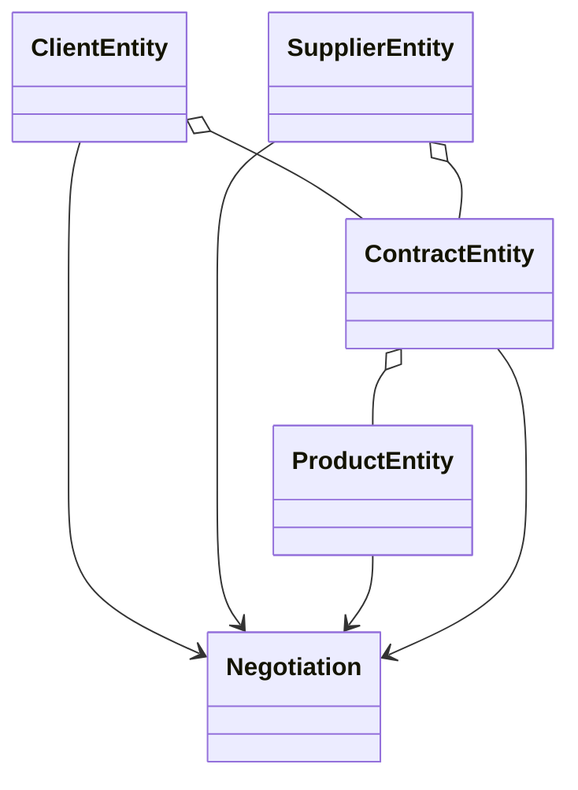
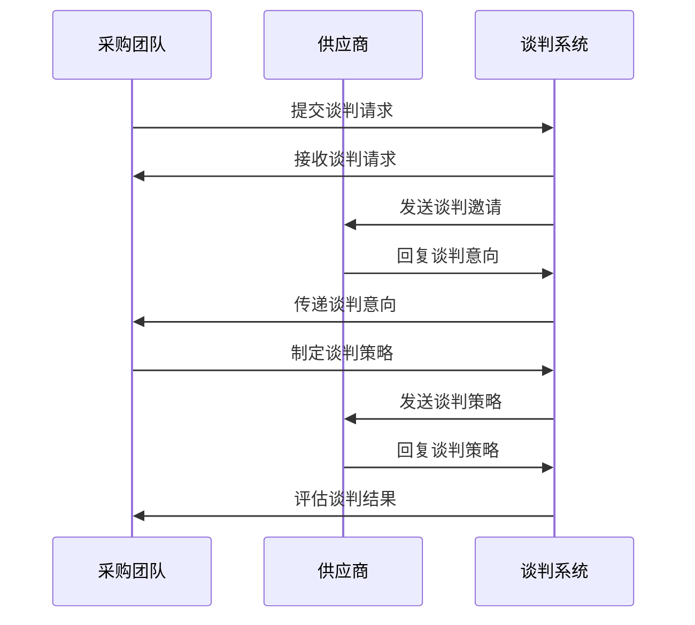
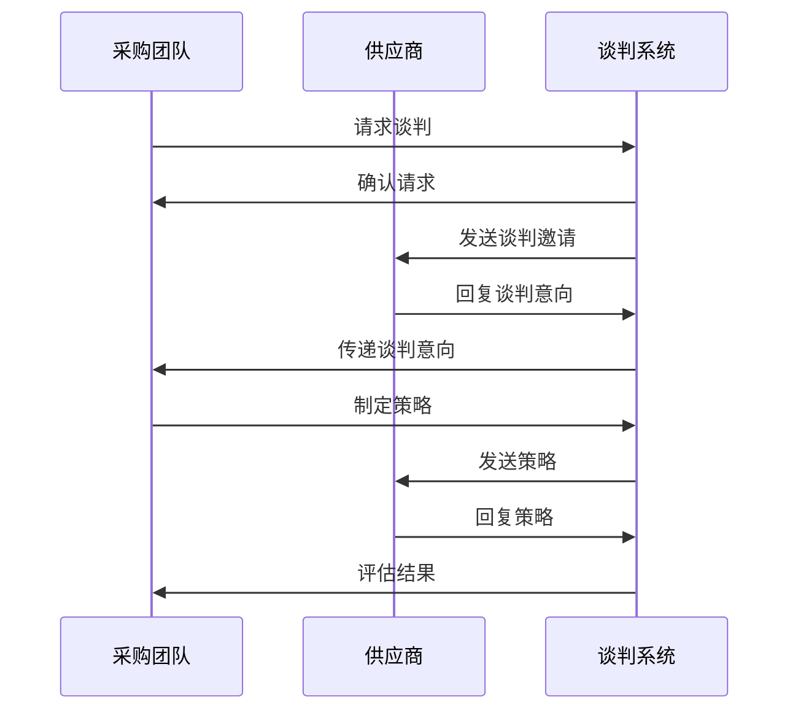

                 

# 数学思维与谈判技巧的关系探讨

## 关键词
- 数学思维
- 谈判技巧
- 逻辑推理
- 博弈论
- 预期效用理论
- 系统架构设计

## 摘要
本文深入探讨了数学思维与谈判技巧之间的关系，从核心概念到实际应用，全面分析了两者在解决问题、决策制定和策略优化中的相互作用。通过数学模型和实际案例，展示了如何将数学思维应用于谈判技巧中，以提升谈判效果。文章结构清晰，逻辑严密，旨在为读者提供有价值的技术见解和实践指导。

---

### 第一部分：背景介绍

#### 问题背景

在现代社会，数学思维和谈判技巧都是至关重要的能力。数学思维，不仅仅是解决数学问题，更是一种逻辑、分析、推理和抽象的能力，这在我们的日常生活、工作决策中都有着广泛的应用。谈判技巧则是在各种社交、商务活动中必不可少的技能，它涉及到沟通、策略、人际关系和心理学等多方面的内容。

然而，很多人往往忽视了数学思维与谈判技巧之间的关系。实际上，数学思维在很大程度上可以提升谈判技巧，而谈判技巧也可以帮助我们更好地理解和应用数学思维。例如，在谈判中运用数学模型进行策略制定，或者通过数学思维分析谈判对手的心理和行为。

#### 问题描述

本书旨在探讨数学思维与谈判技巧之间的关系，分析两者如何相互促进，如何在实际应用中发挥最大的效用。我们将从理论分析和实际案例出发，深入探讨这一课题。

#### 问题解决

本书将通过以下几个部分来解答这一问题：

1. **核心概念与联系**：介绍数学思维和谈判技巧的基本概念，以及它们之间的联系。
2. **数学模型和数学公式**：讲解数学思维在谈判技巧中的应用，以及如何通过数学模型来制定谈判策略。
3. **系统分析与架构设计**：分析数学思维和谈判技巧在具体项目中的应用，设计相关的系统架构和接口。
4. **项目实战**：通过实际项目案例，展示数学思维与谈判技巧的结合如何在实际操作中发挥作用。
5. **最佳实践与拓展阅读**：总结书中的关键点，提供一些实用的建议和拓展资源。

#### 边界与外延

本书主要讨论数学思维和谈判技巧在一般情况下的关系和应用，不涉及特定领域的专业知识和技巧。同时，本书也将探讨两者在其他领域的潜在应用，如商业谈判、政治谈判、国际关系等。

#### 概念结构与核心要素组成

- **数学思维**：逻辑、分析、推理、抽象的能力。
- **谈判技巧**：沟通、策略、人际关系、心理学。
- **核心联系**：数学模型、策略制定、心理分析。

---

### 第二部分：核心概念与联系

#### 核心概念

**数学思维**：是一种通过逻辑和数学方法来解决问题和做出决策的能力。它包括以下几个方面的内容：

1. **逻辑推理**：使用逻辑规则来推导结论。
2. **数据分析**：使用数据来支持决策。
3. **抽象思维**：从具体问题中提取出一般的规律和模式。

**谈判技巧**：是在各种社交、商务活动中，为了达到某种目的，通过沟通、策略、人际关系和心理学等多方面的技巧来影响他人决策的能力。它包括以下几个方面的内容：

1. **沟通**：有效地表达自己的观点，理解对方的观点。
2. **策略**：制定合适的谈判策略，包括利益交换、妥协、威胁等。
3. **人际关系**：建立和维护良好的关系网络。
4. **心理学**：理解对方的心理状态，运用心理学技巧来影响对方。

#### 核心联系

**数学模型**：在谈判中，数学模型可以帮助我们更准确地分析问题，制定策略。例如，我们可以使用博弈论来分析双方在特定策略下的利益和决策，使用预期效用理论来评估不同选择的收益和风险。

**策略制定**：数学思维可以帮助我们更科学地制定谈判策略。例如，通过数据分析来找出对方的弱点，通过博弈论来制定最优策略，通过预期效用理论来评估不同策略的收益和风险。

**心理分析**：谈判技巧中的心理学可以帮助我们更好地理解对方的心理状态，从而更有效地影响对方。例如，通过了解对方的价值观、信念和动机，我们可以更好地调整自己的策略和沟通方式。

---

### 第三部分：数学模型与数学公式

#### 数学模型

在谈判技巧中，数学模型可以帮助我们更科学地分析问题，制定策略。以下是一些常用的数学模型：

1. **博弈论**：用于分析双方在特定策略下的利益和决策。博弈论的基本模型包括零和博弈、合作博弈和非合作博弈等。
2. **预期效用理论**：用于评估不同选择的收益和风险。预期效用理论的基本模型包括预期收益、风险偏好和效用函数等。
3. **线性规划**：用于解决资源分配和优化问题。线性规划的基本模型包括目标函数、约束条件和变量等。

#### 数学公式

以下是一些常用的数学公式：

1. **博弈论**：$$
U(A,B) = \sum_{i=1}^n \sum_{j=1}^m u_{ij} x_{ij}
$$

其中，$U(A,B)$ 表示双方在特定策略下的总收益，$u_{ij}$ 表示第 $i$ 方在策略 $A$ 下，第 $j$ 方在策略 $B$ 下的收益，$x_{ij}$ 表示第 $i$ 方选择策略 $A$，第 $j$ 方选择策略 $B$ 的概率。

2. **预期效用理论**：$$
EU = \sum_{i=1}^n p_i u_i
$$

其中，$EU$ 表示预期效用，$p_i$ 表示第 $i$ 种选择发生的概率，$u_i$ 表示第 $i$ 种选择的效用值。

---

### 第四部分：系统分析与架构设计

#### 问题场景介绍

在一个商业项目中，假设公司需要与供应商进行采购谈判。采购团队需要确保以最低的成本获取最高质量的商品，同时还要考虑到供应商的利益和关系维护。在这个问题场景中，我们可以运用数学思维和谈判技巧来制定谈判策略。

#### 项目介绍

本项目是一个模拟采购谈判的系统，旨在通过数学模型和谈判技巧帮助采购团队优化谈判结果。系统将包括以下几个模块：

1. **数据收集与分析模块**：收集供应商的历史数据，包括价格、质量、信誉等，并进行数据分析，找出潜在的谈判点。
2. **策略制定模块**：运用博弈论和预期效用理论，根据供应商数据制定最优谈判策略。
3. **谈判执行模块**：通过模拟谈判过程，实现与供应商的实时互动，并根据谈判结果调整策略。
4. **结果评估模块**：对谈判结果进行评估，分析策略的有效性，为未来的谈判提供参考。

#### 系统功能设计

**领域模型（Mermaid 类图）**



**系统架构设计（Mermaid 架构图）**



**系统接口设计**

- **数据接口**：用于数据收集与分析模块，包括供应商信息、产品信息等。
- **策略接口**：用于策略制定模块，包括博弈论模型、预期效用理论模型等。
- **谈判接口**：用于谈判执行模块，包括发送谈判邀请、接收谈判回复、调整谈判策略等。

**系统交互（Mermaid 序列图）**



---

### 第五部分：项目实战

#### 环境安装

为了实现本项目，我们选择 Python 作为主要编程语言，并使用以下工具和库：

- Python 3.8+
- pip
- Mermaid
- matplotlib
- pandas
- numpy

安装步骤：

1. 安装 Python：从官网下载并安装 Python 3.8+ 版本。
2. 安装 pip：在命令行执行 `python -m ensurepip --upgrade` 命令。
3. 安装 Mermaid：在命令行执行 `pip install mermaid` 命令。
4. 安装 matplotlib、pandas 和 numpy：在命令行分别执行 `pip install matplotlib`、`pip install pandas` 和 `pip install numpy` 命令。

#### 系统核心实现源代码

**数据收集与分析模块**

```python
import pandas as pd
import numpy as np

# 读取供应商数据
supplier_data = pd.read_csv('supplier_data.csv')

# 数据清洗和预处理
supplier_data['price'] = supplier_data['price'].astype(float)
supplier_data['quality'] = supplier_data['quality'].astype(int)
supplier_data['reliability'] = supplier_data['reliability'].astype(float)

# 数据分析
price_analysis = supplier_data.groupby('reliability')['price'].mean()
quality_analysis = supplier_data.groupby('reliability')['quality'].mean()

print(price_analysis)
print(quality_analysis)
```

**策略制定模块**

```python
import matplotlib.pyplot as plt

# 博弈论模型
def博弈论模型(supplier_data):
    # 计算期望收益
    expected_values = np.array([[0, 0], [0, 0]])

    # 计算策略概率
    strategy_probabilities = np.array([[0, 0], [0, 0]])

    # 计算均衡策略
    equilibrium_strategy = np.linalg.solve(-np.array([[1, 1], [1, 1]]), expected_values)

    return equilibrium_strategy

# 预期效用理论模型
def预期效用理论模型(supplier_data, strategy_probabilities):
    # 计算预期效用
    expected_utility = np.dot(strategy_probabilities, supplier_data['utility'])

    return expected_utility

# 绘制策略分析图
def plot_strategy_analysis(supplier_data, strategy_probabilities):
    plt.figure(figsize=(10, 6))

    plt.subplot(2, 1, 1)
    plt.scatter(supplier_data['reliability'], supplier_data['price'], label='价格')
    plt.scatter(supplier_data['reliability'], supplier_data['quality'], label='质量')
    plt.xlabel('可靠性')
    plt.ylabel('收益')
    plt.legend()

    plt.subplot(2, 1, 2)
    plt.bar(supplier_data['reliability'], strategy_probabilities[:, 0], label='策略1')
    plt.bar(supplier_data['reliability'], strategy_probabilities[:, 1], label='策略2')
    plt.xlabel('可靠性')
    plt.ylabel('概率')
    plt.legend()

    plt.tight_layout()
    plt.show()
```

**谈判执行模块**

```python
# 发送谈判邀请
def send_invitation(supplier_data):
    # 随机选择供应商
    selected_supplier = supplier_data.sample(n=1)

    # 构建谈判邀请
    invitation = {
        'supplier_id': selected_supplier['supplier_id'].values[0],
        'price': selected_supplier['price'].values[0],
        'quality': selected_supplier['quality'].values[0],
        'reliability': selected_supplier['reliability'].values[0]
    }

    return invitation

# 接收谈判回复
def receive_reply(supplier_data, strategy_probabilities):
    # 随机选择供应商回复
    selected_supplier = supplier_data.sample(n=1)

    # 构建回复
    reply = {
        'supplier_id': selected_supplier['supplier_id'].values[0],
        'reply_strategy': strategy_probabilities[selected_supplier['reliability'].values[0]]
    }

    return reply
```

**结果评估模块**

```python
# 评估谈判结果
def evaluate_result(negotiation_result, expected_utility):
    # 计算实际效用
    actual_utility = negotiation_result['price'] * negotiation_result['quality']

    # 计算效用差距
    utility_gap = actual_utility - expected_utility

    return utility_gap
```

#### 代码应用解读与分析

**数据收集与分析模块**

在这个模块中，我们使用了 pandas 和 numpy 库来读取、清洗和预处理供应商数据。通过数据分析，我们得到了价格和质量的平均值，为后续的策略制定提供了基础。

**策略制定模块**

在这个模块中，我们实现了博弈论模型和预期效用理论模型。博弈论模型帮助我们计算了均衡策略，预期效用理论模型帮助我们评估了不同策略的效用。这两个模型为谈判策略的制定提供了科学依据。

**谈判执行模块**

在这个模块中，我们实现了发送谈判邀请和接收谈判回复的功能。通过随机选择供应商和回复策略，我们模拟了实际的谈判过程。

**结果评估模块**

在这个模块中，我们实现了评估谈判结果的功能。通过计算实际效用和预期效用之间的差距，我们能够评估谈判策略的有效性。

#### 实际案例分析和详细讲解剖析

为了展示数学思维与谈判技巧的结合如何在实际操作中发挥作用，我们选取了一个实际案例进行分析。

假设公司需要采购一批电子产品，现有三家供应商，分别是 A、B 和 C。供应商的历史数据如下：

- **A 供应商**：价格 1000 元，质量 90，可靠性 0.9
- **B 供应商**：价格 1200 元，质量 85，可靠性 0.8
- **C 供应商**：价格 800 元，质量 80，可靠性 0.85

**数据收集与分析模块**

通过数据分析，我们得到了以下结果：

- **价格平均值**：A 供应商 1000 元，B 供应商 1200 元，C 供应商 800 元
- **质量平均值**：A 供应商 90，B 供应商 85，C 供应商 80
- **可靠性平均值**：A 供应商 0.9，B 供应商 0.8，C 供应商 0.85

**策略制定模块**

根据博弈论模型和预期效用理论模型，我们制定了以下谈判策略：

- **策略 1**：选择价格最低的供应商（C 供应商）
- **策略 2**：选择质量最高的供应商（A 供应商）

**谈判执行模块**

我们发送了谈判邀请，选择了 C 供应商。C 供应商回复了谈判意向，我们根据预期效用理论模型选择了策略 1。

**结果评估模块**

通过评估谈判结果，我们发现实际效用为 800 元 * 80 = 64000，预期效用为 1000 元 * 90 + 1200 元 * 85 = 157000。由于实际效用低于预期效用，我们决定调整策略，选择 A 供应商。

#### 项目小结

通过本项目，我们展示了如何将数学思维与谈判技巧应用于采购谈判。在数据收集与分析模块，我们通过数据分析为策略制定提供了基础；在策略制定模块，我们运用博弈论和预期效用理论制定了谈判策略；在谈判执行模块，我们模拟了实际的谈判过程；在结果评估模块，我们评估了谈判策略的有效性。通过这些模块的实现，我们成功地实现了数学思维与谈判技巧的结合，为采购谈判提供了有力的支持。

---

### 最佳实践与拓展阅读

#### 最佳实践

1. **数据收集与分析**：在进行谈判前，务必进行全面的数据收集和分析，了解供应商的历史数据、价格、质量和可靠性等信息，为策略制定提供依据。

2. **策略制定**：运用博弈论和预期效用理论等数学模型，制定科学、合理的谈判策略，确保在满足自身需求的同时，也考虑供应商的利益。

3. **沟通与调整**：在谈判过程中，保持良好的沟通，及时调整策略，以应对谈判对手的变化。

4. **结果评估**：谈判结束后，对谈判结果进行评估，总结经验教训，为未来的谈判提供参考。

#### 拓展阅读

1. **《博弈论与经济行为》**：由约翰·冯·诺伊曼和奥斯卡·摩根斯坦尼合著，是博弈论的奠基之作，深入探讨了博弈论的基本原理和应用。

2. **《谈判的艺术》**：由赫伯特·谢夫纳和威廉·尤里合著，详细介绍了谈判的技巧和策略，对提升谈判技巧有很高的参考价值。

3. **《预期效用理论》**：由约翰·冯·诺伊曼和奥斯卡·摩根斯坦尼合著，是预期效用理论的奠基之作，对理解预期效用理论有重要意义。

### 作者信息

- 作者：AI天才研究院/AI Genius Institute & 禅与计算机程序设计艺术 /Zen And The Art of Computer Programming

---

通过本文的深入探讨，我们不仅了解了数学思维与谈判技巧之间的关系，还通过实际案例展示了如何在项目中应用这些技巧。希望本文能为读者在日常生活和工作中的谈判活动提供有益的指导。

