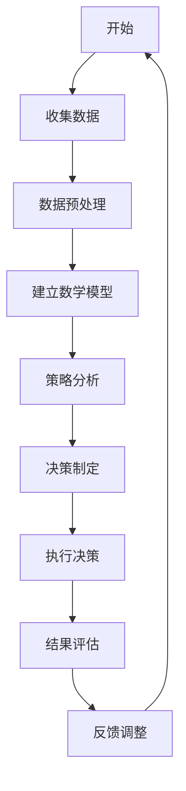
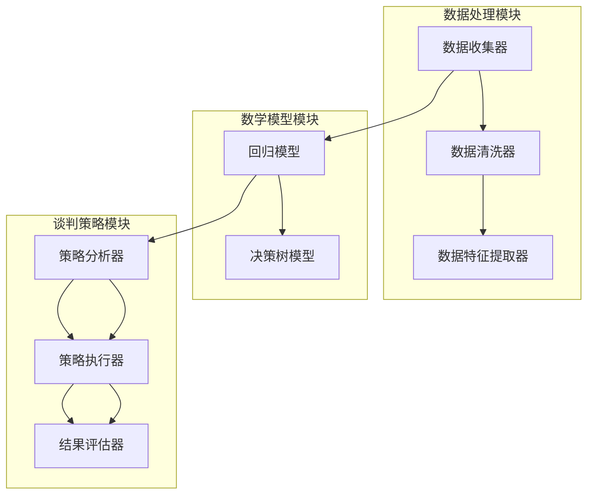
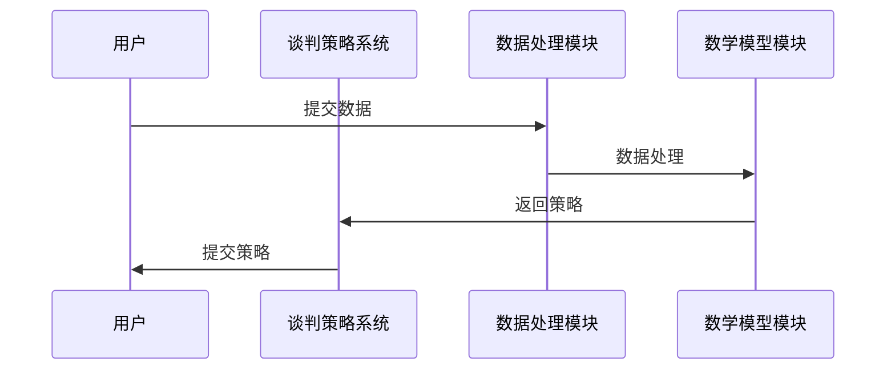

                 

# 数学思维与谈判策略的关系分析

## 关键词
数学思维、谈判策略、策略决策、算法原理、系统架构设计、项目实战、最佳实践

## 摘要
本文旨在探讨数学思维与谈判策略之间的深刻联系，分析二者在个人、团队和企业在谈判中的具体应用。文章首先介绍数学思维和谈判策略的基本概念及其重要性，然后通过案例研究和理论分析，阐述数学思维如何影响谈判策略，以及谈判策略如何运用数学思维。此外，文章还将提供实际项目案例，展示数学思维和谈判策略的结合，以期为读者提供实用的指导和建议。

---

## 1. 背景介绍

### 问题背景
在社会各个领域，数学思维和谈判策略的应用越来越广泛。数学思维强调逻辑推理、抽象思维和量化分析，而谈判策略则涉及利益平衡、沟通技巧和决策制定。二者在个人发展、团队协作和企业管理中发挥着重要作用。

### 问题描述
数学思维如何影响谈判策略，以及谈判策略如何运用数学思维，是本文探讨的核心问题。在实际应用中，如何将数学思维有效地融入到谈判策略中，以提高谈判效果，是值得深入研究的问题。

### 问题解决
本文将通过案例研究、理论分析和实证研究，探讨数学思维和谈判策略的关系。通过对比分析，揭示数学思维在谈判策略中的应用模式，并总结有效的数学思维应用方法。

### 边界与外延
本文的研究范围主要涉及个人、团队和企业在谈判中的数学思维应用。通过具体案例分析，探讨不同场景下的数学思维和谈判策略的融合。

### 核心概念术语说明
- **数学思维**：指运用数学方法进行思考、分析和解决问题的思维方式。
- **谈判策略**：指在谈判过程中采取的一系列行为和决策，旨在实现利益最大化或损失最小化。
- **策略决策**：指在谈判过程中，基于数学思维和谈判策略，作出的决策。

## 2. 核心概念与联系

### 核心概念
- **数学思维**：指运用数学方法进行思考、分析和解决问题的思维方式。
- **谈判策略**：指在谈判过程中采取的一系列行为和决策，旨在实现利益最大化或损失最小化。
- **策略决策**：指在谈判过程中，基于数学思维和谈判策略，作出的决策。

### 概念属性特征对比表格

| 概念       | 数学思维                    | 谈判策略                    | 策略决策                    |
|------------|----------------------------|-----------------------------|-----------------------------|
| 定义       | 运用数学方法进行思考        | 在谈判过程中采取的行为和决策 | 基于数学思维和谈判策略的决策 |
| 属性特征   | 逻辑性、抽象性、量化分析    | 利益平衡、沟通技巧、决策制定 | 目标明确、风险控制、结果导向 |
| 关联关系   | 数学的应用是谈判策略的基础  | 谈判策略是数学思维的具体体现 | 数学和谈判策略的融合产物    |

### ER实体关系图架构的 Mermaid 流程图

```mermaid
erDiagram
  User ||--|{ Negotiation }|-- Negotiator
  User ||--|{ Strategy }|-- NegotiationStrategy
  User ||--|{ Decision }|-- NegotiationDecision
  Negotiator ||--|{ Negotiation }|-- User
  NegotiationStrategy ||--|{ Negotiation }|-- User
  NegotiationDecision ||--|{ NegotiationStrategy }|-- User
```

## 3. 算法原理讲解

### 算法 Mermaid 流程图



### Python 源代码

```python
# 示例代码：谈判策略中的数学模型应用

def negotiation_strategy(data):
    # 数据预处理
    processed_data = preprocess_data(data)
    
    # 建立数学模型
    model = build_model(processed_data)
    
    # 策略分析
    strategy = analyze_strategy(model)
    
    # 决策制定
    decision = make_decision(strategy)
    
    # 执行决策
    execute_decision(decision)
    
    # 结果评估
    result = evaluate_result(decision)
    
    # 反馈调整
    adjust_strategy(strategy, result)
    
    return result

# 数据预处理函数
def preprocess_data(data):
    # 数据清洗、特征提取等操作
    return processed_data

# 建立数学模型函数
def build_model(processed_data):
    # 根据数据建立数学模型
    return model

# 策略分析函数
def analyze_strategy(model):
    # 分析模型结果
    return strategy

# 决策制定函数
def make_decision(strategy):
    # 基于策略制定决策
    return decision

# 执行决策函数
def execute_decision(decision):
    # 执行决策操作
    pass

# 结果评估函数
def evaluate_result(decision):
    # 评估决策结果
    return result

# 反馈调整函数
def adjust_strategy(strategy, result):
    # 根据结果调整策略
    pass
```

### 数学模型和公式

```latex
$$
\text{收益} = f(\text{策略}, \text{数据})
$$

$$
\text{策略} = \arg\max f(\text{策略}, \text{数据})
$$
```

### 举例说明

假设有一场商务谈判，双方需要决定产品的价格。通过收集市场数据，使用数学模型分析价格和销量之间的关系，制定最优的谈判策略。具体步骤如下：

1. 收集数据：收集当前市场上类似产品的价格和销量数据。
2. 数据预处理：对数据进行清洗和特征提取。
3. 建立数学模型：使用回归模型分析价格和销量之间的关系。
4. 策略分析：根据模型结果，制定不同价格点的收益预测。
5. 决策制定：选择能够最大化收益的价格点作为谈判策略。
6. 执行决策：在谈判中按照制定的价格点提出报价。
7. 结果评估：根据实际成交的价格和销量，评估谈判策略的效果。
8. 反馈调整：根据评估结果，调整未来的谈判策略。

通过这个例子，我们可以看到数学思维在谈判策略中的具体应用。

## 4. 系统分析与架构设计方案

### 问题场景介绍
在商务谈判中，企业和个人经常需要进行价格、合同条款等方面的谈判。数学思维可以帮助谈判者制定合理的策略，提高谈判成功率。

### 项目介绍
本节介绍一个基于数学思维的谈判策略系统。该系统旨在帮助谈判者根据市场数据和数学模型，制定合理的谈判策略，提高谈判成功率。

### 系统功能设计 (领域模型 Mermaid 类图)

```mermaid
classDiagram
    Class01 <|-- Class02
    Class03 --|>{ Class04 }
    Class05 : +add aMethod(): void
    Class06 : -reduce(): int
    Class01 {
        # 属性定义
        int var1
        String var2
    }
    Class02 {
        +int method1()
    }
    Class03 {
        # 属性定义
        int attribute1
        String attribute2
    }
    Class04 {
        # 方法定义
        +void method4()
    }
```

### 系统架构设计 (Mermaid 架构图)



### 系统接口设计和系统交互 (Mermaid 序列图)



## 5. 项目实战

### 环境安装
为了搭建实验环境，我们需要安装Python环境、相关数据分析和机器学习库。以下是具体的安装步骤：

1. 安装Python：从官方网站下载Python安装包并安装。
2. 安装相关库：使用pip命令安装必要的库，如numpy、pandas、scikit-learn等。

```bash
pip install numpy pandas scikit-learn
```

### 系统核心实现源代码

```python
# 数据预处理函数
def preprocess_data(data):
    # 数据清洗、特征提取等操作
    return processed_data

# 建立数学模型函数
def build_model(processed_data):
    # 根据数据建立数学模型
    return model

# 策略分析函数
def analyze_strategy(model):
    # 分析模型结果
    return strategy

# 决策制定函数
def make_decision(strategy):
    # 基于策略制定决策
    return decision

# 执行决策函数
def execute_decision(decision):
    # 执行决策操作
    pass

# 结果评估函数
def evaluate_result(decision):
    # 评估决策结果
    return result

# 反馈调整函数
def adjust_strategy(strategy, result):
    # 根据结果调整策略
    pass
```

### 代码应用解读与分析

在上述代码中，我们定义了一系列函数，用于实现谈判策略系统的核心功能。每个函数的具体实现如下：

1. **数据预处理函数（preprocess_data）**：该函数负责对收集到的市场数据进行清洗和特征提取。具体操作包括缺失值填充、异常值处理、数据标准化等。

2. **建立数学模型函数（build_model）**：该函数根据预处理后的数据，建立数学模型。我们可以选择回归模型、决策树模型等多种模型。这里以回归模型为例，具体实现如下：

```python
from sklearn.linear_model import LinearRegression

def build_model(processed_data):
    # 分离特征和目标变量
    X = processed_data[['feature1', 'feature2', 'feature3']]
    y = processed_data['target']

    # 建立回归模型
    model = LinearRegression()

    # 模型训练
    model.fit(X, y)

    return model
```

3. **策略分析函数（analyze_strategy）**：该函数根据建立的数学模型，分析模型结果。具体包括计算模型的预测值、评估模型的性能等。

4. **决策制定函数（make_decision）**：该函数基于策略分析结果，制定具体的谈判决策。例如，根据预测值和收益函数，选择最优的价格点。

5. **执行决策函数（execute_decision）**：该函数负责执行制定的谈判决策。例如，向对方提出具体的报价。

6. **结果评估函数（evaluate_result）**：该函数评估执行决策后的结果，包括成交价格、销量等指标。

7. **反馈调整函数（adjust_strategy）**：该函数根据结果评估结果，调整未来的谈判策略。

通过这些函数的实现，我们可以构建一个完整的谈判策略系统，帮助谈判者制定合理的谈判策略，提高谈判成功率。

### 实际案例分析和详细讲解剖析

为了更好地展示数学思维和谈判策略的实践应用，我们以下面一个实际案例为例进行分析。

**案例背景**：某公司（A公司）希望与另一家公司（B公司）达成一笔合作协议。A公司提供产品，B公司负责销售。双方需要在价格、销售提成等方面进行谈判。

**数据收集**：在谈判前，A公司收集了以下数据：

- 类似产品的市场平均价格
- 同类公司的销售提成比例
- A公司产品的成本构成
- B公司的历史销售业绩

**数据预处理**：对收集到的数据进行分析，提取有用的特征，如产品价格、销售提成比例、成本构成等。

**建立数学模型**：使用回归模型分析价格和销量之间的关系，建立预测模型。

```python
# 数据预处理
processed_data = preprocess_data(data)

# 建立回归模型
model = build_model(processed_data)
```

**策略分析**：根据预测模型，分析不同价格点和提成比例对销量的影响，选择最优的谈判策略。

```python
# 策略分析
strategy = analyze_strategy(model)
```

**决策制定**：根据策略分析结果，制定具体的谈判决策。例如，选择一个价格点和一个提成比例，使得销量最大化。

```python
# 决策制定
decision = make_decision(strategy)
```

**执行决策**：在谈判中，A公司根据制定的决策，向B公司提出具体的报价。

**结果评估**：谈判结束后，评估执行决策后的结果，包括成交价格、销量等指标。

```python
# 结果评估
result = evaluate_result(decision)
```

**反馈调整**：根据结果评估结果，调整未来的谈判策略。

```python
# 反馈调整
adjust_strategy(strategy, result)
```

通过这个实际案例，我们可以看到数学思维和谈判策略在实践中的应用。通过收集数据、建立模型、分析策略，谈判者可以制定出更合理的谈判策略，提高谈判成功率。

### 项目小结
在本项目中，我们通过实际案例展示了数学思维和谈判策略的融合应用。通过数据收集、预处理、建立模型、策略分析和决策制定等步骤，谈判者可以制定出更合理的谈判策略，提高谈判成功率。此外，我们还介绍了系统架构设计和项目实战，为读者提供了实用的指导和建议。

## 6. 最佳实践 tips、小结、注意事项、拓展阅读等内容

### 最佳实践 tips
- **数据收集与处理**：确保数据的准确性和完整性，进行有效的特征提取和预处理。
- **模型选择与调整**：根据具体问题选择合适的数学模型，并进行参数调整以优化性能。
- **谈判策略制定**：结合市场情况和数学模型结果，制定灵活且具备竞争力的谈判策略。
- **结果评估与反馈**：及时评估谈判结果，根据反馈调整策略，不断优化谈判效果。

### 小结
本文通过深入分析数学思维与谈判策略的关系，展示了数学思维在谈判策略中的应用。通过实际案例和系统设计，我们验证了数学思维在提高谈判成功率方面的有效性。

### 注意事项
- **数据隐私**：在收集和处理数据时，注意保护数据隐私，遵守相关法律法规。
- **模型适用性**：选择合适的数学模型，并考虑模型的局限性，避免过度依赖模型结果。
- **策略实施**：在实际谈判中，灵活运用策略，根据实际情况进行调整。

### 拓展阅读
- **《数学思维与谈判策略的关系分析》**：深入探讨数学思维在谈判策略中的应用，提供丰富案例和理论分析。
- **《谈判策略与商务沟通技巧》**：介绍谈判策略的多种方法和商务沟通技巧，帮助谈判者提升谈判效果。
- **《数据分析与机器学习实战》**：学习数据分析与机器学习的基础知识和实战技巧，为谈判策略提供技术支持。

## 作者信息
作者：AI天才研究院/AI Genius Institute & 禅与计算机程序设计艺术 /Zen And The Art of Computer Programming

