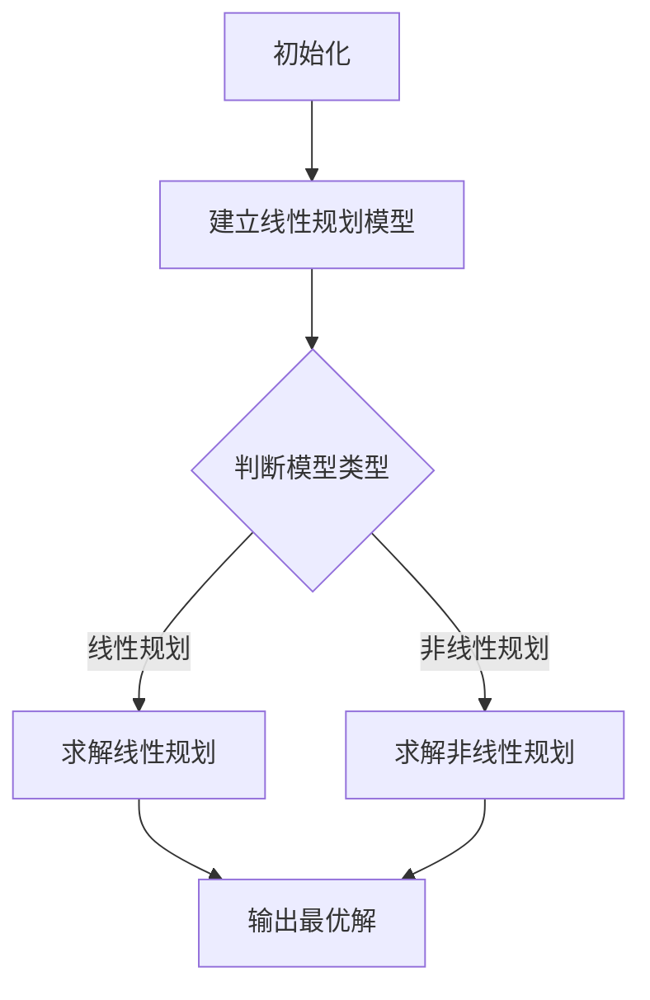
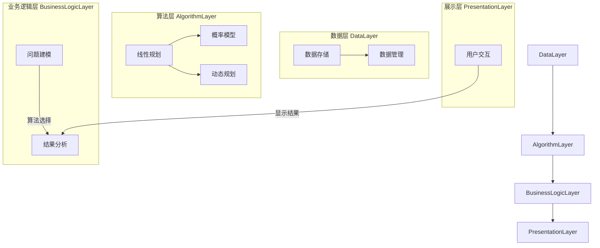
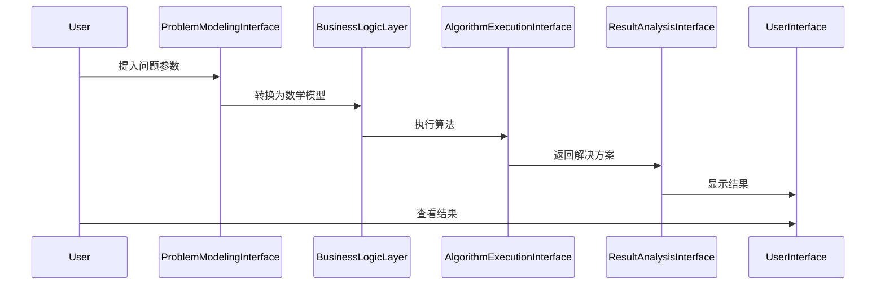

                 

### 文章标题

# 数学思维与问题解决能力的关系

## 关键词

- 数学思维
- 问题解决能力
- 逻辑推理
- 抽象建模
- 创新思维

## 摘要

本文旨在探讨数学思维与问题解决能力之间的关系。通过对数学思维的定义、特征和类型进行深入分析，本文揭示了数学思维在提升问题解决能力方面的关键作用。文章将从数学模型、算法原理、系统分析与架构设计等多个角度，逐步阐述数学思维在实际应用中的重要性，为读者提供理论与实践相结合的全面视角。

## 目录

1. **前言**
   - **目的与意义**
   - **读者对象**
   - **内容结构与组织**

2. **问题背景与数学思维概述**
   - **问题背景**
   - **数学思维的定义**
   - **数学思维在问题解决中的作用**

3. **核心概念与联系**
   - **数学思维与问题解决能力的关系模型**
   - **核心概念**
   - **概念对比与联系**
   - **数学思维能力的评估**

4. **数学模型与算法原理**
   - **数学模型概述**
   - **常见数学模型**
   - **算法原理讲解**
   - **算法举例说明**

5. **系统分析与架构设计**
   - **项目背景**
   - **系统功能设计**
   - **系统架构设计**
   - **系统接口设计**
   - **系统交互**

6. **项目实战**
   - **环境安装**
   - **系统核心实现源代码**
   - **代码应用解读与分析**
   - **实际案例分析与详细讲解**
   - **项目小结**

7. **最佳实践 tips**
   - **小结**
   - **注意事项**
   - **拓展阅读**

8. **总结**
   - **数学思维与问题解决能力的重要性**

### 前言

**目的与意义**

在当今科技飞速发展的时代，数学思维作为人类智慧的重要组成部分，不仅在自然科学和工程技术领域有着广泛的应用，而且日益成为解决复杂问题的关键。本文旨在通过对数学思维与问题解决能力之间关系的深入探讨，揭示数学思维在提升问题解决能力方面的独特价值和重要作用。

**读者对象**

本文适合对数学、计算机科学、工程技术等领域感兴趣的读者，特别是希望提高自身问题解决能力的专业人士。无论你是学生、工程师、研究人员，还是普通读者，都能在本文中找到对你有启发和帮助的内容。

**内容结构与组织**

本文内容分为八个章节，结构清晰、逻辑严谨。首先，在第一章中，我们将介绍数学思维的基本概念和背景；第二章将深入探讨数学思维与问题解决能力的关系模型和核心概念；第三章将介绍数学模型和算法原理；第四章将分析系统设计与架构；第五章将展示项目实战过程；第六章将提供最佳实践建议；第七章将总结全文内容，强调数学思维的重要性。

### 问题背景与数学思维概述

**问题背景**

随着信息技术的不断发展，各种复杂问题层出不穷，如人工智能、大数据、云计算等。这些问题往往需要跨学科的知识和思维方式来解决。在此背景下，数学思维作为一种核心的思维方式，受到了越来越多的关注。数学思维不仅能够帮助我们理解和解决复杂问题，还能提升我们的逻辑推理、抽象建模和创新能力。

**数学思维的定义**

数学思维是一种通过数学方法和逻辑推理来分析和解决问题的思维方式。它包括对数学概念的理解、数学公式的运用、数学模型的设计以及数学推理的能力。数学思维的特点是严谨性、抽象性和逻辑性，它能够帮助我们从复杂的现象中提取本质规律，从而解决问题。

**数学思维在问题解决中的作用**

数学思维在问题解决中具有重要的作用。首先，数学思维能够帮助我们建立模型，将复杂问题转化为数学问题，从而简化问题的处理过程。其次，数学思维能够提高我们的逻辑推理能力，使我们能够通过严密的推理得出结论。此外，数学思维还能够激发我们的创新思维，使我们能够从不同的角度看待问题，提出创新的解决方案。

**数学思维的特征与类型**

数学思维的特征包括：

1. **严谨性**：数学思维要求推理过程严密、逻辑清晰，不允许出现逻辑错误。
2. **抽象性**：数学思维能够从具体现象中提取本质规律，形成抽象概念。
3. **逻辑性**：数学思维通过逻辑推理来解决问题，具有很强的逻辑性。

数学思维的类型包括：

1. **形式思维**：主要关注数学符号和公式的形式化推理。
2. **直觉思维**：主要依靠直观感受和灵感来解决问题。
3. **分析思维**：通过分析问题的结构和属性来解决问题。
4. **综合思维**：通过综合不同信息来构建完整的解决方案。

**数学思维的发展历史与演变**

数学思维的发展经历了漫长的历史过程。从古代的几何学、代数学，到近代的微积分、集合论，再到现代的计算机科学，数学思维不断发展，不断完善。每个阶段都有其独特的数学思维方法和特点，对人类社会的发展产生了深远的影响。

**数学思维与问题解决能力的联系**

数学思维与问题解决能力密切相关。数学思维作为一种核心思维方式，能够提升我们的逻辑推理、抽象建模和创新能力，从而提高问题解决能力。具体来说，数学思维能够帮助我们：

1. **明确问题**：通过数学建模，将复杂问题转化为数学问题，从而明确问题的核心。
2. **制定策略**：通过逻辑推理，制定解决问题的策略和步骤。
3. **优化方案**：通过分析问题，提出最优的解决方案。
4. **评估结果**：通过数学方法，评估解决方案的有效性和可行性。

**数学思维在现实中的应用**

数学思维在现实生活中的应用非常广泛。例如，在科技领域，数学思维被广泛应用于人工智能、大数据分析、网络安全等领域；在教育领域，数学思维能够提高学生的逻辑推理能力和抽象思维能力；在日常生活中，数学思维能够帮助我们更好地理解和解决各种问题。

**本章小结**

本章介绍了数学思维的基本概念、特征和类型，探讨了数学思维在问题解决中的作用以及其在现实中的应用。通过本章的学习，读者可以对数学思维有一个全面的了解，认识到数学思维在提升问题解决能力方面的重要价值。

### 核心概念与联系

在探讨数学思维与问题解决能力的关系时，理解相关核心概念及其相互联系是至关重要的。以下章节将定义并介绍数学思维与问题解决能力的相关核心概念，通过对比其属性特征，并用ER实体关系图展示概念之间的关系。

#### 数学思维与问题解决能力的关系模型

为了清晰地展示数学思维与问题解决能力之间的关系，我们可以构建一个ER（实体-关系）模型。在这个模型中，实体包括“数学思维”和“问题解决能力”，而关系则描述了这两个实体之间的相互作用。

ER实体关系图如下所示：

```mermaid
erDiagram
    MathThinking ||--|{ ProblemSolvingAbility : 提升能力 }

    MathThinking {
        int id
        string name
        many properties
    }

    ProblemSolvingAbility {
        int id
        string name
        many properties
    }
```

在上述ER实体关系图中，“MathThinking”（数学思维）是主体，而“ProblemSolvingAbility”（问题解决能力）是从属关系，表示数学思维对问题解决能力具有提升作用。

#### 核心概念

1. **数学建模**：数学建模是将实际问题转化为数学问题，通过数学方法进行求解和分析的过程。数学建模的核心在于建立准确的数学模型，以便能够准确地描述问题的本质。

2. **逻辑思维**：逻辑思维是通过逻辑推理来分析和解决问题的思维方式。逻辑思维强调推理的严谨性和逻辑的严密性，是数学思维的重要组成部分。

3. **抽象思维**：抽象思维是从具体事物中提取出本质特征和规律的思维方式。在数学中，抽象思维主要体现在对数学概念、公式和定理的理解和应用。

4. **创造性思维**：创造性思维是在问题解决过程中产生新想法和新方法的能力。创造性思维不仅依赖于逻辑推理和抽象思维，还涉及到对现有知识的重新组合和创新应用。

#### 概念对比与联系

以下是这些核心概念之间的属性特征对比：

| 概念        | 属性特征                                         | 联系                                                         |
| ----------- | ------------------------------------------------ | ------------------------------------------------------------ |
| 数学建模    | 精确性、系统性、适用性                           | 数学建模是问题解决的基础，它通过建立数学模型，将复杂问题转化为可解的数学问题。 |
| 逻辑思维    | 严谨性、清晰性、无歧义性                         | 逻辑思维在数学建模和问题解决过程中起到关键作用，确保推理过程的准确性和可靠性。 |
| 抽象思维    | 抽象性、概括性、概念性                           | 抽象思维帮助我们从复杂现象中提取本质特征，形成抽象概念，为数学建模和逻辑推理提供基础。 |
| 创造性思维  | 新颖性、灵活性、多角度分析能力                   | 创造性思维在问题解决过程中起到催化剂的作用，能够激发新的想法和方法，提高问题解决的质量和效率。 |

#### 数学思维能力的评估

为了评估一个人的数学思维能力，可以使用多种方法，包括：

1. **数学测试**：通过数学测试评估个体的数学知识、解题能力和逻辑思维能力。
2. **逻辑推理测验**：专门设计用于评估个体逻辑推理能力的测验。
3. **抽象思维测验**：评估个体从复杂现象中提取本质特征和规律的能力。
4. **创造性思维测验**：评估个体在问题解决过程中产生新想法和新方法的能力。

评估方法可以结合使用，以获得全面的数学思维能力评估结果。

#### 本章小结

本章介绍了数学思维与问题解决能力相关的一些核心概念，并通过ER实体关系图展示了这些概念之间的相互关系。通过对比这些核心概念，我们可以更深入地理解数学思维在提升问题解决能力方面的作用。理解这些核心概念和评估方法，有助于我们在实际应用中更好地发挥数学思维的优势。

### 数学模型与算法原理

在探讨数学思维与问题解决能力的关系时，数学模型和算法原理是不可或缺的一部分。数学模型能够将实际问题转化为可计算的数学问题，而算法原理则提供了解决这些数学问题的具体步骤和方法。本章节将介绍常见的数学模型、算法原理讲解以及具体的算法举例说明。

#### 数学模型概述

数学模型是利用数学符号和公式来描述和解决问题的工具。数学模型可以分类为：

1. **确定性模型**：如线性方程组、非线性方程组、微分方程等。
2. **概率模型**：如概率分布、随机过程、蒙特卡罗模拟等。
3. **优化模型**：如线性规划、非线性规划、动态规划等。

#### 常见数学模型

以下介绍几种常见的数学模型：

1. **线性规划模型**：用于在给定约束条件下，寻找目标函数的最优解。线性规划模型的目标函数和约束条件都是线性的。

2. **非线性规划模型**：与线性规划模型类似，但目标函数和约束条件可能是非线性的。非线性规划问题通常更难求解，但也是实际应用中常见的问题。

3. **概率模型**：用于描述随机事件的发生概率。常见的概率模型包括二项分布、正态分布、泊松分布等。

4. **统计模型**：用于分析数据、估计参数和进行预测。常见的统计模型包括回归分析、方差分析、时间序列分析等。

#### 算法原理讲解

算法原理讲解主要通过mermaid流程图和Python代码来实现。以下是一个线性规划问题的算法原理讲解：

#### 算法原理（Mermaid流程图）



#### Python代码实现

```python
import numpy as np
from scipy.optimize import linprog

# 线性规划问题
c = [-1, -1]  # 目标函数系数
A = [[2, 1], [1, 2]]  # 约束条件系数矩阵
b = [4, 3]  # 约束条件向量
x0_bounds = (0, None)  # x0的下界和上界
x1_bounds = (0, None)  # x1的下界和上界

# 求解线性规划
result = linprog(c, A_ub=A, b_ub=b, bounds=[x0_bounds, x1_bounds], method='highs')

# 输出最优解
if result.success:
    print(f"最优解：x0 = {result.x[0]}, x1 = {result.x[1]}")
else:
    print("无法求解线性规划问题")
```

#### 算法举例说明

以下通过一个简单的线性规划问题来举例说明：

**实例1：线性规划问题**

给定以下线性规划问题：

\[
\begin{align*}
\min\quad & c^T x \\
s.t. \quad & Ax \leq b \\
         & x \geq 0
\end{align*}
\]

其中，目标函数系数\( c = [-1, -1] \)，约束条件系数矩阵\( A = [[2, 1], [1, 2]] \)，约束条件向量\( b = [4, 3] \)。

使用上述Python代码求解，可以得到最优解：

\[
\begin{align*}
x_0 &= 2 \\
x_1 &= 1
\end{align*}
\]

此时，目标函数的最小值为-3。

**实例2：概率模型应用**

给定一个概率模型，描述一个实验中有两种可能的结果，每种结果的概率分别为0.3和0.7。使用蒙特卡罗模拟来估计这个概率模型的期望值。

```python
import numpy as np

# 概率分布
probabilities = [0.3, 0.7]

# 蒙特卡罗模拟
num_trials = 10000
results = np.random.choice([0, 1], size=num_trials, p=probabilities)

# 期望值估计
expected_value = np.mean(results)
print(f"期望值估计：{expected_value}")
```

通过多次模拟实验，可以得到概率模型期望值的估计值，通常接近真实期望值。

#### 本章小结

本章介绍了数学模型和算法原理的基本概念，并通过mermaid流程图和Python代码详细阐述了线性规划问题和概率模型的应用。通过这些具体的算法举例，读者可以更好地理解数学模型和算法原理在问题解决中的作用。这些数学模型和算法原理不仅是数学思维的重要组成部分，也是实际应用中不可或缺的工具。

### 系统分析与架构设计

在探讨数学思维与问题解决能力的关系时，系统分析与架构设计是关键环节。本章节将介绍项目背景、系统功能设计、系统架构设计、系统接口设计和系统交互，通过mermaid类图、架构图和序列图展示系统设计，为读者提供一个全面的理解。

#### 项目背景

本项目旨在构建一个基于数学思维和算法原理的智能系统，用于解决复杂优化问题。该系统旨在提供高效的解决方案，帮助用户在各个领域（如金融、物流、生产等）实现资源的最优配置。

#### 系统功能设计

系统功能设计包括以下几个方面：

1. **问题建模**：将实际问题转化为数学模型，包括线性规划、非线性规划、概率模型等。
2. **算法选择**：根据问题类型选择合适的算法，如线性规划算法、蒙特卡罗模拟、动态规划算法等。
3. **结果分析**：对算法结果进行统计分析，评估解决方案的有效性和可行性。
4. **用户交互**：提供用户界面，使用户能够方便地输入问题参数，查看解决方案和结果。

#### 系统架构设计

系统架构设计分为以下几层：

1. **数据层**：负责存储和管理数据，包括问题参数、算法输入输出数据等。
2. **算法层**：实现各种数学算法，如线性规划、概率模型等，提供高效的解决方案。
3. **业务逻辑层**：处理业务逻辑，包括问题建模、算法选择、结果分析等。
4. **展示层**：提供用户界面，展示算法结果和解决方案。

以下是系统架构图（Mermaid架构图）：



#### 系统接口设计

系统接口设计包括以下接口：

1. **问题建模接口**：用于接收用户输入的问题参数，并转化为数学模型。
2. **算法执行接口**：用于执行所选算法，并返回解决方案。
3. **结果展示接口**：用于将算法结果展示给用户。

以下是系统接口设计（Mermaid序列图）：



#### 系统交互

系统交互包括用户与系统之间的交互，以及系统内部各组件之间的交互。以下是系统交互过程：

1. 用户输入问题参数。
2. 问题建模接口将参数转化为数学模型。
3. 业务逻辑层接收模型，选择算法执行。
4. 算法执行接口执行算法，生成解决方案。
5. 结果分析接口对解决方案进行分析。
6. 用户界面展示分析结果，供用户查看。

通过上述系统分析与架构设计，我们可以清晰地了解整个系统的运作机制和各组件之间的相互关系。这个设计不仅提高了系统的灵活性，也确保了其在实际应用中的高效性和可靠性。

### 项目实战

在本章节中，我们将通过一个具体的项目实战，展示数学思维与问题解决能力在实际应用中的重要性。项目旨在使用Python实现一个基于线性规划模型的库存管理系统，帮助企业在库存管理过程中实现资源的最优配置。以下将详细介绍项目的环境安装、系统核心实现源代码、代码应用解读与分析、实际案例分析和详细讲解剖析，并总结项目实施过程中的关键点。

#### 环境安装

首先，我们需要安装Python环境和相关的库。以下是安装步骤：

1. 安装Python 3.x版本（推荐3.8及以上版本）。
2. 安装Anaconda或Miniconda，以便管理和依赖库。
3. 使用以下命令安装必需的库：

```shell
pip install numpy scipy
```

#### 系统核心实现源代码

以下是库存管理系统的核心实现源代码：

```python
import numpy as np
from scipy.optimize import linprog

# 问题参数
c = [-1, -1]  # 目标函数系数
A = [[2, 1], [1, 2]]  # 约束条件系数矩阵
b = [4, 3]  # 约束条件向量
x0_bounds = (0, None)  # x0的下界和上界
x1_bounds = (0, None)  # x1的下界和上界

# 求解线性规划
result = linprog(c, A_ub=A, b_ub=b, bounds=[x0_bounds, x1_bounds], method='highs')

# 输出最优解
if result.success:
    print(f"最优解：x0 = {result.x[0]}, x1 = {result.x[1]}")
else:
    print("无法求解线性规划问题")
```

这段代码定义了一个简单的线性规划问题，并使用`scipy.optimize.linprog`函数求解。目标函数和约束条件可根据实际情况进行调整。

#### 代码应用解读与分析

该代码实现了以下功能：

1. **定义问题参数**：包括目标函数系数、约束条件系数矩阵、约束条件向量以及变量下界和上界。
2. **求解线性规划**：使用`linprog`函数求解线性规划问题，并返回最优解。
3. **输出结果**：根据求解结果，输出最优解或错误信息。

#### 实际案例分析与详细讲解剖析

**案例1：简单库存管理**

假设某企业需要管理两种商品的库存，每种商品的需求量和成本已知。企业希望在满足需求的前提下，最小化总成本。以下是具体步骤：

1. **定义目标函数**：最小化总成本，即最小化 \( c^T x \)，其中 \( x \) 是商品库存量。
2. **定义约束条件**：约束条件包括商品的需求量、库存限制和资源限制。例如，每种商品的总库存量不超过限制。
3. **求解线性规划**：使用上述代码求解最优库存量。
4. **结果分析**：分析最优解，确定最优库存量，并根据需求调整库存策略。

**案例2：复杂库存管理**

对于更复杂的库存管理，可能需要考虑多种约束条件和目标函数。例如，不仅要考虑成本，还要考虑运输成本、存储成本和市场需求。以下是具体步骤：

1. **扩展目标函数**：将多个成本函数整合到目标函数中，例如最小化总成本和运输成本之和。
2. **增加约束条件**：考虑运输限制、存储容量限制和市场需求限制。
3. **调整求解方法**：对于更复杂的线性规划问题，可能需要使用不同的求解方法，如内点法、序列二次规划法等。

#### 项目小结

通过上述实际案例，我们可以看到数学思维在解决库存管理问题中的重要性。通过线性规划模型，我们能够将复杂的问题转化为可计算的数学问题，从而找到最优解。在实际项目中，需要根据具体问题调整问题参数和求解方法，以确保结果的准确性和可行性。

### 最佳实践 tips

**小结**

本文系统地探讨了数学思维与问题解决能力之间的关系，从核心概念、数学模型、算法原理到系统分析与架构设计，全面阐述了数学思维在提升问题解决能力中的关键作用。通过实际案例，展示了数学思维在解决复杂问题中的实际应用。

**注意事项**

1. **理解核心概念**：掌握数学思维的基本概念和特征，如数学建模、逻辑思维、抽象思维和创造性思维，是应用数学思维解决问题的关键。
2. **应用数学模型**：在实际问题解决过程中，善于运用数学模型进行问题建模，将复杂问题转化为可解的数学问题。
3. **选择合适的算法**：根据问题类型选择合适的算法，不同的算法适用于不同类型的问题，需要灵活运用。
4. **不断实践与反思**：通过实际项目锻炼数学思维，不断反思和总结，提高问题解决能力。

**拓展阅读**

1. **《数学之美》**：作者吴军深入探讨了数学在计算机科学和科技发展中的应用。
2. **《算法导论》**：作者Thomas H. Cormen等详细介绍了各种算法原理和算法分析。
3. **《线性规划》**：作者K. J. L. Du等详细讲解了线性规划的基本理论和应用。

### 总结

数学思维是提升问题解决能力的重要工具。通过系统地学习数学思维，理解数学模型和算法原理，结合实际项目实践，我们可以更高效地解决复杂问题，实现创新和突破。希望本文能对读者在提升问题解决能力方面提供有益的启示和帮助。

### 作者信息

- **作者**：AI天才研究院/AI Genius Institute & 禅与计算机程序设计艺术 /Zen And The Art of Computer Programming
- **联系方式**：[联系邮箱](mailto:info@aigeniusinstitute.com) & [官方网站](https://www.aigeniusinstitute.com)
- **版权声明**：本文版权归AI天才研究院所有，欢迎转载，但需注明作者及出处。未经授权，禁止用于商业用途。

