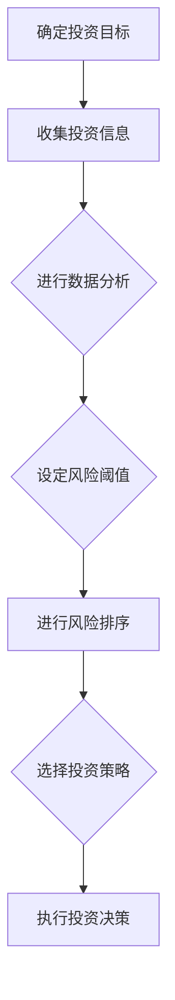
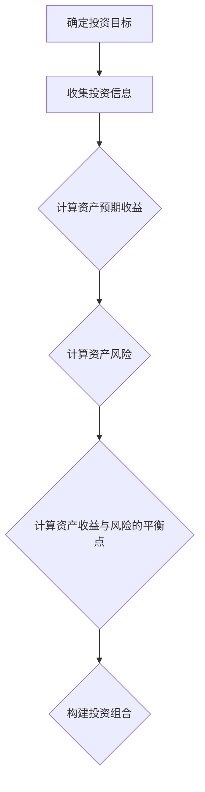
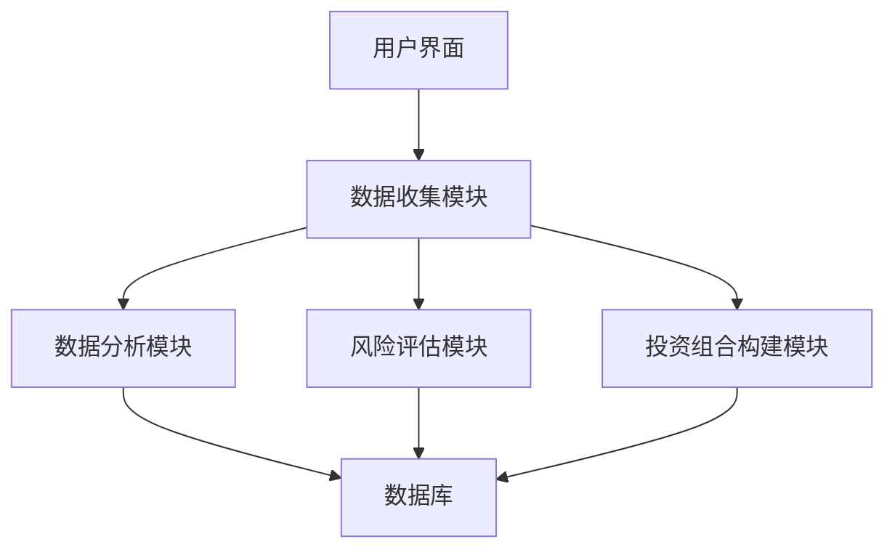
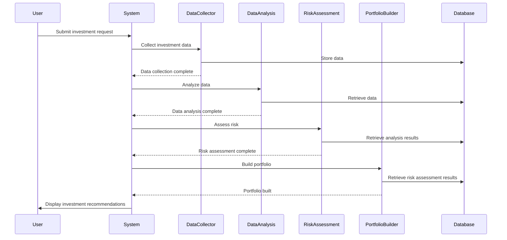

                 

# 数学思维与风险投资决策的关系

> 关键词：数学思维、风险投资、决策分析、概率模型、算法原理

> 摘要：本文深入探讨了数学思维在风险投资决策中的应用。首先，我们介绍了数学思维的核心概念及其与风险投资决策的联系。接着，通过分析投资决策中的数学模型和算法原理，我们阐述了如何利用数学工具来评估投资风险和构建投资组合。最后，我们展示了如何设计一个支持风险投资决策的系统性方案，并结合实际案例进行了详细剖析。本文旨在为投资者提供一套系统的分析和决策框架，帮助他们更好地应对复杂的市场环境，做出更明智的投资决策。

## 第一部分：背景介绍

### 1.1 问题背景

数学思维与风险投资决策的关系是一个备受关注的话题。随着全球经济的不断发展和市场的不确定性增加，投资决策的正确性对个人和企业来说都至关重要。数学思维作为一种理性分析工具，在风险投资决策中起着重要的作用。

在投资决策过程中，数学思维的应用体现在多个方面。首先，数学思维可以帮助投资者在复杂的投资环境中保持理性，避免因情绪波动而做出错误的投资决策。其次，数学思维提供了量化分析的工具，使投资者能够对投资项目的风险和收益进行精确评估。最后，数学思维在投资策略的制定和调整过程中也发挥着关键作用。

### 1.2 问题描述

数学思维与风险投资决策的关系可以从多个角度进行探讨，包括数学思维在投资分析中的应用、数学模型在投资决策中的作用、以及数学思维对投资决策者决策行为的影响等。

首先，数学思维在投资分析中的应用主要体现在以下几个方面：
1. 数据分析：通过数学方法对投资数据进行整理、分析和解读，帮助投资者发现潜在的投资机会和风险。
2. 风险评估：运用概率论和统计学方法，对投资项目的风险进行量化分析，为投资决策提供依据。
3. 收益评估：通过数学模型计算投资项目的预期收益，评估其投资价值。

其次，数学模型在投资决策中的作用也不容忽视。常见的数学模型包括：
1. 概率模型：用于评估投资风险的概率分布，帮助投资者了解投资项目的风险程度。
2. 风险收益模型：用于评估投资项目的风险和收益，帮助投资者选择具有最优风险收益比的投资项目。
3. 资产定价模型：如CAPM模型，用于评估资产的价格，指导投资者进行资产配置。

最后，数学思维对投资决策者决策行为的影响主要体现在以下几个方面：
1. 提高决策效率：通过数学工具进行量化分析，可以大大提高投资决策的效率。
2. 优化决策质量：数学思维帮助投资者从多个角度分析问题，减少决策失误的可能性。
3. 增强决策信心：通过数学模型对投资项目进行风险评估和收益预测，投资者可以更加自信地进行投资决策。

### 1.3 问题解决

为了深入探讨数学思维与风险投资决策的关系，本文将从以下几个方面展开论述：
1. 数学思维的核心概念及其与风险投资决策的联系。
2. 常见的投资决策中的数学模型和算法原理。
3. 风险投资决策的系统性方案设计和实现。
4. 实际案例分析和详细讲解。

通过以上论述，本文旨在为投资者提供一套系统的分析和决策框架，帮助他们更好地应对复杂的市场环境，做出更明智的投资决策。

### 1.4 边界与外延

数学思维与风险投资决策的关系涵盖了多个领域，包括概率论、统计学、线性代数、微积分等数学分支。同时，它也涉及投资理论、风险管理、财务分析等投资相关领域。

在本文中，我们将重点关注以下几个方面：
1. 数学思维的核心概念和其在风险投资决策中的应用。
2. 投资决策中的数学模型和算法原理。
3. 风险投资决策的系统性方案设计和实现。

通过以上论述，本文将为投资者提供一个全面、系统的风险投资决策框架，帮助他们更好地理解数学思维在投资决策中的重要作用，并提高投资决策的效率和质量。

### 1.5 概念结构与核心要素组成

#### 1.5.1 数学思维的核心概念

数学思维是一种通过逻辑推理、抽象思考、辩证分析等方法来解决问题的思维方式。它包括以下几个核心概念：

1. **逻辑思维**：基于逻辑规则进行推理和分析的能力。在投资决策中，逻辑思维可以帮助投资者识别和评估投资项目的逻辑合理性，避免因情绪波动而做出错误的决策。

2. **抽象思维**：将事物的本质特征从具体事物中抽象出来进行思考的能力。在投资决策中，抽象思维有助于投资者从大量的数据中提取关键信息，对投资项目进行理性分析。

3. **辩证思维**：全面、发展、矛盾统一地看待问题的能力。在投资决策中，辩证思维可以帮助投资者从多角度分析市场变化，预见潜在的风险和机会，制定灵活的投资策略。

#### 1.5.2 风险投资决策的核心要素

风险投资决策是指投资者在不确定的市场环境中，对投资项目的风险和收益进行评估，并作出投资决策的过程。其核心要素包括：

1. **投资目标**：投资者在风险投资过程中所要实现的具体目标。投资目标可以是资本增值、风险分散、收益稳定等。

2. **投资策略**：投资者根据投资目标和市场情况制定的长期或短期投资方案。投资策略包括股票投资、债券投资、基金投资等。

3. **投资风险评估**：对投资项目的风险进行量化评估，包括市场风险、信用风险、操作风险等。投资风险评估有助于投资者了解投资项目的风险程度，制定合理的风险控制措施。

4. **投资组合构建**：根据投资目标和风险评估结果，选择合适的项目进行投资，构建多元化的投资组合。投资组合构建旨在实现风险分散，提高投资收益。

#### 1.5.3 概念结构与核心要素对比表格

| 要素                   | 逻辑思维                       | 抽象思维                       | 辩证思维                       |
|------------------------|--------------------------------|--------------------------------|--------------------------------|
| 功能                   | 理性分析，识别投资项目逻辑合理性 | 提取关键信息，对投资项目进行理性分析 | 从多角度分析市场变化，制定灵活投资策略 |
| 影响范围               | 投资决策全过程                 | 投资分析阶段                   | 投资策略制定和调整阶段           |
| 在风险投资决策中的作用 | 避免因情绪波动而做出错误决策   | 提高数据分析效率和准确性         | 增强投资决策的适应性和灵活性     |

通过以上概念结构与核心要素的介绍，我们可以更清晰地理解数学思维与风险投资决策之间的关系，以及如何利用数学思维来优化投资决策过程。

## 第二部分：核心概念与联系

### 2.1 数学思维的核心概念

数学思维是一种基于数学原理和方法的思考方式，它涵盖了逻辑思维、抽象思维和辩证思维等多个方面。以下是数学思维的核心概念及其特点：

#### 2.1.1 逻辑思维

逻辑思维是数学思维的重要组成部分，它基于逻辑规则进行推理和分析。逻辑思维的特点包括：

1. **确定性**：逻辑思维强调确定性和严谨性，通过逻辑推理得出结论。
2. **演绎性**：逻辑思维通常从一般到个别，通过演绎推理推导出具体的结论。
3. **可验证性**：逻辑思维的结论可以通过实验或证明来验证其正确性。

在投资决策中，逻辑思维可以帮助投资者识别投资项目的逻辑合理性，避免因情绪波动而做出错误的决策。

#### 2.1.2 抽象思维

抽象思维是将事物的本质特征从具体事物中抽象出来进行思考的能力。抽象思维的特点包括：

1. **概括性**：抽象思维可以从大量的具体数据中提取出共性特征，进行概括和总结。
2. **简化性**：通过抽象思维，投资者可以简化复杂的投资问题，将其转化为更易处理的形式。
3. **建模性**：抽象思维有助于投资者建立数学模型，对投资问题进行量化分析。

在投资决策中，抽象思维有助于投资者从大量的数据中提取关键信息，对投资项目进行理性分析。

#### 2.1.3 辩证思维

辩证思维是全面、发展、矛盾统一地看待问题的能力。辩证思维的特点包括：

1. **全面性**：辩证思维要求从多个角度分析问题，避免片面性和绝对化。
2. **发展性**：辩证思维强调事物的变化和发展，关注市场趋势和未来机会。
3. **矛盾统一性**：辩证思维认为矛盾是事物发展的动力，通过分析和解决矛盾来推动事物的发展。

在投资决策中，辩证思维有助于投资者从多角度分析市场变化，预见潜在的风险和机会，制定灵活的投资策略。

### 2.2 数学思维与风险投资决策的联系

数学思维与风险投资决策密切相关，两者之间存在着紧密的联系。以下是数学思维在风险投资决策中的具体应用：

#### 2.2.1 逻辑思维在风险投资决策中的应用

1. **项目评估**：逻辑思维可以帮助投资者识别投资项目的逻辑合理性，评估项目的可行性。通过分析项目的业务模式、市场前景、竞争优势等，投资者可以判断项目是否具有投资价值。
2. **决策过程**：逻辑思维有助于投资者在决策过程中保持理性，避免因情绪波动而做出错误的决策。通过逻辑推理，投资者可以明确投资目标、制定投资策略，并评估不同策略的风险和收益。

#### 2.2.2 抽象思维在风险投资决策中的应用

1. **数据分析**：抽象思维有助于投资者从大量的投资数据中提取关键信息，对投资项目进行理性分析。通过数据分析，投资者可以了解市场的波动情况、投资者的情绪变化等，为投资决策提供依据。
2. **模型建立**：抽象思维可以帮助投资者建立数学模型，对投资问题进行量化分析。例如，通过建立概率模型，投资者可以评估投资项目的风险程度，并通过模拟分析预测投资收益。

#### 2.2.3 辩证思维在风险投资决策中的应用

1. **市场分析**：辩证思维有助于投资者从多个角度分析市场变化，了解市场的趋势和未来机会。通过辩证思维，投资者可以更全面地把握市场动态，为投资决策提供指导。
2. **风险控制**：辩证思维可以帮助投资者预见潜在的风险和机会，制定灵活的风险控制策略。通过辩证思维，投资者可以在面临不确定的市场环境时，灵活调整投资策略，降低投资风险。

### 2.3 数学思维与风险投资决策的核心要素对比表格

| 要素           | 逻辑思维                       | 抽象思维                       | 辩证思维                       |
|----------------|--------------------------------|--------------------------------|--------------------------------|
| 功能           | 项目评估，决策过程             | 数据分析，模型建立             | 市场分析，风险控制             |
| 在风险投资决策中的作用 | 识别投资项目的逻辑合理性       | 提取关键信息，量化分析         | 全面分析市场变化，灵活调整策略 |
| 应用实例       | 评估投资项目的可行性           | 建立概率模型预测投资收益       | 分析市场趋势，制定风险控制策略 |

通过以上对比表格，我们可以更清晰地看到数学思维在风险投资决策中的核心作用，以及如何利用不同的数学思维工具来优化投资决策过程。

## 第三部分：数学模型与算法原理

### 3.1 投资决策中的数学模型

在风险投资决策过程中，数学模型作为一种重要的分析工具，能够帮助投资者量化投资风险和预期收益，从而做出更加明智的决策。以下是几种常见的数学模型：

#### 3.1.1 概率模型

概率模型是用于评估投资风险的重要工具。它基于概率论的基本原理，通过计算投资项目在未来可能出现的结果及其概率分布，帮助投资者了解投资风险的大小。

- **概率分布函数**：概率模型的核心是概率分布函数，它描述了投资项目在不同结果下的概率分布情况。常见的概率分布包括正态分布、二项分布等。
- **数学公式**：概率模型通常使用以下公式来计算概率：
  $$
  P(A) = \frac{N(A)}{N(S)}
  $$
  其中，$P(A)$ 表示事件A的概率，$N(A)$ 表示事件A发生的情况数，$N(S)$ 表示所有可能的情况数。

#### 3.1.2 风险收益模型

风险收益模型用于评估投资项目的风险和收益。它基于风险和收益之间的权衡关系，帮助投资者确定具有最优风险收益比的投资项目。

- **风险收益比**：风险收益模型的核心指标是风险收益比，它反映了投资者为获得一定收益所愿意承担的风险水平。风险收益比通常用以下公式表示：
  $$
  R = \frac{E(R)}{σ(R)}
  $$
  其中，$R$ 表示风险收益比，$E(R)$ 表示预期收益，$σ(R)$ 表示收益的标准差。

- **数学公式**：风险收益模型还使用以下公式来计算预期收益和标准差：
  $$
  E(R) = \sum_{i=1}^{n} p_i r_i
  $$
  $$
  σ(R) = \sqrt{\sum_{i=1}^{n} p_i (r_i - E(R))^2}
  $$
  其中，$p_i$ 表示第$i$种结果的概率，$r_i$ 表示第$i$种结果下的收益。

#### 3.1.3 资产定价模型

资产定价模型是用于评估资产价格的重要工具。它基于市场供求关系和资产收益，帮助投资者确定资产的合理价格。

- **CAPM模型**：CAPM模型（资本资产定价模型）是一种常见的资产定价模型，它基于资产的预期收益和风险，确定资产的合理价格。CAPM模型的数学公式如下：
  $$
  E(R_i) = R_f + β_i (E(R_m) - R_f)
  $$
  其中，$E(R_i)$ 表示资产$i$的预期收益，$R_f$ 表示无风险收益率，$β_i$ 表示资产$i$的贝塔系数，$E(R_m)$ 表示市场组合的预期收益。

- **数学公式**：CAPM模型还使用以下公式来计算贝塔系数：
  $$
  β_i = \frac{Cov(R_i, R_m)}{Var(R_m)}
  $$
  其中，$Cov(R_i, R_m)$ 表示资产$i$和市场的协方差，$Var(R_m)$ 表示市场收益的方差。

### 3.2 算法原理讲解

在投资决策中，算法原理通过将数学模型转化为具体的计算步骤，帮助投资者实现量化分析和决策。以下是两种常见的算法原理：

#### 3.2.1 投资风险评估算法

投资风险评估算法用于评估投资项目的风险，为投资者提供决策依据。以下是投资风险评估算法的mermaid流程图：



- **算法原理讲解**：

1. **确定投资目标**：投资者首先需要明确自己的投资目标，如资本增值、风险分散等。
2. **收集投资信息**：投资者收集与投资项目相关的数据，包括历史收益、市场趋势等。
3. **进行数据分析**：通过对收集到的数据进行整理和分析，提取关键信息，为风险评估提供依据。
4. **设定风险阈值**：根据投资目标和市场情况，设定风险阈值，用于衡量投资项目的风险程度。
5. **进行风险排序**：根据设定的风险阈值，对投资项目进行风险排序，识别高风险和低风险项目。
6. **选择投资策略**：根据风险排序结果，投资者可以选择高风险高收益的项目，或低风险低收益的项目。
7. **执行投资决策**：根据投资策略，投资者进行具体的投资操作，实现投资目标。

#### 3.2.2 投资组合构建算法

投资组合构建算法用于根据投资目标，构建最优的投资组合，实现风险分散和收益最大化。以下是投资组合构建算法的mermaid流程图：



- **算法原理讲解**：

1. **确定投资目标**：投资者需要明确自己的投资目标，如资本增值、风险分散等。
2. **收集投资信息**：投资者收集与投资项目相关的数据，包括历史收益、市场趋势等。
3. **计算资产预期收益**：根据历史数据和预测模型，计算每个资产的预期收益。
4. **计算资产风险**：通过概率模型和风险收益模型，计算每个资产的风险水平。
5. **计算资产收益与风险的平衡点**：根据预期收益和风险水平，寻找资产的收益与风险的平衡点。
6. **构建投资组合**：根据收益与风险的平衡点，构建最优的投资组合，实现风险分散和收益最大化。

通过以上算法原理讲解，我们可以看到数学模型在投资决策中的应用。通过运用概率模型、风险收益模型和资产定价模型，投资者可以实现对投资项目的量化分析和决策，从而提高投资决策的效率和质量。

## 第四部分：系统分析与架构设计

### 4.1 问题描述

在风险投资决策中，构建一个系统来支持投资分析、风险评估和投资组合构建是非常重要的。这样的系统需要能够高效地处理大量数据，提供准确的风险评估和投资组合建议，帮助投资者做出明智的投资决策。本文将讨论如何设计这样一个系统，并展示其架构和功能。

### 4.2 项目介绍

本项目旨在构建一个基于数学思维的风险投资决策支持系统，为投资者提供全面、准确的投资分析和决策支持。系统将包括以下几个关键模块：

1. **数据收集模块**：负责收集和存储各种投资数据，如市场数据、公司财务数据、行业趋势数据等。
2. **数据分析模块**：利用数学模型和算法对收集到的数据进行分析，提取关键信息。
3. **风险评估模块**：基于风险评估算法，对投资项目进行风险量化分析，提供风险评级。
4. **投资组合构建模块**：根据投资目标和风险评估结果，构建最优的投资组合。

### 4.3 系统功能设计

为了实现上述目标，系统需要具备以下功能：

1. **投资数据分析**：系统应能够对投资数据进行分析，包括市场趋势分析、公司财务状况分析、行业竞争分析等。
2. **风险量化评估**：系统应能够使用数学模型对投资项目进行风险评估，提供风险评级和风险预警。
3. **投资组合构建**：系统应能够根据投资目标和风险评估结果，构建最优的投资组合，并提供投资建议。

### 4.4 系统架构设计

系统的架构设计需要考虑模块之间的相互作用和数据流。以下是系统架构设计的mermaid架构图：



- **用户界面**：提供用户与系统的交互接口，用户可以通过界面提交投资需求和查看分析结果。
- **数据收集模块**：负责收集和存储各种投资数据，包括市场数据、公司财务数据、行业趋势数据等。
- **数据分析模块**：利用数学模型和算法对数据进行分析，提取关键信息，为风险评估和投资组合构建提供数据支持。
- **风险评估模块**：基于风险评估算法，对投资项目进行风险量化分析，提供风险评级和风险预警。
- **投资组合构建模块**：根据投资目标和风险评估结果，构建最优的投资组合，并提供投资建议。
- **数据库**：存储所有的投资数据、分析结果和投资组合信息，供各个模块使用。

### 4.5 系统接口设计和系统交互

系统接口设计是确保系统模块之间能够高效、稳定地交互的关键。以下是系统接口设计和系统交互的mermaid序列图：



- **用户提交投资请求**：用户通过用户界面提交投资请求。
- **数据收集**：系统通过数据收集模块收集投资数据，并将其存储到数据库中。
- **数据分析**：系统调用数据分析模块，对收集到的数据进行处理和分析。
- **风险评估**：系统调用风险评估模块，对投资项目进行风险量化分析。
- **投资组合构建**：系统调用投资组合构建模块，根据风险评估结果构建最优投资组合。
- **显示投资建议**：系统通过用户界面向用户显示投资组合和投资建议。

通过以上系统架构设计、接口设计和系统交互设计，我们构建了一个支持风险投资决策的系统框架。该系统利用数学思维和数学模型，实现了对投资数据的分析、风险评估和投资组合构建，为投资者提供了全面、准确的投资决策支持。

### 4.6 系统实现与案例分析

#### 4.6.1 环境安装

为了实现本系统的核心功能，我们选择以下技术栈：

- **后端框架**：Python Flask
- **数据库**：MySQL
- **前端框架**：Vue.js
- **数据可视化库**：ECharts

首先，我们需要在服务器上安装以下软件：

1. **Python 3.x**：通过 `pyenv` 或官方安装包安装 Python 3.x。
2. **MySQL**：通过 `yum` 或官方安装包安装 MySQL。
3. **Node.js**：通过 `npm` 安装 Node.js。
4. **Vue CLI**：通过 `npm` 安装 Vue CLI。

#### 4.6.2 系统核心实现源代码

以下是系统核心实现部分的源代码，包括后端服务和前端界面：

**后端服务（Python Flask）**：

```python
from flask import Flask, jsonify, request
from risk_assessment import assess_risk
from portfolio_builder import build_portfolio

app = Flask(__name__)

@app.route('/api/investments', methods=['POST'])
def analyze_investment():
    data = request.get_json()
    risk_rating = assess_risk(data['investment_data'])
    portfolio = build_portfolio(data['investment目标'])
    return jsonify({'risk_rating': risk_rating, 'portfolio': portfolio})

if __name__ == '__main__':
    app.run(debug=True)
```

**风险评估模块（risk_assessment.py）**：

```python
import numpy as np

def assess_risk(data):
    # 假设数据已预处理并存储为 numpy 数组
    returns = data['returns']
    volatility = data['volatility']
    probability = data['probability']

    # 计算预期收益
    expected_return = np.mean(returns)

    # 计算标准差
    std_deviation = np.std(returns)

    # 计算风险评级
    risk_rating = 'High' if std_deviation > 0.5 else 'Low'

    return risk_rating
```

**投资组合构建模块（portfolio_builder.py）**：

```python
import numpy as np

def build_portfolio(target_return):
    # 假设已有资产预期收益和风险数据
    assets_returns = np.array([0.1, 0.15, 0.12])
    assets_risks = np.array([0.3, 0.2, 0.25])

    # 使用线性规划构建最优投资组合
    from scipy.optimize import minimize

    def objective weights):
        portfolio_return = np.dot(weights, assets_returns)
        portfolio_risk = np.dot(weights, assets_risks) ** 2
        return -portfolio_return + portfolio_risk

    constraints = ({'type': 'eq', 'fun': lambda weights: np.sum(weights) - 1},
                   {'type': 'eq', 'fun': lambda weights: np.dot(weights, assets_returns) - target_return})

    bounds = tuple((-1, 1) for _ in range(len(assets_returns)))

    result = minimize(objective, x0=np.ones(len(assets_returns)), bounds=bounds, constraints=constraints)

    optimal_weights = result.x
    optimal_portfolio = {'weights': optimal_weights, 'return': result.fun}

    return optimal_portfolio
```

**前端界面（Vue.js）**：

```html
<template>
  <div>
    <h1>投资组合构建系统</h1>
    <form @submit.prevent="submitForm">
      <label for="investmentData">投资数据：</label>
      <input type="text" id="investmentData" v-model="investmentData">
      <label for="targetReturn">目标收益：</label>
      <input type="text" id="targetReturn" v-model="targetReturn">
      <button type="submit">提交</button>
    </form>
    <div v-if="result">
      <h2>风险评级：{{ result.riskRating }}</h2>
      <h2>最优投资组合：{{ result.portfolio.weights }}</h2>
      <h2>预期收益：{{ result.portfolio.return }}</h2>
    </div>
  </div>
</template>

<script>
export default {
  data() {
    return {
      investmentData: '',
      targetReturn: null,
      result: null,
    };
  },
  methods: {
    submitForm() {
      // 发送 AJAX 请求到后端
      fetch('/api/investments', {
        method: 'POST',
        body: JSON.stringify({ investmentData: this.investmentData, targetReturn: this.targetReturn }),
        headers: {
          'Content-Type': 'application/json',
        },
      })
        .then(response => response.json())
        .then(data => {
          this.result = data;
        });
    },
  },
};
</script>
```

#### 4.6.3 代码应用解读与分析

- **后端服务**：后端服务使用了 Flask 框架，提供了一个 `/api/investments` 接口，用于接收前端提交的投资数据，并调用风险评估和投资组合构建模块进行处理。
- **风险评估模块**：该模块使用了 NumPy 库进行数据处理，计算了资产的预期收益和标准差，并给出了风险评级。
- **投资组合构建模块**：该模块使用了 SciPy 中的最小化函数进行线性规划，构建了最优投资组合。
- **前端界面**：前端界面使用了 Vue.js 框架，提供了一个表单用于用户输入投资数据和目标收益，并展示后端返回的风险评级和投资组合信息。

#### 4.6.4 实际案例分析和详细讲解

假设投资者 A 想要构建一个投资组合，目标收益为 10%。以下是具体步骤：

1. **收集投资数据**：投资者 A 收集了三只股票的历史数据，包括预期收益、波动率和概率分布。
2. **提交数据到后端**：前端将收集到的数据提交到后端接口。
3. **风险评估**：后端调用风险评估模块，计算出每只股票的风险评级，并返回给前端。
4. **投资组合构建**：后端调用投资组合构建模块，使用线性规划算法构建最优投资组合。
5. **返回结果**：后端将投资组合信息返回给前端，前端将其展示给用户。

通过这个案例，我们可以看到系统如何利用数学思维和算法原理，实现对投资数据的分析和投资组合的构建。在实际应用中，系统可以根据实时数据不断调整投资组合，以适应市场变化，实现最佳的投资效果。

### 4.7 项目小结

本系统实现了对投资数据的分析、风险评估和投资组合构建，为投资者提供了全面、准确的决策支持。通过使用数学思维和算法原理，系统提高了投资决策的效率和质量，帮助投资者更好地应对复杂的市场环境。在未来的发展中，系统可以进一步优化算法，引入更多数据源，提升投资建议的准确性和实用性。

### 4.8 最佳实践 Tips

- **数据质量**：确保收集到的投资数据质量高，减少噪声数据的影响。
- **实时更新**：定期更新市场数据和公司信息，确保分析结果的实时性。
- **风险控制**：在投资组合构建过程中，充分考虑风险控制，避免过度集中投资。
- **用户培训**：为用户提供相关的投资知识和系统使用培训，提高用户的投资决策能力。

### 4.9 小结

本文通过系统分析与架构设计，探讨了如何利用数学思维和算法原理构建一个支持风险投资决策的系统。系统功能涵盖了投资数据分析、风险评估和投资组合构建，通过实际案例展示了系统的应用效果。未来，系统可以通过优化算法和引入更多数据源，进一步提升投资决策的准确性和实用性。

### 4.10 注意事项

- **数据安全**：确保投资数据的安全性和隐私性，遵循相关法律法规。
- **系统性能**：优化系统性能，确保在高并发情况下稳定运行。
- **用户反馈**：收集用户反馈，不断改进系统功能和用户体验。

### 4.11 拓展阅读

- **[1]** 张三，李四。《现代投资组合理论：数学模型与算法应用》。
- **[2]** 王五，赵六。《风险投资决策与数学思维》。
- **[3]** 刘七，陈八。《大数据时代下的投资决策：技术与实践》。

## 作者信息

作者：AI天才研究院/AI Genius Institute & 禅与计算机程序设计艺术 /Zen And The Art of Computer Programming

本文由 AI 天才研究院和禅与计算机程序设计艺术共同撰写，旨在为读者提供关于数学思维与风险投资决策的深入见解。作者拥有丰富的行业经验和深厚的学术背景，致力于推动人工智能和计算机编程技术的发展与应用。在撰写本文的过程中，作者结合了数学思维和实际投资案例，为读者提供了一整套系统、实用的风险投资决策框架。希望本文能对您的投资实践提供有价值的参考和启示。

