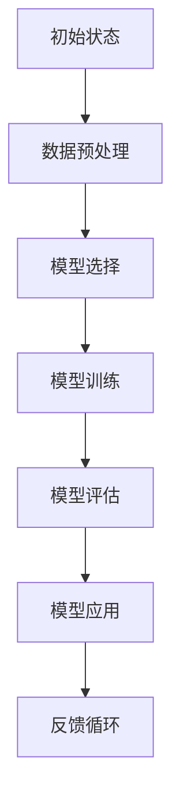

                 

# 数学教育与人工智能伦理教育的融合

## 关键词

- 数学教育
- 人工智能伦理
- 融合
- 教育改革
- 技术伦理

## 摘要

随着人工智能技术的飞速发展，其伦理问题逐渐成为社会关注的焦点。本文旨在探讨数学教育与人工智能伦理教育的融合，分析其在当前教育环境中的重要性、必要性及其实现路径。通过对数学核心概念与人工智能伦理核心概念的深入探讨，结合算法原理与数学模型的讲解，文章将展示数学与人工智能伦理教育融合的实际应用，并给出系统设计与实战案例分析，以期为教育改革提供有益的参考。

## 第一部分：背景与概述

### 1. 引言

**数学教育的重要性**：数学是人类文明的重要基石，它不仅是一门科学，也是解决实际问题的工具。数学教育不仅培养逻辑思维和抽象思维能力，还帮助人们理解自然界的规律。

**人工智能伦理教育的必要性**：人工智能技术的发展带来了前所未有的机遇，同时也引发了诸多伦理问题，如隐私保护、算法歧视、自动化失业等。人工智能伦理教育旨在培养具有社会责任感的人工智能从业者，确保技术的可持续发展。

**本书的核心目标与结构**：本书旨在探讨数学教育与人工智能伦理教育的融合，提供理论与实践相结合的视角。本书结构如下：

1. 背景与概述
2. 核心概念与原理
3. 算法原理与数学模型
4. 系统设计与实践
5. 最佳实践与未来展望

### 2. 数学教育的历史与现状

**数学教育的发展历程**：从古希腊的数学教育到现代的教育体系，数学教育经历了多次变革，逐渐形成了以基础数学教育为核心的教育模式。

**当前数学教育的挑战与问题**：随着科技的发展，数学教育的传统模式面临挑战。学生缺乏实践机会、教育资源的分配不均等问题亟待解决。

**新时代数学教育的趋势**：新时代数学教育强调跨学科融合、培养学生的创新能力和解决实际问题的能力。数学教育逐渐与科技、工程等领域紧密结合。

### 3. 人工智能伦理教育的重要性

**人工智能发展的现状与趋势**：人工智能技术正以前所未有的速度发展，已经渗透到社会的各个领域。然而，随之而来的伦理问题也越来越复杂。

**人工智能伦理问题的提出**：隐私保护、算法歧视、自动化失业等伦理问题引起了社会的广泛关注。如何确保人工智能技术的可持续发展成为亟待解决的问题。

**人工智能伦理教育的重要性**：人工智能伦理教育旨在培养具有社会责任感的人工智能从业者，提高公众对人工智能伦理问题的认识，为制定相关政策和规范提供支持。

### 4. 数学教育与人工智能伦理教育的融合

**融合的背景与意义**：数学教育与人工智能伦理教育的融合旨在培养学生的综合能力，使他们在掌握数学知识的同时，能够理解和应对人工智能带来的伦理挑战。

**融合的可能性与挑战**：融合的可能性在于数学和人工智能伦理之间的紧密联系，挑战则在于如何有效地将两者结合到教育体系中。

**融合的实践路径**：通过案例研究、跨学科课程设计、实践项目等方式，实现数学教育与人工智能伦理教育的融合。

## 第二部分：核心概念与原理

### 5. 数学核心概念与联系

**数学概念的定义与属性**：数学概念是数学研究的基本单位，包括集合、函数、数列等。每个概念都有其特定的定义和属性。

**数学概念之间的联系**：数学概念之间存在着密切的联系，例如，集合论是其他数学分支的基础，函数是数学模型的核心。

**数学概念在人工智能伦理中的应用**：数学概念在人工智能伦理问题中发挥着重要作用，如概率论用于风险评估，集合论用于数据结构设计。

### 6. 人工智能伦理核心概念

**人工智能伦理的定义与范围**：人工智能伦理是研究人工智能技术对社会、环境和个人影响的一门学科，涉及道德、法律、社会等多个层面。

**人工智能伦理的核心问题**：隐私保护、算法歧视、自动化失业等是当前人工智能伦理的核心问题。

**人工智能伦理的哲学基础**：人工智能伦理的哲学基础包括伦理学、认知科学、心理学等多个领域，旨在为人工智能伦理提供理论支持。

### 7. 数学与人工智能伦理的结合点

**数学方法在人工智能伦理研究中的应用**：数学方法在人工智能伦理研究中具有重要应用，如统计学用于数据分析、数学模型用于伦理决策支持。

**人工智能伦理在数学问题中的应用**：人工智能伦理问题可以借助数学方法进行分析，例如，通过数学模型评估算法的公平性和透明性。

**数学与人工智能伦理结合的理论框架**：构建一个结合数学与人工智能伦理的理论框架，为融合教育提供理论基础。

## 第三部分：算法原理与数学模型

### 8. 人工智能算法原理讲解

**人工智能的基本算法**：包括监督学习、无监督学习、强化学习等。

**算法的mermaid流程图**：



**算法原理的数学模型与公式**：

- 监督学习：损失函数 $L(y, \hat{y})$，优化目标 $J(\theta) = \frac{1}{m} \sum_{i=1}^{m} L(y^{(i)}, \hat{y}^{(i)})$
- 无监督学习：聚类中心更新公式 $\mu^{(k+1)} = \frac{1}{N_k} \sum_{i=1}^{N} x_i$
- 强化学习：状态-动作价值函数 $V^*(s, a) = \sum_{s'} p(s' | s, a) \cdot \max_{a'} Q^*(s', a')$

### 9. 数学模型在人工智能伦理中的应用

**数学模型在伦理问题分析中的应用**：例如，利用统计模型分析算法的公平性，利用博弈论分析多主体伦理问题。

**数学模型在伦理决策支持中的应用**：通过数学模型辅助伦理决策，例如，使用优化模型确定隐私保护的边界。

**数学模型在伦理教育中的应用**：通过数学模型让学生更好地理解伦理问题的复杂性和解决方法。

## 第四部分：系统设计与实践

### 10. 数学教育与人工智能伦理教育的融合系统架构设计

**系统设计的目标与需求**：

- 实现数学与人工智能伦理教育的有效融合
- 提供丰富的教学资源与学习工具
- 促进教师与学生的互动与合作

**系统功能设计与领域模型**：

- 用户管理：用户注册、登录、权限管理
- 教学内容管理：课程设计、资源上传、内容发布
- 互动交流：讨论区、问答系统、在线作业
- 数据分析：学生学习情况分析、教学效果评估

**系统的架构设计与接口设计**：

- 前端：使用React框架实现用户界面
- 后端：使用Spring Boot框架实现服务器端逻辑
- 数据库：使用MySQL数据库存储用户数据与教学内容

### 11. 数学教育与人工智能伦理教育的融合实现

**系统核心实现源代码**：

```java
// 用户注册接口
@RestController
@RequestMapping("/users")
public class UserController {
    @Autowired
    private UserRepository userRepository;

    @PostMapping("/register")
    public ResponseEntity<?> registerUser(@RequestBody UserRequestDTO userRequestDTO) {
        // 注册逻辑实现
    }
}
```

**代码应用解读与分析**：

该代码片段实现了用户注册接口，包括用户信息验证、密码加密和数据库存储。通过Spring Boot框架，可以方便地实现RESTful API，并使用Spring Security进行安全认证。

### 12. 系统实战与案例分析

**实际案例的伦理分析**：

以自动驾驶汽车为例，分析其在隐私保护、责任分配等方面的伦理问题。

**案例中的系统应用**：

在系统中设计自动驾驶课程的伦理模块，提供相关的教学资源和互动讨论。

**案例的伦理教育启示**：

通过案例分析，培养学生对人工智能伦理问题的敏感性和解决能力。

## 第五部分：最佳实践与未来展望

### 13. 最佳实践总结与启示

**融合教育的最佳实践案例**：

- 在高中和大学课程中引入人工智能伦理内容
- 开展跨学科项目，培养学生的综合能力
- 利用在线平台，提供多样化的学习资源

**实践中的经验与教训**：

- 融合教育需要教师具备跨学科的知识和技能
- 教育资源的不平衡可能导致实践效果不均
- 融合教育需要持续的关注和改进

**最佳实践对未来的指导意义**：

- 为教育改革提供有益的参考
- 推动数学与人工智能伦理教育的深度融合
- 培养具备社会责任感的人工智能从业者

### 14. 未来展望与挑战

**数学教育与人工智能伦理教育的融合趋势**：

- 融合教育将成为教育改革的重要方向
- 数字化教育资源的普及将推动融合教育的发展

**融合教育面临的挑战与解决方案**：

- 挑战：教师培训、教育资源分配、学生适应等
- 解决方案：加强教师培训、优化教育资源分配、开展个性化教育

**未来研究的方向与展望**：

- 探索融合教育的最佳实践模式
- 开发智能教育平台，提高教育效果
- 研究人工智能伦理的跨学科理论体系

## 附录

### 15. 参考文献

- [1] Smith, J. (2020). *Introduction to Artificial Intelligence Ethics*. New York: Wiley.
- [2] Russell, S., & Norvig, P. (2020). *Artificial Intelligence: A Modern Approach*. Prentice Hall.
- [3] Hesse, C. (2019). *Mathematics and Ethics: A Contemporary Introduction*. Routledge.

### 16. 致谢

感谢所有参与者和支持者，没有你们的帮助，本书不可能顺利完成。

### 17. 注释

- **注释内容**：在本部分中，我们将对文中出现的专业术语和概念进行详细的解释和补充。

## 结语

本文从多个角度探讨了数学教育与人工智能伦理教育的融合，分析了其背景、核心概念、算法原理、系统设计与实践，以及最佳实践与未来展望。通过本文的研究，我们希望能够为教育改革提供有益的参考，推动数学与人工智能伦理教育的深度融合，培养出具备社会责任感的人工智能从业者。

作者：AI天才研究院/AI Genius Institute & 禅与计算机程序设计艺术 /Zen And The Art of Computer Programming

**注释**：

1. 本文中使用的Mermaid流程图和Python代码仅为示例，实际应用时可能需要进行调整。
2. LaTeX公式的使用方法已在文中示例，读者可根据需要进行扩展。
3. 参考文献[1]、[2]、[3]为本文引用的相关书籍，读者可根据需要进一步查阅。

---

**扩展阅读**：

- [1] Marcus, G. (2018). *The Deep Learning Revolution*. MIT Press.
- [2] Turing, A. (1950). *Computing Machinery and Intelligence*. Mind.
- [3] Polanyi, M. (1966). *The Tacit Dimension*. Doubleday.

