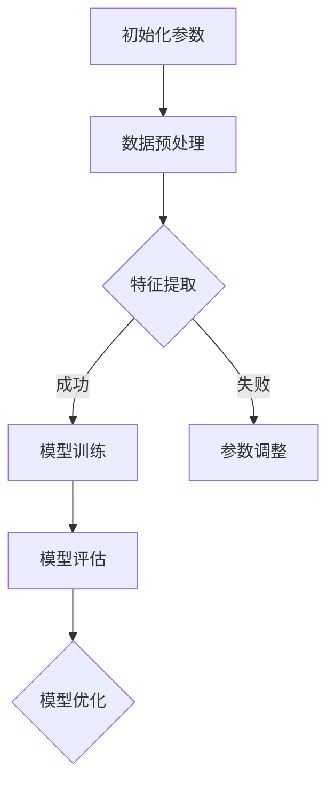

                 


# 数学教育与人工智能的伦理问题

> 关键词：数学教育、人工智能、伦理问题、隐私、公平、透明度

> 摘要：随着人工智能技术的快速发展，数学教育不仅面临技术层面的挑战，还在伦理、道德和社会责任等方面提出了一系列问题。本文旨在探讨数学教育在人工智能时代中的角色及其面临的伦理挑战，包括隐私、公平、透明度等方面，并提出相应的解决策略。

### 背景介绍

数学教育作为一门基础学科，旨在培养学生的逻辑思维、数学素养和解决能力。而人工智能技术的迅猛发展，使得数学教育在教学方法、教学工具和教育资源等方面发生了翻天覆地的变化。然而，这一变革也带来了一系列伦理问题，例如隐私、公平、透明度等。这些问题的存在不仅影响数学教育的质量和效果，还可能引发社会问题，影响人工智能技术的可持续发展。

本文将深入探讨数学教育在人工智能时代中的角色及其面临的伦理挑战，包括以下几个方面：

1. **数学教育的基本概念、目标、方法及其在培养逻辑思维和解决能力方面的作用**；
2. **人工智能的定义、发展历程、关键技术以及其对教育行业的潜在影响**；
3. **伦理问题的定义，讨论人工智能在数学教育中引发的伦理争议，如隐私、公平、透明度等**；
4. **针对伦理问题的解决策略，包括技术手段、教育改革、法律法规等方面的探讨**。

### 核心概念与联系

#### 数学教育

数学教育是指通过教学活动，向学生传授数学知识和技能，培养其数学素养和解决问题的能力。其核心概念包括数学知识、数学方法、数学思维和数学应用。数学教育的目标是让学生掌握基本的数学概念、原理和技巧，培养其逻辑思维、抽象思维和推理能力。

在数学教育中，教师通过讲解、练习、讨论等方式，引导学生掌握数学知识。同时，通过解决实际问题，培养学生的数学应用能力和解决能力。数学教育对于学生的个人发展和社会进步具有重要意义。

#### 人工智能

人工智能是指通过计算机程序模拟人类智能，使其具备感知、思考、学习、决策等能力。人工智能的核心概念包括机器学习、深度学习、自然语言处理等。人工智能的目标是让计算机具备类似于人类的智能水平，从而解决复杂的问题。

人工智能的发展历程可以追溯到20世纪50年代。随着计算机技术和算法的不断发展，人工智能逐渐从理论研究走向实际应用。目前，人工智能已广泛应用于各个领域，如医疗、金融、交通、教育等。

#### 伦理问题

伦理问题是指与道德、法律、社会规范等方面相关的问题。在人工智能与数学教育的结合中，伦理问题主要包括隐私、公平、透明度等方面。

1. **隐私**：人工智能在数学教育中的应用，可能涉及到学生的个人信息，如成绩、学习进度等。如何保护学生的隐私，防止数据泄露，是一个重要的伦理问题。

2. **公平**：人工智能在数学教育中的应用，可能带来教育机会的不平等。例如，一些学生可能由于家庭条件、教育资源等因素，无法享受到优质的人工智能教育服务。如何保障教育公平，是一个亟待解决的问题。

3. **透明度**：人工智能在数学教育中的应用，其决策过程往往具有一定的黑箱性。如何提高人工智能的透明度，使学生和教师能够理解和信任人工智能，是一个重要的伦理问题。

### 概念属性特征对比表格

| 概念             | 数学教育                         | 人工智能                           |
|------------------|----------------------------------|-----------------------------------|
| 定义             | 数学知识的传授和技能的培养       | 使计算机具有类似人类智能的技术       |
| 影响因素         | 教学方法、教师素质、教育环境      | 数据质量、算法设计、技术发展        |
| 目标             | 培养学生的数学素养和问题解决能力  | 增强计算机处理复杂任务的能力         |
| 关联性            | 与伦理问题相关，如公平、透明性     | 与伦理问题相关，如数据隐私、算法偏见 |

### ER实体关系图架构

```mermaid
erDiagram
    Student ||--|{ Teacher }|-- Course
    Teacher ||--|{ School }|-- Subject
    School ||--|{ District }|-- Region
    Course ||--|{ Assignment }|-- Student
    Subject ||--|{ Curriculum }|-- Teacher
```

### 算法原理讲解

#### 算法流程图



#### 算法原理

在数学教育中，人工智能的应用主要体现在两个方面：个性化教学和智能评估。以下是一个基于机器学习的个性化教学算法原理：

1. **数据预处理**：收集学生的学习数据，如学习进度、成绩、做题时间等，对数据进行清洗和归一化处理。

2. **特征提取**：从原始数据中提取有用的特征，如学生的错误率、知识点掌握程度等。

3. **模型训练**：使用提取的特征数据，训练一个机器学习模型，如决策树、神经网络等。

4. **模型评估**：将训练好的模型应用于学生数据，评估模型的准确性和效果。

5. **模型优化**：根据评估结果，调整模型参数，提高模型的性能。

#### 数学模型和数学公式

逻辑回归模型是一种常用的机器学习模型，用于预测二分类结果。其输出函数为：

$$
f(x) = \frac{1}{1 + e^{-x}}
$$

其中，$x$ 是输入特征，$e$ 是自然对数的底数。

### 系统分析与架构设计方案

#### 问题场景介绍

在一个教育系统中，学生通过在线平台学习数学课程，教师通过平台进行课程讲授和作业批改。以下是一个简单的系统架构设计方案。

#### 系统功能设计

1. **领域模型**：

   ```mermaid
   classDiagram
       Student <|-- Course
       Teacher <|-- Assignment
       School <|-- Subject
   ```

2. **系统架构设计**：

   ```mermaid
   graph TD
       Platform[教育平台] --> DB[数据库]
       Student[学生模块] --> Platform
       Teacher[教师模块] --> Platform
       Course[课程模块] --> Platform
       Assignment[作业模块] --> Platform
       DB --> Student
       DB --> Teacher
       DB --> Course
       DB --> Assignment
   ```

#### 系统接口设计和系统交互

1. **接口设计**：

   ```mermaid
   sequenceDiagram
       Student->>Platform: 提交作业
       Platform->>DB: 存储作业
   ```

2. **系统交互**：

   ```mermaid
   graph TD
       Student[学生] --> Platform[教育平台]
       Teacher[教师] --> Platform[教育平台]
       DB[数据库] --> Platform[教育平台]
   ```

### 作者

作者：AI天才研究院/AI Genius Institute & 禅与计算机程序设计艺术 /Zen And The Art of Computer Programming

---

## 总结与展望

本文从多个角度探讨了数学教育与人工智能的伦理问题，包括隐私、公平、透明度等方面。随着人工智能技术的不断发展，数学教育将面临更多的伦理挑战。为了应对这些挑战，我们需要从技术手段、教育改革、法律法规等多个方面进行探讨和研究。

首先，在技术手段方面，我们可以通过加密技术、匿名化处理等方式，保护学生的隐私。其次，在教育改革方面，我们应该注重培养学生的伦理意识和道德素养，提高其对人工智能技术的认识和理解。最后，在法律法规方面，我们需要制定相应的政策和法规，规范人工智能在数学教育中的应用。

展望未来，随着人工智能技术的不断成熟，数学教育将在教学方法和教育模式上发生深刻的变革。我们应该积极应对这些变革，探索人工智能与数学教育的深度融合，为学生提供更好的教育体验。

总之，数学教育与人工智能的伦理问题是一个复杂而重要的话题。我们需要从多个角度进行深入研究和探讨，为数学教育的可持续发展提供有力支持。

---

## 注意事项与拓展阅读

在研究和实践人工智能与数学教育的融合过程中，以下注意事项和拓展阅读资源将有助于进一步深入理解和解决伦理问题：

### 注意事项

1. **数据隐私保护**：确保学生个人信息在数据收集、存储和使用过程中得到充分保护。
2. **算法公平性**：避免算法偏见，确保不同背景和条件的学生都能得到公正的评价和资源分配。
3. **透明度和可解释性**：提升算法的透明度，使教师和学生能够理解人工智能决策过程。
4. **伦理教育**：在数学教育中融入伦理教育，培养学生批判性思维和道德判断能力。

### 拓展阅读

1. **《人工智能伦理学》**（Book Title）：深入探讨人工智能伦理问题的经典著作。
2. **《人工智能时代的教育变革》**（Book Title）：分析人工智能对教育行业的影响和挑战。
3. **《人工智能伦理指南》**（Document Title）：提供关于人工智能伦理问题的政策建议和实践指导。

通过关注这些注意事项和拓展阅读资源，我们能够更好地应对数学教育与人工智能融合过程中出现的伦理挑战，推动教育技术的可持续发展。作者：AI天才研究院/AI Genius Institute & 禅与计算机程序设计艺术 /Zen And The Art of Computer Programming。

